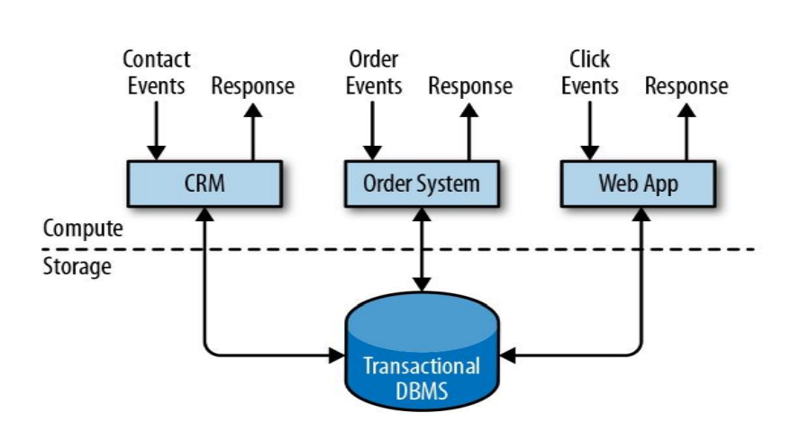

# Flink 流处理简介

## Flink 是什么

• Apache Flink is a framework and distributed processing engine  for stateful computations over unbounded and bounded data  streams. 

• Apache Flink 是一个框架和分布式处理引擎，用于对无界和有界数 据流进行状态计算。

## Flink 的全球热度

## Flink 目前在国内企业的应用

## 为什么选择 Flink

• 流数据更真实地反映了我们的生活方式 

• 传统的数据架构是基于有限数据集的 

• 目标 

- 低延迟 
- 高吞吐 
- 结果的准确性和良好的容错性

## 哪些行业需要处理流数据

• 电商和市场营销 

- 数据报表、广告投放、业务流程需要 

• 物联网（IOT） 

- 传感器实时数据采集和显示、实时报警，交通运输业
- 电信业 
- 基站流量调配 

• 银行和金融业 

- 实时结算和通知推送，实时检测异常行为

## 传统数据处理架构

• 事务处理

• 分析处理

-  将数据从业务数据库复制到数仓，再进行分析和查询

* 有状态的流式处理

## 流处理的演变

• lambda 架构

- 用两套系统，同时保证低延迟和结果准确

## 流处理的演变

## Flink 的主要特点

• 事件驱动（Event-driven）

• 基于流的世界观

- 在 Flink 的世界观中，一切都是由流组成的，离线数据是有界的流；
- 实时数据是一个没有界限的流：这就是所谓的有界流和无界 流

• 分层API

- 越顶层越抽象，表达含义越简明，使用越方便
- 越底层越具体，表达能力越丰富，使用越灵活

## Flink 的其它特点

• 支持事件时间（event-time）和处理时间（processing-time） 语义 

• 精确一次（exactly-once）的状态一致性保证 

• 低延迟，每秒处理数百万个事件，毫秒级延迟 

• 与众多常用存储系统的连接 

• 高可用，动态扩展，实现7*24小时全天候运

## Flink vs Spark Streaming

• 流（stream）和微批（micro-batching）

• 数据模型 

– spark 采用 RDD 模型，spark streaming 的 DStream 实际上也就是一组 组小批 数据 RDD 的集合 

– flink 基本数据模型是数据流，以及事件（Event）序列 

• 运行时架构 

– spark 是批计算，将 DAG 划分为不同的 stage，一个完成后才可以计算下一个 

– flink 是标准的流执行模式，一个事件在一个节点处理完后可以直接发往下一个节 点进行处理

