# Flink 运行架构

## Flink 运行时的组件

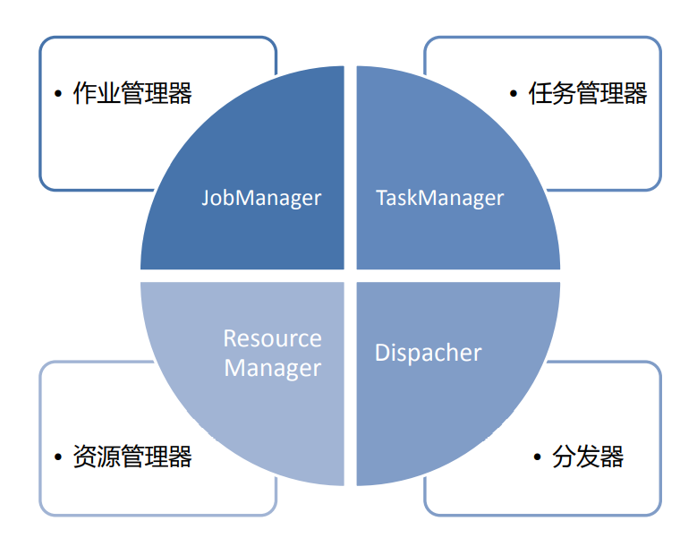

## 作业管理器（JobManager）

• 控制一个应用程序执行的主进程，也就是说，每个应用程序都会被一个不同的 JobManager 所控制执行。 

• JobManager 会先接收到要执行的应用程序，这个应用程序会包括：作业图 （JobGraph）、逻辑数据流图（logical dataflow graph）和打包了所有的类、 库和其它资源的JAR包。 

• JobManager 会把JobGraph转换成一个物理层面的数据流图，这个图被叫做 “执行图”（ExecutionGraph），包含了所有可以并发执行的任务。 

• JobManager 会向资源管理器（ResourceManager）请求执行任务必要的资源， 也就是任务管理器（TaskManager）上的插槽（slot）。一旦它获取到了足够的 资源，就会将执行图分发到真正运行它们的TaskManager上。而在运行过程中， JobManager会负责所有需要中央协调的操作，比如说检查点（checkpoints） 的协调。

## 任务管理器（TaskManager）

• Flink中的工作进程。通常在Flink中会有多个TaskManager运行，每一 个TaskManager都包含了一定数量的插槽（slots）。插槽的数量限制 了TaskManager能够执行的任务数量。 

• 启动之后，TaskManager会向资源管理器注册它的插槽；收到资源管理 器的指令后，TaskManager就会将一个或者多个插槽提供给 JobManager调用。JobManager就可以向插槽分配任务（tasks）来 执行了。 

• 在执行过程中，一个TaskManager可以跟其它运行同一应用程序的 TaskManager交换数据。

## 资源管理器（ResourceManager）

• 主要负责管理任务管理器（TaskManager）的插槽（slot）， TaskManger 插槽是Flink中定义的处理资源单元。 

• Flink为不同的环境和资源管理工具提供了不同资源管理器，比如YARN、 Mesos、K8s，以及standalone部署。 

• 当JobManager申请插槽资源时，ResourceManager会将有空闲插槽 的TaskManager分配给JobManager。如果ResourceManager没有足 够的插槽来满足JobManager的请求，它还可以向资源提供平台发起会 话，以提供启动TaskManager进程的容器。

## 分发器（Dispatcher）

• 可以跨作业运行，它为应用提交提供了REST接口。 

• 当一个应用被提交执行时，分发器就会启动并将应用移交给一个 JobManager。 

• Dispatcher也会启动一个Web UI，用来方便地展示和监控作业 执行的信息。 

• Dispatcher在架构中可能并不是必需的，这取决于应用提交运行 的方式。

## 任务提交流程

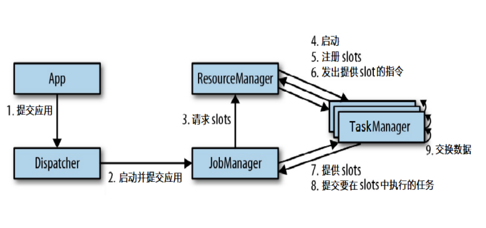

## 任务提交流程（YARN）

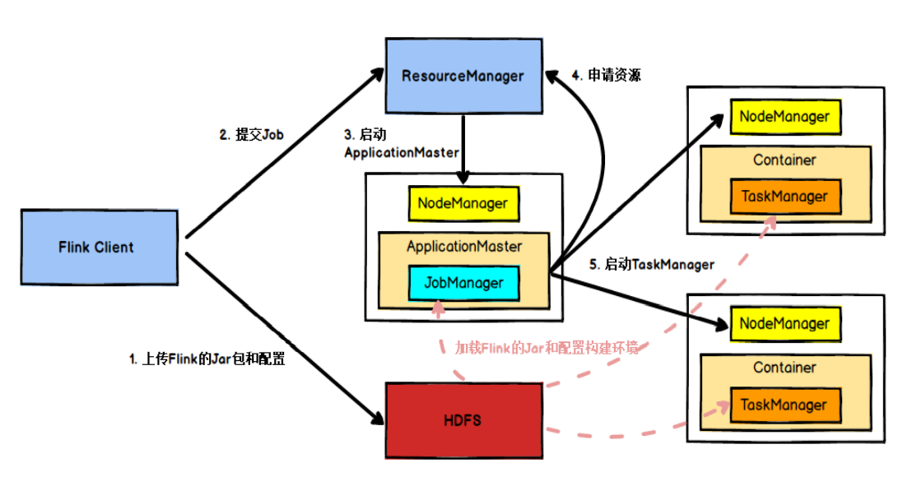

## 任务调度原理

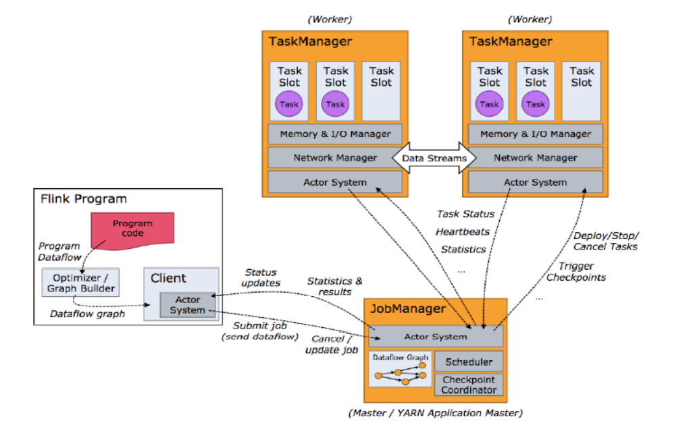

## 并行度（Parallelism）

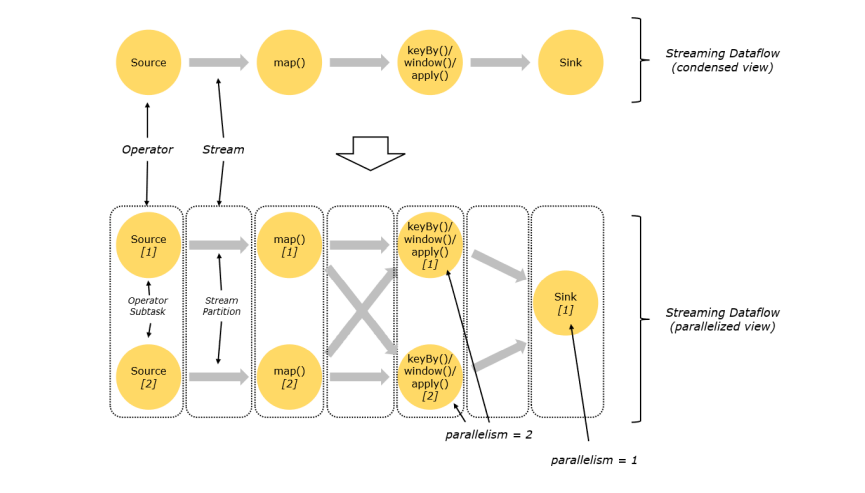

• 一个特定算子的 子任务（subtask）的个数被称之为其并行度（parallelism）。 一般情况下，一个 stream 的并行度，可以认为就是其所有算子中最大的并行度。

## TaskManager 和 Slots

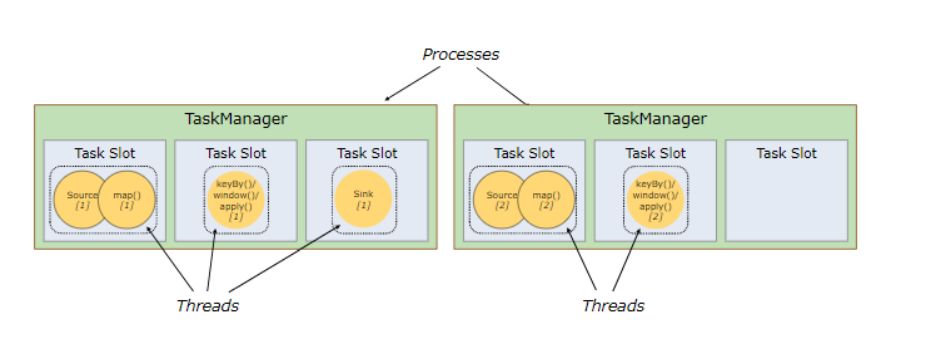

• Flink 中每一个 TaskManager 都是一个JVM进程，它可能会在独立的线程上执 行一个或多个子任务 

• 为了控制一个 TaskManager 能接收多少个 task， TaskManager 通过 task  slot 来进行控制（一个 TaskManager 至少有一个 slot）

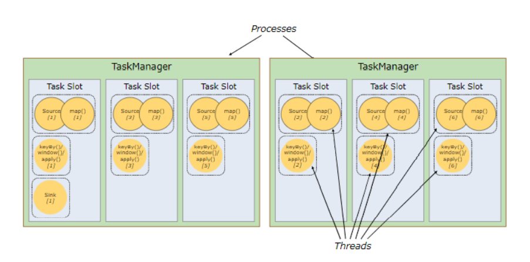

• 默认情况下，Flink 允许子任务共享 slot，即使它们是不同任务的子任务。 这样 的结果是，一个 slot 可以保存作业的整个管道。 

• Task Slot 是静态的概念，是指 TaskManager 具有的并发执行能力

## 并行子任务的分配

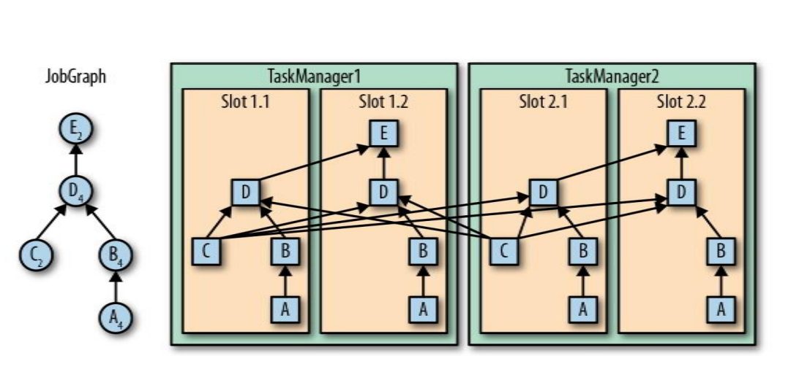

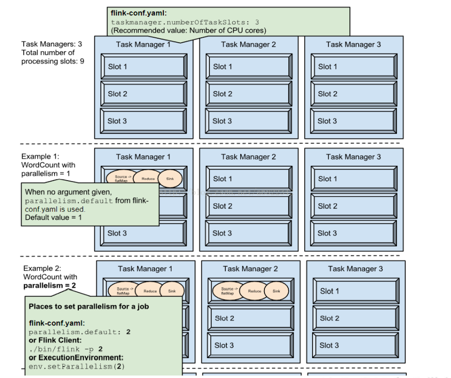

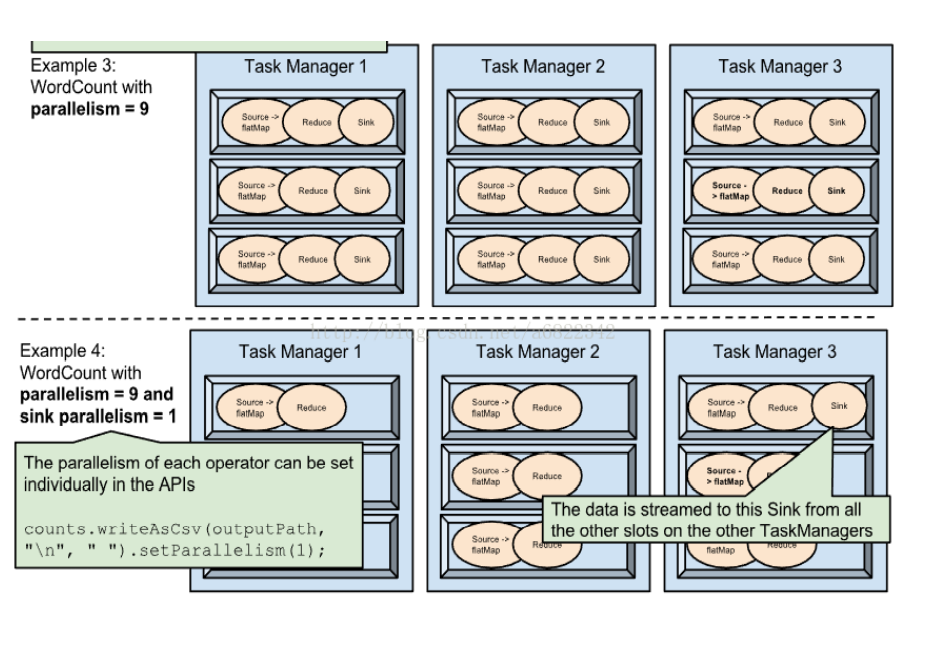

## 程序与数据流（DataFlow）

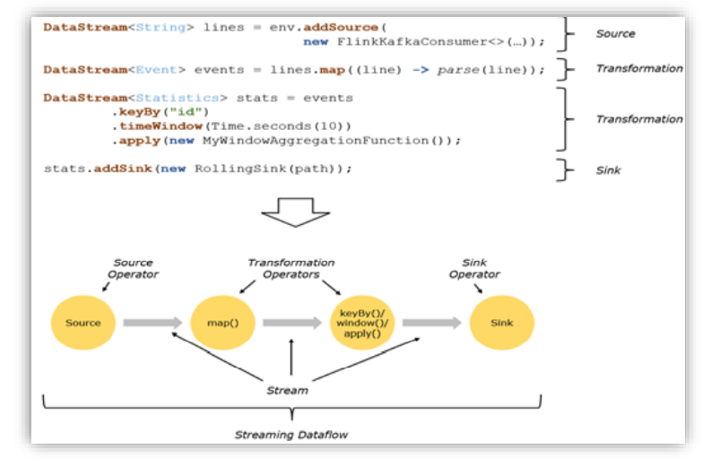

• 所有的Flink程序都是由三部分组成的： Source 、Transformation 和 Sink。 

• Source 负责读取数据源，Transformation 利用各种算子进行处理加工，Sink  负责输出

• 在运行时，Flink上运行的程序会被映射成“逻辑数据流”（dataflows），它包 含了这三部分 

• 每一个dataflow以一个或多个sources开始以一个或多个sinks结束。dataflow 类似于任意的有向无环图（DAG） 

• 在大部分情况下，程序中的转换运算（transformations）跟dataflow中的算子 （operator）是一一对应的关系

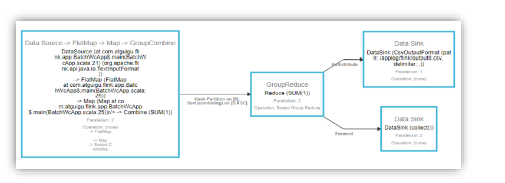

## 执行图（ExecutionGraph）

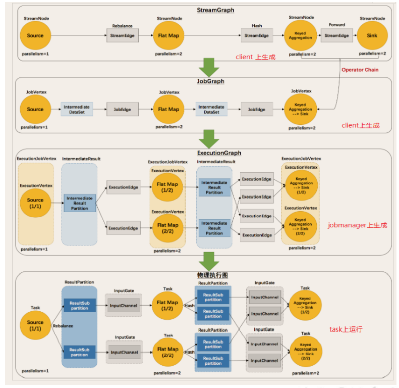

• Flink 中的执行图可以分成四层：StreamGraph -> JobGraph ->  ExecutionGraph -> 物理执行图

- StreamGraph：是根据用户通过 Stream API 编写的代码生成的最初的图。用来 表示程序的拓扑结构。 

  

- JobGraph：StreamGraph经过优化后生成了 JobGraph，提交给 JobManager  的数据结构。主要的优化为，将多个符合条件的节点 chain 在一起作为一个节点 

  

- ExecutionGraph：JobManager 根据 JobGraph 生成ExecutionGraph。 ExecutionGraph是JobGraph的并行化版本，是调度层最核心的数据结构。 

  

- 物理执行图：JobManager 根据 ExecutionGraph 对 Job 进行调度后，在各个 TaskManager 上部署 Task 后形成的“图”，并不是一个具体的数据结构。

## 数据传输形式

一个程序中，不同的算子可能具有不同的并行度 

• 算子之间传输数据的形式可以是 one-to-one (forwarding) 的模式也可以是 redistributing 的模式，具体是哪一种形式，取决于算子的种类 

- One-to-one：stream维护着分区以及元素的顺序（比如source和map之间）。 这意味着map 算子的子任务看到的元素的个数以及顺序跟 source 算子的子任务 生产的元素的个数、顺序相同。map、fliter、flatMap等算子都是one-to-one 的对应关系。 

  

- Redistributing：stream的分区会发生改变。每一个算子的子任务依据所选择的 transformation发送数据到不同的目标任务。例如，keyBy 基于 hashCode 重 分区、而 broadcast 和 rebalance 会随机重新分区，这些算子都会引起 redistribute过程，而 redistribute 过程就类似于 Spark 中的 shuffle 过程。

## 任务链（Operator Chains）

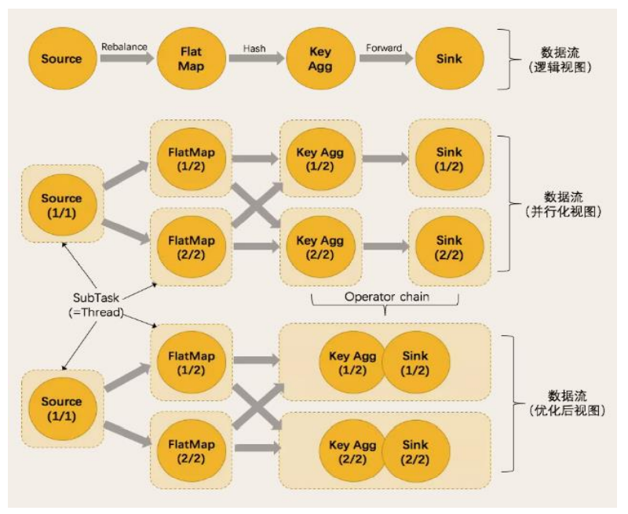

• Flink 采用了一种称为任务链的优化技术，可以在特定条件下减少本地 通信的开销。为了满足任务链的要求，必须将两个或多个算子设为相同 的并行度，并通过本地转发（local forward）的方式进行连接 

• 相同并行度的 one-to-one 操作，Flink 这样相连的算子链接在一起形 成一个 task，原来的算子成为里面的 subtask 

• 并行度相同、并且是 one-to-one 操作，两个条件缺一不可

