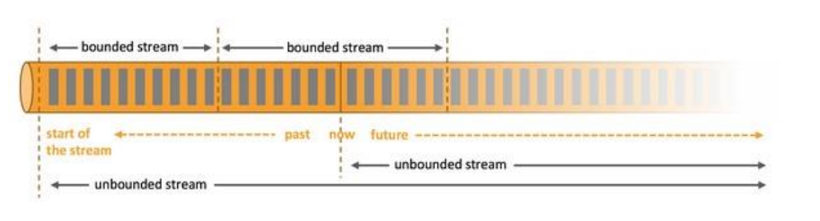

# Flink window API

## 窗口（window）

• 一般真实的流都是无界的，怎样处理无界的数据？

• 可以把无限的数据流进行切分，得到有限的数据集进行处理 —— 也 就是得到有界流 

• 窗口（window）就是将无限流切割为有限流的一种方式，它会将流 数据分发到有限大小的桶（bucket）中进行分析

## window 类型

• 时间窗口（Time Window） 

- 滚动时间窗口 

- 滑动时间窗口 

- 会话窗口 

  

• 计数窗口（Count Window） 

- 滚动计数窗口 
- 滑动计数窗口

## 滚动窗口（Tumbling Windows）

• 将数据依据固定的窗口长度对数据进行切分 

• 时间对齐，窗口长度固定，没有重

## 滑动窗口（Sliding Windows）

• 滑动窗口是固定窗口的更广义的一种形式，滑动窗口由固定的窗口 长度和滑动间隔组成 

• 窗口长度固定，可以有重叠

## 会话窗口（Session Windows）

• 由一系列事件组合一个指定时间长度的 timeout 间隙组成，也就 是一段时间没有接收到新数据就会生成新的窗口 

• 特点：时间无对齐

## window API

• 窗口分配器 —— window() 方法 

- 可以用 .window() 来定义一个窗口，然后基于这个 window 去做一些聚 合或者其它处理操作。注意 window () 方法必须在 keyBy 之后才能用。 

  

- Flink 提供了更加简单的 .timeWindow 和 .countWindow 方法，用于定义 时间窗口和计数窗口

## 窗口分配器（window assigner）

• window() 方法接收的输入参数是一个 WindowAssigner • WindowAssigner 负责将每条输入的数据分发到正确的 window 中 

• Flink 提供了通用的 WindowAssigner 

- 滚动窗口（tumbling window） 
- 滑动窗口（sliding window） 
- 会话窗口（session window） 
- 全局窗口（global window）

## 创建不同类型的窗口

• 滚动时间窗口（tumbling time window） 

• 滑动时间窗口（sliding time window） 

• 会话窗口（session window）

## 创建不同类型的窗口

• 滚动计数窗口（tumbling count window） 

• 滑动计数窗口（sliding count window）

## 窗口函数（window function）

• window function 定义了要对窗口中收集的数据做的计算操作 

• 可以分为两类 

- 增量聚合函数（incremental aggregation functions） 
  - 每条数据到来就进行计算，保持一个简单的状态 
  - ReduceFunction, AggregateFunction 

- 全窗口函数（full window functions） 
  - 先把窗口所有数据收集起来，等到计算的时候会遍历所有数据
  - ProcessWindowFunction，WindowFunction

## 其它可选 API

• .trigger() —— 触发器 

- 定义 window 什么时候关闭，触发计算并输出结果 

• .evictor() —— 移除器 

- 定义移除某些数据的逻辑 

• .allowedLateness() —— 允许处理迟到的数据 

• .sideOutputLateData() —— 将迟到的数据放入侧输出流 

• .getSideOutput() —— 获取侧输出流

## window API 总览

