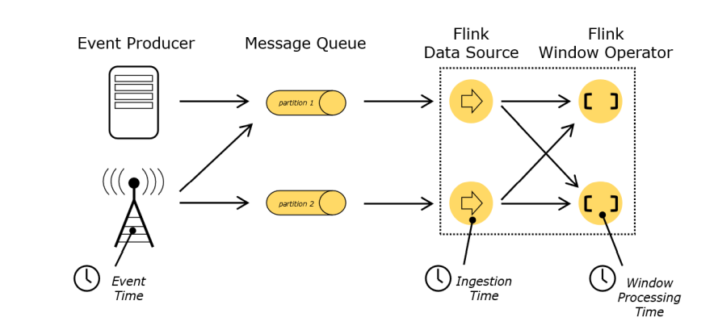
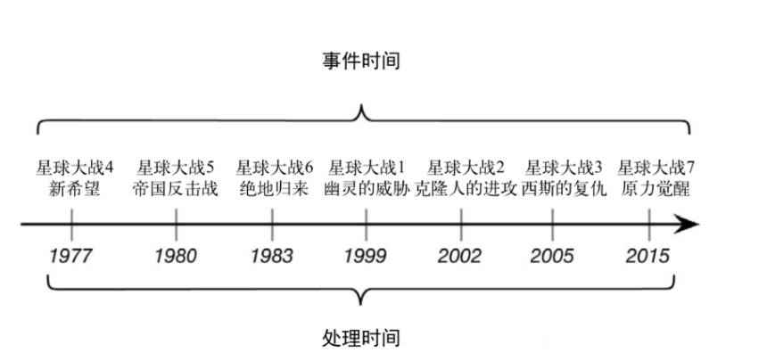
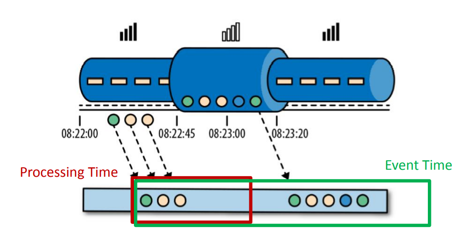
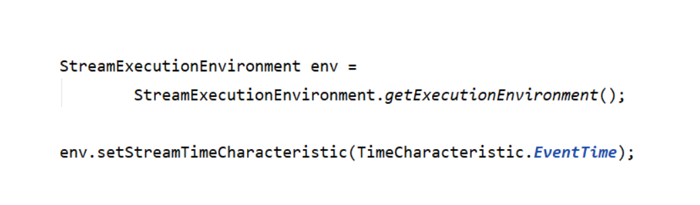
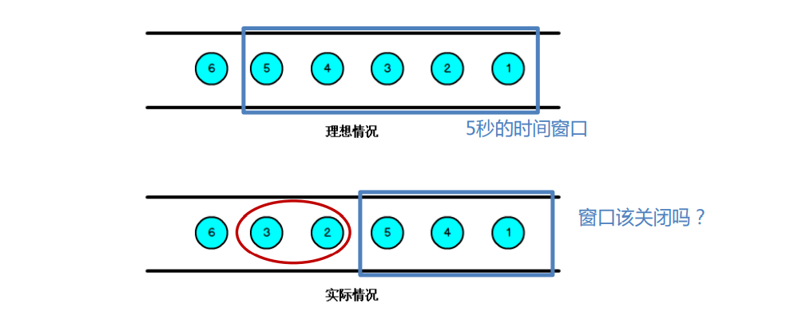
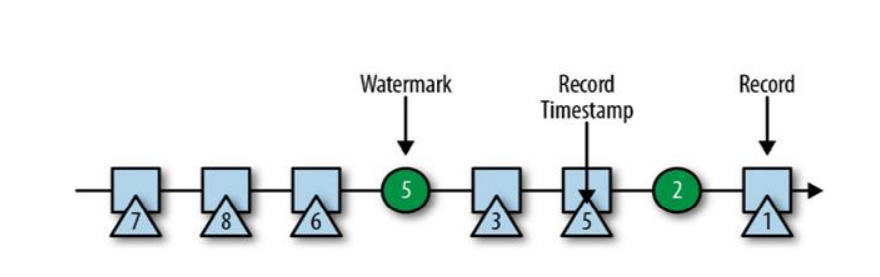
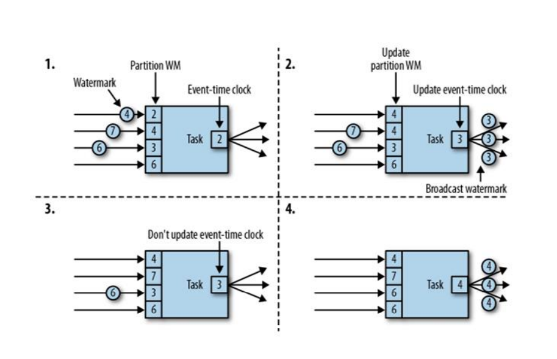
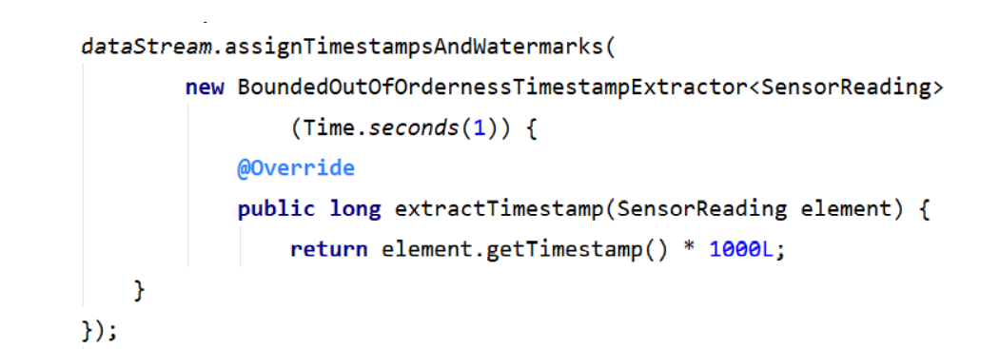
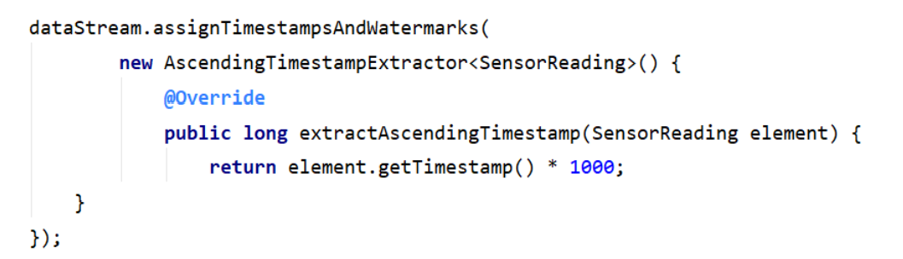
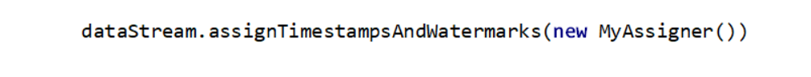

# Flink 中的 时间语义和 watermark

## 时间（Time）语义

• Event Time：事件创建的时间 

• Ingestion Time：数据进入Flink的时间 

• Processing Time：执行操作算子的本地系统时间，与机器相关

## 哪种时间语义更重要

• 不同的时间语义有不同的应用场合 

• 往往更关心事件时间（Event Time）

• 某些应用场合，不应该使用 Processing Time 

• Event Time 可以从日志数据的时间戳（timestamp）中提取 

- 2017-11-02 18:37:15.624 INFO Fail over to rm

## 在代码中设置 Event Time

• 可以直接在代码中，对执行环境调用 setStreamTimeCharacteristic  方法，设置流的时间特性 

• 具体的时间，还需要从数据中提取时间戳（timestamp）

## 乱序数据的影响

• 当 Flink 以 Event Time 模式处理数据流时，它会根据数据里的时间戳来 处理基于时间的算子

• 由于网络、分布式等原因，会导致乱序数据的产生

• 乱序数据会让窗口计算不准确

## 水位线（Watermark）

怎样避免乱序数据带来计算不正确？ 

遇到一个时间戳达到了窗口关闭时间，不应该立刻触发窗口计算，而是等 待一段时间，等迟到的数据来了再关闭窗口 

• Watermark 是一种衡量 Event Time 进展的机制，可以设定延迟触发 

• Watermark 是用于处理乱序事件的，而正确的处理乱序事件，通常用 Watermark 机制结合 window 来实现； 

• 数据流中的 Watermark 用于表示 timestamp 小于 Watermark 的数据， 都已经到达了，因此，window 的执行也是由 Watermark 触发的。 

• watermark 用来让程序自己平衡延迟和结果正确性

## watermark 的特点

• watermark 是一条特殊的数据记录 

• watermark 必须单调递增，以确保任务的事件时间时钟在向前推进，而 不是在后退 

• watermark 与数据的时间戳相关

## watermark 的传递

## watermark 的引入

• Event Time 的使用一定要指定数据源中的时间戳 

• 调用 assignTimestampAndWatermarks 方法，传入一个 BoundedOutOfOrdernessTimestampExtractor，就可以指定

• 对于排好序的数据，不需要延迟触发，可以只指定时间戳就行了

• Flink 暴露了 TimestampAssigner 接口供我们实现，使我们可以自定义 如何从事件数据中抽取时间戳和生成watermark

MyAssigner 可以有两种类型，都继承自 TimestampAssigner

## TimestampAssigner

• 定义了抽取时间戳，以及生成 watermark 的方法，有两种类型

**AssignerWithPeriodicWatermarks** 

• 周期性的生成 watermark：系统会周期性的将 watermark 插入到流中 

• 默认周期是200毫秒，可以使用 ExecutionConfig.setAutoWatermarkInterval() 方法进行设置 

• 升序和前面乱序的处理 BoundedOutOfOrdernessTimestampExtractor， 都是基于周期性 watermark 的。

 

**AssignerWithPunctuatedWatermarks** 

• 没有时间周期规律，可打断的生成 watermark

## watermark 的设定

• 在 Flink 中，watermark 由应用程序开发人员生成，这通常需要对相应 的领域有一定的了解 

• 如果watermark设置的延迟太久，收到结果的速度可能就会很慢，解决 办法是在水位线到达之前输出一个近似结果 

• 而如果watermark到达得太早，则可能收到错误结果，不过 Flink 处理迟 到数据的机制可以解决这个问题

