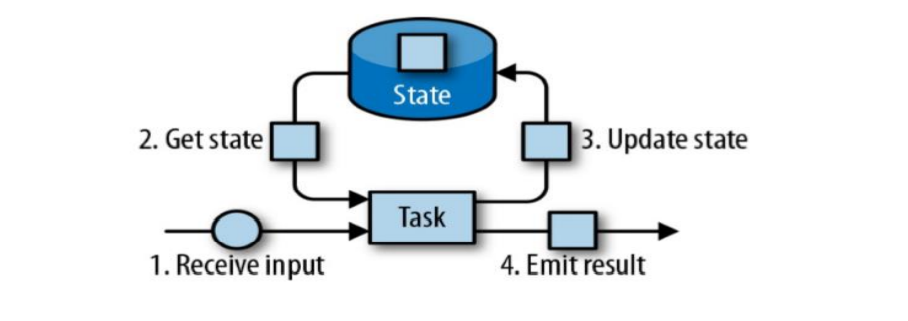
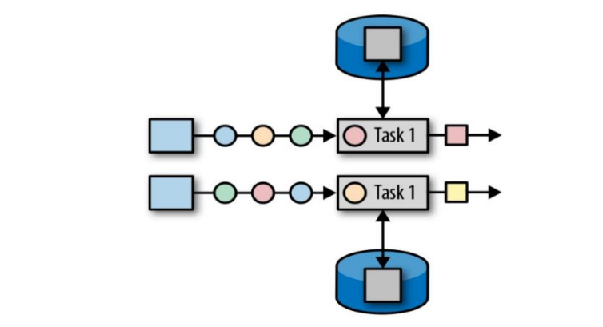
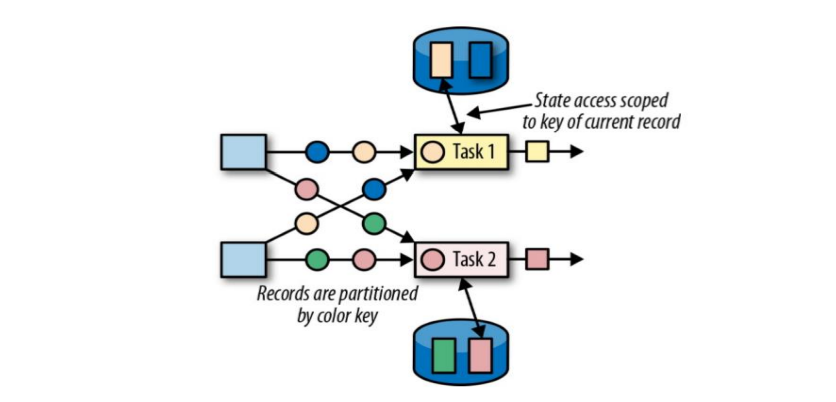
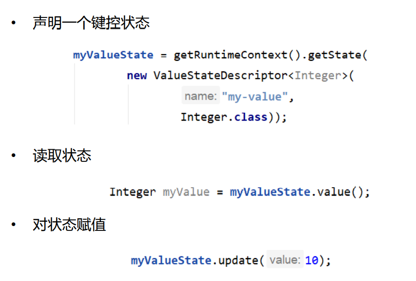

# Flink 状态管理

## Flink 中的状态

• 由一个任务维护，并且用来计算某个结果的所有数据，都属于这个任务的状态 

• 可以认为状态就是一个本地变量，可以被任务的业务逻辑访问 

• Flink 会进行状态管理，包括状态一致性、故障处理以及高效存储和访问，以便开发人员可以专注于应用程序的逻辑

## Flink 中的状态

• 在 Flink 中，状态始终与特定算子相关联 

• 为了使运行时的 Flink 了解算子的状态，算子需要预先注册其状态 

总的说来，有两种类型的状态： 

• 算子状态（Operator State） 

​	• 算子状态的作用范围限定为算子任务 

• 键控状态（Keyed State） 

​	• 根据输入数据流中定义的键（key）来维护和访问

## 算子状态（Operator State）

• 算子状态的作用范围限定为算子任务，由同一并行任务所处理的所有数据都 可以访问到相同的状态 

• 状态对于同一子任务而言是共享的 

• 算子状态不能由相同或不同算子的另一个子任务访问

## 算子状态数据结构

列表状态（List state） 

​	• 将状态表示为一组数据的列表 

联合列表状态（Union list state） 

​	• 也将状态表示为数据的列表。它与常规列表状态的区别在于，在发生故 障时，或者从保存点（savepoint）启动应用程序时如何恢复 

广播状态（Broadcast state） 

​	• 如果一个算子有多项任务，而它的每项任务状态又都相同，那么这种特 殊情况最适合应用广播状态。

## 键控状态（Keyed State）

• 键控状态是根据输入数据流中定义的键（key）来维护和访问的 

• Flink 为每个 key 维护一个状态实例，并将具有相同键的所有数据，都分区到 同一个算子任务中，这个任务会维护和处理这个 key 对应的状态 

• 当任务处理一条数据时，它会自动将状态的访问范围限定为当前数据的 key

## 键控状态数据结构

值状态（Value state） 

​	• 将状态表示为单个的值 

列表状态（List state） 

​	• 将状态表示为一组数据的列表 

映射状态（Map state） 

​	• 将状态表示为一组 Key-Value 对 

聚合状态（Reducing state & Aggregating State） 

​	• 将状态表示为一个用于聚合操作的列表

## 键控状态的使用

## 状态后端（State Backends）

• 每传入一条数据，有状态的算子任务都会读取和更新状态 

• 由于有效的状态访问对于处理数据的低延迟至关重要，因此每个并行 任务都会在本地维护其状态，以确保快速的状态访问 

• 状态的存储、访问以及维护，由一个可插入的组件决定，这个组件就 叫做状态后端（state backend）

 • 状态后端主要负责两件事：本地的状态管理，以及将检查点 （checkpoint）状态写入远程存储

## 选择一个状态后端

MemoryStateBackend 

​	• 内存级的状态后端，会将键控状态作为内存中的对象进行管理，将它们存储在 TaskManager 的 JVM 堆上，而将 checkpoint 存储在 JobManager 的内存 中 

​	• 特点：快速、低延迟，但不稳定 

FsStateBackend 

​	• 将 checkpoint 存到远程的持久化文件系统（FileSystem）上，而对于本地状 态，跟 MemoryStateBackend 一样，也会存在 TaskManager 的 JVM 堆上 

​	• 同时拥有内存级的本地访问速度，和更好的容错保证 

RocksDBStateBackend 

​	• 将所有状态序列化后，存入本地的 RocksDB 中存储。

