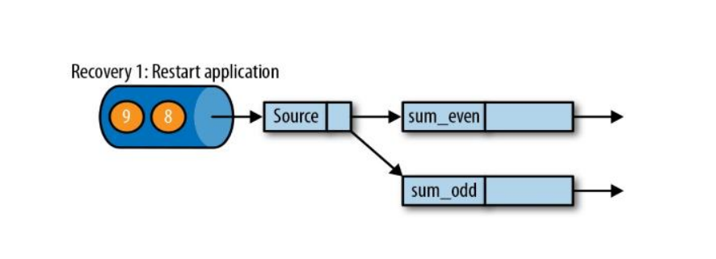

# Flink 的容错机制

## 一致性检查点（Checkpoints）

• Flink 故障恢复机制的核心，就是应用状态的一致性检查点 

• 有状态流应用的一致检查点，其实就是所有任务的状态，在某个时间点的一份 拷贝（一份快照）；这个时间点，应该是所有任务都恰好处理完一个相同的输 入数据的时候

## 从检查点恢复状态

• 在执行流应用程序期间，Flink 会定期保存状态的一致检查点 

• 如果发生故障， Flink 将会使用最近的检查点来一致恢复应用程序的状态，并 重新启动处理流程

• 遇到故障之后，第一步就是重启应用

• 第二步是从 checkpoint 中读取状态，将状态重置 

• 从检查点重新启动应用程序后，其内部状态与检查点完成时的状态完全相同

• 第三步：开始消费并处理检查点到发生故障之间的所有数据 

• 这种检查点的保存和恢复机制可以为应用程序状态提供“精确一次” （exactly-once）的一致性，因为所有算子都会保存检查点并恢复其所有状 态，这样一来所有的输入流就都会被重置到检查点完成时的位置。

## 检查点的实现算法

• 一种简单的想法 

​	—— 暂停应用，保存状态到检查点，再重新恢复应用 

• Flink 的改进实现 

​	—— 基于 Chandy-Lamport 算法的分布式快照 

​	—— 将检查点的保存和数据处理分离开，不暂停整个应用

## Flink 检查点算法

检查点分界线（Checkpoint Barrier） 

• Flink 的检查点算法用到了一种称为分界线（barrier）的特殊数据形式， 用来把一条流上数据按照不同的检查点分开 

• 分界线之前到来的数据导致的状态更改，都会被包含在当前分界线所属 的检查点中；而基于分界线之后的数据导致的所有更改，就会被包含在 之后的检查点中

• 现在是一个有两个输入流的应用程序，用并行的两个 Source 任务来读取

• JobManager 会向每个 source 任务发送一条带有新检查点 ID 的消息，通过这 种方式来启动检查点

• 数据源将它们的状态写入检查点，并发出一个检查点 barrier 

• 状态后端在状态存入检查点之后，会返回通知给 source 任务，source 任务就会 向 JobManager 确认检查点完成

• 分界线对齐：barrier 向下游传递，sum 任务会等待所有输入分区的 barrier 到 达 

• 对于barrier已经到达的分区，继续到达的数据会被缓存 

• 而barrier尚未到达的分区，数据会被正常处理

• 当收到所有输入分区的 barrier 时，任务就将其状态保存到状态后端的检查点中， 然后将 barrier 继续向下游转发

• 向下游转发检查点 barrier 后，任务继续正常的数据处理

• Sink 任务向 JobManager 确认状态保存到 checkpoint 完毕 

• 当所有任务都确认已成功将状态保存到检查点时，检查点就真正完成了

## 保存点（Savepoints）

• Flink 还提供了可以自定义的镜像保存功能，就是保存点（savepoints） 

• 原则上，创建保存点使用的算法与检查点完全相同，因此保存点可以认 为就是具有一些额外元数据的检查点 

• Flink不会自动创建保存点，因此用户（或者外部调度程序）必须明确地 触发创建操作 

• 保存点是一个强大的功能。除了故障恢复外，保存点可以用于：有计划 的手动备份，更新应用程序，版本迁移，暂停和重启应用，等等

