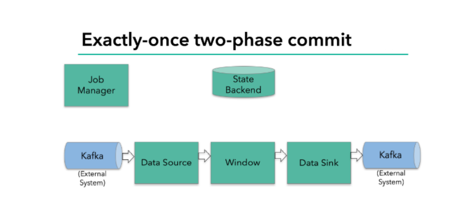

# Flink 的状态一致性

## 什么是状态一致性

• 有状态的流处理，内部每个算子任务都可以有自己的状态 

• 对于流处理器内部来说，所谓的状态一致性，其实就是我们所说的计 算结果要保证准确。 

• 一条数据不应该丢失，也不应该重复计算 

• 在遇到故障时可以恢复状态，恢复以后的重新计算，结果应该也是完 全正确的。

## 状态一致性分类

• AT-MOST-ONCE（最多一次） 

当任务故障时，最简单的做法是什么都不干，既不恢复丢失的状态，也不重 播丢失的数据。At-most-once 语义的含义是最多处理一次事件。 

• AT-LEAST-ONCE（至少一次） 

在大多数的真实应用场景，我们希望不丢失事件。这种类型的保障称为 atleast-once，意思是所有的事件都得到了处理，而一些事件还可能被处理多 次。 

• EXACTLY-ONCE（精确一次） 

好处理一次是最严格的保证，也是最难实现的。恰好处理一次语义不仅仅 意味着没有事件丢失，还意味着针对每一个数据，内部状态仅仅更新一次。

## 一致性检查点（Checkpoints）

• Flink 使用了一种轻量级快照机制 —— 检查点（checkpoint）来保 证 exactly-once 语义 

• 有状态流应用的一致检查点，其实就是：所有任务的状态，在某个时 间点的一份拷贝（一份快照）。而这个时间点，应该是所有任务都恰 好处理完一个相同的输入数据的时候。 

• 应用状态的一致检查点，是 Flink 故障恢复机制的核心

## 端到端（end-to-end）状态一致性

• 目前我们看到的一致性保证都是由流处理器实现的，也就是说都是在 Flink 流处理器内部保证的；而在真实应用中，流处理应用除了流处 理器以外还包含了数据源（例如 Kafka）和输出到持久化系统 

• 端到端的一致性保证，意味着结果的正确性贯穿了整个流处理应用的 始终；每一个组件都保证了它自己的一致性 

• 整个端到端的一致性级别取决于所有组件中一致性最弱的组件

## 端到端 exactly-once

• 内部保证 —— checkpoint 

• source 端 —— 可重设数据的读取位置 

• sink 端 —— 从故障恢复时，数据不会重复写入外部系统 

- 幂等写入 
- 事务写入

## 幂等写入（Idempotent Writes）

• 所谓幂等操作，是说一个操作，可以重复执行很多次，但只导致一次 结果更改，也就是说，后面再重复执行就不起作用了

## 事务写入（Transactional Writes）

• 事务（Transaction） 

- 应用程序中一系列严密的操作，所有操作必须成功完成，否则在每个操作中所 作的所有更改都会被撤消 
- 具有原子性：一个事务中的一系列的操作要么全部成功，要么一个都不做 

• 实现思想：构建的事务对应着 checkpoint，等到 checkpoint 真正完成 的时候，才把所有对应的结果写入 sink 系统中 

• 实现方式 

- 预写日志 
- 两阶段提交

## 预写日志（Write-Ahead-Log，WAL）

• 把结果数据先当成状态保存，然后在收到 checkpoint 完成的通知时， 一次性写入 sink 系统 

• 简单易于实现，由于数据提前在状态后端中做了缓存，所以无论什么 sink 系统，都能用这种方式一批搞定 

• DataStream API 提供了一个模板类：GenericWriteAheadSink，来 实现这种事务性 sink

## 两阶段提交（Two-Phase-Commit，2PC）

• 对于每个 checkpoint，sink 任务会启动一个事务，并将接下来所有 接收的数据添加到事务里 

• 然后将这些数据写入外部 sink 系统，但不提交它们 —— 这时只是 “预提交” 

• 当它收到 checkpoint 完成的通知时，它才正式提交事务，实现结果 的真正写入 

这种方式真正实现了 exactly-once，它需要一个提供事务支持的外部 sink 系统。Flink 提供了 TwoPhaseCommitSinkFunction 接口。

## 2PC 对外部 sink 系统的要求

• 外部 sink 系统必须提供事务支持，或者 sink 任务必须能够模拟外部系 统上的事务 

• 在 checkpoint 的间隔期间里，必须能够开启一个事务并接受数据写入 

• 在收到 checkpoint 完成的通知之前，事务必须是“等待提交”的状态。 在故障恢复的情况下，这可能需要一些时间。如果这个时候sink系统关 闭事务（例如超时了），那么未提交的数据就会丢失 

• sink 任务必须能够在进程失败后恢复事务 

• 提交事务必须是幂等操作

## 不同 Source 和 Sink 的一致性保证

## Flink+Kafka 端到端状态一致性的保证

• 内部 —— 利用 checkpoint 机制，把状态存盘，发生故障的时候可以恢 复，保证内部的状态一致性 

• source —— kafka consumer 作为 source，可以将偏移量保存下来， 如果后续任务出现了故障，恢复的时候可以由连接器重置偏移量，重新 消费数据，保证一致性

• sink —— kafka producer 作为sink，采用两阶段提交 sink，需要实现 一个 TwoPhaseCommitSinkFunction

## Exactly-once 两阶段提交

• JobManager 协调各个 TaskManager 进行 checkpoint 存储 

• checkpoint保存在 StateBackend中，默认StateBackend是内存级的，也可以改 为文件级的进行持久化保存

• 当 checkpoint 启动时，JobManager 会将检查点分界线（barrier）注入数据流 

• barrier会在算子间传递下去

• 每个算子会对当前的状态做个快照，保存到状态后端 

• checkpoint 机制可以保证内部的状态一致性

• 每个内部的 transform 任务遇到 barrier 时，都会把状态存到 checkpoint 里 

• sink 任务首先把数据写入外部 kafka，这些数据都属于预提交的事务；遇到 barrier 时，把状态保存到状态后端，并开启新的预提交事务

• 当所有算子任务的快照完成，也就是这次的 checkpoint 完成时，JobManager  会向所有任务发通知，确认这次 checkpoint 完成 

• sink 任务收到确认通知，正式提交之前的事务，kafka 中未确认数据改为“已确 认”

## Exactly-once 两阶段提交步骤

• 第一条数据来了之后，开启一个 kafka 的事务（transaction），正常写入 kafka 分 区日志但标记为未提交，这就是“预提交” 

• jobmanager 触发 checkpoint 操作，barrier 从 source 开始向下传递，遇到 barrier 的算子将状态存入状态后端，并通知 jobmanager 

• sink 连接器收到 barrier，保存当前状态，存入 checkpoint，通知 jobmanager， 并开启下一阶段的事务，用于提交下个检查点的数据 

• jobmanager 收到所有任务的通知，发出确认信息，表示 checkpoint 完成 

• sink 任务收到 jobmanager 的确认信息，正式提交这段时间的数据 

• 外部kafka关闭事务，提交的数据可以正常消费了。

