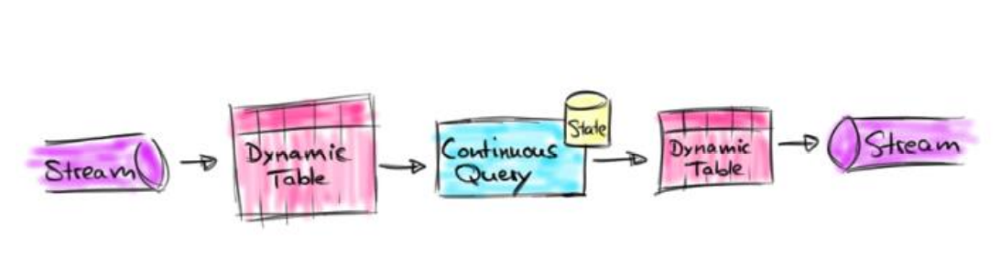

# Table API 和 Flink SQL

## Table API 和 Flink SQL 是什么

• Flink 对批处理和流处理，提供了统一的上层 API 


• Table API 是一套内嵌在 Java 和 Scala 语言中的查询API，它允许以非常直 观的方式组合来自一些关系运算符的查询 


• Flink 的 SQL 支持基于实现了 SQL 标准的 Apache Calcite


## 基本程序结构

• Table API 和 SQL 的程序结构，与流式处理的程序结构十分类似

```scala
StreamTableEnvironment tableEnv = ... // 创建表的执行环境
// 创建一张表，用于读取数据
tableEnv.connect(...).createTemporaryTable("inputTable");
// 注册一张表，用于把计算结果输出
tableEnv.connect(...).createTemporaryTable("outputTable");
// 通过 Table API 查询算子，得到一张结果表
Table result = tableEnv.from("inputTable").select(...);
// 通过 SQL查询语句，得到一张结果表
Table sqlResult = tableEnv.sqlQuery("SELECT ... FROM inputTable ...");
// 将结果表写入输出表中
result.insertInto("outputTable");
```


## 创建 TableEnvironment

• 创建表的执行环境，需要将 flink 流处理的执行环境传入 

```scala
StreamTableEnvironment tableEnv = StreamTableEnvironment.create(env); 
```


• TableEnvironment 是 flink 中集成 Table API 和 SQL 的核心概念，所有对 表的操作都基于 TableEnvironment  

– 注册 Catalog 

– 在 Catalog 中注册表 

– 执行 SQL 查询 

– 注册用户自定义函数（UDF）


## 配置 TableEnvironment

• 配置老版本 planner 的流式查询

```java
EnvironmentSettings settings = EnvironmentSettings.newInstance()
.useOldPlanner()
.inStreamingMode()
.build();
StreamTableEnvironment tableEnv = StreamTableEnvironment
.create(env, settings);
```

• 配置老版本 planner 的批式查询

```scala
ExecutionEnvironment batchEnv = ExecutionEnvironment.getExecutionEnvironment;
BatchTableEnvironment batchTableEnv = BatchTableEnvironment.create(batchEnv);
```

• 配置 blink planner 的流式查询

```scala
EnvironmentSettings bsSettings = EnvironmentSettings.newInstance()
.useBlinkPlanner()
.inStreamingMode()
.build();
StreamTableEnvironment bsTableEnv = StreamTableEnvironment
.create(env, bsSettings);
```

• 配置 blink planner 的批式查询

```scala
EnvironmentSettings bbSettings = EnvironmentSettings.newInstance()
.useBlinkPlanner()
.inBatchMode()
.build();
TableEnvironment bbTableEnv = TableEnvironment.create(bbSettings);
```


## 表（Table）

• TableEnvironment 可以注册目录 Catalog，并可以基于 Catalog 注册表 


• 表（Table）是由一个“标识符”（identifier）来指定的，由3部分组成： Catalog名、数据库（database）名和对象名 


• 表可以是常规的，也可以是虚拟的（视图，View） 


• 常规表（Table）一般可以用来描述外部数据，比如文件、数据库表或消息队 列的数据，也可以直接从 DataStream转换而来 


• 视图（View）可以从现有的表中创建，通常是 table API 或者 SQL 查询的 一个结果集


## 创建表

• TableEnvironment 可以调用 .connect() 方法，连接外部系统，并调 用 .createTemporaryTable() 方法，在 Catalog 中注册表

```scala
tableEnv
.connect(...) // 定义表的数据来源，和外部系统建立连接
.withFormat(...) // 定义数据格式化方法
.withSchema(...) // 定义表结构
.createTemporaryTable("MyTable"); // 创建临时表
```

• 可以创建 Table 来描述文件数据，它可以从文件中读取，或者将数据写入文件

```scala
tableEnv
.connect(
new FileSystem().path(“YOUR_Path/sensor.txt”)
) // 定义到文件系统的连接
.withFormat(new Csv()) // 定义以csv格式进行数据格式化
.withSchema( new Schema()
.field("id", DataTypes.STRING())
.field("timestamp", DataTypes.BIGINT())
.field("temperature", DataTypes.DOUBLE())
) // 定义表结构
.createTemporaryTable("sensorTable"); // 创建临时表
```


## 表的查询 – Table API

• Table API 是集成在 Scala 和 Java 语言内的查询 API 


• Table API 基于代表“表”的 Table 类，并提供一整套操作处理的方法 API； 这些方法会返回一个新的 Table 对象，表示对输入表应用转换操作的结果 


• 有些关系型转换操作，可以由多个方法调用组成，构成链式调用结构

```scala
Table sensorTable = tableEnv.from("inputTable");
Table resultTable = sensorTable
.select("id, temperature")
.filter("id = 'sensor_1'");
```

## 表的查询 – SQL

• Flink 的 SQL 集成，基于实现 了SQL 标准的 Apache Calcite 


• 在 Flink 中，用常规字符串来定义 SQL 查询语句 


• SQL 查询的结果，也是一个新的 Table

```scala
Table resultSqlTable = tableEnv
.sqlQuery("select id, temperature from sensorTable where id ='sensor_1'");
```


## 输出表

• 表的输出，是通过将数据写入 TableSink 来实现的 


• TableSink 是一个通用接口，可以支持不同的文件格式、存储数据库和消息队列 


• 输出表最直接的方法，就是通过 Table.insertInto() 方法将一个 Table 写入注册过

```scala
tableEnv.connect(...)
.createTemporaryTable("outputTable");
Table resultSqlTable = ...
resultTable.insertInto("outputTable");
```

## 输出到文件

```scala
tableEnv.connect(
new FileSystem().path("output.txt")
) // 定义到文件系统的连接
.withFormat(new Csv()) 
.withSchema(new Schema()
.field("id", DataTypes.STRING())
.field("temp", DataTypes.Double())
) 
.createTemporaryTable("outputTable") ; // 创建临时表
resultTable.insertInto("outputTable"); // 输出表
```

## 更新模式

• 对于流式查询，需要声明如何在表和外部连接器之间执行转换 

• 与外部系统交换的消息类型，由更新模式（Update Mode）指定 


追加（Append）模式 

​	– 表只做插入操作，和外部连接器只交换插入（Insert）消息 


撤回（Retract）模式 – 表和外部连接器交换添加（Add）和撤回（Retract）消息 

​	– 插入操作（Insert）编码为 Add 消息；删除（Delete）编码为 Retract 消息；

更新（Update） 编码为上一条的 Retract 和下一条的 Add 消息 


更新插入（Upsert）模式 

​	– 更新和插入都被编码为 Upsert 消息；删除编码为 Delete 消息


## 输出到 Kafka

• 可以创建 Table 来描述 kafka 中的数据，作为输入或输出的 TableSink

```scala
tableEnv.connect(
new Kafka()
.version("0.11")
.topic("sinkTest")
.property("zookeeper.connect", "localhost:2181")
.property("bootstrap.servers", "localhost:9092")
)
.withFormat( new Csv() )
.withSchema( new Schema()
.field("id", DataTypes.STRING())
.field("temp", DataTypes.DOUBLE())
)
.createTemporaryTable("kafkaOutputTable");
resultTable.insertInto("kafkaOutputTable");
```

## 输出到 ES

• 可以创建 Table 来描述 ES 中的数据，作为输出的 TableSink

```scala
tableEnv.connect(
new Elasticsearch()
.version("6")
.host("localhost", 9200, "http")
.index("sensor")
.documentType("temp")
)
.inUpsertMode()
.withFormat(new Json())
.withSchema( new Schema()
.field("id", DataTypes.STRING())
.field("count", DataTypes.BIGINT())
)
.createTemporaryTable("esOutputTable");
aggResultTable.insertInto("esOutputTable");
```

## 输出到 MySql

• 可以创建 Table 来描述 MySql 中的数据，作为输入和输出

```scala
String sinkDDL=
"create table jdbcOutputTable (" +
" id varchar(20) not null, " +
" cnt bigint not null " +
") with (" +
" 'connector.type' = 'jdbc', " +
" 'connector.url' = 'jdbc:mysql://localhost:3306/test', " +
" 'connector.table' = 'sensor_count', " +
" 'connector.driver' = 'com.mysql.jdbc.Driver', " +
" 'connector.username' = 'root', " +
" 'connector.password' = '123456' )";
tableEnv.sqlUpdate(sinkDDL) // 执行 DDL创建表
aggResultSqlTable.insertInto("jdbcOutputTable");
```

## 将 Table 转换成 DataStream

• 表可以转换为 DataStream 或 DataSet ，这样自定义流处理或批处理程序就 可以继续在 Table API 或 SQL 查询的结果上运行了 


• 将表转换为 DataStream 或 DataSet 时，需要指定生成的数据类型，即要将 表的每一行转换成的数据类型 


• 表作为流式查询的结果，是动态更新的 


• 转换有两种转换模式：追加（Append）模式和撤回（Retract）模式


## 将 Table 转换成 DataStream

追加模式（Append Mode） 

​	– 用于表只会被插入（Insert）操作更改的场景

```scala
DataStream<Row> resultStream = tableEnv.toAppendStream(resultTable, Row.class);
```

撤回模式（Retract Mode） 

​	– 用于任何场景。有些类似于更新模式中 Retract 模式，它只有 Insert 和 Delete 两类操作。 

​	– 得到的数据会增加一个 Boolean 类型的标识位（返回的第一个字段），用它来表示到底是 新增的数据（Insert），还是被删除的数据（Delete）

```scala
DataStream<Tuple2<Boolean, Row>> aggResultStream = tableEnv
.toRetractStream(aggResultTable , Row.class);
```

## 将 DataStream 转换成表

• 对于一个 DataStream，可以直接转换成 Table，进而方便地调用 Table API  做转换操作

```scala
DataStream<SensorReading> dataStream = ...
Table sensorTable = tableEnv.fromDataStream(dataStream);
```

• 默认转换后的 Table schema 和 DataStream 中的字段定义一一对应，也可 以单独指定出来

```scala
DataStream<SensorReading> dataStream = ...
Table sensorTable = tableEnv.fromDataStream(dataStream,"id, timestamp as ts, temperature");
```

## 创建临时视图（Temporary View）

• 基于 DataStream 创建临时视图

```scala
tableEnv.createTemporaryView("sensorView", dataStream);
tableEnv.createTemporaryView("sensorView", dataStream, "id, temperature, timestamp as ts");
```

• 基于 Table 创建临时视图

```scala
tableEnv.createTemporaryView("sensorView", sensorTable);
```

## 查看执行计划

• Table API 提供了一种机制来解释计算表的逻辑和优化查询计划 


• 查看执行计划，可以通过 TableEnvironment.explain(table) 方法或 TableEnvironment.explain() 方法完成，返回一个字符串，描述三个计划

- 优化的逻辑查询计划 
- 优化后的逻辑查询计划
- 实际执行计划。

```scala
String explaination = tableEnv.explain(resultTable);
System.out.println(explaination);
```

## 流处理和关系代数的区别


## 动态表（Dynamic Tables）

• 动态表是 Flink 对流数据的 Table API 和 SQL 支持的核心概念 


• 与表示批处理数据的静态表不同，动态表是随时间变化的


**持续查询（Continuous Query）** 

• 动态表可以像静态的批处理表一样进行查询，查询一个动态表会产生持续查 询（Continuous Query） 


• 连续查询永远不会终止，并会生成另一个动态表 


• 查询会不断更新其动态结果表，以反映其动态输入表上的更改


## 动态表和持续查询




流式表查询的处理过程： 

1. 流被转换为动态表 
2. 对动态表计算连续查询，生成新的动态表 
3. 生成的动态表被转换回流

## 将流转换成动态表

• 为了处理带有关系查询的流，必须先将其转换为表 


• 从概念上讲，流的每个数据记录，都被解释为对结果表的插入 （Insert）修改操作


## 持续查询

• 持续查询会在动态表上做计算处理，并作为结果生成新的动态表


## 将动态表转换成 DataStream

• 与常规的数据库表一样，动态表可以通过插入（Insert）、更新（Update）和删 除（Delete）更改，进行持续的修改 


• 将动态表转换为流或将其写入外部系统时，需要对这些更改进行编码

仅追加（Append-only）流 

​	– 仅通过插入（Insert）更改来修改的动态表，可以直接转换为仅追加流 


撤回（Retract）流 

​	– 撤回流是包含两类消息的流：添加（Add）消息和撤回（Retract）消息


 Upsert（更新插入）流 

​	– Upsert 流也包含两种类型的消息：Upsert 消息和删除（Delete）消息。

## 将动态表转换成 DataStream


## 时间特性（Time Attributes）

• 基于时间的操作（比如 Table API 和 SQL 中窗口操作），需要定义相关的时 间语义和时间数据来源的信息 


• Table 可以提供一个逻辑上的时间字段，用于在表处理程序中，指示时间和 访问相应的时间戳 


• 时间属性，可以是每个表schema的一部分。一旦定义了时间属性，它就可以 作为一个字段引用，并且可以在基于时间的操作中使用 


• 时间属性的行为类似于常规时间戳，可以访问，并且进行计算


## 定义处理时间（Processing Time）

• 处理时间语义下，允许表处理程序根据机器的本地时间生成结果。它是时间 的最简单概念。它既不需要提取时间戳，也不需要生成 watermark


**由 DataStream 转换成表时指定** 

• 在定义Schema期间，可以使用.proctime，指定字段名定义处理时间字段 


• 这个proctime属性只能通过附加逻辑字段，来扩展物理schema。


因此，只 能在schema定义的末尾定义它

```scala
Table sensorTable = tableEnv.fromDataStream(dataStream, 
"id, temperature, timestamp, pt.proctime");
```

## 定义处理时间（Processing Time）

定义 Table Schema 时指定

```scala
.withSchema(new Schema()
.field("id", DataTypes.STRING())
.field("timestamp", DataTypes.BIGINT())
.field("temperature", DataTypes.DOUBLE())
.field("pt", DataTypes.TIMESTAMP(3))
.proctime()
)
```

在创建表的 DDL 中定义

```scala
String sinkDDL =
"create table dataTable (" +
" id varchar(20) not null, " +
" ts bigint, " +
" temperature double, " +
" pt AS PROCTIME() " +
") with (" +
" 'connector.type' = 'filesystem', " +
" 'connector.path' = '/sensor.txt', " +
" 'format.type' = 'csv')";
tableEnv.sqlUpdate(sinkDDL);
```

## 定义事件时间（Event Time）

• 事件时间语义，允许表处理程序根据每个记录中包含的时间生成结果。这样 即使在有乱序事件或者延迟事件时，也可以获得正确的结果。 


• 为了处理无序事件，并区分流中的准时和迟到事件；Flink 需要从事件数据中， 提取时间戳，并用来推进事件时间的进展 


• 定义事件时间，同样有三种方法： 

- 由 DataStream 转换成表时指定 
- 定义 Table Schema 时指定 
- 在创建表的 DDL 中定义


由 DataStream 转换成表时指定 

• 在 DataStream 转换成 Table，使用 .rowtime 可以定义事件时间属性

```scala
// 将 DataStream转换为 Table，并指定时间字段
Table sensorTable = tableEnv.fromDataStream(dataStream, 
"id, timestamp.rowtime, temperature");
// 或者，直接追加时间字段
Table sensorTable = tableEnv.fromDataStream(dataStream, 
" id, temperature, timestamp, rt.rowtime");
```

• 定义 Table Schema 时指定

```scala
withSchema(new Schema()
.field("id", DataTypes.STRING())
.field("timestamp", DataTypes.BIGINT())
.rowtime(
new Rowtime()
.timestampsFromField("timestamp") // 从字段中提取时间戳
.watermarksPeriodicBounded(1000) // watermark延迟1秒
)
.field("temperature", DataTypes.DOUBLE())
)
```

• 在创建表的 DDL 中定义

```scala
String sinkDDL=
"create table dataTable (" +
" id varchar(20) not null, " +
" ts bigint, " +
" temperature double, " +
" rt AS TO_TIMESTAMP( FROM_UNIXTIME(ts) ), " +
" watermark for rt as rt - interval '1' second" +
") with (" +
" 'connector.type' = 'filesystem', " +
" 'connector.path' = '/sensor.txt', " +
" 'format.type' = 'csv')";
tableEnv.sqlUpdate(sinkDDL);
```

## 窗口

• 时间语义，要配合窗口操作才能发挥作用 


• 在 Table API 和 SQL 中，主要有两种窗

Group Windows（分组窗口） 

​	– 根据时间或行计数间隔，将行聚合到有限的组（Group）中，并对每个组的数据 执行一次聚合函数 


Over Windows 

​	– 针对每个输入行，计算相邻行范围内的聚合


## Group Windows

• Group Windows 是使用 window（w:GroupWindow）子句定义的，并且 必须由as子句指定一个别名。 


• 为了按窗口对表进行分组，窗口的别名必须在 group by 子句中，像常规的 分组字段一样引用

```scala
Table table = input
.window([w: GroupWindow] as "w") // 定义窗口，别名为 w
.groupBy("w, a") // 按照字段 a和窗口 w分组
.select("a, b.sum"); // 聚合
```

• Table API 提供了一组具有特定语义的预定义 Window 类，这些类会被转换 为底层 DataStream 或 DataSet 的窗口操作


## 滚动窗口（Tumbling windows）

• 滚动窗口要用 Tumble 类来定义

```scala
// Tumbling Event-time Window
.window(Tumble.over("10.minutes").on("rowtime").as("w"))
// Tumbling Processing-time Window
.window(Tumble.over("10.minutes").on("proctime").as("w"))
// Tumbling Row-count Window
.window(Tumble.over("10.rows").on("proctime").as("w"))
```

## 滑动窗口（Sliding windows）

• 滑动窗口要用 Slide 类来定义

```scala
// Sliding Event-time Window
.window(Slide.over("10.minutes").every("5.minutes").on("rowtime").as("w"))
// Sliding Processing-time window 
.window(Slide.over("10.minutes").every("5.minutes").on("proctime").as("w"))
// Sliding Row-count window
.window(Slide.over("10.rows").every("5.rows").on("proctime").as("w"))
```

## 会话窗口（Session windows）

• 会话窗口要用 Session 类来定义

```scala
// Session Event-time Window
.window(Session.withGap("10.minutes").on("rowtime").as("w"))
// Session Processing-time Window
.window(Session.withGap("10.minutes").on(“proctime").as("w"))
```

## SQL 中的 Group Windows

• Group Windows 定义在 SQL 查询的 Group By 子句中 


TUMBLE(time_attr, interval) 

​	• 定义一个滚动窗口，第一个参数是时间字段，第二个参数是窗口长度 


HOP(time_attr, interval, interval) 

​	• 定义一个滑动窗口，第一个参数是时间字段，第二个参数是窗口滑动步长，第三个是 窗口长度 


SESSION(time_attr, interval) 

​	• 定义一个会话窗口，第一个参数是时间字段，第二个参数是窗口间隔


## Over Windows

• Over window 聚合是标准 SQL 中已有的（over 子句），可以在查询的 SELECT 子句中定义 


• Over window 聚合，会针对每个输入行，计算相邻行范围内的聚合 


• Over windows 使用 window（w:overwindows*）子句定义，并在 select （）方法中通过别名来引用

```scala
Table table = input
.window([w: OverWindow] as "w")
.select("a, b.sum over w, c.min over w");
```

• Table API 提供了 Over 类，来配置 Over 窗口的属性

## 无界 Over Windows

• 可以在事件时间或处理时间，以及指定为时间间隔、或行计数的范围内，定 义 Over windows 


• 无界的 over window 是使用常量指定的

```scala
// 无界的事件时间 over window
.window(Over.partitionBy("a").orderBy("rowtime").preceding(UNBOUNDED_RANGE).as("w"))
//无界的处理时间 over window
.window(Over.partitionBy("a").orderBy("proctime").preceding(UNBOUNDED_RANGE).as("w"))
// 无界的事件时间 Row-count over window
.window(Over.partitionBy("a").orderBy("rowtime").preceding(UNBOUNDED_ROW).as("w"))
//无界的处理时间 Row-count over window
.window(Over.partitionBy("a").orderBy("proctime").preceding(UNBOUNDED_ROW).as("w"))
```

## 有界 Over Windows

• 有界的 over window 是用间隔的大小指定的

```scala
// 有界的事件时间 over window
.window(Over.partitionBy("a").orderBy("rowtime").preceding("1.minutes").as("w"))
// 有界的处理时间 over window
.window(Over.partitionBy("a").orderBy("proctime").preceding("1.minutes").as("w"))
// 有界的事件时间 Row-count over window
.window(Over.partitionBy("a").orderBy("rowtime").preceding("10.rows").as("w"))
// 有界的处理时间 Row-count over window
.window(Over.partitionBy("a").orderBy("procime").preceding("10.rows").as("w"))
```

## SQL 中的 Over Windows

• 用 Over 做窗口聚合时，所有聚合必须在同一窗口上定义，也就是说必须是 相同的分区、排序和范围 


• 目前仅支持在当前行范围之前的窗口 


• ORDER BY 必须在单一的时间属性上指定

```sql
SELECT COUNT(amount) OVER (
PARTITION BY user
ORDER BY proctime
ROWS BETWEEN 2 PRECEDING AND CURRENT ROW)
FROM Orders
```

## 函数（Functions）

• Flink Table API 和 SQL 为用户提供了一组用于数据转换的内置函数 


• SQL 中支持的很多函数，Table API 和 SQL 都已经做了实现

**比较函数** 

• SQL： 

- value1 = value2 - value1 > value2 

• Table API： 

- ANY1 === ANY2 - ANY1 > ANY2


逻辑函数 

• SQL： 

- boolean1 OR boolean2 
- boolean IS FALSE 
- NOT boolean 


• Table API： 

- BOOLEAN1 ||  BOOLEAN2 
- BOOLEAN.isFalse 
- !BOOLEAN


算数函数 

• SQL： 

- numeric1 + numeric2 

- POWER(numeric1, numeric2) 

  

• Table API： 

- NUMERIC1 + NUMERIC2 
- NUMERIC1.power(NUMERIC2)


字符串函数 

• SQL： 

- string1 || string2 
- UPPER(string) 
- CHAR_LENGTH(string) 


• Table API： 

- STRING1 + STRING2 
- STRING.upperCase() 
- STRING.charLength()


时间函数 

• SQL： 

- DATE string 
- TIMESTAMP string 
- CURRENT_TIME - INTERVAL string range 


• Table API： 

- STRING.toDate 
- STRING.toTimestamp 
- currentTime() 
- NUMERIC.days 
- NUMERIC.minutes
- 

聚合函数 

• SQL： 

- COUNT(*) 
- SUM(expression) 
- RANK() 
- ROW_NUMBER() 


• Table API：

- FIELD.count 
- FIELD.sum0

## 用户自定义函数（UDF）

• 用户定义函数（User-defined Functions，UDF）是一个重要的特性，它们 显著地扩展了查询的表达能力 


• 在大多数情况下，用户定义的函数必须先注册，然后才能在查询中使用 


• 函数通过调用 registerFunction（）方法在 TableEnvironment 中注册。当 用户定义的函数被注册时，它被插入到 TableEnvironment 的函数目录中， 这样Table API 或 SQL 解析器就可以识别并正确地解释它


## 标量函数（Scalar Functions）

• 用户定义的标量函数，可以将0、1或多个标量值，映射到新的标量值 


• 为了定义标量函数，必须在 org.apache.flink.table.functions 中扩展基类 Scalar Function，并实现（一个或多个）求值（eval）方法 


• 标量函数的行为由求值方法决定，求值方法必须公开声明并命名为 eval

```scala
public static class HashCode extends ScalarFunction {
	private int factor = 13;
public HashCode(int factor) {
	this.factor = factor;
	}
public int eval(String s) {
	return s.hashCode() * factor;
	}
}
```

## 表函数（Table Functions）

• 用户定义的表函数，也可以将0、1或多个标量值作为输入参数；与标量函数不同 的是，它可以返回任意数量的行作为输出，而不是单个值 


• 为了定义一个表函数，必须扩展 org.apache.flink.table.functions 中的基类 TableFunction 并实现（一个或多个）求值方法 


• 表函数的行为由其求值方法决定，求值方法必须是 public 的，并命名为 eval

```scala
public static class Split extends TableFunction<Tuple2<String, Integer>> {
	private String separator = ",";
	public Split(String separator) {
		this.separator = separator;
	}
	public void eval(String str) {
		for (String s : str.split(separator)) {
			collect(new Tuple2<String, Integer>(s, s.length()));
		}
	}
}
```

## 聚合函数（Aggregate Functions）

• 用户自定义聚合函数（User-Defined Aggregate Functions，UDAGGs） 可以把一个表中的数据，聚合成一个标量值 


• 用户定义的聚合函数，是通过继承 AggregateFunction 抽象类实现的


• AggregationFunction要求必须实现的方法： 

- createAccumulator() 
- accumulate() – getValue() 


• AggregateFunction 的工作原理如下： 

- 首先，它需要一个累加器（Accumulator），用来保存聚合中间结果的数据结构； 可以通过调用 createAccumulator() 方法创建空累加器 
- 随后，对每个输入行调用函数的 accumulate() 方法来更新累加器 – 处理完所有行后，将调用函数的 getValue() 方法来计算并返回最终结果


## 表聚合函数（Table Aggregate Functions）

• 用户定义的表聚合函数（User-Defined Table Aggregate Functions， UDTAGGs），可以把一个表中数据，聚合为具有多行和多列的结果表 


• 用户定义表聚合函数，是通过继承 TableAggregateFunction 抽象类来实现 的


• AggregationFunction 要求必须实现的方法：

- createAccumulator() 
- accumulate() 
- emitValue() 


• TableAggregateFunction 的工作原理如下: 

- 首先，它同样需要一个累加器（Accumulator），它是保存聚合中间结果的数据 结构。通过调用 createAccumulator() 方法可以创建空累加器。 
- 随后，对每个输入行调用函数的 accumulate() 方法来更新累加器。 
- 处理完所有行后，将调用函数的 emitValue() 方法来计算并返回最终结果。

