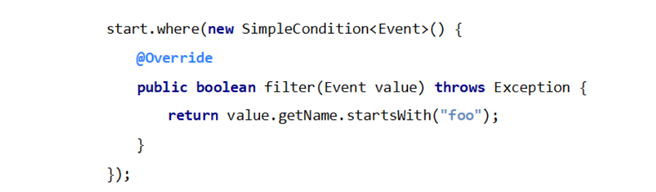

# **Flink CEP 简介**

## 什么是 CEP

• 复杂事件处理（Complex Event Processing，CEP） 


• Flink CEP是在 Flink 中实现的复杂事件处理（CEP）库 


• CEP 允许在无休止的事件流中检测事件模式，让我们有机会掌握数据 中重要的部分 


• 一个或多个由简单事件构成的事件流通过一定的规则匹配，然后输出 用户想得到的数据 —— 满足规则的复杂事件

## CEP 的特点


• 目标：从有序的简单事件流中发现一些高阶特征 


• 输入：一个或多个由简单事件构成的事件流 


• 处理：识别简单事件之间的内在联系，多个符合一定规则的简单事件构成复杂事件 


• 输出：满足规则的复杂事件


## Pattern API

• 处理事件的规则，被叫做“模式”（Pattern） 


• Flink CEP 提供了 Pattern API，用于对输入流数据进行复杂事件规则定义， 用来提取符合规则的事件序列


• 个体模式（Individual Patterns） 

​	– 组成复杂规则的每一个单独的模式定义，就是“个体模式”

```scala
start.times(3).where(new SimpleCondition<Event>()){....}
```

• 组合模式（Combining Patterns，也叫模式序列） 

​	– 很多个体模式组合起来，就形成了整个的模式序列 

​	– 模式序列必须以一个“初始模式”开始：

```scala
Patter<Event, Event> start = Pattern.<Event> begin("start")
```

• 模式组（Groups of patterns） 

​	– 将一个模式序列作为条件嵌套在个体模式里，成为一组模式


## 个体模式（Individual Patterns）

• 个体模式可以包括“单例（singleton）模式”和“循环（looping）模式” 


• 单例模式只接收一个事件，而循环模式可以接收多个 


量词（Quantifier） 

​	– 可以在一个个体模式后追加量词，也就是指定循环次数


条件（Condition） 

​	– 每个模式都需要指定触发条件，作为模式是否接受事件进入的判断依据 

​	– CEP 中的个体模式主要通过调用 .where() .or() 和 .until() 来指定条件 

​	– 按不同的调用方式，可以分成以下几类：


• 简单条件（Simple Condition） 

​	– 通过 .where() 方法对事件中的字段进行判断筛选，决定是否接受该事件




• 组合条件（Combining Condition） 

​	– 将简单条件进行合并；.or() 方法表示或逻辑相连，where 的直接组合就是 AND


• 终止条件（Stop Condition） 

​	– 如果使用了 oneOrMore 或者 oneOrMore.optional，建议使用 .until() 作为终止 条件，以便清理状态 


• 迭代条件（Iterative Condition） 

​	– 能够对模式之前所有接收的事件进行处理 

​	– 可以调用 ctx.getEventsForPattern(“name”)


## 模式序列 

• 不同的“近邻”模式


## 模式序列

• 严格近邻（Strict Contiguity） 

​	– 所有事件按照严格的顺序出现，中间没有任何不匹配的事件，由 .next() 指定 

​	– 例如对于模式”a next b”，事件序列 [a, c, b1, b2] 没有匹配 


• 宽松近邻（ Relaxed Contiguity ） 

​	– 允许中间出现不匹配的事件，由 .followedBy() 指定 

​	– 例如对于模式”a followedBy b”，事件序列 [a, c, b1, b2] 匹配为 {a, b1} 


• 非确定性宽松近邻（ Non-Deterministic Relaxed Contiguity ） 

​	– 进一步放宽条件，之前已经匹配过的事件也可以再次使用，由 .followedByAny() 指定 

​	– 例如对于模式”a followedByAny b”，事件序列 [a, c, b1, b2] 匹配为 {a, b1}，{a,  b2}


• 除以上模式序列外，还可以定义“不希望出现某种近邻关系”： 

​	– .notNext() —— 不想让某个事件严格紧邻前一个事件发生 

​	– .notFollowedBy() —— 不想让某个事件在两个事件之间发生 


• 需要注意： 

​	– 所有模式序列必须以 .begin() 开始 

​	– 模式序列不能以 .notFollowedBy() 结束 

​	– “not” 类型的模式不能被 optional 所修饰 

​	– 此外，还可以为模式指定时间约束，用来要求在多长时间内匹配有效


## 模式的检测

• 指定要查找的模式序列后，就可以将其应用于输入流以检测潜在 匹配 


• 调用 CEP.pattern()，给定输入流和模式，就能得到一个 PatternStream


## 匹配事件的提取

• 创建 PatternStream 之后，就可以应用 select 或者 flatselect 方法，从检测到 的事件序列中提取事件了 


• select() 方法需要输入一个 select function 作为参数，每个成功匹配的事件序 列都会调用它 


• select() 以一个 Map> 来接收匹配到的事件序列，其中 key  就是每个模式的名称，而 value 就是所有接收到的事件的 List 类型


## 超时事件的提取

• 当一个模式通过 within 关键字定义了检测窗口时间时，部分事件序列可能因为超过窗 口长度而被丢弃；为了能够处理这些超时的部分匹配，select 和 flatSelect API 调用 允许指定超时处理程序 


• 超时处理程序会接收到目前为止由模式匹配到的所有事件，由一个 OutputTag 定义 接收到的超时事件序列


