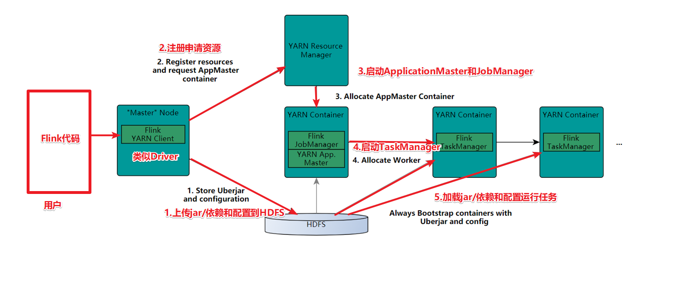

# Flink介绍

## 发展历史


## 官方介绍


## 组件栈


## 应用场景

所有的流式计算


# Flink安装部署

## local本地模式-了解

### 原理


### 操作

1.下载安装包

https://archive.apache.org/dist/flink/

 

2.上传flink-1.12.0-bin-scala_2.12.tgz到node1的指定目录

 

3.解压

tar -zxvf flink-1.12.0-bin-scala_2.12.tgz 

 

4.如果出现权限问题，需要修改权限

chown -R root:root /export/server/flink-1.12.0

5.改名或创建软链接

mv flink-1.12.0 flink

ln -s /export/server/flink-1.12.0 /export/server/flink

### 测试

1.准备文件/root/words.txt

vim /root/words.txt

 ```
hello me you her
hello me you
hello me
hello
 ```


 

2.启动Flink本地“集群”

  /export/server/flink/bin/start-cluster.sh

  

3.使用jps可以查看到下面两个进程

  \- TaskManagerRunner

  \- StandaloneSessionClusterEntrypoint

 

4.访问Flink的Web UI

  http://node1:8081/#/overview

  

  slot在Flink里面可以认为是资源组，Flink是通过将任务分成子任务并且将这些子任务分配到slot来并行执行程序。

 

5.执行官方示例

```
/export/server/flink/bin/flink run /export/server/flink/examples/batch/WordCount.jar --input /root/words.txt --output /root/out
```


6.停止Flink

/export/server/flink/bin/stop-cluster.sh

 

 

启动shell交互式窗口(目前所有Scala 2.12版本的安装包暂时都不支持 Scala Shell)

/export/server/flink/bin/start-scala-shell.sh local

 

执行如下命令

 ```
benv.readTextFile("/root/words.txt").flatMap(_.split(" ")).map((_,1)).groupBy(0).sum(1).print()
 ```


退出shell

:quit


## Standalone独立集群模式-了解

### 原理


### 操作

1.集群规划:

\- 服务器: node1(Master + Slave): JobManager + TaskManager

\- 服务器: node2(Slave): TaskManager

\- 服务器: node3(Slave): TaskManager

 

2.修改flink-conf.yaml

vim /export/server/flink/conf/flink-conf.yaml

```
jobmanager.rpc.address: node1
taskmanager.numberOfTaskSlots: 2
web.submit.enable: true

#历史服务器
jobmanager.archive.fs.dir: hdfs://node1:8020/flink/completed-jobs/
historyserver.web.address: node1
historyserver.web.port: 8082
historyserver.archive.fs.dir: hdfs://node1:8020/flink/completed-jobs/
```

2.修改masters

vim /export/server/flink/conf/masters

```
node1:8081
```


3.修改slaves

vim /export/server/flink/conf/workers

```
node1
node2
node3
```


4.添加HADOOP_CONF_DIR环境变量

vim /etc/profile

```
export HADOOP_CONF_DIR=/export/server/hadoop/etc/hadoop
```


5.分发

  scp -r /export/server/flink node2:/export/server/flink

  scp -r /export/server/flink node3:/export/server/flink

  scp  /etc/profile node2:/etc/profile

  scp  /etc/profile node3:/etc/profile

  或

```
 for i in {2..3}; do scp -r flink node$i:$PWD; done
```


  

6.source 

source /etc/profile


### 测试

1.启动集群，在node1上执行如下命令

  /export/server/flink/bin/start-cluster.sh

  或者单独启动

/export/server/flink/bin/jobmanager.sh ((start|start-foreground) cluster)|stop|stop-all

/export/server/flink/bin/taskmanager.sh start|start-foreground|stop|stop-all

 

2.启动历史服务器

​	/export/server/flink/bin/historyserver.sh start

 

3.访问Flink UI界面或使用jps查看

http://node1:8081/#/overview

http://node1:8082/#/overview


4.执行官方测试案例

```
/export/server/flink/bin/flink run /export/server/flink/examples/batch/WordCount.jar
```


6.停止Flink集群

/export/server/flink/bin/stop-cluster.sh


## Standalone-HA高可用集群模式-了解

### 原理


### 操作

1.集群规划

\- 服务器: node1(Master + Slave): JobManager + TaskManager

\- 服务器: node2(Master + Slave): JobManager + TaskManager

\- 服务器: node3(Slave): TaskManager

 

2.启动ZooKeeper

zkServer.sh status

zkServer.sh stop

zkServer.sh start

 

3.启动HDFS

/export/serves/hadoop/sbin/start-dfs.sh

 

4.停止Flink集群

/export/server/flink/bin/stop-cluster.sh

 

5.修改flink-conf.yaml

vim /export/server/flink/conf/flink-conf.yaml

增加如下内容G

```
state.backend: filesystem
state.backend.fs.checkpointdir: hdfs://node1:8020/flink-checkpoints
high-availability: zookeeper
high-availability.storageDir: hdfs://node1:8020/flink/ha/
high-availability.zookeeper.quorum: node1:2181,node2:2181,node3:2181
```

6.修改masters

vim /export/server/flink/conf/masters

7.同步

```
scp -r /export/server/flink/conf/flink-conf.yaml node2:/export/server/flink/conf/
scp -r /export/server/flink/conf/flink-conf.yaml node3:/export/server/flink/conf/
scp -r /export/server/flink/conf/masters node2:/export/server/flink/conf/
scp -r /export/server/flink/conf/masters node3:/export/server/flink/conf/
```


8.修改node2上的flink-conf.yaml

vim /export/server/flink/conf/flink-conf.yaml

```
jobmanager.rpc.address: node2
```


9.重新启动Flink集群,node1上执行

/export/server/flink/bin/stop-cluster.sh

/export/server/flink/bin/start-cluster.sh

 

 

10.使用jps命令查看

发现没有Flink相关进程被启动

 

11.查看日志

cat /export/server/flink/log/flink-root-standalonesession-0-node1.log

发现如下错误

 

因为在Flink1.8版本后,Flink官方提供的安装包里没有整合HDFS的jar

 

12.下载jar包并在Flink的lib目录下放入该jar包并分发使Flink能够支持对Hadoop的操作

下载地址

https://flink.apache.org/downloads.html

13.放入lib目录

cd /export/server/flink/lib

 

 

14.分发

for i in {2..3}; do scp -r flink-shaded-hadoop-2-uber-2.7.5-10.0.jar node$i:$PWD; done

 

15.重新启动Flink集群,node1上执行

/export/server/flink/bin/stop-cluster.sh

/export/server/flink/bin/start-cluster.sh

 

16.使用jps命令查看,发现三台机器已经ok


### 测试

1.访问WebUI

http://node1:8081/#/job-manager/config

http://node2:8081/#/job-manager/config


2.执行wc

/export/server/flink/bin/flink run  /export/server/flink/examples/batch/WordCount.jar

 

3.kill掉其中一个master

 

4.重新执行wc,还是可以正常执行

/export/server/flink/bin/flink run  /export/server/flink/examples/batch/WordCount.jar

 

3.停止集群

/export/server/flink/bin/stop-cluster.sh


## Flink-On-Yarn-开发使用

### 原理


### 两种模式

#### Session会话模式


#### Job分离模式


### 操作

1.关闭yarn的内存检查

vim /export/server/hadoop/etc/hadoop/yarn-site.xml

```
 <!-- 关闭yarn内存检查 -->
    <property>
        <name>yarn.nodemanager.pmem-check-enabled</name>
        <value>false</value>
    </property>
    <property>
        <name>yarn.nodemanager.vmem-check-enabled</name>
        <value>false</value>
    </property>
```

2.分发

```
scp -r /export/server/hadoop/etc/hadoop/yarn-site.xml node2:/export/server/hadoop/etc/hadoop/yarn-site.xml
scp -r /export/server/hadoop/etc/hadoop/yarn-site.xml node3:/export/server/hadoop/etc/hadoop/yarn-site.xml
```


3.重启yarn

/export/server/hadoop/sbin/stop-yarn.sh

/export/server/hadoop/sbin/start-yarn.sh


### 测试

#### Session会话模式

在Yarn上启动一个Flink集群,并重复使用该集群,后续提交的任务都是给该集群,资源会被一直占用,除非手动关闭该集群----适用于大量的小任务


1.在yarn上启动一个Flink集群/会话，node1上执行以下命令

/export/server/flink/bin/yarn-session.sh -n 2 -tm 800 -s 1 -d

 

说明:

申请2个CPU、1600M内存

\# -n 表示申请2个容器，这里指的就是多少个taskmanager

\# -tm 表示每个TaskManager的内存大小

\# -s 表示每个TaskManager的slots数量

\# -d 表示以后台程序方式运行

 

注意:

该警告不用管

WARN  org.apache.hadoop.hdfs.DFSClient  - Caught exception 

java.lang.InterruptedException

 

2.查看UI界面

http://node1:8088/cluster

 

 

 

 

3.使用flink run提交任务：

  /export/server/flink/bin/flink run  /export/server/flink/examples/batch/WordCount.jar

  运行完之后可以继续运行其他的小任务

  /export/server/flink/bin/flink run  /export/server/flink/examples/batch/WordCount.jar

  

  

4.通过上方的ApplicationMaster可以进入Flink的管理界面

 

 

  

==5.关闭yarn-session：==

yarn application -kill application_1609508087977_0005


#### Job分离模式--用的更多

针对每个Flink任务在Yarn上启动一个独立的Flink集群并运行,结束后自动关闭并释放资源,----适用于大任务


1.直接提交job

/export/server/flink/bin/flink run -m yarn-cluster -yjm 1024 -ytm 1024 /export/server/flink/examples/batch/WordCount.jar

\# -m  jobmanager的地址

\# -yjm 1024 指定jobmanager的内存信息

\# -ytm 1024 指定taskmanager的内存信息

 

 

2.查看UI界面

http://node1:8088/cluster


 

 


### 参数说明

```shell
/export/server/flink/bin/flink --help
SLF4J: Class path contains multiple SLF4J bindings.
SLF4J: Found binding in [jar:file:/export/server/flink/lib/log4j-slf4j-impl-2.12.1.jar!/org/slf4j/impl/StaticLoggerBinder.class]
SLF4J: Found binding in [jar:file:/export/server/hadoop-2.7.5/share/hadoop/common/lib/slf4j-log4j12-1.7.10.jar!/org/slf4j/impl/StaticLoggerBinder.class]
SLF4J: See http://www.slf4j.org/codes.html#multiple_bindings for an explanation.
SLF4J: Actual binding is of type [org.apache.logging.slf4j.Log4jLoggerFactory]
./flink <ACTION> [OPTIONS] [ARGUMENTS]

The following actions are available:

Action "run" compiles and runs a program.

  Syntax: run [OPTIONS] <jar-file> <arguments>
  "run" action options:
     -c,--class <classname>               Class with the program entry point
                                          ("main()" method). Only needed if the
                                          JAR file does not specify the class in
                                          its manifest.
     -C,--classpath <url>                 Adds a URL to each user code
                                          classloader  on all nodes in the
                                          cluster. The paths must specify a
                                          protocol (e.g. file://) and be
                                          accessible on all nodes (e.g. by means
                                          of a NFS share). You can use this
                                          option multiple times for specifying
                                          more than one URL. The protocol must
                                          be supported by the {@link
                                          java.net.URLClassLoader}.
     -d,--detached                        If present, runs the job in detached
                                          mode
     -n,--allowNonRestoredState           Allow to skip savepoint state that
                                          cannot be restored. You need to allow
                                          this if you removed an operator from
                                          your program that was part of the
                                          program when the savepoint was
                                          triggered.
     -p,--parallelism <parallelism>       The parallelism with which to run the
                                          program. Optional flag to override the
                                          default value specified in the
                                          configuration.
     -py,--python <pythonFile>            Python script with the program entry
                                          point. The dependent resources can be
                                          configured with the `--pyFiles`
                                          option.
     -pyarch,--pyArchives <arg>           Add python archive files for job. The
                                          archive files will be extracted to the
                                          working directory of python UDF
                                          worker. Currently only zip-format is
                                          supported. For each archive file, a
                                          target directory be specified. If the
                                          target directory name is specified,
                                          the archive file will be extracted to
                                          a name can directory with the
                                          specified name. Otherwise, the archive
                                          file will be extracted to a directory
                                          with the same name of the archive
                                          file. The files uploaded via this
                                          option are accessible via relative
                                          path. '#' could be used as the
                                          separator of the archive file path and
                                          the target directory name. Comma (',')
                                          could be used as the separator to
                                          specify multiple archive files. This
                                          option can be used to upload the
                                          virtual environment, the data files
                                          used in Python UDF (e.g.: --pyArchives
                                          file:///tmp/py37.zip,file:///tmp/data.
                                          zip#data --pyExecutable
                                          py37.zip/py37/bin/python). The data
                                          files could be accessed in Python UDF,
                                          e.g.: f = open('data/data.txt', 'r').
     -pyexec,--pyExecutable <arg>         Specify the path of the python
                                          interpreter used to execute the python
                                          UDF worker (e.g.: --pyExecutable
                                          /usr/local/bin/python3). The python
                                          UDF worker depends on Python 3.5+,
                                          Apache Beam (version == 2.23.0), Pip
                                          (version >= 7.1.0) and SetupTools
                                          (version >= 37.0.0). Please ensure
                                          that the specified environment meets
                                          the above requirements.
     -pyfs,--pyFiles <pythonFiles>        Attach custom python files for job.
                                          These files will be added to the
                                          PYTHONPATH of both the local client
                                          and the remote python UDF worker. The
                                          standard python resource file suffixes
                                          such as .py/.egg/.zip or directory are
                                          all supported. Comma (',') could be
                                          used as the separator to specify
                                          multiple files (e.g.: --pyFiles
                                          file:///tmp/myresource.zip,hdfs:///$na
                                          menode_address/myresource2.zip).
     -pym,--pyModule <pythonModule>       Python module with the program entry
                                          point. This option must be used in
                                          conjunction with `--pyFiles`.
     -pyreq,--pyRequirements <arg>        Specify a requirements.txt file which
                                          defines the third-party dependencies.
                                          These dependencies will be installed
                                          and added to the PYTHONPATH of the
                                          python UDF worker. A directory which
                                          contains the installation packages of
                                          these dependencies could be specified
                                          optionally. Use '#' as the separator
                                          if the optional parameter exists
                                          (e.g.: --pyRequirements
                                          file:///tmp/requirements.txt#file:///t
                                          mp/cached_dir).
     -s,--fromSavepoint <savepointPath>   Path to a savepoint to restore the job
                                          from (for example
                                          hdfs:///flink/savepoint-1537).
     -sae,--shutdownOnAttachedExit        If the job is submitted in attached
                                          mode, perform a best-effort cluster
                                          shutdown when the CLI is terminated
                                          abruptly, e.g., in response to a user
                                          interrupt, such as typing Ctrl + C.
  Options for Generic CLI mode:
     -D <property=value>   Allows specifying multiple generic configuration
                           options. The available options can be found at
                           https://ci.apache.org/projects/flink/flink-docs-stabl
                           e/ops/config.html
     -e,--executor <arg>   DEPRECATED: Please use the -t option instead which is
                           also available with the "Application Mode".
                           The name of the executor to be used for executing the
                           given job, which is equivalent to the
                           "execution.target" config option. The currently
                           available executors are: "remote", "local",
                           "kubernetes-session", "yarn-per-job", "yarn-session".
     -t,--target <arg>     The deployment target for the given application,
                           which is equivalent to the "execution.target" config
                           option. For the "run" action the currently available
                           targets are: "remote", "local", "kubernetes-session",
                           "yarn-per-job", "yarn-session". For the
                           "run-application" action the currently available
                           targets are: "kubernetes-application",
                           "yarn-application".

  Options for yarn-cluster mode:
     -d,--detached                        If present, runs the job in detached
                                          mode
     -m,--jobmanager <arg>                Set to yarn-cluster to use YARN
                                          execution mode.
     -yat,--yarnapplicationType <arg>     Set a custom application type for the
                                          application on YARN
     -yD <property=value>                 use value for given property
     -yd,--yarndetached                   If present, runs the job in detached
                                          mode (deprecated; use non-YARN
                                          specific option instead)
     -yh,--yarnhelp                       Help for the Yarn session CLI.
     -yid,--yarnapplicationId <arg>       Attach to running YARN session
     -yj,--yarnjar <arg>                  Path to Flink jar file
     -yjm,--yarnjobManagerMemory <arg>    Memory for JobManager Container with
                                          optional unit (default: MB)
     -ynl,--yarnnodeLabel <arg>           Specify YARN node label for the YARN
                                          application
     -ynm,--yarnname <arg>                Set a custom name for the application
                                          on YARN
     -yq,--yarnquery                      Display available YARN resources
                                          (memory, cores)
     -yqu,--yarnqueue <arg>               Specify YARN queue.
     -ys,--yarnslots <arg>                Number of slots per TaskManager
     -yt,--yarnship <arg>                 Ship files in the specified directory
                                          (t for transfer)
     -ytm,--yarntaskManagerMemory <arg>   Memory per TaskManager Container with
                                          optional unit (default: MB)
     -yz,--yarnzookeeperNamespace <arg>   Namespace to create the Zookeeper
                                          sub-paths for high availability mode
     -z,--zookeeperNamespace <arg>        Namespace to create the Zookeeper
                                          sub-paths for high availability mode

  Options for default mode:
     -D <property=value>             Allows specifying multiple generic
                                     configuration options. The available
                                     options can be found at
                                     https://ci.apache.org/projects/flink/flink-
                                     docs-stable/ops/config.html
     -m,--jobmanager <arg>           Address of the JobManager to which to
                                     connect. Use this flag to connect to a
                                     different JobManager than the one specified
                                     in the configuration. Attention: This
                                     option is respected only if the
                                     high-availability configuration is NONE.
     -z,--zookeeperNamespace <arg>   Namespace to create the Zookeeper sub-paths
                                     for high availability mode


Action "run-application" runs an application in Application Mode.

  Syntax: run-application [OPTIONS] <jar-file> <arguments>
  Options for Generic CLI mode:
     -D <property=value>   Allows specifying multiple generic configuration
                           options. The available options can be found at
                           https://ci.apache.org/projects/flink/flink-docs-stabl
                           e/ops/config.html
     -e,--executor <arg>   DEPRECATED: Please use the -t option instead which is
                           also available with the "Application Mode".
                           The name of the executor to be used for executing the
                           given job, which is equivalent to the
                           "execution.target" config option. The currently
                           available executors are: "remote", "local",
                           "kubernetes-session", "yarn-per-job", "yarn-session".
     -t,--target <arg>     The deployment target for the given application,
                           which is equivalent to the "execution.target" config
                           option. For the "run" action the currently available
                           targets are: "remote", "local", "kubernetes-session",
                           "yarn-per-job", "yarn-session". For the
                           "run-application" action the currently available
                           targets are: "kubernetes-application",
                           "yarn-application".


Action "info" shows the optimized execution plan of the program (JSON).

  Syntax: info [OPTIONS] <jar-file> <arguments>
  "info" action options:
     -c,--class <classname>           Class with the program entry point
                                      ("main()" method). Only needed if the JAR
                                      file does not specify the class in its
                                      manifest.
     -p,--parallelism <parallelism>   The parallelism with which to run the
                                      program. Optional flag to override the
                                      default value specified in the
                                      configuration.


Action "list" lists running and scheduled programs.

  Syntax: list [OPTIONS]
  "list" action options:
     -a,--all         Show all programs and their JobIDs
     -r,--running     Show only running programs and their JobIDs
     -s,--scheduled   Show only scheduled programs and their JobIDs
  Options for Generic CLI mode:
     -D <property=value>   Allows specifying multiple generic configuration
                           options. The available options can be found at
                           https://ci.apache.org/projects/flink/flink-docs-stabl
                           e/ops/config.html
     -e,--executor <arg>   DEPRECATED: Please use the -t option instead which is
                           also available with the "Application Mode".
                           The name of the executor to be used for executing the
                           given job, which is equivalent to the
                           "execution.target" config option. The currently
                           available executors are: "remote", "local",
                           "kubernetes-session", "yarn-per-job", "yarn-session".
     -t,--target <arg>     The deployment target for the given application,
                           which is equivalent to the "execution.target" config
                           option. For the "run" action the currently available
                           targets are: "remote", "local", "kubernetes-session",
                           "yarn-per-job", "yarn-session". For the
                           "run-application" action the currently available
                           targets are: "kubernetes-application",
                           "yarn-application".

  Options for yarn-cluster mode:
     -m,--jobmanager <arg>            Set to yarn-cluster to use YARN execution
                                      mode.
     -yid,--yarnapplicationId <arg>   Attach to running YARN session
     -z,--zookeeperNamespace <arg>    Namespace to create the Zookeeper
                                      sub-paths for high availability mode

  Options for default mode:
     -D <property=value>             Allows specifying multiple generic
                                     configuration options. The available
                                     options can be found at
                                     https://ci.apache.org/projects/flink/flink-
                                     docs-stable/ops/config.html
     -m,--jobmanager <arg>           Address of the JobManager to which to
                                     connect. Use this flag to connect to a
                                     different JobManager than the one specified
                                     in the configuration. Attention: This
                                     option is respected only if the
                                     high-availability configuration is NONE.
     -z,--zookeeperNamespace <arg>   Namespace to create the Zookeeper sub-paths
                                     for high availability mode


Action "stop" stops a running program with a savepoint (streaming jobs only).

  Syntax: stop [OPTIONS] <Job ID>
  "stop" action options:
     -d,--drain                           Send MAX_WATERMARK before taking the
                                          savepoint and stopping the pipelne.
     -p,--savepointPath <savepointPath>   Path to the savepoint (for example
                                          hdfs:///flink/savepoint-1537). If no
                                          directory is specified, the configured
                                          default will be used
                                          ("state.savepoints.dir").
  Options for Generic CLI mode:
     -D <property=value>   Allows specifying multiple generic configuration
                           options. The available options can be found at
                           https://ci.apache.org/projects/flink/flink-docs-stabl
                           e/ops/config.html
     -e,--executor <arg>   DEPRECATED: Please use the -t option instead which is
                           also available with the "Application Mode".
                           The name of the executor to be used for executing the
                           given job, which is equivalent to the
                           "execution.target" config option. The currently
                           available executors are: "remote", "local",
                           "kubernetes-session", "yarn-per-job", "yarn-session".
     -t,--target <arg>     The deployment target for the given application,
                           which is equivalent to the "execution.target" config
                           option. For the "run" action the currently available
                           targets are: "remote", "local", "kubernetes-session",
                           "yarn-per-job", "yarn-session". For the
                           "run-application" action the currently available
                           targets are: "kubernetes-application",
                           "yarn-application".

  Options for yarn-cluster mode:
     -m,--jobmanager <arg>            Set to yarn-cluster to use YARN execution
                                      mode.
     -yid,--yarnapplicationId <arg>   Attach to running YARN session
     -z,--zookeeperNamespace <arg>    Namespace to create the Zookeeper
                                      sub-paths for high availability mode

  Options for default mode:
     -D <property=value>             Allows specifying multiple generic
                                     configuration options. The available
                                     options can be found at
                                     https://ci.apache.org/projects/flink/flink-
                                     docs-stable/ops/config.html
     -m,--jobmanager <arg>           Address of the JobManager to which to
                                     connect. Use this flag to connect to a
                                     different JobManager than the one specified
                                     in the configuration. Attention: This
                                     option is respected only if the
                                     high-availability configuration is NONE.
     -z,--zookeeperNamespace <arg>   Namespace to create the Zookeeper sub-paths
                                     for high availability mode


Action "cancel" cancels a running program.

  Syntax: cancel [OPTIONS] <Job ID>
  "cancel" action options:
     -s,--withSavepoint <targetDirectory>   **DEPRECATION WARNING**: Cancelling
                                            a job with savepoint is deprecated.
                                            Use "stop" instead.
                                            Trigger savepoint and cancel job.
                                            The target directory is optional. If
                                            no directory is specified, the
                                            configured default directory
                                            (state.savepoints.dir) is used.
  Options for Generic CLI mode:
     -D <property=value>   Allows specifying multiple generic configuration
                           options. The available options can be found at
                           https://ci.apache.org/projects/flink/flink-docs-stabl
                           e/ops/config.html
     -e,--executor <arg>   DEPRECATED: Please use the -t option instead which is
                           also available with the "Application Mode".
                           The name of the executor to be used for executing the
                           given job, which is equivalent to the
                           "execution.target" config option. The currently
                           available executors are: "remote", "local",
                           "kubernetes-session", "yarn-per-job", "yarn-session".
     -t,--target <arg>     The deployment target for the given application,
                           which is equivalent to the "execution.target" config
                           option. For the "run" action the currently available
                           targets are: "remote", "local", "kubernetes-session",
                           "yarn-per-job", "yarn-session". For the
                           "run-application" action the currently available
                           targets are: "kubernetes-application",
                           "yarn-application".

  Options for yarn-cluster mode:
     -m,--jobmanager <arg>            Set to yarn-cluster to use YARN execution
                                      mode.
     -yid,--yarnapplicationId <arg>   Attach to running YARN session
     -z,--zookeeperNamespace <arg>    Namespace to create the Zookeeper
                                      sub-paths for high availability mode

  Options for default mode:
     -D <property=value>             Allows specifying multiple generic
                                     configuration options. The available
                                     options can be found at
                                     https://ci.apache.org/projects/flink/flink-
                                     docs-stable/ops/config.html
     -m,--jobmanager <arg>           Address of the JobManager to which to
                                     connect. Use this flag to connect to a
                                     different JobManager than the one specified
                                     in the configuration. Attention: This
                                     option is respected only if the
                                     high-availability configuration is NONE.
     -z,--zookeeperNamespace <arg>   Namespace to create the Zookeeper sub-paths
                                     for high availability mode


Action "savepoint" triggers savepoints for a running job or disposes existing ones.

  Syntax: savepoint [OPTIONS] <Job ID> [<target directory>]
  "savepoint" action options:
     -d,--dispose <arg>       Path of savepoint to dispose.
     -j,--jarfile <jarfile>   Flink program JAR file.
  Options for Generic CLI mode:
     -D <property=value>   Allows specifying multiple generic configuration
                           options. The available options can be found at
                           https://ci.apache.org/projects/flink/flink-docs-stabl
                           e/ops/config.html
     -e,--executor <arg>   DEPRECATED: Please use the -t option instead which is
                           also available with the "Application Mode".
                           The name of the executor to be used for executing the
                           given job, which is equivalent to the
                           "execution.target" config option. The currently
                           available executors are: "remote", "local",
                           "kubernetes-session", "yarn-per-job", "yarn-session".
     -t,--target <arg>     The deployment target for the given application,
                           which is equivalent to the "execution.target" config
                           option. For the "run" action the currently available
                           targets are: "remote", "local", "kubernetes-session",
                           "yarn-per-job", "yarn-session". For the
                           "run-application" action the currently available
                           targets are: "kubernetes-application",
                           "yarn-application".

  Options for yarn-cluster mode:
     -m,--jobmanager <arg>            Set to yarn-cluster to use YARN execution
                                      mode.
     -yid,--yarnapplicationId <arg>   Attach to running YARN session
     -z,--zookeeperNamespace <arg>    Namespace to create the Zookeeper
                                      sub-paths for high availability mode

  Options for default mode:
     -D <property=value>             Allows specifying multiple generic
                                     configuration options. The available
                                     options can be found at
                                     https://ci.apache.org/projects/flink/flink-
                                     docs-stable/ops/config.html
     -m,--jobmanager <arg>           Address of the JobManager to which to
                                     connect. Use this flag to connect to a
                                     different JobManager than the one specified
                                     in the configuration. Attention: This
                                     option is respected only if the
                                     high-availability configuration is NONE.
     -z,--zookeeperNamespace <arg>   Namespace to create the Zookeeper sub-paths
                                     for high availability mode
```

# Flink入门案例

## 前置说明


注意:入门案例使用DataSet后续就不再使用了,而是使用流批一体的DataStream


https://ci.apache.org/projects/flink/flink-docs-release-1.12/dev/batch/


## 准备环境


```xml
<?xml version="1.0" encoding="UTF-8"?>
<project xmlns="http://maven.apache.org/POM/4.0.0"
         xmlns:xsi="http://www.w3.org/2001/XMLSchema-instance"
         xsi:schemaLocation="http://maven.apache.org/POM/4.0.0 http://maven.apache.org/xsd/maven-4.0.0.xsd">
    <modelVersion>4.0.0</modelVersion>

    <groupId>cn.itcast</groupId>
    <artifactId>flink_study_47</artifactId>
    <version>1.0-SNAPSHOT</version>
    <!-- 指定仓库位置，依次为aliyun、apache和cloudera仓库 -->
    <repositories>
        <repository>
            <id>aliyun</id>
            <url>http://maven.aliyun.com/nexus/content/groups/public/</url>
        </repository>
        <repository>
            <id>apache</id>
            <url>https://repository.apache.org/content/repositories/snapshots/</url>
        </repository>
        <repository>
            <id>cloudera</id>
            <url>https://repository.cloudera.com/artifactory/cloudera-repos/</url>
        </repository>
    </repositories>

    <properties>
        <encoding>UTF-8</encoding>
        <project.build.sourceEncoding>UTF-8</project.build.sourceEncoding>
        <maven.compiler.source>1.8</maven.compiler.source>
        <maven.compiler.target>1.8</maven.compiler.target>
        <java.version>1.8</java.version>
        <scala.version>2.12</scala.version>
        <flink.version>1.12.0</flink.version>
    </properties>
    <dependencies>
        <dependency>
            <groupId>org.apache.flink</groupId>
            <artifactId>flink-clients_2.12</artifactId>
            <version>${flink.version}</version>
        </dependency>
        <dependency>
            <groupId>org.apache.flink</groupId>
            <artifactId>flink-scala_2.12</artifactId>
            <version>${flink.version}</version>
        </dependency>
        <dependency>
            <groupId>org.apache.flink</groupId>
            <artifactId>flink-java</artifactId>
            <version>${flink.version}</version>
        </dependency>
        <dependency>
            <groupId>org.apache.flink</groupId>
            <artifactId>flink-streaming-scala_2.12</artifactId>
            <version>${flink.version}</version>
        </dependency>
        <dependency>
            <groupId>org.apache.flink</groupId>
            <artifactId>flink-streaming-java_2.12</artifactId>
            <version>${flink.version}</version>
        </dependency>
        <dependency>
            <groupId>org.apache.flink</groupId>
            <artifactId>flink-table-api-scala-bridge_2.12</artifactId>
            <version>${flink.version}</version>
        </dependency>
        <dependency>
            <groupId>org.apache.flink</groupId>
            <artifactId>flink-table-api-java-bridge_2.12</artifactId>
            <version>${flink.version}</version>
        </dependency>
        <!-- flink执行计划,这是1.9版本之前的-->
        <dependency>
            <groupId>org.apache.flink</groupId>
            <artifactId>flink-table-planner_2.12</artifactId>
            <version>${flink.version}</version>
        </dependency>
        <!-- blink执行计划,1.11+默认的-->
        <dependency>
            <groupId>org.apache.flink</groupId>
            <artifactId>flink-table-planner-blink_2.12</artifactId>
            <version>${flink.version}</version>
        </dependency>
        <dependency>
            <groupId>org.apache.flink</groupId>
            <artifactId>flink-table-common</artifactId>
            <version>${flink.version}</version>
        </dependency>

        <!--<dependency>
            <groupId>org.apache.flink</groupId>
            <artifactId>flink-cep_2.12</artifactId>
            <version>${flink.version}</version>
        </dependency>-->

        <!-- flink连接器-->
        <dependency>
            <groupId>org.apache.flink</groupId>
            <artifactId>flink-connector-kafka_2.12</artifactId>
            <version>${flink.version}</version>
        </dependency>
        <dependency>
            <groupId>org.apache.flink</groupId>
            <artifactId>flink-sql-connector-kafka_2.12</artifactId>
            <version>${flink.version}</version>
        </dependency>
        <dependency>
            <groupId>org.apache.flink</groupId>
            <artifactId>flink-connector-jdbc_2.12</artifactId>
            <version>${flink.version}</version>
        </dependency>
        <dependency>
            <groupId>org.apache.flink</groupId>
            <artifactId>flink-csv</artifactId>
            <version>${flink.version}</version>
        </dependency>
        <dependency>
            <groupId>org.apache.flink</groupId>
            <artifactId>flink-json</artifactId>
            <version>${flink.version}</version>
        </dependency>

        <!-- <dependency>
           <groupId>org.apache.flink</groupId>
           <artifactId>flink-connector-filesystem_2.12</artifactId>
           <version>${flink.version}</version>
       </dependency>-->
        <!--<dependency>
            <groupId>org.apache.flink</groupId>
            <artifactId>flink-jdbc_2.12</artifactId>
            <version>${flink.version}</version>
        </dependency>-->
        <!--<dependency>
              <groupId>org.apache.flink</groupId>
              <artifactId>flink-parquet_2.12</artifactId>
              <version>${flink.version}</version>
         </dependency>-->
        <!--<dependency>
            <groupId>org.apache.avro</groupId>
            <artifactId>avro</artifactId>
            <version>1.9.2</version>
        </dependency>
        <dependency>
            <groupId>org.apache.parquet</groupId>
            <artifactId>parquet-avro</artifactId>
            <version>1.10.0</version>
        </dependency>-->


        <dependency>
            <groupId>org.apache.bahir</groupId>
            <artifactId>flink-connector-redis_2.11</artifactId>
            <version>1.0</version>
            <exclusions>
                <exclusion>
                    <artifactId>flink-streaming-java_2.11</artifactId>
                    <groupId>org.apache.flink</groupId>
                </exclusion>
                <exclusion>
                    <artifactId>flink-runtime_2.11</artifactId>
                    <groupId>org.apache.flink</groupId>
                </exclusion>
                <exclusion>
                    <artifactId>flink-core</artifactId>
                    <groupId>org.apache.flink</groupId>
                </exclusion>
                <exclusion>
                    <artifactId>flink-java</artifactId>
                    <groupId>org.apache.flink</groupId>
                </exclusion>
            </exclusions>
        </dependency>

        <dependency>
            <groupId>org.apache.flink</groupId>
            <artifactId>flink-connector-hive_2.12</artifactId>
            <version>${flink.version}</version>
        </dependency>
        <dependency>
            <groupId>org.apache.hive</groupId>
            <artifactId>hive-metastore</artifactId>
            <version>2.1.0</version>
        </dependency>
        <dependency>
            <groupId>org.apache.hive</groupId>
            <artifactId>hive-exec</artifactId>
            <version>2.1.0</version>
        </dependency>

        <dependency>
            <groupId>org.apache.flink</groupId>
            <artifactId>flink-shaded-hadoop-2-uber</artifactId>
            <version>2.7.5-10.0</version>
        </dependency>

        <dependency>
            <groupId>org.apache.hbase</groupId>
            <artifactId>hbase-client</artifactId>
            <version>2.1.0</version>
        </dependency>

        <dependency>
            <groupId>mysql</groupId>
            <artifactId>mysql-connector-java</artifactId>
            <version>5.1.38</version>
            <!--<version>8.0.20</version>-->
        </dependency>

        <!-- 高性能异步组件：Vertx-->
        <dependency>
            <groupId>io.vertx</groupId>
            <artifactId>vertx-core</artifactId>
            <version>3.9.0</version>
        </dependency>
        <dependency>
            <groupId>io.vertx</groupId>
            <artifactId>vertx-jdbc-client</artifactId>
            <version>3.9.0</version>
        </dependency>
        <dependency>
            <groupId>io.vertx</groupId>
            <artifactId>vertx-redis-client</artifactId>
            <version>3.9.0</version>
        </dependency>

        <!-- 日志 -->
        <dependency>
            <groupId>org.slf4j</groupId>
            <artifactId>slf4j-log4j12</artifactId>
            <version>1.7.7</version>
            <scope>runtime</scope>
        </dependency>
        <dependency>
            <groupId>log4j</groupId>
            <artifactId>log4j</artifactId>
            <version>1.2.17</version>
            <scope>runtime</scope>
        </dependency>

        <dependency>
            <groupId>com.alibaba</groupId>
            <artifactId>fastjson</artifactId>
            <version>1.2.44</version>
        </dependency>

        <dependency>
            <groupId>org.projectlombok</groupId>
            <artifactId>lombok</artifactId>
            <version>1.18.2</version>
            <scope>provided</scope>
        </dependency>

        <!-- 参考：https://blog.csdn.net/f641385712/article/details/84109098-->
        <!--<dependency>
            <groupId>org.apache.commons</groupId>
            <artifactId>commons-collections4</artifactId>
            <version>4.4</version>
        </dependency>-->
        <!--<dependency>
            <groupId>org.apache.thrift</groupId>
            <artifactId>libfb303</artifactId>
            <version>0.9.3</version>
            <type>pom</type>
            <scope>provided</scope>
         </dependency>-->
        <!--<dependency>
           <groupId>com.google.guava</groupId>
           <artifactId>guava</artifactId>
           <version>28.2-jre</version>
       </dependency>-->

    </dependencies>

    <build>
        <sourceDirectory>src/main/java</sourceDirectory>
        <plugins>
            <!-- 编译插件 -->
            <plugin>
                <groupId>org.apache.maven.plugins</groupId>
                <artifactId>maven-compiler-plugin</artifactId>
                <version>3.5.1</version>
                <configuration>
                    <source>1.8</source>
                    <target>1.8</target>
                    <!--<encoding>${project.build.sourceEncoding}</encoding>-->
                </configuration>
            </plugin>
            <plugin>
                <groupId>org.apache.maven.plugins</groupId>
                <artifactId>maven-surefire-plugin</artifactId>
                <version>2.18.1</version>
                <configuration>
                    <useFile>false</useFile>
                    <disableXmlReport>true</disableXmlReport>
                    <includes>
                        <include>**/*Test.*</include>
                        <include>**/*Suite.*</include>
                    </includes>
                </configuration>
            </plugin>
            <!-- 打包插件(会包含所有依赖) -->
            <plugin>
                <groupId>org.apache.maven.plugins</groupId>
                <artifactId>maven-shade-plugin</artifactId>
                <version>2.3</version>
                <executions>
                    <execution>
                        <phase>package</phase>
                        <goals>
                            <goal>shade</goal>
                        </goals>
                        <configuration>
                            <filters>
                                <filter>
                                    <artifact>*:*</artifact>
                                    <excludes>
                                        <!--
                                        zip -d learn_spark.jar META-INF/*.RSA META-INF/*.DSA META-INF/*.SF -->
                                        <exclude>META-INF/*.SF</exclude>
                                        <exclude>META-INF/*.DSA</exclude>
                                        <exclude>META-INF/*.RSA</exclude>
                                    </excludes>
                                </filter>
                            </filters>
                            <transformers>
                                <transformer implementation="org.apache.maven.plugins.shade.resource.ManifestResourceTransformer">
                                    <!-- 设置jar包的入口类(可选) -->
                                    <mainClass></mainClass>
                                </transformer>
                            </transformers>
                        </configuration>
                    </execution>
                </executions>
            </plugin>
        </plugins>
    </build>
</project>

```


## 代码实现-DataSet-了解


```java
package cn.itcast.hello;

import org.apache.flink.api.common.functions.FlatMapFunction;
import org.apache.flink.api.common.functions.MapFunction;
import org.apache.flink.api.java.DataSet;
import org.apache.flink.api.java.ExecutionEnvironment;
import org.apache.flink.api.java.operators.AggregateOperator;
import org.apache.flink.api.java.operators.UnsortedGrouping;
import org.apache.flink.api.java.tuple.Tuple2;
import org.apache.flink.util.Collector;

/**
 * Author itcast
 * Desc 演示Flink-DataSet-API-实现WordCount
 */
public class WordCount {
    public static void main(String[] args) throws Exception {
        //TODO 0.env
        ExecutionEnvironment env = ExecutionEnvironment.getExecutionEnvironment();
        //TODO 1.source
        DataSet<String> lines = env.fromElements("itcast hadoop spark", "itcast hadoop spark", "itcast hadoop", "itcast");

        //TODO 2.transformation
        //切割
        /*
        @FunctionalInterface
        public interface FlatMapFunction<T, O> extends Function, Serializable {
            void flatMap(T value, Collector<O> out) throws Exception;
        }
         */
        DataSet<String> words = lines.flatMap(new FlatMapFunction<String, String>() {
            @Override
            public void flatMap(String value, Collector<String> out) throws Exception {
                //value表示每一行数据
                String[] arr = value.split(" ");
                for (String word : arr) {
                    out.collect(word);
                }
            }
        });

        //记为1
        /*
        @FunctionalInterface
        public interface MapFunction<T, O> extends Function, Serializable {
            O map(T value) throws Exception;
        }
         */
        DataSet<Tuple2<String, Integer>> wordAndOne = words.map(new MapFunction<String, Tuple2<String, Integer>>() {
            @Override
            public Tuple2<String, Integer> map(String value) throws Exception {
                //value就是每一个单词
                return Tuple2.of(value, 1);
            }
        });

        //分组
        UnsortedGrouping<Tuple2<String, Integer>> grouped = wordAndOne.groupBy(0);

        //聚合
        AggregateOperator<Tuple2<String, Integer>> result = grouped.sum(1);

        //TODO 3.sink
        result.print();

    }
}

```


## 代码实现-DataStream-匿名内部类-处理批


```java
package cn.itcast.hello;

import org.apache.flink.api.common.functions.FlatMapFunction;
import org.apache.flink.api.common.functions.MapFunction;
import org.apache.flink.api.java.tuple.Tuple2;
import org.apache.flink.streaming.api.datastream.DataStream;
import org.apache.flink.streaming.api.datastream.KeyedStream;
import org.apache.flink.streaming.api.datastream.SingleOutputStreamOperator;
import org.apache.flink.streaming.api.environment.StreamExecutionEnvironment;
import org.apache.flink.util.Collector;

/**
 * Author itcast
 * Desc 演示Flink-DataStream-API-实现WordCount
 * 注意:在Flink1.12中DataStream既支持流处理也支持批处理,如何区分?
 */
public class WordCount2 {
    public static void main(String[] args) throws Exception {
        //TODO 0.env
        //ExecutionEnvironment env = ExecutionEnvironment.getExecutionEnvironment();
        StreamExecutionEnvironment env = StreamExecutionEnvironment.getExecutionEnvironment();
        //env.setRuntimeMode(RuntimeExecutionMode.BATCH);//注意:使用DataStream实现批处理
        //env.setRuntimeMode(RuntimeExecutionMode.STREAMING);//注意:使用DataStream实现流处理
        //env.setRuntimeMode(RuntimeExecutionMode.AUTOMATIC);//注意:使用DataStream根据数据源自动选择使用流还是批

        //TODO 1.source
        //DataSet<String> lines = env.fromElements("itcast hadoop spark", "itcast hadoop spark", "itcast hadoop", "itcast");
        DataStream<String> lines = env.fromElements("itcast hadoop spark", "itcast hadoop spark", "itcast hadoop", "itcast");

        //TODO 2.transformation
        //切割
        /*
        @FunctionalInterface
        public interface FlatMapFunction<T, O> extends Function, Serializable {
            void flatMap(T value, Collector<O> out) throws Exception;
        }
         */
        DataStream<String> words = lines.flatMap(new FlatMapFunction<String, String>() {
            @Override
            public void flatMap(String value, Collector<String> out) throws Exception {
                //value就是每一行数据
                String[] arr = value.split(" ");
                for (String word : arr) {
                    out.collect(word);
                }
            }
        });

        //记为1
        /*
        @FunctionalInterface
        public interface MapFunction<T, O> extends Function, Serializable {
            O map(T value) throws Exception;
        }
         */
        DataStream<Tuple2<String, Integer>> wordAndOne = words.map(new MapFunction<String, Tuple2<String, Integer>>() {
            @Override
            public Tuple2<String, Integer> map(String value) throws Exception {
                //value就是一个个单词
                return Tuple2.of(value, 1);
            }
        });

        //分组:注意DataSet中分组是groupBy,DataStream分组是keyBy
        //wordAndOne.keyBy(0);
        /*
        @FunctionalInterface
        public interface KeySelector<IN, KEY> extends Function, Serializable {
            KEY getKey(IN value) throws Exception;
        }
         */
        KeyedStream<Tuple2<String, Integer>, String> grouped = wordAndOne.keyBy(t -> t.f0);

        //聚合
        SingleOutputStreamOperator<Tuple2<String, Integer>> result = grouped.sum(1);

        //TODO 3.sink
        result.print();

        //TODO 4.execute/启动并等待程序结束
        env.execute();
    }
}

```


## 代码实现-DataStream-匿名内部类-处理流

```java
package cn.itcast.hello;

import org.apache.flink.api.common.RuntimeExecutionMode;
import org.apache.flink.api.common.functions.FlatMapFunction;
import org.apache.flink.api.common.functions.MapFunction;
import org.apache.flink.api.java.tuple.Tuple2;
import org.apache.flink.streaming.api.datastream.DataStream;
import org.apache.flink.streaming.api.datastream.KeyedStream;
import org.apache.flink.streaming.api.datastream.SingleOutputStreamOperator;
import org.apache.flink.streaming.api.environment.StreamExecutionEnvironment;
import org.apache.flink.util.Collector;

/**
 * Author itcast
 * Desc 演示Flink-DataStream-API-实现WordCount
 * 注意:在Flink1.12中DataStream既支持流处理也支持批处理,如何区分?
 */
public class WordCount3 {
    public static void main(String[] args) throws Exception {
        //TODO 0.env
        //ExecutionEnvironment env = ExecutionEnvironment.getExecutionEnvironment();
        StreamExecutionEnvironment env = StreamExecutionEnvironment.getExecutionEnvironment();
        //env.setRuntimeMode(RuntimeExecutionMode.BATCH);//注意:使用DataStream实现批处理
        //env.setRuntimeMode(RuntimeExecutionMode.STREAMING);//注意:使用DataStream实现流处理
        env.setRuntimeMode(RuntimeExecutionMode.AUTOMATIC);//注意:使用DataStream根据数据源自动选择使用流还是批

        //TODO 1.source
        //DataSet<String> lines = env.fromElements("itcast hadoop spark", "itcast hadoop spark", "itcast hadoop", "itcast");
        //DataStream<String> lines = env.fromElements("itcast hadoop spark", "itcast hadoop spark", "itcast hadoop", "itcast");
        DataStream<String> lines = env.socketTextStream("node1", 9999);

        //TODO 2.transformation
        //切割
        /*
        @FunctionalInterface
        public interface FlatMapFunction<T, O> extends Function, Serializable {
            void flatMap(T value, Collector<O> out) throws Exception;
        }
         */
        DataStream<String> words = lines.flatMap(new FlatMapFunction<String, String>() {
            @Override
            public void flatMap(String value, Collector<String> out) throws Exception {
                //value就是每一行数据
                String[] arr = value.split(" ");
                for (String word : arr) {
                    out.collect(word);
                }
            }
        });

        //记为1
        /*
        @FunctionalInterface
        public interface MapFunction<T, O> extends Function, Serializable {
            O map(T value) throws Exception;
        }
         */
        DataStream<Tuple2<String, Integer>> wordAndOne = words.map(new MapFunction<String, Tuple2<String, Integer>>() {
            @Override
            public Tuple2<String, Integer> map(String value) throws Exception {
                //value就是一个个单词
                return Tuple2.of(value, 1);
            }
        });

        //分组:注意DataSet中分组是groupBy,DataStream分组是keyBy
        //wordAndOne.keyBy(0);
        /*
        @FunctionalInterface
        public interface KeySelector<IN, KEY> extends Function, Serializable {
            KEY getKey(IN value) throws Exception;
        }
         */
        KeyedStream<Tuple2<String, Integer>, String> grouped = wordAndOne.keyBy(t -> t.f0);

        //聚合
        SingleOutputStreamOperator<Tuple2<String, Integer>> result = grouped.sum(1);

        //TODO 3.sink
        result.print();

        //TODO 4.execute/启动并等待程序结束
        env.execute();
    }
}

```


## 代码实现-DataStream-Lambda

```java
package cn.itcast.hello;

import org.apache.flink.api.common.RuntimeExecutionMode;
import org.apache.flink.api.common.typeinfo.Types;
import org.apache.flink.api.java.tuple.Tuple2;
import org.apache.flink.streaming.api.datastream.DataStream;
import org.apache.flink.streaming.api.datastream.KeyedStream;
import org.apache.flink.streaming.api.datastream.SingleOutputStreamOperator;
import org.apache.flink.streaming.api.environment.StreamExecutionEnvironment;
import org.apache.flink.util.Collector;

import java.util.Arrays;

/**
 * Author itcast
 * Desc 演示Flink-DataStream-API-实现WordCount
 * 注意:在Flink1.12中DataStream既支持流处理也支持批处理,如何区分?
 */
public class WordCount4 {
    public static void main(String[] args) throws Exception {
        //TODO 0.env
        //ExecutionEnvironment env = ExecutionEnvironment.getExecutionEnvironment();
        StreamExecutionEnvironment env = StreamExecutionEnvironment.getExecutionEnvironment();
        //env.setRuntimeMode(RuntimeExecutionMode.BATCH);//注意:使用DataStream实现批处理
        //env.setRuntimeMode(RuntimeExecutionMode.STREAMING);//注意:使用DataStream实现流处理
        env.setRuntimeMode(RuntimeExecutionMode.AUTOMATIC);//注意:使用DataStream根据数据源自动选择使用流还是批

        //TODO 1.source
        //DataSet<String> lines = env.fromElements("itcast hadoop spark", "itcast hadoop spark", "itcast hadoop", "itcast");
        DataStream<String> lines = env.fromElements("itcast hadoop spark", "itcast hadoop spark", "itcast hadoop", "itcast");

        //TODO 2.transformation
        //切割
        /*
        @FunctionalInterface
        public interface FlatMapFunction<T, O> extends Function, Serializable {
            void flatMap(T value, Collector<O> out) throws Exception;
        }
         */
        /*DataStream<String> words = lines.flatMap(new FlatMapFunction<String, String>() {
            @Override
            public void flatMap(String value, Collector<String> out) throws Exception {
                //value就是每一行数据
                String[] arr = value.split(" ");
                for (String word : arr) {
                    out.collect(word);
                }
            }
        });*/
        SingleOutputStreamOperator<String> words = lines.flatMap(
                (String value, Collector<String> out) -> Arrays.stream(value.split(" ")).forEach(out::collect)
        ).returns(Types.STRING);


        //记为1
        /*
        @FunctionalInterface
        public interface MapFunction<T, O> extends Function, Serializable {
            O map(T value) throws Exception;
        }
         */
        /*DataStream<Tuple2<String, Integer>> wordAndOne = words.map(new MapFunction<String, Tuple2<String, Integer>>() {
            @Override
            public Tuple2<String, Integer> map(String value) throws Exception {
                //value就是一个个单词
                return Tuple2.of(value, 1);
            }
        });*/
        DataStream<Tuple2<String, Integer>> wordAndOne = words.map(
                (String value) -> Tuple2.of(value, 1)
        ).returns(Types.TUPLE(Types.STRING,Types.INT));

        //分组:注意DataSet中分组是groupBy,DataStream分组是keyBy
        //wordAndOne.keyBy(0);
        /*
        @FunctionalInterface
        public interface KeySelector<IN, KEY> extends Function, Serializable {
            KEY getKey(IN value) throws Exception;
        }
         */
        KeyedStream<Tuple2<String, Integer>, String> grouped = wordAndOne.keyBy(t -> t.f0);

        //聚合
        SingleOutputStreamOperator<Tuple2<String, Integer>> result = grouped.sum(1);

        //TODO 3.sink
        result.print();

        //TODO 4.execute/启动并等待程序结束
        env.execute();
    }
}

```


## 代码实现-On-Yarn-掌握

```java
package cn.itcast.hello;

import org.apache.flink.api.common.typeinfo.Types;
import org.apache.flink.api.java.tuple.Tuple2;
import org.apache.flink.api.java.utils.ParameterTool;
import org.apache.flink.streaming.api.datastream.DataStream;
import org.apache.flink.streaming.api.datastream.KeyedStream;
import org.apache.flink.streaming.api.datastream.SingleOutputStreamOperator;
import org.apache.flink.streaming.api.environment.StreamExecutionEnvironment;
import org.apache.flink.util.Collector;

import java.util.Arrays;

/**
 * Author itcast
 * Desc 演示Flink-DataStream-API-实现WordCount
 * 注意:在Flink1.12中DataStream既支持流处理也支持批处理,如何区分?
 */
public class WordCount5_Yarn {
    public static void main(String[] args) throws Exception {
        ParameterTool parameterTool = ParameterTool.fromArgs(args);
        String output = "";
        if (parameterTool.has("output")) {
            output = parameterTool.get("output");
            System.out.println("指定了输出路径使用:" + output);
        } else {
            output = "hdfs://node1:8020/wordcount/output47_";
            System.out.println("可以指定输出路径使用 --output ,没有指定使用默认的:" + output);
        }

        //TODO 0.env
        //ExecutionEnvironment env = ExecutionEnvironment.getExecutionEnvironment();
        StreamExecutionEnvironment env = StreamExecutionEnvironment.getExecutionEnvironment();
        //env.setRuntimeMode(RuntimeExecutionMode.BATCH);//注意:使用DataStream实现批处理
        //env.setRuntimeMode(RuntimeExecutionMode.STREAMING);//注意:使用DataStream实现流处理
        //env.setRuntimeMode(RuntimeExecutionMode.AUTOMATIC);//注意:使用DataStream根据数据源自动选择使用流还是批

        //TODO 1.source
        //DataSet<String> lines = env.fromElements("itcast hadoop spark", "itcast hadoop spark", "itcast hadoop", "itcast");
        DataStream<String> lines = env.fromElements("itcast hadoop spark", "itcast hadoop spark", "itcast hadoop", "itcast");

        //TODO 2.transformation
        //切割
        /*
        @FunctionalInterface
        public interface FlatMapFunction<T, O> extends Function, Serializable {
            void flatMap(T value, Collector<O> out) throws Exception;
        }
         */
        /*DataStream<String> words = lines.flatMap(new FlatMapFunction<String, String>() {
            @Override
            public void flatMap(String value, Collector<String> out) throws Exception {
                //value就是每一行数据
                String[] arr = value.split(" ");
                for (String word : arr) {
                    out.collect(word);
                }
            }
        });*/
        SingleOutputStreamOperator<String> words = lines.flatMap(
                (String value, Collector<String> out) -> Arrays.stream(value.split(" ")).forEach(out::collect)
        ).returns(Types.STRING);


        //记为1
        /*
        @FunctionalInterface
        public interface MapFunction<T, O> extends Function, Serializable {
            O map(T value) throws Exception;
        }
         */
        /*DataStream<Tuple2<String, Integer>> wordAndOne = words.map(new MapFunction<String, Tuple2<String, Integer>>() {
            @Override
            public Tuple2<String, Integer> map(String value) throws Exception {
                //value就是一个个单词
                return Tuple2.of(value, 1);
            }
        });*/
        DataStream<Tuple2<String, Integer>> wordAndOne = words.map(
                (String value) -> Tuple2.of(value, 1)
        ).returns(Types.TUPLE(Types.STRING, Types.INT));

        //分组:注意DataSet中分组是groupBy,DataStream分组是keyBy
        //wordAndOne.keyBy(0);
        /*
        @FunctionalInterface
        public interface KeySelector<IN, KEY> extends Function, Serializable {
            KEY getKey(IN value) throws Exception;
        }
         */
        KeyedStream<Tuple2<String, Integer>, String> grouped = wordAndOne.keyBy(t -> t.f0);

        //聚合
        SingleOutputStreamOperator<Tuple2<String, Integer>> result = grouped.sum(1);

        //TODO 3.sink
        //如果执行报hdfs权限相关错误,可以执行 hadoop fs -chmod -R 777  /
        System.setProperty("HADOOP_USER_NAME", "root");//设置用户名
        //result.print();
        //result.writeAsText("hdfs://node1:8020/wordcount/output47_"+System.currentTimeMillis()).setParallelism(1);
        result.writeAsText(output + System.currentTimeMillis()).setParallelism(1);

        //TODO 4.execute/启动并等待程序结束
        env.execute();
    }
}

```

打包改名上传


提交

```
/export/server/flink/bin/flink run -Dexecution.runtime-mode=BATCH -m yarn-cluster -yjm 1024 -ytm 1024 -c cn.itcast.hello.WordCount5_Yarn /root/wc.jar --output hdfs://node1:8020/wordcount/output_xx
```


## 注意

```
RuntimeExecutionMode.BATCH//使用DataStream实现批处理
RuntimeExecutionMode.STREAMING//使用DataStream实现流处理
RuntimeExecutionMode.AUTOMATIC//使用DataStream根据数据源自动选择使用流还是批
//如果不指定,默认是流
```

在后续的Flink开发中,把一切数据源看做流即可或者使用AUTOMATIC就行了


# Flink原理初探-慢慢理解/消化

## 角色分工


## 执行流程




## DataFlow

https://ci.apache.org/projects/flink/flink-docs-release-1.12/concepts/glossary.html


### DataFlow、Operator、Partition、Parallelism、SubTask


### OperatorChain和Task


### TaskSlot和TaskSlotSharing


## 执行流程图生成

