# 流处理说明

有边界的流bounded stream:批数据

无边界的流unbounded stream:真正的流数据

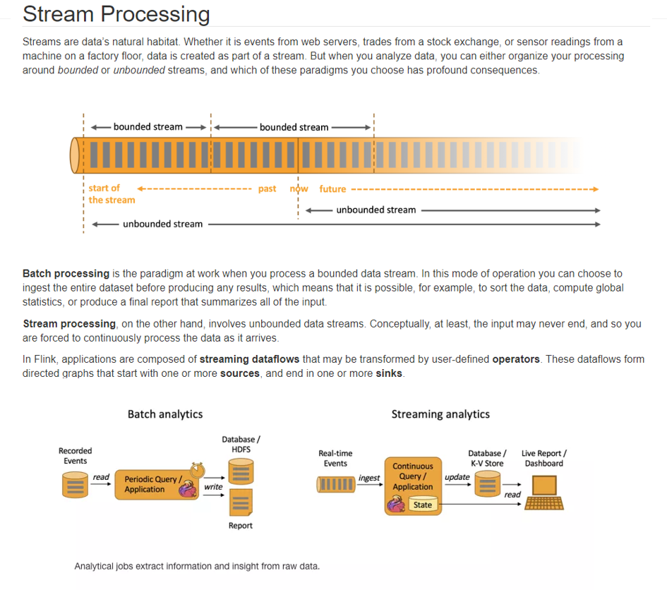


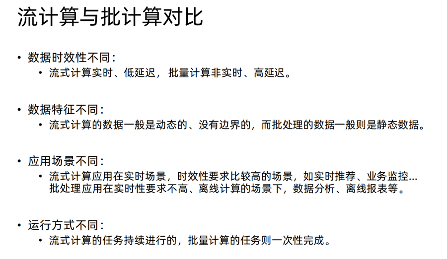


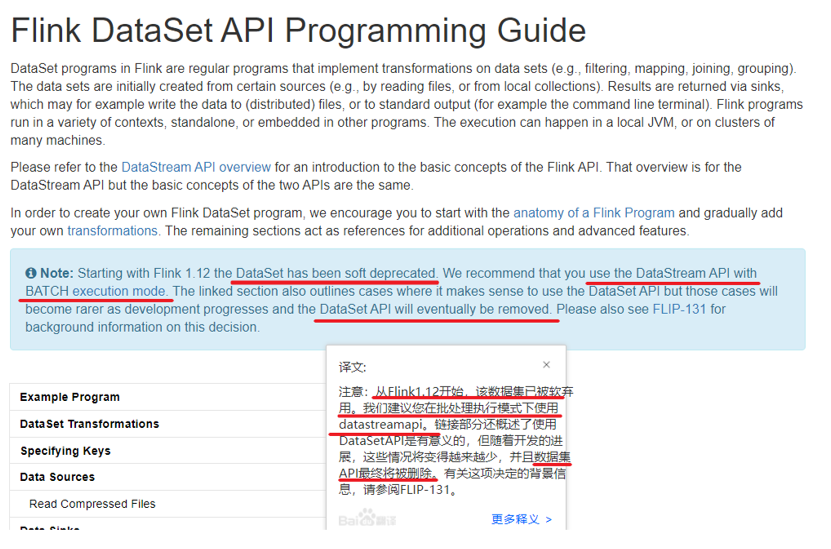


# Source

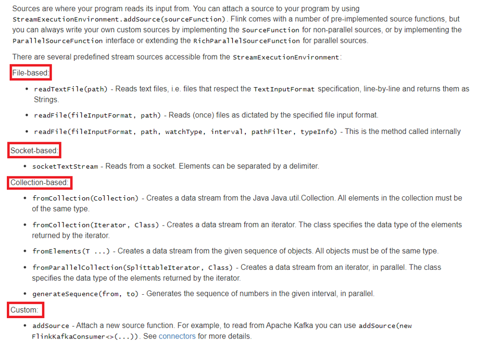

## 基于集合

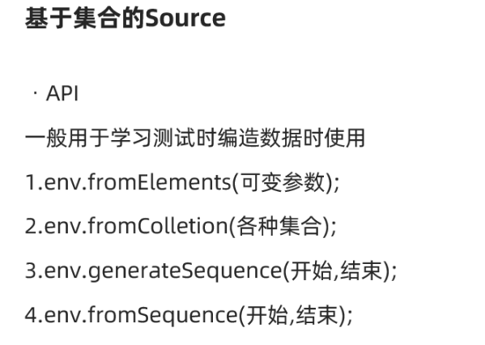

```java
package cn.itcast.source;

import org.apache.flink.api.common.RuntimeExecutionMode;
import org.apache.flink.streaming.api.datastream.DataStream;
import org.apache.flink.streaming.api.environment.StreamExecutionEnvironment;

import java.util.Arrays;

/**
 * Author itcast
 * Desc 演示DataStream-Source-基于集合
 */
public class SourceDemo01_Collection {
    public static void main(String[] args) throws Exception {
        //TODO 0.env
        StreamExecutionEnvironment env = StreamExecutionEnvironment.getExecutionEnvironment();
        env.setRuntimeMode(RuntimeExecutionMode.AUTOMATIC);

        //TODO 1.source
        DataStream<String> ds1 = env.fromElements("hadoop spark flink", "hadoop spark flink");
        DataStream<String> ds2 = env.fromCollection(Arrays.asList("hadoop spark flink", "hadoop spark flink"));
        DataStream<Long> ds3 = env.generateSequence(1, 100);
        DataStream<Long> ds4 = env.fromSequence(1, 100);

        //TODO 2.transformation

        //TODO 3.sink
        ds1.print();
        ds2.print();
        ds3.print();
        ds4.print();

        //TODO 4.execute
        env.execute();
    }
}

```


## 基于文件

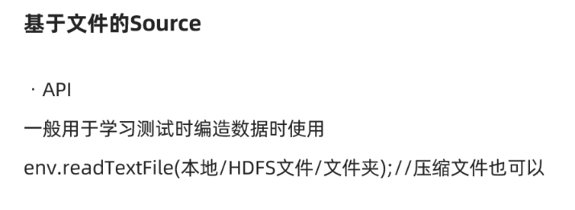

```java
package cn.itcast.source;

import org.apache.flink.api.common.RuntimeExecutionMode;
import org.apache.flink.streaming.api.datastream.DataStream;
import org.apache.flink.streaming.api.environment.StreamExecutionEnvironment;

/**
 * Author itcast
 * Desc 演示DataStream-Source-基于本地/HDFS的文件/文件夹/压缩文件
 */
public class SourceDemo02_File {
    public static void main(String[] args) throws Exception {
        //TODO 0.env
        StreamExecutionEnvironment env = StreamExecutionEnvironment.getExecutionEnvironment();
        env.setRuntimeMode(RuntimeExecutionMode.AUTOMATIC);

        //TODO 1.source
        DataStream<String> ds1 = env.readTextFile("data/input/words.txt");
        DataStream<String> ds2 = env.readTextFile("data/input/dir");
        DataStream<String> ds3 = env.readTextFile("data/input/wordcount.txt.gz");


        //TODO 2.transformation

        //TODO 3.sink
        ds1.print();
        ds2.print();
        ds3.print();

        //TODO 4.execute
        env.execute();
    }
}

```


## 基于Socket

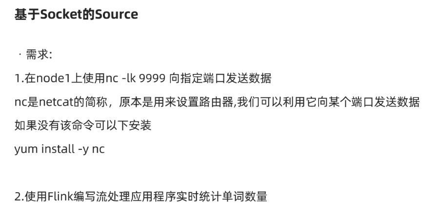

```java
package cn.itcast.source;

import org.apache.flink.api.common.RuntimeExecutionMode;
import org.apache.flink.api.common.functions.FlatMapFunction;
import org.apache.flink.api.java.tuple.Tuple2;
import org.apache.flink.streaming.api.datastream.DataStream;
import org.apache.flink.streaming.api.datastream.SingleOutputStreamOperator;
import org.apache.flink.streaming.api.environment.StreamExecutionEnvironment;
import org.apache.flink.util.Collector;

/**
 * Author itcast
 * Desc 演示DataStream-Source-基于Socket
 */
public class SourceDemo03_Socket {
    public static void main(String[] args) throws Exception {
        //TODO 0.env
        StreamExecutionEnvironment env = StreamExecutionEnvironment.getExecutionEnvironment();
        env.setRuntimeMode(RuntimeExecutionMode.AUTOMATIC);

        //TODO 1.source
        DataStream<String> lines = env.socketTextStream("node1", 9999);


        //TODO 2.transformation
        /*SingleOutputStreamOperator<String> words = lines.flatMap(new FlatMapFunction<String, String>() {
            @Override
            public void flatMap(String value, Collector<String> out) throws Exception {
                String[] arr = value.split(" ");
                for (String word : arr) {
                    out.collect(word);
                }
            }
        });

        words.map(new MapFunction<String, Tuple2<String,Integer>>() {
            @Override
            public Tuple2<String, Integer> map(String value) throws Exception {
                return Tuple2.of(value,1);
            }
        });*/

        //注意:下面的操作将上面的2步合成了1步,直接切割单词并记为1返回
        SingleOutputStreamOperator<Tuple2<String, Integer>> wordAndOne = lines.flatMap(new FlatMapFunction<String, Tuple2<String, Integer>>() {
            @Override
            public void flatMap(String value, Collector<Tuple2<String, Integer>> out) throws Exception {
                String[] arr = value.split(" ");
                for (String word : arr) {
                    out.collect(Tuple2.of(word, 1));
                }
            }
        });

        SingleOutputStreamOperator<Tuple2<String, Integer>> result = wordAndOne.keyBy(t -> t.f0).sum(1);

        //TODO 3.sink
        result.print();

        //TODO 4.execute
        env.execute();
    }
}

```


## 自定义Source-随机订单数据

注意: lombok的使用

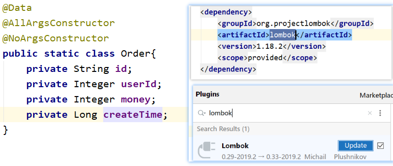

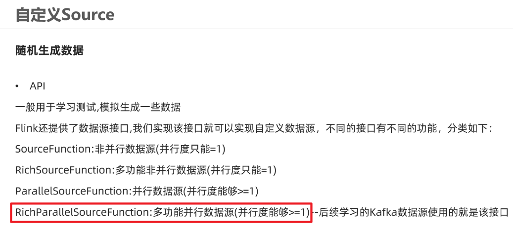

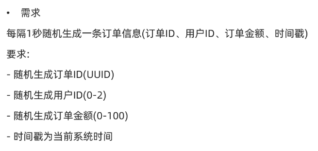

```java
package cn.itcast.source;

import lombok.AllArgsConstructor;
import lombok.Data;
import lombok.NoArgsConstructor;
import org.apache.flink.api.common.RuntimeExecutionMode;
import org.apache.flink.streaming.api.datastream.DataStream;
import org.apache.flink.streaming.api.environment.StreamExecutionEnvironment;
import org.apache.flink.streaming.api.functions.source.RichParallelSourceFunction;

import java.util.Random;
import java.util.UUID;

/**
 * Author itcast
 * Desc 演示DataStream-Source-自定义数据源
 * 需求:
 */
public class SourceDemo04_Customer {
    public static void main(String[] args) throws Exception {
        //TODO 0.env
        StreamExecutionEnvironment env = StreamExecutionEnvironment.getExecutionEnvironment();
        env.setRuntimeMode(RuntimeExecutionMode.AUTOMATIC);

        //TODO 1.source
        DataStream<Order> orderDS = env.addSource(new MyOrderSource()).setParallelism(2);

        //TODO 2.transformation

        //TODO 3.sink
        orderDS.print();

        //TODO 4.execute
        env.execute();
    }
    @Data
    @AllArgsConstructor
    @NoArgsConstructor
    public static class Order{
        private String id;
        private Integer userId;
        private Integer money;
        private Long createTime;
    }
    public static class MyOrderSource extends RichParallelSourceFunction<Order>{

        private Boolean flag = true;
        //执行并生成数据
        @Override
        public void run(SourceContext<Order> ctx) throws Exception {
            Random random = new Random();
            while (flag) {
                String oid = UUID.randomUUID().toString();
                int userId = random.nextInt(3);
                int money = random.nextInt(101);
                long createTime = System.currentTimeMillis();
                ctx.collect(new Order(oid,userId,money,createTime));
                Thread.sleep(1000);
            }
        }

        //执行cancel命令的时候执行
        @Override
        public void cancel() {
            flag = false;
        }
    }
}

```


## 自定义Source-MySQL

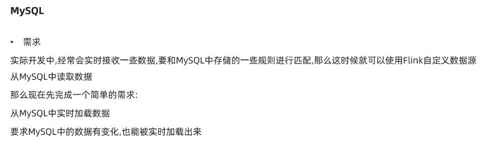

```java
package cn.itcast.source;

import lombok.AllArgsConstructor;
import lombok.Data;
import lombok.NoArgsConstructor;
import org.apache.flink.api.common.RuntimeExecutionMode;
import org.apache.flink.configuration.Configuration;
import org.apache.flink.streaming.api.datastream.DataStream;
import org.apache.flink.streaming.api.environment.StreamExecutionEnvironment;
import org.apache.flink.streaming.api.functions.source.RichParallelSourceFunction;

import java.sql.Connection;
import java.sql.DriverManager;
import java.sql.PreparedStatement;
import java.sql.ResultSet;

/**
 * Author itcast
 * Desc 演示DataStream-Source-自定义数据源-MySQL
 * 需求:
 */
public class SourceDemo05_Customer_MySQL {
    public static void main(String[] args) throws Exception {
        //TODO 0.env
        StreamExecutionEnvironment env = StreamExecutionEnvironment.getExecutionEnvironment();
        env.setRuntimeMode(RuntimeExecutionMode.AUTOMATIC);

        //TODO 1.source
        DataStream<Student> studentDS = env.addSource(new MySQLSource()).setParallelism(1);

        //TODO 2.transformation

        //TODO 3.sink
        studentDS.print();

        //TODO 4.execute
        env.execute();
    }

   /*
   CREATE TABLE `t_student` (
    `id` int(11) NOT NULL AUTO_INCREMENT,
    `name` varchar(255) DEFAULT NULL,
    `age` int(11) DEFAULT NULL,
    PRIMARY KEY (`id`)
) ENGINE=InnoDB AUTO_INCREMENT=7 DEFAULT CHARSET=utf8;

INSERT INTO `t_student` VALUES ('1', 'jack', '18');
INSERT INTO `t_student` VALUES ('2', 'tom', '19');
INSERT INTO `t_student` VALUES ('3', 'rose', '20');
INSERT INTO `t_student` VALUES ('4', 'tom', '19');
INSERT INTO `t_student` VALUES ('5', 'jack', '18');
INSERT INTO `t_student` VALUES ('6', 'rose', '20');
    */

    @Data
    @NoArgsConstructor
    @AllArgsConstructor
    public static class Student {
        private Integer id;
        private String name;
        private Integer age;
    }

    public static class MySQLSource extends RichParallelSourceFunction<Student> {
        private boolean flag = true;
        private Connection conn = null;
        private PreparedStatement ps =null;
        private ResultSet rs  = null;
        //open只执行一次,适合开启资源
        @Override
        public void open(Configuration parameters) throws Exception {
            conn = DriverManager.getConnection("jdbc:mysql://localhost:3306/bigdata", "root", "root");
            String sql = "select id,name,age from t_student";
            ps = conn.prepareStatement(sql);
        }

        @Override
        public void run(SourceContext<Student> ctx) throws Exception {
            while (flag) {
                rs = ps.executeQuery();
                while (rs.next()) {
                    int id = rs.getInt("id");
                    String name = rs.getString("name");
                    int age  = rs.getInt("age");
                    ctx.collect(new Student(id,name,age));
                }
                Thread.sleep(5000);
            }
        }

        //接收到cancel命令时取消数据生成
        @Override
        public void cancel() {
            flag = false;
        }

        //close里面关闭资源
        @Override
        public void close() throws Exception {
            if(conn != null) conn.close();
            if(ps != null) ps.close();
            if(rs != null) rs.close();

        }
    }

}

```


# Transformation

## 基本操作

map/flatMap/filter/keyBy/sum/reduce...

和之前学习的Scala/Spark里面的一样的意思


需求

对流数据中的单词进行统计，排除敏感词TMD(Theater Missile Defense 战区导弹防御)

```java
package cn.itcast.transformation;

import org.apache.flink.api.common.RuntimeExecutionMode;
import org.apache.flink.api.common.functions.FilterFunction;
import org.apache.flink.api.common.functions.FlatMapFunction;
import org.apache.flink.api.common.functions.MapFunction;
import org.apache.flink.api.common.functions.ReduceFunction;
import org.apache.flink.api.java.tuple.Tuple2;
import org.apache.flink.streaming.api.datastream.DataStream;
import org.apache.flink.streaming.api.datastream.KeyedStream;
import org.apache.flink.streaming.api.datastream.SingleOutputStreamOperator;
import org.apache.flink.streaming.api.environment.StreamExecutionEnvironment;
import org.apache.flink.util.Collector;

/**
 * Author itcast
 * Desc 演示DataStream-Transformation-基本操作
 */
public class TransformationDemo01 {
    public static void main(String[] args) throws Exception {
        //TODO 0.env
        StreamExecutionEnvironment env = StreamExecutionEnvironment.getExecutionEnvironment();
        env.setRuntimeMode(RuntimeExecutionMode.AUTOMATIC);

        //TODO 1.source
        DataStream<String> lines = env.socketTextStream("node1", 9999);


        //TODO 2.transformation
        DataStream<String> words = lines.flatMap(new FlatMapFunction<String, String>() {
            @Override
            public void flatMap(String value, Collector<String> out) throws Exception {
                String[] arr = value.split(" ");
                for (String word : arr) {
                    out.collect(word);
                }
            }
        });

        DataStream<String> filted = words.filter(new FilterFunction<String>() {
            @Override
            public boolean filter(String value) throws Exception {
                return !value.equals("TMD");//如果是TMD则返回false表示过滤掉
            }
        });

        SingleOutputStreamOperator<Tuple2<String, Integer>> wordAndOne = filted.map(new MapFunction<String, Tuple2<String, Integer>>() {
            @Override
            public Tuple2<String, Integer> map(String value) throws Exception {
                return Tuple2.of(value, 1);
            }
        });

        KeyedStream<Tuple2<String, Integer>, String> grouped = wordAndOne.keyBy(t -> t.f0);

        //SingleOutputStreamOperator<Tuple2<String, Integer>> result = grouped.sum(1);

        SingleOutputStreamOperator<Tuple2<String, Integer>> result = grouped.reduce(new ReduceFunction<Tuple2<String, Integer>>() {
            @Override
            public Tuple2<String, Integer> reduce(Tuple2<String, Integer> value1, Tuple2<String, Integer> value2) throws Exception {
                //Tuple2<String, Integer> value1 :进来的(单词,历史值)
                //Tuple2<String, Integer> value2 :进来的(单词,1)
                //需要返回(单词,数量)
                return Tuple2.of(value1.f0, value1.f1 + value2.f1); //_+_
            }
        });

        //TODO 3.sink
        result.print();

        //TODO 4.execute
        env.execute();
    }
}

```


## 合并和连接

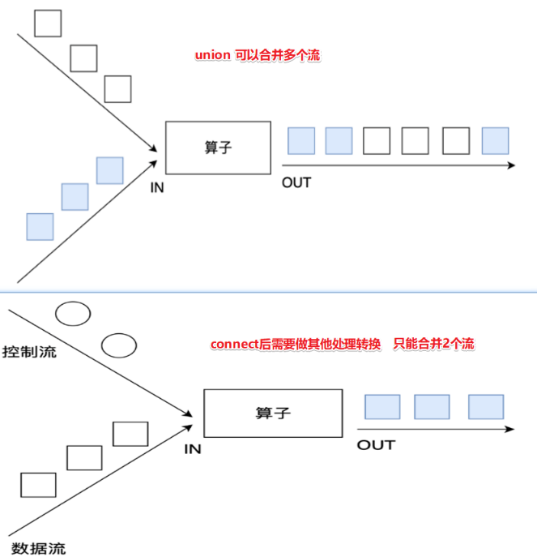

```java
package cn.itcast.transformation;

import org.apache.flink.api.common.RuntimeExecutionMode;
import org.apache.flink.streaming.api.datastream.ConnectedStreams;
import org.apache.flink.streaming.api.datastream.DataStream;
import org.apache.flink.streaming.api.datastream.SingleOutputStreamOperator;
import org.apache.flink.streaming.api.environment.StreamExecutionEnvironment;
import org.apache.flink.streaming.api.functions.co.CoMapFunction;

/**
 * Author itcast
 * Desc 演示DataStream-Transformation-合并和连接操作
 */
public class TransformationDemo02 {
    public static void main(String[] args) throws Exception {
        //TODO 0.env
        StreamExecutionEnvironment env = StreamExecutionEnvironment.getExecutionEnvironment();
        env.setRuntimeMode(RuntimeExecutionMode.AUTOMATIC);

        //TODO 1.source
        DataStream<String> ds1 = env.fromElements("hadoop", "spark", "flink");
        DataStream<String> ds2 = env.fromElements("hadoop", "spark", "flink");
        DataStream<Long> ds3 = env.fromElements(1L, 2L, 3L);

        //TODO 2.transformation
        DataStream<String> result1 = ds1.union(ds2);//注意union能合并同类型
        //ds1.union(ds3);//注意union不可以合并不同类型
        ConnectedStreams<String, String> result2 = ds1.connect(ds2);//注意:connet可以合并同类型
        ConnectedStreams<String, Long> result3 = ds1.connect(ds3);//注意connet可以合并不同类型

        /*
        public interface CoMapFunction<IN1, IN2, OUT> extends Function, Serializable {
            OUT map1(IN1 value) throws Exception;
            OUT map2(IN2 value) throws Exception;
        }
         */
        SingleOutputStreamOperator<String> result = result3.map(new CoMapFunction<String, Long, String>() {
            @Override
            public String map1(String value) throws Exception {
                return "String:" + value;
            }

            @Override
            public String map2(Long value) throws Exception {
                return "Long:" + value;
            }
        });


        //TODO 3.sink
        result1.print();
        //result2.print();//注意:connect之后需要做其他的处理,不能直接输出
        //result3.print();//注意:connect之后需要做其他的处理,不能直接输出
        result.print();

        //TODO 4.execute
        env.execute();
    }
}

```


## 拆分和选择

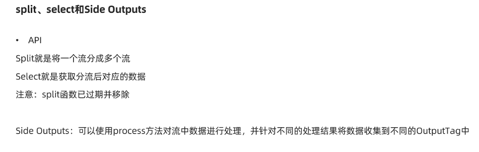

```java
package cn.itcast.transformation;

import org.apache.flink.api.common.RuntimeExecutionMode;
import org.apache.flink.api.common.typeinfo.TypeInformation;
import org.apache.flink.streaming.api.datastream.DataStream;
import org.apache.flink.streaming.api.datastream.DataStreamSource;
import org.apache.flink.streaming.api.datastream.SingleOutputStreamOperator;
import org.apache.flink.streaming.api.environment.StreamExecutionEnvironment;
import org.apache.flink.streaming.api.functions.ProcessFunction;
import org.apache.flink.util.Collector;
import org.apache.flink.util.OutputTag;

/**
 * Author itcast
 * Desc 演示DataStream-Transformation-拆分(split)和选择(select)操作
 * 注意split和select在flink1.12中已经过期并移除了
 * 所以得使用outPutTag和process来实现
 * 需求:对流中的数据按照奇数和偶数拆分并选择
 */
public class TransformationDemo03 {
    public static void main(String[] args) throws Exception {
        //TODO 0.env
        StreamExecutionEnvironment env = StreamExecutionEnvironment.getExecutionEnvironment();
        env.setRuntimeMode(RuntimeExecutionMode.AUTOMATIC);

        //TODO 1.source
        DataStreamSource<Integer> ds = env.fromElements(1, 2, 3, 4, 5, 6, 7, 8, 9, 10);

        //TODO 2.transformation
        //需求:对流中的数据按照奇数和偶数拆分并选择
        OutputTag<Integer> oddTag = new OutputTag<>("奇数", TypeInformation.of(Integer.class));
        OutputTag<Integer> evenTag = new OutputTag<>("偶数",TypeInformation.of(Integer.class));

        /*
        public abstract class ProcessFunction<I, O> extends AbstractRichFunction {
            public abstract void processElement(I value, ProcessFunction.Context ctx, Collector<O> out) throws Exception;
        }
         */
        SingleOutputStreamOperator<Integer> result = ds.process(new ProcessFunction<Integer, Integer>() {
            @Override
            public void processElement(Integer value, Context ctx, Collector<Integer> out) throws Exception {
                //out收集完的还是放在一起的,ctx可以将数据放到不同的OutputTag
                if (value % 2 == 0) {
                    ctx.output(evenTag, value);
                } else {
                    ctx.output(oddTag, value);
                }
            }
        });

        DataStream<Integer> oddResult = result.getSideOutput(oddTag);
        DataStream<Integer> evenResult = result.getSideOutput(evenTag);

        //TODO 3.sink
        System.out.println(oddTag);//OutputTag(Integer, 奇数)
        System.out.println(evenTag);//OutputTag(Integer, 偶数)
        oddResult.print("奇数:");
        evenResult.print("偶数:");

        //TODO 4.execute
        env.execute();
    }
}

```


## rebalance重平衡分区

解决数据倾斜的问题

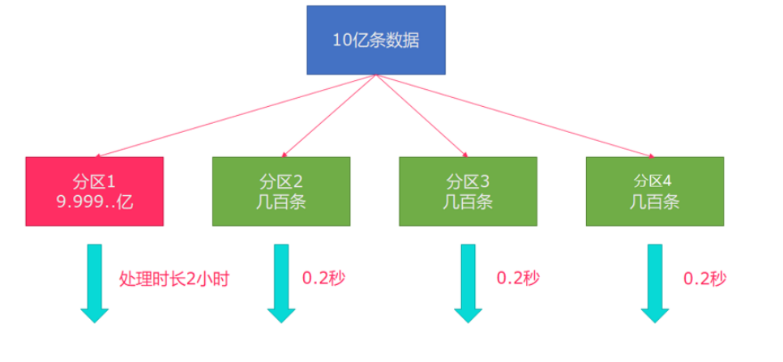

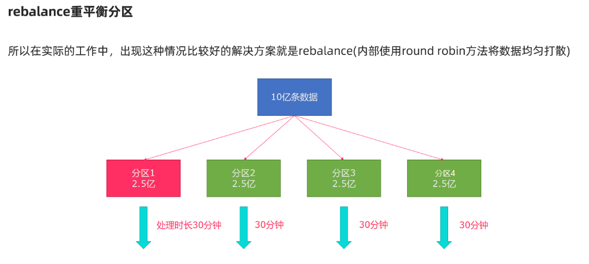


```java
package cn.itcast.transformation;

import org.apache.flink.api.common.RuntimeExecutionMode;
import org.apache.flink.api.common.functions.FilterFunction;
import org.apache.flink.api.common.functions.RichMapFunction;
import org.apache.flink.api.java.tuple.Tuple2;
import org.apache.flink.streaming.api.datastream.DataStream;
import org.apache.flink.streaming.api.datastream.SingleOutputStreamOperator;
import org.apache.flink.streaming.api.environment.StreamExecutionEnvironment;

/**
 * Author itcast
 * Desc 演示DataStream-Transformation-rebalance-重平衡分区
 */
public class TransformationDemo04 {
    public static void main(String[] args) throws Exception {
        //TODO 0.env
        StreamExecutionEnvironment env = StreamExecutionEnvironment.getExecutionEnvironment();
        env.setRuntimeMode(RuntimeExecutionMode.AUTOMATIC);

        //TODO 1.source
        DataStream<Long> longDS = env.fromSequence(0, 100);
        //下面的操作相当于将数据随机分配一下,有可能出现数据倾斜
        DataStream<Long> filterDS = longDS.filter(new FilterFunction<Long>() {
            @Override
            public boolean filter(Long num) throws Exception {
                return num > 10;
            }
        });

        //TODO 2.transformation
        //没有经过rebalance有可能出现数据倾斜
        SingleOutputStreamOperator<Tuple2<Integer, Integer>> result1 = filterDS
                .map(new RichMapFunction<Long, Tuple2<Integer, Integer>>() {
                    @Override
                    public Tuple2<Integer, Integer> map(Long value) throws Exception {
                        int subTaskId = getRuntimeContext().getIndexOfThisSubtask();//子任务id/分区编号
                        return Tuple2.of(subTaskId, 1);
                    }
                    //按照子任务id/分区编号分组,并统计每个子任务/分区中有几个元素
                }).keyBy(t -> t.f0).sum(1);

        //调用了rebalance解决了数据倾斜
        SingleOutputStreamOperator<Tuple2<Integer, Integer>> result2 = filterDS.rebalance()
                .map(new RichMapFunction<Long, Tuple2<Integer, Integer>>() {
                    @Override
                    public Tuple2<Integer, Integer> map(Long value) throws Exception {
                        int subTaskId = getRuntimeContext().getIndexOfThisSubtask();//子任务id/分区编号
                        return Tuple2.of(subTaskId, 1);
                    }
                    //按照子任务id/分区编号分组,并统计每个子任务/分区中有几个元素
                }).keyBy(t -> t.f0).sum(1);


        //TODO 3.sink
        result1.print("result1");
        result2.print("result2");


        //TODO 4.execute
        env.execute();
    }
}

```


## 其他分区操作


```java
package cn.itcast.transformation;

        import org.apache.flink.api.common.RuntimeExecutionMode;
        import org.apache.flink.api.common.functions.FlatMapFunction;
        import org.apache.flink.api.common.functions.Partitioner;
        import org.apache.flink.api.java.tuple.Tuple2;
        import org.apache.flink.streaming.api.datastream.DataStream;
        import org.apache.flink.streaming.api.datastream.SingleOutputStreamOperator;
        import org.apache.flink.streaming.api.environment.StreamExecutionEnvironment;
        import org.apache.flink.util.Collector;

/**
 * Author itcast
 * Desc 演示DataStream-Transformation-各种分区
 */
public class TransformationDemo05 {
    public static void main(String[] args) throws Exception {
        //TODO 0.env
        StreamExecutionEnvironment env = StreamExecutionEnvironment.getExecutionEnvironment();
        env.setRuntimeMode(RuntimeExecutionMode.AUTOMATIC);

        //TODO 1.source
        DataStream<String> linesDS = env.readTextFile("data/input/words.txt");
        SingleOutputStreamOperator<Tuple2<String, Integer>> tupleDS = linesDS.flatMap(new FlatMapFunction<String, Tuple2<String, Integer>>() {
            @Override
            public void flatMap(String value, Collector<Tuple2<String, Integer>> out) throws Exception {
                String[] words = value.split(" ");
                for (String word : words) {
                    out.collect(Tuple2.of(word, 1));
                }
            }
        });

        //TODO 2.transformation
        DataStream<Tuple2<String, Integer>> result1 = tupleDS.global();
        DataStream<Tuple2<String, Integer>> result2 = tupleDS.broadcast();
        DataStream<Tuple2<String, Integer>> result3 = tupleDS.forward();
        DataStream<Tuple2<String, Integer>> result4 = tupleDS.shuffle();
        DataStream<Tuple2<String, Integer>> result5 = tupleDS.rebalance();
        DataStream<Tuple2<String, Integer>> result6 = tupleDS.rescale();
        DataStream<Tuple2<String, Integer>> result7 = tupleDS.partitionCustom(new MyPartitioner(), t -> t.f0);


        //TODO 3.sink
        result1.print("result1");
        result2.print("result2");
        result3.print("result3");
        result4.print("result4");
        result5.print("result5");
        result6.print("result6");
        result7.print("result7");


        //TODO 4.execute
        env.execute();
    }
    public static class MyPartitioner implements Partitioner<String>{
        @Override
        public int partition(String key, int numPartitions) {
            //if(key.equals("北京")) return 0;  这里写自己的分区逻辑即可
            return 0;
        }
    }
}

```


# Sink

## 基于控制台和文件

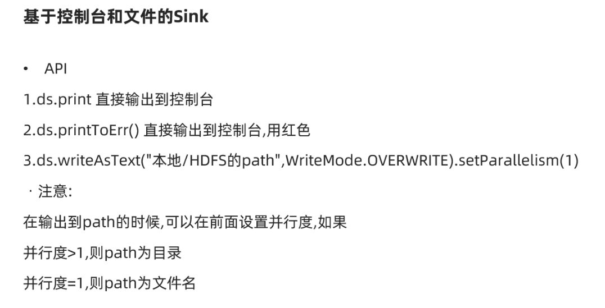

```java
package cn.itcast.sink;

import org.apache.flink.api.common.RuntimeExecutionMode;
import org.apache.flink.streaming.api.datastream.DataStream;
import org.apache.flink.streaming.api.environment.StreamExecutionEnvironment;

/**
 * Author itcast
 * Desc 演示DataStream-Sink-基于控制台和文件
 */
public class SinkDemo01 {
    public static void main(String[] args) throws Exception {
        //TODO 0.env
        StreamExecutionEnvironment env = StreamExecutionEnvironment.getExecutionEnvironment();
        env.setRuntimeMode(RuntimeExecutionMode.AUTOMATIC);

        //TODO 1.source
        DataStream<String> ds = env.readTextFile("data/input/words.txt");

        //TODO 2.transformation
        //TODO 3.sink
        ds.print();
        ds.print("输出标识");
        ds.printToErr();//会在控制台上以红色输出
        ds.printToErr("输出标识");//会在控制台上以红色输出
        ds.writeAsText("data/output/result1").setParallelism(1);
        ds.writeAsText("data/output/result2").setParallelism(2);

        //TODO 4.execute
        env.execute();
    }
}

```


## 自定义Sink

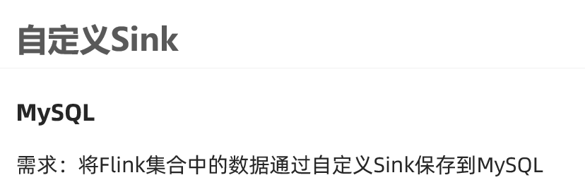

```java
package cn.itcast.sink;

import lombok.AllArgsConstructor;
import lombok.Data;
import lombok.NoArgsConstructor;
import org.apache.flink.api.common.RuntimeExecutionMode;
import org.apache.flink.configuration.Configuration;
import org.apache.flink.streaming.api.datastream.DataStream;
import org.apache.flink.streaming.api.environment.StreamExecutionEnvironment;
import org.apache.flink.streaming.api.functions.sink.RichSinkFunction;

import java.sql.Connection;
import java.sql.DriverManager;
import java.sql.PreparedStatement;

/**
 * Author itcast
 * Desc 演示DataStream-Sink-自定义Sink
 */
public class SinkDemo02 {
    public static void main(String[] args) throws Exception {
        //TODO 0.env
        StreamExecutionEnvironment env = StreamExecutionEnvironment.getExecutionEnvironment();
        env.setRuntimeMode(RuntimeExecutionMode.AUTOMATIC);

        //TODO 1.source
        DataStream<Student> studentDS = env.fromElements(new Student(null, "tony", 18));
        //TODO 2.transformation
        //TODO 3.sink
        studentDS.addSink(new MySQLSink());

        //TODO 4.execute
        env.execute();
    }
    @Data
    @NoArgsConstructor
    @AllArgsConstructor
    public static class Student {
        private Integer id;
        private String name;
        private Integer age;
    }

    public static class MySQLSink extends RichSinkFunction<Student> {
        private Connection conn = null;
        private PreparedStatement ps =null;

        @Override
        public void open(Configuration parameters) throws Exception {
            conn = DriverManager.getConnection("jdbc:mysql://localhost:3306/bigdata", "root", "root");
            String sql = "INSERT INTO `t_student` (`id`, `name`, `age`) VALUES (null, ?, ?);";
            ps = conn.prepareStatement(sql);
        }

        @Override
        public void invoke(Student value, Context context) throws Exception {
            //设置?占位符参数值
            ps.setString(1,value.getName());
            ps.setInt(2,value.getAge());
            //执行sql
            ps.executeUpdate();
        }
        @Override
        public void close() throws Exception {
            if(conn != null) conn.close();
            if(ps != null) ps.close();
        }
    }
}

```


# Connectors

## JDBC

```java
package cn.itcast.connectors;

import lombok.AllArgsConstructor;
import lombok.Data;
import lombok.NoArgsConstructor;
import org.apache.flink.api.common.RuntimeExecutionMode;
import org.apache.flink.connector.jdbc.JdbcConnectionOptions;
import org.apache.flink.connector.jdbc.JdbcSink;
import org.apache.flink.streaming.api.datastream.DataStream;
import org.apache.flink.streaming.api.environment.StreamExecutionEnvironment;

/**
 * Author itcast
 * Desc 演示Flink官方提供的JdbcSink
 */
public class JDBCDemo {
    public static void main(String[] args) throws Exception {
        //TODO 0.env
        StreamExecutionEnvironment env = StreamExecutionEnvironment.getExecutionEnvironment();
        env.setRuntimeMode(RuntimeExecutionMode.AUTOMATIC);

        //TODO 1.source
        DataStream<Student> studentDS = env.fromElements(new Student(null, "tony2", 18));
        //TODO 2.transformation
        //TODO 3.sink
        studentDS.addSink(JdbcSink.sink(
                "INSERT INTO `t_student` (`id`, `name`, `age`) VALUES (null, ?, ?)",
                (ps, value) -> {
                    ps.setString(1, value.getName());
                    ps.setInt(2, value.getAge());
                }, new JdbcConnectionOptions.JdbcConnectionOptionsBuilder()
                        .withUrl("jdbc:mysql://localhost:3306/bigdata")
                        .withUsername("root")
                        .withPassword("root")
                        .withDriverName("com.mysql.jdbc.Driver")
                        .build()));

        //TODO 4.execute
        env.execute();
    }

    @Data
    @NoArgsConstructor
    @AllArgsConstructor
    public static class Student {
        private Integer id;
        private String name;
        private Integer age;
    }

}

```


## Kafka Consumer/Source

参数

env.addSource(new Kafka Consumer/Source(参数))

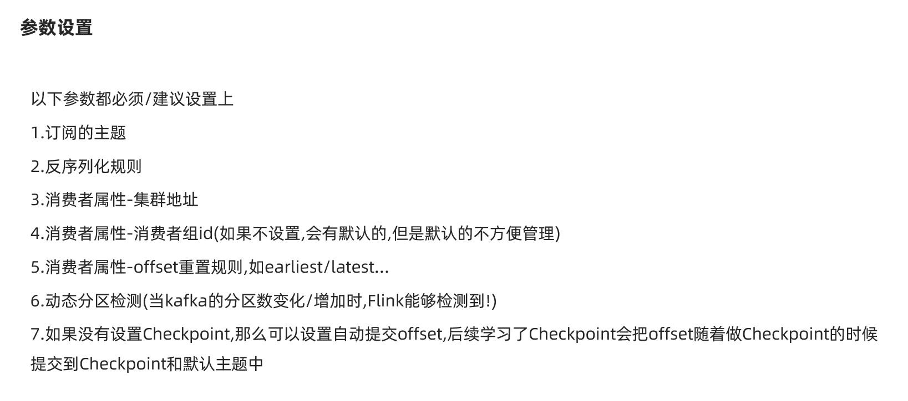

```java
package cn.itcast.connectors;

import org.apache.flink.api.common.RuntimeExecutionMode;
import org.apache.flink.api.common.serialization.SimpleStringSchema;
import org.apache.flink.streaming.api.datastream.DataStream;
import org.apache.flink.streaming.api.environment.StreamExecutionEnvironment;
import org.apache.flink.streaming.connectors.kafka.FlinkKafkaConsumer;

import java.util.Properties;

/**
 * Author itcast
 * Desc 演示Flink-Connectors-KafkaComsumer/Source
 */
public class KafkaComsumerDemo {
    public static void main(String[] args) throws Exception {
        //TODO 0.env
        StreamExecutionEnvironment env = StreamExecutionEnvironment.getExecutionEnvironment();
        env.setRuntimeMode(RuntimeExecutionMode.AUTOMATIC);

        //TODO 1.source
        //准备kafka连接参数
        Properties props  = new Properties();
        props.setProperty("bootstrap.servers", "node1:9092");//集群地址
        props.setProperty("group.id", "flink");//消费者组id
        props.setProperty("auto.offset.reset","latest");//latest有offset记录从记录位置开始消费,没有记录从最新的/最后的消息开始消费 /earliest有offset记录从记录位置开始消费,没有记录从最早的/最开始的消息开始消费
        props.setProperty("flink.partition-discovery.interval-millis","5000");//会开启一个后台线程每隔5s检测一下Kafka的分区情况,实现动态分区检测
        props.setProperty("enable.auto.commit", "true");//自动提交(提交到默认主题,后续学习了Checkpoint后随着Checkpoint存储在Checkpoint和默认主题中)
        props.setProperty("auto.commit.interval.ms", "2000");//自动提交的时间间隔
        //使用连接参数创建FlinkKafkaConsumer/kafkaSource
        FlinkKafkaConsumer<String> kafkaSource = new FlinkKafkaConsumer<String>("flink_kafka", new SimpleStringSchema(), props);
        //使用kafkaSource
        DataStream<String> kafkaDS = env.addSource(kafkaSource);

        //TODO 2.transformation

        //TODO 3.sink
        kafkaDS.print();

        //TODO 4.execute
        env.execute();
    }
}
//准备主题 /export/server/kafka/bin/kafka-topics.sh --create --zookeeper node1:2181 --replication-factor 2 --partitions 3 --topic flink_kafka
//启动控制台生产者发送数据 /export/server/kafka/bin/kafka-console-producer.sh --broker-list node1:9092 --topic flink_kafka
//启动程序FlinkKafkaConsumer
//观察控制台输出结果
```


## Kafka Producer/Sink

控制台生成者 ---> flink_kafka主题 --> Flink -->etl ---> flink_kafka2主题--->控制台消费者


```java
package cn.itcast.connectors;

import org.apache.flink.api.common.RuntimeExecutionMode;
import org.apache.flink.api.common.functions.FilterFunction;
import org.apache.flink.api.common.serialization.SimpleStringSchema;
import org.apache.flink.streaming.api.datastream.DataStream;
import org.apache.flink.streaming.api.datastream.SingleOutputStreamOperator;
import org.apache.flink.streaming.api.environment.StreamExecutionEnvironment;
import org.apache.flink.streaming.connectors.kafka.FlinkKafkaConsumer;
import org.apache.flink.streaming.connectors.kafka.FlinkKafkaProducer;

import java.util.Properties;

/**
 * Author itcast
 * Desc 演示Flink-Connectors-KafkaComsumer/Source + KafkaProducer/Sink
 */
public class KafkaSinkDemo {
    public static void main(String[] args) throws Exception {
        //TODO 0.env
        StreamExecutionEnvironment env = StreamExecutionEnvironment.getExecutionEnvironment();
        env.setRuntimeMode(RuntimeExecutionMode.AUTOMATIC);

        //TODO 1.source
        //准备kafka连接参数
        Properties props  = new Properties();
        props.setProperty("bootstrap.servers", "node1:9092");//集群地址
        props.setProperty("group.id", "flink");//消费者组id
        props.setProperty("auto.offset.reset","latest");//latest有offset记录从记录位置开始消费,没有记录从最新的/最后的消息开始消费 /earliest有offset记录从记录位置开始消费,没有记录从最早的/最开始的消息开始消费
        props.setProperty("flink.partition-discovery.interval-millis","5000");//会开启一个后台线程每隔5s检测一下Kafka的分区情况,实现动态分区检测
        props.setProperty("enable.auto.commit", "true");//自动提交(提交到默认主题,后续学习了Checkpoint后随着Checkpoint存储在Checkpoint和默认主题中)
        props.setProperty("auto.commit.interval.ms", "2000");//自动提交的时间间隔
        //使用连接参数创建FlinkKafkaConsumer/kafkaSource
        FlinkKafkaConsumer<String> kafkaSource = new FlinkKafkaConsumer<String>("flink_kafka", new SimpleStringSchema(), props);
        //使用kafkaSource
        DataStream<String> kafkaDS = env.addSource(kafkaSource);

        //TODO 2.transformation
        SingleOutputStreamOperator<String> etlDS = kafkaDS.filter(new FilterFunction<String>() {
            @Override
            public boolean filter(String value) throws Exception {
                return value.contains("success");
            }
        });

        //TODO 3.sink
        etlDS.print();

        Properties props2 = new Properties();
        props2.setProperty("bootstrap.servers", "node1:9092");
        FlinkKafkaProducer<String> kafkaSink = new FlinkKafkaProducer<>("flink_kafka2", new SimpleStringSchema(), props2);
        etlDS.addSink(kafkaSink);

        //TODO 4.execute
        env.execute();
    }
}
//控制台生成者 ---> flink_kafka主题 --> Flink -->etl ---> flink_kafka2主题--->控制台消费者
//准备主题 /export/server/kafka/bin/kafka-topics.sh --create --zookeeper node1:2181 --replication-factor 2 --partitions 3 --topic flink_kafka
//准备主题 /export/server/kafka/bin/kafka-topics.sh --create --zookeeper node1:2181 --replication-factor 2 --partitions 3 --topic flink_kafka2
//启动控制台生产者发送数据 /export/server/kafka/bin/kafka-console-producer.sh --broker-list node1:9092 --topic flink_kafka
//log:2020-10-10 success xxx
//log:2020-10-10 success xxx
//log:2020-10-10 success xxx
//log:2020-10-10 fail xxx
//启动控制台消费者消费数据 /export/server/kafka/bin/kafka-console-consumer.sh --bootstrap-server node1:9092 --topic flink_kafka2 --from-beginning
//启动程序FlinkKafkaConsumer
//观察控制台输出结果

```


## Redis

https://bahir.apache.org/docs/flink/current/flink-streaming-redis/

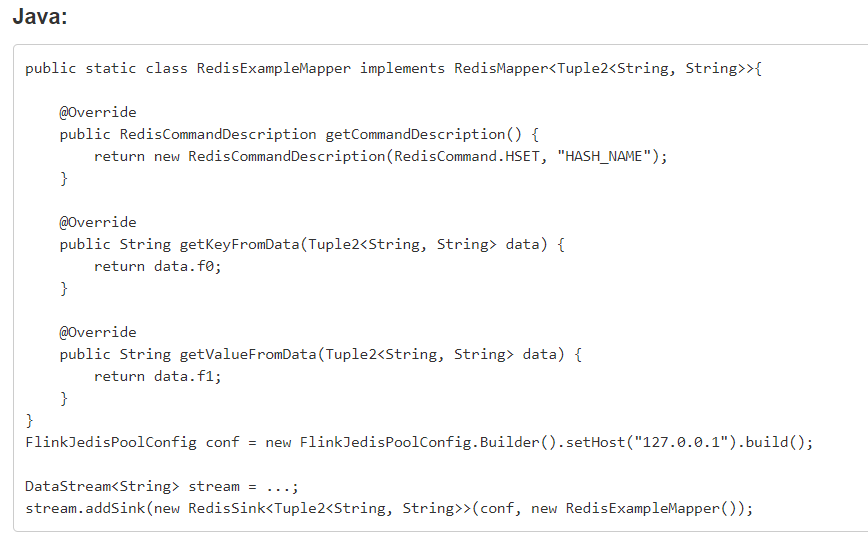

需求:

从Socket接收实时流数据,做WordCount,并将结果写入到Redis

数据结构使用: 

单词:数量 (key-String, value-String)

wcresult: 单词:数量 (key-String, value-Hash)

注意: Redis的Key始终是String, value可以是:String/Hash/List/Set/有序Set

```java
package cn.itcast.connectors;

import org.apache.flink.api.common.RuntimeExecutionMode;
import org.apache.flink.api.common.functions.FlatMapFunction;
import org.apache.flink.api.java.tuple.Tuple2;
import org.apache.flink.streaming.api.datastream.DataStream;
import org.apache.flink.streaming.api.datastream.SingleOutputStreamOperator;
import org.apache.flink.streaming.api.environment.StreamExecutionEnvironment;
import org.apache.flink.streaming.connectors.redis.RedisSink;
import org.apache.flink.streaming.connectors.redis.common.config.FlinkJedisPoolConfig;
import org.apache.flink.streaming.connectors.redis.common.mapper.RedisCommand;
import org.apache.flink.streaming.connectors.redis.common.mapper.RedisCommandDescription;
import org.apache.flink.streaming.connectors.redis.common.mapper.RedisMapper;
import org.apache.flink.util.Collector;

/**
 * Author itcast
 * Desc 演示Flink-Connectors-三方提供的RedisSink
 */
public class RedisDemo {
    public static void main(String[] args) throws Exception {
        //TODO 0.env
        StreamExecutionEnvironment env = StreamExecutionEnvironment.getExecutionEnvironment();
        env.setRuntimeMode(RuntimeExecutionMode.AUTOMATIC);

        //TODO 1.source
        DataStream<String> lines = env.socketTextStream("node1", 9999);

        //TODO 2.transformation
        SingleOutputStreamOperator<Tuple2<String, Integer>> result = lines.flatMap(new FlatMapFunction<String, Tuple2<String, Integer>>() {
            @Override
            public void flatMap(String value, Collector<Tuple2<String, Integer>> out) throws Exception {
                String[] arr = value.split(" ");
                for (String word : arr) {
                    out.collect(Tuple2.of(word, 1));
                }
            }
        }).keyBy(t -> t.f0).sum(1);


        //TODO 3.sink
        result.print();

        FlinkJedisPoolConfig conf = new FlinkJedisPoolConfig.Builder().setHost("127.0.0.1").build();
        RedisSink<Tuple2<String, Integer>> redisSink = new RedisSink<Tuple2<String, Integer>>(conf,new MyRedisMapper());
        result.addSink(redisSink);

        //TODO 4.execute
        env.execute();
    }
    public static class MyRedisMapper implements RedisMapper<Tuple2<String, Integer>>{
        @Override
        public RedisCommandDescription getCommandDescription() {
            //我们选择的数据结构对应的是 key:String("wcresult"),value:Hash(单词,数量),命令为HSET
            return new RedisCommandDescription(RedisCommand.HSET,"wcresult");
        }

        @Override
        public String getKeyFromData(Tuple2<String, Integer> t) {
            return  t.f0;
        }

        @Override
        public String getValueFromData(Tuple2<String, Integer> t) {
            return t.f1.toString();
        }
    }
}

```

