# Flink四大基石

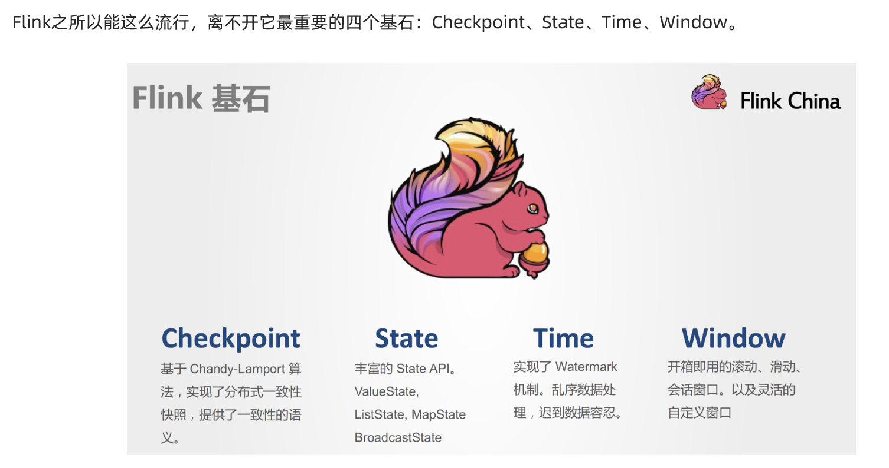

# Window

## 窗口的分类

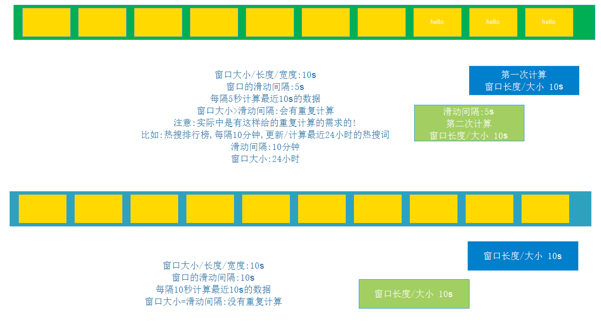


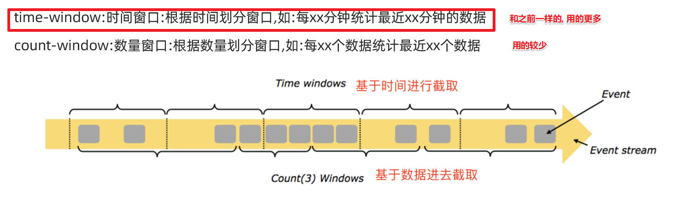

基于时间的滑动窗口(掌握)

基于时间的滚动窗口(掌握)

基于数量的滑动窗口(了解)

基于数量的滚动窗口(了解)

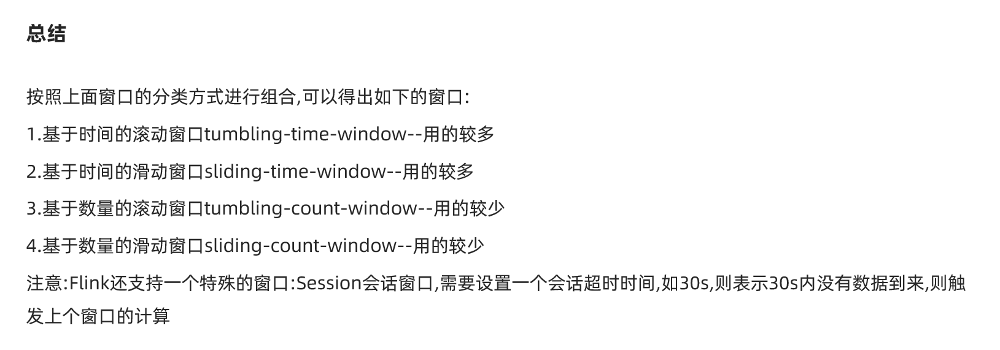

## API

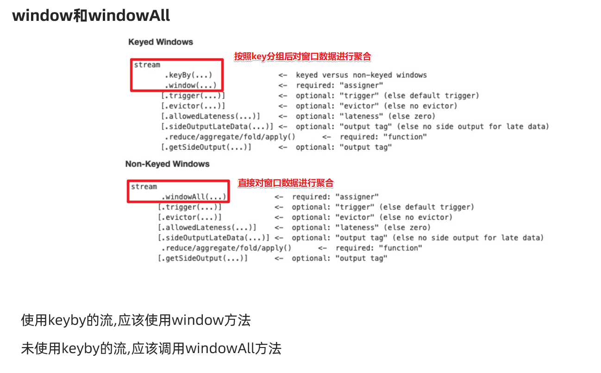

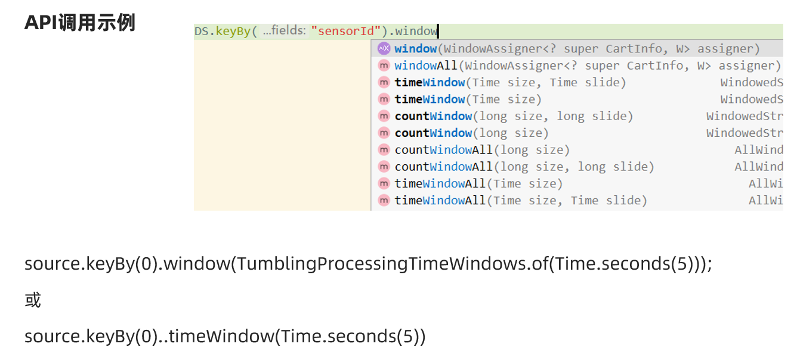


## 代码演示-基于时间的滚动和滑动-掌握

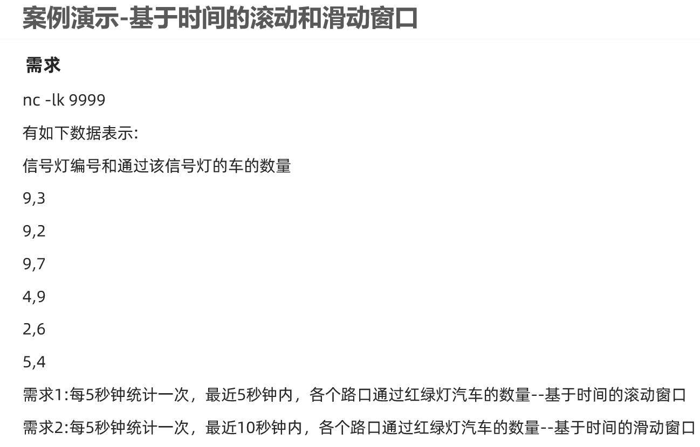

```java
package cn.itcast.window;

import lombok.AllArgsConstructor;
import lombok.Data;
import lombok.NoArgsConstructor;
import org.apache.flink.api.common.RuntimeExecutionMode;
import org.apache.flink.api.common.functions.MapFunction;
import org.apache.flink.streaming.api.datastream.DataStream;
import org.apache.flink.streaming.api.datastream.KeyedStream;
import org.apache.flink.streaming.api.datastream.SingleOutputStreamOperator;
import org.apache.flink.streaming.api.environment.StreamExecutionEnvironment;
import org.apache.flink.streaming.api.windowing.assigners.SlidingProcessingTimeWindows;
import org.apache.flink.streaming.api.windowing.assigners.TumblingProcessingTimeWindows;
import org.apache.flink.streaming.api.windowing.time.Time;

/**
 * Author itcast
 * Desc 演示基于时间的滚动和滑动窗口
 */
public class WindowDemo_1_2 {
    public static void main(String[] args) throws Exception {
        //TODO 0.env
        StreamExecutionEnvironment env = StreamExecutionEnvironment.getExecutionEnvironment();
        env.setRuntimeMode(RuntimeExecutionMode.AUTOMATIC);

        //TODO 1.source
        DataStream<String> lines = env.socketTextStream("node1", 9999);
        //TODO 2.transformation
        SingleOutputStreamOperator<CartInfo> carDS = lines.map(new MapFunction<String, CartInfo>() {
            @Override
            public CartInfo map(String value) throws Exception {
                String[] arr = value.split(",");
                return new CartInfo(arr[0], Integer.parseInt(arr[1]));
            }
        });

        //注意: 需求中要求的是各个路口/红绿灯的结果,所以需要先分组
        //carDS.keyBy(car->car.getSensorId())
        KeyedStream<CartInfo, String> keyedDS = carDS.keyBy(CartInfo::getSensorId);
        // * 需求1:每5秒钟统计一次，最近5秒钟内，各个路口通过红绿灯汽车的数量--基于时间的滚动窗口
        //keyedDS.timeWindow(Time.seconds(5))
        SingleOutputStreamOperator<CartInfo> result1 = keyedDS
                .window(TumblingProcessingTimeWindows.of(Time.seconds(5)))
                .sum("count");
        // * 需求2:每5秒钟统计一次，最近10秒钟内，各个路口通过红绿灯汽车的数量--基于时间的滑动窗口
        SingleOutputStreamOperator<CartInfo> result2 = keyedDS
                //of(Time size, Time slide)
                .window(SlidingProcessingTimeWindows.of(Time.seconds(10),Time.seconds(5)))
                .sum("count");

        //TODO 3.sink
        //result1.print();
        result2.print();
/*
1,5
2,5
3,5
4,5
*/

        //TODO 4.execute
        env.execute();
    }
    @Data
    @AllArgsConstructor
    @NoArgsConstructor
    public static class CartInfo {
        private String sensorId;//信号灯id
        private Integer count;//通过该信号灯的车的数量
    }
}

```

## 代码演示-基于数量的滚动和滑动

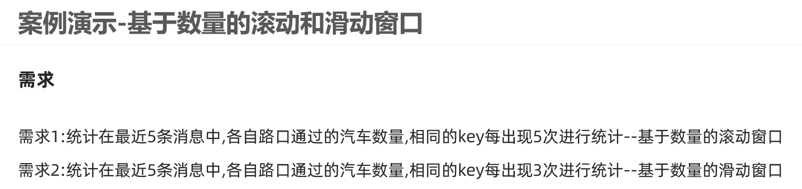

```java
package cn.itcast.window;

import lombok.AllArgsConstructor;
import lombok.Data;
import lombok.NoArgsConstructor;
import org.apache.flink.api.common.RuntimeExecutionMode;
import org.apache.flink.api.common.functions.MapFunction;
import org.apache.flink.streaming.api.datastream.DataStream;
import org.apache.flink.streaming.api.datastream.KeyedStream;
import org.apache.flink.streaming.api.datastream.SingleOutputStreamOperator;
import org.apache.flink.streaming.api.environment.StreamExecutionEnvironment;

/**
 * Author itcast
 * Desc 演示基于数量的滚动和滑动窗口
 */
public class WindowDemo_3_4 {
    public static void main(String[] args) throws Exception {
        //TODO 0.env
        StreamExecutionEnvironment env = StreamExecutionEnvironment.getExecutionEnvironment();
        env.setRuntimeMode(RuntimeExecutionMode.AUTOMATIC);

        //TODO 1.source
        DataStream<String> lines = env.socketTextStream("node1", 9999);

        //TODO 2.transformation
        SingleOutputStreamOperator<CartInfo> carDS = lines.map(new MapFunction<String, CartInfo>() {
            @Override
            public CartInfo map(String value) throws Exception {
                String[] arr = value.split(",");
                return new CartInfo(arr[0], Integer.parseInt(arr[1]));
            }
        });

        //注意: 需求中要求的是各个路口/红绿灯的结果,所以需要先分组
        //carDS.keyBy(car->car.getSensorId())
        KeyedStream<CartInfo, String> keyedDS = carDS.keyBy(CartInfo::getSensorId);

        // * 需求1:统计在最近5条消息中,各自路口通过的汽车数量,相同的key每出现5次进行统计--基于数量的滚动窗口
        SingleOutputStreamOperator<CartInfo> result1 = keyedDS
                .countWindow(5)
                .sum("count");
        // * 需求2:统计在最近5条消息中,各自路口通过的汽车数量,相同的key每出现3次进行统计--基于数量的滑动窗口
        SingleOutputStreamOperator<CartInfo> result2 = keyedDS
                .countWindow(5,3)
                .sum("count");

        //TODO 3.sink
        //result1.print();
        /*
1,1
1,1
1,1
1,1
2,1
1,1
         */
        result2.print();
        /*
1,1
1,1
2,1
1,1
2,1
3,1
4,1
         */

        //TODO 4.execute
        env.execute();
    }
    @Data
    @AllArgsConstructor
    @NoArgsConstructor
    public static class CartInfo {
        private String sensorId;//信号灯id
        private Integer count;//通过该信号灯的车的数量
    }
}

```


## 代码演示-Session会话窗口

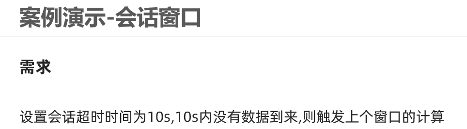

```java
package cn.itcast.window;

import lombok.AllArgsConstructor;
import lombok.Data;
import lombok.NoArgsConstructor;
import org.apache.flink.api.common.RuntimeExecutionMode;
import org.apache.flink.api.common.functions.MapFunction;
import org.apache.flink.streaming.api.datastream.DataStream;
import org.apache.flink.streaming.api.datastream.KeyedStream;
import org.apache.flink.streaming.api.datastream.SingleOutputStreamOperator;
import org.apache.flink.streaming.api.environment.StreamExecutionEnvironment;
import org.apache.flink.streaming.api.windowing.assigners.ProcessingTimeSessionWindows;
import org.apache.flink.streaming.api.windowing.time.Time;

/**
 * Author itcast
 * Desc 演示会话窗口
 */
public class WindowDemo_5 {
    public static void main(String[] args) throws Exception {
        //TODO 0.env
        StreamExecutionEnvironment env = StreamExecutionEnvironment.getExecutionEnvironment();
        env.setRuntimeMode(RuntimeExecutionMode.AUTOMATIC);

        //TODO 1.source
        DataStream<String> lines = env.socketTextStream("node1", 9999);

        //TODO 2.transformation
        SingleOutputStreamOperator<CartInfo> carDS = lines.map(new MapFunction<String, CartInfo>() {
            @Override
            public CartInfo map(String value) throws Exception {
                String[] arr = value.split(",");
                return new CartInfo(arr[0], Integer.parseInt(arr[1]));
            }
        });

        //注意: 需求中要求的是各个路口/红绿灯的结果,所以需要先分组
        //carDS.keyBy(car->car.getSensorId())
        KeyedStream<CartInfo, String> keyedDS = carDS.keyBy(CartInfo::getSensorId);

        //需求:设置会话超时时间为10s,10s内没有数据到来,则触发上个窗口的计算(前提是上一个窗口得有数据!)
        SingleOutputStreamOperator<CartInfo> result = keyedDS.window(ProcessingTimeSessionWindows.withGap(Time.seconds(10)))
                .sum("count");

        //TODO 3.sink
        result.print();
        /*
1,1
1,1
2,1
2,1
         */

        //TODO 4.execute
        env.execute();
    }
    @Data
    @AllArgsConstructor
    @NoArgsConstructor
    public static class CartInfo {
        private String sensorId;//信号灯id
        private Integer count;//通过该信号灯的车的数量
    }
}

```


# Time/Watermarker

## 时间分类

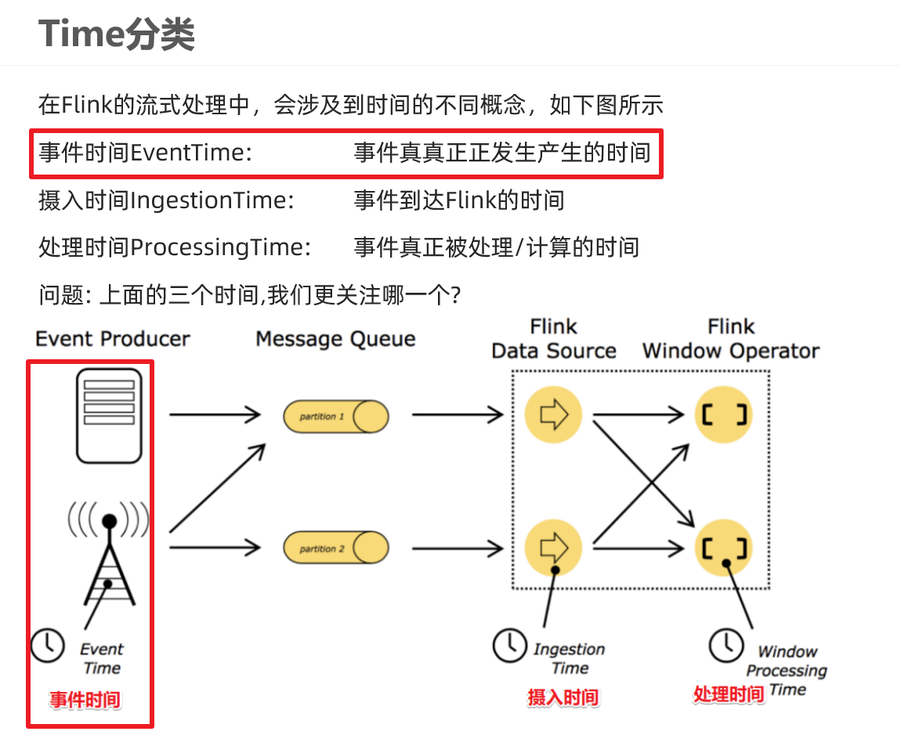

## EventTime的重要性和Watermarker的引入


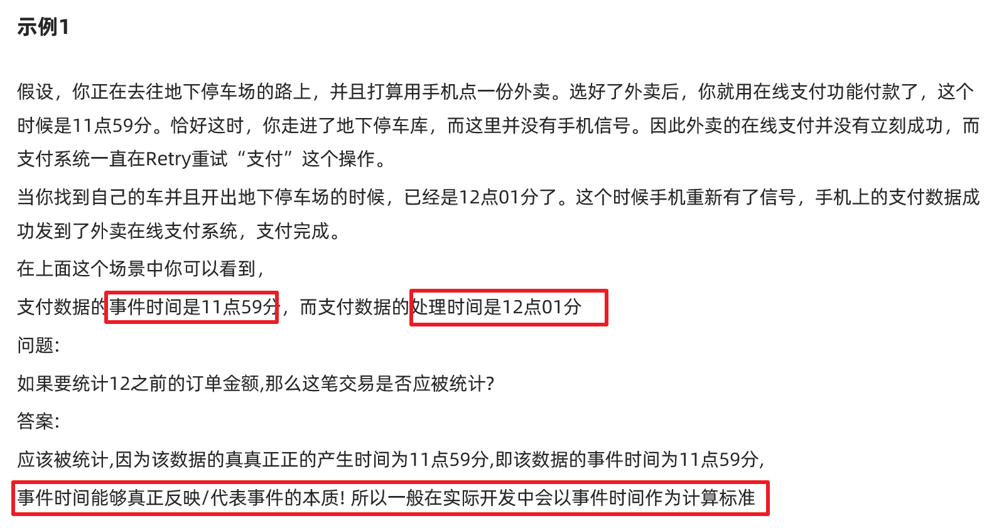

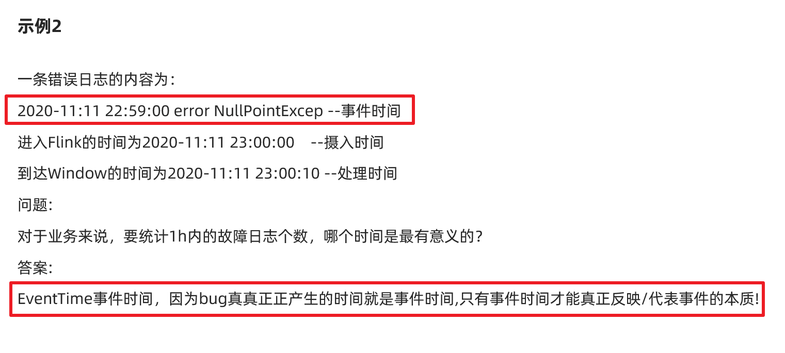

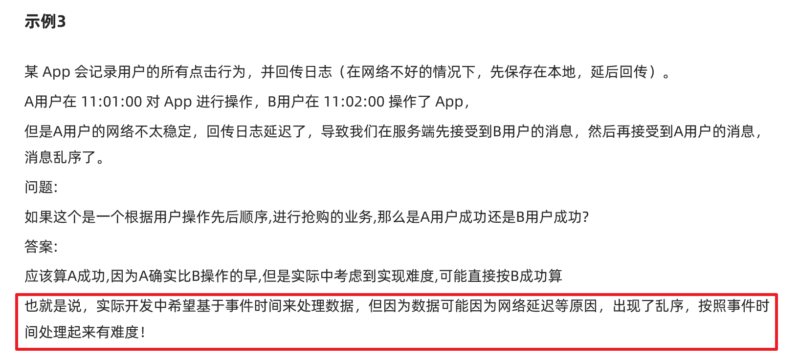

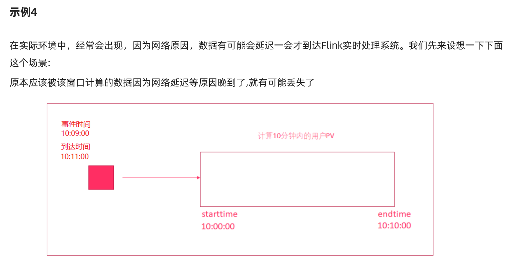

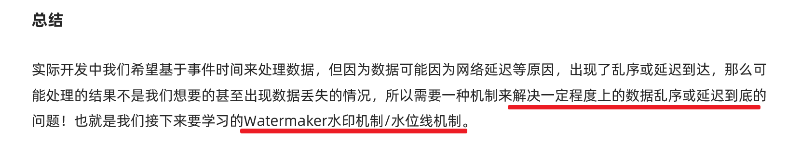


## Watermarker详解

==总结:==

1.Watermarker本质是时间戳

2.Watermarker = 当前进来的数据最大的事件时间 - ==最大允许的数据延迟时间或乱序时间==

3.Watermarker 可以通过改变窗口触发计算时机来解决一定程度上的数据乱序或延迟达到的问题

==4.Watermarker  >= 窗口结束时间 时触发窗口计算==

5.当前的最大的事件时间 - 最大允许的数据延迟时间或乱序时间>= 窗口结束时间时触发窗口计算

6.当前的最大的事件时间 >= 窗口结束时间 +最大允许的数据延迟时间或乱序时间时触发窗口计算


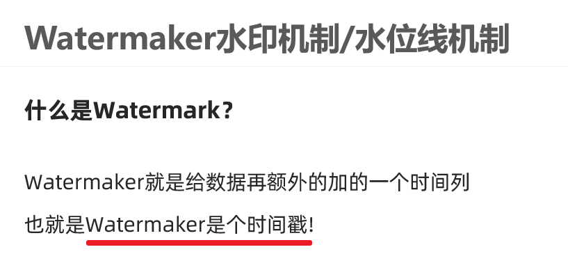


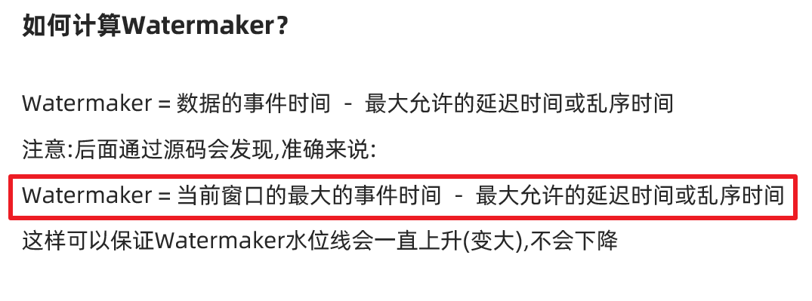

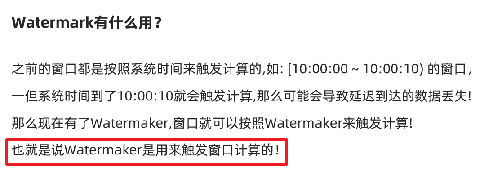

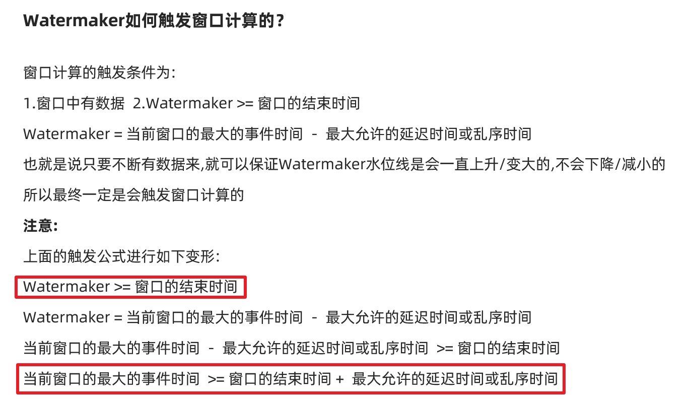


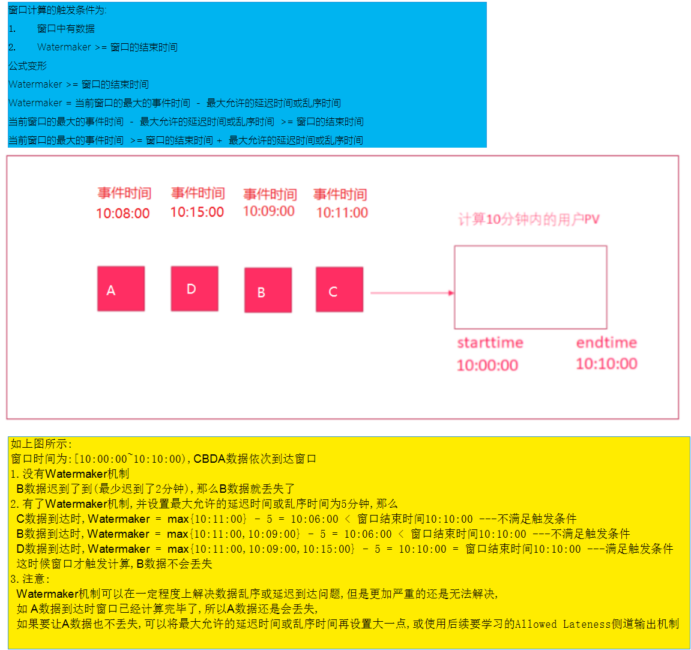


## 代码演示-开发版-掌握

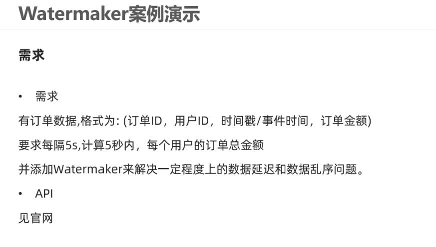

https://ci.apache.org/projects/flink/flink-docs-release-1.12/dev/event_timestamps_watermarks.html

```java
package cn.itcast.watermaker;

import lombok.AllArgsConstructor;
import lombok.Data;
import lombok.NoArgsConstructor;
import org.apache.flink.api.common.RuntimeExecutionMode;
import org.apache.flink.api.common.eventtime.WatermarkStrategy;
import org.apache.flink.streaming.api.datastream.DataStreamSource;
import org.apache.flink.streaming.api.datastream.SingleOutputStreamOperator;
import org.apache.flink.streaming.api.environment.StreamExecutionEnvironment;
import org.apache.flink.streaming.api.functions.source.SourceFunction;
import org.apache.flink.streaming.api.windowing.assigners.TumblingEventTimeWindows;
import org.apache.flink.streaming.api.windowing.time.Time;

import java.time.Duration;
import java.util.Random;
import java.util.UUID;

/**
 * Author itcast
 * Desc 演示基于事件时间的窗口计算+Watermaker解决一定程度上的数据乱序/延迟到达的问题
 */
public class WatermakerDemo01 {
    public static void main(String[] args) throws Exception {
        //TODO 0.env
        StreamExecutionEnvironment env = StreamExecutionEnvironment.getExecutionEnvironment();
        env.setRuntimeMode(RuntimeExecutionMode.AUTOMATIC);

        //TODO 1.source
        DataStreamSource<Order> orderDS = env.addSource(new SourceFunction<Order>() {
            private boolean flag = true;

            @Override
            public void run(SourceContext<Order> ctx) throws Exception {
                Random random = new Random();
                while (flag) {
                    String orderId = UUID.randomUUID().toString();
                    int userId = random.nextInt(2);
                    int money = random.nextInt(101);
                    //随机模拟延迟
                    long eventTime = System.currentTimeMillis() - random.nextInt(5) * 1000;
                    ctx.collect(new Order(orderId, userId, money, eventTime));
                    Thread.sleep(1000);
                }
            }

            @Override
            public void cancel() {
                flag = false;
            }
        });

        //TODO 2.transformation
        //老版本API
        /*DataStream<Order> watermakerDS = orderDS.assignTimestampsAndWatermarks(
                new BoundedOutOfOrdernessTimestampExtractor<Order>(Time.seconds(3)) {//最大允许的延迟时间或乱序时间
                    @Override
                    public long extractTimestamp(Order element) {
                        return element.eventTime;
                        //指定事件时间是哪一列,Flink底层会自动计算:
                        //Watermaker = 当前最大的事件时间 - 最大允许的延迟时间或乱序时间
                    }
        });*/
        //注意:下面的代码使用的是Flink1.12中新的API
        //每隔5s计算最近5s的数据求每个用户的订单总金额,要求:基于事件时间进行窗口计算+Watermaker
        //env.setStreamTimeCharacteristic(TimeCharacteristic.EventTime);//在新版本中默认就是EventTime
        //设置Watermaker = 当前最大的事件时间 - 最大允许的延迟时间或乱序时间
        SingleOutputStreamOperator<Order> orderDSWithWatermark = orderDS.assignTimestampsAndWatermarks(
                WatermarkStrategy.<Order>forBoundedOutOfOrderness(Duration.ofSeconds(3))//指定maxOutOfOrderness最大无序度/最大允许的延迟时间/乱序时间
                        .withTimestampAssigner((order, timestamp) -> order.getEventTime())//指定事件时间列
        );

        SingleOutputStreamOperator<Order> result = orderDSWithWatermark.keyBy(Order::getUserId)
                .window(TumblingEventTimeWindows.of(Time.seconds(5)))
                .sum("money");

        //TODO 3.sink
        result.print();

        //TODO 4.execute
        env.execute();
    }
    @Data
    @AllArgsConstructor
    @NoArgsConstructor
    public static class Order {
        private String orderId;
        private Integer userId;
        private Integer money;
        private Long eventTime;
    }
}

```

## 代码演示-验证版-了解

通过源码和下面的代码可以验证


```java
package cn.itcast.watermaker;

import lombok.AllArgsConstructor;
import lombok.Data;
import lombok.NoArgsConstructor;
import org.apache.commons.lang3.time.FastDateFormat;
import org.apache.flink.api.common.eventtime.*;
import org.apache.flink.streaming.api.datastream.DataStream;
import org.apache.flink.streaming.api.datastream.DataStreamSource;
import org.apache.flink.streaming.api.datastream.SingleOutputStreamOperator;
import org.apache.flink.streaming.api.environment.StreamExecutionEnvironment;
import org.apache.flink.streaming.api.functions.source.SourceFunction;
import org.apache.flink.streaming.api.functions.windowing.WindowFunction;
import org.apache.flink.streaming.api.windowing.assigners.TumblingEventTimeWindows;
import org.apache.flink.streaming.api.windowing.time.Time;
import org.apache.flink.streaming.api.windowing.windows.TimeWindow;
import org.apache.flink.util.Collector;

import java.util.ArrayList;
import java.util.List;
import java.util.Random;
import java.util.UUID;

/**
 * Author itcast
 * Desc
 * 模拟实时订单数据,格式为: (订单ID，用户ID，订单金额，时间戳/事件时间)
 * 要求每隔5s,计算5秒内(基于时间的滚动窗口)，每个用户的订单总金额
 * 并添加Watermaker来解决一定程度上的数据延迟和数据乱序问题。
 */
public class WatermakerDemo02_Check {
    public static void main(String[] args) throws Exception {
        FastDateFormat df = FastDateFormat.getInstance("HH:mm:ss");

        //TODO 1.env
        StreamExecutionEnvironment env = StreamExecutionEnvironment.getExecutionEnvironment();

        //TODO 2.Source
        //模拟实时订单数据(数据有延迟和乱序)
        DataStreamSource<Order> orderDS = env.addSource(new SourceFunction<Order>() {
            private boolean flag = true;
            @Override
            public void run(SourceContext<Order> ctx) throws Exception {
                Random random = new Random();
                while (flag) {
                    String orderId = UUID.randomUUID().toString();
                    int userId = random.nextInt(3);
                    int money = random.nextInt(100);
                    //模拟数据延迟和乱序!
                    long eventTime = System.currentTimeMillis() - random.nextInt(5) * 1000;
                    System.out.println("发送的数据为: "+userId + " : " + df.format(eventTime));
                    ctx.collect(new Order(orderId, userId, money, eventTime));
                    //TimeUnit.SECONDS.sleep(1);
                    Thread.sleep(1000);
                }
            }

            @Override
            public void cancel() {
                flag = false;
            }
        });

        //TODO 3.Transformation
        /*DataStream<Order> watermakerDS = orderDS
                .assignTimestampsAndWatermarks(
                        WatermarkStrategy.<Order>forBoundedOutOfOrderness(Duration.ofSeconds(3))
                                .withTimestampAssigner((event, timestamp) -> event.getEventTime())
                );*/

        //开发中直接使用上面的即可
        //学习测试时可以自己实现
        DataStream<Order> watermakerDS = orderDS
                .assignTimestampsAndWatermarks(
                        new WatermarkStrategy<Order>() {
                            @Override
                            public WatermarkGenerator<Order> createWatermarkGenerator(WatermarkGeneratorSupplier.Context context) {
                                return new WatermarkGenerator<Order>() {
                                    private int userId = 0;
                                    private long eventTime = 0L;
                                    private final long outOfOrdernessMillis = 3000;
                                    private long maxTimestamp = Long.MIN_VALUE + outOfOrdernessMillis + 1;

                                    @Override
                                    public void onEvent(Order event, long eventTimestamp, WatermarkOutput output) {
                                        userId = event.userId;
                                        eventTime = event.eventTime;
                                        maxTimestamp = Math.max(maxTimestamp, eventTimestamp);
                                    }

                                    @Override
                                    public void onPeriodicEmit(WatermarkOutput output) {
                                        //Watermaker = 当前最大事件时间 - 最大允许的延迟时间或乱序时间
                                        Watermark watermark = new Watermark(maxTimestamp - outOfOrdernessMillis - 1);
                                        System.out.println("key:" + userId + ",系统时间:" + df.format(System.currentTimeMillis()) + ",事件时间:" + df.format(eventTime) + ",水印时间:" + df.format(watermark.getTimestamp()));
                                        output.emitWatermark(watermark);
                                    }
                                };
                            }
                        }.withTimestampAssigner((order, timestamp) -> order.getEventTime())
                );


        //代码走到这里,就已经被添加上Watermaker了!接下来就可以进行窗口计算了
        //要求每隔5s,计算5秒内(基于时间的滚动窗口)，每个用户的订单总金额
       /* DataStream<Order> result = watermakerDS
                 .keyBy(Order::getUserId)
                //.timeWindow(Time.seconds(5), Time.seconds(5))
                .window(TumblingEventTimeWindows.of(Time.seconds(5)))
                .sum("money");*/

        //开发中使用上面的代码进行业务计算即可
        //学习测试时可以使用下面的代码对数据进行更详细的输出,如输出窗口触发时各个窗口中的数据的事件时间,Watermaker时间
        SingleOutputStreamOperator<String> result = watermakerDS
                .keyBy(Order::getUserId)
                .window(TumblingEventTimeWindows.of(Time.seconds(5)))
                //把apply中的函数应用在窗口中的数据上
                //WindowFunction<IN, OUT, KEY, W extends Window>
                .apply(new WindowFunction<Order, String, Integer, TimeWindow>() {
                    @Override
                    public void apply(Integer key, TimeWindow window, Iterable<Order> orders, Collector<String> out) throws Exception {
                        //用来存放当前窗口的数据的格式化后的事件时间
                        List<String> list = new ArrayList<>();
                        for (Order order : orders) {
                            Long eventTime = order.eventTime;
                            String formatEventTime = df.format(eventTime);
                            list.add(formatEventTime);
                        }
                        String start = df.format(window.getStart());
                        String end = df.format(window.getEnd());
                        //现在就已经获取到了当前窗口的开始和结束时间,以及属于该窗口的所有数据的事件时间,把这些拼接并返回
                        String outStr = String.format("key:%s,窗口开始结束:[%s~%s),属于该窗口的事件时间:%s", key.toString(), start, end, list.toString());
                        out.collect(outStr);
                    }
                });

        //4.Sink
        result.print();

        //5.execute
        env.execute();
    }

    @Data
    @AllArgsConstructor
    @NoArgsConstructor
    public static class Order {
        private String orderId;
        private Integer userId;
        private Integer money;
        private Long eventTime;
    }
}
```


## 代码演示-侧道输出解决数据丢失-掌握

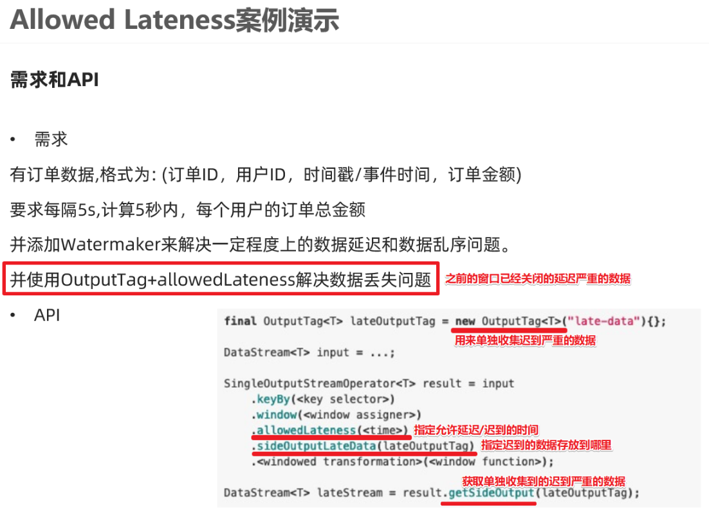

```java
package cn.itcast.watermaker;

import lombok.AllArgsConstructor;
import lombok.Data;
import lombok.NoArgsConstructor;
import org.apache.flink.api.common.RuntimeExecutionMode;
import org.apache.flink.api.common.eventtime.WatermarkStrategy;
import org.apache.flink.api.common.typeinfo.TypeInformation;
import org.apache.flink.streaming.api.datastream.DataStream;
import org.apache.flink.streaming.api.datastream.DataStreamSource;
import org.apache.flink.streaming.api.datastream.SingleOutputStreamOperator;
import org.apache.flink.streaming.api.environment.StreamExecutionEnvironment;
import org.apache.flink.streaming.api.functions.source.SourceFunction;
import org.apache.flink.streaming.api.windowing.assigners.TumblingEventTimeWindows;
import org.apache.flink.streaming.api.windowing.time.Time;
import org.apache.flink.util.OutputTag;

import java.time.Duration;
import java.util.Random;
import java.util.UUID;

/**
 * Author itcast
 * Desc 演示基于事件时间的窗口计算+Watermaker解决一定程度上的数据乱序/延迟到达的问题
 * 并使用outputTag + allowedLateness来解决数据丢失问题(解决迟到/延迟严重的数据的丢失问题)
 */
public class WatermakerDemo03 {
    public static void main(String[] args) throws Exception {
        //TODO 0.env
        StreamExecutionEnvironment env = StreamExecutionEnvironment.getExecutionEnvironment();
        env.setRuntimeMode(RuntimeExecutionMode.AUTOMATIC);

        //TODO 1.source
        DataStreamSource<Order> orderDS = env.addSource(new SourceFunction<Order>() {
            private boolean flag = true;

            @Override
            public void run(SourceContext<Order> ctx) throws Exception {
                Random random = new Random();
                while (flag) {
                    String orderId = UUID.randomUUID().toString();
                    int userId = random.nextInt(2);
                    int money = random.nextInt(101);
                    //随机模拟延迟-有可能会很严重
                    long eventTime = System.currentTimeMillis() - random.nextInt(20) * 1000;
                    ctx.collect(new Order(orderId, userId, money, eventTime));
                    Thread.sleep(1000);
                }
            }

            @Override
            public void cancel() {
                flag = false;
            }
        });

        //TODO 2.transformation
        //注意:下面的代码使用的是Flink1.12中新的API
        //每隔5s计算最近5s的数据求每个用户的订单总金额,要求:基于事件时间进行窗口计算+Watermaker
        //env.setStreamTimeCharacteristic(TimeCharacteristic.EventTime);//在新版本中默认就是EventTime
        //设置Watermarker = 当前最大的事件时间 - 最大允许的延迟时间或乱序时间
        SingleOutputStreamOperator<Order> orderDSWithWatermark = orderDS.assignTimestampsAndWatermarks(
                WatermarkStrategy.<Order>forBoundedOutOfOrderness(Duration.ofSeconds(3))//指定maxOutOfOrderness最大无序度/最大允许的延迟时间/乱序时间
                        .withTimestampAssigner((order, timestamp) -> order.getEventTime())//指定事件时间列
        );

        //业务操作
        //TODO 准备一个outputTag用来存放迟到严重的数据
        OutputTag<Order> seriousLateOutputTag = new OutputTag<Order>("seriousLate", TypeInformation.of(Order.class));

        SingleOutputStreamOperator<Order> result1 = orderDSWithWatermark
                .keyBy(Order::getUserId)
                .window(TumblingEventTimeWindows.of(Time.seconds(5)))
                .allowedLateness(Time.seconds(3))
                .sideOutputLateData(seriousLateOutputTag)
                .sum("money");
        DataStream<Order> result2 = result1.getSideOutput(seriousLateOutputTag);

        //TODO 3.sink
        result1.print("正常的/迟到不严重数据");
        result2.print("迟到严重的数据并丢弃后单独收集的数据");

        //TODO 4.execute
        env.execute();
    }
    @Data
    @AllArgsConstructor
    @NoArgsConstructor
    public static class Order {
        private String orderId;
        private Integer userId;
        private Integer money;
        private Long eventTime;
    }
}

```


# State-理解原理即可

## Flink中状态的自动管理

之前写的Flink代码中其实已经做好了状态自动管理,如

发送hello ,得出(hello,1)

再发送hello ,得出(hello,2)

说明Flink已经自动的将当前数据和历史状态/历史结果进行了聚合,做到了状态的自动管理

在实际开发中绝大多数情况下,我们直接使用自动管理即可

一些特殊情况才会使用手动的状态管理!---后面项目中会使用!

所以这里得先学习state状态如何手动管理!

```java
package cn.itcast.source;

import org.apache.flink.api.common.RuntimeExecutionMode;
import org.apache.flink.api.common.functions.FlatMapFunction;
import org.apache.flink.api.java.tuple.Tuple2;
import org.apache.flink.streaming.api.datastream.DataStream;
import org.apache.flink.streaming.api.datastream.SingleOutputStreamOperator;
import org.apache.flink.streaming.api.environment.StreamExecutionEnvironment;
import org.apache.flink.util.Collector;

/**
 * Author itcast
 * Desc 演示DataStream-Source-基于Socket
 */
public class SourceDemo03_Socket {
    public static void main(String[] args) throws Exception {
        //TODO 0.env
        StreamExecutionEnvironment env = StreamExecutionEnvironment.getExecutionEnvironment();
        env.setRuntimeMode(RuntimeExecutionMode.AUTOMATIC);

        //TODO 1.source
        DataStream<String> lines = env.socketTextStream("node1", 9999);


        //TODO 2.transformation
        /*SingleOutputStreamOperator<String> words = lines.flatMap(new FlatMapFunction<String, String>() {
            @Override
            public void flatMap(String value, Collector<String> out) throws Exception {
                String[] arr = value.split(" ");
                for (String word : arr) {
                    out.collect(word);
                }
            }
        });

        words.map(new MapFunction<String, Tuple2<String,Integer>>() {
            @Override
            public Tuple2<String, Integer> map(String value) throws Exception {
                return Tuple2.of(value,1);
            }
        });*/

        //注意:下面的操作将上面的2步合成了1步,直接切割单词并记为1返回
        SingleOutputStreamOperator<Tuple2<String, Integer>> wordAndOne = lines.flatMap(new FlatMapFunction<String, Tuple2<String, Integer>>() {
            @Override
            public void flatMap(String value, Collector<Tuple2<String, Integer>> out) throws Exception {
                String[] arr = value.split(" ");
                for (String word : arr) {
                    out.collect(Tuple2.of(word, 1));
                }
            }
        });

        SingleOutputStreamOperator<Tuple2<String, Integer>> result = wordAndOne.keyBy(t -> t.f0).sum(1);

        //TODO 3.sink
        result.print();

        //TODO 4.execute
        env.execute();
    }
}

```


## 无状态计算和有状态计算

- 无状态计算,不需要考虑历史值, 如map  

hello --> (hello,1)

hello --> (hello,1)

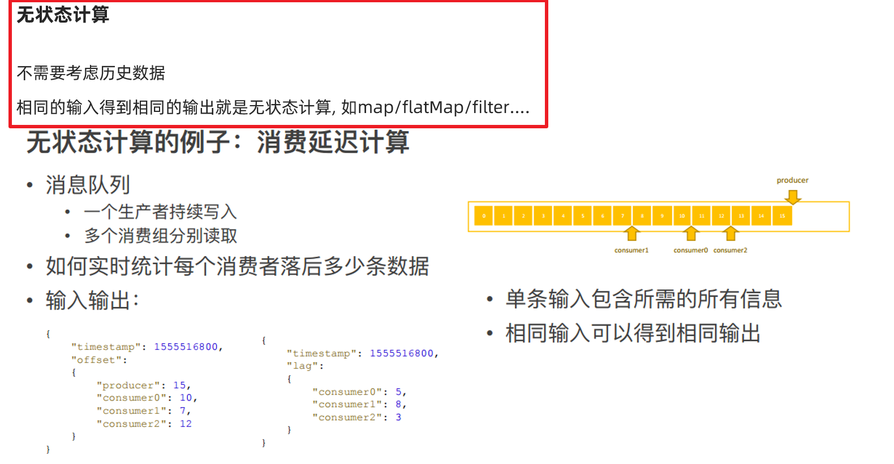


- 有状态计算,需要考虑历史值,如:sum

hello , (hello,1)

hello , (hello,2)

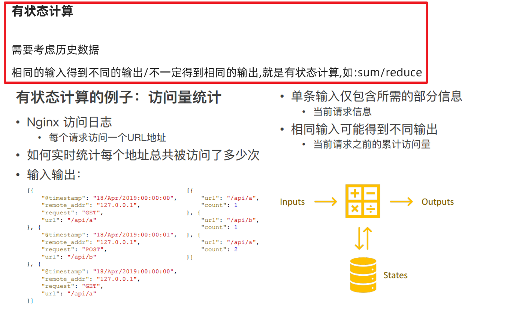

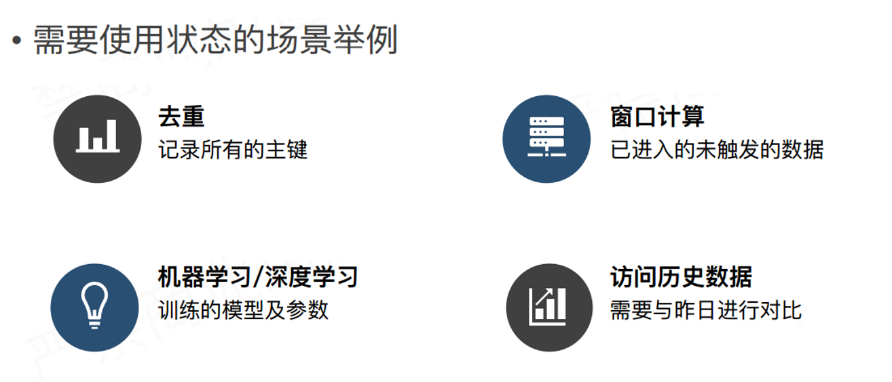


## 状态分类

- State
   - ManagerState--开发中推荐使用 : Fink自动管理/优化,支持多种数据结构
     	-  KeyState--只能在keyedStream上使用,支持多种数据结构
     	  	- OperatorState--一般用在Source上,支持ListState
   - RawState--完全由用户自己管理,只支持byte[],只能在自定义Operator上使用
     - OperatorState


分类详细图解:

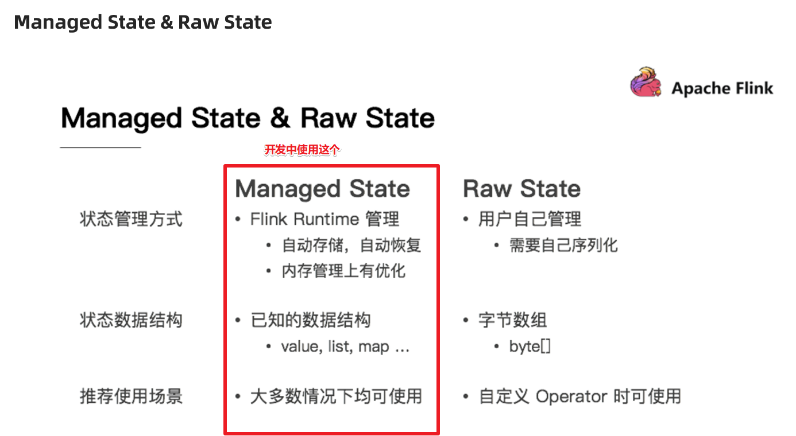

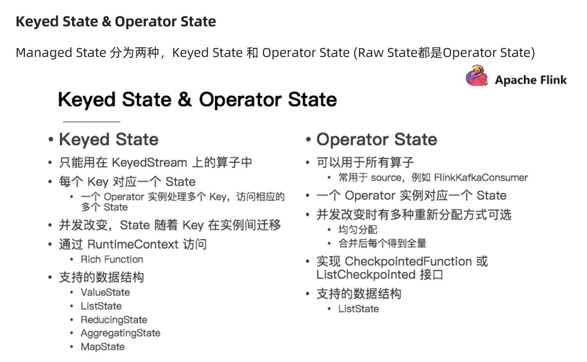


## 代码演示-ManagerState-keyState

https://ci.apache.org/projects/flink/flink-docs-release-1.12/dev/stream/state/state.html

```java
package cn.itcast.state;

import org.apache.flink.api.common.RuntimeExecutionMode;
import org.apache.flink.api.common.functions.RichMapFunction;
import org.apache.flink.api.common.state.ValueState;
import org.apache.flink.api.common.state.ValueStateDescriptor;
import org.apache.flink.api.java.tuple.Tuple2;
import org.apache.flink.api.java.tuple.Tuple3;
import org.apache.flink.configuration.Configuration;
import org.apache.flink.streaming.api.datastream.DataStream;
import org.apache.flink.streaming.api.environment.StreamExecutionEnvironment;

/**
 * Author itcast
 * Desc 使用KeyState中的ValueState获取流数据中的最大值/实际中可以使用maxBy即可
 */
public class StateDemo01_KeyState {
    public static void main(String[] args) throws Exception {
        //TODO 0.env
        StreamExecutionEnvironment env = StreamExecutionEnvironment.getExecutionEnvironment();
        env.setRuntimeMode(RuntimeExecutionMode.AUTOMATIC);

        //TODO 1.source
        DataStream<Tuple2<String, Long>> tupleDS = env.fromElements(
                Tuple2.of("北京", 1L),
                Tuple2.of("上海", 2L),
                Tuple2.of("北京", 6L),
                Tuple2.of("上海", 8L),
                Tuple2.of("北京", 3L),
                Tuple2.of("上海", 4L)
        );

        //TODO 2.transformation
        //需求:求各个城市的value最大值
        //实际中使用maxBy即可
        DataStream<Tuple2<String, Long>> result1 = tupleDS.keyBy(t -> t.f0).maxBy(1);

        //学习时可以使用KeyState中的ValueState来实现maxBy的底层
        DataStream<Tuple3<String, Long, Long>> result2 = tupleDS.keyBy(t -> t.f0).map(new RichMapFunction<Tuple2<String, Long>, Tuple3<String, Long, Long>>() {
            //-1.定义一个状态用来存放最大值
            private ValueState<Long> maxValueState;

            //-2.状态初始化
            @Override
            public void open(Configuration parameters) throws Exception {
                //创建状态描述器
                ValueStateDescriptor stateDescriptor = new ValueStateDescriptor("maxValueState", Long.class);
                //根据状态描述器获取/初始化状态
                maxValueState = getRuntimeContext().getState(stateDescriptor);
            }

            //-3.使用状态
            @Override
            public Tuple3<String, Long, Long> map(Tuple2<String, Long> value) throws Exception {
                Long currentValue = value.f1;
                //获取状态
                Long historyValue = maxValueState.value();
                //判断状态
                if (historyValue == null || currentValue > historyValue) {
                    historyValue = currentValue;
                    //更新状态
                    maxValueState.update(historyValue);
                    return Tuple3.of(value.f0, currentValue, historyValue);
                } else {
                    return Tuple3.of(value.f0, currentValue, historyValue);
                }
            }
        });


        //TODO 3.sink
        //result1.print();
        //4> (北京,6)
        //1> (上海,8)
        result2.print();
        //1> (上海,xxx,8)
        //4> (北京,xxx,6)

        //TODO 4.execute
        env.execute();
    }
}

```


## 代码演示-ManagerState-OperatorState

https://ci.apache.org/projects/flink/flink-docs-release-1.12/dev/stream/state/state.html

```java
package cn.itcast.state;

import org.apache.flink.api.common.RuntimeExecutionMode;
import org.apache.flink.api.common.restartstrategy.RestartStrategies;
import org.apache.flink.api.common.state.ListState;
import org.apache.flink.api.common.state.ListStateDescriptor;
import org.apache.flink.runtime.state.FunctionInitializationContext;
import org.apache.flink.runtime.state.FunctionSnapshotContext;
import org.apache.flink.runtime.state.filesystem.FsStateBackend;
import org.apache.flink.streaming.api.CheckpointingMode;
import org.apache.flink.streaming.api.checkpoint.CheckpointedFunction;
import org.apache.flink.streaming.api.datastream.DataStreamSource;
import org.apache.flink.streaming.api.environment.CheckpointConfig;
import org.apache.flink.streaming.api.environment.StreamExecutionEnvironment;
import org.apache.flink.streaming.api.functions.source.RichParallelSourceFunction;

import java.util.Iterator;

/**
 * Author itcast
 * Desc 使用OperatorState中的ListState模拟KafkaSource进行offset维护
 */
public class StateDemo02_OperatorState {
    public static void main(String[] args) throws Exception {
        //TODO 0.env
        StreamExecutionEnvironment env = StreamExecutionEnvironment.getExecutionEnvironment();
        env.setRuntimeMode(RuntimeExecutionMode.AUTOMATIC);
        env.setParallelism(1);//并行度设置为1方便观察
        //下面的Checkpoint和重启策略配置先直接使用,下次课学
        env.enableCheckpointing(1000);//每隔1s执行一次Checkpoint
        env.setStateBackend(new FsStateBackend("file:///D:/ckp"));
        env.getCheckpointConfig().enableExternalizedCheckpoints(CheckpointConfig.ExternalizedCheckpointCleanup.RETAIN_ON_CANCELLATION);
        env.getCheckpointConfig().setCheckpointingMode(CheckpointingMode.EXACTLY_ONCE);
        //固定延迟重启策略: 程序出现异常的时候，重启2次，每次延迟3秒钟重启，超过2次，程序退出
        env.setRestartStrategy(RestartStrategies.fixedDelayRestart(2, 3000));

        //TODO 1.source
        DataStreamSource<String> ds = env.addSource(new MyKafkaSource()).setParallelism(1);

        //TODO 2.transformation

        //TODO 3.sink
        ds.print();

        //TODO 4.execute
        env.execute();
    }
    //使用OperatorState中的ListState模拟KafkaSource进行offset维护
    public static class MyKafkaSource extends RichParallelSourceFunction<String> implements CheckpointedFunction {
        private boolean flag = true;
        //-1.声明ListState
        private ListState<Long> offsetState = null; //用来存放offset
        private Long offset = 0L;//用来存放offset的值

        //-2.初始化/创建ListState
        @Override
        public void initializeState(FunctionInitializationContext context) throws Exception {
            ListStateDescriptor<Long> stateDescriptor = new ListStateDescriptor<>("offsetState", Long.class);
            offsetState = context.getOperatorStateStore().getListState(stateDescriptor);
        }
        //-3.使用state
        @Override
        public void run(SourceContext<String> ctx) throws Exception {
            while (flag){
                Iterator<Long> iterator = offsetState.get().iterator();
                if(iterator.hasNext()){
                    offset = iterator.next();
                }
                offset += 1;
                int subTaskId = getRuntimeContext().getIndexOfThisSubtask();
                ctx.collect("subTaskId:"+ subTaskId + ",当前的offset值为:"+offset);
                Thread.sleep(1000);

                //模拟异常
                if(offset % 5 == 0){
                    throw new Exception("bug出现了.....");
                }
            }
        }
        //-4.state持久化
        //该方法会定时执行将state状态从内存存入Checkpoint磁盘目录中
        @Override
        public void snapshotState(FunctionSnapshotContext context) throws Exception {
            offsetState.clear();//清理内容数据并存入Checkpoint磁盘目录中
            offsetState.add(offset);
        }

        @Override
        public void cancel() {
            flag = false;
        }
    }
}
```

