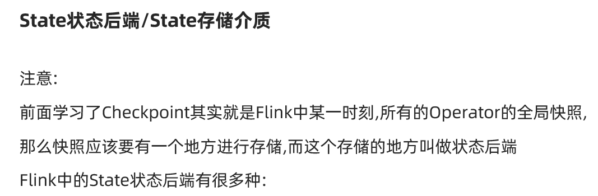

# 容错机制

## Checkpoint

### Checkpoint和State


### Checkpoint执行流程


0.Flink的JobManager创建CheckpointCoordinator

1.Coordinator向所有的SourceOperator发送Barrier栅栏(理解为执行Checkpoint的信号)

2.SourceOperator接收到Barrier之后,暂停当前的操作(暂停的时间很短,因为后续的写快照是异步的),并制作State快照, 然后将自己的快照保存到指定的介质中(如HDFS), 一切 ok之后向Coordinator汇报并将Barrier发送给下游的其他Operator

3.其他的如TransformationOperator接收到Barrier,重复第2步,最后将Barrier发送给Sink

4.Sink接收到Barrier之后重复第2步

5.Coordinator接收到所有的Operator的执行ok的汇报结果,认为本次快照执行成功


Flink中的Checkpoint底层使用了Chandy-Lamport algorithm分布式快照算法可以保证数据的在分布式环境下的一致性! 

https://zhuanlan.zhihu.com/p/53482103

Chandy-Lamport algorithm算法的作者也是ZK中Paxos 一致性算法的作者

https://www.cnblogs.com/shenguanpu/p/4048660.html

Flink中使用Chandy-Lamport algorithm分布式快照算法取得了成功,后续Spark的StructuredStreaming也借鉴了该算法


### 状态后端/存储介质




```
 <dependency>
       <groupId>org.apache.flink</groupId>
       <artifactId>flink-statebackend-rocksdb_2.12</artifactId>
       <version>1.12.0</version>
    </dependency>
```


### Checkpoint代码演示


https://ci.apache.org/projects/flink/flink-docs-release-1.12/dev/stream/state/checkpointing.html

```java
package cn.itcast.checkpoint;

import org.apache.commons.lang3.SystemUtils;
import org.apache.flink.api.common.RuntimeExecutionMode;
import org.apache.flink.api.common.functions.FlatMapFunction;
import org.apache.flink.api.common.functions.RichMapFunction;
import org.apache.flink.api.common.serialization.SimpleStringSchema;
import org.apache.flink.api.java.tuple.Tuple2;
import org.apache.flink.runtime.state.filesystem.FsStateBackend;
import org.apache.flink.streaming.api.CheckpointingMode;
import org.apache.flink.streaming.api.datastream.DataStream;
import org.apache.flink.streaming.api.datastream.KeyedStream;
import org.apache.flink.streaming.api.datastream.SingleOutputStreamOperator;
import org.apache.flink.streaming.api.environment.CheckpointConfig;
import org.apache.flink.streaming.api.environment.StreamExecutionEnvironment;
import org.apache.flink.streaming.connectors.kafka.FlinkKafkaProducer;
import org.apache.flink.util.Collector;

import java.util.Properties;

/**
 * Author itcast
 * Desc 演示Flink-Checkpoint相关配置
 */
public class CheckpointDemo01 {
    public static void main(String[] args) throws Exception {
        //1.env
        StreamExecutionEnvironment env = StreamExecutionEnvironment.getExecutionEnvironment();
        env.setRuntimeMode(RuntimeExecutionMode.AUTOMATIC);

        //TODO ===========Checkpoint参数设置====
        //===========类型1:必须参数=============
        //设置Checkpoint的时间间隔为1000ms做一次Checkpoint/其实就是每隔1000ms发一次Barrier!
        env.enableCheckpointing(1000);
        //设置State状态存储介质/状态后端
        //Memory:State存内存,Checkpoint存内存--开发不用!
        //Fs:State存内存,Checkpoint存FS(本地/HDFS)--一般情况下使用
        //RocksDB:State存RocksDB(内存+磁盘),Checkpoint存FS(本地/HDFS)--超大状态使用,但是对于状态的读写效率要低一点
        /*if(args.length > 0){
            env.setStateBackend(new FsStateBackend(args[0]));
        }else {
            env.setStateBackend(new FsStateBackend("file:///D:\\data\\ckp"));
        }*/
        if (SystemUtils.IS_OS_WINDOWS) {
            env.setStateBackend(new FsStateBackend("file:///D:/ckp"));
        } else {
            env.setStateBackend(new FsStateBackend("hdfs://node1:8020/flink-checkpoint/checkpoint"));
        }
        //===========类型2:建议参数===========
        //设置两个Checkpoint 之间最少等待时间,如设置Checkpoint之间最少是要等 500ms(为了避免每隔1000ms做一次Checkpoint的时候,前一次太慢和后一次重叠到一起去了)
        //如:高速公路上,每隔1s关口放行一辆车,但是规定了两车之前的最小车距为500m
        env.getCheckpointConfig().setMinPauseBetweenCheckpoints(500);//默认是0
        //设置如果在做Checkpoint过程中出现错误，是否让整体任务失败：true是  false不是
        //env.getCheckpointConfig().setFailOnCheckpointingErrors(false);//默认是true
        env.getCheckpointConfig().setTolerableCheckpointFailureNumber(10);//默认值为0，表示不容忍任何检查点失败
        //设置是否清理检查点,表示 Cancel 时是否需要保留当前的 Checkpoint，默认 Checkpoint会在作业被Cancel时被删除
        //ExternalizedCheckpointCleanup.DELETE_ON_CANCELLATION：true,当作业被取消时，删除外部的checkpoint(默认值)
        //ExternalizedCheckpointCleanup.RETAIN_ON_CANCELLATION：false,当作业被取消时，保留外部的checkpoint
        env.getCheckpointConfig().enableExternalizedCheckpoints(CheckpointConfig.ExternalizedCheckpointCleanup.RETAIN_ON_CANCELLATION);

        //===========类型3:直接使用默认的即可===============
        //设置checkpoint的执行模式为EXACTLY_ONCE(默认)
        env.getCheckpointConfig().setCheckpointingMode(CheckpointingMode.EXACTLY_ONCE);
        //设置checkpoint的超时时间,如果 Checkpoint在 60s内尚未完成说明该次Checkpoint失败,则丢弃。
        env.getCheckpointConfig().setCheckpointTimeout(60000);//默认10分钟
        //设置同一时间有多少个checkpoint可以同时执行
        //env.getCheckpointConfig().setMaxConcurrentCheckpoints(1);//默认为1

        //2.Source
        DataStream<String> linesDS = env.socketTextStream("node1", 9999);

        //3.Transformation
        //3.1切割出每个单词并直接记为1
        DataStream<Tuple2<String, Integer>> wordAndOneDS = linesDS.flatMap(new FlatMapFunction<String, Tuple2<String, Integer>>() {
            @Override
            public void flatMap(String value, Collector<Tuple2<String, Integer>> out) throws Exception {
                //value就是每一行
                String[] words = value.split(" ");
                for (String word : words) {
                    out.collect(Tuple2.of(word, 1));
                }
            }
        });
        //3.2分组
        //注意:批处理的分组是groupBy,流处理的分组是keyBy
        KeyedStream<Tuple2<String, Integer>, String> groupedDS = wordAndOneDS.keyBy(t -> t.f0);
        //3.3聚合
        DataStream<Tuple2<String, Integer>> aggResult = groupedDS.sum(1);

        DataStream<String> result = (SingleOutputStreamOperator<String>) aggResult.map(new RichMapFunction<Tuple2<String, Integer>, String>() {
            @Override
            public String map(Tuple2<String, Integer> value) throws Exception {
                return value.f0 + ":::" + value.f1;
            }
        });

        //4.sink
        result.print();

        Properties props = new Properties();
        props.setProperty("bootstrap.servers", "node1:9092");
        FlinkKafkaProducer<String> kafkaSink = new FlinkKafkaProducer<>("flink_kafka", new SimpleStringSchema(), props);
        result.addSink(kafkaSink);

        //5.execute
        env.execute();

        // /export/server/kafka/bin/kafka-console-consumer.sh --bootstrap-server node1:9092 --topic flink_kafka
    }
}

```


## 状态恢复

### 自动重启-全自动-掌握


```java
package cn.itcast.checkpoint;

import org.apache.commons.lang3.SystemUtils;
import org.apache.flink.api.common.RuntimeExecutionMode;
import org.apache.flink.api.common.functions.FlatMapFunction;
import org.apache.flink.api.common.functions.RichMapFunction;
import org.apache.flink.api.common.restartstrategy.RestartStrategies;
import org.apache.flink.api.common.serialization.SimpleStringSchema;
import org.apache.flink.api.common.time.Time;
import org.apache.flink.api.java.tuple.Tuple2;
import org.apache.flink.runtime.state.filesystem.FsStateBackend;
import org.apache.flink.streaming.api.CheckpointingMode;
import org.apache.flink.streaming.api.datastream.DataStream;
import org.apache.flink.streaming.api.datastream.KeyedStream;
import org.apache.flink.streaming.api.datastream.SingleOutputStreamOperator;
import org.apache.flink.streaming.api.environment.CheckpointConfig;
import org.apache.flink.streaming.api.environment.StreamExecutionEnvironment;
import org.apache.flink.streaming.connectors.kafka.FlinkKafkaProducer;
import org.apache.flink.util.Collector;

import java.util.Properties;
import java.util.concurrent.TimeUnit;

/**
 * Author itcast
 * Desc 演示Flink-Checkpoint+重启策略实现状态恢复
 */
public class CheckpointDemo02_Restart {
    public static void main(String[] args) throws Exception {
        //1.env
        StreamExecutionEnvironment env = StreamExecutionEnvironment.getExecutionEnvironment();
        env.setRuntimeMode(RuntimeExecutionMode.AUTOMATIC);

        //TODO ===========Checkpoint参数设置====
        //===========类型1:必须参数=============
        //设置Checkpoint的时间间隔为1000ms做一次Checkpoint/其实就是每隔1000ms发一次Barrier!
        env.enableCheckpointing(1000);
        //设置State状态存储介质/状态后端
        //Memory:State存内存,Checkpoint存内存--开发不用!
        //Fs:State存内存,Checkpoint存FS(本地/HDFS)--一般情况下使用
        //RocksDB:State存RocksDB(内存+磁盘),Checkpoint存FS(本地/HDFS)--超大状态使用,但是对于状态的读写效率要低一点
        /*if(args.length > 0){
            env.setStateBackend(new FsStateBackend(args[0]));
        }else {
            env.setStateBackend(new FsStateBackend("file:///D:\\data\\ckp"));
        }*/
        if (SystemUtils.IS_OS_WINDOWS) {
            env.setStateBackend(new FsStateBackend("file:///D:/ckp"));
        } else {
            env.setStateBackend(new FsStateBackend("hdfs://node1:8020/flink-checkpoint/checkpoint"));
        }
        //===========类型2:建议参数===========
        //设置两个Checkpoint 之间最少等待时间,如设置Checkpoint之间最少是要等 500ms(为了避免每隔1000ms做一次Checkpoint的时候,前一次太慢和后一次重叠到一起去了)
        //如:高速公路上,每隔1s关口放行一辆车,但是规定了两车之前的最小车距为500m
        env.getCheckpointConfig().setMinPauseBetweenCheckpoints(500);//默认是0
        //设置如果在做Checkpoint过程中出现错误，是否让整体任务失败：true是  false不是
        //env.getCheckpointConfig().setFailOnCheckpointingErrors(false);//默认是true
        env.getCheckpointConfig().setTolerableCheckpointFailureNumber(10);//默认值为0，表示不容忍任何检查点失败
        //设置是否清理检查点,表示 Cancel 时是否需要保留当前的 Checkpoint，默认 Checkpoint会在作业被Cancel时被删除
        //ExternalizedCheckpointCleanup.DELETE_ON_CANCELLATION：true,当作业被取消时，删除外部的checkpoint(默认值)
        //ExternalizedCheckpointCleanup.RETAIN_ON_CANCELLATION：false,当作业被取消时，保留外部的checkpoint
        env.getCheckpointConfig().enableExternalizedCheckpoints(CheckpointConfig.ExternalizedCheckpointCleanup.RETAIN_ON_CANCELLATION);

        //===========类型3:直接使用默认的即可===============
        //设置checkpoint的执行模式为EXACTLY_ONCE(默认)
        env.getCheckpointConfig().setCheckpointingMode(CheckpointingMode.EXACTLY_ONCE);
        //设置checkpoint的超时时间,如果 Checkpoint在 60s内尚未完成说明该次Checkpoint失败,则丢弃。
        env.getCheckpointConfig().setCheckpointTimeout(60000);//默认10分钟
        //设置同一时间有多少个checkpoint可以同时执行
        env.getCheckpointConfig().setMaxConcurrentCheckpoints(1);//默认为1

        //TODO ===配置重启策略:
        //1.配置了Checkpoint的情况下不做任务配置:默认是无限重启并自动恢复,可以解决小问题,但是可能会隐藏真正的bug
        //2.单独配置无重启策略
        //env.setRestartStrategy(RestartStrategies.noRestart());
        //3.固定延迟重启--开发中常用
        env.setRestartStrategy(RestartStrategies.fixedDelayRestart(
                3, // 最多重启3次数
                Time.of(5, TimeUnit.SECONDS) // 重启时间间隔
        ));
        //上面的设置表示:如果job失败,重启3次, 每次间隔5s
        //4.失败率重启--开发中偶尔使用
        /*env.setRestartStrategy(RestartStrategies.failureRateRestart(
                3, // 每个测量阶段内最大失败次数
                Time.of(1, TimeUnit.MINUTES), //失败率测量的时间间隔
                Time.of(3, TimeUnit.SECONDS) // 两次连续重启的时间间隔
        ));*/
        //上面的设置表示:如果1分钟内job失败不超过三次,自动重启,每次重启间隔3s (如果1分钟内程序失败达到3次,则程序退出)


        //2.Source
        DataStream<String> linesDS = env.socketTextStream("node1", 9999);

        //3.Transformation
        //3.1切割出每个单词并直接记为1
        DataStream<Tuple2<String, Integer>> wordAndOneDS = linesDS.flatMap(new FlatMapFunction<String, Tuple2<String, Integer>>() {
            @Override
            public void flatMap(String value, Collector<Tuple2<String, Integer>> out) throws Exception {
                //value就是每一行
                String[] words = value.split(" ");
                for (String word : words) {
                    if (word.equals("bug")) {
                        System.out.println("bug.....");
                        throw new Exception("bug.....");
                    }
                    out.collect(Tuple2.of(word, 1));
                }
            }
        });
        //3.2分组
        //注意:批处理的分组是groupBy,流处理的分组是keyBy
        KeyedStream<Tuple2<String, Integer>, String> groupedDS = wordAndOneDS.keyBy(t -> t.f0);
        //3.3聚合
        DataStream<Tuple2<String, Integer>> aggResult = groupedDS.sum(1);

        DataStream<String> result = (SingleOutputStreamOperator<String>) aggResult.map(new RichMapFunction<Tuple2<String, Integer>, String>() {
            @Override
            public String map(Tuple2<String, Integer> value) throws Exception {
                return value.f0 + ":::" + value.f1;
            }
        });

        //4.sink
        result.print();

        Properties props = new Properties();
        props.setProperty("bootstrap.servers", "node1:9092");
        FlinkKafkaProducer<String> kafkaSink = new FlinkKafkaProducer<>("flink_kafka", new SimpleStringSchema(), props);
        result.addSink(kafkaSink);

        //5.execute
        env.execute();

        // /export/server/kafka/bin/kafka-console-consumer.sh --bootstrap-server node1:9092 --topic flink_kafka
    }
}

```


### 手动重启-半自动-了解

1.打包-要大的里面用到了kafka

2.启动Flink集群

3.上传jar包配置并提交

http://node1:8081/#/submit


4.发送单词并观察hdfs目录

5.取消任务


6.重新提交任务并指定从指定的ckp目录恢复状态接着计算

hdfs://node1:8020/flink-checkpoint/checkpoint/acb9071752276e86552a30fda41e021c/chk-100


7.继续发送数据发现可以恢复从之前的状态继续计算


## Savepoint-全手动-了解

### Savepoint VS Checkpoint


### 演示

```
# 启动yarn session
/export/server/flink/bin/yarn-session.sh -n 2 -tm 800 -s 1 -d

# 运行job-会自动执行Checkpoint
/export/server/flink/bin/flink run --class cn.itcast.checkpoint.CheckpointDemo01 /root/ckp.jar

# 手动创建savepoint--相当于手动做了一次Checkpoint
/export/server/flink/bin/flink savepoint 0e921a10eb31bb0983b637929ec87a8a hdfs://node1:8020/flink-checkpoint/savepoint/

# 停止job
/export/server/flink/bin/flink cancel 0e921a10eb31bb0983b637929ec87a8a

# 重新启动job,手动加载savepoint数据
/export/server/flink/bin/flink run -s hdfs://node1:8020/flink-checkpoint/savepoint/savepoint-0e921a-1cac737bff7a --class cn.itcast.checkpoint.CheckpointDemo01 /root/ckp.jar 

# 停止yarn session
yarn application -kill application_1607782486484_0014
```


# Flink Table&SQL

## 为什么需要Table&SQL


## 发展历史


## API

- 依赖

https://ci.apache.org/projects/flink/flink-docs-release-1.12/dev/table/


- 程序结构

  https://ci.apache.org/projects/flink/flink-docs-release-1.12/dev/table/common.html

  


- 创建环境

  https://ci.apache.org/projects/flink/flink-docs-release-1.12/dev/table/common.html


- 创建表

  https://ci.apache.org/projects/flink/flink-docs-release-1.12/dev/table/common.html


- 查询

https://ci.apache.org/projects/flink/flink-docs-release-1.12/dev/table/common.html


- 整合DataStream

  https://ci.apache.org/projects/flink/flink-docs-release-1.12/dev/table/common.html


## 核心概念


- 动态表/无界表

   

- 连续查询/需要借助State


## 案例1

将DataStream数据转Table和View然后使用sql进行统计查询

```java
package cn.itcast.sql;

import lombok.AllArgsConstructor;
import lombok.Data;
import lombok.NoArgsConstructor;
import org.apache.flink.api.java.tuple.Tuple2;
import org.apache.flink.streaming.api.datastream.DataStream;
import org.apache.flink.streaming.api.environment.StreamExecutionEnvironment;
import org.apache.flink.table.api.EnvironmentSettings;
import org.apache.flink.table.api.Table;
import org.apache.flink.table.api.bridge.java.StreamTableEnvironment;

import java.util.Arrays;

import static org.apache.flink.table.api.Expressions.$;

/**
 * Author itcast
 * Desc 演示Flink Table&SQL 案例- 将DataStream数据转Table和View然后使用sql进行统计查询
 */
public class Demo01 {
    public static void main(String[] args) throws Exception {
        //TODO 0.env
        StreamExecutionEnvironment env = StreamExecutionEnvironment.getExecutionEnvironment();
        EnvironmentSettings settings = EnvironmentSettings.newInstance().useBlinkPlanner().inStreamingMode().build();
        StreamTableEnvironment tenv = StreamTableEnvironment.create(env, settings);

        //TODO 1.source
        DataStream<Order> orderA = env.fromCollection(Arrays.asList(
                new Order(1L, "beer", 3),
                new Order(1L, "diaper", 4),
                new Order(3L, "rubber", 2)));

        DataStream<Order> orderB = env.fromCollection(Arrays.asList(
                new Order(2L, "pen", 3),
                new Order(2L, "rubber", 3),
                new Order(4L, "beer", 1)));

        //TODO 2.transformation
        // 将DataStream数据转Table和View,然后查询
        Table tableA = tenv.fromDataStream(orderA, $("user"), $("product"), $("amount"));
        tableA.printSchema();
        System.out.println(tableA);

        tenv.createTemporaryView("tableB", orderB, $("user"), $("product"), $("amount"));

        //查询:tableA中amount>2的和tableB中amount>1的数据最后合并
        /*
select * from tableA where amount > 2
union
 select * from tableB where amount > 1
         */
        String sql = "select * from "+tableA+" where amount > 2 \n" +
                "union \n" +
                " select * from tableB where amount > 1";

        Table resultTable = tenv.sqlQuery(sql);
        resultTable.printSchema();
        System.out.println(resultTable);//UnnamedTable$1


        //将Table转为DataStream
        //DataStream<Order> resultDS = tenv.toAppendStream(resultTable, Order.class);//union all使用toAppendStream
        DataStream<Tuple2<Boolean, Order>> resultDS = tenv.toRetractStream(resultTable, Order.class);//union使用toRetractStream
        //toAppendStream → 将计算后的数据append到结果DataStream中去
        //toRetractStream  → 将计算后的新的数据在DataStream原数据的基础上更新true或是删除false
        //类似StructuredStreaming中的append/update/complete

        //TODO 3.sink
        resultDS.print();

        //TODO 4.execute
        env.execute();
    }
    @Data
    @NoArgsConstructor
    @AllArgsConstructor
    public static class Order {
        public Long user;
        public String product;
        public int amount;
    }
}

```


## 案例2

使用Table/DSL风格和SQL风格完成WordCount

```java
package cn.itcast.sql;

import lombok.AllArgsConstructor;
import lombok.Data;
import lombok.NoArgsConstructor;
import org.apache.flink.api.java.tuple.Tuple2;
import org.apache.flink.streaming.api.datastream.DataStream;
import org.apache.flink.streaming.api.environment.StreamExecutionEnvironment;
import org.apache.flink.table.api.EnvironmentSettings;
import org.apache.flink.table.api.Table;
import org.apache.flink.table.api.bridge.java.StreamTableEnvironment;

import static org.apache.flink.table.api.Expressions.$;

/**
 * Author itcast
 * Desc 演示Flink Table&SQL 案例- 使用SQL和Table两种方式做WordCount
 */
public class Demo02 {
    public static void main(String[] args) throws Exception {
        //TODO 0.env
        StreamExecutionEnvironment env = StreamExecutionEnvironment.getExecutionEnvironment();
        EnvironmentSettings settings = EnvironmentSettings.newInstance().useBlinkPlanner().inStreamingMode().build();
        StreamTableEnvironment tenv = StreamTableEnvironment.create(env, settings);

        //TODO 1.source
        DataStream<WC> wordsDS = env.fromElements(
                new WC("Hello", 1),
                new WC("World", 1),
                new WC("Hello", 1)
        );

        //TODO 2.transformation
        //将DataStream转为View或Table
        tenv.createTemporaryView("t_words", wordsDS,$("word"), $("frequency"));
/*
select word,sum(frequency) as frequency
from t_words
group by word
 */
        String sql = "select word,sum(frequency) as frequency\n " +
                "from t_words\n " +
                "group by word";

        //执行sql
        Table resultTable = tenv.sqlQuery(sql);

        //转为DataStream
        DataStream<Tuple2<Boolean, WC>> resultDS = tenv.toRetractStream(resultTable, WC.class);
        //toAppendStream → 将计算后的数据append到结果DataStream中去
        //toRetractStream  → 将计算后的新的数据在DataStream原数据的基础上更新true或是删除false
        //类似StructuredStreaming中的append/update/complete

        //TODO 3.sink
        resultDS.print();
        //new WC("Hello", 1),
        //new WC("World", 1),
        //new WC("Hello", 1)
        //输出结果
        //(true,Demo02.WC(word=Hello, frequency=1))
        //(true,Demo02.WC(word=World, frequency=1))
        //(false,Demo02.WC(word=Hello, frequency=1))
        //(true,Demo02.WC(word=Hello, frequency=2))

        //TODO 4.execute
        env.execute();
    }
    @Data
    @NoArgsConstructor
    @AllArgsConstructor
    public static class WC {
        public String word;
        public long frequency;
    }
}

```


```java
package cn.itcast.sql;

import lombok.AllArgsConstructor;
import lombok.Data;
import lombok.NoArgsConstructor;
import org.apache.flink.api.java.tuple.Tuple2;
import org.apache.flink.streaming.api.datastream.DataStream;
import org.apache.flink.streaming.api.environment.StreamExecutionEnvironment;
import org.apache.flink.table.api.EnvironmentSettings;
import org.apache.flink.table.api.Table;
import org.apache.flink.table.api.bridge.java.StreamTableEnvironment;

import static org.apache.flink.table.api.Expressions.$;

/**
 * Author itcast
 * Desc 演示Flink Table&SQL 案例- 使用SQL和Table两种方式做WordCount
 */
public class Demo02_2 {
    public static void main(String[] args) throws Exception {
        //TODO 0.env
        StreamExecutionEnvironment env = StreamExecutionEnvironment.getExecutionEnvironment();
        EnvironmentSettings settings = EnvironmentSettings.newInstance().useBlinkPlanner().inStreamingMode().build();
        StreamTableEnvironment tenv = StreamTableEnvironment.create(env, settings);

        //TODO 1.source
        DataStream<WC> wordsDS = env.fromElements(
                new WC("Hello", 1),
                new WC("World", 1),
                new WC("Hello", 1)
        );

        //TODO 2.transformation
        //将DataStream转为View或Table
        Table table = tenv.fromDataStream(wordsDS);

        //使用table风格查询/DSL
        Table resultTable = table
                .groupBy($("word"))
                .select($("word"), $("frequency").sum().as("frequency"))
                .filter($("frequency").isEqual(2));

        //转换为DataStream
        DataStream<Tuple2<Boolean, WC>> resultDS = tenv.toRetractStream(resultTable, WC.class);

        //TODO 3.sink
        resultDS.print();

        //TODO 4.execute
        env.execute();
    }
    @Data
    @NoArgsConstructor
    @AllArgsConstructor
    public static class WC {
        public String word;
        public long frequency;
    }
}

```


## 案例3


```java
package cn.itcast.sql;

import lombok.AllArgsConstructor;
import lombok.Data;
import lombok.NoArgsConstructor;
import org.apache.flink.api.common.eventtime.WatermarkStrategy;
import org.apache.flink.api.java.tuple.Tuple2;
import org.apache.flink.streaming.api.datastream.DataStream;
import org.apache.flink.streaming.api.datastream.DataStreamSource;
import org.apache.flink.streaming.api.environment.StreamExecutionEnvironment;
import org.apache.flink.streaming.api.functions.source.RichSourceFunction;
import org.apache.flink.table.api.EnvironmentSettings;
import org.apache.flink.table.api.Table;
import org.apache.flink.table.api.bridge.java.StreamTableEnvironment;
import org.apache.flink.types.Row;

import java.time.Duration;
import java.util.Random;
import java.util.UUID;
import java.util.concurrent.TimeUnit;

import static org.apache.flink.table.api.Expressions.$;

/**
 * Author itcast
 * Desc 演示Flink Table&SQL 案例- 使用事件时间+Watermaker+window完成订单统计
 */
public class Demo03 {
    public static void main(String[] args) throws Exception {
        //TODO 0.env
        StreamExecutionEnvironment env = StreamExecutionEnvironment.getExecutionEnvironment();
        EnvironmentSettings settings = EnvironmentSettings.newInstance().useBlinkPlanner().inStreamingMode().build();
        StreamTableEnvironment tenv = StreamTableEnvironment.create(env, settings);

        //TODO 1.source
        DataStreamSource<Order> orderDS  = env.addSource(new RichSourceFunction<Order>() {
            private Boolean isRunning = true;
            @Override
            public void run(SourceContext<Order> ctx) throws Exception {
                Random random = new Random();
                while (isRunning) {
                    Order order = new Order(UUID.randomUUID().toString(), random.nextInt(3), random.nextInt(101), System.currentTimeMillis());
                    TimeUnit.SECONDS.sleep(1);
                    ctx.collect(order);
                }
            }

            @Override
            public void cancel() {
                isRunning = false;
            }
        });

        //TODO 2.transformation
        //需求:事件时间+Watermarker+FlinkSQL和Table的window完成订单统计
        DataStream<Order> orderDSWithWatermark = orderDS.assignTimestampsAndWatermarks(WatermarkStrategy.<Order>forBoundedOutOfOrderness(Duration.ofSeconds(5))
                .withTimestampAssigner((order, recordTimestamp) -> order.getCreateTime())
        );

        //将DataStream-->View/Table,注意:指定列的时候需要指定哪一列是时间
        tenv.createTemporaryView("t_order",orderDSWithWatermark,$("orderId"), $("userId"), $("money"), $("createTime").rowtime());
/*
select  userId, count(orderId) as orderCount, max(money) as maxMoney,min(money) as minMoney
from t_order
group by userId,
tumble(createTime, INTERVAL '5' SECOND)
 */
        String sql = "select userId, count(orderId) as orderCount, max(money) as maxMoney,min(money) as minMoney\n " +
                "from t_order\n " +
                "group by userId,\n " +
                "tumble(createTime, INTERVAL '5' SECOND)";

        //执行sql
        Table resultTable = tenv.sqlQuery(sql);

        DataStream<Tuple2<Boolean, Row>> resultDS = tenv.toRetractStream(resultTable, Row.class);

        //TODO 3.sink
        resultDS.print();

        //TODO 4.execute
        env.execute();
    }
    @Data
    @AllArgsConstructor
    @NoArgsConstructor
    public static class Order {
        private String orderId;
        private Integer userId;
        private Integer money;
        private Long createTime;//事件时间
    }
}

```


```java
package cn.itcast.sql;

import lombok.AllArgsConstructor;
import lombok.Data;
import lombok.NoArgsConstructor;
import org.apache.flink.api.common.eventtime.WatermarkStrategy;
import org.apache.flink.api.java.tuple.Tuple2;
import org.apache.flink.streaming.api.datastream.DataStream;
import org.apache.flink.streaming.api.datastream.DataStreamSource;
import org.apache.flink.streaming.api.environment.StreamExecutionEnvironment;
import org.apache.flink.streaming.api.functions.source.RichSourceFunction;
import org.apache.flink.table.api.EnvironmentSettings;
import org.apache.flink.table.api.Table;
import org.apache.flink.table.api.Tumble;
import org.apache.flink.table.api.bridge.java.StreamTableEnvironment;
import org.apache.flink.types.Row;

import java.time.Duration;
import java.util.Random;
import java.util.UUID;
import java.util.concurrent.TimeUnit;

import static org.apache.flink.table.api.Expressions.$;
import static org.apache.flink.table.api.Expressions.lit;

/**
 * Author itcast
 * Desc 演示Flink Table&SQL 案例- 使用事件时间+Watermaker+window完成订单统计-Table风格
 */
public class Demo03_2 {
    public static void main(String[] args) throws Exception {
        //TODO 0.env
        StreamExecutionEnvironment env = StreamExecutionEnvironment.getExecutionEnvironment();
        EnvironmentSettings settings = EnvironmentSettings.newInstance().useBlinkPlanner().inStreamingMode().build();
        StreamTableEnvironment tenv = StreamTableEnvironment.create(env, settings);

        //TODO 1.source
        DataStreamSource<Order> orderDS  = env.addSource(new RichSourceFunction<Order>() {
            private Boolean isRunning = true;
            @Override
            public void run(SourceContext<Order> ctx) throws Exception {
                Random random = new Random();
                while (isRunning) {
                    Order order = new Order(UUID.randomUUID().toString(), random.nextInt(3), random.nextInt(101), System.currentTimeMillis());
                    TimeUnit.SECONDS.sleep(1);
                    ctx.collect(order);
                }
            }

            @Override
            public void cancel() {
                isRunning = false;
            }
        });

        //TODO 2.transformation
        //需求:事件时间+Watermarker+FlinkSQL和Table的window完成订单统计
        DataStream<Order> orderDSWithWatermark = orderDS.assignTimestampsAndWatermarks(WatermarkStrategy.<Order>forBoundedOutOfOrderness(Duration.ofSeconds(5))
                .withTimestampAssigner((order, recordTimestamp) -> order.getCreateTime())
        );

        //将DataStream-->View/Table,注意:指定列的时候需要指定哪一列是时间
        tenv.createTemporaryView("t_order",orderDSWithWatermark,$("orderId"), $("userId"), $("money"), $("createTime").rowtime());
        //Table table = tenv.fromDataStream(orderDSWithWatermark, $("orderId"), $("userId"), $("money"), $("createTime").rowtime());
        //table.groupBy().select();
/*
select  userId, count(orderId) as orderCount, max(money) as maxMoney,min(money) as minMoney
from t_order
group by userId,
tumble(createTime, INTERVAL '5' SECOND)
 */
        Table resultTable = tenv.from("t_order")
                .window(Tumble.over(lit(5).second())
                        .on($("createTime"))
                        .as("tumbleWindow"))
                .groupBy($("tumbleWindow"), $("userId"))
                .select(
                        $("userId"),
                        $("orderId").count().as("orderCount"),
                        $("money").max().as("maxMoney"),
                        $("money").min().as("minMoney")
                );

        DataStream<Tuple2<Boolean, Row>> resultDS = tenv.toRetractStream(resultTable, Row.class);

        //TODO 3.sink
        resultDS.print();

        //TODO 4.execute
        env.execute();
    }
    @Data
    @AllArgsConstructor
    @NoArgsConstructor
    public static class Order {
        private String orderId;
        private Integer userId;
        private Integer money;
        private Long createTime;//事件时间
    }
}

```


## 案例4


```java
package cn.itcast.sql;

import lombok.AllArgsConstructor;
import lombok.Data;
import lombok.NoArgsConstructor;
import org.apache.flink.api.java.tuple.Tuple2;
import org.apache.flink.streaming.api.datastream.DataStream;
import org.apache.flink.streaming.api.environment.StreamExecutionEnvironment;
import org.apache.flink.table.api.EnvironmentSettings;
import org.apache.flink.table.api.Table;
import org.apache.flink.table.api.TableResult;
import org.apache.flink.table.api.bridge.java.StreamTableEnvironment;
import org.apache.flink.types.Row;

/**
 * Author itcast
 * Desc 演示Flink Table&SQL 案例- 从Kafka:input_kafka主题消费数据并生成Table,然后过滤出状态为success的数据再写回到Kafka:output_kafka主题
 */
public class Demo04 {
    public static void main(String[] args) throws Exception {
        //TODO 0.env
        StreamExecutionEnvironment env = StreamExecutionEnvironment.getExecutionEnvironment();
        EnvironmentSettings settings = EnvironmentSettings.newInstance().useBlinkPlanner().inStreamingMode().build();
        StreamTableEnvironment tenv = StreamTableEnvironment.create(env, settings);

        //TODO 1.source
        TableResult inputTable = tenv.executeSql(
                "CREATE TABLE input_kafka (\n" +
                        "  `user_id` BIGINT,\n" +
                        "  `page_id` BIGINT,\n" +
                        "  `status` STRING\n" +
                        ") WITH (\n" +
                        "  'connector' = 'kafka',\n" +
                        "  'topic' = 'input_kafka',\n" +
                        "  'properties.bootstrap.servers' = 'node1:9092',\n" +
                        "  'properties.group.id' = 'testGroup',\n" +
                        "  'scan.startup.mode' = 'latest-offset',\n" +
                        "  'format' = 'json'\n" +
                        ")"
        );


        //TODO 2.transformation
        //编写sql过滤出状态为success的数据
        String sql = "select * from input_kafka where status='success'";
        Table etlResult = tenv.sqlQuery(sql);

        //TODO 3.sink
        DataStream<Tuple2<Boolean, Row>> resultDS = tenv.toRetractStream(etlResult, Row.class);
        resultDS.print();

        TableResult outputTable = tenv.executeSql(
                "CREATE TABLE output_kafka (\n" +
                        "  `user_id` BIGINT,\n" +
                        "  `page_id` BIGINT,\n" +
                        "  `status` STRING\n" +
                        ") WITH (\n" +
                        "  'connector' = 'kafka',\n" +
                        "  'topic' = 'output_kafka',\n" +
                        "  'properties.bootstrap.servers' = 'node1:9092',\n" +
                        "  'format' = 'json',\n" +
                        "  'sink.partitioner' = 'round-robin'\n" +
                        ")"
        );

        tenv.executeSql("insert into output_kafka select * from "+ etlResult);


        //TODO 4.execute
        env.execute();

    }
    @Data
    @AllArgsConstructor
    @NoArgsConstructor
    public static class Order {
        private String orderId;
        private Integer userId;
        private Integer money;
        private Long createTime;//事件时间
    }
}
//准备kafka主题
///export/server/kafka/bin/kafka-topics.sh --create --zookeeper node1:2181 --replication-factor 2 --partitions 3 --topic input_kafka
///export/server/kafka/bin/kafka-topics.sh --create --zookeeper node1:2181 --replication-factor 2 --partitions 3 --topic output_kafka
///export/server/kafka/bin/kafka-console-producer.sh --broker-list node1:9092 --topic input_kafka
//{"user_id": "1", "page_id":"1", "status": "success"}
//{"user_id": "1", "page_id":"1", "status": "success"}
//{"user_id": "1", "page_id":"1", "status": "success"}
//{"user_id": "1", "page_id":"1", "status": "success"}
//{"user_id": "1", "page_id":"1", "status": "fail"}
///export/server/kafka/bin/kafka-console-consumer.sh --bootstrap-server node1:9092 --topic output_kafka --from-beginning
```


