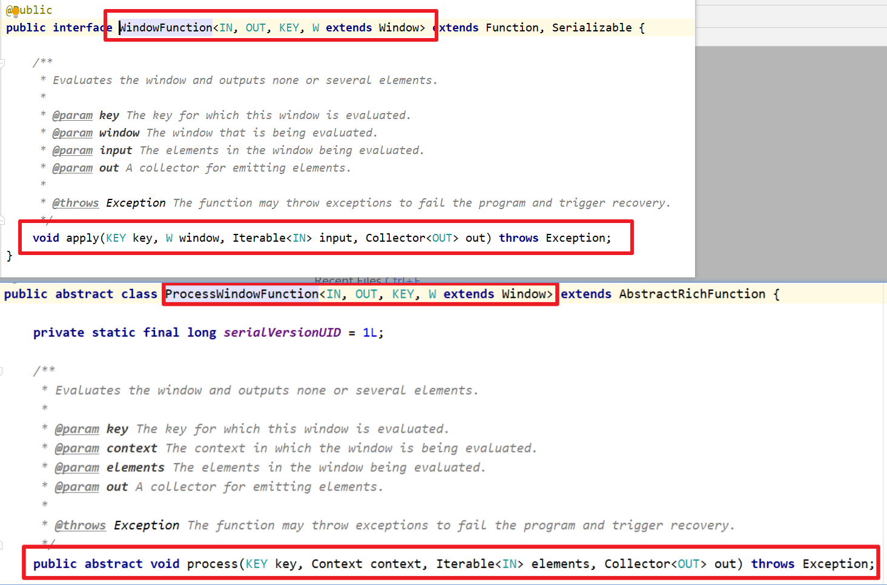
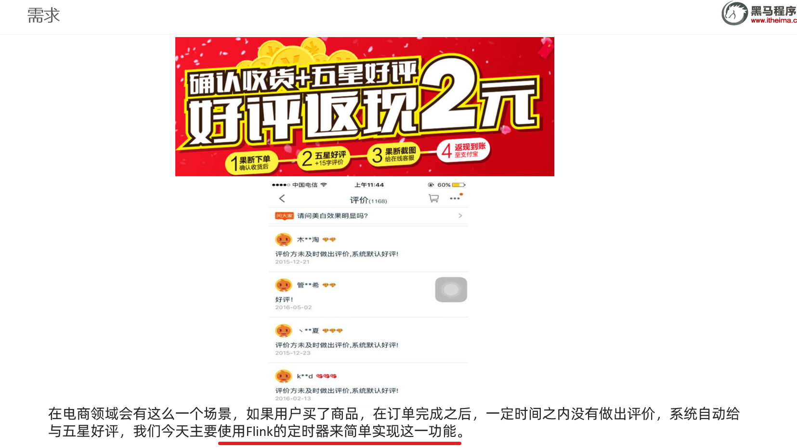
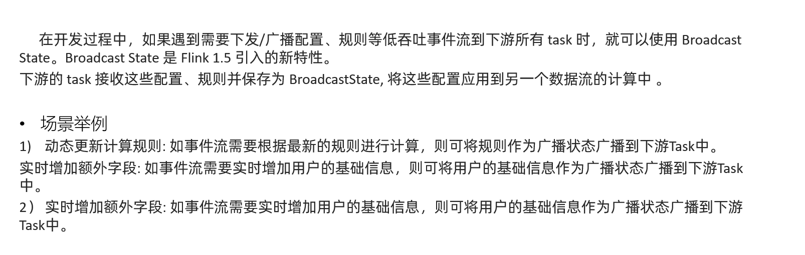
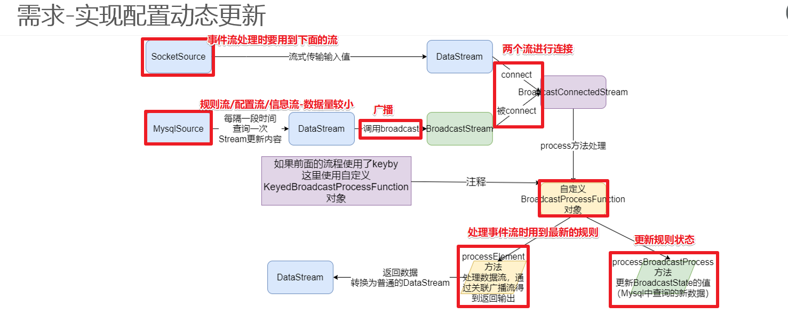
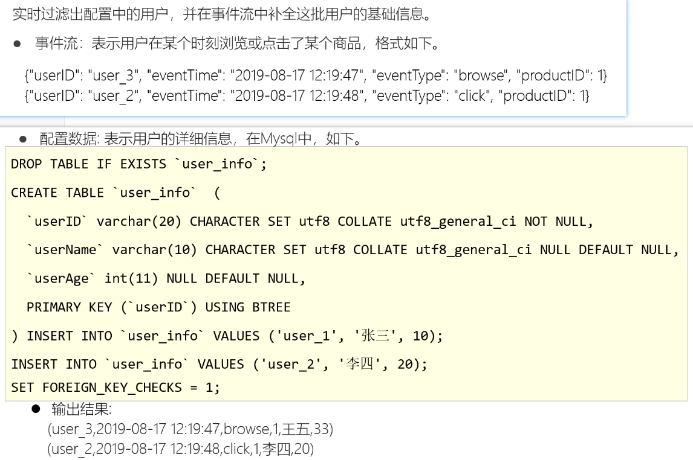

# Flink-练习-双十一实时交易大屏-掌握

## 需求


## 数据

```java
/**
     * 自定义数据源实时产生订单数据Tuple2<分类, 金额>
     */
    public static class MySource implements SourceFunction<Tuple2<String, Double>> {
        private boolean flag = true;
        private String[] categorys = {"女装", "男装", "图书", "家电", "洗护", "美妆", "运动", "游戏", "户外", "家具", "乐器", "办公"};
        private Random random = new Random();

        @Override
        public void run(SourceContext<Tuple2<String, Double>> ctx) throws Exception {
            while (flag) {
                //随机生成分类和金额
                int index = random.nextInt(categorys.length);//[0~length) ==> [0~length-1]
                String category = categorys[index];//获取的随机分类
                double price = random.nextDouble() * 100;//注意nextDouble生成的是[0~1)之间的随机小数,*100之后表示[0~100)的随机小数
                ctx.collect(Tuple2.of(category, price));
                Thread.sleep(20);
            }
        }

        @Override
        public void cancel() {
            flag = false;
        }
    }
```


## 实现步骤

```
1.env
2.source
3.transformation--预聚合
3.1定义大小为一天的窗口,第二个参数表示中国使用的UTC+08:00时区比UTC时间早
keyBy(t->t.f0)
window(TumblingProcessingTimeWindows.of(Time.days(1), Time.hours(-8))
3.2定义一个1s的触发器
.trigger(ContinuousProcessingTimeTrigger.of(Time.seconds(1)))
3.3聚合结果.aggregate(new PriceAggregate(), new WindowResult());
3.4看一下聚合的结果
CategoryPojo(category=男装, totalPrice=17225.26, dateTime=2020-10-20 08:04:12)
4.sink-使用上面预聚合的结果,实现业务需求:
tempAggResult.keyBy(CategoryPojo::getDateTime)
//每秒钟更新一次统计结果
                .window(TumblingProcessingTimeWindows.of(Time.seconds(1)))   
//在ProcessWindowFunction中实现该复杂业务逻辑
             	.process(new WindowResultProcess());
4.1.实时计算出当天零点截止到当前时间的销售总额
4.2.计算出各个分类的销售top3
4.3.每秒钟更新一次统计结果
5.execute
```


## 代码实现



```java
package cn.itcast.action;

import lombok.AllArgsConstructor;
import lombok.Data;
import lombok.NoArgsConstructor;
import org.apache.commons.lang3.StringUtils;
import org.apache.commons.lang3.time.FastDateFormat;
import org.apache.flink.api.common.RuntimeExecutionMode;
import org.apache.flink.api.common.functions.AggregateFunction;
import org.apache.flink.api.java.tuple.Tuple2;
import org.apache.flink.streaming.api.datastream.DataStream;
import org.apache.flink.streaming.api.environment.StreamExecutionEnvironment;
import org.apache.flink.streaming.api.functions.source.SourceFunction;
import org.apache.flink.streaming.api.functions.windowing.ProcessWindowFunction;
import org.apache.flink.streaming.api.functions.windowing.WindowFunction;
import org.apache.flink.streaming.api.windowing.assigners.TumblingProcessingTimeWindows;
import org.apache.flink.streaming.api.windowing.time.Time;
import org.apache.flink.streaming.api.windowing.triggers.ContinuousProcessingTimeTrigger;
import org.apache.flink.streaming.api.windowing.windows.TimeWindow;
import org.apache.flink.util.Collector;

import java.math.BigDecimal;
import java.math.RoundingMode;
import java.util.List;
import java.util.PriorityQueue;
import java.util.Queue;
import java.util.Random;
import java.util.stream.Collectors;

/**
 * Author itcast
 * Desc
 * 1.实时计算出当天零点截止到当前时间的销售总额 11月11日 00:00:00 ~ 23:59:59
 * 2.计算出各个分类的销售top3
 * 3.每秒钟更新一次统计结果
 */
public class DoubleElevenBigScreem {
    public static void main(String[] args) throws Exception {
        //TODO 1.env
        StreamExecutionEnvironment env = StreamExecutionEnvironment.getExecutionEnvironment();
        env.setRuntimeMode(RuntimeExecutionMode.AUTOMATIC);
        env.setParallelism(1);//方便观察
        //TODO 2.source
        DataStream<Tuple2<String, Double>> orderDS = env.addSource(new MySource());

        //TODO 3.transformation--初步聚合:每隔1s聚合一下截止到当前时间的各个分类的销售总金额
        DataStream<CategoryPojo> tempAggResult = orderDS
                //分组
                .keyBy(t -> t.f0)
                //如果直接使用之前学习的窗口按照下面的写法表示:
                //表示每隔1天计算一次
                //.window(TumblingProcessingTimeWindows.of(Time.days(1)));
                //表示每隔1s计算最近一天的数据,但是11月11日 00:01:00运行计算的是: 11月10日 00:01:00~11月11日 00:01:00 ---不对!
                //.window(SlidingProcessingTimeWindows.of(Time.days(1),Time.seconds(1)));
                //*例如中国使用UTC+08:00，您需要一天大小的时间窗口，
                //*窗口从当地时间的00:00:00开始，您可以使用{@code of(时间.天(1),时间.hours(-8))}.
                //下面的代码表示从当天的00:00:00开始计算当天的数据,缺一个触发时机/触发间隔
                //3.1定义大小为一天的窗口,第二个参数表示中国使用的UTC+08:00时区比UTC时间早
                .window(TumblingProcessingTimeWindows.of(Time.days(1), Time.hours(-8)))
                //3.2自定义触发时机/触发间隔
                .trigger(ContinuousProcessingTimeTrigger.of(Time.seconds(1)))
                //.sum()//简单聚合
                //3.3自定义聚合和结果收集
                //aggregate(AggregateFunction<T, ACC, V> aggFunction,WindowFunction<V, R, K, W> windowFunction)
                .aggregate(new PriceAggregate(), new WindowResult());//aggregate支持复杂的自定义聚合
        //3.4看一下聚合的结果
        tempAggResult.print("初步聚合的各个分类的销售总额");
        //初步聚合的各个分类的销售总额> DoubleElevenBigScreem.CategoryPojo(category=游戏, totalPrice=563.8662504982619, dateTime=2021-01-19 10:31:40)
        //初步聚合的各个分类的销售总额> DoubleElevenBigScreem.CategoryPojo(category=办公, totalPrice=876.5216500403918, dateTime=2021-01-19 10:31:40)

        //TODO 4.sink-使用上面初步聚合的结果(每隔1s聚合一下截止到当前时间的各个分类的销售总金额),实现业务需求:
        tempAggResult.keyBy(CategoryPojo::getDateTime)
                .window(TumblingProcessingTimeWindows.of(Time.seconds(1)))//每隔1s进行最终的聚合并输出结果
                //.sum//简单聚合
                .process(new FinalResultWindowProcess());//在ProcessWindowFunction中实现该复杂业务逻辑

        //TODO 5.execute
        env.execute();
    }

    /**
     * 自定义数据源实时产生订单数据Tuple2<分类, 金额>
     */
    public static class MySource implements SourceFunction<Tuple2<String, Double>> {
        private boolean flag = true;
        private String[] categorys = {"女装", "男装", "图书", "家电", "洗护", "美妆", "运动", "游戏", "户外", "家具", "乐器", "办公"};
        private Random random = new Random();

        @Override
        public void run(SourceContext<Tuple2<String, Double>> ctx) throws Exception {
            while (flag) {
                //随机生成分类和金额
                int index = random.nextInt(categorys.length);//[0~length) ==> [0~length-1]
                String category = categorys[index];//获取的随机分类
                double price = random.nextDouble() * 100;//注意nextDouble生成的是[0~1)之间的随机小数,*100之后表示[0~100)的随机小数
                ctx.collect(Tuple2.of(category, price));
                Thread.sleep(20);
            }
        }

        @Override
        public void cancel() {
            flag = false;
        }
    }

    /**
     * 自定义聚合函数,指定聚合规则
     * AggregateFunction<IN, ACC, OUT>
     */
    private static class PriceAggregate implements AggregateFunction<Tuple2<String, Double>, Double, Double> {
        //初始化累加器
        @Override
        public Double createAccumulator() {
            return 0D;//D表示double,L表示Long
        }

        //把数据累加到累加器上
        @Override
        public Double add(Tuple2<String, Double> value, Double accumulator) {
            return value.f1 + accumulator;
        }

        //获取累加结果
        @Override
        public Double getResult(Double accumulator) {
            return accumulator;
        }

        //合并各个subtask的结果
        @Override
        public Double merge(Double a, Double b) {
            return a + b;
        }
    }

    /**
     * 自定义窗口函数,指定窗口数据收集规则
     * WindowFunction<IN, OUT, KEY, W extends Window>
     */
    private static class WindowResult implements WindowFunction<Double, CategoryPojo, String, TimeWindow> {
        private FastDateFormat df = FastDateFormat.getInstance("yyyy-MM-dd HH:mm:ss");
        @Override
        //void apply(KEY key, W window, Iterable<IN> input, Collector<OUT> out)
        public void apply(String category, TimeWindow window, Iterable<Double> input, Collector<CategoryPojo> out) throws Exception {
            long currentTimeMillis = System.currentTimeMillis();
            String dateTime = df.format(currentTimeMillis);
            Double totalPrice = input.iterator().next();
            out.collect(new CategoryPojo(category,totalPrice,dateTime));
        }
    }

    /**
     * 用于存储聚合的结果
     */
    @Data
    @AllArgsConstructor
    @NoArgsConstructor
    public static class CategoryPojo {
        private String category;//分类名称
        private double totalPrice;//该分类总销售额
        private String dateTime;// 截止到当前时间的时间,本来应该是EventTime,但是我们这里简化了直接用当前系统时间即可
    }

    /**
     * 自定义窗口完成销售总额统计和分类销售额top3统计并输出
     * abstract class ProcessWindowFunction<IN, OUT, KEY, W extends Window>
     */
    private static class FinalResultWindowProcess extends ProcessWindowFunction<CategoryPojo, Object, String, TimeWindow> {
        //注意:
        //下面的key/dateTime表示当前这1s的时间
        //elements:表示截止到当前这1s的各个分类的销售数据
        @Override
        public void process(String dateTime, Context context, Iterable<CategoryPojo> elements, Collector<Object> out) throws Exception {
            //1.实时计算出当天零点截止到当前时间的销售总额 11月11日 00:00:00 ~ 23:59:59
            double total = 0D;//用来记录销售总额
            //2.计算出各个分类的销售top3:如: "女装": 10000 "男装": 9000 "图书":8000
            //注意:这里只需要求top3,也就是只需要排前3名就行了,其他的不用管!当然你也可以每次对进来的所有数据进行排序,但是浪费!
            //所以这里直接使用小顶堆完成top3排序:
            //70
            //80
            //90
            //如果进来一个比堆顶元素还有小的,直接不要
            //如果进来一个比堆顶元素大,如85,直接把堆顶元素删掉,把85加进去并继续按照小顶堆规则排序,小的在上面,大的在下面
            //80
            //85
            //90
            //创建一个小顶堆
            Queue<CategoryPojo> queue = new PriorityQueue<>(3,//初识容量
                    //正常的排序,就是小的在前,大的在后,也就是c1>c2的时候返回1,也就是升序,也就是小顶堆
                    (c1, c2) -> c1.getTotalPrice() >= c2.getTotalPrice() ? 1 : -1);
            for (CategoryPojo element : elements) {
                double price = element.getTotalPrice();
                total += price;
                if(queue.size()< 3){
                    queue.add(element);//或offer入队
                }else{
                    if(price >= queue.peek().getTotalPrice()){//peek表示取出堆顶元素但不删除
                        //queue.remove(queue.peek());
                        queue.poll();//移除堆顶元素
                        queue.add(element);//或offer入队
                    }
                }
            }
            //代码走到这里那么queue存放的就是分类的销售额top3,但是是升序.需要改为逆序然后输出
            List<String> top3List = queue.stream()
                    .sorted((c1, c2) -> c1.getTotalPrice() >= c2.getTotalPrice() ? -1 : 1)
                    .map(c -> "分类:" + c.getCategory() + " 金额:" + c.getTotalPrice())
                    .collect(Collectors.toList());

            //3.每秒钟更新一次统计结果-也就是直接输出
            double roundResult = new BigDecimal(total).setScale(2, RoundingMode.HALF_UP).doubleValue();//四舍五入保留2位小数
            System.out.println("时间: "+dateTime +" 总金额 :" + roundResult);

            System.out.println("top3: \n" + StringUtils.join(top3List,"\n"));
        }
    }
}

```

# Flink-练习-订单自动好评-掌握

## 需求



## 数据

```java
/**
     * 自定义source实时产生订单数据Tuple3<用户id,订单id, 订单生成时间>
     */
    public static class MySource implements SourceFunction<Tuple3<String, String, Long>> {
        private boolean flag = true;
        @Override
        public void run(SourceContext<Tuple3<String, String, Long>> ctx) throws Exception {
            Random random = new Random();
            while (flag) {
                String userId = random.nextInt(5) + "";
                String orderId = UUID.randomUUID().toString();
                long currentTimeMillis = System.currentTimeMillis();
                ctx.collect(Tuple3.of(userId, orderId, currentTimeMillis));
                Thread.sleep(500);
            }
        }

        @Override
        public void cancel() {
            flag = false;
        }
    }
```


## 实现步骤

```
1.env
2.source
3.transformation
设置经过interval毫秒用户未对订单做出评价，自动给与好评.为了演示方便，设置5s的时间
long interval = 5000L;
分组后使用自定义KeyedProcessFunction完成定时判断超时订单并自动好评
dataStream.keyBy(0).process(new TimerProcessFuntion(interval));
3.1定义MapState类型的状态，key是订单号，value是订单完成时间
3.2创建MapState
MapStateDescriptor<String, Long> mapStateDesc =
            new MapStateDescriptor<>("mapStateDesc", String.class, Long.class);
            mapState = getRuntimeContext().getMapState(mapStateDesc);
3.3注册定时器
mapState.put(value.f0, value.f1);
ctx.timerService().registerProcessingTimeTimer(value.f1 + interval);
3.4定时器被触发时执行并输出结果
4.sink
5.execute
```


## 代码实现

```java
package cn.itcast.action;

import org.apache.flink.api.common.RuntimeExecutionMode;
import org.apache.flink.api.common.state.MapState;
import org.apache.flink.api.common.state.MapStateDescriptor;
import org.apache.flink.api.java.tuple.Tuple3;
import org.apache.flink.configuration.Configuration;
import org.apache.flink.streaming.api.datastream.DataStream;
import org.apache.flink.streaming.api.environment.StreamExecutionEnvironment;
import org.apache.flink.streaming.api.functions.KeyedProcessFunction;
import org.apache.flink.streaming.api.functions.source.SourceFunction;
import org.apache.flink.util.Collector;

import java.util.Iterator;
import java.util.Map;
import java.util.Random;
import java.util.UUID;

/**
 * Author itcast
 * Desc
 */
public class OrderAutomaticFavorableComments {
    public static void main(String[] args) throws Exception {
        //TODO 1.env
        StreamExecutionEnvironment env = StreamExecutionEnvironment.getExecutionEnvironment();
        env.setRuntimeMode(RuntimeExecutionMode.AUTOMATIC);
        env.setParallelism(1);

        //TODO 2.source
        //Tuple3<用户id,订单id,订单生成时间>
        DataStream<Tuple3<String, String, Long>> orderDS = env.addSource(new MySource());

        //TODO 3.transformation
        //设置经过interval毫秒用户未对订单做出评价，自动给与好评.为了演示方便，设置5s的时间
        long interval = 5000L;//5s
        //分组后使用自定义KeyedProcessFunction完成定时判断超时订单并自动好评
        orderDS.keyBy(t -> t.f0)
                .process(new TimerProcessFunction(interval));

        //TODO 4.sink

        //TODO 5.execute
        env.execute();
    }

    /**
     * 自定义source实时产生订单数据Tuple3<用户id,订单id, 订单生成时间>
     */
    public static class MySource implements SourceFunction<Tuple3<String, String, Long>> {
        private boolean flag = true;

        @Override
        public void run(SourceContext<Tuple3<String, String, Long>> ctx) throws Exception {
            Random random = new Random();
            while (flag) {
                String userId = random.nextInt(5) + "";
                String orderId = UUID.randomUUID().toString();
                long currentTimeMillis = System.currentTimeMillis();
                ctx.collect(Tuple3.of(userId, orderId, currentTimeMillis));
                Thread.sleep(500);
            }
        }

        @Override
        public void cancel() {
            flag = false;
        }
    }

    /**
     * 自定义ProcessFunction完成订单自动好评
     * 进来一条数据应该在interval时间后进行判断该订单是否超时是否需要自动好评
     * abstract class KeyedProcessFunction<K, I, O>
     */
    private static class TimerProcessFunction extends KeyedProcessFunction<String, Tuple3<String, String, Long>, Object> {
        private long interval;//订单超时时间 传进来的是5000ms/5s

        public TimerProcessFunction(long interval) {
            this.interval = interval;
        }

        //-0.准备一个State来存储订单id和订单生成时间
        private MapState<String, Long> mapState = null;

        //-1.初始化
        @Override
        public void open(Configuration parameters) throws Exception {
            MapStateDescriptor<String, Long> mapStateDescriptor = new MapStateDescriptor<>("mapState", String.class, Long.class);
            mapState = getRuntimeContext().getMapState(mapStateDescriptor);
        }

        //-2.处理每一条数据并存入状态并注册定时器
        @Override
        public void processElement(Tuple3<String, String, Long> value, Context ctx, Collector<Object> out) throws Exception {
            //Tuple3<用户id,订单id, 订单生成时间> value里面是当前进来的数据里面有订单生成时间
            //把订单数据保存到状态中
            mapState.put(value.f1, value.f2);//xxx,2020-11-11 00:00:00 ||xx,2020-11-11 00:00:01
            //该订单在value.f2 + interval时过期/到期,这时如果没有评价的话需要系统给与默认好评
            //注册一个定时器在value.f2 + interval时检查是否需要默认好评
            ctx.timerService().registerProcessingTimeTimer(value.f2 + interval);//2020-11-11 00:00:05  || 2020-11-11 00:00:06
        }

        //-3.执行定时任务
        @Override
        public void onTimer(long timestamp, OnTimerContext ctx, Collector<Object> out) throws Exception {
            //检查历史订单数据(在状态中存储着)
            //遍历取出状态中的订单数据
            Iterator<Map.Entry<String, Long>> iterator = mapState.iterator();
            while (iterator.hasNext()) {
                Map.Entry<String, Long> map = iterator.next();
                String orderId = map.getKey();
                Long orderTime = map.getValue();
                //先判断是否好评--实际中应该去调用订单评价系统看是否好评了,我们这里写个方法模拟一下
                if (!isFavorable(orderId)) {//该订单没有给好评
                    //判断是否超时--不用考虑进来的数据是否过期,统一判断是否超时更保险!
                    if (System.currentTimeMillis() - orderTime >= interval) {
                        System.out.println("orderId:" + orderId + "该订单已经超时未评价,系统自动给与好评!....");
                        //移除状态中的数据,避免后续重复判断
                        iterator.remove();
                        mapState.remove(orderId);
                    }
                } else {
                    System.out.println("orderId:" + orderId + "该订单已经评价....");
                    //移除状态中的数据,避免后续重复判断
                    iterator.remove();
                    mapState.remove(orderId);
                }
            }
        }

        //自定义一个方法模拟订单系统返回该订单是否已经好评
        public boolean isFavorable(String orderId) {
            return orderId.hashCode() % 2 == 0;
        }
    }
}

```


# BroadcastState-动态更新规则配置-看懂

## 需求








有一个事件流--用户的行为日志,里面有用户id,但是没有用户的详细信息

有一个配置流/规则流--用户信息流--里面有用户的详细的信息

现在要将事件流和配置流进行关联, 得出日志中用户的详细信息,如 (用户id,详细信息, 操作)

那么我们可以将配置流/规则流--用户信息流 作为状态进行广播 (因为配置流/规则流--用户信息流较小)


## 数据

```java
/**
     * 随机事件流--数据量较大
     * 用户id,时间,类型,产品id
     * <userID, eventTime, eventType, productID>
     */
    public static class MySource implements SourceFunction<Tuple4<String, String, String, Integer>> {
        private boolean isRunning = true;
        @Override
        public void run(SourceContext<Tuple4<String, String, String, Integer>> ctx) throws Exception {
            Random random = new Random();
            SimpleDateFormat df = new SimpleDateFormat("yyyy-MM-dd HH:mm:ss");
            while (isRunning){
                int id = random.nextInt(4) + 1;
                String user_id = "user_" + id;
                String eventTime = df.format(new Date());
                String eventType = "type_" + random.nextInt(3);
                int productId = random.nextInt(4);
                ctx.collect(Tuple4.of(user_id,eventTime,eventType,productId));
                Thread.sleep(500);
            }
        }

        @Override
        public void cancel() {
            isRunning = false;
        }
    }
    /**
     * 配置流/规则流/用户信息流--数量较小
     * <用户id,<姓名,年龄>>
     */
    /*
CREATE TABLE `user_info` (
  `userID` varchar(20) NOT NULL,
  `userName` varchar(10) DEFAULT NULL,
  `userAge` int(11) DEFAULT NULL,
  PRIMARY KEY (`userID`) USING BTREE
) ENGINE=MyISAM DEFAULT CHARSET=utf8 ROW_FORMAT=DYNAMIC;

INSERT INTO `user_info` VALUES ('user_1', '张三', 10);
INSERT INTO `user_info` VALUES ('user_2', '李四', 20);
INSERT INTO `user_info` VALUES ('user_3', '王五', 30);
INSERT INTO `user_info` VALUES ('user_4', '赵六', 40);
     */
    public static class MySQLSource extends RichSourceFunction<Map<String, Tuple2<String, Integer>>> {
        private boolean flag = true;
        private Connection conn = null;
        private PreparedStatement ps = null;
        private ResultSet rs = null;

        @Override
        public void open(Configuration parameters) throws Exception {
            conn = DriverManager.getConnection("jdbc:mysql://localhost:3306/bigdata", "root", "root");
            String sql = "select `userID`, `userName`, `userAge` from `user_info`";
            ps = conn.prepareStatement(sql);
        }
        @Override
        public void run(SourceContext<Map<String, Tuple2<String, Integer>>> ctx) throws Exception {
            while (flag){
                Map<String, Tuple2<String, Integer>> map = new HashMap<>();
                ResultSet rs = ps.executeQuery();
                while (rs.next()){
                    String userID = rs.getString("userID");
                    String userName = rs.getString("userName");
                    int userAge = rs.getInt("userAge");
                    //Map<String, Tuple2<String, Integer>>
                    map.put(userID, Tuple2.of(userName,userAge));
                }
                ctx.collect(map);
                Thread.sleep(5000);//每隔5s更新一下用户的配置信息!
            }
        }
        @Override
        public void cancel() {
            flag = false;
        }
        @Override
        public void close() throws Exception {
            if (conn != null) conn.close();
            if (ps != null) ps.close();
            if (rs != null) rs.close();
        }
    }
```


## 代码步骤

```
1.env
2.source
-1.构建实时数据事件流-自定义随机
<userID, eventTime, eventType, productID>
-2.构建配置流-从MySQL
<用户id,<姓名,年龄>>
3.transformation
-1.定义状态描述器
MapStateDescriptor<Void, Map<String, Tuple2<String, Integer>>> descriptor =
new MapStateDescriptor<>("config",Types.VOID, Types.MAP(Types.STRING, Types.TUPLE(Types.STRING, Types.INT)));

-2.广播配置流
BroadcastStream<Map<String, Tuple2<String, Integer>>> broadcastDS = configDS.broadcast(descriptor);
-3.将事件流和广播流进行连接
BroadcastConnectedStream<Tuple4<String, String, String, Integer>, Map<String, Tuple2<String, Integer>>> connectDS =eventDS.connect(broadcastDS);
-4.处理连接后的流-根据配置流补全事件流中的用户的信息

4.sink
5.execute
```


## 代码实现

```java
package cn.itcast.feature;

import org.apache.flink.api.common.RuntimeExecutionMode;
import org.apache.flink.api.common.state.BroadcastState;
import org.apache.flink.api.common.state.MapStateDescriptor;
import org.apache.flink.api.common.state.ReadOnlyBroadcastState;
import org.apache.flink.api.common.typeinfo.Types;
import org.apache.flink.api.java.tuple.Tuple2;
import org.apache.flink.api.java.tuple.Tuple4;
import org.apache.flink.api.java.tuple.Tuple6;
import org.apache.flink.configuration.Configuration;
import org.apache.flink.streaming.api.datastream.BroadcastConnectedStream;
import org.apache.flink.streaming.api.datastream.BroadcastStream;
import org.apache.flink.streaming.api.datastream.DataStreamSource;
import org.apache.flink.streaming.api.datastream.SingleOutputStreamOperator;
import org.apache.flink.streaming.api.environment.StreamExecutionEnvironment;
import org.apache.flink.streaming.api.functions.co.BroadcastProcessFunction;
import org.apache.flink.streaming.api.functions.source.RichSourceFunction;
import org.apache.flink.streaming.api.functions.source.SourceFunction;
import org.apache.flink.util.Collector;

import java.sql.Connection;
import java.sql.DriverManager;
import java.sql.PreparedStatement;
import java.sql.ResultSet;
import java.text.SimpleDateFormat;
import java.util.Date;
import java.util.HashMap;
import java.util.Map;
import java.util.Random;

/**
 * Author itcast
 * Desc
 */
public class BroadcastStateDemo {
    public static void main(String[] args) throws Exception {
        //TODO 1.env
        StreamExecutionEnvironment env = StreamExecutionEnvironment.getExecutionEnvironment();
        env.setRuntimeMode(RuntimeExecutionMode.AUTOMATIC);
        env.setParallelism(1);

        //TODO 2.source
        //-1.构建实时数据事件流--数据量较大
        //<userID, eventTime, eventType, productID>
        DataStreamSource<Tuple4<String, String, String, Integer>> eventDS = env.addSource(new MySource());

        //-2.配置流/规则流/用户信息流--数据量较小-从MySQL
        //<用户id,<姓名,年龄>>
        DataStreamSource<Map<String, Tuple2<String, Integer>>> userDS = env.addSource(new MySQLSource());

        //TODO 3.transformation
        //-1.定义状态描述器
        MapStateDescriptor<Void, Map<String, Tuple2<String, Integer>>> descriptor =
                new MapStateDescriptor<>("info", Types.VOID, Types.MAP(Types.STRING, Types.TUPLE(Types.STRING, Types.INT)));

        //-2.广播配置流
        BroadcastStream<Map<String, Tuple2<String, Integer>>> broadcastDS = userDS.broadcast(descriptor);

        //-3.将事件流和广播流进行连接
        BroadcastConnectedStream<Tuple4<String, String, String, Integer>, Map<String, Tuple2<String, Integer>>> connectDS = eventDS.connect(broadcastDS);

        //-4.处理连接后的流-根据配置流补全事件流中的用户的信息
        //BroadcastProcessFunction<IN1, IN2, OUT>
        SingleOutputStreamOperator<Tuple6<String, String, String, Integer, String, Integer>> result =
                connectDS.process(new BroadcastProcessFunction<
                        //<userID, eventTime, eventType, productID> //事件流
                        Tuple4<String, String, String, Integer>,
                        //<用户id,<姓名,年龄>> //广播流
                        Map<String, Tuple2<String, Integer>>,
                        //<用户id，eventTime，eventType，productID，姓名，年龄> //结果流 需要收集的数据
                        Tuple6<String, String, String, Integer, String, Integer>
                        >() {
                    //处理事件流中的每一个元素
                    @Override
                    public void processElement(Tuple4<String, String, String, Integer> value, ReadOnlyContext ctx, Collector<Tuple6<String, String, String, Integer, String, Integer>> out) throws Exception {
                        //value就是事件流中的数据
                        //<userID, eventTime, eventType, productID> //事件流--已经有了
                        //Tuple4<String, String, String, Integer>,
                        //目标是将value和广播流中的数据进行关联,返回结果流
                        //<用户id,<姓名,年龄>> //广播流--需要获取
                        //Map<String, Tuple2<String, Integer>>
                        //<用户id，eventTime，eventType，productID，姓名，年龄> //结果流 需要收集的数据
                        // Tuple6<String, String, String, Integer, String, Integer>

                        //获取广播流
                        ReadOnlyBroadcastState<Void, Map<String, Tuple2<String, Integer>>> broadcastState = ctx.getBroadcastState(descriptor);
                        //用户id,<姓名,年龄>
                        Map<String, Tuple2<String, Integer>> map = broadcastState.get(null);//广播流中的数据
                        if (map != null) {
                            //根据value中的用户id去map中获取用户信息
                            String userId = value.f0;
                            Tuple2<String, Integer> tuple2 = map.get(userId);
                            String username = tuple2.f0;
                            Integer age = tuple2.f1;

                            //收集数据
                            out.collect(Tuple6.of(userId, value.f1, value.f2, value.f3, username, age));
                        }
                    }

                    //更新处理广播流中的数据
                    @Override
                    public void processBroadcastElement(Map<String, Tuple2<String, Integer>> value, Context ctx, Collector<Tuple6<String, String, String, Integer, String, Integer>> out) throws Exception {
                        //value就是从MySQL中每隔5是查询出来并广播到状态中的最新数据!
                        //要把最新的数据放到state中
                        BroadcastState<Void, Map<String, Tuple2<String, Integer>>> broadcastState = ctx.getBroadcastState(descriptor);
                        broadcastState.clear();//清空旧数据
                        broadcastState.put(null, value);//放入新数据
                    }
                });

        //TODO 4.sink
        result.print();

        //TODO 5.execute
        env.execute();
    }


    /**
     * 随机事件流--数据量较大
     * 用户id,时间,类型,产品id
     * <userID, eventTime, eventType, productID>
     */
    public static class MySource implements SourceFunction<Tuple4<String, String, String, Integer>> {
        private boolean isRunning = true;

        @Override
        public void run(SourceContext<Tuple4<String, String, String, Integer>> ctx) throws Exception {
            Random random = new Random();
            SimpleDateFormat df = new SimpleDateFormat("yyyy-MM-dd HH:mm:ss");
            while (isRunning) {
                int id = random.nextInt(4) + 1;
                String user_id = "user_" + id;
                String eventTime = df.format(new Date());
                String eventType = "type_" + random.nextInt(3);
                int productId = random.nextInt(4);
                ctx.collect(Tuple4.of(user_id, eventTime, eventType, productId));
                Thread.sleep(500);
            }
        }

        @Override
        public void cancel() {
            isRunning = false;
        }
    }

    /**
     * 配置流/规则流/用户信息流--数据量较小
     * <用户id,<姓名,年龄>>
     */
    /*
CREATE TABLE `user_info` (
  `userID` varchar(20) NOT NULL,
  `userName` varchar(10) DEFAULT NULL,
  `userAge` int(11) DEFAULT NULL,
  PRIMARY KEY (`userID`) USING BTREE
) ENGINE=MyISAM DEFAULT CHARSET=utf8 ROW_FORMAT=DYNAMIC;

INSERT INTO `user_info` VALUES ('user_1', '张三', 10);
INSERT INTO `user_info` VALUES ('user_2', '李四', 20);
INSERT INTO `user_info` VALUES ('user_3', '王五', 30);
INSERT INTO `user_info` VALUES ('user_4', '赵六', 40);
     */
    public static class MySQLSource extends RichSourceFunction<Map<String, Tuple2<String, Integer>>> {
        private boolean flag = true;
        private Connection conn = null;
        private PreparedStatement ps = null;
        private ResultSet rs = null;

        @Override
        public void open(Configuration parameters) throws Exception {
            conn = DriverManager.getConnection("jdbc:mysql://localhost:3306/bigdata", "root", "root");
            String sql = "select `userID`, `userName`, `userAge` from `user_info`";
            ps = conn.prepareStatement(sql);
        }

        @Override
        public void run(SourceContext<Map<String, Tuple2<String, Integer>>> ctx) throws Exception {
            while (flag) {
                Map<String, Tuple2<String, Integer>> map = new HashMap<>();
                ResultSet rs = ps.executeQuery();
                while (rs.next()) {
                    String userID = rs.getString("userID");
                    String userName = rs.getString("userName");
                    int userAge = rs.getInt("userAge");
                    //Map<String, Tuple2<String, Integer>>
                    map.put(userID, Tuple2.of(userName, userAge));
                }
                ctx.collect(map);
                Thread.sleep(5000);//每隔5s更新一下用户的配置信息!
            }
        }

        @Override
        public void cancel() {
            flag = false;
        }

        @Override
        public void close() throws Exception {
            if (conn != null) conn.close();
            if (ps != null) ps.close();
            if (rs != null) rs.close();
        }
    }
}

```


