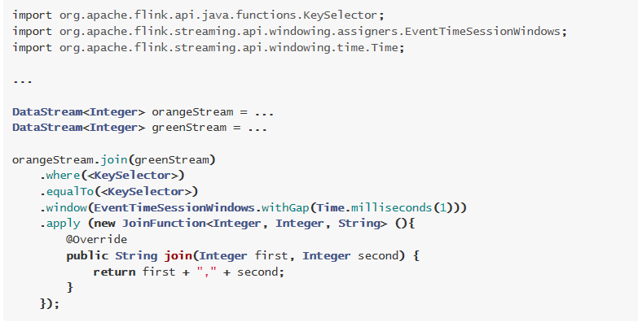

# Flink-高级特性-新特性-双流Join

## join的分类


## API

https://ci.apache.org/projects/flink/flink-docs-release-1.12/dev/stream/operators/joining.html





## 代码演示-WindowJoin


```java
package cn.itcast.feature;

import com.alibaba.fastjson.JSON;
import lombok.Data;
import org.apache.flink.api.common.RuntimeExecutionMode;
import org.apache.flink.api.common.eventtime.*;
import org.apache.flink.api.common.functions.JoinFunction;
import org.apache.flink.configuration.Configuration;
import org.apache.flink.streaming.api.datastream.DataStream;
import org.apache.flink.streaming.api.datastream.DataStreamSource;
import org.apache.flink.streaming.api.datastream.SingleOutputStreamOperator;
import org.apache.flink.streaming.api.environment.StreamExecutionEnvironment;
import org.apache.flink.streaming.api.functions.source.RichSourceFunction;
import org.apache.flink.streaming.api.windowing.assigners.TumblingEventTimeWindows;
import org.apache.flink.streaming.api.windowing.time.Time;

import java.math.BigDecimal;
import java.util.ArrayList;
import java.util.List;
import java.util.Random;
import java.util.UUID;
import java.util.concurrent.TimeUnit;

/**
 * Author itcast
 * Desc 演示Flink双流Join-windowJoin
 */
public class JoinDemo01_WindowJoin {
    public static void main(String[] args) throws Exception {
        //TODO 0.env
        StreamExecutionEnvironment env = StreamExecutionEnvironment.getExecutionEnvironment();
        env.setRuntimeMode(RuntimeExecutionMode.AUTOMATIC);

        //TODO 1.source
        //商品数据流
        DataStreamSource<Goods> goodsDS = env.addSource(new GoodsSource());
        //订单数据流
        DataStreamSource<OrderItem> OrderItemDS = env.addSource(new OrderItemSource());
        //给数据添加水印(这里简单一点直接使用系统时间作为事件时间)
        /*
         SingleOutputStreamOperator<Order> orderDSWithWatermark = orderDS.assignTimestampsAndWatermarks(
                WatermarkStrategy.<Order>forBoundedOutOfOrderness(Duration.ofSeconds(3))//指定maxOutOfOrderness最大无序度/最大允许的延迟时间/乱序时间
                        .withTimestampAssigner((order, timestamp) -> order.getEventTime())//指定事件时间列
        );
         */
        SingleOutputStreamOperator<Goods> goodsDSWithWatermark = goodsDS.assignTimestampsAndWatermarks(new GoodsWatermark());
        SingleOutputStreamOperator<OrderItem> OrderItemDSWithWatermark = OrderItemDS.assignTimestampsAndWatermarks(new OrderItemWatermark());


        //TODO 2.transformation---这里是重点
        //商品类(商品id,商品名称,商品价格)
        //订单明细类(订单id,商品id,商品数量)
        //关联结果(商品id,商品名称,商品数量,商品价格*商品数量)
        DataStream<FactOrderItem> resultDS = goodsDSWithWatermark.join(OrderItemDSWithWatermark)
                .where(Goods::getGoodsId)
                .equalTo(OrderItem::getGoodsId)
                .window(TumblingEventTimeWindows.of(Time.seconds(5)))
                //<IN1, IN2, OUT>
                .apply(new JoinFunction<Goods, OrderItem, FactOrderItem>() {
                    @Override
                    public FactOrderItem join(Goods first, OrderItem second) throws Exception {
                        FactOrderItem result = new FactOrderItem();
                        result.setGoodsId(first.getGoodsId());
                        result.setGoodsName(first.getGoodsName());
                        result.setCount(new BigDecimal(second.getCount()));
                        result.setTotalMoney(new BigDecimal(second.getCount()).multiply(first.getGoodsPrice()));
                        return result;
                    }
                });


        //TODO 3.sink
        resultDS.print();

        //TODO 4.execute
        env.execute();
    }
    //商品类(商品id,商品名称,商品价格)
    @Data
    public static class Goods {
        private String goodsId;
        private String goodsName;
        private BigDecimal goodsPrice;
        public static List<Goods> GOODS_LIST;
        public static Random r;

        static  {
            r = new Random();
            GOODS_LIST = new ArrayList<>();
            GOODS_LIST.add(new Goods("1", "小米12", new BigDecimal(4890)));
            GOODS_LIST.add(new Goods("2", "iphone12", new BigDecimal(12000)));
            GOODS_LIST.add(new Goods("3", "MacBookPro", new BigDecimal(15000)));
            GOODS_LIST.add(new Goods("4", "Thinkpad X1", new BigDecimal(9800)));
            GOODS_LIST.add(new Goods("5", "MeiZu One", new BigDecimal(3200)));
            GOODS_LIST.add(new Goods("6", "Mate 40", new BigDecimal(6500)));
        }
        public static Goods randomGoods() {
            int rIndex = r.nextInt(GOODS_LIST.size());
            return GOODS_LIST.get(rIndex);
        }
        public Goods() {
        }
        public Goods(String goodsId, String goodsName, BigDecimal goodsPrice) {
            this.goodsId = goodsId;
            this.goodsName = goodsName;
            this.goodsPrice = goodsPrice;
        }
        @Override
        public String toString() {
            return JSON.toJSONString(this);
        }
    }

    //订单明细类(订单id,商品id,商品数量)
    @Data
    public static class OrderItem {
        private String itemId;
        private String goodsId;
        private Integer count;
        @Override
        public String toString() {
            return JSON.toJSONString(this);
        }
    }

    //商品类(商品id,商品名称,商品价格)
    //订单明细类(订单id,商品id,商品数量)
    //关联结果(商品id,商品名称,商品数量,商品价格*商品数量)
    @Data
    public static class FactOrderItem {
        private String goodsId;
        private String goodsName;
        private BigDecimal count;
        private BigDecimal totalMoney;
        @Override
        public String toString() {
            return JSON.toJSONString(this);
        }
    }

    //实时生成商品数据流
    //构建一个商品Stream源（这个好比就是维表）
    public static class GoodsSource extends RichSourceFunction<Goods> {
        private Boolean isCancel;
        @Override
        public void open(Configuration parameters) throws Exception {
            isCancel = false;
        }
        @Override
        public void run(SourceContext sourceContext) throws Exception {
            while(!isCancel) {
                Goods.GOODS_LIST.stream().forEach(goods -> sourceContext.collect(goods));
                TimeUnit.SECONDS.sleep(1);
            }
        }
        @Override
        public void cancel() {
            isCancel = true;
        }
    }
    //实时生成订单数据流
    //构建订单明细Stream源
    public static class OrderItemSource extends RichSourceFunction<OrderItem> {
        private Boolean isCancel;
        private Random r;
        @Override
        public void open(Configuration parameters) throws Exception {
            isCancel = false;
            r = new Random();
        }
        @Override
        public void run(SourceContext sourceContext) throws Exception {
            while(!isCancel) {
                Goods goods = Goods.randomGoods();
                OrderItem orderItem = new OrderItem();
                orderItem.setGoodsId(goods.getGoodsId());
                orderItem.setCount(r.nextInt(10) + 1);
                orderItem.setItemId(UUID.randomUUID().toString());
                sourceContext.collect(orderItem);
                orderItem.setGoodsId("111");
                sourceContext.collect(orderItem);
                TimeUnit.SECONDS.sleep(1);
            }
        }

        @Override
        public void cancel() {
            isCancel = true;
        }
    }
    //构建水印分配器，学习测试直接使用系统时间了
    public static class GoodsWatermark implements WatermarkStrategy<Goods> {
        @Override
        public TimestampAssigner<Goods> createTimestampAssigner(TimestampAssignerSupplier.Context context) {
            return (element, recordTimestamp) -> System.currentTimeMillis();
        }
        @Override
        public WatermarkGenerator<Goods> createWatermarkGenerator(WatermarkGeneratorSupplier.Context context) {
            return new WatermarkGenerator<Goods>() {
                @Override
                public void onEvent(Goods event, long eventTimestamp, WatermarkOutput output) {
                    output.emitWatermark(new Watermark(System.currentTimeMillis()));
                }

                @Override
                public void onPeriodicEmit(WatermarkOutput output) {
                    output.emitWatermark(new Watermark(System.currentTimeMillis()));
                }
            };
        }
    }
    //构建水印分配器，学习测试直接使用系统时间了
    public static class OrderItemWatermark implements WatermarkStrategy<OrderItem> {
        @Override
        public TimestampAssigner<OrderItem> createTimestampAssigner(TimestampAssignerSupplier.Context context) {
            return (element, recordTimestamp) -> System.currentTimeMillis();
        }
        @Override
        public WatermarkGenerator<OrderItem> createWatermarkGenerator(WatermarkGeneratorSupplier.Context context) {
            return new WatermarkGenerator<OrderItem>() {
                @Override
                public void onEvent(OrderItem event, long eventTimestamp, WatermarkOutput output) {
                    output.emitWatermark(new Watermark(System.currentTimeMillis()));
                }
                @Override
                public void onPeriodicEmit(WatermarkOutput output) {
                    output.emitWatermark(new Watermark(System.currentTimeMillis()));
                }
            };
        }
    }
}

```


## 代码演示-IntervalJoin


```java
package cn.itcast.feature;

import com.alibaba.fastjson.JSON;
import lombok.Data;
import org.apache.flink.api.common.RuntimeExecutionMode;
import org.apache.flink.api.common.eventtime.*;
import org.apache.flink.configuration.Configuration;
import org.apache.flink.streaming.api.datastream.DataStreamSource;
import org.apache.flink.streaming.api.datastream.SingleOutputStreamOperator;
import org.apache.flink.streaming.api.environment.StreamExecutionEnvironment;
import org.apache.flink.streaming.api.functions.co.ProcessJoinFunction;
import org.apache.flink.streaming.api.functions.source.RichSourceFunction;
import org.apache.flink.streaming.api.windowing.time.Time;
import org.apache.flink.util.Collector;

import java.math.BigDecimal;
import java.util.ArrayList;
import java.util.List;
import java.util.Random;
import java.util.UUID;
import java.util.concurrent.TimeUnit;

/**
 * Author itcast
 * Desc 演示Flink双流Join-IntervalJoin
 */
public class JoinDemo02_IntervalJoin {
    public static void main(String[] args) throws Exception {
        //TODO 0.env
        StreamExecutionEnvironment env = StreamExecutionEnvironment.getExecutionEnvironment();
        env.setRuntimeMode(RuntimeExecutionMode.AUTOMATIC);

        //TODO 1.source
        //商品数据流
        DataStreamSource<Goods> goodsDS = env.addSource(new GoodsSource());
        //订单数据流
        DataStreamSource<OrderItem> OrderItemDS = env.addSource(new OrderItemSource());
        //给数据添加水印(这里简单一点直接使用系统时间作为事件时间)
        /*
         SingleOutputStreamOperator<Order> orderDSWithWatermark = orderDS.assignTimestampsAndWatermarks(
                WatermarkStrategy.<Order>forBoundedOutOfOrderness(Duration.ofSeconds(3))//指定maxOutOfOrderness最大无序度/最大允许的延迟时间/乱序时间
                        .withTimestampAssigner((order, timestamp) -> order.getEventTime())//指定事件时间列
        );
         */
        SingleOutputStreamOperator<Goods> goodsDSWithWatermark = goodsDS.assignTimestampsAndWatermarks(new GoodsWatermark());
        SingleOutputStreamOperator<OrderItem> OrderItemDSWithWatermark = OrderItemDS.assignTimestampsAndWatermarks(new OrderItemWatermark());


        //TODO 2.transformation---这里是重点
        //商品类(商品id,商品名称,商品价格)
        //订单明细类(订单id,商品id,商品数量)
        //关联结果(商品id,商品名称,商品数量,商品价格*商品数量)
        SingleOutputStreamOperator<FactOrderItem> resultDS = goodsDSWithWatermark.keyBy(Goods::getGoodsId)
                .intervalJoin(OrderItemDSWithWatermark.keyBy(OrderItem::getGoodsId))
                //join的条件:
                // 条件1.id要相等
                // 条件2. OrderItem的时间戳 - 2 <=Goods的时间戳 <= OrderItem的时间戳 + 1
                .between(Time.seconds(-2), Time.seconds(1))
                //ProcessJoinFunction<IN1, IN2, OUT>
                .process(new ProcessJoinFunction<Goods, OrderItem, FactOrderItem>() {
                    @Override
                    public void processElement(Goods left, OrderItem right, Context ctx, Collector<FactOrderItem> out) throws Exception {
                        FactOrderItem result = new FactOrderItem();
                        result.setGoodsId(left.getGoodsId());
                        result.setGoodsName(left.getGoodsName());
                        result.setCount(new BigDecimal(right.getCount()));
                        result.setTotalMoney(new BigDecimal(right.getCount()).multiply(left.getGoodsPrice()));
                        out.collect(result);
                    }
                });

        //TODO 3.sink
        resultDS.print();

        //TODO 4.execute
        env.execute();
    }
    //商品类(商品id,商品名称,商品价格)
    @Data
    public static class Goods {
        private String goodsId;
        private String goodsName;
        private BigDecimal goodsPrice;
        public static List<Goods> GOODS_LIST;
        public static Random r;

        static  {
            r = new Random();
            GOODS_LIST = new ArrayList<>();
            GOODS_LIST.add(new Goods("1", "小米12", new BigDecimal(4890)));
            GOODS_LIST.add(new Goods("2", "iphone12", new BigDecimal(12000)));
            GOODS_LIST.add(new Goods("3", "MacBookPro", new BigDecimal(15000)));
            GOODS_LIST.add(new Goods("4", "Thinkpad X1", new BigDecimal(9800)));
            GOODS_LIST.add(new Goods("5", "MeiZu One", new BigDecimal(3200)));
            GOODS_LIST.add(new Goods("6", "Mate 40", new BigDecimal(6500)));
        }
        public static Goods randomGoods() {
            int rIndex = r.nextInt(GOODS_LIST.size());
            return GOODS_LIST.get(rIndex);
        }
        public Goods() {
        }
        public Goods(String goodsId, String goodsName, BigDecimal goodsPrice) {
            this.goodsId = goodsId;
            this.goodsName = goodsName;
            this.goodsPrice = goodsPrice;
        }
        @Override
        public String toString() {
            return JSON.toJSONString(this);
        }
    }

    //订单明细类(订单id,商品id,商品数量)
    @Data
    public static class OrderItem {
        private String itemId;
        private String goodsId;
        private Integer count;
        @Override
        public String toString() {
            return JSON.toJSONString(this);
        }
    }

    //商品类(商品id,商品名称,商品价格)
    //订单明细类(订单id,商品id,商品数量)
    //关联结果(商品id,商品名称,商品数量,商品价格*商品数量)
    @Data
    public static class FactOrderItem {
        private String goodsId;
        private String goodsName;
        private BigDecimal count;
        private BigDecimal totalMoney;
        @Override
        public String toString() {
            return JSON.toJSONString(this);
        }
    }

    //实时生成商品数据流
    //构建一个商品Stream源（这个好比就是维表）
    public static class GoodsSource extends RichSourceFunction<Goods> {
        private Boolean isCancel;
        @Override
        public void open(Configuration parameters) throws Exception {
            isCancel = false;
        }
        @Override
        public void run(SourceContext sourceContext) throws Exception {
            while(!isCancel) {
                Goods.GOODS_LIST.stream().forEach(goods -> sourceContext.collect(goods));
                TimeUnit.SECONDS.sleep(1);
            }
        }
        @Override
        public void cancel() {
            isCancel = true;
        }
    }
    //实时生成订单数据流
    //构建订单明细Stream源
    public static class OrderItemSource extends RichSourceFunction<OrderItem> {
        private Boolean isCancel;
        private Random r;
        @Override
        public void open(Configuration parameters) throws Exception {
            isCancel = false;
            r = new Random();
        }
        @Override
        public void run(SourceContext sourceContext) throws Exception {
            while(!isCancel) {
                Goods goods = Goods.randomGoods();
                OrderItem orderItem = new OrderItem();
                orderItem.setGoodsId(goods.getGoodsId());
                orderItem.setCount(r.nextInt(10) + 1);
                orderItem.setItemId(UUID.randomUUID().toString());
                sourceContext.collect(orderItem);
                orderItem.setGoodsId("111");
                sourceContext.collect(orderItem);
                TimeUnit.SECONDS.sleep(1);
            }
        }

        @Override
        public void cancel() {
            isCancel = true;
        }
    }
    //构建水印分配器，学习测试直接使用系统时间了
    public static class GoodsWatermark implements WatermarkStrategy<Goods> {
        @Override
        public TimestampAssigner<Goods> createTimestampAssigner(TimestampAssignerSupplier.Context context) {
            return (element, recordTimestamp) -> System.currentTimeMillis();
        }
        @Override
        public WatermarkGenerator<Goods> createWatermarkGenerator(WatermarkGeneratorSupplier.Context context) {
            return new WatermarkGenerator<Goods>() {
                @Override
                public void onEvent(Goods event, long eventTimestamp, WatermarkOutput output) {
                    output.emitWatermark(new Watermark(System.currentTimeMillis()));
                }

                @Override
                public void onPeriodicEmit(WatermarkOutput output) {
                    output.emitWatermark(new Watermark(System.currentTimeMillis()));
                }
            };
        }
    }
    //构建水印分配器，学习测试直接使用系统时间了
    public static class OrderItemWatermark implements WatermarkStrategy<OrderItem> {
        @Override
        public TimestampAssigner<OrderItem> createTimestampAssigner(TimestampAssignerSupplier.Context context) {
            return (element, recordTimestamp) -> System.currentTimeMillis();
        }
        @Override
        public WatermarkGenerator<OrderItem> createWatermarkGenerator(WatermarkGeneratorSupplier.Context context) {
            return new WatermarkGenerator<OrderItem>() {
                @Override
                public void onEvent(OrderItem event, long eventTimestamp, WatermarkOutput output) {
                    output.emitWatermark(new Watermark(System.currentTimeMillis()));
                }
                @Override
                public void onPeriodicEmit(WatermarkOutput output) {
                    output.emitWatermark(new Watermark(System.currentTimeMillis()));
                }
            };
        }
    }
}

```


# Flink-高级特性-新特性-End-to-End Exactly-Once

## 数据一致性语义分类


## 数据一致性语义详解


注意:

Exactly-Once 更准确的理解 应该是: 

数据只会被正确的处理一次!

而不是说数据只被处理一次,有可能多次,但只有最后一次是正确的,成功的!


- End-To-End Exactly-Once

  表示从Source 到 Transformation 到 Sink 都能够保证Exactly-Once !

  


## 如何实现局部的Exactly-Once 

可以使用:

1.去重


2.幂等


3.分布式快照/Checkpoint---Flink使用的是这个


## 如何实现End-To-End Exactly-Once


Source: 如Kafka的offset 支持数据的replay/重放/重新传输

Transformation: 借助于Checkpoint

Sink: Checkpoint + 两阶段事务提交


- 两阶段事务提交


1. SourceOperater从Kafka消费消息/数据并记录offset
2. TransformationOperater对数据进行处理转换并做Checkpoint
3. SinkOperator将结果写入到Kafka

注意:在sink的时候会执行两阶段提交:

1.开启事务

2.各个Operator执行barrier的Checkpoint, 成功则进行预提交

3.所有Operator执行完预提交则执行真正的提交

4.如果有任何一个预提交失败则回滚到最近的Checkpoint


## 代码演示

kafka主题flink-kafka1 --->

Flink Source -->

Flink-Transformation做WordCount-->

结果存储到kafka主题-flink-kafka2

```java
//1.创建主题 
/export/server/kafka/bin/kafka-topics.sh --zookeeper node1:2181 --create --replication-factor 2 --partitions 3 --topic flink_kafka1
/export/server/kafka/bin/kafka-topics.sh --zookeeper node1:2181 --create --replication-factor 2 --partitions 3 --topic flink_kafka2
//2.开启控制台生产者 
/export/server/kafka/bin/kafka-console-producer.sh --broker-list node1:9092 --topic flink_kafka1
//3.开启控制台消费者 
/export/server/kafka/bin/kafka-console-consumer.sh --bootstrap-server node1:9092 --topic flink_kafka2
```


```java
package cn.itcast.feature;

import org.apache.commons.lang3.SystemUtils;
import org.apache.flink.api.common.RuntimeExecutionMode;
import org.apache.flink.api.common.functions.FlatMapFunction;
import org.apache.flink.api.common.functions.MapFunction;
import org.apache.flink.api.common.restartstrategy.RestartStrategies;
import org.apache.flink.api.common.serialization.SimpleStringSchema;
import org.apache.flink.api.common.time.Time;
import org.apache.flink.api.java.tuple.Tuple2;
import org.apache.flink.runtime.state.filesystem.FsStateBackend;
import org.apache.flink.streaming.api.CheckpointingMode;
import org.apache.flink.streaming.api.datastream.DataStream;
import org.apache.flink.streaming.api.datastream.SingleOutputStreamOperator;
import org.apache.flink.streaming.api.environment.CheckpointConfig;
import org.apache.flink.streaming.api.environment.StreamExecutionEnvironment;
import org.apache.flink.streaming.connectors.kafka.FlinkKafkaConsumer;
import org.apache.flink.streaming.connectors.kafka.FlinkKafkaProducer;
import org.apache.flink.streaming.connectors.kafka.internals.KeyedSerializationSchemaWrapper;
import org.apache.flink.util.Collector;

import java.util.Properties;
import java.util.Random;
import java.util.concurrent.TimeUnit;

/**
 * Author itcast
 * Desc 演示Flink的EndToEnd_Exactly_Once
 * 需求:
 * kafka主题flink-kafka1 --->Flink Source -->Flink-Transformation做WordCount-->结果存储到kafka主题-flink-kafka2
 */
public class Flink_Kafka_EndToEnd_Exactly_Once {
    public static void main(String[] args) throws Exception {
        //TODO 0.env
        StreamExecutionEnvironment env = StreamExecutionEnvironment.getExecutionEnvironment();
        env.setRuntimeMode(RuntimeExecutionMode.AUTOMATIC);

        //开启Checkpoint
        //===========类型1:必须参数=============
        //设置Checkpoint的时间间隔为1000ms做一次Checkpoint/其实就是每隔1000ms发一次Barrier!
        env.enableCheckpointing(1000);
        if (SystemUtils.IS_OS_WINDOWS) {
            env.setStateBackend(new FsStateBackend("file:///D:/ckp"));
        } else {
            env.setStateBackend(new FsStateBackend("hdfs://node1:8020/flink-checkpoint/checkpoint"));
        }
        //===========类型2:建议参数===========
        //设置两个Checkpoint 之间最少等待时间,如设置Checkpoint之间最少是要等 500ms(为了避免每隔1000ms做一次Checkpoint的时候,前一次太慢和后一次重叠到一起去了)
        //如:高速公路上,每隔1s关口放行一辆车,但是规定了两车之前的最小车距为500m
        env.getCheckpointConfig().setMinPauseBetweenCheckpoints(500);//默认是0
        //设置如果在做Checkpoint过程中出现错误，是否让整体任务失败：true是  false不是
        //env.getCheckpointConfig().setFailOnCheckpointingErrors(false);//默认是true
        env.getCheckpointConfig().setTolerableCheckpointFailureNumber(10);//默认值为0，表示不容忍任何检查点失败
        //设置是否清理检查点,表示 Cancel 时是否需要保留当前的 Checkpoint，默认 Checkpoint会在作业被Cancel时被删除
        //ExternalizedCheckpointCleanup.DELETE_ON_CANCELLATION：true,当作业被取消时，删除外部的checkpoint(默认值)
        //ExternalizedCheckpointCleanup.RETAIN_ON_CANCELLATION：false,当作业被取消时，保留外部的checkpoint
        env.getCheckpointConfig().enableExternalizedCheckpoints(CheckpointConfig.ExternalizedCheckpointCleanup.RETAIN_ON_CANCELLATION);

        //===========类型3:直接使用默认的即可===============
        //设置checkpoint的执行模式为EXACTLY_ONCE(默认)
        env.getCheckpointConfig().setCheckpointingMode(CheckpointingMode.EXACTLY_ONCE);
        //设置checkpoint的超时时间,如果 Checkpoint在 60s内尚未完成说明该次Checkpoint失败,则丢弃。
        env.getCheckpointConfig().setCheckpointTimeout(60000);//默认10分钟
        //设置同一时间有多少个checkpoint可以同时执行
        env.getCheckpointConfig().setMaxConcurrentCheckpoints(1);//默认为1

        //TODO ===配置重启策略:
        //1.配置了Checkpoint的情况下不做任务配置:默认是无限重启并自动恢复,可以解决小问题,但是可能会隐藏真正的bug
        //2.单独配置无重启策略
        //env.setRestartStrategy(RestartStrategies.noRestart());
        //3.固定延迟重启--开发中常用
        env.setRestartStrategy(RestartStrategies.fixedDelayRestart(
                3, // 最多重启3次数
                Time.of(5, TimeUnit.SECONDS) // 重启时间间隔
        ));
        //上面的设置表示:如果job失败,重启3次, 每次间隔5s
        //4.失败率重启--开发中偶尔使用
        /*env.setRestartStrategy(RestartStrategies.failureRateRestart(
                3, // 每个测量阶段内最大失败次数
                Time.of(1, TimeUnit.MINUTES), //失败率测量的时间间隔
                Time.of(3, TimeUnit.SECONDS) // 两次连续重启的时间间隔
        ));*/
        //上面的设置表示:如果1分钟内job失败不超过三次,自动重启,每次重启间隔3s (如果1分钟内程序失败达到3次,则程序退出)

        //TODO 1.source-主题:flink-kafka1
        //准备kafka连接参数
        Properties props1 = new Properties();
        props1.setProperty("bootstrap.servers", "node1:9092");//集群地址
        props1.setProperty("group.id", "flink");//消费者组id
        props1.setProperty("auto.offset.reset", "latest");//latest有offset记录从记录位置开始消费,没有记录从最新的/最后的消息开始消费 /earliest有offset记录从记录位置开始消费,没有记录从最早的/最开始的消息开始消费
        props1.setProperty("flink.partition-discovery.interval-millis", "5000");//会开启一个后台线程每隔5s检测一下Kafka的分区情况,实现动态分区检测
        //props1.setProperty("enable.auto.commit", "true");//自动提交(提交到默认主题,后续学习了Checkpoint后随着Checkpoint存储在Checkpoint和默认主题中)
        //props1.setProperty("auto.commit.interval.ms", "2000");//自动提交的时间间隔
        //使用连接参数创建FlinkKafkaConsumer/kafkaSource
        //FlinkKafkaConsumer里面已经实现了offset的Checkpoint维护!
        FlinkKafkaConsumer<String> kafkaSource = new FlinkKafkaConsumer<String>("flink_kafka1", new SimpleStringSchema(), props1);
        kafkaSource.setCommitOffsetsOnCheckpoints(true);//默认就是true//在做Checkpoint的时候提交offset到Checkpoint(为容错)和默认主题(为了外部工具获取)中

        //使用kafkaSource
        DataStream<String> kafkaDS = env.addSource(kafkaSource);

        //TODO 2.transformation-做WordCount
        SingleOutputStreamOperator<String> result = kafkaDS.flatMap(new FlatMapFunction<String, Tuple2<String, Integer>>() {
           private Random ran = new Random();
            @Override
            public void flatMap(String value, Collector<Tuple2<String, Integer>> out) throws Exception {
                String[] arr = value.split(" ");
                for (String word : arr) {
                    int num = ran.nextInt(5);
                    if(num > 3){
                        System.out.println("随机异常产生了");
                        throw new Exception("随机异常产生了");
                    }
                    out.collect(Tuple2.of(word, 1));
                }
            }
        }).keyBy(t -> t.f0)
          .sum(1)
          .map(new MapFunction<Tuple2<String, Integer>, String>() {
                    @Override
                    public String map(Tuple2<String, Integer> value) throws Exception {
                        return value.f0 + ":" + value.f1;
                    }
           });

        //TODO 3.sink-主题:flink-kafka2
        Properties props2 = new Properties();
        props2.setProperty("bootstrap.servers", "node1:9092");
        props2.setProperty("transaction.timeout.ms", "5000");

        FlinkKafkaProducer<String> kafkaSink = new FlinkKafkaProducer<>(
                "flink_kafka2",                  // target topic
                new KeyedSerializationSchemaWrapper(new SimpleStringSchema()),    // serialization schema
                props2,                  // producer config
                FlinkKafkaProducer.Semantic.EXACTLY_ONCE); // fault-tolerance

        result.addSink(kafkaSink);

        //TODO 4.execute
        env.execute();


    }
}

```


# Flink-高级特性-新特性-异步IO-了解

## 原理


## API

https://ci.apache.org/projects/flink/flink-docs-release-1.12/dev/stream/operators/asyncio.html


注意: 如果要使用异步IO, 对应Client有一定要求:

1.该Client要支持发送异步请求,如vertx

2.如果Client不支持可以使用线程池来模拟异步请求


## 代码演示

```
DROP TABLE IF EXISTS `t_category`;
CREATE TABLE `t_category` (
  `id` int(11) NOT NULL,
  `name` varchar(255) DEFAULT NULL,
  PRIMARY KEY (`id`)
) ENGINE=InnoDB DEFAULT CHARSET=utf8;

-- ----------------------------
-- Records of t_category
-- ----------------------------
INSERT INTO `t_category` VALUES ('1', '手机');
INSERT INTO `t_category` VALUES ('2', '电脑');
INSERT INTO `t_category` VALUES ('3', '服装');
INSERT INTO `t_category` VALUES ('4', '化妆品');
INSERT INTO `t_category` VALUES ('5', '食品');
```


```java
package cn.itcast.feature;

import io.vertx.core.AsyncResult;
import io.vertx.core.Handler;
import io.vertx.core.Vertx;
import io.vertx.core.VertxOptions;
import io.vertx.core.json.JsonObject;
import io.vertx.ext.jdbc.JDBCClient;
import io.vertx.ext.sql.SQLClient;
import io.vertx.ext.sql.SQLConnection;
import lombok.AllArgsConstructor;
import lombok.Data;
import lombok.NoArgsConstructor;
import org.apache.flink.configuration.Configuration;
import org.apache.flink.streaming.api.datastream.AsyncDataStream;
import org.apache.flink.streaming.api.datastream.DataStreamSource;
import org.apache.flink.streaming.api.datastream.SingleOutputStreamOperator;
import org.apache.flink.streaming.api.environment.StreamExecutionEnvironment;
import org.apache.flink.streaming.api.functions.async.ResultFuture;
import org.apache.flink.streaming.api.functions.async.RichAsyncFunction;
import org.apache.flink.streaming.api.functions.source.RichSourceFunction;

import java.sql.*;
import java.util.Collections;
import java.util.List;
import java.util.concurrent.ExecutorService;
import java.util.concurrent.LinkedBlockingQueue;
import java.util.concurrent.ThreadPoolExecutor;
import java.util.concurrent.TimeUnit;

/**
 * 使用异步io的先决条件
 * 1.数据库(或key/value存储)提供支持异步请求的client。
 * 2.没有异步请求客户端的话也可以将同步客户端丢到线程池中执行作为异步客户端。
 */
public class ASyncIODemo {
    public static void main(String[] args) throws Exception {
        //1.env
        StreamExecutionEnvironment env = StreamExecutionEnvironment.getExecutionEnvironment();
        //2.Source
        //数据源中只有id
        //DataStreamSource[1,2,3,4,5]
        DataStreamSource<CategoryInfo> categoryDS = env.addSource(new RichSourceFunction<CategoryInfo>() {
            private Boolean flag = true;
            @Override
            public void run(SourceContext<CategoryInfo> ctx) throws Exception {
                Integer[] ids = {1, 2, 3, 4, 5};
                for (Integer id : ids) {
                    ctx.collect(new CategoryInfo(id, null));
                }
            }
            @Override
            public void cancel() {
                this.flag = false;
            }
        });
        //3.Transformation


        //方式一：Java-vertx中提供的异步client实现异步IO
        //unorderedWait无序等待
        SingleOutputStreamOperator<CategoryInfo> result1 = AsyncDataStream
                .unorderedWait(categoryDS, new ASyncIOFunction1(), 1000, TimeUnit.SECONDS, 10);

        //方式二：MySQL中同步client+线程池模拟异步IO
        //unorderedWait无序等待
        SingleOutputStreamOperator<CategoryInfo> result2 = AsyncDataStream
                .unorderedWait(categoryDS, new ASyncIOFunction2(), 1000, TimeUnit.SECONDS, 10);

        //4.Sink
        result1.print("方式一：Java-vertx中提供的异步client实现异步IO \n");
        result2.print("方式二：MySQL中同步client+线程池模拟异步IO \n");

        //5.execute
        env.execute();
    }
}

@Data
@NoArgsConstructor
@AllArgsConstructor
class CategoryInfo {
    private Integer id;
    private String name;
}

//MySQL本身的客户端-需要把它变成支持异步的客户端:使用vertx或线程池
class MysqlSyncClient {
    private static transient Connection connection;
    private static final String JDBC_DRIVER = "com.mysql.jdbc.Driver";
    private static final String URL = "jdbc:mysql://localhost:3306/bigdata";
    private static final String USER = "root";
    private static final String PASSWORD = "root";

    static {
        init();
    }

    private static void init() {
        try {
            Class.forName(JDBC_DRIVER);
        } catch (ClassNotFoundException e) {
            System.out.println("Driver not found!" + e.getMessage());
        }
        try {
            connection = DriverManager.getConnection(URL, USER, PASSWORD);
        } catch (SQLException e) {
            System.out.println("init connection failed!" + e.getMessage());
        }
    }

    public void close() {
        try {
            if (connection != null) {
                connection.close();
            }
        } catch (SQLException e) {
            System.out.println("close connection failed!" + e.getMessage());
        }
    }

    public CategoryInfo query(CategoryInfo category) {
        try {
            String sql = "select id,name from t_category where id = "+ category.getId();
            Statement statement = connection.createStatement();
            ResultSet rs = statement.executeQuery(sql);
            if (rs != null && rs.next()) {
                category.setName(rs.getString("name"));
            }
        } catch (SQLException e) {
            System.out.println("query failed!" + e.getMessage());
        }
        return category;
    }
}

/**
 * 方式一：Java-vertx中提供的异步client实现异步IO
 */
class ASyncIOFunction1 extends RichAsyncFunction<CategoryInfo, CategoryInfo> {
    private transient SQLClient mySQLClient;

    @Override
    public void open(Configuration parameters) throws Exception {
        JsonObject mySQLClientConfig = new JsonObject();
        mySQLClientConfig
                .put("driver_class", "com.mysql.jdbc.Driver")
                .put("url", "jdbc:mysql://localhost:3306/bigdata")
                .put("user", "root")
                .put("password", "root")
                .put("max_pool_size", 20);

        VertxOptions options = new VertxOptions();
        options.setEventLoopPoolSize(10);
        options.setWorkerPoolSize(20);
        Vertx vertx = Vertx.vertx(options);
        //根据上面的配置参数获取异步请求客户端
        mySQLClient = JDBCClient.createNonShared(vertx, mySQLClientConfig);
    }

    //使用异步客户端发送异步请求
    @Override
    public void asyncInvoke(CategoryInfo input, ResultFuture<CategoryInfo> resultFuture) throws Exception {
        mySQLClient.getConnection(new Handler<AsyncResult<SQLConnection>>() {
            @Override
            public void handle(AsyncResult<SQLConnection> sqlConnectionAsyncResult) {
                if (sqlConnectionAsyncResult.failed()) {
                    return;
                }
                SQLConnection connection = sqlConnectionAsyncResult.result();
                connection.query("select id,name from t_category where id = " +input.getId(), new Handler<AsyncResult<io.vertx.ext.sql.ResultSet>>() {
                    @Override
                    public void handle(AsyncResult<io.vertx.ext.sql.ResultSet> resultSetAsyncResult) {
                        if (resultSetAsyncResult.succeeded()) {
                            List<JsonObject> rows = resultSetAsyncResult.result().getRows();
                            for (JsonObject jsonObject : rows) {
                                CategoryInfo categoryInfo = new CategoryInfo(jsonObject.getInteger("id"), jsonObject.getString("name"));
                                resultFuture.complete(Collections.singletonList(categoryInfo));
                            }
                        }
                    }
                });
            }
        });
    }
    @Override
    public void close() throws Exception {
        mySQLClient.close();
    }

    @Override
    public void timeout(CategoryInfo input, ResultFuture<CategoryInfo> resultFuture) throws Exception {
        System.out.println("async call time out!");
        input.setName("未知");
        resultFuture.complete(Collections.singleton(input));
    }
}

/**
 * 方式二：同步调用+线程池模拟异步IO
 */
class ASyncIOFunction2 extends RichAsyncFunction<CategoryInfo, CategoryInfo> {
    private transient MysqlSyncClient client;
    private ExecutorService executorService;//线程池

    @Override
    public void open(Configuration parameters) throws Exception {
        super.open(parameters);
        client = new MysqlSyncClient();
        executorService = new ThreadPoolExecutor(10, 10, 0L, TimeUnit.MILLISECONDS, new LinkedBlockingQueue<Runnable>());
    }

    //异步发送请求
    @Override
    public void asyncInvoke(CategoryInfo input, ResultFuture<CategoryInfo> resultFuture) throws Exception {
        executorService.execute(new Runnable() {
            @Override
            public void run() {
                resultFuture.complete(Collections.singletonList((CategoryInfo) client.query(input)));
            }
        });
    }


    @Override
    public void close() throws Exception {
    }

    @Override
    public void timeout(CategoryInfo input, ResultFuture<CategoryInfo> resultFuture) throws Exception {
        System.out.println("async call time out!");
        input.setName("未知");
        resultFuture.complete(Collections.singleton(input));
    }
}
```


# Flink-高级特性-新特性-Streaming Flie Sink

## 介绍

https://ci.apache.org/projects/flink/flink-docs-release-1.12/dev/connectors/streamfile_sink.html

https://blog.csdn.net/u013220482/article/details/100901471


## 代码演示

```java
package cn.itcast.feature;


import org.apache.commons.lang3.SystemUtils;
import org.apache.flink.api.common.RuntimeExecutionMode;
import org.apache.flink.api.common.functions.FlatMapFunction;
import org.apache.flink.api.common.functions.MapFunction;
import org.apache.flink.api.common.serialization.SimpleStringEncoder;
import org.apache.flink.api.java.tuple.Tuple2;
import org.apache.flink.core.fs.Path;
import org.apache.flink.runtime.state.filesystem.FsStateBackend;
import org.apache.flink.streaming.api.CheckpointingMode;
import org.apache.flink.streaming.api.datastream.DataStream;
import org.apache.flink.streaming.api.datastream.SingleOutputStreamOperator;
import org.apache.flink.streaming.api.environment.CheckpointConfig;
import org.apache.flink.streaming.api.environment.StreamExecutionEnvironment;
import org.apache.flink.streaming.api.functions.sink.filesystem.OutputFileConfig;
import org.apache.flink.streaming.api.functions.sink.filesystem.StreamingFileSink;
import org.apache.flink.streaming.api.functions.sink.filesystem.rollingpolicies.DefaultRollingPolicy;
import org.apache.flink.util.Collector;

import java.util.concurrent.TimeUnit;

/**
 * Author itcast
 * Desc 演示Flink StreamingFileSink将流式数据写入到HDFS 数据一致性由Checkpoint + 两阶段提交保证
 */
public class StreamingFileSinkDemo {
    public static void main(String[] args) throws Exception {
        //TODO 0.env
        StreamExecutionEnvironment env = StreamExecutionEnvironment.getExecutionEnvironment();
        env.setRuntimeMode(RuntimeExecutionMode.AUTOMATIC);

        //开启Checkpoint
        //===========类型1:必须参数=============
        //设置Checkpoint的时间间隔为1000ms做一次Checkpoint/其实就是每隔1000ms发一次Barrier!
        env.enableCheckpointing(1000);
        if (SystemUtils.IS_OS_WINDOWS) {
            env.setStateBackend(new FsStateBackend("file:///D:/ckp"));
        } else {
            env.setStateBackend(new FsStateBackend("hdfs://node1:8020/flink-checkpoint/checkpoint"));
        }
        //===========类型2:建议参数===========
        //设置两个Checkpoint 之间最少等待时间,如设置Checkpoint之间最少是要等 500ms(为了避免每隔1000ms做一次Checkpoint的时候,前一次太慢和后一次重叠到一起去了)
        //如:高速公路上,每隔1s关口放行一辆车,但是规定了两车之前的最小车距为500m
        env.getCheckpointConfig().setMinPauseBetweenCheckpoints(500);//默认是0
        //设置如果在做Checkpoint过程中出现错误，是否让整体任务失败：true是  false不是
        //env.getCheckpointConfig().setFailOnCheckpointingErrors(false);//默认是true
        env.getCheckpointConfig().setTolerableCheckpointFailureNumber(10);//默认值为0，表示不容忍任何检查点失败
        //设置是否清理检查点,表示 Cancel 时是否需要保留当前的 Checkpoint，默认 Checkpoint会在作业被Cancel时被删除
        //ExternalizedCheckpointCleanup.DELETE_ON_CANCELLATION：true,当作业被取消时，删除外部的checkpoint(默认值)
        //ExternalizedCheckpointCleanup.RETAIN_ON_CANCELLATION：false,当作业被取消时，保留外部的checkpoint
        env.getCheckpointConfig().enableExternalizedCheckpoints(CheckpointConfig.ExternalizedCheckpointCleanup.RETAIN_ON_CANCELLATION);

        //===========类型3:直接使用默认的即可===============
        //设置checkpoint的执行模式为EXACTLY_ONCE(默认)
        env.getCheckpointConfig().setCheckpointingMode(CheckpointingMode.EXACTLY_ONCE);
        //设置checkpoint的超时时间,如果 Checkpoint在 60s内尚未完成说明该次Checkpoint失败,则丢弃。
        env.getCheckpointConfig().setCheckpointTimeout(60000);//默认10分钟
        //设置同一时间有多少个checkpoint可以同时执行
        env.getCheckpointConfig().setMaxConcurrentCheckpoints(1);//默认为1


        //TODO 1.source
        DataStream<String> lines = env.socketTextStream("node1", 9999);


        //TODO 2.transformation
        //注意:下面的操作将上面的2步合成了1步,直接切割单词并记为1返回
        SingleOutputStreamOperator<Tuple2<String, Integer>> wordAndOne = lines.flatMap(new FlatMapFunction<String, Tuple2<String, Integer>>() {
            @Override
            public void flatMap(String value, Collector<Tuple2<String, Integer>> out) throws Exception {
                String[] arr = value.split(" ");
                for (String word : arr) {
                    out.collect(Tuple2.of(word, 1));
                }
            }
        });

        SingleOutputStreamOperator<String> result = wordAndOne.keyBy(t -> t.f0).sum(1)
                .map(new MapFunction<Tuple2<String, Integer>, String>() {
                    @Override
                    public String map(Tuple2<String, Integer> value) throws Exception {
                        return value.f0 + ":" + value.f1;
                    }
                });

        //TODO 3.sink
        result.print();

        //使用StreamingFileSink将数据sink到HDFS
        OutputFileConfig config = OutputFileConfig
                .builder()
                .withPartPrefix("prefix")//设置文件前缀
                .withPartSuffix(".txt")//设置文件后缀
                .build();

        StreamingFileSink<String> streamingFileSink = StreamingFileSink.
                forRowFormat(new Path("hdfs://node1:8020/FlinkStreamFileSink/parquet"), new SimpleStringEncoder<String>("UTF-8"))
                .withRollingPolicy(
                        DefaultRollingPolicy.builder()
                                .withRolloverInterval(TimeUnit.MINUTES.toMillis(15))//每隔15分钟生成一个新文件
                                .withInactivityInterval(TimeUnit.MINUTES.toMillis(5))//每隔5分钟没有新数据到来,也把之前的生成一个新文件
                                .withMaxPartSize(1024 * 1024 * 1024)
                                .build())
                .withOutputFileConfig(config)
                .build();

        result.addSink(streamingFileSink);

        //TODO 4.execute
        env.execute();
    }
}

```

# Flink-高级特性-新特性-Flie Sink


```java
package cn.itcast.feature;


import org.apache.commons.lang3.SystemUtils;
import org.apache.flink.api.common.RuntimeExecutionMode;
import org.apache.flink.api.common.functions.FlatMapFunction;
import org.apache.flink.api.common.functions.MapFunction;
import org.apache.flink.api.common.serialization.SimpleStringEncoder;
import org.apache.flink.api.java.tuple.Tuple2;
import org.apache.flink.connector.file.sink.FileSink;
import org.apache.flink.core.fs.Path;
import org.apache.flink.runtime.state.filesystem.FsStateBackend;
import org.apache.flink.streaming.api.CheckpointingMode;
import org.apache.flink.streaming.api.datastream.DataStream;
import org.apache.flink.streaming.api.datastream.SingleOutputStreamOperator;
import org.apache.flink.streaming.api.environment.CheckpointConfig;
import org.apache.flink.streaming.api.environment.StreamExecutionEnvironment;
import org.apache.flink.streaming.api.functions.sink.filesystem.OutputFileConfig;
import org.apache.flink.streaming.api.functions.sink.filesystem.bucketassigners.DateTimeBucketAssigner;
import org.apache.flink.streaming.api.functions.sink.filesystem.rollingpolicies.DefaultRollingPolicy;
import org.apache.flink.util.Collector;

import java.util.concurrent.TimeUnit;

/**
 * Author itcast
 * Desc 演示Flink FileSink将批/流式数据写入到HDFS 数据一致性由Checkpoint + 两阶段提交保证
 */
public class FileSinkDemo {
    public static void main(String[] args) throws Exception {
        //TODO 0.env
        StreamExecutionEnvironment env = StreamExecutionEnvironment.getExecutionEnvironment();
        env.setRuntimeMode(RuntimeExecutionMode.AUTOMATIC);

        //开启Checkpoint
        //===========类型1:必须参数=============
        //设置Checkpoint的时间间隔为1000ms做一次Checkpoint/其实就是每隔1000ms发一次Barrier!
        env.enableCheckpointing(1000);
        if (SystemUtils.IS_OS_WINDOWS) {
            env.setStateBackend(new FsStateBackend("file:///D:/ckp"));
        } else {
            env.setStateBackend(new FsStateBackend("hdfs://node1:8020/flink-checkpoint/checkpoint"));
        }
        //===========类型2:建议参数===========
        //设置两个Checkpoint 之间最少等待时间,如设置Checkpoint之间最少是要等 500ms(为了避免每隔1000ms做一次Checkpoint的时候,前一次太慢和后一次重叠到一起去了)
        //如:高速公路上,每隔1s关口放行一辆车,但是规定了两车之前的最小车距为500m
        env.getCheckpointConfig().setMinPauseBetweenCheckpoints(500);//默认是0
        //设置如果在做Checkpoint过程中出现错误，是否让整体任务失败：true是  false不是
        //env.getCheckpointConfig().setFailOnCheckpointingErrors(false);//默认是true
        env.getCheckpointConfig().setTolerableCheckpointFailureNumber(10);//默认值为0，表示不容忍任何检查点失败
        //设置是否清理检查点,表示 Cancel 时是否需要保留当前的 Checkpoint，默认 Checkpoint会在作业被Cancel时被删除
        //ExternalizedCheckpointCleanup.DELETE_ON_CANCELLATION：true,当作业被取消时，删除外部的checkpoint(默认值)
        //ExternalizedCheckpointCleanup.RETAIN_ON_CANCELLATION：false,当作业被取消时，保留外部的checkpoint
        env.getCheckpointConfig().enableExternalizedCheckpoints(CheckpointConfig.ExternalizedCheckpointCleanup.RETAIN_ON_CANCELLATION);

        //===========类型3:直接使用默认的即可===============
        //设置checkpoint的执行模式为EXACTLY_ONCE(默认)
        env.getCheckpointConfig().setCheckpointingMode(CheckpointingMode.EXACTLY_ONCE);
        //设置checkpoint的超时时间,如果 Checkpoint在 60s内尚未完成说明该次Checkpoint失败,则丢弃。
        env.getCheckpointConfig().setCheckpointTimeout(60000);//默认10分钟
        //设置同一时间有多少个checkpoint可以同时执行
        env.getCheckpointConfig().setMaxConcurrentCheckpoints(1);//默认为1


        //TODO 1.source
        DataStream<String> lines = env.socketTextStream("node1", 9999);


        //TODO 2.transformation
        //注意:下面的操作将上面的2步合成了1步,直接切割单词并记为1返回
        SingleOutputStreamOperator<Tuple2<String, Integer>> wordAndOne = lines.flatMap(new FlatMapFunction<String, Tuple2<String, Integer>>() {
            @Override
            public void flatMap(String value, Collector<Tuple2<String, Integer>> out) throws Exception {
                String[] arr = value.split(" ");
                for (String word : arr) {
                    out.collect(Tuple2.of(word, 1));
                }
            }
        });

        SingleOutputStreamOperator<String> result = wordAndOne.keyBy(t -> t.f0).sum(1)
                .map(new MapFunction<Tuple2<String, Integer>, String>() {
                    @Override
                    public String map(Tuple2<String, Integer> value) throws Exception {
                        return value.f0 + ":" + value.f1;
                    }
                });

        //TODO 3.sink
        result.print();

        //使用FileSink将数据sink到HDFS
        OutputFileConfig config = OutputFileConfig
                .builder()
                .withPartPrefix("prefix")
                .withPartSuffix(".txt")
                .build();

        FileSink<String> sink = FileSink
                .forRowFormat(new Path("hdfs://node1:8020/FlinkFileSink/parquet"), new SimpleStringEncoder<String>("UTF-8"))
                .withRollingPolicy(
                        DefaultRollingPolicy.builder()
                                .withRolloverInterval(TimeUnit.MINUTES.toMillis(15))
                                .withInactivityInterval(TimeUnit.MINUTES.toMillis(5))
                                .withMaxPartSize(1024 * 1024 * 1024)
                                .build())
                .withOutputFileConfig(config)
                .withBucketAssigner(new DateTimeBucketAssigner("yyyy-MM-dd--HH"))
                .build();

        result.sinkTo(sink);


        //TODO 4.execute
        env.execute();
    }
}

```


# Flink-高级特性-新特性-FlinkSQL整合Hive


## 1.介绍


## 版本

https://ci.apache.org/projects/flink/flink-docs-release-1.12/dev/table/connectors/hive/


## 添加依赖和jar包和配置

```java
<dependency>
            <groupId>org.apache.flink</groupId>
            <artifactId>flink-connector-hive_2.12</artifactId>
            <version>${flink.version}</version>
        </dependency>
        <dependency>
            <groupId>org.apache.hive</groupId>
            <artifactId>hive-metastore</artifactId>
            <version>2.1.0</version>
            <exclusions>
                <exclusion>
                    <artifactId>hadoop-hdfs</artifactId>
                    <groupId>org.apache.hadoop</groupId>
                </exclusion>
            </exclusions>
        </dependency>
        <dependency>
            <groupId>org.apache.hive</groupId>
            <artifactId>hive-exec</artifactId>
            <version>2.1.0</version>
        </dependency>

```

上传资料hive中的jar包到flink/lib中


## FlinkSQL整合Hive-CLI命令行整合

1.修改hive-site.xml

 ```
<property>
        <name>hive.metastore.uris</name>
        <value>thrift://node3:9083</value>
</property>
 ```


```xml
<?xml-stylesheet type="text/xsl" href="configuration.xsl"?>
<configuration>
    <property>
        <name>javax.jdo.option.ConnectionUserName</name>
        <value>root</value>
    </property>
    <property>
        <name>javax.jdo.option.ConnectionPassword</name>
        <value>123456</value>
    </property>
    <property>
        <name>javax.jdo.option.ConnectionURL</name>
        <value>jdbc:mysql://node3:3306/hive?createDatabaseIfNotExist=true&amp;useSSL=false</value>
    </property>
    <property>
        <name>javax.jdo.option.ConnectionDriverName</name>
        <value>com.mysql.jdbc.Driver</value>
    </property>
    <property>
        <name>hive.metastore.schema.verification</name>
        <value>false</value>
    </property>
    <property>
        <name>datanucleus.schema.autoCreateAll</name>
        <value>true</value>
    </property>
    <property>
        <name>hive.server2.thrift.bind.host</name>
        <value>node3</value>
    </property>
    <property>
        <name>hive.metastore.uris</name>
        <value>thrift://node3:9083</value>
    </property>
</configuration>
```


2.启动元数据服务

nohup /export/server/hive/bin/hive --service metastore &


3.修改flink/conf/sql-client-defaults.yaml

```
catalogs:
   - name: myhive
     type: hive
     hive-conf-dir: /export/server/hive/conf
     default-database: default
```


4.分发


5.启动flink集群

/export/server/flink/bin/start-cluster.sh

 

6.启动flink-sql客户端-hive在哪就在哪启

/export/server/flink/bin/sql-client.sh embedded

 

7.执行sql:

show catalogs;

use catalog myhive;

show tables;

select * from person;


## FlinkSQL整合Hive-代码整合

https://ci.apache.org/projects/flink/flink-docs-release-1.12/dev/table/connectors/hive/

```java
package cn.itcast.feature;

import org.apache.flink.table.api.EnvironmentSettings;
import org.apache.flink.table.api.TableEnvironment;
import org.apache.flink.table.api.TableResult;
import org.apache.flink.table.catalog.hive.HiveCatalog;

/**
 * Author itcast
 * Desc
 */
public class HiveDemo {
    public static void main(String[] args){
        //TODO 0.env
        EnvironmentSettings settings = EnvironmentSettings.newInstance().useBlinkPlanner().build();
        TableEnvironment tableEnv = TableEnvironment.create(settings);

        //TODO 指定hive的配置
        String name            = "myhive";
        String defaultDatabase = "default";
        String hiveConfDir = "./conf";

        //TODO 根据配置创建hiveCatalog
        HiveCatalog hive = new HiveCatalog(name, defaultDatabase, hiveConfDir);
        //注册catalog
        tableEnv.registerCatalog("myhive", hive);
        //使用注册的catalog
        tableEnv.useCatalog("myhive");

        //向Hive表中写入数据
        String insertSQL = "insert into person select * from person";
        TableResult result = tableEnv.executeSql(insertSQL);

        System.out.println(result.getJobClient().get().getJobStatus());
    }
}
```

