# PyFlink

## 介绍

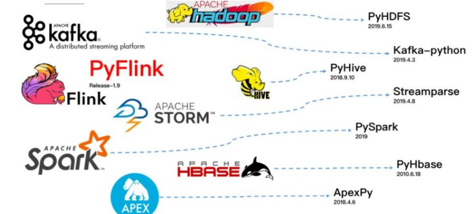

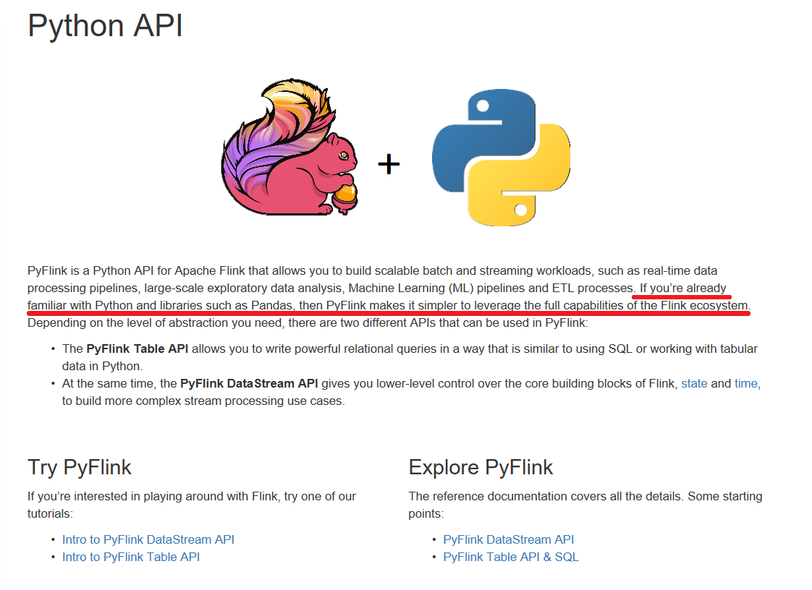

## 环境准备

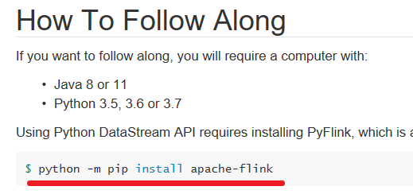

```
python -m pip install apache-flink
```

需要下载很多其他的依赖--网络环境好的话需要2小时左右


## 入门案例

```python
from pyflink.common.serialization import SimpleStringEncoder
from pyflink.common.typeinfo import Types
from pyflink.datastream import StreamExecutionEnvironment
from pyflink.datastream.connectors import StreamingFileSink


def tutorial():
    # env
    env = StreamExecutionEnvironment.get_execution_environment()
    env.set_parallelism(1)
    # source
    ds = env.from_collection(
        collection=[(1, 'aaa'), (2, 'bbb')],
        type_info=Types.ROW([Types.INT(), Types.STRING()]))
    # sink
    ds.add_sink(StreamingFileSink
                .for_row_format('./tmp/output', SimpleStringEncoder())
                .build())
    # excute
    env.execute("tutorial_job")


if __name__ == '__main__':
    tutorial()

```


```python
from pyflink.dataset import ExecutionEnvironment
from pyflink.table import TableConfig, DataTypes, BatchTableEnvironment
from pyflink.table.descriptors import Schema, OldCsv, FileSystem
from pyflink.table.expressions import lit

#env
exec_env = ExecutionEnvironment.get_execution_environment()
exec_env.set_parallelism(1)
t_config = TableConfig()
t_env = BatchTableEnvironment.create(exec_env, t_config)

# #指定source
# t_env.connect(FileSystem().path('/tmp/input')) \
#     .with_format(OldCsv()
#                  .field('word', DataTypes.STRING())) \
#     .with_schema(Schema()
#                  .field('word', DataTypes.STRING())) \
#     .create_temporary_table('mySource')
#
# #指定sink
# t_env.connect(FileSystem().path('/tmp/output')) \
#     .with_format(OldCsv()
#                  .field_delimiter('\t')
#                  .field('word', DataTypes.STRING())
#                  .field('count', DataTypes.BIGINT())) \
#     .with_schema(Schema()
#                  .field('word', DataTypes.STRING())
#                  .field('count', DataTypes.BIGINT())) \
#     .create_temporary_table('mySink')

my_source_ddl = """
    create table mySource (
        word VARCHAR
    ) with (
        'connector' = 'filesystem',
        'format' = 'csv',
        'path' = '/tmp/input'
    )
"""

my_sink_ddl = """
    create table mySink (
        word VARCHAR,
        `count` BIGINT
    ) with (
        'connector' = 'filesystem',
        'format' = 'csv',
        'path' = '/tmp/output'
    )
"""

t_env.sql_update(my_source_ddl)
t_env.sql_update(my_sink_ddl)

#source
tab = t_env.from_path('mySource')
#transformation
tab.group_by(tab.word) \
   .select(tab.word, lit(1).count) \
   .execute_insert('mySink').wait() #执行sink/execute
```


# ScalaFlink

## 介绍

Flink源码主要是Java语言编写的, 开发中首选Java开发Flink

如果考虑到编码效率和简洁性可以考虑使用Scala


注意:

Spark源码主要是Scala编写的, 开发中首选Scala开发Spark

如果考虑到编码的规范性,可以考虑使用Java


## 环境

0.导入依赖

```xml
 <!--依赖Scala语言-->
        <dependency>
            <groupId>org.scala-lang</groupId>
            <artifactId>scala-library</artifactId>
            <version>2.12.11</version>
        </dependency>

     <dependency>
                <groupId>org.apache.flink</groupId>
                <artifactId>flink-scala_2.12</artifactId>
                <version>${flink.version}</version>
    </dependency>
    
     <dependency>
                <groupId>org.apache.flink</groupId>
                <artifactId>flink-streaming-scala_2.12</artifactId>
                <version>${flink.version}</version>
    </dependency>


```


```xml
<!-- 指定编译scala的插件 -->
            <plugin>
                <groupId>net.alchim31.maven</groupId>
                <artifactId>scala-maven-plugin</artifactId>
                <version>3.2.2</version>
                <executions>
                    <execution>
                        <goals>
                            <goal>compile</goal>
                            <goal>testCompile</goal>
                        </goals>
                        <configuration>
                            <args>
                                <arg>-dependencyfile</arg>
                                <arg>${project.build.directory}/.scala_dependencies</arg>
                            </args>
                        </configuration>
                    </execution>
                </executions>
            </plugin>
```


## 需求

使用Scala开发Flink程序完成电商日志分析:

1.数据预处理 json-->样例类 并拓宽字段(封装为宽表)方便后想做实时指标统计

2.实时分析频道热点/分类热点

3.实时分析/统计pv/uv


## 代码实现-准备


1.导入骨架代码

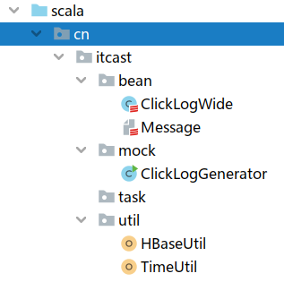

2.准备kafka主题

```
查看主题:
    /export/server/kafka/bin/kafka-topics.sh --list --zookeeper node1:2181
创建主题:
    /export/server/kafka/bin/kafka-topics.sh --create --zookeeper node1:2181 --replication-factor 2 --partitions 3 --topic pyg
再次查看主题:
    /export/server/kafka/bin/kafka-topics.sh --list --zookeeper node1:2181
启动控制台消费者
    /export/server/kafka/bin/kafka-console-consumer.sh --bootstrap-server node1:9092  --topic pyg --from-beginning
删除主题--不需要执行
    /export/server/kafka/bin/kafka-topics.sh --delete --zookeeper node1:2181 --topic pyg
```


3.启动ClickLogGenerator


4.观察控制台输出或kafka控制台消费者输出

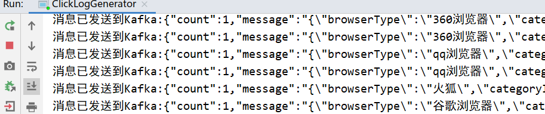

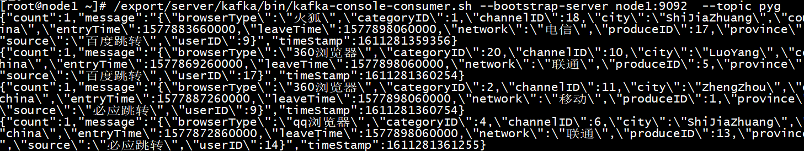


5.数据格式

https://www.sojson.com/

```json
{
	"count": 1,
	"message": {
		"browserType": "谷歌浏览器",
		"categoryID": 15,
		"channelID": 7,
		"city": "ZhengZhou",
		"country": "china",
		"entryTime": 1577883660000,
		"leaveTime": 1577898060000,
		"network": "联通",
		"produceID": 11,
		"province": "HeNan",
		"source": "百度跳转",
		"userID": 6
	},
	"timeStamp": 1611281368770
}
```

## 代码实现-程序入口类

```java
package cn.itcast

import java.util.Properties
import java.util.concurrent.TimeUnit

import org.apache.commons.lang3.SystemUtils
import org.apache.flink.api.common.restartstrategy.RestartStrategies
import org.apache.flink.api.common.serialization.SimpleStringSchema
import org.apache.flink.api.common.time.Time
import org.apache.flink.runtime.state.filesystem.FsStateBackend
import org.apache.flink.streaming.api.CheckpointingMode
import org.apache.flink.streaming.api.environment.CheckpointConfig
import org.apache.flink.streaming.api.scala.{DataStream, StreamExecutionEnvironment}
import org.apache.flink.streaming.connectors.kafka.FlinkKafkaConsumer

/**
 * Author itcast
 * Desc scala-flink程序入口类
 */
object App {
  def main(args: Array[String]): Unit = {
    //TODO 0.env
    val env: StreamExecutionEnvironment = StreamExecutionEnvironment.getExecutionEnvironment

    //TODO ===Checkpoint参数设置
    //===========类型1:必须参数=============
    //设置Checkpoint的时间间隔为1000ms做一次Checkpoint/其实就是每隔1000ms发一次Barrier!
    env.enableCheckpointing(1000)
    //设置State状态存储介质/状态后端
    if (SystemUtils.IS_OS_WINDOWS) {
      env.setStateBackend(new FsStateBackend("file:///D:/ckp"))
    }
    else {
      env.setStateBackend(new FsStateBackend("hdfs://node1:8020/flink-checkpoint/checkpoint"))
    }
    //===========类型2:建议参数===========
    //设置两个Checkpoint 之间最少等待时间,如设置Checkpoint之间最少是要等 500ms(为了避免每隔1000ms做一次Checkpoint的时候,前一次太慢和后一次重叠到一起去了)
    //如:高速公路上,每隔1s关口放行一辆车,但是规定了两车之前的最小车距为500m
    env.getCheckpointConfig.setMinPauseBetweenCheckpoints(500) //默认是0

    //设置如果在做Checkpoint过程中出现错误，是否让整体任务失败：true是  false不是
    //env.getCheckpointConfig().setFailOnCheckpointingErrors(false);//默认是true
    env.getCheckpointConfig.setTolerableCheckpointFailureNumber(10) //默认值为0，表示不容忍任何检查点失败

    //设置是否清理检查点,表示 Cancel 时是否需要保留当前的 Checkpoint，默认 Checkpoint会在作业被Cancel时被删除
    //ExternalizedCheckpointCleanup.DELETE_ON_CANCELLATION：true,当作业被取消时，删除外部的checkpoint(默认值)
    //ExternalizedCheckpointCleanup.RETAIN_ON_CANCELLATION：false,当作业被取消时，保留外部的checkpoint
    env.getCheckpointConfig.enableExternalizedCheckpoints(CheckpointConfig.ExternalizedCheckpointCleanup.RETAIN_ON_CANCELLATION)

    //===========类型3:直接使用默认的即可===============
    //设置checkpoint的执行模式为EXACTLY_ONCE(默认)
    env.getCheckpointConfig.setCheckpointingMode(CheckpointingMode.EXACTLY_ONCE)
    //设置checkpoint的超时时间,如果 Checkpoint在 60s内尚未完成说明该次Checkpoint失败,则丢弃。
    env.getCheckpointConfig.setCheckpointTimeout(60000) //默认10分钟

    //设置同一时间有多少个checkpoint可以同时执行
    env.getCheckpointConfig.setMaxConcurrentCheckpoints(1) //默认为1


    //TODO ===配置重启策略:
    //1.配置了Checkpoint的情况下不做任务配置:默认是无限重启并自动恢复,可以解决小问题,但是可能会隐藏真正的bug
    //2.单独配置无重启策略
    //env.setRestartStrategy(RestartStrategies.noRestart());
    //3.固定延迟重启--开发中常用
    env.setRestartStrategy(
      RestartStrategies.fixedDelayRestart(
        3, // 最多重启3次数
        Time.of(5, TimeUnit.SECONDS)
      )
    )
    // 重启时间间隔)
    //上面的设置表示:如果job失败,重启3次, 每次间隔5s
    //4.失败率重启--开发中偶尔使用
    /*env.setRestartStrategy(RestartStrategies.failureRateRestart(
            3, // 每个测量阶段内最大失败次数
            Time.of(1, TimeUnit.MINUTES), //失败率测量的时间间隔
            Time.of(3, TimeUnit.SECONDS) // 两次连续重启的时间间隔
    ));*/
    //上面的设置表示:如果1分钟内job失败不超过三次,自动重启,每次重启间隔3s (如果1分钟内程序失败达到3次,则程序退出)

    //TODO 1.source-kafka-pyg主题
    //准备kafka连接参数
    val props: Properties = new Properties
    props.setProperty("bootstrap.servers", "node1:9092") //集群地址
    props.setProperty("group.id", "flink") //消费者组id
    props.setProperty("auto.offset.reset", "latest") //latest有offset记录从记录位置开始消费,没有记录从最新的/最后的消息开始消费 /earliest有offset记录从记录位置开始消费,没有记录从最早的/最开始的消息开始消费
    props.setProperty("flink.partition-discovery.interval-millis", "5000") //会开启一个后台线程每隔5s检测一下Kafka的分区情况,实现动态分区检测
    //props.setProperty("enable.auto.commit", "true") //自动提交(提交到默认主题,后续学习了Checkpoint后随着Checkpoint存储在Checkpoint和默认主题中)
    //props.setProperty("auto.commit.interval.ms", "2000") //自动提交的时间间隔
    //使用连接参数创建FlinkKafkaConsumer/kafkaSource
    val kafkaSource: FlinkKafkaConsumer[String] = new FlinkKafkaConsumer[String]("pyg", new SimpleStringSchema, props)
    kafkaSource.setCommitOffsetsOnCheckpoints(true)//执行Checkpoint的时候提交offset到Checkpoint
    //使用kafkaSource
    import org.apache.flink.streaming.api.scala._
    val kafkaDS: DataStream[String] = env.addSource(kafkaSource)

    kafkaDS.print()

    //TODO 2.transformation

    //TODO 3.sink

    //TODO 4.execute
    env.execute()

  }
}

```


## 代码实现-数据预处理

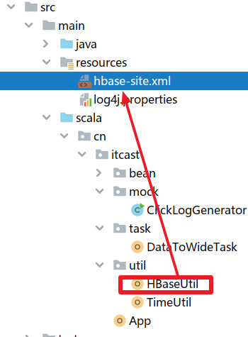

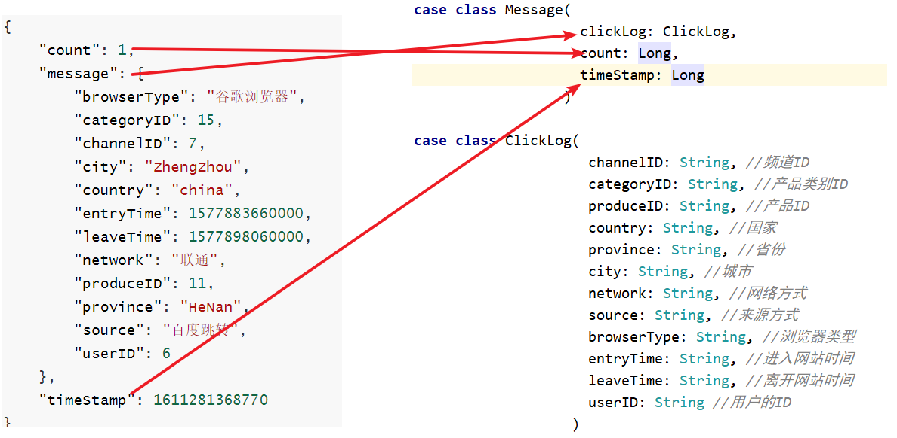

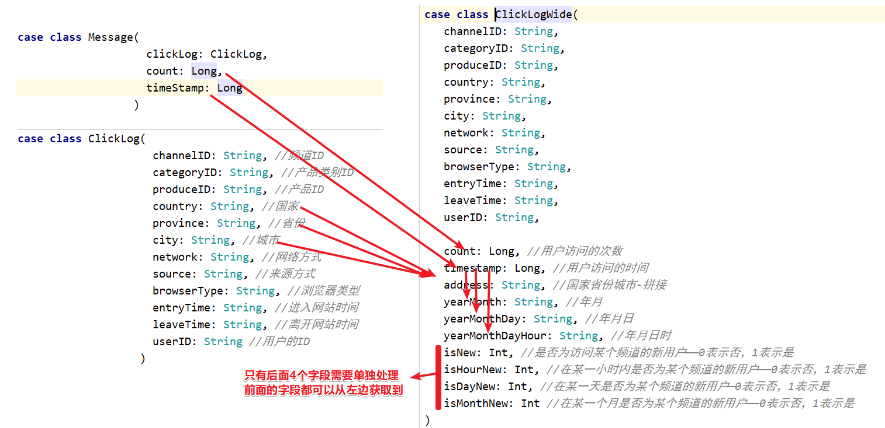

```java
package cn.itcast

import java.lang
import java.time.Duration
import java.util.Properties
import java.util.concurrent.TimeUnit

import cn.itcast.bean.{ClickLog, ClickLogWide, Message}
import cn.itcast.task.DataToWideTask
import com.alibaba.fastjson.{JSON, JSONObject}
import org.apache.commons.lang3.SystemUtils
import org.apache.flink.api.common.eventtime.{SerializableTimestampAssigner, WatermarkStrategy}
import org.apache.flink.api.common.restartstrategy.RestartStrategies
import org.apache.flink.api.common.serialization.SimpleStringSchema
import org.apache.flink.api.common.time.Time
import org.apache.flink.runtime.state.filesystem.FsStateBackend
import org.apache.flink.streaming.api.CheckpointingMode
import org.apache.flink.streaming.api.environment.CheckpointConfig
import org.apache.flink.streaming.api.scala.{DataStream, StreamExecutionEnvironment}
import org.apache.flink.streaming.connectors.kafka.FlinkKafkaConsumer

/**
 * Author itcast
 * Desc scala-flink程序入口类
 */
object App {
  def main(args: Array[String]): Unit = {
    //TODO 0.env
    val env: StreamExecutionEnvironment = StreamExecutionEnvironment.getExecutionEnvironment

    //TODO ===Checkpoint参数设置
    //===========类型1:必须参数=============
    //设置Checkpoint的时间间隔为1000ms做一次Checkpoint/其实就是每隔1000ms发一次Barrier!
    env.enableCheckpointing(1000)
    //设置State状态存储介质/状态后端
    if (SystemUtils.IS_OS_WINDOWS) {
      env.setStateBackend(new FsStateBackend("file:///D:/ckp"))
    }
    else {
      env.setStateBackend(new FsStateBackend("hdfs://node1:8020/flink-checkpoint/checkpoint"))
    }
    //===========类型2:建议参数===========
    //设置两个Checkpoint 之间最少等待时间,如设置Checkpoint之间最少是要等 500ms(为了避免每隔1000ms做一次Checkpoint的时候,前一次太慢和后一次重叠到一起去了)
    //如:高速公路上,每隔1s关口放行一辆车,但是规定了两车之前的最小车距为500m
    env.getCheckpointConfig.setMinPauseBetweenCheckpoints(500) //默认是0

    //设置如果在做Checkpoint过程中出现错误，是否让整体任务失败：true是  false不是
    //env.getCheckpointConfig().setFailOnCheckpointingErrors(false);//默认是true
    env.getCheckpointConfig.setTolerableCheckpointFailureNumber(10) //默认值为0，表示不容忍任何检查点失败

    //设置是否清理检查点,表示 Cancel 时是否需要保留当前的 Checkpoint，默认 Checkpoint会在作业被Cancel时被删除
    //ExternalizedCheckpointCleanup.DELETE_ON_CANCELLATION：true,当作业被取消时，删除外部的checkpoint(默认值)
    //ExternalizedCheckpointCleanup.RETAIN_ON_CANCELLATION：false,当作业被取消时，保留外部的checkpoint
    env.getCheckpointConfig.enableExternalizedCheckpoints(CheckpointConfig.ExternalizedCheckpointCleanup.RETAIN_ON_CANCELLATION)

    //===========类型3:直接使用默认的即可===============
    //设置checkpoint的执行模式为EXACTLY_ONCE(默认)
    env.getCheckpointConfig.setCheckpointingMode(CheckpointingMode.EXACTLY_ONCE)
    //设置checkpoint的超时时间,如果 Checkpoint在 60s内尚未完成说明该次Checkpoint失败,则丢弃。
    env.getCheckpointConfig.setCheckpointTimeout(60000) //默认10分钟

    //设置同一时间有多少个checkpoint可以同时执行
    env.getCheckpointConfig.setMaxConcurrentCheckpoints(1) //默认为1


    //TODO ===配置重启策略:
    //1.配置了Checkpoint的情况下不做任务配置:默认是无限重启并自动恢复,可以解决小问题,但是可能会隐藏真正的bug
    //2.单独配置无重启策略
    //env.setRestartStrategy(RestartStrategies.noRestart());
    //3.固定延迟重启--开发中常用
    env.setRestartStrategy(
      RestartStrategies.fixedDelayRestart(
        3, // 最多重启3次数
        Time.of(5, TimeUnit.SECONDS)
      )
    )
    // 重启时间间隔)
    //上面的设置表示:如果job失败,重启3次, 每次间隔5s
    //4.失败率重启--开发中偶尔使用
    /*env.setRestartStrategy(RestartStrategies.failureRateRestart(
            3, // 每个测量阶段内最大失败次数
            Time.of(1, TimeUnit.MINUTES), //失败率测量的时间间隔
            Time.of(3, TimeUnit.SECONDS) // 两次连续重启的时间间隔
    ));*/
    //上面的设置表示:如果1分钟内job失败不超过三次,自动重启,每次重启间隔3s (如果1分钟内程序失败达到3次,则程序退出)

    //TODO 1.source-kafka-pyg主题
    //准备kafka连接参数
    val props: Properties = new Properties
    props.setProperty("bootstrap.servers", "node1:9092") //集群地址
    props.setProperty("group.id", "flink") //消费者组id
    props.setProperty("auto.offset.reset", "latest") //latest有offset记录从记录位置开始消费,没有记录从最新的/最后的消息开始消费 /earliest有offset记录从记录位置开始消费,没有记录从最早的/最开始的消息开始消费
    props.setProperty("flink.partition-discovery.interval-millis", "5000") //会开启一个后台线程每隔5s检测一下Kafka的分区情况,实现动态分区检测
    //props.setProperty("enable.auto.commit", "true") //自动提交(提交到默认主题,后续学习了Checkpoint后随着Checkpoint存储在Checkpoint和默认主题中)
    //props.setProperty("auto.commit.interval.ms", "2000") //自动提交的时间间隔
    //使用连接参数创建FlinkKafkaConsumer/kafkaSource
    val kafkaSource: FlinkKafkaConsumer[String] = new FlinkKafkaConsumer[String]("pyg", new SimpleStringSchema, props)
    kafkaSource.setCommitOffsetsOnCheckpoints(true)//执行Checkpoint的时候提交offset到Checkpoint
    //使用kafkaSource
    import org.apache.flink.streaming.api.scala._
    //DataStream[里面就是一条条的json数据]
    val kafkaDS: DataStream[String] = env.addSource(kafkaSource)
    //kafkaDS.print()

    //TODO 2.transformation
    //TODO ===数据预处理-将json转为样例类
    val messageDS: DataStream[Message] = kafkaDS.map(jsonStr => {
      //jsonStr转为jsonObject
      val jsonObj: JSONObject = JSON.parseObject(jsonStr)
      val count: Long = jsonObj.getLong("count")
      val timeStamp: Long = jsonObj.getLong("timeStamp")
      val messageJsonStr: String = jsonObj.getString("message")
      val clickLog: ClickLog = JSON.parseObject(messageJsonStr, classOf[ClickLog])
      bean.Message(clickLog, count, timeStamp)

      //注意:得使用上面的一步步的转换,不能够偷懒使用下面的这一行,因为原始json是嵌套的,且字段名和样例类中不匹配
      //val message: Message = JSON.parseObject(jsonStr,classOf[Message])
    })
    //messageDS.print()
    //Message(ClickLog(12,7,12,china,HeNan,LuoYang,电信,必应跳转,qq浏览器,1577876460000,1577898060000,19),1,1611283392078)
    val messageDSWithWatermark: DataStream[Message] = messageDS.assignTimestampsAndWatermarks(WatermarkStrategy.forBoundedOutOfOrderness[Message](Duration.ofSeconds(5))
      .withTimestampAssigner(new SerializableTimestampAssigner[Message] {
        override def extractTimestamp(element: Message, recordTimestamp: Long): Long = element.timeStamp
      })
    )

    //TODO ===数据预处理-将Message拓宽为ClickLogWide
    val clickLogWideDS: DataStream[ClickLogWide] = DataToWideTask.process(messageDSWithWatermark)
    clickLogWideDS.print()


    //TODO 3.sink

    //TODO 4.execute
    env.execute()

  }
}

```


```java
package cn.itcast.task

import cn.itcast.bean.{ClickLogWide, Message}
import cn.itcast.util.{HBaseUtil, TimeUtil}
import org.apache.commons.lang3.StringUtils
import org.apache.flink.streaming.api.scala.DataStream

/**
 * Author itcast
 * Desc flink-task 将Message转为ClickLogWide
 */
object DataToWideTask {
  def process(messageDS: DataStream[Message]): DataStream[ClickLogWide] = {
    import org.apache.flink.streaming.api.scala._
    messageDS.map(msg => {
      val address = msg.clickLog.country + msg.clickLog.province + msg.clickLog.city
      val yearMonth = TimeUtil.parseTime(msg.timeStamp,"yyyyMM")
      val yearMonthDay = TimeUtil.parseTime(msg.timeStamp,"yyyyMMdd")
      val yearMonthDayHour = TimeUtil.parseTime(msg.timeStamp,"yyyyMMddHH")
      //调用方法单独处理isXXNew字段
      val (isNew, isHourNew, isDayNew, isMonthNew) = getIsNew(msg)

      ClickLogWide(
        msg.clickLog.channelID,
        msg.clickLog.categoryID,
        msg.clickLog.produceID,
        msg.clickLog.country,
        msg.clickLog.province,
        msg.clickLog.city,
        msg.clickLog.network,
        msg.clickLog.source,
        msg.clickLog.browserType,
        msg.clickLog.entryTime,
        msg.clickLog.leaveTime,
        msg.clickLog.userID,
        msg.count,
        msg.timeStamp,
        address,
        yearMonth,
        yearMonthDay,
        yearMonthDayHour,
        isNew,
        isHourNew,
        isDayNew,
        isMonthNew
      )
    })
  }

  def getIsNew(msg: Message) = {
    //0表示不是新用户,是老用户
    //1表示是新用户
    var isNew = 0
    var isHourNew = 0
    var isDayNew = 0
    var isMonthNew = 0

    //根据用户访问的频道id,用户id,时间戳来判断用户是否是该时间段的新用户

    //首先得去HBase中查询该用户访问该频道的上一次访问时间
    //定义一些HBase的常量,如表名,列族名,字段名
    val tableName = "user_history"
    val columnFamily = "info"
    val rowkey = msg.clickLog.userID + ":" + msg.clickLog.channelID
    val queryColumn = "lastVisitTime"
    //去HBase的user_history表的info列族中根据rowkey(用户id+频道)查询lastVisitTime
    val lastVisitTime: String = HBaseUtil.getData(tableName, rowkey, columnFamily, queryColumn)
    if (StringUtils.isBlank(lastVisitTime)) { //该用户访问该频道没有记录上一次访问时间,说明是新用户
      isNew = 1
      isHourNew = 1
      isDayNew = 1
      isMonthNew = 1
    } else { //说明有记录该用户访问该频道的上次访问时间,说明是老用户,但是不确定是否是某个时间段的老用户,需要判断时间
      //如该用户访问该频道的这次访问时间为 2021 01 01 11 ,上次访问时间为 2021 01 01 11 ,则是新用户
      //如该用户访问该频道的这次访问时间为 2021 01 02,上次访问时间为 2021 01 01  ,则是新用户
      //如该用户访问该频道的这次访问时间为 2021 02 ,上次访问时间为 2021 01   ,则是新用户
      isNew = 0
      isHourNew = TimeUtil.compareDate(msg.timeStamp, lastVisitTime.toLong, "yyyyMMddHH") //当前时间比历史时间大,返回1,表示是新用户
      isDayNew = TimeUtil.compareDate(msg.timeStamp, lastVisitTime.toLong, "yyyyMMdd")
      isMonthNew = TimeUtil.compareDate(msg.timeStamp, lastVisitTime.toLong, "yyyyMM")
    }
    //注意:把这一次的访问时间存到HBase中,作为该用户访问该频道的上一次访问时间
    HBaseUtil.putData(tableName, rowkey, columnFamily, queryColumn, msg.timeStamp.toString)

    (isNew, isHourNew, isDayNew, isMonthNew)
  }
}

/*
   测试时先启动hbase
    /export/server/hbase-2.1.0/bin/start-hbase.sh
   再登入hbase shell
    ./hbase shell
   查看hbase表
   list
  disable "user_history"
  disable "channel_realhot"
  disable "channel_pvuv"
  drop "user_history"
  drop "channel_realhot"
  drop "channel_pvuv"
     运行后会生成表,然后查看表数据
  list
  scan "user_history",{LIMIT=>10}
  scan "channel_realhot",{LIMIT=>10}
  scan "channel_pvuv",{LIMIT=>10}
    */
```


## 代码实现-实时频道热点/分类热点分析

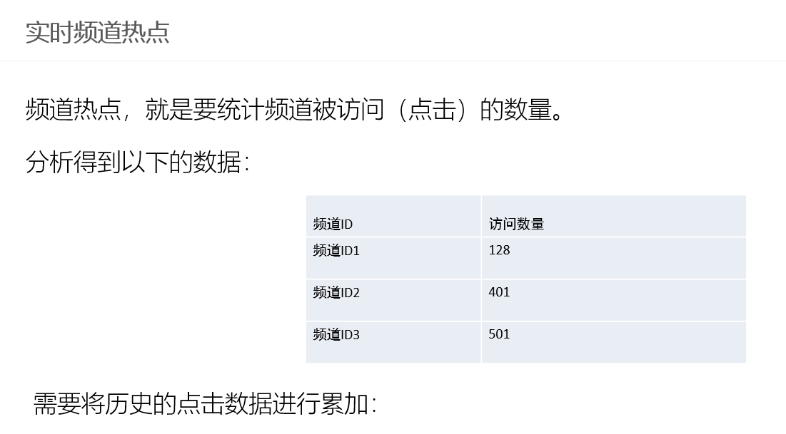


app

```java
 //TODO ===实时频道热点统计分析
    ChannelHotTask.process(clickLogWideDS)
```


```java
package cn.itcast.task

import cn.itcast.bean.ClickLogWide
import cn.itcast.util.HBaseUtil
import org.apache.commons.lang3.StringUtils
import org.apache.flink.streaming.api.functions.sink.SinkFunction
import org.apache.flink.streaming.api.scala.DataStream
import org.apache.flink.streaming.api.windowing.assigners.TumblingEventTimeWindows
import org.apache.flink.streaming.api.windowing.time.Time

/**
 * Author itcast
 * Desc 实时频道热点统计分析
 */
object ChannelHotTask {

  //定义一个样例类,用来封装频道id和访问次数
  case class ChannelRealHot(channelId: String, visited: Long)

  def process(clickLogWideDS: DataStream[ClickLogWide]) = {
    //每隔10s统计一次各个频道对应的访问量,并将结果和历史数据合并,存入到HBase
    //也就是说使用HBase存放各个频道的实时访问量,每隔10s更新一次
    import org.apache.flink.streaming.api.scala._
    //当前窗口内数据的各个频道对应的访问量
    val currentResult: DataStream[ChannelRealHot] = clickLogWideDS.map(log => {
      ChannelRealHot(log.channelID, log.count)
    })
      .keyBy(_.channelId)
      .window(TumblingEventTimeWindows.of(Time.seconds(10)))
      .reduce((a, b) => {
        ChannelRealHot(a.channelId, a.visited + b.visited)
      })

    currentResult.addSink(new SinkFunction[ChannelRealHot] {
      override def invoke(value: ChannelRealHot, context: SinkFunction.Context): Unit = {
        //-1.先查HBase该频道的上次的访问次数
        val tableName = "channel_realhot"
        val rowkey = value.channelId
        val columnFamily = "info"
        val queryColumn = "visited"

        //查出历史值(指定频道的访问次数历史值)
        //去HBase的channel_realhot表的info列族中根据channelId查询指定的列visited
        val historyVisited: String = HBaseUtil.getData(tableName,rowkey,columnFamily,queryColumn)

        var resultVisited = 0L
        //和当前值合并
        if(StringUtils.isBlank(historyVisited)){//没有历史值,那么当前窗口计算出来的结果就是该频道的访问量
          resultVisited = value.visited
        }else{
          resultVisited = value.visited + historyVisited.toLong
        }
        //存入HBase
        HBaseUtil.putData(tableName,rowkey,columnFamily,queryColumn,resultVisited.toString)
      }
    })

  }

}

```


## 代码实现-实时pv/uv统计/分析

app

```java
//TODO ===实时各个频道各个时间段的PvUv
    ChannelPvUvTask.process(clickLogWideDS)
```


```java
package cn.itcast

import akka.actor.FSM.->
import cn.itcast.bean.ClickLogWide
import cn.itcast.util.{HBaseUtil, TimeUtil}
import org.apache.flink.streaming.api.functions.sink.SinkFunction
import org.apache.flink.streaming.api.scala.DataStream
import org.apache.flink.streaming.api.windowing.assigners.TumblingEventTimeWindows
import org.apache.flink.streaming.api.windowing.time.Time

/**
 * Author itcast
 * Desc 实时统计各个频道各个时间段的pv/uv
 */
object ChannelPvUvTask {

  case class ChannelRealPvUv(channelId: String, monthDayHour: String, pv: Long, uv: Long)

  def process(clickLogWideDS: DataStream[ClickLogWide]) = {
    //对于一条日志信息进来需要统计各个时间段(月/日/小时--3个维度)的结果,也就是一条进来多条出去
    //回忆之前的的api,"hello word" 一行进去, 出来 [hello,word]用的flatMap,所以这里也一样,应该使用flatMap来处理
    import org.apache.flink.streaming.api.scala._
    val resultDS: DataStream[ChannelRealPvUv] = clickLogWideDS.flatMap(log => {
      List(
        ChannelRealPvUv(log.channelID, TimeUtil.parseTime(log.timestamp, "yyyyMMddHH"), 1, log.isHourNew),
        ChannelRealPvUv(log.channelID, TimeUtil.parseTime(log.timestamp, "yyyyMMdd"), 1, log.isDayNew),
        ChannelRealPvUv(log.channelID, TimeUtil.parseTime(log.timestamp, "yyyyMM"), 1, log.isMonthNew)
      )
    }).keyBy("channelId", "monthDayHour")
      .window(TumblingEventTimeWindows.of(Time.seconds(10)))
      .reduce((a, b) => {
        ChannelRealPvUv(a.channelId, a.monthDayHour, a.pv + b.pv, a.uv + b.uv)
      })

    resultDS.addSink(new SinkFunction[ChannelRealPvUv] {
      override def invoke(value: ChannelRealPvUv, context: SinkFunction.Context): Unit = {
        //查
        val tableName = "channel_pvuv"
        val rowkey = value.channelId + ":" + value.monthDayHour
        val columnFamily = "info"
        val queryColumn1 = "pv"
        val queryColumn2 = "uv"

        //pvuvMap: Map[pv, 100]
        //pvuvMap: Map[uv, 100]
        val pvuvMap: Map[String, String] = HBaseUtil.getMapData(tableName, rowkey, columnFamily, List(queryColumn1, queryColumn2))
        //注意:返回的map本身不为null,但是里面有可能没有pv/uv对应的值

        val historyPv: String = pvuvMap.getOrElse(queryColumn1, "0")
        val historyUv: String = pvuvMap.getOrElse(queryColumn2, "0")

        //合
        val resultPV: Long = value.pv + historyPv.toLong
        val resultUV: Long = value.uv + historyUv.toLong

        //存
        HBaseUtil.putMapData(tableName, rowkey, columnFamily, Map(
          queryColumn1 -> resultPV.toString, //第一个列的列名和对应的值
          queryColumn2 -> resultUV.toString //第二个列的列名和对应的值
        ))
      }
    })
  }
}

```


# Flink监控

https://blog.lovedata.net/8156c1e1.html

## 什么是Metrics

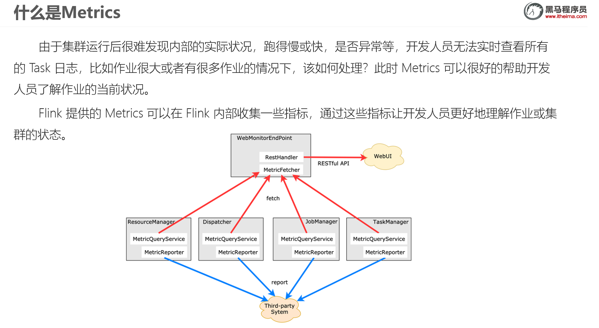


## Metrics分类

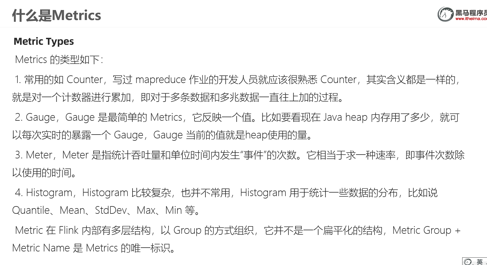


## 代码

```java
package cn.itcast.metrics;

import org.apache.flink.api.common.RuntimeExecutionMode;
import org.apache.flink.api.common.functions.FlatMapFunction;
import org.apache.flink.api.common.functions.RichMapFunction;
import org.apache.flink.api.java.tuple.Tuple2;
import org.apache.flink.configuration.Configuration;
import org.apache.flink.metrics.Counter;
import org.apache.flink.streaming.api.datastream.DataStream;
import org.apache.flink.streaming.api.datastream.SingleOutputStreamOperator;
import org.apache.flink.streaming.api.environment.StreamExecutionEnvironment;
import org.apache.flink.util.Collector;

/**
 * Author itcast
 * Desc 演示Flink-Metrics监控
 * 在Map算子中提供一个Counter,统计map处理的数据条数,运行之后再WebUI上进行监控
 */
public class MetricsDemo {
    public static void main(String[] args) throws Exception {
        //TODO 0.env
        StreamExecutionEnvironment env = StreamExecutionEnvironment.getExecutionEnvironment();
        env.setRuntimeMode(RuntimeExecutionMode.AUTOMATIC);

        //TODO 1.source
        DataStream<String> lines = env.socketTextStream("node1", 9999);


        //TODO 2.transformation
        SingleOutputStreamOperator<String> words = lines.flatMap(new FlatMapFunction<String, String>() {
            @Override
            public void flatMap(String value, Collector<String> out) throws Exception {
                String[] arr = value.split(" ");
                for (String word : arr) {
                    out.collect(word);
                }
            }
        });

        SingleOutputStreamOperator<Tuple2<String, Integer>> wordAndOne = words
                .map(new RichMapFunction<String, Tuple2<String, Integer>>() {
                    Counter myCounter;//用来记录map处理了多少个单词

                    //对Counter进行初始化
                    @Override
                    public void open(Configuration parameters) throws Exception {
                        myCounter = getRuntimeContext().getMetricGroup().addGroup("myGroup").counter("myCounter");
                    }
                    //处理单词,将单词记为(单词,1)
                    @Override
                    public Tuple2<String, Integer> map(String value) throws Exception {
                        myCounter.inc();//计数器+1
                        return Tuple2.of(value, 1);
                    }
                });

        SingleOutputStreamOperator<Tuple2<String, Integer>> result = wordAndOne.keyBy(t -> t.f0).sum(1);

        //TODO 3.sink
        result.print();

        //TODO 4.execute
        env.execute();
    }
}
// /export/server/flink/bin/yarn-session.sh -n 2 -tm 800 -s 1 -d
// /export/server/flink/bin/flink run --class cn.itcast.metrics.MetricsDemo /root/metrics.jar
// 查看WebUI
```


## 操作

1.打包

2.提交到Yarn上运行

3.查看监控指标

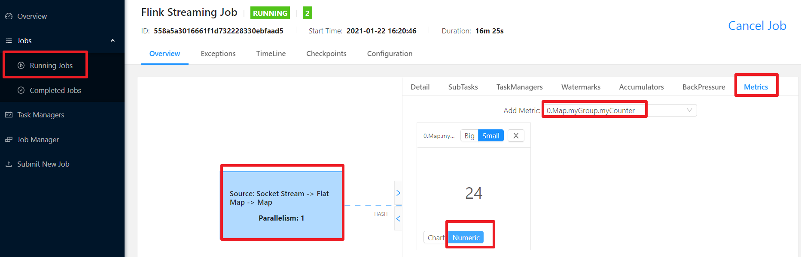


4.也可以通过浏览器f12的找到url发送请求获取监控信息

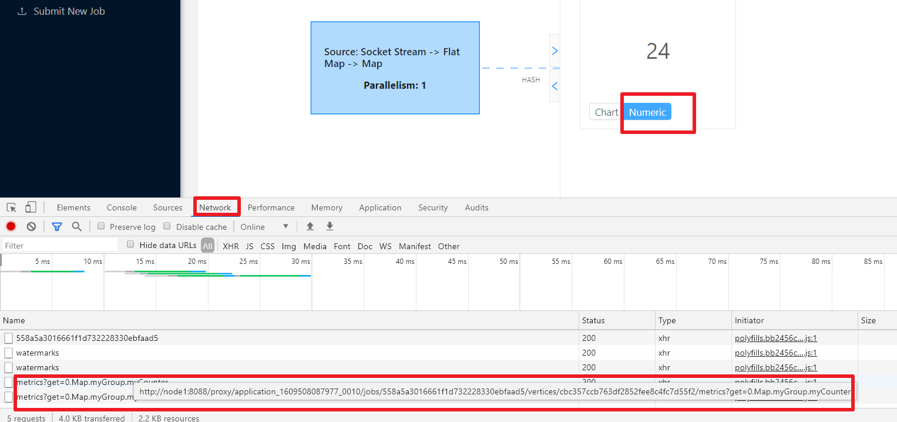

5.也可以通过代码发送请求获取监控信息

```java
package cn.itcast.metrics;

import java.io.BufferedReader;
import java.io.InputStreamReader;
import java.net.URL;
import java.net.URLConnection;

public class MetricsTest {
    public static void main(String[] args) {
        //String result = sendGet("http://node1:8088/proxy/application_1609508087977_0010/jobs/558a5a3016661f1d732228330ebfaad5/vertices/cbc357ccb763df2852fee8c4fc7d55f2/metrics?get=0.Map.myGroup.myCounter");
        String result = sendGet("http://node1:8088/proxy/application_1609508087977_0010/jobs/558a5a3016661f1d732228330ebfaad5");

        System.out.println(result);
    }

    public static String sendGet(String url) {
        String result = "";
        BufferedReader in = null;
        try {
            String urlNameString = url;
            URL realUrl = new URL(urlNameString);
            URLConnection connection = realUrl.openConnection();
            // 设置通用的请求属性
            connection.setRequestProperty("accept", "*/*");
            connection.setRequestProperty("connection", "Keep-Alive");
            connection.setRequestProperty("user-agent", "Mozilla/4.0 (compatible; MSIE 6.0; Windows NT 5.1;SV1)");
            // 建立实际的连接
            connection.connect();
            in = new BufferedReader(new InputStreamReader(connection.getInputStream()));
            String line;
            while ((line = in.readLine()) != null) {
                result += line;
            }
        } catch (Exception e) {
            System.out.println("发送GET请求出现异常！" + e);
            e.printStackTrace();
        }
        // 使用finally块来关闭输入流
        finally {
            try {
                if (in != null) {
                    in.close();
                }
            } catch (Exception e2) {
                e2.printStackTrace();
            }
        }
        return result;
    }

}
```


6.也可以整合三方工具对flink进行监控

https://blog.lovedata.net/8156c1e1.html


# Flink性能优化

1.复用对象

```java
stream
    .apply(new WindowFunction<WikipediaEditEvent, Tuple2<String, Long>, String, TimeWindow>() {
        @Override
        public void apply(String userName, TimeWindow timeWindow, Iterable<WikipediaEditEvent> iterable, Collector<Tuple2<String, Long>> collector) throws Exception {
            long changesCount = ...
            // A new Tuple instance is created on every execution
            collector.collect(new Tuple2<>(userName, changesCount));
        }
    }
```

上面的代码可以优化为下面的代码:

可以避免Tuple2的重复创建

```java
stream
        .apply(new WindowFunction<WikipediaEditEvent, Tuple2<String, Long>, String, TimeWindow>() {
    // Create an instance that we will reuse on every call
    private Tuple2<String, Long> result = new Tuple<>();
    @Override
    public void apply(String userName, TimeWindow timeWindow, Iterable<WikipediaEditEvent> iterable, Collector<Tuple2<String, Long>> collector) throws Exception {
        long changesCount = ...
        // Set fields on an existing object instead of creating a new one
        result.f0 = userName;
        // Auto-boxing!! A new Long value may be created
        result.f1 = changesCount;
        // Reuse the same Tuple2 object
        collector.collect(result);
    }
}
```


2.数据倾斜

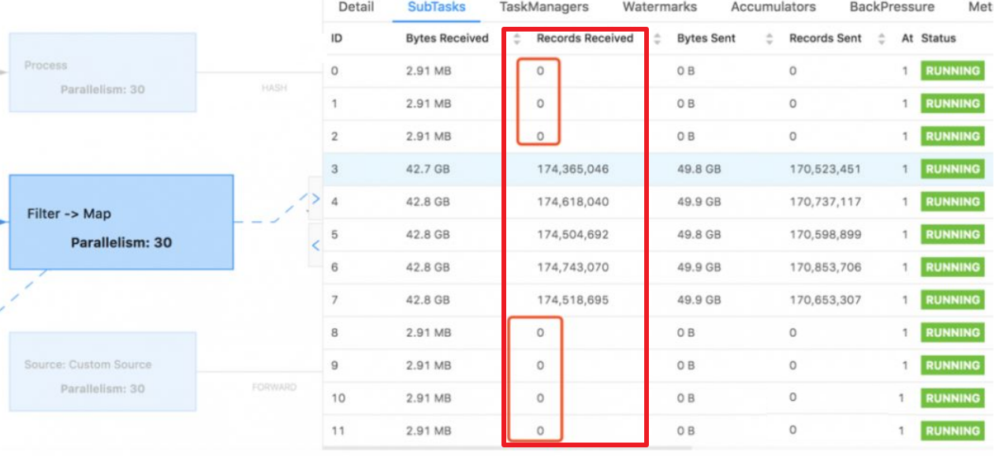


rebalance

自定义分区器

key+随机前后缀


3.异步IO


4.合理调整并行度

数据过滤之后可以减少并行度

数据合并之后再处理之前可以增加并行度

大量小文件写入到HDFS可以减少并行度

```
 1.ds.writeAsText("data/output/result1").setParallelism(1);
 2.env.setParallelism(1);
 3.提交任务时webUI或命令行参数  flink run  -p 10
 4.配置文件flink-conf.yaml parallelism.default: 1
```


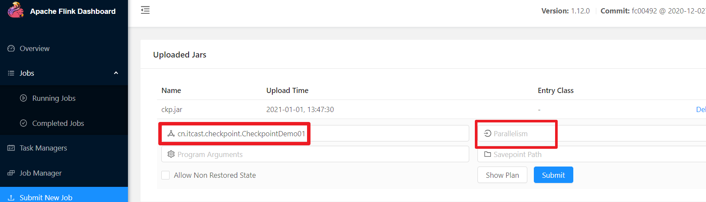


更多的优化在后面的项目中结合业务来讲解


# Flink内存管理

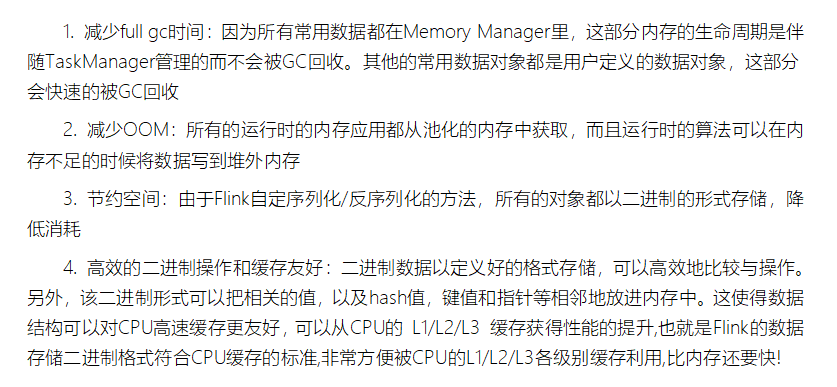


# Spark VS Flink

## 应用场景

Spark:主要用作离线批处理 , 对延迟要求不高的实时处理(微批) ,DataFrame和DataSetAPI 也支持 "流批一体"

Flink:主要用作实时处理 ,注意Flink1.12开始支持真正的流批一体


## API

Spark : RDD(不推荐) /DSteam(不推荐)/DataFrame和DataSet

Flink : DataSet(1.12软弃用) 和 DataStream /Table&SQL(快速发展中)


## 核心角色/流程原理

Spark

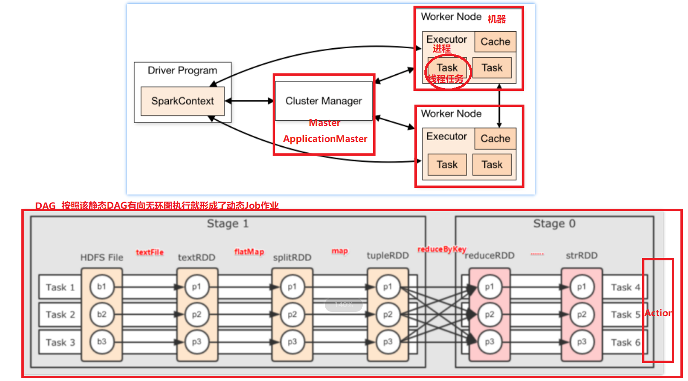

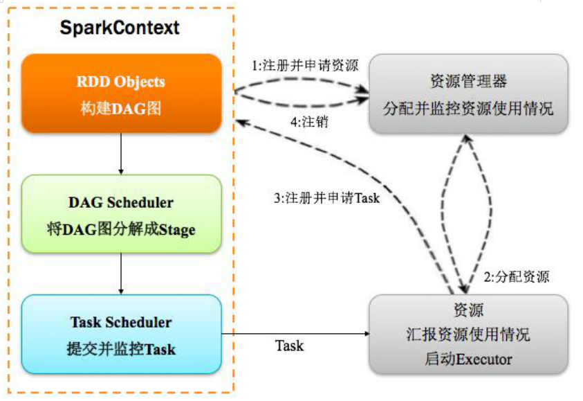


Flink


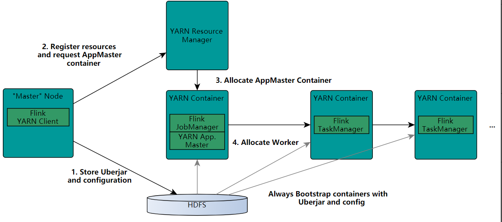

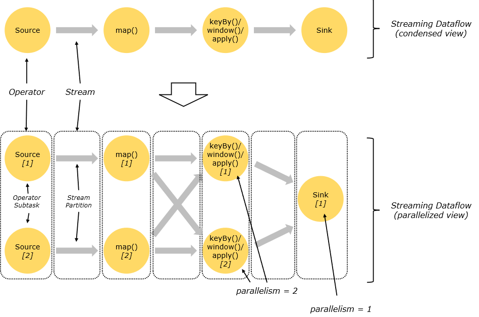

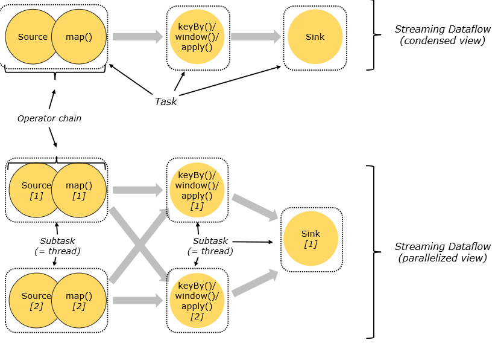


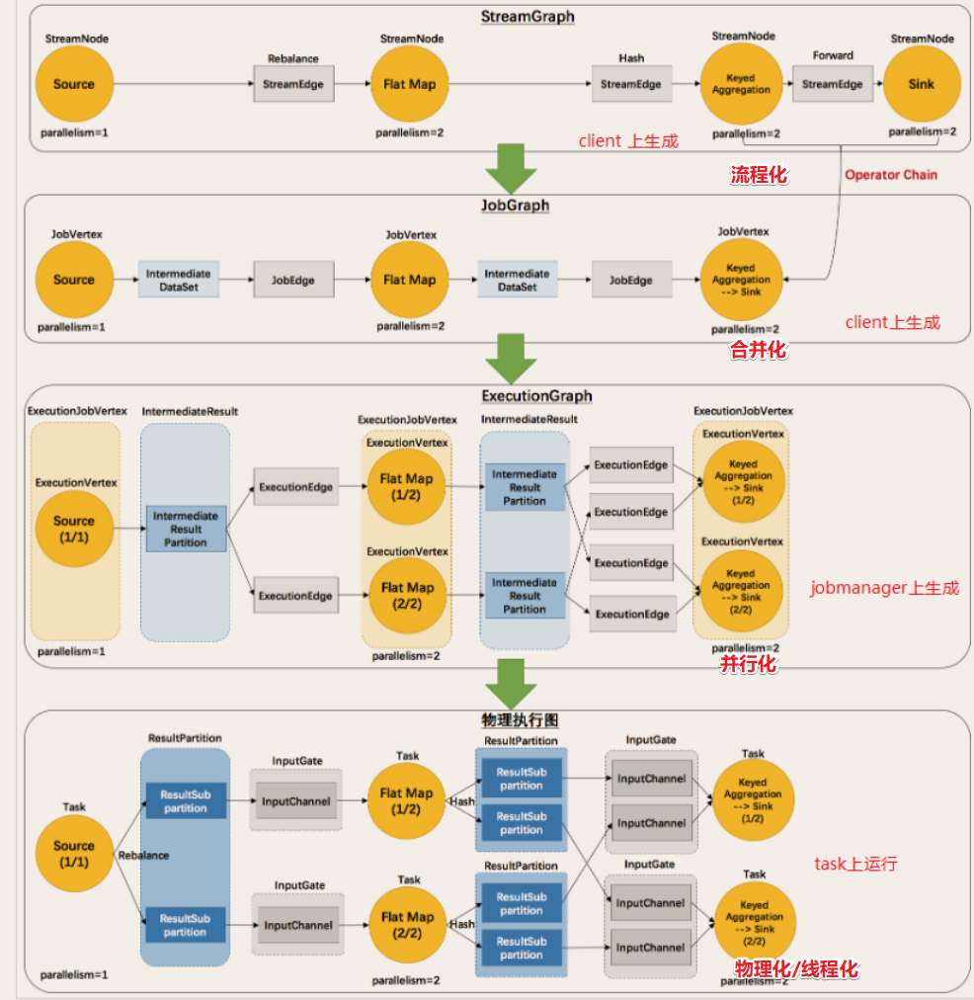


## 时间机制

Spark : SparkStreaming只支持处理时间  StructuredStreaming开始支持事件时间

Flink : 直接支持事件时间 /处理时间/摄入时间


## 容错机制

Spark : 缓存/持久化 +Checkpoint(应用级别)  StructuredStreaming中的Checkpoint也开始借鉴Flink使用Chandy-Lamport algorithm分布式快照算法

Flink: State + Checkpoint(Operator级别)  + 自动重启策略 + Savepoint


## 窗口

Spark中的支持基于时间/数量的滑动/滚动 要求windowDuration和slideDuration必须是batchDuration的倍数

Flink中的窗口机制更加灵活/功能更多

支持基于时间/数量的滑动/滚动 和 会话窗口


## 整合Kafka

SparkStreaming整合Kafka: 支持offset自动维护/手动维护 , 支持动态分区检测 无需配置

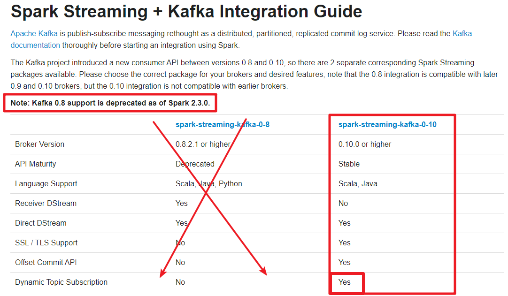

Flink整合Kafka: 支持offset自动维护/手动维护(一般自动由Checkpoint维护即可) , 支持动态分区检测  需要配置

```
props.setProperty("flink.partition-discovery.interval-millis","5000");//会开启一个后台线程每隔5s检测一下Kafka的分区情况,实现动态分区检测
```


## 其他的

源码编程语言

Flink的高级功能 : Flink CEP可以实现 实时风控.....


## 单独补充:流式计算实现原理

Spark : 

​	SparkStreaming:   微批  

​	StructuredStreaming: 微批(连续处理在实验中)

Flink : 是真真正正的流式处理, 只不过对于低延迟和高吞吐做了平衡

 	早期就确定了后续的方向:基于事件的流式数据处理框架!

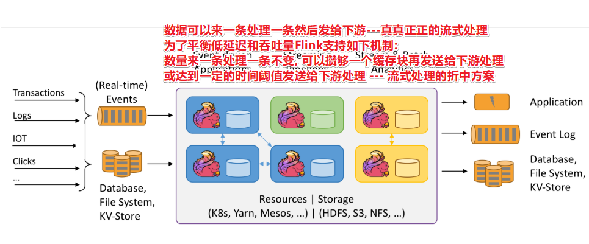

env.setBufferTimeout - 默认100ms

taskmanager.memory.segment-size - 默认32KB


## 单独补充:背压/反压

back pressure

Spark: PIDRateEsimator ,PID算法实现一个速率评估器(统计DAG调度时间,任务处理时间,数据条数等, 得出一个消息处理最大速率, 进而调整根据offset从kafka消费消息的速率), 

Flink: 基于credit – based 流控机制，在应用层模拟 TCP 的流控机制(上游发送数据给下游之前会先进行通信,告诉下游要发送的blockSize, 那么下游就可以准备相应的buffer来接收, 如果准备ok则返回一个credit凭证,上游收到凭证就发送数据, 如果没有准备ok,则不返回credit,上游等待下一次通信返回credit)

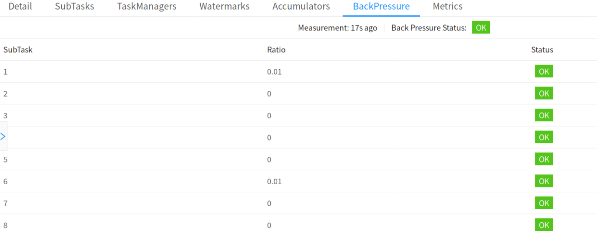

阻塞占比在 web 上划分了三个等级：

OK: 0 <= Ratio <= 0.10，表示状态良好；

LOW: 0.10 < Ratio <= 0.5，表示有待观察；

HIGH: 0.5 < Ratio <= 1，表示要处理了(增加并行度/subTask/检查是否有数据倾斜/增加内存...)。

例如，0.01，代表着100次中有一次阻塞在内部调用