# Flume入门到精通

## Flume 概述

### Flume 定义

Flume 是 Cloudera 提供的一个高可用的，高可靠的，分布式的海量日志采集、聚合和传 输的系统。Flume 基于流式架构，灵活简单。

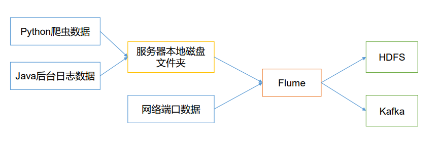

**Flume最主要的作用就是，实时读取服务器本地磁盘的数据，将数据写入到HDFS。**

### Flume 基础架构

Flume 组成架构：

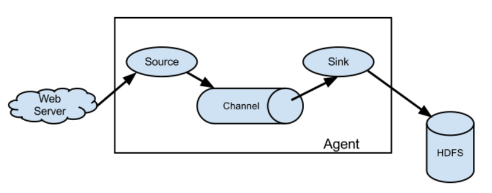

**Flume 架构中的组件：**

**Agent：**

Agent 是一个 JVM 进程，它以事件的形式将数据从源头送至目的。 

Agent 主要有 3 个部分组成，Source、Channel、Sink。


**Source：**

Source 是负责接收数据到 Flume Agent 的组件。Source 组件可以处理各种类型、各种 格式的日志数据，包括 avro、thrift、exec、jms、spooling directory、netcat、sequence  generator、syslog、http、legacy。


**Sink：**

Sink 不断地轮询 Channel 中的事件且批量地移除它们，并将这些事件批量写入到存储 或索引系统、或者被发送到另一个 Flume Agent。 Sink 组件目的地包括 hdfs、logger、avro、thrift、ipc、file、HBase、solr、自定 义。


**Channel：**

Channel 是位于 Source 和 Sink 之间的缓冲区。因此，Channel 允许 Source 和 Sink 运 作在不同的速率上。Channel 是线程安全的，可以同时处理几个 Source 的写入操作和几个 Sink 的读取操作。 


Flume 自带两种 Channel：Memory Channel 和 File Channel 以及 Kafka Channel。 Memory Channel 是内存中的队列。Memory Channel 在不需要关心数据丢失的情景下适 用。如果需要关心数据丢失，那么 Memory Channel 就不应该使用，因为程序死亡、机器宕 机或者重启都会导致数据丢失。 


File Channel 将所有事件写到磁盘。因此在程序关闭或机器宕机的情况下不会丢失数 据。


**Event：**

传输单元，Flume 数据传输的基本单元，以 Event 的形式将数据从源头送至目的地。 Event 由 Header 和 Body 两部分组成，Header 用来存放该 event 的一些属性，为 K-V 结构， Body 用来存放该条数据，形式为字节数组。


## Flume 快速入门

### Flume 安装部署

#### 安装地址：

1） Flume 官网地址 http://flume.apache.org/ 

2）文档查看地址 http://flume.apache.org/FlumeUserGuide.html 

3）下载地址 http://archive.apache.org/dist/flume/

#### 安装部署

1）将 apache-flume-1.7.0-bin.tar.gz 上传到 linux 的/opt/software 目录下 

2）解压 apache-flume-1.7.0-bin.tar.gz 到/opt/module/目录下

```sh
[dsjprs@hadoop102 software]$ tar -zxf apache-flume-1.7.0-bin.tar.gz -C /opt/module/
```

3）修改 apache-flume-1.7.0-bin 的名称为 flume

```sh
[dsjprs@hadoop102 module]$ mv apache-flume-1.7.0-bin flume
```

4）将 flume/conf 下的 flume-env.sh.template 文件修改为 flume-env.sh，并配置 flumeenv.sh 文件

```sh
[dsjprs@hadoop102 conf]$ mv flume-env.sh.template flume-env.sh
[dsjprs@hadoop102 conf]$ vi flume-env.sh
export JAVA_HOME=/opt/module/jdk1.8.0_14
```

## Flume 案例

### 监控端口数据官方案例

1）案例需求：  使用 Flume 监听一个端口，收集该端口数据，并打印到控制台。 


2）需求分析：

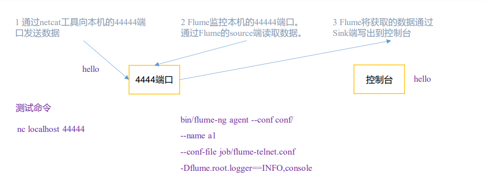

3）实现步骤：

1.安装 netcat 工具

```sh
[dsjprs@hadoop102 software]$ sudo yum install -y nc
```

2.判断 44444 端口是否被占用

```sh
[dsjprs@hadoop102 flume-telnet]$ sudo netstat -tunlp | grep 44444
```

3.创建 Flume Agent 配置文件 flume-netcat-logger.conf  在 flume 目录下创建 job 文件夹并进入 job 文件夹。

```sh
[dsjprs@hadoop102 flume]$ mkdir job
[dsjprs@hadoop102 flume]$ cd job/
```

在 job 文件夹下创建 Flume Agent 配置文件 flume-netcat-logger.conf。

```sh
[dsjprs@hadoop102 job]$ vim flume-netcat-logger.conf
```

在 flume-netcat-logger.conf 文件中添加如下内容。

```shell
# 添加内容如下：
# Name the components on this agent
a1.sources = r1
a1.sinks = k1
a1.channels = c1
# Describe/configure the source
a1.sources.r1.type = netcat
a1.sources.r1.bind = localhost
a1.sources.r1.port = 44444
# Describe the sink
a1.sinks.k1.type = logger
# Use a channel which buffers events in memory
a1.channels.c1.type = memory
a1.channels.c1.capacity = 1000
a1.channels.c1.transactionCapacity = 100
# Bind the source and sink to the channel
a1.sources.r1.channels = c1
a1.sinks.k1.channel = c1

```

官方手册配置文件: http://flume.apache.org/FlumeUserGuide.html

### 配置文件解析

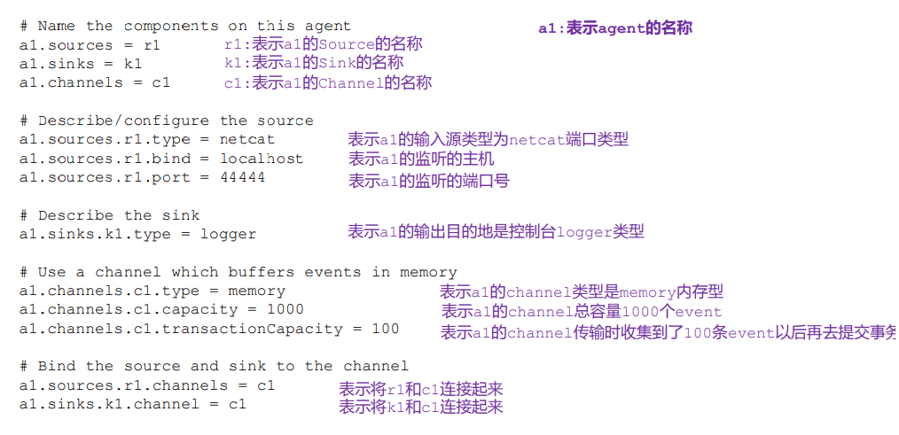

4）先开启 flume 监听端口

第一种写法：

```sh
[dsjprs@hadoop102 flume]$ bin/flume-ng agent --conf conf/ --name a1 --conf-file job/flume-netcat-logger.conf -Dflume.root.logger=INFO,console
```

第二种写法：

```sh
[dsjprs@hadoop102 flume]$ bin/flume-ng agent -c conf/ -n a1 -f job/flume-netcat-logger.conf -Dflume.root.logger=INFO,console
```

参数说明： 

--conf/-c：表示配置文件存储在 conf/目录 

--name/-n：表示给 agent 起名为 a1 

--conf-file/-f：flume 本次启动读取的配置文件是在 job 文件夹下的 flume-telnet.conf 文件。 

-Dflume.root.logger=INFO,console ：

-D 表示 flume 运行时动态修改 flume.root.logger 参数属性值，并将控制台日志打印级别设置为 INFO 级别。


日志级别包括:log、info、warn、 error。

5）使用 netcat 工具向本机的 44444 端口发送内容

```sh
[dsjprs@hadoop102 ~]$ nc localhost 44444
hello 
flume
```

6）在 Flume 监听页面观察接收数据情况

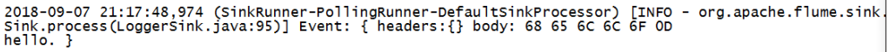

### 实时监控单个追加文件

1）案例需求：实时监控 Hive 日志，并上传到 HDFS 中  


2）需求分析：

**实时读取本地文件到HDFS案例**

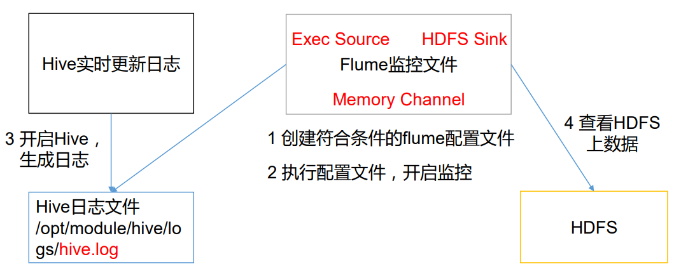


3）实现步骤： 

1.Flume 要想将数据输出到 HDFS，须持有 Hadoop 相关 jar 包  将

```sh
commons-configuration-1.6.jar、
hadoop-auth-2.7.2.jar、
hadoop-common-2.7.2.jar、
hadoop-hdfs-2.7.2.jar、
commons-io-2.4.jar、
htrace-core-3.1.0-incubating.jar
```

拷贝到/opt/module/flume/lib 文件夹下。


2.创建 flume-file-hdfs.conf 文件 

创建文件

```sh
[dsjprs@hadoop102 job]$ vim flume-file-hdfs.conf
```

注：要想读取 Linux 系统中的文件，就得按照 Linux 命令的规则执行命令。由于 Hive 日志 在 Linux 系统中所以读取文件的类型选择：exec 即 execute 执行的意思。表示执行 Linux 命令来读取文件。

**添加如下内容**

```sh
# Name the components on this agent
a2.sources = r2
a2.sinks = k2
a2.channels = c2
# Describe/configure the source
a2.sources.r2.type = exec
a2.sources.r2.command = tail -F /opt/module/hive/logs/hive.log
a2.sources.r2.shell = /bin/bash -c
# Describe the sink
a2.sinks.k2.type = hdfs
a2.sinks.k2.hdfs.path = hdfs://hadoop102:9000/flume/%Y%m%d/%H
#上传文件的前缀
a2.sinks.k2.hdfs.filePrefix = logs-
#是否按照时间滚动文件夹
a2.sinks.k2.hdfs.round = true
#多少时间单位创建一个新的文件夹
a2.sinks.k2.hdfs.roundValue = 1
#重新定义时间单位
a2.sinks.k2.hdfs.roundUnit = hour
#是否使用本地时间戳
a2.sinks.k2.hdfs.useLocalTimeStamp = true
#积攒多少个 Event 才 flush 到 HDFS 一次
a2.sinks.k2.hdfs.batchSize = 1000
#设置文件类型，可支持压缩
a2.sinks.k2.hdfs.fileType = DataStream
#多久生成一个新的文件
a2.sinks.k2.hdfs.rollInterval = 30
#设置每个文件的滚动大小
a2.sinks.k2.hdfs.rollSize = 134217700
#文件的滚动与 Event 数量无关
a2.sinks.k2.hdfs.rollCount = 0
# Use a channel which buffers events in memory
a2.channels.c2.type = memory
a2.channels.c2.capacity = 1000
a2.channels.c2.transactionCapacity = 100
# Bind the source and sink to the channel
a2.sources.r2.channels = c2
a2.sinks.k2.channel = c2
```

注意： 

对于所有与时间相关的转义序列，Event Header 中必须存在以 “timestamp”的 key（除非hdfs.useLocalTimeStamp 设置为 true，此方法会使用 TimestampInterceptor 自动添加 timestamp）


**a3.sinks.k3.hdfs.useLocalTimeStamp = true**

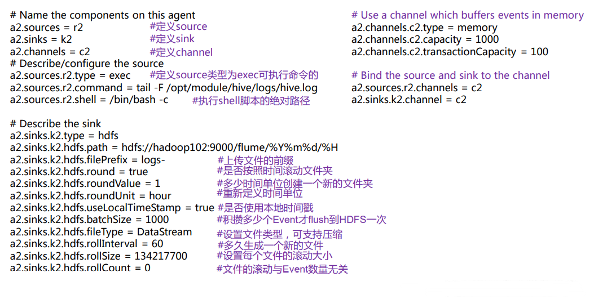

3.运行 Flume 

```sh
[dsjprs@hadoop102 flume]$ bin/flume-ng agent --conf conf/ --name a2 --conf-file job/flume-file-hdfs.conf
```

4.开启 Hadoop 和 Hive 并操作 Hive 产生日志 

```sh
[dsjprs@hadoop102 hadoop-2.7.2]$ sbin/start-dfs.sh
[dsjprs@hadoop103 hadoop-2.7.2]$ sbin/start-yarn.sh
[dsjprs@hadoop102 hive]$ bin/hive
hive (default)>
```

5.在 HDFS 上查看文件。 

### 实时监控目录下多个新文件

1）案例需求：使用 Flume 监听整个目录的文件，并上传至 HDFS  


2）需求分析： 

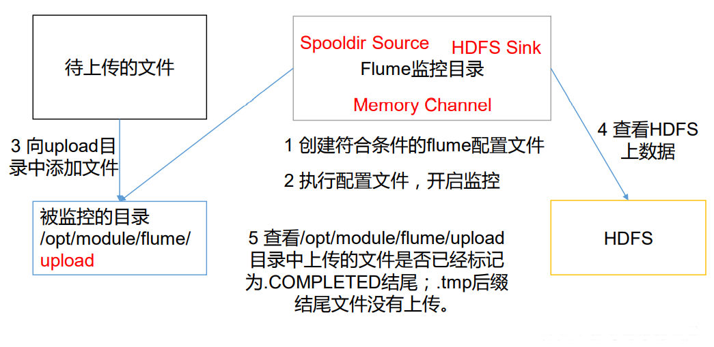

实现步骤： 

1．创建配置文件 flume-dir-hdfs.conf  创建一个文件

```sh
[dsjprs@hadoop102 job]$ vim flume-dir-hdfs.conf
```

**添加如下内容**

```sh
a3.sources = r3
a3.sinks = k3
a3.channels = c3
# Describe/configure the source
a3.sources.r3.type = spooldir
a3.sources.r3.spoolDir = /opt/module/flume/upload
a3.sources.r3.fileSuffix = .COMPLETED
a3.sources.r3.fileHeader = true
#忽略所有以.tmp 结尾的文件，不上传
a3.sources.r3.ignorePattern = ([^ ]*\.tmp)
# Describe the sink
a3.sinks.k3.type = hdfs
a3.sinks.k3.hdfs.path = 
hdfs://hadoop102:9000/flume/upload/%Y%m%d/%H
#上传文件的前缀
a3.sinks.k3.hdfs.filePrefix = upload-
#是否按照时间滚动文件夹
a3.sinks.k3.hdfs.round = true
#多少时间单位创建一个新的文件夹
a3.sinks.k3.hdfs.roundValue = 1
#重新定义时间单位
a3.sinks.k3.hdfs.roundUnit = hour
#是否使用本地时间戳
a3.sinks.k3.hdfs.useLocalTimeStamp = true
#积攒多少个 Event 才 flush 到 HDFS 一次
a3.sinks.k3.hdfs.batchSize = 100
#设置文件类型，可支持压缩
a3.sinks.k3.hdfs.fileType = DataStream
#多久生成一个新的文件
a3.sinks.k3.hdfs.rollInterval = 60
#设置每个文件的滚动大小大概是 128M
a3.sinks.k3.hdfs.rollSize = 134217700
#文件的滚动与 Event 数量无关
a3.sinks.k3.hdfs.rollCount = 0
# Use a channel which buffers events in memory
a3.channels.c3.type = memory
a3.channels.c3.capacity = 1000
a3.channels.c3.transactionCapacity = 100
# Bind the source and sink to the channel
a3.sources.r3.channels = c3
a3.sinks.k3.channel = c3
```

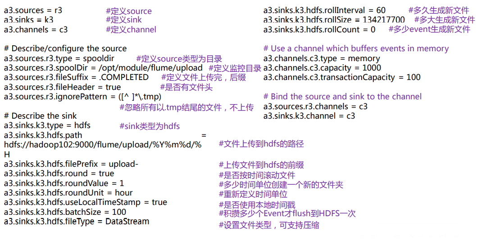

2.启动监控文件夹命令 

```sh
[dsjprs@hadoop102 flume]$ bin/flume-ng agent --conf conf/ --name a3 --conf-file job/flume-dir-hdfs.conf
```

说明：在使用 Spooling Directory Source 时 不要在监控目录中创建并持续修改文件 上传完成的文件会以.COMPLETED 结尾 被监控文件夹每 500 毫秒扫描一次文件变动.


3.向 upload 文件夹中添加文件

在/opt/module/flume 目录下创建 upload 文件夹

```sh
[dsjprs@hadoop102 flume]$ mkdir upload
```

向 upload 文件夹中添加文件

```sh
[dsjprs@hadoop102 upload]$ touch atguigu.txt
[dsjprs@hadoop102 upload]$ touch atguigu.tmp
[dsjprs@hadoop102 upload]$ touch atguigu.log
```

4.查看 HDFS 上的数据 

5.等待 1s，再次查询 upload 文件夹 

```sh
[dsjprs@hadoop102 upload]$ ll
总用量 0
-rw-rw-r--. 1 dsjprs dsjprs 0 5 月 20 22:31 atguigu.log.COMPLETED
-rw-rw-r--. 1 dsjprs dsjprs 0 5 月 20 22:31 atguigu.tmp
-rw-rw-r--. 1 dsjprs dsjprs 0 5 月 20 22:31 atguigu.txt.COMPLETED
```

### 实时监控目录下的多个追加文件

Exec source 适用于监控一个实时追加的文件，但不能保证数据不丢失；Spooldir  Source 能够保证数据不丢失，且能够实现断点续传，但延迟较高，不能实时监控；而 Taildir Source 既能够实现断点续传，又可以保证数据不丢失，还能够进行实时监控。

1）案例需求：使用 Flume 监听整个目录的实时追加文件，并上传至 HDFS  


2）需求分析：

**实时读取目录文件到HDFS案例**

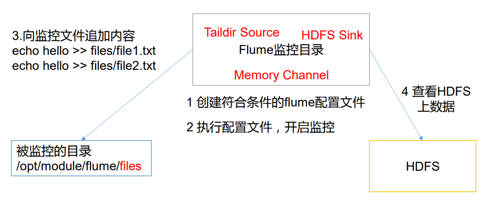

实现步骤： 

1．创建配置文件 flume-taildir-hdfs.conf

创建一个文件

```sh
[dsjprs@hadoop102 job]$ vim flume-taildir-hdfs.conf
```

```sh
# 添加如下内容
a3.sources = r3
a3.sinks = k3
a3.channels = c3
# Describe/configure the source
a3.sources.r3.type = TAILDIR
a3.sources.r3.positionFile = /opt/module/flume/tail_dir.json
a3.sources.r3.filegroups = f1
a3.sources.r3.filegroups.f1 = /opt/module/flume/files/file.*
# Describe the sink
a3.sinks.k3.type = hdfs
a3.sinks.k3.hdfs.path = 
hdfs://hadoop102:9000/flume/upload/%Y%m%d/%H
#上传文件的前缀
a3.sinks.k3.hdfs.filePrefix = upload-
#是否按照时间滚动文件夹
a3.sinks.k3.hdfs.round = true
#多少时间单位创建一个新的文件夹
a3.sinks.k3.hdfs.roundValue = 1
#重新定义时间单位
a3.sinks.k3.hdfs.roundUnit = hour
#是否使用本地时间戳
a3.sinks.k3.hdfs.useLocalTimeStamp = true
#积攒多少个 Event 才 flush 到 HDFS 一次
a3.sinks.k3.hdfs.batchSize = 100
#设置文件类型，可支持压缩
a3.sinks.k3.hdfs.fileType = DataStream
#多久生成一个新的文件
a3.sinks.k3.hdfs.rollInterval = 60
#设置每个文件的滚动大小大概是 128M
a3.sinks.k3.hdfs.rollSize = 134217700
#文件的滚动与 Event 数量无关
a3.sinks.k3.hdfs.rollCount = 0
# Use a channel which buffers events in memory
a3.channels.c3.type = memory
a3.channels.c3.capacity = 1000
a3.channels.c3.transactionCapacity = 100
# Bind the source and sink to the channel
a3.sources.r3.channels = c3
a3.sinks.k3.channel = c3
```

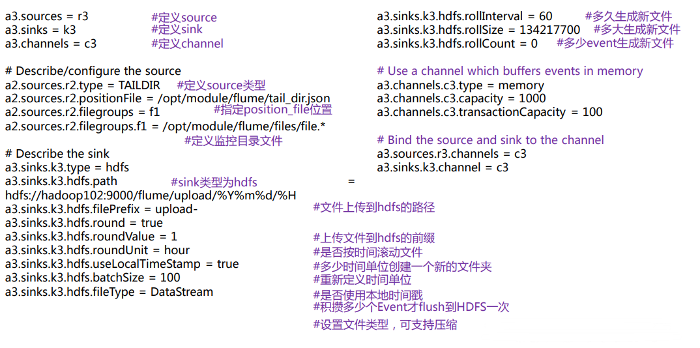

2.启动监控文件夹命令 

```sh
[dsjprs@hadoop102 flume]$ bin/flume-ng agent --conf conf/ --name a3 --conf-file job/flume-taildir-hdfs.conf
```

3.向 files 文件夹中追加内容 

在/opt/module/flume 目录下创建 files 文件夹

```sh
[dsjprs@hadoop102 flume]$ mkdir files
```

向 upload 文件夹中添加文件

```sh
[dsjprs@hadoop102 files]$ echo hello >> file1.txt
[dsjprs@hadoop102 files]$ echo atguigu >> file2.txt
```

4.查看 HDFS 上的数据

Taildir 说明：  Taildir Source 维护了一个 json 格式的 position File，其会定期的往 position File 中更新每个文件读取到的最新的位置，因此能够实现断点续传。Position File 的格式如下：

```sh
{"inode":2496272,"pos":12,"file":"/opt/module/flume/files/file1.t
xt"}
{"inode":2496275,"pos":12,"file":"/opt/module/flume/files/file2.t
xt"}
```

注：Linux 中储存文件元数据的区域就叫做 inode，每个 inode 都有一个号码，操作系统 用 inode 号码来识别不同的文件，Unix/Linux 系统内部不使用文件名，而使用 inode 号码来识别文件。


## Flume 进阶

### Flume事务

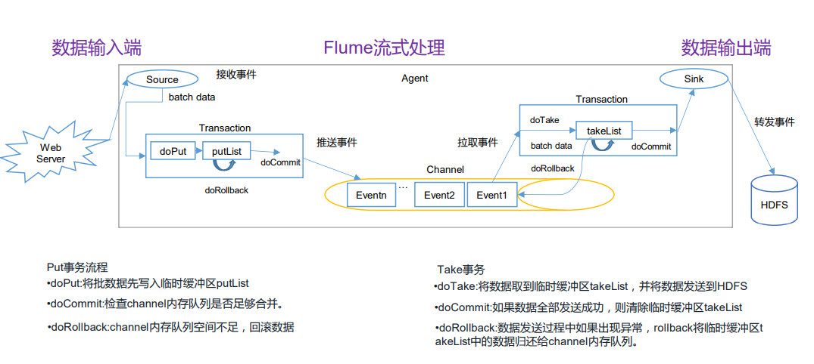

Put事务流程

•doPut:将批数据先写入临时缓冲区putList 

•doCommit:检查channel内存队列是否足够合并。 

•doRollback:channel内存队列空间不足，回滚数据


Take事务 

•doTake:将数据取到临时缓冲区takeList，并将数据发送到HDFS 

•doCommit:如果数据全部发送成功，则清除临时缓冲区takeList 

•doRollback:数据发送过程中如果出现异常，rollback将临时缓冲区takeList中的数据归还给channel内存队列。


### Flume Agent 内部原理

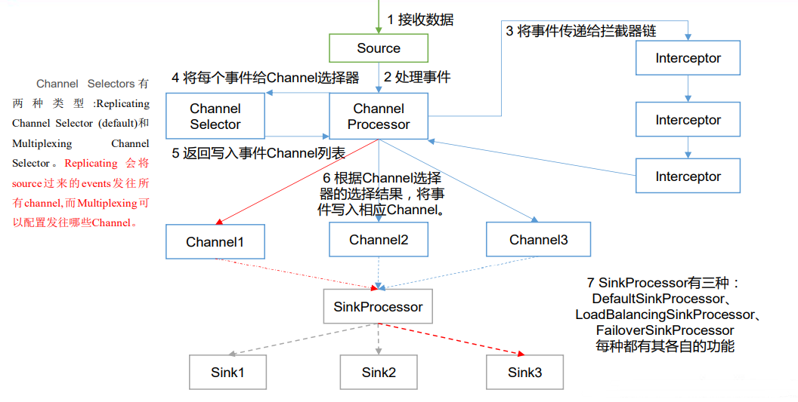


1 接收数据

2 处理事件

3 将事件传递给拦截器链

4 将每个事件给Channel选择器

5 返回写入事件Channel列表

6 根据Channel选择 器的选择结果，将事 件写入相应Channel。

7 SinkProcessor有三种： DefaultSinkProcessor、 LoadBalancingSinkProcessor、 FailoverSinkProcessor 每种都有其各自的功能


Channel Selectors 有 两 种 类 型 :Replicating Channel Selector (default)和 Multiplexing Channel Selector 。Replicating 会 将 source过来的events发往所 有channel,而Multiplexing可 以配置发往哪些Channel。


#### 重要组件

1）ChannelSelector  ChannelSelector 的作用就是选出 Event 将要被发往哪个 Channel。其共有两种类型， 分别是 Replicating（复制）和 Multiplexing（多路复用）。ReplicatingSelector 会将同一个 Event 发往所有的 Channel，Multiplexing 会根据相 应的原则，将不同的 Event 发往不同的 Channel。


2）SinkProcessor  SinkProcessor 共 有 三 种 类 型 ， 分 别 是 DefaultSinkProcessor 、 LoadBalancingSinkProcessor 和 FailoverSinkProcessor 


DefaultSinkProcessor 对 应 的 是 单 个 的 Sink ， LoadBalancingSinkProcessor 和 FailoverSinkProcessor 对应的是 Sink Group，LoadBalancingSinkProcessor 可以实现负 载均衡的功能，FailoverSinkProcessor 可以实现故障转移的功能。


## Flume 拓扑结构

### 简单串联

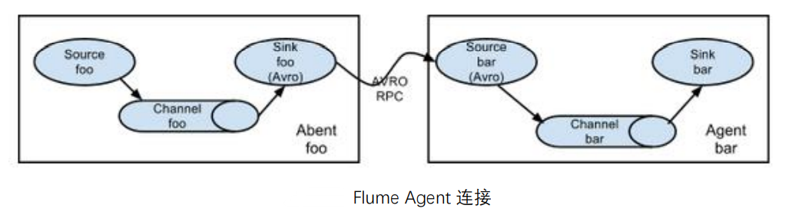

这种模式是将多个 flume 顺序连接起来了，从最初的 source 开始到最终 sink 传送的 目的存储系统。此模式不建议桥接过多的 flume 数量，flume 数量过多不仅会影响传输速率， 而且一旦传输过程中某个节点 flume 宕机，会影响整个传输系统。


### 复制和多路复用

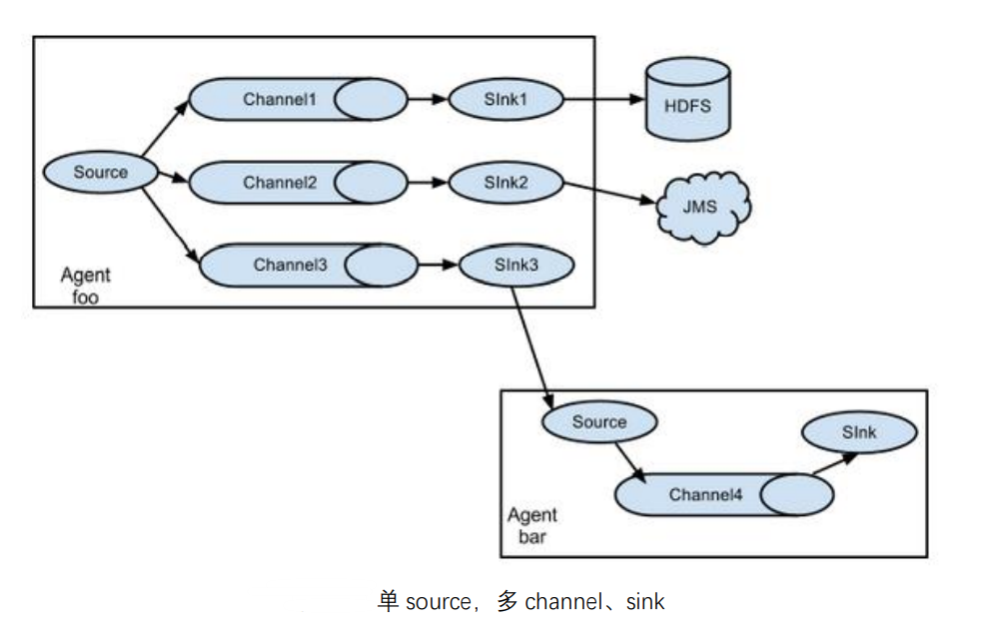


Flume 支持将事件流向一个或者多个目的地。这种模式可以将相同数据复制到多个 channel 中，或者将不同数据分发到不同的 channel 中，sink 可以选择传送到不同的目的 地。


### 负载均衡和故障转移

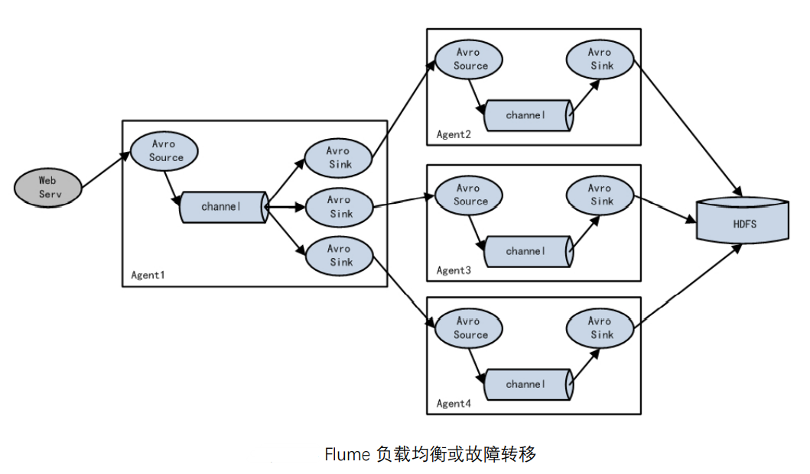


Flume支持使用将多个sink逻辑上分到一个sink组，sink组配合不同的SinkProcessor 可以实现负载均衡和错误恢复的功能。


### 聚合

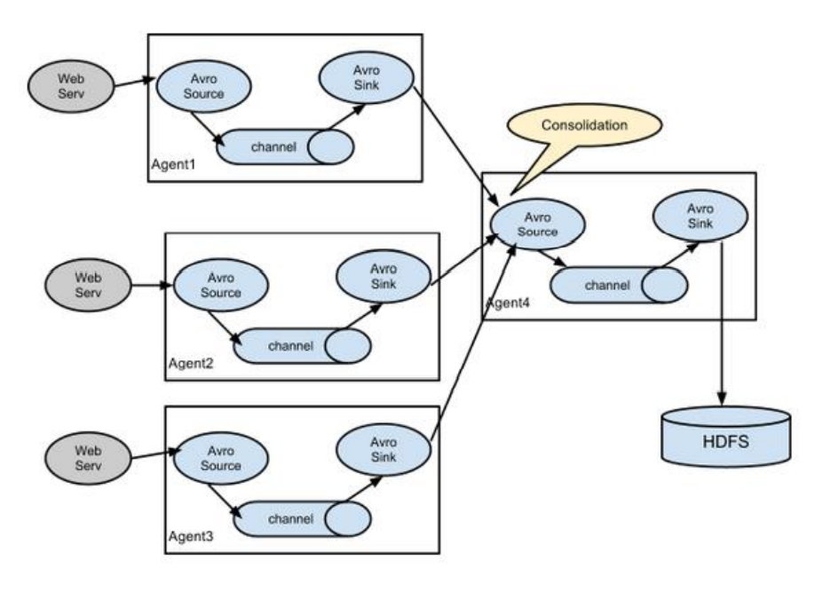

这种模式是最常见的，也非常实用，日常 web 应用通常分布在上百个服务器，大者 甚至上千个、上万个服务器。产生的日志，处理起来也非常麻烦。用 flume 的这种组合方式 能很好的解决这一问题，每台服务器部署一个 flume 采集日志，传送到一个集中收集日志的 flume，再由此 flume 上传到 hdfs、hive、hbase 等，进行日志分析。


## Flume 企业开发案例

### 复制和多路复用

1）案例需求  使用 Flume-1 监控文件变动，Flume-1 将变动内容传递给 Flume-2，Flume-2 负责存储 到 HDFS。同时 Flume-1 将变动内容传递给 Flume-3，Flume-3 负责输出到 Local FileSystem。 


2）需求分析： 

**单数据源多出口案例（选择器）**

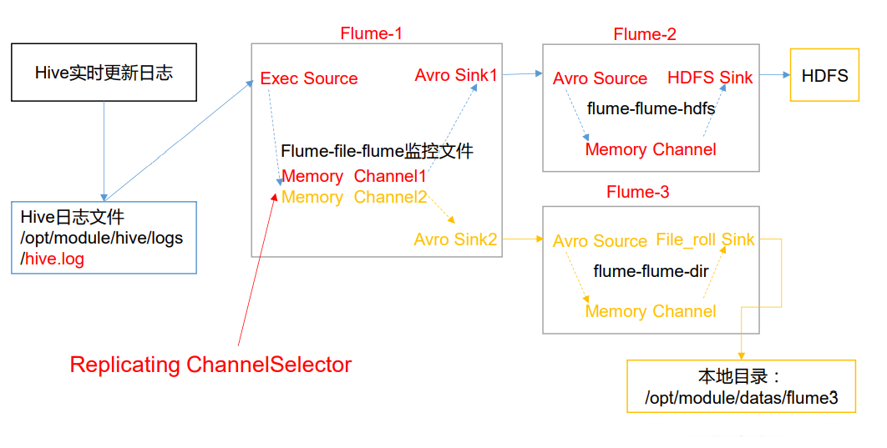

3）实现步骤：  

0.准备工作 

在/opt/module/flume/job 目录下创建 group1 文件夹

```sh
[dsjprs@hadoop102 job]$ cd group1/
```

在/opt/module/datas/目录下创建 flume3 文件夹

```sh
[dsjprs@hadoop102 datas]$ mkdir flume3
```

1．创建 flume-file-flume.conf  配置 1 个接收日志文件的 source 和两个 channel、两个 sink，分别输送给 flume-flume-hdfs 和 flume-flume-dir。 

编辑配置文件

```sh
[dsjprs@hadoop102 group1]$ vim flume-file-flume.conf
```

```sh
# 添加如下内容
# Name the components on this agent
a1.sources = r1
a1.sinks = k1 k2
a1.channels = c1 c2
# 将数据流复制给所有 channel
a1.sources.r1.selector.type = replicating
# Describe/configure the source
a1.sources.r1.type = exec
a1.sources.r1.command = tail -F /opt/module/hive/logs/hive.log
a1.sources.r1.shell = /bin/bash -c
# Describe the sink
# sink 端的 avro 是一个数据发送者
a1.sinks.k1.type = avro
a1.sinks.k1.hostname = hadoop102
a1.sinks.k1.port = 4141
a1.sinks.k2.type = avro
a1.sinks.k2.hostname = hadoop102
a1.sinks.k2.port = 4142
# Describe the channel
a1.channels.c1.type = memory
a1.channels.c1.capacity = 1000
a1.channels.c1.transactionCapacity = 100
a1.channels.c2.type = memory
a1.channels.c2.capacity = 1000
a1.channels.c2.transactionCapacity = 100
# Bind the source and sink to the channel
a1.sources.r1.channels = c1 c2
a1.sinks.k1.channel = c1
a1.sinks.k2.channel = c2
```

2.创建 flume-flume-hdfs.conf  配置上级 Flume 输出的 Source，输出是到 HDFS 的 Sink。 

编辑配置文件

```sh
[dsjprs@hadoop102 group1]$ vim flume-flume-hdfs.conf
```

```sh
# 添加如下内容
# Name the components on this agent
a2.sources = r1
a2.sinks = k1
a2.channels = c1
# Describe/configure the source
# source 端的 avro 是一个数据接收服务
a2.sources.r1.type = avro
a2.sources.r1.bind = hadoop102
a2.sources.r1.port = 4141
# Describe the sink
a2.sinks.k1.type = hdfs
a2.sinks.k1.hdfs.path = hdfs://hadoop102:9000/flume2/%Y%m%d/%H
#上传文件的前缀
a2.sinks.k1.hdfs.filePrefix = flume2-
#是否按照时间滚动文件夹
a2.sinks.k1.hdfs.round = true
#多少时间单位创建一个新的文件夹
a2.sinks.k1.hdfs.roundValue = 1
#重新定义时间单位
a2.sinks.k1.hdfs.roundUnit = hour
#是否使用本地时间戳
a2.sinks.k1.hdfs.useLocalTimeStamp = true
#积攒多少个 Event 才 flush 到 HDFS 一次
a2.sinks.k1.hdfs.batchSize = 100
#设置文件类型，可支持压缩
a2.sinks.k1.hdfs.fileType = DataStream
#多久生成一个新的文件
a2.sinks.k1.hdfs.rollInterval = 600
#设置每个文件的滚动大小大概是 128M
a2.sinks.k1.hdfs.rollSize = 134217700
#文件的滚动与 Event 数量无关
a2.sinks.k1.hdfs.rollCount = 0
# Describe the channel
a2.channels.c1.type = memory
a2.channels.c1.capacity = 1000
a2.channels.c1.transactionCapacity = 100
# Bind the source and sink to the channel
a2.sources.r1.channels = c1
a2.sinks.k1.channel = c1
```

3.创建 flume-flume-dir.conf  配置上级 Flume 输出的 Source，输出是到本地目录的 Sink。 

编辑配置文件

```sh
[dsjprs@hadoop102 group1]$ vim flume-flume-dir.conf
```

```sh
# 添加如下内容
# Name the components on this agent
a3.sources = r1
a3.sinks = k1
a3.channels = c2
# Describe/configure the source
a3.sources.r1.type = avro
a3.sources.r1.bind = hadoop102
a3.sources.r1.port = 4142
# Describe the sink
a3.sinks.k1.type = file_roll
a3.sinks.k1.sink.directory = /opt/module/data/flume3
# Describe the channel
a3.channels.c2.type = memory
a3.channels.c2.capacity = 1000
a3.channels.c2.transactionCapacity = 100
# Bind the source and sink to the channel
a3.sources.r1.channels = c2
a3.sinks.k1.channel = c2
```

注意：输出的本地目录必须是已经存在的目录，如果该目录不存在，并不会创建新的目录。


4．执行配置文件  分别启动对应的 flume 进程：flume-flume-dir，flume-flume-hdfs，flume-file-flume。

```sh
[dsjprs@hadoop102 flume]$ bin/flume-ng agent --conf conf/ --name 
a3 --conf-file job/group1/flume-flume-dir.conf
[dsjprs@hadoop102 flume]$ bin/flume-ng agent --conf conf/ --name 
a2 --conf-file job/group1/flume-flume-hdfs.conf
[dsjprs@hadoop102 flume]$ bin/flume-ng agent --conf conf/ --name 
a1 --conf-file job/group1/flume-file-flume.conf
```

5.启动 Hadoop 和 Hive

```sh
[dsjprs@hadoop102 hadoop-2.7.2]$ sbin/start-dfs.sh
[dsjprs@hadoop103 hadoop-2.7.2]$ sbin/start-yarn.sh
[dsjprs@hadoop102 hive]$ bin/hive
hive (default)>
```

6.检查 HDFS 上数据


### 负载均衡和故障转移

1）案例需求  使用 Flume1 监控一个端口，其 sink 组中的 sink 分别对接 Flume2 和 Flume3，采用 FailoverSinkProcessor，实现故障转移的功能。

2）需求分析 

**故障转移案例**

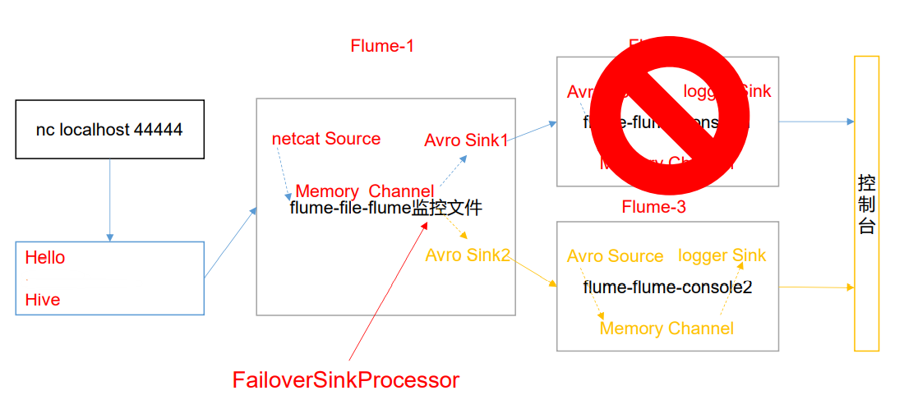

3）实现步骤  

0.准备工作  在/opt/module/flume/job 目录下创建 group2 文件夹

```sh
[dsjprs@hadoop102 job]$ cd group2/
```

1.创建 flume-netcat-flume.conf  配置 1 个 netcat source 和 1 个 channel、1 个 sink group（2 个 sink），分别输送给 flumeflume-console1 和 flume-flume-console2。 

编辑配置文件

```sh
[dsjprs@hadoop102 group2]$ vim flume-netcat-flume.conf
```

```sh
# 添加如下内容
# Name the components on this agent
a1.sources = r1
a1.channels = c1
a1.sinkgroups = g1
a1.sinks = k1 k2
# Describe/configure the source
a1.sources.r1.type = netcat
a1.sources.r1.bind = localhost
a1.sources.r1.port = 44444
a1.sinkgroups.g1.processor.type = failover
a1.sinkgroups.g1.processor.priority.k1 = 5
a1.sinkgroups.g1.processor.priority.k2 = 10
a1.sinkgroups.g1.processor.maxpenalty = 10000
# Describe the sink
a1.sinks.k1.type = avro
a1.sinks.k1.hostname = hadoop102
a1.sinks.k1.port = 4141
a1.sinks.k2.type = avro
a1.sinks.k2.hostname = hadoop102
a1.sinks.k2.port = 4142
# Describe the channel
a1.channels.c1.type = memory
a1.channels.c1.capacity = 1000
a1.channels.c1.transactionCapacity = 100
# Bind the source and sink to the channel
a1.sources.r1.channels = c1
a1.sinkgroups.g1.sinks = k1 k2
a1.sinks.k1.channel = c1
a1.sinks.k2.channel = c1
```

2.创建 flume-flume-console1.conf  配置上级 Flume 输出的 Source，输出是到本地控制台。 

编辑配置文件

```sh
[dsjprs@hadoop102 group2]$ vim flume-flume-console1.conf
```

```sh
# 添加如下内容
# Name the components on this agent
a2.sources = r1
a2.sinks = k1
a2.channels = c1
# Describe/configure the source
a2.sources.r1.type = avro
a2.sources.r1.bind = hadoop102
a2.sources.r1.port = 4141
# Describe the sink
a2.sinks.k1.type = logger
# Describe the channel
a2.channels.c1.type = memory
a2.channels.c1.capacity = 1000
a2.channels.c1.transactionCapacity = 100
# Bind the source and sink to the channel
a2.sources.r1.channels = c1
a2.sinks.k1.channel = c1
```

3.创建 flume-flume-console2.conf  配置上级 Flume 输出的 Source，输出是到本地控制台。 

编辑配置文件

```sh
[dsjprs@hadoop102 group2]$ vim flume-flume-console2.conf
```

```sh
# 添加如下内容
# Name the components on this agent
a3.sources = r1
a3.sinks = k1
a3.channels = c2
# Describe/configure the source
a3.sources.r1.type = avro
a3.sources.r1.bind = hadoop102
a3.sources.r1.port = 4142
# Describe the sink
a3.sinks.k1.type = logger
# Describe the channel
a3.channels.c2.type = memory
a3.channels.c2.capacity = 1000
a3.channels.c2.transactionCapacity = 100
# Bind the source and sink to the channel
a3.sources.r1.channels = c2
a3.sinks.k1.channel = c2
```

4.执行配置文件  分别开启对应配置文件：flume-flume-console2，flume-flume-console1，flume-netcatflume

```sh
[dsjprs@hadoop102 flume]$ bin/flume-ng agent --conf conf/ --name 
a3 --conf-file job/group2/flume-flume-console2.conf -
Dflume.root.logger=INFO,console
[dsjprs@hadoop102 flume]$ bin/flume-ng agent --conf conf/ --name 
a2 --conf-file job/group2/flume-flume-console1.conf -
Dflume.root.logger=INFO,console
[dsjprs@hadoop102 flume]$ bin/flume-ng agent --conf conf/ --name 
a1 --conf-file job/group2/flume-netcat-flume.conf
```

5.使用 netcat 工具向本机的 44444 端口发送内容

```sh
$ nc localhost 44444
```

6.查看 Flume2 及 Flume3 的控制台打印日志  

7.将 Flume2 kill，观察 Flume3 的控制台打印情况。

注：使用 jps -ml 查看 Flume 进程。


### 聚合

1）案例需求  hadoop102 上的 Flume-1 监控文件/opt/module/data/group.log， hadoop103 上的 Flume-2 监控某一个端口的数据流， Flume-1 与 Flume-2 将数据发送给 hadoop104 上的 Flume-3，Flume-3 将最终数据打印到控 制台。 


2）需求分析

**多数据源汇总案例**

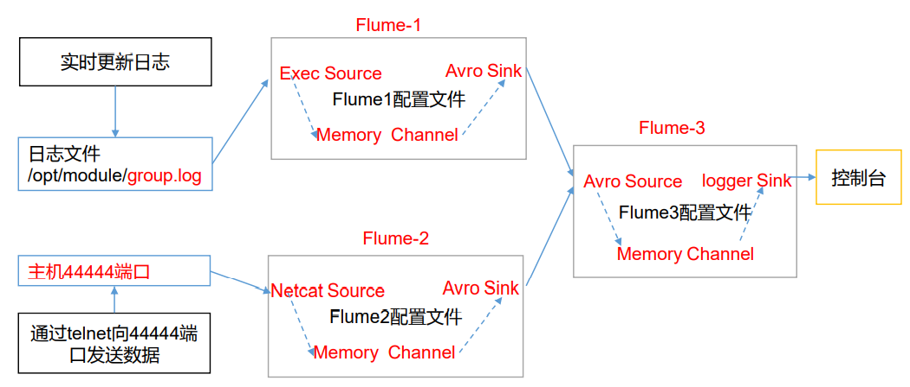


3）实现步骤：  

0.准备工作  分发 Flume

```sh
[dsjprs@hadoop102 module]$ xsync flume
```

在 hadoop102、hadoop103 以及 hadoop104 的/opt/module/flume/job目录下创建一个 group3 文件夹。

```sh
[dsjprs@hadoop102 job]$ mkdir group3
[dsjprs@hadoop103 job]$ mkdir group3
[dsjprs@hadoop104 job]$ mkdir group3
```

1.创建 flume1-logger-flume.conf  配置 Source 用于监控 hive.log 文件，配置 Sink 输出数据到下一级 Flume。 在 hadoop102 上编辑配置文件

```sh
[dsjprs@hadoop102 group3]$ vim flume1-logger-flume.conf
```

```sh
# 添加如下内容
# Name the components on this agent
a1.sources = r1
a1.sinks = k1
a1.channels = c1
# Describe/configure the source
a1.sources.r1.type = exec
a1.sources.r1.command = tail -F /opt/module/group.log
a1.sources.r1.shell = /bin/bash -c
# Describe the sink
a1.sinks.k1.type = avro
a1.sinks.k1.hostname = hadoop104
a1.sinks.k1.port = 4141
# Describe the channel
a1.channels.c1.type = memory
a1.channels.c1.capacity = 1000
a1.channels.c1.transactionCapacity = 100
# Bind the source and sink to the channel
a1.sources.r1.channels = c1
a1.sinks.k1.channel = c1
```

2.创建 flume2-netcat-flume.conf  配置 Source 监控端口 44444 数据流，配置 Sink 数据到下一级 Flume： 在 hadoop103 上


编辑配置文件

```sh
[dsjprs@hadoop102 group3]$ vim flume2-netcat-flume.conf
```

```sh
# 添加如下内容
# Name the components on this agent
a2.sources = r1
a2.sinks = k1
a2.channels = c1
# Describe/configure the source
a2.sources.r1.type = netcat
a2.sources.r1.bind = hadoop103
a2.sources.r1.port = 44444
# Describe the sink
a2.sinks.k1.type = avro
a2.sinks.k1.hostname = hadoop104
a2.sinks.k1.port = 4141
# Use a channel which buffers events in memory
a2.channels.c1.type = memory
a2.channels.c1.capacity = 1000
a2.channels.c1.transactionCapacity = 100
# Bind the source and sink to the channel
a2.sources.r1.channels = c1
a2.sinks.k1.channel = c1
```

3.创建 flume3-flume-logger.conf  配置 source 用于接收 flume1 与 flume2 发送过来的数据流，最终合并后 sink 到控制台。 在 hadoop104 上


编辑配置文件

```sh
[dsjprs@hadoop104 group3]$ touch flume3-flume-logger.conf
[dsjprs@hadoop104 group3]$ vim flume3-flume-logger.conf
```

```sh
# 添加如下内容
# Name the components on this agent
a3.sources = r1
a3.sinks = k1
a3.channels = c1
# Describe/configure the source
a3.sources.r1.type = avro
a3.sources.r1.bind = hadoop104
a3.sources.r1.port = 4141
# Describe the sink
# Describe the sink
a3.sinks.k1.type = logger
# Describe the channel
a3.channels.c1.type = memory
a3.channels.c1.capacity = 1000
a3.channels.c1.transactionCapacity = 100
# Bind the source and sink to the channel
a3.sources.r1.channels = c1
a3.sinks.k1.channel = c1
```

4.执行配置文件  分别开启对应配置文件：flume3-flume-logger.conf，flume2-netcat-flume.conf，flume1- logger-flume.conf。

```sh
[dsjprs@hadoop104 flume]$ bin/flume-ng agent --conf conf/ --name 
a3 --conf-file job/group3/flume3-flume-logger.conf -
Dflume.root.logger=INFO,console
[dsjprs@hadoop102 flume]$ bin/flume-ng agent --conf conf/ --name 
a2 --conf-file job/group3/flume1-logger-flume.conf
[dsjprs@hadoop103 flume]$ bin/flume-ng agent --conf conf/ --name 
a1 --conf-file job/group3/flume2-netcat-flume.conf
```

5．在 hadoop103 上向/opt/module 目录下的 group.log 追加内容

```sh
[dsjprs@hadoop103 module]$ echo 'hello' > group.log
```

6．在 hadoop102 上向 44444 端口发送数据 

```sh
[dsjprs@hadoop102 flume]$ telnet hadoop102 44444
```


### 自定义 Interceptor

1）案例需求 使用 Flume 采集服务器本地日志，需要按照日志类型的不同，将不同种类的日志发往不 同的分析系统。 


2）需求分析  在实际的开发中，一台服务器产生的日志类型可能有很多种，不同类型的日志可能需要 发送到不同的分析系统。


此时会用到 Flume 拓扑结构中的 Multiplexing 结构，Multiplexing 的原理是，根据 event 中 Header 的某个 key 的值，将不同的 event 发送到不同的 Channel中，所以需要自定义一个 Interceptor，为不同类型的 event 的 Header 中的 key 赋予 不同的值。 


以端口数据模拟日志，以数字（单个）和字母（单个）模拟不同类型 的日志，需要自定义 interceptor 区分数字和字母，将其分别发往不同的分析系统 （Channel）。


**Interceptor和Multiplexing ChannelSelector案例**

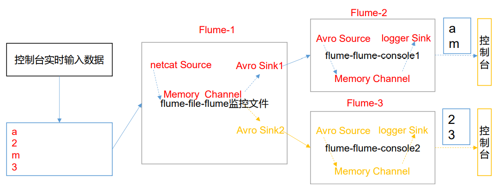

3）实现步骤  

1.创建一个 maven 项目，并引入以下依赖。

```xml
<dependency>
 <groupId>org.apache.flume</groupId>
 <artifactId>flume-ng-core</artifactId>
 <version>1.7.0</version>
</dependency>
```

2.定义 CustomInterceptor 类并实现 Interceptor 接口。

```java
package com.dsjprs.flume.interceptor;
import org.apache.flume.Context;
import org.apache.flume.Event;
import org.apache.flume.interceptor.Interceptor;
import java.util.List;
public class CustomInterceptor implements Interceptor {
 @Override
 public void initialize() {
 }
 @Override
 public Event intercept(Event event) {
 	byte[] body = event.getBody();
 	if (body[0] < 'z' && body[0] > 'a') {
 		event.getHeaders().put("type", "letter");
	 } else if (body[0] > '0' && body[0] < '9') {
 		event.getHeaders().put("type", "number");
	 }
 	return event;
 }
 @Override
 public List<Event> intercept(List<Event> events) {
 	for (Event event : events) {
 		intercept(event);
	}
 	return events;
 }
 @Override
 public void close() {
 }
 public static class Builder implements Interceptor.Builder {
 @Override
 public Interceptor build() {
 	return new CustomInterceptor();
 }
 @Override
 public void configure(Context context) {
 	}
 }
}
```

3.编辑 flume 配置文件 为 hadoop102 上的 Flume1 配置 1 个 netcat source，1 个 sink group（2 个 avro sink）， 并配置相应的 ChannelSelector 和 interceptor。

```sh
# Name the components on this agent
a1.sources = r1
a1.sinks = k1 k2
a1.channels = c1 c2
# Describe/configure the source
a1.sources.r1.type = netcat
a1.sources.r1.bind = localhost
a1.sources.r1.port = 44444
a1.sources.r1.interceptors = i1
a1.sources.r1.interceptors.i1.type = 
com.atguigu.flume.interceptor.CustomInterceptor$Builder
a1.sources.r1.selector.type = multiplexing
a1.sources.r1.selector.header = type
a1.sources.r1.selector.mapping.letter = c1
a1.sources.r1.selector.mapping.number = c2
# Describe the sink
a1.sinks.k1.type = avro
a1.sinks.k1.hostname = hadoop103
a1.sinks.k1.port = 4141
a1.sinks.k2.type=avro
a1.sinks.k2.hostname = hadoop104
a1.sinks.k2.port = 4242
# Use a channel which buffers events in memory
a1.channels.c1.type = memory
a1.channels.c1.capacity = 1000
a1.channels.c1.transactionCapacity = 100
# Use a channel which buffers events in memory
a1.channels.c2.type = memory
a1.channels.c2.capacity = 1000
a1.channels.c2.transactionCapacity = 100
# Bind the source and sink to the channel
a1.sources.r1.channels = c1 c2
a1.sinks.k1.channel = c1
a1.sinks.k2.channel = c2
为 hadoop103 上的 Flume2 配置一个 avro source 和一个 logger sink。
a1.sources = r1
a1.sinks = k1
a1.channels = c1
a1.sources.r1.type = avro
a1.sources.r1.bind = hadoop103
a1.sources.r1.port = 4141
a1.sinks.k1.type = logger
a1.channels.c1.type = memory
a1.channels.c1.capacity = 1000
a1.channels.c1.transactionCapacity = 100
a1.sinks.k1.channel = c1
a1.sources.r1.channels = c1
```

```sh
# 为 hadoop104 上的 Flume3 配置一个 avro source 和一个 logger sink。
a1.sources = r1
a1.sinks = k1
a1.channels = c1
a1.sources.r1.type = avro
a1.sources.r1.bind = hadoop104
a1.sources.r1.port = 4242
a1.sinks.k1.type = logger
a1.channels.c1.type = memory
a1.channels.c1.capacity = 1000
a1.channels.c1.transactionCapacity = 100
a1.sinks.k1.channel = c1
a1.sources.r1.channels = c1
```

4.分别在 hadoop102，hadoop103，hadoop104 上启动 flume 进程，注意先后顺序。 


5.在 hadoop102 使用 netcat 向 localhost:44444 发送字母和数字。 


6.观察 hadoop103 和 hadoop104 打印的日志。


### 自定义 Source

1)介绍  Source 是负责接收数据到 Flume Agent 的组件。Source 组件可以处理各种类型、各种 格式的日志数据，包括 avro、thrift、exec、jms、spooling directory、netcat、sequence  generator、syslog、http、legacy。


官方提供的 source 类型已经很多，但是有时候并不能 满足实际开发当中的需求，此时我们就需要根据实际需求自定义某些 source。 


官方也提供了自定义 source 的接口：https://flume.apache.org/FlumeDeveloperGuide.html#source 根据官方说明自定义 MySource 需要继承 AbstractSource 类并实现 Configurable 和 PollableSource 接口。


实现相应方法： 

getBackOffSleepIncrement()//暂不用 

getMaxBackOffSleepInterval()//暂不用 

configure(Context context)//初始化 

context（读取配置文件内容） process()//获取数据封装成 event 并写入 channel，这个方法将被循环调用。 


使用场景：读取 MySQL 数据或者其他文件系统。


2)需求  使用 flume 接收数据，并给每条数据添加前缀，输出到控制台。前缀可从 flume 配置文 件中配置。

**自定义Source需求**

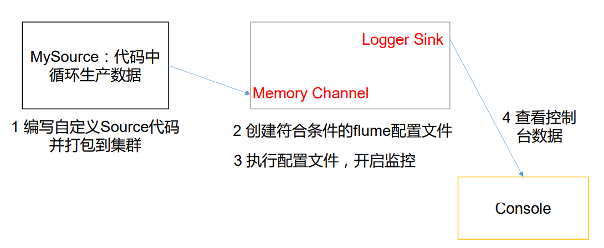

3)分析

**自定义Source需求分析**

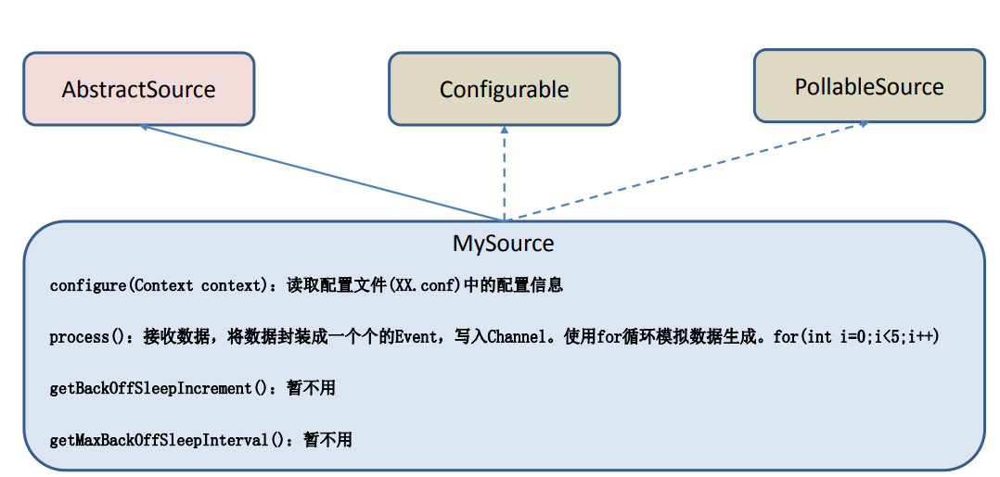

4)编码  导入 pom 依赖

```xml
<dependencies>
 <dependency>
 <groupId>org.apache.flume</groupId>
 <artifactId>flume-ng-core</artifactId>
 <version>1.7.0</version>
</dependency>
</dependencies>
```

编写代码 

```java
package com.dsjprs;

import org.apache.flume.Context;
import org.apache.flume.EventDeliveryException;
import org.apache.flume.PollableSource;
import org.apache.flume.conf.Configurable;
import org.apache.flume.event.SimpleEvent;
import org.apache.flume.source.AbstractSource;
import java.util.HashMap;
public class MySource extends AbstractSource implements Configurable, PollableSource {
 	//定义配置文件将来要读取的字段
 	private Long delay;
 	private String field;
	 //初始化配置信息
 	@Override
 	public void configure(Context context) {
 		delay = context.getLong("delay");
		 field = context.getString("field", "Hello!");
 	}
 	@Override
 	public Status process() throws EventDeliveryException {
 		try {
 			//创建事件头信息
 			HashMap<String, String> hearderMap = new HashMap<>();
 			//创建事件
 			SimpleEvent event = new SimpleEvent();
 			//循环封装事件
 			for (int i = 0; i < 5; i++) {
 				//给事件设置头信息
 				event.setHeaders(hearderMap);
 				//给事件设置内容
 				event.setBody((field + i).getBytes());
 				//将事件写入 channel
 				getChannelProcessor().processEvent(event);
				Thread.sleep(delay);
 			}
 		} catch (Exception e) {
 			e.printStackTrace();
 			return Status.BACKOFF;
 		}
	 return Status.READY;
 	}
 	@Override
 	public long getBackOffSleepIncrement() {
 		return 0;
	 }
	 @Override
	 public long getMaxBackOffSleepInterval() {
 		return 0;
	 }
}
```

5)测试  

1.打包 将写好的代码打包，并放到 flume 的 lib 目录（/opt/module/flume）下。 

2.配置文件

```sh
# Name the components on this agent
a1.sources = r1
a1.sinks = k1
a1.channels = c1
# Describe/configure the source
a1.sources.r1.type = com.atguigu.MySource
a1.sources.r1.delay = 1000
#a1.sources.r1.field = atguigu
# Describe the sink
a1.sinks.k1.type = logger
# Use a channel which buffers events in memory
a1.channels.c1.type = memory
a1.channels.c1.capacity = 1000
a1.channels.c1.transactionCapacity = 100
# Bind the source and sink to the channel
a1.sources.r1.channels = c1
a1.sinks.k1.channel = c1
```

3.开启任务

```sh
[dsjprs@hadoop102 flume]$ pwd
/opt/module/flume
[dsjprs@hadoop102 flume]$ bin/flume-ng agent -c conf/ -f 
job/mysource.conf -n a1 -Dflume.root.logger=INFO,console
```

### 自定义 Sink

1）介绍  Sink 不断地轮询 Channel 中的事件且批量地移除它们，并将这些事件批量写入到存储 或索引系统、或者被发送到另一个 Flume Agent。 Sink 是完全事务性的。


在从 Channel 批量删除数据之前，每个 Sink 用 Channel 启动一 个事务。批量事件一旦成功写出到存储系统或下一个 Flume Agent，Sink 就利用 Channel 提 交事务。


事务一旦被提交，该 Channel 从自己的内部缓冲区删除事件。

Sink 组件目的地包括 hdfs、logger、avro、thrift、ipc、file、null、HBase、solr、 自定义。


官方提供的 Sink 类型已经很多，但是有时候并不能满足实际开发当中的需求，此 时我们就需要根据实际需求自定义某些 Sink。 


官方也提供了自定义 sink 的接口： https://flume.apache.org/FlumeDeveloperGuide.html#sink 根据官方说明自定义 MySink 需要继承 AbstractSink 类并实现 Configurable 接口。 


实现相应方法： configure(Context context)//初始化 context（读取配置文件内容） process()//从 Channel 读取获取数据（event），这个方法将被循环调用。 


使用场景：读取 Channel 数据写入 MySQL 或者其他文件系统。 2）需求  使用 flume 接收数据，并在 Sink 端给每条数据添加前缀和后缀，输出到控制台。前后 缀可在 flume 任务配置文件中配置。 流程分析：

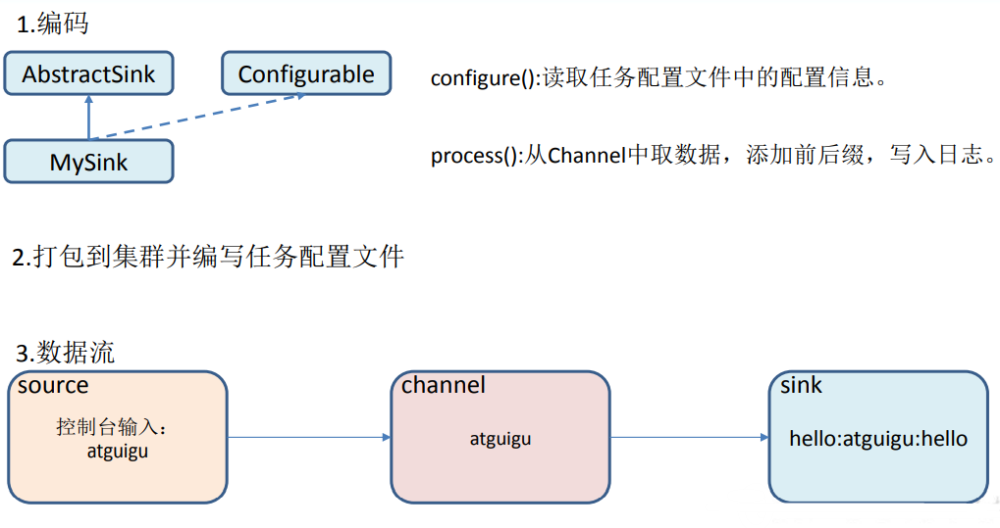


3）编码

```java
package com.dsjprs;
import org.apache.flume.*;
import org.apache.flume.conf.Configurable;
import org.apache.flume.sink.AbstractSink;
import org.slf4j.Logger;
import org.slf4j.LoggerFactory;
public class MySink extends AbstractSink implements Configurable {
 	//创建 Logger 对象
 	private static final Logger LOG = LoggerFactory.getLogger(AbstractSink.class);
 	private String prefix;
 	private String suffix;
 	@Override
 	public Status process() throws EventDeliveryException {
 		//声明返回值状态信息
 		Status status;
 		//获取当前 Sink 绑定的 Channel
 		Channel ch = getChannel();
 		//获取事务
 		Transaction txn = ch.getTransaction();
 		//声明事件
		Event event;
 		//开启事务
 		txn.begin();
 		//读取 Channel 中的事件，直到读取到事件结束循环
 		while (true) {
     		event = ch.take();
 			if (event != null) {
 				break;
			 }
 		}
 	try {
 		//处理事件（打印）
 		LOG.info(prefix + new String(event.getBody()) + suffix);
 		//事务提交
 		txn.commit();
 		status = Status.READY;
 	} catch (Exception e) {
		 //遇到异常，事务回滚
 		txn.rollback();
 		status = Status.BACKOFF;
 	} finally {
 		//关闭事务
 		txn.close();
 	}
 		return status;
 	}
 	@Override
 	public void configure(Context context) {
 		//读取配置文件内容，有默认值
 		prefix = context.getString("prefix", "hello:");
 		//读取配置文件内容，无默认值
		suffix = context.getString("suffix");
 	}
}
```

4）测试  

1.打包 将写好的代码打包，并放到 flume 的 lib 目录（/opt/module/flume）下。 


2.配置文件

```sh
# Name the components on this agent
a1.sources = r1
a1.sinks = k1
a1.channels = c1
# Describe/configure the source
a1.sources.r1.type = netcat
a1.sources.r1.bind = localhost
a1.sources.r1.port = 44444
# Describe the sink
a1.sinks.k1.type = com.atguigu.MySink
#a1.sinks.k1.prefix = atguigu:
a1.sinks.k1.suffix = :atguigu
# Use a channel which buffers events in memory
a1.channels.c1.type = memory
a1.channels.c1.capacity = 1000
a1.channels.c1.transactionCapacity = 100
# Bind the source and sink to the channel
a1.sources.r1.channels = c1
a1.sinks.k1.channel = c1
```

3.开启任务

```sh
[dsjprs@hadoop102 flume]$ bin/flume-ng agent -c conf/ -f 
job/mysink.conf -n a1 -Dflume.root.logger=INFO,console
[dsjprs@hadoop102 ~]$ nc localhost 44444
hello
OK
dsjprs
OK
```

## Flume 数据流监控

### Ganglia 的安装与部署

1.安装 httpd 服务与 php

```sh
[dsjprs@hadoop102 flume]$ sudo yum -y install httpd php
```

2.安装其他依赖 

```sh
[dsjprs@hadoop102 flume]$ sudo yum -y install rrdtool perl-rrdtool 
rrdtool-devel
[dsjprs@hadoop102 flume]$ sudo yum -y install apr-devel
```

3.安装 ganglia

```sh
[dsjprs@hadoop102 flume]$ sudo rpm -Uvh 
http://dl.fedoraproject.org/pub/epel/6/x86_64/epel-release-6-8.noarch.rpm
[dsjprs@hadoop102 flume]$ sudo yum -y install ganglia-gmetad 
[dsjprs@hadoop102 flume]$ sudo yum -y install ganglia-web
[dsjprs@hadoop102 flume]$ sudo yum -y install ganglia-gmond
```

Ganglia 由 gmond、gmetad 和 gweb 三部分组成。 


gmond（Ganglia Monitoring Daemon）是一种轻量级服务，安装在每台需要收集指标 数据的节点主机上。使用 gmond，你可以很容易收集很多系统指标数据，如 CPU、内存、 磁盘、网络和活跃进程的数据等。 


gmetad（Ganglia Meta Daemon）整合所有信息，并将其以 RRD 格式存储至磁盘的服 务。 


gweb（Ganglia Web）Ganglia 可视化工具，gweb 是一种利用浏览器显示 gmetad 所存 储数据的 PHP 前端。在 Web 界面中以图表方式展现集群的运行状态下收集的多种不同指标 数据。


4.修改配置文件/etc/httpd/conf.d/ganglia.conf 

```sh
[dsjprs@hadoop102 flume]$ sudo vim /etc/httpd/conf.d/ganglia.conf
```

修改为红颜色的配置：

```xml
# Ganglia monitoring system php web frontend
Alias /ganglia /usr/share/ganglia
<Location /ganglia>
 Order deny,allow
 #Deny from all
 Allow from all
 # Allow from 127.0.0.1
 # Allow from ::1
 # Allow from .example.com
</Location>
```

5.修改配置文件/etc/ganglia/gmetad.conf

```sh
[dsjprs@hadoop102 flume]$ sudo vim /etc/ganglia/gmetad.conf
```

修改内容： data_source "hadoop102" 192.168.9.102

6.修改配置文件/etc/ganglia/gmond.conf 

```sh
[dsjprs@hadoop102 flume]$ sudo vim /etc/ganglia/gmond.conf 
修改为：
cluster {
 name = "hadoop102"
 owner = "unspecified"
 latlong = "unspecified"
 url = "unspecified"
}
udp_send_channel {
 #bind_hostname = yes # Highly recommended, soon to be default.
 # This option tells gmond to use a source 
address
 # that resolves to the machine's hostname. 
Without
 # this, the metrics may appear to come from any
# interface and the DNS names associated with
# those IPs will be used to create the RRDs.
 # mcast_join = 239.2.11.71
 host = 192.168.9.102
 port = 8649
 ttl = 1
}
udp_recv_channel {
 # mcast_join = 239.2.11.71
 port = 8649
bind = 192.168.9.102
 retry_bind = true
 # Size of the UDP buffer. If you are handling lots of metrics you 
really
 # should bump it up to e.g. 10MB or even higher.
 # buffer = 10485760
}
```

7.修改配置文件/etc/selinux/config

```sh
[dsjprs@hadoop102 flume]$ sudo vim /etc/selinux/config
修改为：
# This file controls the state of SELinux on the system.
# SELINUX= can take one of these three values:
# enforcing - SELinux security policy is enforced.
# permissive - SELinux prints warnings instead of enforcing.
# disabled - No SELinux policy is loaded.
SELINUX=disabled
# SELINUXTYPE= can take one of these two values:
# targeted - Targeted processes are protected,
# mls - Multi Level Security protection.
SELINUXTYPE=targeted
```

提示：selinux 本次生效关闭必须重启，如果此时不想重启，可以临时生效之：

```sh
[dsjprs@hadoop102 flume]$ sudo setenforce 0
```

8.启动 ganglia 

```sh
[dsjprs@hadoop102 flume]$ sudo service httpd start
[dsjprs@hadoop102 flume]$ sudo service gmetad start
[dsjprs@hadoop102 flume]$ sudo service gmond start
```

9.打开网页浏览 ganglia 页面 

提示：如果完成以上操作依然出现权限不足错误，请修改/var/lib/ganglia 目录的权限：

```sh
[dsjprs@hadoop102 flume]$ sudo chmod -R 777 /var/lib/ganglia
```

### 操作 Flume 测试监控

1.修改/opt/module/flume/conf 目录下的 flume-env.sh 配置： 

```sh
JAVA_OPTS="-Dflume.monitoring.type=ganglia
-Dflume.monitoring.hosts=192.168.9.102:8649
-Xms100m
-Xmx200m"
```

2.启动 Flume 任务 

```sh
[dsjprs@hadoop102 flume]$ bin/flume-ng agent \
--conf conf/ \
--name a1 \
--conf-file job/flume-netcat-logger.conf \
-Dflume.root.logger==INFO,console \
-Dflume.monitoring.type=ganglia \
-Dflume.monitoring.hosts=192.168.9.102:8649
```

3.发送数据观察 ganglia 监测图 

```sh
[dsjprs@hadoop102 flume]$ nc localhost 44444
```

样式如图：

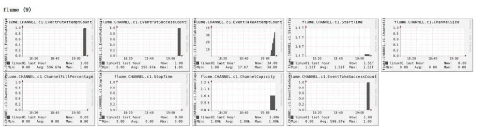


图例说明：

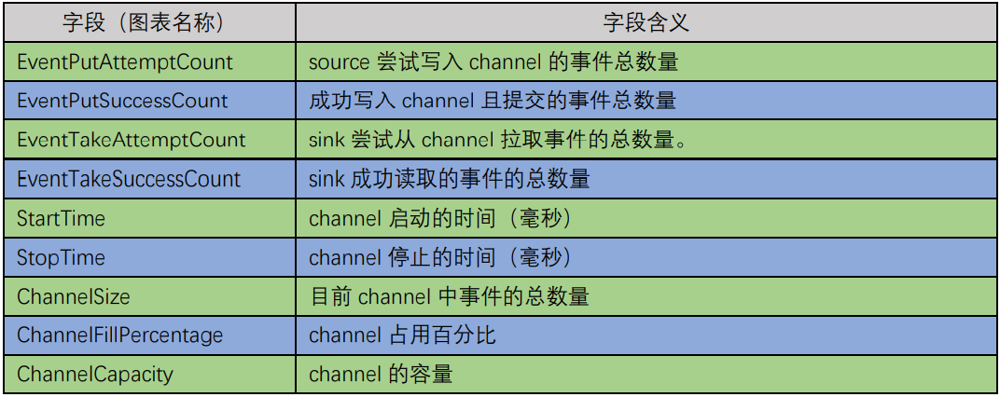


## 面试题

### 如何实现 Flume 数据传输的监控的?

使用第三方框架 Ganglia 实时监控 Flume。

### Flume 的 Source，Sink，Channel 的作用？ Source 是什么类 型？

1、作用 

（1）Source 组件是专门用来收集数据的，可以处理各种类型、各种格式的日志数据， 包括 avro、thrift、exec、jms、spooling directory、netcat、sequence generator、syslog、 http、legacy 

（2）Channel 组件对采集到的数据进行缓存，可以存放在 Memory 或 File 中。 

（3）Sink 组件是用于把数据发送到目的地的组件，目的地包括 HDFS、Logger、avro、 thrift、ipc、file、Hbase、solr、自定义。 


2、采用的 Source 类型为 

（1）监控后台日志：exec 

（2）监控后台产生日志的端口：netcat Exec spooldi


### Flume 的 Channel Selectors

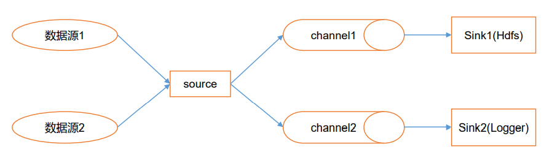


Channel Selectors，可以让不同的项目日志通过不同的Channel到不同的Sink中去。 


官方文档上Channel Selectors 有两种类型:Replicating Channel Selector (default)和 Multiplexing Channel Selector 这两种Selector的区别是:Replicating 会 将source过来的events发往所有channel,而 Multiplexing可以选择该发往哪些Channel。


### Flume 参数调优

1.Source 增加 Source 个（使用 Tair Dir Source 时可增加 FileGroups 个数）可以增大 Source 的读 取数据的能力。例如：当某一个目录产生的文件过多时需要将这个文件目录拆分成多个文件 目录，同时配置好多个 Source 以保证 Source 有足够的能力获取到新产生的数据。 batchSize 参数决定 Source 一次批量运输到 Channel 的 event 条数，适当调大这个参数 可以提高 Source 搬运 Event 到 Channel 时的性能。 


2.Channel type 选择 memory 时 Channel 的性能最好，但是如果 Flume 进程意外挂掉可能会丢失 数据。type 选择 file 时 Channel 的容错性更好，但是性能上会比 memory channel 差。 使用 file Channel 时 dataDirs 配置多个不同盘下的目录可以提高性能。 Capacity 参数决定 Channel 可容纳最大的 event 条数。transactionCapacity 参数决定每 次 Source 往 channel 里面写的最大 event 条数和每次 Sink 从 channel 里面读的最大 event 条数。transactionCapacity 需要大于 Source 和 Sink 的 batchSize 参数。 


3.Sink 增加 Sink 的个数可以增加 Sink 消费 event 的能力。Sink 也不是越多越好够用就行，过 多的 Sink 会占用系统资源，造成系统资源不必要的浪费。 batchSize 参数决定 Sink 一次批量从 Channel 读取的 event 条数，适当调大这个参数可 以提高 Sink 从 Channel 搬出 event 的性能。


### Flume 的事务机制

Flume 的事务机制（类似数据库的事务机制）：Flume 使用两个独立的事务分别负责从 Soucrce 到 Channel，以及从 Channel 到 Sink 的事件传递。比如 spooling directory source  为文件的每一行创建一个事件，一旦事务中所有的事件全部传递到 Channel 且提交成功，那 么 Soucrce 就将该文件标记为完成。同理，事务以类似的方式处理从 Channel 到 Sink 的传 递过程，如果因为某种原因使得事件无法记录，那么事务将会回滚。且所有的事件都会保持 到 Channel 中，等待重新传递。


### Flume 采集数据会丢失吗?

根据 Flume 的架构原理，Flume 是不可能丢失数据的，其内部有完善的事务机制， Source 到 Channel 是事务性的，Channel 到 Sink 是事务性的，因此这两个环节不会出现数 据的丢失，唯一可能丢失数据的情况是 Channel 采用 memoryChannel，agent 宕机导致数据 丢失，或者 Channel 存储数据已满，导致 Source 不再写入，未写入的数据丢失。 Flume 不会丢失数据，但是有可能造成数据的重复，例如数据已经成功由 Sink 发出， 但是没有接收到响应，Sink 会再次发送数据，此时可能会导致数据的重复。


