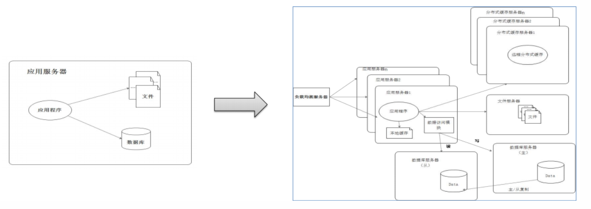
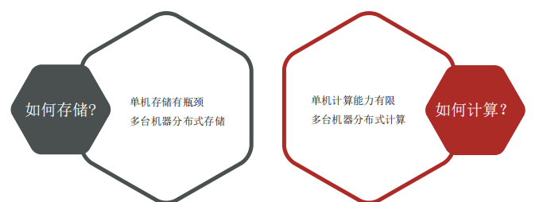
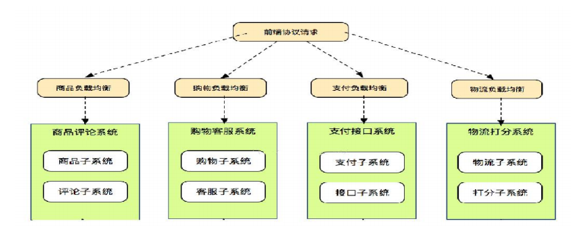
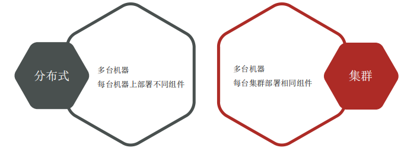
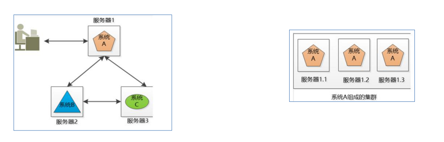
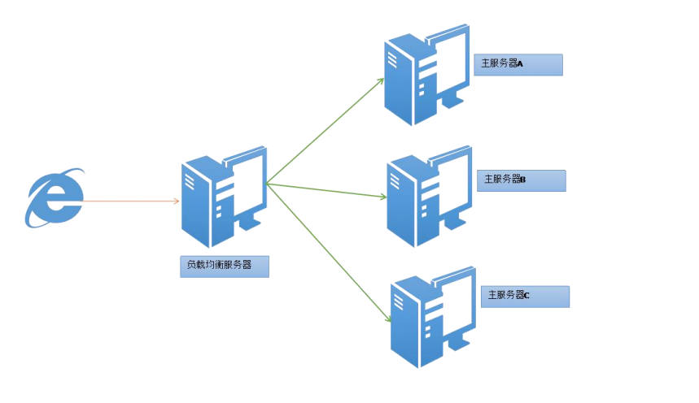
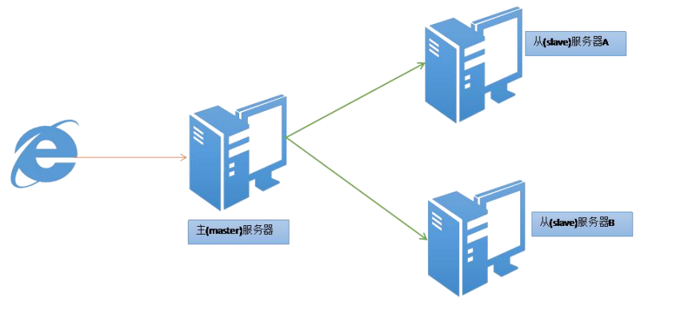

# 大数据导论

**大数据（big data）**
是指无法在一定时间范围内用常规软件工具进行捕捉、管理和处理的数据集合,是需要新处理模式才能具有更强的决策力、洞察发现力和流程优化能力的海量、高增长率和多样化的信息资产。

**数据** 

- 是事实或观察的结果 
- 是对客观事物的逻辑归纳 
- 是用于表示客观事物的未经加工的原始素材 

**数据存储单位**

1*Byte = 8bit 1K(千)=1024Byte 1MB（兆)=1024K 1G(吉)=1024M* 
*1T(太)=1024G 1P(拍)=1024T 1E(艾)=1024P 1Z(泽)=1024E* 
*1Y(尧)=1024Z 1B(布)=1024Y 1N(诺)=1024B 1D(刀)=1024N*

**大数据时代** 
最早提出“大数据”时代到来的是全球知名咨询公司麦肯锡，其称：“数据，已经渗透到当今每一个行业和业务职能领域，成为重要的生产因素。人们对于海量数据的挖掘和运用，预示着新一波生产率增长和消费者盈余浪潮的到来。”

**大数据的特点（5V特征）**

Volume：数据体量大

- 采集数据量大 
- 存储数据量大 
- 计算数据量大 
- TB、PB级别起步

Variety：种类、来源多样化

- 种类：结构化、半结构化、非结构化 
- 来源：日志文本、图片、音频、视频

Value：低价值密度

- 信息海量但是价值密度低 
- 深度复杂的挖掘分析需要机器学习参与

Velocity：速度快

- 数据增长速度快 
- 获取数据速度快 
- 数据处理速度快

Veracity：数据的质量

- 数据的准确性 
- 数据的可信赖度

**大数据应用场景**

* 电商领域 

  * 精准广告位、个性化推荐、大数据杀熟 

  

* 传媒领域 

  * 精准营销、猜你喜欢、交互推荐 

  

* 金融领域 

  * 信用评估、风险管控、客户细分、精细化营销

  

* 交通领域 
  * 拥堵预测、智能红绿灯、导航最优规划 

* 电信领域 
  * 基站选址优化、舆情监控、客户用户画像 

- 安防领域 
  - 犯罪预防、天网监控 

- 医疗领域 
  - 智慧医疗、疾病预防、病源追踪

**分布式技术简介：**

为什么需要分布式技术？

科学技术的发展推动下应用和系统架构的变迁：单机单一架构迈向多机分布式架构

数据大爆炸，海量数据处理场景面临问题

**分布式系统概述**

分布式系统是一个硬件或软件组件分布在不同的网络计算机上彼此之间仅仅通过消息传递进行通信和协调的系统一群互相独立计算机集合共同对外提供服务对于系统的用户来说，就像是一台计算机在提供服务。

**分布式（Distributed）、集群（Cluster）** 

分布式、集群是不同的概念：

分布式、集群的共同点是：多台机器 

**负载均衡（Load Balance）**

将负载（工作任务）进行平衡、分摊到多个操作单元上进行运行解决了单个无法处理所有任务，多个一起处理的问题

**故障转移（Fail Over）**

当活动的服务或应用意外终止时，快速启用冗余或备用的服务器、系统、硬件或者网络接替它们工作，故障转移系统也称之为容错系统，所谓容错指的是可以容忍错误的发生，故障转移的核心是设置备份 出现故障时主备切换，主备切换的前提是数据状态保持一致。

**伸缩性（Scalability）**

伸缩性也叫做弹性，可扩展性：指系统可以根据需求动态的扩容、缩容 

比如双十一业务高峰期间，增加服务器；业务低峰期，减少服务器

**总结：**

- 负载均衡：解决一个处理不下多个一起处理 
- 故障转移：解决单点故障 容忍错误发生 业务连续 
- 伸缩性：动态扩容、缩容
