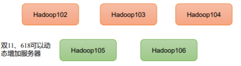

**发行版本**

Hadoop 发行版本分为开源社区版和商业版，社区版是指由 Apache 软件基金会维护的版本，是官方维护的版本体系。商业版 Hadoop 是指由第三方商业公司在社区版 Hadoop 基础上进行了一些修改、整合以及各个服务组件兼容性测试而发行的版本，比较著名的有 cloudera 的 CDH、mapR 等。
`社区版`：Apache Hadoop。后续如未说明都是指 Apache 版本。


Hadoop 的版本很特殊，是由多条分支并行的发展着。大的来看分为 3 个大的系列版本：1.x、2.x、3.x。


`Hadoop1.0` 由一个分布式文件系统 HDFS 和一个离线计算框架 MapReduce 组成。`Hadoop 2.0` 则包含一个支持 NameNode 横向扩展的 HDFS，一个资源管理系统YARN 和一个运行在 YARN 上的离线计算框架 MapReduce,相比于 Hadoop1.0，`Hadoop 2.0` 功能更加强大，且具有更好的扩展性、性能，并支持多种计算框架。


`Hadoop 3.0` 相比之前的 Hadoop 2.0 有一系列的功能增强。但目前还是个
alpha 版本，有很多 bug，且不能保证 API 的稳定和质量。


`Hadoop` **特性优点**

**扩容能力（Scalable）**

Hadoop 是在可用的计算机集群间分配数据并完成计算任务的，这些集群可用方便的扩展到数以千计的节点中。


**成本低（Economical）**

Hadoop 通过普通廉价的机器组成服务器集群来分发以及处理数据，以至于成本很低。


**高效率（Efficient）**

通过并发数据，Hadoop 可以在节点之间动态并行的移动数据，使得速度非常快。


**可靠性（Rellable）**

能自动维护数据的多份复制，并且在任务失败后能自动地重新部署（redeploy）计算任务。所以 Hadoop 的按位存储和处理数据的能力值得人们信赖。


**大数据特点**

**Volume（大量）**
截至目前，人类生产的所有印刷材料的数据量是200PB，而历史上全人类总共说过的话的数据量大约是5EB。当前，典型个人计算机硬盘的容量为TB量级，而一些大企业的数据量已经接近EB量级。


**Velocity（高速）**
这是大数据区分于传统数据挖掘的最显著特征。根据IDC的“数字宇宙”的报告，预计到2025年，全球数据使用量将达到163ZB。在如此海量的数据面前，处理数据的效率就是企业的生命。


**Variety（多样）**
这种类型的多样性也让数据被分为结构化数据和非结构化数据。相对于以往便于存储的以数据库/文本为主的结构化数据，非结构化数据越来越多，包括网络日志、音频、视频、图片、地理位置信息等，这些多类型的数据对数据的处理能力提出了更高要求。


**Value（低价值密度）**
价值密度的高低与数据总量的大小成反比。如何快速对有价值数据“提纯”成为目前大数据背景下待解决的难题。


**Hadoop 是什么？**
1）Hadoop是一个由Apache基金会所开发的分布式系统基础架构。
2）主要解决，海量数据的存储和海量数据的分析计算问题。
3）广义上来说，Hadoop通常是指一个更广泛的概念——Hadoop生态圈。


**分布式系统基础架构**
解决，海量数据的存储和海量数据的分析计算问题`Hadoop生态圈`

`Hadoop 发展历史:`

*1）Hadoop创始人Doug Cutting，为 了实 现与Google类似的全文搜索功能，他在Lucene框架基础上进行优 化升级，查询引擎和索引引擎。*


*2）2001年年底Lucene成为Apache基金会的一个子项目。*


*3）对于海量数据的场景，Lucene框 架面 对与Google同样的困难，存 储海量数据困难，检 索海 量速度慢。*


*4）学习和模仿Google解决这些问题的办法 ：微型版Nutch。*


*5）可以说Google是Hadoop的思想之源（Google在大数据方面的三篇论文）*
*GFS --->HDFS*
*Map-Reduce --->MR*
*BigTable --->HBase*


*6）2003-2004年，Google公开了部分GFS和MapReduce思想的细节，以此为基础Doug Cutting等人用 了2年业余时间实现了DFS和MapReduce机制，使Nutch性能飙升。*


*7）2005 年Hadoop 作为 Lucene的子项目 Nutch的一部分正式引入Apache基金会。* 


*8）2006 年 3 月份，Map-Reduce和Nutch Distributed File System （NDFS）分别被纳入到 Hadoop 项目 中，Hadoop就此正式诞生，标志着大数据时代来临。*


*9）名字来源于Doug Cutting儿子的玩具大象*


**Hadoop 三大发行版本：Apache、Cloudera、Hortonworks。**

Apache 版本最原始（最基础）的版本，对于入门学习最好。2006
官网地址：http://hadoop.apache.org 
下载地址：https://hadoop.apache.org/releases.html 


Cloudera 内部集成了很多大数据框架，对应产品 CDH。2008
官网地址：https://www.cloudera.com/downloads/cdh 
下载地址：https://docs.cloudera.com/documentation/enterprise/6/releasenotes/topics/rg_cdh_6_download.html


Hortonworks 文档较好，对应产品 HDP。2011
官网地址：https://hortonworks.com/products/data-center/hdp/ 
下载地址：https://hortonworks.com/downloads/#data-platform


**Hortonworks 现在已经被 Cloudera 公司收购，推出新的品牌 CDP。**


**Hadoop 优势（4 高）**
1）高可靠性：Hadoop底层维护多个数据副本，所以即使Hadoop某个计算元 素或存储出现故障，也不会导致数据的丢失。


2）高扩展性：在集群间分配任务数据，可方便的扩展数以千计的节点。




3）高效性：在MapReduce的思想下，Hadoop是并行工作的，以加快任务处 理速度


4）高容错性：能够自动将失败的任务重新分配。


**Hadoop 组成:**

Hadoop1.x、2.x、3.x区别,在 Hadoop1.x 时 代 ，Hadoop中 的MapReduce同时处理业务逻辑运算和资源的调度，耦合性较大。在Hadoop2.x时 代，增加 了Yarn。Yarn只负责资源的调 度 ，MapReduce 只负责运算。Hadoop3.x在组成上没有变化。


**HDFS 架构概述**

Hadoop Distributed File System，简称 HDFS，是一个分布式文件系统。 

`HDFS架构概述:`

1）NameNode（nn）：存储文件的元数据，如文件名，文件目录结构，文件属性（生成时间、副本数、 文件权限），以及每个文件的块列表和块所在的DataNode等。


2）DataNode(dn)：在本地文件系统存储文件块数据，以及块数据的校验和。


3）Secondary NameNode(2nn)：每隔一段时间对NameNode元数据备份。


`YARN 架构概述`
Yet Another Resource Negotiator 简称 YARN ，另一种资源协调者，是 Hadoop 的资源管理器。

1）ResourceManager（RM）：整个集群资源（内存、CPU等）的老大


2）NodeManager（N M）：单个节点服务器资源老大


3）ApplicationMaster（AM）：单个任务运行的老大


4）Container：容器，相当一台独立的服务器，里面封装了任务运行所需要的资源，如内存、CPU、磁盘、网络等。


*说明1：客户端可以有多个*
*说明2：集群上可以运行多个ApplicationMaster*
*说明3：每个NodeManager上可以有多个Container*


**MapReduce 架构概述**
MapReduce 将计算过程分为两个阶段：Map 和 Reduce
1）Map 阶段并行处理输入数据
2）Reduce 阶段对 Map 结果进行汇总


**HDFS、YARN、MapReduce 三者关系**


**大数据技术生态体系** 


**技术名词解释如下：**

1）Sqoop：Sqoop 是一款开源的工具，主要用于在 Hadoop、Hive 与传统的数据库（MySQL）间进行数据的传递，可以将一个关系型数据库（例如 ：MySQL，Oracle 等）中的数据导进到 Hadoop 的 HDFS 中，也可以将 HDFS 的数据导进到关系型数据库中。


2）Flume：Flume 是一个高可用的，高可靠的，分布式的海量日志采集、聚合和传输的系统，Flume 支持在日志系统中定制各类数据发送方，用于收集数据。


3）Kafka：Kafka 是一种高吞吐量的分布式发布订阅消息系统；


4）Spark：Spark 是当前最流行的开源大数据内存计算框架。可以基于 Hadoop 上存储的大数据进行计算。


5）Flink：Flink 是当前最流行的开源大数据内存计算框架。用于实时计算的场景较多。


6）Oozie：Oozie 是一个管理 Hadoop 作业（job）的工作流程调度管理系统。


7）Hbase：HBase 是一个分布式的、面向列的开源数据库。HBase 不同于一般的关系数据库，它是一个适合于非结构化数据存储的数据库。


8）Hive：Hive 是基于 Hadoop 的一个数据仓库工具，可以将结构化的数据文件映射为一张数据库表，并提供简单的 SQL 查询功能，可以将 SQL 语句转换为 MapReduce 任务进行运行。其优点是学习成本低，可以通过类 SQL 语句快速实现简单的 MapReduce 统计，不必开发专门的 MapReduce 应用，十分适合数据仓库的统计分析。


9）ZooKeeper：它是一个针对大型分布式系统的可靠协调系统，提供的功能包括：配置维护、
名字服务、分布式同步、组服务等。


**推荐系统项目框架**


# Hadoop开发环境搭建

- （1）修改主机名称

```sh
vim /etc/hostname
node01
```

- （2）配置用户具有 root 权限，方便后期加 sudo 执行 root 权限的命令

```sh
vim /etc/sudoers
## Allow root to run any commands anywhere
root ALL=(ALL) ALL
用户名 ALL=(ALL) ALL

## Allows people in group wheel to run all commands
%wheel ALL=(ALL) ALL
用户名 ALL=(ALL) ALL
```

* （3）配置IP、主机名映射

```sh
vi /etc/hosts
192.168.33.101 node01
192.168.33.102 node02
192.168.33.103 node03
```

**修改 windows 的主机映射文件（hosts 文件）**

```sh
192.168.33.101 node01
192.168.33.102 node02
192.168.33.103 node03
```


- （4）配置防火墙


```sh
#查看防火墙状态(Cenots6)
service iptables status
#关闭防火墙
service iptables stop
#查看防火墙开机启动状态
chkconfig iptables --list
#关闭防火墙开机启动
chkconfig iptables off
```

- 关闭selinux

```sh
vi /etc/selinux/config
disabled
```

- 关闭防火墙

```sh
# 查看防火墙状态（Centos7）
systemctl status firewalld

# 关闭防火墙
systemctl stop firewalld

# 永久关闭防火墙
systemctl disable firewalld
```

- 修改主机名配置文件

```sh
vi /etc/sysconfig/network
NETWORKING=yes
HOSUNAME=node01
```

- 修改DNS

```sh
vi /etc/resolv.conf
nameserver 192.168.244.2
```

- 重启网络服务

```sh
service network restart
```


- 配置yum镜像源

```sh
# CentOS-Base.repo
#
# The mirror system uses the connecting IP address of the client and thed
# update status of each mirror to pick mirrors that are updated to and
# geographically close to the client.  You should use this for CentOS updates
# unless you are manually picking other mirrors.
#
# If the mirrorlist= does not work for you, as a fall back you can try the
# remarked out baseurl= line instead.
#
#


[base]
name=CentOS-$releasever - Base
baseurl=https://mirrors.tuna.tsinghua.edu.cn/centos/$releasever/os/$basearch/
#mirrorlist=http://mirrorlist.centos.org/?release=$releasever&arch=$basearch&repo=os
enabled=1
gpgcheck=1
gpgkey=file:///etc/pki/rpm-gpg/RPM-GPG-KEY-7

#released updates
[updates]
name=CentOS-$releasever - Updates
baseurl=https://mirrors.tuna.tsinghua.edu.cn/centos/$releasever/updates/$basearch/
#mirrorlist=http://mirrorlist.centos.org/?release=$releasever&arch=$basearch&repo=updates
enabled=1
gpgcheck=1
gpgkey=file:///etc/pki/rpm-gpg/RPM-GPG-KEY-7


#additional packages that may be useful
[extras]
name=CentOS-$releasever - Extras
baseurl=https://mirrors.tuna.tsinghua.edu.cn/centos/$releasever/extras/$basearch/
#mirrorlist=http://mirrorlist.centos.org/?release=$releasever&arch=$basearch&repo=extras
enabled=1
gpgcheck=1
gpgkey=file:///etc/pki/rpm-gpg/RPM-GPG-KEY-7


#additional packages that extend functionality of existing packages
[centosplus]
name=CentOS-$releasever - Plus
baseurl=https://mirrors.tuna.tsinghua.edu.cn/centos/$releasever/centosplus/$basearch/
#mirrorlist=http://mirrorlist.centos.org/?release=$releasever&arch=$basearch&repo=centosplus
gpgcheck=1
enabled=0
gpgkey=file:///etc/pki/rpm-gpg/RPM-GPG-KEY-7
```

```sh
# 建立缓存
yum clean all
yum makecache

# 更新
yum update
```

（1）如果安装的精简版镜像，则安装

```sh
yum install -y epel-release
```


（2）安装 net-tool：工具包集合，包含ifconfig等命令

```sh
 yum install -y net-tools
```

（3）安装vim：编辑器

```sh
yum install -y vim
```

- 服务器系统设置同步时间

```sh
#手动同步集群各机器时间
date -s "2017-03-03 03:03:03"
yum install ntpdate
```

```sh
#网络同步时间
ntpdate cn.pool.ntp.org
```


- 配置 ssh 免密登陆

```sh
#生成 ssh 免登陆密钥
ssh-keygen -t rsa （四个回车）
# 执行完这个命令后，会生成 id_rsa（私钥）、id_rsa.pub（公钥）将公钥拷贝到要免密登陆的目标机器上
ssh-copy-id node01
ssh-copy-id node02
ssh-copy-id node03
```

**卸载虚拟机自带的 JDK**
注意：如果虚拟机是最小化安装不需要执行这一步。

```sh
rpm -qa | grep -i java | xargs -n1 rpm -e --nodeps 
rpm -qa：查询所安装的所有 rpm 软件包
grep -i：忽略大小写
xargs -n1：表示每次只传递一个参数
rpm -e –nodeps：强制卸载软件
```

**JDK 环境安装**

```sh
#上传 jdk 安装包
jdk-8u65-linux-x64.tar.gz

#解压安装包
tar zxvf jdk-8u65-linux-x64.tar.gz -C /root/apps

#配置环境变量 /etc/profile
export JAVA_HOME=/root/apps/jdk1.8.0_65
export PATH=$PATH:$JAVA_HOME/bin
export CLASSPATH=.:$JAVA_HOME/lib/dt.jar:$JAVA_HOME/lib/tools.jar

#刷新配置
source /etc/profile
```

7.Hadoop 安装包目录结构
Hadoop 对外提供的编程动态库和静态库，与 include 目录中的头文件结合使用。

|   bin   | Hadoop 最基本的管理脚本和使用脚本的目录，这些脚本是 sbin 目录下管理脚本的基础实现，用户可以直接使用这些脚本管理和使用 Hadoop。 |
| :-----: | :----------------------------------------------------------: |
|   etc   | Hadoop 配置文件所在的目录，包括 core-site,xml、hdfs-site.xml、mapred-site.xml 等从 Hadoop1.0 继承而来的配置文件和 yarn-site.xml 等Hadoop2.0 新增的配置文件。 |
| include | 对外提供的编程库头文件（具体动态库和静态库在 lib 目录中），这些头文件均是用 C++定义的，通常用于 C++程序访问 HDFS 或者编写 MapReduce程序。 |
|   lib   | 该目录包含libexec：各个服务对用的 shell 配置文件所在的目录，可用于配置日志输出、启动参数（比如 JVM 参数）等基本信息。 |
|  sbin   | Hadoop 管理脚本所在的目录，主要包含 HDFS 和 YARN 中各类服务的启动/关闭脚本。 |
|  share  |          Hadoop 各个模块编译后的 jar 包所在的目录。          |

安装Hadoop:

（1）解压

```sh
tar -zxvf hadoop-3.1.3.tar.gz -C /opt/module/ 
```

（2）配置Hadoop环境变量

```sh
#HADOOP_HOME
export HADOOP_HOME=/opt/module/hadoop-3.1.3
export PATH=$PATH:$HADOOP_HOME/bin
export PATH=$PATH:$HADOOP_HOME/sbin

# 使用Hadoop环境生效
source /etc/profile

# 输入查看：
hadoop
```


**Hadoop 运行模式**

1）Hadoop 官方网站：http://hadoop.apache.org/

2）Hadoop 运行模式包括：本地模式、伪分布式模式以及完全分布式模式。

> 本地模式：单机运行，只是用来演示一下官方案例。生产环境不用。

> 伪分布式模式：也是单机运行，但是具备 Hadoop 集群的所有功能，一台服务器模 拟一个分布式的环境。

> 完全分布式模式：多台服务器组成分布式环境。生产环境使用。


**Hadoop核心配置文件：**

（1）配置 core-site.xm：vim core-site.xml

```xml
<?xml version="1.0" encoding="UTF-8"?>
<?xml-stylesheet type="text/xsl" href="configuration.xsl"?>
<configuration>
 <!-- 指定 NameNode 的地址 -->
 <property>
 <name>fs.defaultFS</name>
 <value>hdfs://node01:8020</value>
 </property>
 <!-- 指定 hadoop 数据的存储目录 -->
 <property>
 <name>hadoop.tmp.dir</name>
 <value>/opt/module/hadoop-3.1.3/data</value>
 </property>
 <!-- 配置 HDFS 网页登录使用的静态用户为 atguigu -->
 <property>
 <name>hadoop.http.staticuser.user</name>
 <value>dsjprs</value>
 </property>
</configuration>
```


（2）HDFS 配置文件：vim hdfs-site.xml

```xml
<?xml version="1.0" encoding="UTF-8"?>
<?xml-stylesheet type="text/xsl" href="configuration.xsl"?>
<configuration>
<!-- nn web 端访问地址-->
<property>
 <name>dfs.namenode.http-address</name>
 <value>node01:9870</value>
 </property>
<!-- 2nn web 端访问地址-->
 <property>
 <name>dfs.namenode.secondary.http-address</name>
 <value>node03:9868</value>
 </property>
</configuration>
```

（3）YARN 配置文件：vim yarn-site.xml

```xml
<?xml version="1.0" encoding="UTF-8"?>
<?xml-stylesheet type="text/xsl" href="configuration.xsl"?>
<configuration>
 <!-- 指定 MR 走 shuffle -->
 <property>
 <name>yarn.nodemanager.aux-services</name>
 <value>mapreduce_shuffle</value>
 </property>
 <!-- 指定 ResourceManager 的地址-->
 <property>
 <name>yarn.resourcemanager.hostname</name>
 <value>hadoop103</value>
 </property>
 <!-- 环境变量的继承 -->
 <property>
 <name>yarn.nodemanager.env-whitelist</name>
<value>JAVA_HOME,HADOOP_COMMON_HOME,HADOOP_HDFS_HOME,HADOOP_CO
NF_DIR,CLASSPATH_PREPEND_DISTCACHE,HADOOP_YARN_HOME,HADOOP_MAP
RED_HOME</value>
 </property>
<!-- 开启日志聚集功能 -->
<property>
 <name>yarn.log-aggregation-enable</name>
 <value>true</value>
</property>
<!-- 设置日志聚集服务器地址 -->
<property>
 <name>yarn.log.server.url</name>
 <value>http://hadoop102:19888/jobhistory/logs</value>
</property>
<!-- 设置日志保留时间为 7 天 -->
<property>
 <name>yarn.log-aggregation.retain-seconds</name>
 <value>604800</value>
</property>
</configuration>

```

（4）MapReduce 配置文件：vim mapred-site.xm

```xml
<?xml version="1.0" encoding="UTF-8"?>
<?xml-stylesheet type="text/xsl" href="configuration.xsl"?>
<configuration>
<!-- 指定 MapReduce 程序运行在 Yarn 上 -->
 <property>
 <name>mapreduce.framework.name</name>
 <value>yarn</value>
 </property>
<!-- 历史服务器端地址 -->
<property>
 <name>mapreduce.jobhistory.address</name>
 <value>node02:10020</value>
</property>
<!-- 历史服务器 web 端地址 -->
<property>
 <name>mapreduce.jobhistory.webapp.address</name>
 <value>node02:19888</value>
</property>
</configuration>
```

（5）集群分发脚本: xsync

```sh
#!/bin/bash
#1. 判断参数个数
if [ $# -lt 1 ]
then
 echo Not Enough Arguement!
 exit;
fi
#2. 遍历集群所有机器
for host in ndoe01 node02 node03
do
 echo ==================== $host ====================
 #3. 遍历所有目录，挨个发送
 for file in $@
 do
 #4. 判断文件是否存在
 if [ -e $file ]
 then
 #5. 获取父目录
 pdir=$(cd -P $(dirname $file); pwd)
 #6. 获取当前文件的名称
 fname=$(basename $file)
 ssh $host "mkdir -p $pdir"
 rsync -av $pdir/$fname $host:$pdir
 else
 echo $file does not exists!
 fi
 done
done
```

（6）集群启动脚本: Hadoop.sh

```sh
#!/bin/bash
if [ $# -lt 1 ]
then
 echo "No Args Input..."
 exit ;
fi
case $1 in
"start")
 echo " =================== 启动 hadoop 集群 ==================="
 echo " --------------- 启动 hdfs ---------------"
 ssh node01 "/opt/module/hadoop-3.1.3/sbin/start-dfs.sh"
 echo " --------------- 启动 yarn ---------------"
 ssh ndoe02 "/opt/module/hadoop-3.1.3/sbin/start-yarn.sh"
 echo " --------------- 启动 historyserver ---------------"
 ssh ndoe3 "/opt/module/hadoop-3.1.3/bin/mapred --daemon start historyserver"
;;
"stop")
 echo " =================== 关闭 hadoop 集群 ==================="
 echo " --------------- 关闭 historyserver ---------------"
 ssh node01 "/opt/module/hadoop-3.1.3/bin/mapred --daemon stophistoryserver"
 echo " --------------- 关闭 yarn ---------------"
 ssh ndoe02 "/opt/module/hadoop-3.1.3/sbin/stop-yarn.sh"
 echo " --------------- 关闭 hdfs ---------------"
 ssh ndoe03 "/opt/module/hadoop-3.1.3/sbin/stop-dfs.sh"
;;
*)
 echo "Input Args Error..."
;;
esac
```

（7）jps查看脚本: jps

```sh
#!/bin/bash
for host in node01 node02 node03
do
 echo =============== $host ===============
 ssh $host jps
done
```

（8）配置文件分发

```sh
xsync /opt/module/hadoop-3.1.3/etc
```

启动集群
1）如果集群是第一次启动，需要在 hadoop102 节点格式化 NameNode（注意：格式化 NameNode，会产生新的集群 id，导致 NameNode 和 DataNode 的集群 id 不一致，集群找不到已往数据。如果集群在运行过程中报错，需要重新格式化 NameNode 的话，一定要先停止 namenode 和 datanode 进程，并且要删除所有机器的 data 和 logs 目录，然后再进行格式化。）

```sh
hdfs namenode -format
```

*Web 端查看 HDFS 的 NameNode*
*浏览器中输入：http://node01:9870*
*查看 HDFS 上存储的数据信息*

*Web 端查看 YARN 的 ResourceManager*
*浏览器中输入：http://node03:8088*
*查看 YARN 上运行的 Job 信息*

查看 JobHistory 
http://node02:19888/jobhistory


