# **HDFS 概述**

## HDFS 产出背景及定义

`HDFS 产生背景`
随着数据量越来越大，在一个操作系统存不下所有的数据，那么就分配到更多的操作系 统管理的磁盘中，但是不方便管理和维护，迫切需要一种系统来管理多台机器上的文件，这 就是分布式文件管理系统。HDFS 只是分布式文件管理系统中的一种。

 

`HDFS 定义`
HDFS（Hadoop Distributed File System），它是一个文件系统，用于存储文件，通过目录树来定位文件；其次，它是分布式的，由很多服务器联合起来实现其功能，集群中的服务器有各自的角色。


HDFS 的使用场景：适合一次写入，多次读出的场景。一个文件经过创建、写入和关闭之后就不需要改变。


HDFS 是 Hadoop Distribute File System 的简称，意为：Hadoop 分布式文 件系统。是 Hadoop 核心组件之一，作为最底层的分布式存储服务而存在。 分布式文件系统解决的问题就是大数据存储。它们是横跨在多台计算机上的 存储系统。分布式文件系统在大数据时代有着广泛的应用前景，它们为存储和处 理超大规模数据提供所需的扩展能力。


`HDFS 设计目标`

硬件故障是常态， HDFS 将有成百上千的服务器组成，每一个组成部分都有可能出现故障。因此故障的检测和自动快速恢复是 HDFS 的核心架构目标。


HDFS 上的应用与一般的应用不同，它们主要是以流式读取数据。HDFS 被设计成适合批量处理，而不是用户交互式的。相较于数据访问的反应时间，更注重数据访问的高吞吐量。


典型的 HDFS 文件大小是 GB 到 TB 的级别。所以，HDFS 被调整成支持大文件。它应该提供很高的聚合数据带宽，一个集群中支持数百个节点，一个集群中还应该支持千万级别的文件。


大部分 HDFS 应用对文件要求的是` write-one-read-many` 访问模型。一个文件`一旦创建、写入、关闭之后就不需要修改了`。这一假设简化了数据一致性问题，使高吞吐量的数据访问成为可能。


移动计算的代价比之移动数据的代价低。一个应用请求的计算，离它操作的数据越近就越高效，这在数据达到海量级别的时候更是如此。将计算移动到数据附近，比之将数据移动到应用所在显然更好。


在`异构的硬件和软件平台上的可移植性`。这将推动需要大数据集的应用更广泛地采用 HDFS 作为平台。


## **HDFS 优点**

### **HDFS优点**

- 高容错性
  - 数据自动保存多个副本。它通过增加副本的形式，提高容错性。
  
  
  
  -  某一个副本丢失以后，它可以自动恢复。
  
  
  
  

- 适合处理大数据

  * 数据规模：能够处理数据规模达到GB、TB、甚至PB级别的数据。

  * 文件规模：能够处理百万规模以上的文件数量，数量相当之大。

    

* 可构建在廉价机器上，通过多副本机制，提高可靠性

  - 不适合低延时数据访问，比如毫秒级的存储数据，是做不到的。

  

### **HDFS 缺点**

- 无法高效的对大量小文件进行存储。
  - 存储大量小文件的话，它会占用NameNode大量的内存来存储文件目录和 块信息。这样是不可取的，因为NameNode的内存总是有限的。
  - 小文件存储的寻址时间会超过读取时间，它违反了HDFS的设计目标。


- 不支持并发写入、文件随机修改。 
  -  一个文件只能有一个写，不允许多个线程同时写。
  - 仅支持数据append（追加），不支持文件的随机修改。

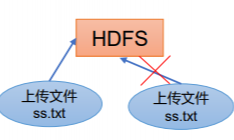

## **HDFS 组成架构**

1）NameNode（nn）：就是Master，它是一个主管、管理者。

（1）管理HDFS的名称空间；

（2）配置副本策略；

（3）管理数据块（Block）映射信息；

（4）处理客户端读写请求。


2）DataNode：就是Slave。NameNode下达命令，DataNode执行实际的操作。

（1）存储实际的数据块；

（2）执行数据块的读/写操作。

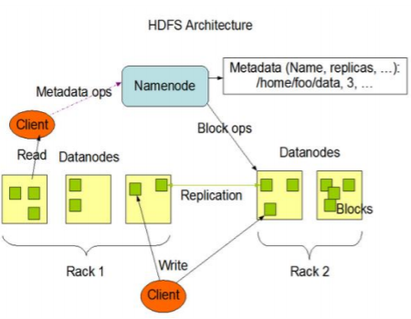

3）Client：就是客户端。

- 文件切分。文件上传HDFS的时候，Client将文件切分成一个一个的Block，然后进行上传；
- 与NameNode交互，获取文件的位置信息；
- 与DataNode交互，读取或者写入数据；
- Client提供一些命令来管理HDFS，比如NameNode格式化；
- Client可以通过一些命令来访问HDFS，比如对HDFS增删查改操作；


4）Secondary NameNode：并非NameNode的热备。当NameNode挂掉的时候

​	**它并不能马上替换NameNode并提供服务。**

- 辅助NameNode，分担其工作量，比如定期合并Fsimage和Edits，并推送给NameNode ；
- 在紧急情况下，可辅助恢复NameNode。


## **HDFS 文件块大小**

HDFS中的文件在物理上是分块存储（Block），块的大小可以通过配置参数 ( dfs.blocksize）来规定，默认大小在Hadoop2.x/3.x版本中是128M，1.x版本中是64M。

1）集群中的block

2）如果寻址时间约为10ms， 即查找到目标block的时间为 10ms。

3）寻址时间为传输时间的1% 时，则为最佳状态。（专家） 因此，传输时间 =10ms/0.01=1000ms=1s

4）而目前磁盘的传输速率普 遍为100MB/s。 

5） block大小 =1s*100MB/s=100MB

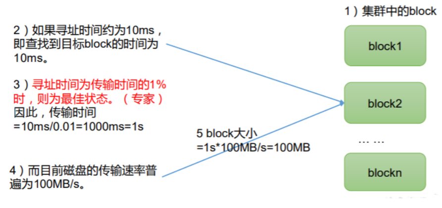

**为什么块的大小不能设置太小，也不能设置太大？**

（1）HDFS的块设置太小，会增加寻址时间，程序一直在找块的开始位置；

（2）如果块设置的太大，从磁盘传输数据的时间会明显大于定位这个块开 始位置所需的时间。导致程序在处理这块数据时，会非常慢。


**总结：HDFS块的大小设置主要取决于磁盘传输速率。**


## **HDFS 的 Shell 操作**

```sh
bin/hadoop fs
[-appendToFile <localsrc> ... <dst>]
 [-cat [-ignoreCrc] <src> ...]
 [-chgrp [-R] GROUP PATH...]
 [-chmod [-R] <MODE[,MODE]... | OCTALMODE> PATH...]
 [-chown [-R] [OWNER][:[GROUP]] PATH...]
 [-copyFromLocal [-f] [-p] <localsrc> ... <dst>]
 [-copyToLocal [-p] [-ignoreCrc] [-crc] <src> ... <localdst>]
 [-count [-q] <path> ...]
 [-cp [-f] [-p] <src> ... <dst>]
 [-df [-h] [<path> ...]]
 [-du [-s] [-h] <path> ...]
 [-get [-p] [-ignoreCrc] [-crc] <src> ... <localdst>]
 [-getmerge [-nl] <src> <localdst>]
 [-help [cmd ...]]
 [-ls [-d] [-h] [-R] [<path> ...]]
 [-mkdir [-p] <path> ...]
 [-moveFromLocal <localsrc> ... <dst>]
 [-moveToLocal <src> <localdst>]
 [-mv <src> ... <dst>]
 [-put [-f] [-p] <localsrc> ... <dst>]
 [-rm [-f] [-r|-R] [-skipTrash] <src> ...]
 [-rmdir [--ignore-fail-on-non-empty] <dir> ...]
<acl_spec> <path>]]
 [-setrep [-R] [-w] <rep> <path> ...]
[-stat [format] <path> ...]
 [-tail [-f] <file>]
 [-test -[defsz] <path>]
 [-text [-ignoreCrc] <src> ...]
```

```sh
1）启动 Hadoop 集群

sbin/start-dfs.sh
sbin/start-yarn.sh


2）-help：输出这个命令参数
hadoop fs -help rm

3）创建/sanguo 文件夹
hadoop fs -mkdir /sanguo

上传
1）-moveFromLocal：从本地剪切粘贴到 HDFS
vim shuguo.txt
hadoop fs -moveFromLocal ./shuguo.txt /sanguo 

2）-copyFromLocal：从本地文件系统中拷贝文件到 HDFS 路径去
vim weiguo.txt 
hadoop fs -copyFromLocal weiguo.txt /sanguo 

3）-put：等同于 copyFromLocal，生产环境更习惯用 put
vim wuguo.txt
hadoop fs -appendToFile liubei.txt /sanguo/shuguo.txt


下载
1）-copyToLocal：从 HDFS 拷贝到本地
hadoop fs -copyToLocal /sanguo/shuguo.txt ./ 

2）-get：等同于 copyToLocal，生产环境更习惯用 get
hadoop fs -get /sanguo/shuguo.txt ./shuguo2.txt


HDFS 直接操作
1）-ls: 显示目录信息
hadoop fs -ls /sanguo

2）-cat：显示文件内容
hadoop fs -cat /sanguo/shuguo.txt

3）-chgrp、-chmod、-chown：Linux 文件系统中的用法一样，修改文件所属权限
hadoop fs -chmod 666 /sanguo/shuguo.txt

hadoop fs -chown atguigu:atguigu /sanguo/shuguo.txt

4）-mkdir：创建路径
hadoop fs -mkdir /jinguo


5）-cp：从 HDFS 的一个路径拷贝到 HDFS 的另一个路径
hadoop fs -cp /sanguo/shuguo.txt /jinguo 


6）-mv：在 HDFS 目录中移动文件
hadoop fs -mv /sanguo/wuguo.txt /jinguo

hadoop fs -mv /sanguo/weiguo.txt /jinguo 

7）-tail：显示一个文件的末尾 1kb 的数据
hadoop fs -tail /jinguo/shuguo.txt

8）-rm：删除文件或文件夹
hadoop fs -rm /sanguo/shuguo.txt

9）-rm -r：递归删除目录及目录里面内容
hadoop fs -rm -r /sanguo

10）-du 统计文件夹的大小信息
hadoop fs -du -s -h /jinguo 27 81 /jinguo 

hadoop fs -du -h /jinguo
14 42 /jinguo/shuguo.txt
7 21 /jinguo/weiguo.txt
6 18 /jinguo/wuguo.tx
说明：27 表示文件大小；81 表示 27*3 个副本；/jinguo 表示查看的目录


11）-setrep：设置 HDFS 中文件的副本数量
hadoop fs -setrep 10 /jinguo/shuguo.txt
```

## **Hadoop API操作**

```java
// 创建 HdfsClient 类
public class HdfsClient {
 @Test
 public void testMkdirs() throws IOException, URISyntaxException,
InterruptedException {
 // 1 获取文件系统
Configuration configuration = new Configuration();
 // FileSystem fs = FileSystem.get(new
URI("hdfs://node01:8020"), configuration);
 FileSystem fs = FileSystem.get(new URI("hdfs://ndoe01:8020"),configuration,"dsjprs");
 // 2 创建目录
 fs.mkdirs(new Path("/xiyou/huaguoshan/"));
 // 3 关闭资源
 fs.close();
 }
}
```

```java
// 编写源代码
@Test
public void testCopyFromLocalFile() throws IOException,
InterruptedException, URISyntaxException {
 // 1 获取文件系统
 Configuration configuration = new Configuration();
 configuration.set("dfs.replication", "2");
 FileSystem fs = FileSystem.get(new URI("hdfs://node01:8020"),configuration, "dsjprs");
 // 2 上传文件
 fs.copyFromLocalFile(new Path("d:/sunwukong.txt"), newPath("/xiyou/huaguoshan"));
 // 3 关闭资源
 fs.close();
｝
```


```java
// HDFS 文件下载
@@Test
public void testCopyToLocalFile() throws IOException,InterruptedException, URISyntaxException{
 // 1 获取文件系统
 Configuration configuration = new Configuration();
 FileSystem fs = FileSystem.get(new URI("hdfs://node01:8020"),
configuration, "dsjprs");

 // 2 执行下载操作
 // boolean delSrc 指是否将原文件删除
 // Path src 指要下载的文件路径
 // Path dst 指将文件下载到的路径
 // boolean useRawLocalFileSystem 是否开启文件校验
 fs.copyToLocalFile(false, newPath("/xiyou/huaguoshan/sunwukong.txt"), new Path("d:/sunwukong2.txt"),true);

 // 3 关闭资源
 fs.close();
}
```

```java
// HDFS 文件更名和移动
@Test
public void testRename() throws IOException, InterruptedException,URISyntaxException{
// 1 获取文件系统
Configuration configuration = new Configuration();
FileSystem fs = FileSystem.get(new URI("hdfs://node01:8020"),
configuration, "dsjprs");
    
// 2 修改文件名称
fs.rename(new Path("/xiyou/huaguoshan/sunwukong.txt"), new
Path("/xiyou/huaguoshan/meihouwang.txt"));
    
// 3 关闭资源
fs.close();
}
```

```java
// HDFS 删除文件和目录
@Test
public void testDelete() throws IOException, InterruptedException,URISyntaxException{
// 1 获取文件系统
Configuration configuration = new Configuration();
FileSystem fs = FileSystem.get(new URI("hdfs://node01:8020"),
configuration, "dsjprs");
    
// 2 执行删除
fs.delete(new Path("/xiyou"), true);
    
// 3 关闭资源
fs.close();
}
```

```java
// HDFS 文件详情查看
@Test
public void testListFiles() throws IOException, InterruptedException,URISyntaxException {
// 1 获取文件系统
Configuration configuration = new Configuration();
FileSystem fs = FileSystem.get(new URI("hdfs://node01:8020"),
configuration, "dsjprs");
    
// 2 获取文件详情
RemoteIterator<LocatedFileStatus> listFiles = fs.listFiles(new Path("/"),true);
while (listFiles.hasNext()) {
LocatedFileStatus fileStatus = listFiles.next();
System.out.println("========" + fileStatus.getPath() + "=========");
System.out.println(fileStatus.getPermission());
System.out.println(fileStatus.getOwner());
System.out.println(fileStatus.getGroup());
System.out.println(fileStatus.getLen());
System.out.println(fileStatus.getModificationTime());
System.out.println(fileStatus.getReplication());
System.out.println(fileStatus.getBlockSize());
System.out.println(fileStatus.getPath().getName());
    
// 获取块信息
BlockLocation[] blockLocations = fileStatus.getBlockLocations();
System.out.println(Arrays.toString(blockLocations));
}
    
// 3 关闭资源
fs.close();
}
```

```java
// HDFS 文件和文件夹判断
@Test
public void testListStatus() throws IOException, InterruptedException,URISyntaxException{
 // 1 获取文件配置信息
 Configuration configuration = new Configuration();
 FileSystem fs = FileSystem.get(new URI("hdfs://node01:8020"),
configuration, "dsjprs");
    
 // 2 判断是文件还是文件夹
 FileStatus[] listStatus = fs.listStatus(new Path("/"));
 for (FileStatus fileStatus : listStatus) {
     
 // 如果是文件
 if (fileStatus.isFile()) {
 System.out.println("f:"+fileStatus.getPath().getName());
 }else {
 System.out.println("d:"+fileStatus.getPath().getName());
 	}
 }
    
 // 3 关闭资源
 fs.close();
}
```


## **HDFS 的读写流程**

### **HDFS的写数据流程**

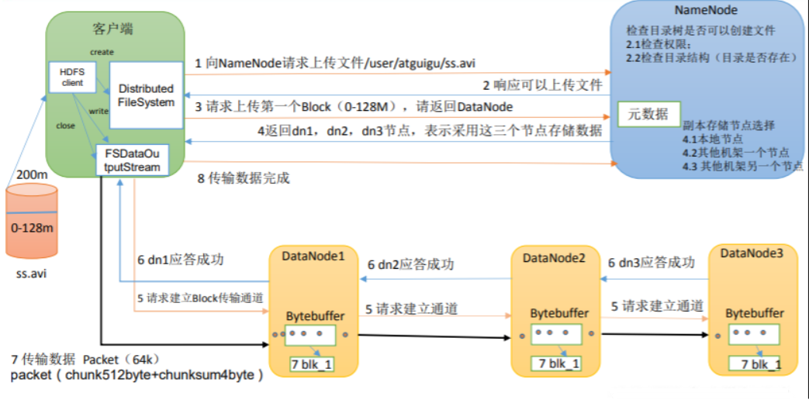

1 向NameNode请求上传文件/user/dsjprs/ss.avi

2 响应可以上传文件

3 请求上传第一个Block（0-128M），请返回DataNode

4 返回dn1，dn2，dn3节点，表示采用这三个节点存储数据

5 请求建立Block传输通道 5 请求建立通道 5 请求建立通道

6 dn1应答成功 6 dn2应答成功 6 dn3应答成功

7 传输数据 Packet（64k） packet（chunk512byte+chunksum4byte）

8 传输数据完成


HDFS完整写数据流程：

- 1.客户端通过 Distributed FileSystem 模块向 NameNode 请求上传文件，NameNode 检查目标文件是否已存	在，父目录是否存在。
- 2.NameNode 返回是否可以上传。


- 3.客户端请求第一个 Block 上传到哪几个 DataNode 服务器上。


- 4.NameNode 返回 3 个 DataNode 节点，分别为 dn1、dn2、dn3。


- 5.客户端通过 FSDataOutputStream 模块请求 dn1 上传数据，dn1 收到请求会继续调用dn2，然后 dn2 调用 	dn3，将这个通信管道建立完成。


- 6.dn1、dn2、dn3 逐级应答客户端。


- 7.客户端开始往 dn1 上传第一个 Block（先从磁盘读取数据放到一个本地内存缓存），以 Packet 为单位，dn1 收到一个 Packet 就会传给 dn2，dn2 传给 dn3；dn1 每传一个 packet会放入一个应答队列等待应答。


- 8.当一个 Block 传输完成之后，客户端再次请求 NameNode 上传第二个 Block 的服务
  器。（重复执行 3-7 步）。


### **网络拓扑-节点距离计算**

在 HDFS 写数据的过程中，NameNode 会选择距离待上传数据最近距离的 DataNode 接 收数据。

**那么这个最近距离怎么计算呢？**

节点距离：两个节点到达最近的共同祖先的距离总和。

Distance(/d1/r1/n0, /d1/r1/n0)=0（同一节点上的进程） 

Distance(/d1/r2/n0, /d1/r3/n2)=4（同一数据中心不同机架上的节点）

Distance(/d1/r1/n1, /d1/r1/n2)=2（同一机架上的不同节点） 

Distance(/d1/r2/n1, /d2/r4/n1)=6（不同数据中心的节点）

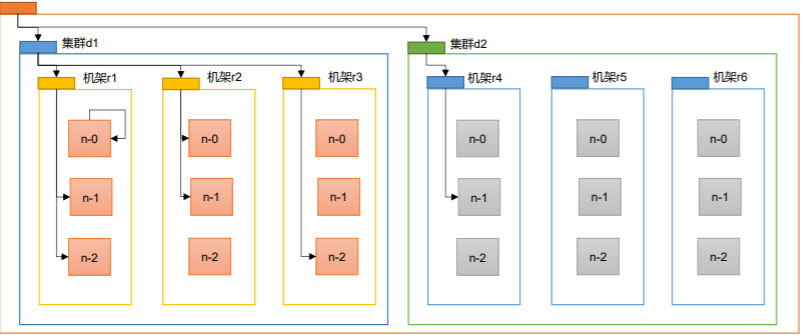


例如，假设有数据中心 d1 机架 r1 中的节点 n1。该节点可以表示为/d1/r1/n1。利用这种
标记，这里给出四种距离描述。
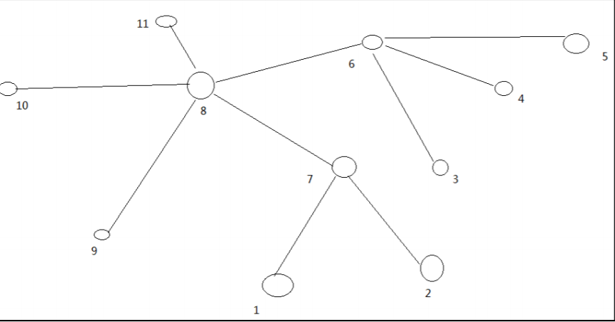

### **机架感知（副本存储节点选择）**

**第一个副本在Client所处的节点上。 如果客户端在集群外，随机选一个。**

**第二个副本在另一个机架的随机 一个节点**

**第三个副本在第二个副本所在机架的 随机节点**

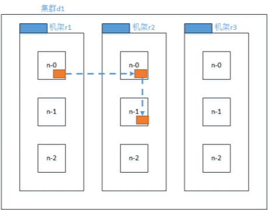


### **HDFS 读数据流程**

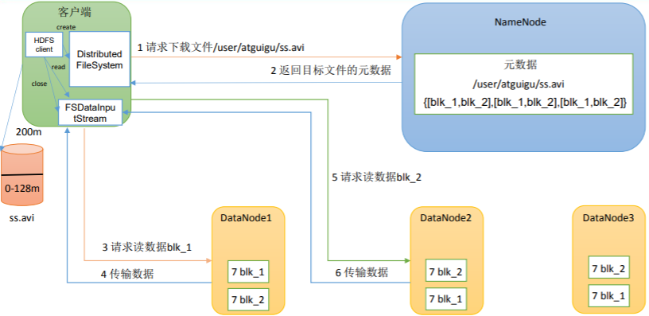

> **HDFS读取数据流程：**
>
> **1 请求下载文件**
> **2 返回目标文件的元数据**
> **3 请求读数据blk_1**
> **4 传输数据**
> **5 请求读数据blk_2**
> **6 传输数据**


HDFS完整读取数据流程：

- 客户端通过 DistributedFileSystem 向 NameNode 请求下载文件，NameNode 通过查询元数据，找到文件块所在的 DataNode 地址。


- 挑选一台 DataNode（就近原则，然后随机）服务器，请求读取数据。


- DataNode 开始传输数据给客户端（从磁盘里面读取数据输入流，以 Packet 为单位来做校验）。


- 客户端以 Packet 为单位接收，先在本地缓存，然后写入目标文件。


## **NameNode 和 SecondaryNameNode**

NN 和 2NN 工作机制
思考：NameNode 中的元数据是存储在哪里的？
如果存储在 NameNode 节点的磁盘中，因为经常需要进行随机访问，还有响应客户请求，必然是效率过低。因此，元数据需要存放在内存中。但如果只存在内存中，一旦断电，元数据丢失，整个集群就无法工作了。因此产生在磁盘中备份元数据的FsImage。


这样又会带来新的问题，当在内存中的元数据更新时，如果同时更新 FsImage，就会导致效率过低，但如果不更新，就会发生一致性问题，一旦 NameNode 节点断电，就会产生数据丢失。因此，引入 Edits 文件（只进行追加操作，效率很高）。每当元数据有更新或者添加元数据时，修改内存中的元数据并追加到 Edits 中。


这样，一旦 NameNode 节点断电，可以通过 FsImage 和 Edits 的合并，合成元数据。但是，如果长时间添加数据到 Edits 中，会导致该文件数据过大，效率降低，而且一旦断电，恢复元数据需要的时间过长。因此，需要定期进行 FsImage 和 Edits 的合并，如果这个操作由NameNode节点完成，又会效率过低。因此，引入一个新的节点SecondaryNamenode，专门用于 FsImage 和 Edits 的合并。

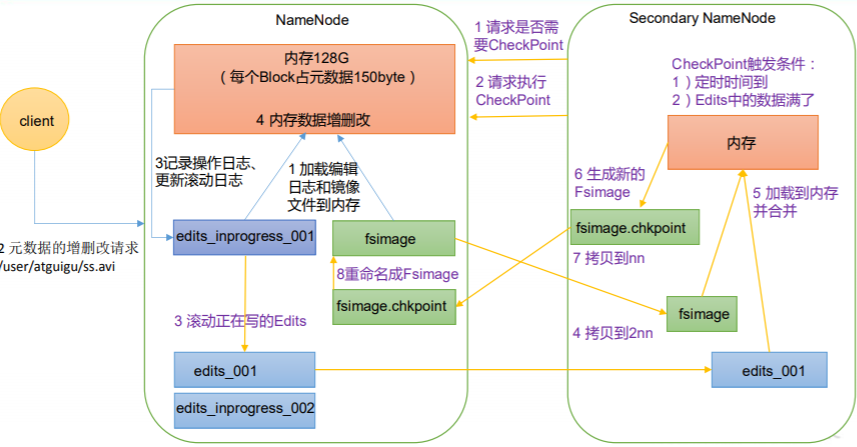


### **NameNode工作机制**
1 加载编辑 日志和镜像 文件到内存

2 元数据的增删改请求 /user/atguigu/ss.avi

3记录操作日志、 更新滚动日志

4 内存数据增删改


### **SecondaryNameNode工作机制**
1 请求是否需 要CheckPoint

2 请求执行 CheckPoint

3 滚动正在写的Edits

4 拷贝到2nn

5 加载到内存 并合并

6 生成新的 Fsimage

7 拷贝到nn

8 重命名成Fsimage


**CheckPoint触发条件：**

1）定时时间到

2）Edits中的数据满了


### **流程如下：**

1）第一阶段：NameNode 启动

（1）第一次启动 NameNode 格式化后，创建 Fsimage 和 Edits 文件。如果不是第一次启动，直接加载编辑日		 志和镜像文件到内存。

（2）客户端对元数据进行增删改的请求。

（3）NameNode 记录操作日志，更新滚动日志。

（4）NameNode 在内存中对元数据进行增删改。

2）第二阶段：Secondary NameNode 工作

（1）Secondary NameNode 询问 NameNode 是否需要 CheckPoint。直接带回 NameNode是否检查结果。

（2）Secondary NameNode 请求执行 CheckPoint。

（3）NameNode 滚动正在写的 Edits 日志。

（4）将滚动前的编辑日志和镜像文件拷贝到 Secondary NameNode。

（5）Secondary NameNode 加载编辑日志和镜像文件到内存，并合并。

（6）生成新的镜像文件 fsimage.chkpoint。

（7）拷贝 fsimage.chkpoint 到 NameNode。

（8）NameNode 将 fsimage.chkpoint 重新命名成 fsimage。


## **Fsimage 和 Edits 解析**

**Fsimage和Edits概念**

NameNode被格式化之后，将在/opt/module/hadoop-3.1.3/data/tmp/dfs/name/current目录中产生如下文件

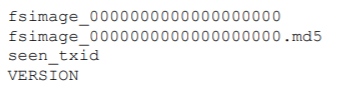


（1）Fsimage文件：HDFS文件系统元数据的一个永久性的检查点，其中包含HDFS文件系统的所有目录和文  	     件inode的序列化信息。

（2）Edits文件：存放HDFS文件系统的所有更新操作的路径，文件系统客户端执行的所有写操作首先会被记		 录到Edits文件中。

（3）seen_txid文件保存的是一个数字，就是最后一个edits_的数字

（4）每 次NameNode启动的时候都会将Fsimage文件读入内存，加 载Edits里面的更新操作，保证内存中的元数据信息是最新的、同步的，可以看成NameNode启动的时候就将Fsimage和Edits文件进行了合并。

```sh
1）oiv 查看 Fsimage 文件

（1）查看 oiv 和 oev 命令
hdfs
oiv apply the offline fsimage viewer to an fsimage
oev apply the offline edits viewer to an edits file

（2）基本语法
hdfs oiv -p 文件类型 -i 镜像文件 -o 转换后文件输出路径

（3）案例实操
pwd
hdfs oiv -p XML -i
fsimage_0000000000000000025 -o /opt/module/hadoop-3.1.3/fsimage.xml
cat /opt/module/hadoop-3.1.3/fsimage.xml


2）oev 查看 Edits 文件
（1）基本语法
hdfs oev -p 文件类型 -i 编辑日志 -o 转换后文件输出路径

（2）案例实操 
hdfs oev -p XML -i

edits_0000000000000000012-0000000000000000013 -o /opt/module/hadoop3.1.3/edits.xml
cat /opt/module/hadoop-3.1.3/edits.xml
```

## **NameNode 如何确定下次开机启动的时候合并哪些 Edits？**


1）通常情况下，SecondaryNameNode 每隔一小时执行一次。

[hdfs-default.xml]

```xml
<property>
 <name>dfs.namenode.checkpoint.period</name>
 <value>3600s</value>
</property>
```

2）一分钟检查一次操作次数，当操作次数达到 1 百万时，SecondaryNameNode 执行一次。

```xml
<property>
 <name>dfs.namenode.checkpoint.txns</name>
 <value>1000000</value>
<description>操作动作次数</description>
</property>
<property>
 <name>dfs.namenode.checkpoint.check.period</name>
 <value>60s</value>
<description> 1 分钟检查一次操作次数</description>
</property>
```

## **DataNode 工作机制**

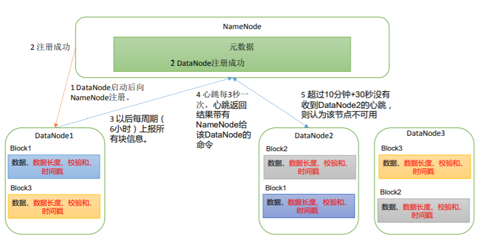

1 DataNode启动后向 NameNode注册。

2 注册成功（2 DataNode注册成功）

3 以后每周期（ 6小时）上报所 有块信息。

4 心跳每3秒一 次，心跳返回 结果带有 NameNode给 该DataNode的 命令

5 超过10分钟+30秒没有 收到DataNode2的心跳， 则认为该节点不可用

>一个数据块在 DataNode 上以文件形式存储在磁盘上，包括两个文件，一个是数据 本身，一个是元数据包括数据块的长度，块数据的校验和，以及时间戳。
>
>
>
>DataNode 启动后向 NameNode 注册，通过后，周期性（6 小时）的向 NameNode 上 报所有的块信息。
>
>
>
>心跳是每 3 秒一次，心跳返回结果带有 NameNode 给该 DataNode 的命令如复制块 数据到另一台机器，或删除某个数据块。如果超过 10 分钟没有收到某个 DataNode 的心跳， 则认为该节点不可用。
>
>
>
>集群运行中可以安全加入和退出一些机器。

```xml
DN 向 NN 汇报当前解读信息的时间间隔，默认 6 小时；


<property>
<name>dfs.blockreport.intervalMsec</name>
<value>21600000</value>
<description>Determines block reporting interval in
milliseconds.</description>
</property>

DN 扫描自己节点块信息列表的时间，默认 6 小时
<property>
<name>dfs.datanode.directoryscan.interval</name>
<value>21600s</value>
<description>Interval in seconds for Datanode to scan datadirectories and reconcile the difference between blocks in memory and on the disk.Support multiple time unit suffix(case insensitive), as described in dfs.heartbeat.interval.
</description>
</property>
```

### **DataNode 节点保证数据完整性的方法**。
（1）当 DataNode 读取 Block 的时候，它会计算 CheckSum。

（2）如果计算后的 CheckSum，与 Block 创建时值不一样，说明 Block 已经损坏。

（3）Client 读取其他 DataNode 上的 Block。

（4）常见的校验算法 crc（32），md5（128），sha1（160）

（5）DataNode 在其文件创建后周期验证 CheckSum。

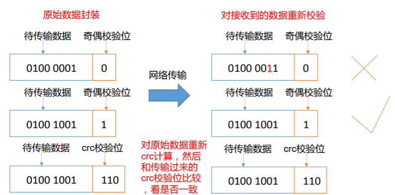


掉线时限参数设置

DataNode掉线时限参数设置

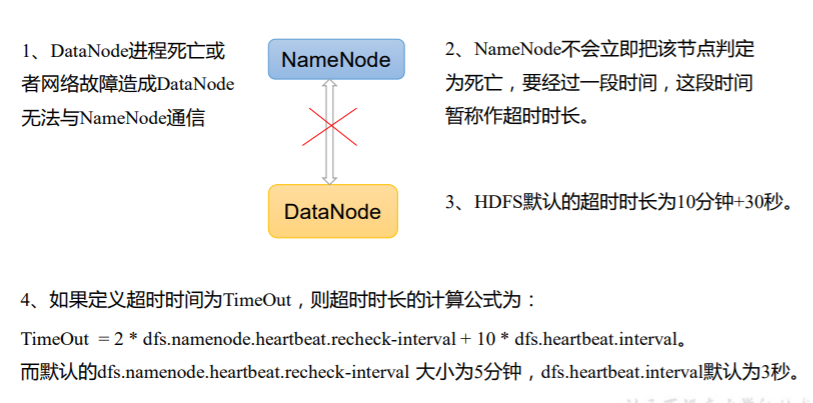

1、DataNode进程死亡或 者网络故障造成DataNode 无法与NameNode通信

2、NameNode不会立即把该节点判定 为死亡，要经过一段时间，这段时间 暂称作超时时长

3、HDFS默认的超时时长为10分钟+30秒。 

4、如果定义超时时间为TimeOut，则超时时长的计算公式为：
TimeOut = 2 * dfs.namenode.heartbeat.recheck-interval + 10 * dfs.heartbeat.interval。 

而默认的dfs.namenode.heartbeat.recheck-interval 大小为5分钟，dfs.heartbeat.interval默认为3秒。

需要注意的是 hdfs-site.xml 配置文件中的 heartbeat.recheck.interval 的单位为毫秒， dfs.heartbeat.interval 的单位为秒。

```xml
<property>
 <name>dfs.namenode.heartbeat.recheck-interval</name>
 <value>300000</value>
</property>
<property>
 <name>dfs.heartbeat.interval</name>
 <value>3</value>
</property>
```

## **HDFS 基本原理**

1． NameNode 概述

a、 NameNode 是 HDFS 的核心。

b、 NameNode 也称为 Master。

c、 NameNode 仅存储 HDFS 的元数据：文件系统中所有文件的目录树，并跟踪整个集群中的文件。

d、 NameNode 不存储实际数据或数据集。数据本身实际存储在 DataNodes 中。
e、 NameNode 知道 HDFS 中任何给定文件的块列表及其位置。使用此信息NameNode 知道如何从块中构建文件。
f、 NameNode 并不持久化存储每个文件中各个块所在的 DataNode 的位置信息，这些信息会在系统启动时从数据节点重建。
g、 NameNode 对于 HDFS 至关重要，当 NameNode 关闭时，HDFS / Hadoop 集群无法访问。

h、 NameNode 是 Hadoop 集群中的单点故障。

i、 NameNode 所在机器通常会配置有大量内存（RAM）

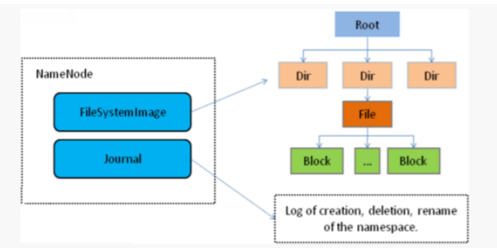


2． DataNode 概述

a、 DataNode 负责将实际数据存储在 HDFS 中。

b、 DataNode 也称为 Slave。

c、 NameNode 和 DataNode 会保持不断通信。

d、 DataNode 启动时，它将自己发布到 NameNode 并汇报自己负责持有的块列表。

e、 当某个 DataNode 关闭时，它不会影响数据或群集的可用性。NameNode 将安排由其他 DataNode 管理的块	  进行副本复制。

f、 DataNode 所在机器通常配置有大量的硬盘空间。因为实际数据存储在DataNode 中。

g、DataNode 会定期（dfs.heartbeat.interval 配置项配置，默认是 3 秒）向NameNode 发送心跳，如果			  	  NameNode 长时间没有接受到 DataNode 发送的心跳， NameNode 就会认为该 DataNode 失效。

h、 block 汇报时间间隔取参数 dfs.blockreport.intervalMsec,参数未配置的话默认为 6 小时.


3． HDFS 的工作机制 
NameNode 负责管理整个文件系统元数据；DataNode 负责管理具体文件数据块存储；Secondary NameNode 协助 NameNode 进行元数据的备份。

HDFS 的内部工作机制对客户端保持透明，客户端请求访问 HDFS 都是通过向NameNode 申请来进行。


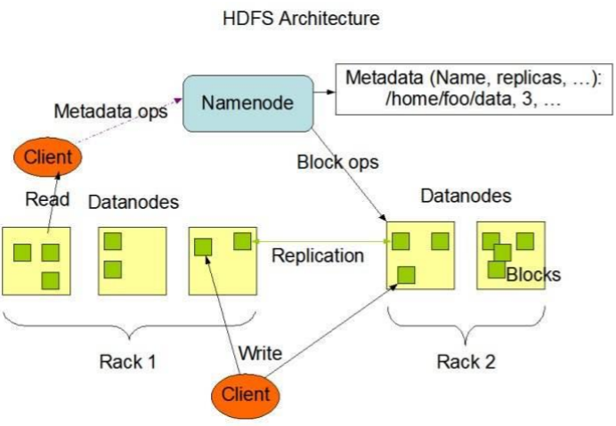


## **HDFS 写数据流程**
详细步骤解析： 
1、 client 发起文件上传请求，通过 RPC 与 NameNode 建立通讯，NameNode检查目标文件是否已存在，父目  		录是否存在，返回是否可以上传；


2、 client 请求第一个 block 该传输到哪些 DataNode 服务器上；


3、 NameNode 根据配置文件中指定的备份数量及机架感知原理进行文件分配，返回可用的 DataNode 的地址如：A，B，C；注：Hadoop 在设计时考虑到数据的安全与高效，数据文件默认在 HDFS 上存放三份，存储策略为本地一份，同机架内其它某一节点上一份，不同机架的某一节点上一份。


4、 client 请求 3 台 DataNode 中的一台 A 上传数据（本质上是一个 RPC 调用，建立 pipeline），A 收到请求会继续调用 B，然后 B 调用 C，将整个pipeline 建立完成，后逐级返回 client；


5、 client 开始往 A 上传第一个 block（先从磁盘读取数据放到一个本地内存缓存），以 packet 为单位（默认 64K），A 收到一个 packet 就会传给 B，B 传给 C；A 每传一个 packet 会放入一个应答队列等待应答。


6、 数据被分割成一个个 packet 数据包在 pipeline 上依次传输，在pipeline 反方向上，逐个发送 ack（命令正确应答），最终由 pipeline中第一个 DataNode 节点 A 将 pipeline ack 发送给 client;


7、 当一个 block 传输完成之后，client 再次请求 NameNode 上传第二个block 到服务器。


## **HDFS 读数据流程**
1、 Client 向 NameNode 发起 RPC 请求，来确定请求文件 block 所在的位置；


2、 NameNode会视情况返回文件的部分或者全部block列表，对于每个block，NameNode 都会返回含有该 block 副本的 DataNode 地址；


3、 这些返回的 DN 地址，会按照集群拓扑结构得出 DataNode 与客户端的距离，然后进行排序，排序两个规则：网络拓扑结构中距离 Client 近的排靠前；心跳机制中超时汇报的 DN 状态为 STALE，这样的排靠后；


4、 Client 选取排序靠前的 DataNode 来读取 block，如果客户端本身就是DataNode,那么将从本地直接获取数据；


5、 底层上本质是建立 Socket Stream（FSDataInputStream），重复的调用父类 DataInputStream 的 read 方法，直到这个块上的数据读取完毕；


6、 当读完列表的 block 后，若文件读取还没有结束，客户端会继续向NameNode 获取下一批的 block 列表；


7、 读取完一个 block 都会进行 checksum 验证，如果读取 DataNode 时出现错误，客户端会通知 NameNode，然后再从下一个拥有该 block 副本的DataNode 继续读。


8、 read 方法是并行的读取 block 信息，不是一块一块的读取；NameNode 只是返回Client请求包含块的DataNode地址，并不是返回请求块的数据；


9、 最终读取来所有的 block 会合并成一个完整的最终文件。


