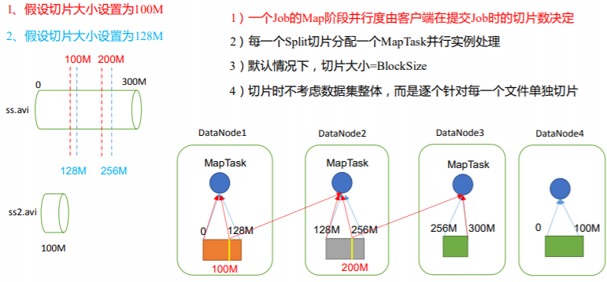

# MapReduce 概述
## MapReduce 定义:
MapReduce 是一个分布式运算程序的编程框架，是用户开发“基于 Hadoop 的数据分析应用”的核心框架。


MapReduce 核心功能是将用户编写的业务逻辑代码和自带默认组件整合成一个完整的分布式运算程序，并发运行在一个 Hadoop 集群上。


## **MapReduce 计算模型介绍**
MapReduce 的思想核心是“分而治之”，适用于大量复杂的任务处理场景（大规模数据处理场景）。即使是发布过论文实现分布式计算的谷歌也只是实现了这种思想，而不是自己原创。


Map 负责“分”，即把复杂的任务分解为若干个“简单的任务”来并行处理。可以进行拆分的前提是这些小任务可以并行计算，彼此间几乎没有依赖关系。Reduce 负责“合”，即对 map 阶段的结果进行全局汇总。


这两个阶段合起来正是 MapReduce 思想的体现。


解释 MapReduce：
数图书馆中的所有书。你数1号书架，你数2号书架。这就是“Map”。我们人越多，数书就更快。现在我们到一起，把所有人的统计数加在一起。这就是“Reduce”。


## **Hadoop MapReduce 设计构思**

MapReduce 是一个分布式运算程序的编程框架，核心功能是将用户编写的业 务逻辑代码和自带默认组件整合成一个完整的分布式运算程序，并发运行在 Hadoop 集群上。


**Hadoop MapReduce 构思体现在如下的三个方面：**

**如何对付大数据处理：分而治之**
对相互间不具有计算依赖关系的大数据，实现并行最自然的办法就是采取分 而治之的策略。并行计算的第一个重要问题是如何划分计算任务或者计算数据以 便对划分的子任务或数据块同时进行计算。不可分拆的计算任务或相互间有依赖 关系的数据无法进行并行计算！


## **构建抽象模型：Map 和 Reduce** 
MapReduce 借鉴了函数式语言中的思想，用 Map 和 Reduce 两个函数提供了
高层的并行编程抽象模型。


Map: 对一组数据元素进行某种重复式的处理；

Reduce: 对 Map 的中间结果进行某种进一步的结果整理。


MapReduce 中定义了如下的 Map 和 Reduce 两个抽象的编程接口，由用户去编程实现:

map: (k1; v1) → [(k2; v2)]

reduce: (k2; [v2]) → [(k3; v3)]


Map 和 Reduce 为程序员提供了一个清晰的操作接口抽象描述。通过以上两个编程接口，大家可以看出 MapReduce 处理的数据类型是<key,value>键值对。统一构架，隐藏系统层细节如何提供统一的计算框架，如果没有统一封装底层细节，那么程序员则需要 考虑诸如数据存储、划分、分发、结果收集、错误恢复等诸多细节；为此， MapReduce 设计并提供了统一的计算框架，为程序员隐藏了绝大多数系统层面的处理细节。


MapReduce 最大的亮点在于通过抽象模型和计算框架把需要做什么(what need to do)与具体怎么做(how to do)分开了，为程序员提供一个抽象和高层的编 程接口和框架。程序员仅需要关心其应用层的具体计算问题，仅需编写少量的处 理应用本身计算问题的程序代码。如何具体完成这个并行计算任务所相关的诸多 系统层细节被隐藏起来,交给计算框架去处理：从分布代码的执行，到大到数千小 到单个节点集群的自动调度使用。


## **MapReduce 框架结构**
一个完整的 mapreduce 程序在分布式运行时有三类实例进程：

1、MRAppMaster：负责整个程序的过程调度及状态协调

2、MapTask：负责 map 阶段的整个数据处理流程

3、ReduceTask：负责 reduce 阶段的整个数据处理流程


## **MapReduce 优缺点**

### **优点**

1）MapReduce 易于编程
它简单的实现一些接口，就可以完成一个分布式程序，这个分布式程序可以分布到大量 廉价的 PC 机器上运行。也就是说你写一个分布式程序，跟写一个简单的串行程序是一模一 样的。就是因为这个特点使得 MapReduce 编程变得非常流行。

2）良好的扩展性
当你的计算资源不能得到满足的时候，你可以通过简单的增加机器来扩展它的计算能力。

3）高容错性
MapReduce 设计的初衷就是使程序能够部署在廉价的 PC 机器上，这就要求它具有很高 的容错性。比如其中一台机器挂了，它可以把上面的计算任务转移到另外一个节点上运行， 不至于这个任务运行失败，而且这个过程不需要人工参与，而完全是由 Hadoop 内部完成的。

4）适合 PB 级以上海量数据的离线处理

可以实现上千台服务器集群并发工作，提供数据处理能力。


### **缺点**


1）不擅长实时计算

MapReduce 无法像 MySQL 一样，在毫秒或者秒级内返回结果。 

2）不擅长流式计算
流式计算的输入数据是动态的，而 MapReduce 的输入数据集是静态的，不能动态变化。 这是因为 MapReduce 自身的设计特点决定了数据源必须是静态的。

3）不擅长 DAG（有向无环图）计算多个应用程序存在依赖关系，后一个应用程序的输入为前一个的输出。在这种情况下， MapReduce 并不是不能做，而是使用后，每个 MapReduce 作业的输出结果都会写入到磁盘， 会造成大量的磁盘 IO，导致性能非常的低下。


## **MapReduce 核心思想**

统计其中每 一个单词出现的总 次数（查询结果： a-p一个文件，q-z 一个文件）
1）MapReduce运算程序一般需要分成2个阶段：Map阶段和Reduce阶段

2）Map阶段的并发MapTask，完全并行运行，互不相干

3）Reduce阶段的并发ReduceTask，完全互不相干，但是他们的数据依赖于上一个阶段的所有MapTask并
发实例的输出

4）MapReduce编程模型只能包含一个Map阶段和一个Reduce阶段，如果用户的业务逻辑非常复杂，那
就只能多个MapReduce程序，串行运行

1）读数据，并按行处理

2）按空格切分行内单词

3）KV键值对（单词，1）

4）将所有的KV键值对中的单词，按照单词首字母，分成2个分区溢写到磁盘


（1）分布式的运算程序往往需要分成至少 2 个阶段。

（2）第一个阶段的 MapTask 并发实例，完全并行运行，互不相干。

（3）第二个阶段的 ReduceTask 并发实例互不相干，但是他们的数据依赖于上一个阶段的所有 MapTask 并发实例的输出。

（4）MapReduce 编程模型只能包含一个 Map 阶段和一个 Reduce 阶段，如果用户的业务逻辑非常复杂，那就只能多个 MapReduce 程序，串行运行。


总结：分析 WordCount 数据流走向深入理解 MapReduce 核心思想。


## **MapReduce 进程**
一个完整的 MapReduce 程序在分布式运行时有三类实例进程：

（1）MrAppMaster：负责整个程序的过程调度及状态协调。

（2）MapTask：负责 Map 阶段的整个数据处理流程。

（3）ReduceTask：负责 Reduce 阶段的整个数据处理流程。


**常用数据序列化类型**


## **MapReduce 编程规范**

用户编写的程序分成三个部分：Mapper、Reducer 和 Driver。
1．Mapper阶段

（1）用户自定义的Mapper要继承自己的父类

（2）Mapper的输入数据是KV对的形式（KV的类型可自定义）

（3）Mapper中的业务逻辑写在map()方法中

（4）Mapper的输出数据是KV对的形式（KV的类型可自定义）


2．Reducer阶段

（1）用户自定义的Reducer要继承自己的父类

（2）Reducer的输入数据类型对应Mapper的输出数据类型，也是KV

（3）Reducer的业务逻辑写在reduce()方法中

（4）ReduceTask进程对每一组相同k的<k,v>组调用一次reduce()方法


3．Driver阶段 相当于YARN集群的客户端，用于提交我们整个程序到YARN集群，提交的是 封装了MapReduce程序相关运行参数的job对象


**需求：统计一堆文件中单词出现的个数（WordCount案例）**

环境准备
（1）创建 maven 工程，MapReduceDemo 
（2）在 pom.xml 文件中添加如下依赖

```xml
<dependencies>
 <dependency>
 <groupId>org.apache.hadoop</groupId>
 <artifactId>hadoop-client</artifactId>
 <version>3.1.3</version>
 </dependency>
 <dependency>
 <groupId>junit</groupId>
 <artifactId>junit</artifactId>
 <version>4.12</version>
 </dependency>
 <dependency>
 <groupId>org.slf4j</groupId>
 <artifactId>slf4j-log4j12</artifactId>
 <version>1.7.30</version>
 </dependency>
</dependencies>
```


**在项目的 src/main/resources 目录下，新建一个文件，命名为“log4j.properties”，在 文件中填入。** 

```properties
log4j.rootLogger=INFO, stdout
log4j.appender.stdout=org.apache.log4j.ConsoleAppender
log4j.appender.stdout.layout=org.apache.log4j.PatternLayout
log4j.appender.stdout.layout.ConversionPattern=%d %p [%c] - %m%n
log4j.appender.logfile=org.apache.log4j.FileAppender
log4j.appender.logfile.File=target/spring.log
log4j.appender.logfile.layout=org.apache.log4j.PatternLayout
log4j.appender.logfile.layout.ConversionPattern=%d %p [%c] - %m%n
```


**编写程序**

（1）编写 Mapper 类

```java
package com.dsjprs.mapreduce.wordcount;
import java.io.IOException;
import org.apache.hadoop.io.IntWritable;
import org.apache.hadoop.io.LongWritable;
import org.apache.hadoop.io.Text;
import org.apache.hadoop.mapreduce.Mapper;
public class WordCountMapper extends Mapper<LongWritable, Text, Text,IntWritable>{
	Text k = new Text();
	IntWritable v = new IntWritable(1);
	@Override
	protected void map(LongWritable key, Text value, Context context)throws IOException, InterruptedException {
		// 1 获取一行
		String line = value.toString();
		// 2 切割
		String[] words = line.split(" ");
		// 3 输出
		for (String word : words) {
		k.set(word);
		context.write(k, v);
		}
	}
}
```

**编写 Reducer 类**

```java
package com.dsjprs.mapreduce.wordcount;
import java.io.IOException;
import org.apache.hadoop.io.IntWritable;
import org.apache.hadoop.io.Text;
import org.apache.hadoop.mapreduce.Reducer;
public class WordCountReducer extends Reducer<Text, IntWritable, Text,IntWritable>{
	int sum;
	IntWritable v = new IntWritable();
	@Override
	protected void reduce(Text key, Iterable<IntWritable> values,Contextcontext) throws 	IOException, InterruptedException {
		// 1 累加求和
		sum = 0;
		for (IntWritable count : values) {
		sum += count.get();
		}
		// 2 输出
 		v.set(sum);
		context.write(key,v);
	}
}
```

**编写 Driver 驱动类**

```java
package com.dsjprs.mapreduce.wordcount;
import java.io.IOException;
import org.apache.hadoop.conf.Configuration;
import org.apache.hadoop.fs.Path;
import org.apache.hadoop.io.IntWritable;
import org.apache.hadoop.io.Text;
import org.apache.hadoop.mapreduce.Job;
import org.apache.hadoop.mapreduce.lib.input.FileInputFormat;
import org.apache.hadoop.mapreduce.lib.output.FileOutputFormat;
public class WordCountDriver {
public static void main(String[] args) throws IOException,ClassNotFoundException, 	InterruptedException {
	// 1 获取配置信息以及获取 job 对象
	Configuration conf = new Configuration();
	Job job = Job.getInstance(conf);
    
	// 2 关联本 Driver 程序的 jar
	job.setJarByClass(WordCountDriver.class);
    
	// 3 关联 Mapper 和 Reducer 的 jar
	job.setMapperClass(WordCountMapper.class);
	job.setReducerClass(WordCountReducer.class);
    
	// 4 设置 Mapper 输出的 kv 类型
	job.setMapOutputKeyClass(Text.class);
	job.setMapOutputValueClass(IntWritable.class);
    
	// 5 设置最终输出 kv 类型
	job.setOutputKeyClass(Text.class);
	job.setOutputValueClass(IntWritable.class);
    
	// 6 设置输入和输出路径
	FileInputFormat.setInputPaths(job, new Path(args[0]));
	FileOutputFormat.setOutputPath(job, new Path(args[1]));
    
	// 7 提交 job
	boolean result = job.waitForCompletion(true);
	System.exit(result ? 0 : 1);
	}
}
```


## **Hadoop 序列化**

### **序列化概述**
1）什么是序列化
序列化就是把内存中的对象，转换成字节序列（或其他数据传输协议）以便于存储到磁盘（持久化）和网络传输。
反序列化就是将收到字节序列（或其他数据传输协议）或者是磁盘的持久化数据，转换成内存中的对象。

2）为什么要序列化
一般来说，“活的”对象只生存在内存里，关机断电就没有了。而且“活的”对象只能由本地的进程使用，不能被发送到网络上的另外一台计算机。 然而序列化可以存储“活的”对象，可以将“活的”对象发送到远程计算机。

3）为什么不用 Java 的序列化
Java 的序列化是一个重量级序列化框架（Serializable），一个对象被序列化后，会附带很多额外的信息（各种校验信息，Header，继承体系等），不便于在网络中高效传输。所以，Hadoop 自己开发了一套序列化机制（Writable）。

4）Hadoop 序列化特点：

（1）紧凑 ：高效使用存储空间。

（2）快速：读写数据的额外开销小。

（3）互操作：支持多语言的交互

自定义 bean 对象实现序列化接口（Writable）
在企业开发中往往常用的基本序列化类型不能满足所有需求，比如在 Hadoop 框架内部
传递一个 bean 对象，那么该对象就需要实现序列化接口。
具体实现 bean 对象序列化步骤如下 7 步。

（1）必须实现 Writable 接口

（2）反序列化时，需要反射调用空参构造函数，所以必须有空参构造

```java
public FlowBean() {
super();
}
```

（3）重写序列化方法

```java
@Override
public void write(DataOutput out) throws IOException {
out.writeLong(upFlow);
out.writeLong(downFlow);
out.writeLong(sumFlow);
}
```

（4）重写反序列化方法

```java
@Override
public void readFields(DataInput in) throws IOException {
upFlow = in.readLong();
downFlow = in.readLong();
sumFlow = in.readLong();
}
```

（5）注意反序列化的顺序和序列化的顺序完全一致

（6）要想把结果显示在文件中，需要重写 toString()，可用"\t"分开，方便后续用。

（7）如果需要将自定义的 bean 放在 key 中传输，则还需要实现 Comparable 接口，因为MapReduce 框中的 Shuffle 过程要求对 key 必须能排序。详见后面排序案例。

```java
@Override
public int compareTo(FlowBean o) {
// 倒序排列，从大到小
return this.sumFlow > o.getSumFlow() ? -1 : 1;
}

```


## **MapReduce 框架原理**


### **InputFormat 数据输入**


切片与 MapTask 并行度决定机制

1）问题引出
MapTask 的并行度决定 Map 阶段的任务处理并发度，进而影响到整个 Job 的处理速度。


思考：1G 的数据，启动 8 个 MapTask，可以提高集群的并发处理能力。那么 1K 的数据，也启动 8 个 MapTask，会提高集群性能吗？MapTask 并行任务是否越多越好呢？哪些因素影响了 MapTask 并行度？


2）MapTask 并行度决定机制
数据块：Block 是 HDFS 物理上把数据分成一块一块。数据块是 HDFS 存储数据单位。
数据切片：数据切片只是在逻辑上对输入进行分片，并不会在磁盘上将其切分成片进行
存储。数据切片是 MapReduce 程序计算输入数据的单位，一个切片会对应启动一个 MapTask。


### **数据切片与MapTask并行度决定机制**
1、假设切片大小设置为100M
2、假设切片大小设置为128M



1）一个Job的Map阶段并行度由客户端在提交Job时的切片数决定

2）每一个Split切片分配一个MapTask并行实例处理

3）默认情况下，切片大小=BlockSize

4）切片时不考虑数据集整体，而是逐个针对每一个文件单独切片

```java
Job 提交流程源码和切片源码详解
waitForCompletion()
submit();
// 1 建立连接
connect();

// 1）创建提交 Job 的代理
new Cluster(getConfiguration());

// （1）判断是本地运行环境还是 yarn 集群运行环境
initialize(jobTrackAddr, conf);

// 2 提交 job
submitter.submitJobInternal(Job.this, cluster)
    
// 1）创建给集群提交数据的 Stag 路径
Path jobStagingArea = JobSubmissionFiles.getStagingDir(cluster, conf);

// 2）获取 jobid ，并创建 Job 路径
JobID jobId = submitClient.getNewJobID();

// 3）拷贝 jar 包到集群
copyAndConfigureFiles(job, submitJobDir);
rUploader.uploadFiles(job, jobSubmitDir);

// 4）计算切片，生成切片规划文件
writeSplits(job, submitJobDir);
maps = writeNewSplits(job, jobSubmitDir);
input.getSplits(job);

// 5）向 Stag 路径写 XML 配置文件
writeConf(conf, submitJobFile);
conf.writeXml(out);

// 6）提交 Job,返回提交状态
status = submitClient.submitJob(jobId, submitJobDir.toString(),
job.getCredentials());
```

## **Job提交流程源码解析**


### **FileInputFormat 切片源码解析（input.getSplits(job)）**

（1）程序先找到你数据存储的目录。

（2）开始遍历处理（规划切片）目录下的每一个文件

（3）遍历第一个文件ss.txt

a）获取文件大小fs.sizeOf(ss.txt)

b）计算切片大小

```xml
computeSplitSize(Math.max(minSize,Math.min(maxSize,blocksize)))=blocksize=128M
```

c）默认情况下，切片大小=blocksize

d）开始切，形成第1个切片：ss.txt—0:128M 第2个切片ss.txt—128:256M 第3个切片ss.txt—256M:300M
（每次切片时，都要判断切完剩下的部分是否大于块的1.1倍，不大于1.1倍就划分一块切片）

e）将切片信息写到一个切片规划文件中

f）整个切片的核心过程在getSplit()方法中完成

g）InputSplit只记录了切片的元数据信息，比如起始位置、长度以及所在的节点列表等。

（4）提交切片规划文件到YARN上，YARN上的MrAppMaster就可以根据切片规划文件计算开启MapTask个数


### **FileInputFormat 切片机制**

1、切片机制

（1）简单地按照文件的内容长度进行切片

（2）切片大小，默认等于Block大小

（3）切片时不考虑数据集整体，而是逐个针对每一个文件单独切片


### **FileInputFormat切片大小的参数配置**

（1）源码中计算切片大小的公式

```sh
Math.max(minSize, Math.min(maxSize, blockSize));
mapreduce.input.fileinputformat.split.minsize=1 默认值为1
mapreduce.input.fileinputformat.split.maxsize= Long.MAXValue 默认值Long.MAXValue
因此，默认情况下，切片大小=blocksize。
```

（2）切片大小设置

maxsize（切片最大值）：参数如果调得比blockSize小，则会让切片变小，而且就等于配置的这个参数的值。

minsize（切片最小值）：参数调的比blockSize大，则可以让切片变得比blockSize还大。

（3）获取切片信息API

```java
// 获取切片的文件名称
String name = inputSplit.getPath().getName();
// 根据文件类型获取切片信息
FileSplit inputSplit = (FileSplit) context.getInputSplit();

TextInputFormat 
```

1）FileInputFormat 实现类
思考：在运行 MapReduce 程序时，输入的文件格式包括：基于行的日志文件、二进制格式文件、数据库表等。那么，针对不同的数据类型，MapReduce 是如何读取这些数据的呢？

FileInputFormat 常见的接口实现类包括：TextInputFormat、KeyValueTextInputFormat、
NLineInputFormat、CombineTextInputFormat 和自定义 InputFormat 等。

2）TextInputFormat
TextInputFormat 是默认的 FileInputFormat 实现类。按行读取每条记录。键是存储该行在整个文件中的起始字节偏移量， LongWritable 类型。值是这行的内容，不包括任何行终止 符（换行符和回车符），Text 类型。 以下是一个示例，比如，一个分片包含了如下 4 条文本记录。

Rich learning form

Intelligent learning engine

Learning more convenient

From the real demand for more close to the enterprise

每条记录表示为以下键/值对：

(0,Rich learning form)

(20,Intelligent learning engine)

(49,Learning more convenient)

(74,From the real demand for more close to the enterprise)


CombineTextInputFormat 切片机制

框架默认的 TextInputFormat 切片机制是对任务按文件规划切片，不管文件多小，都会是一个单独的切片，都会交给一个 MapTask，这样如果有大量小文件，就会产生大量的MapTask，处理效率极其低下。

1）应用场景：
CombineTextInputFormat 用于小文件过多的场景，它可以将多个小文件从逻辑上规划到一个切片中，这样，多个小文件就可以交给一个 MapTask 处理。

2）虚拟存储切片最大值设置
CombineTextInputFormat.setMaxInputSplitSize(job, 4194304);// 4m

注意：虚拟存储切片最大值设置最好根据实际的小文件大小情况来设置具体的值。

3）切片机制
生成切片过程包括：虚拟存储过程和切片过程二部分。


### **切片过程**
（a）判断虚拟存储的文件大小是否大于setMaxInputSplitSize值，大于等于则单独形成一个切片。
（b）如果不大于则跟下一个虚拟存储文件进行合并，共同形成一个切片。

最终会形成3个切片，大小分别为：

（1.7+2.55）M，（2.55+3.4）M，（3.4+3.4）M

虚拟存储过程

1.7M<4M 划分一块

5.1M>4M 但是小于2*4M 划分二块*


块1=2.55M；

*块2=2.55M
3.4M<4M 划分一块*

*6.8M>4M 但是小于2*4M 划分二块

块1=3.4M；

块2=3.4M

最终存储的文件

1.7M

2.55M

2.55M

3.4M

3.4M

3.4M


（1）虚拟存储过程：
将输入目录下所有文件大小，依次和设置的 setMaxInputSplitSize 值比较，如果不大于设置的最大值，逻辑上划分一个块。如果输入文件大于设置的最大值且大于两倍，那么以最大值切割一块；当剩余数据大小超过设置的最大值且不大于最大值 2 倍，此时将文件均分成 2 个虚拟存储块（防止出现太小切片）。例如 setMaxInputSplitSize 值为 4M，输入文件大小为 8.02M，则先逻辑上分成一个4M。剩余的大小为 4.02M，如果按照 4M 逻辑划分，就会出现 0.02M 的小的虚拟存储文件，所以将剩余的 4.02M 文件切分成（2.01M 和 2.01M）两个文件。


（2）切片过程：

（a）判断虚拟存储的文件大小是否大于 setMaxInputSplitSize 值，大于等于则单独形成一个切片。

（b）如果不大于则跟下一个虚拟存储文件进行合并，共同形成一个切片。

（c）测试举例：有 4 个小文件大小分别为 1.7M、5.1M、3.4M 以及 6.8M 这四个小文件，则虚拟存储之后形成 6 个文件块，大小分别为：

1.7M，（2.55M、2.55M），3.4M 以及（3.4M、3.4M）


最终会形成 3 个切片，大小分别为：

（1.7+2.55）M，（2.55+3.4）M，（3.4+3.4）M


CombineTextInputFormat 案例实操

1）需求


（2）期望
期望一个切片处理 4 个文件

2）实现过程
（1）不做任何处理，运行 1.8 节的 WordCount 案例程序，观察切片个数为 4。number of splits:4 

（2）在 WordcountDriver 中增加如下代码，运行程序，并观察运行的切片个数为 3。

（a）驱动类中添加代码如下：

```java
// 如果不设置 InputFormat，它默认用的是 TextInputFormat.class
job.setInputFormatClass(CombineTextInputFormat.class);
//虚拟存储切片最大值设置 4m
CombineTextInputFormat.setMaxInputSplitSize(job, 4194304);
```


（b）运行如果为 3 个切片。number of splits:3


（3）在 WordcountDriver 中增加如下代码，运行程序，并观察运行的切片个数为 1。

（a）驱动中添加代码如下：

```java
// 如果不设置 InputFormat，它默认用的是 TextInputFormat.class
job.setInputFormatClass(CombineTextInputFormat.class);
//虚拟存储切片最大值设置 20m
CombineTextInputFormat.setMaxInputSplitSize(job, 20971520);
```

（b）运行如果为 1 个切片：number of splits:1

## **MapReduce 工作流程**:**整个 MapReduce 最全工作流程**


## **具体 Shuffle 过程详解**

（1）MapTask 收集我们的 map()方法输出的 kv 对，放到内存缓冲区中

（2）从内存缓冲区不断溢出本地磁盘文件，可能会溢出多个文件

（3）多个溢出文件会被合并成大的溢出文件

（4）在溢出过程及合并的过程中，都要调用 Partitioner 进行分区和针对 key 进行排序

（5）ReduceTask 根据自己的分区号，去各个 MapTask 机器上取相应的结果分区数据

（6）ReduceTask 会抓取到同一个分区的来自不同 MapTask 的结果文件，ReduceTask 会将这些文件再进行合并（归并排序）

（7）合并成大文件后，Shuffle 的过程也就结束了，后面进入 ReduceTask 的逻辑运算过程（从文件中取出一个一个的键值对 Group，调用用户自定义的 reduce()方法）


## **注意：**
（1）Shuffle 中的缓冲区大小会影响到 MapReduce 程序的执行效率，原则上说，缓冲区越大，磁盘 io 的次数越少，执行速度就越快。

（2）缓冲区的大小可以通过参数调整，参数：mapreduce.task.io.sort.mb 默认 100M。

**Map 方法之后，Reduce 方法之前的数据处理过程称之为 Shuffle。**


Partition 分区
1、问题引出 要求将统计结果按照条件输出到不同文件中（分区）。

比如：将统计结果按照手机 归属地不同省份输出到不同文件中（分区）

2、默认Partitioner分区

```java
public class HashPartitioner<K, V> extends Partitioner<K, V> {
public int getPartition(K key, V value, int numReduceTasks) {
	return (key.hashCode() & Integer.MAX_VALUE) % numReduceTasks;
	}
}
```

默 认分区是根据key的hashCode对ReduceTasks个数取模得到的。用户没法控制哪个 key存储到哪个分区。


Partition分区

自定义Partitioner步骤

```java
（1）自定义类继承Partitioner，重写getPartition()方法
public class CustomPartitioner extends Partitioner<Text, FlowBean> {
@Override
public int getPartition(Text key, FlowBean value, int numPartitions) {
	// 控制分区代码逻辑
	… …
	return partition;
	}
}
```

（2）在Job驱动中，设置自定义Partitioner

```java
job.setPartitionerClass(CustomPartitioner.class); 
```

（3）自定义Partition后，要根据自定义Partitioner的逻辑设置相应数量的ReduceTask

```java
job.setNumReduceTasks(5);
```

4、分区总结
（1）如果ReduceTask的数量> getPartition的结果数，则会多产生几个空的输出文件part-r-000xx；

（2）如果1<ReduceTask的数量<getPartition的结果数，则有一部分分区数据无处安放，会Exception；

（3）如 果ReduceTask的数量=1，则不管MapTask端输出多少个分区文件，最终结果都交给这一个ReduceTask，最终也就只会产生一个结果文件 part-r-00000；

（4）分区号必须从零开始，逐一累加


## **WritableComparable 排序**

**排序概述**:是MapReduce框架中最重要的操作之一。

MapTask和ReduceTask均会对数据按 照key进行排序。该操作属于Hadoop的默认行为。任何应用程序中的数据均会被排序，而不管逻辑上是否需要。默认排序是按照字典顺序排序，且实现该排序的方法是快速排序。

对于MapTask，它会将处理的结果暂时放到环形缓冲区中，当环形缓冲区使用率达到一定阈值后，再对缓冲区中的数据进行一次快速排序，并将这些有序数据溢写到磁盘上，而当数据处理完毕后，它会对磁盘上所有文件进行归并排序。

对于ReduceTask，它从每个MapTask上远程拷贝相应的数据文件，如果文件大小超过一定阈值，则溢写磁盘上，否则存储在内存中。如果磁盘上文件数目达到一定阈值，则进行一次归并排序以生成一个更大文件；如果内存中文件大小或者数目超过一定阈值，则进行一次合并后将数据溢写到磁盘上。当所有数据拷贝完毕后ReduceTask统一对内存和磁盘上的所有数据进行一次归并排序。

（1）部分排序
MapReduce根据输入记录的键对数据集排序。保证输出的每个文件内部有序。

（2）全排序
最终输出结果只有一个文件，且文件内部有序。实现方式是只设置一个ReduceTask。但该方法在处理大型文件时效率极低，因为一台机器处理所有文件，完全丧失了MapReduce所提供的并行架构。

（3）辅助排序：（GroupingComparator分组）
在Reduce端对key进行分组。应用于：在接收的key为bean对象时，想让一个或几个字段相同（全部字段比较不相同）的key进入到同一个reduce方法时，可以采用分组排序。

（4）二次排序
在自定义排序过程中，如果compareTo中的判断条件为两个即为二次排序。

自定义排序 WritableComparable 原理分析
bean 对象做为 key 传输，需要实现 WritableComparable 接口重写 compareTo 方法，就可 以实现排序。

```java
@Override
public int compareTo(FlowBean bean) {
int result;
// 按照总流量大小，倒序排列
if (this.sumFlow > bean.getSumFlow()) {
	result = -1;
}else if (this.sumFlow < bean.getSumFlow()) {
	result = 1;
}else {
	result = 0;
	}
return result;
}
```

Combiner合并
（1）Combiner是MR程序中Mapper和Reducer之外的一种组件。

（2）Combiner组件的父类就是Reducer。

（3）Combiner和Reducer的区别在于运行的位置

Combiner是在每一个MapTask所在的节点运行; 
Reducer是接收全局所有Mapper的输出结果；

（4）Combiner的意义就是对每一个MapTask的输出进行局部汇总，以减小网络传输量。 

（5）Combiner能够应用的前提是不能影响最终的业务逻辑，而且，Combiner的输出kv 应该跟Reducer的输入kv类型要对应起来。


（6）自定义 Combiner 实现步骤
（a）自定义一个 Combiner 继承 Reducer，重写 Reduce 方法

```java
public class WordCountCombiner extends Reducer<Text, IntWritable, Text,
IntWritable> {
 private IntWritable outV = new IntWritable();
 @Override
 protected void reduce(Text key, Iterable<IntWritable> values, Context
context) throws IOException, InterruptedException {
 int sum = 0;
 for (IntWritable value : values) {
 sum += value.get();
 }

 outV.set(sum);

 context.write(key,outV);
 }
}
```

（b）在 Job 驱动类中设置： 

```java
job.setCombinerClass(WordCountCombiner.class);
```

OutputFormat 数据输出,OutputFormat 接口实现类 ,OutputFormat是MapReduce输出的基类，所有实现MapReduce输出都实现了 OutputFormat 接口。下面我们介绍几种常见的OutputFormat实现类。

1．OutputFormat实现类

2．默认输出格式TextOutputFormat

3．自定义OutputFormat


3.1 应用场景： 例如：输出数据到MySQL/HBase/Elasticsearch等存储框架中。 

3.2 自定义OutputFormat步骤 
➢ 自定义一个类继承FileOutputFormat。 
➢ 改写RecordWriter，具体改写输出数据的方法write()。 


## **MapReduce 内核源码解析**


### **MapTask 工作机制**

1 待处理文本

2 客户端submit()前，获 取待处理数据的信息，然 后根据参数配置，形成一 个任务分配的规划。

3 提交信息

4 计算出MapTask数量

5 默认TextInputFormat

6 逻辑运算

7 向环形缓冲区 写入数据

8 分区、排序

9 溢出到文件（分区且区内有序）

10 Merge 归并排序


（1）Read 阶段：MapTask 通过 InputFormat 获得的 RecordReader，从输入 InputSplit 中解析出一个个 key/value。

（2）Map 阶段：该节点主要是将解析出的 key/value 交给用户编写 map()函数处理，并产生一系列新的 key/value。

（3）Collect 收集阶段：在用户编写 map()函数中，当数据处理完成后，一般会调用OutputCollector.collect()输出结果。在该函数内部，它会将生成的 key/value 分区（调用Partitioner），并写入一个环形内存缓冲区中。

（4）Spill 阶段：即“溢写”，当环形缓冲区满后，MapReduce 会将数据写到本地磁盘上，生成一个临时文件。需要注意的是，将数据写入本地磁盘之前，先要对数据进行一次本地排序，并在必要时对数据进行合并、压缩等操作。


### **溢写阶段详情：**
步骤 1：利用快速排序算法对缓存区内的数据进行排序，排序方式是，先按照分区编号Partition 进行排序，然后按照 key 进行排序。这样，经过排序后，数据以分区为单位聚集在一起，且同一分区内所有数据按照 key 有序。

步骤 2：按照分区编号由小到大依次将每个分区中的数据写入任务工作目录下的临时文件 output/spillN.out（N 表示当前溢写次数）中。如果用户设置了 Combiner，则写入文件之前，对每个分区中的数据进行一次聚集操作

步骤 3：将分区数据的元信息写到内存索引数据结构 SpillRecord 中，其中每个分区的元信息包括在临时文件中的偏移量、压缩前数据大小和压缩后数据大小。如果当前内存索引大小超过 1MB，则将内存索引写到文件output/spillN.out.index 中。

（5）Merge 阶段：当所有数据处理完成后，MapTask 对所有临时文件进行一次合并，以确保最终只会生成一个数据文件。当所有数据处理完后，MapTask 会将所有临时文件合并成一个大文件，并保存到文件output/file.out 中，同时生成相应的索引文件 output/file.out.index。在进行文件合并过程中，MapTask 以分区为单位进行合并。对于某个分区，它将采用多轮递归合并的方式。每轮合并 mapreduce.task.io.sort.factor（默认 10）个文件，并将产生的文件重新加入待合并列表中，对文件排序后，重复以上过程，直到最终得到一个大文件。让每个 MapTask 最终只生成一个数据文件，可避免同时打开大量文件和同时读取大量小文件产生的随机读取带来的开销。


### **ReduceTask 工作机制**


（1）Copy 阶段：ReduceTask 从各个 MapTask 上远程拷贝一片数据，并针对某一片数据，如果其大小超过一定阈值，则写到磁盘上，否则直接放到内存中。

（2）Sort 阶段：在远程拷贝数据的同时，ReduceTask 启动了两个后台线程对内存和磁盘上的文件进行合并，以防止内存使用过多或磁盘上文件过多。按照 MapReduce 语义，用户编写 reduce()函数输入数据是按 key 进行聚集的一组数据。为了将 key 相同的数据聚在一起，Hadoop 采用了基于排序的策略。由于各个 MapTask 已经实现对自己的处理结果进行了局部排序，因此，ReduceTask 只需对所有数据进行一次归并排序即可。

（3）Reduce 阶段：reduce()函数将计算结果写到 HDFS 上。


### **ReduceTask 并行度决定机制**

ReduceTask 并行度由谁决定？

1）设置 ReduceTask 并行度（个数）

ReduceTask 的并行度同样影响整个 Job 的执行并发度和执行效率，
但与 MapTask 的并 发数由切片数决定不同，ReduceTask 数量的决定是可以直接手动设置： 

```java
// 默认值是 1，手动设置为 4 
job.setNumReduceTasks(4);
```

**注意事项**

（1）ReduceTask=0，表示没有Reduce阶段，输出文件个数和Map个数一致。

（2）ReduceTask默认值就是1，所以输出文件个数为一个。

（3）如果数据分布不均匀，就有可能在Reduce阶段产生数据倾斜

（4）ReduceTask数量并不是任意设置，还要考虑业务逻辑需求，有些情况下，需要计算全局汇总结果，就只能有1个ReduceTask。

（5）具体多少个ReduceTask，需要根据集群性能而定。

（6）如果分区数不是1，但是ReduceTask为1，是否执行分区过程。答案是：不执行分区过程。因为在MapTask的源码中，执行分区的前提是先判断ReduceNum个数是否大于1。不大于1肯定不执行。


## **MapTask & ReduceTask 源码解析;**

```java
=================== MapTask ===================
context.write(k, NullWritable.get()); //自定义的 map 方法的写出，进入
output.write(key, value);
//MapTask727 行，收集方法，进入两次
collector.collect(key, value,partitioner.getPartition(key, value, partitions));
HashPartitioner(); //默认分区器
collect() //MapTask1082 行 map 端所有的 kv 全部写出后会走下面的 close 方法
close() //MapTask732 行
collector.flush() // 溢出刷写方法，MapTask735 行，提前打个断点，进入
sortAndSpill() //溢写排序，MapTask1505 行，进入
sorter.sort() QuickSort //溢写排序方法，MapTask1625 行，进入
mergeParts(); //合并文件，MapTask1527 行，进入
collector.close(); //MapTask739 行,收集器关闭,即将进入 ReduceTask
```


### **ReduceTask 源码解析流程**

```java
=================== ReduceTask ===================
if (isMapOrReduce()) //reduceTask324 行，提前打断点
initialize() // reduceTask333 行,进入
init(shuffleContext); // reduceTask375 行,走到这需要先给下面的打断点
 totalMaps = job.getNumMapTasks(); // ShuffleSchedulerImpl 第 120 行，提前打断点
 merger = createMergeManager(context); //合并方法，Shuffle 第 80 行
// MergeManagerImpl 第 232 235 行，提前打断点
this.inMemoryMerger = createInMemoryMerger(); //内存合并
this.onDiskMerger = new OnDiskMerger(this); //磁盘合并
rIter = shuffleConsumerPlugin.run();
eventFetcher.start(); //开始抓取数据，Shuffle 第 107 行，提前打断点
eventFetcher.shutDown(); //抓取结束，Shuffle 第 141 行，提前打断点
copyPhase.complete(); //copy 阶段完成，Shuffle 第 151 行
taskStatus.setPhase(TaskStatus.Phase.SORT); //开始排序阶段，Shuffle 第 152 行
sortPhase.complete(); //排序阶段完成，即将进入 reduce 阶段 reduceTask382 行
reduce(); //reduce 阶段调用的就是我们自定义的 reduce 方法，会被调用多次
cleanup(context); //reduce 完成之前，会最后调用一次 Reducer 里面的 cleanup 方法
```


## **Join 应用**

### **Reduce Join**
Map 端的主要工作：为来自不同表或文件的 key/value 对，打标签以区别不同来源的记录。然后用连接字段作为 key，其余部分和新加的标志作为 value，最后进行输出。

Reduce 端的主要工作：在 Reduce 端以连接字段作为 key 的分组已经完成，只需要在每一个分组当中将那些来源于不同文件的记录（在 Map 阶段已经打标志）分开，最后进行合并。

**总结**
缺点：这种方式中，合并的操作是在 Reduce 阶段完成，Reduce 端的处理压力太大，Map节点的运算负载则很低，资源利用率不高，且在 Reduce 阶段极易产生数据倾斜。

解决方案：Map 端实现数据合并。


### **Map Join**

1）使用场景
Map Join 适用于一张表十分小、一张表很大的场景。

2）优点
思考：在 Reduce 端处理过多的表，非常容易产生数据倾斜。怎么办？
在 Map 端缓存多张表，提前处理业务逻辑，这样增加 Map 端业务，减少 Reduce 端数据的压力，尽可能的减少数据倾斜。

3）具体办法：采用 DistributedCache
（1）在 Mapper 的 setup 阶段，将文件读取到缓存集合中。
（2）在 Driver 驱动类中加载缓存。

```java
//缓存普通文件到 Task 运行节点。
job.addCacheFile(new URI("file:///e:/cache/pd.txt"));
//如果是集群运行,需要设置 HDFS 路径
job.addCacheFile(new URI("hdfs://node01:8020/cache/pd.txt"));
```

### **MapReduce 开发总结**
1）输入数据接口：InputFormat
（1）默认使用的实现类是：TextInputFormat

（2）TextInputFormat 的功能逻辑是：一次读一行文本，然后将该行的起始偏移量作为key，行内容作为 value 返回。

（3）CombineTextInputFormat 可以把多个小文件合并成一个切片处理，提高处理效率。

2）逻辑处理接口：Mapper

用户根据业务需求实现其中三个方法：map() setup() cleanup ()

3）Partitioner 分区

（1）有默认实现 HashPartitioner，逻辑是根据 key 的哈希值和 numReduces 来返回一个分区号；key.hashCode()&Integer.MAXVALUE % numReduces

（2）如果业务上有特别的需求，可以自定义分区。

4）Comparable 排序

（1）当我们用自定义的对象作为 key 来输出时，就必须要实现 WritableComparable 接口，重写其中的 compareTo()方法。

（2）部分排序：对最终输出的每一个文件进行内部排序。

（3）全排序：对所有数据进行排序，通常只有一个 Reduce。

（4）二次排序：排序的条件有两个。

5）Combiner 合并
Combiner 合并可以提高程序执行效率，减少 IO 传输。但是使用时必须不能影响原有的业务处理结果。

6）逻辑处理接口：Reducer
用户根据业务需求实现其中三个方法：reduce() setup() cleanup ()

7）输出数据接口：OutputFormat
（1）默认实现类是 TextOutputFormat，功能逻辑是：将每一个 KV 对，向目标文本文件输出一行。
（2）用户还可以自定义 OutputFormat


## **Hadoop 数据压缩**:MR 支持的压缩编码

**概述**

1）压缩的好处和坏处

压缩的优点：以减少磁盘 IO、减少磁盘存储空间。

压缩的缺点：增加 CPU 开销。


2）压缩原则

（1）运算密集型的 Job，少用压缩

（2）IO 密集型的 Job，多用压缩


1）压缩算法对比介绍


2）压缩性能的比较


压缩方式选择

压缩方式选择时重点考虑：压缩/解压缩速度、压缩率（压缩后存储大小）、压缩后是否 可以支持切片。

Gzip 压缩
优点：压缩率比较高； 
缺点不支持 Split；压缩/解压速度一般

Bzip2 压缩
优点：压缩率高；支持 Split；
缺点：压缩/解压速度慢。

Lzo 压缩
优点：压缩/解压速度比较快；支持 Split；
缺点：压缩率一般；想支持切片需要额外创建索引。

Snappy 压缩
优点：压缩和解压缩速度快； 
缺点：不支持 Split；压缩率一般；

压缩位置选择
压缩可以在 MapReduce 作用的任意阶段启用。


输入端采用压缩
无须显示指定使用的编解码方式。Hadoop自动检查文件扩 展名，
如果扩展名能够匹配，就会用恰当的编解码方式对文 件进行压缩和解压。 
**考虑因素**
1）数据量小于块大小，重点 考虑压缩和解压缩速度比较快 的LZO/Snappy
2）数据量非常大，重点考虑 支持切片的Bzip2和LZO

Mapper输出采用压缩
如何选择：为了减 少MapTask和ReduceTask之间的网络 IO。

重点考虑压缩和解压缩快的 LZO、Snappy

### **Reducer输出采用压缩**
如果数据永久保存，考虑压缩 率比较高的Bzip2和Gzip。如果作为下一个MapReduce输 入，需要考虑数据量和是否支持切片。

**压缩参数配置**

1）为了支持多种压缩/解压缩算法，Hadoop 引入了编码/解码器

| 压缩格式 |              对应的编码/解码               |
| :------: | :----------------------------------------: |
| DEFLATE  | org.apache.hadoop.io.compress.DefayltCodec |
|   gzip   |  org.apache.hadoop.io.compress.GzipCodec   |
|  bzip2   |  org.apache.hadoop.io.compress.Bzip2Codec  |
|   LZO    |  org.apache.hadoop.io.compress.LzopCodec   |
|  Snappy  | org.apache.hadoop.io.compress.SnappyCodec  |

**2）要在 Hadoop 中启用压缩，可以配置如下参数**

|                             参数                             |                  默认值                   |    阶段     |                     建议                     |
| :----------------------------------------------------------: | :---------------------------------------: | :---------: | :------------------------------------------: |
|        io.compression.codecs（在core-site.xml中配置）        |  无，需要在命令行输入hadoop checknative   |  输入压缩   | Hadoop使用文件扩展名判断是否支持某种编解码器 |
| mapreduce.map.output.commpress（在mapreduce-site.xml中配置） |                   false                   | mapper输出  |          这个参数设置位true启用压缩          |
| mapreduce.map.out.compress.codec（在mapreduce-site.xml中配置） | org.apache.hadoop.io.compress.DefultCodec | mapper输出  |   常用LZO或Snappy编解码器在此阶段压缩数据    |
| mapreduce.out.fileoutformat.compress（在mapreduce-site.xml中配置） |                   false                   | reducer输出 |            参数设置位true启用压缩            |
| mapreduce.out.fileoutformat.compress.codec（在mapreduce-site.xml中配置） | org.apache.hadoop.io.compress.DefultCodec | reducer输出 |    使用标准工具或编解码器，如gzip和bzip2     |


## **MapReduce 程序运行模式**

### **本地运行模式** 
（1）mapreduce 程序是被提交给 LocalJobRunner 在本地以单进程的形式运行

（2）而处理的数据及输出结果可以在本地文件系统，也可以在 hdfs 上

（3）怎样实现本地运行？写一个程序，不要带集群的配置文件本质是程序的 conf 中是否有 mapreduce.framework.name=local 以及yarn.resourcemanager.hostname 参数

（4）本地模式非常便于进行业务逻辑的 debug，只要在 eclipse 中打断点即可

### **集群运行模式**
（1）将 mapreduce 程序提交给 yarn 集群，分发到很多的节点上并发执行

（2）处理的数据和输出结果应该位于 hdfs 文件系统

（3）提交集群的实现步骤：

将程序打成 JAR 包，然后在集群的任意一个节点上用 hadoop 命令启动
hadoop jar wordcount.jar cn.itcast.bigdata.mrsimple.WordCountDriver args

