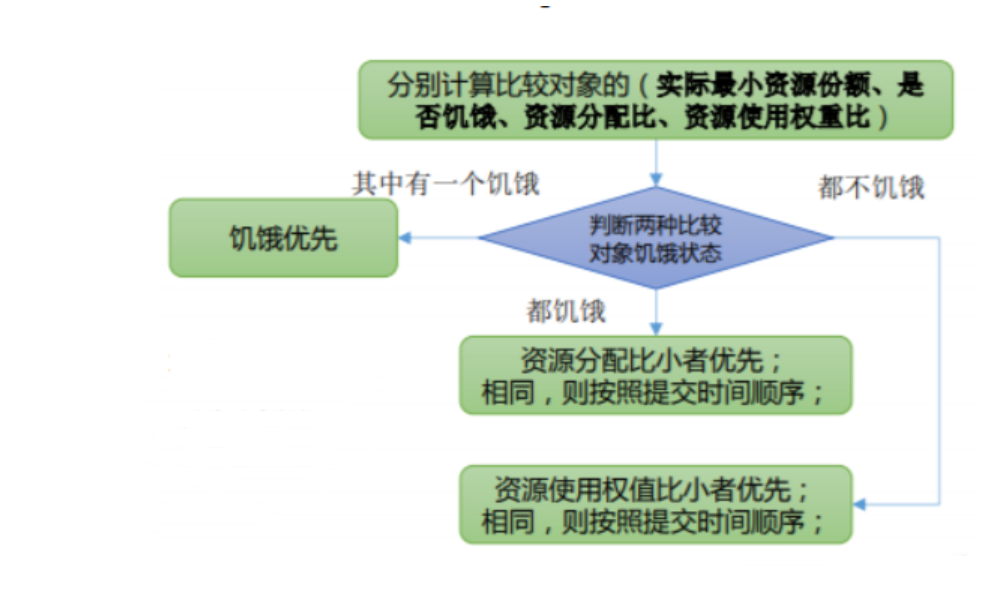
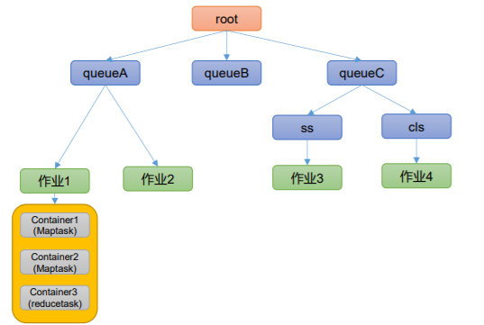

# Yarn 资源调度器

1）如何管理集群资源？

2）如何给任务合理分配资源？


Yarn 是一个资源调度平台，负责为运算程序提供服务器运算资源，相当于一个分布式 的操作系统平台，而 MapReduce 等运算程序则相当于运行于操作系统之上的应用程序。


## Yarn 基础架构

YARN 主要由 ResourceManager、NodeManager、ApplicationMaster 和 Container 等组件 构成。

1）ResourceManager（RM）主要作用如下

（1）处理客户端请求

（2）监控NodeManager

（3）启动或监控ApplicationMaster

（4）资源的分配与调度

2）NodeManager（NM）主要作用如下

（1）管理单个节点上的资源

（2）处理来自ResourceManager的命令

（3）处理来自ApplicationMaster的命令

3）ApplicationMaster（AM）作用如下

（1）为应用程序申请资源并分配给内部的任务

（2）任务的监控与容错

4）Container
Container是 YARN中的资源 抽象，它封装了某个节点上的多 维度资源，如内存、CPU、磁 盘网络等。


## Yarn 工作机制


### 流程

0 Mr程序提交到客 户端所在的节点

1 申请一个Application

2 Application资源提交路径 hdfs://…./.staging以及 application_id 

3 提交job运 行所需资源

4 资源提交完毕，申请运行mrAppMaster

5 将用户的请求初始化成一个Task

6 领取到 Task任务

7 创建容器 Container

8 下载job资 源到本地 

9 申请运行 MapTask容器

10 领取到任 务，创建容器

11 发送程 序启动脚本

12 向RM申请2个 容器，运行 ReduceTask程序

13 Reduce向 Map获取相应 分区的数据

14 程序运行完后， MR会向RM注销自己


### 完整流程

（1）MR 程序提交到客户端所在的节点。

（2）YarnRunner 向 ResourceManager 申请一个 Application。

（3）RM 将该应用程序的资源路径返回给 YarnRunner。

（4）该程序将运行所需资源提交到 HDFS 上。

（5）程序资源提交完毕后，申请运行 mrAppMaster。

（6）RM 将用户的请求初始化成一个 Task。

（7）其中一个 NodeManager 领取到 Task 任务。

（8）该 NodeManager 创建容器 Container，并产生 MRAppmaster。

（9）Container 从 HDFS 上拷贝资源到本地。

（10）MRAppmaster 向 RM 申请运行 MapTask 资源。

（11）RM 将运行MapTask任务分配给另外两个 NodeManager，另两个NodeManager 分别领取任务并创建器。

（12）MR 向两个接收到任务的 NodeManager 发送程序启动脚本，这两个 NodeManager分别启动 MapTask，		   MapTask 对数据分区排序。

（13）MrAppMaster 等待所有 MapTask 运行完毕后，向 RM 申请容器，运行 ReduceTask。

（14）ReduceTask 向 MapTask 获取相应分区的数据。

（15）程序运行完毕后，MR 会向 RM 申请注销自己。


### 作业提交全过程


### **作业提交过程之HDFS & MapReduce;**


### **作业提交全过程详解**

（1）作业提交

第 1 步：Client 调用 job.waitForCompletion 方法，向整个集群提交 MapReduce 作业。

第 2 步：Client 向 RM 申请一个作业 id。

第 3 步：RM 给 Client 返回该 job 资源的提交路径和作业 id。

第 4 步：Client 提交 jar 包、切片信息和配置文件到指定的资源提交路径。

第 5 步：Client 提交完资源后，向 RM 申请运行 MrAppMaster。


（2）作业初始化

第 6 步：当 RM 收到 Client 的请求后，将该 job 添加到容量调度器中。

第 7 步：某一个空闲的 NM 领取到该 Job。

第 8 步：该 NM 创建 Container，并产生 MRAppmaster。

第 9 步：下载 Client 提交的资源到本地。


（3）任务分配

第 10 步：MrAppMaster 向 RM 申请运行多个 MapTask 任务资源。

第 11 步：RM 将运行 MapTask 任务分配给另外两个 NodeManager，另两个 NodeManager分别领取任务并创建容器。

（4）任务运行 
第 12 步：MR 向两个接收到任务的 NodeManager 发送程序启动脚本，这两个NodeManager 分别启动 MapTask，MapTask 对数据分区排序。

第13步：MrAppMaster等待所有MapTask运行完毕后，向RM申请容器，运行ReduceTask。

第 14 步：ReduceTask 向 MapTask 获取相应分区的数据。

第 15 步：程序运行完毕后，MR 会向 RM 申请注销自己。


（5）进度和状态更新
YARN 中的任务将其进度和状态(包括 counter)返回给应用管理器, 客户端每秒(通过mapreduce.client.progressmonitor.pollinterval 设置)向应用管理器请求进度更新, 展示给用户。


（6）作业完成
除了向应用管理器请求作业进度外, 客户端每 5 秒都会通过调用 waitForCompletion()来检查作业是否完成。时间间隔可以通过 mapreduce.client.completion.pollinterval 来设置。作业完成之后, 应用管理器和 Container 会清理工作状态。作业的信息会被作业历史服务器存储以备之后用户核查。


## **Yarn 调度器和调度算法**

目前，Hadoop 作业调度器主要有三种：

FIFO、容量（Capacity Scheduler）和公平（Fair Scheduler）。Apache Hadoop3.1.3 默认的资源调度器是 Capacity Scheduler。CDH 框架默认调度器是 Fair Scheduler。 

具体设置详见：yarn-default.xml 文件

```xml
<property>
 <description>The class to use as the resource scheduler.</description>
 <name>yarn.resourcemanager.scheduler.class</name>
<value>org.apache.hadoop.yarn.server.resourcemanager.scheduler.capacity.CapacityScheduler</value>
</property>
```

### **先进先出调度器（FIFO）**

FIFO 调度器（First In First Out）：单队列，根据提交作业的先后顺序，先来先服务。

1、有新的服务器 节点资源

2、Job1里面包含4 个MapTask和2个 ReduceTask

3、分配一个 Task给该节点


**优点：简单易懂；**
**缺点：不支持多队列，生产环境很少使用；**


### **容量调度器（Capacity Scheduler）**

Capacity Scheduler 是 Yahoo 开发的多用户调度器。

容量调度器特点

1、多队列：每个队列可配置一定的资源量，每个队列采用FIFO调度策略。

2、容量保证：管理员可为每个队列设置资源最低保证和资源使用上限

3、灵活性：如果一个队列中的资源有剩余，可以暂时共享给那些需要资源的队列，而一旦该队列有新的应用程序提交，则其他队列借调的资源会归还给该队列。

4、多租户：
支持多用户共享集群和多应用程序同时运行。 为了防止同一个用户的作业独占队列中的资源，该调度器会对同一用户提交的作业所占资源量进行限定。

```xml
root
|---queueA 20%
|---queueB 50%
|---queueC 30%
|---ss 50%
|---cls 50%
```


### **容量调度器资源分配算法**

1）队列资源分配：从root开始，使用深度优先算法，优先 选择资源占用率最低的队列分配资源。

2）作业资源分配：默认按照提交作业的优先级和提交时间 顺序分配资源。

3）容器资源分配：按照容器的优先级分配资源； 如果优先级相同，按照数据本地性原则：

（1）任务和数据在同一节点

（2）任务和数据在同一机架

（3）任务和数据不在同一节点也不在同一机架


### **公平调度器（Fair Scheduler）**

Fair Schedulere 是 Facebook 开发的多用户调度器。

公平调度器特点

1）与容量调度器相同点

（1）多队列：支持多队列多作业

（2）容量保证：管理员可为每个队列设置资源最低保证和资源使用上线

（3）灵活性：如果一个队列中的资源有剩余，可以暂时共享给那些需要资源的队列，而一旦该队列有新的应用程序提 交，则其他队列借调的资源会归还给该队列。

（4）多租户：支持多用户共享集群和多应用程序同时运行；为了防止同一个用户的作业独占队列中的资源，该调度器 会对同一用户提交的作业所占资源量进行限定。


2）与容量调度器不同点

（1）核心调度策略不同

​		 容量调度器：优先选择资源利用率低的队列

​		 公平调度器：优先选择对资源的缺额比例大的

（2）每个队列可以单独设置资源分配方式

​		 容量调度器：FIFO、 DRF

​		 公平调度器：FIFO、FAIR、DRF

```xml
root
|---queueA 20%
|---queueB 50%
|---queueC 30%
|---ss 50%
|---cls 50%
```


### **公平调度器——缺额**

公平调度器设计目标是：在时间尺度上，所有作业获得公平的资源。某一 时刻一个作业应获资源和实际获取资源的差距叫“缺额，调度器会优先为缺额大的作业分配资源。


公平调度器队列资源分配方式


1）FIFO策略
公平调度器每个队列资源分配策略如果选择FIFO的话，此时公平调度器相当于上面讲过的容量调度器。 


2）Fair策略
Fair 策略（默认）是一种基于最大最小公平算法实现的资源多路复用方式，默认情况下，每个队列内部采用该方式分配资 源。这意味着，如果一个队列中有两个应用程序同时运行，则每个应用程序可得到1/2的资源；如果三个应用程序同时运行，则 每个应用程序可得到1/3的资源。


具体资源分配流程和容量调度器一致；

（1）选择队列

（2）选择作业

（3）选择容器


以上三步，每一步都是按照公平策略分配资源

➢ 实际最小资源份额：mindshare = Min（资源需求量，配置的最小资源）

➢ 是否饥饿：isNeedy = 资源使用量 < mindshare（实际最小资源份额）

➢ 资源分配比：minShareRatio = 资源使用量 / Max（mindshare, 1）

➢ 资源使用权重比：useToWeightRatio = 资源使用量 / 权重



### **公平调度器资源分配算法**

（1）队列资源分配



```sh
root
|---queueA 20%
|---queueB 50%
|---queueC 30%
|---ss 50%
|---cls 50%

需求：集群总资源100，有三个队列，对资源的 需求分别是： 
queueA -> 20， queueB ->50， queueC -> 30

第一次算：100 / 3 = 33.33
queueA：分33.33 → 多13.33
queueB：分33.33 → 少16.67
queueC：分33.33 → 多3.33

第二次算： （13.33 + 3.33）/ 1 = 16.66
queueA：分20
queueB：分33.33 + 16.66 = 50
queueC：分30
```

**公平调度器队列资源分配方式**

（2）作业资源分配
（a）不加权（关注点是Job的个数）： 

```sh
需求：
有一条队列总资源12个, 有4个job，对资源的 需求分别是: 

job1->1, job2->2 , job3->6, job4->5

第一次算: 12 / 4 = 3
job1: 分3 --> 多2个
job2: 分3 --> 多1个
job3: 分3 --> 差3个
job4: 分3 --> 差2个


第二次算: 3 / 2 = 1.5
job1: 分1
job2: 分2
job3: 分3 --> 差3个 --> 分1.5 --> 最终: 4.5
job4: 分3 --> 差2个 --> 分1.5 --> 最终: 4.5


第n次算: 一直算到没有空闲资源
```

（b）加权（关注点是Job的权重）

```sh
需求：有一条队列总资源16，有4个job
对资源的需求分别是:
job1->4 job2->2 job3->10 job4->4

每个job的权重为:
job1->5 job2->8 job3->1 job4->2

第一次算: 16 / (5+8+1+2) = 1
job1: 分5 --> 多1
job2: 分8 --> 多6
job3: 分1 --> 少9
job4: 分2 --> 少2

第二次算: 7 / (1+2) = 7/3
job1: 分4
job2: 分2
job3: 分1 --> 分7/3（2.33） -->少6.67
job4: 分2 --> 分14/3(4.66) -->多2.66

第三次算:2.66/1=2.66
job1: 分4
job2: 分2
job3: 分1 --> 分2.66/1 --> 分2.66
job4: 分4

第n次算: 一直算到没有空闲资源
```

### **公平调度器队列资源分配方式**

DRF（Dominant Resource Fairness），资源都是单一标准，例如只考虑内存（也是Yarn默认的情况）。但是很多时候我们资源有很多种，例如内存，CPU，网络带宽等，这样很难衡量两个应用应该分配的资源比例。


那么在YARN中，用DRF来决定如何调度：
假设集群一共有100 CPU和10T 内存，而应用A需要（2 CPU, 300GB），应用B需要（6 CPU，100GB）。
则两个应用分别需要A（2%CPU, 3%内存）和B（6%CPU, 1%内存）的资源，这就意味着A是内存主导的, B是
CPU主导的，针对这种情况，我们可以选择DRF策略对不同应用进行不同资源（CPU和内存）的一个不同比
例的限制。


## **Yarn 常用命令**

### **yarn application 查看任务**

（1）列出所有 Application：

```sh
yarn application -list
```

（2）根据 Application 状态过滤：yarn application -list -appStates （所有状态：ALL、NEW、 NEW_SAVING、SUBMITTED、ACCEPTED、RUNNING、FINISHED、FAILED、KILLED）

```sh
yarn application -list -appStates FINISHED
```

（3）Kill 掉 Application：

```sh
yarn application -kill application_1612577921195_0001 
```

### **yarn logs 查看日志**

（1）查询 Application 日志：yarn logs -applicationId 

```sh
yarn logs -applicationId application_1612577921195_0001 
```

（2）查询 Container 日志：

```sh
yarn logs -applicationId -containerId 

yarn logs -applicationId application_1612577921195_0001 -containerId 

container_1612577921195_0001_01_000001 
```

### yarn applicationattempt 查看尝试运行的任务

（1）列出所有 Application 尝试的列表：yarn applicationattempt -list 

```sh
yarn applicationattempt -list application_1612577921195_0001 
```

（2）打印 ApplicationAttemp 状态：yarn applicationattempt -status 

```
yarn applicationattempt -status appattempt_1612577921195_0001_000001
```

### **yarn container 查看容器**
（1）列出所有 Container：yarn container -list 

```sh
yarn container -list appattempt_1612577921195_0001_000001 
```

（2）打印 Container 状态：yarn container -status 

```sh
yarn container -status container_1612577921195_0001_01_000001 
```

### **yarn node 查看节点状态**

列出所有节点：

```sh
yarn node -list -all
```

### **yarn rmadmin 更新配置**

加载队列配置：

```sh
yarn rmadmin -refreshQueues
```

### **yarn queue 查看队列**
```sh
yarn queue -status default
```


## **Yarn 生产环境核心参数**

```sh
1）ResourceManager相关
yarn.resourcemanager.scheduler.class 配置调度器，默认容量
yarn.resourcemanager.scheduler.client.thread-count ResourceManager处理调度器请求的线程数量，默认50

2）NodeManager相关
yarn.nodemanager.resource.detect-hardware-capabilities 是否让yarn自己检测硬件进行配置，默认false
yarn.nodemanager.resource.count-logical-processors-as-cores 是否将虚拟核数当作CPU核数，默认false
yarn.nodemanager.resource.pcores-vcores-multiplier 虚拟核数和物理核数乘数，例如：4核8线程，该
参数就应设为2，默认1.0

yarn.nodemanager.resource.memory-mb NodeManager使用内存，默认8G
yarn.nodemanager.resource.system-reserved-memory-mb NodeManager为系统保留多少内存


以上二个参数配置一个即可
yarn.nodemanager.resource.cpu-vcores NodeManager使用CPU核数，默认8个

yarn.nodemanager.pmem-check-enabled 是否开启物理内存检查限制container，默认打开

yarn.nodemanager.vmem-check-enabled 是否开启虚拟内存检查限制container，默认打开

yarn.nodemanager.vmem-pmem-ratio 虚拟内存物理内存比例，默认2.1

3）Container相关
yarn.scheduler.minimum-allocation-mb 容器最最小内存，默认1G
yarn.scheduler.maximum-allocation-mb 容器最最大内存，默认8G
yarn.scheduler.minimum-allocation-vcores 容器最小CPU核数，默认1个
yarn.scheduler.maximum-allocation-vcores 容器最大CPU核数，默认4个
```


### **关闭虚拟内存检查原因**


**任务优先级**

容量调度器，支持任务优先级的配置，在资源紧张时，优先级高的任务将优先获取资源。 默认情况，Yarn 将所有任务的优先级限制为 0，若想使用任务的优先级功能，须开放该限制。

修改 yarn-site.xml 文件，增加以下参数

```xml
<property>
 <name>yarn.cluster.max-application-priority</name>
 <value>5</value>
</property>
```
