# Hadoop调优

NameNode 内存生产配置
1）NameNode 内存计算
每个文件块大概占用 150byte，一台服务器 128G 内存为例，能存储多少文件块呢？

```xml
128 * 1024 * 1024 * 1024 / 150Byte ≈ 9.1 亿
  G 	MB	   KB 	Byte
```

2）Hadoop2.x 系列，配置 NameNode 内存
NameNode 内存默认 2000m，如果服务器内存 4G，NameNode 内存可以配置 3g。在 hadoop-env.sh 文件中配置如下。

```shell
HADOOP_NAMENODE_OPTS=-Xmx3072m
```

3）Hadoop3.x 系列，配置 NameNode 内存

（1）hadoop-env.sh 中描述 Hadoop 的内存是动态分配的

```shell
# The maximum amount of heap to use (Java -Xmx). If no unit
# is provided, it will be converted to MB. Daemons will
# prefer any Xmx setting in their respective _OPT variable.
# There is no default; the JVM will autoscale based upon machine
# memory size.
# export HADOOP_HEAPSIZE_MAX=
# The minimum amount of heap to use (Java -Xms). If no unit
# is provided, it will be converted to MB. Daemons will
# prefer any Xms setting in their respective _OPT variable.
# There is no default; the JVM will autoscale based upon machine
# memory size.
# export HADOOP_HEAPSIZE_MIN=
HADOOP_NAMENODE_OPTS=-Xmx102400m
```

（2）查看 NameNode 占用内存:   jps

```sh
3088 NodeManager
2611 NameNode
3271 JobHistory
3579 Jps
```

```sh
jmap -heap 2611
Heap Configuration: MaxHeapSize = 1031798784 (984.0MB)
```

（3）查看 DataNode 占用内存

```shell
jmap -heap 2744
Heap Configuration: MaxHeapSize = 1031798784 (984.0MB)
```

参考：

* NameNode最小值1G，每增加1000000个block增加1G内存

* DataNode最小值4G，block数，或者副本数增加，都应该调大DataNode的值
* 一个DataNode上的副本数总低于4000000，调为4G，超过4000000，每增加1000000，增加1G。


**具体修改：hadoop-env.sh**

```shell
export HDFS_NAMENODE_OPTS="-Dhadoop.security.logger=INFO,RFAS - Xmx1024m"
export HDFS_DATANODE_OPTS="-Dhadoop.security.logger=ERROR,RFAS -Xmx1024m"
```

## **NameNode 心跳并发配置**

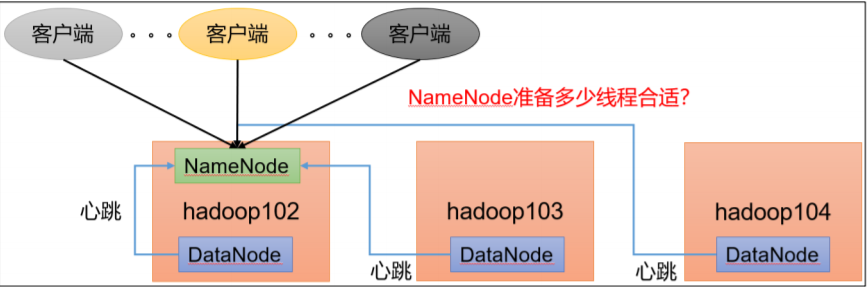

**1）hdfs-site.xml**

The number of Namenode RPC server threads that listen to requests from clients. If dfs.namenode.servicerpc-address is not configured then Namenode RPC server threads listen to requests from all nodes.
NameNode 有一个工作线程池，用来处理不同 DataNode 的并发心跳以及客户端并发的元数据操作。
对于大集群或者有大量客户端的集群来说，通常需要增大该参数。默认值是 10。

```xml
<property>
 <name>dfs.namenode.handler.count</name>
 <value>21</value>
</property>
```

**经验：**

dfs.namenode.handler.count=20 × 𝑙𝑜𝑔𝑒 𝐶𝑙𝑢𝑠𝑡𝑒𝑟 𝑆𝑖𝑧𝑒，比如集群规模（DataNode 台 数）为 3 台时，此参数设置为 21。可通过简单的 python 代码计算该值。

```python
python
Python 2.7.5 (default, Apr 11 2018, 07:36:10)
[GCC 4.8.5 20150623 (Red Hat 4.8.5-28)] on linux2
Type "help", "copyright", "credits" or "license" for more
information.
>>> import math
>>> print int(20*math.log(3))
21
>>> quit()
```

## **开启回收站配置**

开启回收站功能，可以将删除的文件在不超时的情况下，恢复原数据，起到防止误删除、 备份等作用。

**1）回收站工作机制**

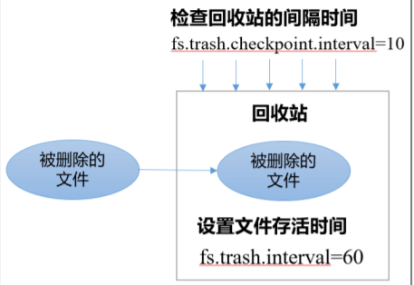

2）开启回收站功能参数说明
（1）默认值 fs.trash.interval = 0，0 表示禁用回收站；其他值表示设置文件的存活时间。
（2）默认值 fs.trash.checkpoint.interval = 0，检查回收站的间隔时间。如果该值为 0，则该值设置和 		 

​	     fs.trash.interval 的参数值相等。
（3）要求 fs.trash.checkpoint.interval <= fs.trash.interval。


**启用回收站**

修改 core-site.xml，配置垃圾回收时间为 1 分钟。

```xml
<property>
 <name>fs.trash.interval</name>
 <value>1</value>
</property>
```

**查看回收站**
**回收站目录在 HDFS 集群中的路径**：/user/dsjprs/.Trash/….


5）注意：通过网页上直接删除的文件也不会走回收站。


6）通过程序删除的文件不会经过回收站，需要调用 moveToTrash()才进入回收站

```java
Trash trash = New Trash(conf); trash.moveToTrash(path);
```

7）只有在命令行利用 hadoop fs -rm 命令删除的文件才会走回收站

```sh
hadoop fs -rm -r /user/atguigu/input
2021-07-14 16:13:42,643 INFO fs.TrashPolicyDefault: Moved:
'hdfs://ndoe01:9820/user/dsjprs/input' to trash at:
hdfs://hadoop102:9820/user/dsjprs/.Trash/Current/user/dsjprs
/input
```

8）恢复回收站数据

```sh
hadoop fs -mv /user/dsjprs/.Trash/Current/user/dsjprs/input /user/dsjprs/input
```


## **HDFS—多目录**

### **NameNode 多目录配置**
1）NameNode 的本地目录可以配置成多个，且每个目录存放内容相同，增加了可靠性

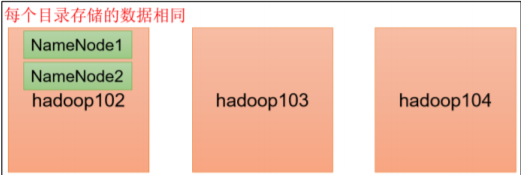


2）具体配置如下
（1）在 hdfs-site.xml 文件中添加如下内容

```xml
<property>
 <name>dfs.namenode.name.dir</name>
 <value>file://${hadoop.tmp.dir}/dfs/name1,file://${hadoop.tmp.dir}/dfs/name2</value>
</property>
```

### **DataNode 多目录配置**

1）DataNode 可以配置成多个目录，每个目录存储的数据不一样（数据不是副本）

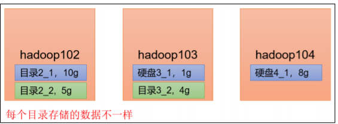

2）具体配置如下

在 hdfs-site.xml 文件中添加如下内容

```xml
<property>
 <name>dfs.datanode.data.dir</name>
 <value>file://${hadoop.tmp.dir}/dfs/data1,file://${hadoop.tmp.dir}/dfs/data2</value>
</property>
```

## **集群数据均衡之磁盘间数据均衡**

硬盘空间不足，往往需要增加一块硬盘。刚加载的硬盘没有数据时，可 以执行磁盘数据均衡命令。

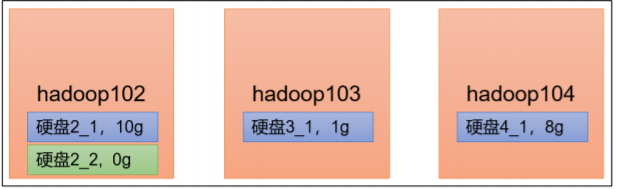


（1）生成均衡计划（我们只有一块磁盘，不会生成计划）

```sh
hdfs diskbalancer -plan hadoop103
```

（2）执行均衡计划

```sh
hdfs diskbalancer -execute hadoop103.plan.json
```


（3）查看当前均衡任务的执行情况

```sh
hdfs diskbalancer -query hadoop103
```

（4）取消均衡任务

```sh
hdfs diskbalancer -cancel hadoop103.plan.json
```


## **HDFS—集群扩容及缩容**

白名单：表示在白名单的主机 IP 地址可以，用来存储数据。配置白名单，可以尽量防止黑客恶意访问攻击。

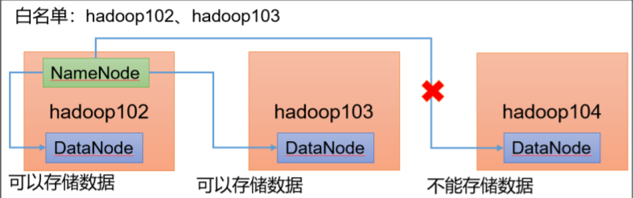

**配置白名单步骤如下：**

1）在 NameNode 节点的/opt/module/hadoop-3.1.3/etc/hadoop 目录下分别创建 whitelist 和 blacklist 文件

（1）创建白名单 

```shell
vim whitelist
# 在 whitelist 中添加如下主机名称，假如集群正常工作的节点为 102 103 
hadoop102 
hadoop103
```

（2）创建黑名单

```sh
touch blacklist
# 保持空的就可以
```

2）在 hdfs-site.xml 配置文件中增加 dfs.hosts 配置参数

```xml
<!-- 白名单 -->
<property>
 <name>dfs.hosts</name>
 <value>/opt/module/hadoop-3.1.3/etc/hadoop/whitelist</value>
</property>
<!-- 黑名单 -->
<property>
 <name>dfs.hosts.exclude</name>
 <value>/opt/module/hadoop-3.1.3/etc/hadoop/blacklist</value>
</property
```

**第一次添加白名单必须重启集群，不是第一次，只需要刷新 NameNode 节点即可**

```sh
hdfs dfsadmin -refreshNodes 
```


## **服役新服务器**

1）需求 
随着业务的增长，数据量越来越大，原有的数据节点的容量已经不能满足存储数据 的需求，需要在原有集群基础上动态添加新的数据节点。

2）环境准备
（1）在 hadoop100 主机上再克隆一台 hadoop105 主机 
（2）修改 IP 地址和主机名称

```sh
vim /etc/sysconfig/network-scripts/ifcfgens33 
vim /etc/hostname
```

（3）拷贝 hadoop102 的/opt/module 目录和/etc/profile.d/my_env.sh 到 hadoop105

```sh
scp -r module/* dsjprs@hadoop105:/opt/module/ 

scp /etc/profile.d/my_env.sh root@hadoop105:/etc/profile.d/my_env.sh
```

```sh
source /etc/profile
```

（4）删除 hadoop105 上 Hadoop 的历史数据，data 和 log 数据

```sh
rm -rf data/ logs/
```

（5）配置 hadoop102 和 hadoop103 到 hadoop105 的 ssh 无密登录

```sh
ssh-copy-id hadoop105 
ssh-copy-id hadoop105 
```

服役新节点具体步骤
（1）直接启动 DataNode，即可关联到集群

```sh
hdfs --daemon start datanode
yarn --daemon start nodemanager
```


**在白名单中增加新服役的服务器** 

（1）在白名单 whitelist 中增加 hadoop104、hadoop105，并重启集群

```sh
vim whitelist
# 修改为如下内容
hadoop102
hadoop103
hadoop104
hadoop105
```

```sh
# 刷新 NameNode
hdfs dfsadmin -refreshNodes 

Refresh nodes successful 
```

## **黑名单配置**

1）编辑/opt/module/hadoop-3.1.3/etc/hadoop 目录下的 blacklist 文件

```sh
vim blacklist
# 添加如下主机名称（要退役的节点）
hadoop105
```

注意：如果白名单中没有配置，需要在 hdfs-site.xml 配置文件中增加 dfs.hosts 配置参数

```xml
<!-- 黑名单 -->
<property>
 <name>dfs.hosts.exclude</name>
 <value>/opt/module/hadoop-3.1.3/etc/hadoop/blacklist</value>
</property>
```

2）分发配置文件 blacklist，hdfs-site.xml

```sh
xsync hdfs-site.xml blacklist
```

3）第一次添加黑名单必须重启集群，不是第一次，只需要刷新 NameNode 节点即可

```sh
hdfs dfsadmin -refreshNodes 

Refresh nodes successful
```

## **服务器间数据均衡**

1）企业经验： 
在企业开发中，如果经常在 hadoop102 和 hadoop104 上提交任务，且副本数为 2，由于数据本地性原则，就会导致 hadoop102 和 hadoop104 数据过多，hadoop103 存储的数据量小。


另一种情况，就是新服役的服务器数据量比较少，需要执行集群均衡命令。

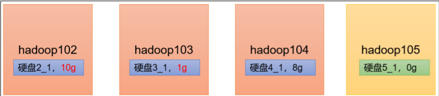


2）开启数据均衡命令：

```sh
sbin/start-balancer.sh - threshold 10 
```

对于参数 10，代表的是集群中各个节点的磁盘空间利用率相差不超过 10%，可根据实 际情况进行调整。


3）停止数据均衡命令：

```sh
sbin/stop-balancer.sh
```

注意：由于 HDFS 需要启动单独的 Rebalance Server 来执行 Rebalance 操作，所以尽量 不要在 NameNode 上执行 start-balancer.sh，而是找一台比较空闲的机器。 


## **HDFS—存储优化**

### **纠删码原理**

HDFS 默认情况下，一个文件有 3 个副本，这样提高了数据的可靠性，但也带来了 2 倍 的冗余开销。Hadoop3.x 引入了纠删码，采用计算的方式，可以节省约 50％左右的存储空间。

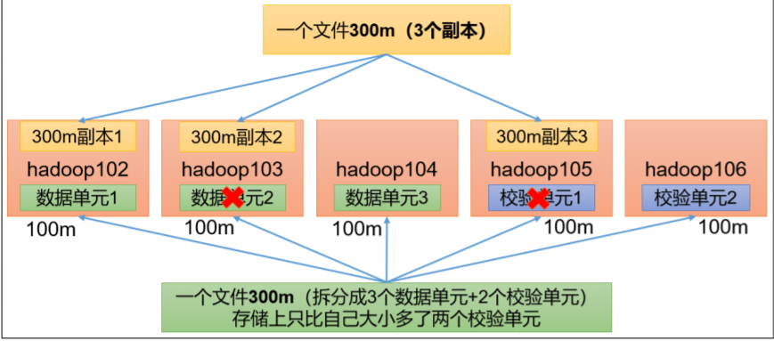


1）纠删码操作相关的命令

```shell
hdfs ec
Usage: bin/hdfs ec [COMMAND]
 [-listPolicies]
 [-addPolicies -policyFile <file>]
 [-getPolicy -path <path>]
 [-removePolicy -policy <policy>]
 [-setPolicy -path <path> [-policy <policy>] [-replicate]]
 [-unsetPolicy -path <path>]
 [-listCodecs]
 [-enablePolicy -policy <policy>]
 [-disablePolicy -policy <policy>]
 [-help <command-name>].
```

2）查看当前支持的纠删码策略

```shell
hdfs ec -listPolicies
Erasure Coding Policies:
ErasureCodingPolicy=[Name=RS-10-4-1024k, Schema=[ECSchema=[Codec=rs,
numDataUnits=10, numParityUnits=4]], CellSize=1048576, Id=5],
State=DISABLED
ErasureCodingPolicy=[Name=RS-3-2-1024k, Schema=[ECSchema=[Codec=rs,
numDataUnits=3, numParityUnits=2]], CellSize=1048576, Id=2],
State=DISABLED
ErasureCodingPolicy=[Name=RS-6-3-1024k, Schema=[ECSchema=[Codec=rs,
numDataUnits=6, numParityUnits=3]], CellSize=1048576, Id=1],
State=ENABLED
ErasureCodingPolicy=[Name=RS-LEGACY-6-3-1024k,
Schema=[ECSchema=[Codec=rs-legacy, numDataUnits=6, numParityUnits=3]],
CellSize=1048576, Id=3], State=DISABLED
ErasureCodingPolicy=[Name=XOR-2-1-1024k, Schema=[ECSchema=[Codec=xor,
numDataUnits=2, numParityUnits=1]], CellSize=1048576, Id=4],
State=DISABLED
```

3）纠删码策略解释:
RS-3-2-1024k：使用 RS 编码，每 3 个数据单元，生成 2 个校验单元，共 5 个单元，也 就是说：这 5 个单元中，只要有任意的 3 个单元存在（不管是数据单元还是校验单元，只要总数=3），就可以得到原始数据。每个单元的大小是 1024k=1024*1024=1048576。

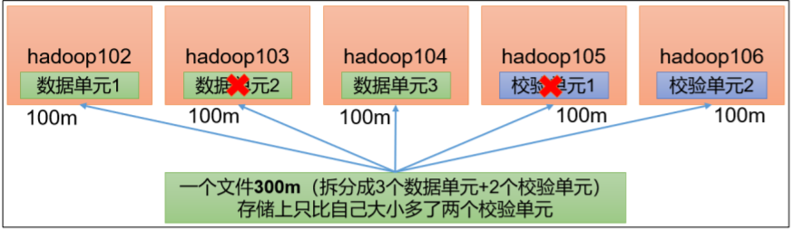


```xml
RS-10-4-1024k：使用 RS 编码，每 10 个数据单元（cell），生成 4 个校验单元，共 14个单元，也就是说：这14 个单元中，只要有任意的 10 个单元存在（不管是数据单元还是校验单元，只要总数=10），就可以得到原始数据。每个单元的大小是 1024k=1024*1024=1048576。

RS-6-3-1024k：使用 RS 编码，每 6 个数据单元，生成 3 个校验单元，共 9 个单元，也就是说：这 9 个单元中，只要有任意的 6 个单元存在（不管是数据单元还是校验单元，只要总数=6），就可以得到原始数据。每个单元的大小是 1024k=1024*1024=1048576。

RS-LEGACY-6-3-1024k：策略和上面的 RS-6-3-1024k 一样，只是编码的算法用的是 rslegacy。

XOR-2-1-1024k：使用 XOR 编码（速度比 RS 编码快），每 2 个数据单元，生成 1 个校验单元，共 3 个单元，也就是说：这 3 个单元中，只要有任意的 2 个单元存在（不管是数据单元还是校验单元，只要总数= 2），就可以得到原始数据。每个单元的大小是1024k=1024*1024=1048576。
```

### **异构存储（冷热数据分离）** 
异构存储主要解决，不同的数据，存储在不同类型的硬盘中，达到最佳性能的问题。 

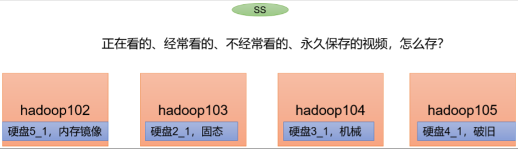


存储类型和存储策略

1）关于存储类型

RAM_DISK：（内存镜像文件系统）

SSD：（SSD固态硬盘）

DISK：（普通磁盘，在HDFS中，如果没有主动声明数据目录存储类型默认都是DISK）

ARCHIVE：（没有特指哪种存储介质，主要的指的是计算能力比较弱而存储密度比较高的存储介质，用来解决数据量的容量扩增的问题，一般用于归档）

2）关于存储策略
说明：从Lazy_Persist到Cold，分别代表了设备的访问速度从快到慢

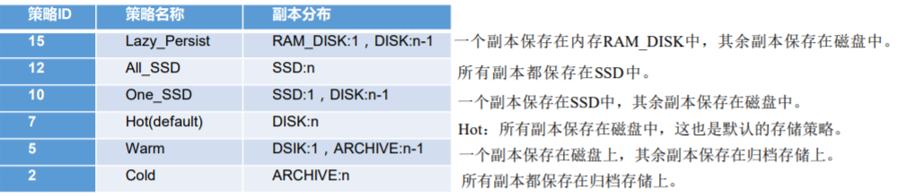


### **异构存储 Shell 操作**

（1）查看当前有哪些存储策略可以用

```sh
hdfs storagepolicies -listPolicies
```

（2）为指定路径（数据存储目录）设置指定的存储策略

```sh
hdfs storagepolicies -setStoragePolicy -path xxx -policy xxx
```

（3）获取指定路径（数据存储目录或文件）的存储策略

```sh
hdfs storagepolicies -getStoragePolicy -path xxx
```

（4）取消存储策略；执行改命令之后该目录或者文件，以其上级的目录为准，如果是根 目录，那么就是 HOT

```sh
hdfs storagepolicies -unsetStoragePolicy -path xxx
```

（5）查看文件块的分布

```sh
bin/hdfs fsck xxx -files -blocks -locations
```

（6）查看集群节点

```sh
hadoop dfsadmin -report
```


## **HDFS—故障排除**

### **NameNode 故障处理**

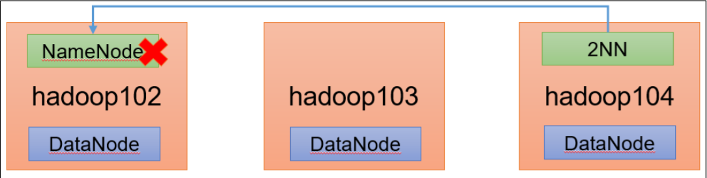

1）需求：

NameNode 进程挂了并且存储的数据也丢失了，如何恢复 NameNode

2）故障模拟
（1）kill -9 NameNode 进程

```sh
kill -9 19886
```

（2）删除 NameNode 存储的数据（/opt/module/hadoop-3.1.3/data/tmp/dfs/name）

```sh
rm -rf /opt/module/hadoop3.1.3/data/dfs/name/* 
```

3）问题解决
（1）拷贝 SecondaryNameNode 中数据到原 NameNode 存储数据目录

```sh
scp -r dsjprs@hadoop104:/opt/module/hadoop3.1.3/data/dfs/namesecondary/* ./name/
```

（2）重新启动 NameNode

```sh
hdfs --daemon start namenode
```

（3）向集群上传一个文件 


集群安全模式&磁盘修复;

1）安全模式：文件系统只接受读数据请求，而不接受删除、修改等变更请求

2）进入安全模式场景
➢ NameNode 在加载镜像文件和编辑日志期间处于安全模式；

➢ NameNode 再接收 DataNode 注册时，处于安全模式


3）退出安全模式条件

```sh
dfs.namenode.safemode.min.datanodes:最小可用 datanode 数量，默认 0

dfs.namenode.safemode.threshold-pct:副本数达到最小要求的 block 占系统总 block 数的 百分比，默认 0.999f。（只允许丢一个块）

dfs.namenode.safemode.extension:稳定时间，默认值 30000 毫秒，即 30 秒
```

4）基本语法

集群处于安全模式，不能执行重要操作（写操作）。集群启动完成后，自动退出安全模 式。

（1）bin/hdfs dfsadmin -safemode get （功能描述：查看安全模式状态）
（2）bin/hdfs dfsadmin -safemode enter （功能描述：进入安全模式状态）
（3）bin/hdfs dfsadmin -safemode leave（功能描述：离开安全模式状态）
（4）bin/hdfs dfsadmin -safemode wait （功能描述：等待安全模式状态）


## **慢磁盘监控**

“慢磁盘”指的时写入数据非常慢的一类磁盘。其实慢性磁盘并不少见，当机器运行时 间长了，上面跑的任务多了，磁盘的读写性能自然会退化，严重时就会出现写入数据延时的问题。


### **如何发现慢磁盘？**

正常在 HDFS 上创建一个目录，只需要不到 1s 的时间。如果你发现创建目录超过 1 分 钟及以上，而且这个现象并不是每次都有。只是偶尔慢了一下，就很有可能存在慢磁盘。 可以采用如下方法找出是哪块磁盘慢：


1）通过心跳未联系时间。

一般出现慢磁盘现象，会影响到 DataNode 与 NameNode 之间的心跳。正常情况心跳时 间间隔是 3s。超过 3s 说明有异常。


2）fio 命令，测试磁盘的读写性能

（1）顺序读测试

```sh
sudo yum install -y fio

sudo fio - filename=/home/atguigu/test.log -direct=1 -iodepth 1 -thread - rw=read -ioengine=psync -bs=16k -size=2G -numjobs=10 - runtime=60 -group_reporting -name=test_r

Run status group 0 (all jobs):

READ: bw=360MiB/s (378MB/s), 360MiB/s-360MiB/s (378MB/s-378MB/s),io=20.0GiB (21.5GB), run=56885-56885msec
```

结果显示，磁盘的总体顺序读速度为 360MiB/s。


（2）顺序写测试

```sh
sudo fio - filename=/home/atguigu/test.log -direct=1 -iodepth 1 -thread - rw=write -ioengine=psync -bs=16k -size=2G -numjobs=10 - runtime=60 -group_reporting -name=test_w

Run status group 0 (all jobs):

WRITE: bw=341MiB/s (357MB/s), 341MiB/s-341MiB/s (357MB/s357MB/s), io=19.0GiB (21.4GB), run=60001-60001msec
```

结果显示，磁盘的总体顺序写速度为 341MiB/s。 

（3）随机写测试

```sh
sudo fio - filename=/home/atguigu/test.log -direct=1 -iodepth 1 -thread -rw=randwrite -ioengine=psync -bs=16k -size=2G -numjobs=10 - runtime=60 -group_reporting -name=test_randw
Run status group 0 (all jobs):

WRITE: bw=309MiB/s (324MB/s), 309MiB/s-309MiB/s (324MB/s-324MB/s),
io=18.1GiB (19.4GB), run=60001-60001msec
```

（4）混合随机读写：

```sh
sudo fio - filename=/home/atguigu/test.log -direct=1 -iodepth 1 -thread - rw=randrw -rwmixread=70 -ioengine=psync -bs=16k -size=2G - numjobs=10 -runtime=60 -group_reporting -name=test_r_w - ioscheduler=noop

Run status group 0 (all jobs):
READ: bw=220MiB/s (231MB/s), 220MiB/s-220MiB/s (231MB/s231MB/s), io=12.9GiB (13.9GB), run=60001-60001msec 

WRITE: bw=94.6MiB/s (99.2MB/s), 94.6MiB/s-94.6MiB/s
(99.2MB/s-99.2MB/s), io=5674MiB (5950MB), run=60001-60001msec
```

结果显示，磁盘的总体混合随机读写，读速度为 220MiB/s，写速度 94.6MiB/s。


## **小文件归档**

### **1）HDFS 存储小文件弊端**

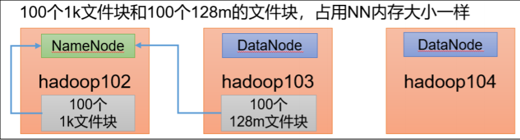


每个文件均按块存储，每个块的元数据存储在 NameNode 的内存中，因此 HDFS 存储 小文件会非常低效。因为大量的小文件会耗尽 NameNode 中的大部分内存。但注意，存储小 文件所需要的磁盘容量和数据块的大小无关。例如，一个 1MB 的文件设置为 128MB 的块 存储，实际使用的是 1MB 的磁盘空间，而不是 128MB。


### **2）解决存储小文件办法之一**
HDFS 存档文件或 HAR 文件，是一个更高效的文件存档工具，它将文件存入 HDFS 块， 在减少 NameNode 内存使用的同时，允许对文件进行透明的访问。具体说来，HDFS 存档文 件对内还是一个一个独立文件，对 NameNode 而言却是一个整体，减少了 NameNode 的内存。


（1）需要启动 YARN 进程

```sh
start-yarn.sh
```

（2）归档文件
把/input 目录里面的所有文件归档成一个叫 input.har 的归档文件，并把归档后文件存储 到/output 路径下。

```sh
hadoop archive -archiveName input.har -p /input /output 
```

（3）查看归档

```sh
hadoop fs -ls
/output/input.har

hadoop fs -ls 
har:///output/input.har 
```

（4）解归档文件

```sh
hadoop fs -cp har:///output/input.har/* / 
```


## **HDFS—集群迁移**

Apache 和 Apache 集群间数据拷贝

1）scp 实现两个远程主机之间的文件复制

```sh
scp -r hello.txt root@hadoop103:/user/dsjprs/hello.txt # 推 push

scp -r root@hadoop103:/user/dsjprs/hello.txt hello.txt # 拉 pull

scp -r root@hadoop103:/user/dsjprs/hello.txt root@hadoop104:/user/dsjprs # 是通过本地主机中转实现两个远程主机的文件复制；如果在两个远程主机之间 ssh 没有配置的情况下 可以使用该方式。
```

2）采用 distcp 命令实现两个 Hadoop 集群之间的递归数据复制

```sh
bin/hadoop distcp

hdfs://hadoop102:8020/user/dsjprs/hello.txt 
hdfs://hadoop105:8020/user/dsjprs/hello.txt
```


## **MapReduce 生产调优**

**MapReduce 跑的慢的原因**

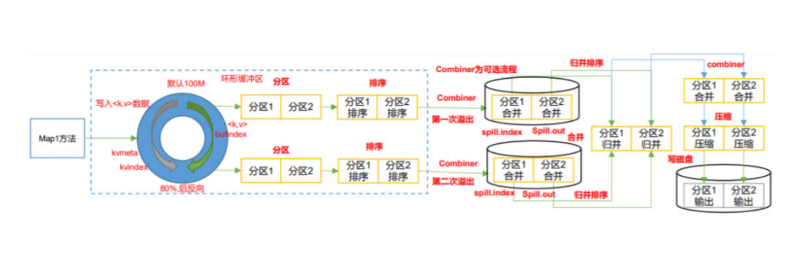

**MapReduce 程序效率的瓶颈在于两点：**

1）计算机性能

2）I/O 操作优化
（1）数据倾斜 
（2）Map 运行时间太长，导致 Reduce 等待过久 
（3）小文件过多


MapReduce 常用调优参数

### **MapReduce优化（上）**
1）自定义分区，减少数据倾斜; 定义类，继承Partitioner接口，重写getPartition方法

2）减少溢写的次数

```sh
mapreduce.task.io.sort.mb Shuffle的环形缓冲区大小，默认100m，
可以提高到200m mapreduce.map.sort.spill.percent 环形缓冲区溢出的阈值，默认80% ，可以提高的90%
```

3）增加每次Merge合并次数

```sh
mapreduce.task.io.sort.factor默认10，可以提高到20
```

4）在不影响业务结果的前提条件下可以提前采用Combiner

```java
job.setCombinerClass(xxxReducer.class);
```

5）为了减少磁盘IO，可以采用Snappy或者LZO压缩

```xml
conf.setBoolean("mapreduce.map.output.compress", true); 
conf.setClass("mapreduce.map.output.compress.codec", 
SnappyCodec.class,CompressionCodec.class);
```

6）mapreduce.map.memory.mb 默认MapTask内存上限1024MB可以根据128m数据对应1G内存原则提高该内存.

7）mapreduce.map.java.opts：控制MapTask堆内存大小。（如果内存不够， 报java.lang.OutOfMemoryError）

8）mapreduce.map.cpu.vcores 默认MapTask的CPU核数1。计算密集型任 务可以增加CPU核数

9）异常重试 
mapreduce.map.maxattempts每个Map Task最大重试次数，一旦重试 次数超过该值，则认为Map Task运行失败，默认值：4。根据机器 性能适当提高


### **MapReduce优化（下）**

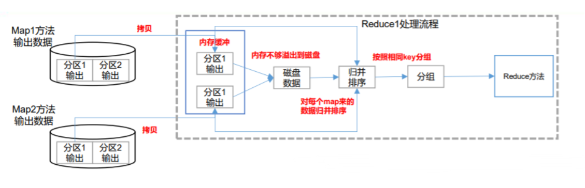

```xml
1）mapreduce.reduce.shuffle.parallelcopies每个Reduce去Map 中拉取数据的并行数，默认值是5。可以提高到10。 

2）mapreduce.reduce.shuffle.input.buffer.percent Buffer大小占Reduce可用内存的比例，默认值0.7。可以提高到0.8

3）mapreduce.reduce.shuffle.merge.percent Buffer中的数据达到多少比例 开始写入磁盘，默认值0.66。可以提高到0.75

4）mapreduce.reduce.memory.mb 默认ReduceTask内存上限1024MB， 根据128m数据对应1G内存原则，适当提高内存到4-6G

5）mapreduce.reduce.java.opts：控制ReduceTask堆内存大小。（如果内 存不够，报：java.lang.OutOfMemoryError）

6）mapreduce.reduce.cpu.vcores默认ReduceTask的CPU核数1个。可 以提高到2-4个

7）mapreduce.reduce.maxattempts每个Reduce Task最大重试次数， 一旦重试次数超过该值，则认为Map Task运行失败，默认值：4。

8）mapreduce.job.reduce.slowstart.completedmaps当MapTask完成的比 例达到该值后才会为ReduceTask申请资源。默认是0.05。

9）mapreduce.task.timeout如果一个Task在一定时间内没有任何进入， 即不会读取新的数据，也没有输出数据，则认为该Task处于Block状态， 可能是卡住了，也许永远会卡住，为了防止因为用户程序永远Block住 不退出，则强制设置了一个该超时时间（单位毫秒），默认是600000 （10分钟）。如果你的程序对每条输入数据的处理时间过长，建议将 该参数调大。

10）如果可以不用Reduce，尽可能不用
```

### **MapReduce 数据倾斜问题**

1）数据倾斜现象

数据频率倾斜——某一个区域的数据量要远远大于其他区域。

数据大小倾斜——部分记录的大小远远大于平均值。


2）减少数据倾斜的方法
（1）首先检查是否空值过多造成的数据倾斜

​		生产环境，可以直接过滤掉空值；如果想保留空值，就自定义分区，将空值加随机数打 散。

​		最后再二次聚合。

（2）能在 map 阶段提前处理，最好先在 Map 阶段处理。如：Combiner、MapJoin


3）设置多个 reduce 个数

Hadoop-Yarn 生产经验

1）调优参数列表

```xml
（1）Resourcemanager 相关
yarn.resourcemanager.scheduler.client.thread-count ResourceManager 处理调度 器请求的线程数量 
yarn.resourcemanager.scheduler.class 配置调度器

（2）Nodemanager 相关
yarn.nodemanager.resource.memory-mb NodeManager 使用内存数
yarn.nodemanager.resource.system-reserved-memory-mb NodeManager 为系统保留多少内存，和上一个参数二者取一即可

yarn.nodemanager.resource.cpu-vcores NodeManager 使用 CPU 核数
yarn.nodemanager.resource.count-logical-processors-as-cores 是否将虚拟核数当作 CPU 核数
yarn.nodemanager.resource.pcores-vcores-multiplier 虚拟核数和物理核数乘数，例如：4 核 8 线程，该参数就应设为 2

yarn.nodemanager.resource.detect-hardware-capabilities 是否让 yarn 自己检测硬件进行配置
yarn.nodemanager.pmem-check-enabled 是否开启物理内存检查限制 container
yarn.nodemanager.vmem-check-enabled 是否开启虚拟内存检查限制 container
yarn.nodemanager.vmem-pmem-ratio 虚拟内存物理内存比例

（3）Container 容器相关
yarn.scheduler.minimum-allocation-mb 容器最小内存
yarn.scheduler.maximum-allocation-mb 容器最大内存
yarn.scheduler.minimum-allocation-vcores 容器最小核数
yarn.scheduler.maximum-allocation-vcores 容器最大核数
```


## **Hadoop 小文件解决方案**

1）在数据采集的时候，就将小文件或小批数据合成大文件再上传 HDFS（数据源头）


2）Hadoop Archive（存储方向）

是一个高效的将小文件放入 HDFS 块中的文件存档工具，能够将多个小文件打包成一个 HAR 文件，从而达到减少 NameNode 的内存使用


3）CombineTextInputFormat（计算方向）

CombineTextInputFormat 用于将多个小文件在切片过程中生成一个单独的切片或者少量的切片。


4）开启 uber 模式，实现 JVM 重用（计算方向）默认情况下，每个 Task 任务都需要启动一个 JVM 来运行，如果 Task 任务计算的数据量很小，我们可以让同一个 Job 的多个 Task 运行在一个 JVM 中，不必为每个 Task 都开启
一个 JVM。


（1）未开启 uber 模式，在/input 路径上上传多个小文件并执行 wordcount 程序

```sh
hadoop jar share/hadoop/mapreduce/hadoop-mapreduce-examples-3.1.3.jar wordcount /input /output2 
```

（2）观察控制台

```sh
2021-02-14 16:13:50,607 INFO mapreduce.Job: Job job_1613281510851_0002 running in uber mode : false
```


（3）开启 uber 模式，在 mapred-site.xml 中添加如下配置


```xml
<!-- 开启 uber 模式，默认关闭 -->
<property>
 <name>mapreduce.job.ubertask.enable</name>
 <value>true</value>
</property>
<!-- uber 模式中最大的 mapTask 数量，可向下修改 -->
<property>
 <name>mapreduce.job.ubertask.maxmaps</name>
 <value>9</value>
</property>
<!-- uber 模式中最大的 reduce 数量，可向下修改 -->
<property>
 <name>mapreduce.job.ubertask.maxreduces</name>
 <value>1</value>
</property>
<!-- uber 模式中最大的输入数据量，默认使用 dfs.blocksize 的值，可向下修改 -->
<property>
 <name>mapreduce.job.ubertask.maxbytes</name>
 <value></value>
</property>
```

## **测试 MapReduce 计算性能**

使用 Sort 程序评测 MapReduce

注：一个虚拟机不超过 150G 磁盘尽量不要执行这段代码

（1）使用 RandomWriter 来产生随机数，每个节点运行 10 个 Map 任务，每个 Map 产 生大约 1G 大小的二进制随机数

```sh
hadoop jar /opt/module/hadoop3.1.3/share/hadoop/mapreduce/hadoop-mapreduce-examples3.1.3.jar randomwriter random-data
```

（2）执行 Sort 程序

```sh
hadoop jar /opt/module/hadoop3.1.3/share/hadoop/mapreduce/hadoop-mapreduce-examples3.1.3.jar sort random-data sorted-data
```

（3）验证数据是否真正排好序了

```sh
hadoop jar /opt/module/hadoop3.1.3/share/hadoop/mapreduce/hadoop-mapreduce-clientjobclient-3.1.3-tests.jar testmapredsort -sortInput random-data -sortOutput sorted-data
```


## **HDFS 参数调优**

（1）修改：hadoop-env.sh

```sh
export HDFS_NAMENODE_OPTS="-Dhadoop.security.logger=INFO,RFAS -Xmx1024m"

export HDFS_DATANODE_OPTS="-Dhadoop.security.logger=ERROR,RFAS-Xmx1024m"
```

（2）修改 hdfs-site.xml 

```xml
<!-- NameNode 有一个工作线程池，默认值是 10 -->
<property>
 <name>dfs.namenode.handler.count</name>
 <value>21</value>
</property>
```

（3）修改 core-site.xml

```xml
<!-- 配置垃圾回收时间为 60 分钟 -->
<property>
 <name>fs.trash.interval</name>
<value>60</value>
</property>
```


## **MapReduce 参数调优**

（1）修改 mapred-site.xm

```xml
<!-- 环形缓冲区大小，默认 100m -->
<property>
 <name>mapreduce.task.io.sort.mb</name>
 <value>100</value>
</property>
<!-- 环形缓冲区溢写阈值，默认 0.8 -->
<property>
 <name>mapreduce.map.sort.spill.percent</name>
 <value>0.80</value>
</property>
<!-- merge 合并次数，默认 10 个 -->
<property>
 <name>mapreduce.task.io.sort.factor</name>
 <value>10</value>
</property>
<!-- maptask 内存，默认 1g； maptask 堆内存大小默认和该值大小一致mapreduce.map.java.opts -->
<property>
 <name>mapreduce.map.memory.mb</name>
 <value>-1</value>
 </description>
</property>
<!-- matask 的 CPU 核数，默认 1 个 -->
<property>
 <name>mapreduce.map.cpu.vcores</name>
 <value>1</value>
</property>
<!-- matask 异常重试次数，默认 4 次 -->
<property>
 <name>mapreduce.map.maxattempts</name>
 <value>4</value>
</property>
<!-- 每个 Reduce 去 Map 中拉取数据的并行数。默认值是 5 -->
<property>
 <name>mapreduce.reduce.shuffle.parallelcopies</name>
<value>5</value>
</property>
<!-- Buffer 大小占 Reduce 可用内存的比例，默认值 0.7 -->
<property>
 <name>mapreduce.reduce.shuffle.input.buffer.percent</name>
 <value>0.70</value>
</property>
<!-- Buffer 中的数据达到多少比例开始写入磁盘，默认值 0.66。 -->
<property>
 <name>mapreduce.reduce.shuffle.merge.percent</name>
 <value>0.66</value>
</property>
<!-- reducetask 内存，默认 1g；reducetask 堆内存大小默认和该值大小一致mapreduce.reduce.java.opts -->
<property>
 <name>mapreduce.reduce.memory.mb</name>
 <value>-1</value>
</property>
<!-- reducetask 的 CPU 核数，默认 1 个 -->
<property>
 <name>mapreduce.reduce.cpu.vcores</name>
 <value>2</value>
</property>
<!-- reducetask 失败重试次数，默认 4 次 -->
<property>
 <name>mapreduce.reduce.maxattempts</name>
 <value>4</value>
</property>
<!-- 当 MapTask 完成的比例达到该值后才会为 ReduceTask 申请资源。默认是 0.05-->
<property>
 <name>mapreduce.job.reduce.slowstart.completedmaps</name>
 <value>0.05</value>
</property>
<!-- 如果程序在规定的默认 10 分钟内没有读到数据，将强制超时退出 -->
<property>
 <name>mapreduce.task.timeout</name>
 <value>600000</value>
</property>
```

## **Yarn 参数调优**

（1）修改 yarn-site.xml 配置参数如下：

```xml
<!-- 选择调度器，默认容量 -->
<property>
<description>The class to use as the resource scheduler.</description>
<name>yarn.resourcemanager.scheduler.class</name>
<value>org.apache.hadoop.yarn.server.resourcemanager.scheduler.capaci
ty.CapacityScheduler</value>
</property>
<!-- ResourceManager 处理调度器请求的线程数量,默认 50；如果提交的任务数大于 50，可以增加该值，但是不能超过 3 台 * 4 线程 = 12 线程（去除其他应用程序实际不能超过 8） -->
<property>
<description>Number of threads to handle schedulerinterface.</description>
<name>yarn.resourcemanager.scheduler.client.thread-count</name>
<value>8</value>
</property>
<!-- 是否让 yarn 自动检测硬件进行配置，默认是 false，如果该节点有很多其他应用程序，建议手动配置。如果该节点没有其他应用程序，可以采用自动 -->
<property>
<name>yarn.nodemanager.resource.detect-hardware-capabilities</name>
<value>false</value>
</property>
<!-- 是否将虚拟核数当作 CPU 核数，默认是 false，采用物理 CPU 核数 -->
<property>
<name>yarn.nodemanager.resource.count-logical-processors-ascores</name>
<value>false</value>
</property>
<!-- 虚拟核数和物理核数乘数，默认是 1.0 -->
<property>
<name>yarn.nodemanager.resource.pcores-vcores-multiplier</name>
<value>1.0</value>
</property>
<!-- NodeManager 使用内存数，默认 8G，修改为 4G 内存 -->
<property>
<name>yarn.nodemanager.resource.memory-mb</name>
<value>4096</value>
</property>
<!-- nodemanager 的 CPU 核数，不按照硬件环境自动设定时默认是 8 个，修改为 4 个 -->
<property>
<name>yarn.nodemanager.resource.cpu-vcores</name>
<value>4</value>
</property>
<!-- 容器最小内存，默认 1G -->
<property>
<name>yarn.scheduler.minimum-allocation-mb</name>
<value>1024</value>
</property>
<!-- 容器最大内存，默认 8G，修改为 2G -->
<property>
<name>yarn.scheduler.maximum-allocation-mb</name>
<value>2048</value>
</property>
<!-- 容器最小 CPU 核数，默认 1 个 -->
<property>
</description>
<name>yarn.scheduler.minimum-allocation-vcores</name>
<value>1</value>
</property>
<!-- 容器最大 CPU 核数，默认 4 个，修改为 2 个 -->
<property>
<name>yarn.scheduler.maximum-allocation-vcores</name>
<value>2</value>
</property>
<!-- 虚拟内存检查，默认打开，修改为关闭 -->
<property>
<description>Whether virtual memory limits will be enforced for
containers.</description>
<name>yarn.nodemanager.vmem-check-enabled</name>
<value>false</value>
</property>
<!-- 虚拟内存和物理内存设置比例,默认 2.1 -->
<property>
<name>yarn.nodemanager.vmem-pmem-ratio</name>
<value>2.1</value>
</property>
```

