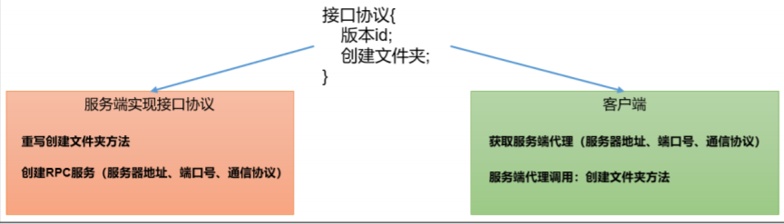

# **HDFS、YARN、MapReduce三者关系**


## **模拟 RPC 的客户端、服务端、通信协议三者如何工作？**




## **NameNode 启动源码解析**


### **NameNode工作机制**


*1 加载编辑 日志和镜像 文件到内存*
*2 元数据的增删改请求 /user/atguigu/ss.avi*
*3记录操作日志、 更新滚动日志*
*4 内存数据增删改*

*1 请求是否需 要CheckPoint*
*2 请求执行 CheckPoint*
*3 滚动正在写的Edits*
*4 拷贝到2nn*
*5 加载到内存 并合并*
*6 生成新的 Fsimage*
*7 拷贝到nn*
*8重命名成Fsimage*


***CheckPoint触发条件：***
*1）定时时间到*
*2）Edits中的数据满了*


## **DataNode启动源码解析**


### **DataNode工作机制**

1 DataNode启动后向 NameNode注册
2 注册成功(2 DataNode注册成功)
3 以后每周期（ 6小时）上报所 有块信息。
4 心跳每3秒一 次，心跳返回 结果带有 NameNode给 该DataNode的 命令
5 超过10分钟+30秒没有 收到DataNode2的心跳， 则认为该节点不可用


## **HDFS上传源码解析**


### **HDFS的写数据流程**

1 向NameNode请求上传文件/user/atguigu/ss.avi
2 响应可以上传文件
3 请求上传第一个Block（0-128M），请返回DataNode
4返回dn1，dn2，dn3节点，表示采用这三个节点存储数据
5 请求建立Block传输通道（机器之间应答）
6 dn1应答成功（机器之间建立通道）
7 传输数据 Packet（64k） packet（chunk512byte+chunksum4byte）
8 传输数据完成


### **HDFS 写数据流程**
详细步骤解析： 
1、 client 发起文件上传请求，通过 RPC 与 NameNode 建立通讯，NameNode检查目标文件是否已存在，父目录是否存在，返回是否可以上传；


2、 client 请求第一个 block 该传输到哪些 DataNode 服务器上；


3、 NameNode 根据配置文件中指定的备份数量及机架感知原理进行文件分配，返回可用的 DataNode 的地址如：A，B，C；注：Hadoop 在设计时考虑到数据的安全与高效，数据文件默认在 HDFS 上存放三份，存储策略为本地一份，同机架内其它某一节点上一份，不同机架的某一节点上一份。


4、 client 请求 3 台 DataNode 中的一台 A 上传数据（本质上是一个 RPC 调用，建立 pipeline），A 收到请求会继续调用 B，然后 B 调用 C，将整个pipeline 建立完成，后逐级返回 client；


5、 client 开始往 A 上传第一个 block（先从磁盘读取数据放到一个本地内存缓存），以 packet 为单位（默认 64K），A 收到一个 packet 就会传给 B，B 传给 C；A 每传一个 packet 会放入一个应答队列等待应答。


6、 数据被分割成一个个 packet 数据包在 pipeline 上依次传输，在pipeline 反方向上，逐个发送 ack（命令正确应答），最终由 pipeline中第一个 DataNode 节点 A 将 pipeline ack 发送给 client;


7、 当一个 block 传输完成之后，client 再次请求 NameNode 上传第二个block 到服务器。


### **HDFS 读数据流程**
1、 Client 向 NameNode 发起 RPC 请求，来确定请求文件 block 所在的位置；


2、 NameNode会视情况返回文件的部分或者全部block列表，对于每个block，NameNode 都会返回含有该 block 副本的 DataNode 地址；


3、 这些返回的 DN 地址，会按照集群拓扑结构得出 DataNode 与客户端的距离，然后进行排序，排序两个规则：网络拓扑结构中距离 Client 近的排靠前；心跳机制中超时汇报的 DN 状态为 STALE，这样的排靠后；


4、 Client 选取排序靠前的 DataNode 来读取 block，如果客户端本身就是DataNode,那么将从本地直接获取数据；


5、 底层上本质是建立 Socket Stream（FSDataInputStream），重复的调用父类 DataInputStream 的 read 方法，直到这个块上的数据读取完毕；


6、 当读完列表的 block 后，若文件读取还没有结束，客户端会继续向NameNode 获取下一批的 block 列表；


7、 读取完一个 block 都会进行 checksum 验证，如果读取 DataNode 时出现错误，客户端会通知 NameNode，然后再从下一个拥有该 block 副本的DataNode 继续读。


8、 read 方法是并行的读取 block 信息，不是一块一块的读取；NameNode 只是返回Client请求包含块的DataNode地址，并不是返回请求块的数据；


9、 最终读取来所有的 block 会合并成一个完整的最终文件。


## **YARN源码解析**


### **YARN工作机制**


*0 Mr程序提交到客 户端所在的节点*
*1 申请一个Application*
*2 Application资源提交路径 hdfs://…./.staging以及 application_id* 
*3 提交job运 行所需资源*
*4 资源提交完毕，申请运行mrAppMaster*
*5 将用户的请求初始化成一个Task*
*6 领取到 Task任务*
*7 创建容器 Container*
*8 下载job资 源到本地*
*9 申请运行 MapTask容器*
*10 领取到任 务，创建容器*
*11 发送程 序启动脚本*
*12 向RM申请2个 容器，运行 ReduceTask程序*
*13 Reduce向 Map获取相应 分区的数据*
*14 程序运行完后， MR会向RM注销自己*


## **MapReduce 源码解析**

```java
// 1）Job 提交流程源码详解
waitForCompletion()
submit();
// 1 建立连接
connect();
// 1）创建提交 Job 的代理
new Cluster(getConfiguration());
// （1）判断是本地运行环境还是 yarn 集群运行环境
initialize(jobTrackAddr, conf);
// 2 提交 job
submitter.submitJobInternal(Job.this, cluster)
// 1）创建给集群提交数据的 Stag 路径
Path jobStagingArea = JobSubmissionFiles.getStagingDir(cluster, conf);
// 2）获取 jobid ，并创建 Job 路径
JobID jobId = submitClient.getNewJobID();
// 3）拷贝 jar 包到集群
copyAndConfigureFiles(job, submitJobDir);
rUploader.uploadFiles(job, jobSubmitDir);
// 4）计算切片，生成切片规划文件
writeSplits(job, submitJobDir);
maps = writeNewSplits(job, jobSubmitDir);
input.getSplits(job);
// 5）向 Stag 路径写 XML 配置文件
writeConf(conf, submitJobFile);
conf.writeXml(out);
// 6）提交 Job,返回提交状态
status = submitClient.submitJob(jobId, submitJobDir.toString(),
job.getCredentials());
```


### **Job提交流程源码解析**


### FileInputFormat 切片源码解析（input.getSplits(job)）


FileInputFormat切片源码解析

（1）程序先找到你数据存储的目录。
（2）开始遍历处理（规划切片）目录下的每一个文件
（3）遍历第一个文件ss.txt


a）获取文件大小fs.sizeOf(ss.txt)
b）计算切片大小	

```java
computeSplitSize(Math.max(minSize,Math.min(maxSize,blocksize)))=blocksize=128M
```

c）默认情况下，切片大小=blocksize
d）开始切，形成第1个切片：ss.txt—0:128M 第2个切片ss.txt—128:256M 第3个切片ss.txt—256M:300M

（每次切片时，都要判断切完剩下的部分是否大于块的1.1倍，不大于1.1倍就划分一块切片）
e）将切片信息写到一个切片规划文件中 
f）整个切片的核心过程在getSplit()方法中完成 
g）InputSplit只记录了切片的元数据信息，比如起始位置、长度以及所在的节点列表等。


（4）提交切片规划文件到YARN上，YARN上的MrAppMaster就可以根据切片规划文件计算开启MapTask个数。


### **MapTask & ReduceTask 源码解析;**

#### 1）MapTask 源码解析流程


#### 2）ReduceTask 源码解析流程


