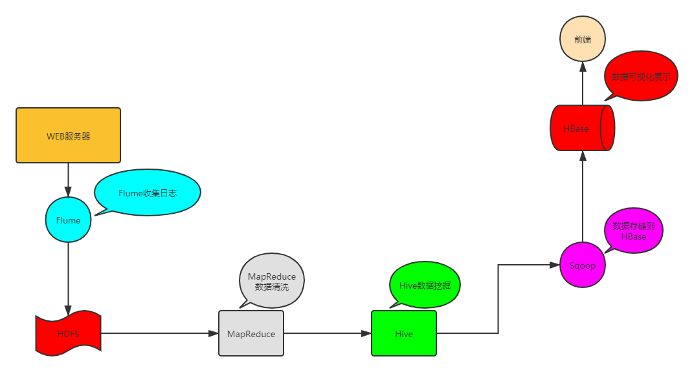

# 🤔👀**Hadoop 3.X简介**

## **Hadoop 3.X简介**

过去十年，Apache Hadoop从无到有，从理论概念演变到如今支撑起若干的生产集群。接下来的十年，Hadoop将继续壮大，并发展支撑新一轮的更大规模、高效和稳定的集群。

介绍即将到来的**Apache Hadoop 3.0新版本**——从版本发布状态、背后的故事，到如HDFS erasure coding、YARN federation、NN k-safety等全新的功能。

发行的Hadoop版本：hadoop-3.1.0，这是Apache Hadoop 3.1版本的第一个版本，它包含768个错误修复，自3.0.0以来最新的改进和增强版本。

由于Hadoop 2.0是基于JDK 1.7开发的，而JDK 1.7在2015年4月已停止更新，这直接迫使Hadoop社区基于JDK 1.8重新发布一个新的Hadoop版本，即hadoop 3.0。Hadoop 3.0中引入了一些重要的功能和优化，包括**HDFS 可擦除编码**、**多Namenode支持**、**MR Native Task优化**、**YARN基于cgroup的内存和磁盘IO隔离**、**YARN container resizing**等。

Apache hadoop 项目组最新消息，hadoop3.x以后将会调整方案架构，将**Mapreduce 基于内存+io+磁盘，共同处理数据**。

改变最大的是hdfs,hdfs **通过最近block块计算**，根据最近计算原则，本地block块，加入到内存，先计算，通过IO，共享内存计算区域，最后快速形成计算结果，比Spark快10倍。

## **Hadoop 3.0新特性**

Hadoop 3.0在功能和性能方面，对hadoop内核进行了多项重大改进，主要包括：

### 通用性

1.精简Hadoop内核，包括剔除过期的API和实现，将默认组件实现替换成最高效的实现（比如将FileOutputCommitter缺省实现换为v2版本，废除hftp转由webhdfs替代，移除Hadoop子实现序列化库org.apache.hadoop.Records。

2.Classpath isolation：以防止不同版本jar包冲突，比如google Guava在混合使用Hadoop、HBase和Spark时，很容易产生冲突。

3.Shell脚本重构： Hadoop 3.0对Hadoop的管理脚本进行了重构，修复了大量bug，增加了新特性，支持动态命令等。

### Hadoop HDFS

Hadoop3.x中Hdfs在可靠性和支持能力上作出很大改观：

1.HDFS支持数据的擦除编码，这使得HDFS在不降低可靠性的前提下，节省一半存储空间。

2.多NameNode支持，即支持一个集群中，一个active、多个standby namenode部署方式。注：多ResourceManager特性在hadoop 2.0中已经支持。

###  **Hadoop MapReduce**

Hadoop3.X中的MapReduce较之前的版本作出以下更改：

1.Tasknative优化：为MapReduce增加了C/C++的map output collector实现（包括Spill，Sort和IFile等），通过作业级别参数调整就可切换到该实现上。对于shuffle密集型应用，其性能可提高约30%。

2.MapReduce内存参数自动推断。在Hadoop 2.0中，为MapReduce作业设置内存参数非常繁琐，涉及到两个参数：mapreduce.{map,reduce}.memory.mb和mapreduce.{map,reduce}.java.opts，一旦设置不合理，则会使得内存资源浪费严重，比如将前者设置为4096MB，但后者却是“-Xmx2g”，则剩余2g实际上无法让java heap使用到。

### Yarn

Yarn Timeline Service V2提供一个通用的应用程序共享信息和共享存储模块。可以将metrics等信息保存。

可以实现分布式writer实例和一个可伸缩的存储模块。同时，v2版本在稳定性和性能上面也做出了提升，原先版本不适用于大集群，v2版本使用hbase取代了原先的leveldb作为后台的存储工具。

### HDFS纠删码

在Hadoop3.X中，HDFS实现了Erasure Coding这个新功能。Erasure coding纠删码技术简称EC，是一种数据保护技术.最早用于通信行业中数据传输中的数据恢复，是一种编码容错技术。

它通过在原始数据中加入新的校验数据，使得各个部分的数据产生关联性。在一定范围的数据出错情况下，通过纠删码技术都可以进行恢复。

hadoop-3.0之前，HDFS存储方式为每一份数据存储3份，这也使得存储利用率仅为1/3，hadoop-3.0引入纠删码技术(EC技术)，实现1份数据+0.5份冗余校验数据存储方式。

与副本相比纠删码是一种更节省空间的数据持久化存储方法。标准编码(比如Reed-Solomon(10,4))会有1.4 倍的空间开销；然而HDFS副本则会有3倍的空间开销。

因为纠删码额外开销主要是在**重建和执行远程读，它传统用于存储冷数据，即不经常访问的数据**。当部署这个新特性时用户应该考虑纠删码的网络和CPU 开销。 

### MapReduce优化

Hadoop3.x中的MapReduce添加了Map输出collector的本地实现，对于shuffle密集型的作业来说，这将会有30%以上的性能提升。

### 支持多个NameNodes 

最初的HDFS NameNode high-availability实现仅仅提供了一个**active NameNode**和一个**Standby NameNode**；并且通过将编辑日志复制到三个JournalNodes上，这种架构能够容忍系统中的任何一个节点的失败。

然而，一些部署需要更高的容错度。我们可以通过这个新特性来实现，其允许用户运行多个Standby NameNode。比如通过配置三个NameNode和五个JournalNodes，这个系统可以容忍2个节点的故障，而不是仅仅一个节点。

### 默认端口更改

在hadoop3.x之前，多个Hadoop服务的默认端口都属于Linux的临时端口范围（32768-61000）。这就意味着用户的服务在启动的时候可能因为和其他应用程序产生端口冲突而无法启动。

现在这些可能会产生冲突的端口已经不再属于临时端口的范围，这些端口的改变会影响NameNode, Secondary NameNode, DataNode以及KMS。与此同时，官方文档也进行了相应的改变，具体可以参见 HDFS-9427以及HADOOP-12811。 

Namenode ports: 50470 --> 9871, 50070--> 9870, 8020 --> 9820

Secondary NN ports: 50091 --> 9869,50090 --> 9868

Datanode ports: 50020 --> 9867, 50010--> 9866, 50475 --> 9865, 50075 --> 9864

Kms server ports: 16000 --> 9600 (原先的16000与HMaster端口冲突)

### 数据节点均衡器 

一个DataNode可以管理多个磁盘，正常写入操作，各磁盘会被均匀填满。然而，当添加或替换磁盘时可能导致此DataNode内部的磁盘存储的数据严重内斜。

这种情况现有的HDFS balancer是无法处理的。这种情况是由新intra-DataNode平衡功能来处理，通过hdfs diskbalancer CLI来调用，更多请参考HDFS Commands Guide。

### 新的守护进程&堆内存管理

Hadoop守护进程和MapReduce任务的堆内存管理发生了一系列变化。 

HADOOP-10950：介绍了配置守护集成heap大小的新方法。主机内存大小可以自动调整，HADOOP_HEAPSIZE 已弃用。

MAPREDUCE-5785：map和reduce task堆大小的配置方法，所需的堆大小不再需要通过任务配置和Java选项实现，已经指定的现有配置不受此更改影响。

### YARN 资源类型

 YARN 资源模型（YARN resource model）已被推广为支持用户自定义的可数资源类型（support user-defined countable resource types），不仅仅支持 CPU 和内存。

比如集群管理员可以定义诸如 GPUs、软件许可证（software licenses）或本地附加存储器（locally-attached storage）之类的资源。YARN 任务可以根据这些资源的可用性进行调度。

### 队列配置

OrgQueue 扩展了 capacity scheduler ，通过 REST API 提供了以编程的方式来改变队列的配置，This enables automation of queue configuration management by administrators in the queue’s administer_queue ACL。

### Shell脚本重写

1.增加了参数冲突检测，避免重复定义和冗余参数

2.CLASSPATH, JAVA_LIBRARY_PATH, and LD_LIBRARY_PATH等参数的去重，缩短环境变量

3.shell脚本重构，将更多的代码加入function中，提供重载，删除重复代码，便于测试

4.脚本清理和简化

5.尽可能与当前系统保持兼容

6.提供一份Hadoop环境变量列表

### 磁盘平衡器

Hadoop3.x支持单个Datanode上，不同硬盘间的数据balancer。老版本的hadoop只支持在Datanode之间进行balancer，每个节点内部不同硬盘之间若发生了数据不平衡，则没有一个好的办法进行处理。

现在可以通过**hdfs diskbalancer**命令，**进行节点内部硬盘间的数据平衡**。该功能默认是关闭的，需要手动设置参数**dfs.disk.balancer.enabled**为**true**来开启。

