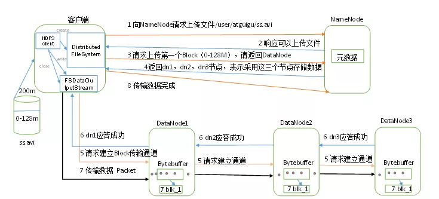
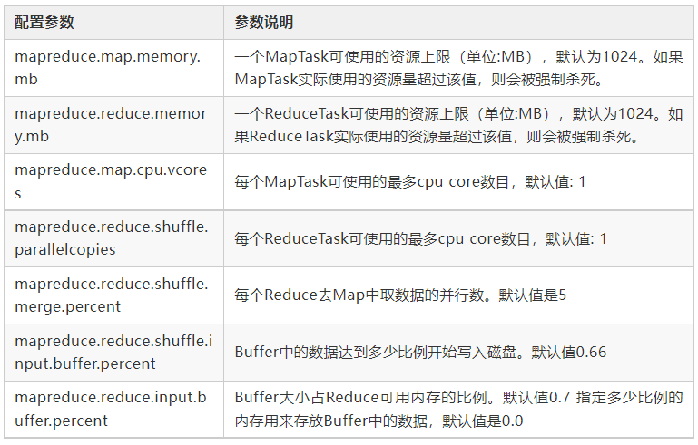
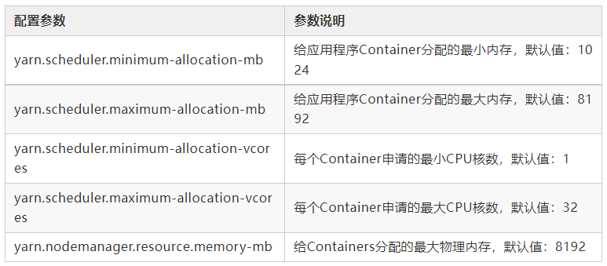
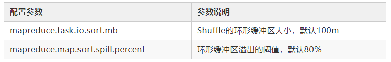
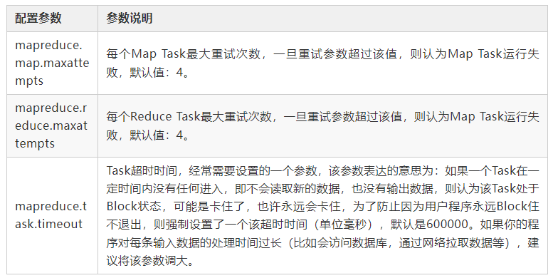
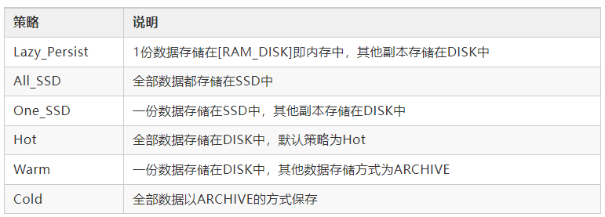

# 🤔👀 Hadoop总结与面试

## 栏目：

1. HDFS读流程和写流程？

2. NameNode和Secondary NameNode工作机制？

3. HA NameNode如何工作？

4. DataNode工作机制？

5. DataNode数据损坏怎么办？

6. 压缩方式怎么选择？

7. MapReduce工作流程？

8. Yarn工作机制（作业提交全过程）是什么？

9. Yarn调度器了解多少？

10. HDFS小文件怎么处理？

11. Shuffle及优化？

12. Hadoop解决数据倾斜方法？

13. Hadoop的参数优化？

14. 异构存储（冷热数据分离）

### **HDFS写数据流程**

（1）客户端通过Distributed FileSystem模块向NameNode请求上传文件，NameNode检查目标文件是否已存在，		 父目录是否存在。

（2）NameNode返回是否可以上传。

（3）客户端请求第一个 Block上传到哪几个DataNode服务器上。

（4）NameNode返回3个DataNode节点，分别为dn1、dn2、dn3。

（5）客户端通过FSDataOutputStream模块请求dn1上传数据，dn1收到请求会继续调用dn2，然后dn2调用dn3，	 	将这个通信管道建立完成。

（6）dn1、dn2、dn3逐级应答客户端。

（7）客户端开始往dn1上传第一个Block（先从磁盘读取数据放到一个本地内存缓存），以Packet为单位，dn1收	 	到一个Packet就会传给dn2，dn2传给dn3；dn1每传一个packet会放入一个应答队列等待应答。

（8）当一个Block传输完成之后，客户端再次请求NameNode上传第二个Block的服务器。（重复执行3-7步）。

### **HDFS读数据流程**

.webp)

1）客户端通过Distributed FileSystem向NameNode请求下载文件，NameNode通过查询元数据，找到文件块所在	 的DataNode地址。

（2）挑选一台DataNode（就近原则，然后随机）服务器，请求读取数据。

（3）DataNode开始传输数据给客户端（从磁盘里面读取数据输入流，以Packet为单位来做校验）。

（4）客户端以Packet为单位接收，先在本地缓存，然后写入目标文件。

## NameNode和Secondary NameNode工作机制

先认识NameNode的结构

.webp)

###### Fsimage

Fsimage文件是HDFS文件系统元数据的一个永久性检查点，其中包含HDFS文件系统的所有目录和文件inode的序列化信息。

###### Edits文件

存放HDFS文件系统的所有更新操作的逻辑，文件系统客户端执行的所有写操作首先会记录大Edits文件中。

###### Seen_txid

文件保存是一个数字，就是最后一个edits_的数字。

思考：NameNode中的元数据是存储在哪里的？

首先，我们做个假设，如果存储在NameNode节点的磁盘中，因为经常需要进行随机访问，还有响应客户请求，必然是效率过低。因此，元数据需要存放在内存中。但如果只存在内存中，一旦断电，元数据丢失，整个集群就无法工作了。因此产生在磁盘中备份元数据的FsImage。

这样又会带来新的问题，当在内存中的元数据更新时，如果同时更新FsImage，就会导致效率过低，但如果不更新，就会发生一致性问题，一旦NameNode节点断电，就会产生数据丢失。因此，引入Edits文件(只进行追加操作，效率很高)。每当元数据有更新或者添加元数据时，修改内存中的元数据并追加到Edits中。这样，一旦NameNode节点断电，可以通过FsImage和Edits的合并，合成元数据。

但是，如果长时间添加数据到Edits中，会导致该文件数据过大，效率降低，而且一旦断电，恢复元数据需要的时间过长。因此，需要定期进行FsImage和Edits的合并，如果这个操作由NameNode节点完成，又会效率过低。因此，引入一个新的节点SecondaryNamenode，专门用于FsImage和Edits的合并。

所以NameNode的工作机制是这样的：

.webp)

###### 第一阶段：NameNode启动

（1）第一次启动NameNode格式化后，创建Fsimage和Edits文件。如果不是第一次启动，直接加载编辑日志和镜		 像文件到内存。

（2）客户端对元数据进行增删改的请求。

（3）NameNode记录操作日志，更新滚动日志。

（4）NameNode在内存中对元数据进行增删改。

###### 第二阶段：Secondary NameNode工作

（1）Secondary NameNode询问NameNode是否需要CheckPoint。直接带回NameNode是否检查结果。

（2）Secondary NameNode请求执行CheckPoint。

（3）NameNode滚动正在写的Edits日志。

（4）将滚动前的编辑日志和镜像文件拷贝到Secondary NameNode。

（5）Secondary NameNode加载编辑日志和镜像文件到内存，并合并。

（6）生成新的镜像文件fsimage.chkpoint。

（7）拷贝fsimage.chkpoint到NameNode。

（8）NameNode将fsimage.chkpoint重新命名成fsimage。

### HA NameNode如何工作？

在一个典型的HA集群中，每个NameNode是一台独立的服务器。在任一时刻，只有一个NameNode处于active状态，另一个处于standby状态。其中，active状态的NameNode负责所有的客户端操作，standby状态的NameNode处于从属地位，维护着数据状态，随时准备切换。

两个NameNode为了数据同步，会通过一组称作JournalNodes的独立进程进行相互通信。当active状态的NameNode的命名空间有任何修改时，会告知大部分的JournalNodes进程。standby状态的NameNode有能力读取JNs中的变更信息，并且一直监控edit log的变化，把变化应用于自己的命名空间。standby可以确保在集群出错时，命名空间状态已经完全同步。

为了确保快速切换，standby状态的NameNode有必要知道集群中所有数据块的位置。为了做到这点，所有的datanodes必须配置两个NameNode的地址，发送数据块位置信息和心跳给他们两个。

对于HA集群而言，确保同一时刻只有一个NameNode处于active状态是至关重要的。否则，两个NameNode的数据状态就会产生分歧，可能丢失数据，或者产生错误的结果。为了保证这点，JNs必须确保同一时刻只有一个NameNode可以向自己写数据。

.webp)

###### ZKFC

ZKFC即ZKFailoverController，作为独立进程存在，负责控制NameNode的主备切换，ZKFC会监测NameNode的健康状况，当发现Active NameNode出现异常时会通过Zookeeper集群进行一次主备选举，完成Active和Standby状态的切换。

###### HealthMonitor

定时调用NameNode的HAServiceProtocol RPC接口(monitorHealth和getServiceStatus)，监控NameNode的健康状态并向ZKFC反馈。

###### ActiveStandbyElector

接收ZKFC的选举请求，通过Zookeeper自动完成主备选举，选举完成后回调ZKFC的主备切换方法对NameNode进行Active和Standby状态的切换。

###### JouranlNode集群

共享存储系统，负责存储HDFS的元数据，Active NameNode(写入)和Standby NameNode(读取)通过共享存储系统实现元数据同步，在主备切换过程中，新的Active NameNode必须确保元数据同步完成才能对外提供服务。

### DataNode工作机制

.webp)

（1）一个数据块在DataNode上以文件形式存储在磁盘上，包括两个文件，一个是数据本身，一个是元数据包括		 数据块的长度，块数据的校验和，以及时间戳。

（2）DataNode启动后向NameNode注册，通过后，周期性（1小时）的向NameNode上报所有的块信息。

（3）心跳是每3秒一次，心跳返回结果带有NameNode给该DataNode的命令如复制块数据到另一台机器，或删除		 某个数据块。如果超过10分钟没有收到某个DataNode的心跳，则认为该节点不可用。

（4）集群运行中可以安全加入和退出一些机器。

## DataNode数据损坏

（1）当DataNode读取Block的时候，它会计算CheckSum。

（2）如果计算后的CheckSum，与Block创建时值不一样，说明Block已经损坏。

（3）Client读取其他DataNode上的Block。

（4）DataNode在其文件创建后周期验证CheckSum。

### 压缩

###### gzip压缩

**「应用场景」**：当每个文件压缩之后在130M以内的（1个块大小内），都可以考虑用gzip压缩格式。譬如说一天或  

  者一个小时的日志压缩成一个gzip文件，运行mapreduce程序的时候通过多个gzip文件达到并发。hive程序，	

  streaming程序，和java写的mapreduce程序完全和文本处理一样，压缩之后原来的程序不需要做任何修改。

**「优点」**：压缩率比较高，而且压缩/解压速度也比较快；hadoop本身支持，在应用中处理gzip格式的文件就和直

  接处理文本一样；有hadoop native库；大部分linux系统都自带gzip命令，使用方便。

**「缺点」**：不支持split。

###### snappy压缩

**「应用场景」**：当mapreduce作业的map输出的数据比较大的时候，作为map到reduce的中间数据的压缩格式；或 

  者作为一个mapreduce作业的输出和另外一个mapreduce作业的输入。

**「优点」**：高速压缩速度和合理的压缩率；支持hadoop native库。

**「缺点」**：不支持split；压缩率比gzip要低；hadoop本身不支持，需要安装；linux系统下没有对应的命令。

###### lzo压缩

**「应用场景」**：一个很大的文本文件，压缩之后还大于200M以上的可以考虑，而且单个文件越大，lzo优点越越明 

  显。

**「优点」**：压缩/解压速度也比较快，合理的压缩率；支持split，是hadoop中最流行的压缩格式；支持hadoop 

  native库；可以在linux系统下安装lzop命令，使用方便。

**「缺点」**：压缩率比gzip要低一些；hadoop本身不支持，需要安装；在应用中对lzo格式的文件需要做一些特殊处 

  理（为了支持split需要建索引，还需要指定inputformat为lzo格式）。

###### bzip2压缩

**「应用场景」**：适合对速度要求不高，但需要较高的压缩率的时候，可以作为mapreduce作业的输出格式；或者

  输出之后的数据比较大，处理之后的数据需要压缩存档减少磁盘空间并且以后数据用得比较少的情况；或者对单 

  个很大的文本文件想压缩减少存储空间，同时又需要支持split，而且兼容之前的应用程序（即应用程序不需要修 

  改）的情况。

**「优点」**：支持split；具有很高的压缩率，比gzip压缩率都高；hadoop本身支持，但不支持native；在linux系统下

  自带bzip2命令，使用方便。

**「缺点」**：压缩/解压速度慢

### MapReduce工作流程

**MapTask工作流**

.webp)

（1）Read阶段：MapTask通过用户编写的RecordReader，从输入InputSplit中解析出一个个key/value。

（2）Map阶段：该节点主要是将解析出的key/value交给用户编写map()函数处理，并产生一系列新的key/value。

（3）Collect收集阶段：在用户编写map()函数中，当数据处理完成后，一般会调用OutputCollector.collect()输出结	     果。在该函数内部，它会将生成的key/value分区（调用Partitioner），并写入一个环形内存缓冲区中。

（4）Spill阶段：即“溢写”，当环形缓冲区满后，MapReduce会将数据写到本地磁盘上，生成一个临时文件。需要	     注意的是，将数据写入本地磁盘之前，先要对数据进行一次本地排序，并在必要时对数据进行合并、压缩等		 操作。

溢写阶段详情：
步骤1：利用快速排序算法对缓存区内的数据进行排序，排序方式是，先按照分区编号Partition进行排序，然后按照**key**进行排序。这样，经过排序后，数据以分区为单位聚集在一起，且同一分区内所有数据按照**key**有序。

步骤2：按照分区编号由小到大依次将每个分区中的数据写入任务工作目录下的临时文件**output**/spillN.**out**（N表示当前溢写次数）中。如果用户设置了Combiner，则写入文件之前，对每个分区中的数据进行一次聚集操作。

步骤3：将分区数据的元信息写到内存索引数据结构SpillRecord中，其中每个分区的元信息包括在临时文件中的偏移量、压缩前数据大小和压缩后数据大小。如果当前内存索引大小超过1MB，则将内存索引写到文件**output**/spillN.**out**.**index**中。

（5）Combine阶段：当所有数据处理完成后，MapTask对所有临时文件进行一次合并，以确保最终只会生成一个		 数据文件。

**ReduceTask工作流**

.webp)

（1）Copy阶段：ReduceTask从各个MapTask上远程拷贝一片数据，并针对某一片数据，如果其大小超过一定阈	     值，则写到磁盘上，否则直接放到内存中。

（2）Merge阶段：在远程拷贝数据的同时，ReduceTask启动了两个后台线程对内存和磁盘上的文件进行合并，以	 	防止内存使用过多或磁盘上文件过多。

（3）Sort阶段：按照MapReduce语义，用户编写reduce()函数输入数据是按key进行聚集的一组数据。为了将key		 相同的数据聚在一起，Hadoop采用了基于排序的策略。由于各个MapTask已经实现对自己的处理结果进行	      了局部排序，因此，ReduceTask只需对所有数据进行一次归并排序即可。

（4）Reduce阶段：reduce()函数将计算结果写到HDFS上。

### Yarn工作流（作业提交全过程）

.webp)

###### 1.作业提交 

（1）Client调用job.waitForCompletion方法，向整个集群提交MapReduce作业。

（2）Client向RM申请一个作业id。

（3）RM给Client返回该job资源的提交路径和作业id。

（4）Client提交jar包、切片信息和配置文件到指定的资源提交路径。

（5）Client提交完资源后，向RM申请运行MrAppMaster。

###### 2.作业初始化

（6）当RM收到Client的请求后，将该job添加到容量调度器中。

（7）某一个空闲的NM领取到该Job。

（8）该NM创建Container，并产生MRAppmaster。

（9）下载Client提交的资源到本地。

###### 3.任务分配

（10）MrAppMaster向RM申请运行多个MapTask任务资源。

（11）RM将运行MapTask任务分配给另外两个NodeManager，另两个NodeManager分别领取任务并创建容器。

###### 4.任务运行

（12）MR向两个接收到任务的NodeManager发送程序启动脚本，这两个NodeManager分别启动MapTask，	

​		   MapTask对数据分区排序。

（13）MrAppMaster等待所有MapTask运行完毕后，向RM申请容器，运行ReduceTask。

（14）ReduceTask向MapTask获取相应分区的数据。

（15）程序运行完毕后，MR会向RM申请注销自己。

###### 5.进度和状态更新

YARN中的任务将其进度和状态(包括counter)返回给应用管理器, 客户端每秒(通过mapreduce.client.progressmonitor.pollinterval设置)向应用管理器请求进度更新, 展示给用户。

###### 6.作业完成

除了向应用管理器请求作业进度外, 客户端每5秒都会通过调用waitForCompletion()来检查作业是否完成。时间间隔可以通过mapreduce.client.completion.pollinterval来设置。作业完成之后, 应用管理器和Container会清理工作状态。作业的信息会被作业历史服务器存储以备之后用户核查。

### Yarn调度器

**先进先出调度器（FIFO）**

.webp)

把应用按提交的顺序排成一个队列，这是一个先进先出队列，在进行资源分配的时候，先给队列中最头上的应用进行分配资源，待最头上的应用需求满足后再给下一个分配。

**容量调度器（Capacity Scheduler）**

.webp)

以队列为单位划分资源，每个队列可设定一定比例的资源最低保证和使用上限，同时，每个用户也可设定一定的资源使用上限以防止资源滥用。而当一个队列的资源有剩余时，可暂时将剩余资源共享给其他队列。

**特点** 

（1）可为每个队列设置资源最低保证和资源使用上限，而所有提交到该队列的应用程序共享这些资源

（2）如果一个队列中的资源有剩余，可以暂时共享给那些需要资源的队列，而一旦该队列有新的应用程序提	

​		 交，则其他队列释放的资源会归还给该队列

（3）支持多用户共享集群和多应用程序同时运行。为防止单个应用程序、用户或队列独占集群中的资源，可为之		 增加多重约束（比如单个应用程序同时运行的任务数等）

（4）每个队列有严格的ACL列表规定它的访问用户，每个用户可指定哪些用户允许查看自己应用程序的运行状态		 或者控制应用程序（比如杀死应用程序）。

**公平调度器（Fair Scheduler）**

.webp)

公平调度器可以为所有的应用“平均公平”分配资源，当然，这种“公平”是可以配置的，称为权重，可以在分配文件中为每一个队列设置分配资源的权重，如果没有设置，默认是1（由于默认权重相同，因此，在不做配置的情况下，作业（队列）之间的资源占比相同）。

**具有以下特点：**

（1）允许资源共享,即当一个APP运行时,如果其它队列没有任务执行,则可以使用其它队列(不属于该APP的队列),		 当其它队列有APP需要资源时再将占用的队列释放出来.所有的APP都从资源队列中分配资源。

（2）当队列中有任务,该队列将至少获得最小资源.当队列资源使用不完时,可以给其它队列使用。

（3）当队列不能满足最小资源时,可以从其它队列抢占。

### HDFS小文件处理

###### HDFS小文件弊端

HDFS上每个文件都要在NameNode上建立一个索引，这个索引的大小约为150byte，这样当小文件比较多的时候，就会产生很多的索引文件，一方面会大量占用NameNode的内存空间，另一方面就是索引文件过大使得索引速度变慢。

###### HDFS小文件解决方案

（1）Hadoop Archive Hadoop Archive或者HAR，是一个高效地将小文件放入HDFS块中的文件存档工具，它能		 够将多个小文件打包成一个HAR文件，这样在减少namenode内存使用的同时，仍然允许对文件进行透明的		 访问。

（2）Sequence file sequence file由一系列的二进制key/value组成，如果为key小文件名，value为文件内容，则		 可以将大批小文件合并成一个大文件。

（3）CombineFileInputFormat 用于将多个文件合并出成单独的Split，另外，它会考虑数据的存储位置。

（4）开启JVM重用 原理：一个Map运行在一个JVM上，开启重用的话，该Map在JVM上运行完毕后，JVM继续运		 行其他Map。（mapreduce.job.jvm.numtasks） ，对于大量小文件Job，可以减少45%运行时间

### Shuffle及优化

###### Shuffle过程

Map方法之后，Reduce方法之前的数据处理过程称之为Shuffle

参考上面：**MapReduce工作流程**

###### Map阶段优化

（1）增大环形缓冲区大小。由100m扩大到200m （2）增大环形缓冲区溢写的比例。由80%扩大到90% （3）减		 少对溢写文件的merge次数。（10个文件，一次20个merge） （4）不影响实际业务的前提下，采用		

​		 Combiner提前合并，减少 I/O。

###### Reduce阶段优化

（1）合理设置Map和Reduce数：两个都不能设置太少，也不能设置太多。太少，会导致Task等待，延长处理时		间；太多，会导致 Map、Reduce任务间竞争资源，造成处理超时等错误。

（2）设置Map、Reduce共存：调整slowstart.completedmaps参数，使Map运行到一定程度后，Reduce也开始运		 行，减少Reduce的等待时间。

（3）规避使用Reduce，因为Reduce在用于连接数据集的时候将会产生大量			的网络消耗。（4）增加每个		 Reduce去Map中拿数据的并行数 （5）集群性能可以的前提下，增大Reduce端存储数据内存的大小。

###### IO传输

采用数据压缩的方式，减少网络IO的的时间。安装Snappy和LZOP压缩编码器。压缩：（1）map输入端主要考虑数据量大小和切片，支持切片的有Bzip2、LZO。注意：LZO要想支持切片必须创建索引；（2）map输出端主要考虑速度，速度快的snappy、LZO；（3）reduce输出端主要看具体需求，例如作为下一个mr输入需要考虑切片，永久保存考虑压缩率比较大的gzip。

###### 其他Shuffle优化参考下文：参数优化

### Hadoop解决数据倾斜方法

###### 提前在map进行combine，减少传输的数据量

在Mapper加上combiner相当于提前进行reduce，即把一个Mapper中的相同key进行了聚合，减少shuffle过程中传输的数据量，以及Reducer端的计算量。如果导致数据倾斜的key大量分布在不同的mapper的时候，这种方法就不是很有效了。

###### 导致数据倾斜的key 大量分布在不同的mapper

（1）局部聚合加全局聚合。

​		 第一次在map阶段对那些导致了数据倾斜的key 加上1到n的随机前缀，这样本来相同的key 也会被分到多个		 Reducer中进行局部聚合，数量就会大大降低。

​		 第二次mapreduce，去掉key的随机前缀，进行全局聚合。思想：二次mr，第一次将key随机散列到不同		 reducer进行处理达到负载均衡目的。第二次再根据去掉key的随机前缀，按原key进行reduce处理。这个方		 法进行两次mapreduce，性能稍差。

（2） 增加Reducer，提升并行度:JobConf.setNumReduceTasks(int)

（3）实现自定义分区:根据数据分布情况，自定义散列函数，将key均匀分配到不同Reducer

### Hadoop的参数优化

**资源相关参数**

**YARN**

**Shuffle**

**容错相关参数**

## 异构存储（冷热数据分离）

所谓的异构存储就是将不同需求或者冷热的数据存储到不同的介质中去，实现既能兼顾性能又能兼顾成本。

###### 存储类型

HDFS异构存储支持如下4种类型，分别是：

- RAM_DISK（内存镜像文件系统）
- SSD（固态硬盘）
- DISK（普通磁盘，HDFS默认）
- ARCHIVE（计算能力弱而存储密度高的存储介质，一般用于归档）

以上四种自上到下，速度由快到慢，单位存储成本由高到低。

###### 存储策略

HDFS总共支持Lazy_Persist、All_SSD、One_SSD、Hot、Warm和Cold等6种存储策略。

