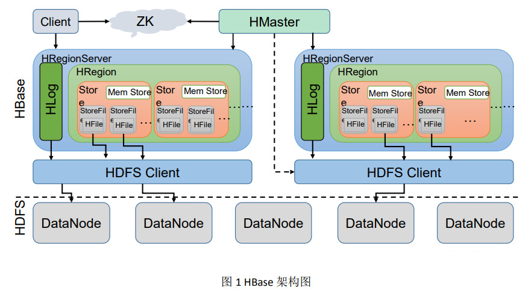
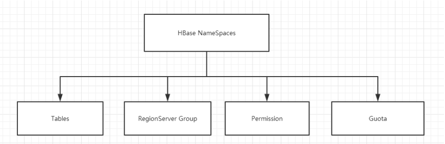
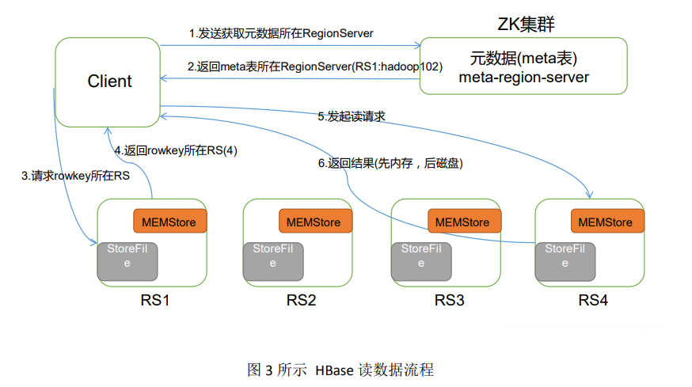
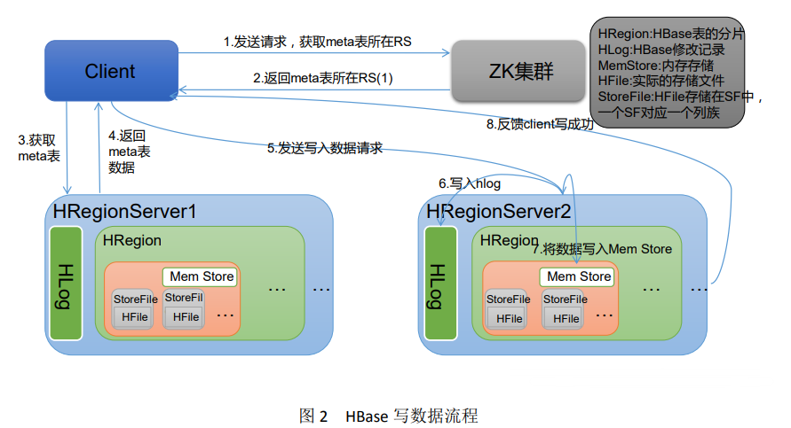
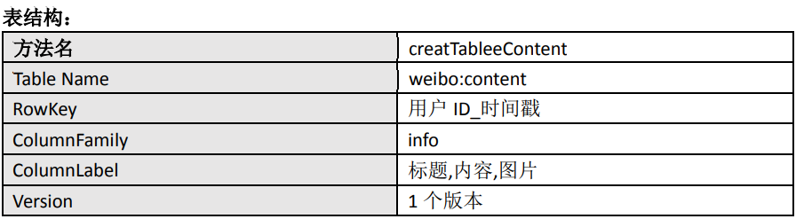
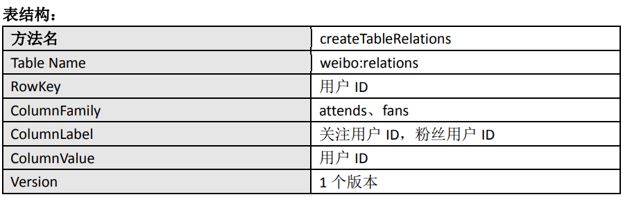
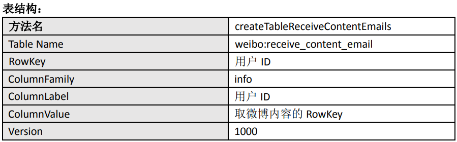
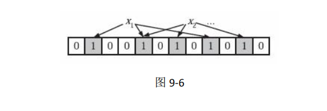
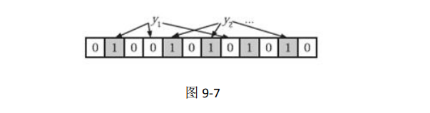

# HBase 详解

## 什么是 HBase？

HBase 的原型是 Google 的 BigTable 论文，受到了该论文思想的启发，目前作为 Hadoop 的子项目来开发维护，用于支持结构化的数据存储。 


官方网站：http://hbase.apache.org 

-- 2006 年 Google 发表 BigTable 白皮书

 -- 2006 年开始开发 HBase 

-- 2008 年北京成功开奥运会，程序员默默地将 HBase 弄成了 Hadoop 的子项目 

-- 2010 年 HBase 成为 Apache 顶级项目 -- 现在很多公司二次开发出了很多发行版本，你也开始使用了。 


HBase 是一个高可靠性、高性能、面向列、可伸缩的分布式存储系统，利用 HBASE 技 术可在廉价 PC Server 上搭建起大规模结构化存储集群。 HBase 的目标是存储并处理大型的数据，更具体来说是仅需使用普通的硬件配置，就能 够处理由成千上万的行和列所组成的大型数据。 


HBase 是 Google Bigtable 的开源实现，但是也有很多不同之处。比如：Google Bigtable 利用 GFS 作为其文件存储系统，HBase 利用 Hadoop HDFS 作为其文件存储系统；Google 运行 MAPREDUCE 来处理 Bigtable 中的海量数据，HBase 同样利用 Hadoop MapReduce 来 处理HBase 中的海量数据；Google Bigtable利用Chubby作为协同服务，HBase利用 Zookeeper 作为对应。


## HBase 特点

1）海量存储 

Hbase 适合存储 PB 级别的海量数据，在 PB 级别的数据以及采用廉价 PC 存储的情况下， 能在几十到百毫秒内返回数据。这与 Hbase 的极易扩展性息息相关。正式因为 Hbase 良好的 扩展性，才为海量数据的存储提供了便利。


2）列式存储 

这里的列式存储其实说的是列族存储，Hbase 是根据列族来存储数据的。列族下面可以 有非常多的列，列族在创建表的时候就必须指定。


3）极易扩展 

Hbase 的扩展性主要体现在两个方面，一个是基于上层处理能力（RegionServer）的扩 展，一个是基于存储的扩展（HDFS）。 通过横向添加 RegionSever 的机器，进行水平扩展，提升 Hbase 上层的处理能力，提升 Hbsae 服务更多 Region 的能力。 备注：RegionServer 的作用是管理 region、承接业务的访问，这个后面会详细的介绍通 过横向添加 Datanode 的机器，进行存储层扩容，提升 Hbase 的数据存储能力和提升后端存 储的读写能力。


4）高并发 

由于目前大部分使用 Hbase 的架构，都是采用的廉价 PC，因此单个 IO 的延迟其实并不 小，一般在几十到上百 ms 之间。这里说的高并发，主要是在并发的情况下，Hbase 的单个 IO 延迟下降并不多。能获得高并发、低延迟的服务。


5）稀疏 

稀疏主要是针对 Hbase 列的灵活性，在列族中，你可以指定任意多的列，在列数据为空 的情况下，是不会占用存储空间的。


## HBase 架构




从图中可以看出 Hbase 是由 Client、Zookeeper、Master、HRegionServer、HDFS 等 几个组件组成，下面来介绍一下几个组件的相关功能：


1）Client

Client 包含了访问 Hbase 的接口，另外 Client 还维护了对应的 cache 来加速 Hbase 的访 问，比如 cache 的.META.元数据的信息。


2）Zookeeper

HBase 通过 Zookeeper 来做 master 的高可用、RegionServer 的监控、元数据的入口以及 集群配置的维护等工作。具体工作如下： 


通过 Zoopkeeper 来保证集群中只有 1 个 master 在运行，如果 master 异常，会通过竞争 机制产生新的 master 提供服务 


通过 Zoopkeeper 来监控 RegionServer 的状态，当 RegionSevrer 有异常的时候，


通过回 调的形式通知 Master RegionServer 上下线的信息 


通过 Zoopkeeper 存储元数据的统一入口地址


3）Hmaster

master 节点的主要职责如下： 

为 RegionServer 分配 Region 


维护整个集群的负载均衡 维护集群的元数据信息发现失效的 Region，并将失效的 Region 分配到正常的 RegionServer 上 


当 RegionSever 失效的时候，协调对应 Hlog 的拆分


4）HregionServer

HregionServer 直接对接用户的读写请求，是真正的“干活”的节点。它的功能概括如下： 


管理 master 为其分配的 Region 


处理来自客户端的读写请求 


负责和底层 HDFS 的交互，存储数据到 HDFS 负责Region 变大以后的拆分 


负责 Storefile 的合并工作


5）HDFS 

HDFS 为 Hbase 提供最终的底层数据存储服务，同时为 HBase 提供高可用（Hlog 存储在 HDFS）的支持，具体功能概括如下： 


提供元数据和表数据的底层分布式存储服务


数据多副本，保证的高可靠和高可用性


## HBase 中的角色

### HMaster

功能 

1．监控 RegionServer 

2．处理 RegionServer 故障转移 

3．处理元数据的变更 

4．处理 region 的分配或转移 

5．在空闲时间进行数据的负载均衡 

6．通过 Zookeeper 发布自己的位置给客户端


### RegionServer

功能 

1．负责存储 HBase 的实际数据 

2．处理分配给它的 Region 

3．刷新缓存到 HDFS 

4．维护 Hlog 

5．执行压缩 

6．负责处理 Region 分片

### 其他组件

1．Write-Ahead logs HBase 的修改记录，当对 HBase 读写数据的时候，数据不是直接写进磁盘，它会在内 存中保留一段时间（时间以及数据量阈值可以设定）。但把数据保存在内存中可能有更高的 概率引起数据丢失，为了解决这个问题，数据会先写在一个叫做 Write-Ahead logfile 的文件 中，然后再写入内存中。所以在系统出现故障的时候，数据可以通过这个日志文件重建。


2．Region Hbase 表的分片，HBase 表会根据 RowKey值被切分成不同的 region 存储在 RegionServer 中，在一个 RegionServer 中可以有多个不同的 region。


3．Store HFile 存储在 Store 中，一个 Store 对应 HBase 表中的一个列族。


4．MemStore 顾名思义，就是内存存储，位于内存中，用来保存当前的数据操作，所以当数据保存在 WAL 中之后，RegsionServer 会在内存中存储键值对。


5．HFile 这是在磁盘上保存原始数据的实际的物理文件，是实际的存储文件。StoreFile 是以 Hfile 的形式存储在 HDFS 的。


## HBase 安装

### Zookeeper 正常部署

首先保证 Zookeeper 集群的正常部署，并启动之：

```sh
[dsjprs@hadoop102 zookeeper-3.4.10]$ bin/zkServer.sh start
[dsjprs@hadoop103 zookeeper-3.4.10]$ bin/zkServer.sh start
[dsjprs@hadoop104 zookeeper-3.4.10]$ bin/zkServer.sh start
```

### Hadoop 正常部署

Hadoop 集群的正常部署并启动：

```sh
[dsjprs@hadoop102 hadoop-2.7.2]$ sbin/start-dfs.sh
[dsjprs@hadoop103 hadoop-2.7.2]$ sbin/start-yarn.sh
```

### HBase 的解压

解压 HBase 到指定目录：

```sh
[dsjprs@hadoop102 software]$ tar -zxvf hbase-1.3.1-bin.tar.gz -C /opt/module
```

### HBase 的配置文件

修改 HBase 对应的配置文件。 

1）hbase-env.sh 修改内容：

```sh
export JAVA_HOME=/opt/module/jdk1.8.0_144
export HBASE_MANAGES_ZK=false
```

2）hbase-site.xml 修改内容：

```xml
<configuration>
<property> 
<name>hbase.rootdir</name> 
<value>hdfs://hadoop102:9000/hbase</value> 
</property>
<property> 
<name>hbase.cluster.distributed</name>
<value>true</value>
</property>
 <!-- 0.98后的新变动，之前版本没有.port,默认端口为60000 -->
<property>
<name>hbase.master.port</name>
<value>16000</value>
</property>
<property>
    <name>hbase.zookeeper.quorum</name>
	<value>hadoop102:2181,hadoop103:2181,hadoop104:2181</value>
</property>
<property> 
	<name>hbase.zookeeper.property.dataDir</name>
	<value>/opt/module/zookeeper-3.4.10/zkData</value>
</property>
</configuration>
```

3）regionservers：

```sh
hadoop102
hadoop103
hadoop104
```

4）软连接 hadoop 配置文件到 hbase：

```sh
[dsjprs@hadoop102 module]$ ln -s /opt/module/hadoop-2.7.2/etc/hadoop/core-site.xml 
/opt/module/hbase/conf/core-site.xml

[dsjprs@hadoop102 module]$ ln -s /opt/module/hadoop-2.7.2/etc/hadoop/hdfs-site.xml 
/opt/module/hbase/conf/hdfs-site.xml
```

### HBase 远程发送到其他集群

```sh
[dsjprs@hadoop102 module]$ xsync hbase/
```

### HBase 服务的启动

1．启动方式 (1)

```sh
[dsjprs@hadoop102 hbase]$ bin/hbase-daemon.sh start master
[dsjprs@hadoop102 hbase]$ bin/hbase-daemon.sh start regionserver
```

提示：如果集群之间的节点时间不同步，会导致 regionserver 无法启动，抛出 ClockOutOfSyncException 异常。 修复提示： 


a、同步时间服务 

b、属性：hbase.master.maxclockskew 设置更大的值


```xml
<property>
 <name>hbase.master.maxclockskew</name>
 <value>180000</value>
 <description>Time difference of regionserver from master</description>
</property>
```

2．启动方式 (2)

```sh
[dsjprs@hadoop102 hbase]$ bin/start-hbase.sh
```

查看 HBase 页面

启动成功后，可以通过“host:port”的方式来访问 HBase 管理页面，例如： http://hadoop102:16010


## HBase Shell 操作

### 基本操作

1．进入 HBase 客户端命令行

```sh
[dsjprs@hadoop102 hbase]$ bin/hbase shell
```

2．查看帮助命令 

```sql
hbase(main):001:0> help 
```

3．查看当前数据库中有哪些表 

```sql
hbase(main):002:0> list
```

### 表的操作

1．创建表

```sql
hbase(main):002:0> create 'student','info'
```

2．插入数据到表

```sql
hbase(main):003:0> put 'student','1001','info:sex','male'
hbase(main):004:0> put 'student','1001','info:age','18'
hbase(main):005:0> put 'student','1002','info:name','Janna'
hbase(main):006:0> put 'student','1002','info:sex','female'
hbase(main):007:0> put 'student','1002','info:age','20'
```

3．扫描查看表数据

```sql
hbase(main):008:0> scan 'student'
hbase(main):009:0> scan 'student',{STARTROW => '1001', STOPROW => '1001'}
hbase(main):010:0> scan 'student',{STARTROW => '1001'}
```

4．查看表结构

```sql
hbase(main):011:0> describe ‘student’
```

5．更新指定字段的数据

```sql
hbase(main):012:0> put 'student','1001','info:name','Nick'
hbase(main):013:0> put 'student','1001','info:age','100'
```

6．查看“指定行”或“指定列族:列”的数据

```sql
hbase(main):014:0> get 'student','1001'
hbase(main):015:0> get 'student','1001','info:name'
```

7．统计表数据行数

```sql
hbase(main):021:0> count 'student'
```

8．删除数据 删除某 rowkey 的全部数据：

```sql
hbase(main):016:0> deleteall 'student','1001'
```

删除某 rowkey 的某一列数据：

```sql
hbase(main):017:0> delete 'student','1002','info:sex'
```

9．清空表数据:首先需要先让该表为 disable 状态：

```sql
hbase(main):018:0> truncate 'student'
```

提示：清空表的操作顺序为先 disable，然后再 truncate。

10．删除表

```sql
hbase(main):019:0> disable 'student'
```

然后才能 drop 这个表：

```sql
hbase(main):020:0> drop 'student'
```

提示：如果直接 drop 表，会报错：ERROR: Table student is enabled. Disable it first.

11．变更表信息 将 info 列族中的数据存放 3 个版本：

```sql
hbase(main):022:0> alter 'student',{NAME=>'info',VERSIONS=>3}
hbase(main):022:0> get 'student','1001',{COLUMN=>'info:name',VERSIONS=>3}
```

## HBase 数据结构

### RowKey

与 nosql 数据库们一样,RowKey 是用来检索记录的主键。访问 HBASE table 中的行，只有三种方式：

1.通过单个 RowKey 访问 

2.通过 RowKey 的 range（正则） 

3.全表扫描 

RowKey 行键 (RowKey)可以是任意字符串(最大长度是 64KB，实际应用中长度一般为 10-100bytes)，在 HBASE 内部，RowKey 保存为字节数组。存储时，数据按照 RowKey 的字 典序(byte order)排序存储。设计 RowKey 时，要充分排序存储这个特性，将经常一起读取的 行存储放到一起。(位置相关性)


### Column Family

列族：HBASE 表中的每个列，都归属于某个列族。列族是表的 schema 的一部 分(而列 不是)，必须在使用表之前定义。列名都以列族作为前缀。例如 courses:history，courses:math 都属于 courses 这个列族。


### Cell

由{rowkey, column Family:columu, version} 唯一确定的单元。cell 中的数据是没有类型 的，全部是字节码形式存贮。 关键字：无类型、字节码


## Time Stamp

HBASE 中通过 rowkey和 columns 确定的为一个存贮单元称为cell。


每个 cell都保存 着 同一份数据的多个版本。版本通过时间戳来索引。


时间戳的类型是 64 位整型。时间戳可以 由 HBASE(在数据写入时自动 )赋值，此时时间戳是精确到毫秒 的当前系统时间。时间戳 也可以由客户显式赋值。


如果应用程序要避免数据版 本冲突，就必须自己生成具有唯一性 的时间戳。每个 cell 中，不同版本的数据按照时间倒序排序，即最新的数据排在最前面。 


为了避免数据存在过多版本造成的的管理 (包括存贮和索引)负担，HBASE 提供 了两 种数据版本回收方式。一是保存数据的最后 n 个版本，二是保存最近一段 时间内的版本（比 如最近七天）。


用户可以针对每个列族进行设置。


## 命名空间 

命名空间的结构:



1.Table：表，所有的表都是命名空间的成员，即表必属于某个命名空间，如果没有指定， 则在 default 默认的命名空间中。 


2.RegionServer group：一个命名空间包含了默认的 RegionServer Group。 


3.Permission：权限，命名空间能够让我们来定义访问控制列表 ACL（Access Control List）。 例如，创建表，读取表，删除，更新等等操作。 4) Quota：限额，可以强制一个命名空间可包含的 region 的数量。


## HBase 原理

### 读流程 

HBase 读数据流程如图 3 所示




1）Client 先访问 zookeeper，从 meta 表读取 region 的位置，然后读取 meta 表中的数据。meta 中又存储了用户表的 region 信息；


 2）根据 namespace、表名和 rowkey 在 meta 表中找到对应的 region 信息； 


3）找到这个 region 对应的 regionserver； 


4）查找对应的 region； 


5）先从 MemStore 找数据，如果没有，再到 BlockCache 里面读； 


6）BlockCache 还没有，再到 StoreFile 上读(为了读取的效率)； 


7）如果是从 StoreFile 里面读取的数据，不是直接返回给客户端，而是先写入 BlockCache， 再返回给客户端。


### 写流程 

Hbase 写流程如图 2 所示




1）Client 向 HregionServer 发送写请求； 


2）HregionServer 将数据写到 HLog（write ahead log）。为了数据的持久化和恢复； 


3）HregionServer 将数据写到内存（MemStore）； 


4）反馈 Client 写成功。


## 数据 Flush 过程

1）当 MemStore 数据达到阈值（默认是 128M，老版本是 64M），将数据刷到硬盘，将内存 中的数据删除，同时删除 HLog 中的历史数据； 


2）并将数据存储到 HDFS 中；


3）在 HLog 中做标记点。


## 数据合并过程

1）当数据块达到 4 块，Hmaster 触发合并操作，Region 将数据块加载到本地，进行合并； 


2）当合并的数据超过 256M，进行拆分，将拆分后的 Region 分配给不同的 HregionServer 管理； 


3）当HregionServer宕机后，将HregionServer上的hlog拆分，然后分配给不同的HregionServer 加载，修改.META.； 


4）注意：HLog 会同步到 HDFS。


## HBase API 操作

环境准备:新建项目后在 pom.xml 中添加依赖：

```xml
<dependency>
 <groupId>org.apache.hbase</groupId>
 <artifactId>hbase-server</artifactId>
 <version>1.3.1</version>
</dependency>
<dependency>
 <groupId>org.apache.hbase</groupId>
 <artifactId>hbase-client</artifactId>
 <version>1.3.1</version>
</dependency>
<dependency>
<groupId>jdk.tools</groupId>
<artifactId>jdk.tools</artifactId>
<version>1.8</version>
<scope>system</scope>
<systemPath>${JAVA_HOME}/lib/tools.jar</systemPath>
</dependency>
```

### HBaseAPI

#### 获取 Configuration 对象

```java
public static Configuration conf;
static{
//使用 HBaseConfiguration 的单例方法实例化
conf = HBaseConfiguration.create();
conf.set("hbase.zookeeper.quorum", "192.168.9.102");
conf.set("hbase.zookeeper.property.clientPort", "2181");
}
```

#### 判断表是否存在

```java
public static boolean isTableExist(String tableName) throws 
MasterNotRunningException,
ZooKeeperConnectionException, IOException{
//在 HBase 中管理、访问表需要先创建 HBaseAdmin 对象
//Connection connection = ConnectionFactory.createConnection(conf);
//HBaseAdmin admin = (HBaseAdmin) connection.getAdmin();
HBaseAdmin admin = new HBaseAdmin(conf);
return admin.tableExists(tableName);
}
```

#### 创建表

```java
public static void createTable(String tableName, String... 
columnFamily) throws
MasterNotRunningException, ZooKeeperConnectionException, IOException{
HBaseAdmin admin = new HBaseAdmin(conf);
//判断表是否存在
if(isTableExist(tableName)){
	System.out.println("表" + tableName + "已存在");
	//System.exit(0);
}else{
	//创建表属性对象,表名需要转字节
	HTableDescriptor descriptor = new 
	HTableDescriptor(TableName.valueOf(tableName));
	//创建多个列族
	for(String cf : columnFamily){
		descriptor.addFamily(new HColumnDescriptor(cf));
}
//根据对表的配置，创建表
admin.createTable(descriptor);
System.out.println("表" + tableName + "创建成功！");
	}
}
```

#### 删除表

```java
public static void dropTable(String tableName) throws MasterNotRunningException,
ZooKeeperConnectionException, IOException{
	HBaseAdmin admin = new HBaseAdmin(conf);
	if(isTableExist(tableName)){
		admin.disableTable(tableName);
		admin.deleteTable(tableName);
		System.out.println("表" + tableName + "删除成功！");
	}else{
		System.out.println("表" + tableName + "不存在！");
	}
}
```

#### 向表中插入数据

```java
public static void addRowData(String tableName, String rowKey, String 
columnFamily, String column, String value) throws IOException{
	//创建 HTable 对象
	HTable hTable = new HTable(conf, tableName);
	//向表中插入数据
	Put put = new Put(Bytes.toBytes(rowKey));
	//向 Put 对象中组装数据
	put.add(Bytes.toBytes(columnFamily), Bytes.toBytes(column), 
	Bytes.toBytes(value));
	hTable.put(put);
	hTable.close();
	System.out.println("插入数据成功");
}
```

#### 删除多行数据

```java
public static void deleteMultiRow(String tableName, String... rows) 
throws IOException{
	HTable hTable = new HTable(conf, tableName);
	List<Delete> deleteList = new ArrayList<Delete>();
	for(String row : rows){
		Delete delete = new Delete(Bytes.toBytes(row));
		deleteList.add(delete);
	}
	hTable.delete(deleteList);
	hTable.close();
}
```

#### 获取所有数据

```java
public static void getAllRows(String tableName) throws IOException{
HTable hTable = new HTable(conf, tableName);
	//得到用于扫描 region 的对象
	Scan scan = new Scan();
	//使用 HTable 得到 resultcanner 实现类的对象
	ResultScanner resultScanner = hTable.getScanner(scan);
	for(Result result : resultScanner){
		Cell[] cells = result.rawCells();
			for(Cell cell : cells){
			//得到 rowkey
			System.out.println(" 行 键 :" + Bytes.toString(CellUtil.cloneRow(cell)));
			//得到列族
			System.out.println(" 列 族 " + Bytes.toString(CellUtil.cloneFamily(cell)));
			System.out.println(" 列 :" + Bytes.toString(CellUtil.cloneQualifier(cell)));
			System.out.println(" 值 :" + Bytes.toString(CellUtil.cloneValue(cell)));
		}
	}
}
```

#### 获取某一行数据

```java
public static void getRow(String tableName, String rowKey) throws 
IOException{
	HTable table = new HTable(conf, tableName);
	Get get = new Get(Bytes.toBytes(rowKey));
	//get.setMaxVersions();显示所有版本
	 //get.setTimeStamp();显示指定时间戳的版本
	Result result = table.get(get);
	for(Cell cell : result.rawCells()){
		System.out.println(" 行 键 :" + Bytes.toString(result.getRow()));
		System.out.println(" 列 族 " + Bytes.toString(CellUtil.cloneFamily(cell)));
		System.out.println(" 列 :" + Bytes.toString(CellUtil.cloneQualifier(cell)));
		System.out.println(" 值 :" + Bytes.toString(CellUtil.cloneValue(cell)));
		System.out.println("时间戳:" + cell.getTimestamp());
	}
}
```

#### 获取某一行指定“列族:列”的数据

```java
public static void getRowQualifier(String tableName, String rowKey, 
String family, String qualifier) throws IOException{
	HTable table = new HTable(conf, tableName);
	Get get = new Get(Bytes.toBytes(rowKey));
	get.addColumn(Bytes.toBytes(family), Bytes.toBytes(qualifier));
	Result result = table.get(get);
	for(Cell cell : result.rawCells()){
		System.out.println(" 行 键 :" + Bytes.toString(result.getRow()));
		System.out.println(" 列 族 " + Bytes.toString(CellUtil.cloneFamily(cell)));
		System.out.println(" 列 :" + Bytes.toString(CellUtil.cloneQualifier(cell)));
		System.out.println(" 值 :" + Bytes.toString(CellUtil.cloneValue(cell)));
	}
}
```

## MapReduce

通过 HBase 的相关 JavaAPI，可以实现伴随 HBase 操作的 MapReduce 过程，比如使用 MapReduce 将数据从本地文件系统导入到 HBase 的表中，比如我们从 HBase 中读取一些原 始数据后使用 MapReduce 做数据分析。

### 官方 HBase-MapReduce

1．查看 HBase 的 MapReduce 任务的执行

```sql
$ bin/hbase mapredcp
```

2．环境变量的导入 

（1）执行环境变量的导入（临时生效，在命令行执行下述操作）

```shell
$ export HBASE_HOME=/opt/module/hbase-1.3.1
$ export HADOOP_HOME=/opt/module/hadoop-2.7.2
$ export HADOOP_CLASSPATH=`${HBASE_HOME}/bin/hbase mapredcp`
```

（2）永久生效：在/etc/profile 配置

```sh
export HBASE_HOME=/opt/module/hbase-1.3.1
export HADOOP_HOME=/opt/module/hadoop-2.7.2
```

并在 hadoop-env.sh 中配置：（注意：在 for 循环之后配） 

```sh
export HADOOP_CLASSPATH=$HADOOP_CLASSPATH:/opt/module/hbase/lib/*
```

3．运行官方的 MapReduce 任务 

-- 案例一：统计 Student 表中有多少行数据

```sh
$ /opt/module/hadoop-2.7.2/bin/yarn jar lib/hbase-server-1.3.1.jar rowcounter student
```

-- 案例二：使用 MapReduce 将本地数据导入到 HBase 1）在本地创建一个 tsv 格式的文件：fruit.tsv

1）在本地创建一个 tsv 格式的文件：fruit.tsv

```sh
1001 Apple Red
1002 Pear Yellow
1003 Pineapple Yellow
```

2）创建 HBase 表

```sql
hbase(main):001:0> create 'fruit','info'
```

3）在 HDFS 中创建 input_fruit 文件夹并上传 fruit.tsv 文件

```sh
$ /opt/module/hadoop-2.7.2/bin/hdfs dfs -mkdir /input_fruit/
$ /opt/module/hadoop-2.7.2/bin/hdfs dfs -put fruit.tsv /input_fruit/
```

4）执行 MapReduce 到 HBase 的 fruit 表中

```sh
$ /opt/module/hadoop-2.7.2/bin/yarn jar lib/hbase-server-1.3.1.jar 
importtsv \
-Dimporttsv.columns=HBASE_ROW_KEY,info:name,info:color fruit \
hdfs://hadoop102:9000/input_fruit
```

5）使用 scan 命令查看导入后的结果

```sql
hbase(main):001:0> scan ‘fruit’
```


### 自定义 HBase-MapReduce1

目标：将 fruit 表中的一部分数据，通过 MR 迁入到 fruit_mr 表中。 


分步实现： 1．构建 ReadFruitMapper 类，用于读取 fruit 表中的数据

```java
package com.dsjprs;
import java.io.IOException;
import org.apache.hadoop.hbase.Cell;
import org.apache.hadoop.hbase.CellUtil;
import org.apache.hadoop.hbase.client.Put;
import org.apache.hadoop.hbase.client.Result;
import org.apache.hadoop.hbase.io.ImmutableBytesWritable;
import org.apache.hadoop.hbase.mapreduce.TableMapper;
import org.apache.hadoop.hbase.util.Bytes;
public class ReadFruitMapper extends 
TableMapper<ImmutableBytesWritable, Put> {
@Override
protected void map(ImmutableBytesWritable key, Result value, Context context) 
throws IOException, InterruptedException {
	//将 fruit 的 name 和 color 提取出来，相当于将每一行数据读取出来放入到 Put对象中。
	Put put = new Put(key.get());
	//遍历添加 column 行
	for(Cell cell: value.rawCells()){
	//添加/克隆列族:info
	if("info".equals(Bytes.toString(CellUtil.cloneFamily(cell)))){
	//添加/克隆列：name
		if("name".equals(Bytes.toString(CellUtil.cloneQualifier(cell)))){
		//将该列 cell 加入到 put 对象中
		put.add(cell);
		//添加/克隆列:color
		}else 
			if("color".equals(Bytes.toString(CellUtil.cloneQualifier(cell))))
		{
		//向该列 cell 加入到 put 对象中
		put.add(cell);
			}
		}
	}
	//将从 fruit 读取到的每行数据写入到 context 中作为 map 的输出
	context.write(key, put);
	}
}
```

2． 构建 WriteFruitMRReducer 类，用于将读取到的 fruit 表中的数据写入到 fruit_mr 表中

```java
package com.dsjprs.hbase_mr;
import java.io.IOException;
import org.apache.hadoop.hbase.client.Put;
import org.apache.hadoop.hbase.io.ImmutableBytesWritable;
import org.apache.hadoop.hbase.mapreduce.TableReducer;
import org.apache.hadoop.io.NullWritable;
public class WriteFruitMRReducer extends 
TableReducer<ImmutableBytesWritable, Put, NullWritable> {
@Override
protected void reduce(ImmutableBytesWritable key, Iterable<Put> values, Context context) 
throws IOException, InterruptedException {
	//读出来的每一行数据写入到 fruit_mr 表中
	for(Put put: values){
		context.write(NullWritable.get(), put);
		}
	}
}
```

3．构建 Fruit2FruitMRRunner extends Configured implements Tool 用于组装运行 Job 任务

```java
//组装 Job
public int run(String[] args) throws Exception {
	//得到 Configuration
	Configuration conf = this.getConf();
	//创建 Job 任务
	Job job = Job.getInstance(conf, this.getClass().getSimpleName());
	job.setJarByClass(Fruit2FruitMRRunner.class);
	//配置 Job
	Scan scan = new Scan();
	scan.setCacheBlocks(false);
	scan.setCaching(500);
	//设置 Mapper，注意导入的是 mapreduce 包下的，不是 mapred 包下的，后者是老版本
	TableMapReduceUtil.initTableMapperJob(
	"fruit", //数据源的表名
	scan, //scan 扫描控制器
	ReadFruitMapper.class,//设置 Mapper 类
	ImmutableBytesWritable.class,//设置 Mapper 输出 key 类型
	Put.class,//设置 Mapper 输出 value 值类型
	job//设置给哪个 JOB
	);
	//设置 Reducer
	TableMapReduceUtil.initTableReducerJob("fruit_mr", 
	WriteFruitMRReducer.class, job);
	//设置 Reduce 数量，最少 1 个
	job.setNumReduceTasks(1);
	boolean isSuccess = job.waitForCompletion(true);
	if(!isSuccess){
		throw new IOException("Job running with error");
	}
	return isSuccess ? 0 : 1;
}
```

4．主函数中调用运行该 Job 任务

```java
public static void main( String[] args ) throws Exception{
Configuration conf = HBaseConfiguration.create();
	int status = ToolRunner.run(conf, new Fruit2FruitMRRunner(), args);
	System.exit(status);
}
```

5．打包运行任务

```sql
$ /opt/module/hadoop-2.7.2/bin/yarn jar 
~/softwares/jars/hbase-0.0.1-SNAPSHOT.jar
com.z.hbase.mr1.Fruit2FruitMRRunner
```

提示：运行任务前，如果待数据导入的表不存在，则需要提前创建。 提示：maven 打包命令：-P local clean package 或-P dev clean package install（将第三方 jar 包 一同打包，需要插件：maven-shade-plugin）

### 自定义 HBase-MapReduce2

目标：实现将 HDFS 中的数据写入到 HBase 表中。 


分步实现： 1．构建 ReadFruitFromHDFSMapper 于读取 HDFS 中的文件数据

```java
package com.dsjprs;
import java.io.IOException;
import org.apache.hadoop.hbase.client.Put;
import org.apache.hadoop.hbase.io.ImmutableBytesWritable;
import org.apache.hadoop.hbase.util.Bytes;
import org.apache.hadoop.io.LongWritable;
import org.apache.hadoop.io.Text;
import org.apache.hadoop.mapreduce.Mapper;
public class ReadFruitFromHDFSMapper extends Mapper<LongWritable, 
Text, ImmutableBytesWritable, Put> {
@Override
protected void map(LongWritable key, Text value, Context context) 
throws IOException, InterruptedException {
//从 HDFS 中读取的数据
String lineValue = value.toString();
//读取出来的每行数据使用\t 进行分割，存于 String 数组
String[] values = lineValue.split("\t");
//根据数据中值的含义取值
String rowKey = values[0];
String name = values[1];
String color = values[2];
//初始化 rowKey
ImmutableBytesWritable rowKeyWritable = new 
ImmutableBytesWritable(Bytes.toBytes(rowKey));
//初始化 put 对象
Put put = new Put(Bytes.toBytes(rowKey));
//参数分别:列族、列、值 
 put.add(Bytes.toBytes("info"), Bytes.toBytes("name"), Bytes.toBytes(name)); 
 put.add(Bytes.toBytes("info"), Bytes.toBytes("color"), Bytes.toBytes(color)); 
 context.write(rowKeyWritable, put);
}
}
```

2．构建 WriteFruitMRFromTxtReducer 类

```java
package com.z.hbase.mr2;
import java.io.IOException;
import org.apache.hadoop.hbase.client.Put;
import org.apache.hadoop.hbase.io.ImmutableBytesWritable;
import org.apache.hadoop.hbase.mapreduce.TableReducer;
import org.apache.hadoop.io.NullWritable;
public class WriteFruitMRFromTxtReducer extends 
TableReducer<ImmutableBytesWritable, Put, NullWritable> {
@Override
protected void reduce(ImmutableBytesWritable key, Iterable<Put> 
	values, Context context) throws IOException, InterruptedException {
	//读出来的每一行数据写入到 fruit_hdfs 表中
	for(Put put: values){
	context.write(NullWritable.get(), put);
		}
	}
}
```

3．创建 Txt2FruitRunner 组装 Job

```java
public int run(String[] args) throws Exception {
	//得到 Configuration
	Configuration conf = this.getConf();
	//创建 Job 任务
	Job job = Job.getInstance(conf, this.getClass().getSimpleName());
	job.setJarByClass(Txt2FruitRunner.class);
	Path inPath = new Path("hdfs://hadoop102:9000/input_fruit/fruit.tsv");
	FileInputFormat.addInputPath(job, inPath);
	//设置 Mapper
	job.setMapperClass(ReadFruitFromHDFSMapper.class);
	job.setMapOutputKeyClass(ImmutableBytesWritable.class);
	job.setMapOutputValueClass(Put.class);
	//设置 Reducer
	TableMapReduceUtil.initTableReducerJob("fruit_mr", 
	WriteFruitMRFromTxtReducer.class, job);
	//设置 Reduce 数量，最少 1 个
	job.setNumReduceTasks(1);
	boolean isSuccess = job.waitForCompletion(true);
	if(!isSuccess){
		throw new IOException("Job running with error");
	}
	return isSuccess ? 0 : 1;
}
```

4．调用执行 Job

```java
public static void main(String[] args) throws Exception {
Configuration conf = HBaseConfiguration.create();
 int status = ToolRunner.run(conf, new Txt2FruitRunner(), args);
 	System.exit(status);
}
```

5．打包运行

```sh
$ /opt/module/hadoop-2.7.2/bin/yarn jar hbase-0.0.1-SNAPSHOT.jar
com.atguigu.hbase.mr2.Txt2FruitRunner
```

提示：运行任务前，如果待数据导入的表不存在，则需要提前创建之。 提示：maven 打包命令：-P local clean package 或-P dev clean package install（将第三方 jar 包 一同打包，需要插件：maven-shade-plugin）


## 与 Hive 的集成

### HBase 与 Hive 的对比

1．Hive 

(1) 数据仓库 Hive 的本质其实就相当于将 HDFS 中已经存储的文件在 Mysql 中做了一个双射关系，以 硅谷大数据技术之 HBase 方便使用 HQL 去管理查询。 


(2) 用于数据分析、清洗 Hive 适用于离线的数据分析和清洗，延迟较高。


 (3) 基于 HDFS、MapReduce Hive 存储的数据依旧在 DataNode 上，编写的 HQL 语句终将是转换为 MapReduce 代码执 行。


2．HBase 

(1) 数据库 是一种面向列存储的非关系型数据库。


(2) 用于存储结构化和非结构化的数据 适用于单表非关系型数据的存储，不适合做关联查询，类似 JOIN 等操作。 


(3) 基于 HDFS 数据持久化存储的体现形式是 Hfile，存放于 DataNode 中，被 ResionServer 以 region 的形 式进行管理。


(4) 延迟较低，接入在线业务使用 面对大量的企业数据，HBase 可以直线单表大量数据的存储，同时提供了高效的数据访问 速度。


### HBase 与 Hive 集成使用

尖叫提示：HBase 与 Hive 的集成在最新的两个版本中无法兼容。

环境准备:

在操作 Hive 的同时对 HBase 也会产生影响，所以 Hive 需要持有操作 HBase 的 Jar，那么接下来拷贝 Hive 所依赖的 Jar 包（或者使用软连接的形式）。

```sh
export HBASE_HOME=/opt/module/hbase
export HIVE_HOME=/opt/module/hive
ln -s $HBASE_HOME/lib/hbase-common-1.3.1.jar 
$HIVE_HOME/lib/hbase-common-1.3.1.jar
ln -s $HBASE_HOME/lib/hbase-server-1.3.1.jar 
$HIVE_HOME/lib/hbase-server-1.3.1.jar
ln -s $HBASE_HOME/lib/hbase-client-1.3.1.jar 
$HIVE_HOME/lib/hbase-client-1.3.1.jar
ln -s $HBASE_HOME/lib/hbase-protocol-1.3.1.jar 
$HIVE_HOME/lib/hbase-protocol-1.3.1.jar
ln -s $HBASE_HOME/lib/hbase-it-1.3.1.jar 
$HIVE_HOME/lib/hbase-it-1.3.1.jar
ln -s $HBASE_HOME/lib/htrace-core-3.1.0-incubating.jar
$HIVE_HOME/lib/htrace-core-3.1.0-incubating.jar
ln -s $HBASE_HOME/lib/hbase-hadoop2-compat-1.3.1.jar 
$HIVE_HOME/lib/hbase-hadoop2-compat-1.3.1.jar
ln -s $HBASE_HOME/lib/hbase-hadoop-compat-1.3.1.jar 
$HIVE_HOME/lib/hbase-hadoop-compat-1.3.1.jar
```

同时在 hive-site.xml 中修改 zookeeper 的属性，如下：

```xml
<property>
 <name>hive.zookeeper.quorum</name>
 <value>hadoop102,hadoop103,hadoop104</value>
 <description>The list of ZooKeeper servers to talk to. This is only needed for read/write locks.</description>
</property>
<property>
 <name>hive.zookeeper.client.port</name>
 <value>2181</value>
 <description>The port of ZooKeeper servers to talk to. This is only needed for read/write locks.</description>
</property>
```

案例一 

目标：建立 Hive 表，关联 HBase 表，插入数据到 Hive 表的同时能够影响 HBase 表。


分步实现： (1) 在 Hive 中创建表同时关联 HBase

```sql
CREATE TABLE hive_hbase_emp_table(
empno int,
ename string,
job string,
mgr int,
hiredate string,
sal double,
comm double,
deptno int)
STORED BY 'org.apache.hadoop.hive.hbase.HBaseStorageHandler'
WITH SERDEPROPERTIES ("hbase.columns.mapping" = 
":key,info:ename,info:job,info:mgr,info:hiredate,info:sal,info:co
mm,info:deptno")
TBLPROPERTIES ("hbase.table.name" = "hbase_emp_table");
```

提示：完成之后，可以分别进入 Hive 和 HBase 查看，都生成了对应的表


(2) 在 Hive 中创建临时中间表，用于 load 文件中的数据 

提示：不能将数据直接 load 进 Hive 所关联 HBase 的那张表中

```sql
CREATE TABLE emp(
empno int,
ename string,
job string,
mgr int,
hiredate string,
sal double,
comm double,
deptno int)
row format delimited fields terminated by '\t';
```

(3) 向 Hive 中间表中 load 数据

```sql
hive> load data local inpath '/home/admin/softwares/data/emp.txt' into table emp;
```

(4) 通过 insert 命令将中间表中的数据导入到 Hive 关联 HBase 的那张表中

```sql
hive> insert into table hive_hbase_emp_table select * from emp;
```

(5) 查看 Hive 以及关联的 HBase 表中是否已经成功的同步插入了数据 

Hive：

```sql
hive> select * from hive_hbase_emp_table;
```

HBase：

```sql
hbase> scan ‘hbase_emp_table’
```

案例二 

目标：在 HBase 中已经存储了某一张表 hbase_emp_table，然后在 Hive 中创建一个外部表来 关联 HBase 中的 hbase_emp_table 这张表，使之可以借助 Hive 来分析 HBase 这张表中的数 据。 注：该案例 2 紧跟案例 1 的脚步，所以完成此案例前，请先完成案例 1。 


分步实现： (1) 在 Hive 中创建外部表

```sql
CREATE EXTERNAL TABLE relevance_hbase_emp(
empno int,
ename string,
job string,
mgr int,
hiredate string,
sal double,
comm double,
deptno int)
STORED BY 
'org.apache.hadoop.hive.hbase.HBaseStorageHandler'
WITH SERDEPROPERTIES ("hbase.columns.mapping" = 
":key,info:ename,info:job,info:mgr,info:hiredate,info:sal,info:co
mm,info:deptno")
TBLPROPERTIES ("hbase.table.name" = "hbase_emp_table");
```

(2) 关联后就可以使用 Hive 函数进行一些分析操作了

```sql
hive (default)> select * from relevance_hbase_emp;
```

## HBase 优化

### 高可用 

在 HBase 中 Hmaster 负责监控 RegionServer 的生命周期，均衡 RegionServer 的负载，如 果 Hmaster 挂掉了，那么整个 HBase 集群将陷入不健康的状态，并且此时的工作状态并不 会维持太久。所以 HBase 支持对 Hmaster 的高可用配置。

1．关闭 HBase 集群（如果没有开启则跳过此步）

```sh
[dsjprs@hadoop102 hbase]$ bin/stop-hbase.sh 
```

2．在 conf 目录下创建 backup-masters 文件 

```sh
[dsjprs@hadoop102 hbase]$ touch conf/backup-masters 
```

3．在 backup-masters 文件中配置高可用 HMaster 节点 

```sh
[dsjprs@hadoop102 hbase]$ echo hadoop103 > conf/backup-masters 
```

4．将整个 conf 目录 scp 到其他节点 

```sh
[dsjprs@hadoop102 hbase]$ scp -r conf/ hadoop103:/opt/module/hbase/ 
[dsjprs@hadoop102 hbase]$ scp -r conf/ hadoop104:/opt/module/hbase/ 
```

5．打开页面测试查看 http://hadooo102:16010

### 预分区

每一个 region 维护着 startRow 与 endRowKey，如果加入的数据符合某个 region 维护的 rowKey 范围，则该数据交给这个 region 维护。那么依照这个原则，我们可以将数据所要投 放的分区提前大致的规划好，以提高 HBase 性能。

1．手动设定预分区

```sql
hbase> create 'staff1','info','partition1',SPLITS => ['1000','2000','3000','4000']
```

2．生成 16 进制序列预分区

```sql
create 'staff2','info','partition2',{NUMREGIONS => 15, SPLITALGO => 'HexStringSplit'}
```

3．按照文件中设置的规则预分区

创建 splits.txt 文件内容如下：

```sql
aaaa
bbbb
cccc
dddd
```

然后执行：

```sql
create 'staff3','partition3',SPLITS_FILE => 'splits.txt'
```

4．使用 JavaAPI 创建预分区

```java
//自定义算法，产生一系列 Hash 散列值存储在二维数组中
byte[][] splitKeys = 某个散列值函数
//创建 HBaseAdmin 实例
HBaseAdmin hAdmin = new HBaseAdmin(HBaseConfiguration.create());
//创建 HTableDescriptor 实例
HTableDescriptor tableDesc = new HTableDescriptor(tableName);
//通过 HTableDescriptor 实例和散列值二维数组创建带有预分区的 HBase 表
hAdmin.createTable(tableDesc, splitKeys);
```

### RowKey 设计

一条数据的唯一标识就是 rowkey，那么这条数据存储于哪个分区，取决于 rowkey 处于 哪个一个预分区的区间内，设计 rowkey的主要目的 ，就是让数据均匀的分布于所有的 region 中，在一定程度上防止数据倾斜。

1．生成随机数、hash、散列值

```sql
比如：
原 本 rowKey 为 1001 的 ， SHA1 后变成：
dd01903921ea24941c26a48f2cec24e0bb0e8cc7
原 本 rowKey 为 3001 的 ， SHA1 后变成：
49042c54de64a1e9bf0b33e00245660ef92dc7bd
原 本 rowKey 为 5001 的 ， SHA1 后变成：
7b61dec07e02c188790670af43e717f0f46e8913
在做此操作之前，一般我们会选择从数据集中抽取样本，来决定什么样的 rowKey 来 Hash
后作为每个分区的临界值。
```

2．字符串反转

```sql
20170524000001 转成 10000042507102
20170524000002 转成 20000042507102
# 这样也可以在一定程度上散列逐步 put 进来的数据。
```

3．字符串拼接

```sql
20170524000001_a12e
20170524000001_93i7
```

### 内存优化

HBase 操作过程中需要大量的内存开销，毕竟 Table 是可以缓存在内存中的，一般会分 配整个可用内存的 70%给 HBase 的 Java 堆。但是不建议分配非常大的堆内存，因为 GC 过 程持续太久会导致 RegionServer 处于长期不可用状态，一般 16~48G 内存就可以了，如果因 为框架占用内存过高导致系统内存不足，框架一样会被系统服务拖死。

#### 基础优化

1．允许在 HDFS 的文件中追加内容 hdfs-site.xml、hbase-site.xml

```sql
属性：dfs.support.append
解释：开启 HDFS 追加同步，可以优秀的配合 HBase 的数据同步和持久化。默认值为 true。
```

2．优化 DataNode 允许的最大文件打开数 hdfs-site.xml

```sql
属性：dfs.datanode.max.transfer.threads
解释：HBase 一般都会同一时间操作大量的文件，根据集群的数量和规模以及数据动作，
设置为 4096 或者更高。默认值：4096
```

3．优化延迟高的数据操作的等待时间 hdfs-site.xml

```sql
属性：dfs.image.transfer.timeout
解释：如果对于某一次数据操作来讲，延迟非常高，socket 需要等待更长的时间，建议把
该值设置为更大的值（默认 60000 毫秒），以确保 socket 不会被 timeout 掉。
```

4．优化数据的写入效率 mapred-site.xml

```sql
属性：
mapreduce.map.output.compress
mapreduce.map.output.compress.codec
解释：开启这两个数据可以大大提高文件的写入效率，减少写入时间。
第一个属性值修改为 true，
第二个属性值修改为：org.apache.hadoop.io.compress.GzipCodec 或者其他压缩方式。
```

5．设置 RPC 监听数量 hbase-site.xml

```sql
属性：hbase.regionserver.handler.count
解释：默认值为 30，用于指定 RPC 监听的数量，可以根据客户端的请求数进行调整，读写请求较多时，增加此值。
```

6．优化 HStore 文件大小 hbase-site.xml

```sql
属性：hbase.hregion.max.filesize
解释：默认值 10737418240（10GB），如果需要运行 HBase 的 MR 任务，可以减小此值，
因为一个 region 对应一个 map 任务，如果单个 region 过大，会导致 map 任务执行时间
过长。该值的意思就是，如果 HFile 的大小达到这个数值，则这个 region 会被切分为两个 Hfile。
```

7．优化 hbase 客户端缓存 hbase-site.xml

```sql
属性：hbase.client.write.buffer
解释：用于指定 HBase 客户端缓存，增大该值可以减少 RPC 调用次数，但是会消耗更多内存，反之则反之。一般我们需要设定一定的缓存大小，以达到减少 RPC 次数的目的。
```

8．指定 scan.next 扫描 HBase 所获取的行数 hbase-site.xml

```sql
属性：hbase.client.scanner.caching
解释：用于指定 scan.next 方法获取的默认行数，值越大，消耗内存越大。
```

9．flush、compact、split 机制 当 MemStore 达到阈值，将 Memstore 中的数据 Flush 进 Storefile；compact 机制则是把 flush 出来的小文件合并成大的 Storefile 文件。split 则是当 Region 达到阈值，会把过大的 Region 一分为二。


涉及属性： 即：128M 就是 Memstore 的默认阈值

```sql
hbase.hregion.memstore.flush.size：134217728
```

即：这个参数的作用是当单个 HRegion 内所有的 Memstore 大小总和超过指定值时，flush 该 HRegion 的所有 memstore。RegionServer 的 flush 是通过将请求添加一个队列，模拟生产消 费模型来异步处理的。那这里就有一个问题，当队列来不及消费，产生大量积压请求时，可 能会导致内存陡增，最坏的情况是触发 OOM。

```sql
hbase.regionserver.global.memstore.upperLimit：0.4
hbase.regionserver.global.memstore.lowerLimit：0.38
```

即：当 MemStore 使用内存总量达到 hbase.regionserver.global.memstore.upperLimit 指定值时， 将会有多个 MemStores flush 到文件中，MemStore flush 顺序是按照大小降序执行的，直到 刷新到 MemStore 使用内存略小于 lowerLimit


# HBase 实战

需求分析 

1) 微博内容的浏览，数据库表设计 

2) 用户社交体现：关注用户，取关用户

3) 拉取关注的人的微博内容

```sql
代码设计总览：
1) 创建命名空间以及表名的定义
2) 创建微博内容表
3) 创建用户关系表
4) 创建用户微博内容接收邮件表
5) 发布微博内容
6) 添加关注用户
7) 移除（取关）用户
8) 获取关注的人的微博内容
9) 测试
```

## 创建命名空间以及表名的定义

```java
//获取配置 conf
private Configuration conf = HBaseConfiguration.create();
//微博内容表的表名
private static final byte[] TABLE_CONTENT = 
Bytes.toBytes("weibo:content");
//用户关系表的表名
private static final byte[] TABLE_RELATIONS = 
Bytes.toBytes("weibo:relations");
//微博收件箱表的表名
private static final byte[] TABLE_RECEIVE_CONTENT_EMAIL = 
Bytes.toBytes("weibo:receive_content_email");
public void initNamespace(){
HBaseAdmin admin = null;
try {
	admin = new HBaseAdmin(conf);
	//命名空间类似于关系型数据库中的 schema，可以想象成文件夹
	NamespaceDescriptor weibo = NamespaceDescriptor
	.create("weibo")
	.addConfiguration("creator", "Jinji")
	.addConfiguration("create_time", 
	System.currentTimeMillis() + "")
	.build();
	admin.createNamespace(weibo);
	} catch (MasterNotRunningException e) {
		e.printStackTrace();
	} catch (ZooKeeperConnectionException e) {
		e.printStackTrace();
	} catch (IOException e) {
		e.printStackTrace();
	}finally{
		if(null != admin){
	try {
		admin.close();
	} catch (IOException e) {
		e.printStackTrace();
		}
		}
	}
}
```

## 创建微博内容表



代码：

```java
/**
* 创建微博内容表
* Table Name:weibo:content
* RowKey:用户 ID_时间戳
* ColumnFamily:info
* ColumnLabel:标题 内容 图片 URL
* Version:1 个版本
*/
public void createTableContent(){
HBaseAdmin admin = null;
try {
admin = new HBaseAdmin(conf);
//创建表表述
HTableDescriptor content = new 
HTableDescriptor(TableName.valueOf(TABLE_CONTENT));
//创建列族描述
HColumnDescriptor info = new 
HColumnDescriptor(Bytes.toBytes("info"));
//设置块缓存
info.setBlockCacheEnabled(true);
//设置块缓存大小
info.setBlocksize(2097152);
//设置压缩方式
// info.setCompressionType(Algorithm.SNAPPY);
//设置版本确界
info.setMaxVersions(1);
info.setMinVersions(1);
content.addFamily(info);
admin.createTable(content);
} catch (MasterNotRunningException e) {
e.printStackTrace();
} catch (ZooKeeperConnectionException e) {
e.printStackTrace();
} catch (IOException e) {
e.printStackTrace();
}finally{
if(null != admin){
try {
admin.close();
} catch (IOException e) {
e.printStackTrace();
}
}
}
}
```

## 创建用户关系



代码：

```java
/**
* 用户关系表
* Table Name:weibo:relations
* RowKey:用户 ID
* ColumnFamily:attends,fans
* ColumnLabel:关注用户 ID，粉丝用户 ID
* ColumnValue:用户 ID
* Version：1 个版本
*/
public void createTableRelations(){
HBaseAdmin admin = null;
try {
admin = new HBaseAdmin(conf);
HTableDescriptor relations = new 
HTableDescriptor(TableName.valueOf(TABLE_RELATIONS));
//关注的人的列族
HColumnDescriptor attends = new 
HColumnDescriptor(Bytes.toBytes("attends"));
//设置块缓存
attends.setBlockCacheEnabled(true);
//设置块缓存大小
attends.setBlocksize(2097152);
//设置压缩方式
// info.setCompressionType(Algorithm.SNAPPY);
//设置版本确界
attends.setMaxVersions(1);
attends.setMinVersions(1);
//粉丝列族
HColumnDescriptor fans = new 
HColumnDescriptor(Bytes.toBytes("fans"));
fans.setBlockCacheEnabled(true);
fans.setBlocksize(2097152);
fans.setMaxVersions(1);
fans.setMinVersions(1);
relations.addFamily(attends);
relations.addFamily(fans);
admin.createTable(relations);
} catch (MasterNotRunningException e) {
e.printStackTrace();
} catch (ZooKeeperConnectionException e) {
e.printStackTrace();
} catch (IOException e) {
e.printStackTrace();
}finally{
if(null != admin){
try {
admin.close();
} catch (IOException e) {
e.printStackTrace();
}
}
}
}
```

## 创建微博收件箱表



代码：

```java
/**
* 创建微博收件箱表
* Table Name: weibo:receive_content_email
* RowKey:用户 ID
* ColumnFamily:info
* ColumnLabel:用户 ID-发布微博的人的用户 ID
* ColumnValue:关注的人的微博的 RowKey
* Version:1000
*/
public void createTableReceiveContentEmail(){
HBaseAdmin admin = null;
try {
admin = new HBaseAdmin(conf);
HTableDescriptor receive_content_email = new 
HTableDescriptor(TableName.valueOf(TABLE_RECEIVE_CONTENT_EMAIL));
HColumnDescriptor info = new 
HColumnDescriptor(Bytes.toBytes("info"));
info.setBlockCacheEnabled(true);
info.setBlocksize(2097152);
info.setMaxVersions(1000);
info.setMinVersions(1000);
receive_content_email.addFamily(info);;
admin.createTable(receive_content_email);
} catch (MasterNotRunningException e) {
e.printStackTrace();
} catch (ZooKeeperConnectionException e) {
e.printStackTrace();
} catch (IOException e) {
e.printStackTrace();
}finally{
if(null != admin){
try {
admin.close();
} catch (IOException e) {
e.printStackTrace();
}
}
}
}
```

## 发布微博内容 

a、微博内容表中添加 1 条数据 

b、微博收件箱表对所有粉丝用户添加数据 


代码：Message.java

```java
package com.atguigu.weibo;
public class Message {
private String uid;
private String timestamp;
private String content;
public String getUid() {
return uid;
}
public void setUid(String uid) {
this.uid = uid;
}
public String getTimestamp() {
return timestamp;
}
public void setTimestamp(String timestamp) {
this.timestamp = timestamp;
}
public String getContent() {
return content;
}
public void setContent(String content) {
this.content = content;
}
@Override
public String toString() {
return "Message [uid=" + uid + ", timestamp=" + timestamp + ", content=" + content + "]";
	}
}
```

代码：public void publishContent(String uid, String content)

```java
/**
* 发布微博
* a、微博内容表中数据+1
* b、向微博收件箱表中加入微博的 Rowkey
*/
public void publishContent(String uid, String content){
HConnection connection = null;
try {
connection = HConnectionManager.createConnection(conf);
//a、微博内容表中添加 1 条数据，首先获取微博内容表描述
HTableInterface contentTBL = 
connection.getTable(TableName.valueOf(TABLE_CONTENT));
//组装 Rowkey
long timestamp = System.currentTimeMillis();
String rowKey = uid + "_" + timestamp;
Put put = new Put(Bytes.toBytes(rowKey));
put.add(Bytes.toBytes("info"), Bytes.toBytes("content"), 
timestamp, Bytes.toBytes(content));
contentTBL.put(put);
//b、向微博收件箱表中加入发布的 Rowkey
//b.1、查询用户关系表，得到当前用户有哪些粉丝
HTableInterface relationsTBL = 
connection.getTable(TableName.valueOf(TABLE_RELATIONS));
//b.2、取出目标数据
Get get = new Get(Bytes.toBytes(uid));
get.addFamily(Bytes.toBytes("fans"));
Result result = relationsTBL.get(get);
List<byte[]> fans = new ArrayList<byte[]>();
//遍历取出当前发布微博的用户的所有粉丝数据
for(Cell cell : result.rawCells()){
fans.add(CellUtil.cloneQualifier(cell));
}
//如果该用户没有粉丝，则直接 return
if(fans.size() <= 0) return;
//开始操作收件箱表
HTableInterface recTBL = 
connection.getTable(TableName.valueOf(TABLE_RECEIVE_CONTENT_EMAIL
));
List<Put> puts = new ArrayList<Put>();
for(byte[] fan : fans){
Put fanPut = new Put(fan);
fanPut.add(Bytes.toBytes("info"), Bytes.toBytes(uid), 
timestamp, Bytes.toBytes(rowKey));
puts.add(fanPut);
}
recTBL.put(puts);
} catch (IOException e) {
e.printStackTrace();
}finally{
if(null != connection){
try {
connection.close();
} catch (IOException e) {
e.printStackTrace();
}
}
}
}
```

## 添加关注用户 

a、在微博用户关系表中，对当前主动操作的用户添加新关注的好友 

b、在微博用户关系表中，对被关注的用户添加新的粉丝 

c、微博收件箱表中添加所关注的用户发布的微博 


代码实现：public void addAttends(String uid, String... attends)

```java
/**
* 关注用户逻辑
* a、在微博用户关系表中，对当前主动操作的用户添加新的关注的好友
* b、在微博用户关系表中，对被关注的用户添加粉丝（当前操作的用户）
* c、当前操作用户的微博收件箱添加所关注的用户发布的微博 rowkey
*/
public void addAttends(String uid, String... attends){
//参数过滤
if(attends == null || attends.length <= 0 || uid == null || 
uid.length() <= 0){
return;
}
HConnection connection = null;
try {
connection = HConnectionManager.createConnection(conf);
//用户关系表操作对象（连接到用户关系表）
HTableInterface relationsTBL = 
connection.getTable(TableName.valueOf(TABLE_RELATIONS));
List<Put> puts = new ArrayList<Put>();
//a、在微博用户关系表中，添加新关注的好友
Put attendPut = new Put(Bytes.toBytes(uid));
for(String attend : attends){
//为当前用户添加关注的人
attendPut.add(Bytes.toBytes("attends"), 
Bytes.toBytes(attend), Bytes.toBytes(attend));
//b、为被关注的人，添加粉丝
Put fansPut = new Put(Bytes.toBytes(attend));
fansPut.add(Bytes.toBytes("fans"), Bytes.toBytes(uid), 
Bytes.toBytes(uid));
//将所有关注的人一个一个的添加到 puts（List）集合中
puts.add(fansPut);
}
puts.add(attendPut);
relationsTBL.put(puts);
//c.1、微博收件箱添加关注的用户发布的微博内容（content）的 rowkey
HTableInterface contentTBL = 
connection.getTable(TableName.valueOf(TABLE_CONTENT));
Scan scan = new Scan();
//用于存放取出来的关注的人所发布的微博的 rowkey
List<byte[]> rowkeys = new ArrayList<byte[]>();
for(String attend : attends){
//过滤扫描 rowkey，即：前置位匹配被关注的人的 uid_
RowFilter filter = new 
RowFilter(CompareFilter.CompareOp.EQUAL, new 
SubstringComparator(attend + "_"));
//为扫描对象指定过滤规则
scan.setFilter(filter);
//通过扫描对象得到 scanner
ResultScanner result = contentTBL.getScanner(scan);
//迭代器遍历扫描出来的结果集
Iterator<Result> iterator = result.iterator();
while(iterator.hasNext()){
//取出每一个符合扫描结果的那一行数据
Result r = iterator.next();
for(Cell cell : r.rawCells()){
//将得到的 rowkey 放置于集合容器中
rowkeys.add(CellUtil.cloneRow(cell));
}
}
}
//c.2、将取出的微博 rowkey 放置于当前操作用户的收件箱中
if(rowkeys.size() <= 0) return;
//得到微博收件箱表的操作对象
HTableInterface recTBL = 
connection.getTable(TableName.valueOf(TABLE_RECEIVE_CONTENT_EMAIL
));
//用于存放多个关注的用户的发布的多条微博 rowkey 信息
List<Put> recPuts = new ArrayList<Put>();
for(byte[] rk : rowkeys){
Put put = new Put(Bytes.toBytes(uid));
//uid_timestamp
String rowKey = Bytes.toString(rk);
//借取 uid
String attendUID = rowKey.substring(0, 
rowKey.indexOf("_"));
long timestamp = 
Long.parseLong(rowKey.substring(rowKey.indexOf("_") + 1));
//将微博 rowkey 添加到指定单元格中
put.add(Bytes.toBytes("info"), Bytes.toBytes(attendUID), 
timestamp, rk);
recPuts.add(put);
}
recTBL.put(recPuts);
} catch (IOException e) {
e.printStackTrace();
}finally{
if(null != connection){
try {
connection.close();
} catch (IOException e) {
// TODO Auto-generated catch block
e.printStackTrace();
}
}
}
}
```

## 移除（取关）用户 

a、在微博用户关系表中，对当前主动操作的用户移除取关的好友(attends) 

b、在微博用户关系表中，对被取关的用户移除粉丝 

c、微博收件箱中删除取关的用户发布的微博 


代码：public void removeAttends(String uid, String... attends)

```java
/**
* 取消关注（remove)
* a、在微博用户关系表中，对当前主动操作的用户删除对应取关的好友
* b、在微博用户关系表中，对被取消关注的人删除粉丝（当前操作人）
* c、从收件箱中，删除取关的人的微博的 rowkey
*/
public void removeAttends(String uid, String... attends){
//过滤数据
if(uid == null || uid.length() <= 0 || attends == null || 
attends.length <= 0) return;
HConnection connection = null;
try {
connection = HConnectionManager.createConnection(conf);
//a、在微博用户关系表中，删除已关注的好友
HTableInterface relationsTBL = 
connection.getTable(TableName.valueOf(TABLE_RELATIONS));
//待删除的用户关系表中的所有数据
List<Delete> deletes = new ArrayList<Delete>();
//当前取关操作者的 uid 对应的 Delete 对象
Delete attendDelete = new Delete(Bytes.toBytes(uid));
//遍历取关，同时每次取关都要将被取关的人的粉丝-1
for(String attend : attends){
attendDelete.deleteColumn(Bytes.toBytes("attends"), 
Bytes.toBytes(attend));
//b
Delete fansDelete = new Delete(Bytes.toBytes(attend));
fansDelete.deleteColumn(Bytes.toBytes("fans"), 
Bytes.toBytes(uid));
deletes.add(fansDelete);
}
deletes.add(attendDelete);
relationsTBL.delete(deletes);
//c、删除取关的人的微博 rowkey 从 收件箱表中
HTableInterface recTBL = 
connection.getTable(TableName.valueOf(TABLE_RECEIVE_CONTENT_EMAIL
));
Delete recDelete = new Delete(Bytes.toBytes(uid));
for(String attend : attends){
recDelete.deleteColumn(Bytes.toBytes("info"), 
Bytes.toBytes(attend));
}
recTBL.delete(recDelete);
} catch (IOException e) {
e.printStackTrace();
}
}
```

## 获取关注的人的微博内容 

a、从微博收件箱中获取所关注的用户的微博 RowKey  

b、根据获取的 RowKey，得到微博内容 


代码实现：public List getAttendsContent(String uid)

```java
/**
* 获取微博实际内容
* a、从微博收件箱中获取所有关注的人的发布的微博的 rowkey
* b、根据得到的 rowkey 去微博内容表中得到数据
* c、将得到的数据封装到 Message 对象中
*/
public List<Message> getAttendsContent(String uid){
HConnection connection = null;
try {
connection = HConnectionManager.createConnection(conf);
HTableInterface recTBL = 
connection.getTable(TableName.valueOf(TABLE_RECEIVE_CONTENT_EMAIL
));
//a、从收件箱中取得微博 rowKey
Get get = new Get(Bytes.toBytes(uid));
//设置最大版本号
get.setMaxVersions(5);
List<byte[]> rowkeys = new ArrayList<byte[]>();
Result result = recTBL.get(get);
for(Cell cell : result.rawCells()){
rowkeys.add(CellUtil.cloneValue(cell));
}
//b、根据取出的所有 rowkey 去微博内容表中检索数据
HTableInterface contentTBL = 
connection.getTable(TableName.valueOf(TABLE_CONTENT));
List<Get> gets = new ArrayList<Get>();
//根据 rowkey 取出对应微博的具体内容
for(byte[] rk : rowkeys){
Get g = new Get(rk);
gets.add(g);
}
//得到所有的微博内容的 result 对象
Result[] results = contentTBL.get(gets);
List<Message> messages = new ArrayList<Message>();
for(Result res : results){
for(Cell cell : res.rawCells()){
Message message = new Message();
String rowKey = 
Bytes.toString(CellUtil.cloneRow(cell));
String userid = rowKey.substring(0, 
rowKey.indexOf("_"));
String timestamp = rowKey.substring(rowKey.indexOf("_") 
+ 1);
String content = 
Bytes.toString(CellUtil.cloneValue(cell));
message.setContent(content);
message.setTimestamp(timestamp);
message.setUid(userid);
messages.add(message);
}
}
return messages;
} catch (IOException e) {
e.printStackTrace();
}finally{
try {
connection.close();
} catch (IOException e) {
e.printStackTrace();
}
}
return null;
}
```

## 测试 

-- 测试发布微博内容 public void testPublishContent(WeiBo wb) 

-- 测试添加关注 public void testAddAttend(WeiBo wb) 

-- 测试取消关注 public void testRemoveAttend(WeiBo wb) 

-- 测试展示内容 public void testShowMessage(WeiBo wb) 


代码：

```java
/**
* 发布微博内容
* 添加关注
* 取消关注
* 展示内容
*/
public void testPublishContent(WeiBo wb){
wb.publishContent("0001", "今天买了一包空气，送了点薯片，非常开心！！
");
wb.publishContent("0001", "今天天气不错。");
}
public void testAddAttend(WeiBo wb){
wb.publishContent("0008", "准备下课！");
wb.publishContent("0009", "准备关机！");
wb.addAttends("0001", "0008", "0009");
}
public void testRemoveAttend(WeiBo wb){
wb.removeAttends("0001", "0008");
}
public void testShowMessage(WeiBo wb){
List<Message> messages = wb.getAttendsContent("0001");
for(Message message : messages){
System.out.println(message);
}
}
public static void main(String[] args) {
WeiBo weibo = new WeiBo();
weibo.initTable();
weibo.testPublishContent(weibo);
weibo.testAddAttend(weibo);
weibo.testShowMessage(weibo);
weibo.testRemoveAttend(weibo);
weibo.testShowMessage(weibo);
}
```


# 扩展布隆过滤器

## HBase 在商业项目中的能力 

每天： 

\1) 消息量：发送和接收的消息数超过 60 亿 

\2) 将近 1000 亿条数据的读写 

\3) 高峰期每秒 150 万左右操作 

\4) 整体读取数据占有约 55%，写入占有 45% 

\5) 超过 2PB 的数据，涉及冗余共 6PB 数据 

\6) 数据每月大概增长 300 千兆字节。


## 布隆过滤器

在日常生活中，包括在设计计算机软件时，我们经常要判断一个元素是否在一个集合中。 比如在字处理软件中，需要检查一个英语单词是否拼写正确（也就是要判断它是否在已知的 字典中）；在 FBI，一个嫌疑人的名字是否已经在嫌疑名单上；在网络爬虫里，一个网址 是否被访问过等等。


最直接的方法就是将集合中全部的元素存在计算机中，遇到一个新元素 时，将它和集合中的元素直接比较即可。一般来讲，计算机中的集合是用哈希表（hash table） 来存储的。它的好处是快速准确，缺点是费存储空间。当集合比较小时，这个问题不显著， 但是当集合巨大时，哈希表存储效率低的问题就显现出来了。


比如说，一个像 Yahoo,Hotmail  和 Gmai 那样的公众电子邮件（email）提供商，总是需要过滤来自发送垃圾邮件的人 （spamer）的垃圾邮件。一个办法就是记录下那些发垃圾邮件的 email 地址。由于那些发 送者不停地在注册新的地址，全世界少说也有几十亿个发垃圾邮件的地址，将他们都存起来 则需要大量的网络服务器。


如果用哈希表，每存储一亿个 email 地址， 就需要 1.6GB 的 内存（用哈希表实现的具体办法是将每一个 email 地址对应成一个八字节的信息指纹 googlechinablog.com/2006/08/blog-post.html，然后将这些信息指纹存入哈希表，由于哈希表 的存储效率一般只有 50%，因此一个 email 地址需要占用十六个字节。一亿个地址大约要 1.6GB， 即十六亿字节的内存）。


因此存贮几十亿个邮件地址可能需要上百 GB 的内存。 除非是超级计算机，一般服务器是无法存储的。 布隆过滤器只需要哈希表 1/8 到 1/4 的大小就能解决同样的问题。 Bloom Filter 是一种空间效率很高的随机数据结构，它利用位数组很简洁地表示一个集 合，并能判断一个元素是否属于这个集合。


Bloom Filter 的这种高效是有一定代价的：在判 断一个元素是否属于某个集合时，有可能会把不属于这个集合的元素误认为属于这个集合 （false positive）。


因此，Bloom Filter 不适合那些“零错误”的应用场合。而在能容忍低错 误率的应用场合下，Bloom Filter 通过极少的错误换取了存储空间的极大节省。 


下面我们具体来看 Bloom Filter 是如何用位数组表示集合的。初始状态时，Bloom Filter 是一个包含 m 位的位数组，每一位都置为 0，如图 9-5 所示。


为了表达 S={x1, x2,…,xn}这样一个 n 个元素的集合，Bloom Filter 使用 k 个相互独立的 哈希函数（Hash Function），它们分别将集合中的每个元素映射到{1,…,m}的范围中。对任 意一个元素 x，第 i 个哈希函数映射的位置 hi(x)就会被置为 1（1≤i≤k）。注意，如果一个 位置多次被置为 1，那么只有第一次会起作用，后面几次将没有任何效果。如图 9-6 所示， k=3，且有两个哈希函数选中同一个位置（从左边数第五位）。



在判断 y 是否属于这个集合时，我们对 y 应用 k 次哈希函数，如果所有 hi(y)的位置都 是 1（1≤i≤k），那么我们就认为 y 是集合中的元素，否则就认为 y 不是集合中的元素。如 图 9-7 所示 y1 就不是集合中的元素。y2 或者属于这个集合，或者刚好是一个 false positive。




· 为了 add 一个元素，用 k 个 hash function 将它 hash 得到 bloom filter 中 k 个 bit 位， 将这 k 个 bit 位置 1。 

· 为了 query 一个元素，即判断它是否在集合中，用 k 个 hash function 将它 hash 得到 k 个 bit 位。若这 k bits 全为 1，则此元素在集合中；若其中任一位不为 1，则此元素比不在 集合中（因为如果在，则在 add 时已经把对应的 k 个 bits 位置为 1）。 

· 不允许 remove 元素，因为那样的话会把相应的 k 个 bits 位置为 0，而其中很有可能 有其他元素对应的位。因此 remove 会引入 false negative，这是绝对不被允许的。 


布隆过滤器决不会漏掉任何一个在黑名单中的可疑地址。但是，它有一条不足之处，也 就是它有极小的可能将一个不在黑名单中的电子邮件地址判定为在黑名单中，因为有可能某 个好的邮件地址正巧对应一个八个都被设置成一的二进制位。好在这种可能性很小，我们把 它称为误识概率。 


布隆过滤器的好处在于快速，省空间，但是有一定的误识别率，常见的补救办法是在建 立一个小的白名单，存储那些可能个别误判的邮件地址。 布隆过滤器具体算法高级内容，如错误率估计，最优哈希函数个数计算，位数组大小计 算，请参见 http://blog.csdn.net/jiaomeng/article/details/1495500。


## HBase2.0 新特性

2017 年 8 月 22 日凌晨 2 点左右，HBase 发布了 2.0.0 alpha-2，相比于上一个版本，修复了 500 个补丁，我们来了解一下 2.0 版本的 HBase 新特性。 


最新文档： http://hbase.apache.org/book.html#ttl 


官方发布主页： http://mail-archives.apache.org/mod_mbox/www-announce/201708.mbox/


\1) region 进行了多份冗余 主 region 负责读写，从 region 维护在其他 HregionServer 中，负责读以及同步主 region 中的 ,


如果同步不及时，是有可能出现 client 在从 region 中读到了脏数据（主 region 还没来 得及把 memstore 中的变动的内容 flush）。


\2) 更多变动 https://issues.apache.org/jira/secure/ReleaseNote.jspa?version=12340859&styleName=&project Id=12310753&Create=Create&atl_token=A5KQ-2QAV-T4JA-FDED%7Ce6f233490acdf4785b697d4 b457f7adb0a72b69f%7Clou


