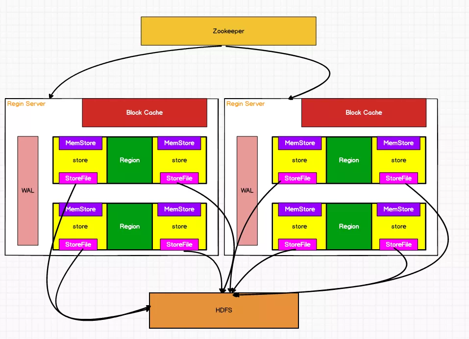

# HBase核心总结


## 主要内容 

 1.为什么选择HBase

 2.HBase架构与角色

 3.HBase存储结构

 4.HBase写流程

 5.HBase读流程

 6.HBase与Hive的对比

 7.预分区

 8.RowKey设计

 9.HBase优化

 10.Phoenix二级索引

## 为什么选择HBase

**1、海量存储**

HBase适合存储PB级别的海量数据，在PB级别的数据，能在几十到百毫秒内返回数据。这与HBase的极易扩展性息息相关。正是因为HBase良好的扩展性，才为海量数据的存储提供了便利。

**2、列式存储**

这里的列式存储其实说的是列族存储，HBase是根据列族来存储数据的。HBase中的每个列都由Column Family(列族)和Column Qualifier（列限定符）进行限定，例如info：name，info：age。

**3、极易扩展**

HBase的扩展性主要体现在两个方面，一个是基于上层处理能力（RegionServer）的扩展，一个是基于存储的扩展（HDFS）。

通过横向添加RegionSever的机器，进行水平扩展，提升HBase上层的处理能力，提升HBase服务更多Region的能力。

**4、稀疏**

稀疏主要是针对HBase列的灵活性，在列族中，你可以指定任意多的列，在列数据为空的情况下，是不会占用存储空间的。

**5、 数据多版本** 

数据多版本：每个单元中的数据可以有多个版本，默认情况下，版本号自动分配，版本号就是单元格插入时的时间戳。

## HBase架构与角色

#### 架构图



#### 角色

**（1）Region Server**

Region Server为 Region的管理者，其实现类为HRegionServer，主要作用如下: 对于数据的操作：get, put, delete；对于Region的操作：splitRegion、compactRegion。

- **StoreFile**

保存实际数据的物理文件，StoreFile以Hfile的形式存储在HDFS上。每个Store会有一个或多个StoreFile（HFile），数据在每个StoreFile中都是有序的。

- **MemStore**

写缓存，由于HFile中的数据要求是有序的，所以数据是先存储在MemStore中，排好序后，等到达刷写时机才会刷写到HFile，每次刷写都会形成一个新的HFile。

- **WAL**

由于数据要经MemStore排序后才能刷写到HFile，但把数据保存在内存中会有很高的概率导致数据丢失，为了解决这个问题，数据会先写在一个叫做Write-Ahead logfile的文件中，然后再写入MemStore中。所以在系统出现故障的时候，数据可以通过这个日志文件重建。

- **BlockCache**

读缓存，每次查询出的数据会缓存在BlockCache中，方便下次查询。

**（2）Master**

Master是所有Region Server的管理者，其实现类为HMaster，主要作用如下：对于表的操作：create, delete, alter 对于RegionServer的操作：分配regions到每个RegionServer，监控每个RegionServer的状态，负载均衡和故障转移。

**（3）Zookeeper**

HBase通过Zookeeper来做master的高可用、RegionServer的监控、元数据的入口以及集群配置的维护等工作。

**（4）HDFS**

HDFS为HBase提供最终的底层数据存储服务，同时为HBase提供高可用的支持。

## HBase存储结构

#### 逻辑结构

.webp)

#### 物理存储结构

.webp)

**（1）Name Space**

命名空间，类似于关系型数据库的database概念，每个命名空间下有多个表。HBase两个自带的命名空间，分别是HBase和default，HBase中存放的是HBase内置的表，default表是用户默认使用的命名空间。

 **(2）Table**

类似于关系型数据库的表概念。不同的是，HBase定义表时只需要声明列族即可，不需要声明具体的列。这意味着，往HBase写入数据时，字段可以动态、按需指定。因此，和关系型数据库相比，HBase能够轻松应对字段变更的场景。

**（3）Row**

HBase表中的每行数据都由一个RowKey和多个Column（列）组成，数据是按照RowKey的字典顺序存储的，并且查询数据时只能根据RowKey进行检索，所以RowKey的设计十分重要。

**（4）Column**

HBase中的每个列都由Column Family(列族)和Column Qualifier（列限定符）进行限定，例如info：name，info：age。建表时，只需指明列族，而列限定符无需预先定义。

**（5）Time Stamp**

用于标识数据的不同版本（version），每条数据写入时，系统会自动为其加上该字段，其值为写入HBase的时间。

**（6）Cell**

由{rowkey, column Family：column Qualifier, time Stamp} 唯一确定的单元。cell中的数据是没有类型的，全部是字节码形式存贮。

## HBase写流程

#### 写流程

.webp)

（2）访问对应的Region Server，获取Hbase:meta表，根据读请求的namespace:table/rowkey，查询出目标数据位于哪个Region Server中的哪个Region中。并将该table的region信息以及metA表的位置信息缓存在客户端的meta cache，方便下次访问。

（3）与目标Region Server进行通讯。

（4）将数据顺序写入（追加）到WAL。

（5）将数据写入对应的MemStore，数据会在MemStore进行排序。

（6）向客户端发送ack。

（7）等达到MemStore的刷写时机后，将数据刷写到HFile。

#### MemStore刷写时机

（1）当 Region中 某个 MemStore 的大小达到了默认值128M，会触发Region的刷写（若Region中有多个Store，只要有其中一个达到默认值128M）值，就会触发flush。

```sql
hbase.hregion.memstore.flush.size（默认值128M）
```

当memstore的大小超过以下条件，会阻止继续往该memstore写数据。

```sql
hbase.hregion.memstore.flush.size（默认值128M）

hbase.hregion.memstore.block.multiplier（默认值4）
```

**（2）当region server中memstore的总大小达到下面配置时，会阻止继续往所有的memstore写数据。**

```sql
hbase.regionserver.global.memstore.size（默认值0.4）
```

当region server中memstore的总大小低于数值时候，才取消阻塞（允许写入数据）。

```sql
hbase.regionserver.global.memstore.size（默认值0.4）
hbase.regionserver.global.memstore.size.lower.limit（默认值0.95）
```

如果 HBase 堆内存总共是 5G，按照默认的比例，那么触发 RegionServer级别的flush ，是 RegionServer 中所有的 MemStore 占用内存为：5 * 0.4 * 0.95 = 1.9G时触发flush，此时是允许写入操作的，若写入操作大于flush的速度，当占用内存达到 5 * 0.4 = 2G 时，阻止所有写入操作，直到占用内存低于 1.9G ，才取消阻塞，允许写入。

**（3）如果自动刷写的时间，也会触发memstore flush。自动刷新的时间间隔由该属性进行配置。**

```sql
hbase.regionserver.optionalcacheflushinterval（默认1小时）
```

**（4） 当WAL文件的数量超过HBase.regionserver.max.logs（最大值为32），region会按照时间顺序依次进行刷写。**

**（5）手动刷写**

## HBase读流程

#### 读流程

.webp)

（1）Client先访问zookeeper，获取hbase:meta表位于哪个Region Server。

（2）访问对应的Region Server，获取hbase:meta表，根据读请求的namespace:table/rowkey，查询出目标数据位于哪个Region Server中的哪个Region中。并将该table的region信息以及meta表的位置信息缓存在客户端的meta cache，方便下次访问。

（3）与目标Region Server进行通讯。

（4）分别在MemStore和Store File（HFile）中查询目标数据，并将查到的所有数据进行合并。此处所有数据是指同一条数据的不同版本（time stamp）或者不同的类型（Put/Delete）。

（5）将查询到的新的数据块（Block，HFile数据存储单元，默认大小为64KB）缓存到Block Cache。

（6）将合并后的最终结果返回给客户端。

#### StoreFile Compaction

由于memstore每次刷写都会生成一个新的HFile，且同一个字段的不同版本（timestamp）和不同类型（Put/Delete）有可能会分布在不同的HFile中，因此查询时需要遍历所有的HFile。为了减少HFile的个数，以及清理掉过期和删除的数据，会进行StoreFile Compaction。

Compaction分为两种，分别是Minor Compaction和Major Compaction。Minor Compaction会将临近的若干个较小的HFile合并成一个较大的HFile，并清理掉部分过期和删除的数据。Major Compaction会将一个Store下的所有的HFile合并成一个大HFile，并且会清理掉所有过期和删除的数据。

#### Region Split

默认情况下，每个Table起初只有一个Region，随着数据的不断写入，Region会自动进行拆分。刚拆分时，子Region都位于当前的Region Server，但处于负载均衡的考虑，HMaster有可能会将某个Region转移给其他的Region Server。

###### **Region Split时机**

当1个region中的某个Store下所有StoreFile的总大小超过下面的值，该Region就会进行拆分。

```sql
Min(initialSize*R^3 ,hbase.hregion.max.filesize")

其中initialSize的默认值为2*hbase.hregion.memstore.flush.size

R为当前Region Server中属于该Table的Region个数）
```

具体的切分策略为：

第一次split：1^3 * 256 = 256MB

第二次split：2^3 * 256 = 2048MB

第三次split：3^3 * 256 = 6912MB

第四次split：4^3 * 256 = 16384MB > 10GB，因此取较小的值10GB

后面每次split的size都是10GB了。

## HBase与Hive的对比

###### Hive

**(1) 数据仓库**

Hive的本质其实就相当于将HDFS中已经存储的文件在Mysql中做了一个双射关系，以方便使用HQL去管理查询。

**(2) 用于数据分析、清洗**

Hive适用于离线的数据分析和清洗，延迟较高。

**(3) 基于HDFS、MapReduce**

Hive存储的数据依旧在DataNode上，编写的HQL语句终将是转换为MapReduce代码执行。

###### HBase

**（1）数据库**

是一种面向列存储的非关系型数据库。

**（2） 用于存储结构化和非结构化的数据**

适用于单表非关系型数据的存储，不适合做关联查询，类似JOIN等操作。

**（3） 基于HDFS**

数据持久化存储的体现形式是Hfile，存放于DataNode中，被ResionServer以region的形式进行管理。

**（4） 延迟较低，接入在线业务使用**

面对大量的企业数据，HBase可以应对单表大量数据的存储，同时提供了高效的数据访问速度。

## 预分区

每一个region维护着startRow与endRowKey，如果加入的数据符合某个region维护的rowKey范围，则该数据交给这个region维护。那么依照这个原则，我们可以将数据所要投放的分区提前大致的规划好，以提高HBase性能。

#### 方式

**（1）手动设定预分区**

```sql
create 'staff','info','partition',SPLITS => ['100000','200000','300000','400000']
```

**（2）16进制序列预分区**

```sql
create 'staff','info','partition',{NUMREGIONS => 15, SPLITALGO => 'HexStringSplit'}
```

**（3）按照文件中设置的规则预分区**

```sql
1111
2222
3333
4444

create 'staff','partition',SPLITS_FILE => 'splits.txt'
```

**（4）JavaAPI创建预分区**

```java
//自定义算法，产生一系列Hash散列值存储在二维数组中
byte[][] splitKeys = 某个散列值函数
//创建HBaseAdmin实例
HBaseAdmin hAdmin = new HBaseAdmin(HBaseConfiguration.create());
//创建HTableDescriptor实例
HTableDescriptor tableDesc = new HTableDescriptor(tableName);
//通过HTableDescriptor实例和散列值二维数组创建带有预分区的HBase表
hAdmin.createTable(tableDesc, splitKeys);
```

## RowKey设计

#### 设计原则

**（1）rowkey长度原则**

Rowkey是一个二进制数据流，Rowkey的长度建议设计在10-100个字节，不过建议是越短越好，不要超过16个字节。如果设置过长，会极大影响Hfile的存储效率。

MemStore将缓存部分数据到内存，如果Rowkey字段过长内存的有效利用率降低，系统将无法缓存更多的数据，这会降低检索效率。

**（2）rowkey散列原则**

如果Rowkey是按时间戳的方式递增，不要将时间放在二进制码的前面，建议将Rowkey的高位作为散列字段，由程序循环生成，低位放时间字段，这样将提高数据均衡分布在每个Regionserver实现负载均衡的几率。如果没有散列字段，首字段直接是时间信息将产生所有新数据都在一个 RegionServer上堆积的热点现象，这样在做数据检索的时候负载将会集中在个别RegionServer，降低查询效率。

**（3）rowkey唯一原则**

#### 如何设计

**（1）生成随机数、hash、散列值**

**（2）字符串反转**

## HBase优化

#### 高可用

在HBase中Hmaster负责监控RegionServer的生命周期，均衡RegionServer的负载，如果Hmaster挂掉了，那么整个HBase集群将陷入不健康的状态，并且此时的工作状态并不会维持太久。所以，HBase支持对Hmaster的高可用

#### 内存优化

HBase操作过程中需要大量的内存开销，毕竟Table是可以缓存在内存中的，一般会分配整个可用内存的70%给HBase的Java堆。但是不建议分配非常大的堆内存，因为GC过程持续太久会导致RegionServer处于长期不可用状态，一般16~48G内存就可以了，如果因为框架占用内存过高导致系统内存不足，框架一样会被系统服务拖死。

#### 配置优化

**（1）开启HDFS追加同步，可以优秀的配合HBase的数据同步和持久化。默认值为true。**

```sql
dfs.support.append
```

**（2）HBase一般都会同一时间操作大量的文件，根据集群的数量和规模以及数据动作，设置为4096或者更高。默认值：4096。**

```sql
fs.datanode.max.transfer.threads
```

**（3）优化延迟高的数据操作的等待时间**

如果对于某一次数据操作来讲，延迟非常高，socket需要等待更长的时间，建议把该值设置为更大的值（默认60000毫秒），以确保socket不会被timeout掉。

```sql
dfs.image.transfer.timeout
```

**（4）优化数据的写入效率**

开启这两个数据可以大大提高文件的写入效率，减少写入时间。第一个属性值修改为true，第二个属性值修改为：org.apache.bigdata.io.compress.GzipCodec或者其他压缩方式。

```sql
mapreduce.map.output.compress
mapreduce.map.output.compress.codec
```

**（5）优化HStore文件大小**

默认值10GB，如果需要运行HBase的MR任务，可以减小此值，因为一个region对应一个map任务，如果单个region过大，会导致map任务执行时间过长。该值的意思就是，如果HFile的大小达到这个数值，则这个region会被切分为两个Hfile。

```sql
hbase.hregion.max.filesize
```

**（6）优化HBase客户端缓存**

用于指定HBase客户端缓存，增大该值可以减少RPC调用次数，但是会消耗更多内存，反之则反之。一般我们需要设定一定的缓存大小，以达到减少RPC次数的目的。

```sql
hbase.client.write.buffer
```

**(7) 指定scan.next扫描HBase所获取的行数**

用于指定scan.next方法获取的默认行数，值越大，消耗内存越大。

```sql
hbase.client.scanner.caching
```

**（8）flush、compact、split机制**

当MemStore达到阈值，将Memstore中的数据Flush进Storefile；compact机制则是把flush出来的小文件合并成大的Storefile文件。split则是当Region达到阈值，会把过大的Region一分为二。

```sql
128M就是Memstore的默认阈值

hbase.hregion.memstore.flush.size：134217728
```

当MemStore使用内存总量达到HBase.regionserver.global.memstore.upperLimit指定值时，将会有多个MemStores flush到文件中，MemStore flush 顺序是按照大小降序执行的，直到刷新到MemStore使用内存略小于lowerLimit

```sql
hbase.regionserver.global.memstore.upperLimit：0.4

hbase.regionserver.global.memstore.lowerLimit：0.38
```

## Phoenix二级索引

在HBase中，按字典顺序排序的rowkey是一级索引。不通过rowkey来查询数据时需要过滤器来扫描整张表。通过二级索引，这样的场景也可以轻松定位到数据。

二级索引的原理通常是在写入时针对某个字段和rowkey进行绑定，查询时先根据这个字段查询到rowkey，然后根据rowkey查询数据，二级索引也可以理解为查询数据时多次使用索引的情况。

## 索引

###### 全局索引

全局索引适用于多读少写的场景，在写操作上会给性能带来极大的开销，因为所有的更新和写操作（DELETE,UPSERT VALUES和UPSERT SELECT）都会引起索引的更新,在读数据时，Phoenix将通过索引表来达到快速查询的目的。

###### 本地索引

本地索引适用于写多读少的场景，当使用本地索引的时候即使查询的所有字段都不在索引字段中时也会用到索引进行查询，Phoneix在查询时会自动选择是否使用本地索引。

###### 覆盖索引

只需要通过索引就能返回所要查询的数据，所以索引的列必须包含所需查询的列。

###### 函数索引

索引不局限于列，可以合适任意的表达式来创建索引，当在查询时用到了这些表达式时就直接返回表达式结果

#### 索引优化

**（1）根据主表的更新来确定更新索引表的线程数**

```sql
index.builder.threads.max:（默认值：10）
```

**（2）builder线程池中线程的存活时间**

```sql
index.builder.threads.keepalivetime：（默认值：60）
```

**（3）更新索引表时所能使用的线程数(即同时能更新多少张索引表)，其数量最好与索引表的数量一致**

```sql
index.write.threads.max:（默认值：10）
```

**(4) 更新索引表的线程所能存活的时间**

```sql
index.write.threads.keepalivetime（默认值：60）
```

**(5) 每张索引表所能使用的线程(即在一张索引表中同时可以有多少线程对其进行写入更新)，增加此值可以提高更新索引的并发量**

```sql
hbase.htable.threads.max（默认值：2147483647）
```

**(6) 索引表上更新索引的线程的存活时间**

```sql
hbase.htable.threads.keepalivetime（默认值：60）
```

**(7) 允许缓存的索引表的数量 增加此值，可以在更新索引表时不用每次都去重复的创建htable，由于是缓存在内存中，所以其值越大，其需要的内存越多**

```sql
index.tablefactoy.cache.size（默认值：10）
```