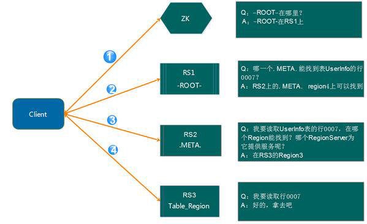
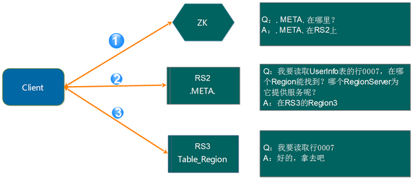
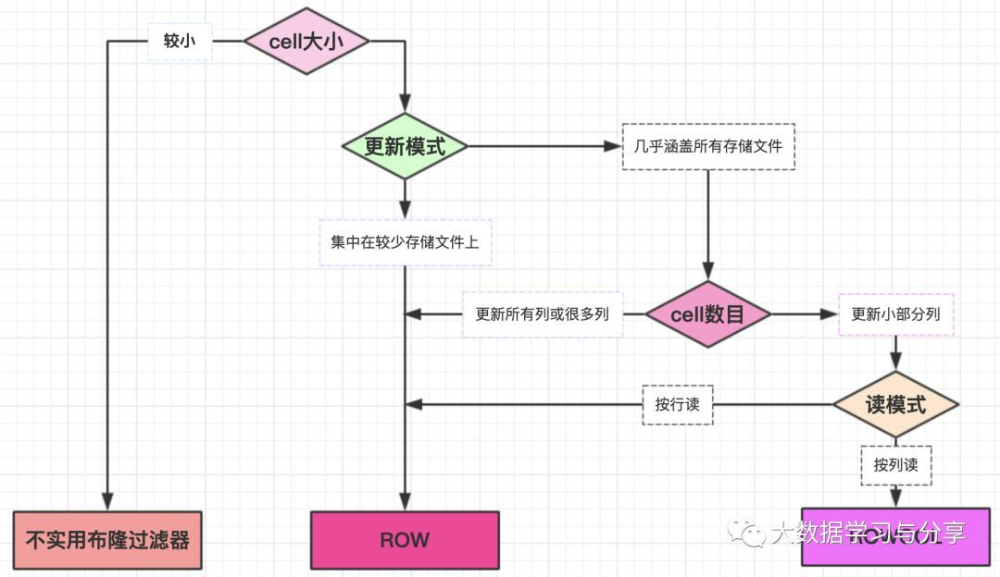

# HBase核心知识以及面试问题

 ### **一、**[**HBase**](https://cloud.tencent.com/product/hbase?from=10680)**基础和架构**

HBase是一个高可靠、高性能、面向列的，主要用于海量结构化和半结构化数据存储的分布式key-value存储系统。

它基于Google Bigtable开源实现，但二者有明显的区别：Google Bigtable基于GFS存储，通过MAPREDUCE处理存储的数据，通过chubby处理协同服务；而HBase底层存储基于hdfs，可以利用MapReduce、Spark等计算引擎处理其存储的数据，通过Zookeeper作为处理HBase集群协同服务。

#### **1.1 HBase表结构**

HBase以表的形式将数据最终存储的hdfs上，建表时无需指定表中字段，只需指定若干个列簇即可。插入数据时，指定任意多个列到指定的列簇中。通过行键、列簇、列和时间戳可以对数据进行快速定位。

**1）行键(row key)**

HBase基于row key唯一标识一行数据，是用来检索数据的主键。

HBase通过对row key进行字典排序从而对表中数据进行排序。基于这个特性，在设计row key时建议将经常一起读取的数据存储在一起。

**2）列簇(column family)**

HBase中的表可以有若干个列簇，一个列簇下面可以有多个列，必须在建表时指定列簇，但不需要指定列。

一个列族的所有列存储在同一个底层文存储件中。

HBase对访问控制、磁盘和内存的使用统计都是在列族层面进行的。列族越多，在取一行数据时所要参与IO、搜寻的文件就越多。所以，如果没有必要，不要设置太多的列族，也不要修改的太频繁。并且将经常一起查询的列放到一个列簇中，减少文件的IO、寻址时间，提升访问性能。

**3）列(qualifier)**

列可以是任意的字节数组，都唯一属于一个特定列簇，它也是按照字典顺序排序的。

列名都以列簇为前缀，常见引用列格式：column family:qualifier，如city:beijing、city:shanghai都属于city这个列簇。

列值没有类型和长度限定。

**4）Cell**

通过{row key, column family:qualifier, version}可以唯一确定的存贮单元，cell中的数据全部以字节码形式存贮。

**5）时间戳(timestamp)**

每个cell都可以保存同一份数据的不同版本，不同版本的数据按照时间倒序排序，读取时优先读取最新值，并通过时间戳来索引。

时间戳的类型是64位整型，可以由客户端显式赋值或者由HBase在写入数据时自动赋值（此时时间戳是精确到毫秒的当前系统时间），可以通过显式生成唯一性的时间戳来避免数据版本冲突。

每个cell中，为了避免数据存在过多版本造成的的存贮、索引等管负担，HBase提供了两种数据版本回收方式（可以针对每个列簇进行设置）：

1）保存数据的最新n个版本

2）通过设置数据的生命周期保存最近一段时间内的版本

将以上特点综合在一起，就有了如下数据存取模式：

SortedMap<RowKey,List<SortedMap<Column,List<Value,Timestamp>>>>

第一个SortedMap代表那个表，包含一个列族集合List(多个列族)。列族中包含了另一个SortedMap存储列和相应的值。

#### **1.2 HBase系统架构**

下图展现了HBase集群、内部存储中的主要角色，以及存储过程中与hdfs的交互：


**1.2.1 HBase集群中主要角色的作用**

**1.2.1.1 HMaster**

HBase集群的主节点，可以配置多个，用来实现HA，主要作用：

- 为RegionServer分配region
- 负责RegionServer的[负载均衡](https://cloud.tencent.com/product/clb?from=10680)
- 发现失效的RegionServer，重新分配它负责的region
- hdfs上的垃圾文件回收（标记为删除的且经过major compact的文件）
- 处理schema更新请求

**1）HMaster上线**

master启动之后会做如下事情：

1. 从ZK上获取唯一一个代表active master的锁，用来阻止其它master成为active master
2. 扫描ZK上的server父节点，获得当前可用的RS列表
3. 和每个RS通信，获得当前已分配的region和RS的对应关系
4. 扫描.META.region的集合，得到当前还未分配的region，将它们放入待分配region列表
5. 从上线过程可以看到，HMaster保存的信息全是可以从系统其它地方收集到或者计算出来的。

**2）HMaster下线**

**由于HMaster只维护表和region的元数据，而不参与表数据IO的过程，HMaster下线仅导致所有元数据的修改被冻结（无法创建删除表，无法修改表的schema，无法进行region的负载均衡，无法处理region上下线，无法进行region的合并，唯一例外的是region的split可以正常进行，因为只有region server参与），表的数据读写还可以正常进行。因此HMaster下线短时间内对整个HBase集群没有影响。**

**3）HMaster容错**

配置HA，当active master宕机时，通过ZK重新选择一个新的active master。

注意：

1.无HMaster过程中，数据读取仍照常进行

2.无HMaster过程中，region切分、负载均衡等无法进行

**1.2.1.2 RegionServer（以下简称RS）**

HBase集群的从节点，负责数据存储，主要作用：

- RS维护HMaster分配给它的region，处理对这些region的IO请求
- RS负责切分在运行过程中变得过大的region

**1）region分配**

任何时刻，一个region只能分配给一个RS。

HMaster记录了当前有哪些可用的RS。以及当前哪些region分配给了哪些RS，哪些region还没有分配。当需要分配的新的region，并且有一个RS上有可用空间时，HMaster就给这个RS发送一个加载请求，把region分配给这个RS。RS得到请求后，就开始对此region提供服务。

**2）RS上线**

HMaster使用ZK来跟踪RS状态。

当某个RS启动时，会首先在ZK上的server目录下建立代表自己的znode。由于HMaster订阅了server目录上的变更消息，当server目录下的文件出现新增或删除操作时，HMaster可以得到来自zookeeper的实时通知。因此一旦RS上线，HMaster能马上得到消息。

**3）RS下线**

当RS下线时，它和ZK的会话断开，ZK自动释放代表这台server的文件上的独占锁。HMaster就可以确定RS都无法继续为它的region提供服务了（比如RS和ZK之间的网络断开了或者RS挂了），此时HMaster会删除server目录下代表这台RS的znode数据，并将这台RS的region分配给集群中还活着的RS

**4）RS容错**

定时向ZK汇报心跳，如果一定时间内未出现心跳，比如RS宕机，HMaster将该RS上的region、预写日志重新分配到其他RS上

**1.2.1.3 Zookeeper（以下简称ZK）**

- 通过选举，保证任何时候，集群中只有一个active master（HMaster与RS启动时会向ZK注册）
- 存贮所有region的寻址入口，如-ROOT-表在哪台服务器上
- 实时监控RS的状态，将RS的上下线信息通知HMaster
- 存储HBase的元数据，如有哪些table，每个table有哪些column family

client包含访问HBase的接口，维护着一些缓存来加速对HBase的访问，比如region的位置信息。

client在访问HBase上数据时不需要HMaster参与（寻址访问ZK和RS，数据读写访问RS），HMaster主要维护着table和region的元数据信息，负载很低。

**1.2.2 HBase数据存储**

通过之前的HBase系统架构图，可以看出：

- HBase中table在行的方向上分割为多个region，它是HBase负载均衡的最小单元，可以分布在不同的RegionServer上，但是一个region不能拆分到多个RS上
- region不是物理存储的最小单元
- region由一个或者多个store组成，每个store保存一个column family。每个store由一个memstore和多个storefile组成，storefile由hfile组成是对hfile的轻量级封装，存储在hdfs上。
- region按大小分割，默认10G，每个表一开始只有一个region，随着表中数据不断增加，region不断增大，当增大到一个阀值时，region就会划分为两个新的region。

当表中的数据不断增多，就会有越来越多的region，这些region由HMaster分配给相应的RS，实现负载均衡。

HBase底层存储基于hdfs，但对于为null的列并不占据存储空间，并且支持随机读写，主要通过以下机制完成：

- HBase底层存储结构依赖了LSM树(Log-structured merge tree)
- 数据写入时先写入HLog，然后写入memstore，当memstore存储的数据达到阈值，RS启动flush cache将memstore中的数据刷写到storefile
- 客户端检索数据时，先在client缓存中找，缓存中找不到则到memstore找，还找不到才会从storefile中查找
- storefile底层以hfile的形式存储到hdfs上，当storefile达到一定阈值会进行合并
- minor合并和major合并小文件，删弃做过删除标记的数据

**1.2.3 HBase寻址机制**

老：



新：



HBase提供了两张特殊的目录表-ROOT-和META表，-ROOT-表用来查询所有的META表中region位置。HBase设计中只有一个root region即root region从不进行切分，从而保证类似于B+树结构的三层查找结构：

第1层：zookeeper中包含root region位置信息的节点，如-ROOT-表在哪台regionserver上

第2层：从-ROOT-表中查找对应的meta region位置即.META.表所在位置

第3层：从META表中查找用户表对应region位置

目录表中的行健由region表名、起始行和ID（通常是以毫秒表示的当前时间）连接而成。HBase0.90.0版本开始，主键上有另一个散列值附加在后面，目前这个附加部分只用在用户表的region中。

注意：

1. root region永远不会被split，保证了最多需要三次跳转，就能定位到任意region 
2. META表每行保存一个region的位置信息，row key采用表名+表的最后一行编码而成
3. 为了加快访问，META表的全部region都保存在内存中
4. client会将查询过的位置信息保存缓存起来，缓存不会主动失效，因此如果client上的缓存全部失效，则需要进行最多6次网络来回，才能定位到正确的region（其中三次用来发现缓存失效，另外三次用来获取位置信息）

关于寻址的几个问题：

1.既然ZK中能保存-ROOT-信息，那么为什么不把META信息直接保存在ZK中，而需要通过-ROOT-表来定位？

ZK不适合保存大量数据，而META表主要是保存region和RS的映射信息，region的数量没有具体约束，只要在内存允许的范围内，region数量可以有很多，如果保存在ZK中，ZK的压力会很大。

所以，通过一个-ROOT-表来转存到regionserver中相比直接保存在ZK中，也就多了一层-ROOT-表的查询（类似于一个索引表），对性能来说影响不大。

2.client查找到目标地址后，下一次请求还需要走ZK  —> -ROOT- —> META这个流程么？

不需要，client端有缓存，第一次查询到相应region所在RS后，这个信息将被缓存到client端，以后每次访问都直接从缓存中获取RS地址即可。

但是如果访问的region在RS上发生了改变，比如被balancer迁移到其他RS上了，这个时候，通过缓存的地址访问会出现异常，在出现异常的情况下，client需要重新走一遍上面的流程来获取新的RS地址。

**1.3 WAL log和LSM树**

**1.3.1 WAL log**

即预写日志，该机制用于数据的容错和恢复，每次更新都会先写入日志，只有写入成功才会通知客户端操作成功，然后RS按需自由批量处理和聚合内存中的数据。

每个HRegionServer中都有一个HLog对象，它负责记录数据的所有变更，被同一个RS中的所有region共享。

HLog是一个实现预写日志的类，在每次用户操作写入memstore之前，会先写一份数据到HLog文件中，HLog文件定期会滚动出新的，并删除已经持久化到storefile中的数据的文件。

当RS意外终止后，HMaster会通过ZK感知到，HMaster首先会处理遗留的HLog文件，将其中不同region的[日志数据](https://cloud.tencent.com/solution/cloudlog?from=10680)进行拆分，分别放到相应region的目录下，然后再将失效的region重新分配，领取到这些region的HRegionServer在加载region的过程中，如果发现有历史HLog需要处理，会"重放日志"中的数据到memstore中，然后flush到storefile，完成数据恢复。

HLog文件就是一个普通的Hadoop Sequence File。

**1.3.2 LSM树在HBase中的应用**

1.输入数据首先存储在日志文件 [文件内数据完全有序，按键排序]

2.然后当日志文件修改时，对应更新会被先保存在内存中来加速查询

3.数据经过多次修改，且内存空间达到设定阈值，LSM树将有序的"键记录"flush到磁盘，同时创建一个新的数据存储文件。[内存中的数据由于已经被持久化了，就会被丢弃]

4.查询时先从内存中查找数据，然后再查找磁盘上的文件

5.删除只是“逻辑删除”即将要删除的数据或者过期数据等做删除标记，查找时会跳过这些做了删除标记的数据

6.多次数据刷写之后会创建许多数据存储文件，后台线程会自动将小文件合并成大文件。合并过程是重写一遍数据，major compaction会略过做了删除标记的数据[丢弃]

7.LSM树利用存储的连续传输能力，以磁盘传输速率工作并能较好地扩展以处理大量数据。使用日志文件和内存存储将随机写转换成顺序写

8.LSM树对磁盘顺序读取做了优化

9.LSM树的读和写是独立的

**1.4 布隆过滤器和协处理器**

**1.4.1 布隆过滤器在HBase中的应用**

布隆过滤器（Bloom Filter）是空间利用效率很高的数据结构，利用位数组表示一个集合，判断一个元素是否属于该集合。但存在一定的错误率，在判断一个元素是否属于某个集合时，有可能会把不属于这个集合的元素误认为属于这个集合，所以适用于能容忍一定错误率的场景下。

布隆过滤器是HBase的高级功能属性，它能够降低特定访问模式下的查询时间，但是会增加内存和存储的负担，是一种以空间换时间的典型应用，默认为关闭状态。

可以单独为每个列族单独启用布隆过滤器，可以在建表时直接指定，也可以通过使用HColumnDescriptor.setBloomFilterType对某个列族指定布隆过滤器。

目前HBase支持以下3种布隆过滤器类型：

NONE：不使用布隆过滤器（默认）

ROW：行键使用布隆过滤器过滤

ROWCOL；列键（row key + column family + qualifier）使用布隆过滤器过滤

下图展示了何种情况下使用布隆过滤器，一般建议使用ROW模式，它在额外的存储空间开销和利用选择过滤存储文件提升性能方面做了很好的权衡，具体使用哪一种，要看具体的使用场景：



**1.4.2 协处理器**

HBase协处理器目前分为两种observer和endpoint，二者可以结合使用，都是运行在HBase服务端的。

**1.observer**

与RDBMS的触发器类似，运行客户端在操作HBase集群数据过程中，通过钩子函数在特定的事件（包括一些用户产生和服务期内部自动产生的事件）发生时做一些预处理（如插入之前做一些业务处理）和后处理（如插入之后做出响应等）的操作。

observer提供的几个典型的接口：

RegionObserver：处理数据修改事件。典型的应用场景就是用作处理HBase二级索引，如在put前在针对处理的数据生成二级索引，处理引擎可以通过MapReduce做，也可以将生成的二级索引存储在solr或者es中

MasterObserver：管理或DDL类型的操作，针对集群级的事件

WALObserver：提供针对WAL的钩子函数

**2.endpoint**

类似于RDBMS中的存储过程，可以通过添加一些远程过程调用来动态扩展RPC协议。允许扩展集群的能力，对客户端应用自定义开发新的运算命令，用户代码可以被部署到服务端。

###  **二、HBase row key和列族设计**

#### **2.1 row key设计**

HBase中rowkey可以唯一标识一行数据，在HBase查询的时候，主要以下两种方式：

get：指定rowkey获取唯一一条记录

scan：设置startRow和stopRow参数进行范围匹配

在设计row key时，首先要保证row key唯一，其次要考虑以下几个方面：

1.位置相关性

存储时，数据按照row key的字典顺序排序存储。设计row key时，要充分考虑排序存储这个特性，将经常一起读取的行存储放到一起。

2.row key长度

row key是一个二进制码流，可以是任意字符串，最大长度 64kb ，一般为10-100bytes，原因如下：

1）HBase数据的持久化文件hfile是按照Key Value存储的，如果row key过长，当存储的数量很大时，仅row key就会占据很大空间，会极大影响hfile存储效率

2）row key设计过长，memstore缓存到内存的数据就会相对减少，检索效率低

3.row key散列性

row key是按照字典顺序存储的，如果row key按照递增或者时间戳递增生成，那么数据可能集中存储在某几台甚至某一台region server上，导致某些region server的负载非常高，影响查询效率，严重了可能导致region server宕机。

因此，可以将row key的一部分由程序生成散列数字，将row key打散，均匀分布在HBase集群中的region server上，具体分为以下几种处理方式：

1）反转

通过反转固定长度或数字格式的row key，将row key中经常变化的部分（即相对比较随机的部分）放在前面，这种方式的弊端就是失去了rowkey的有序性。

最常用的就是，用户的订单数据存储在HBase中，利用手机号后4位通常是随机的的特性，以用户的手机号反转再根据业务场景加上一些其他数据拼成row key或者是仅仅使用反转后的手机号作为row key，从而避免以手机号固定开头导致的热点问题。

2）加盐

并非密码学中的加盐，而是通过在row key加随机数前缀，前缀种类数应和你想使数据分散到不同的region的数量保持一致。

3）哈希散列方式

利用一些哈希算法如MD5，生成哈希散列值作为row key的前缀，确保region所管理的start-end rowkeys范围尽可能随机。

#### **2.2 列族设计**

一个列族在数据底层是一个文件，所以将经常一起查询的列放到一个列族中，同时尽可能创建较少数量的列族，且不要频繁修改，这样可以减少文件的IO、寻址时间，从而提高性能。

### **三、HBase数据迁移和备份**

#### **1. distcp命令拷贝hdfs文件的方式**

使用MapReduce实现文件分发，把文件和目录的列表当做map任务的输入，每个任务完成部分文件的拷贝和传输工作。在目标集群再使用bulkload的方式导入就实现了数据的迁移。

执行完distcp命令后，需要执行hbase hbck -repairHoles修复HBase表元数据。缺点在于需要停写，不然会导致数据不一致，比较适合迁移历史表（数据不会被修改的情况）

#### **2. copytable的方式实现表的迁移和备份**

以表级别进行迁移，其本质也是使用MapReduce的方式进行数据的同步，它是利用MapReduce去scan源表数据，然后把scan出来的数据写到目标集群，从而实现数据的迁移和备份。

示例：./bin/hbase org.apache.hadoop.hbase.mapreduce.CopyTable -Dhbase.client.scanner.caching=300 -Dmapred.map.tasks.speculative.execution=false -Dmapreduc.local.map.tasks.maximum=20 --peer.adr=zk_address:/hbase  hbase_table_name

这种方式需要通过scan数据，对于很大的表，如果这个表本身又读写比较频繁的情况下，会对性能造成比较大的影响，并且效率比较低。

**copytable常用参数说明（更多参数说明可参考hbase官方文档）**

startrow、stoprow：开始行、结束行

starttime：版本号最小值

endtime：版本号最大值，starttime和endtime必须同时制定

peer.adr：目标hbase集群地址，格式：hbase.zk.quorum:hbase.zk.client.port:zk.znode.parent

families：要同步的列族，多个列族用逗号分隔

#### **3. replication的方式实现表的复制**

类似MySQL binlog日志的同步方式，HBase通过同步WAL日志中所有变更来实现表的同步，异步同步。

需要在两个集群数据一样的情况下开启复制，默认复制功能是关闭的，配置后需要重启集群，并且如果主集群数据有出现误修改，备集群的数据也会有问题。

#### **4. Export/Import的方式实现表的迁移和备份**

和copytable的方式类似，将HBase表的数据转换成Sequence File并dump到hdfs，也涉及scan表数据。

和copytable不同的是，export不是将HBase的数据scan出来直接put到目标集群，而是先转换成文件并同步到目标集群，再通过import的方式导到对应的表中。

示例：

```javascript
在老集群上执行：./hbase
org.apache.hadoop.hbase.mapreduce.Export test_tabName
hdfs://ip:port/test
在新集群上执行：./hbase
org.apache.hadoop.hbase.mapreduce.Import test_tabName
hdfs://ip:port/test
```

这种方式要求需要在import前在新集群中将表建好。需要scan数据，会对HBase造成负载的影响，效率不高。

#### **5. snapshot的方式实现表的迁移和备份**

通过HBase快照的方式实现HBase数据的迁移和拷贝。

示例：

1.在老集群首先要创建快照：

```javascript
snapshot 'tabName', 'snapshot_tabName'

2../bin/hbase 
org.apache.hadoop.hbase.snapshot.ExportSnapshot

-snapshot snapshot_tabName
-copy-from hdfs://src-hbase-dir/hbase

-copy-to hdfs://dst-hbase-dir/hbase

-mappers 30

-bandwidth 10
```

这种方式比较常用，效率高，也是最为推荐的数据迁移方式。

### **四、HBase常见问题处理（面试）**

#### **4.1 HBase热点问题及处理**

HBase中热点问题其实就是数据倾斜问题，由于数据的分配不均匀，如row key设计的不合理导致数据过多集中于某一个或某几个region server上，会导致这些region server的访问压力，造成性能下降甚至不能够提供对外服务。

还有就是，在默认一个region的情况下，如果写操作比较频繁，数据增长太快，region 分裂的次数会增多，比较消耗资源。

主要通过两种方式相结合，row key设计（具体参考上文）和预分区。

这里主要说一下预分区，一般两种方式： 1.建表时，指定分区方式。 如create 't1', 'f1', SPLITS => ['10', '20', '30', '40']

2.通过程序生成splitKeys，程序中建表时指定splitKeys

但这两种方式也并非一劳永逸，因为数据是不断地增长的，已经划分好的分区可能承载不了更多的数据，就需要进一步split，但随之带来的是性能损耗。所以我们还要规划好数据增长速率，定期观察维护数据，根据实际业务场景分析是否要进一步分区，或者极端情况下，可能要重建表做更大的预分区然后进行数据迁移。

#### **4.2 多列族引起的问题和设计**

HBase集群的每个region server会负责多个region，每个region又包含多个store，每个store包含Memstore和StoreFile。

HBase表中，每个列族对应region中的一个store。默认情况下，只有一个region，当满足一定条件，region会进行分裂。如果一个HBase表中设置过多的列族，则可能引起以下问题：

1. 一个region中存有多个store，当region分裂时导致多个列族数据存在于多个region中，查询某一列族数据会涉及多个region导致查询效率低（这一点在多个列族存储的数据不均匀时尤为明显）
2. 多个列族则对应有多个store，那么Memstore也会很多，因为Memstore存于内存，会导致内存的消耗过大
3. HBase中的压缩和缓存flush是基于region的，当一个列族出现压缩或缓存刷新时会引起其他列族做同样的操作，列族过多时会涉及大量的IO开销

所以，我们在设计HBase表的列族时，遵循以下几个主要原则，以减少文件的IO、寻址时间：

1. 列族数量，要尽可能的少
2. 列族名字可读性好，但不能过长。原因可类比于HBase row key设计原则

#### **4.3 Memstore存在的意义**

HBase在WAL机制开启的情况下，不考虑块缓存，数据日志会先写入HLog，然后进入Memstore，最后持久化到HFile中。HFile是存储在hdfs上的，WAL预写日志也是，但Memstore是在内存的，增加Memstore大小并不能有效提升写入速度，为什么还要将数据存入Memstore中呢？

1. Memstore在内存中维持数据按照row key顺序排列，从而顺序写入磁盘
2. 由于hdfs上的文件不可修改，为了让数据顺序存储从而提高读取率，HBase使用了LSM树结构来存储数据，数据会先在Memstore中整理成LSM树，最后再刷写到HFile上
3. 优化数据的存储，比如一个数据添加后就马上删除了，这样在刷写的时候就可以直接不把这个数据写到HFile上

需要注意一点：数据读取不一定都是先读取Memstore，再读取磁盘。一般在读取HBase数据时，我们会开启缓存机制BlockCache，读取数据时会先读取该缓存，获取不到数据时会读Memstore和HFile。

这也是笔者一直强调为什么HBase数据最终持久化到hdfs上，但读写性能却优于hdfs的主要原因之一：HBase通过多种机制将磁盘随机读写转为顺序读写。

#### **4.4 minor合并和major合并**

上文提到storefile最终是存储在hdfs上的，那么storefile就具有只读特性，因此HBase的更新其实是不断追加的操作。

当一个store中的storefile达到一定的阈值后，就会进行一次合并，将对同一个key的修改合并到一起，形成一个大的storefile，当storefile的大小达到一定阈值后，又会对storefile进行split，划分为两个storefile。

由于对表的更新是不断追加的，合并时，需要访问store中全部的storefile和memstore，将它们按row key进行合并，由于storefile和memstore都是经过排序的，并且storefile带有内存中索引，合并的过程还是比较快的。

因为存储文件不可修改，HBase是无法通过移除某个键/值来简单的删除数据，而是对删除的数据做个删除标记，表明该数据已被删除，检索过程中，删除标记掩盖该数据，客户端读取不到该数据。

随着memstore中数据不断刷写到磁盘中，会产生越来越多的hfile小文件，HBase内部通过将多个文件合并成一个较大的文件解决这一小文件问题。

1.minor合并（minor compaction）

将多个小文件（通过参数配置决定是否满足合并的条件）重写为数量较少的大文件，减少存储文件数量（多路归并），因为hfile的每个文件都是经过归类的，所以合并速度很快，主要受磁盘IO性能影响

2.major合并（major compaction）

将一个region中的一个列簇的若干个hfile重写为一个新的hfile。而且major合并能扫描所有的键/值对，顺序重写全部数据，重写过程中会略过做了删除标记的数据（超过版本号限制、超过生存时间TTL、客户端API移除等数据）

#### **4.5 Hive数据导入HBase引起数据膨胀**

在将一些Hive处理之后的热数据导入到HBase中，遇到了一个很奇怪的问题：同样的数据到了HBase中，所占空间竟增长了好几倍！建议至少从几点原因入手分析：

1. HBase中的数据相对于Hive中的数据会新增一些附加信息导致磁盘占用的增加，比如布隆过滤器
2. Hive中的数据是否进行过压缩，比如snappy，压缩比还是很高的
3. row key和列族都会占据一定的空间，当数据量较大时，仅二者就会占据很多不必要的空间
4. 建议将相同查询场景下的几个常用的列的值拼接成一个列，节省KeyValue结构化带来的开销

Hive和HBase都可以作为存储系统，不禁思考引入HBase做数据存储的原因？

1. 通过scan、get可以批量、单条获取数据，通过bulkload、put可以批量、单条导入数据
2. 在实际生产环境，通常将计算和存储进行分离，保证集群规模水平可扩展，易于提高整体的吞吐。通过单机性能优化和集群的扩容，确保业务大幅增长时，存储不能没有成为系统的瓶颈
3. 弱schema的特性能够很好的应对业务数据频繁变化的情况，也能够方便支持一些特殊业务场景的数据逻辑

当然，除了上述原因，还有很多涉及底层的原理环节和实际的业务场景需求，这就要求我们对HBase有足够的了解。
