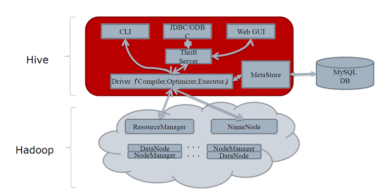
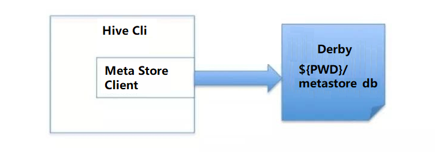
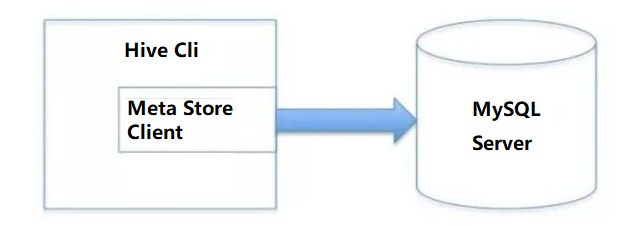
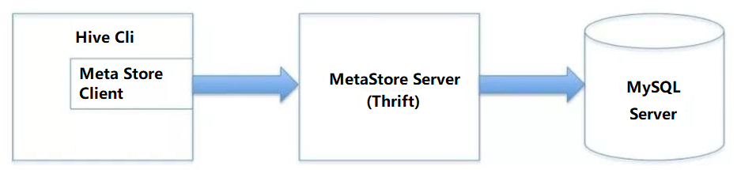
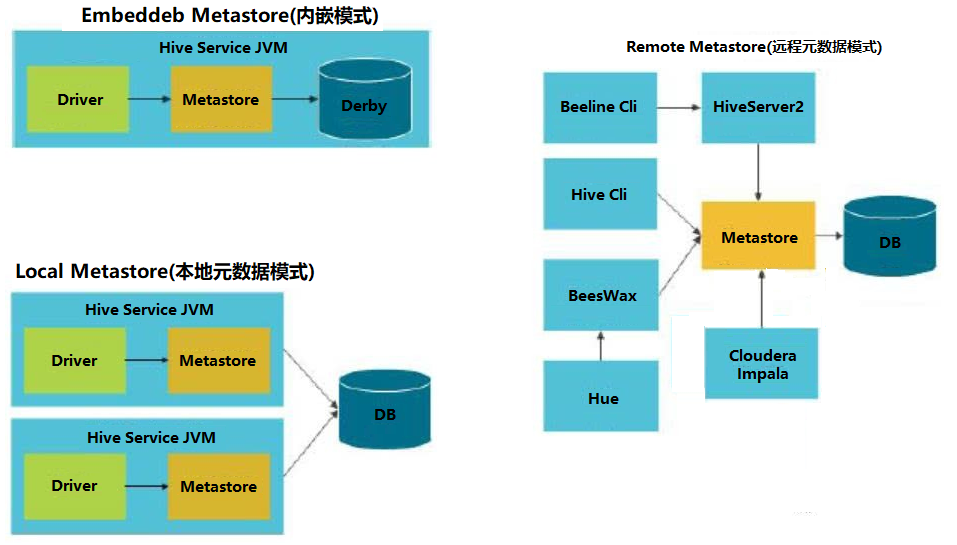
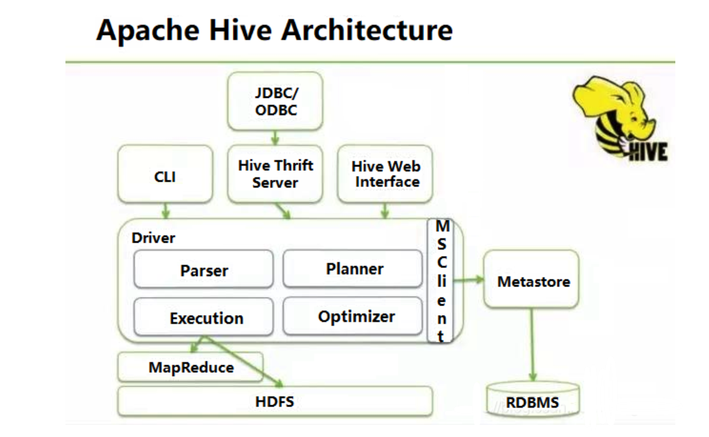
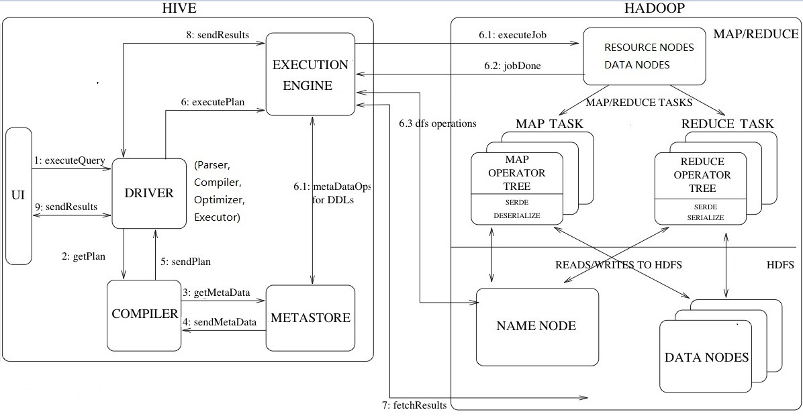
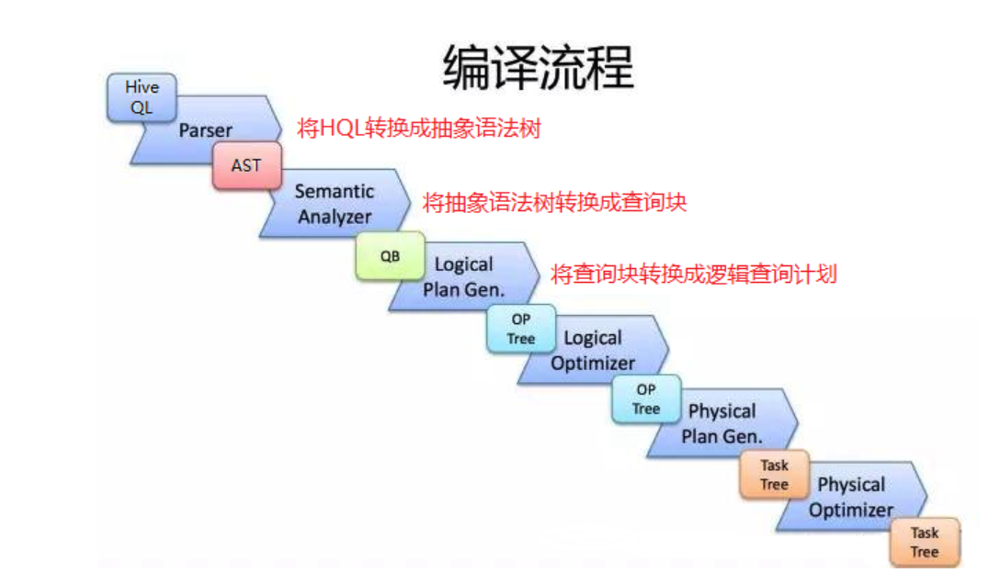
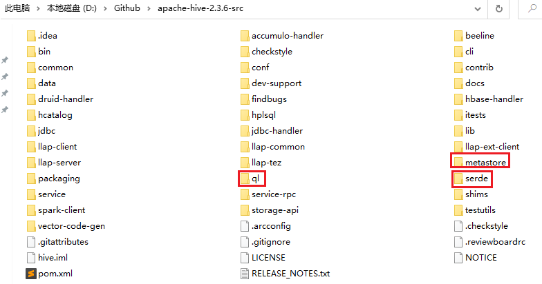
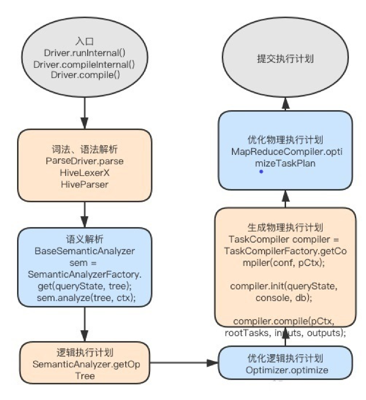

# Hive架构与源码分析

## 1. Hive的架构




**Hive的体系结构可以分为以下几部分：**

用户接口主要有三个：CLI，JDBC/ODBC和 Web UI。
①其中，最常用的是CLI，即Shell命令行；
②JDBC/ODBC Client是Hive的Java客户端，与使用传统数据库JDBC的方式类似，用户需要连接至Hive Server；
③Web UI是通过浏览器访问。


Hive将元数据存储在数据库中，如mysql、derby。Hive中的元数据包括表的名字，表的列和分区及其属性，表的属性(是否为外部表等)，表的数据所在目录等。


解释器、编译器、优化器完成HQL查询语句从词法分析、语法分析、编译、优化以及查询计划的生成。生成的查询计划存储在HDFS中，并在随后有MapReduce调用 执行。


Hive的数据存储在HDFS中，大部分的查询、计算由MapReduce完成(包含*的查询，比如select * from tbl不会生成MapReduce任务)


## 2. Hive的元数据存储

对于数据存储，Hive没有专门的数据存储格式，也没有为数据建立索引，用户可以非常自由的组织Hive中的表，只需要在创建表的时候告诉Hive数据中的列分隔符和行分隔符，Hive就可以解析数据。


Hive中所有的数据都存储在HDFS中，存储结构主要包括数据库、文件、表和视图。Hive中包含以下数据模型：Table内部表，External Table外部表，Partition分区，Bucket桶。Hive默认可以直接加载文本文件，还支持sequence file、RCFile。

　　

Hive将元数据存储在RDBMS中，有三种模式可以连接到数据库：


###  元数据内嵌模式(Embedded Metastore Database)

此模式连接到一个本地内嵌In-memory的数据库Derby，一般用于Unit Test，内嵌的derby数据库每次只能访问一个数据文件，也就意味着它不支持多会话连接。



|                 参数                  |      描述       |                       用例                       |
| :-----------------------------------: | :-------------: | :----------------------------------------------: |
|    javax.jdo.option.ConnectionURL     |   JDBC连接url   | jdbc:derby:databaseName=metastore_db;create=true |
| javax.jdo.option.ConnectionDriverName | JDBC driver名称 |       org.apache.derby.jdbc.EmbeddedDriver       |
|  javax.jdo.option.ConnectionUserName  |     用户名      |                       xxx                        |
|  javax.jdo.option.ConnectionPassword  |      密码       |                       xxxx                       |


### 本地元数据存储模式(Local Metastore Server)




|                 参数                  |      描述       |                             用例                             |
| :-----------------------------------: | :-------------: | :----------------------------------------------------------: |
|    javax.jdo.option.ConnectionURL     |   JDBC连接url   | jdbc:mysql://<host name>/databaseName?createDatabaseIfNotExist=true |
| javax.jdo.option.ConnectionDriverName | JDBC driver名称 |                    com.mysql.jdbc.Driver                     |
|  javax.jdo.option.ConnectionUserName  |     用户名      |                             xxx                              |
|  javax.jdo.option.ConnectionPassword  |      密码       |                             xxxx                             |

### 远程访问元数据模式(Remote Metastore Server)

用于非Java客户端访问元数据库，在服务端启动MetaServer，客户端利用Thrift协议通过MetaStoreServer访问元数据库。




服务端启动HiveMetaStore

第一种方式：

```sql
hive --service metastore -p 9083 &
```

第二种方式：

如果在hive-site.xml里指定了hive.metastore.uris的port，就可以不指定端口启动了

```xml
<property>
    <name>hive.metastore.uris</name>
    <value>thrift://hadoop003:9083</value>
</property>
```

```sql
hive --service metastore
```

客户端配置

|         参数         |          描述          |           用例            |
| :------------------: | :--------------------: | :-----------------------: |
| hive.metastore.uris  | metastore server的url  | thrift://<host_name>:9083 |
| hive.metastore.local | metastore server的位置 |       false表示远程       |

### 三种模式汇总




## Hive工作原理

### Hive内部组件分布构成

**No. 1** **Hive全局架构图**



从图1 Hive全局架构图中可以看到Hive架构包括如下组件：

CLI(command line interface)、JDBC/ODBC、Thrift Server、Hive WEB Interface(HWI)、metastore和Driver(Compiler、Optimizer)

　　

Metastore组件：元数据服务组件，这个组件用于存储hive的元数据，包括表名、表所属的数据库、表的拥有者、列/分区字段、表的类型、表的数据所在目录等内容。


hive的元数据存储在关系数据库里，支持derby、mysql两种关系型数据库。元数据对于hive十分重要，因此hive支持把metastore服务独立出来，安装到远程的服务器集群里，从而解耦hive服务和metastore服务，保证hive运行的健壮性。

　　

Driver组件：该组件包括Parser、Compiler、Optimizer和Executor，它的作用是将我们写的HiveQL(类SQL)语句进行解析、编译、优化，生成执行计划，然后调用底层的mapreduce计算框架。


解释器(Parser)：将SQL字符串转化为抽象语法树AST；


编译器(Compiler)：将AST编译成逻辑执行计划；


优化器(Optimizer)：对逻辑执行计划进行优化；


执行器(Executor)：将逻辑执行计划转成可执行的物理计划，如MR/Spark
　　 

CLI：command line interface，命令行接口

　　

ThriftServers：提供JDBC和ODBC接入的能力，它用来进行可扩展且跨语言的服务的开发，hive集成了该服务，能让不同的编程语言调用hive的接口。


### Hive详细运行架构



**工作流程步骤：**

1. ExecuteQuery(执行查询操作)：命令行或Web UI之类的Hive接口将查询发送给Driver(任何数据驱动程序，如JDBC、ODBC等)执行；
2. GetPlan(获取计划任务)：Driver借助编译器解析查询，检查语法和查询计划或查询需求；
3. GetMetaData(获取元数据信息)：编译器将元数据请求发送到Metastore(任何数据库)；
4. SendMetaData(发送元数据)：MetaStore将元数据作为对编译器的响应发送出去；
5. SendPlan(发送计划任务)：编译器检查需求并将计划重新发送给Driver。到目前为止，查询的解析和编译已经完成；
6. ExecutePlan(执行计划任务)：Driver将执行计划发送到执行引擎；
  6.1 ExecuteJob(执行Job任务)：在内部，执行任务的过程是MapReduce Job。执行引擎将Job发送到ResourceManager，ResourceManager位于Name节点中，并将job分配给datanode中的NodeManager。在这里，查询执行MapReduce任务；
  6.1 Metadata Ops(元数据操作)：在执行的同时，执行引擎可以使用Metastore执行元数据操作；
  6.2 jobDone(完成任务)：完成MapReduce Job；
  6.3 dfs operations(dfs操作记录)：向namenode获取操作数据；
7. FetchResult(拉取结果集)：执行引擎将从datanode上获取结果集；
8. SendResults(发送结果集至driver)：执行引擎将这些结果值发送给Driver；
9. SendResults (driver将result发送至interface)：Driver将结果发送到Hive接口(即UI)；


### Driver端的Hive编译流程




Hive是如何将SQL转化成MapReduce任务的，整个编辑过程分为六个阶段：

1. 词法分析/语法分析：使用Antlr定义SQL的语法规则，完成SQL词法，语法解析，将SQL语句解析成抽象语法树(AST Tree)；
2. 语义分析：遍历AST Tree，抽象出查询的基本组成单元QueryBlock，并从Metastore获取模式信息，验证SQL语句中队表名、列名，以及数据类型(即QueryBlock)的检查和隐式转换，以及Hive提供的函数和用户自定义的函数(UDF/UAF)；
3. 逻辑计划生成：遍历QueryBlock，翻译生成执行操作树Operator Tree(即逻辑计划)；
4. 逻辑计划优化：逻辑层优化器对Operator Tree进行变换优化，合并不必要的ReduceSinkOperator，减少shuffle数据量；
5. 物理计划生成：将Operator Tree(逻辑计划)生成包含由MapReduce任务组成的DAG的物理计划——任务树；
6. 物理计划优化：物理层优化器对MapReduce任务树进行优化，并进行MapReduce任务的变换，生成最终的执行计划；


## Hive源码分析

这里以hive-2.3.6为例

### 源码目录构成分析




hive的三个重要组成部分

- serde：包含hive内置的序列化解析类，运行用户自定义序列化和发序列化解析器；
- metastore：hive元数据服务器，用来存放数据仓库中所有表和分区的信息，hive元数据建表sql；
- ql：解析sql生成的执行计划(了解hive执行流程的核心)


其他

- cli：hive命令行入口；
- common：hive基础代码库，hive各组件信息的传递是通过hiveconf类管理的；
- service：所有对外api接口的服务端，可以用于其他客户端与hive交互，例如：jdbc；
- bin：hive执行的所有脚本；
- beeline：hiveserver2提供的命令行工具；
- findbugs：在java程序中查找bug的程序；
- hwi：hive web页面的接口；
- shim：用来兼容不容版本的hadoop和hive的版本；
- hcatalog：Apache对于表和底层数据管理统一服务平台，hcatalog底层依赖于hive metastore；
- ant：此组件包含一些ant任务需要的基础代码；


辅助组件

- conf：包含hive配置文件，hive-site.xml等；
- data：hive所有的测试数据；
- lib：hive运行所有的依赖包；
  

### sql编译代码流程


