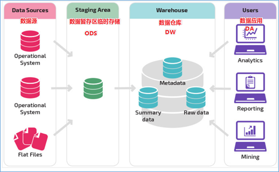
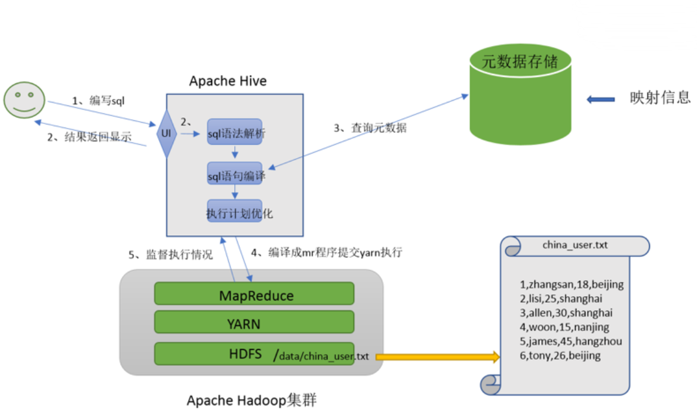
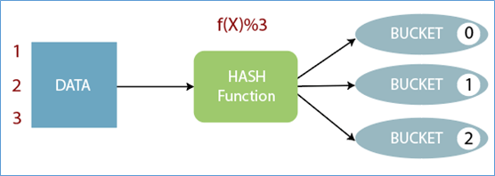
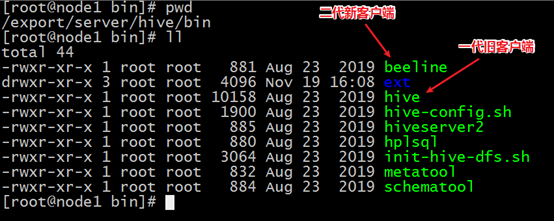

# **数据仓库&Hive入门**

## 数据仓库

### 数据仓库概念

数据仓库（英语：Data Warehouse，简称数仓、DW）,是一个用于存储、分析、报告的数据系统。数据仓库的目的是构建面向分析的集成化数据环境，为企业提供决策支持（Decision Support）。


数据仓库本身并不“生产”任何数据，其数据来源于不同外部系统；同时数据仓库自身也不需要“消费”任何的数据，其结果开放给各个外部应用使用，这也是为什么叫“仓库”，而不叫“工厂”的原因。


### 数据仓库的产生

为了分析数据而来，分析结果给企业决策提供支撑。


信息总是用作两个目的：

- 操作型记录的保存和分析型决策的制定。

- 数据仓库是信息技术长期发展的产物。

 

**以中国人寿保险公司（chinalife）发展为例：**

操作型记录的保存：

中国人寿保险（集团）公司下辖多条业务线，包括：人寿险、财险、车险，养老险等。各业务线的业务正常运营需要记录维护包括客户、保单、收付费、核保、理赔等信息。


**联机事务处理系统（OLTP）**正好可以满足上述业务需求开展, 其主要任务是执行联机事务和查询处理。其基本特征是前台接收的用户数据可以立即传送到后台进行处理，并在很短的时间内给出处理结果。


关系型数据库是OLTP典型应用，比如：Oracle、Mysql、SQL Server等。


### 分析型决策的制定

基于业务数据开展数据分析，基于分析的结果给决策提供支撑。也就是所谓的**数据驱动决策的制定**。


OLTP的核心是面向业务，支持业务，支持事务。所有的业务操作可以分为读、写两种操作，一般来说读的压力明显大于写的压力。如果在OLTP环境直接开展各种分析，有以下问题需要考虑：

- 数据分析也是对数据进行读取操作，会让读取压力倍增；
- OLTP仅存储数周或数月的数据；
- 数据分散在不同系统不同表中，字段类型属性不统一；


当分析所涉及数据规模较小的时候，在业务低峰期时可以在OLTP系统上开展直接分析。但是为了更好的进行各种规模的数据分析，同时也不影响OLTP系统运行，此时需要构建一个集成统一的数据分析平台。


该目的很简单：面向分析，支持分析。并且和OLTP系统解耦合。


### 数据仓库的构建

如数仓定义所说,数仓是一个用于存储、分析、报告的数据系统，目的是构建面向分析的集成化数据环境。


把这种面向分析、支持分析的系统称之为OLAP（联机分析处理）系统。数据仓库是OLAP一种。


**中国人寿保险公司就可以基于分析决策需求，构建数仓平台：**


## 数据仓库主要特征

数据仓库：

- **面向主题性**（Subject-Oriented ）
- **集成性**（Integrated）
- **非易失性**（Non-Volatile）
- **时变性**（Time-Variant ）数据集合，用以支持管理决策 。


### 面向主题性

数据库中，最大的特点是面向应用进行数据的组织，各个业务系统可能是相互分离的。而数据仓库则是面向主题的。主题是一个抽象的概念，是较高层次上企业信息系统中的数据综合、归类并进行分析利用的抽象。在逻辑意义上，它是对应企业中某一宏观分析领域所涉及的分析对象。


操作型处理（传统数据）对数据的划分并不适用于决策分析。而基于主题组织的数据则不同，它们被划分为各自独立的领域，每个领域有各自的逻辑内涵但互不交叉，在抽象层次上对数据进行完整、一致和准确的描述。


### 集成性

确定主题之后，就需要获取和主题相关的数据。当下企业中主题相关的数据通常会分布在多个操作型系统中，彼此分散、独立、异构。


因此在数据进入数据仓库之前，必然要经过统一与综合，对数据进行抽取、清理、转换和汇总，这一步是数据仓库建设中最关键、最复杂的一步，所要完成的工作有：

（1）要统一源数据中所有矛盾之处，如字段的同名异义、异名同义、单位不统一、字长不一致，等等。


（2）进行数据综合和计算。数据仓库中的数据综合工作可以在从原有数据库抽取数据时生成，但许多是在数据仓库内部生成的，即进入数据仓库以后进行综合生成的。


下图说明了保险公司综合数据的简单处理过程，其中数据仓库中与“承保”主题有关的数据来自于多个不同的操作型系统。


这些系统内部数据的命名可能不同，数据格式也可能不同。把不同来源的数据存储到数据仓库之前，需要去除这些不一致。


**数据仓库的数据集成**


### 非易失性

数据仓库是分析数据的平台，而不是创造数据的平台。通过数仓去分析数据中的规律，而不是去创造修改其中的规律。因此数据进入数据仓库后，它便稳定且不会改变。


操作型数据库主要服务于日常的业务操作，使得数据库需要不断地对数据实时更新，以便迅速获得当前最新数据，不至于影响正常的业务运作。在数据仓库中只要保存过去的业务数据，不需要每一笔业务都实时更新数据仓库，而是根据商业需要每隔一段时间把一批较新的数据导入数据仓库。


数据仓库的数据反映的是一段相当长的时间内历史数据的内容，是不同时点的数据库快照的集合，以及基于这些快照进行统计、综合和重组的导出数据。


数据仓库的用户对数据的操作大多是数据查询或比较复杂的挖掘，一旦数据进入数据仓库以后，一般情况下被较长时间保留。数据仓库中一般有大量的查询操作，但修改和删除操作很少。


### 时变性

数据仓库包含各种粒度的历史数据，数据可能与某个特定日期、星期、月份、季度或者年份有关。虽然数据仓库的用户不能修改数据，但并不是说数据仓库的数据是永远不变的。


分析的结果只能反映过去的情况，当业务变化后，挖掘出的模式会失去时效性。因此数据仓库的数据需要随着时间更新，以适应决策的需要。从这个角度讲，数据仓库建设是一个项目，更是一个过程 。


**数据仓库的数据随时间的变化表现在以下几个方面:**
 （1）数据仓库的数据时限一般要远远长于操作型数据的数据时限。
 （2）操作型系统存储的是当前数据，而数据仓库中的数据是历史数据。
 （3）数据仓库中的数据是按照时间顺序追加的，它们都带有时间属性。


## 数据仓库、数据库、数据集市

### OLTP、OLAP

操作型处理，叫**联机事务处理OLTP**（On-Line **Transaction** Processing），主要目标是做数据处理，它是针对具体业务在数据库联机的日常操作，通常对少数记录进行查询、修改。用户较为关心操作的响应时间、数据的安全性、完整性和并发支持的用户数等问题。传统的关系型数据库系统作为数据管理的主要手段，主要用于操作型处理。


分析型处理，叫**联机分析处理OLAP**（On-Line **Analytical** Processing），主要目标是做数据分析。一般针对某些主题的历史数据进行复杂的多维分析，支持管理决策。数据仓库是OLAP系统的一个典型示例，主要用于数据分析。


**多个不同角度来对比OLTP和OLAP**

|          |             OLTP             |                      OLAP                      |
| :------: | :--------------------------: | :--------------------------------------------: |
|  数据源  |  仅包含当前运行日常业务数据  |   整合来自多个来源的数据，包括OLTP和外部来源   |
|   目的   | 面向应用，面向业务，支撑事务 |        面向主题，面向分析，支撑分析决策        |
|   焦点   |             当下             |        主要面向过去、面向历史 实时数仓         |
|   任务   |           读写操作           |               大量读而很少写操作               |
| 响应时间 |             毫秒             | 秒、分钟、小时或者天  取决于数据量和查询复杂性 |
|  数据量  |        小数据，MB,GB         |                 大数据，TP，PB                 |


### 数据仓库、数据库

数据库与数据仓库的区别实际讲的是OLTP与OLAP的区别。

**OLTP系统**的典型应用就是RDBMS,也就是我们俗称的数据库，特别强调此数据库表示的是关系型数据库，Nosql数据库并不在范围内。


**OLAP系统**的典型应用就是DW,也就是我们俗称的数据仓库。因此数据仓库和数据库的区别就很好掌握了。但是有几点需要着重强调：


1.数据仓库不是大型的数据库，虽然数据仓库存储数据规模大。

2.数据仓库的出现，并不是要取代数据库。

3.数据库是面向事务的设计，数据仓库是面向主题设计的。

4.数据库一般存储业务数据，数据仓库存储的一般是历史数据。

5.数据库是为捕获数据而设计，数据仓库是为分析数据而设计。


### 数据仓库、数据集市

**数据仓库**是面向整个集团组织的数据，数据集市是面向单个部门使用的。可以认为数据集市是数据仓库的子集，也有人把数据集市叫做小型数据仓库。


**数据集市**通常只涉及一个主题领域，例如市场营销或销售。因为它们较小且更具体，所以它们通常更易于管理和维护，并具有更灵活的结构。


**上图所示：**

各种操作型系统数据和包括文件在内的等其他数据作为数据源，经过ETL(抽取转换加载)填充到数据仓库中；


数据仓库中有不同主题数据，数据集市则根据部门特点面向指定主题，比如Purchasing（采购）、Sales（销售）、Inventory（库存）；


用户可以基于主题数据开展各种应用：数据分析、数据报表、数据挖掘。


## 数据仓库分层架构

### 数仓分层思想和标准

数据仓库的**特点是本身不生产数据，也不最终消费数据。**按照数据流入流出数仓的过程进行分层就显得水到渠成。


数据分层每个企业根据自己的业务需求可以分成不同的层次，但是最基础的分层思想，**理论上数据分为三个层，操作型数据层（ODS）、数据仓库层(DW)和数据应用层(DA)。**


企业在实际运用中可以基于这个基础分层之上添加新的层次，来满足不同的业务需求。




### 阿里巴巴数仓3层架构


#### ODS层（Operation Data Store）

直译：操作型数据层。

也称之为源数据层、数据引入层、数据暂存层、临时缓存层。此层存放未经过处理的原始数据至数据仓库系统，结构上与源系统保持一致，是数据仓库的数据准备区。主要完成基础数据引入到数仓的职责，和数据源系统进行解耦合，同时记录基础数据的历史变化。


#### DW层（Data Warehouse）

数据仓库层。内部具体包括DIM维度表、DWD和DWS，由ODS层数据加工而成。主要完成数据加工与整合，建立一致性的维度，构建可复用的面向分析和统计的明细事实表，以及汇总公共粒度的指标。

***公共维度层（DIM）：**基于维度建模理念思想，建立整个企业一致性维度。*


***公共汇总粒度事实层（DWS、DWB）：**以分析的主题对象作为建模驱动，基于上层的应用和产品的指标需求，构建公共粒度的汇总指标事实表，以宽表化手段物理化模型*


***明细粒度事实层（DWD）:*** *将明细事实表的某些重要维度属性字段做适当冗余，即宽表化处理。*


#### 数据应用层（DA或ADS）

面向最终用户，面向业务定制提供给产品和数据分析使用的数据。包括前端报表、分析图表、KPI、仪表盘、OLAP专题、数据挖掘等分析。


#### ETL 和 ELT

数据仓库从各数据源获取数据及在数据仓库内的数据转换和流动都可以认为是ETL（抽取Extra, 转化Transfer, 装载Load）的过程。但是在实际操作中将数据加载到仓库却产生了两种不同做法：ETL和ELT。


**ETL(Extract，Transform，Load):**

首先从数据源池中提取数据，这些数据源通常是事务性数据库。数据保存在临时暂存数据库中。然后执行转换操作，将数据结构化并转换为适合目标数据仓库系统的形式。然后将结构化数据加载到仓库中，以备分析。


**ELT(Extract，Load，Transform):**

使用ELT，数据在从源数据池中提取后立即加载。没有临时数据库，这意味着数据会立即加载到单一的集中存储库中。数据在数据仓库系统中进行转换，以便与商业智能工具和分析一起使用。大数据时代的数仓这个特点很明显。


### 为什么要分层?

分层的主要原因是在管理数据的时候，能对数据有一个更加清晰的掌控，详细来讲，主要有下面几个原因：

- **清晰数据结构**

​	每一个数据分层都有它的作用域，在使用表的时候能更方便地定位和理解。


- **数据血缘追踪**

简单来说，我们最终给业务呈现的是一个能直接使用业务表，但是它的来源有很多，如果有一张来源表出问题了，能够快速准确地定位到问题，并清楚它的危害范围。


- **减少重复开发**

规范数据分层，开发一些通用的中间层数据，能够减少极大的重复计算。


- **把复杂问题简单化**

将一个复杂的任务分解成多个步骤来完成，每一层只处理单一的步骤，比较简单和容易理解。而且便于维护数据的准确性，当数据出现问题之后，可以不用修复所有的数据，只需要从有问题的步骤开始修复。


- **屏蔽原始数据的异常**

屏蔽业务的影响，不必改一次业务就需要重新接入数据


### 案例：美团点评酒旅数据仓库建设实践

**互联网企业真实的数仓建设实践案例**

- 数仓面向主题分析的特点
- 在企业中数仓是一个不断维护的工程。
- 数仓分层并不局限于经典3层，可以根据自身需求进行调整
- 没有好的架构，只有适合自己业务需求的架构
- 它山之石可以攻玉

#### 美团数仓技术架构：架构变迁

美团点评酒旅事业群内，业务由传统的团购形式转向预订、直连等更加丰富的产品形式，业务系统也在迅速的迭代变化，这些都对数据仓库的扩展性、稳定性、易用性提出了更高要求。基于此，美团采取了分层次、分主题的方式不断优化并调整层次结构，下图展示了技术架构的变迁。


第一代数仓模型层次中，由于当时美团整体的业务系统所支持的产品形式比较单一（团购），业务系统中包含了所有业务品类的数据，所以由平台的角色来加工数据仓库基础层是非常合适的，平台统一建设，支持各个业务线使用，所以在本阶段中酒旅只是建立了一个相对比较简单的数据集市。


第二代数仓模型层次的建设，由建设数据集市的形式转变成了直接建设酒旅数据仓库，成为了酒旅自身业务系统数据的唯一加工者。随着美团和点评融合，同时酒旅自身的业务系统重构的频率也相对较高，对第二代数仓模型稳定性造成了非常大的影响，原本的维度模型非常难适配这么迅速的变化。核心问题是在用业务系统和业务线关系错综复杂，业务系统之间差异性明显且变更频繁。


于是在ODS与多维明细层中间加入了数据整合层，参照Bill Inmon所提出的企业信息工厂建设的模式，基本按照三范式的原则来进行数据整合，由业务驱动调整成了由技术驱动的方式来建设数据仓库基础层。使用本基础层的最根本出发点还是在于美团的供应链、业务、数据它们本身的多样性，如果业务、数据相对比较单一、简单，本层次的架构方案很可能将不再适用。


#### 美团数仓业务架构：主题建设

实际上在传统的一些如银行、制造业、电信、零售等行业里，都有一些比较成熟的模型，如耳熟能详的BDWM模型，它们都是经过一些具有相类似行业的企业在二三十年数据仓库建设中所积累的行业经验，不断的优化并通用化。但美团所处的O2O行业本身就没有可借鉴的成熟的数据仓库主题以及模型，所以，在摸索建设两年的时间里，美团总结了下面比较适合现状的七大主题（后续可能还会新增）


#### 美团数仓整体架构

确定好技术和业务主题之后，数仓的整体架构就比较清晰了。美团酒旅数仓七个主题基本上都采用6层结构的方式来建设，划分主题更多是从业务的角度出发，而层次划分则是基于技术，实质上就是基于业务与技术的结合完成了整体的数据仓库架构。


比如，以订单主题为例。在订单主题的建设过程中，美团是按照由分到总的结构思路来进行建设，首先分供应链建设订单相关实体（数据整合中间层3NF），然后再进行适度抽象把分供应链的相关订单实体进行合并后生成订单实体（数据整合层3NF），后续在数据整合层的订单实体基础上再扩展部分维度信息来完成后续层次的建设。


#  Apache Hive3.x 入门

## Apache Hive概述

### 什么是Hive?

Apache Hive是一款建立在Hadoop之上的开源数据仓库系统，可以将存储在Hadoop文件中的结构化、半结构化数据文件**映射**为一张数据库表，基于表提供了一种类似SQL的查询模型，称为Hive查询语言（HQL），用于访问和分析存储在Hadoop文件中的大型数据集。


Hive核心是将**HQL转换为MapReduce**程序，然后将程序提交到Hadoop群集执行。Hive由Facebook实现并开源。


### 使用Hive的原因?

**使用Hadoop MapReduce直接处理数据所面临的问题:** 

- 人员学习成本太高 需要掌握java语言

- MapReduce实现复杂查询逻辑开发难度太大


**使用Hive处理数据的好处:** 

- 操作接口采用类SQL语法，提供快速开发的能力（简单、容易上手）

- 避免直接写MapReduce，减少开发人员的学习成本

- 支持自定义函数，功能扩展很方便

- 背靠Hadoop，擅长存储分析海量数据集


### Hive与Hadoop的关系

从功能来说，数据仓库软件，至少需要具备下述两种能力：

- 存储数据的能力

- 分析数据的能力

Hive作为一款大数据时代的数据仓库软件，当然也具备上述两种能力。只不过Hive并不是自己实现了上述两种能力，而是借助Hadoop。


**Hive**利用HDFS存储数据，利用MapReduce查询分析数据。Hive的最大的魅力在于用户专注于编写HQL，Hive帮用户转换成为MapReduce程序完成对数据的分析。


### 功能实现关键

#### **映射信息记录**

映射在数学上称之为一种对应关系，比如y=x+1，对于每一个x的值都有与之对应的y的值。在hive中能够写sql处理的前提是针对表，而不是针对文件，因此需要将文件和表之间的对应关系描述记录清楚。映射信息专业的叫法称之为元数据信息（元数据是指用来描述数据的数据 metadata）。


**元数据信息包括：**

- 表对应着哪个文件（位置信息）

- 表的列对应着文件哪一个字段（顺序信息）

- 文件字段之间的分隔符是什么

### Sql语法解析、编译

用户写完sql之后，hive需要针对sql进行语法校验，并且根据记录的元数据信息解读sql背后的含义，制定执行计划。并且把执行计划转换成MapReduce程序来执行，把执行的结果封装返回给用户。




## Hive架构、组件

### Hive架构图


### Hive组件

**用户接口**：包括 CLI、JDBC/ODBC、WebGUI。其中，CLI(command line interface)为shell命令行；Hive中的Thrift服务器允许外部客户端通过网络与Hive进行交互，类似于JDBC或ODBC协议。WebGUI是通过浏览器访问Hive。


**元数据存储**：通常是存储在关系数据库如 mysql/derby中。Hive 中的元数据包括表的名字，表的列和分区及其属性，表的属性（是否为外部表等），表的数据所在目录等。


**Driver**驱动程序，包括语法解析器、计划编译器、优化器、执行器:完成 HQL 查询语句从词法分析、语法分析、编译、优化以及查询计划的生成。生成的查询计划存储在 HDFS 中，并在随后有执行引擎调用执行。


**执行引擎**：Hive本身并不直接处理数据文件。而是通过执行引擎处理。当下Hive支持MapReduce、Tez、Spark3种执行引擎。

### Hive数据模型（Data Model） 

据模型：用来描述数据、组织数据和对数据进行操作，是对现实世界数据特征的描述。Hive的数据模型类似于RDBMS库表结构，此外还有自己特有模型。

Hive中的数据可以在粒度级别上分为三类：

- Table 表

- Partition分区

- Bucket 分桶


#### Databases

Hive作为一个数据仓库，在结构上积极向传统数据库看齐，也分数据库（Schema），每个数据库下面有各自的表组成。默认数据库default。Hive的数据都是存储在HDFS上的，默认有一个根目录，在hive-site.xml中，由参数hive.metastore.warehouse.dir指定。默认值为/user/hive/warehouse。因此，Hive中的数据库在HDFS上的存储路径为：${hive.metastore.warehouse.dir}/databasename.db


比如，名为itcast的数据库存储路径为：/user/hive/warehouse/dsjprs.db


#### Tables

Hive表与关系数据库中的表相同。Hive中的表所对应的数据是存储在Hadoop的文件系统中，而表相关的元数据是存储在RDBMS中。在Hadoop中，数据通常驻留在HDFS中，尽管它可以驻留在任何Hadoop文件系统中，包括本地文件系统或S3。Hive有两种类型的表：

- Managed Table内部表、托管表

- External Table外部表


创建表时，默是内部表。关于内部表和外部表的区别，我们后续知识点再做展开探讨。Hive中的表的数据在HDFS上的存储路径为：${hive.metastore.warehouse.dir}/databasename.db/tablename


比如,itcast的数据库下t_user表存储路径为：/user/hive/warehouse/dsjprs.db/t_user


#### Partitions

Partition分区是hive的一种优化手段表。**分区是指根据分区列（例如“日期day”）的值将表划分为不同分区**。这样可以更快地对指定分区数据进行查询。分区在存储层面上的表现是:table表目录下以子文件夹形式存在。一个文件夹表示一个分区。


子文件命名标准：**分区列=分区值**Hive还支持分区下继续创建分区，所谓的多重分区。


#### Buckets

Bucket分桶表是hive的一种优化手段表。**分桶是指根据表中字段（例如“编号ID”）的值,经过hash计算规则将数据文件划分成指定的若干个小文件**。




分桶规则：hashfunc(ID) % 桶个数，余数相同的分到同一个文件。分桶的好处是可以优化join查询和方便抽样查询。Bucket分桶表在hdfs中表现为同一个表目录下数据根据hash散列之后变成多个文件。


Hive虽然具有RDBMS数据库的外表，包括数据模型、SQL语法都十分相似，但应用场景却完全不同。Hive只适合用来做海量数据的离线分析。Hive的定位是数据仓库，面向分析的OLAP系统。因此时刻告诉自己，Hive不是大型数据库，也不是要取代Mysql承担业务数据处理。


更直观的对比请看下面这幅图：


## Hive 安装部署

### 元数据相关名词

#### Metadata

**Metadata**即元数据。元数据包含用Hive创建的database、table、表的位置、类型、属性，字段顺序类型等元信息。元数据存储在关系型数据库中。如hive内置的Derby、或者第三方如MySQL等。


#### Metastore

**Metastore**即元数据服务。Metastore服务的作用是管理metadata元数据，对外暴露服务地址，让各种客户端通过连接metastore服务，由metastore再去连接MySQL数据库来存取元数据。有了metastore服务，就可以有多个客户端同时连接，而且这些客户端不需要知道MySQL数据库的用户名和密码，只需要连接metastore 服务即可。某种程度上也保证了hive元数据的安全。


#### metastore三种配置方式

metastore服务配置有3种模式：**内嵌模式**、**本地模式**、**远程模式**。


##### 内嵌模式

**内嵌模式**（Embedded Metastore）是metastore默认部署模式。此种模式下，元数据存储在内置的Derby数据库，并且**Derby数据库和metastore服务都嵌入在主HiveServer进程中**，当启动HiveServer进程时，Derby和metastore都会启动。


不需要额外起Metastore服务。但是一次只能支持一个活动用户，适用于测试体验，不适用于生产环境。


##### 本地模式

**本地模式**（Local Metastore）下，Hive Metastore服务与主HiveServer进程在同一进程中运行，但是存储元数据的数据库在单独的进程中运行，并且可以在单独的主机上。metastore服务将通过JDBC与metastore数据库进行通信。本地模式采用外部数据库来存储元数据，推荐使用MySQL。hive根据hive.metastore.uris 参数值来判断，**如果为空，则为本地模式**。


缺点是：每启动一次hive服务，都内置启动了一个metastore。


##### 远程模式

**远程模式**（Remote Metastore）下，Metastore服务在其自己的单独JVM上运行，而不在HiveServer的JVM中运行。如果其他进程希望与Metastore服务器通信，则可以使用Thrift Network API进行通信。


在生产环境中，建议用远程模式来配置Hive Metastore。在这种情况下，其他依赖hive的软件都可以通过Metastore访问hive。由于还可以完全屏蔽数据库层，因此这也带来了更好的可管理性/安全性。


远程模式下，需要配置hive.metastore.uris 参数来指定metastore服务运行的机器ip和端口，并且**需要单独手动启动metastore服务**。


##### 安装准备

由于Apache Hive是一款基于Hadoop的数据仓库软件，通常部署运行在Linux系统之上。因此不管使用何种方式配置Hive Metastore，必须要先保证服务器的基础环境正常，Hadoop集群健康可用。

**服务器基础环境:**

- 集群时间同步
- 防火墙关闭
- 主机Host映射
- 免密登录
- JDK安装


**Hadoop集群**

启动Hive之前必须先启动Hadoop集群。特别要注意，**需等待**HDFS**安全模式关闭之后再启动运行**Hive。Hive不是分布式安装运行的软件，其分布式的特性主要借由Hadoop完成。包括分布式存储、分布式计算。


##### 内嵌模式安装

```sh
# 上传解压安装包
cd /export/server/
tar zxvf apache-hive-3.1.2-bin.tar.gz
mv apache-hive-3.1.2-bin hive

#解决hadoop、hive之间guava版本差异
cd /export/server/hive
rm -rf lib/guava-19.0.jar
cp /export/server/hadoop-3.1.4/share/hadoop/common/lib/guava-27.0-jre.jar ./lib/

#修改hive环境变量文件 添加Hadoop_HOME
cd /export/server/hive/conf/
mv hive-env.sh.template hive-env.sh
vim hive-env.sh
export HADOOP_HOME=/export/server/hadoop-3.1.4
export HIVE_CONF_DIR=/export/server/hive/conf
export HIVE_AUX_JARS_PATH=/export/server/hive/lib

#初始化metadata
cd /export/server/hive
bin/schematool -dbType derby -initSchema

#启动hive服务
bin/hive
```

注意：Hive3版本需要用户手动进行元数据初始化动作。内嵌模式下，判断是否初始化成功的依据是执行命令之后输出信息和执行命令的当前路径下是否有文件产生。


##### 本地模式安装

本地模式和内嵌模式最大的区别就是：本地模式使用mysql来存储元数据。

**Mysql**安装：

```sh
#卸载Centos7自带mariadb
rpm -qa|grep mariadb
mariadb-libs-5.5.64-1.el7.x86_64
rpm -e mariadb-libs-5.5.64-1.el7.x86_64 --nodeps

#创建mysql安装包存放点
mkdir /export/software/mysql
#上传mysql-5.7.29安装包到上述文件夹下、解压
tar xvf mysql-5.7.29-1.el7.x86_64.rpm-bundle.tar

#执行安装
yum -y install libaio
rpm -ivh mysql-community-common-5.7.29-1.el7.x86_64.rpm mysql-community-libs-5.7.29-1.el7.x86_64.rpm mysql-community-client-5.7.29-1.el7.x86_64.rpm mysql-community-server-5.7.29-1.el7.x86_64.rpm

#初始化mysql
mysqld --initialize
#更改所属组
chown mysql:mysql /var/lib/mysql -R

#启动mysql
systemctl start mysqld.service
#查看生成的临时root密码
cat  /var/log/mysqld.log
#这行日志的最后就是随机生成的临时密码
[Note] A temporary password is generated for root@localhost: o+TU+KDOm004

#修改mysql root密码、授权远程访问
mysql -u root -p
Enter password:     #这里输入在日志中生成的临时密码

#更新root密码  设置为hadoop
mysql> alter user user() identified by "hadoop";
Query OK, 0 rows affected (0.00 sec)
#授权
mysql> use mysql;
mysql> GRANT ALL PRIVILEGES ON *.* TO 'root'@'%' IDENTIFIED BY 'hadoop' WITH GRANT OPTION;
mysql> FLUSH PRIVILEGES;

#mysql的启动和关闭 状态查看
systemctl stop mysqld
systemctl status mysqld
systemctl start mysqld

#建议设置为开机自启动服务
systemctl enable  mysqld

#查看是否已经设置自启动成功
systemctl list-unit-files | grep mysqld
```

**Hive**安装：

```sh
# 上传解压安装包
cd /export/server/
tar zxvf apache-hive-3.1.2-bin.tar.gz
mv apache-hive-3.1.2-bin hive

#解决hadoop、hive之间guava版本差异
cd /export/server/hive
rm -rf lib/guava-19.0.jar
cp /export/server/hadoop-3.1.4/share/hadoop/common/lib/guava-27.0-jre.jar ./lib/

#添加mysql jdbc驱动到hive安装包lib/文件下
mysql-connector-java-5.1.32.jar

#修改hive环境变量文件 添加Hadoop_HOME
cd /export/server/hive/conf/
mv hive-env.sh.template hive-env.sh
vim hive-env.sh
export HADOOP_HOME=/export/server/hadoop-3.1.4
export HIVE_CONF_DIR=/export/server/hive/conf
export HIVE_AUX_JARS_PATH=/export/server/hive/lib

#新增hive-site.xml 配置mysql等相关信息
vim hive-site.xml


#初始化metadata
cd /export/server/hive
bin/schematool -initSchema -dbType mysql -verbos
#初始化成功会在mysql中创建74张表
#启动hive服务
bin/hive
```

**Hive-site.xml**

```xml
<configuration>
    <!-- 存储元数据mysql相关配置 -->
    <property>
        <name>javax.jdo.option.ConnectionURL</name>
        <value> jdbc:mysql://node1:3306/hive?createDatabaseIfNotExist=true&amp;useSSL=false&amp;useUnicode=true&amp;characterEncoding=UTF-8</value>
    </property>

    <property>
        <name>javax.jdo.option.ConnectionDriverName</name>
        <value>com.mysql.jdbc.Driver</value>
    </property>

    <property>
        <name>javax.jdo.option.ConnectionUserName</name>
        <value>root</value>
    </property>

    <property>
        <name>javax.jdo.option.ConnectionPassword</name>
        <value>hadoop</value>
    </property>

    <!-- 关闭元数据存储授权  -->
    <property>
        <name>hive.metastore.event.db.notification.api.auth</name>
        <value>false</value>
    </property>

    <!-- 关闭元数据存储版本的验证 -->
    <property>
        <name>hive.metastore.schema.verification</name>
        <value>false</value>
    </property>
</configuration>
```

##### 远程模式安装（重点）

**Mysql**安装：

```sh
#卸载Centos7自带mariadb
rpm -qa|grep mariadb
mariadb-libs-5.5.64-1.el7.x86_64
rpm -e mariadb-libs-5.5.64-1.el7.x86_64 --nodeps

#创建mysql安装包存放点
mkdir /export/software/mysql
#上传mysql-5.7.29安装包到上述文件夹下、解压
tar xvf mysql-5.7.29-1.el7.x86_64.rpm-bundle.tar

#执行安装
yum -y install libaio
rpm -ivh mysql-community-common-5.7.29-1.el7.x86_64.rpm mysql-community-libs-5.7.29-1.el7.x86_64.rpm mysql-community-client-5.7.29-1.el7.x86_64.rpm mysql-community-server-5.7.29-1.el7.x86_64.rpm

#初始化mysql
mysqld --initialize
#更改所属组
chown mysql:mysql /var/lib/mysql -R

#启动mysql
systemctl start mysqld.service
#查看生成的临时root密码
cat  /var/log/mysqld.log
#这行日志的最后就是随机生成的临时密码
[Note] A temporary password is generated for root@localhost: o+TU+KDOm004

#修改mysql root密码、授权远程访问
mysql -u root -p
Enter password:     #这里输入在日志中生成的临时密码

#更新root密码  设置为hadoop
mysql> alter user user() identified by "hadoop";
Query OK, 0 rows affected (0.00 sec)
#授权
mysql> use mysql;
mysql> GRANT ALL PRIVILEGES ON *.* TO 'root'@'%' IDENTIFIED BY 'hadoop' WITH GRANT OPTION;
mysql> FLUSH PRIVILEGES;

#mysql的启动和关闭 状态查看
systemctl stop mysqld
systemctl status mysqld
systemctl start mysqld

#建议设置为开机自启动服务
systemctl enable  mysqld

#查看是否已经设置自启动成功
systemctl list-unit-files | grep mysqld
```

**Hive**安装：

```sh
# 上传解压安装包
cd /export/server/
tar zxvf apache-hive-3.1.2-bin.tar.gz
mv apache-hive-3.1.2-bin hive

#解决hadoop、hive之间guava版本差异
cd /export/server/hive
rm -rf lib/guava-19.0.jar
cp /export/server/hadoop-3.1.4/share/hadoop/common/lib/guava-27.0-jre.jar ./lib/

#添加mysql jdbc驱动到hive安装包lib/文件下
mysql-connector-java-5.1.32.jar

#修改hive环境变量文件 添加Hadoop_HOME
cd /export/server/hive/conf/
mv hive-env.sh.template hive-env.sh
vim hive-env.sh
export HADOOP_HOME=/export/server/hadoop-3.1.4
export HIVE_CONF_DIR=/export/server/hive/conf
export HIVE_AUX_JARS_PATH=/export/server/hive/lib

#新增hive-site.xml 配置mysql等相关信息
vim hive-site.xml

#初始化metadata
cd /export/server/hive
bin/schematool -initSchema -dbType mysql -verbos
#初始化成功会在mysql中创建74张表
```

**Hive-site.xml**

```xml
<configuration>
    <!-- 存储元数据mysql相关配置 -->
    <property>
        <name>javax.jdo.option.ConnectionURL</name>
        <value> jdbc:mysql://node1:3306/hive?createDatabaseIfNotExist=true&amp;useSSL=false&amp;useUnicode=true&amp;characterEncoding=UTF-8</value>
    </property>

    <property>
        <name>javax.jdo.option.ConnectionDriverName</name>
        <value>com.mysql.jdbc.Driver</value>
    </property>

    <property>
        <name>javax.jdo.option.ConnectionUserName</name>
        <value>root</value>
    </property>

    <property>
        <name>javax.jdo.option.ConnectionPassword</name>
        <value>hadoop</value>
    </property>

    <!-- H2S运行绑定host -->
    <property>
        <name>hive.server2.thrift.bind.host</name>
        <value>node1</value>
    </property>

    <!-- 远程模式部署metastore 服务地址 -->
    <property>
        <name>hive.metastore.uris</name>
        <value>thrift://node1:9083</value>
    </property>

    <!-- 关闭元数据存储授权  -->
    <property>
        <name>hive.metastore.event.db.notification.api.auth</name>
        <value>false</value>
    </property>

    <!-- 关闭元数据存储版本的验证 -->
    <property>
        <name>hive.metastore.schema.verification</name>
        <value>false</value>
    </property>
</configuration>
```

如果在远程模式下，直接运行hive服务，在执行操作的时候会报错，错误信息如下：


在**远程模式下，必须首先启动Hive metastore服务才可以使用hive。因为metastore服务和hive server是两个单独的进程了**。


**远程模式Metastore服务手动启动**

```sh
#前台启动  关闭ctrl+c
/export/server/hive/bin/hive --service metastore

#后台启动 进程挂起  关闭使用jps + kill
#输入命令回车执行 再次回车 进程将挂起后台
nohup /export/server/hive/bin/hive --service metastore &

#前台启动开启debug日志
/export/server/hive/bin/hive --service metastore --hiveconf hive.root.logger=DEBUG,console
```

后台启动的输出日志信息，在/root目录下，nohup.out。


## Hive客户端使用

### Hive Client、Hive Beeline Client

Hive发展至今，总共历经了两代客户端工具。

**第一代客户端（deprecated不推荐使用）：**$HIVE_HOME/bin/hive, 是一个 shellUtil。主要功能：一是可用于以交互或批处理模式运行Hive查询；二是用于Hive相关服务的启动，比如metastore服务。


**第二代客户端（recommended 推荐使用）：$HIVE_HOME/bin/beeline**，是一个JDBC客户端，是官方强烈推荐使用的Hive命令行工具，和第一代客户端相比，性能加强安全性提高。


Beeline Shell在嵌入式模式和远程模式下均可工作。在嵌入式模式下，它运行嵌入式 Hive(类似于Hive Client)，而远程模式下beeline通过 Thrift 连接到单独的 HiveServer2 服务上，这也是官方推荐在生产环境中使用的模式。


**HiveServer2是什么？HiveServer1哪里去了？**




### HiveServer、HiveServer2服务

HiveServer、HiveServer2都是Hive自带的两种服务，允许客户端在不启动CLI的情况下对Hive中的数据进行操作，且两个都允许远程客户端使用多种编程语言如java，python等向hive提交请求，取回结果。


但是，HiveServer不能处理多于一个客户端的并发请求。因此在Hive-0.11.0版本中重写了HiveServer代码得到了HiveServer2，进而解决了该问题。**HiveServer**已经被废弃。


HiveServer2支持多客户端的并发和身份认证，旨在为开放API客户端如JDBC、ODBC提供更好的支持。


### Hive服务和客户端关系梳理

HiveServer2通过Metastore服务读写元数据。所以在远程模式下，启动HiveServer2之前必须先首先启动metastore服务。


特别注意：

远程模式下，Beeline客户端只能通过HiveServer2服务访问Hive。而Hive Client是通过Metastore服务访问的。具体关系如下：


### Hive Client使用

在hive安装包的bin目录下，有hive提供的第一代客户端 bin/hive。该客户端可以访问hive的metastore服务，从而达到操作hive的目的。


**提示**：如果远程模式部署，手动启动运行metastore服务。如果是内嵌模式和本地模式，直接运行bin/hive，metastore服务会内嵌一起启动。


可以直接在启动Hive metastore服务的机器上使用bin/hive客户端操作，此时不需要进行任何配置。

```sh
#远程模式 首先启动metastore服务
/export/server/hive/bin/hive --service metastore
#克隆CRT会话窗口 使用hive client连接
/export/server/hive/bin/hive
```

需要在其他机器上通过bin/hive访问hive metastore服务，只需要在该机器的hive-site.xml配置中添加metastore服务地址即可。

```shell
#上传hive安装包到另一个机器上，比如node3：
cd /export/server/
tar zxvf apache-hive-3.1.2-bin.tar.gz
mv apache-hive-3.1.2-bin hive

#解决hadoop、hive之间guava版本差异
cd /export/server/hive/
rm -rf lib/guava-19.0.jar
cp /export/server/hadoop-3.1.4/share/hadoop/common/lib/guava-27.0-jre.jar ./lib/

#修改hive环境变量文件 添加Hadoop_HOME
cd /export/server/hive/conf
mv hive-env.sh.template hive-env.sh
vim hive-env.sh
export HADOOP_HOME=/export/server/hadoop-3.1.4

#添加metastore服务地址
cd /export/server/hive/conf/
vim  hive-site.xml

<configuration>
<property>
    <name>hive.metastore.uris</name>
    <value>thrift://node1:9083</value>
</property>
</configuration>
```

### Hive Beeline Client使用

hive经过发展，推出了第二代客户端beeline，但是beeline客户端不是直接访问metastore服务的，而是**需要单独启动hiveserver2服务**。


在hive运行的服务器上，首先启动metastore服务，然后启动hiveserver2服务。

```sh
#先启动metastore服务 然后启动hiveserver2服务
nohup /export/server/hive/bin/hive --service metastore &
nohup /export/server/hive/bin/hive --service hiveserver2 &
```

在node3上使用beeline客户端进行连接访问。需要注意hiveserver2服务启动之后需要稍等一会才可以对外提供服务。


Beeline是JDBC的客户端，通过JDBC协议和Hiveserver2服务进行通信，协议的地址是：**jdbc:hive2://node1:10000**

```sh
[root@node3 ~]# /export/server/hive/bin/beeline 
Beeline version 3.1.2 by Apache Hive
beeline> ! connect jdbc:hive2://node1:10000
Connecting to jdbc:hive2://node1:10000
Enter username for jdbc:hive2://node1:10000: root
Enter password for jdbc:hive2://node1:10000: 
Connected to: Apache Hive (version 3.1.2)
Driver: Hive JDBC (version 3.1.2)
Transaction isolation: TRANSACTION_REPEATABLE_READ
0: jdbc:hive2://node1:10000> 
```


**Hive SQL语法和标准SQL很类似,使得学习成本降低不少。**

**Hive底层是通过MapReduce执行的数据插入动作,所以速度慢。**

**如果大数据集这么一条一条插入的话是非常不现实的，成本极高。**

**Hive应该具有自己特有的数据插入表方式，结构化文件映射成为表。**


### 将结构化数据映射成为表

在Hive中，使用insert+values语句插入数据，底层是通过MapReduce执行的，效率十分低下。此时回到Hive的本质上：可以将结构化的数据文件映射成为一张表，并提供基于表的SQL查询分析。


在hive中创建一张表t_user。注意：**字段的类型顺序要和文件中字段保持一致**。


**在hive中创建表跟结构化文件映射成功，需要注意以下几个方面问题：**

- **创建表时，字段顺序、字段类型要和文件中保持一致。**

- **如果类型不一致，hive会尝试转换，但是不保证转换成功。不成功显示null。**

- **文件好像要放置在Hive表对应的HDFS目录下，其他路径可以吗？**

- **建表的时候好像要根据文件内容指定分隔符，不指定可以吗？**


- **Hive底层的确是通过MapReduce执行引擎来处理数据的**

- **执行完一个MapReduce程序需要的时间不短**

- **如果是小数据集，使用hive进行分析将得不偿失，延迟很高**

- **如果是大数据集，使用hive进行分析，底层MapReduce分布式计算，很爽**


