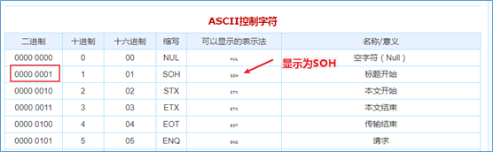

# **数据定义语言（DDL）**

## 数据定义语言（DDL）概述

### DDL语法的作用

数据定义语言 (Data Definition Language, DDL)，是SQL语言集中对数据库内部的对象结构进行创建，删除，修改等的操作语言，这些数据库对象包括database（schema）、table、view、index等。


核心语法由**CREATE**、**ALTER**与**DROP**三个所组成。DDL并不涉及表内部数据的操作。


在某些上下文中，该术语也称为数据描述语言，因为它描述了数据库表中的字段和记录。


### Hive中DDL使用

Hive SQL（HQL）与SQL的语法大同小异，基本上是相通的，学过SQL的使用者可以无痛使用Hive SQL。只不过在学习HQL语法的时候，特别要注意Hive自己特有的语法知识点，比如partition相关的DDL操作。


基于Hive的设计、使用特点，**HQL中create语法（尤其create table）将是学习掌握DDL语法的重中之重**。


可以说建表是否成功直接影响数据文件是否映射成功，进而影响后续是否可以基于SQL分析数据。


## Hive DDL建表基础

### 完整建表语法树


**蓝色字体是建表语法的关键字，用于指定某些功能。**

**[]中括号的语法表示可选。**

**|表示使用的时候，左右语法二选一。**

**建表语句中的语法顺序要和上述语法规则保持一致。**


## Hive数据类型详解

### 整体概述

Hive中的数据类型指的是Hive表中的列字段类型。


Hive数据类型整体分为两个类别：**原生数据类型**（primitive data type）和**复杂数据类型**（complex data type）。


**原生数据类型包括：**数值类型、时间类型、字符串类型、杂项数据类型；


**复杂数据类型包括：**array数组、map映射、struct结构、union联合体。


**关于Hive的数据类型，需要注意：**

- 英文字母大小写不敏感；
- 除SQL数据类型外，还支持Java数据类型，比如：string；
- int和string是使用最多的，大多数函数都支持；
- 复杂数据类型的使用通常需要和分隔符指定语法配合使用。
- 如果定义的数据类型和文件不一致，hive会尝试隐式转换，但是不保证成功。


### 原生数据类型

Hive支持的原生数据类型如下图所示：


其中标注的数据类型是使用，详细的描述请查询语法手册：

https://cwiki.apache.org/confluence/display/Hive/LanguageManual+Types


### 复杂数据类型

Hive支持的复杂数据类型如下图所示：


其中标注的数据类型是使用，详细的描述请查询语法手册：

https://cwiki.apache.org/confluence/display/Hive/LanguageManual+Types


### 数据类型隐式、显示转换

与SQL类似，HQL支持隐式和显式类型转换。 原生类型从窄类型到宽类型的转换称为隐式转换，反之，则不允许。


下表描述了类型之间允许的隐式转换：


https://cwiki.apache.org/confluence/display/Hive/LanguageManual+Types


**显式类型转换使用CAST函数。**

例如，CAST（'100'as INT）会将100字符串转换为100整数值。 如果强制转换失败，例如CAST（'INT'as INT），该函数返回NULL。


## Hive读写文件机制

### SerDe是什么?

SerDe是Serializer、Deserializer的简称，目的是用于序列化和反序列化。序列化是对象转化为字节码的过程；而反序列化是字节码转换为对象的过程。


Hive使用SerDe（和FileFormat）读取和写入行对象。


**需要注意的是**，“key”部分在读取时会被忽略，而在写入时key始终是常数。基本上**行对象存储在“value”中**。

可以通过desc formatted tablename查看表的相关SerDe信息。默认如下：


### Hive读写文件流程

**Hive**读取文件机制：首先调用InputFormat（默认TextInputFormat），返回一条一条kv键值对记录（默认是一行对应一条记录）。然后调用SerDe（默认LazySimpleSerDe）的Deserializer，将一条记录中的value根据分隔符切分为各个字段。


**Hive**写文件机制：将Row写入文件时，首先调用SerDe（默认LazySimpleSerDe）的Serializer将对象转换成字节序列，然后调用OutputFormat将数据写入HDFS文件中。


### SerDe相关语法

**在Hive的建表语句中，和SerDe相关的语法为：**


**其中ROW FORMAT是语法关键字，DELIMITED和SERDE二选其一。**

如果使用delimited表示使用默认的LazySimpleSerDe类来处理数据。如果数据文件格式比较特殊可以使用ROW FORMAT SERDE serde_name指定其他的Serde类来处理数据,甚至支持用户自定义SerDe类。


### LazySimpleSerDe分隔符指定

LazySimpleSerDe是Hive默认的序列化类，包含4种子语法，分别用于指定**字段之间**、**集合元素之间**、**map映射 kv之间**、**换行**的分隔符号。在建表的时候可以根据数据的特点灵活搭配使用。


### 默认分隔符

hive建表时如果没有row format语法。此时**字段之间默认的分割符是'\001'**，是一种特殊的字符，使用的是ascii编码的值，键盘是打不出来的。




在vim编辑器中，连续按下Ctrl+v/Ctrl+a即可输入'\001' ，显示**^A**


在一些文本编辑器中将以SOH的形式显示：


## Hive数据存储路径

### 默认存储路径

Hive表默认存储路径是由${HIVE_HOME}/conf/hive-site.xml配置文件的hive.metastore.warehouse.dir属性指定。默认值是：/user/hive/warehouse。


在该路径下，文件将根据所属的库、表，有规律的存储在对应的文件夹下。


### 指定存储路径

在Hive建表的时候，可以通过**location语法来更改数据在HDFS上的存储路径**，使得建表加载数据更加灵活方便。

语法：`LOCATION '<hdfs_location>'``。```


对于已经生成好的数据文件，使用location指定路径将会很方便。

#### 原生数据类型案例

文件archer.txt中记录了手游《王者荣耀》射手的相关信息，内容如下所示，其中字段之间分隔符为制表符\t,要求在Hive中建表映射成功该文件。

```sh
1	后羿	5986	1784	396	336	remotely	archer
2	马可波罗	5584	200	362	344	remotely	archer
3	鲁班七号	5989	1756	400	323	remotely	archer
4	李元芳	5725	1770	396	340	remotely	archer
5	孙尚香	6014	1756	411	346	remotely	archer
6	黄忠	5898	1784	403	319	remotely	archer
7	狄仁杰	5710	1770	376	338	remotely	archer
8	虞姬	5669	1770	407	329	remotely	archer
9	成吉思汗	5799	1742	394	329	remotely	archer
10	百里守约	5611	1784	410	329	remotely	archer	assassin
```

字段含义：id、name（英雄名称）、hp_max（最大生命）、mp_max（最大法力）、attack_max（最高物攻）、defense_max（最大物防）、attack_range（攻击范围）、role_main（主要定位）、role_assist（次要定位）。


分析一下：字段都是基本类型，字段的顺序需要注意一下。字段之间的分隔符是制表符，需要使用row format语法进行指定。

#####  **建表语句**：

```sql
--创建数据库并切换使用
create database itcast;
use itcast;

--ddl create table
create table t_archer(
    id int comment "ID",
    name string comment "英雄名称",
    hp_max int comment "最大生命",
    mp_max int comment "最大法力",
    attack_max int comment "最高物攻",
    defense_max int comment "最大物防",
    attack_range string comment "攻击范围",
    role_main string comment "主要定位",
    role_assist string comment "次要定位"
) comment "王者荣耀射手信息"
row format delimited fields terminated by "\t";
```

建表成功之后，在Hive的默认存储路径下就生成了表对应的文件夹，把archer.txt文件上传到对应的表文件夹下。

```sh
hadoop fs -put archer.txt  /user/hive/warehouse/honor_of_kings.db/t_archer
```


#### 复杂数据类型案例

文件hot_hero_skin_price.txt中记录了手游《王者荣耀》热门英雄的相关皮肤价格信息，内容如下,要求在Hive中建表映射成功该文件。

```sh
1,孙悟空,53,西部大镖客:288-大圣娶亲:888-全息碎片:0-至尊宝:888-地狱火:1688
2,鲁班七号,54,木偶奇遇记:288-福禄兄弟:288-黑桃队长:60-电玩小子:2288-星空梦想:0
3,后裔,53,精灵王:288-阿尔法小队:588-辉光之辰:888-黄金射手座:1688-如梦令:1314
4,铠,52,龙域领主:288-曙光守护者:1776
5,韩信,52,飞衡:1788-逐梦之影:888-白龙吟:1188-教廷特使:0-街头霸王:888
```

字段：id、name（英雄名称）、win_rate（胜率）、skin_price（皮肤及价格）


分析一下：前3个字段原生数据类型、最后一个字段复杂类型map。需要指定字段之间分隔符、集合元素之间分隔符、map kv之间分隔符。

##### **建表语句**：

```sql
create table t_hot_hero_skin_price(
    id int,
    name string,
    win_rate int,
    skin_price map<string,int>
)
row format delimited
fields terminated by ','
collection items terminated by '-'
map keys terminated by ':' ;
```

建表成功后，把hot_hero_skin_price.txt文件上传到对应的表文件夹下。

```sh
hadoop fs -put hot_hero_skin_price.txt /user/hive/warehouse/honor_of_kings.db/t_hot_hero_skin_price
```


#### 默认分隔符案例

文件team_ace_player.txt中记录了手游《王者荣耀》主要战队内最受欢迎的王牌选手信息，内容如下,要求在Hive中建表映射成功该文件。


字段：id、team_name（战队名称）、ace_player_name（王牌选手名字）


分析一下：数据都是原生数据类型，且字段之间分隔符是\001，因此在建表的时候可以省去row format语句，因为hive默认的分隔符就是\001。


##### **建表语句**：

```sql
create table t_team_ace_player(
    id int,
    team_name string,
    ace_player_name string
);
```

建表成功后，把team_ace_player.txt文件上传到对应的表文件夹下。

```sh
hadoop fs -put team_ace_player.txt /user/hive/warehouse/honor_of_kings.db/t_team_ace_player
```


## Hive DDL建表高阶

### 什么是内部表?

**内部表（Internal table）**也称为被Hive拥有和管理的托管表（Managed table）。默认情况下创建的表就是内部表，Hive拥有该表的结构和文件。换句话说，Hive完全管理表（元数据和数据）的生命周期，类似于RDBMS中的表。


**当删除内部表时，它会删除数据以及表的元数据。**

```sql
create table student(
    num int,
    name string,
    sex string,
    age int,
    dept string) 
row format delimited 
fields terminated by ',';
```

可以使用DESCRIBE FORMATTED itcast.student;来获取表的描述信息，从中可以看出表的类型。


### 什么是外部表?

**外部表（External table）**中的数据不是Hive拥有或管理的，只管理表元数据的生命周期。要创建一个外部表，需要使用EXTERNAL语法关键字。


**删除外部表只会删除元数据，而不会删除实际数据。**在Hive外部仍然可以访问实际数据。而且外部表更为方便的是可以搭配location语法指定数据的路径。

```sql
create external table student_ext(
    num int,
    name string,
    sex string,
    age int,
    dept string)
row format delimited
fields terminated by ','
location '/stu';
```

可以使用DESC FORMATTED itcast. student_ext;来获取表的描述信息，从中可以看出表的类型。


### 内部表、外部表差异

无论内部表还是外部表，Hive都在Hive Metastore中管理表定义及其分区信息。删除内部表会从Metastore中删除表元数据，还会从HDFS中删除其所有数据/文件。


**删除外部表，只会从Metastore中删除表的元数据**，并保持HDFS位置中的实际数据不变。


#### 如何选择内部表、外部表?

当需要通过Hive完全管理控制表的整个生命周期时，请使用内部表。

当文件已经存在或位于远程位置时，请使用外部表，因为即使删除表，文件也会被保留。

## Hive分区表

### 分区表的概念、创建

当Hive表对应的数据量大、文件多时，为了避免查询时全表扫描数据，Hive支持根据用户指定的字段进行分区，分区的字段可以是日期、地域、种类等具有标识意义的字段。


比如把一整年的数据根据月份划分12个月（12个分区），后续就可以查询指定月份分区的数据，尽可能避免了全表扫描查询。


#### **分区表建表语法**：

```sql
CREATE TABLE table_name (column1 data_type, column2 data_type) PARTITIONED BY (partition1 data_type, partition2 data_type,….);
```

需要注意：分区字段不能是表中已经存在的字段，因为分区字段最终也会以虚拟字段的形式显示在表结构上。


### 分区表数据加载--静态分区

所谓**静态分区**指的是分区的字段值是由用户在加载数据的时候手动指定的。


语法如下：

```sql
load data [local] inpath ' ' into table tablename partition(分区字段='分区值'...);
```

Local表示数据是位于本地文件系统还是HDFS文件系统。


静态加载数据操作如下，文件都位于Hive服务器所在机器本地文件系统上。


```sql
load data local inpath '/root/hivedata/archer.txt' into table t_all_hero_part partition(role='sheshou');

load data local inpath '/root/hivedata/assassin.txt' into table t_all_hero_part partition(role='cike');

load data local inpath '/root/hivedata/mage.txt' into table t_all_hero_part partition(role='fashi');

load data local inpath '/root/hivedata/support.txt' into table t_all_hero_part partition(role='fuzhu');

load data local inpath '/root/hivedata/tank.txt' into table t_all_hero_part partition(role='tanke');

load data local inpath '/root/hivedata/warrior.txt' into table t_all_hero_part partition(role='zhanshi');
```


### 分区表数据加载--动态分区

往hive分区表中插入加载数据时，如果需要创建的分区很多，则需要复制粘贴修改很多sql去执行，效率低。因为hive是批处理系统，所以hive提供了一个动态分区功能，其可以基于查询参数的位置去推断分区的名称，从而建立分区。


所谓**动态分区**指的是分区的字段值是基于查询结果自动推断出来的。核心语法就是insert+select。

启用hive动态分区，需要在hive会话中设置两个参数：

```sql
set hive.exec.dynamic.partition=true;

set hive.exec.dynamic.partition.mode=nonstrict;
```

第一个参数表示开启动态分区功能，第二个参数指定动态分区的模式。分为nonstick非严格模式和strict严格模式。strict严格模式要求至少有一个分区为静态分区。

创建一张新的分区表**t_all_hero_part_dynamic**

```sql
create table t_all_hero_part_dynamic(
         id int,
         name string,
         hp_max int,
         mp_max int,
         attack_max int,
         defense_max int,
         attack_range string,
         role_main string,
         role_assist string
) 
partitioned by (role string)
row format delimited fields terminated by "\t";
```

**执行动态分区插入**

```sql
insert into table t_all_hero_part_dynamic partition(role) select tmp.*,tmp.role_main from t_all_hero tmp;
```

**动态分区插入时，分区值是根据查询返回字段位置自动推断的。**


### 分区表的本质

外表上看起来分区表好像没多大变化，只不过多了一个分区字段。实际上在底层管理数据的方式发生了改变。

非分区表：**t_all_hero**


分区表：**t_all_hero_part**


分区的概念提供了一种将Hive表数据分离为多个文件/目录的方法。**不同分区对应着不同的文件夹，同一分区的数据存储在同一个文件夹下**。只需要根据分区值找到对应的文件夹，扫描本分区下的文件即可，避免全表数据扫描。


### 分区表的使用

分区表的使用重点在于：

一、建表时根据业务场景设置合适的分区字段。比如日期、地域、类别等；

二、查询的时候尽量先使用where进行分区过滤，查询指定分区的数据，避免全表扫描。


比如：查询英雄主要定位是射手并且最大生命大于6000的个数。使用分区表查询和使用非分区表进行查询，SQL如下：

```sql
--非分区表 全表扫描过滤查询
select count(*) from t_all_hero where role_main="archer" and hp_max >6000;

--分区表 先基于分区过滤 再查询
select count(*) from t_all_hero_part where role="sheshou" and hp_max >6000;
```


### 分区表的注意事项

一、分区表不是建表的必要语法规则，是一种**优化手段**表，可选；

二、分区**字段不能是表中已有的字段**，不能重复；

三、分区字段是**虚拟字段**，其数据并不存储在底层的文件中；

四、分区字段值的确定来自于用户价值数据手动指定（**静态分区**）或者根据查询结果位置自动推断（**动态分区**）

五、Hive**支持多重分区**，也就是说在分区的基础上继续分区，划分更加细粒度


### 多重分区表

通过建表语句中关于分区的相关语法可以发现，Hive支持多个分区字段：PARTITIONED BY (partition1 data_type, partition2 data_type,….)。


多重分区下，**分区之间是一种递进关系，可以理解为在前一个分区的基础上继续分区**。从HDFS的角度来看就是**文件夹下继续划分子文件夹**。比如：把全国人口数据首先根据省进行分区，然后根据市进行划分，如果需要甚至可以继续根据区县再划分，此时就是3分区表。

```sql
-单分区表，按省份分区
create table t_user_province (id int, name string,age int) partitioned by (province string);

--双分区表，按省份和市分区
create table t_user_province_city (id int, name string,age int) partitioned by (province string, city string);

--三分区表，按省份、市、县分区
create table t_user_province_city_county (id int, name string,age int) partitioned by (province string, city string,county string);
```

**多分区表的数据插入和查询使用**

```sql
load data local inpath '文件路径' into table t_user_province partition(province='shanghai');

load data local inpath '文件路径' into table t_user_province_city_county partition(province='zhejiang',city='hangzhou',county='xiaoshan');

select * from t_user_province_city_county where province='zhejiang' and city='hangzhou';
```


## Hive分桶表

### 分桶表的概念

分桶表也叫做桶表，源自建表语法中bucket单词。是一种用于优化查询而设计的表类型。该功能可以让数据分解为若干个部分易于管理。


在分桶时，我们要指定根据哪个字段将数据分为几桶（几个部分）。默认规则是：Bucket number = hash_function(bucketing_column) mod num_buckets。


可以发现桶编号相同的数据会被分到同一个桶当中。hash_function取决于分桶字段bucketing_column的类型：


如果是int类型，hash_function(int) == int，如果是其他类型，比如bigint,string或者复杂数据类型，hash_function比较棘手，将是从该类型派生的某个数字，比如hashcode值。


### 分桶表的语法

```sql
--分桶表建表语句
CREATE [EXTERNAL] TABLE [db_name.]table_name
[(col_name data_type, ...)]
CLUSTERED BY (col_name)
INTO N BUCKETS;
```

其中CLUSTERED BY (col_name)表示根据哪个字段进行分；

INTO N BUCKETS表示分为几桶（也就是几个部分）。

需要注意的是，分桶的字段必须是表中已经存在的字段。


### 分桶表的创建

现有美国2021-1-28号，各个县county的新冠疫情累计案例信息，包括确诊病例和死亡病例，数据格式如下所示：

```xml
2021-01-28,Juneau City and Borough,Alaska,02110,1108,3
2021-01-28,Kenai Peninsula Borough,Alaska,02122,3866,18
2021-01-28,Ketchikan Gateway Borough,Alaska,02130,272,1
2021-01-28,Kodiak Island Borough,Alaska,02150,1021,5
2021-01-28,Kusilvak Census Area,Alaska,02158,1099,3
2021-01-28,Lake and Peninsula Borough,Alaska,02164,5,0
2021-01-28,Matanuska-Susitna Borough,Alaska,02170,7406,27
2021-01-28,Nome Census Area,Alaska,02180,307,0
2021-01-28,North Slope Borough,Alaska,02185,973,3
2021-01-28,Northwest Arctic Borough,Alaska,02188,567,1
2021-01-28,Petersburg Borough,Alaska,02195,43,0
```

字段含义如下：count_date（统计日期）,county（县）,state（州）,fips（县编码code）,cases（累计确诊病例）,deaths（累计死亡病例）。


根据state州把数据分为5桶，建表语句如下：

```sql
CREATE TABLE itcast.t_usa_covid19(
    count_date string,
    county string,
    state string,
    fips int,
    cases int,
    deaths int)
CLUSTERED BY(state) INTO 5 BUCKETS;
```


在创建分桶表时，还可以指定分桶内的数据排序规则

```sql
-- 根据state州分为5桶 每个桶内根据cases确诊病例数倒序排序
CREATE TABLE itcast.t_usa_covid19_bucket_sort(
      count_date string,
      county string,
      state string,
      fips int,
      cases int,
      deaths int)
CLUSTERED BY(state) sorted by (cases desc) INTO 5 BUCKETS;
```

### 分桶表的数据加载

```sql
--step1:开启分桶的功能 从Hive2.0开始不再需要设置
set hive.enforce.bucketing=true;

--step2:把源数据加载到普通hive表中
CREATE TABLE itcast.t_usa_covid19(
       count_date string,
       county string,
       state string,
       fips int,
       cases int,
       deaths int)
row format delimited fields terminated by ",";
--将源数据上传到HDFS，t_usa_covid19表对应的路径下
hadoop fs -put us-covid19-counties.dat /user/hive/warehouse/itcast.db/t_usa_covid19

--step3:使用insert+select语法将数据加载到分桶表中
insert into t_usa_covid19_bucket select * from t_usa_covid19;
```

并且从结果可以发现，只要hash_function(bucketing_column)一样的，就一定被分到同一个桶中。


### 分桶表的使用好处

和非分桶表相比，分桶表的使用好处有以下几点：


1、基于分桶字段查询时，减少全表扫描

```sql
--基于分桶字段state查询来自于New York州的数据
--不再需要进行全表扫描过滤
--根据分桶的规则hash_function(New York) mod 5计算出分桶编号
--查询指定分桶里面的数据 就可以找出结果  此时是分桶扫描而不是全表扫描
select * from t_usa_covid19_bucket where state="New York";
```


2、JOIN时可以提高MR程序效率，减少笛卡尔积数量

对于JOIN操作两个表有一个相同的列，如果对这两个表都进行了分桶操作。那么将保存相同列值的桶进行JOIN操作就可以，可以大大较少JOIN的数据量。


3、分桶表数据进行抽样

当数据量特别大时，对全体数据进行处理存在困难时，抽样就显得尤其重要了。抽样可以从被抽取的数据中估计和推断出整体的特性，是科学实验、质量检验、社会调查普遍采用的一种经济有效的工作和研究方法。


## Hive Transactional Tables事务表

### Hive事务背景知识

Hive本身从设计之初时，就是不支持事务的，因为**Hive的核心目标**是将已经存在的结构化数据文件映射成为表，然后提供基于表的SQL分析处理，是一款**面向分析**的工具。且映射的数据通常存储于HDFS上，而HDFS是不支持随机修改文件数据的。


这个定位就意味着在早期的Hive的SQL语法中是没有update，delete操作的，也就没有所谓的事务支持了，因为都是select查询分析操作。


从Hive0.14版本开始，具有ACID语义的事务已添加到Hive中，以解决以下场景下遇到的问题：


**流式传输数据**。使用如Apache Flume或Apache Kafka之类的工具将数据流式传输到Hadoop集群中。虽然这些工具可以每秒数百行或更多行的速度写入数据，但是Hive只能每隔15分钟到一个小时添加一次分区。频繁添加分区会很快导致表中大量的分区。因此通常使用这些工具将数据流式传输到现有分区中，但是这会使读者感到脏读（也就是说，他们将在开始查询后看到写入的数据），并将许多小文件留在目录中，这将给NameNode带来压力。通过事务功能，同时允许读者获得一致的数据视图并避免过多的文件。


**尺寸变化缓慢**。在典型的星型模式数据仓库中，维度表随时间缓慢变化。例如，零售商将开设新商店，需要将其添加到商店表中，或者现有商店可能会更改其平方英尺或某些其他跟踪的特征。这些更改导致插入单个记录或更新 记录（取决于所选策略）。


**数据重述**。有时发现收集的数据不正确，需要更正。从Hive 0.14开始，可以通过INSERT，UPDATE和 DELETE支持这些用例 。


### Hive事务表局限性

虽然Hive支持了具有ACID语义的事务，但是在使用起来，并没有像在MySQL中使用那样方便，有很多局限性。原因很简单，毕竟Hive的设计目标不是为了支持事务操作，而是支持分析操作，且最终基于HDFS的底层存储机制使得文件的增加删除修改操作需要动一些小心思。具体限制如下：

- 尚不支持BEGIN，COMMIT和ROLLBACK。所有语言操作都是自动提交的。
- 仅支持**ORC文件格式（STORED AS ORC）**。
- 默认情况下事务配置为关闭。需要**配置参数开启**使用。
- 表必须是**分桶表（Bucketed）**才可以使用事务功能。
- 表参数**transactional必须为true**；
- 外部表不能成为ACID表，不允许从非ACID会话读取/写入ACID表。


### 案例：创建使用Hive事务表

如果不做任何配置修改，直接针对Hive中已有的表进行Update、Delete、Insert操作，可以发现，只有insert语句可以执行，Update和Delete操作会报错。


如何在Hive中配置开启事务表，并且进行操作:

```sql
--Hive中事务表的创建使用
--1、开启事务配置（可以使用set设置当前session生效 也可以配置在hive-site.xml中）
set hive.support.concurrency = true; --Hive是否支持并发
set hive.enforce.bucketing = true; --从Hive2.0开始不再需要  是否开启分桶功能
set hive.exec.dynamic.partition.mode = nonstrict; --动态分区模
式  非严格
set hive.txn.manager = org.apache.hadoop.hive.ql.lockmgr.DbTxnManager; --
set hive.compactor.initiator.on = true; --是否在Metastore实例上运行启动线程和清理线程
set hive.compactor.worker.threads = 1; --在此metastore实例上运行多少个压缩程序工作线程。

--2、创建Hive事务表
create table trans_student(
    id int,
    name String,
    age int
)clustered by (id) into 2 buckets stored as orc TBLPROPERTIES('transactional'='true');

--3、针对事务表进行insert update delete操作
insert into trans_student (id, name, age)
values (1,"allen",18);

update trans_student
set age = 20
where id = 1;

delete from trans_student where id =1;

select *
from trans_student;
```


## Hive View视图

### View的概念

Hive中的视图（view）是一种虚拟表，只保存定义，不实际存储数据。通常从真实的物理表查询中创建生成视图，也可以从已经存在的视图上创建新视图。


创建视图时，将冻结视图的架构，如果删除或更改基础表，则视图将失败，并且视图不能存储数据，操作数据，只能查询。


概况起来就是：视图是用来简化操作的，它其实是一张虚表，在视图中不缓冲记录，也没有提高查询性能。


### View相关语法

```sql
--hive中有一张真实的基础表t_usa_covid19
select *
from itcast.t_usa_covid19;

--1、创建视图
create view v_usa_covid19 as select count_date, county,state,deaths from t_usa_covid19 limit 5;

--能否从已有的视图中创建视图呢  可以的
create view v_usa_covid19_from_view as select * from v_usa_covid19 limit 2;

--2、显示当前已有的视图 
show tables;
show views;--hive v2.2.0之后支持

--3、视图的查询使用
select *
from v_usa_covid19;

--能否插入数据到视图中呢？
--不行 报错  SemanticException:A view cannot be used as target table for LOAD or INSERT
insert into v_usa_covid19 select count_date,county,state,deaths from t_usa_covid19;

--4、查看视图定义
show create table v_usa_covid19;

--5、删除视图
drop view v_usa_covid19_from_view;

--6、更改视图属性
alter view v_usa_covid19 set TBLPROPERTIES ('comment' = 'This is a view');

--7、更改视图定义
alter view v_usa_covid19 as  select county,deaths from t_usa_covid19 limit 2;
```


### View的好处

1、将真实表中特定的列数据提供给用户，保护数据隐式

```sql
--通过视图来限制数据访问可以用来保护信息不被随意查询:
create table userinfo(firstname string, lastname string, ssn string, password string);

create view safer_user_info as select firstname, lastname from userinfo;

--可以通过where子句限制数据访问，比如，提供一个员工表视图，只暴露来自特定部门的员工信息:
create table employee(firstname string, lastname string, ssn string, password string, department string);

create view techops_employee as select firstname, lastname, ssn from userinfo where department = 'java';

--使用视图优化嵌套查询
from (
   select * from people join cart
   on(cart.pepople_id = people.id) where firstname = 'join'
     )a select a.lastname where a.id = 3;

--把嵌套子查询变成一个视图
create view shorter_join as
select * from people join cart
                          on (cart.pepople_id = people.id) where firstname = 'join';
--基于视图查询
select lastname from shorter_join where id = 3;
```


## Hive3.0新特性：物化视图materialized views

### 物化视图概念

在传统的数据库领域基本已经都实现了物化视图, 属于数据库的高级功能。物化视图（Materialized View）是一个包括查询结果的数据库对像，可以用于**预先计算并保存表连接或聚集等耗时较多的操作的结果**。


这样，在执行查询时，就可以避免进行这些耗时的操作，而从快速的得到结果。使用物化视图的目的就是通过预计算，提高查询性能，当然需要占用一定的存储空间。


但是在SQL On Hadoop领域里支持这个特性的还不多，比较令人期待。Hive3.0开始尝试引入物化视图，并提供对于物化视图的查询自动重写（基于Apache Calcite实现）。


值得注意的是，3.0中提供了物化视图存储选择机制，可以本地存储在hive，同时可以通过用户自定义storage handlers存储在其他系统（如Druid）。


Hive引入物化视图的目的就是为了优化数据查询访问的效率,相当于从数据预处理的角度优化数据访问。Hive从3.0丢弃了index索引的语法支持，推荐使用物化视图和列式存储文件格式来加快查询的速度。


### 物化视图、视图区别

视图是虚拟的，逻辑存在的，只有定义没有存储数据。

物化视图是真实的，物理存在的，里面存储着预计算的数据。


不同于视图，物化视图能够缓存数据，在创建物化视图的时候就把数据缓存起来了，hive把物化视图当成一张“表”，将数据缓存。而视图只是创建一个虚表，只有表结构，没有数据，实际查询的时候再去改写SQL去访问实际的数据表。


视图的目的是简化降低查询的复杂度，而物化视图的目的是提高查询性能。


### 物化视图语法

```sql
--物化视图的创建语法
CREATE MATERIALIZED VIEW [IF NOT EXISTS] [db_name.]materialized_view_name
    [DISABLE REWRITE]
    [COMMENT materialized_view_comment]
    [PARTITIONED ON (col_name, ...)]
    [CLUSTERED ON (col_name, ...) | DISTRIBUTED ON (col_name, ...) SORTED ON (col_name, ...)]
    [
    [ROW FORMAT row_format]
    [STORED AS file_format]
    | STORED BY 'storage.handler.class.name' [WITH SERDEPROPERTIES (...)]
  ]
  [LOCATION hdfs_path]
  [TBLPROPERTIES (property_name=property_value, ...)]
AS SELECT ...;
```

**语法说明：**

（1）物化视图创建后，select查询执行数据自动落地，"自动"也即在query的执行期间，任何用户对该物化视图是不可见的


 （2）默认该物化视图可被用于查询优化器optimizer查询重写（在物化视图创建期间可以通过DISABLE REWRITE参数设置禁止使用）


 （3）SerDe和storage format非强制参数，可以用户配置，默认可用hive.materializedview.serde、 hive.materializedview.fileformat


 （4）物化视图可以使用custom storage handlers存储在外部系统（如druid）


例如：

```sql
CREATE MATERIALIZED VIEW druid_wiki_mv
            STORED AS 'org.apache.hadoop.hive.druid.DruidStorageHandler'
AS
SELECT __time, page, user, c_added, c_removed
FROM src;
```

目前支持物化视图的drop和show操作，后续会增加其他操作

```sql
-- Drops a materialized view
DROP MATERIALIZED VIEW [db_name.]materialized_view_name;

-- Shows materialized views (with optional filters)
SHOW MATERIALIZED VIEWS [IN database_name];

-- Shows information about a specific materialized view
DESCRIBE [EXTENDED | FORMATTED] [db_name.]materialized_view_name;
```

当数据源变更（新数据插入inserted、数据修改modified），物化视图也需要更新以保持数据一致性，目前需要用户主动触发rebuild

```sql
ALTER MATERIALIZED VIEW [db_name.]materialized_view_name REBUILD;
```

### 基于物化视图的查询重写

物化视图创建后即可用于相关查询的加速，用户提交查询query，若该query经过重写后可命中已建视图，则被重写命中相关已建视图实现查询加速。

是否重写查询使用物化视图可以通过全局参数控制，默认为true：

```sql
SET hive.materializedview.rewriting=true;
```

用户可选择性的失能物化视图的重写：

```sql
ALTER MATERIALIZED VIEW [db_name.]materialized_view_name ENABLE|DISABLE REWRITE;
```

### 案例：物化视图查询重写

```sql
--1、新建一张事务表 student_trans
set hive.support.concurrency = true; --Hive是否支持并发
set hive.enforce.bucketing = true; --从Hive2.0开始不再需要  是否开启分桶功能
set hive.exec.dynamic.partition.mode = nonstrict; --动态分区模式  非严格
set hive.txn.manager = org.apache.hadoop.hive.ql.lockmgr.DbTxnManager; --
set hive.compactor.initiator.on = true; --是否在Metastore实例上运行启动线程和清理线程
set hive.compactor.worker.threads = 1; --在此metastore实例上运行多少个压缩程序工作线程。

CREATE TABLE student_trans (
      sno int,
      sname string,
      sdept string)
clustered by (sno) into 2 buckets stored as orc TBLPROPERTIES('transactional'='true');


--2、导入数据到student_trans中
insert overwrite table student_trans
select sno,sname,sdept
from student;

select *
from student_trans;

--3、对student_trans建立聚合物化视图
CREATE MATERIALIZED VIEW student_trans_agg
AS SELECT sdept, count(*) as sdept_cnt from student_trans group by sdept;

--注意 这里当执行CREATE MATERIALIZED VIEW，会启动一个MR对物化视图进行构建
--可以发现当下的数据库中有了一个物化视图
show tables;
show materialized views;

--4、对原始表student_trans查询
--由于会命中物化视图，重写query查询物化视图，查询速度会加快（没有启动MR，只是普通的table scan）
SELECT sdept, count(*) as sdept_cnt from student_trans group by sdept;

--5、查询执行计划可以发现 查询被自动重写为TableScan alias: itcast.student_trans_agg
--转换成了对物化视图的查询  提高了查询效率
explain SELECT sdept, count(*) as sdept_cnt from student_trans group by sdept;
```

## Hive DDL其他语法

### Database|schema（数据库） DDL操作

#### Create database

Hive中DATABASE的概念和RDBMS中类似，我们称之为数据库。在Hive中， DATABASE和SCHEMA是可互换的，使用DATABASE或SCHEMA都可以。

```sql
CREATE (DATABASE|SCHEMA) [IF NOT EXISTS] database_name
[COMMENT database_comment]
[LOCATION hdfs_path]
[WITH DBPROPERTIES (property_name=property_value, ...)];
```

**COMMENT**：数据库的注释说明语句

**LOCATION**：指定数据库在HDFS存储位置，默认/user/hive/warehouse

**WITH DBPROPERTIES**：用于指定一些数据库的属性配置。

下面创建一个数据库：dsjprs

```sql
create database if not exists dsjprs
comment "this is my first db"
with dbproperties ('createdBy'='AllenWoon');
```

注意：使用location指定路径的时候，最好是一个新创建的空文件夹。


#### Describe database

Hive中的**DESCRIBE DATABASE**语句用于显示Hive中数据库的名称，其注释（如果已设置）及其在文件系统上的位置等信息。

```sql
DESCRIBE DATABASE/SCHEMA [EXTENDED] db_name;
```

**EXTENDED**：用于显示更多信息。


#### Use database

Hive中的**USE DATABASE**语句用于选择特定的数据库,切换当前会话使用哪一个数据库进行操作。

```sql
USE database_name;
```

#### Drop database

Hive中的**DROP DATABASE**语句用于删除（删除）数据库。

默认行为是RESTRICT，这意味着仅在数据库为空时才删除它。要删除带有表的数据库，可以使用**CASCADE**。

```sql
DROP (DATABASE|SCHEMA) [IF EXISTS] database_name [RESTRICT|CASCADE];
```

#### Alter database

Hive中的**ALTER DATABASE**语句用于更改与Hive中的数据库关联的元数据。

```sql
--更改数据库属性
ALTER (DATABASE|SCHEMA) database_name SET DBPROPERTIES (property_name=property_value, ...);

--更改数据库所有者
ALTER (DATABASE|SCHEMA) database_name SET OWNER [USER|ROLE] user_or_role;

--更改数据库位置
ALTER (DATABASE|SCHEMA) database_name SET LOCATION hdfs_path;
```

### Table（表）DDL操作

#### Describe table

Hive中的**DESCRIBE table**语句用于显示Hive中表的元数据信息。

```sql
describe formatted [db_name.]table_name;
describe extended [db_name.]table_name;
```

如果指定了EXTENDED关键字，则它将以Thrift序列化形式显示表的所有元数据。如果指定了FORMATTED关键字，则它将以表格格式显示元数据。

#### Drop table

DROP TABLE删除该表的元数据和数据。如果已配置垃圾桶（且未指定PURGE），则该表对应的数据实际上将移动到.Trash/Current目录，而元数据完全丢失。删除EXTERNAL表时，该表中的数据不会从文件系统中删除，只删除元数据。


如果指定了PURGE，则表数据不会进入.Trash/Current目录，跳过垃圾桶直接被删除。因此如果DROP失败，则无法挽回该表数据。

```sql
DROP TABLE [IF EXISTS] table_name [PURGE];    -- (Note: PURGE available in Hive 0.14.0 and later)
```

#### Truncate table

从表中删除所有行。可以简单理解为清空表的所有数据但是保留表的元数据结构。如果HDFS启用了垃圾桶，数据将被丢进垃圾桶，否则将被删除。

```sql
TRUNCATE [TABLE] table_name;
```

#### Alter table

```sql
--1、更改表名
ALTER TABLE table_name RENAME TO new_table_name;

--2、更改表属性
ALTER TABLE table_name SET TBLPROPERTIES (property_name = property_value, ... );

--更改表注释
ALTER TABLE student SET TBLPROPERTIES ('comment' = "new comment for student table");

--3、更改SerDe属性
ALTER TABLE table_name SET SERDE serde_class_name [WITH SERDEPROPERTIES (property_name = property_value, ... )];
ALTER TABLE table_name [PARTITION partition_spec] SET SERDEPROPERTIES serde_properties;
ALTER TABLE table_name SET SERDEPROPERTIES ('field.delim' = ',');

--移除SerDe属性
ALTER TABLE table_name [PARTITION partition_spec] UNSET SERDEPROPERTIES (property_name, ... );

--4、更改表的文件存储格式 该操作仅更改表元数据。现有数据的任何转换都必须在Hive之外进行。
ALTER TABLE table_name  SET FILEFORMAT file_format;

--5、更改表的存储位置路径
ALTER TABLE table_name SET LOCATION "new location";

--6、更改列名称/类型/位置/注释
CREATE TABLE test_change (a int, b int, c int);

// First change column a's name to a1.
ALTER TABLE test_change CHANGE a a1 INT;
// Next change column a1's name to a2, its data type to string, and put it after column b.
ALTER TABLE test_change CHANGE a1 a2 STRING AFTER b;
// The new table's structure is:  b int, a2 string, c int.
// Then change column c's name to c1, and put it as the first column.
ALTER TABLE test_change CHANGE c c1 INT FIRST;
// The new table's structure is:  c1 int, b int, a2 string.
// Add a comment to column a1
ALTER TABLE test_change CHANGE a1 a1 INT COMMENT 'this is column a1';

--7、添加/替换列
--使用ADD COLUMNS，您可以将新列添加到现有列的末尾但在分区列之前。
--REPLACE COLUMNS 将删除所有现有列，并添加新的列集。
ALTER TABLE table_name ADD|REPLACE COLUMNS (col_name data_type,...);
```

### Partition（分区）DDL操作

#### Add partition

分区值仅在为字符串时才应加引号。位置必须是数据文件所在的目录。ADD PARTITION会更改表元数据，但不会加载数据。如果分区位置中不存在数据，查询将不会返回任何结果。

```sql
--1、增加分区
ALTER TABLE table_name ADD PARTITION (dt='20170101') location
    '/user/hadoop/warehouse/table_name/dt=20170101'; 
--一次添加一个分区

ALTER TABLE table_name ADD PARTITION (dt='2008-08-08', country='us') location '/path/to/us/part080808'
                       PARTITION (dt='2008-08-09', country='us') location '/path/to/us/part080809';  
--一次添加多个分区
```


#### rename partition

```sql
--2、重命名分区
ALTER TABLE table_name PARTITION partition_spec RENAME TO PARTITION partition_spec;
ALTER TABLE table_name PARTITION (dt='2008-08-09') RENAME TO PARTITION (dt='20080809');
```

#### delete partition

可以使用ALTER TABLE DROP PARTITION删除表的分区。这将删除该分区的数据和元数据。

```sql
--3、删除分区
ALTER TABLE table_name DROP [IF EXISTS] PARTITION (dt='2008-08-08', country='us');
ALTER TABLE table_name DROP [IF EXISTS] PARTITION (dt='2008-08-08', country='us') PURGE; --直接删除数据 不进垃圾桶
```

#### msck partition

Hive将每个表的分区列表信息存储在其metastore中。但是，如果将新分区直接添加到HDFS（例如通过使用hadoop fs -put命令）或从HDFS中直接删除分区文件夹，则除非用户ALTER TABLE table_name ADD/DROP PARTITION在每个新添加的分区上运行命令，否则metastore（也就是Hive）将不会意识到分区信息的这些更改。

但是，用户可以使用修复表选项运行metastore check命令。

```sql
--4、修复分区
MSCK [REPAIR] TABLE table_name [ADD/DROP/SYNC PARTITIONS];
```

MSC命令的默认选项是“添加分区”。使用此选项，它将把HDFS上存在但元存储中不存在的所有分区添加到元存储中。DROP PARTITIONS选项将从已经从HDFS中删除的metastore中删除分区信息。


SYNC PARTITIONS选项等效于调用ADD和DROP PARTITIONS。


如果存在大量未跟踪的分区，则可以批量运行MSCK REPAIR TABLE，以避免OOME（内存不足错误）。


#### alter partition

```sql
--5、修改分区
--更改分区文件存储格式
ALTER TABLE table_name PARTITION (dt='2008-08-09') SET FILEFORMAT file_format;
--更改分区位置
ALTER TABLE table_name PARTITION (dt='2008-08-09') SET LOCATION "new location";
```


## Hive Show显示语法

Show相关的语句提供了一种查询Hive metastore的方法。可以帮助用户查询相关信息。

```sql
--1、显示所有数据库 SCHEMAS和DATABASES的用法 功能一样
show databases;
show schemas;

--2、显示当前数据库所有表/视图/物化视图/分区/索引
show tables;
SHOW TABLES [IN database_name]; --指定某个数据库

--3、显示当前数据库下所有视图
Show Views;
SHOW VIEWS 'test_*'; -- show all views that start with "test_"
SHOW VIEWS FROM test1; -- show views from database test1
SHOW VIEWS [IN/FROM database_name];

--4、显示当前数据库下所有物化视图
SHOW MATERIALIZED VIEWS [IN/FROM database_name];

--5、显示表分区信息，分区按字母顺序列出，不是分区表执行该语句会报错
show partitions table_name;

--6、显示表/分区的扩展信息
SHOW TABLE EXTENDED [IN|FROM database_name] LIKE table_name;
show table extended like student;

--7、显示表的属性信息
SHOW TBLPROPERTIES table_name;
show tblproperties student;

--8、显示表、视图的创建语句
SHOW CREATE TABLE ([db_name.]table_name|view_name);
show create table student;

--9、显示表中的所有列，包括分区列。
SHOW COLUMNS (FROM|IN) table_name [(FROM|IN) db_name];
show columns  in student;

--10、显示当前支持的所有自定义和内置的函数
show functions;

--11、Describe desc
--查看表信息
desc extended table_name;
--查看表信息（格式化美观）
desc formatted table_name;
--查看数据库相关信息
describe database database_name;
```