# 数据操控、查询语言

# （DML、DQL）

## DML-Load加载数据

### Load语法

在将数据load加载到表中时，Hive不会进行任何转换。加载操作是将数据文件移动到与Hive表对应的位置的纯复制/移动操作。

```sql
LOAD DATA [LOCAL] INPATH 'filepath' [OVERWRITE] INTO TABLE tablename [PARTITION (partcol1=val1, partcol2=val2 ...)]

LOAD DATA [LOCAL] INPATH 'filepath' [OVERWRITE] INTO TABLE tablename [PARTITION (partcol1=val1, partcol2=val2 ...)] [INPUTFORMAT 'inputformat' SERDE 'serde'] (3.0 or later)
```

### filepath

filepath表示的待移动数据的路径，可以引用一个文件（在这种情况下，Hive将文件移动到表中），也可以是一个目录（在这种情况下，Hive将把该目录中的所有文件移动到表中）。


相对路径，例如：project/data1 


绝对路径，例如：/user/hive/project/data1 


具有schema的完整URI，例如：hdfs://namenode:9000/user/hive/project/data1


### LOCAL

如果指定了LOCAL， load命令将在本地文件系统中查找文件路径。如果指定了相对路径，它将相对于用户的当前工作目录进行解释。用户也可以为本地文件指定完整的URI-例如：[file:///user/hive/project/data1](file:///user/hive/project/data1)。


注意，如果对HiveServer2服务运行此命令。这里的**本地文件系统指的是Hiveserver2服务所在机器的本地Linux文件系统**，不是Hive客户端所在的本地文件系统。


如果没有指定LOCAL关键字，如果filepath指向的是一个完整的URI，hive会直接使用这个URI。 否则如果没有指定schema或者authority，Hive会使用在hadoop配置文件中定义的schema 和 authority，即参数fs.default.name指定的（不出意外，都是HDFS）。 


### OVERWRITE

如果使用了OVERWRITE关键字，则目标表（或者分区）中的内容会被删除，然后再将 filepath 指向的文件/目录中的内容添加到表/分区中。


### 案例：load加载数据到Hive表

```sql
--------练习:Load Data From Local FS or HDFS------
--step1:建表
--建表student_local 用于演示从本地加载数据
create table student_local(num int,name string,sex string,age int,dept string) row format delimited fields terminated by ',';

--建表student_HDFS  用于演示从HDFS加载数据
create external table student_HDFS(num int,name string,sex string,age int,dept string) row format delimited fields terminated by ',';

--建表student_HDFS_p 用于演示从HDFS加载数据到分区表
create table student_HDFS_p(num int,name string,sex string,age int,dept string) partitioned by(country string) row format delimited fields terminated by ',';

--建议使用beeline客户端 可以显示出加载过程日志信息
--step2:加载数据
-- 从本地加载数据  数据位于HS2（node1）本地文件系统  本质是hadoop fs -put上传操作
LOAD DATA LOCAL INPATH '/root/hivedata/students.txt' INTO TABLE student_local;

--从HDFS加载数据  数据位于HDFS文件系统根目录下  本质是hadoop fs -mv 移动操作
--先把数据上传到HDFS上  hadoop fs -put /root/hivedata/students.txt /
LOAD DATA INPATH '/students.txt' INTO TABLE student_HDFS;

----从HDFS加载数据到分区表中并制定分区  数据位于HDFS文件系统根目录下
--先把数据上传到HDFS上 hadoop fs -put /root/hivedata/students.txt /
LOAD DATA INPATH '/students.txt' INTO TABLE student_HDFS_p partition(country ="CHina");
```


### Hive3.0 Load新特性

Hive 3.0及更高版本中，除了移动复制操作之外，还支持其他加载操作，因为Hive在内部在某些场合下会将加载重写为INSERT AS SELECT。


比如，如果表具有分区，则load命令没有指定分区，则将load转换为INSERT AS SELECT，并假定最后一组列为分区列。如果文件不符合预期的架构，它将引发错误。

```sql
-------hive 3.0 load命令新特性------------------
CREATE TABLE if not exists tab1 (col1 int, col2 int)
PARTITIONED BY (col3 int)
row format delimited fields terminated by ',';

LOAD DATA LOCAL INPATH '/root/hivedata/tab1.txt' INTO TABLE tab1;
--tab1.txt内容如下
11,22,1
33,44,2
```

本来加载的时候没有指定分区，语句是报错的，但是文件的格式符合表的结构，前两个是col1,col2,最后一个是分区字段col3，则此时会将load语句转换成为insert as select语句。


在Hive3.0中，还支持使用inputformat、SerDe指定任何Hive输入格式，例如文本，ORC等。


## DML-Insert插入数据

通常在Hive中使用insert+select语句。即插入表的数据来自于后续select查询语句返回的结果。


### insert + select

Hive中insert主要是结合select查询语句使用，将查询结果插入到表中，例如：

```sql
INSERT OVERWRITE TABLE tablename1 [PARTITION (partcol1=val1, partcol2=val2 ...) [IF NOT EXISTS]] select_statement1 FROM from_statement;

INSERT INTO TABLE tablename1 [PARTITION (partcol1=val1, partcol2=val2 ...)] select_statement1 FROM from_statement;
```

INSERT OVERWRITE将覆盖表或分区中的任何现有数据。需要保证查询结果列的数目和需要插入数据表格的列数目一致。如果查询出来的数据类型和插入表格对应的列数据类型不一致，将会进行转换，但是不能保证转换一定成功，转换失败的数据将会为NULL。

```sql
--step1:创建一张源表student
drop table if exists student;
create table student(num int,name string,sex string,age int,dept string)
row format delimited
fields terminated by ',';
--加载数据
load data local inpath '/root/hivedata/students.txt' into table student;

--step2：创建一张目标表  只有两个字段
create table student_from_insert(sno int,sname string);
--使用insert+select插入数据到新表中
insert into table student_from_insert select num,name from student;

select *
from student_insert1;
```

### multiple inserts多重插入

multiple inserts可以翻译成为多次插入，多重插入，核心是：一次扫描，多次插入。其功能也体现出来了就是减少扫描的次数。

```sql
------------multiple inserts----------------------
--当前库下已有一张表student
select * from student;
--创建两张新表
create table student_insert1(sno int);
create table student_insert2(sname string);
--多重插入
from student
insert overwrite table student_insert1
select num
insert overwrite table student_insert2
select name;
```

### dynamic partition insert动态分区插入

#### 功能

对于分区表的数据导入加载，最常见最基础的是通过load命令加载数据。如下：

```sql
create table student_HDFS_p(Sno int,Sname string,Sex string,Sage int,Sdept string) partitioned by(country string) row format delimited fields terminated by ',';
--注意 分区字段country的值是在导入数据的时候手动指定的 China
LOAD DATA INPATH '/students.txt' INTO TABLE student_HDFS_p partition(country ="China");
```

Hive提供了**动态分区插入**的语法。


所谓动态分区插入指的是：**分区的值是由后续的select查询语句的结果来动态确定的。根据查询结果自动分区**。


#### 配置参数

|   hive.exec.dynamic.partition    |  true  |                需要设置true为启用动态分区插入                |
| :------------------------------: | :----: | :----------------------------------------------------------: |
| hive.exec.dynamic.partition.mode | strict | 在strict模式下，用户必须至少指定一个静态分区，以防用户意外覆盖所有分区；在nonstrict模式下，允许所有分区都是动态的 |

关于严格模式、非严格模式，演示如下：

```sql
FROM page_view_stg pvs
INSERT OVERWRITE TABLE page_view PARTITION(dt='2008-06-08', country)
SELECT pvs.viewTime, pvs.userid, pvs.page_url, pvs.referrer_url, null, null, pvs.ip, pvs.cnt

--在这里，country分区将由SELECT子句（即pvs.cnt）的最后一列动态创建。
--而dt分区是手动指定写死的。
--如果是nonstrict模式下，dt分区也可以动态创建。
```

#### 案例：动态分区插入

```sql
--动态分区插入
--1、首先设置动态分区模式为非严格模式 默认已经开启了动态分区功能
set hive.exec.dynamic.partition = true;
set hive.exec.dynamic.partition.mode = nonstrict;

--2、当前库下已有一张表student
select * from student;

--3、创建分区表 以sdept作为分区字段
--注意：分区字段名不能和表中的字段名重复。
create table student_partition(Sno int,Sname string,Sex string,Sage int) partitioned by(Sdept string);

--4、执行动态分区插入操作
insert into table student_partition partition(Sdept)
select Sno,Sname,Sex,Sage,Sdept from student;
--其中，Sno,Sname,Sex,Sage作为表的字段内容插入表中
--Sdept作为分区字段值
```

### insert + directory导出数据

Hive支持将select查询的结果导出成文件存放在文件系统中。语法格式如下

```sql
--标准语法:
INSERT OVERWRITE [LOCAL] DIRECTORY directory1
    [ROW FORMAT row_format] [STORED AS file_format] (Note: Only available starting with Hive 0.11.0)
SELECT ... FROM ...

--Hive extension (multiple inserts):
FROM from_statement
INSERT OVERWRITE [LOCAL] DIRECTORY directory1 select_statement1
[INSERT OVERWRITE [LOCAL] DIRECTORY directory2 select_statement2] ...

--row_format
: DELIMITED [FIELDS TERMINATED BY char [ESCAPED BY char]] [COLLECTION ITEMS TERMINATED BY char]
[MAP KEYS TERMINATED BY char] [LINES TERMINATED BY char]
```

注意，**导出操作是一个OVERWRITE覆盖操作**。慎重。


目录可以是完整的URI。如果未指定scheme或Authority，则Hive将使用hadoop配置变量fs.default.name中的方案和Authority，该变量指定Namenode URI。如果使用LOCAL关键字，则Hive会将数据写入本地文件系统上的目录。


写入文件系统的数据被序列化为文本，列之间用^ A隔开，行之间用换行符隔开。如果任何列都不是原始类型，那么这些列将序列化为JSON格式。也可以在导出的时候指定分隔符换行符和文件格式。

```sql
--当前库下已有一张表student
select * from student;

--1、导出查询结果到HDFS指定目录下
insert overwrite directory '/tmp/hive_export/e1' select * from student;

--2、导出时指定分隔符和文件存储格式
insert overwrite directory '/tmp/hive_export/e2' row format delimited fields terminated by ','
stored as orc
select * from student;

--3、导出数据到本地文件系统指定目录下
insert overwrite local directory '/root/hive_export/e1' select * from student;
```

## Transaction事务

### Hive事务背景知识

Hive本身从设计之初时，就是不支持事务的，因为**Hive的核心目标**是将已经存在的结构化数据文件映射成为表，然后提供基于表的SQL分析处理，是一款面向分析的工具。


并且Hive映射的数据通常存储于HDFS上，而HDFS是不支持随机修改文件数据的。这个定位就意味着在早期的Hive的SQL语法中是没有update，delete操作的，也就没有所谓的事务支持了，因为都是select查询分析操作。


从Hive0.14版本开始，具有ACID语义的事务（支持INSERT，UPDATE和 DELETE这些用例）已添加到Hive中，以解决以下场景下遇到的问题：


**流式传输数据**。使用如Apache Flume或Apache Kafka之类的工具将数据流式传输到现有分区中，但是这会使读者感到脏读（也就是说，开始查询后能看到写入的数据）。


**变化缓慢的维度数据**。在典型的星型模式数据仓库中，维度表随时间缓慢变化。例如，零售商将开设新商店，需要将其添加到商店表中，或者现有商店可能会更改其平方英尺或某些其他跟踪的特征。这些更改导致插入单个记录或更新记录（取决于所选策略）。


**数据更新**。有时发现收集的数据不正确，需要更正。


### Hive事务表局限性

虽然Hive支持了具有ACID语义的事务，但是在使用起来，并没有像在MySQL中使用那样方便，有很多局限性。原因很简单，毕竟Hive的设计目标不是为了支持事务操作，而是支持分析操作，且最终基于HDFS的底层存储机制使得文件的增加删除修改操作需要动一些小心思。具体限制如下：

   尚不支持BEGIN，COMMIT和ROLLBACK。所有语言操作都是自动提交的。

   仅支持ORC文件格式（STORED AS ORC）。

   默认情况下事务配置为关闭。需要配置参数开启使用。

   表必须是分桶表（Bucketed）才可以使用事务功能。外部表无法创建事务表。

   表参数transactional必须为true；

   外部表不能成为ACID表，不允许从非ACID会话读取/写入ACID表。


### 案例：创建使用Hive事务表

```sql
--Hive中事务表的创建使用
--1、开启事务配置（可以使用set设置当前session生效 也可以配置在hive-site.xml中）
set hive.support.concurrency = true; --Hive是否支持并发
set hive.enforce.bucketing = true; --从Hive2.0开始不再需要  是否开启分桶功能
set hive.exec.dynamic.partition.mode = nonstrict; --动态分区模式  非严格
set hive.txn.manager = org.apache.hadoop.hive.ql.lockmgr.DbTxnManager; --
set hive.compactor.initiator.on = true; --是否在Metastore实例上运行启动压缩合并
set hive.compactor.worker.threads = 1; --在此metastore实例上运行多少个压缩程序工作线程。

--2、创建Hive事务表
create table trans_student(
    id int,
    name String,
    age int
)clustered by (id) into 2 buckets stored as orc TBLPROPERTIES('transactional'='true');

--3、针对事务表进行insert update delete操作
insert into trans_student (id, name, age)
values (1,"allen",18);

update trans_student
set age = 20
where id = 1;

delete from trans_student where id =1;

select *
from trans_student;
```

## DML-Update、Delete更新、删除数据

首先，必须明确，你理解的Hive这款软件，定位是什么？是面向事务支持事务的RDBMS?还是面向分析，支持分析的数据仓库。这很重要。


Hive是基于Hadoop的数据仓库，面向分析支持分析工具。因此在Hive中常见的操作的就是分析查询select操作。将已有的结构化数据文件映射成为表，然后提供SQL分析数据的能力。


因此Hive刚出现的时候是不支持update和delete语法支持的，因为Hive所处理的数据都是已经存在的结构化文件，加载到hive表中即可。后续Hive支持了相关的update和delete操作，不过有很多约束。


### update操作

```sql
--1、开启事务配置（可以使用set设置当前session生效 也可以配置在hive-site.xml中）
set hive.support.concurrency = true; --Hive是否支持并发
set hive.enforce.bucketing = true; --从Hive2.0开始不再需要  是否开启分桶功能
set hive.exec.dynamic.partition.mode = nonstrict; --动态分区模式  非严格
set hive.txn.manager = org.apache.hadoop.hive.ql.lockmgr.DbTxnManager; --
set hive.compactor.initiator.on = true; --是否在Metastore实例上运行启动压缩合并
set hive.compactor.worker.threads = 1; --在此metastore实例上运行多少个压缩程序工作线程。

--2、创建Hive事务表
create table trans_student(
                              id int,
                              name String,
                              age int
)clustered by (id) into 2 buckets stored as orc TBLPROPERTIES('transactional'='true');

--3、针对事务表进行insert update delete操作
insert into trans_student (id, name, age)
values (1,"allen",18);

select * from trans_student;

update trans_student
set age = 20
where id = 1;
```

### delete操作

```sql
--1、开启事务配置（可以使用set设置当前session生效 也可以配置在hive-site.xml中）
set hive.support.concurrency = true; --Hive是否支持并发
set hive.enforce.bucketing = true; --从Hive2.0开始不再需要  是否开启分桶功能
set hive.exec.dynamic.partition.mode = nonstrict; --动态分区模式  非严格
set hive.txn.manager = org.apache.hadoop.hive.ql.lockmgr.DbTxnManager; --
set hive.compactor.initiator.on = true; --是否在Metastore实例上运行启动压缩合并
set hive.compactor.worker.threads = 1; --在此metastore实例上运行多少个压缩程序工作线程。

--2、创建Hive事务表
create table trans_student(
                              id int,
                              name String,
                              age int
)clustered by (id) into 2 buckets stored as orc TBLPROPERTIES('transactional'='true');

--3、针对事务表进行insert update delete操作
insert into trans_student (id, name, age)
values (1,"allen",18);

select *
from trans_student;

delete from trans_student where id =1;
```

## DQL-Select查询数据

### 基础查询 - 语法树

```sql
[WITH CommonTableExpression (, CommonTableExpression)*] 
SELECT [ALL | DISTINCT] select_expr, select_expr, ...
  FROM table_reference
  [WHERE where_condition]
  [GROUP BY col_list]
  [ORDER BY col_list]
  [CLUSTER BY col_list
    | [DISTRIBUTE BY col_list] [SORT BY col_list]
  ]
 [LIMIT [offset,] rows]
```

table_reference指示查询的输入。它可以是普通物理表，视图，join查询结果或子查询结果。表名和列名不区分大小写。

```sql
--step1:创建普通表t_usa_covid19
drop table itcast.t_usa_covid19;
CREATE TABLE itcast.t_usa_covid19(
       count_date string,
       county string,
       state string,
       fips int,
       cases int,
       deaths int)
row format delimited fields terminated by ",";
--将源数据load加载到t_usa_covid19表对应的路径下
load data local inpath '/root/hivedata/us-covid19-counties.dat' into table t_usa_covid19;

--step2:创建一张分区表 基于count_date日期,state州进行分区
CREATE TABLE itcast.t_usa_covid19_p(
     county string,
     fips int,
     cases int,
     deaths int)
partitioned by(count_date string,state string)
row format delimited fields terminated by ",";

--step3:使用动态分区插入将数据导入t_usa_covid19_p中
set hive.exec.dynamic.partition.mode = nonstrict;

insert into table t_usa_covid19_p partition (count_date,state)
select county,fips,cases,deaths,count_date,state from t_usa_covid19;
```


### select_expr

每个select_expr表示要检索的列。必须至少有一个 select_expr。

```sql
--select_expr
--查询所有字段或者指定字段
select * from t_usa_covid19_p;
select county, cases, deaths from t_usa_covid19_p;

--查询匹配正则表达式的所有字段
SET hive.support.quoted.identifiers = none; --带反引号的名称被解释为正则表达式
select `^c.*` from t_usa_covid19_p;

--查询当前数据库
select current_database(); --省去from关键字

--查询使用函数
select count(county) from t_usa_covid19_p;
```

### ALL 、DISTINCT

ALL和DISTINCT选项指定是否应返回重复的行。如果没有给出这些选项，则默认值为ALL（返回所有匹配的行）。DISTINCT指定从结果集中删除重复的行。

```sql
--ALL DISTINCT
--返回所有匹配的行
select state
from t_usa_covid19_p;

--相当于
select all state
from t_usa_covid19_p;

--返回所有匹配的行 去除重复的结果
select distinct state
from t_usa_covid19_p;

--多个字段distinct 整体去重
select distinct county,state from t_usa_covid19_p;
```

### WHERE

WHERE条件是一个布尔表达式。在WHERE表达式中，您可以使用Hive支持的任何函数和运算符，但聚合函数除外。从Hive 0.13开始，WHERE子句支持某些类型的子查询。

```sql
select * from t_usa_covid19_p where state ="California" and deaths > 1000;
select * from t_usa_covid19_p where 1 > 2;  -- 1 > 2 返回false
select * from t_usa_covid19_p where 1 = 1;  -- 1 = 1 返回true

--where条件中使用函数 找出州名字母超过10个
select * from t_usa_covid19_p where length(state) >10 ;

--WHERE子句支持子查询
SELECT *
FROM A
WHERE A.a IN (SELECT foo FROM B);

--where条件中不能使用聚合函数
--报错 SemanticException:Not yet supported place for UDAF 'sum'
select state,sum(deaths)
from t_usa_covid19_p where sum(deaths) >100 group by state;
```

为什么不能在where子句中使用聚合函数呢？

因为**聚合函数要使用它的前提是结果集已经确定。而where子句还处于“确定”结果集的过程中，因而不能使用聚合函数**。


### 分区查询、分区裁剪

通常，SELECT查询将扫描整个表（所谓的全表扫描）。如果使用PARTITIONED BY子句创建的分区表，则在查询时可以指定分区查询，减少全表扫描，也叫做分区裁剪。


所谓分区裁剪指的是：对分区表进行查询时，会检查WHERE子句或JOIN中的ON子句中是否存在对分区字段的过滤，如果存在，则仅访问查询符合条件的分区，即裁剪掉没必要访问的分区。

```sql
--找出来自加州，累计死亡人数大于1000的县 state字段就是分区字段 进行分区裁剪 避免全表扫描
select * from t_usa_covid19_p where state ="California" and deaths > 1000;

--多分区裁剪
select * from t_usa_covid19_p where count_date = "2021-01-28" and state ="California" and deaths > 1000;
```

### GROUP BY

GROUP BY 语句用于结合聚合函数，根据一个或多个列对结果集进行分组。需要注意的是，出现在GROUP BY中select_expr的字段：**要么是GROUP BY分组的字段；要么是被聚合函数应用的字段。**原因很简单，避免出现一个字段多个值的歧义。


分组字段出现select_expr中，一定没有歧义，因为就是基于该字段分组的，同一组中必相同；被聚合函数应用的字段，也没歧义，因为聚合函数的本质就是多进一出，最终返回一个结果。

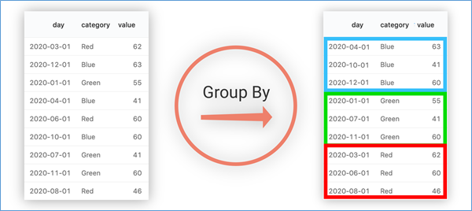

上图所示，基于category进行分组，相同颜色的分在同一组中。


在select_expr中，如果出现category字段，则没有问题，因为同一组中category值一样，但是返回day就有问题了，day的结果不一样。


```sql
-根据state州进行分组

--SemanticException:Expression not in GROUP BY key 'deaths'
--deaths不是分组字段 报错
--state是分组字段 可以直接出现在select_expr中
select state,deaths
from t_usa_covid19_p where count_date = "2021-01-28" group by state;

--被聚合函数应用
select state,count(deaths)
from t_usa_covid19_p where count_date = "2021-01-28" group by state;
```

### HAVING

在SQL中增加HAVING子句原因是，WHERE关键字无法与聚合函数一起使用。HAVING子句可以让我们筛选分组后的各组数据,并且可以在Having中使用聚合函数，因为此时where，group by已经执行结束，结果集已经确定。

```sql
--having
--统计死亡病例数大于10000的州
--where语句中不能使用聚合函数 语法报错
select state,sum(deaths)
from t_usa_covid19_p
where count_date = "2021-01-28" and sum(deaths) >10000 group by state;

--先where分组前过滤（此处是分区裁剪），再进行group by分组（含聚合）， 分组后每个分组结果集确定 再使用having过滤
select state,sum(deaths)
from t_usa_covid19_p
where count_date = "2021-01-28"
group by state
having sum(deaths) > 10000;

--这样写更好 即在group by的时候聚合函数已经作用得出结果 having直接引用结果过滤 不需要再单独计算一次了
select state,sum(deaths) as cnts
from t_usa_covid19_p
where count_date = "2021-01-28"
group by state
having cnts> 10000;
```

**having与where的区别:**

- having是在分组后对数据进行过滤
- where是在分组前对数据进行过滤
- having后面可以使用聚合函数
- where后面不可以使用聚合


### LIMIT

LIMIT子句可用于约束SELECT语句返回的行数。LIMIT接受一个或两个数字参数，这两个参数都必须是非负整数常量。第一个参数指定要返回的第一行的偏移量（从 Hive 2.0.0开始），第二个参数指定要返回的最大行数。当给出单个参数时，它代表最大行数，并且偏移量默认为0。

```sql
--limit
--没有限制返回2021.1.28 加州的所有记录
select * from t_usa_covid19_p
where count_date = "2021-01-28"
and state ="California";

--返回结果集的前5条
select * from t_usa_covid19_p
where count_date = "2021-01-28"
  and state ="California"
limit 5;

--返回结果集从第1行开始 共3行
select * from t_usa_covid19_p
where count_date = "2021-01-28"
  and state ="California"
limit 2,3; --注意 第一个参数偏移量是从0开始的
```

### Hive SQL查询执行顺序

```sql
SELECT [ALL | DISTINCT] select_expr, select_expr, ...
  FROM table_reference
  [WHERE where_condition]
  [GROUP BY col_list]
  [ORDER BY col_list]
  [CLUSTER BY col_list
    | [DISTRIBUTE BY col_list] [SORT BY col_list]
  ]
 [LIMIT [offset,] rows]
```

在查询过程中执行顺序：**from > where > group（含聚合）> having > order > select**。


所以聚合语句(sum,min,max,avg,count)要比having子句优先执行，而where子句在查询过程中执行优先级别优先于聚合语句(sum,min,max,avg,count)。


结合下面SQL感受一下：

```sql
select state,sum(deaths) as cnts
from t_usa_covid19_p
where count_date = "2021-01-28"
group by state
having cnts> 10000;
```


## 高阶查询

### ORDER BY

```sql
ORDER BY [ASC|DESC]
```

Hive SQL中的ORDER BY语法类似于SQL语言中的ORDER BY语法。会对输出的结果进行全局排序，因此底层使用MapReduce引擎执行的时候，只会有一个reducetask执行。也因此，如果输出的行数太大，会导致需要很长的时间才能完成全局排序。


默认排序顺序为升序（ASC），也可以指定为DESC降序。


在Hive 2.1.0和更高版本中，支持在“ order by”子句中为每个列指定null类型结果排序顺序。ASC顺序的默认空排序顺序为NULLS FIRST，而DESC顺序的默认空排序顺序为NULLS LAST。

```sql
---order by
--根据字段进行排序
select * from t_usa_covid19_p
where count_date = "2021-01-28"
and state ="California"
order by deaths; --默认asc null first

select * from t_usa_covid19_p
where count_date = "2021-01-28"
and state ="California"
order by deaths desc; --指定desc null last

--强烈建议将LIMIT与ORDER BY一起使用。避免数据集行数过大
--当hive.mapred.mode设置为strict严格模式时，使用不带LIMIT的ORDER BY时会引发异常。
select * from t_usa_covid19_p
where count_date = "2021-01-28"
  and state ="California"
order by deaths desc
limit 3;
```

### CLUSTER BY

```sql
SELECT expression… FROM table CLUSTER BY col_name;
```

Hive SQL中的**CLUSTER BY**语法可以指定根据后面的字段将数据分组，每组内再根据这个字段正序排序（不允许指定排序规则），概况起来就是：**根据同一个字段，分且排序**。


分组的规则hash散列。hash_func(col_name) % reduce task nums


分为几组取决于reduce task的个数。

```sql
--cluster by
select * from student;
--不指定reduce task个数
--日志显示：Number of reduce tasks not specified. Estimated from input data size: 1
select * from student cluster by sno;

--手动设置reduce task个数
set mapreduce.job.reduces =2;
select * from student cluster by sno;
```

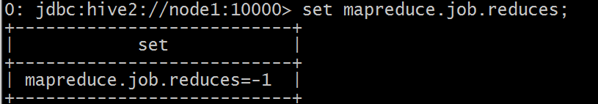

默认情况下，reduce task的个数由Hive在编译期间自己决定。

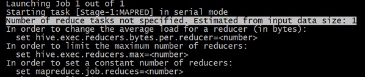

设置set mapreduce.job.reduces =2;

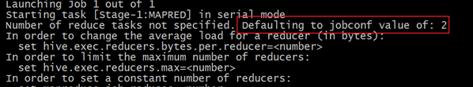

执行结果如下：分为两个部分，每个部分内正序排序。

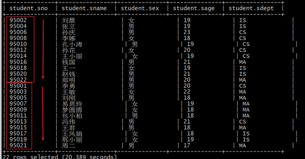

假如说，现在想法如下：把学生表数据根据性别分为两个部分，每个分组内根据年龄的倒序排序。你会发现CLUSTER BY无法完成了。**而order by更不能在这里使用，因为它是全局排序，一旦使用order by，编译期间就会强制把reduce task个数设置为1。无法满足分组的需求。**


### DISTRIBUTE BY +SORT BY

如果说CLUSTER BY的功能是分且排序（同一个字段），那么DISTRIBUTE BY +SORT BY就相当于把cluster by的功能一分为二：**DISTRIBUTE BY负责分，SORT BY负责分组内排序**，并且可以是不同的字段。


如果DISTRIBUTE BY +SORT BY的字段一样，可以得出下列结论：


**CLUSTER BY=DISTRIBUTE BY +SORT BY（字段一样）**


```sql
--案例：把学生表数据根据性别分为两个部分，每个分组内根据年龄的倒序排序。
select * from student distribute by sex sort by sage desc;
```

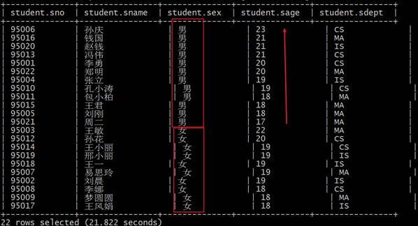


```sql
--下面两个语句执行结果一样
select * from student distribute by sno sort by sno;
select * from student cluster by sno;
```

**order by会对输入做全局排序，因此只有一个reducer，会导致当输入规模较大时，需要较长的计算时间。**


**sort by不是全局排序，其在数据进入reducer前完成排序。因此，如果用sort by进行排序，并且设置mapred.reduce.tasks>1，则sort by只保证每个reducer的输出有序，不保证全局有序。**


**distribute by(字段)根据指定字段将数据分到不同的reducer，分发算法是hash散列。**


**Cluster by(字段) 除了具有Distribute by的功能外，还会对该字段进行排序。**


**如果distribute和sort的字段是同一个时，此时，cluster by = distribute by + sort by**

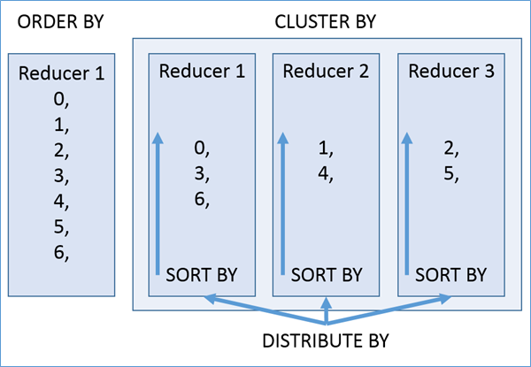


### Union联合查询

UNION用于将来自多个SELECT语句的结果合并为一个结果集。语法如下：

```sql
select_statement UNION [ALL | DISTINCT] select_statement UNION [ALL | DISTINCT] select_statement ...
```

使用DISTINCT关键字与只使用UNION默认值效果一样，都会删除重复行。使用ALL关键字，不会删除重复行，结果集包括所有SELECT语句的匹配行（包括重复行）。1.2.0之前的Hive版本仅支持UNION ALL，在这种情况下不会消除重复的行。每个select_statement返回的列的数量和名称必须相同。

```sql
--union
--使用DISTINCT关键字与使用UNION默认值效果一样，都会删除重复行。
select num,name from student_local
UNION
select num,name from student_hdfs;
--和上面一样
select num,name from student_local
UNION DISTINCT
select num,name from student_hdfs;

--使用ALL关键字会保留重复行。
select num,name from student_local
UNION ALL
select num,name from student_hdfs;

--如果要将ORDER BY，SORT BY，CLUSTER BY，DISTRIBUTE BY或LIMIT应用于单个SELECT
--请将子句放在括住SELECT的括号内
SELECT sno,sname FROM (select sno,sname from student_local LIMIT 2) subq1
UNION
SELECT sno,sname FROM (select sno,sname from student_hdfs LIMIT 3) subq2

--如果要将ORDER BY，SORT BY，CLUSTER BY，DISTRIBUTE BY或LIMIT子句应用于整个UNION结果
--请将ORDER BY，SORT BY，CLUSTER BY，DISTRIBUTE BY或LIMIT放在最后一个之后。
select sno,sname from student_local
UNION
select sno,sname from student_hdfs
order by sno desc;
```

### Subqueries子查询

#### from子句中子查询

在Hive0.12版本，仅在FROM子句中支持子查询。而且必须要给子查询一个名称，因为FROM子句中的每个表都必须有一个名称。子查询返回结果中的列必须具有唯一的名称。子查询返回结果中的列在外部查询中可用，就像真实表的列一样。子查询也可以是带有UNION的查询表达式。Hive支持任意级别的子查询，也就是所谓的嵌套子查询。Hive 0.13.0和更高版本中的子查询名称之前可以包含可选关键字“ AS” 。

```sql
--from子句中子查询（Subqueries）
--子查询
SELECT num
FROM (
         select num,name from student_local
     ) tmp;

--包含UNION ALL的子查询的示例
SELECT t3.name
FROM (
         select num,name from student_local
         UNION distinct
         select num,name from student_hdfs
     ) t3;
```

#### where子句中子查询

从Hive 0.13开始，WHERE子句支持某些类型的子查询。

```sql
--where子句中子查询（Subqueries）
--不相关子查询，相当于IN、NOT IN,子查询只能选择一个列。
--（1）执行子查询，其结果不被显示，而是传递给外部查询，作为外部查询的条件使用。
--（2）执行外部查询，并显示整个结果。　　
SELECT *
FROM student_hdfs
WHERE student_hdfs.num IN (select num from student_local limit 2);

--相关子查询，指EXISTS和NOT EXISTS子查询
--子查询的WHERE子句中支持对父查询的引用
SELECT A
FROM T1
WHERE EXISTS (SELECT B FROM T2 WHERE T1.X = T2.Y);
```

## Common Table Expressions（CTE）

**公用表表达式（CTE）是一个临时结果集**，该结果集是从WITH子句中指定的简单查询派生而来的，该查询紧接在SELECT或INSERT关键字之前。


CTE仅在单个语句的执行范围内定义。一个或多个CTE可以在Hive SELECT，INSERT， CREATE TABLE AS SELECT或CREATE VIEW AS SELECT语句中使用。

#### CTE案例

```sql
--选择语句中的CTE
with q1 as (select sno,sname,sage from student where sno = 95002)
select *
from q1;

-- from风格
with q1 as (select sno,sname,sage from student where sno = 95002)
from q1
select *;

-- chaining CTEs 链式
with q1 as ( select * from student where sno = 95002),
     q2 as ( select sno,sname,sage from q1)
select * from (select sno from q2) a;


-- union案例
with q1 as (select * from student where sno = 95002),
     q2 as (select * from student where sno = 95004)
select * from q1 union all select * from q2;

--视图，CTAS和插入语句中的CTE
-- insert
create table s1 like student;

with q1 as ( select * from student where sno = 95002)
from q1
insert overwrite table s1
select *;

select * from s1;

-- ctas
create table s2 as
with q1 as ( select * from student where sno = 95002)
select * from q1;

-- view
create view v1 as
with q1 as ( select * from student where sno = 95002)
select * from q1;

select * from v1;
```

##  join连接查询

### join概念

根据数据库的三范式设计要求和日常工作习惯来说，我们通常不会设计一张大表把所有类型的数据都放在一起，而是不同类型的数据设计不同的表存储。比如在设计一个订单数据表的时候，可以将客户编号作为一个外键和订单表建立相应的关系。而不可以在订单表中添加关于客户其它信息（比如姓名、所属公司等）的字段。

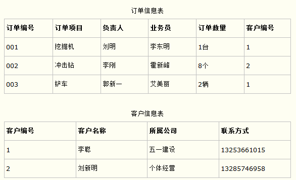


在这种情况下，有时需要基于多张表查询才能得到最终完整的结果，SQL中join语法的出现是**用于根据两个或多个表中的列之间的关系，从这些表中共同组合查询数据**，因此有时为了得到完整的结果，我们就需要执行 join。

Hive作为面向分析的数据仓库软件，为了更好的支持数据分析的功能丰富，也实现了join的语法，整体上来看和RDBMS中的join语法类似，只不过在某些点有自己的特色。需要特别注意。


### Hive join语法

在**Hive**中，当下版本3.1.2总共支持**6种join语法**。分别是：**inner** join（内连接）、**left** join（左连接）、**right** join（右连接）、**full outer** join（全外连接）、l**eft semi** join（左半开连接）、**cross** join（交叉连接，也叫做笛卡尔乘积）。


### 规则树

```sql
join_table:
    table_reference [INNER] JOIN table_factor [join_condition]
  | table_reference {LEFT|RIGHT|FULL} [OUTER] JOIN table_reference join_condition
  | table_reference LEFT SEMI JOIN table_reference join_condition
  | table_reference CROSS JOIN table_reference [join_condition] (as of Hive 0.10)

table_reference:
    table_factor
  | join_table

table_factor:
    tbl_name [alias]
  | table_subquery alias
  | ( table_references )

join_condition:
    ON expression
```

**table_reference**：是join查询中使用的表名，也可以是子查询别名（查询结果当成表参与join）。

**table_factor**：与table_reference相同,是联接查询中使用的表名,也可以是子查询别名。

**join_condition**：join查询关联的条件， 如果在两个以上的表上需要连接，则使用AND关键字。


### 语法丰富

Hive中join语法从面世开始其实并不丰富，不像在RDBMS中那么灵活，很多早期接触Hive的用户在使用join的时候，一个最大的感受就是不支持不相等连接。从Hive 0.13.0开始，支持**隐式联接表示法**（请参阅HIVE-5558）。这允许FROM子句连接以逗号分隔的表列表，而省略JOIN关键字。例如：

```sql
SELECT *
FROM table1 t1, table2 t2, table3 t3
WHERE t1.id = t2.id AND t2.id = t3.id AND t1.zipcode = '02535';
```

从Hive 2.2.0开始，**支持ON子句中的复杂表达式，支持不相等连接**。在此之前，Hive不支持不是相等条件的联接条件。

```sql
SELECT a.* FROM a JOIN b ON (a.id = b.id)
SELECT a.* FROM a JOIN b ON (a.id = b.id AND a.department = b.department)
SELECT a.* FROM a LEFT OUTER JOIN b ON (a.id <> b.id)
```

### join查询数据环境准备

表1：**employee 员工表**；

表2：**employee_address 员工住址信息表**；

表3：**employee_connection 员工联系方式表**；

```sql
--table1: 员工表
CREATE TABLE employee(
   id int,
   name string,
   deg string,
   salary int,
   dept string
 ) row format delimited
fields terminated by ',';

--table2:员工住址信息表
CREATE TABLE employee_address (
    id int,
    hno string,
    street string,
    city string
) row format delimited
fields terminated by ',';

--table3:员工联系方式表
CREATE TABLE employee_connection (
    id int,
    phno string,
    email string
) row format delimited
fields terminated by ',';
--加载数据到表中
load data local inpath '/root/hivedata/employee.txt' into table employee;
load data local inpath '/root/hivedata/employee_address.txt' into table employee_address;
load data local inpath '/root/hivedata/employee_connection.txt' into table employee_connection;
```


#### Hive inner join

**内连接**是最常见的一种连接，它也被称为普通连接，而关系模型提出者E.FCodd（埃德加•科德）最早称之为自然连接。其中inner可以省略。**inner join == join** 等价于早期的连接语法。内连接，只有进行连接的两个表中都存在与连接条件相匹配的数据才会被留下来。

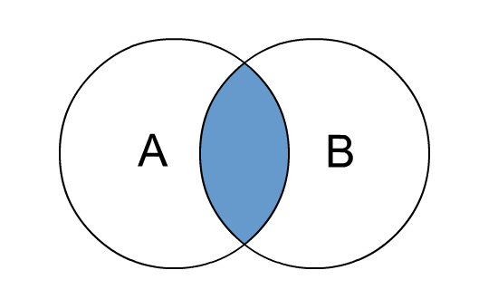

```sql
--1、inner join
select e.id,e.name,e_a.city,e_a.street
from employee e inner join employee_address e_a
on e.id =e_a.id;
--等价于 inner join=join
select e.id,e.name,e_a.city,e_a.street
from employee e join employee_address e_a
on e.id =e_a.id;

--等价于 隐式连接表示法
select e.id,e.name,e_a.city,e_a.street
from employee e , employee_address e_a
where e.id =e_a.id;
```

#### Hive left join

**left join**中文叫做是左外连接(Left Outer Jion)或者**左连接**，其中outer可以省略，left outer join是早期的写法。

left join的核心就在于left左。左指的是join关键字左边的表，简称左表。


通俗解释：join时以左表的全部数据为准，右边与之关联；左表数据全部返回，右表关联上的显示返回，关联不上的显示null返回。

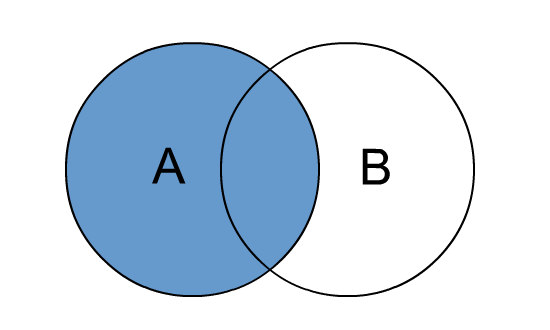


```sql
--2、left join
select e.id,e.name,e_conn.phno,e_conn.email
from employee e left join employee_connection e_conn
on e.id =e_conn.id;

--等价于 left outer join
select e.id,e.name,e_conn.phno,e_conn.email
from employee e left outer join  employee_connection e_conn
on e.id =e_conn.id;
```

#### Hive right join

**right join**中文叫做是右外连接(Right Outer Jion)或者**右连接**，其中outer可以省略。right join的核心就在于Right右。右指的是join关键字右边的表，简称右表。


通俗解释：join时以右表的全部数据为准，左边与之关联；右表数据全部返回，左表关联上的显示返回，关联不上的显示null返回。很明显，right join和left join之间很相似，重点在于以哪边为准，也就是一个方向的问题。

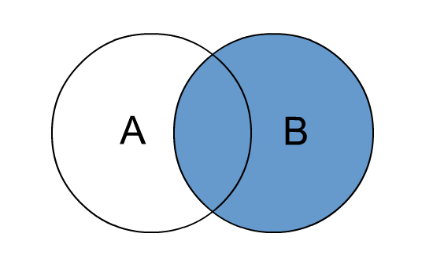

```sql
--3、right join
select e.id,e.name,e_conn.phno,e_conn.email
from employee e right join employee_connection e_conn
on e.id =e_conn.id;

--等价于 right outer join
select e.id,e.name,e_conn.phno,e_conn.email
from employee e right outer join employee_connection e_conn
on e.id =e_conn.id;
```

#### Hive full outer join

**full outer join 等价 full join** ,中文叫做全外连接或者外连接。包含左、右两个表的全部行，不管另外一边的表中是否存在与它们匹配的行 在功能上，它等价于对这两个数据集合分别进行左外连接和右外连接，然后再使用消去重复行的操作将上述两个结果集合并为一个结果集。

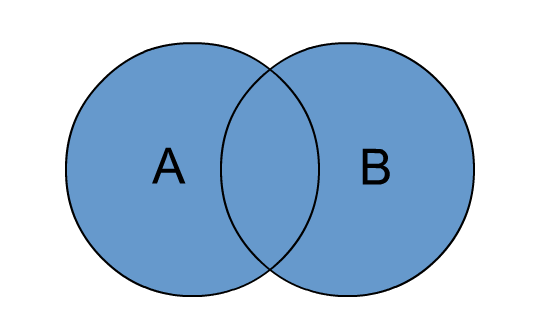

```sql
--4、full outer join
select e.id,e.name,e_a.city,e_a.street
from employee e full outer join employee_address e_a
on e.id =e_a.id;
--等价于
select e.id,e.name,e_a.city,e_a.street
from employee e full  join employee_address e_a
on e.id =e_a.id;
```

#### Hive left semi join

**左半开连接**（LEFT SEMI JOIN）会返回左边表的记录，前提是其记录对于右边的表满足ON语句中的判定条件。

从效果上来看有点像inner join之后只返回左表的结果。

```sql
--5、left semi join
select *
from employee e left semi join employee_address e_addr
on e.id =e_addr.id;

--相当于 inner join 只不过效率高一些
select e.*
from employee e inner join employee_address e_addr
on e.id =e_addr.id;
```

#### Hive cross join

**交叉连接cross join**，将会返回被连接的两个表的笛卡尔积，返回结果的行数等于两个表行数的乘积。对于**大表来说，cross join慎用**。在SQL标准中定义的cross join就是无条件的inner join。返回两个表的笛卡尔积,无需指定关联键。在HiveSQL语法中，cross join 后面可以跟where子句进行过滤，或者on条件过滤。

```sql
--6、cross join
--下列A、B、C 执行结果相同，但是效率不一样：
--A:
select a.*,b.* from employee a,employee_address b where a.id=b.id;
--B:
select * from employee a cross join employee_address b on a.id=b.id;
select * from employee a cross join employee_address b where a.id=b.id;

--C:
select * from employee a inner join employee_address b on a.id=b.id;

--一般不建议使用方法A和B，因为如果有WHERE子句的话，往往会先进行笛卡尔积返回数据然后才根据WHERE条件从中选择。
--因此，如果两个表太大，将会非常非常慢，不建议使用。
```

#### Hive join使用注意事项

总体来说，随着Hive的版本发展，join语法的功能也愈加丰富。当下我们课程使用的是3.1.2版本，有以下几点需要注意：

a)   允许使用复杂的联接表达式

```sql
SELECT a.* FROM a JOIN b ON (a.id = b.id)
SELECT a.* FROM a JOIN b ON (a.id = b.id AND a.department = b.department)
SELECT a.* FROM a LEFT OUTER JOIN b ON (a.id <> b.id)
```

b)   同一查询中可以连接2个以上的表

```sql
SELECT a.val, b.val, c.val FROM a JOIN b ON (a.key = b.key1) JOIN c ON (c.key = b.key2)
```

c)   如果每个表在联接子句中使用相同的列，则Hive将多个表上的联接转换为单个MR作业

```sql
SELECT a.val, b.val, c.val FROM a JOIN b ON (a.key = b.key1) JOIN c ON (c.key = b.key1)
--由于联接中仅涉及b的key1列，因此被转换为1个MR作业来执行
SELECT a.val, b.val, c.val FROM a JOIN b ON (a.key = b.key1) JOIN c ON (c.key = b.key2)
--会转换为两个MR作业，因为在第一个连接条件中使用了b中的key1列，而在第二个连接条件中使用了b中的key2列。第一个map / reduce作业将a与b联接在一起，然后将结果与c联接到第二个map / reduce作业中。
```

d)   join时的最后一个表会通过reducer流式传输，并在其中缓冲之前的其他表，因此，将大表放置在最后有助于减少reducer阶段缓存数据所需要的内存

```sql
SELECT a.val, b.val, c.val FROM a JOIN b ON (a.key = b.key1) JOIN c ON (c.key = b.key1)
--由于联接中仅涉及b的key1列，因此被转换为1个MR作业来执行，并且表a和b的键的特定值的值被缓冲在reducer的内存中。然后，对于从c中检索的每一行，将使用缓冲的行来计算联接。
SELECT a.val, b.val, c.val FROM a JOIN b ON (a.key = b.key1) JOIN c ON (c.key = b.key2)
--计算涉及两个MR作业。其中的第一个将a与b连接起来，并缓冲a的值，同时在reducer中流式传输b的值。
在第二个MR作业中，将缓冲第一个连接的结果，同时将c的值通过reducer流式传输。
```

e)   在join的时候，可以通过语法STREAMTABLE提示指定要流式传输的表。如果省略STREAMTABLE提示，则Hive将流式传输最右边的表。

```sql
SELECT /*+ STREAMTABLE(a) */ a.val, b.val, c.val FROM a JOIN b ON (a.key = b.key1) JOIN c ON (c.key = b.key1)
--a,b,c三个表都在一个MR作业中联接，并且表b和c的键的特定值的值被缓冲在reducer的内存中。然后，对于从a中检索到的每一行，将使用缓冲的行来计算联接。如果省略STREAMTABLE提示，则Hive将流式传输最右边的表。
```

f)   join在WHERE条件之前进行。

g)   如果除一个要连接的表之外的所有表都很小，则可以将其作为仅map作业执行

```sql
SELECT /*+ MAPJOIN(b) */ a.key, a.value FROM a JOIN b ON a.key = b.key
--不需要reducer。对于A的每个Mapper，B都会被完全读取。限制是不能执行FULL / RIGHT OUTER JOIN b。
```

相关的使用注意事项:https://cwiki.apache.org/confluence/display/Hive/LanguageManual+Joins

