参数配置与函数、运算符使用

## Hive参数配置

### Hive CLI

$HIVE_HOME/bin/hive是一个shellUtil,通常称之为hive的第一代客户端或者旧客户端，主要功能有两个：

一：用于以**交互式**或**批处理模式**运行**Hive查询**，注意，此时作为客户端，需要并且能够访问的是Hive metastore服务，而不是hiveserver2服务。


二：用于hive相关**服务的启动**，比如metastore服务。可以通过运行"hive -H" 或者 "hive --help"来查看命令行选项。

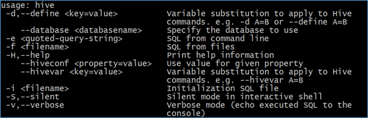

```sh
-e <quoted-query-string>        执行命令行-e参数后指定的sql语句 运行完退出。
-f <filename>                  执行命令行-f参数后指定的sql文件 运行完退出。
-H,--help                      打印帮助信息
    --hiveconf <property=value>   设置参数
-S,--silent                     静默模式
-v,--verbose                   详细模式，将执行sql回显到console
   --service service_name        启动hive的相关服务
```


### Batch Mode 批处理模式

当使用 **-e 或 -f 选项**运行$ HIVE_HOME / bin / hive时，它将以批处理模式执行SQL命令。所谓的批处理可以理解为一次性执行，执行完毕退出。

```sql
#-e
$HIVE_HOME/bin/hive -e 'show databases'

#-f
cd ~
#编辑一个sql文件 里面写上合法正确的sql语句
vim hive.sql
show databases;

#执行 从客户端所在机器的本地磁盘加载文件
$HIVE_HOME/bin/hive -f /root/hive.sql

#也可以从其他文件系统加载sql文件执行
$HIVE_HOME/bin/hive -f hdfs://<namenode>:<port>/hive-script.sql
$HIVE_HOME/bin/hive -f s3://mys3bucket/s3-script.sql

#使用静默模式将数据从查询中转储到文件中
$HIVE_HOME/bin/hive -S -e 'select * from dsjprs.demo' > a.txt
```


### Interactive Shell 交互式模式

所谓交互式模式可以理解为客户端和hive服务一直保持连接，除非手动退出客户端。

```sql
/export/server/hive/bin/hive

hive> show databases;
OK
default
dsjprs
dsjprs
Time taken: 0.028 seconds, Fetched: 3 row(s)

hive> use dsjprs;
OK
Time taken: 0.027 seconds

hive> exit;
```

### 启动服务、修改配置

远程模式部署方式下，hive metastore服务需要单独配置手动启动，此时就可以使用Hive CLI来进行相关服务的启动，hiveserver2服务类似。

```sql
#--service
$HIVE_HOME/bin/hive --service metastore
$HIVE_HOME/bin/hive --service hiveserver2

#--hiveconf
$HIVE_HOME/bin/hive --hiveconf hive.root.logger=DEBUG,console
```

### Beeline CLI

$HIVE_HOME/**bin/beeline**被称之为第二代客户端或者新客户端，是一个JDBC客户端，是官方强烈推荐使用的Hive命令行工具，和第一代客户端相比，性能加强安全性提高。Beeline在嵌入式模式和远程模式下均可工作。

在嵌入式模式下，它运行嵌入式Hive(类似于Hive CLI)；


**远程模式下beeline通过Thrift连接到单独的HiveServer2服务上**，这也是官方推荐在生产环境中使用的模式。

常见的使用方式如下所示，在启动hiveserver2服务的前提下使用beeline远程连接：

```sql
[root@node3 ~]# /export/server/hive/bin/beeline 
Beeline version 3.1.2 by Apache Hive
beeline> ! connect jdbc:hive2://node1:10000
Connecting to jdbc:hive2://node1:10000
Enter username for jdbc:hive2://node1:10000: root
Enter password for jdbc:hive2://node1:10000: 
Connected to: Apache Hive (version 3.1.2)
Driver: Hive JDBC (version 3.1.2)
Transaction isolation: TRANSACTION_REPEATABLE_READ
0: jdbc:hive2://node1:10000>
```

beeline支持的参数非常多，可以通过官方文档进行查询

[https://cwiki.apache.org/confluence/display/Hive/HiveServer2+Clients#HiveServer2Clients-Beeline%E2%80%93NewCommandLineShell](https://cwiki.apache.org/confluence/display/Hive/HiveServer2+Clients%23HiveServer2Clients-Beeline–NewCommandLineShell)

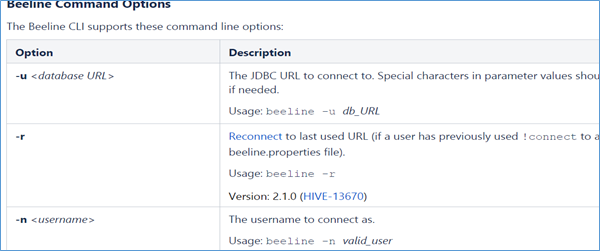

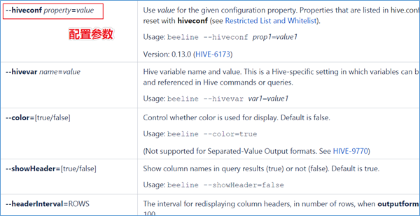

### Configuration Properties配置属性

#### 配置属性概述

Hive作为一款复杂的数据仓库软件，除了一些默认的属性行为之外，还支持用户配置属性进行修改，使得在某些场景下满足用户的需求。作为用户需要掌握两件事：


一是：Hive有哪些属性支持修改，修改了有什么功能；


二是：Hive支持哪种方式进行修改，修改是临时生效还是永久生效的。


**Hive配置属性的规范列表是在HiveConf.Java类中管理**的，因此请参考该HiveConf.java文件，以获取Hive当前使用的发行版中可用的配置属性的完整列表。从Hive 0.14.0开始，会从HiveConf.java类中直接生成配置模板文件hive-default.xml.template，它是当前版本配置及其默认值的可靠来源。

详细的配置参数大全:https://cwiki.apache.org/confluence/display/Hive/Configuration+Properties

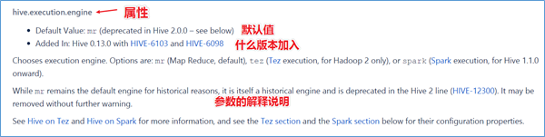

#### 修改配置属性方式

##### 方式1：hive-site.xml配置文件

在$HIVE_HOME/conf路径下，可以添加一个hive-site.xml文件，把需要定义修改的配置属性添加进去，这个配置文件会影响到这个Hive安装包的任何一种服务启动、客户端使用方式，可以理解为是Hive的全局配置。比如指定使用MySQL作为Hive元数据的存储介质，那么就需要把Hive连接MySQL的相关属性配置在hive-site.xml文件中，这样不管是本地模式还是远程模式启动，不管客户端本地连接还是远程连接，都将访问同一个元数据存储介质，大家使用的元数据都是一致的。

```xml
<configuration>
    <!-- 存储元数据mysql相关配置 -->
    <property>
        <name>javax.jdo.option.ConnectionURL</name>
        <value> jdbc:mysql://node1:3306/hive?createDatabaseIfNotExist=true&amp;useSSL=false&amp;useUnicode=true&amp;characterEncoding=UTF-8</value>
    </property>

    <property>
        <name>javax.jdo.option.ConnectionDriverName</name>
        <value>com.mysql.jdbc.Driver</value>
    </property>

    <property>
        <name>javax.jdo.option.ConnectionUserName</name>
        <value>root</value>
    </property>

    <property>
        <name>javax.jdo.option.ConnectionPassword</name>
        <value>hadoop</value>
    </property>
</configuration>
```

##### 方式2：hiveconf命令行参数

hiveconf是一个命令行的参数，用于在使用Hive CLI或者Beeline CLI的时候指定配置参数。这种方式的配置在整个的会话session中有效，会话结束，失效。比如在启动hive服务的时候，为了更好的查看启动详情，可以通过hiveconf参数修改日志级别：

```sql
$HIVE_HOME/bin/hive --hiveconf hive.root.logger=DEBUG,console
```

##### 方式3：set命令

在Hive CLI或Beeline中使用**set命令为set命令之后的所有SQL语句设置配置参数**，这个也是会话级别的。

这种方式也是用户日常开发中使用最多的一种配置参数方式。因为Hive倡导一种：**谁需要、谁配置、谁使用**的一种思想，避免属性修改影响其他用户的修改。

```sql
#启用hive动态分区，需要在hive会话中设置两个参数：
set hive.exec.dynamic.partition=true;
set hive.exec.dynamic.partition.mode=nonstrict;
```

##### 方式4：服务器特定的配置文件

设置特定metastore的配置值hivemetastore-site.xml中，并在HiveServer2特定的配置值hiveserver2-site.xml中。

Hive Metastore服务器读取$ HIVE_CONF_DIR或类路径中可用的hive-site.xml以及hivemetastore-site.xml配置文件。


HiveServer2读取$ HIVE_CONF_DIR或类路径中可用的hive-site.xml以及hiveserver2-site.xml。


如果HiveServer2以嵌入式模式使用元存储，则还将加载hivemetastore-site.xml。


配置文件的优先顺序如下，后面的优先级越高：


hive-site.xml-> hivemetastore-site.xml-> hiveserver2-site.xml->' -hiveconf'命令行参数


从Hive 0.14.0开始，会从HiveConf.java类中直接生成配置模板文件hive-default.xml.template，它是当前版本配置变量及其默认值的可靠来源。hive-default.xml.template 位于安装根目录下的conf目录中，并且 hive-site.xml 也应在同一目录中创建。


从 Hive 0.14.0开始， 您可以使用SHOW CONF命令显示有关配置变量的信息。配置方式的优先级顺序，优先级依次递增：set参数生命>hiveconf命令行参数>hive-site.xml配置文件。


即**set参数声明覆盖命令行参数hiveconf，命令行参数覆盖配置文件hive-site.xml设定。**日常的开发使用中，如果不是核心的需要全局修改的参数属性，建议大家使用set命令进行设置。另外，Hive也会读入Hadoop的配置，因为Hive是作为Hadoop的客户端启动的，Hive的配置会覆盖Hadoop的配置。


## Hive内置运算符

随着Hive版本的不断发展，在Hive SQL中支持的、内置的运算符也越来越多。可以使用下面的命令查看当下支持的运算符和函数，并且查看其详细的使用方式。

https://cwiki.apache.org/confluence/display/Hive/LanguageManual+UDF

```sql
--显示所有的函数和运算符
show functions;
--查看运算符或者函数的使用说明
describe function +;
--使用extended 可以查看更加详细的使用说明
describe function extended +;
```

从Hive 0.13.0开始，select查询语句FROM关键字是可选的（例如SELECT 1+1）。因此可以使用这种方式来练习测试内置的运算符、函数的功能。除此之外，还可以通过创建一张虚表dual来满足于测试需求。

```sql
--1、创建表dual
create table dual(id string);
--2、加载一个文件dual.txt到dual表中
--dual.txt只有一行内容：内容为一个空格
--3、在select查询语句中使用dual表完成运算符、函数功能测试
select 1+1 from dual;
```

### 关系运算符

**关系运算符**是二元运算符，执行的是两个操作数的比较运算。每个关系运算符都返回boolean类型结果（TRUE或FALSE）。

```sh
•等值比较: = 、==
•不等值比较: <> 、!=
•小于比较: <
•小于等于比较: <=
•大于比较: >
•大于等于比较: >=
•空值判断: IS NULL 
•非空判断: IS NOT NULL
•LIKE比较: LIKE
•JAVA的LIKE操作: RLIKE
•REGEXP操作: REGEXP
```

```sql
--is null空值判断
select 1 from dual where 'dsjprs' is null;

--is not null 非空值判断
select 1 from dual where 'dsjprs' is not null;

--like比较： _表示任意单个字符 %表示任意数量字符
--否定比较： NOT A like B
select 1 from dual where 'dsjprs' like 'ds_';
select 1 from dual where 'dsjprs' like 'ds%';
select 1 from dual where not 'dsjprs' like 'hadoo_';

--rlike：确定字符串是否匹配正则表达式，是REGEXP_LIKE()的同义词。
select 1 from dual where 'dsjprs' rlike '^d.*s$';
select 1 from dual where '123456' rlike '^\\d+$';  --判断是否全为数字
select 1 from dual where '123456aa' rlike '^\\d+$';

--regexp：功能与rlike相同 用于判断字符串是否匹配正则表达式
select 1 from dual where 'dsjprs' regexp '^i.*t$';
```

### 算术运算符

算术运算符操作数必须是数值类型。 分为一元运算符和二元运算符; 一元运算符,只有一个操作数; 二元运算符有两个操作数,运算符在两个操作数之间。

```sh
•加法操作: +
•减法操作: -
•乘法操作: *
•除法操作: /
•取整操作: div
•取余操作: %
•位与操作: &
•位或操作: |
•位异或操作: ^
•位取反操作: ~
```

```sql
--取整操作: div  给出将A除以B所得的整数部分。例如17 div 3得出5。
select 17 div 3;

--取余操作: %  也叫做取模  A除以B所得的余数部分
select 17 % 3;

--位与操作: &  A和B按位进行与操作的结果。 与表示两个都为1则结果为1
select 4 & 8 from dual;  --4转换二进制：0100 8转换二进制：1000
select 6 & 4 from dual;  --4转换二进制：0100 6转换二进制：0110

--位或操作: |  A和B按位进行或操作的结果  或表示有一个为1则结果为1
select 4 | 8 from dual;
select 6 | 4 from dual;

--位异或操作: ^ A和B按位进行异或操作的结果 异或表示两个不同则结果为1
select 4 ^ 8 from dual;
select 6 ^ 4 from dual;
```

### 逻辑运算符

```sh
•与操作: A AND B
•或操作: A OR B
•非操作: NOT A 、!A
•在:A IN (val1, val2, ...)
•不在:A NOT IN (val1, val2, ...)
•逻辑是否存在: [NOT] EXISTS (subquery)
```

```sql
--与操作: A AND B   如果A和B均为TRUE，则为TRUE，否则为FALSE。如果A或B为NULL，则为NULL。
select 1 from dual where 3>1 and 2>1;

--或操作: A OR B   如果A或B或两者均为TRUE，则为TRUE，否则为FALSE。
select 1 from dual where 3>1 or 2!=2;

--非操作: NOT A 、!A   如果A为FALSE，则为TRUE；如果A为NULL，则为NULL。否则为FALSE。
select 1 from dual where not 2>1;
select 1 from dual where !2=1;

--在:A IN (val1, val2, ...)  如果A等于任何值，则为TRUE。
select 1 from dual where 11 in(11,22,33);

--不在:A NOT IN (val1, val2, ...) 如果A不等于任何值，则为TRUE
select 1 from dual where 11 not in(22,33,44);

--逻辑是否存在: [NOT] EXISTS (subquery) 如果子查询返回至少一行，则为TRUE。
select A.* from A
where exists (select B.id from B where A.id = B.id)
```

## Hive函数

### 函数概述

如同RDBMS中标准SQL语法一样，Hive SQL也内建了不少函数，满足于用户在不同场合下的数据分析需求，提高开发SQL数据分析的效率。可以使用show functions查看当下版本支持的函数，并且可以通过**describe function extended funcname**来查看函数的使用方式和方法。


### 函数分类

Hive的函数很多，除了自己内置所支持的函数之外，还支持用户自己定义开发函数。针对**内置的函数**，可以根据函数的应用类型进行归纳分类，比如：数值类型函数、日期类型函数、字符串类型函数、集合函数、条件函数等；

针对**用户自定义函数**，可以根据函数的输入输出行数进行分类，比如：UDF、UDAF、UDTF。

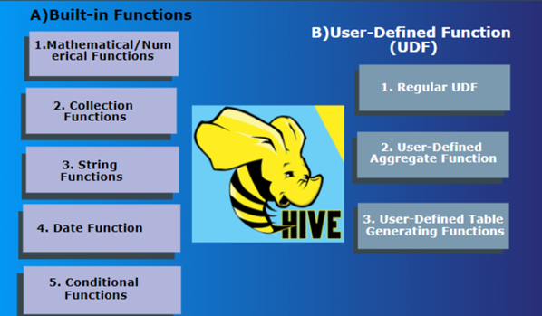


### 内置函数分类

所谓的**内置函数（buildin）**指的是Hive开发实现好，直接可以使用的函数,也叫做内建函数。

官方文档地址：https://cwiki.apache.org/confluence/display/Hive/LanguageManual+UDF


#### String Functions 字符串函数

主要针对字符串数据类型进行操作，比如下面这些：

```sql
•字符串长度函数：length
•字符串反转函数：reverse
•字符串连接函数：concat
•带分隔符字符串连接函数：concat_ws
•字符串截取函数：substr,substring
•字符串转大写函数：upper,ucase
•字符串转小写函数：lower,lcase
•去空格函数：trim
•左边去空格函数：ltrim
•右边去空格函数：rtrim
•正则表达式替换函数：regexp_replace
•正则表达式解析函数：regexp_extract
•URL解析函数：parse_url
•json解析函数：get_json_object
•空格字符串函数：space
•重复字符串函数：repeat
•首字符ascii函数：ascii
•左补足函数：lpad
•右补足函数：rpad
•分割字符串函数: split
•集合查找函数: find_in_set
```

```sql
------------String Functions 字符串函数------------
describe function extended find_in_set;

--字符串长度函数：length(str | binary)
select length("angelababy");

--字符串反转函数：reverse
select reverse("angelababy");

--字符串连接函数：concat(str1, str2, ... strN)
select concat("angela","baby");

--带分隔符字符串连接函数：concat_ws(separator, [string | array(string)]+)
select concat_ws('.', 'www', array('itcast', 'cn'));

--字符串截取函数：substr(str, pos[, len]) 或者  substring(str, pos[, len])
select substr("angelababy",-2); --pos是从1开始的索引，如果为负数则倒着数
select substr("angelababy",2,2);

--字符串转大写函数：upper,ucase
select upper("angelababy");
select ucase("angelababy");

--字符串转小写函数：lower,lcase
select lower("ANGELABABY");
select lcase("ANGELABABY");

--去空格函数：trim 去除左右两边的空格
select trim(" angelababy ");

--左边去空格函数：ltrim
select ltrim(" angelababy ");

--右边去空格函数：rtrim
select rtrim(" angelababy ");

--正则表达式替换函数：regexp_replace(str, regexp, rep)
select regexp_replace('100-200', '(\\d+)', 'num');

--正则表达式解析函数：regexp_extract(str, regexp[, idx]) 提取正则匹配到的指定组内容
select regexp_extract('100-200', '(\\d+)-(\\d+)', 2);

--URL解析函数：parse_url 注意要想一次解析出多个 可以使用parse_url_tuple这个UDTF函数
select parse_url('http://www.itcast.cn/path/p1.php?query=1', 'HOST');

--json解析函数：get_json_object
--空格字符串函数：space(n) 返回指定个数空格
select space(4);

--重复字符串函数：repeat(str, n) 重复str字符串n次
select repeat("angela",2);

--首字符ascii函数：ascii
select ascii("angela");  --a对应ASCII 97

--左补足函数：lpad
select lpad('hi', 5, '??');  --???hi
select lpad('hi', 1, '??');  --h

--右补足函数：rpad
select rpad('hi', 5, '??');

--分割字符串函数: split(str, regex)
select split('apache hive', '\\s+');

--集合查找函数: find_in_set(str,str_array)
select find_in_set('a','abc,b,ab,c,def');
```

#### Date Functions 日期函数

主要针对时间、日期数据类型进行操作，比如下面这些：

```sql
•获取当前日期: current_date
•获取当前时间戳: current_timestamp
•UNIX时间戳转日期函数: from_unixtime
•获取当前UNIX时间戳函数: unix_timestamp
•日期转UNIX时间戳函数: unix_timestamp
•指定格式日期转UNIX时间戳函数: unix_timestamp
•抽取日期函数: to_date
•日期转年函数: year
•日期转月函数: month
•日期转天函数: day
•日期转小时函数: hour
•日期转分钟函数: minute
•日期转秒函数: second
•日期转周函数: weekofyear
•日期比较函数: datediff
•日期增加函数: date_add
•日期减少函数: date_sub
```

```sql
--获取当前日期: current_date
select current_date();

--获取当前时间戳: current_timestamp
--同一查询中对current_timestamp的所有调用均返回相同的值。
select current_timestamp();

--获取当前UNIX时间戳函数: unix_timestamp
select unix_timestamp();

--UNIX时间戳转日期函数: from_unixtime
select from_unixtime(1618238391);
select from_unixtime(0, 'yyyy-MM-dd HH:mm:ss');

--日期转UNIX时间戳函数: unix_timestamp
select unix_timestamp("2011-12-07 13:01:03");

--指定格式日期转UNIX时间戳函数: unix_timestamp
select unix_timestamp('20111207 13:01:03','yyyyMMdd HH:mm:ss');

--抽取日期函数: to_date
select to_date('2009-07-30 04:17:52');

--日期转年函数: year
select year('2009-07-30 04:17:52');

--日期转月函数: month
select month('2009-07-30 04:17:52');

--日期转天函数: day
select day('2009-07-30 04:17:52');

--日期转小时函数: hour
select hour('2009-07-30 04:17:52');

--日期转分钟函数: minute
select minute('2009-07-30 04:17:52');

--日期转秒函数: second
select second('2009-07-30 04:17:52');

--日期转周函数: weekofyear 返回指定日期所示年份第几周
select weekofyear('2009-07-30 04:17:52');

--日期比较函数: datediff  日期格式要求'yyyy-MM-dd HH:mm:ss' or 'yyyy-MM-dd'
select datediff('2012-12-08','2012-05-09');

--日期增加函数: date_add
select date_add('2012-02-28',10);

--日期减少函数: date_sub
select date_sub('2012-01-1',10);
```

#### Mathematical Functions 数学函数

主要针对数值类型的数据进行数学计算，比如下面这些：

```sql
•取整函数: round
•指定精度取整函数: round
•向下取整函数: floor
•向上取整函数: ceil
•取随机数函数: rand
•二进制函数: bin
•进制转换函数: conv
•绝对值函数: abs
```

```sql
--取整函数: round  返回double类型的整数值部分 （遵循四舍五入）
select round(3.1415926);

--指定精度取整函数: round(double a, int d) 返回指定精度d的double类型
select round(3.1415926,4);

--向下取整函数: floor
select floor(3.1415926);
select floor(-3.1415926);

--向上取整函数: ceil
select ceil(3.1415926);
select ceil(-3.1415926);

--取随机数函数: rand 每次执行都不一样 返回一个0到1范围内的随机数
select rand();

--指定种子取随机数函数: rand(int seed) 得到一个稳定的随机数序列
select rand(2);

--二进制函数:  bin(BIGINT a)
select bin(18);

--进制转换函数: conv(BIGINT num, int from_base, int to_base)
select conv(17,10,16);

--绝对值函数: abs
select abs(-3.9);
```

#### Collection Functions 集合函数

主要针对集合这样的复杂数据类型进行操作，比如下面这些：

```sql
•集合元素size函数: size(Map<K.V>) size(Array<T>)
•取map集合keys函数: map_keys(Map<K.V>)
•取map集合values函数: map_values(Map<K.V>)
•判断数组是否包含指定元素: array_contains(Array<T>, value)
•数组排序函数:sort_array(Array<T>)
```

```sql
--集合元素size函数: size(Map<K.V>) size(Array<T>)
select size(`array`(11,22,33));
select size(`map`("id",10086,"name","zhangsan","age",18));

--取map集合keys函数: map_keys(Map<K.V>)
select map_keys(`map`("id",10086,"name","zhangsan","age",18));

--取map集合values函数: map_values(Map<K.V>)
select map_values(`map`("id",10086,"name","zhangsan","age",18));

--判断数组是否包含指定元素: array_contains(Array<T>, value)
select array_contains(`array`(11,22,33),11);
select array_contains(`array`(11,22,33),66);

--数组排序函数:sort_array(Array<T>)
select sort_array(`array`(12,2,32));
```

#### Conditional Functions 条件函数

主要用于条件判断、逻辑判断转换这样的场合，比如：

```sql
•if条件判断: if(boolean testCondition, T valueTrue, T valueFalseOrNull)
•空判断函数: isnull( a )
•非空判断函数: isnotnull ( a )
•空值转换函数: nvl(T value, T default_value)
•非空查找函数: COALESCE(T v1, T v2, ...)
•条件转换函数: CASE a WHEN b THEN c [WHEN d THEN e]* [ELSE f] END
•nullif( a, b ): 如果a = b，则返回NULL；否则返回NULL。否则返回一个
•assert_true: 如果'condition'不为真，则引发异常，否则返回null
```

```sql
--使用之前课程创建好的student表数据
select * from student limit 3;

--if条件判断: if(boolean testCondition, T valueTrue, T valueFalseOrNull)
select if(1=2,100,200);
select if(sex ='男','M','W') from student limit 3;

--空判断函数: isnull( a )
select isnull("allen");
select isnull(null);

--非空判断函数: isnotnull ( a )
select isnotnull("allen");
select isnotnull(null);

--空值转换函数: nvl(T value, T default_value)
select nvl("allen","itcast");
select nvl(null,"itcast");

--非空查找函数: COALESCE(T v1, T v2, ...)
--返回参数中的第一个非空值；如果所有值都为NULL，那么返回NULL
select COALESCE(null,11,22,33);
select COALESCE(null,null,null,33);
select COALESCE(null,null,null);

--条件转换函数: CASE a WHEN b THEN c [WHEN d THEN e]* [ELSE f] END
select case 100 when 50 then 'tom' when 100 then 'mary' else 'tim' end;
select case sex when '男' then 'man' else 'women' end from student limit 3;

--nullif( a, b ):
-- 果a = b，则返回NULL；否则返回NULL。否则返回一个
select nullif(11,11);
select nullif(11,12);

--assert_true(condition)
--如果'condition'不为真，则引发异常，否则返回null
SELECT assert_true(11 >= 0);
SELECT assert_true(-1 >= 0);
```

#### Type Conversion Functions 类型转换函数

主要用于显式的数据类型转换，有下面两种函数：

```sql
•任意数据类型之间转换:cast
--任意数据类型之间转换:cast
select cast(12.14 as bigint);
select cast(12.14 as string);
```

#### Data Masking Functions 数据脱敏函数

主要完成对数据脱敏转换功能，屏蔽原始数据，主要如下：

```sql
•mask
•mask_first_n(string str[, int n]
•mask_last_n(string str[, int n])
•mask_show_first_n(string str[, int n])
•mask_show_last_n(string str[, int n])
•mask_hash(string|char|varchar str)
```

```sql
--mask
--将查询回的数据，大写字母转换为X，小写字母转换为x，数字转换为n。
select mask("abc123DEF");
select mask("abc123DEF",'-','.','^'); --自定义替换的字母

--mask_first_n(string str[, int n]
--对前n个进行脱敏替换
select mask_first_n("abc123DEF",4);

--mask_last_n(string str[, int n])
select mask_last_n("abc123DEF",4);

--mask_show_first_n(string str[, int n])
--除了前n个字符，其余进行掩码处理
select mask_show_first_n("abc123DEF",4);

--mask_show_last_n(string str[, int n])
select mask_show_last_n("abc123DEF",4);

--mask_hash(string|char|varchar str)
--返回字符串的hash编码。
select mask_hash("abc123DEF");
```

#### Misc. Functions 其他杂项函数

```sql
•hive调用java方法: java_method(class, method[, arg1[, arg2..]])
•反射函数: reflect(class, method[, arg1[, arg2..]])
•取哈希值函数:hash
•current_user()、logged_in_user()、current_database()、version()
•SHA-1加密: sha1(string/binary)
•SHA-2家族算法加密：sha2(string/binary, int)  (SHA-224, SHA-256, SHA-384, SHA-512)
•crc32加密:
•MD5加密: md5(string/binary)
```

```sql
--hive调用java方法: java_method(class, method[, arg1[, arg2..]])
select java_method("java.lang.Math","max",11,22);

--反射函数: reflect(class, method[, arg1[, arg2..]])
select reflect("java.lang.Math","max",11,22);

--取哈希值函数:hash
select hash("allen");

--current_user()、logged_in_user()、current_database()、version()

--SHA-1加密: sha1(string/binary)
select sha1("allen");

--SHA-2家族算法加密：sha2(string/binary, int)  (SHA-224, SHA-256, SHA-384, SHA-512)
select sha2("allen",224);
select sha2("allen",512);

--crc32加密:
select crc32("allen");

--MD5加密: md5(string/binary)
select md5("allen");
```

### 用户自定义函数分类

虽然说Hive内置了很多函数，但是不见得一定可以满足于用户各种各样的分析需求场景。为了解决这个问题，Hive推出来用户自定义函数功能，让用户实现自己希望实现的功能函数。**用户自定义函数简称UDF**，源自于英文user-defined function。自定义函数总共有3类，是根据函数输入输出的行数来区分的，分别是：


**UDF**（User-Defined-Function）普通函数，一进一出


**UDAF**（User-Defined Aggregation Function）聚合函数，多进一出


**UDTF**（User-Defined Table-Generating Functions）表生成函数，一进多出


#### UDF分类标准扩大化

UDF叫做用户自定义函数，其分类标准主要针对的是用户编写开发的函数。但是这套UDF分类标准可以扩大到Hive的所有函数中：**包括内置函数和自定义函数**。因为不管是什么类型的行数，一定满足于输入输出的要求，那么从输入几行和输出几行上来划分没有任何毛病。千万不要被UD（User-Defined）这两个字母所迷惑，照成视野的狭隘。比如Hive官方文档中，针对聚合函数的标准就是内置的UDAF类型。

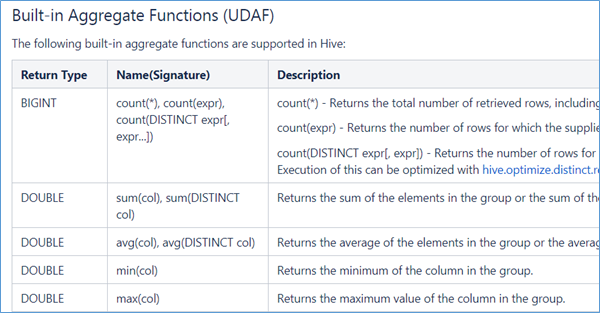


#### UDF 普通函数

UDF函数通常把它叫做普通函数，最大的特点是一进一出，也就是输入一行输出一行。比如round这样的取整函数，接收一行数据，输出的还是一行数据。

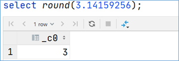


#### UDAF 聚合函数

UDAF函数通常把它叫做聚合函数，A所代表的单词就是Aggregation聚合的意思。最大的特点是多进一出，也就是输入多行输出一行。比如count、sum这样的函数。

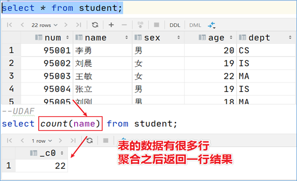

```sql
•count:统计检索到的总行数。
•sum:求和
•avg:求平均
•min:最小值
•max:最大值
•数据收集函数（去重）: collect_set(col)
•数据收集函数（不去重）: collect_list(col)
```

```sql
select sex from student;

select collect_set(sex) from student;
select collect_list(sex) from student;
```

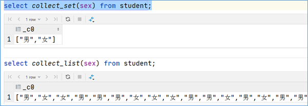


#### UDTF 表生成函数

UDTF函数通常把它叫做表生成函数，T所代表的单词是Table-Generating表生成的意思。最大的特点是一进多出，也就是输入一行输出多行。之所以叫做表生成函数，原因在于这类型的函数作用返回的结果类似于表（多行数据嘛），同时，UDTF函数也是接触比较少的函数，陌生。比如explode函数。

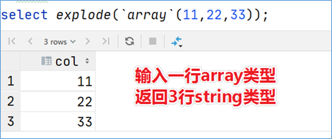

### 案例：用户自定义UDF

在企业中处理数据的时候，对于敏感数据往往需要进行脱敏处理。比如手机号。我们常见的处理方式是将手机号中间4位进行****处理。Hive中没有这样的函数可以直接实现功能，虽然可以通过各种函数的嵌套调用最终也能实现，但是效率不高，现要求自定义开发实现Hive函数，满足上述需求。

1、 能够对输入数据进行非空判断、位数判断处理

2、 能够实现校验手机号格式，把满足规则的进行****处理

3、 对于不符合手机号规则的数据原封不动不处理


#### 实现步骤

通过业务分析，可以发现我们需要实现的函数是一个输入一行输出一行的函数，也就是所说的UDF普通函数。

根据Hive当中的UDF开发规范，实现步骤如下：

1、 写一个java类，继承UDF，并重载evaluate方法；

2、 程序打成jar包，上传服务器添加到hive的classpath；hive>add JAR /home/hadoop/udf.jar;

3、 注册成为临时函数（给UDF命名）；create temporary function 函数名 as 'UDF类全路径';

4、 使用函数


#### 代码实现

```properties
<dependencies>
    <dependency>
        <groupId>org.apache.hive</groupId>
        <artifactId>hive-exec</artifactId>
        <version>3.1.2</version>
    </dependency>
    <dependency>
        <groupId>org.apache.hadoop</groupId>
        <artifactId>hadoop-common</artifactId>
        <version>3.1.4</version>
    </dependency>
</dependencies>
<build>
    <plugins>
        <plugin>
            <groupId>org.apache.maven.plugins</groupId>
            <artifactId>maven-shade-plugin</artifactId>
            <version>2.2</version>
            <executions>
                <execution>
                    <phase>package</phase>
                    <goals>
                        <goal>shade</goal>
                    </goals>
                    <configuration>
                        <filters>
                            <filter>
                                <artifact>*:*</artifact>
                                <excludes>
                                    <exclude>META-INF/*.SF</exclude>
                                    <exclude>META-INF/*.DSA</exclude>
                                    <exclude>META-INF/*.RSA</exclude>
                                </excludes>
                            </filter>
                        </filters>
                    </configuration>
                </execution>
            </executions>
        </plugin>
    </plugins>
</build>
```

#### 业务代码

```java
package cn.dsjprs.hive.udf;

import org.apache.commons.lang.StringUtils;
import org.apache.hadoop.hive.ql.exec.UDF;

import java.util.regex.Matcher;
import java.util.regex.Pattern;

/**
 * @description: hive自定义函数UDF 实现对手机号中间4位进行****加密
 * @author: dsjprs
 */
public class EncryptPhoneNumber extends UDF {
    /**
     * 重载evaluate方法 实现函数的业务逻辑
     * @param phoNum  入参：未加密手机号
     * @return 返回：加密后的手机号字符串
     */
    public String evaluate(String phoNum){
        String encryptPhoNum = null;
        //手机号不为空 并且为11位
        if (StringUtils.isNotEmpty(phoNum) && phoNum.trim().length() == 11 ) {
            //判断数据是否满足中国大陆手机号码规范
            String regex = "^(1[3-9]\\d{9}$)";
            Pattern p = Pattern.compile(regex);
            Matcher m = p.matcher(phoNum);
            if (m.matches()) {//进入这里都是符合手机号规则的
                //使用正则替换 返回加密后数据
                encryptPhoNum = phoNum.trim().replaceAll("()\\d{4}(\\d{4})","$1****$2");
            }else{
                //不符合手机号规则 数据直接原封不动返回
                encryptPhoNum = phoNum;
            }
        }else{
            //不符合11位 数据直接原封不动返回
            encryptPhoNum = phoNum;
        }
        return encryptPhoNum;
    }
}
```

## Hive函数高阶

### UDTF之explode函数

#### explode语法功能

对于UDTF表生成函数，很多人难以理解什么叫做输入一行，输出多行。


Hive当中内置的一个非常著名的UDTF函数，名字叫做**explode函数**，中文戏称之为“爆炸函数”，可以炸开数据。


explode函数接收map或者array类型的数据作为参数，然后把参数中的每个元素炸开变成一行数据。一个元素一行。这样的效果正好满足于输入一行输出多行。


explode函数在关系型数据库中本身是不该出现的。因为它的出现本身就是在操作不满足第一范式的数据（每个属性都不可再分）。本身已经违背了数据库的设计原理，但是在面向分析的数据库或者数据仓库中，这些规范可以发生改变。

```sql
explode(a) - separates the elements of array a into multiple rows, or the elements of a map into multiple rows and columns 
```

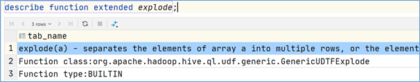


explode(array)将array列表里的每个元素生成一行；explode(map)将map里的每一对元素作为一行，其中key为一列，value为一列；一般情况下，explode函数可以直接使用即可，也可以根据需要结合lateral view侧视图使用。


#### explode函数的使用

```sql
select explode(`array`(11,22,33)) as item;

select explode(`map`("id",10086,"name","zhangsan","age",18));
```

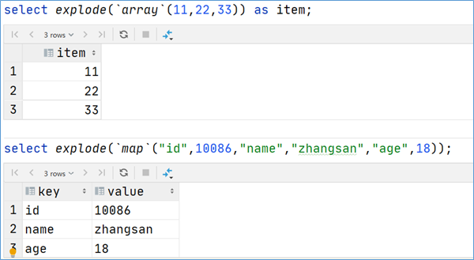


#### explode使用限制

在select条件中，如果只有explode函数表达式，程序执行是没有任何问题的；但是如果在select条件中，包含explode和其他字段，就会报错。错误信息为：org.apache.hadoop.hive.ql.parse.SemanticException:UDTF's are not supported outside the SELECT clause, nor nested in expressions


那么如何理解这个错误呢？为什么在select的时候，explode的旁边不支持其他字段的同时出现？


#### explode语法限制原因

**1、 explode函数属于UDTF函数，即表生成函数；**

**2、 explode函数执行返回的结果可以理解为一张虚拟的表，其数据来源于源表；**

**3、 在select中只查询源表数据没有问题，只查询explode生成的虚拟表数据也没问题**

**4、 但是不能在只查询源表的时候，既想返回源表字段又想返回explode生成的虚拟表字段**

**5、 通俗点讲，有两张表，不能只查询一张表但是返回分别属于两张表的字段；**

**6、 从SQL层面上来说应该对两张表进行关联查询**

**7、 Hive专门提供了语法lateral View侧视图，专门用于搭配explode这样的UDTF函数，以满足上述需要。**

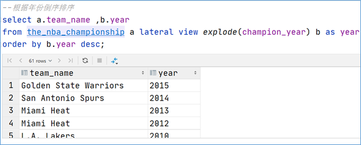


### Lateral View侧视图

#### 概念

**Lateral View**是一种特殊的语法，主要用于**搭配UDTF类型功能的函数一起使用**，用于解决UDTF函数的一些查询限制的问题。侧视图的原理是将UDTF的结果构建成一个类似于视图的表，然后将原表中的每一行和UDTF函数输出的每一行进行连接，生成一张新的虚拟表。这样就避免了UDTF的使用限制问题。使用lateral view时也可以对UDTF产生的记录设置字段名称，产生的字段可以用于group by、order by 、limit等语句中，不需要再单独嵌套一层子查询。一般只要使用UDTF，就会固定搭配lateral view使用。

官方链接：https://cwiki.apache.org/confluence/display/Hive/LanguageManual+LateralView


#### UDTF配合侧视图使用

使用explode函数+lateral view侧视图，可以完美解决：

```sql
--lateral view侧视图基本语法如下
select …… from tabelA lateral view UDTF(xxx) 别名 as col1,col2,col3……;

select a.team_name ,b.year
from the_nba_championship a lateral view explode(champion_year) b as year

--根据年份倒序排序
select a.team_name ,b.year
from the_nba_championship a lateral view explode(champion_year) b as year
order by b.year desc;
```


### Aggregation 聚合函数

#### 基础聚合

HQL提供了几种内置的**UDAF聚合函数**，例如max（...），min（...）和avg（...）。这些我们把它称之为基础的聚合函数。通常情况下，聚合函数会与GROUP BY子句一起使用。 如果未指定GROUP BY子句，默认情况下，它会汇总所有行数据。

```sql
--------------基础聚合函数-------------------
--1、测试数据准备
drop table if exists student;
create table student(
    num int,
    name string,
    sex string,
    age int,
    dept string)
row format delimited
fields terminated by ',';
--加载数据
load data local inpath '/root/hivedata/students.txt' into table student;
--验证
select * from student;


--场景1：没有group by子句的聚合操作
select count(*) as cnt1,count(1) as cnt2 from student; --两个一样

--场景2：带有group by子句的聚合操作 注意group by语法限制
select sex,count(*) as cnt from student group by sex;

--场景3：select时多个聚合函数一起使用
select count(*) as cnt1,avg(age) as cnt2 from student;

--场景4：聚合函数和case when条件转换函数、coalesce函数、if函数使用
select
    sum(CASE WHEN sex = '男'THEN 1 ELSE 0 END)
from student;

select
    sum(if(sex = '男',1,0))
from student;

--场景5：聚合参数不支持嵌套聚合函数
select avg(count(*))  from student;

--聚合参数针对null的处理方式
--null null 0
select max(null), min(null), count(null);
--下面这两个不支持null
select sum(null), avg(null);

--场景5：聚合操作时针对null的处理
CREATE TABLE tmp_1 (val1 int, val2 int);
INSERT INTO TABLE tmp_1 VALUES (1, 2),(null,2),(2,3);
select * from tmp_1;
--第二行数据(NULL, 2) 在进行sum(val1 + val2)的时候会被忽略
select sum(val1), sum(val1 + val2) from tmp_1;
--可以使用coalesce函数解决
select
    sum(coalesce(val1,0)),
    sum(coalesce(val1,0) + val2)
from tmp_1;

--场景6：配合distinct关键字去重聚合
--此场景下，会编译期间会自动设置只启动一个reduce task处理数据  性能可能会不会 造成数据拥堵
select count(distinct sex) as cnt1 from student;
--可以先去重 在聚合 通过子查询完成
--因为先执行distinct的时候 可以使用多个reducetask来跑数据
select count(*) as gender_uni_cnt
from (select distinct sex from student) a;

--案例需求：找出student中男女学生年龄最大的及其名字
--这里使用了struct来构造数据 然后针对struct应用max找出最大元素 然后取值
select sex,
max(struct(age, name)).col1 as age,
max(struct(age, name)).col2 as name
from student
group by sex;

select struct(age, name) from student;
select struct(age, name).col1 from student;
select max(struct(age, name)) from student;
```

#### 增强聚合

增强聚合的grouping_sets、cube、rollup这几个函数主要适用于OLAP多维数据分析模式中，多维分析中的**维**指的分析问题时看待问题的维度、角度。


字段：月份、天、用户cookieid

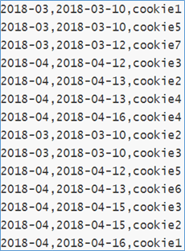

```sql
--表创建并且加载数据
CREATE TABLE cookie_info(
   month STRING,
   day STRING,
   cookieid STRING
) ROW FORMAT DELIMITED
FIELDS TERMINATED BY ',';

load data local inpath '/root/hivedata/cookie_info.txt' into table cookie_info;

select * from cookie_info;
```

### Grouping sets

**grouping sets**是一种将多个group by逻辑写在一个sql语句中的便利写法。等价于将不同维度的GROUP BY结果集进行UNION ALL。GROUPING__ID表示结果属于哪一个分组集合。

```sql
---group sets---------
SELECT
    month,
    day,
    COUNT(DISTINCT cookieid) AS nums,
    GROUPING__ID
FROM cookie_info
GROUP BY month,day
GROUPING SETS (month,day)
ORDER BY GROUPING__ID;

--grouping_id表示这一组结果属于哪个分组集合，
--根据grouping sets中的分组条件month，day，1是代表month，2是代表day

--等价于
SELECT month,NULL,COUNT(DISTINCT cookieid) AS nums,1 AS GROUPING__ID FROM cookie_info GROUP BY month
UNION ALL
SELECT NULL as month,day,COUNT(DISTINCT cookieid) AS nums,2 AS GROUPING__ID FROM cookie_info GROUP BY day;
--再比如
SELECT
    month,
    day,
    COUNT(DISTINCT cookieid) AS nums,
    GROUPING__ID
FROM cookie_info
GROUP BY month,day
GROUPING SETS (month,day,(month,day))
ORDER BY GROUPING__ID;

--等价于
SELECT month,NULL,COUNT(DISTINCT cookieid) AS nums,1 AS GROUPING__ID FROM cookie_info GROUP BY month
UNION ALL
SELECT NULL,day,COUNT(DISTINCT cookieid) AS nums,2 AS GROUPING__ID FROM cookie_info GROUP BY day
UNION ALL
SELECT month,day,COUNT(DISTINCT cookieid) AS nums,3 AS GROUPING__ID FROM cookie_info GROUP BY month,day;
```

### Cube

cube的语法功能指的是：根据GROUP BY的维度的所有组合进行聚合。对于cube,如果有n个维度,则所有组合的总个数是：**2^n**。比如Cube有a,b,c3个维度，则所有组合情况是： ((a,b,c),(a,b),(b,c),(a,c),(a),(b),(c),())。

```sql
------cube---------------
SELECT
    month,
    day,
    COUNT(DISTINCT cookieid) AS nums,
    GROUPING__ID
FROM cookie_info
GROUP BY month,day
WITH CUBE
ORDER BY GROUPING__ID;

--等价于
SELECT NULL,NULL,COUNT(DISTINCT cookieid) AS nums,0 AS GROUPING__ID FROM cookie_info
UNION ALL
SELECT month,NULL,COUNT(DISTINCT cookieid) AS nums,1 AS GROUPING__ID FROM cookie_info GROUP BY month
UNION ALL
SELECT NULL,day,COUNT(DISTINCT cookieid) AS nums,2 AS GROUPING__ID FROM cookie_info GROUP BY day
UNION ALL
SELECT month,day,COUNT(DISTINCT cookieid) AS nums,3 AS GROUPING__ID FROM cookie_info GROUP BY month,day;
```

### Rollup

cube的语法功能指的是：根据GROUP BY的维度的所有组合进行聚合。rollup是Cube的子集，以最左侧的维度为主，从该维度进行层级聚合。比如ROLLUP有a,b,c3个维度，则所有组合情况是：((a,b,c),(a,b),(a),())。

```sql
--rollup-------------
--比如，以month维度进行层级聚合：
SELECT
    month,
    day,
    COUNT(DISTINCT cookieid) AS nums,
    GROUPING__ID
FROM cookie_info
GROUP BY month,day
WITH ROLLUP
ORDER BY GROUPING__ID;

--把month和day调换顺序，则以day维度进行层级聚合：
SELECT
    day,
    month,
    COUNT(DISTINCT cookieid) AS uv,
    GROUPING__ID
FROM cookie_info
GROUP BY day,month
WITH ROLLUP
ORDER BY GROUPING__ID;
```


## Window functions 窗口函数

### 窗口函数概述

窗口函数（Window functions）是一种SQL函数，非常适合于数据分析，因此也叫做OLAP函数，其最大特点是：输入值是从SELECT语句的结果集中的一行或多行的“窗口”中获取的。可以理解为窗口有大有小（行有多有少）。


通过OVER子句，窗口函数与其他SQL函数有所区别。如果函数具有OVER子句，则它是窗口函数。如果它缺少OVER子句，则它是一个普通的聚合函数。


窗口函数可以简单地解释为类似于聚合函数的计算函数，但是通过GROUP BY子句组合的常规聚合会隐藏正在聚合的各个行，最终输出一行，**窗口函数聚合后还可以访问当中的各个行，并且可以将这些行中的某些属性添加到结果集中**。

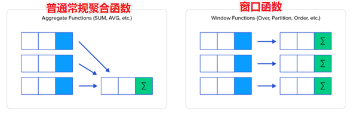

为了更加直观感受窗口函数，通过sum聚合函数进行普通常规聚合和窗口聚合，看效果。

```sql
----sum+group by普通常规聚合操作------------
select sum(salary) as total from employee group by dept;

----sum+窗口函数聚合操作------------
select id,name,deg,salary,dept,sum(salary) over(partition by dept) as total from employee;
```

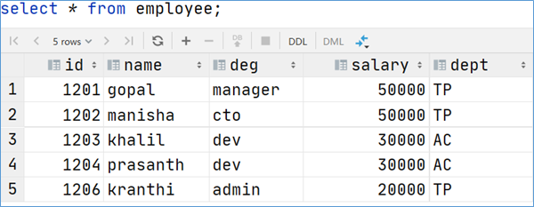

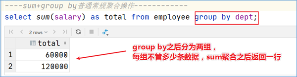

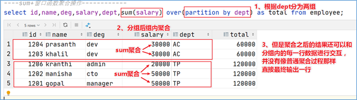


### 窗口函数语法

```sql
Function(arg1,..., argn) OVER ([PARTITION BY <...>] [ORDER BY <....>] [<window_expression>])

--其中Function(arg1,..., argn) 可以是下面分类中的任意一个
    --聚合函数：比如sum max avg等
    --排序函数：比如rank row_number等
    --分析函数：比如lead lag first_value等

--OVER [PARTITION BY <...>] 类似于group by 用于指定分组  每个分组你可以把它叫做窗口
--如果没有PARTITION BY 那么整张表的所有行就是一组

--[ORDER BY <....>]  用于指定每个分组内的数据排序规则 支持ASC、DESC

--[<window_expression>] 用于指定每个窗口中 操作的数据范围 默认是窗口中所有行
```

### 案例：网站用户页面浏览次数分析

在网站访问中，经常使用cookie来标识不同的用户身份，通过cookie可以追踪不同用户的页面访问情况，有下面两份数据：

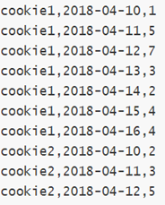

字段含义：cookieid 、访问时间、pv数（页面浏览数）

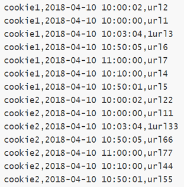

字段含义：cookieid、访问时间、访问页面url


在Hive中创建两张表表，把数据加载进去用于窗口分析。

```sql
---建表并且加载数据
create table website_pv_info(
   cookieid string,
   createtime string,   --day
   pv int
) row format delimited
fields terminated by ',';

create table website_url_info (
    cookieid string,
    createtime string,  --访问时间
    url string       --访问页面
) row format delimited
fields terminated by ',';


load data local inpath '/root/hivedata/website_pv_info.txt' into table website_pv_info;
load data local inpath '/root/hivedata/website_url_info.txt' into table website_url_info;

select * from website_pv_info;
select * from website_url_info;
```

### 窗口聚合函数

从Hive v2.2.0开始，支持DISTINCT与窗口函数中的聚合函数一起使用。以sum（）函数为例，其他聚合函数使用类似。

```sql
-----窗口聚合函数的使用-----------
--1、求出每个用户总pv数  sum+group by普通常规聚合操作
select cookieid,sum(pv) as total_pv from website_pv_info group by cookieid;

--2、sum+窗口函数 总共有四种用法 注意是整体聚合 还是累积聚合
--sum(...) over( )对表所有行求和
--sum(...) over( order by ... ) 连续累积求和
--sum(...) over( partition by... ) 同组内所有行求和
--sum(...) over( partition by... order by ... ) 在每个分组内，连续累积求和

--需求：求出网站总的pv数 所有用户所有访问加起来
--sum(...) over( )对表所有行求和
select cookieid,createtime,pv,
       sum(pv) over() as total_pv
from website_pv_info;

--需求：求出每个用户总pv数
--sum(...) over( partition by... )，同组内所行求和
select cookieid,createtime,pv,
       sum(pv) over(partition by cookieid) as total_pv
from website_pv_info;

--需求：求出每个用户截止到当天，累积的总pv数
--sum(...) over( partition by... order by ... )，在每个分组内，连续累积求和
select cookieid,createtime,pv,
       sum(pv) over(partition by cookieid order by createtime) as current_total_pv
from website_pv_info;
```

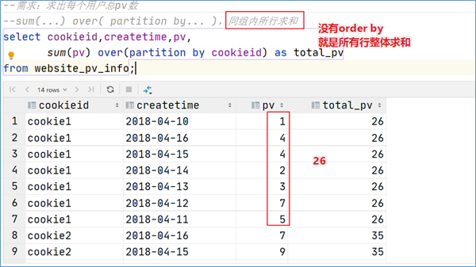

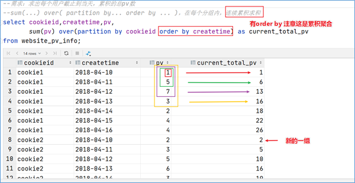

### 窗口表达式

在**sum(...) over( partition by... order by ... )语法完整**的情况下，进行的累积聚合操作，默认累积聚合行为是：**从第一行聚合到当前行**。Window expression窗口表达式给我们提供了一种控制行范围的能力，比如向前2行，向后3行。


语法如下：

```sql
# 关键字是rows between，包括下面这几个选项
- preceding：往前
- following：往后
- current row：当前行
- unbounded：边界
- unbounded preceding 表示从前面的起点
- unbounded following：表示到后面的终点
```

```sql
---窗口表达式
--第一行到当前行
select cookieid,createtime,pv,
       sum(pv) over(partition by cookieid order by createtime rows between unbounded preceding and current row) as pv2
from website_pv_info;

--向前3行至当前行
select cookieid,createtime,pv,
       sum(pv) over(partition by cookieid order by createtime rows between 3 preceding and current row) as pv4
from website_pv_info;

--向前3行 向后1行
select cookieid,createtime,pv,
       sum(pv) over(partition by cookieid order by createtime rows between 3 preceding and 1 following) as pv5
from website_pv_info;

--当前行至最后一行
select cookieid,createtime,pv,
       sum(pv) over(partition by cookieid order by createtime rows between current row and unbounded following) as pv6
from website_pv_info;

--第一行到最后一行 也就是分组内的所有行
select cookieid,createtime,pv,
       sum(pv) over(partition by cookieid order by createtime rows between unbounded preceding  and unbounded following) as pv6
from website_pv_info;
```

### 窗口排序函数

窗口排序函数用于给每个分组内的数据打上排序的标号。注意窗口排序函数不支持窗口表达式。总共有4个函数需要掌握：


**row_number**：在每个分组中，为每行分配一个从1开始的唯一序列号，递增，不考虑重复；


**rank**: 在每个分组中，为每行分配一个从1开始的序列号，考虑重复，挤占后续位置；


**dense_rank**: 在每个分组中，为每行分配一个从1开始的序列号，考虑重复，不挤占后续位置；

```sql
-----窗口排序函数
SELECT
    cookieid,
    createtime,
    pv,
    RANK() OVER(PARTITION BY cookieid ORDER BY pv desc) AS rn1,
    DENSE_RANK() OVER(PARTITION BY cookieid ORDER BY pv desc) AS rn2,
    ROW_NUMBER() OVER(PARTITION BY cookieid ORDER BY pv DESC) AS rn3
FROM website_pv_info
WHERE cookieid = 'cookie1';
```

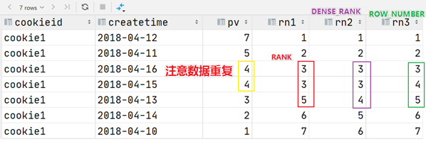

三个函数用于分组TopN的场景非常适合。

```sql
--需求：找出每个用户访问pv最多的Top3 重复并列的不考虑
SELECT * from
(SELECT
    cookieid,
    createtime,
    pv,
    ROW_NUMBER() OVER(PARTITION BY cookieid ORDER BY pv DESC) AS seq
FROM website_pv_info) tmp where tmp.seq <4;
```

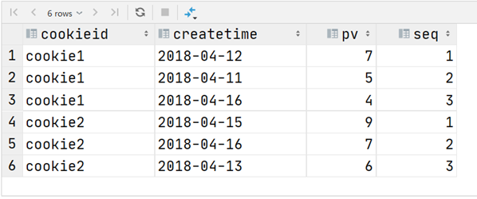


还有一个函数，**叫做ntile函数**，**其功能为：将每个分组内的数据分为指定的若干个桶里（分为若干个部分），并且为每一个桶分配一个桶编号。**如果不能平均分配，则优先分配较小编号的桶，并且各个桶中能放的行数最多相差1。有时会有这样的需求:如果数据排序后分为三部分，业务人员只关心其中的一部分，如何将这中间的三分之一数据拿出来呢?NTILE函数即可以满足。

```sql
--把每个分组内的数据分为3桶
SELECT
    cookieid,
    createtime,
    pv,
    NTILE(3) OVER(PARTITION BY cookieid ORDER BY createtime) AS rn2
FROM website_pv_info
ORDER BY cookieid,createtime;
```

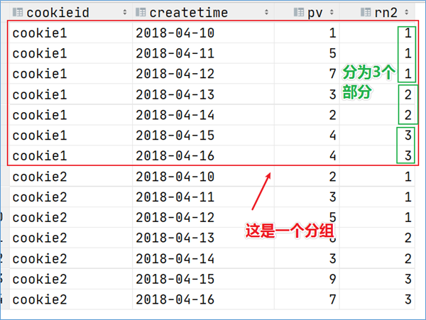

```sql
--需求：统计每个用户pv数最多的前3分之1天。
--理解：将数据根据cookieid分 根据pv倒序排序 排序之后分为3个部分 取第一部分
SELECT * from
(SELECT
     cookieid,
     createtime,
     pv,
     NTILE(3) OVER(PARTITION BY cookieid ORDER BY pv DESC) AS rn
 FROM website_pv_info) tmp where rn =1;
```

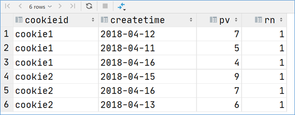

### 窗口分析函数

**LAG(col,n,DEFAULT) 用于统计窗口内往上第n行值：**第一个参数为列名，第二个参数为往上第n行（可选，默认为1），第三个参数为默认值（当往上第n行为NULL时候，取默认值，如不指定，则为NULL）；


**LEAD(col,n,DEFAULT) 用于统计窗口内往下第n行值：**第一个参数为列名，第二个参数为往下第n行（可选，默认为1），第三个参数为默认值（当往下第n行为NULL时候，取默认值，如不指定，则为NULL）；


**FIRST_VALUE 取分组内排序后，截止到当前行，第一个值；**


**LAST_VALUE 取分组内排序后，截止到当前行，最后一个值；**


```sql
-----------窗口分析函数----------
--LAG
SELECT cookieid,
       createtime,
       url,
       ROW_NUMBER() OVER(PARTITION BY cookieid ORDER BY createtime) AS rn,
       LAG(createtime,1,'1970-01-01 00:00:00') OVER(PARTITION BY cookieid ORDER BY createtime) AS last_1_time,
       LAG(createtime,2) OVER(PARTITION BY cookieid ORDER BY createtime) AS last_2_time
FROM website_url_info;


--LEAD
SELECT cookieid,
       createtime,
       url,
       ROW_NUMBER() OVER(PARTITION BY cookieid ORDER BY createtime) AS rn,
       LEAD(createtime,1,'1970-01-01 00:00:00') OVER(PARTITION BY cookieid ORDER BY createtime) AS next_1_time,
       LEAD(createtime,2) OVER(PARTITION BY cookieid ORDER BY createtime) AS next_2_time
FROM website_url_info;

--FIRST_VALUE
SELECT cookieid,
       createtime,
       url,
       ROW_NUMBER() OVER(PARTITION BY cookieid ORDER BY createtime) AS rn,
       FIRST_VALUE(url) OVER(PARTITION BY cookieid ORDER BY createtime) AS first1
FROM website_url_info;

--LAST_VALUE
SELECT cookieid,
       createtime,
       url,
       ROW_NUMBER() OVER(PARTITION BY cookieid ORDER BY createtime) AS rn,
       LAST_VALUE(url) OVER(PARTITION BY cookieid ORDER BY createtime) AS last1
FROM website_url_info;
```

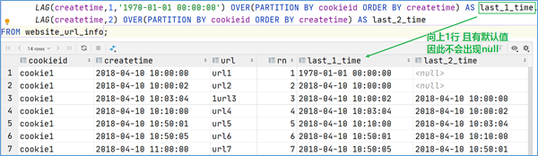


### Sampling 抽样函数

#### 抽样概述

当数据量过大时，可能需要查找数据子集以加快数据处理速度分析。 这就是**抽样、采样，**一种用于识别和分析数据中的子集的技术，以发现整个数据集中的模式和趋势。

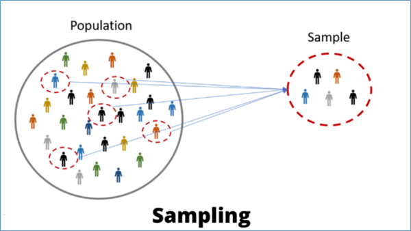


在HQL中，可以通过三种方式采样数据：随机采样，存储桶表采样和块采样。


#### Random随机抽样

随机抽样使用rand（）函数和LIMIT关键字来获取数据。 使用了DISTRIBUTE和SORT关键字，可以确保数据也随机分布在mapper和reducer之间，使得底层执行有效率。 ORDER BY 和rand（）语句也可以达到相同的目的，但是表现不好。因为ORDER BY是全局排序，只会启动运行一个Reducer。

```sql
--数据表
select * from student;

--需求：随机抽取2个学生的情况进行查看
SELECT * FROM student
DISTRIBUTE BY rand() SORT BY rand() LIMIT 2;

--使用order by+rand也可以实现同样的效果 但是效率不高
SELECT * FROM student
    ORDER BY rand() LIMIT 2;
```

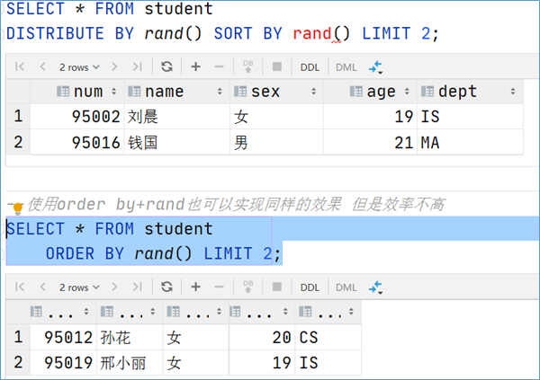


#### Block块抽样

Block块采样允许select随机获取n行数据，即数据大小或n个字节的数据。 采样粒度是HDFS块大小。

```sql
---block抽样
--根据行数抽样
SELECT * FROM student TABLESAMPLE(1 ROWS);

--根据数据大小百分比抽样
SELECT * FROM student TABLESAMPLE(50 PERCENT);

--根据数据大小抽样
--支持数据单位 b/B, k/K, m/M, g/G
SELECT * FROM student TABLESAMPLE(1k);
```

#### Bucket table分桶表抽样

这是一种特殊的采样方法，针对分桶表进行了优化。

```sql
---bucket table抽样
--根据整行数据进行抽样
SELECT * FROM t_usa_covid19_bucket TABLESAMPLE(BUCKET 1 OUT OF 2 ON rand());

--根据分桶字段进行抽样 效率更高
describe formatted t_usa_covid19_bucket;
SELECT * FROM t_usa_covid19_bucket TABLESAMPLE(BUCKET 1 OUT OF 2 ON state);
```

