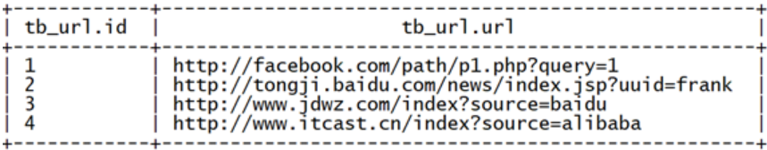
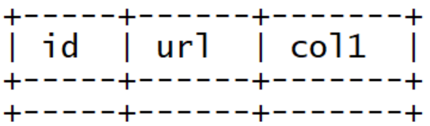
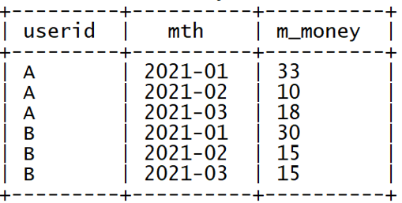

Hive函数应用案例

## 多字节分隔符

### Hive中的分隔符

Hive中默认使用**单字节分隔符**来加载文本数据，例如逗号、制表符、空格等等，默认的分隔符为\001。根据不同文件的不同分隔符，可以通过在创建表时使用 **row format delimited fields terminated by ‘单字节分隔符’** 来指定文件中的分割符，确保正确将表中的每一列与文件中的每一列实现一一对应的关系。


### 特殊数据

 **情况一：每一行数据的分隔符是多字节分隔符，例如：”||”、“--”等**


 **上图中每列的分隔符为||，为多字节分隔符**


**情况二：数据的字段中包含了分隔符**


上图中每列的分隔符为空格，但是数据中包含了分割符，**时间字段中也有空格**

```sql
192.168.88.134 [08/Nov/2020:10:44:32 +0800] "GET / HTTP/1.1" 404 951
```

## 问题与需求

### 问题

基于上述的两种特殊数据，我们如果使用正常的加载数据的方式将数据加载到表中，就会出以下两种错误：

**情况一：加载数据的分隔符为多字节分隔符**

创建表:

```sql
--如果表已存在就删除表
drop table if exists singer;
--创建表
create table singer(
 id string,--歌手id
 name string,--歌手名称
 country string,--国家
 province string,--省份
 gender string,--性别
 works string--作品
)
--指定列的分隔符为||
row format delimited fields terminated by '||';
```

加载数据:

```sql
load data local inpath '/export/data/test01.txt' into table singer;
```

查看结果:

```sql
select * from singer;
```

问题:

数据发生了错位，没有正确的加载每一列的数据


原因:

Hive中默认只支持单字节分隔符，无法识别多字节分隔符


**情况二：数据中包含了分隔符**

创建表

```sql
--如果表存在，就删除表
drop table if exists apachelog;
--创建表
create table apachelog(
 ip string,      --IP地址
 stime string,    --时间
 mothed string,  --请求方式
 url string,     --请求地址
 policy string,  --请求协议
 stat string,    --请求状态
 body string     --字节大小
)
--指定列的分隔符为空格
row format delimited fields terminated by ' ';
```

加载数据:

```sql
load data local inpath '/export/data/apache_web_access.log' into table apachelog;
```

查看结果:

```sql
select * from apachelog;
```

问题:

时间字段被切分成了两个字段，后面所有的字段出现了错位


原因:

时间数据中包含了分隔符，导致Hive认为这是两个字段，但实际业务需求中，为一个字段


### 需求

基于上面两种情况的测试发现，当数据中出现了多字节分隔符或者数据中的某个字段包含了分隔符，就会导致数据加载错位的问题。基于出现的问题，我们需要通过特殊的方法来解决该问题，即使当数据中出现多字节分隔符等情况时，Hive也能正确的加载数据，实现列与数据的一一对应。

### 解决方案一：替换分隔符

#### 方案概述

面对情况一，如果数据中的分隔符是多字节分隔符，可以使用程序提前将数据中的多字节分隔符替换为单字节分隔符，然后使用Hive加载，就可以实现正确加载对应的数据。

例如：原始数据中的分隔符为“||”


#### 程序开发

**可以在ETL阶段通过一个MapReduce程序，将“||”替换为单字节的分隔符“|”，示例程序如下：**

```java
import org.apache.hadoop.conf.Configuration;
import org.apache.hadoop.conf.Configured;
import org.apache.hadoop.fs.Path;
import org.apache.hadoop.io.LongWritable;
import org.apache.hadoop.io.NullWritable;
import org.apache.hadoop.io.Text;
import org.apache.hadoop.mapreduce.Job;
import org.apache.hadoop.mapreduce.Mapper;
import org.apache.hadoop.mapreduce.lib.input.FileInputFormat;
import org.apache.hadoop.mapreduce.lib.input.TextInputFormat;
import org.apache.hadoop.mapreduce.lib.output.TextOutputFormat;
import org.apache.hadoop.util.Tool;
import org.apache.hadoop.util.ToolRunner;

import java.io.IOException;

/**
 * @ClassName ChangeSplitCharMR
 * @Description TODO MapReduce实现将多字节分隔符转换为单字节符
 * @Create By  itcast
 */
public class ChangeSplitCharMR extends Configured implements Tool {
    public int run(String[] arg) throws Exception {
        /**
         * 构建Job
         */
        Job job = Job.getInstance(this.getConf(),"changeSplit");
        job.setJarByClass(ChangeSplitCharMR.class);

        /**
         * 配置Job
         */
        //input：读取需要转换的文件
        job.setInputFormatClass(TextInputFormat.class);
        Path inputPath = new Path("datas/split/test01.txt");
        FileInputFormat.setInputPaths(job,inputPath);

        //map：调用Mapper
        job.setMapperClass(ChangeSplitMapper.class);
        job.setMapOutputKeyClass(Text.class);
        job.setMapOutputValueClass(NullWritable.class);

        //reduce：不需要Reduce过程
        job.setNumReduceTasks(0);

        //output
        job.setOutputFormatClass(TextOutputFormat.class);
        Path outputPath = new Path("datas/output/changeSplit");
        TextOutputFormat.setOutputPath(job,outputPath);

        /**
         * 提交Job
         */
        return job.waitForCompletion(true) ? 0 : -1;
    }

    //程序入口
    public static void main(String[] args) throws Exception {
        //调用run
        Configuration conf = new Configuration();
        int status = ToolRunner.run(conf, new ChangeSplitCharMR(), args);
        System.exit(status);
    }

    public static class ChangeSplitMapper extends Mapper<LongWritable,Text,Text,NullWritable>{
        //定义输出的Key
        private Text outputKey = new Text();
        //定义输出的Value
        private NullWritable outputValue = NullWritable.get();

        @Override
        protected void map(LongWritable key, Text value, Context context) throws IOException, InterruptedException {
            //获取每条数据
            String line = value.toString();
            //将里面的||转换为|
            String newLine = line.replaceAll("\\|\\|", "|");
            //替换后的内容作为Key
            this.outputKey.set(newLine);
            //输出结果
            context.write(this.outputKey,this.outputValue);
        }
    }
}
```

**程序执行结果如下：**


#### 重新建表加载数据

重新创建Hive表:

```sql
--如果表已存在就删除表
drop table if exists singer;
--创建表
create table singer(
 id string,--歌手id
 name string,--歌手名称
 country string,--国家
 province string,--省份
 gender string,--性别
 works string--作品
)
--指定列的分隔符为||
row format delimited fields terminated by '|';
```

在Hive中重新加载数据：

```sql
load data local inpath '/export/data/part-m-00000' into table singer;
```

查看结果:


#### 总结

在ETL阶段可以直接对数据进行分隔符的替换，通过替换分隔符将多字节分隔符更改为单字节分隔符，就可以解决数据加载的问题，但是这种方式有对应的优缺点，并不是所有的场景适用于该方法。


**优点**：实现方式较为简单，基于字符串替换即可


**缺点**：无法满足情况2的需求


### 解决方案二：RegexSerDe正则加载

#### 方案概述

面对情况一和情况二的问题，Hive中提供了一种特殊的方式来解决，Hive提供了一种特殊的Serde来加载特殊数据的问题，使用正则匹配来加载数据，匹配每一列的数据。


官网地址：[https://cwiki.apache.org/confluence/display/Hive/GettingStarted#GettingStarted-ApacheWeblogData](https://cwiki.apache.org/confluence/display/Hive/GettingStarted%23GettingStarted-ApacheWeblogData)


#### 什么是SerDe?

**Hive的SerDe提供了序列化和反序列化两个功能**，SerDe是英文Serialize和Deserilize的组合缩写，用于实现将Hive中的对象进行序列化和将数据进行反序列化。


**Serialize就是序列化**，用于将Hive中使用的java object转换成能写入hdfs的字节序列，或者其他系统能识别的流文件。Hive中的insert语句用于将数据写入HDFS，所以就会调用序列化实现。Hive中的调用过程如下：


**Deserilize就是反序列化**，用于将字符串或者二进制数据流转换成Hive能识别的java object对象。所有Hive中的Select语句在查询数据时，需要将HDFS中的数据解析为Hive中对象，就需要进行反序列化。Hive可以方便的将数据加载到表中而不需要对数据进行转换，这样在处理海量数据时可以节省大量的时间。Hive中的调用过程如下：


#### Hive中包含的SerDe

官网地址：https://cwiki.apache.org/confluence/display/Hive/SerDe


Hive中默认提供了多种SerDe用于解析和加载不同类型的数据文件，常用的有**ORCSerde 、RegexSerde、JsonSerDe**等。

#### RegexSerDe的功能

RegexSerde是Hive中专门为了满足复杂数据场景所提供的正则加载和解析数据的接口，使用RegexSerde可以指定正则表达式加载数据，根据正则表达式匹配每一列数据。上述过程中遇到的情况一和情况二的问题，都可以通过RegexSerDe使用正则表达式来加载实现。

#### RegexSerDe解决多字节分隔符

分析数据格式，构建正则表达式:

原始数据格式:

```sql
01||周杰伦||中国||台湾||男||七里香
```

正则表达式定义每一列:

```sql
([0-9]*)\\|\\|(.*)\\|\\|(.*)\\|\\|(.*)\\|\\|(.*)\\|\\|(.*)
```

正则校验:


基于正则表达式，使用RegexSerde建表:

```sql
--如果表已存在就删除表
drop table if exists singer;
--创建表
create table singer(
 id string,--歌手id
 name string,--歌手名称
 country string,--国家
 province string,--省份
 gender string,--性别
 works string--作品
)
--指定使用RegexSerde加载数据
ROW FORMAT SERDE 'org.apache.hadoop.hive.serde2.RegexSerDe'
--指定正则表达式
WITH SERDEPROPERTIES (
  "input.regex" = "([0-9]*)\\|\\|([^}]*)\\|\\|([^}]*)\\|\\|([^}]*)\\|\\|([^}]*)\\|\\|([^}]*)"
);
```

加载数据:

```sql
load data local inpath '/export/data/test01.txt' into table singer;
```

查看数据结果:

```sql
select * from singer;
```


**每一列的数据都被正常的加载，没有错位**

#### RegexSerDe解决数据中包含分割符

分析数据格式，构建正则表达式:

原始数据格式:

```sql
192.168.88.100 [08/Nov/2020:10:44:33 +0800] "GET /hpsk_sdk/index.html HTTP/1.1" 200 328
```

正则表达式定义每一列:

```sql
([^ ]*) ([^}]*) ([^ ]*) ([^ ]*) ([^ ]*) ([0-9]*) ([^ ]*)
```

正则校验:


基于正则表达式，使用RegexSerde建表:

```sql
--如果表存在，就删除表
drop table if exists apachelog;
--创建表
create table apachelog(
 ip string,      --IP地址
 stime string,    --时间
 mothed string,  --请求方式
 url string,     --请求地址
 policy string,  --请求协议
 stat string,    --请求状态
 body string     --字节大小
)
--指定使用RegexSerde加载数据
ROW FORMAT SERDE 'org.apache.hadoop.hive.serde2.RegexSerDe'
--指定正则表达式
WITH SERDEPROPERTIES (
  "input.regex" = "([^ ]*) ([^}]*) ([^ ]*) ([^ ]*) ([^ ]*) ([0-9]*) ([^ ]*)"
);
```

加载数据:

```sql
load data local inpath '/export/data/apache_web_access.log' into table apachelog;
```

查看数据结果:

```sql
select ip,stime,url,stat,body from apachelog;
```


时间字段不再被分割为两个字段，整体作为一个字段被加载

#### 总结

RegexSerde使用简单，对于各种复杂的数据场景，都可以通过正则定义匹配每行中的每个字段，基本上可以满足大多数场景的需求，工作中推荐使用该方式来实现对于复杂数据的加载。


### 解决方案三：自定义InputFormat

##### 方案概述

Hive中也允许使用自定义InputFormat来解决以上问题，通过在自定义InputFormat，来自定义解析逻辑实现读取每一行的数据。

##### 自定义InputFormat

自定义InputFormat继承自TextInputFormat，读取数据时将每条数据中的”||”全部替换成“|”

自定义InputFormat：

```java
import org.apache.hadoop.io.LongWritable;
import org.apache.hadoop.io.Text;
import org.apache.hadoop.mapred.*;

import java.io.IOException;

/**
 * @ClassName UserInputFormat
 * @Description TODO 用于实现自定义InputFormat，读取每行数据
 * @Create By     Itcast
 */

public class UserInputFormat extends TextInputFormat {
    @Override
    public RecordReader<LongWritable, Text> getRecordReader(InputSplit genericSplit, JobConf job,Reporter reporter) throws IOException {
        reporter.setStatus(genericSplit.toString());
        UserRecordReader reader = new UserRecordReader(job,(FileSplit)genericSplit);
        return reader;
    }
}
```

##### 自定义RecordReader

```java
import org.apache.commons.logging.Log;
import org.apache.commons.logging.LogFactory;
import org.apache.hadoop.conf.Configuration;
import org.apache.hadoop.fs.FSDataInputStream;
import org.apache.hadoop.fs.FileSystem;
import org.apache.hadoop.fs.Path;
import org.apache.hadoop.fs.Seekable;
import org.apache.hadoop.io.LongWritable;
import org.apache.hadoop.io.Text;
import org.apache.hadoop.io.compress.*;
import org.apache.hadoop.mapred.FileSplit;
import org.apache.hadoop.mapred.LineRecordReader;
import org.apache.hadoop.mapred.RecordReader;

import java.io.IOException;
import java.io.InputStream;

/**
 * @ClassName UserRecordReader
 * @Description TODO 用于自定义读取器，在自定义InputFormat中使用，将读取到的每行数据中的||替换为|
 * @Create By     Itcast
 */


public class UserRecordReader implements RecordReader<LongWritable, Text> {
    private static final Log LOG = LogFactory.getLog(LineRecordReader.class.getName());
    int maxLineLength;
    private CompressionCodecFactory compressionCodecs = null;
    private long start;
    private long pos;
    private long end;
    private LineReader in;
    private Seekable filePosition;
    private CompressionCodec codec;
    private Decompressor decompressor;

    public UserRecordReader(Configuration job, FileSplit split) throws IOException {
        this.maxLineLength = job.getInt("mapred.linerecordreader.maxlength", Integer.MAX_VALUE);
        start = split.getStart();
        end = start + split.getLength();
        final Path file = split.getPath();
        compressionCodecs = new CompressionCodecFactory(job);
        codec = compressionCodecs.getCodec(file);
        FileSystem fs = file.getFileSystem(job);
        FSDataInputStream fileIn = fs.open(split.getPath());
        if (isCompressedInput()) {
            decompressor = CodecPool.getDecompressor(codec);
            if (codec instanceof SplittableCompressionCodec) {
                final SplitCompressionInputStream cIn = ((SplittableCompressionCodec) codec)
                        .createInputStream(fileIn, decompressor, start, end,
                                SplittableCompressionCodec.READ_MODE.BYBLOCK);
                in = new LineReader(cIn, job);
                start = cIn.getAdjustedStart();
                end = cIn.getAdjustedEnd();
                filePosition = cIn; // take pos from compressed stream
            } else {
                in = new LineReader(codec.createInputStream(fileIn, decompressor), job);
                filePosition = fileIn;
            }
        } else {
            fileIn.seek(start);
            in = new LineReader(fileIn, job);
            filePosition = fileIn;
        }
        if (start != 0) {
            start += in.readLine(new Text(), 0, maxBytesToConsume(start));
        }
        this.pos = start;
    }

    private boolean isCompressedInput() {
        return (codec != null);
    }

    private int maxBytesToConsume(long pos) {
        return isCompressedInput() ? Integer.MAX_VALUE : (int) Math.min(Integer.MAX_VALUE, end - pos);
    }

    private long getFilePosition() throws IOException {
        long retVal;
        if (isCompressedInput() && null != filePosition) {
            retVal = filePosition.getPos();
        } else {
            retVal = pos;
        }
        return retVal;
    }

    public LongWritable createKey() {
        return new LongWritable();
    }

    public Text createValue() {
        return new Text();
    }

    /**
     * Read a line.
     */
    public synchronized boolean next(LongWritable key, Text value) throws IOException {
        while (getFilePosition() <= end) {
            key.set(pos);
            int newSize = in.readLine(value, maxLineLength, Math.max(maxBytesToConsume(pos), maxLineLength));
            String str = value.toString().replaceAll("\\|\\|", "\\|");
            value.set(str);
            pos += newSize;
            if (newSize == 0) {
                return false;
            }
            if (newSize < maxLineLength) {
                return true;
            }
            LOG.info("Skipped line of size " + newSize + " at pos " + (pos - newSize));
        }
        return false;
    }

    public float getProgress() throws IOException {
        if (start == end) {
            return 0.0f;
        } else {
            return Math.min(1.0f, (getFilePosition() - start) / (float) (end - start));
        }
    }

    public synchronized long getPos() throws IOException {
        return pos;
    }

    public synchronized void close() throws IOException {
        try {
            if (in != null) {
                in.close();
            }
        } finally {
            if (decompressor != null) {
                CodecPool.returnDecompressor(decompressor);
            }
        }
    }

    public static class LineReader extends org.apache.hadoop.util.LineReader {
        LineReader(InputStream in) {
            super(in);
        }

        LineReader(InputStream in, int bufferSize) {
            super(in, bufferSize);
        }

        public LineReader(InputStream in, Configuration conf) throws IOException {
            super(in, conf);
        }
    }
}
```

##### 基于自定义Input创建表

将开发好的InputFormat打成jar包，放入Hive的lib目录中


在Hive中，将jar包添加到环境变量中

```sql
add jar /export/server/hive-3.1.2-bin/lib/HiveUserInputFormat.jar;
```

该方法可以实现临时添加，如果希望永久生效，重启Hive即可

创建表，指定自定义的InputFormat读取数据:

```sql
--如果表已存在就删除表
drop table if exists singer;
--创建表
create table singer(
 id string,--歌手id
 name string,--歌手名称
 country string,--国家
 province string,--省份
 gender string,--性别
 works string--作品
)
--指定使用分隔符为|
row format delimited fields terminated by '|'
stored as 
--指定使用自定义的类实现解析
inputformat 'bigdata.itcast.cn.hive.mr.UserInputFormat' 
outputformat 'org.apache.hadoop.hive.ql.io.HiveIgnoreKeyTextOutputFormat';
```

加载数据:

```sql
load data local inpath '/export/data/test01.txt' into table singer;
```

查看结果:

```sql
select * from singer;
```


数据正常匹配，没有出现错位。


##### 总结

当数据文件中出现多字节分隔符或者数据中包含了分隔符时，会导致数据加载与实际表的字段不匹配的问题，基于这个问题提供了三种方案：替换分隔符、正则加载及自定义InputFormat来实现，其中替换分隔符无法解决数据中存在分隔符的问题，自定义InputFormat的开发成本较高，所以整体推荐使用正则加载的方式来实现对于特殊数据的处理。


## URL解析函数及侧视图

### URL的基本组成

在对URL进行解析时，先了解URL的基本组成部分，再根据实际的需求从URL中获取对应的部分，例如一条URL由以下几个部分组成：


**PROTOCOL：协议类型**

通信协议类型，一般也叫作Schema，常见的有http、https等；


**HOST：域名**

一般为服务器的域名主机名或ip地址


**PATH：访问路径**

访问路径目录，由“/”隔开的字符串，表示的是主机上的目录或文件地址


**QUERY：参数数据**

查询参数，此项为可选项，可以给动态网页传递参数，用“&”隔开，每个参数的名和值用“=”隔开


### Hive中的URL解析函数

### 数据准备

Hive中为了实现对URL的解析，专门提供了解析URL的函数**parse_url**和**parse_url_tuple**，在**show functions**中可以看到对应函数


准备数据:

```sh
vim /export/data/url.txt
```

添加以下数据内容:

```sql
1	http://facebook.com/path/p1.php?query=1
2	http://tongji.baidu.com/news/index.jsp?uuid=frank
3	http://www.jdwz.com/index?source=baidu
4	http://www.itcast.cn/index?source=alibaba
```

创建数据库:

```sql
/*创建数据库*/
create database if not exists db_function;
/*切换数据库*/
use db_function;
```

创建表:

```sql
/*创建数据表*/
create table tb_url(
   id int,
   url string
) row format delimited fields terminated by '\t';
```

加载数据:

```sql
/*加载数据*/
load data local inpath '/export/data/url.txt' into table tb_url;
```

查看数据:

```sql
/*查询数据*/
select * from tb_url;
```




### 需求

基于当前的数据，实现对URL进行分析，从URL中获取每个ID对应HOST、PATH以及QUERY，最终实现效果如下：


### parse_url

功能:

parse_url函数是Hive中提供的最基本的url解析函数，可以根据指定的参数，从URL解析出对应的参数值进行返回，函数为普通的一对一函数类型。


语法:

```sql
parse_url(url, partToExtract[, key]) - extracts a part from a URL
  Parts: HOST, PATH, QUERY, REF, PROTOCOL, AUTHORITY, FILE, USERINFO key 
```

parse_url在使用时需要指定两个参数

第一个参数：url：指定要解析的URL

第二个参数：key：指定要解析的内容


示例:

```sql
SELECT parse_url('http://facebook.com/path/p1.php?query=1', 'HOST') FROM src LIMIT 1;
'facebook.com'

SELECT parse_url('http://facebook.com/path/p1.php?query=1', 'QUERY') FROM src LIMIT 1;
'query=1'

SELECT parse_url('http://facebook.com/path/p1.php?query=1', 'QUERY', 'query') FROM src LIMIT 1;
'1'  
```

测试:

查询tb_url中每个url的HOST:

```sql
select id,url,parse_url(url,"HOST") as host from tb_url;
```


查询tb_url中每个url的PATH:

```sql
select id,url,parse_url(url,"PATH") as path from tb_url;
```


查询tb_url中每个url的QUERY:

```sql
select id,url,parse_url(url,"QUERY") as query from tb_url;
```


实现需求:

```sql
select
   id,
   parse_url(url,"HOST") as host,
   parse_url(url,"PATH") as path,
   parse_url(url,"QUERY") as query
from
  tb_url;
```


### 问题

使用parse_url函数每次只能解析一个参数，导致需要经过多个函数调用才能构建多列，开发角度较为麻烦，实现过程性能也相对较差，需要对同一列做多次计算处理，我们希望能实现调用一次函数，就可以将多个参数进行解析，得到多列结果。


### parse_url_tuple

功能:

parse_url_tuple函数是Hive中提供的基于parse_url的url解析函数，可以通过一次指定多个参数，从URL解析出多个参数的值进行返回多列，函数为特殊的一对多函数类型，即通常所说的UDTF函数类型。


语法:

```sql
parse_url_tuple(url, partname1, partname2, ..., partnameN) - extracts N (N>=1) parts from a URL.
It takes a URL and one or multiple partnames, and returns a tuple. All the input parameters and output column types are string.
Partname: HOST, PATH, QUERY, REF, PROTOCOL, AUTHORITY, FILE, USERINFO, QUERY:<KEY_NAME>
```

parse_url在使用时可以指定多个参数

第一个参数：url：指定要解析的URL

第二个参数：key1：指定要解析的内容1

……

第N个参数：keyN：指定要解析的内容N


示例:

```sql
SELECT b.* FROM src LATERAL VIEW parse_url_tuple(fullurl, 'HOST', 'PATH', 'QUERY', 'QUERY:id') b as host, path, query, query_id LIMIT 1;

SELECT parse_url_tuple(a.fullurl, 'HOST', 'PATH', 'QUERY', 'REF', 'PROTOCOL', 'FILE',  'AUTHORITY', 'USERINFO', 'QUERY:k1') as (ho, pa, qu, re, pr, fi, au, us, qk1) from src a; 
```

测试:

查询tb_url中每个url的HOST、PATH:

```sql
select parse_url_tuple(url,"HOST","PATH") as (host,path) from tb_url;
```


查询tb_url中每个url的PROTOCOL、HOST、QUERY:

```sql
select parse_url_tuple(url,"PROTOCOL","HOST","PATH") as (protocol,host,path) from tb_url;
```


实现需求:

```sql
select parse_url_tuple(url,"HOST","PATH","QUERY") as (host,path,query) from tb_url;
```


问题:

当前实现的过程中，通过parse_url_tuple实现了通过调用一个函数，就可以从URL中解析得到多个参数的值，但是将原表的字段放在一起查询时，会出现以下问题：

```sql
select 
id,
parse_url_tuple(url,"HOST","PATH","QUERY") as (host,path,query) 
from tb_url;

0: jdbc:hive2://node1:10000> select 
. . . . . . . . . . . . . .> id,
. . . . . . . . . . . . . .> parse_url_tuple(url,"HOST","PATH","QUERY") as (host,path,query) 
. . . . . . . . . . . . . .> from tb_url;
Error: Error while compiling statement: FAILED: SemanticException 3:52 AS clause has an invalid number of aliases. Error encountered near token 'path' (state=42000,code=40000)
```

## UDTF函数的问题

Hive中的一对多的UDTF函数可以实现高效的数据转换，但是也存在着一些使用中的问题，UDTF函数对于很多场景下有使用限制，例如：**select时不能包含其他字段、不能嵌套调用、不能与group by等放在一起调用**等等。

UDTF函数的调用方式，主要有以下两种方式：


**方式一：直接在select后单独使用**


**方式二：与Lateral View放在一起使用**

## Lateral View侧视图

### 功能

Lateral View是一种特殊的语法，主要用于搭配UDTF类型功能的函数一起使用，用于解决UDTF函数的一些查询限制的问题。侧视图的原理是将UDTF的结果构建成一个类似于视图的表，然后将原表中的每一行和UDTF函数输出的每一行进行连接，生成一张新的虚拟表。这样就避免了UDTF的使用限制问题。使用lateral view时也可以对UDTF产生的记录设置字段名称，产生的字段可以用于group by、order by 、limit等语句中，不需要再单独嵌套一层子查询。一般只要使用UDTF，就会固定搭配lateral view使用。


官方链接：https://cwiki.apache.org/confluence/display/Hive/LanguageManual+LateralView

### 语法

```sql
lateralView: LATERAL VIEW udtf(expression) tableAlias AS columnAlias (',' columnAlias)*
fromClause: FROM baseTable (lateralView)*
```

基本语法如下:

```sql
select …… from tabelA lateral view UDTF(xxx) 别名 as col1,col2,col3……
```

### 测试

**单个lateral view调用**，实现上述需求中的应用:

```sql
select
  a.id as id,
  b.host as host,
  b.path as path,
  b.query as query
from tb_url a
lateral view parse_url_tuple(url,"HOST","PATH","QUERY") b as host,path,query;
```


**多lateral view调用**

```sql
select
  a.id as id,
  b.host as host,
  b.path as path,
  c.protocol as protocol,
  c.query as query
from tb_url a
lateral view parse_url_tuple(url,"HOST","PATH") b as host,path
lateral view parse_url_tuple(url,"PROTOCOL","QUERY") c as protocol,query;
```


### Outer Lateral View

如果UDTF不产生数据时，这时侧视图与原表关联的结果将为空，如下图所示：

```sql
select
  id,
  url,
  col1
from tb_url
lateral view explode(array()) et as col1;
```



**如果加上outer关键字以后，就会保留原表数据，类似于outer join**

```sql
select
  id,
  url,
  col1
from tb_url
lateral view outer explode(array()) et as col1;
```


## 行列转换应用与实现

### 行转列：多行转多列

#### 需求

原始数据表:


目标结果表:


#### case when判断

功能:

用于实现对数据的判断，根据条件，不同的情况返回不同的结果，类似于Java中的switch case 功能


语法:

语法一:

```sql
CASE 
WHEN 条件1 THEN VALUE1
WHEN 条件2 THEN VALUE2
……
WHEN 条件N THEN VALUEN
ELSE 默认值
END
```

语法二:

```sql
CASE 列
WHEN V1 THEN VALUE1
WHEN V2 THEN VALUE2
……
WHEN VN THEN VALUEN
ELSE 默认值
END
```

测试:

语法一：当id < 2显示a，当id = 2 显示b ,其他的显示c:

```sql
select
  id,
  case
  when id < 2 then 'a'
  when id = 2 then 'b'
  else 'c'
  end as caseName
from tb_url;
```


语法二：当id =1 显示a，当id = 2 显示b ,其他的显示c

```sql
select
  id,
  case id
  when 1 then 'a'
  when 2 then 'b'
  else 'c'
  end as caseName
from tb_url;
```


#### 实现

创建原始数据表，加载数据

```sql
--切换数据库
use db_function;
--建表
create table row2col1(
   col1 string,
   col2 string,
   col3 int
) row format delimited fields terminated by '\t';
--加载数据到表中
load data local inpath '/export/data/r2c1.txt' into table row2col1;
```


SQL实现转换

```sql
select
  col1 as col1,
  max(case col2 when 'c' then col3 else 0 end) as c,
  max(case col2 when 'd' then col3 else 0 end) as d,
  max(case col2 when 'e' then col3 else 0 end) as e
from
  row2col1
group by
  col1;
```


### 行转列：多行转单列

#### 需求

原始数据表


目标数据表


#### concat

功能：用于实现字符串拼接，不可指定分隔符

语法

```sql
concat(element1,element2,element3……)
```

测试

```sql
select concat("it","cast","And","dsjprs");
+-----------------+
| itcastAndheima  |
+-----------------+
```

特点：如果任意一个元素为null，结果就为null

```sql
select concat("it","cast","And",null);
+-------+
| NULL  |
+-------+
```

#### concat_ws

功能：用于实现字符串拼接，可以指定分隔符

语法

```sql
concat_ws(SplitChar，element1，element2……)
```

测试

```sql
select concat_ws("-","dsjprs_null","And","dsjprs");
+-------------------+
| itcast-And-heima  |
+-------------------+
```

特点：任意一个元素不为null，结果就不为null

```sql
select concat_ws("-","dsjprs_null","And",null);
+-------------+
| dsjprs_null-And  |
+-------------+
```

#### collect_list

功能：用于将一列中的多行合并为一行，不进行去重

语法

```sql
collect_list（colName）
```

测试

```sql
select collect_list(col1) from row2col1;
+----------------------------+
| ["a","a","a","b","b","b"]  |
+----------------------------+
```

#### concat_set

功能：用于将一列中的多行合并为一行，并进行去重

语法

```sql
collect_set（colName）
```

测试

```sql
select collect_set(col1) from row2col1;
+------------+
| ["b","a"]  |
+------------+
```

#### 实现

创建原始数据表，加载数据

```sql
--切换数据库
use db_function;

--建表
create table row2col2(
   col1 string,
   col2 string,
   col3 int
)row format delimited fields terminated by '\t';

--加载数据到表中
load data local inpath '/export/data/r2c2.txt' into table row2col2;
```

SQL实现转换

```sql
select
  col1,
  col2,
  concat_ws(',', collect_list(cast(col3 as string))) as col3
from
  row2col2
group by
  col1, col2;
```


### 列转行：多列转多行

#### 需求

原始数据表


目标结果表


#### union

功能：将多个select语句结果合并为一个，且结果去重且排序

语法

```sql
select_statement 
UNION [DISTINCT] 
select_statement 
UNION [DISTINCT] 
select_statement ...
```

测试

```sql
select 'b','a','c' 
union 
select 'a','b','c' 
union  
select 'a','b','c';
```


#### union all

功能：将多个select语句结果合并为一个，且结果不去重不排序

语法

```sql
select_statement UNION ALL select_statement UNION ALL select_statement ...
```

测试

```sql
select 'b','a','c' 
union all 
select 'a','b','c' 
union all  
select 'a','b','c';
```


#### 实现

创建原始数据表，加载数据

```sql
--切换数据库
use db_function;

--创建表
create table col2row1
(
  col1 string,
  col2 int,
  col3 int,
  col4 int
) row format delimited fields terminated by '\t';

--加载数据
load data local inpath '/export/data/c2r1.txt'  into table col2row1;
```

SQL实现转换

```sql
select col1, 'c' as col2, col2 as col3 from col2row1
UNION ALL
select col1, 'd' as col2, col3 as col3 from col2row1
UNION ALL
select col1, 'e' as col2, col4 as col3 from col2row1;
```


### 列转行：单列转多行

#### 需求

原始数据表


目标结果表


#### explode

功能：用于将一个集合或者数组中的每个元素展开，将每个元素变成一行

语法

```sql
explode( Map | Array)
```

测试

```sql
select explode(split("a,b,c,d",","));
```


#### 实现

创建原始数据表，加载数据

```sql
--切换数据库
use db_function;

--创建表
create table col2row2(
   col1 string,
   col2 string,
   col3 string
)row format delimited fields terminated by '\t';


--加载数据
load data local inpath '/export/data/c2r2.txt' into table col2row2;
```

SQL实现转换

```sql
select
  col1,
  col2,
  lv.col3 as col3
from
  col2row2
    lateral view
  explode(split(col3, ',')) lv as col3;
```


## JSON数据处理

### 应用场景

JSON数据格式是数据存储及数据处理中最常见的结构化数据格式之一，很多场景下公司都会将数据以JSON格式存储在HDFS中，当构建数据仓库时，需要对JSON格式的数据进行处理和分析，那么就需要在Hive中对JSON格式的数据进行解析读取。


每条数据都以JSON形式存在，每条数据中都包含4个字段，分别为**设备名称【device】、设备类型【deviceType】、信号强度【signal】和信号发送时间【time】，**将这四个字段解析出来，在Hive表中以每一列的形式存储，最终得到以下Hive表：


### 处理方式

Hive中为了实现JSON格式的数据解析，提供了两种解析JSON数据的方式，在实际工作场景下，可以根据不同数据，不同的需求来选择合适的方式对JSON格式数据进行处理。

 

**方式一：使用JSON函数进行处理**

Hive中提供了两个专门用于解析JSON字符串的函数：**get_json_object、json_tuple**，这两个函数都可以实现将JSON数据中的每个字段独立解析出来，构建成表。

 

**方式二：使用Hive内置的JSON Serde加载数据**

Hive中除了提供JSON的解析函数以外，还提供了一种专门用于**加载JSON文件的Serde**来实现对JSON文件中数据的解析，在创建表时指定Serde，加载文件到表中，会自动解析为对应的表格式。


### JSON函数：get_json_object

#### 功能

 用于解析JSON字符串，可以从JSON字符串中返回指定的某个对象列的值

#### 语法

```sql
get_json_object(json_txt, path) - Extract a json object from path
```

**参数:**

- 第一个参数：指定要解析的JSON字符串
- 第二个参数：指定要返回的字段，通过**$.columnName**的方式来指定path
- 特点：每次只能返回JSON对象中一列的值


#### 使用

创建表

```sql
--切换数据库
use db_function;

--创建表
create table tb_json_test1 (
  json string
);
```

加载数据

```sql
--加载数据
load data local inpath '/export/data/device.json' into table tb_json_test1;
```

查询数据

```sql
select * from tb_json_test1;
```


获取设备名称字段:

```sql
select
       json,
       get_json_object(json,"$.device") as device
from tb_json_test1;
```


获取设备名称及信号强度字段:

```sql
select
       --获取设备名称
       get_json_object(json,"$.device") as device,
       --获取设备信号强度
       get_json_object(json,"$.signal") as signal
from tb_json_test1;
```


实现需求:

```sql
select
       --获取设备名称
       get_json_object(json,"$.device") as device,
       --获取设备类型
         get_json_object(json,"$.deviceType") as deviceType,
       --获取设备信号强度
       get_json_object(json,"$.signal") as signal,
       --获取时间
       get_json_object(json,"$.time") as stime
from tb_json_test1;
```


### JSON函数：json_tuple

#### 功能

用于实现JSON字符串的解析，可以通过指定多个参数来解析JSON返回多列的值

#### 语法

```sql
json_tuple(jsonStr, p1, p2, ..., pn) 
like get_json_object, but it takes multiple names and return a tuple
```

**参数:**

- 第一个参数：指定要解析的JSON字符串
- 第二个参数：指定要返回的第1个字段
- ……
- 第N+1个参数：指定要返回的第N个字段

**特点:**

- 功能类似于get_json_object，但是可以调用一次返回多列的值。属于UDTF类型函数
- 返回的每一列都是字符串类型
- 一般搭配lateral view使用


#### 使用

获取设备名称及信号强度字段

```sql
select
       --返回设备名称及信号强度
       json_tuple(json,"device","signal") as (device,signal)
from tb_json_test1;
```


实现需求，单独使用

```sql
select
       --解析所有字段
       json_tuple(json,"device","deviceType","signal","time") as (device,deviceType,signal,stime)
from tb_json_test1;
```


实现需求，搭配侧视图

```sql
select
       json,device,deviceType,signal,stime
from tb_json_test1
lateral view json_tuple(json,"device","deviceType","signal","time") b
as device,deviceType,signal,stime;
```

### JSONSerde

#### 功能

上述解析JSON的过程中是将数据作为一个JSON字符串加载到表中，再通过JSON解析函数对JSON字符串进行解析，灵活性比较高，但是对于如果整个文件就是一个JSON文件，在使用起来就相对比较麻烦。


Hive中为了简化对于JSON文件的处理，内置了一种专门用于解析JSON文件的Serde解析器，**在创建表时，只要指定使用JSONSerde解析表的文件，就会自动将JSON文件中的每一列进行解析**。


#### 使用

创建表

```sql
--切换数据库
use db_function;

--创建表
create table tb_json_test2 (
   device string,
   deviceType string,
   signal double,
   `time` string
 )
ROW FORMAT SERDE 'org.apache.hive.hcatalog.data.JsonSerDe'
STORED AS TEXTFILE;
```

加载数据

```sql
load data local inpath '/export/data/device.json' into table tb_json_test2;
```

查询数据

```sql
select * from tb_json_test2;
```


### 总结

不论是Hive中的JSON函数还是自带的JSONSerde，都可以实现对于JSON数据的解析，工作中一般根据数据格式以及对应的需求来实现解析。


如果数据中**每一行只有个别字段是JSON格式字符串，就可以使用JSON函数来实现处理**，但是如果数据加载的文件整体就是JSON文件，**每一行数据就是一个JSON数据，那么建议直接使用JSONSerde**来实现处理最为方便。


## 窗口函数应用实例

### 连续登陆用户

#### 需求

当前有一份用户登录数据如下图所示，数据中有两个字段，分别是userId和loginTime。


userId表示唯一的用户ID，唯一标识一个用户，loginTime表示用户的登录日期，例如第一条数据就表示A在2021年3月22日登录了。


现在需要对用户的登录次数进行统计，得到连续登陆N（N>=2）天的用户。例如统计连续两天的登录的用户，需要返回A和C，因为A在22/23/24都登录了，所以肯定是连续两天登录，C在22和23号登录了，所以也是连续两天登录的。例如统计连续三天的登录的用户，只能返回A，因为只有A是连续三天登录的。


#### 分析

基于以上的需求根据数据寻找规律，要想得到连续登陆用户，必须找到两个相同用户ID的行之间登陆日期之间的关系。例如：统计连续登陆两天的用户，只要用户ID相等，并且登陆日期之间相差1天即可。基于这个规律，我们有两种方案可以实现该需求。


**方案一：实现表中的数据自连接，构建笛卡尔积，在结果中找到符合条件的id即可**


**方案二：使用窗口函数来实现**

#### 建表

创建表

```sql
--切换数据库
use db_function;

--建表
create table tb_login(
  userid string,
  logintime string
) row format delimited fields terminated by '\t';
```

创建数据：vim /export/data/login.log

```sql
A       2021-03-22
B       2021-03-22
C       2021-03-22
A       2021-03-23
C       2021-03-23
A       2021-03-24
B       2021-03-24
```

加载数据

```sql
load data local inpath '/export/data/login.log' into table tb_login;
```

查询数据

```sql
select * from tb_login;
```


### 方案一：自连接过滤实现

构建笛卡尔积

```sql
select
  a.userid as a_userid,
  a.logintime as a_logintime,
  b.userid as b_userid,
  b.logintime as b_logintime
from tb_login a,tb_login b;
```

查看数据

```sql
+-----------+--------------+-----------+--------------+
| A_USERID  | A_LOGINTIME  | B_USERID  | B_LOGINTIME  |
+-----------+--------------+-----------+--------------+
| A         | 2021-03-22   | A         | 2021-03-22   |
| B         | 2021-03-22   | A         | 2021-03-22   |
| C         | 2021-03-22   | A         | 2021-03-22   |
| A         | 2021-03-23   | A         | 2021-03-22   |
| C         | 2021-03-23   | A         | 2021-03-22   |
| A         | 2021-03-24   | A         | 2021-03-22   |
| B         | 2021-03-24   | A         | 2021-03-22   |
| A         | 2021-03-22   | B         | 2021-03-22   |
| B         | 2021-03-22   | B         | 2021-03-22   |
| C         | 2021-03-22   | B         | 2021-03-22   |
| A         | 2021-03-23   | B         | 2021-03-22   |
| C         | 2021-03-23   | B         | 2021-03-22   |
| A         | 2021-03-24   | B         | 2021-03-22   |
| B         | 2021-03-24   | B         | 2021-03-22   |
| A         | 2021-03-22   | C         | 2021-03-22   |
| B         | 2021-03-22   | C         | 2021-03-22   |
| C         | 2021-03-22   | C         | 2021-03-22   |
| A         | 2021-03-23   | C         | 2021-03-22   |
| C         | 2021-03-23   | C         | 2021-03-22   |
| A         | 2021-03-24   | C         | 2021-03-22   |
| B         | 2021-03-24   | C         | 2021-03-22   |
| A         | 2021-03-22   | A         | 2021-03-23   |
| B         | 2021-03-22   | A         | 2021-03-23   |
| C         | 2021-03-22   | A         | 2021-03-23   |
| A         | 2021-03-23   | A         | 2021-03-23   |
| C         | 2021-03-23   | A         | 2021-03-23   |
| A         | 2021-03-24   | A         | 2021-03-23   |
| B         | 2021-03-24   | A         | 2021-03-23   |
| A         | 2021-03-22   | C         | 2021-03-23   |
| B         | 2021-03-22   | C         | 2021-03-23   |
| C         | 2021-03-22   | C         | 2021-03-23   |
| A         | 2021-03-23   | C         | 2021-03-23   |
| C         | 2021-03-23   | C         | 2021-03-23   |
| A         | 2021-03-24   | C         | 2021-03-23   |
| B         | 2021-03-24   | C         | 2021-03-23   |
| A         | 2021-03-22   | A         | 2021-03-24   |
| B         | 2021-03-22   | A         | 2021-03-24   |
| C         | 2021-03-22   | A         | 2021-03-24   |
| A         | 2021-03-23   | A         | 2021-03-24   |
| C         | 2021-03-23   | A         | 2021-03-24   |
| A         | 2021-03-24   | A         | 2021-03-24   |
| B         | 2021-03-24   | A         | 2021-03-24   |
| A         | 2021-03-22   | B         | 2021-03-24   |
| B         | 2021-03-22   | B         | 2021-03-24   |
| C         | 2021-03-22   | B         | 2021-03-24   |
| A         | 2021-03-23   | B         | 2021-03-24   |
| C         | 2021-03-23   | B         | 2021-03-24   |
| A         | 2021-03-24   | B         | 2021-03-24   |
| B         | 2021-03-24   | B         | 2021-03-24   |
+-----------+--------------+-----------+--------------+
```

保存为表

```sql
create table tb_login_tmp as
select
  a.userid as a_userid,
  a.logintime as a_logintime,
  b.userid as b_userid,
  b.logintime as b_logintime
from tb_login a,tb_login b;
```

过滤数据：用户id相同并且登陆日期相差1

```sql
select
  a_userid,a_logintime,b_userid,b_logintime
from tb_login_tmp
where a_userid = b_userid
and cast(substr(a_logintime,9,2) as int) - 1 = cast(substr(b_logintime,9,2) as int);
```


统计连续登陆两天的用户

```sql
select
  distinct a_userid
from tb_login_tmp
where a_userid = b_userid
and cast(substr(a_logintime,9,2) as int) - 1 = cast(substr(b_logintime,9,2) as int);
```


### 方案二：窗口函数实现

**窗口函数lead**

功能：用于从当前数据中基于当前行的数据向后偏移取值

语法：lead(colName，N，defautValue)

colName：取哪一列的值

N：向后偏移N行

defaultValue：如果取不到返回的默认值


**分析**

当前数据中记录了每个用户每一次登陆的日期，一个用户在一天只有1条信息，我们可以基于用户的登陆信息，找到如下规律：

连续两天登陆 ： 用户下次登陆时间 = 本次登陆以后的第二天

连续三天登陆 ： 用户下下次登陆时间 = 本次登陆以后的第三天

……依次类推。

可以对用户ID进行分区，按照登陆时间进行排序，通过lead函数计算出用户下次登陆时间，通过日期函数计算出登陆以后第二天的日期，如果相等即为连续两天登录。

 

**统计连续2天登录**

```sql
select
  userid,
  logintime,
  --本次登陆日期的第二天
  date_add(logintime,1) as nextday,
  --按照用户id分区，按照登陆日期排序，取下一次登陆时间，取不到就为0
  lead(logintime,1,0) over (partition by userid order by logintime) as nextlogin
from tb_login;
```


```sql
with t1 as (
  select
    userid,
    logintime,
    --本次登陆日期的第二天
      date_add(logintime,1) as nextday,
    --按照用户id分区，按照登陆日期排序，取下一次登陆时间，取不到就为0
     lead(logintime,1,0) over (partition by userid order by logintime) as nextlogin
from tb_login )
select distinct userid from t1 where nextday = nextlogin;
```

**统计连续3天登录**

```sql
select
  userid,
  logintime,
  --本次登陆日期的第三天
  date_add(logintime,2) as nextday,
  --按照用户id分区，按照登陆日期排序，取下下一次登陆时间，取不到就为0
  lead(logintime,2,0) over (partition by userid order by logintime) as nextlogin
from tb_login;
```


```sql
with t1 as (
select
  userid,
  logintime,
  --本次登陆日期的第三天
  date_add(logintime,2) as nextday,
  --按照用户id分区，按照登陆日期排序，取下下一次登陆时间，取不到就为0
  lead(logintime,2,0) over (partition by userid order by logintime) as nextlogin
from tb_login )
select distinct userid from t1 where nextday = nextlogin;
```

统计连续**N天**登录

```sql
select
  userid,
  logintime,
  --本次登陆日期的第N天
  date_add(logintime,N-1) as nextday,
  --按照用户id分区，按照登陆日期排序，取下下一次登陆时间，取不到就为0
  lead(logintime,N-1,0) over (partition by userid order by logintime) as nextlogin
from tb_login;
```

### 级联累加求和

#### 需求

当前有一份消费数据如下，记录了每个用户在每个月的所有消费记录，数据表中一共有三列：


**userId**：用户唯一id，唯一标识一个用户

**mth**：用户消费的月份，一个用户可以在一个月多次消费

**money**：用户每次消费的金额


现在需要基于用户每个月的多次消费的记录进行分析，统计得到每个用户在每个月的消费总金额以及当前累计消费总金额，最后结果如下：


以用户A为例：

​    A在2021年1月份，共四次消费，分别消费5元、15元、8元、5元，所以本月共消费33元，累计消费33元。

​    A在2021年2月份，共两次消费，分别消费4元、6元，所以本月共消费10元，累计消费43元。


#### 分析

如果要实现以上需求，首先要统计出每个用户每个月的消费总金额，分组实现集合，但是需要按照用户ID，将该用户这个月之前的所有月份的消费总金额进行累加实现。该需求可以通过两种方案来实现：


**方案一：分组统计每个用户每个月的消费金额，然后构建自连接，根据条件分组聚合** 


**方案二：分组统计每个用户每个月的消费金额，然后使用窗口聚合函数实现**


#### 建表

创建表

```sql
--切换数据库
use db_function;

--建表
create table tb_money(
  userid string,
  mth string,
  money int
) row format delimited fields terminated by '\t';
```

创建数据：vim /export/data/money.tsv

```sql
A	2021-01	5
A	2021-01	15
B	2021-01	5
A	2021-01	8
B	2021-01	25
A	2021-01	5
A	2021-02	4
A	2021-02	6
B	2021-02	10
B	2021-02	5
A	2021-03	7
B	2021-03	9
A	2021-03	11
B	2021-03	6
```

加载数据

```sql
load data local inpath '/export/data/money.tsv' into table tb_money;
```

查询数据

```sql
select * from tb_money;
```


统计得到每个用户每个月的消费总金额

```sql
create table tb_money_mtn as
select
  userid,
  mth,
  sum(money) as m_money
from tb_money
group by userid,mth;
```




#### 方案一：自连接分组聚合

基于每个用户每个月的消费总金额进行自连接

```sql
select
  a.userid as auserid,
  a.mth as amth,
  a.m_money as am_money,
  b.userid as buserid,
  b.mth as bmth,
  b.m_money as bm_money
from tb_money_mtn a join tb_money_mtn b on a.userid = b.userid;
```


将每个月之前月份的数据过滤出来

```sql
select
  a.userid as auserid,
  a.mth as amth,
  a.m_money as am_money,
  b.userid as buserid,
  b.mth as bmth,
  b.m_money as bm_money
from tb_money_mtn a join tb_money_mtn b on a.userid = b.userid
where a.mth >= b.mth;
```


对每个用户每个月的金额进行分组，聚合之前月份的消费金额

```sql
select
  a.userid as auserid,
  a.mth as amth,
  a.m_money as am_money,
  sum(b.m_money) as t_money
from tb_money_mtn a join tb_money_mtn b on a.userid = b.userid
where a.mth >= b.mth
group by a.userid,a.mth,a.m_money;
```


#### 方案二：窗口函数实现

**窗口函数sum**

功能：用于实现基于窗口的数据求和

语法：sum(colName) **over** (**partition by** col **order by** col)

colName：对某一列的值进行求和


**分析**

基于每个用户每个月的消费金额，可以通过窗口函数对用户进行分区，按照月份排序，然后基于聚合窗口，从每个分区的第一行累加到当前和，即可得到累计消费金额。


**统计每个用户每个月消费金额及累计总金额**

```sql
select
    userid,
    mth,
    m_money,
    sum(m_money) over (partition by userid order by mth) as t_money
from tb_money_mtn;
```


## 分组TopN

#### 需求

工作中经常需要实现TopN的需求，例如热门商品Top10、热门话题Top20、热门搜索Top10、地区用户Top10等等，TopN是大数据业务分析中最常见的需求。

​    

普通的TopN只要基于数据进行排序，然后基于排序后的结果取前N个即可，相对简单，但是在TopN中有一种特殊的TopN计算，叫做分组TopN。


分组TopN指的是基于数据进行分组，从每个组内取TopN，不再基于全局取TopN。如果要实现分组取TopN就相对麻烦。


例如：现在有一份数据如下，记录这所有员工的信息：


如果现在有一个需求：查询每个部门薪资最高的员工的薪水，这个可以直接基于表中数据分组查询得到

```sql
select deptno,max(salary) from tb_emp group by deptno;
```

#### 分析

根据上述需求，这种情况下是无法根据group by分组聚合实现的，因为分组聚合只能实现返回一条聚合的结果，但是需求中需要每个部门返回薪资最高的前两名，有两条结果，这时候就需要用到窗口函数中的分区来实现了。

#### 建表

创建表

```sql
--切换数据库
use db_function;

--建表
create table tb_emp(
   empno string,
   ename string,
   job string,
   managerid string,
   hiredate string,
   salary double,
   bonus double,
   deptno string
) row format delimited fields terminated by '\t';
```

创建数据：vim /export/data/emp.txt

```sql
7369	SMITH	CLERK		7902	1980-12-17	800.00		20
7499	ALLEN	SALESMAN	7698	1981-2-20	1600.00	300.00	30
7521	WARD	SALESMAN	7698	1981-2-22	1250.00	500.00	30
7566	JONES	MANAGER		7839	1981-4-2	2975.00		20
7654	MARTIN	SALESMAN	7698	1981-9-28	1250.00	1400.00	30
7698	BLAKE	MANAGER		7839	1981-5-1	2850.00		30
7782	CLARK	MANAGER		7839	1981-6-9	2450.00		10
7788	SCOTT	ANALYST		7566	1987-4-19	3000.00		20
7839	KING	PRESIDENT			1981-11-17	5000.00		10
7844	TURNER	SALESMAN	7698	1981-9-8	1500.00	0.00	30
7876	ADAMS	CLERK		7788	1987-5-23	1100.00		20
7900	JAMES	CLERK		7698	1981-12-3	950.00		30
7902	FORD	ANALYST		7566	1981-12-3	3000.00		20
7934	MILLER	CLERK		7782	1982-1-23	1300.00		10
```

加载数据

```sql
load data local inpath '/export/data/emp.txt' into table tb_emp;
```

查询数据

```sql
select empno,ename,salary,deptno from tb_emp;
```


#### 实现

**TopN函数：row_number、rank、dense_rank**

**row_number：对每个分区的数据进行编号，如果值相同，继续编号**

**rank：对每个分区的数据进行编号，*如果值相同*，*编号相同*，但留下空位**

**dense_rank：对每个分区的数据进行编号，如果值相同，编号相同，*不留下空位***


基于row_number实现，按照部门分区，每个部门内部按照薪水降序排序

```sql
select
       empno,
       ename,
       salary,
       deptno,
       row_number() over (partition by deptno order by salary desc) as rn
from tb_emp;
```


过滤每个部门的薪资最高的前两名

```sql
with t1 as (
select
       empno,
       ename,
       salary,
       deptno,
       row_number() over (partition by deptno order by salary desc) as rn
from tb_emp )
select * from t1 where rn < 3;
```


## 拉链表的设计与实现

### 数据同步问题

#### 数据同步的场景

Hive在实际工作中主要用于构建离线数据仓库，定期的从各种数据源中同步采集数据到Hive中，经过分层转换提供数据应用。例如，每天需要从MySQL中同步最新的订单信息、用户信息、店铺信息等到数据仓库中，进行订单分析、用户分析。


例如：MySQL中有一张用户表：tb_user，每个用户注册完成以后，就会在用户表中新增该用户的信息，记录该用户的id、手机号码、用户名、性别、地址等信息。


每天都会有用户注册，产生新的用户信息，我们每天都需要将MySQL中的用户数据同步到Hive数据仓库中，在做用户分析时，需要对用户的信息做统计分析，例如统计新增用户的个数、总用户个数、用户性别分布、地区分布、运营商分布等指标。


#### 数据同步的问题

在实现数据仓库数据同步的过程中，我们必须保证Hive中的数据与MySQL中的数据是一致的，这样才能确保我们最终分析出来的结果是准确的，没有问题的，但是在实现同步的过程中，这里会面临一个问题：**如果MySQL中的数据发生了修改，Hive中如何存储被修改的数据？**


例如以下情况


**2021-01-01：MySQL中有10条用户信息**


**2021-01-02：Hive进行数据分析，将MySQL中的数据同步**


**2021-01-02：MySQL中新增2条用户注册数据，并且有1条用户数据发生更新**


新增两条用户数据**011**和**012**

008的addr发生了更新，**从gz更新为sh**

**2021-01-03：Hive需要对2号的数据进行同步更新处理**


**问题：新增的数据会直接加载到Hive表中，但是更新的数据如何存储在Hive表中？**


#### 解决方案

**方案一：在Hive中用新的addr覆盖008的老的addr，直接更新**


**优点**：实现最简单，使用起来最方便

**缺点**：没有历史状态，008的地址是1月2号在sh，但是1月2号之前是在gz的，如果要查询008的1月2号之前的addr就无法查询，也不能使用sh代替


**方案二：每次数据改变，根据日期构建一份全量的快照表，每天一张表**

2021-01-02：Hive中有一张表tb_user_2021-01-02


2021-01-03：Hive中有一张表tb_user_2021-01-03


**优点**：记录了所有数据在不同时间的状态 

**缺点**：冗余存储了很多没有发生变化的数据，导致存储的数据量过大 


**方案三：构建拉链表，通过时间标记发生变化的数据的每种状态的时间周期**


### 拉链表的设计

#### 功能与应用场景

拉链表专门用于解决在数据仓库中数据发生变化如何实现数据存储的问题，如果直接覆盖历史状态，会导致无法查询历史状态，如果将所有数据单独切片存储，会导致存储大量非更新数据的问题。


拉链表的设计是将更新的数据进行状态记录，没有发生更新的数据不进行状态存储，用于存储所有数据在不同时间上的所有状态，通过时间进行标记每个状态的生命周期，查询时，根据需求可以获取指定时间范围状态的数据，默认用9999-12-31等最大值来表示最新状态。


#### 实现过程

整体实现过程一般分为三步，第一步先增量采集所有新增数据【增加的数据和发生变化的数据】放入一张增量表。第二步创建一张临时表，用于将老的拉链表与增量表进行合并。第三步，最后将临时表的数据覆盖写入拉链表中。例如：

当前MySQL中的数据：


当前Hive数据仓库中拉链表的数据：


**step1**：增量采集变化数据，放入增量表中


**step2**：构建临时表，将Hive中的拉链表与临时表的数据进行合并


**step3**：将临时表的数据覆盖写入拉链表中


### 拉链表的实现

#### 数据准备

创建dw层拉链表

```sql
--创建数据库
create database db_zipper;
use db_zipper;

--创建拉链表
create table dw_zipper(
  userid string,
  phone string,
  nick string,
  gender int,
  addr string,
  starttime string,
  endtime string
) row format delimited fields terminated by '\t';
```

构建模拟数据：vim /export/data/zipper.txt

```sql
001	186xxxx1234	laoda	0	sh	2021-01-01	9999-12-31
002	186xxxx1235	laoer	1	bj	2021-01-01	9999-12-31
003	186xxxx1236	laosan	0	sz	2021-01-01	9999-12-31
004	186xxxx1237	laosi	1	gz	2021-01-01	9999-12-31
005	186xxxx1238	laowu	0	sh	2021-01-01	9999-12-31
006	186xxxx1239	laoliu	1	bj	2021-01-01	9999-12-31
007	186xxxx1240	laoqi	0	sz	2021-01-01	9999-12-31
008	186xxxx1241	laoba	1	gz	2021-01-01	9999-12-31
009	186xxxx1242	laojiu	0	sh	2021-01-01	9999-12-31
010	186xxxx1243	laoshi	1	bj	2021-01-01	9999-12-31
```

加载拉链表数据

```sql
--加载模拟数据
load data local inpath '/export/data/zipper.txt' into table dw_zipper;
```

查询数据

```sql
select userid,nick,addr,starttime,endtime from dw_zipper;
```


#### 增量采集

创建ods层增量表

```sql
create table ods_zipper_update(
  userid string,
  phone string,
  nick string,
  gender int,
  addr string,
  starttime string,
  endtime string
) row format delimited fields terminated by '\t';
```

创建模拟数据：vim /export/data/update.txt

```sql
008	186xxxx1241	laoba	1	sh	2021-01-02	9999-12-31
011	186xxxx1244	laoshi	1	jx	2021-01-02	9999-12-31
012	186xxxx1245	laoshi	0	zj	2021-01-02	9999-12-31
```

加载更新数据

```sql
load data local inpath '/export/data/update.txt' into table ods_zipper_update;
```

查询数据

```sql
select userid,nick,addr,starttime,endtime from ods_zipper_update;
```


#### 合并数据

创建临时表

```sql
create table tmp_zipper(
  userid string,
  phone string,
  nick string,
  gender int,
  addr string,
  starttime string,
  endtime string
) row format delimited fields terminated by '\t';
```

合并拉链表与增量表

```sql
insert overwrite table tmp_zipper
select
  userid,
  phone,
  nick,
  gender,
  addr,
  starttime,
  endtime
from ods_zipper_update
union all
--查询原来拉链表的所有数据，并将这次需要更新的数据的endTime更改为更新值的startTime
select
  a.userid,
  a.phone,
  a.nick,
  a.gender,
  a.addr,
  a.starttime,
  --如果这条数据没有更新或者这条数据不是要更改的数据，就保留原来的值，否则就改为新数据的开始时间-1
  if(b.userid is null or a.endtime < '9999-12-31', a.endtime , date_sub(b.starttime,1)) as endtime
from dw_zipper a  left join ods_zipper_update b
on a.userid = b.userid ;
```


#### 生成最新拉链表

覆盖拉链表

```sql
insert overwrite table dw_zipper
select * from tmp_zipper;
```


