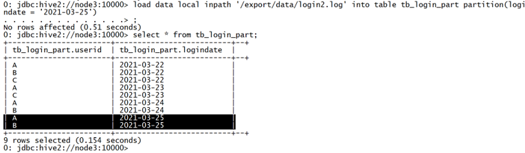

# Hive3新特性&性能优化

## Hive表设计优化

### 分区表

#### Hive查询基本原理

Hive的设计思想是通过元数据将HDFS上的文件映射成表，基本的查询原理是当用户通过HQL语句对Hive中的表进行复杂数据处理和计算时，默认将其转换为分布式计算MapReduce程序对HDFS中的数据进行读取处理的过程。


例如，当在Hive中创建一张表tb_login并关联HDFS上的文件，用于存储所有用户的登录信息，当对这张表查询数据时，Hive中的实现过程如下：


**step1：创建表**

```sql
--创建数据库
create database tb_part;

--创建表
create table tb_login(
  userid string,
  logindate string
) row format delimited fields terminated by '\t';
```


**HDFS中自动在Hive数据仓库的目录下和对应的数据库目录下，创建表的目录**


**step2：关联数据**

```sql
load data local inpath '/export/data/login.log' into table tb_login;
```

数据会被自动放入HDFS中对应的表的目录下

数据在表中可以被正常读取


**step3：查询数据**

```sql
-- 统计3月24号的登录人数
select
  logindate,
  count(*) as cnt
from tb_login
where logindate = '2021-03-24'
group by logindate;
```

当执行查询计划时，Hive会使用表的最后一级目录作为底层处理数据的输入

先根据表名在元数据中进行查询表对应的HDFS目录

然后将整个HDFS中表的目录作为底层查询的输入，可以通过explain命令查看执行计划依赖的数据

```sql
explain extended
select
  logindate,
  count(*) as cnt
from tb_login
where logindate = '2021-03-24'
group by logindate;
```

#### 普通表结构问题

默认的普通表结构中，表的最后一级目录就是表的目录，而底层的计算会使用表的最后一级目录作为Input进行计算，这种场景下，就会遇到一个问题，如果表的数据很多，而需要被处理的数据很少，只是其中一小部分，这样就会导致大量不必要的数据被程序加载，在程序中被过滤，导致大量不必要的计算资源的浪费。


例如，上面的需求中，只需要对2021-03-24日的数据进行计算，但实际上由于表结构的设计，在底层执行MapReduce时，将整张表的数据都进行了加载，MapReduce程序中必须对所有数据进行过滤，将3月24号的数据过滤出来，再进行处理。假设每天有1G的数据增量，一年就是365GB的数据，按照业务需求，每次只需要对其中一天的数据进行处理，也就是处理1GB的数据，程序会先加载365GB的数据，然后将364GB的数据过滤掉，只保留一天的数据再进行计算，导致了大量的磁盘和网络的IO的损耗。


#### 分区表设计思想

针对上面的问题，Hive提供了一种特殊的表结构来解决——分区表结构。分区表结构的设计思想是：根据查询的需求，将数据按照查询的条件【一般都以时间】进行划分分区存储，将不同分区的数据单独使用一个HDFS目录来进行存储，当底层实现计算时，根据查询的条件，只读取对应分区的数据作为输入，减少不必要的数据加载，提高程序的性能。


例如，上面的需求中，可以将每天的用户登录数据，按照登陆日期进行分区存储到Hive表中，每一天一个分区，在HDFS的底层就可以自动实现将每天的数据存储在不同的目录中，当用户查询某天的数据时，可以直接使用这一天的分区目录进行处理，不需要加载其他数据。


#### 分区表测试

基于分区表的设计实现将所有用户的登录信息进行分区存储

创建分区表：按照登陆日期分区

```sql
--创建表
create table tb_login_part(
  userid string
) 
partitioned by (logindate string)
row format delimited fields terminated by '\t';
```

将所有登陆数据写入分区表，分区存储

```sql
--开启动态分区
set hive.exec.dynamic.partition.mode=nonstrict;

--按登录日期分区
insert into table tb_login_part partition(logindate)
select * from tb_login;
```

**HDFS中会自动在表的目录下，为每个分区创建一个分区目录**


查询2021-03-23或者2021-03-24的数据进行统计

```sql
select
  logindate,
  count(*) as cnt
from tb_login_part
where logindate = '2021-03-23' or logindate = '2021-03-24'
group by logindate;
```

查询先检索元数据，元数据中记录该表为分区表并且查询过滤条件为分区字段，所以找到该分区对应的HDFS目录

加载对应分区的目录作为计算程序的输入


查看执行计划


如果不做分区表

```sql
explain extended
select
  logindate,
  count(*) as cnt
from tb_login
where logindate = '2021-03-23' or logindate = '2021-03-24'
group by logindate;
```


如果做了分区表

```sql
explain extended
select
  logindate,
  count(*) as cnt
from tb_login_part
where logindate = '2021-03-23' or logindate = '2021-03-24'
group by logindate;
```


### 分桶表

#### Hive中Join的问题

表的Join是数据分析处理过程中必不可少的操作，Hive同样支持Join的语法，Hive Join的底层还是通过MapReduce来实现的，但是Hive实现Join时面临一个问题：如果有两张非常大的表要进行Join，两张表的数据量都很大，Hive底层通过MapReduce实现时，无法使用MapJoin提高Join的性能，只能走默认的ReduceJoin，而ReduceJoin必须经过Shuffle过程，相对性能比较差，而且容易产生数据倾斜，如何解决这个问题？

 

#### 分桶表设计思想

针对以上的问题，Hive中提供了另外一种表的结构——分桶表结构。分桶表的设计有别于分区表的设计，分区表是将数据划分不同的目录进行存储，而分桶表是将数据划分不同的文件进行存储。分桶表的设计是按照一定的规则【通过MapReduce中的多个Reduce来实现】将数据划分到不同的文件中进行存储，构建分桶表。


如果有两张表按照相同的划分规则【按照Join的关联字段】将各自的数据进行划分，在Join时，就可以实现Bucket与Bucket的Join，避免不必要的比较。


例如：当前有两张表，订单表有1000万条，用户表有10万条，两张表的关联字段是userid，现在要实现两张表的Join。将订单表按照userid划分为3个桶，1000万条数据按照userid的hash取余存储在对应的Bucket中。


同理，再将用户表按照相同的规则，存储在3个桶中。


在Join时，只需要将两张表的Bucket0与Bucket0进行Join，Bucket1与Bucket1进行Join，Bucket2与Bucket2进行Join即可，不用让所有的数据挨个比较，降低了比较次数，提高了Join的性能。


#### 分桶表测试

当前有两份较大的数据文件，emp员工数据和dept部门数据，现在要基于Hive实现两张表的Join，可以通过分桶实现分桶Join提高性能。


构建普通emp表

```sql
create database if not exists db_emp;
use db_emp;
--创建普通表
create table tb_emp01(
     empno string,
     ename string,
     job string,
     managerid string,
     hiredate string,
     salary double,
     jiangjin double,
     deptno string
) row format delimited fields terminated by '\t';
--加载数据
load data local inpath '/export/data/emp01.txt' into table tb_emp01;
```

构建分桶emp表

```sql
use db_emp;
-- 创建分桶表
create table tb_emp02(
   empno string,
   ename string,
   job string,
   managerid string,
   hiredate string,
   salary double,
   jiangjin double,
   deptno string
)
clustered by(deptno) sorted by (deptno asc) into 3 buckets
row format delimited fields terminated by '\t';
-- 写入分桶表
insert overwrite table tb_emp02
select * from tb_emp01;
```

构建普通dept表

```sql
use db_emp;
-- 创建部门表
create table tb_dept01(
    deptno string,
    dname string,
    loc string
)
row format delimited fields terminated by ',';
-- 加载数据
load data local inpath '/export/data/dept01.txt' into table tb_dept01;
```

构建分桶dept表

```sql
use db_emp;
--创建分桶表
create table tb_dept02(
    deptno string,
    dname string,
    loc string
)
clustered by(deptno) sorted by (deptno asc) into 3 buckets
row format delimited fields terminated by ',';
--写入分桶表
insert overwrite table tb_dept02
select * from tb_dept01;
```

普通的Join执行计划

```sql
explain
select
  a.empno,
  a.ename,
  a.salary,
  b.deptno,
  b.dname
from tb_emp01 a join tb_dept01 b on a.deptno = b.deptno;
```


分桶的Join执行计划

```sql
--开启分桶SMB join
set hive.optimize.bucketmapjoin = true;
set hive.auto.convert.sortmerge.join=true;
set hive.optimize.bucketmapjoin.sortedmerge = true;
--查看执行计划
explain
select
  a.empno,
  a.ename,
  a.salary,
  b.deptno,
  b.dname
from tb_emp02 a join tb_dept02 b on a.deptno = b.deptno;
```


### 索引设计

#### Hive中的索引

在传统的关系型数据库例如MySQL、Oracle等数据库中，为了提高数据的查询效率，可以为表中的字段单独构建索引，查询时，可以基于字段的索引快速的实现查询、过滤等操作。


Hive中也同样提供了索引的设计，允许用户为字段构建索引，提高数据的查询效率。但是Hive的索引与关系型数据库中的索引并不相同，比如，Hive不支持主键或者外键。Hive索引可以建立在表中的某些列上，以提升一些操作的效率，例如减少MapReduce任务中需要读取的数据块的数量。


在可以预见到分区数据非常庞大的情况下，分桶和索引常常是优于分区的。而分桶由于SMB Join对关联键要求严格，所以并不是总能生效。


官方文档：[https://cwiki.apache.org/confluence/display/Hive/LanguageManual+DDL#LanguageManualDDL-Create/Drop/AlterIndex](https://cwiki.apache.org/confluence/display/Hive/LanguageManual+DDL%23LanguageManualDDL-Create/Drop/AlterIndex)


**注意：官方明确表示，索引功能支持是从Hive0.7版本开始，到Hive3.0不再支持。**

#### 索引的原理及使用

Hive中索引的基本原理：当为某张表的某个字段创建索引时，Hive中会自动创建一张索引表，该表记录了该字段的每个值与数据实际物理位置之间的关系，例如数据所在的HDFS文件地址，以及所在文件中偏移量offset等信息。


Hive的索引目的是提高Hive表指定列的查询速度。没有索引时，类似'WHERE tab1.col1 = 10' 的查询，Hive会加载整张表或分区，然后处理所有的rows，但是如果在字段col1上面存在索引时，那么只会加载和处理文件的一部分。

构建数据时，Hive会根据索引字段的值构建索引信息，将索引信息存储在索引表中查询数据时，Hive会根据索引字段查询索引表，根据索引表的位置信息读取对应的文件数据。下面我们来实现索引的构建，例如：


当前有一张分区表tb_login_part，默认查询数据时，是没有索引的，当查询登陆日期时可以通过分区过滤来提高效率，但是如果想按照用户ID进行查询，就无法使用分区进行过滤，只能全表扫描数据。


需要经常按照用户ID查询，那么性能就会相对较差，我们可以基于用户ID构建索引来加快查询效率。


**可以使用Hive3.0以下版本测试**

**创建索引**

```sql
--为表中的userid构建索引
create index idx_user_id_login on table tb_login_part(userid)

--索引类型为Compact，Hive支持Compact和Bitmap类型，存储的索引内容不同
as 'COMPACT'

--延迟构建索引
with deferred rebuild;
```


**构建索引**

```sql
alter index idx_user_id_login ON tb_login_part rebuild;
```

通过运行一个MapReduce程序来构建索引


**查看索引**

```sql
desc default__tb_login_part_idx_user_id_login__;
select * from default__tb_login_part_idx_user_id_login__;
```


索引中记录了每个用户ID对应的文件以及在文件中的位置


**删除索引**

```sql
DROP INDEX idx_user_id_login ON tb_login_part;
```

#### 索引的问题与应用

**问题**

Hive构建索引的过程是通过一个MapReduce程序来实现的，这就导致了Hive的一个问题，每次Hive中原始数据表的数据发生更新时，索引表不会自动更新，必须手动执行一个Alter index命令来实现通过MapReduce更新索引表，导致整体性能较差，维护相对繁琐。例如：表中数据发生新增或者修改




索引表没有更新


手动更新索引表

```sql
alter index idx_user_id_login ON tb_login_part rebuild;
```


**应用**

由于Hive的索引设计过于繁琐，所以从Hive3.0版本开始，取消了对Hive Index的支持及使用，不过如果使用的是Hive1.x或者Hive2.x在特定的场景下依旧可以使用Hive Index来提高性能。


实际工作场景中，一般不推荐使用Hive Index，推荐使用ORC文件格式中的索引来代替Hive Index提高查询性能。


## Hive表数据优化

### 文件格式

#### 概述

Hive数据存储的本质还是HDFS，所有的数据读写都基于HDFS的文件来实现，为了提高对HDFS文件读写的性能，Hive中提供了多种文件存储格式：TextFile、SequenceFile、RCFile、ORC、Parquet等。


不同的文件存储格式具有不同的存储特点，有的可以降低存储空间，有的可以提高查询性能等，可以用来实现不同场景下的数据存储，以提高对于数据文件的读写效率。


#### TextFile

TextFIle是Hive中默认的文件格式，存储形式为按行存储。工作中最常见的数据文件格式就是TextFile文件，几乎所有的原始数据生成都是TextFile格式，所以Hive设计时考虑到为了避免各种编码及数据错乱的问题，选用了TextFile作为默认的格式。建表时不指定存储格式即为textfile，导入数据时把数据文件拷贝至hdfs不进行处理。


**TextFile的优点**

- 最简单的数据格式，不需要经过处理，可以直接cat查看
- 可以使用任意的分隔符进行分割
- 便于和其他工具（Pig, grep, sed, awk）共享数据
- 可以搭配Gzip、Bzip2、Snappy等压缩一起使用

 

**TextFile的缺点**

- 耗费存储空间，I/O性能较低
- 结合压缩时Hive不进行数据切分合并，不能进行并行操作，查询效率低
- 按行存储，读取列的性能差

 

**TextFile的应用场景**

- 适合于小量数据的存储查询
- 一般用于做第一层数据加载和测试使用

 

**TextFile的使用**

- 创建原始数据表

```sql
-- 创建数据库
create database if not exists db_fileformat;
use db_fileformat;

-- 创建原始数据表
create table tb_sogou_source(
  stime string,
  userid string,
  keyword string,
  clickorder string,
  url string
)
row format delimited fields terminated by '\t';
```

加载原始数据

```sql
load data local inpath '/export/data/SogouQ.reduced' into table tb_sogou_source;
```


创建TextFile数据表

```sql
--创建textfile数据表
create table tb_sogou_text(
  stime string,
  userid string,
  keyword string,
  clickorder string,
  url string
)
row format delimited fields terminated by '\t'
stored as textfile;
```

写入TextFile数据表

```sql
insert into table tb_sogou_text
select * from tb_sogou_source;
```

#### SequenceFile

SequenceFile是Hadoop里用来存储序列化的键值对即二进制的一种文件格式。SequenceFile文件也可以作为MapReduce作业的输入和输出，hive也支持这种格式。


**SequenceFIle的优点**

- 以二进制的KV形式存储数据，与底层交互更加友好，性能更快
- 可压缩、可分割，优化磁盘利用率和I/O
- 可并行操作数据，查询效率高
- SequenceFile也可以用于存储多个小文件


**SequenceFIle的缺点**

- 存储空间消耗最大
- 与非Hadoop生态系统之外的工具不兼容
- 构建SequenceFile需要通过TextFile文件转化加载。


**SequenceFIle的应用**

- 适合于小量数据，但是查询列比较多的场景


**SequenceFIle的使用**

**创建SequenceFile数据表**

```sql
create table tb_sogou_seq(
  stime string,
  userid string,
  keyword string,
  clickorder string,
  url string
)
row format delimited fields terminated by '\t'
stored as sequencefile;
```

**写入SequenceFile数据表**

```sql
insert into table tb_sogou_seq
select * from tb_sogou_source;
```

#### Parquet

Parquet是一种支持嵌套结构的**列式存储**文件格式，最早是由Twitter和Cloudera合作开发，2015年5月从Apache孵化器里毕业成为Apache顶级项目。是一种支持嵌套数据模型对的列式存储系统，作为大数据系统中OLAP查询的优化方案，它已经被多种查询引擎原生支持，并且部分高性能引擎将其作为默认的文件存储格式。


通过数据编码和压缩，以及映射下推和谓词下推功能，Parquet的性能也较之其它文件格式有所提升。


Parquet 是与语言无关的，而且不与任何一种数据处理框架绑定在一起，适配多种语言和组件，能够与 Parquet 适配的查询引擎包括 Hive, Impala, Pig, Presto, Drill, Tajo, HAWQ, IBM Big SQL等，计算框架包括 MapReduce, Spark, Cascading, Crunch, Scalding, Kite 等


Parquet是Hadoop生态圈中主流的列式存储格式，并且行业内流行这样一句话流传：如果说HDFS是大数据时代文件系统的事实标准，Parquet 就是大数据时代存储格式的事实标准。Hive中也同样支持使用Parquet格式来实现数据的存储，并且是工作中主要使用的存储格式之一。


**Parquet的优点**

- 更高效的压缩和编码


可用于多种数据处理框架


**Parquet的缺点**

- 不支持update, insert, delete, ACID

 

**Parquet的应用**

- 适用于字段数非常多，无更新，只取部分列的查询。

 

**Parquet的使用**

- 创建Parquet数据表

```sql
create table tb_sogou_parquet(
  stime string,
  userid string,
  keyword string,
  clickorder string,
  url string
)
row format delimited fields terminated by '\t'
stored as parquet;
```

写入Parquet数据表

```sql
insert into table tb_sogou_parquet
select * from tb_sogou_source;
```

#### ORC

**ORC（OptimizedRC File）**文件格式也是一种Hadoop生态圈中的**列式存储**格式，源自于RC（RecordColumnar File），它的产生早在2013年初，最初产生自Apache Hive，用于降低Hadoop数据存储空间和加速Hive查询速度。它并不是一个单纯的列式存储格式，仍然是首先根据行组分割整个表，在每一个行组内进行**按列存储**。ORC文件是自描述的，它的元数据使用Protocol Buffers序列化，并且文件中的数据尽可能的压缩以降低存储空间的消耗，目前也被Hive、Spark SQL、Presto等查询引擎支持。2015年ORC项目被Apache项目基金会提升为Apache顶级项目。


ORC文件也是以二进制方式存储的，所以是不可以直接读取，ORC文件也是自解析的，它包含许多的元数据，这些元数据都是同构ProtoBuffer进行序列化的。其中涉及到如下的概念：


ORC文件：保存在文件系统上的普通二进制文件，一个ORC文件中可以包含多个stripe，每一个stripe包含多条记录，这些记录按照列进行独立存储，对应到Parquet中的row group的概念。


文件级元数据：包括文件的描述信息PostScript、文件meta信息（包括整个文件的统计信息）、所有stripe的信息和文件schema信息。


stripe：一组行形成一个stripe，每次读取文件是以行组为单位的，一般为HDFS的块大小，保存了每一列的索引和数据。


stripe元数据：保存stripe的位置、每一个列的在该stripe的统计信息以及所有的stream类型和位置。


row group：索引的最小单位，一个stripe中包含多个row group，默认为10000个值组成。


stream：一个stream表示文件中一段有效的数据，包括索引和数据两类。索引stream保存每一个row group的位置和统计信息，数据stream包括多种类型的数据，具体需要哪几种是由该列类型和编码方式决定。


ORC文件中保存了三个层级的统计信息，分别为**文件级别、stripe级别和row group级别**的，他们都可以用来根据Search ARGuments（谓词下推条件）判断是否可以跳过某些数据，在统计信息中都包含成员数和是否有null值，并且对于不同类型的数据设置一些特定的统计信息。


性能测试：

- **原始Text格式，未压缩 : 38.1 G**
- **ORC格式，默认压缩（ZLIB）: 11.5 G**
- **Parquet格式，默认压缩（Snappy）：14.8 G**
- **测试对比：复杂数据Join关联测试**


**ORC的优点**

- 列式存储，存储效率非常高
- 可压缩，高效的列存取
- 查询效率较高，支持索引
- 支持矢量化查询

 

**ORC的缺点**

- 加载时性能消耗较大
- 需要通过text文件转化生成
- 读取全量数据时性能较差

 

**ORC的应用**

- 适用于Hive中大型的存储、查询

 

**ORC的使用**

- 创建ORC数据表

```sql
create table tb_sogou_orc(
  stime string,
  userid string,
  keyword string,
  clickorder string,
  url string
)
row format delimited fields terminated by '\t'
stored as orc;
```

写入ORC数据表

```sql
insert into table tb_sogou_orc
select * from tb_sogou_source;
```

### 数据压缩

#### 压缩概述

Hive底层转换HQL运行MapReduce程序时，磁盘I/O操作、网络数据传输、shuffle和merge要花大量的时间，尤其是数据规模很大和工作负载密集的情况下，鉴于磁盘I/O和网络带宽是Hadoop的宝贵资源，数据压缩对于节省资源、最小化磁盘I/O和网络传输非常有帮助。如果磁盘I/O和网络带宽影响了MapReduce作业性能，在任意MapReduce阶段启用压缩都可以改善端到端处理时间并减少I/O和网络流量。

**压缩的优点**

- 减小文件存储所占空间
- 加快文件传输效率，从而提高系统的处理速度
- 降低IO读写的次数


**压缩的缺点**

- 使用数据时需要先对文件解压，加重CPU负荷，压缩算法越复杂，解压时间越长
- **Hadoop**中各种压缩算法对比


#### Hive中压缩配置

Hive中的压缩就是使用了Hadoop中的压缩实现的，所以Hadoop中支持的压缩在Hive中都可以直接使用。

Hadoop中支持的压缩算法：


在Hive中使用压缩，需要对MapReduce和Hive进行相应的配置

临时配置

配置MapReduce开启输出压缩及配置压缩类型

```sql
--开启输出压缩
set mapreduce.output.fileoutputformat.compress=true;
--配置压缩类型为Snappy
set mapreduce.output.fileoutputformat.compress.codec=org.apache.hadoop.io.compress.SnappyCodec;
```

配置Hive开启中间结果压缩和输出压缩及配置压缩类型

```sql
-- 中间结果压缩
set hive.exec.compress.intermediate=true;
set hive.intermediate.compression.codec=org.apache.hadoop.io.compress.SnappyCodec;
-- 输出结果压缩
set hive.exec.compress.output=true;
```

**永久配置**

- **将以上MapReduce的配置写入mapred-site.xml中，重启Hadoop**
- **将以上Hive的配置写入hive-site.xml中，重启Hive**


#### Hive中压缩测试

创建表，指定为textfile格式，并使用snappy压缩

```sql
create table tb_sogou_snappy
stored as textfile
as select * from tb_sogou_source;
```

创建表，指定为orc格式，并使用snappy压缩

```sql
create table tb_sogou_orc_snappy
stored as orc tblproperties ("orc.compress"="SNAPPY")
as select * from tb_sogou_source;
```


### 存储优化

#### 避免小文件生成

Hive的存储本质还是HDFS，HDFS是不利于小文件存储的，因为每个小文件会产生一条元数据信息，并且不利用MapReduce的处理，MapReduce中每个小文件会启动一个MapTask计算处理，导致资源的浪费，所以在使用Hive进行处理分析时，要尽量避免小文件的生成。


那么在使用Hive时，如何能避免小文件的生成呢？当使用多个Reduce进行聚合计算时，并不清楚每个Reduce最终会生成的结果的数据大小，无法控制用几个Reduce来处理。


Hive中为我们提供了一个特殊的机制，可以自动的判断是否是小文件，如果是小文件可以自动将小文件进行合并。

配置

```sql
-- 如果hive的程序，只有maptask，将MapTask产生的所有小文件进行合并
set hive.merge.mapfiles=true;
-- 如果hive的程序，有Map和ReduceTask,将ReduceTask产生的所有小文件进行合并
set hive.merge.mapredfiles=true;
-- 每一个合并的文件的大小
set hive.merge.size.per.task=256000000;
-- 平均每个文件的大小，如果小于这个值就会进行合并
set hive.merge.smallfiles.avgsize=16000000;
```

#### 读取小文件

尽管通过配置避免了多个小文件的同时产生，但是我们总会遇到数据处理的中间结果是小文件的情况，例如每个小时的分区数据中，大多数小时的数据都比较多，但是个别几个小时，如凌晨的2点~6点等等，数据量比较小，下一步进行处理时就必须对多个小文件进行处理，那么这种场景下怎么解决呢？


类似于MapReduce中的解决方案，Hive中也提供一种输入类CombineHiveInputFormat，用于将小文件合并以后，再进行处理。

配置

```sql
-- 设置Hive中底层MapReduce读取数据的输入类：将所有文件合并为一个大文件作为输入
set hive.input.format=org.apache.hadoop.hive.ql.io.CombineHiveInputFormat;
```

#### ORC文件索引

在使用ORC文件时，为了加快读取ORC文件中的数据内容，ORC提供了两种索引机制：Row Group Index 和 Bloom Filter Index可以帮助提高查询ORC文件的性能，当用户写入数据时，可以指定构建索引，当用户查询数据时，可以根据索引提前对数据进行过滤，避免不必要的数据扫描。


**Row Group Index**

一个ORC文件包含一个或多个stripes(groups of row data)，每个stripe中包含了每个column的min/max值的索引数据，**当查询中有<,>,=的操作时，会根据min/max值，跳过扫描不包含的stripes**。而其中为**每个stripe建立的包含min/max值的索引，就称为Row Group Index行组索引**，也叫min-max Index大小对比索引，或者Storage Index。


在建立ORC格式表时，指定表参数’orc.create.index’=’true’之后，便会建立Row Group Index，需要注意的是，为了使Row Group Index有效利用，向表中加载数据时，**必须对需要使用索引的字段进行排序**，否则，min/max会失去意义。另外，**这种索引主要用于数值型字段的范围查询过滤优化上**。


开启索引配置

```sql
set hive.optimize.index.filter=true;
```

永久生效，配置在hive-site.xml中


创建表，并指定构建索引

```sql
create table tb_sogou_orc_index
stored as orc tblproperties ("orc.create.index"="true")
as select * from tb_sogou_source
distribute by stime
sort by stime;
```

当进行范围或者等值查询（**<,>,=**）时就可以基于构建的索引进行查询

```sql
select count(*) from tb_sogou_orc_index where stime > '12:00:00' and stime < '18:00:00';
```

 

**Bloom Filter Index**

建表时候，通过表参数”orc.bloom.filter.columns”=”columnName……”来指定为哪些字段建立BloomFilter索引，这样，在生成数据的时候，会在每个stripe中，为该字段建立BloomFilter的数据结构，当查**询条件中包含对该字段的=号过滤时候**，先从BloomFilter中获取以下是否包含该值，如果不包含，则跳过该stripe。


创建表，并指定构建索引

```sql
create table tb_sogou_orc_bloom
stored as orc tblproperties ("orc.create.index"="true",orc.bloom.filter.columns"="stime,userid")
as select * from tb_sogou_source
distribute by stime
sort by stime;
```

stime的范围过滤可以走row group index，userid的过滤可以走bloom filter index

```sql
select
  count(*)
from tb_sogou_orc_index
where stime > '12:00:00' and stime < '18:00:00'
and userid = '3933365481995287' ;
```

#### ORC矢量化查询

Hive的默认查询执行引擎一次处理一行，而矢量化查询执行是一种Hive针对ORC文件操作的特性，目的是按照每批1024行读取数据，并且一次性对整个记录整合（而不是对单条记录）应用操作，提升了像过滤, 联合, 聚合等等操作的性能。

注意：要使用矢量化查询执行，就必须以**ORC格式**存储数据。


**配置**

```sql
set hive.vectorized.execution.enabled = true;
set hive.vectorized.execution.reduce.enabled = true;
```

## 计算Job执行优化

### Explain

#### 功能

HiveQL是一种类SQL的语言，从编程语言规范来说是一种声明式语言，用户会根据查询需求提交声明式的HQL查询，而Hive会根据底层计算引擎将其转化成Mapreduce/Tez/Spark的 job。大多数情况下，用户不需要了解Hive内部是如何工作的，不过，当用户对于Hive具有越来越多的经验后，尤其是需要在做性能优化的场景下，就要学习下Hive背后的理论知识以及底层的一些实现细节，会让用户更加高效地使用Hive。explain命令就可以帮助用户了解一条HQL语句在底层的实现过程


explain会解析HQL语句，将整个HQL语句的实现步骤、依赖关系、实现过程都会进行解析返回，可以帮助更好的了解一条HQL语句在底层是如何实现数据的查询及处理的过程，这样可以辅助用户对Hive进行优化。


官网：https://cwiki.apache.org/confluence/display/Hive/LanguageManual+Explain

 

#### 语法


常用语法命令如下：

```sql
EXPLAIN [FORMATTED|EXTENDED|DEPENDENCY|AUTHORIZATION|] query
```

**FORMATTED：对执行计划进行格式化，返回JSON格式的执行计划**

**EXTENDED：提供一些额外的信息，比如文件的路径信息**

**DEPENDENCY：以JSON格式返回查询所依赖的表和分区的列表** 

**AUTHORIZATION：列出需要被授权的条目，包括输入与输出**


#### 组成

解析后的执行计划一般由三个部分构成，分别是：

**The Abstract Syntax Tree for the query**

抽象语法树：Hive使用Antlr解析生成器，可以自动地将HQL生成为抽象语法树


**The dependencies between the different stages of the plan**

Stage依赖关系：会列出运行查询所有的依赖以及stage的数量


**The description of each of the stages**

Stage内容：包含了非常重要的信息，比如运行时的operator和sort orders等具体的信息

#### 示例1：过滤

```sql
explain select count(*) as cnt from tb_emp where deptno = '10';
```

组成


解释


#### 示例2：分组排序

```sql
explain
select
   deptno,count(*) as cnt
from tb_emp where salary > 2000
group by deptno order by cnt desc;
```


### MapReduce属性优化

#### 本地模式

使用Hive的过程中，有一些数据量不大的表也会转换为MapReduce处理，提交到集群时，需要申请资源，等待资源分配，启动JVM进程，再运行Task，一系列的过程比较繁琐，本身数据量并不大，提交到YARN运行返回会导致性能较差的问题。


Hive为了解决这个问题，延用了MapReduce中的设计，提供本地计算模式，允许程序不提交给YARN，直接在本地运行，以便于提高小数据量程序的性能。


**配置**

```sql
-- 开启本地模式
set hive.exec.mode.local.auto = true;
```

**限制条件**

Hive为了避免大数据量的计算也使用本地模式导致性能差的问题，所以对本地模式做了以下限制，如果以下任意一个条件不满足，那么即使开启了本地模式，将依旧会提交给YARN集群运行。

- 处理的数据量不超过128M
- MapTask的个数不超过4个
- ReduceTask的个数不超过1个

 

#### JVM重用

JVM正常指代一个Java进程，Hadoop默认使用派生的JVM来执行map-reducer，如果一个MapReduce程序中有100个Map，10个Reduce，Hadoop默认会为每个Task启动一个JVM来运行，那么就会启动100个JVM来运行MapTask，在JVM启动时内存开销大，尤其是Job大数据量情况，如果单个Task数据量比较小，也会申请JVM资源，这就导致了资源紧张及浪费的情况。


为了解决上述问题，MapReduce中提供了JVM重用机制来解决，JVM重用可以使得JVM实例在同一个job中重新使用N次，当一个Task运行结束以后，JVM不会进行释放，而是继续供下一个Task运行，直到运行了N个Task以后，就会释放，N的值可以在Hadoop的mapred-site.xml文件中进行配置，通常在10-20之间。

 

**配置**

```sql
-- Hadoop3之前的配置，在mapred-site.xml中添加以下参数
-- Hadoop3中已不再支持该选项
mapreduce.job.jvm.numtasks=10 
```

#### 并行执行

Hive在实现HQL计算运行时，会解析为多个Stage，有时候Stage彼此之间有依赖关系，只能挨个执行，但是在一些别的场景下，很多的Stage之间是没有依赖关系的，例如Union语句，Join语句等等，这些Stage没有依赖关系，但是Hive依旧默认挨个执行每个Stage，这样会导致性能非常差，可以通过修改参数，开启并行执行，当多个Stage之间没有依赖关系时，允许多个Stage并行执行，提高性能。


**配置**

```sql
-- 开启Stage并行化，默认为false
SET hive.exec.parallel=true;
-- 指定并行化线程数，默认为8
SET hive.exec.parallel.thread.number=16; 
```

**注意：线程数越多，程序运行速度越快，但同样更消耗CPU资源**


### Join优化

#### Hive中的Join方案

表的Join是数据分析处理过程中必不可少的操作，Hive同样支持Join的语法，Hive Join的底层还是通过MapReduce来实现的，Hive实现Join时，为了提高MapReduce的性能，提供了多种Join方案来实现，例如适合小表Join大表的Map Join，大表Join大表的Reduce Join，以及大表Join的优化方案Bucket Join等。

#### Map Join

**应用场景**

- 适合于小表join大表或者小表Join小表


**原理**


将小的那份数据给每个MapTask的内存都放一份完整的数据，大的数据每个部分都可以与小数据的完整数据进行join

- 底层不需要经过shuffle，需要占用内存空间存放小的数据文件


**使用**

- 尽量使用Map Join来实现Join过程
- Hive中默认自动开启了Map Join

```sql
-- 默认已经开启了Map Join
hive.auto.convert.join=true
```

Hive中判断哪张表是小表及限制

 LEFT OUTER JOIN的左表必须是大表

 RIGHT OUTER JOIN的右表必须是大表

 INNER JOIN左表或右表均可以作为大表

 FULL OUTER JOIN不能使用MAPJOIN

 MAPJOIN支持小表为子查询

 使用MAPJOIN时需要引用小表或是子查询时，需要引用别名

 在MAPJOIN中，可以使用不等值连接或者使用OR连接多个条件

 在MAPJOIN中最多支持指定6张小表，否则报语法错误


Hive中小表的大小限制

```sql
-- 2.0版本之前的控制属性
hive.mapjoin.smalltable.filesize=25M
-- 2.0版本开始由以下参数控制
hive.auto.convert.join.noconditionaltask.size=512000000
```

#### Reduce Join

**应用场景**

- 适合于大表Join大表


**原理**


将两张表的数据在shuffle阶段利用shuffle的分组来将数据按照关联字段进行合并

必须经过shuffle，利用Shuffle过程中的分组来实现关联


**使用**

Hive会自动判断是否满足Map Join，如果不满足Map Join，则自动执行Reduce Join


#### Bucket Join

**应用场景**

- 适合于大表Join大表


**原理**


将两张表按照相同的规则将数据划分，根据对应的规则的数据进行join，减少了比较次数，提高了性能


**使用**

**Bucket Join**

 语法：**clustered by colName**

 参数

```sql
-- 开启分桶join
set hive.optimize.bucketmapjoin = true;
```

 要求

分桶字段 = Join字段 ，桶的个数相等或者成倍数


**Sort Merge Bucket Join（SMB）**：基于有序的数据Join

 语法：**clustered by colName sorted by (colName)**

参数

```sql
-- 开启分桶SMB join
set hive.optimize.bucketmapjoin = true;
set hive.auto.convert.sortmerge.join=true;
set hive.optimize.bucketmapjoin.sortedmerge = true;
set hive.auto.convert.sortmerge.join.noconditionaltask=true;
```

 要求

**分桶字段 = Join字段 = 排序字段 ，桶的个数相等或者成倍数**


### 优化器

#### 关联优化

在使用Hive的过程中经常会遇到一些特殊的问题，例如当一个程序中如果有一些操作彼此之间有关联性，是可以放在一个MapReduce中实现的，但是Hive会不智能的选择，Hive会使用两个MapReduce来完成这两个操作。

例如：当我们执行以下SQL语句：

select …… from table group by id order by id desc;

​    该SQL语句转换为MapReduce时，我们可以有两种方案来实现：


方案一

第一个MapReduce做group by，经过shuffle阶段对id做分组

第二个MapReduce对第一个MapReduce的结果做order by，经过shuffle阶段对id进行排序


方案二

因为都是对id处理，可以使用一个MapReduce的shuffle既可以做分组也可以排序在这种场景下，Hive会默认选择用第一种方案来实现，这样会导致性能相对较差，我们可以在Hive中开启关联优化，对有关联关系的操作进行解析时，可以尽量放在同一个MapReduce中实现。


配置

```sql
set hive.optimize.correlation=true;
```

#### CBO优化器引擎

在使用MySQL或者Hive等工具时，经常会遇到一个问题，默认的优化器在底层解析一些聚合统计类的处理的时候，底层解析的方案有时候不是最佳的方案。例如：当前有一张表【共1000条数据】，id构建了索引，id =100值有900条，我们现在的需求是查询所有id = 100的数据，所以SQL语句为：select * from table where id = 100;


由于id这一列构建了索引，索引默认的优化器引擎RBO，会选择先从索引中查询id = 100的值所在的位置，再根据索引记录位置去读取对应的数据，但是这并不是最佳的执行方案。有id=100的值有900条，占了总数据的90%，这时候是没有必要检索索引以后再检索数据的，可以直接检索数据返回，这样的效率会更高，更节省资源，这种方式就是CBO优化器引擎会选择的方案。使用Hive时，Hive中也支持RBO与CBO这两种引擎，默认使用的是RBO优化器引擎。


**RBO**

- rule basic optimise：基于规则的优化器
- 根据设定好的规则来对程序进行优化


**CBO**

- cost basic optimise：基于代价的优化器
- 根据不同场景所需要付出的代价来合适选择优化的方案
- 对数据的分布的信息【数值出现的次数，条数，分布】来综合判断用哪种处理的方案是最佳方案


很明显CBO引擎更加智能，所以在使用Hive时，我们可以配置底层的优化器引擎为CBO引擎。


**配置**

```sql
set hive.cbo.enable=true;
set hive.compute.query.using.stats=true;
set hive.stats.fetch.column.stats=true;
set hive.stats.fetch.partition.stats=true;
```

**要求**

- 要想使用CBO引擎，必须构建数据的元数据【表行数、列的信息、分区的信息……】
- 提前获取这些信息，CBO才能基于代价选择合适的处理计划
- 所以CBO引擎一般搭配analyze分析优化器一起使用


#### Analyze分析优化器

功能：用于提前运行一个MapReduce程序将表或者分区的信息构建一些元数据【表的信息、分区信息、列的信息】，搭配CBO引擎一起使用


语法

```sql
-- 构建分区信息元数据
ANALYZE TABLE tablename
  [PARTITION(partcol1[=val1], partcol2[=val2], ...)]
  COMPUTE STATISTICS [noscan];

-- 构建列的元数据
ANALYZE TABLE tablename
  [PARTITION(partcol1[=val1], partcol2[=val2], ...)]
  COMPUTE STATISTICS FOR COLUMNS ( columns name1, columns name2...) [noscan];

-- 查看元数据
DESC FORMATTED [tablename] [columnname];
```

举例：构建表中分区数据的元数据信息

```sql
ANALYZE TABLE tb_login_part PARTITION(logindate) COMPUTE STATISTICS;
```

构建表中列的数据的元数据信息

```sql
ANALYZE TABLE tb_login_part  COMPUTE STATISTICS FOR COLUMNS  userid;
```

查看构建的列的元数据

```sql
desc formatted tb_login_part userid;
```


### 谓词下推（PPD）

#### 基本思想

谓词下推 Predicate Pushdown（PPD）的思想简单点说就是在不影响最终结果的情况下，尽量将过滤条件提前执行。谓词下推后，过滤条件在map端执行，减少了map端的输出，降低了数据在集群上传输的量，降低了Reduce端的数据负载，节约了集群的资源，也提升了任务的性能。

 

#### 基本规则

开启参数

```sql
-- 默认自动开启谓词下推
hive.optimize.ppd=true;
```

不同Join场景下的Where谓词下推测试


试验结论


**Inner Join和Full outer Join，条件写在on后面，还是where后面，性能上面没有区别**

**Left outer Join时 ，右侧的表写在on后面，左侧的表写在where后面，性能上有提高**

**Right outer Join时，左侧的表写在on后面、右侧的表写在where后面，性能上有提高**

**如果SQL语句中出现不确定结果的函数，也无法实现下推**


### 数据倾斜

#### 数据倾斜的现象

分布式计算中最常见的，最容易遇到的问题就是数据倾斜，数据倾斜的现象是，当我们提交运行一个程序时，我们通过监控发现，这个程序的大多数的Task都已经运行结束了，只有某一个Task一直在运行，迟迟不能结束，导致整体的进度卡在99%或者100%，这时候我们就可以判定程序出现了数据倾斜的问题。

 

#### 数据倾斜的原因

表面上看，发生数据倾斜的原因在于这个Task运行过慢，但是仔细分析我们会发现，这个Task运行过慢的原因在于这个Task的负载要比其他Task的负载要高，所以发生数据倾斜的**直观原因在于Task的数据分配不均衡。**

那为什么会出现多个Task数据分配不均衡的情况呢？


从两方面考虑

第一：数据本身就是倾斜的，数据中某种数据出现的次数过多。

第二：分区规则导致这些相同的数据都分配给了同一个Task，导致这个Task拿到了大量的数据，而其他Task拿到的数据比较少，所以运行起来相比较于其他Task就比较慢一些。


综上所述，**产生数据倾斜的根本原因在于分区规则。**


#### group By的数据倾斜

当程序中出现group by或者count（distinct）等分组聚合的场景时，如果数据本身是倾斜的根据MapReduce的Hash分区规则，肯定会出现数据倾斜的现象。根本原因是因为分区规则导致的，所以我们可以通过以下几种方案来解决group by导致的数据倾斜的问题。


**方案一：开启Map端聚合**

```sql
-- 开启Map端聚合：Combiner
hive.map.aggr=true;
```

通过减少Reduce的输入量，避免每个Task数据差异过大导致数据倾斜


**方案二：实现随机分区**

```sql
-- SQL中避免数据倾斜，构建随机分区
select * from table distribute by rand();
```

distribute by用于指定底层的MapReduce按照哪个字段作为Key实现分区、分组等

默认由Hive自己选择，可以通过distribute by自己指定，通过rank函数随机值实现随机分区，避免数据倾斜


**方案三：自动构建随机分区并自动聚合**

```sql
-- 开启随机分区，走两个MapReduce 
hive.groupby.skewindata=true;
```

开启该参数以后，当前程序会自动通过两个MapReduce来运行

第一个MapReduce自动进行随机分区，然后实现聚合

第二个MapReduce将聚合的结果再按照业务进行处理，得到结果


#### Join的数据倾斜

实际业务需求中往往需要构建两张表的Join实现，如果两张表比较大，无法实现Map Join，只能走Reduce Join，那么当关联字段中某一种值过多的时候依旧会导致数据倾斜的问题，面对Join产生的数据倾斜，核心的思想是尽量避免Reduce Join的产生，优先使用Map Join来实现，但往往很多的Join场景不满足Map Join的需求，那么我们可以以下几种方案来解决Join产生的数据倾斜问题：


**方案一：提前过滤，将大数据变成小数据，实现Map Join**

实现两张表的Join时，我们要尽量考虑是否可以使用Map Join来实现Join过程**。**有些场景下看起来是大表Join大表，但是我们可以通过转换将大表Join大表变成大表Join小表，来实现Map Join。例如：现在有两张表订单表A与用户表B，需要实现查询今天所有订单的用户信息，关联字段为userid。


A表：今天的订单，1000万条，字段：orderId,userId,produceId,price等


B表：用户信息表，100万条，字段：userid,username,age,phone等


需求：两张表关联得到今天每个订单的用户信息


实现1：直接关联，实现大表Join大表

```sql
select a.*,b.* from A join B on a.userid = b.userid;
```

由于两张表比较大，无法走Map Join，只能走Reduce Join，容易产生数据倾斜。

 

实现2：将下了订单的用户的数据过滤出来，再Join

```sql
select a.*,d.*
from (
  -- 获取所有下订单的用户信息
  select
    b.*
  from
  -- 获取所有下订单的userid
  ( select distinct a.userid from A a ) c join B b on c.userid = b.userid ) d 
join
  A a on d.userid = a.userid;
```

1**00万个用户中，在今天下订单的人数可能只有一小部分，大量数据是不会Join成功的**

**可以提前将订单表中的userid去重，获取所有下订单的用户id**

**再使用所有下订单的用户id关联用户表，得到所有下订单的用户的信息**

**最后再使用下订单的用户信息关联订单表**

**通过多次Map Join来代替Reduce Join，性能更好也可以避免数据倾斜**


**方案二：使用Bucket Join**

如果使用方案一来避免Reduce Join ，有些场景下依旧无法满足，例如过滤后的数据依旧是一张大表，那么最后的Join依旧是一个Reduce Join

这种场景下，可以将两张表的数据构建为桶表，实现Bucket Map Join，避免数据倾斜

 

l**方案三：使用Skew Join**

Skew Join是Hive中一种专门为了避免数据倾斜而设计的特殊的Join过程，这种Join的原理是将Map Join和Reduce Join进行合并，如果某个值出现了数据倾斜，就会将产生数据倾斜的数据单独使用Map Join来实现，其他没有产生数据倾斜的数据由Reduce Join来实现，这样就避免了Reduce Join中产生数据倾斜的问题，最终将Map Join的结果和Reduce Join的结果进行Union合并


**配置**

```sql
-- 开启运行过程中skewjoin
set hive.optimize.skewjoin=true;
-- 如果这个key的出现的次数超过这个范围
set hive.skewjoin.key=100000;
-- 在编译时判断是否会产生数据倾斜
set hive.optimize.skewjoin.compiletime=true;
-- 不合并，提升性能
set hive.optimize.union.remove=true;
-- 如果Hive的底层走的是MapReduce，必须开启这个属性，才能实现不合并
set mapreduce.input.fileinputformat.input.dir.recursive=true;
```

**示例图**


## Hive3新特性

### Hive On Tez

#### Hive引擎的支持

Hive作为数据仓库工具，底层的计算由分布式计算框架实现，目前Hive支持三种计算引擎，分别是**MapReduce、Tez、Spark**。Hive中默认的计算引擎是MapReduce，由**hive.execution.engine**参数属性控制。


Hive从2.x版本开始就提示未来的版本中将不再支持底层使用MapReduce，推荐使用Tez或者Spark引擎来代替MapReduce计算。如果依旧要使用MapReduce，需要使用Hive的1.x版本。

```sql
WARN  : Hive-on-MR is deprecated in Hive 2 and may not be available in the future versions. Consider using a different execution engine (i.e. spark, tez) or using Hive 1.X releases.
```

#### Tez的介绍

Hive底层默认的的计算引擎为MapReduce，由于MapReduce的编程模型不够灵活，性能相对较差等问题，在实际使用Hive的过程中，我们建议将Hive的底层计算引擎更改为Tez或者Spark引擎。


Tez是Apache社区中的一种支持DAG作业的开源计算框架，它可以将多个有依赖的作业转换为一个作业从而大幅提升DAG作业的性能。核心思想是将Map和Reduce两个操作进一步拆分，即Map被拆分成Input、Processor、Sort、Merge和Output， Reduce被拆分成Input、Shuffle、Sort、Merge、Processor和Output等，这样，这些分解后的元操作可以任意灵活组合，产生新的操作，这些操作经过一些控制程序组装后，可形成一个大的DAG作业。最终Tez也会将程序提交给YARN来实现运行。


Tez并不直接面向最终用户，事实上它允许开发者为最终用户构建性能更快、扩展性更好的应用程序。Tez项目的目标是支持高度定制化，这样它就能够满足各种用例的需要，让人们不必借助其他的外部方式就能完成自己的工作，如果 Hive这样的项目使用Tez来代替MapReduce作为其数据处理的工具，那么将会显著提升它们的响应时间。


特点

- 灵活的数据流定义
- 灵活的输入、输出、运行时模型
- 与数据类型无关
- 部署方便简洁
- 高性能执行:
- 最佳资源管理
- 计划配置动态更新
- 动态物理数据流决策


官网：http://tez.apache.org/

 


Apache Tez未来将替换MapReduce做为默认的Hive执行引擎。Hive3未来的版本将不再支持MapReduce。Tez通过有向无环图（DAG）和数据传输原语的表达式，在Tez下执行Hive查询可以提高性能。整体的执行过程如下图所示：


Hive编译查询。

Tez执行查询。

YARN为群集中的应用程序分配资源，并为YARN队列中的Hive作业启用授权。

Hive根据表类型更新HDFS或Hive仓库中的数据。

Hive通过JDBC连接返回查询结果。


#### Tez的编译

目前Apache官方http://archive.apache.org/dist/tez/最新版本为0.9系列版本，0.9系列版本为针对Hadoop2.x系列的版本，使用的Hadoop为3.x版本，所以可以使用GitHub中已发布的0.10版本的tez。


**编译**

0.10不是正式版本，针对Hadoop3需要单独手动编译，可以使用我们提前编译好的安装包，也可以参考以下过程进行编译。


**下载依赖**

```sql
yum -y install autoconf automake libtool cmake ncurses-devel openssldevel lzo-devel zlib-devel gcc gcc-c++
```

**安装Maven**


解压

```sql
tar zxvf apache-maven-3.5.4-bin.tar.gz –C /export/server
```


配置环境变量：vim /etc/profile

```sql
export MAVEN_HOME=/export/server/apache-maven-3.5.4
export MAVEN_OPTS="-Xms4096m -Xmx4096m"
export PATH=:$MAVEN_HOME/bin:$PATH
```

修改Maven仓库：vim /export/server/apache-maven-3.5.4/conf/settings.xml

```xml
<mirrors>
	<mirror>
		<id>alimaven</id>
		<name>aliyun maven</name>
		<url>http://maven.aliyun.com/nexus/content/groups/public/</url>
		<mirrorOf>central</mirrorOf>
	</mirror>
</mirrors>
```

验证

```sh
mvn -v  
```


**安装ProtocolBuffer**

解压

```sh
tar zxvf protobuf-2.5.0.tar.gz –C /export/server
```

编译安装

```sh
cd /export/server/protobuf-2.5.0  ./configure  make && make install  
```

 验证

```sh
protoc --version  
```

**解压tez-master.zip**

```sh
unzip tez-master.zip -d /export/server  
```

**修改pom.xml**

修改Hadoop和slf4j的版本

```xml
<hadoop.version>3.1.4</hadoop.version>  
<slf4j.version>1.7.25</slf4j.version>  
```

注释tez-ui模块

```xml
<modules>
<module>hadoop-shim</module>
<module>tez-api</module>
<module>tez-build-tools</module>
<module>tez-common</module>
<module>tez-runtime-library</module>
<module>tez-runtime-internals</module>
<module>tez-mapreduce</module>
<module>tez-examples</module>
<module>tez-tests</module>
<module>tez-dag</module>
<module>tez-ext-service-tests</module>
<!-- <module>tez-ui</module> -->
<module>tez-plugins</module>
<module>tez-tools</module>
<module>hadoop-shim-impls</module>
<module>tez-dist</module>
<module>docs</module>
</modules>
```

指定Maven仓库地址

```xml
<repositories>
<repository>
<id>central</id>
<url>http://maven.aliyun.com/nexus/content/groups/public</url>
</repository>
</repositories>
<pluginRepositories>
<pluginRepository>
<id>central</id>
<url>http://maven.aliyun.com/nexus/content/groups/public</url>
</pluginRepository>
</pluginRepositories>
```

编译

```sh
cd /export/server/tez-master
mvn clean package -DskipTests=true -Dmaven.javadoc.skip=true -Phadoop28 -P\!hadoop27
```


提取安装包

```sh
ll tez-dist/target/  
```

**tez-0.10.1-SNAPSHOT-minimal.tar.gz：程序安装包**

**tez-0.10.1-SNAPSHOT.tar.gz：程序依赖包**

#### Tez的部署

安装

上传编译好的安装包到**HiveServer所在的机器**的/export/software目录下

tez-0.10.1-SNAPSHOT-minimal.tar.gz：Tez程序安装包

tez-0.10.1-SNAPSHOT.tar.gz：依赖包


解压程序安装包：

```sh
mkdir /export/server/tez  cd /export/software/  tar -zxvf tez-0.10.1-SNAPSHOT-minimal.tar.gz -C /export/server/tez  
```

上传依赖包到HDFS上

```sql
hdfs  dfs –mkdir –p /tez
hdfs dfs -put /export/software/tez-0.10.1-SNAPSHOT.tar.gz /tez
```

配置Hadoop关联Tez

创建tez-site.xml

```sh
cd /export/server/hadoop-3.1.4/etc/hadoop
vim tez-site.xml
```

添加以下内容配置

```xml
<?xml-stylesheet type="text/xsl" href="configuration.xsl"?>
<configuration>
	<property>
		<name>tez.lib.uris</name>
		<value>${fs.defaultFS}/tez/tez-0.10.1-SNAPSHOT.tar.gz</value>
	</property>
	<property>
		<name>tez.use.cluster.hadoop-libs</name>
		<value>true</value>
	</property>
	<property>
		<name>tez.am.resource.memory.mb</name>
		<value>1024</value>
	</property>
	<property>
		<name>tez.am.resource.cpu.vcores</name>
		<value>1</value>
	</property>
	<property>
		<name>tez.container.max.java.heap.fraction</name>
		<value>0.4</value>
	</property>
	<property>
		<name>tez.task.resource.memory.mb</name>
		<value>1024</value>
	</property>
	<property>
		<name>tez.task.resource.cpu.vcores</name>
		<value>1</value>
	</property>
</configuration>
```

**将tez-site.xml分发给其他Hadoop节点**

```sh
cd /export/server/hadoop-3.1.4/etc/hadoop
scp tez-site.xml node2:$PWD
scp tez-site.xml node3:$PWD
```

配置环境变量

修改配置文件

```sh
cd /export/server/hadoop-3.1.4/etc/hadoop/shellprofile.d
vim example.sh
```

文件末尾添加以下内容

```shell
hadoop_add_profile tez
function _tez_hadoop_classpath
{
  hadoop_add_classpath "$HADOOP_HOME/etc/hadoop" after
  hadoop_add_classpath "/export/server/tez/*" after
  hadoop_add_classpath "/export/server/tez/lib/*" after
}
```

配置Hive关联Tez

修改hive-site.xml，添加以下配置

```sh
vim $HIVE_HOME/conf/hive-site.xml
```

修改hive-env.sh，添加以下配置

```xml
<property>
  <name>hive.execution.engine</name>
  <value>tez</value>
</property>
<property>
  <name>hive.tez.container.size</name>
  <value>1024</value>
</property>
```

删除Tez中冲突的依赖包

```sh
rm -rf /export/server/tez/lib/slf4j-log4j12-1.7.25.jar
```

Hadoop的core-site.xml中配置LZO压缩

```xml
<property>
	<name>io.compression.codecs</name>
	<value>
	org.apache.hadoop.io.compress.GzipCodec,
	org.apache.hadoop.io.compress.DefaultCodec,
	org.apache.hadoop.io.compress.BZip2Codec,
	org.apache.hadoop.io.compress.SnappyCodec,
	com.hadoop.compression.lzo.LzoCodec,
	com.hadoop.compression.lzo.LzopCodec
	</value>
</property>
<property>
	<name>io.compression.codec.lzo.class</name>
	<value>com.hadoop.compression.lzo.LzoCodec</value>
</property>
```

```sql
cd /export/server/hadoop-3.1.4/etc/hadoop/
scp -r core-site.xml node2:$PWD
scp -r core-site.xml node3:$PWD
```

配置Hive的环境变量：vim /export/server/hive-3.1.2-bin/conf/hive-env.sh

```shell
export TEZ_HOME=/export/server/tez
export TEZ_JARS=""
for jar in `ls $TEZ_HOME |grep jar`; do
  export TEZ_JARS=$TEZ_JARS:$TEZ_HOME/$jar
done
for jar in `ls $TEZ_HOME/lib`; do
  export TEZ_JARS=$TEZ_JARS:$TEZ_HOME/lib/$jar
done
export HIVE_AUX_JARS_PATH=/export/server/hadoop-3.1.4/share/hadoop/common/hadoop-lzo-0.4.21-SNAPSHOT.jar$TEZ_JARS
```

重启Hadoop

```sh
stop-dfs.sh
stop-yarn.sh
start-dfs.sh
start-yarn.sh
```

启动Hive

```shell
/export/server/hive-3.1.2-bin/bin/hive --service metastore
/export/server/hive-3.1.2-bin/bin/hive --service hiveserver2
/export/server/hive-3.1.2-bin/bin/hive
```

#### Tez的使用

设置引擎为mr，测试

```sql
set hive.execution.engine = mr;
use db_function;
select deptno,count(*) as numb from tb_emp group by deptno order by numb desc ;
```

设置引擎为tez，测试

```sql
#如果想一直使用tez执行 可以把上述参数添加在hive-site.xml中
set hive.execution.engine=tez;
set hive.tez.container.size=1024;
select deptno,count(*) as numb from tb_emp group by deptno order by numb desc ;
```

设置引擎为tez，beeline测试

```sql
/export/server/hive-3.1.2-bin/bin/beeline -u jdbc:hive2://node1:10000 -n root -p 123456
set hive.execution.engine=tez;
set hive.tez.container.size=1024;
use db_function;
select deptno,count(*) as numb from tb_emp group by deptno order by numb desc ;
```

### LLAP的更新

LLAP是hive 2.0版本就引入的特性，在Hive 3中与Tez集成的应用非常成熟。Hive官方称之为**实时长期处理**(Live long and process)，实现将数据预取、缓存到基于yarn运行的守护进程中，降低和减少系统IO和与HDFS DataNode的交互，以提高程序的性能，**LLAP 目前只支持tez引擎**。


LLAP提供了一种混合执行模型。它由一个长期存在的守护进程(该守护进程替换了与 HDFS DataNode 的直接交互)以及一个紧密集成的基于 DAG 的框架组成。诸如缓存，预取，某些查询处理和访问控制之类的功能已移至守护程序中。此守护程序直接直接处理小/短查询，而任何繁重的工作都将在标准 YARN 容器中执行。


与 DataNode 相似，LLAP 守护程序也可以由其他应用程序使用。该守护进程还通过可选的 API(例如 InputFormat)打开，其他数据处理框架可将其用作构建块。下图显示了使用 LLAP 的示例执行。 Tez AM 统筹整体执行，查询的初始阶段被推送到 LLAP 中，在还原阶段，将在单独的容器中执行大型Shuffle，多个查询和应用程序可以同时访问 LLAP。


LLAP 在现有的Hive基于流程的执行中工作，以保持Hive的可伸缩性和多功能性。它不会替代现有的执行模型，而是对其进行了增强。它有如下的几个特点：


**LLAP守护程序是可选的**。Hive 可以在没有它们的情况下工作，并且即使已经部署并启动运行LLAP也可以绕过不执行。


**外部编排和执行引擎**。LLAP 不是执行引擎，不同于MapReduce 或 Tez。整个执行由现有的 Hive 执行引擎(例如 Tez)在 LLAP 节点以及常规容器上透明地调度和监控。显然，LLAP 的支持级别取决于单独的执行引擎。不计划支持 MapReduce，但以后可能会添加其他引擎，例如Pig 等其他框架也可以选择使用 LLAP 守护程序。


**部分执行**。LLAP 守护程序执行的工作结果可以构成 Hive 查询结果的一部分，也可以根据查询传递给外部 Hive 任务。


**资源 Management**。 YARN 仍然负责资源的 Management 和分配。 YARN 容器委派模型允许将分配的资源传输到 LLAP。为了避免 JVM 内存设置的限制，高速缓存的数据以及用于处理的大缓冲区(例如，分组依据，联接)将保持堆外状态。这样，守护程序可以使用少量内存，并且将根据工作负载分配其他资源(即 CPU 和内存)。

 

**Hive3增强了在多租户场景下的LLAP负载管理，主要通过resource plan的方式进行实现：** 

- 划分LLAP资源为多个pool，比如bi池和etl池 
- 自动映射applications到对应的池 
- 可以设置触发条件，实现自动从一个池到另一个池，比如自动把长时间运行的application移动到etl池
- 可以根据需要activate/deactivate这些resource pools


### Metastore独立模式

#### Metastore的功能

Hive中的所有对象，如数据库、表、函数等，所有对象的定义都存储在Metastore中。根据系统的配置方式，数据的统计信息和权限的授权记录也可能存储在metastore中。Hive或者其他执行引擎在运行时会使用这些元数据来决定如何解析、授权和有效地执行用户查询。


元数据存储可以将对象的定义持久化到关系数据库(RDBMS)中，也可以将元数据存储配置为嵌入式的Apache Derby RDBMS或连接到外部RDBMS。Metastore本身可以完全嵌入到用户进程中，也可以作为服务运行，供其他进程连接。

 

#### Metastore独立模式

从Hive 3.0开始，Metastore可以在不安装Hive其他部分的情况下单独运行，它将作为一个单独的发行版提供，用于实现允许其他非Hive的系统，例如Spark、Impala等轻松地与Metastore集成。目前，为了方便起见，依旧建议将Metastore放在Hive中。


要使Metastore成为一个独立的服务，需要修改大量的参数，目前Hive官方为了最大限度地向后兼容，所有旧的配置参数仍然有效。Hive的Metastore服务将读取metastore-site.xml，同时也会从Hive的配置文件目录中读取hive-site.xml或者hive-memstoresite.xml文件。不论Hive使用哪种方式实现元数据存储，外部的RDBMS或者内嵌的Derby数据库，都会使用以下参数来单独配置MetaStore服务：

|              Hive3参数              |             Hive2参数              | **默认值** |                         **参数含义**                         |
| :---------------------------------: | :--------------------------------: | :--------: | :----------------------------------------------------------: |
|        metastore.thrift.uris        |        hive.metastore.uris         |    none    |                   Metastore服务进程的地址                    |
|        metastore.thrift.port        |        hive.metastore.port         |    9083    |                   Metastore服务进程的端口                    |
|       metastore.warehouse.dir       |    hive.metastore.warehouse.dir    |    none    |                     默认元数据存储的URI                      |
|  datanucleus.schema.autoCreateAll   |  datanucleus.schema.autoCreateAll  |   false    | 是否允许自动构建schema,不建议开启，建议使用`schematool`替代，如果开启，需要配置hive. metaore.schema.verification=false |
|    metastore.schema.verification    | hive.metastore.schema.verification |    true    | 强制metastore的schema一致性，开启的话会校验在metastore中存储的信息的版本和hive的jar包中的版本一致性，并且关闭自动schema迁移，用户必须手动的升级hive并且迁移schema，关闭的话只会在版本不一致时给出警告。 |
| metastore.hmshandler.retry.attempts |   hive.hmshandler.retry.attempts   |     10     |              当metastore连接出错时，重试的次数.              |
| metastore.hmshandler.retry.interval |   hive.hmshandler.retry.interval   |   2 sec    |                        重试的时间间隔                        |
|        metastore.log4j.file         |          hive.log4j.file           |    none    | Log4j 日志配置文件，如果没有设置将从$METASTORE_HOME/conf 找到metastore-log4j2.properties配置文件 |
|     metastore.stats.autogather      |       hive.stats.autogather        |    true    |             是否在插入命令时自动收集基本统计信息             |

配置好以上参数后，可以使用start-metastore.sh来启动metastore服务。


**从Hive 3.0开始，Metastore作为一个单独的包发布，可以在没有Hive其他部分的情况下运行。这称为独立模式**。但是在默认情况下Metastore配置为与Hive一起使用，因此在这个配置中需要修改一些配置参数。


| metastore.task.threads.always | org.apache.hadoop.hive.metastore.events.eventcleanertask,org.apache.hadoop.hive.metastore.MaterializationsCacheCleanerTask |
| :---------------------------: | ------------------------------------------------------------ |
|  metastore.expression.proxy   | org.apache.hadoop.hive.metastore.defaultpartitionexpressionproxy |


目前，如果使用独立模式，以下特性还没有经过测试，或者已经明确不能在独立模式下与Metastore一起使用

如果没有Hive，ACID表中的Compactor将无法运行，可以对ACID表进行读写，但不能compact

Replication也没有在独立模式中实现测试


#### 独立模式部署测试

**安装**

将下载好的hive-standalone-metastore-3.0.0-bin.tar上传到/export/software目录下


解压

```sh
tar -zxvf hive-standalone-metastore-3.0.0-bin.tar.gz -C /export/server/
```

**配置**

修改配置文件

```sh
vim /export/server/apache-hive-metastore-3.0.0-bin/conf/metastore-site.xml
```

```xml
<configuration>
    <property>
        <name>metastore.thrift.uris</name>
        <value>thrift://node1:9083</value>
        <description>Thrift URI for the remote metastore. Used by metastore client to connect to remote metastore.</description>
    </property>
    <property>
        <name>metastore.task.threads.always</name>
        <value>org.apache.hadoop.hive.metastore.events.EventCleanerTask</value>
    </property>
    <property>
        <name>metastore.expression.proxy</name>
        <value>org.apache.hadoop.hive.metastore.DefaultPartitionExpressionProxy</value>
    </property>
</configuration>
```

复制hive-site.xml到conf目录下

```sh
cd /export/server/apache-hive-metastore-3.0.0-bin/
cp /export/server/hive-3.1.2-bin/conf/hive-site.xml ./conf/
```

删除旧版本的guava，复制hive中的guava到lib目录中

```sh
rm -rf lib/guava-19.0.jar
cp /export/server/hive-3.1.2-bin/lib/guava-27.0-jre.jar ./lib/
```

复制MySQL的连接驱动包到lib目录下

```sh
cp /export/server/hive-3.1.2-bin/lib/mysql-connector-java-8.0.19.jar ./lib/
```

**独立启动metastore**

```sql
cd /export/server/apache-hive-metastore-3.0.0-bin/
bin/start-metastore
```

**启动hiveserver2**

```sh
cd /export/server/hive-3.1.2-bin/
bin/hive --service hiveserver2
```

**启动beeline**

```sh
cd /export/server/hive-3.1.2-bin/
bin/beeline -u jdbc:hive2://node1:10000 -n root -p 123456
```