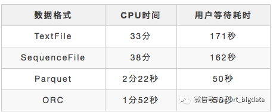

# Hive 基础调优面试小总结

内容：

- 一、基于Hadoop的数据仓库Hive基础知识
- 二、HiveSQL语法
- 三、Hive性能优化
- 四、Hive性能优化之数据倾斜专题
- 五、HiveSQL优化十二板斧
- 六、Hive面试题(一)
- 七、Hive/Hadoop高频面试点集合(二)

## 基于Hadoop的数据仓库Hive基础知识

Hive是基于Hadoop的数据仓库工具，可对存储在HDFS上的文件中的数据集进行数据整理、特殊查询和分析处理，提供了类似于SQL语言的查询语言–HiveQL，可通过HQL语句实现简单的MR统计，Hive将HQL语句转换成MR任务进行执行。

一、概述

1.1 数据仓库概念

数据仓库（Data Warehouse）是一个面向主题的（Subject Oriented）、集成的（Integrated）、相对稳定的（Non-Volatile）、反应历史变化（Time Variant）的数据集合，用于支持管理决策。

数据仓库体系结构通常含四个层次：数据源、数据存储和管理、数据服务、数据应用。

数据源：是数据仓库的数据来源，含外部数据、现有业务系统和文档资料等；

数据集成：完成数据的抽取、清洗、转换和加载任务，数据源中的数据采用ETL（Extract-Transform-Load）工具以固定的周期加载到数据仓库中。

数据存储和管理：此层次主要涉及对数据的存储和管理，含数据仓库、数据集市、数据仓库检测、运行与维护工具和元数据管理等。

数据服务：为前端和应用提供数据服务，可直接从数据仓库中获取数据供前端应用使用，也可通过OLAP（OnLine Analytical Processing，联机分析处理）服务器为前端应用提供负责的数据服务。

数据应用：此层次直接面向用户，含数据查询工具、自由报表工具、数据分析工具、数据挖掘工具和各类应用系统。

1.2 传统数据仓库的问题

无法满足快速增长的海量数据存储需求，传统数据仓库基于关系型数据库，横向扩展性较差，纵向扩展有限。

无法处理不同类型的数据，传统数据仓库只能存储结构化数据，企业业务发展，数据源的格式越来越丰富。

传统数据仓库建立在关系型数据仓库之上，计算和处理能力不足，当数据量达到TB级后基本无法获得好的性能。

1.3 Hive

Hive是建立在Hadoop之上的数据仓库，由Facebook开发，在某种程度上可以看成是用户编程接口，本身并不存储和处理数据，依赖于HDFS存储数据，依赖MR处理数据。有类SQL语言HiveQL，不完全支持SQL标准，如，不支持更新操作、索引和事务，其子查询和连接操作也存在很多限制。

Hive把HQL语句转换成MR任务后，采用批处理的方式对海量数据进行处理。数据仓库存储的是静态数据，很适合采用MR进行批处理。Hive还提供了一系列对数据进行提取、转换、加载的工具，可以存储、查询和分析存储在HDFS上的数据。

1.4 Hive与Hadoop生态系统中其他组件的关系

Hive依赖于HDFS存储数据，依赖MR处理数据；

Pig可作为Hive的替代工具，是一种数据流语言和运行环境，适合用于在Hadoop平台上查询半结构化数据集，用于与ETL过程的一部分，即将外部数据装载到Hadoop集群中，转换为用户需要的数据格式；

HBase是一个面向列的、分布式可伸缩的数据库，可提供数据的实时访问功能，而Hive只能处理静态数据，主要是BI报表数据，Hive的初衷是为减少复杂MR应用程序的编写工作，HBase则是为了实现对数据的实时访问。

.webp)

1.5 Hive与传统数据库的对比

.webp)

1.6 Hive的部署和应用

1.6.1 Hive在企业大数据分析平台中的应用

当前企业中部署的大数据分析平台，除Hadoop的基本组件HDFS和MR外，还结合使用Hive、Pig、HBase、Mahout，从而满足不同业务场景需求。

.webp)

上图是企业中一种常见的大数据分析平台部署框架 ，在这种部署架构中：

Hive和Pig用于报表中心，Hive用于分析报表，Pig用于报表中数据的转换工作。

HBase用于在线业务，HDFS不支持随机读写操作，而HBase正是为此开发，可较好地支持实时访问数据。

Mahout提供一些可扩展的机器学习领域的经典算法实现，用于创建商务智能（BI）应用程序。

二、Hive系统架构

下图显示Hive的主要组成模块、Hive如何与Hadoop交互工作、以及从外部访问Hive的几种典型方式。

.webp)

Hive主要由以下三个模块组成：

用户接口模块，含CLI、HWI、JDBC、Thrift Server等，用来实现对Hive的访问。CLI是Hive自带的命令行界面；HWI是Hive的一个简单网页界面；JDBC、ODBC以及Thrift Server可向用户提供进行编程的接口，其中Thrift Server是基于Thrift软件框架开发的，提供Hive的RPC通信接口。

驱动模块（Driver），含编译器、优化器、执行器等，负责把HiveQL语句转换成一系列MR作业，所有命令和查询都会进入驱动模块，通过该模块的解析变异，对计算过程进行优化，然后按照指定的步骤执行。

元数据存储模块（Metastore），是一个独立的关系型数据库，通常与MySQL数据库连接后创建的一个MySQL实例，也可以是Hive自带的Derby数据库实例。此模块主要保存表模式和其他系统元数据，如表的名称、表的列及其属性、表的分区及其属性、表的属性、表中数据所在位置信息等。

喜欢图形界面的用户，可采用几种典型的外部访问工具：Karmasphere、Hue、Qubole等。

三、Hive工作原理

3.1 SQL语句转换成MapReduce作业的基本原理

3.1.1 用MapReduce实现连接操作

假设连接（join）的两个表分别是用户表User(uid,name)和订单表Order(uid,orderid)，具体的SQL命令：

SELECT name, orderid FROM User u JOIN Order o ON u.uid=o.uid;

.webp)

上图描述了连接操作转换为MapReduce操作任务的具体执行过程。

首先，在Map阶段，

User表以uid为key，以name和表的标记位（这里User的标记位记为1）为value，进行Map操作，把表中记录转换生成一系列KV对的形式。比如，User表中记录(1,Lily)转换为键值对(1,< 1,Lily>)，其中第一个“1”是uid的值，第二个“1”是表User的标记位，用来标示这个键值对来自User表；

同样，Order表以uid为key，以orderid和表的标记位（这里表Order的标记位记为2）为值进行Map操作，把表中的记录转换生成一系列KV对的形式；

接着，在Shuffle阶段，把User表和Order表生成的KV对按键值进行Hash，然后传送给对应的Reduce机器执行。比如KV对(1,< 1,Lily>)、(1,< 2,101>)、(1,< 2,102>)传送到同一台Reduce机器上。当Reduce机器接收到这些KV对时，还需按表的标记位对这些键值对进行排序，以优化连接操作；

最后，在Reduce阶段，对同一台Reduce机器上的键值对，根据“值”（value）中的表标记位，对来自表User和Order的数据进行笛卡尔积连接操作，以生成最终的结果。比如键值对(1,< 1,Lily>)与键值对(1,< 2,101>)、(1,< 2,102>)的连接结果是(Lily,101)、(Lily,102)。

3.1.2用MR实现分组操作

假设分数表Score(rank, level)，具有rank（排名）和level（级别）两个属性，需要进行一个分组（Group By）操作，功能是把表Score的不同片段按照rank和level的组合值进行合并，并计算不同的组合值有几条记录。SQL语句命令如下：

```sql
SELECT rank,level,count(*) as value FROM score GROUP BY rank,level;
```

.webp)

上图描述分组操作转化为MapReduce任务的具体执行过程。

首先，在Map阶段，对表Score进行Map操作，生成一系列KV对，其键为< rank, level>，值为“拥有该< rank, level>组合值的记录的条数”。比如，Score表的第一片段中有两条记录(A,1)，所以进行Map操作后，转化为键值对(< A,1>,2);

接着在Shuffle阶段，对Score表生成的键值对，按照“键”的值进行Hash，然后根据Hash结果传送给对应的Reduce机器去执行。比如，键值对(< A,1>,2)、(< A,1>,1)传送到同一台Reduce机器上，键值对(< B,2>,1)传送另一Reduce机器上。然后，Reduce机器对接收到的这些键值对，按“键”的值进行排序；

在Reduce阶段，把具有相同键的所有键值对的“值”进行累加，生成分组的最终结果。比如，在同一台Reduce机器上的键值对(< A,1>,2)和(< A,1>,1)Reduce操作后的输出结果为(A,1,3)。

3.2 Hive中SQL查询转换成MR作业的过程

当Hive接收到一条HQL语句后，需要与Hadoop交互工作来完成该操作。HQL首先进入驱动模块，由驱动模块中的编译器解析编译，并由优化器对该操作进行优化计算，然后交给执行器去执行。执行器通常启动一个或多个MR任务，有时也不启动（如SELECT * FROM tb1，全表扫描，不存在投影和选择操作）

.webp)

上图是Hive把HQL语句转化成MR任务进行执行的详细过程。

由驱动模块中的编译器–Antlr语言识别工具，对用户输入的SQL语句进行词法和语法解析，将HQL语句转换成抽象语法树（AST Tree）的形式；

遍历抽象语法树，转化成QueryBlock查询单元。因为AST结构复杂，不方便直接翻译成MR算法程序。其中QueryBlock是一条最基本的SQL语法组成单元，包括输入源、计算过程、和输入三个部分；

遍历QueryBlock，生成OperatorTree（操作树），OperatorTree由很多逻辑操作符组成，如TableScanOperator、SelectOperator、FilterOperator、JoinOperator、GroupByOperator和ReduceSinkOperator等。这些逻辑操作符可在Map、Reduce阶段完成某一特定操作；

Hive驱动模块中的逻辑优化器对OperatorTree进行优化，变换OperatorTree的形式，合并多余的操作符，减少MR任务数、以及Shuffle阶段的数据量；

遍历优化后的OperatorTree，根据OperatorTree中的逻辑操作符生成需要执行的MR任务；

启动Hive驱动模块中的物理优化器，对生成的MR任务进行优化，生成最终的MR任务执行计划；

最后，有Hive驱动模块中的执行器，对最终的MR任务执行输出。

Hive驱动模块中的执行器执行最终的MR任务时，Hive本身不会生成MR算法程序。它通过一个表示“Job执行计划”的XML文件，来驱动内置的、原生的Mapper和Reducer模块。Hive通过和JobTracker通信来初始化MR任务，而不需直接部署在JobTracker所在管理节点上执行。通常在大型集群中，会有专门的网关机来部署Hive工具，这些网关机的作用主要是远程操作和管理节点上的JobTracker通信来执行任务。Hive要处理的数据文件常存储在HDFS上，HDFS由名称节点（NameNode）来管理。

四、Hive HA基本原理

在实际应用中，Hive也暴露出不稳定的问题，在极少数情况下，会出现端口不响应或进程丢失问题。Hive HA（High Availablity）可以解决这类问题。

.webp)

在Hive HA中，在Hadoop集群上构建的数据仓库是由多个Hive实例进行管理的，这些Hive实例被纳入到一个资源池中，由HAProxy提供统一的对外接口。客户端的查询请求，首先访问HAProxy，由HAProxy对访问请求进行转发。HAProxy收到请求后，会轮询资源池中可用的Hive实例，执行逻辑可用性测试。

如果某个Hive实例逻辑可用，就会把客户端的访问请求转发到Hive实例上；

如果某个实例不可用，就把它放入黑名单，并继续从资源池中取出下一个Hive实例进行逻辑可用性测试。

对于黑名单中的Hive，Hive HA会每隔一段时间进行统一处理，首先尝试重启该Hive实例，如果重启成功，就再次把它放入资源池中。

由于HAProxy提供统一的对外访问接口，因此，对于程序开发人员来说，可把它看成一台超强“Hive”。

五、Impala

5.1 Impala简介

Impala由Cloudera公司开发，提供SQL语义，可查询存储在Hadoop和HBase上的PB级海量数据。Hive也提供SQL语义，但底层执行任务仍借助于MR，实时性不好，查询延迟较高。

Impala作为新一代开源大数据分析引擎，最初参照Dremel（由Google开发的交互式数据分析系统），支持实时计算，提供与Hive类似的功能，在性能上高出Hive3~30倍。Impala可能会超过Hive的使用率能成为Hadoop上最流行的实时计算平台。Impala采用与商用并行关系数据库类似的分布式查询引擎，可直接从HDFS、HBase中用SQL语句查询数据，不需把SQL语句转换成MR任务，降低延迟，可很好地满足实时查询需求。

Impala不能替换Hive，可提供一个统一的平台用于实时查询。Impala的运行依赖于Hive的元数据（Metastore）。Impala和Hive采用相同的SQL语法、ODBC驱动程序和用户接口，可统一部署Hive和Impala等分析工具，同时支持批处理和实时查询。

5.2 Impala系统架构

.webp)

上图是Impala系统结构图，虚线模块数据Impala组件。Impala和Hive、HDFS、HBase统一部署在Hadoop平台上。Impala由Impalad、State Store和CLI三部分组成。

Implalad：是Impala的一个进程，负责协调客户端提供的查询执行，给其他Impalad分配任务，以及收集其他Impalad的执行结果进行汇总。Impalad也会执行其他Impalad给其分配的任务，主要是对本地HDFS和HBase里的部分数据进行操作。Impalad进程主要含Query Planner、Query Coordinator和Query Exec Engine三个模块，与HDFS的数据节点（HDFS DataNode）运行在同一节点上，且完全分布运行在MPP（大规模并行处理系统）架构上。

State Store：收集分布在集群上各个Impalad进程的资源信息，用于查询的调度，它会创建一个statestored进程，来跟踪集群中的Impalad的健康状态及位置信息。statestored进程通过创建多个线程来处理Impalad的注册订阅以及与多个Impalad保持心跳连接，此外，各Impalad都会缓存一份State Store中的信息。当State Store离线后，Impalad一旦发现State Store处于离线状态时，就会进入恢复模式，并进行返回注册。当State Store重新加入集群后，自动恢复正常，更新缓存数据。

CLI：CLI给用户提供了执行查询的命令行工具。Impala还提供了Hue、JDBC及ODBC使用接口。

5.3 Impala查询执行过程

.webp)

注册和订阅。当用户提交查询前，Impala先创建一个Impalad进程来负责协调客户端提交的查询，该进程会向State Store提交注册订阅信息，State Store会创建一个statestored进程，statestored进程通过创建多个线程来处理Impalad的注册订阅信息。

提交查询。通过CLI提交一个查询到Impalad进程，Impalad的Query Planner对SQL语句解析，生成解析树；Planner将解析树变成若干PlanFragment，发送到Query Coordinator。其中PlanFragment由PlanNode组成，能被分发到单独的节点上执行，每个PlanNode表示一个关系操作和对其执行优化需要的信息。

获取元数据与数据地址。Query Coordinator从MySQL元数据库中获取元数据（即查询需要用到哪些数据），从HDFS的名称节点中获取数据地址（即数据被保存到哪个数据节点上），从而得到存储这个查询相关数据的所有数据节点。

分发查询任务。Query Coordinator初始化相应的Impalad上的任务，即把查询任务分配给所有存储这个查询相关数据的数据节点。

汇聚结果。Query Executor通过流式交换中间输出，并由Query Coordinator汇聚来自各个Impalad的结果。

返回结果。Query Coordinator把汇总后的结果返回给CLI客户端。

5.4 Impala与Hive

.webp)

不同点：

Hive适合长时间批处理查询分析；而Impala适合进行交互式SQL查询。

Hive依赖于MR计算框架，执行计划组合成管道型MR任务模型进行执行；而Impala则把执行计划表现为一棵完整的执行计划树，可更自然地分发执行计划到各个Impalad执行查询。

Hive在执行过程中，若内存放不下所有数据，则会使用外存，以保证查询能够顺利执行完成；而Impala在遇到内存放不下数据时，不会利用外存，所以Impala处理查询时会受到一定的限制。

相同点：

使用相同的存储数据池，都支持把数据存储在HDFS和HBase中，其中HDFS支持存储TEXT、RCFILE、PARQUET、AVRO、ETC等格式的数据，HBase存储表中记录。

使用相同的元数据。

对SQL的解析处理比较类似，都是通过词法分析生成执行计划。

## HiveSQL语法原理

### hive的DDL语法

**对数据库的操作**

- 创建数据库:

  create database if not exists myhive; 说明：hive的表存放位置模式是由hive-site.xml当中的一个属性指定 的 :hive.metastore.warehouse.dir

  创建数据库并指定hdfs存储位置 : create database myhive2 location '/myhive2';

- 修改数据库:

  ```sql
  alter  database  myhive2  set  dbproperties('createtime'='20210329');
  ```

> 说明：可以使用alter database 命令来修改数据库的一些属性。但是数据库的元数据信息是不可更改的，包括数据库的名称以及数据库所在的位置

**对数据表的操作**

- 对管理表(内部表)的操作:

建内部表:

```sql
hive (myhive)> use myhive; -- 使用myhive数据库
hive (myhive)> create table stu(id int,name string);
hive (myhive)> insert into stu values (1,"zhangsan");
hive (myhive)> insert into stu values (1,"zhangsan"),(2,"lisi");  -- 一次插入多条数据
hive (myhive)> select * from stu;
```

hive建表时候的字段类型:

.webp)

> 对decimal类型简单解释下：
> 用法：decimal(11,2) 代表最多有11位数字，其中后2位是小数，整数部分是9位；如果整数部分超过9位，则这个字段就会变成null；如果小数部分不足2位，则后面用0补齐两位，如果小数部分超过两位，则超出部分四舍五入;
> 也可直接写 decimal，后面不指定位数，默认是 decimal(10,0) 整数10位，没有小数

- 对外部表操作：

> 外部表因为是指定其他的hdfs路径的数据加载到表当中来，所以hive表会认为自己不完全独占这份数据，所以删除hive表的时候，数据仍然存放在hdfs当中，不会删掉，只会删除表的元数据

构建外部表：

```sql
create external table student (s_id string,s_name string) row format delimited fields     terminated by '\t';
```

- 对分区表的操作：

创建分区表的语法:

```sql
create table score(s_id string, s_score int) partitioned by (month string);
```

创建一个表带多个分区:

```sql
create table score2 (s_id string, s_score int) partitioned by (year string,month string,day string);
```

> 注意：
> hive表创建的时候可以用 location 指定一个文件或者文件夹，当指定文件夹时，hive会加载文件夹下的所有文件，当表中无分区时，这个文件夹下不能再有文件夹，否则报错
> 当表是分区表时，比如 partitioned by (day string)， 则这个文件夹下的每一个文件夹就是一个分区，且文件夹名为 day=20201123 这种格式，然后使用：msck repair table score; 修复表结构，成功之后即可看到数据已经全部加载到表当中去了

- 对分桶表操作：

> 将数据按照指定的字段进行分成多个桶中去，就是按照分桶字段进行哈希划分到多个文件当中去
> 分区就是分文件夹，分桶就是分文件

创建桶表

```sql
create table course (c_id string,c_name string) clustered by(c_id) into 3 buckets;
```

> 桶表的数据加载：由于桶表的数据加载通过hdfs dfs -put文件或者通过load data均不可以，只能通过insert overwrite 进行加载
> 所以把文件加载到桶表中，需要先创建普通表，并通过insert overwrite的方式将普通表的数据通过查询的方式加载到桶表当中去

### hive的DQL查询语法

- 单表查询

  ```sql
  SELECT [ALL | DISTINCT] select_expr, select_expr, ... 
  FROM table_reference
  [WHERE where_condition] 
  [GROUP BY col_list [HAVING condition]] 
    [CLUSTER BY col_list 
    | [DISTRIBUTE BY col_list] [SORT BY| ORDER BY col_list] 
  ] 
  [LIMIT number]
  ```

> 注意：
> 1、order by 会对输入做全局排序，因此只有一个reducer，会导致当输入规模较大时，需要较长的计算时间。
> 2、sort by不是全局排序，其在数据进入reducer前完成排序。因此，如果用sort by进行排序，并且设置mapred.reduce.tasks>1，则sort by只保证每个reducer的输出有序，不保证全局有序。
> 3、distribute by(字段)根据指定的字段将数据分到不同的reducer，且分发算法是hash散列。
> 4、Cluster by(字段) 除了具有Distribute by的功能外，还会对该字段进行排序。
> 因此，如果分桶和sort字段是同一个时，此时，cluster by = distribute by + sort by

### Hive函数

**聚合函数**

```sql
hive支持 count(),max(),min(),sum(),avg() 等常用的聚合函数
```

> 注意：
> 聚合操作时要注意null值；
> count(*) 包含null值，统计所有行数；
> count(id) 不包含null值；
> min 求最小值是不包含null，除非所有值都是null；
> avg 求平均值也是不包含null

- 非空集合总体变量函数: var_pop

  ```sql
  语法: var_pop(col)
  返回值: double
  说明: 统计结果集中col非空集合的总体变量（忽略null)
  ```

- 非空集合样本变量函数: var_samp

  ```sql
  语法: var_samp (col)
  返回值: double
  说明: 统计结果集中col非空集合的样本变量（忽略null）
  ```

- 总体标准偏离函数: stddev_pop

  ```sql
  语法: stddev_pop(col)
  返回值: double
  说明: 该函数计算总体标准偏离，并返回总体变量的平方根，其返回值与VAR_POP函数的平方根相同
  ```

- 中位数函数: percentile

  ```sql
  语法: percentile(BIGINT col, p)
  返回值: double
  说明: 求准确的第pth个百分位数，p必须介于0和1之间，但是col字段目前只支持整数，不支持浮点数类型
  ```

**条件函数**

- If函数: if

  ```sql
  语法: if(boolean testCondition, T valueTrue, T valueFalseOrNull)
  返回值: T
  说明: 当条件testCondition为TRUE时，返回valueTrue；否则返回valueFalseOrNull
  hive> select if(1=2,100,200) ;
  200
  hive> select if(1=1,100,200) ;
  100
  ```

- 非空查找函数: coalesce

  ```sql
  语法: coalesce(T v1, T v2, …)
  返回值: T
  说明: 返回参数中的第一个非空值；如果所有值都为NULL，那么返回NULL
  hive> select coalesce(null,'100','50') ;
  100
  ```

- 条件判断函数：case when (两种写法，其一)

  ```sql
  语法: case when a then b [when c then d]* [else e] end
  返回值: T
  说明：如果a为TRUE,则返回b；如果c为TRUE，则返回d；否则返回e
  hive> select case when 1=2 then 'tom' when 2=2 then 'mary' else 'tim' end from tableName;
  mary
  ```

- 条件判断函数：case when(两种写法，其二）

  ```sql
  语法: case a when b then c [when d then e]* [else f] end
  返回值: T
  说明：如果a等于b，那么返回c；如果a等于d，那么返回e；否则返回f
  hive> Select case 100 when 50 then 'tom' when 100 then 'mary' else 'tim' end from tableName;
  mary
  ```

### 日期函数

> 注：以下SQL语句中的 from tableName 可去掉，不影响查询结果

获取当前UNIX时间戳函数: unix_timestamp

```sql
语法: unix_timestamp()
返回值: bigint
说明: 获得当前时区的UNIX时间戳
hive> select unix_timestamp() from tableName;
1616906976
```

UNIX时间戳转日期函数: from_unixtime

```sql
语法: from_unixtime(bigint unixtime[, string format])
返回值: string
说明: 转化UNIX时间戳（从1970-01-01 00:00:00 UTC到指定时间的秒数）到当前时区的时间格式
hive> select from_unixtime(1616906976,'yyyyMMdd') from tableName;
20210328
```

日期转UNIX时间戳函数: unix_timestamp

```sql
语法: unix_timestamp(string date)
返回值: bigint
说明: 转换格式为"yyyy-MM-dd HH:mm:ss"的日期到UNIX时间戳。如果转化失败，则返回0。
hive>  select unix_timestamp('2021-03-08 14:21:15') from tableName;
1615184475
```

指定格式日期转UNIX时间戳函数: unix_timestamp

```sql
语法: unix_timestamp(string date, string pattern)
返回值: bigint
说明: 转换pattern格式的日期到UNIX时间戳。如果转化失败，则返回0。
hive>  select unix_timestamp('2021-03-08 14:21:15','yyyyMMdd HH:mm:ss') from tableName;
1615184475
```

日期时间转日期函数: to_date

```sql
语法: to_date(string timestamp)
返回值: string
说明: 返回日期时间字段中的日期部分。
hive> select to_date('2021-03-28 14:03:01') from tableName;
2021-03-28
```

日期转年函数: year

```sql
语法: year(string date)
返回值: int
说明: 返回日期中的年。
hive> select year('2021-03-28 10:03:01') from tableName;
2021
hive> select year('2021-03-28') from tableName;
2021
```

日期转月函数: month

```sql
语法: month (string date)
返回值: int
说明: 返回日期中的月份。
hive> select month('2020-12-28 12:03:01') from tableName;
12
hive> select month('2021-03-08') from tableName;
 8
```

日期转天函数: day

```sql
语法: day (string date)
返回值: int
说明: 返回日期中的天。
hive> select day('2020-12-08 10:03:01') from tableName;
8
hive> select day('2020-12-24') from tableName;
24
```

日期转小时函数: hour

```sql
语法: hour (string date)
返回值: int
说明: 返回日期中的小时。
hive> select hour('2020-12-08 10:03:01') from tableName;
10
```

日期转分钟函数: minute

```sql
语法: minute (string date)
返回值: int
说明: 返回日期中的分钟。
hive> select minute('2020-12-08 10:03:01') from tableName;
3
```

日期转秒函数: second

```sql
语法: second (string date)
返回值: int
说明: 返回日期中的秒。
hive> select second('2020-12-08 10:03:01') from tableName;
1
```

日期转周函数: weekofyear

```sql
语法: weekofyear (string date)
返回值: int
说明: 返回日期在当前的周数。
hive> select weekofyear('2020-12-08 10:03:01') from tableName;
49
```

日期比较函数: datediff

```sql
语法: datediff(string enddate, string startdate)
返回值: int
说明: 返回结束日期减去开始日期的天数。
hive> select datediff('2020-12-08','2012-05-09') from tableName;
213
```

日期增加函数: date_add

```sql
语法: date_add(string startdate, int days)
返回值: string
说明: 返回开始日期startdate增加days天后的日期。
hive> select date_add('2020-12-08',10) from tableName;
2020-12-18
```

日期减少函数: date_sub

```sql
语法: date_sub (string startdate, int days)
返回值: string
说明: 返回开始日期startdate减少days天后的日期。
hive> select date_sub('2020-12-08',10) from tableName;
2020-11-28
```

### 字符串函数

字符串长度函数：length

```sql
语法: length(string A)
返回值: int
说明：返回字符串A的长度
hive> select length('abcedfg') from tableName;
7
```

字符串反转函数：reverse

```sql
语法: reverse(string A)
返回值: string
说明：返回字符串A的反转结果
hive> select reverse('abcedfg') from tableName;
gfdecba
```

字符串连接函数：concat

```sql
语法: concat(string A, string B…)
返回值: string
说明：返回输入字符串连接后的结果，支持任意个输入字符串
hive> select concat('abc','def’,'gh')from tableName;
abcdefgh
```

### hive当中的lateral view 与 explode以及reflect和窗口函数使用explode函数将hive表中的Map和Array字段数据进行拆分

lateral view用于和split、explode等UDTF一起使用的，能将一行数据拆分成多行数据，在此基础上可以对拆分的数据进行聚合，lateral view首先为原始表的每行调用UDTF，UDTF会把一行拆分成一行或者多行，lateral view在把结果组合，产生一个支持别名表的虚拟表。

其中explode还可以用于将hive一列中复杂的array或者map结构拆分成多行

需求：现在有数据格式如下

```sql
zhangsan child1,child2,child3,child4 k1:v1,k2:v2

lisi child5,child6,child7,child8 k3:v3,k4:v4
```

字段之间使用\t分割，需求将所有的child进行拆开成为一列

```sql
+----------+--+
| mychild  |
+----------+--+
| child1   |
| child2   |
| child3   |
| child4   |
| child5   |
| child6   |
| child7   |
| child8   |
+----------+--+
```

将map的key和value也进行拆开，成为如下结果

```sql
+-----------+-------------+--+
| mymapkey  | mymapvalue  |
+-----------+-------------+--+
| k1        | v1          |
| k2        | v2          |
| k3        | v3          |
| k4        | v4          |
+-----------+-------------+--+
```

### 行转列

相关参数说明:

- CONCAT(string A/col, string B/col…)：返回输入字符串连接后的结果，支持任意个输入字符串;
- CONCAT_WS(separator, str1, str2,...)：它是一个特殊形式的 CONCAT()。第一个参数剩余参数间的分隔符。分隔符可以是与剩余参数一样的字符串。如果分隔符是 NULL，返回值也将为 NULL。这个函数会跳过分隔符参数后的任何 NULL 和空字符串。分隔符将被加到被连接的字符串之间;
- COLLECT_SET(col)：函数只接受基本数据类型，它的主要作用是将某字段的值进行去重汇总，产生array类型字段。

数据准备:

.webp)

需求: 把星座和血型一样的人归类到一起。结果如下：

```sql
射手座,A            老王|凤姐
白羊座,A            孙悟空|猪八戒
白羊座,B            宋宋
```

实现步骤: 创建本地constellation.txt，导入数据

```sql
node03服务器执行以下命令创建文件，注意数据使用\t进行分割
cd /export/servers/hivedatas
vim constellation.txt


数据如下: 
孙悟空 白羊座 A
老王 射手座 A
宋宋 白羊座 B       
猪八戒 白羊座 A
凤姐 射手座 A
```

创建hive表并导入数据

```sql
hive (hive_explode)> create table person_info(
name string, 
constellation string,
blood_type string) 
row format delimited fields terminated by "\t";

加载数据
hive (hive_explode)> load data local inpath '/export/servers/hivedatas/constellation.txt' into table person_info;
```

按需求查询数据

```sql
hive (hive_explode)> select   
t1.base,
concat_ws('|', collect_set(t1.name)) name
from
(select
name,
concat(constellation, "," , blood_type) base
from
person_info) t1
group by
t1.base;
```

### 列转行

所需函数:

- EXPLODE(col)：将hive一列中复杂的array或者map结构拆分成多行。
- LATERAL VIEW
- 用法：LATERAL VIEW udtf(expression) tableAlias AS columnAlias
- 解释：用于和split, explode等UDTF一起使用，它能够将一列数据拆成多行数据，在此基础上可以对拆分后的数据进行聚合。

数据准备:

```sql
cd /export/servers/hivedatas
vim movie.txt
文件内容如下:  数据字段之间使用\t进行分割
《疑犯追踪》 悬疑,动作,科幻,剧情
《Lie to me》 悬疑,警匪,动作,心理,剧情
《战狼2》 战争,动作,灾难
```

需求: 将电影分类中的数组数据展开。结果如下：

```sql
《疑犯追踪》 悬疑
《疑犯追踪》 动作
《疑犯追踪》 科幻
《疑犯追踪》 剧情
《Lie to me》 悬疑
《Lie to me》 警匪
《Lie to me》 动作
《Lie to me》 心理
《Lie to me》 剧情
《战狼2》 战争
《战狼2》 动作
《战狼2》 灾难
```

实现步骤:

创建hive表

```sql
create table movie_info(
movie string, 
category array<string>) 
row format delimited fields terminated by "\t"
collection items terminated by ",";
```

加载数据

```sql
load data local inpath "/export/servers/hivedatas/movie.txt" into table movie_info;
```

按需求查询数据

```sql
select
movie,
category_name
from 
movie_info lateral view explode(category) table_tmp as category_name;
```

### 窗口函数与分析函数

在sql中有一类函数叫做聚合函数,例如sum()、avg()、max()等等,这类函数可以将多行数据按照规则聚集为一行,一般来讲聚集后的行数是要少于聚集前的行数的。但是有时我们想要既显示聚集前的数据,又要显示聚集后的数据,这时我们便引入了窗口函数。窗口函数又叫OLAP函数/分析函数，窗口函数兼具分组和排序功能。

窗口函数最重要的关键字是 partition by 和 order by。

具体语法如下：over (partition by xxx order by xxx)

### 其他一些窗口函数 lag,lead,first_value,last_value

- LAG
  LAG(col,n,DEFAULT) 用于统计窗口内往上第n行值第一个参数为列名，第二个参数为往上第n行（可选，默认为1），第三个参数为默认值（当往上第n行为NULL时候，取默认值，如不指定，则为NULL）
- LEAD
  与LAG相反 LEAD(col,n,DEFAULT) 用于统计窗口内往下第n行值 第一个参数为列名，第二个参数为往下第n行（可选，默认为1），第三个参数为默认值（当往下第n行为NULL时候，取默认值，如不指定，则为NULL）
- FIRST_VALUE
  取分组内排序后，截止到当前行，第一个值
- LAST_VALUE
  取分组内排序后，截止到当前行，最后一个值

如果想要取分组内排序后最后一个值，则需要变通一下：

```sql
SELECT cookieid,
createtime,
url,
ROW_NUMBER() OVER(PARTITION BY cookieid ORDER BY createtime) AS rn,
LAST_VALUE(url) OVER(PARTITION BY cookieid ORDER BY createtime) AS last1,
FIRST_VALUE(url) OVER(PARTITION BY cookieid ORDER BY createtime DESC) AS last2 
FROM test_t4 
ORDER BY cookieid,createtime;
```

- 特别注意order by
  如果不指定ORDER BY，则进行排序混乱，会出现错误的结果
- cume_dist,percent_rank
  这两个序列分析函数不是很常用，注意：序列函数不支持WINDOW子句
- CUME_DIST 和order byd的排序顺序有关系
  CUME_DIST 小于等于当前值的行数/分组内总行数 order 默认顺序 正序 升序 比如，统计小于等于当前薪水的人数，所占总人数的比例
- PERCENT_RANK
  PERCENT_RANK 分组内当前行的RANK值-1/分组内总行数-1
  经调研 该函数显示现实意义不明朗 有待于继续考证
- grouping sets,grouping__id,cube,rollup
  这几个分析函数通常用于OLAP中，不能累加，而且需要根据不同维度上钻和下钻的指标统计，比如，分小时、天、月的UV数。
- GROUPING SETS
  grouping sets是一种将多个group by 逻辑写在一个sql语句中的便利写法。
  等价于将不同维度的GROUP BY结果集进行UNION ALL。
  GROUPING__ID，表示结果属于哪一个分组集合。
- CUBE
  根据GROUP BY的维度的所有组合进行聚合。
- ROLLUP
  是CUBE的子集，以最左侧的维度为主，从该维度进行层级聚合。

## Hive性能优化

Hive作为大数据平台举足轻重的框架，以其稳定性和简单易用性也成为当前构建企业级数据仓库时使用最多的框架之一。

Hive性能调优是我们大数据从业者必须掌握的技能。以下将给大家讲解Hive性能调优的一些方法及技巧。

### 一、 SQL语句优化

SQL语句优化涉及到的内容太多，因篇幅有限，不能一一介绍到，所以就拿几个典型举例，让大家学到这种思想，以后遇到类似调优问题可以往这几个方面多思考下。

**1. union all**

.webp)

```sql
  我们简单分析上面的SQL语句，就是将每个年龄段的最大和最小的生日获取出来放到同一张表中，union all 前后的两个语句都是对同一张表按照s_age进行分组，然后分别取最大值和最小值。

上面的SQL对同一张表的相同字段进行两次分组，这显然造成了极大浪费，我们能不能改造下呢，当然是可以的，为大家介绍一个语法：from ... insert into ... ，这个语法将from前置，作用就是使用一张表，可以进行多次插入操作：
```

.webp)

```
上面的SQL就可以对stu_ori表的s_age字段分组一次而进行两次不同的插入操作。
```

这个例子告诉我们一定要多了解SQL语句，如果我们不知道这种语法，一定不会想到这种方式的。

**2. distinct**

先看一个SQL，去重计数：

.webp)

这是简单统计年龄的枚举值个数，为什么不用distinct？

.webp)

有人说因为在数据量特别大的情况下使用第一种方式(group by)能够有效避免Reduce端的数据倾斜，但事实如此吗？
我们先不管数据量特别大这个问题，就当前的业务和环境下使用distinct一定会比上面那种子查询的方式效率高。原因有以下几点：

```
-   上面进行去重的字段是年龄字段，要知道年龄的枚举值是非常有限的，这个数量是很小的。

-   distinct的命令会在内存中构建一个hashtable，查找去重的时间复杂度是O(1)；group by在不同版本间变动比较大，有的版本会用构建hashtable的形式去重，有的版本会通过排序的方式， 排序最优时间复杂度无法到O(1)。另外，第一种方式(group by)去重会转化为两个任务，会消耗更多的磁盘网络I/O资源。

-   最新的Hive 3.0中新增了 count(distinct) 优化，通过配置 hive.optimize.countdistinct，即使真的出现数据倾斜也可以自动优化，自动改变SQL执行的逻辑。

-   第二种方式(distinct)比第一种方式(group by)代码简洁，表达的意思简单明了，如果没有特殊的问题，代码简洁就是优！
```

这个例子告诉我们，有时候我们不要过度优化，调优讲究适时调优，过早进行调优有可能做的是无用功甚至产生负效应，在调优上投入的工作成本和回报不成正比。调优需要遵循一定的原则。

### 二、数据格式优化

我们执行同样的SQL语句及同样的数据，只是数据存储格式不同，得到如下执行时长：



查询TextFile类型的数据表耗时33分钟， 查询ORC类型的表耗时1分52秒，时间得以极大缩短，可见不同的数据存储格式也能给HiveSQL性能带来极大的影响。

### 三、小文件过多优化

```
小文件如果过多，对 hive 来说，在进行查询时，每个小文件都会当成一个块，启动一个Map任务来完成，而一个Map任务启动和初始化的时间远远大于逻辑处理的时间，就会造成很大的资源浪费。而且，同时可执行的Map数量是受限的。
```

所以我们有必要对小文件过多进行优化。

### 四、并行执行优化

```
Hive会将一个查询转化成一个或者多个阶段。这样的阶段可以是MapReduce阶段、抽样阶段、合并阶段、limit阶段。或者Hive执行过程中可能需要的其他阶段。默认情况下，Hive一次只会执行一个阶段。不过，某个特定的job可能包含众多的阶段，而这些阶段可能并非完全互相依赖的，也就是说有些阶段是可以并行执行的，这样可能使得整个job的执行时间缩短。如果有更多的阶段可以并行执行，那么job可能就越快完成。
```

通过设置参数hive.exec.parallel值为true，就可以开启并发执行。在共享集群中，需要注意下，如果job中并行阶段增多，那么集群利用率就会增加。

```sql
set hive.exec.parallel=true; //打开任务并行执行
set hive.exec.parallel.thread.number=16; //同一个sql允许最大并行度，默认为8。
```

当然得是在系统资源比较空闲的时候才有优势，否则没资源，并行也起不来。

### 五、JVM优化

JVM重用是Hadoop调优参数的内容，其对Hive的性能具有非常大的影响，特别是对于很难避免小文件的场景或task特别多的场景，这类场景大多数执行时间都很短。

```sql
Hadoop的默认配置通常是使用派生JVM来执行map和Reduce任务的。这时JVM的启动过程可能会造成相当大的开销，尤其是执行的job包含有成百上千task任务的情况。JVM重用可以使得JVM实例在同一个job中重新使用N次。N的值可以在Hadoop的mapred-site.xml文件中进行配置。通常在10-20之间，具体多少需要根据具体业务场景测试得出。

  <property>
  <name>mapreduce.job.jvm.numtasks</name>
  <value>10</value>
  <description>How many tasks to run per jvm. If set to -1, there is
  no limit. 
  </description>
  </property>
```

我们也可以在hive中设置

```sql
set  mapred.job.reuse.jvm.num.tasks=10; //这个设置来设置我们的jvm重用
```

这个功能的缺点是，开启JVM重用将一直占用使用到的task插槽，以便进行重用，直到任务完成后才能释放。如果某个“不平衡的”job中有某几个reduce task执行的时间要比其他Reduce task消耗的时间多的多的话，那么保留的插槽就会一直空闲着却无法被其他的job使用，直到所有的task都结束了才会释放。

### 六、推测执行优化

```
在分布式集群环境下，因为程序bug（包括Hadoop本身的bug），负载不均衡或者资源分布不均等原因，会造成同一个作业的多个任务之间运行速度不一致，有些任务的运行速度可能明显慢于其他任务（比如一个作业的某个任务进度只有50%，而其他所有任务已经运行完毕），则这些任务会拖慢作业的整体执行进度。为了避免这种情况发生，Hadoop采用了推测执行（Speculative Execution）机制，它根据一定的法则推测出“拖后腿”的任务，并为这样的任务启动一个备份任务，让该任务与原始任务同时处理同一份数据，并最终选用最先成功运行完成任务的计算结果作为最终结果。
```

设置开启推测执行参数：Hadoop的mapred-site.xml文件中进行配置：

```xml
<property>
<name>mapreduce.map.speculative</name>
<value>true</value>
<description>If true, then multiple instances of some map tasks 
           may be executed in parallel.</description>
</property>

<property>
<name>mapreduce.reduce.speculative</name>
<value>true</value>
<description>If true, then multiple instances of some reduce tasks 
           may be executed in parallel.</description>
</property>
```

hive本身也提供了配置项来控制reduce-side的推测执行:

```sql
set hive.mapred.reduce.tasks.speculative.execution=true
```

## Hive性能优化之数据倾斜

#### Map数

通常情况下，作业会通过input的目录产生一个或者多个map任务。主要的决定因素有：input的文件总个数，input的文件大小，集群设置的文件块大小(目前为128M，可在hive中通过set dfs.block.size;命令查看到，该参数不能自定义修改)；

举例：a)一个大文件：假设input目录下有1个文件a，大小为780M，那么hadoop会将该文件a分隔成7个块（6个128m的块和1个12m的块），从而产生7个map数。b) 多个小文件：假设input目录下有3个文件a，b，c大小分别为10m，20m，150m，那么hadoop会分隔成4个块（10m，20m，128m，22m），从而产生4个map数。即，如果文件大于块大小(128m)，那么会拆分，如果小于块大小，则把该文件当成一个块。

是不是map数越多越好? 答案是否定的。如果一个任务有很多小文件（远远小于块大小128m），则每个小文件也会被当做一个块，用一个map任务来完成，而一个map任务启动和初始化的时间远远大于逻辑处理的时间，就会造成很大的资源浪费。而且，同时可执行的map数是受限的。

是不是保证每个map处理接近128m的文件块，就高枕无忧了？答案也是不一定。比如有一个127m的文件，正常会用一个map去完成，但这个文件只有一个或者两个字段，却有几千万的记录，如果map处理的逻辑比较复杂，用一个map任务去做，肯定也比较耗时。

针对上面的问题3和4，我们需要采取两种方式来解决：即减少map数和增加map数。

#### 如何适当的增加map数

当input的文件都很大，任务逻辑复杂，map执行非常慢的时候，可以考虑增加Map数，来使得每个map处理的数据量减少，从而提高任务的执行效率。针对上面的第4条 假设有这样一个任务：

```sql
Select data_desc,
count(1),
count(distinct id),
sum(case when …),
sum(case when …),
sum(…)
from a group by data_desc
```

如果表a只有一个文件，大小为120M，但包含几千万的记录，如果用1个map去完成这个任务，肯定是比较耗时的，这种情况下，我们要考虑将这一个文件合理的拆分成多个，这样就可以用多个map任务去完成。

```sql
set mapreduce.job.reduces =10;
create table a_1 as
select * from a
distribute by rand();
```

这样会将a表的记录，随机的分散到包含10个文件的a_1表中，再用a_1代替上面sql中的a表，则会用10个map任务去完成。

每个map任务处理大于12M（几百万记录）的数据，效率肯定会好很多。

看上去，貌似这两种有些矛盾，一个是要合并小文件，一个是要把大文件拆成小文件，这点正是重点需要关注的地方，根据实际情况，控制map数量需要遵循两个原则：使大数据量利用合适的map数；使单个map任务处理合适的数据量；

#### 调整reduce数

调整reduce个数方法一

a） 每个Reduce 处理的数据量默认是256MB

hive.exec.reducers.bytes.per.reducer=256123456

b） 每个任务最大的reduce数，默认为1009

hive.exec.reducers.max=1009

c）计算reducer数的公式

N=min(参数2，总输入数据量/参数1)

参数1：每个Reduce处理的最大数据量 参数2：每个任务最大Reduce数量

调整reduce个数方法二

在hadoop的mapred-default.xml文件中修改 设置每个job的Reduce个数

set mapreduce.job.reduces = 15;

reduce个数并不是越多越好

a）过多的启动和初始化reduce也会消耗时间和资源；b） 有多少个reduce，就会有多少个输出文件，如果生成了很多个小文件，那么如果这些小文件作为下一个任务的输入，则也会出现小文件过多的问题；

总结: 在设置reduce个数的时候也需要考虑这两个原则：处理大数据量利用合适的reduce数；使单个reduce任务处理数据量大小要合适。

## HiveSQL优化十二板斧

1. limit限制调整

一般情况下，Limit语句还是需要执行整个查询语句，然后再返回部分结果。

有一个配置属性可以开启，避免这种情况---对数据源进行抽样。

hive.limit.optimize.enable=true --- 开启对数据源进行采样的功能 hive.limit.row.max.size --- 设置最小的采样容量 hive.limit.optimize.limit.file --- 设置最大的采样样本数

缺点：有可能部分数据永远不会被处理到

1. JOIN优化

1)将大表放后头 Hive假定查询中最后的一个表是大表。它会将其它表缓存起来，然后扫描最后那个表。因此通常需要将小表放前面，或者标记哪张表是大表：/*streamtable(table_name)* /

2). 使用相同的连接键 当对3个或者更多个表进行join连接时，如果每个on子句都使用相同的连接键的话，那么只会产生一个MapReduce job。

3). 尽量尽早地过滤数据 减少每个阶段的数据量,对于分区表要加分区，同时只选择需要使用到的字段。

4). 尽量原子化操作 尽量避免一个SQL包含复杂逻辑，可以使用中间表来完成复杂的逻辑

1. 本地模式

有时hive的输入数据量是非常小的。在这种情况下，为查询出发执行任务的时间消耗可能会比实际job的执行时间要多的多。对于大多数这种情况，hive可以通过本地模式在单台机器上处理所有的任务。对于小数据集，执行时间会明显被缩短

set hive.exec.mode.local.auto=true;

当一个job满足如下条件才能真正使用本地模式：

- 1.job的输入数据大小必须小于参数：hive.exec.mode.local.auto.inputbytes.max(默认128MB) 　　
- 2.job的map数必须小于参数：hive.exec.mode.local.auto.tasks.max(默认4) 　　
- 3.job的reduce数必须为0或者1

可用参数hive.mapred.local.mem(默认0)控制child jvm使用的最大内存数。

4.并行执行

hive会将一个查询转化为一个或多个阶段，包括：MapReduce阶段、抽样阶段、合并阶段、limit阶段等。默认情况下，一次只执行一个阶段。不过，如果某些阶段不是互相依赖，是可以并行执行的。

set hive.exec.parallel=true,可以开启并发执行。

set hive.exec.parallel.thread.number=16; //同一个sql允许最大并行度，默认为8。

会比较耗系统资源。

5.strict模式

对分区表进行查询，在where子句中没有加分区过滤的话，将禁止提交任务(默认：nonstrict)

set hive.mapred.mode=strict;

注：使用严格模式可以禁止3种类型的查询：（1）对于分区表，不加分区字段过滤条件，不能执行 （2）对于order by语句，必须使用limit语句 （3）限制笛卡尔积的查询（join的时候不使用on，而使用where的）

6.调整mapper和reducer个数

Map阶段优化 map执行时间：map任务启动和初始化的时间+逻辑处理的时间。

1.通常情况下，作业会通过input的目录产生一个或者多个map任务。主要的决定因素有：input的文件总个数，input的文件大小，集群设置的文件块大小(目前为128M, 可在hive中通过set dfs.block.size;命令查看到，该参数不能自定义修改)；

2.举例：

a)假设input目录下有1个文件a,大小为780M,那么hadoop会将该文件a分隔成7个块（6个128m的块和1个12m的块），从而产生7个map数 b)假设input目录下有3个文件a,b,c,大小分别为10m，20m，130m，那么hadoop会分隔成4个块（10m,20m,128m,2m）,从而产生4个map数 即，如果文件大于块大小(128m),那么会拆分，如果小于块大小，则把该文件当成一个块。

3.是不是map数越多越好？

答案是否定的。如果一个任务有很多小文件（远远小于块大小128m）,则每个小文件也会被当做一个块，用一个map任务来完成，而一个map任务启动和初始化的时间远远大于逻辑处理的时间，就会造成很大的资源浪费。而且，同时可执行的map数是受限的。

4.是不是保证每个map处理接近128m的文件块，就高枕无忧了？

答案也是不一定。比如有一个127m的文件，正常会用一个map去完成，但这个文件只有一个或者两个小字段，却有几千万的记录，如果map处理的逻辑比较复杂，用一个map任务去做，肯定也比较耗时。

针对上面的问题3和4，我们需要采取两种方式来解决：即减少map数和增加map数；如何合并小文件，减少map数？

假设一个SQL任务：Select count(1) from popt_tbaccountcopy_mes where pt = '2012-07-04' 该任务的inputdir /group/p_sdo_data/p_sdo_data_etl/pt/popt_tbaccountcopy_mes/pt=2012-07-04 共有194个文件，其中很多是远远小于128m的小文件，总大小9G，正常执行会用194个map任务。Map总共消耗的计算资源：SLOTS_MILLIS_MAPS= 623,020 通过以下方法来在map执行前合并小文件，减少map数：

```sql
 set mapred.max.split.size=100000000;
 set mapred.min.split.size.per.node=100000000;
 set mapred.min.split.size.per.rack=100000000;
 set hive.input.format=org.apache.hadoop.hive.ql.io.CombineHiveInputFormat;
```

再执行上面的语句，用了74个map任务，map消耗的计算资源：SLOTS_MILLIS_MAPS=333,500 对于这个简单SQL任务，执行时间上可能差不多，但节省了一半的计算资源。大概解释一下，100000000表示100M

set hive.input.format=org.apache.hadoop.hive.ql.io.CombineHiveInputFormat;

这个参数表示执行前进行小文件合并，前面三个参数确定合并文件块的大小，大于文件块大小128m的，按照128m来分隔，小于128m,大于100m的，按照100m来分隔，把那些小于100m的（包括小文件和分隔大文件剩下的），进行合并,最终生成了74个块。

如何适当的增加map数？当input的文件都很大，任务逻辑复杂，map执行非常慢的时候，可以考虑增加Map数， 来使得每个map处理的数据量减少，从而提高任务的执行效率。假设有这样一个任务：

```sql
 Select data_desc,
  count(1),
  count(distinct id),
  sum(case when …),
  sum(case when ...),
  sum(…)
from a group by data_desc
```

如果表a只有一个文件，大小为120M，但包含几千万的记录，如果用1个map去完成这个任务，肯定是比较耗时的，这种情况下，我们要考虑将这一个文件合理的拆分成多个，这样就可以用多个map任务去完成。

```sql
   set mapred.reduce.tasks=10;
   create table a_1 as 
   select * from a 
   distribute by rand(123);
```

这样会将a表的记录，随机的分散到包含10个文件的a_1表中，再用a_1代替上面sql中的a表，则会用10个map任务去完成。每个map任务处理大于12M（几百万记录）的数据，效率肯定会好很多。

看上去，貌似这两种有些矛盾，一个是要合并小文件，一个是要把大文件拆成小文件，这点正是重点需要关注的地方，根据实际情况，控制map数量需要遵循两个原则：使大数据量利用合适的map数；使单个map任务处理合适的数据量。

控制hive任务的reduce数：

1.Hive自己如何确定reduce数：

reduce个数的设定极大影响任务执行效率，不指定reduce个数的情况下，Hive会猜测确定一个reduce个数，基于以下两个设定：hive.exec.reducers.bytes.per.reducer（每个reduce任务处理的数据量，默认为1000^3=1G） hive.exec.reducers.max（每个任务最大的reduce数，默认为999）

计算reducer数的公式很简单N=min(参数2，总输入数据量/参数1)

即，如果reduce的输入（map的输出）总大小不超过1G,那么只会有一个reduce任务，如：

select pt,count(1) from popt_tbaccountcopy_mes where pt = '2012-07-04' group by pt;

/group/p_sdo_data/p_sdo_data_etl/pt/popt_tbaccountcopy_mes/pt=2012-07-04 总大小为9G多，

因此这句有10个reduce

2.调整reduce个数方法一：

调整hive.exec.reducers.bytes.per.reducer参数的值；set hive.exec.reducers.bytes.per.reducer=500000000; （500M） select pt,count(1) from popt_tbaccountcopy_mes where pt = '2012-07-04' group by pt; 这次有20个reduce

3.调整reduce个数方法二

set mapred.reduce.tasks = 15; select pt,count(1) from popt_tbaccountcopy_mes where pt = '2012-07-04' group by pt;这次有15个reduce

4.reduce个数并不是越多越好；

同map一样，启动和初始化reduce也会消耗时间和资源；另外，有多少个reduce,就会有多少个输出文件，如果生成了很多个小文件， 那么如果这些小文件作为下一个任务的输入，则也会出现小文件过多的问题；

5.什么情况下只有一个reduce；

很多时候你会发现任务中不管数据量多大，不管你有没有设置调整reduce个数的参数，任务中一直都只有一个reduce任务；其实只有一个reduce任务的情况，除了数据量小于hive.exec.reducers.bytes.per.reducer参数值的情况外，还有以下原因：

a)没有group by的汇总，比如把select pt,count(1) from popt_tbaccountcopy_mes where pt = '2012-07-04' group by pt; 写成 select count(1) from popt_tbaccountcopy_mes where pt = '2012-07-04'; 这点非常常见，希望大家尽量改写。

b)用了Order by

c)有笛卡尔积

通常这些情况下，除了找办法来变通和避免，我们暂时没有什么好的办法，因为这些操作都是全局的，所以hadoop不得不用一个reduce去完成。同样的，在设置reduce个数的时候也需要考虑这两个原则：

使大数据量利用合适的reduce数

使单个reduce任务处理合适的数据量

Reduce阶段优化 调整方式：

set mapred.reduce.tasks=?

set hive.exec.reducers.bytes.per.reducer = ?

一般根据输入文件的总大小,用它的estimation函数来自动计算reduce的个数：reduce个数 = InputFileSize / bytes per reducer

7.JVM重用

用于避免小文件的场景或者task特别多的场景，这类场景大多数执行时间都很短，因为hive调起mapreduce任务，JVM的启动过程会造成很大的开销，尤其是job有成千上万个task任务时，JVM重用可以使得JVM实例在同一个job中重新使用N次

set mapred.job.reuse.jvm.num.tasks=10; --10为重用个数

8.动态分区调整

动态分区属性：设置为true表示开启动态分区功能（默认为false）

hive.exec.dynamic.partition=true;

动态分区属性：设置为nonstrict,表示允许所有分区都是动态的（默认为strict） 设置为strict，表示必须保证至少有一个分区是静态的

hive.exec.dynamic.partition.mode=strict;

动态分区属性：每个mapper或reducer可以创建的最大动态分区个数

hive.exec.max.dynamic.partitions.pernode=100;

动态分区属性：一个动态分区创建语句可以创建的最大动态分区个数

hive.exec.max.dynamic.partitions=1000;

动态分区属性：全局可以创建的最大文件个数

hive.exec.max.created.files=100000;

控制DataNode一次可以打开的文件个数 这个参数必须设置在DataNode的$HADOOP_HOME/conf/hdfs-site.xml文件中

```xml
<property>
    <name>dfs.datanode.max.xcievers</name>
    <value>8192</value>
</property>
```

9.推测执行

目的：是通过加快获取单个task的结果以及进行侦测将执行慢的TaskTracker加入到黑名单的方式来提高整体的任务执行效率

（1）修改 $HADOOP_HOME/conf/mapred-site.xml文件

```xml
         <property>
                   <name>mapred.map.tasks.speculative.execution </name>
                   <value>true</value>
         </property>
         <property>
                   <name>mapred.reduce.tasks.speculative.execution </name>
                   <value>true</value>
         </property>
```

（2）修改hive配置

```sql
set hive.mapred.reduce.tasks.speculative.execution=true;
```

10.数据倾斜

表现：任务进度长时间维持在99%（或100%），查看任务监控页面，发现只有少量（1个或几个）reduce子任务未完成。因为其处理的数据量和其他reduce差异过大。单一reduce的记录数与平均记录数差异过大，通常可能达到3倍甚至更多。最长时长远大于平均时长。

原因

1)、key分布不均匀

2)、业务数据本身的特性

3)、建表时考虑不周

4)、某些SQL语句本身就有数据倾斜

.webp)

解决方案：参数调节

hive.map.aggr=true

1. 其他参数调优

开启CLI提示符前打印出当前所在的数据库名

set hive.cli.print.current.db=true;

让CLI打印出字段名称

hive.cli.print.header=true;

设置任务名称，方便查找监控

SET mapred.job.name=P_DWA_D_IA_S_USER_PROD;

决定是否可以在 Map 端进行聚合操作

set hive.map.aggr=true;

有数据倾斜的时候进行负载均衡

set hive.groupby.skewindata=true;

对于简单的不需要聚合的类似SELECT col from table LIMIT n语句，不需要起MapReduce job，直接通过Fetch task获取数据

set hive.fetch.task.conversion=more;

12、小文件问题

小文件是如何产生的 1.动态分区插入数据，产生大量的小文件，从而导致map数量剧增。

2.reduce数量越多，小文件也越多(reduce的个数和输出文件是对应的)。

3.数据源本身就包含大量的小文件。

小文件问题的影响 1.从Hive的角度看，小文件会开很多map，一个map开一个JVM去执行，所以这些任务的初始化，启动，执行会浪费大量的资源，严重影响性能。

2.在HDFS中，每个小文件对象约占150byte，如果小文件过多会占用大量内存。这样NameNode内存容量严重制约了集群的扩展。

小文件问题的解决方案 从小文件产生的途经就可以从源头上控制小文件数量，方法如下：

1.使用Sequencefile作为表存储格式，不要用textfile，在一定程度上可以减少小文件

2.减少reduce的数量(可以使用参数进行控制)

3.少用动态分区，用时记得按distribute by分区

对于已有的小文件，我们可以通过以下几种方案解决：

1.使用hadoop archive命令把小文件进行归档

2.重建表，建表时减少reduce数量

3.通过参数进行调节，设置map/reduce端的相关参数，如下：

设置map输入合并小文件的相关参数：

```sql
//每个Map最大输入大小(这个值决定了合并后文件的数量)  
set mapred.max.split.size=256000000;    
//一个节点上split的至少的大小(这个值决定了多个DataNode上的文件是否需要合并)  
set mapred.min.split.size.per.node=100000000;  
//一个交换机下split的至少的大小(这个值决定了多个交换机上的文件是否需要合并)    
set mapred.min.split.size.per.rack=100000000;  
//执行Map前进行小文件合并  
set hive.input.format=org.apache.hadoop.hive.ql.io.CombineHiveInputFormat;
```

设置map输出和reduce输出进行合并的相关参数：

```sql
//设置map端输出进行合并，默认为true  
set hive.merge.mapfiles = true  
//设置reduce端输出进行合并，默认为false  
set hive.merge.mapredfiles = true  
//设置合并文件的大小  
set hive.merge.size.per.task = 256*1000*1000  
//当输出文件的平均大小小于该值时，启动一个独立的MapReduce任务进行文件merge。
set hive.merge.smallfiles.avgsize=16000000
```

设置如下参数取消一些限制(HIVE 0.7后没有此限制)：

hive.merge.mapfiles=false

默认值：true 描述：是否合并Map的输出文件，也就是把小文件合并成一个map

hive.merge.mapredfiles=false

默认值：false 描述：是否合并Reduce的输出文件，也就是在Map输出阶段做一次reduce操作，再输出.

set hive.input.format=org.apache.hadoop.hive.ql.io.CombineHiveInputFormat;

这个参数表示执行前进行小文件合并，

前面三个参数确定合并文件块的大小，大于文件块大小128m的，按照128m来分隔，小于128m,大于100m的，按照100m来分隔，把那些小于100m的（包括小文件和分隔大文件剩下的），进行合并,最终生成了74个块。

## Hive面试题(一)

**1、hive内部表和外部表的区别**

未被external修饰的是内部表，被external修饰的为外部表。

**区别:**

```sql
内部表数据由Hive自身管理，外部表数据由HDFS管理；
内部表数据存储的位置是hive.metastore.warehouse.dir（默认：/user/hive/warehouse），    外部表数据的存储位置由自己制定（如果没有LOCATION，Hive将在HDFS上       的/user/hive/warehouse文件夹下以外部表的表名创建一个文件夹，并将属于这个表的数据存    放在这里）；
删除内部表会直接删除元数据（metadata）及存储数据；删除外部表仅仅会删除元数据，HDFS上的文件并不会被删除。
```

**2、Hive有索引吗**

```sql
Hive支持索引（3.0版本之前），但是Hive的索引与关系型数据库中的索引并不相同。并且    Hive索引提供的功能很有限，效率也并不高，因此Hive索引很少使用。

索引适用的场景：

适用于不更新的静态字段。以免总是重建索引数据。每次建立、更新数据后，都要重建索    引以构建索引表。
```

**3、运维如何对hive进行调度**

```sql
将hive的sql定义在脚本当中；
使用azkaban或者oozie进行任务的调度；
监控任务调度页面。
```

**4、ORC、Parquet等列式存储的优点**

```sql
-   ORC:ORC文件是自描述的，它的元数据使用Protocol Buffers序列化，文件中的数据尽可能的压缩以降低存储空间的消耗；以二进制方式存储，不可以直接读取；自解析，包含许多元数据，这些元数据都是同构ProtoBuffer进行序列化的；会尽可能合并多个离散的区间尽可能的减少I/O次数；在新版本的ORC中也加入了对Bloom Filter的支持，它可以进一 步提升谓词下推的效率，在Hive 1.2.0版本以后也加入了对此的支 持。

-   Parquet:Parquet支持嵌套的数据模型，类似于Protocol Buffers，每一个数据模型的schema包含多个字段，每一个字段有三个属性：重复次数、数据类型和字段名；Parquet中没有Map、Array这样的复杂数据结构，但是可以通过repeated和group组合来实现；通过Striping/Assembly算法，parquet可以使用较少的存储空间表示复杂的嵌套格式，并且通常Repetition level和Definition level都是较小的整数值，可以通过RLE算法对其进行压缩，进一步降低存储空间；Parquet文件以二进制方式存储，不可以直接读取和修改，Parquet文件是自解析的，文件中包括该文件的数据和元数据。
```

**5、数据建模用的哪些模型**

- 星型模型

.webp)

```sql
星形模式(Star Schema)是最常用的维度建模方式。星型模式是以事实表为中心，所有的维度表直接连接在事实表上，像星星一样。星形模式的维度建模由一个事实表和一组维表成，且具有以下特点：
a. 维表只和事实表关联，维表之间没有关联；
b. 每个维表主键为单列，且该主键放置在事实表中，作为两边连接的外键；
c. 以事实表为核心，维表围绕核心呈星形分布。
```

- 雪花模型

.webp)

```
    雪花模式(Snowflake Schema)是对星形模式的扩展。雪花模式的维度表可以拥有其他维度表的，虽然这种模型相比星型更规范一些，但是由于这种模型不太容易理解，维护成本比较高，而且性能方面需要关联多层维表，性能比星型模型要低。
```

- 星座模型

  .webp)

```sql
    星座模式是星型模式延伸而来，星型模式是基于一张事实表的，而星座模式是基于多张事实表的，而且共享维度信息。前面介绍的两种维度建模方法都是多维表对应单事实表，但在很多时候维度空间内的事实表不止一个，而一个维表也可能被多个事实表用到。在业务发展后期，绝大部分维度建模都采用的是星座模式。
```

**6、为什么要对数据仓库分层**

```sql
用空间换时间，通过大量的预处理来提升应用系统的用户体验（效率），因此数据仓库会   存在大量冗余的数据。如果不分层的话，如果源业务系统的业务规则发生变化将会影响整个数据清洗过程，工作量巨大。
通过数据分层管理可以简化数据清洗的过程，因为把原来一步的工作分到了多个步骤去完成，相当于把一个复杂的工作拆成了多个简单的工作，把一个大的黑盒变成了一个白盒，每一层的处理逻辑都相对简单和容易理解，这样我们比较容易保证每一个步骤的正确性，当数据发生错误的时候，往往我们只需要局部调整某个步骤即可。
```

**7、使用过Hive解析JSON串吗**

```sql
Hive处理json数据总体来说有两个方向的路走：
a.将json以字符串的方式整个入Hive表，然后通过使用UDF函数解析已经导入到hive中的数据，比如使用LATERAL VIEW json_tuple的方法，获取所需要的列名。
b.在导入之前将json拆成各个字段，导入Hive表的数据是已经解析过的。这将需要使用第三方的 SerDe。
```

**8、sort by 和 order by 的区别**

```sql
order by 会对输入做全局排序，因此只有一个reducer（多个reducer无法保证全局有序）只有一个reducer，会导致当输入规模较大时，需要较长的计算时间。

sort by不是全局排序，其在数据进入reducer前完成排序. 因此，如果用sort by进行排序，并且设置mapred.reduce.tasks>1， 则sort by只保证每个reducer的输出有序，不保证全局有序。
```

**9、数据倾斜怎么解决**

- 空值引发的数据倾斜

  ```sql
  解决方案：
  第一种：可以直接不让null值参与join操作，即不让null值有shuffle阶段
  ```

  .webp)

  ```sql
  第二种：因为null值参与shuffle时的hash结果是一样的，那么我们可以给null值随机赋值，这样它们的hash结果就不一样，就会进到不同的reduce中：
  ```

  .webp)

- 不同数据类型引发的数据倾斜

  ```sql
  解决方案：
  如果key字段既有string类型也有int类型，默认的hash就都会按int类型来分配，那我们直接把int类型都转为string就好了，这样key字段都为string，hash时就按照string类型分配了：
  ```

  .webp)

- 不可拆分大文件引发的数据倾斜

  ```sql
  解决方案：
  这种数据倾斜问题没有什么好的解决方案，只能将使用GZIP压缩等不支持文件分割的文件转为bzip和zip等支持文件分割的压缩方式。
  所以，我们在对文件进行压缩时，为避免因不可拆分大文件而引发数据读取的倾斜，在数据压缩的时候可以采用bzip2和Zip等支持文件分割的压缩算法。
  ```

- 数据膨胀引发的数据倾斜

  ```sql
  解决方案：
  在Hive中可以通过参数 hive.new.job.grouping.set.cardinality 配置的方式自动控制作业的拆解，该参数默认值是30。表示针对grouping sets/rollups/cubes这类多维聚合的操作，如果最后拆解的键组合大于该值，会启用新的任务去处理大于该值之外的组合。如果在处理数据时，某个分组聚合的列有较大的倾斜，可以适当调小该值。
  ```

- 表连接时引发的数据倾斜

  ```sql
  解决方案：
  通常做法是将倾斜的数据存到分布式缓存中，分发到各个Map任务所在节点。在Map阶段完成join操作，即MapJoin，这避免了 Shuffle，从而避免了数据倾斜。
  ```

- 确实无法减少数据量引发的数据倾斜

  ```sql
  解决方案：
  这类问题最直接的方式就是调整reduce所执行的内存大小。
  调整reduce的内存大小使用mapreduce.reduce.memory.mb这个配置。
  ```

**10、Hive 小文件过多怎么解决**

```sql
使用 hive 自带的 concatenate 命令，自动合并小文件
调整参数减少Map数量
减少Reduce的数量
使用hadoop的archive将小文件归档
```

**11、Hive优化有哪些**

```sql
数据存储及压缩
通过调参优化
有效地减小数据集将大表拆分成子表；结合使用外部表和分区表
SQL优化
```

## Hive/Hadoop高频面试点

1、Hive的两张表关联，使用MapReduce怎么实现？

如果其中有一张表为小表，直接使用map端join的方式（map端加载小表）进行聚合。

如果两张都是大表，那么采用联合key，联合key的第一个组成部分是join on中的公共字段，第二部分是一个flag，0代表表A，1代表表B，由此让Reduce区分客户信息和订单信息；在Mapper中同时处理两张表的信息，将join on公共字段相同的数据划分到同一个分区中，进而传递到一个Reduce中，然后在Reduce中实现聚合。

2、请谈一下Hive的特点，Hive和RDBMS有什么异同？

hive是基于Hadoop的一个数据仓库工具，可以将结构化的数据文件映射为一张数据库表，并提供完整的sql查询功能，可以将sql语句转换为MapReduce任务进行运行。其优点是学习成本低，可以通过类SQL语句快速实现简单的MapReduce统计，不必开发专门的MapReduce应用，十分适合数据仓库的统计分析，但是Hive不支持实时查询。

Hive与关系型数据库的区别：

.webp)

3、请说明hive中 Sort By，Order By，Cluster By，Distrbute By各代表什么意思？

Order by：会对输入做全局排序，因此只有一个reducer（多个reducer无法保证全局有序）。只有一个reducer，会导致当输入规模较大时，需要较长的计算时间。

Sort by：不是全局排序，其在数据进入reducer前完成排序。1

Distribute by：按照指定的字段对数据进行划分输出到不同的reduce中。

Cluster by：除了具有 distribute by 的功能外还兼具 sort by 的功能。

4、写出Hive中split、coalesce及collect_list函数的用法（可举例）？

split将字符串转化为数组，即：split('a,b,c,d' , ',') ==> ["a","b","c","d"]。

coalesce(T v1, T v2, …) 返回参数中的第一个非空值；如果所有值都为 NULL，那么返回NULL。

collect_list列出该字段所有的值，不去重 => select collect_list(id) from table。

5、 Hive有哪些方式保存元数据，各有哪些特点？

Hive支持三种不同的元存储服务器，分别为：内嵌式元存储服务器、本地元存储服务器、远程元存储服务器，每种存储方式使用不同的配置参数。

内嵌式元存储主要用于单元测试，在该模式下每次只有一个进程可以连接到元存储，Derby是内嵌式元存储的默认数据库。

在本地模式下，每个Hive客户端都会打开到数据存储的连接并在该连接上请求SQL查询。

在远程模式下，所有的Hive客户端都将打开一个到元数据服务器的连接，该服务器依次查询元数据，元数据服务器和客户端之间使用Thrift协议通信。

6、Hive内部表和外部表的区别？

创建表时：创建内部表时，会将数据移动到数据仓库指向的路径；若创建外部表，仅记录数据所在的路径，不对数据的位置做任何改变。

删除表时：在删除表的时候，内部表的元数据和数据会被一起删除， 而外部表只删除元数据，不删除数据。这样外部表相对来说更加安全些，数据组织也更加灵活，方便共享源数据。

7、Hive的函数：UDF、UDAF、UDTF的区别？

UDF：单行进入，单行输出

UDAF：多行进入，单行输出

UDTF：单行输入，多行输出

8、所有的Hive任务都会有MapReduce的执行吗？

不是，从Hive0.10.0版本开始，对于简单的不需要聚合的类似SELECT from

LIMIT n语句，不需要起MapReduce job，直接通过Fetch task获取数据。

9、说说对Hive桶表的理解？

桶表是对数据某个字段进行哈希取值，然后放到不同文件中存储。

数据加载到桶表时，会对字段取hash值，然后与桶的数量取模。把数据放到对应的文件中。物理上，每个桶就是表(或分区）目录里的一个文件，一个作业产生的桶(输出文件)和reduce任务个数相同。

桶表专门用于抽样查询，是很专业性的，不是日常用来存储数据的表，需要抽样查询时，才创建和使用桶表。

10、Hive底层与数据库交互原理？

Hive 的查询功能是由 HDFS 和 MapReduce结合起来实现的，对于大规模数据查询还是不建议在 hive 中，因为过大数据量会造成查询十分缓慢。Hive 与 MySQL的关系：只是借用 MySQL来存储 hive 中的表的元数据信息，称为 metastore（元数据信息）。

11、Hive本地模式

大多数的Hadoop Job是需要Hadoop提供的完整的可扩展性来处理大数据集的。不过，有时Hive的输入数据量是非常小的。在这种情况下，为查询触发执行任务时消耗可能会比实际job的执行时间要多的多。对于大多数这种情况，Hive可以通过本地模式在单台机器上处理所有的任务。对于小数据集，执行时间可以明显被缩短。

用户可以通过设置hive.exec.mode.local.auto的值为true，来让Hive在适当的时候自动启动这个优化。

12、Hive 中的压缩格式TextFile、SequenceFile、RCfile 、ORCfile各有什么区别？

1、TextFile

默认格式，存储方式为行存储，数据不做压缩，磁盘开销大，数据解析开销大。可结合Gzip、Bzip2使用(系统自动检查，执行查询时自动解压)，但使用这种方式，压缩后的文件不支持split，Hive不会对数据进行切分，从而无法对数据进行并行操作。并且在反序列化过程中，必须逐个字符判断是不是分隔符和行结束符，因此反序列化开销会比SequenceFile高几十倍。

2、SequenceFile

SequenceFile是Hadoop API提供的一种二进制文件支持，存储方式为行存储，其具有使用方便、可分割、可压缩的特点。

SequenceFile支持三种压缩选择：NONE，RECORD，BLOCK。Record压缩率低，一般建议使用BLOCK压缩。

优势是文件和hadoop api中的MapFile是相互兼容的

3、RCFile

存储方式：数据按行分块，每块按列存储。结合了行存储和列存储的优点：

首先，RCFile 保证同一行的数据位于同一节点，因此元组重构的开销很低；

其次，像列存储一样，RCFile 能够利用列维度的数据压缩，并且能跳过不必要的列读取；

4、ORCFile

存储方式：数据按行分块 每块按照列存储。

压缩快、快速列存取。

效率比rcfile高，是rcfile的改良版本。

小结：

相比TEXTFILE和SEQUENCEFILE，RCFILE由于列式存储方式，数据加载时性能消耗较大，但是具有较好的压缩比和查询响应。

数据仓库的特点是一次写入、多次读取，因此，整体来看，RCFILE相比其余两种格式具有较明显的优势。

13、Hive表关联查询，如何解决数据倾斜的问题？

1）倾斜原因：map输出数据按key Hash的分配到reduce中，由于key分布不均匀、业务数据本身的特、建表时考虑不周、等原因造成的reduce 上的数据量差异过大。（1）key分布不均匀; （2）业务数据本身的特性; （3）建表时考虑不周; （4）某些SQL语句本身就有数据倾斜;

如何避免：对于key为空产生的数据倾斜，可以对其赋予一个随机值。

2）解决方案

（1）参数调节：    hive.map.aggr = true     hive.groupby.skewindata=true

有数据倾斜的时候进行负载均衡，当选项设定位true,生成的查询计划会有两个MR Job。第一个MR Job中，Map的输出结果集合会随机分布到Reduce中，每个Reduce做部分聚合操作，并输出结果，这样处理的结果是相同的Group By Key有可能被分发到不同的Reduce中，从而达到负载均衡的目的；第二个MR Job再根据预处理的数据结果按照Group By Key 分布到 Reduce 中（这个过程可以保证相同的 Group By Key 被分布到同一个Reduce中），最后完成最终的聚合操作。

(2）SQL 语句调节：

  ① 选用join key分布最均匀的表作为驱动表。做好列裁剪和filter操作，以达到两表做join 的时候，数据量相对变小的效果。  ② 大小表Join：    使用map join让小的维度表（1000 条以下的记录条数）先进内存。在map端完成reduce。  ③ 大表Join大表：    把空值的key变成一个字符串加上随机数，把倾斜的数据分到不同的reduce上，由于null 值关联不上，处理后并不影响最终结果。  ④ count distinct大量相同特殊值:     count distinct 时，将值为空的情况单独处理，如果是计算count distinct，可以不用处理，直接过滤，在最后结果中加1。如果还有其他计算，需要进行group by，可以先将值为空的记录单独处理，再和其他计算结果进行union。

14、Fetch抓取

Fetch抓取是指，Hive中对某些情况的查询可以不必使用MapReduce计算。例如：SELECT * FROM employees;在这种情况下，Hive可以简单地读取employee对应的存储目录下的文件，然后输出查询结果到控制台。

在hive-default.xml.template文件中hive.fetch.task.conversion默认是more，老版本hive默认是minimal，该属性修改为more以后，在全局查找、字段查找、limit查找等都不走mapreduce。

15、小表、大表Join

将key相对分散，并且数据量小的表放在join的左边，这样可以有效减少内存溢出错误发生的几率；再进一步，可以使用Group让小的维度表（1000条以下的记录条数）先进内存。在map端完成reduce。

实际测试发现：新版的hive已经对小表JOIN大表和大表JOIN小表进行了优化。小表放在左边和右边已经没有明显区别。

16、大表Join大表

1）空KEY过滤   有时join超时是因为某些key对应的数据太多，而相同key对应的数据都会发送到相同的reducer上，从而导致内存不够。此时我们应该仔细分析这些异常的key，很多情况下，这些key对应的数据是异常数据，我们需要在SQL语句中进行过滤。例如key对应的字段为空。2）空key转换   有时虽然某个key为空对应的数据很多，但是相应的数据不是异常数据，必须要包含在join的结果中，此时我们可以表a中key为空的字段赋一个随机的值，使得数据随机均匀地分不到不同的reducer上。

17、Group By

默认情况下，Map阶段同一Key数据分发给一个reduce，当一个key数据过大时就倾斜了。

并不是所有的聚合操作都需要在Reduce端完成，很多聚合操作都可以先在Map端进行部分聚合，最后在Reduce端得出最终结果。1）开启Map端聚合参数设置     （1）是否在Map端进行聚合，默认为True       hive.map.aggr = true     （2）在Map端进行聚合操作的条目数目       hive.groupby.mapaggr.checkinterval = 100000     （3）有数据倾斜的时候进行负载均衡（默认是false）       hive.groupby.skewindata = true

当选项设定为 true，生成的查询计划会有两个MR Job。第一个MR Job中，Map的输出结果会随机分布到Reduce中，每个Reduce做部分聚合操作，并输出结果，这样处理的结果是相同的Group By Key有可能被分发到不同的Reduce中，从而达到负载均衡的目的；

第二个MR Job再根据预处理的数据结果按照Group By Key分布到Reduce中（这个过程可以保证相同的Group By Key被分布到同一个Reduce中），最后完成最终的聚合操作。

18、Count(Distinct) 去重统计

数据量小的时候无所谓，数据量大的情况下，由于COUNT DISTINCT操作需要用一个Reduce Task来完成，这一个Reduce需要处理的数据量太大，就会导致整个Job很难完成，一般COUNT DISTINCT使用先GROUP BY再COUNT的方式替换

尽量避免笛卡尔积，join的时候不加on条件，或者无效的on条件，Hive只能使用1个reducer来完成笛卡尔积

20、行列过滤

列处理：在SELECT中，只拿需要的列，如果有，尽量使用分区过滤，少用SELECT *。

行处理：在分区剪裁中，当使用外关联时，如果将副表的过滤条件写在Where后面，那么就会先全表关联，之后再过滤。

21、并行执行

Hive会将一个查询转化成一个或者多个阶段。这样的阶段可以是MapReduce阶段、抽样阶段、合并阶段、limit阶段。或者Hive执行过程中可能需要的其他阶段。默认情况下，Hive一次只会执行一个阶段。不过，某个特定的job可能包含众多的阶段，而这些阶段可能并非完全互相依赖的，也就是说有些阶段是可以并行执行的，这样可能使得整个job的执行时间缩短。不过，如果有更多的阶段可以并行执行，那么job可能就越快完成。

通过设置参数hive.exec.parallel值为true，就可以开启并发执行。不过，在共享集群中，需要注意下，如果job中并行阶段增多，那么集群利用率就会增加。

