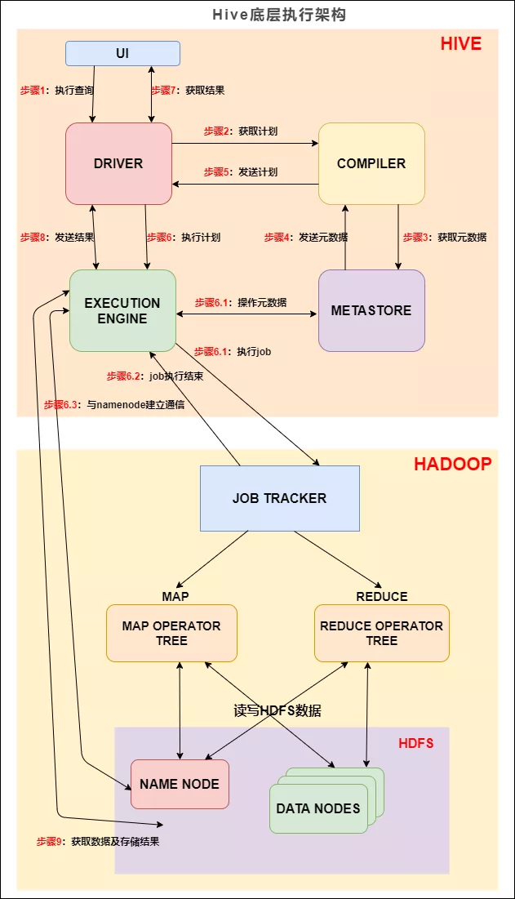

# Hive计算引擎大PK，万字长文解析MapRuce、Tez、Spark三大引擎


# 前言

Hive从2008年始于FaceBook工程师之手，经过10几年的发展至今保持强大的生命力。截止目前Hive已经更新至3.1.x版本，Hive从最开始的为人诟病的速度慢迅速发展，开始支持更多的计算引擎，计算速度大大提升。

------

## MapReduce引擎

**在Hive2.x版本中，HiveSQL会被转化为MR任务，这也是我们经常说的HiveSQL的执行原理。**

我们先来看下 Hive 的底层执行架构图， Hive 的主要组件与 Hadoop 交互的过程：



Hive中 总共有五个组件：

- UI：用户界面。可看作我们提交SQL语句的命令行界面。
- DRIVER：驱动程序。接收查询的组件。该组件实现了会话句柄的概念。
- COMPILER：编译器。负责将 SQL 转化为平台可执行的执行计划。对不同的查询块和查询表达式进行语义分析，并最终借助表和从 metastore 查找的分区元数据来生成执行计划。
- METASTORE：元数据库。存储 Hive 中各种表和分区的所有结构信息。
- EXECUTION ENGINE：执行引擎。负责提交 COMPILER 阶段编译好的执行计划到不同的平台上。

上图的基本流程是：

- 步骤1：UI 调用 DRIVER 的接口；
- 步骤2：DRIVER 为查询创建会话句柄，并将查询发送到 COMPILER(编译器)生成执行计划；
- 步骤3和4：编译器从元数据存储中获取本次查询所需要的元数据，该元数据用于对查询树中的表达式进行类型检查，以及基于查询谓词修建分区；
- 步骤5：编译器生成的计划是分阶段的DAG，每个阶段要么是 map/reduce 作业，要么是一个元数据或者HDFS上的操作。将生成的计划发给 DRIVER。

如果是 map/reduce 作业，该计划包括 map operator trees 和一个  reduce operator tree，执行引擎将会把这些作业发送给 MapReduce ：

- 步骤6、6.1、6.2和6.3：执行引擎将这些阶段提交给适当的组件。在每个 task(mapper/reducer) 中，从HDFS文件中读取与表或中间输出相关联的数据，并通过相关算子树传递这些数据。最终这些数据通过序列化器写入到一个临时HDFS文件中（如果不需要 reduce 阶段，则在 map 中操作）。临时文件用于向计划中后面的 map/reduce 阶段提供数据。
- 步骤7、8和9：最终的临时文件将移动到表的位置，确保不读取脏数据(文件重命名在HDFS中是原子操作)。对于用户的查询，临时文件的内容由执行引擎直接从HDFS读取，然后通过Driver发送到UI。

------

#### Hive SQL 编译成 MapReduce 过程

编译 SQL 的任务是在上节中介绍的 COMPILER（编译器组件）中完成的。Hive将SQL转化为MapReduce任务，整个编译过程分为六个阶段：

-16352497300096.webp)

Hive SQL编译过程

1. `词法、语法解析`: Antlr 定义 SQL 的语法规则，完成 SQL 词法，语法解析，将 SQL 转化为抽象语法树 AST Tree；

> Antlr是一种语言识别的工具，可以用来构造领域语言。使用Antlr构造特定的语言只需要编写一个语法文件，定义词法和语法替换规则即可，Antlr完成了词法分析、语法分析、语义分析、中间代码生成的过程。

1. 语义解析: 遍历 AST Tree，抽象出查询的基本组成单元 QueryBlock；
2. 生成逻辑执行计划: 遍历 QueryBlock，翻译为执行操作树 OperatorTree；
3. 优化逻辑执行计划: 逻辑层优化器进行 OperatorTree 变换，合并 Operator，达到减少 MapReduce Job，减少数据传输及 shuffle 数据量；
4. 生成物理执行计划: 遍历 OperatorTree，翻译为 MapReduce 任务；
5. 优化物理执行计划: 物理层优化器进行 MapReduce 任务的变换，生成最终的执行计划。

下面对这六个阶段详细解析：

为便于理解，我们拿一个简单的查询语句进行展示，对5月23号的地区维表进行查询：

```sql
select * from dim.dim_region where dt = '2021-05-23';
```

**阶段一：词法、语法解析**

根据Antlr定义的sql语法规则，将相关sql进行词法、语法解析，转化为抽象语法树AST Tree：

```
ABSTRACT SYNTAX TREE:
TOK_QUERY
    TOK_FROM 
    TOK_TABREF
           TOK_TABNAME
               dim
                 dim_region
    TOK_INSERT
      TOK_DESTINATION
          TOK_DIR
              TOK_TMP_FILE
        TOK_SELECT
          TOK_SELEXPR
              TOK_ALLCOLREF
        TOK_WHERE
          =
              TOK_TABLE_OR_COL
                  dt
                    '2021-05-23'
```

**阶段二：语义解析**

遍历AST Tree，抽象出查询的基本组成单元QueryBlock：

AST Tree生成后由于其复杂度依旧较高，不便于翻译为mapreduce程序，需要进行进一步抽象和结构化，形成QueryBlock。

QueryBlock是一条SQL最基本的组成单元，包括三个部分：输入源，计算过程，输出。简单来讲一个QueryBlock就是一个子查询。

QueryBlock的生成过程为一个递归过程，先序遍历 AST Tree ，遇到不同的 Token 节点(理解为特殊标记)，保存到相应的属性中。

**阶段三：生成逻辑执行计划**

遍历QueryBlock，翻译为执行操作树OperatorTree：

Hive最终生成的MapReduce任务，Map阶段和Reduce阶段均由OperatorTree组成。

基本的操作符包括：

```sql
TableScanOperator

SelectOperator

FilterOperator

JoinOperator

GroupByOperator

ReduceSinkOperator`
```

Operator在Map Reduce阶段之间的数据传递都是一个流式的过程。每一个Operator对一行数据完成操作后之后将数据传递给childOperator计算。

由于Join/GroupBy/OrderBy均需要在Reduce阶段完成，所以在生成相应操作的Operator之前都会先生成一个ReduceSinkOperator，将字段组合并序列化为Reduce Key/value, Partition Key。

**阶段四：优化逻辑执行计划**

Hive中的逻辑查询优化可以大致分为以下几类：

- 投影修剪
- 推导传递谓词
- 谓词下推
- 将Select-Select，Filter-Filter合并为单个操作
- 多路 Join
- 查询重写以适应某些列值的Join倾斜

**阶段五：生成物理执行计划**

生成物理执行计划即是将逻辑执行计划生成的OperatorTree转化为MapReduce Job的过程，主要分为下面几个阶段：

1. 对输出表生成MoveTask
2. 从OperatorTree的其中一个根节点向下深度优先遍历
3. ReduceSinkOperator标示Map/Reduce的界限，多个Job间的界限
4. 遍历其他根节点，遇过碰到JoinOperator合并MapReduceTask
5. 生成StatTask更新元数据
6. 剪断Map与Reduce间的Operator的关系

**阶段六：优化物理执行计划**

Hive中的物理优化可以大致分为以下几类：

- 分区修剪(Partition Pruning)
- 基于分区和桶的扫描修剪(Scan pruning)
- 如果查询基于抽样，则扫描修剪
- 在某些情况下，在 map 端应用 Group By
- 在 mapper 上执行 Join
- 优化 Union，使Union只在 map 端执行
- 在多路 Join 中，根据用户提示决定最后流哪个表
- 删除不必要的 ReduceSinkOperators
- 对于带有Limit子句的查询，减少需要为该表扫描的文件数
- 对于带有Limit子句的查询，通过限制 ReduceSinkOperator 生成的内容来限制来自 mapper 的输出
- 减少用户提交的SQL查询所需的Tez作业数量
- 如果是简单的提取查询，避免使用MapReduce作业
- 对于带有聚合的简单获取查询，执行不带 MapReduce 任务的聚合
- 重写 Group By 查询使用索引表代替原来的表
- 当表扫描之上的谓词是相等谓词且谓词中的列具有索引时，使用索引扫描

经过以上六个阶段，SQL 就被解析映射成了集群上的 MapReduce 任务。

------

### Explain语法

Hive Explain 语句类似Mysql 的Explain 语句，提供了对应查询的执行计划，对于我们在理解Hive底层逻辑、Hive调优、Hive SQL书写等方面提供了一个参照，在我们的生产工作了是一个很有意义的工具。

#### Hive Explain语法

> EXPLAIN [EXTENDED|CBO|AST|DEPENDENCY|AUTHORIZATION|LOCKS|VECTORIZATION|ANALYZE] query

Hive Explain的语法规则如上，后面将按照对应的子句进行探讨。

EXTENDED 语句会在执行计划中产生关于算子（Operator）的额外信息，这些信息都是典型的物理信息，如文件名称等。

在执行Explain QUERY 之后，一个查询会被转化为包含多个Stage的语句（看起来更像一个DAG）。这些Stages要么是map/reduce Stage，要么是做些元数据或文件系统操作的Stage （如 move 、rename等）。Explain的输出包含2个部分：

- 执行计划不同Stage之间的以来关系（Dependency）
- 每个Stage的执行描述信息（Description）

以下将通过一个简单的例子进行解释。

**执行Explain 语句**

```sql
EXPLAIN 
SELECT SUM(id) FROM test1;
```

**Explain输出结果解析**

- 依赖图

```sql
STAGE DEPENDENCIES:
  Stage-1 is a root stage
  Stage-0 depends on stages: Stage-1

STAGE PLANS:
  Stage: Stage-1
    Map Reduce
      Map Operator Tree:
          TableScan
            alias: test1
            Statistics: Num rows: 6 Data size: 75 Basic stats: COMPLETE Column stats: NONE
            Select Operator
              expressions: id (type: int)
              outputColumnNames: id
              Statistics: Num rows: 6 Data size: 75 Basic stats: COMPLETE Column stats: NONE
              Group By Operator
                aggregations: sum(id)
                mode: hash
                outputColumnNames: _col0
                Statistics: Num rows: 1 Data size: 8 Basic stats: COMPLETE Column stats: NONE
                Reduce Output Operator
                  sort order:
                  Statistics: Num rows: 1 Data size: 8 Basic stats: COMPLETE Column stats: NONE
                  value expressions: _col0 (type: bigint)
      Reduce Operator Tree:
        Group By Operator
          aggregations: sum(VALUE._col0)
          mode: mergepartial
          outputColumnNames: _col0
          Statistics: Num rows: 1 Data size: 8 Basic stats: COMPLETE Column stats: NONE
          File Output Operator
            compressed: false
            Statistics: Num rows: 1 Data size: 8 Basic stats: COMPLETE Column stats: NONE
            table:
                input format: org.apache.hadoop.mapred.SequenceFileInputFormat
                output format: org.apache.hadoop.hive.ql.io.HiveSequenceFileOutputFormat
                serde: org.apache.hadoop.hive.serde2.lazy.LazySimpleSerDe

  Stage: Stage-0
    Fetch Operator
      limit: -1
      Processor Tree:
        ListSink
```

> 一个HIVE查询被转换为一个由一个或多个stage组成的序列（有向无环图DAG）。这些stage可以是MapReduce stage，也可以是负责元数据存储的stage，也可以是负责文件系统的操作（比如移动和重命名）的stage。

我们将上述结果拆分看，先从最外层开始，包含两个大的部分:

- stage dependencies：各个stage之间的依赖性
- stage plan：各个stage的执行计划

先看第一部分 stage dependencies ，包含两个 stage，Stage-1 是根stage，说明这是开始的stage，Stage-0 依赖 Stage-1，Stage-1执行完成后执行Stage-0。

再看第二部分 stage plan，里面有一个 Map Reduce，一个MR的执行计划分为两个部分

- Map Operator Tree：MAP端的执行计划树
- Reduce Operator Tree：Reduce端的执行计划树

这两个执行计划树里面包含这条sql语句的 operator

1. TableScan：表扫描操作，map端第一个操作肯定是加载表，所以就是表扫描操作，常见的属性：

```sql
alias：表名称
Statistics：表统计信息，包含表中数据条数，数据大小等
```

1. Select Operator：选取操作，常见的属性 ：

```sql
expressions：需要的字段名称及字段类型
outputColumnNames：输出的列名称
Statistics：表统计信息，包含表中数据条数，数据大小等
```

1. Group By Operator：分组聚合操作，常见的属性：

```sql
aggregations：显示聚合函数信息.
mode：聚合模式，值有 hash：随机聚合，就是hash partition；partial：局部聚合；final：最终聚合.
keys：分组的字段，如果没有分组，则没有此字段.
outputColumnNames：聚合之后输出列名.
Statistics：表统计信息，包含分组聚合之后的数据条数，数据大小等.
```

1. Reduce Output Operator：输出到reduce操作，常见属性：

```sql
sort order：值为空 不排序；值为 + 正序排序，值为 - 倒序排序；值为 ± 排序的列为两列，第一列为正序，第二列为倒序.
```

1. Filter Operator：过滤操作，常见的属性：

```sql
predicate：过滤条件，如sql语句中的where id>=1，则此处显示(id >= 1).
```

1. Map Join Operator：join 操作，常见的属性：

```sql
condition map：join方式 ，如Inner Join 0 to 1 Left Outer Join0 to 2
keys: join 的条件字段
outputColumnNames：join 完成之后输出的字段
Statistics：join 完成之后生成的数据条数，大小等
```

1. File Output Operator：文件输出操作，常见的属性:

```sql
compressed：是否压缩
table：表的信息，包含输入输出文件格式化方式，序列化方式等
```

1. Fetch Operator 客户端获取数据操作，常见的属性：

```sql
limit，值为 -1 表示不限制条数，其他值为限制的条数
```

------

#### Explain使用场景

##### join 语句会过滤 Null 的值吗？

现在，我们在hive cli 输入以下查询计划语句

```sql
select a.id,b.user_name from test1 a join test2 b on a.id=b.id;
```

然后执行：

```sql
explain select a.id,b.user_name from test1 a join test2 b on a.id=b.id;
```

结果:

```sql
TableScan
 alias: a
 Statistics: Num rows: 6 Data size: 75 Basic stats: COMPLETE Column stats: NONE
 Filter Operator
    predicate: id is not null (type: boolean)
    Statistics: Num rows: 6 Data size: 75 Basic stats: COMPLETE Column stats: NONE
    Select Operator
        expressions: id (type: int)
        outputColumnNames: _col0
        Statistics: Num rows: 6 Data size: 75 Basic stats: COMPLETE Column stats: NONE
        HashTable Sink Operator
           keys:
             0 _col0 (type: int)
             1 _col0 (type: int)
 ...
```

> 从上述结果可以看到 predicate: id is not null 这样一行，说明 join 时会自动过滤掉关联字段为 null 值的情况，但 left join 或 full join 是不会自动过滤null值的。

##### group by 分组语句会进行排序吗？

```sql
select id,max(user_name) from test1 group by id;
```

直接来看 explain 之后结果:

```sql
TableScan
    alias: test1
    Statistics: Num rows: 9 Data size: 108 Basic stats: COMPLETE Column stats: NONE
    Select Operator
        expressions: id (type: int), user_name (type: string)
        outputColumnNames: id, user_name
        Statistics: Num rows: 9 Data size: 108 Basic stats: COMPLETE Column stats: NONE
        Group By Operator
           aggregations: max(user_name)
           keys: id (type: int)
           mode: hash
           outputColumnNames: _col0, _col1
           Statistics: Num rows: 9 Data size: 108 Basic stats: COMPLETE Column stats: NONE
           Reduce Output Operator
             key expressions: _col0 (type: int)
             sort order: +
             Map-reduce partition columns: _col0 (type: int)
             Statistics: Num rows: 9 Data size: 108 Basic stats: COMPLETE Column stats: NONE
             value expressions: _col1 (type: string)
 ...
```

我们看 Group By Operator，里面有 keys: id (type: int) 说明按照 id 进行分组的，再往下看还有 sort order: + ，说明是按照 id 字段进行正序排序的。

##### 哪条sql执行效率高

观察如下两条sql：

```sql
SELECT
 a.id,
 b.user_name
FROM
 test1 a
JOIN test2 b ON a.id = b.id
WHERE
 a.id > 2;
SELECT
 a.id,
 b.user_name
FROM
 (SELECT * FROM test1 WHERE id > 2) a
JOIN test2 b ON a.id = b.id;
```

这两条sql语句输出的结果是一样的，但是哪条sql执行效率高呢？

有人说第一条sql执行效率高，因为第二条sql有子查询，子查询会影响性能；有人说第二条sql执行效率高，因为先过滤之后，在进行join时的条数减少了，所以执行效率就高了。到底哪条sql效率高呢，我们直接在sql语句前面加上 explain，看下执行计划不就知道了嘛！

在第一条sql语句前加上 explain，得到如下结果:

```sql
hive (default)> explain select a.id,b.user_name from test1 a join test2 b on a.id=b.id where a.id >2;
OK
Explain
STAGE DEPENDENCIES:
  Stage-4 is a root stage
  Stage-3 depends on stages: Stage-4
  Stage-0 depends on stages: Stage-3

STAGE PLANS:
  Stage: Stage-4
    Map Reduce Local Work
      Alias -> Map Local Tables:
        $hdt$_0:a
          Fetch Operator
            limit: -1
      Alias -> Map Local Operator Tree:
        $hdt$_0:a
          TableScan
            alias: a
            Statistics: Num rows: 6 Data size: 75 Basic stats: COMPLETE Column stats: NONE
            Filter Operator
              predicate: (id > 2) (type: boolean)
              Statistics: Num rows: 2 Data size: 25 Basic stats: COMPLETE Column stats: NONE
              Select Operator
                expressions: id (type: int)
                outputColumnNames: _col0
                Statistics: Num rows: 2 Data size: 25 Basic stats: COMPLETE Column stats: NONE
                HashTable Sink Operator
                  keys:
                    0 _col0 (type: int)
                    1 _col0 (type: int)

  Stage: Stage-3
    Map Reduce
      Map Operator Tree:
          TableScan
            alias: b
            Statistics: Num rows: 6 Data size: 75 Basic stats: COMPLETE Column stats: NONE
            Filter Operator
              predicate: (id > 2) (type: boolean)
              Statistics: Num rows: 2 Data size: 25 Basic stats: COMPLETE Column stats: NONE
              Select Operator
                expressions: id (type: int), user_name (type: string)
                outputColumnNames: _col0, _col1
                Statistics: Num rows: 2 Data size: 25 Basic stats: COMPLETE Column stats: NONE
                Map Join Operator
                  condition map:
                       Inner Join 0 to 1
                  keys:
                    0 _col0 (type: int)
                    1 _col0 (type: int)
                  outputColumnNames: _col0, _col2
                  Statistics: Num rows: 2 Data size: 27 Basic stats: COMPLETE Column stats: NONE
                  Select Operator
                    expressions: _col0 (type: int), _col2 (type: string)
                    outputColumnNames: _col0, _col1
                    Statistics: Num rows: 2 Data size: 27 Basic stats: COMPLETE Column stats: NONE
                    File Output Operator
                      compressed: false
                      Statistics: Num rows: 2 Data size: 27 Basic stats: COMPLETE Column stats: NONE
                      table:
                          input format: org.apache.hadoop.mapred.SequenceFileInputFormat
                          output format: org.apache.hadoop.hive.ql.io.HiveSequenceFileOutputFormat
                          serde: org.apache.hadoop.hive.serde2.lazy.LazySimpleSerDe
      Local Work:
        Map Reduce Local Work

  Stage: Stage-0
    Fetch Operator
      limit: -1
      Processor Tree:
        ListSink
```

在第二条sql语句前加上 explain，得到如下结果:

```sql
hive (default)> explain select a.id,b.user_name from(select * from  test1 where id>2 ) a join test2 b on a.id=b.id;
OK
Explain
STAGE DEPENDENCIES:
  Stage-4 is a root stage
  Stage-3 depends on stages: Stage-4
  Stage-0 depends on stages: Stage-3

STAGE PLANS:
  Stage: Stage-4
    Map Reduce Local Work
      Alias -> Map Local Tables:
        $hdt$_0:test1
          Fetch Operator
            limit: -1
      Alias -> Map Local Operator Tree:
        $hdt$_0:test1
          TableScan
            alias: test1
            Statistics: Num rows: 6 Data size: 75 Basic stats: COMPLETE Column stats: NONE
            Filter Operator
              predicate: (id > 2) (type: boolean)
              Statistics: Num rows: 2 Data size: 25 Basic stats: COMPLETE Column stats: NONE
              Select Operator
                expressions: id (type: int)
                outputColumnNames: _col0
                Statistics: Num rows: 2 Data size: 25 Basic stats: COMPLETE Column stats: NONE
                HashTable Sink Operator
                  keys:
                    0 _col0 (type: int)
                    1 _col0 (type: int)

  Stage: Stage-3
    Map Reduce
      Map Operator Tree:
          TableScan
            alias: b
            Statistics: Num rows: 6 Data size: 75 Basic stats: COMPLETE Column stats: NONE
            Filter Operator
              predicate: (id > 2) (type: boolean)
              Statistics: Num rows: 2 Data size: 25 Basic stats: COMPLETE Column stats: NONE
              Select Operator
                expressions: id (type: int), user_name (type: string)
                outputColumnNames: _col0, _col1
                Statistics: Num rows: 2 Data size: 25 Basic stats: COMPLETE Column stats: NONE
                Map Join Operator
                  condition map:
                       Inner Join 0 to 1
                  keys:
                    0 _col0 (type: int)
                    1 _col0 (type: int)
                  outputColumnNames: _col0, _col2
                  Statistics: Num rows: 2 Data size: 27 Basic stats: COMPLETE Column stats: NONE
                  Select Operator
                    expressions: _col0 (type: int), _col2 (type: string)
                    outputColumnNames: _col0, _col1
                    Statistics: Num rows: 2 Data size: 27 Basic stats: COMPLETE Column stats: NONE
                    File Output Operator
                      compressed: false
                      Statistics: Num rows: 2 Data size: 27 Basic stats: COMPLETE Column stats: NONE
                      table:
                          input format: org.apache.hadoop.mapred.SequenceFileInputFormat
                          output format: org.apache.hadoop.hive.ql.io.HiveSequenceFileOutputFormat
                          serde: org.apache.hadoop.hive.serde2.lazy.LazySimpleSerDe
      Local Work:
        Map Reduce Local Work

  Stage: Stage-0
    Fetch Operator
      limit: -1
      Processor Tree:
        ListSink
```

- 除了表别名不一样，其他的执行计划完全一样，都是先进行 where 条件过滤，在进行 join 条件关联。说明 hive 底层会自动帮我们进行优化，所以这两条sql语句执行效率是一样的。
- 以上仅列举了3个我们生产中既熟悉又有点迷糊的例子，explain 还有很多其他的用途，如查看stage的依赖情况、排查数据倾斜、hive 调优等，小伙伴们可以自行尝试。

###### explain dependency的用法

explain dependency用于描述一段SQL需要的数据来源，输出是一个json格式的数据，里面包含以下两个部分的内容：

- input_partitions：描述一段SQL依赖的数据来源表分区，里面存储的是分区名的列表，如果整段SQL包含的所有表都是非分区表，则显示为空。
- input_tables：描述一段SQL依赖的数据来源表，里面存储的是Hive表名的列表。

使用explain dependency查看SQL查询非分区普通表，在 hive cli 中输入以下命令：

```sql
explain dependency select s_age,count(1) num from student_orc;
```

得到如下结果：

```sql
{"input_partitions":[],"input_tables":[{"tablename":"default@student_tb _orc","tabletype":"MANAGED_TABLE"}]}
```

使用explain dependency查看SQL查询分区表，在 hive cli 中输入以下命令：

```sql
explain dependency select s_age,count(1) num from student_orc_partition;
```

得到结果：

```sql
{"input_partitions":[{"partitionName":"default@student_orc_partition@ part=0"}, 
{"partitionName":"default@student_orc_partition@part=1"}, 
{"partitionName":"default@student_orc_partition@part=2"}, 
{"partitionName":"default@student_orc_partition@part=3"},
{"partitionName":"default@student_orc_partition@part=4"}, 
{"partitionName":"default@student_orc_partition@part=5"},
{"partitionName":"default@student_orc_partition@part=6"},
{"partitionName":"default@student_orc_partition@part=7"},
{"partitionName":"default@student_orc_partition@part=8"},
{"partitionName":"default@student_orc_partition@part=9"}], 
"input_tables":[{"tablename":"default@student_orc_partition", "tabletype":"MANAGED_TABLE"}]
```

explain dependency的使用场景有两个：

- 场景一：快速排除。快速排除因为读取不到相应分区的数据而导致任务数据输出异常。例如，在一个以天分区的任务中，上游任务因为生产过程不可控因素出现异常或者空跑，导致下游任务引发异常。通过这种方式，可以快速查看SQL读取的分区是否出现异常。
- 场景二：理清表的输入，帮助理解程序的运行，特别是有助于理解有多重子查询，多表连接的依赖输入。

下面通过两个案例来看explain dependency的实际运用：

###### 识别看似等价的代码

有如下两条看似相等的sql：

代码一：

```sql
select 
a.s_no 
from student_orc_partition a 
inner join 
student_orc_partition_only b 
on a.s_no=b.s_no and a.part=b.part and a.part>=1 and a.part<=2;
```

代码二：

```sql
select 
a.s_no 
from student_orc_partition a 
inner join 
student_orc_partition_only b 
on a.s_no=b.s_no and a.part=b.part 
where a.part>=1 and a.part<=2;
```

我们看下上述两段代码explain dependency的输出结果：

代码1的explain dependency结果：

```sql
{"input_partitions": 
[{"partitionName":"default@student_orc_partition@part=0"}, 
{"partitionName":"default@student_orc_partition@part=1"}, 
{"partitionName":"default@student_orc_partition@part=2"},
{"partitionName":"default@student_orc_partition_only@part=1"}, 
{"partitionName":"default@student_orc_partition_only@part=2"}], 
"input_tables": [{"tablename":"default@student_orc_partition","tabletype":"MANAGED_TABLE"}, {"tablename":"default@student_orc_partition_only","tabletype":"MANAGED_TABLE"}]}
```

代码2的explain dependency结果：

```sql
{"input_partitions": 
[{"partitionName":"default@student_orc_partition@part=1"}, 
{"partitionName" : "default@student_orc_partition@part=2"},
{"partitionName" :"default@student_orc_partition_only@part=1"},
{"partitionName":"default@student_orc_partition_only@part=2"}], 
"input_tables": [{"tablename":"default@student_orc_partition","tabletype":"MANAGED_TABLE"}, {"tablename":"default@student_orc_partition_only","tabletype":"MANAGED_TABLE"}]}
```

> 通过上面的输出结果可以看到，其实上述的两个SQL并不等价，代码1在内连接（inner join）中的连接条件（on）中加入非等值的过滤条件后，并没有将内连接的左右两个表按照过滤条件进行过滤，内连接在执行时会多读取part=0的分区数据。而在代码2中，会过滤掉不符合条件的分区。

###### 识别SQL读取数据范围的差别

有如下两段代码：

代码一：

```sql
explain dependency
select
a.s_no 
from student_orc_partition a 
left join 
student_orc_partition_only b 
on a.s_no=b.s_no and a.part=b.part and b.part>=1 and b.part<=2;
```

代码二：

```sql
explain dependency 
select 
a.s_no 
from student_orc_partition a 
left join 
student_orc_partition_only b 
on a.s_no=b.s_no and a.part=b.part and a.part>=1 and a.part<=2;
```

以上两个代码的数据读取范围是一样的吗？答案是不一样，我们通过explain dependency来看下：

代码1的explain dependency结果：

```sql
{"input_partitions": 
[{"partitionName": "default@student_orc_partition@part=0"}, 
{"partitionName":"default@student_orc_partition@part=1"}, …中间省略7个分区
{"partitionName":"default@student_orc_partition@part=9"}, 
{"partitionName":"default@student_orc_partition_only@part=1"}, 
{"partitionName":"default@student_orc_partition_only@part=2"}], 
"input_tables": [{"tablename":"default@student_orc_partition","tabletype":"MANAGED_TABLE"}, {"tablename":"default@student_orc_partition_only","tabletype":"MANAGED_TABLE"}]}
```

代码2的explain dependency结果：

```sql
{"input_partitions": 
[{"partitionName":"default@student_orc_partition@part=0"}, 
{"partitionName":"default@student_orc_partition@part=1"}, …中间省略7个分区 
{"partitionName":"default@student_orc_partition@part=9"}, 
{"partitionName":"default@student_orc_partition_only@part=0"}, 
{"partitionName":"default@student_orc_partition_only@part=1"}, …中间省略7个分区 
{"partitionName":"default@student_orc_partition_only@part=9"}],
"input_tables": [{"tablename":"default@student_orc_partition","tabletype":"MANAGED_TABLE"}, {"tablename":"default@student_orc_partition_only","tabletype":"MANAGED_TABLE"}]}
```

> 可以看到，对左外连接在连接条件中加入非等值过滤的条件，如果过滤条件是作用于右表（b表）有起到过滤的效果，则右表只要扫描两个分区即可，但是左表（a表）会进行全表扫描。如果过滤条件是针对左表，则完全没有起到过滤的作用，那么两个表将进行全表扫描。这时的情况就如同全外连接一样都需要对两个数据进行全表扫描。

在使用过程中，容易认为代码片段2可以像代码片段1一样进行数据过滤，通过查看explain dependency的输出结果，可以知道不是如此。

###### explain authorization 的用法

通过explain authorization可以知道当前SQL访问的数据来源（INPUTS） 和数据输出（OUTPUTS），以及当前Hive的访问用户 （CURRENT_USER）和操作（OPERATION）。

在 hive cli 中输入以下命令：

```sql
explain authorization 
select variance(s_score) from student_tb_orc;
```

结果如下：

```sql
INPUTS: 
  default@student_tb_orc 
OUTPUTS: 
  hdfs://node01:8020/tmp/hive/hdfs/cbf182a5-8258-4157-9194- 90f1475a3ed5/-mr-10000 
CURRENT_USER: 
  hdfs 
OPERATION: 
  QUERY 
AUTHORIZATION_FAILURES: 
  No privilege 'Select' found for inputs { database:default, table:student_ tb_orc, columnName:s_score}
```

从上面的信息可知：

- 上面案例的数据来源是defalut数据库中的 student_tb_orc表;
- 数据的输出路径是hdfs://node01:8020/tmp/hive/hdfs/cbf182a5-8258-4157-9194-90f1475a3ed5/-mr-10000;
- 当前的操作用户是hdfs，操作是查询;
- 观察上面的信息我们还会看到AUTHORIZATION_FAILURES信息，提示对当前的输入没有查询权限，但如果运行上面的SQL的话也能够正常运行。为什么会出现这种情况？Hive在默认不配置权限管理的情况下不进行权限验证，所有的用户在Hive里面都是超级管理员，即使不对特定的用户进行赋权，也能够正常查询。

------

## Tez引擎

Tez是Apache开源的支持DAG作业的计算框架，是支持HADOOP2.x的重要引擎。它源于MapReduce框架，核心思想是将Map和Reduce两个操作进一步拆分，分解后的元操作可以任意灵活组合，产生新的操作，这些操作经过一些控制程序组装后，可形成一个大的DAG作业。

.webp)

Tez将Map task和Reduce task进一步拆分为如下图所示：


.webp)

Tez的task由Input、processor、output阶段组成，可以表达所有复杂的map、reduce操作，如下图:

.webp)

#### Tez的实现

Tez对外提供了6种可编程组件，分别是：

1）Input：对输入数据源的抽象，它解析输入数据格式，并吐出一个个Key/value

2）Output：对输出数据源的抽象，它将用户程序产生的Key/value写入文件系统

3）Paritioner：对数据进行分片，类似于MR中的Partitioner

4）Processor：对计算的抽象，它从一个Input中获取数据，经处理后，通过Output输出

5）Task：对任务的抽象，每个Task由一个Input、Ouput和Processor组成

6）Maser：管理各个Task的依赖关系，并按顺依赖关系执行他们

除了以上6种组件，Tez还提供了两种算子，分别是Sort（排序）和Shuffle（混洗），为了用户使用方便，它还提供了多种Input、Output、Task和Sort的实现，具体如下：

1）Input实现：LocalMergedInput（文件本地合并后作为输入），ShuffledMergedInput（远程拷贝数据且合并后作为输入）

2）Output实现：InMemorySortedOutput（内存排序后输出），LocalOnFileSorterOutput（本地磁盘排序后输出），OnFileSortedOutput（磁盘排序后输出）

3）Task实现：RunTimeTask（非常简单的Task，基本没做什么事）

4）Sort实现：DefaultSorter（本地数据排序），InMemoryShuffleSorter（远程拷贝数据并排序）

为了展示Tez的使用方法和验证Tez框架的可用性，Apache在YARN MRAppMaster基础上使用Tez编程接口重新设计了MapReduce框架，使之可运行在YARN中。为此，Tez提供了以下几个组件：

1）Input：SimpleInput（直接使用MR InputFormat获取数据）

2）Output：SimpleOutput（直接使用MR OutputFormat获取数据）

3）Partition：MRPartitioner（直接使用MR Partitioner获取数据）

4）Processor：MapProcessor（执行Map Task），ReduceProcessor（执行Reduce Task）

5）Task：FinalTask，InitialTask，initialTaskWithInMemSort，InitialTaskWithLocalSort ，IntermediateTask，LocalFinalTask，MapOnlyTask。

对于MapReduce作业而言，如果只有Map Task，则使用MapOnlyTask，否则，Map Task使用InitialTaskWithInMemSort而Reduce Task用FinalTask。当然，如果你想编写其他类型的作业，可使用以上任何几种Task进行组合，比如”InitialTaskWithInMemSort –> FinalTask”是MapReduce作业。

为了减少Tez开发工作量，并让Tez能够运行在YARN之上，Tez重用了大部分YARN中MRAppMater的代码，包括客户端、资源申请、任务推测执行、任务启动等。

**Tez和MapReduce作业的比较：**

- Tez绕过了MapReduce很多不必要的中间的数据存储和读取的过程，直接在一个作业中表达了MapReduce需要多个作业共同协作才能完成的事情。
- Tez和MapReduce一样都运行使用YARN作为资源调度和管理。但与MapReduce on YARN不同，Tez on YARN并不是将作业提交到ResourceManager，而是提交到AMPoolServer的服务上，AMPoolServer存放着若干已经预先启动ApplicationMaster的服务。
- 当用户提交一个作业上来后，AMPoolServer从中选择一个ApplicationMaster用于管理用户提交上来的作业，这样既可以节省ResourceManager创建ApplicationMaster的时间，而又能够重用每个ApplicationMaster的资源，节省了资源释放和创建时间。

**Tez相比于MapReduce有几点重大改进：**

- 当查询需要有多个reduce逻辑时，Hive的MapReduce引擎会将计划分解，每个Redcue提交一个MR作业。这个链中的所有MR作业都需要逐个调度，每个作业都必须从HDFS中重新读取上一个作业的输出并重新洗牌。而在Tez中，几个reduce接收器可以直接连接，数据可以流水线传输，而不需要临时HDFS文件，这种模式称为MRR（Map-reduce-reduce*）。
- Tez还允许一次发送整个查询计划，实现应用程序动态规划，从而使框架能够更智能地分配资源，并通过各个阶段流水线传输数据。对于更复杂的查询来说，这是一个巨大的改进，因为它消除了IO/sync障碍和各个阶段之间的调度开销。
- 在MapReduce计算引擎中，无论数据大小，在Shuffle阶段都以相同的方式执行，将数据序列化到磁盘，再由下游的程序去拉取，并反序列化。Tez可以允许小数据集完全在内存中处理，而MapReduce中没有这样的优化。仓库查询经常需要在处理完大量的数据后对小型数据集进行排序或聚合，Tez的优化也能极大地提升效率。

给 Hive 换上 Tez 非常简单，只需给 hive-site.xml 中设置：

```xml
<property>
    <name>hive.execution.engine</name>
    <value>tez</value>
</property>
```

设置hive.execution.engine为 tez 后进入到 Hive 执行 SQL：

```sql
hive> select count(*) as c from userinfo;
Query ID = zhenqin_20161104150743_4155afab-4bfa-4e8a-acb0-90c8c50ecfb5
Total jobs = 1
Launching Job 1 out of 1
 
 
Status: Running (Executing on YARN cluster with App id application_1478229439699_0007)
 
--------------------------------------------------------------------------------
        VERTICES      STATUS  TOTAL  COMPLETED  RUNNING  PENDING  FAILED  KILLED
--------------------------------------------------------------------------------
Map 1 ..........   SUCCEEDED      2          2        0        0       0       0
Reducer 2 ......   SUCCEEDED      1          1        0        0       0       0
--------------------------------------------------------------------------------
VERTICES: 02/02  [==========================>>] 100%  ELAPSED TIME: 6.19 s     
--------------------------------------------------------------------------------
OK
1000000
Time taken: 6.611 seconds, Fetched: 1 row(s)
```

可以看到，我的 userinfo 中有 100W 条记录，执行一遍 count 需要 6.19s。现在把 engine 换为 mr

```sql
set hive.execution.engine=mr;
```

再次执行 count userinfo:

```sql
hive> select count(*) as c from userinfo;
Query ID = zhenqin_20161104152022_c7e6c5bd-d456-4ec7-b895-c81a369aab27
Total jobs = 1
Launching Job 1 out of 1
Starting Job = job_1478229439699_0010, Tracking URL = http://localhost:8088/proxy/application_1478229439699_0010/
Kill Command = /Users/zhenqin/software/hadoop/bin/hadoop job  -kill job_1478229439699_0010
Hadoop job information for Stage-1: number of mappers: 1; number of reducers: 1
2016-11-04 15:20:28,323 Stage-1 map = 0%,  reduce = 0%
2016-11-04 15:20:34,587 Stage-1 map = 100%,  reduce = 0%
2016-11-04 15:20:40,796 Stage-1 map = 100%,  reduce = 100%
Ended Job = job_1478229439699_0010
MapReduce Jobs Launched: 
Stage-Stage-1: Map: 1  Reduce: 1   HDFS Read: 215 HDFS Write: 0 SUCCESS
Total MapReduce CPU Time Spent: 0 msec
OK
1000000
Time taken: 19.46 seconds, Fetched: 1 row(s)
hive> 
```

可以看到，使用 Tez 效率比 MapReduce 有近3倍的提升。而且，Hive 在使用 Tez 引擎执行时，有 ==>> 动态的进度指示。而在使用 mr 时，只有日志输出 map and reduce 的进度百分比。使用 tez，输出的日志也清爽很多。

在我测试的很多复杂的 SQL，Tez 的都比 MapReduce 快很多，快慢取决于 SQL 的复杂度。执行简单的 select 等并不能体现 tez 的优势。Tez 内部翻译 SQL 能任意的 Map，Reduce，Reduce 组合，而 MR 只能 Map->Reduce->Map->Reduce，因此在执行复杂 SQL 时， Tez 的优势明显。

------

#### Tez 参数优化

优化参参数（在同样条件下，使用了tez从300s+降到200s+）

```sql
set hive.execution.engine=tez;
set mapred.job.name=recommend_user_profile_$idate;
set mapred.reduce.tasks=-1;
set hive.exec.reducers.max=160;
set hive.auto.convert.join=true;
set hive.exec.parallel=true;
set hive.exec.parallel.thread.number=16; 
set hive.optimize.skewjoin=true;
set hive.exec.reducers.bytes.per.reducer=100000000;
set mapred.max.split.size=200000000;
set mapred.min.split.size.per.node=100000000;
set mapred.min.split.size.per.rack=100000000;
set hive.hadoop.supports.splittable.combineinputformat=true;
set hive.input.format=org.apache.hadoop.hive.ql.io.CombineHiveInputFormat;
```

------

#### Tez内存优化

**1. AM、Container大小设置**

```sql
tez.am.resource.memory.mb
```

> 参数说明：Set tez.am.resource.memory.mb tobe the same as yarn.scheduler.minimum-allocation-mb the YARNminimum container size.

```sql
hive.tez.container.size
```

> 参数说明：Set hive.tez.container.size to be the same as or a small multiple(1 or 2 times that) of YARN container size yarn.scheduler.minimum-allocation-mb but NEVER more than yarn.scheduler.maximum-allocation-mb.

**2. AM、Container JVM参数设置**

```sql
tez.am.launch.cmd-opts 
```

> 默认值：80% * tez.am.resource.memory.mb,一般不需要调整

```sql
hive.tez.java.ops
```

> 默认值：80% * hive.tez.container.size 参数说明：Hortonworks建议"–server –Djava.net.preferIPv4Stack=true–XX:NewRatio=8 –XX:+UseNUMA –XX:UseG1G"

```sql
tez.container.max.java.heap.fraction
```

> 默认值：0.8,参数说明：task/AM占用JVM Xmx的比例，该参数建议调整，需根据具体业务情况修改；

**3. Hive内存Map Join参数设置**

```sql
tez.runtime.io.sort.mb
```

> 默认值：100,参数说明：输出排序需要的内存大小。建议值：40% * hive.tez.container.size，一般不超过2G.

```sql
hive.auto.convert.join.noconditionaltask
```

> 默认值：true,参数说明：是否将多个mapjoin合并为一个，使用默认值

```sql
hive.auto.convert.join.noconditionaltask.size
```

> 默认值为10MB,参数说明：多个mapjoin转换为1个时，所有小表的文件大小总和的最大值，这个值只是限制输入的表文件的大小，并不代表实际mapjoin时hashtable的大小。建议值：1/3 * hive.tez.container.size

```sql
tez.runtime.unordered.output.buffer.size-mb
```

> 默认值：100,参数说明：Size of the buffer to use if not writing directly to disk。建议值: 10% * hive.tez.container.size.

**4. Container重用设置**

```sql
tez.am.container.reuse.enabled
```

> 默认值：true,参数说明：Container重用开关

------

## Spark引擎

Hive社区于2014年推出了Hive on Spark项目（HIVE-7292），将Spark作为继MapReduce和Tez之后Hive的第三个计算引擎。该项目由Cloudera、Intel和MapR等几家公司共同开发，并受到了来自Hive和Spark两个社区的共同关注。通过该项目，可以提高Hive查询的性能，同时为已经部署了Hive或者Spark的用户提供了更加灵活的选择，从而进一步提高Hive和Spark的普及率。

.webp)

#### 总体设计

Hive on Spark总体的设计思路是，尽可能重用Hive逻辑层面的功能；从生成物理计划开始，提供一整套针对Spark的实现，比如 SparkCompiler、SparkTask等，这样Hive的查询就可以作为Spark的任务来执行了。以下是几点主要的设计原则。

- 尽可能减少对Hive原有代码的修改。这是和之前的Shark设计思路最大的不同。Shark对Hive的改动太大以至于无法被Hive社区接受，Hive on Spark尽可能少改动Hive的代码，从而不影响Hive目前对MapReduce和Tez的支持。同时，Hive on Spark保证对现有的MapReduce和Tez模式在功能和性能方面不会有任何影响。
- 对于选择Spark的用户，应使其能够自动的获取Hive现有的和未来新增的功能。
- 尽可能降低维护成本，保持对Spark依赖的松耦合。

基于以上思路和原则，具体的一些设计架构如下。

Hive 的用户可以通过hive.execution.engine来设置计算引擎，目前该参数可选的值为mr和tez。为了实现Hive on Spark，我们将spark作为该参数的第三个选项。要开启Hive on Spark模式，用户仅需将这个参数设置为spark即可。

在hive中使用以下语句开启:

```sql
hive> set hive.execution.engine=spark;
```

#### 总体设计

Spark 以分布式可靠数据集（Resilient Distributed Dataset，RDD）作为其数据抽象，因此我们需要将Hive的表转化为RDD以便Spark处理。本质上，Hive的表和Spark的 HadoopRDD都是HDFS上的一组文件，通过InputFormat和RecordReader读取其中的数据，因此这个转化是自然而然的。

Spark为RDD提供了一系列的转换（Transformation），其中有些转换也是面向SQL 的，如groupByKey、join等。但如果使用这些转换（就如Shark所做的那样），就意味着我们要重新实现一些Hive已有的功能；而且当 Hive增加新的功能时，我们需要相应地修改Hive on Spark模式。有鉴于此，我们选择将Hive的操作符包装为Function，然后应用到RDD上。这样，我们只需要依赖较少的几种RDD的转换，而主要的计算逻辑仍由Hive提供。

由于使用了Hive的原语，因此我们需要显式地调用一些Transformation来实现Shuffle的功能。下表中列举了Hive on Spark使用的所有转换。

.webp)

Hive on Spark

对repartitionAndSortWithinPartitions 简单说明一下，这个功能由SPARK-2978引入，目的是提供一种MapReduce风格的Shuffle。虽然sortByKey也提供了排序的功 能，但某些情况下我们并不需要全局有序，另外其使用的Range Partitioner对于某些Hive的查询并不适用。

**物理执行计划**

通过SparkCompiler将Operator Tree转换为Task Tree，其中需要提交给Spark执行的任务即为SparkTask。不同于MapReduce中Map+Reduce的两阶段执行模式，Spark采用DAG执行模式，因此一个SparkTask包含了一个表示RDD转换的DAG，我们将这个DAG包装为SparkWork。执行SparkTask 时，就根据SparkWork所表示的DAG计算出最终的RDD，然后通过RDD的foreachAsync来触发运算。使用foreachAsync是因为我们使用了Hive原语，因此不需要RDD返回结果;此外foreachAsync异步提交任务便于我们对任务进行监控。

**SparkContext生命周期**

SparkContext 是用户与Spark集群进行交互的接口，Hive on Spark应该为每个用户的会话创建一个SparkContext。但是Spark目前的使用方式假设SparkContext的生命周期是Spark应 用级别的，而且目前在同一个JVM中不能创建多个SparkContext。这明显无法满足HiveServer2的应用场景，因为多个客户端需要通过同一个HiveServer2来提供服务。鉴于此，我们需要在单独的JVM中启动SparkContext，并通过RPC与远程的SparkContext进行通信。

**任务监控与统计信息收集**

Spark提供了SparkListener接口来监听任务执行期间的各种事件，因此我们可以实现一个Listener来监控任务执行进度以及收集任务级别的统计信 息（目前任务级别的统计由SparkListener采集，任务进度则由Spark提供的专门的API来监控）。另外Hive还提供了Operator级 别的统计数据信息，比如读取的行数等。在MapReduce模式下，这些信息通过Hadoop Counter收集。我们可以使用Spark提供的Accumulator来实现该功能。

#### 细节实现

**Hive on Spark解析SQL的过程**

.webp)

SQL语句在分析执行过程中会经历下图所示的几个步骤

1. 语法解析
2. 操作绑定
3. 优化执行策略
4. 交付执行

**语法解析**

语法解析之后，会形成一棵语法树，如下图所示。树中的每个节点是执行的rule,整棵树称之为执行策略。

.webp)

**策略优化**

形成上述的执行策略树还只是第一步，因为这个执行策略可以进行优化，所谓的优化就是对树中节点进行合并或是进行顺序上的调整。

以大家熟悉的join操作为例，下图给出一个join优化的示例。A JOIN B等同于B JOIN A，但是顺序的调整可能给执行的性能带来极大的影响，下图就是调整前后的对比图。

.webp)

在Hash Join中，首先被访问的表称之为“内部构建表”，第二个表为“探针输入”。创建内部表时，会将数据移动到数据仓库指向的路径；创建外部表，仅记录数据所在的路径。

再举一例，一般来说尽可能的先实施聚合操作(Aggregate)然后再join

.webp)

这种优化自动完成，在调优时不需要考虑。

**SQL到Spark作业的转换过程**

- native command的执行流程

由于native command是一些非耗时的操作，直接使用Hive中原有的exeucte engine来执行即可。这些command的执行示意图如下:

.webp)

- SparkTask的生成和执行

我们通过一个例子来看一下一个简单的两表JOIN查询如何被转换为SparkTask并被执行。下图左半部分展示了这个查询的Operator Tree，以及该Operator Tree如何被转化成SparkTask；右半部分展示了该SparkTask执行时如何得到最终的RDD并通过foreachAsync提交Spark任务。

.webp)

SparkCompiler遍历Operator Tree，将其划分为不同的MapWork和ReduceWork。

MapWork为根节点，总是由TableScanOperator（Hive中对表进行扫描的操作符）开始；后续的Work均为ReduceWork。ReduceSinkOperator（Hive中进行Shuffle输出的操作符）用来标记两个Work之间的界线，出现ReduceSinkOperator表示当前Work到下一个Work之间的数据需要进行Shuffle。因此，当我们发现ReduceSinkOperator时，就会创建一个新的ReduceWork并作为当前Work的子节点。包含了FileSinkOperator（Hive中将结果输出到文件的操作符）的Work为叶子节点。

与MapReduce最大的不同在于，我们并不要求ReduceWork一定是叶子节点，即ReduceWork之后可以链接更多的ReduceWork，并在同一个SparkTask中执行。

从该图可以看出，这个查询的Operator Tree被转化成了两个MapWork和一个ReduceWork。

执行SparkTask步骤：

1. 根据MapWork来生成最底层的HadoopRDD，
2. 将各个MapWork和ReduceWork包装成Function应用到RDD上。
3. 在有依赖的Work之间，需要显式地调用Shuffle转换，具体选用哪种Shuffle则要根据查询的类型来确定。另外，由于这个例子涉及多表查询，因此在Shuffle之前还要对RDD进行Union。
4. 经过这一系列转换后，得到最终的RDD，并通过foreachAsync提交到Spark集群上进行计算。

在logicalPlan到physicalPlan的转换过程中，toRdd最关键的元素

```sql
override lazy val toRdd: RDD[Row] =
      analyzed match {
        case NativeCommand(cmd) =>
          val output = runSqlHive(cmd)

          if (output.size == 0) {
            emptyResult
          } else {
            val asRows = output.map(r => new GenericRow(r.split("\t").asInstanceOf[Array[Any]]))
            sparkContext.parallelize(asRows, 1)
          }
        case _ =>
          executedPlan.execute().map(_.copy())
      }
```

------

**SparkTask的生成和执行**

我们通过一个例子来看一下一个简单的两表JOIN查询如何被转换为SparkTask并被执行。下图左半部分展示了这个查询的Operator Tree，以及该Operator Tree如何被转化成SparkTask;右半部分展示了该SparkTask执行时如何得到最终的RDD并通过foreachAsync提交Spark任务。

.webp)

SparkCompiler遍历Operator Tree，将其划分为不同的MapWork和ReduceWork。MapWork为根节点，总是由TableScanOperator（Hive中对表 进行扫描的操作符）开始；后续的Work均为ReduceWork。ReduceSinkOperator（Hive中进行Shuffle输出的操作符） 用来标记两个Work之间的界线，出现ReduceSinkOperator表示当前Work到下一个Work之间的数据需要进行Shuffle。因此， 当我们发现ReduceSinkOperator时，就会创建一个新的ReduceWork并作为当前Work的子节点。包含了 FileSinkOperator（Hive中将结果输出到文件的操作符）的Work为叶子节点。与MapReduce最大的不同在于，我们并不要求 ReduceWork一定是叶子节点，即ReduceWork之后可以链接更多的ReduceWork，并在同一个SparkTask中执行。

从该图可以看出，这个查询的Operator Tree被转化成了两个MapWork和一个ReduceWork。在执行SparkTask时，首先根据MapWork来生成最底层的 HadoopRDD，然后将各个MapWork和ReduceWork包装成Function应用到RDD上。在有依赖的Work之间，需要显式地调用 Shuffle转换，具体选用哪种Shuffle则要根据查询的类型来确定。另外，由于这个例子涉及多表查询，因此在Shuffle之前还要对RDD进行 Union。经过这一系列转换后，得到最终的RDD，并通过foreachAsync提交到Spark集群上进行计算。

#### 运行模式

Hive on Spark支持两种运行模式：本地和远程。当用户把Spark Master URL设置为local时，采用本地模式；其余情况则采用远程模式。本地模式下，SparkContext与客户端运行在同一个JVM中；远程模式 下，SparkContext运行在一个独立的JVM中。提供本地模式主要是为了方便调试，一般用户不应选择该模式。因此我们这里也主要介绍远程模式 （Remote SparkContext，RSC）。下图展示了RSC的工作原理。

.webp)

用户的每个Session会创建一个SparkClient，SparkClient会启动RemoteDriver进程，并由RemoteDriver创 建SparkContext。SparkTask执行时，通过Session提交任务，任务的主体就是对应的SparkWork。SparkClient 将任务提交给RemoteDriver，并返回一个SparkJobRef，通过该SparkJobRef，客户端可以监控任务执行进度，进行错误处理， 以及采集统计信息等。由于最终的RDD计算没有返回结果，因此客户端只需要监控执行进度而不需要处理返回值。RemoteDriver通过 SparkListener收集任务级别的统计数据，通过Accumulator收集Operator级别的统计数据（Accumulator被包装为 SparkCounter），并在任务结束时返回给SparkClient。

SparkClient 与RemoteDriver之间通过基于Netty的RPC进行通信。除了提交任务，SparkClient还提供了诸如添加Jar包、获取集群信息等接 口。如果客户端需要使用更一般的SparkContext的功能，可以自定义一个任务并通过SparkClient发送到RemoteDriver上执 行。

理论上来说，Hive on Spark对于Spark集群的部署方式没有特别的要求，除了local以外，RemoteDriver可以连接到任意的Spark集群来执行任务。在我 们的测试中，Hive on Spark在Standalone和Spark on YARN的集群上都能正常工作（需要动态添加Jar包的查询在yarn-cluster模式下还不能运行，请参考HIVE-9425）。

#### 优化

**Yarn的配置**

`yarn.nodemanager.resource.cpu-vcores`和`yarn.nodemanager.resource.memory-mb`,这两个参数决定这集群资源管理器能够有多少资源用于运行yarn上的任务。这两个参数的值是由机器的配置及同时在机器上运行的其它进程共同决定。本文假设仅有hdfs的datanode和yarn的nodemanager运行于该节点。

1. 配置cores

基本配置是datanode和nodemanager各一个核，操作系统两个核，然后剩下28核配置作为yarn资源。也即是yarn.nodemanager.resource.cpu-vcores=28

1. 配置内存

对于内存，预留20GB给操作系统，datanode，nodemanager，剩余100GB作为yarn资源。也即是 yarn.nodemanager.resource.memory-mb=100*1024

**Spark配置**

假设Yarn节点机器配置，假设有32核，120GB内存。

给Yarn分配资源以后，那就要想着spark如何使用这些资源了，主要配置对象：

execurtor 和driver内存，executro配额，并行度。

1. executor内存

设置executor内存需要考虑如下因素:

- executor内存越多，越能为更多的查询提供map join的优化。由于垃圾回收的压力会导致开销增加。
- 某些情况下hdfs的客户端不能很好的处理并发写入，所以过多的核心可能会导致竞争。

为了最大化使用core，建议将core设置为4，5，6（多核心会导致并发问题，所以写代码的时候尤其是静态的链接等要考虑并发问题）具体分配核心数要结合yarn所提供的核心数。由于本文中涉及到的node节点是28核，那么很明显分配为4的化可以被整除，spark.executor.cores设置为4 不会有多余的核剩下,设置为5，6都会有core剩余。spark.executor.cores=4，由于总共有28个核，那么最大可以申请的executor数是7。总内存处以7，也即是 100/7，可以得到每个executor约14GB内存。

要知道 `spark.executor.memory` 和`spark.executor.memoryOverhead`共同决定着executor内存。建议`spark.executor.memoryOverhead`站总内存的 15%-20%。那么最终`spark.executor.memoryOverhead=2G`和`spark.executor.memory=12G`.

根据上面的配置的化，每个主机就可以申请7个executor，每个executor可以运行4个任务，每个core一个task。那么每个task的平均内存是 14/4 = 3.5GB。在executor运行的task共享内存。其实，executor内部是用newCachedThreadPool运行task的。

确保`spark.executor.memoryOverhead`和`spark.executor.memory`的和不超过`yarn.scheduler.maximum-allocation-mb`。

1. driver内存

对于drvier的内存配置，当然也包括两个参数。

- spark.driver.memoryOverhead 每个driver能从yarn申请的堆外内存的大小。
- spark.driver.memory 当运行hive on spark的时候，每个spark driver能申请的最大jvm 堆内存。该参数结合 spark.driver.memoryOverhead共同决定着driver的内存大小。

driver的内存大小并不直接影响性能，但是也不要job的运行受限于driver的内存. 这里给出spark driver内存申请的方案，假设yarn.nodemanager.resource.memory-mb是 X。

- driver内存申请12GB，假设 X > 50GB
- driver内存申请 4GB，假设 12GB < X <50GB
- driver内存申请1GB,假设 1GB < X < 12 GB
- driver内存申请256MB，假设 X < 1GB

这些数值是`spark.driver.memory`和 `spark.driver.memoryOverhead`内存的总和。对外内存站总内存的10%-15%。假设 `yarn.nodemanager.resource.memory-mb=100*1024MB`,那么driver内存设置为12GB，此时 `spark.driver.memory=10.5gb`和`spark.driver.memoryOverhead=1.5gb`

注意，资源多少直接对应的是数据量的大小。所以要结合资源和数据量进行适当缩减和增加。

1. executor数

executor的数目是由每个节点运行的executor数目和集群的节点数共同决定。如果你有四十个节点，那么hive可以使用的最大executor数就是 280(40*7). 最大数目可能比这个小点，因为driver也会消耗1core和12GB。

当前假设是没有yarn应用在跑。

Hive性能与用于运行查询的executor数量直接相关。但是，不通查询还是不通。通常，性能与executor的数量成比例。例如，查询使用四个executor大约需要使用两个executor的一半时间。但是，性能在一定数量的executor中达到峰值，高于此值时，增加数量不会改善性能并且可能产生不利影响。

在大多数情况下，使用一半的集群容量（executor数量的一半）可以提供良好的性能。为了获得最佳性能，最好使用所有可用的executor。例如，设置spark.executor.instances = 280。对于基准测试和性能测量，强烈建议这样做。

1. 动态executor申请

虽然将spark.executor.instances设置为最大值通常可以最大限度地提高性能，但不建议在多个用户运行Hive查询的生产环境中这样做。避免为用户会话分配固定数量的executor，因为如果executor空闲，executor不能被其他用户查询使用。在生产环境中，应该好好计划executor分配，以允许更多的资源共享。

Spark允许您根据工作负载动态扩展分配给Spark应用程序的集群资源集。要启用动态分配，请按照动态分配中的步骤进行操作。除了在某些情况下，强烈建议启用动态分配。

1. 并行度

要使可用的executor得到充分利用，必须同时运行足够的任务（并行）。在大多数情况下，Hive会自动确定并行度，但也可以在调优并发度方面有一些控制权。在输入端，map任务的数量等于输入格式生成的split数。对于Hive on Spark，输入格式为CombineHiveInputFormat，它可以根据需要对基础输入格式生成的split进行分组。可以更好地控制stage边界的并行度。调整hive.exec.reducers.bytes.per.reducer以控制每个reducer处理的数据量，Hive根据可用的executor，执行程序内存，以及其他因素来确定最佳分区数。实验表明，只要生成足够的任务来保持所有可用的executor繁忙，Spark就比MapReduce对hive.exec.reducers.bytes.per.reducer指定的值敏感度低。为获得最佳性能，请为该属性选择一个值，以便Hive生成足够的任务以完全使用所有可用的executor。

**Hive配置**

Hive on spark 共享了很多hive性能相关的配置。可以像调优hive on mapreduce一样调优hive on spark。然而，hive.auto.convert.join.noconditionaltask.size是基于统计信息将基础join转化为map join的阈值，可能会对性能产生重大影响。尽管该配置可以用hive on mr和hive on spark，但是两者的解释不同。

数据的大小有两个统计指标:

- totalSize- 数据在磁盘上的近似大小
- rawDataSize- 数据在内存中的近似大小

hive on mr用的是totalSize。hive on spark使用的是rawDataSize。由于可能存在压缩和序列化，这两个值会有较大的差别。对于hive on spark 需要将 `hive.auto.convert.join.noconditionaltask.size`指定为更大的值，才能将与hive on mr相同的join转化为map join。

可以增加此参数的值，以使地图连接转换更具凶猛。将common join 转换为 map join 可以提高性能。如果此值设置得太大，则来自小表的数据将使用过多内存，任务可能会因内存不足而失败。根据群集环境调整此值。

通过参数 `hive.stats.collect.rawdatasize` 可以控制是否收集 rawDataSize 统计信息。

对于hiveserver2，建议再配置两个额外的参数: `hive.stats.fetch.column.stats=true` 和 `hive.optimize.index.filter=true`.

Hive性能调优通常建议使用以下属性:

```sql
hive.optimize.reducededuplication.min.reducer=4
hive.optimize.reducededuplication=true
hive.merge.mapfiles=true
hive.merge.mapredfiles=false
hive.merge.smallfiles.avgsize=16000000
hive.merge.size.per.task=256000000
hive.merge.sparkfiles=true
hive.auto.convert.join=true
hive.auto.convert.join.noconditionaltask=true
hive.auto.convert.join.noconditionaltask.size=20M(might need to increase for Spark, 200M)
hive.optimize.bucketmapjoin.sortedmerge=false
hive.map.aggr.hash.percentmemory=0.5
hive.map.aggr=true
hive.optimize.sort.dynamic.partition=false
hive.stats.autogather=true
hive.stats.fetch.column.stats=true
hive.compute.query.using.stats=true
hive.limit.pushdown.memory.usage=0.4 (MR and Spark)
hive.optimize.index.filter=true
hive.exec.reducers.bytes.per.reducer=67108864
hive.smbjoin.cache.rows=10000
hive.fetch.task.conversion=more
hive.fetch.task.conversion.threshold=1073741824
hive.optimize.ppd=true
```

**预启动YARN容器**

在开始新会话后提交第一个查询时，在查看查询开始之前可能会遇到稍长的延迟。还会注意到，如果再次运行相同的查询，它的完成速度比第一个快得多。

Spark执行程序需要额外的时间来启动和初始化yarn上的Spark，这会导致较长的延迟。此外，Spark不会等待所有executor在启动作业之前全部启动完成，因此在将作业提交到群集后，某些executor可能仍在启动。但是，对于在Spark上运行的作业，作业提交时可用executor的数量部分决定了reducer的数量。当就绪executor的数量未达到最大值时，作业可能没有最大并行度。这可能会进一步影响第一个查询的性能。

在用户较长期会话中，这个额外时间不会导致任何问题，因为它只在第一次查询执行时发生。然而，诸如Oozie发起的Hive工作之类的短期绘画可能无法实现最佳性能。

为减少启动时间，可以在作业开始前启用容器预热。只有在请求的executor准备就绪时，作业才会开始运行。这样，在reduce那一侧不会减少短会话的并行性。

要启用预热功能，请在发出查询之前将hive.prewarm.enabled设置为true。还可以通过设置hive.prewarm.numcontainers来设置容器数量。默认值为10。

预热的executor的实际数量受spark.executor.instances（静态分配）或spark.dynamicAllocation.maxExecutors（动态分配）的值限制。hive.prewarm.numcontainers的值不应超过分配给用户会话的值。

注意：预热需要几秒钟，对于短会话来说是一个很好的做法，特别是如果查询涉及reduce阶段。但是，如果hive.prewarm.numcontainers的值高于群集中可用的值，则该过程最多可能需要30秒。请谨慎使用预热。
