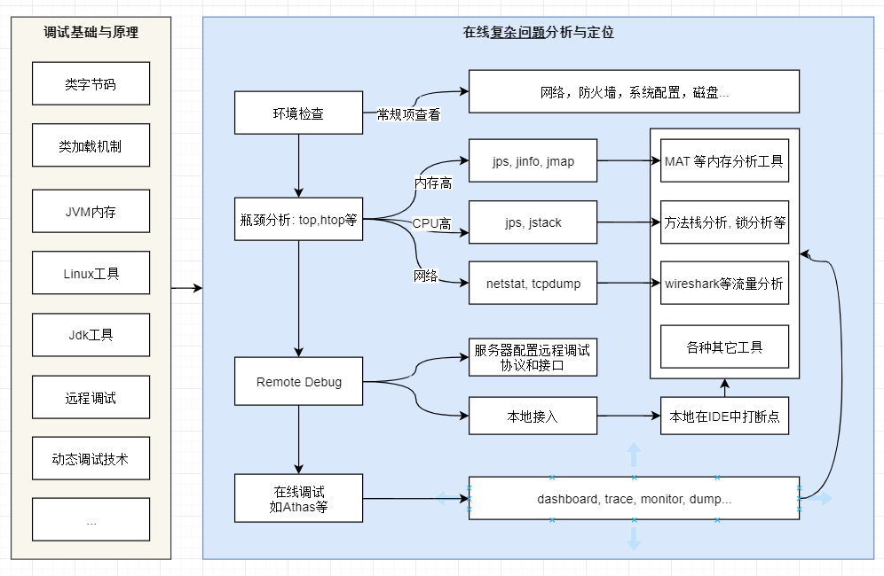

# ♥JVM相关知识体系详解♥

## 知识体系

不同的虚拟机实现方式上也有差别，如果没有特别指出，这里的JVM指的是sun的HotSpot；不同的JDK版本略有差别，这里主要以1.8为主

- JVM基础 - 类字节码详解
  - 源代码通过编译器编译为字节码，再通过类加载子系统进行加载到JVM中运行
- JVM基础 - Java 类加载机制
  - 深入理解Java 类加载机制

- JVM基础 - JVM内存结构
  - 主要对JVM 内存结构进行讲解，注意不要和Java内存模型混淆了。

- JVM基础 - Java 内存模型引入
  - 很多人都Java内存模型和JVM内存结构，以及Java内存模型与物理内存之间的关系。本文从堆栈角度引入JMM，然后介绍JMM和物理内存之间的关系, 为后面`JMM详解`, `JVM 内存结构详解`, `Java 对象模型详解`等铺垫。
- JVM基础 - Java 内存模型详解
  - 重排序与顺序一致性；三个同步原语（lock，volatile，final）的内存语义，重排序规则及在处理器中的实现；java 内存模型的设计，及其与处理器内存模型和顺序一致性内存模型的关系

- JVM基础 - Java 垃圾收集
  - 垃圾收集主要是针对堆和方法区进行

[调试排错 - JVM 调优参数]()

- 对JVM涉及的常见的调优参数和垃圾回收参数进行阐述

[调试排错 - Java OOM 分析]()

- 以两个简单的例子(`堆内存溢出`和`MetaSpace (元数据) 内存溢出`）解释Java 内存溢出的分析过程

[调试排错 - Java问题排查：Linux命令]()

- Java 在线问题排查主要分两篇：本文是第一篇，通过linux常用命令排查

[调试排错 - Java问题排查：工具单]()

- Java 在线问题排查主要分两篇：本文是第二篇，通过java调试/排查工具进行问题定位

[调试排错 - 9种常见的CMS GC问题分析与解决]()

- 整理自[美团技术团队  (opens new window)](https://tech.meituan.com/2020/11/12/java-9-cms-gc.html), 这篇文章将可以帮助你构建CMS GC相关问题解决的知识体系，分享给你。

[调试排错 - Java动态调试技术原理]()

- 转载自 美团技术团队胡健的[Java 动态调试技术原理及实践  (opens new window)](https://tech.meituan.com/2019/11/07/java-dynamic-debugging-technology.html), 通过学习java agent方式进行动态调试了解目前很多大厂开源的一些基于此的调试工具。

[调试排错 - Java应用在线调试Arthas]()

- 本文主要介绍Alibaba开源的Java诊断工具，开源到现在已经1.7万个点赞了，深受开发者喜爱。具体解决在线问题，比如：
- 这个类从哪个 jar 包加载的? 为什么会报各种类相关的 Exception?
- 我改的代码为什么没有执行到? 难道是我没 commit? 分支搞错了?
- 遇到问题无法在线上 debug，难道只能通过加日志再重新发布吗?
- 线上遇到某个用户的数据处理有问题，但线上同样无法 debug，线下无法重现！
- 是否有一个全局视角来查看系统的运行状况?
- 有什么办法可以监控到JVM的实时运行状态?

[调试排错 - 使用IDEA本地调试和远程调试]()

- Debug用来追踪代码的运行流程，通常在程序运行过程中出现异常，启用Debug模式可以分析定位异常发生的位置，以及在运行过程中参数的变化；并且在实际的排错过程中，还会用到Remote Debug。IDEA 相比 Eclipse/STS效率更高，本文主要介绍基于IDEA的Debug和Remote Debug的技巧。

