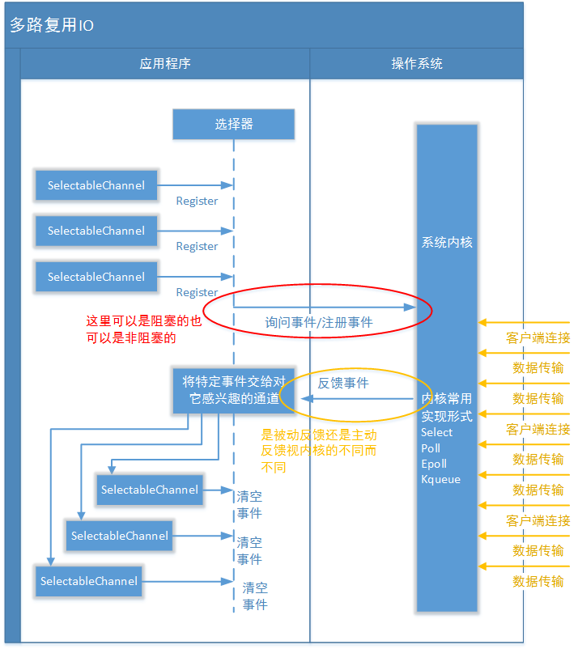
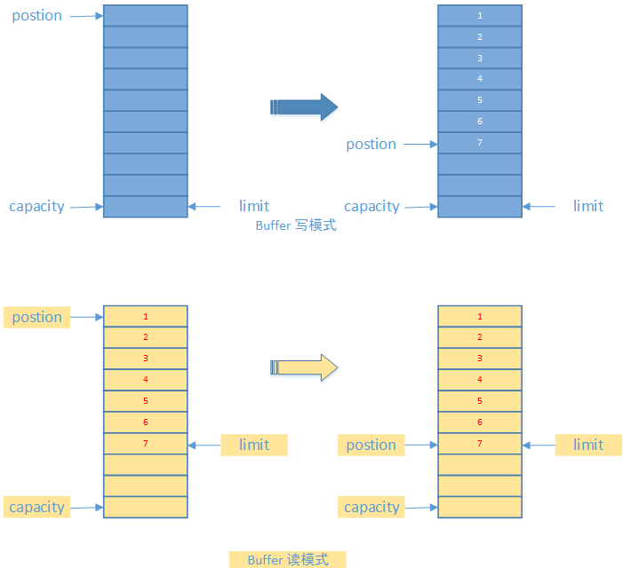
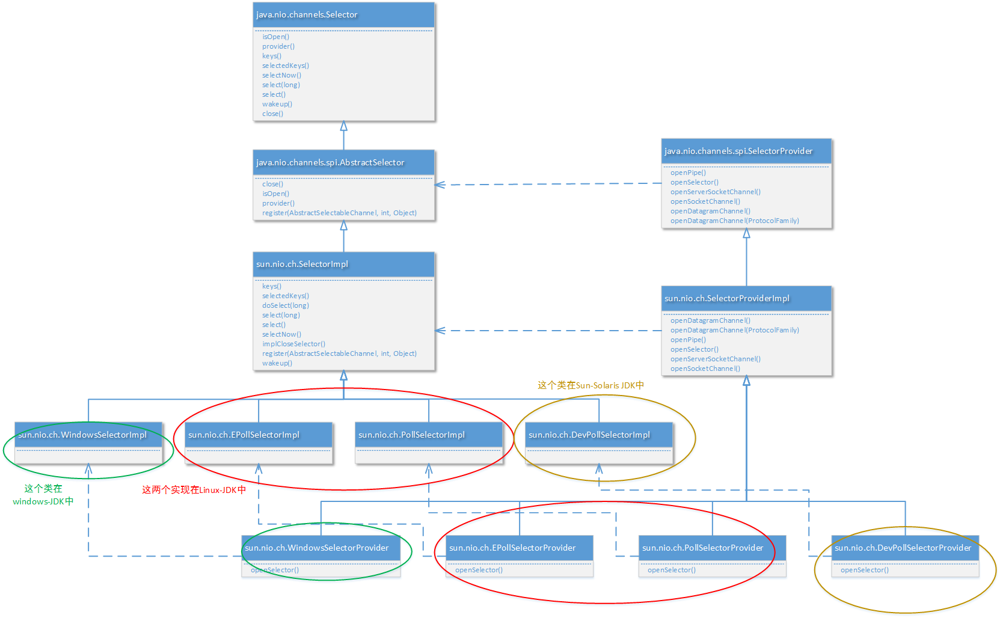
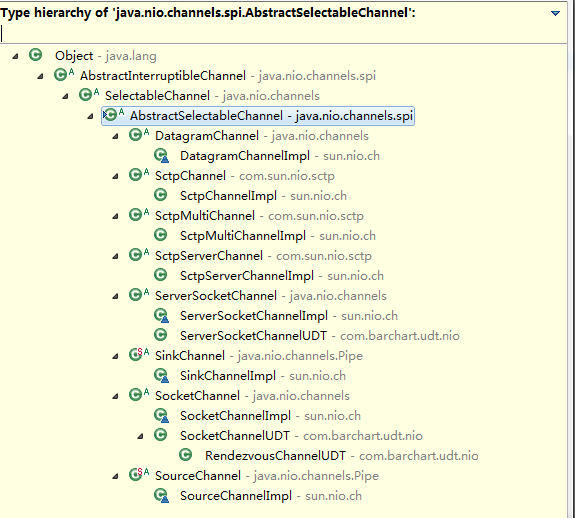

# Java NIO - IO多路复用详解

主要对IO多路复用，Ractor模型以及Java NIO对其的支持。

## 现实场景

我们试想一下这样的现实场景:

一个餐厅同时有100位客人到店，当然到店后第一件要做的事情就是点菜。但是问题来了，餐厅老板为了节约人力成本目前只有一位大堂服务员拿着唯一的一本菜单等待客人进行服务。

- 那么最笨(但是最简单)的方法是(方法A)，无论有多少客人等待点餐，服务员都把仅有的一份菜单递给其中一位客人，然后站在客人身旁等待这个客人完成点菜过程。在记录客人点菜内容后，把点菜记录交给后堂厨师。然后是第二位客人。。。。然后是第三位客人。很明显，只有脑袋被门夹过的老板，才会这样设置服务流程。因为随后的80位客人，再等待超时后就会离店(还会给差评)。
- 于是还有一种办法(方法B)，老板马上新雇佣99名服务员，同时印制99本新的菜单。每一名服务员手持一本菜单负责一位客人(关键不只在于服务员，还在于菜单。因为没有菜单客人也无法点菜)。在客人点完菜后，记录点菜内容交给后堂厨师(当然为了更高效，后堂厨师最好也有100名)。这样每一位客人享受的就是VIP服务咯，当然客人不会走，但是人力成本可是一个大头哦(亏死你)。
- 另外一种办法(方法C)，就是改进点菜的方式，当客人到店后，自己申请一本菜单。想好自己要点的才后，就呼叫服务员。服务员站在自己身边后记录客人的菜单内容。将菜单递给厨师的过程也要进行改进，并不是每一份菜单记录好以后，都要交给后堂厨师。服务员可以记录号多份菜单后，同时交给厨师就行了。那么这种方式，对于老板来说人力成本是最低的；对于客人来说，虽然不再享受VIP服务并且要进行一定的等待，但是这些都是可接受的；对于服务员来说，基本上她的时间都没有浪费，基本上被老板压杆了最后一滴油水。

如果您是老板，您会采用哪种方式呢?

到店情况: 并发量。到店情况不理想时，一个服务员一本菜单，当然是足够了。所以不同的老板在不同的场合下，将会灵活选择服务员和菜单的配置。

- 客人: 客户端请求
- 点餐内容: 客户端发送的实际数据
- 老板: 操作系统
- 人力成本: 系统资源
- 菜单: 文件状态描述符。操作系统对于一个进程能够同时持有的文件状态描述符的个数是有限制的，在linux系统中$ulimit -n查看这个限制值，当然也是可以(并且应该)进行内核参数调整的。
- 服务员: 操作系统内核用于IO操作的线程(内核线程)
- 厨师: 应用程序线程(当然厨房就是应用程序进程咯)
- 餐单传递方式: 包括了阻塞式和非阻塞式两种。
  - 方法A: 阻塞式/非阻塞式 同步IO
  - 方法B: 使用线程进行处理的 阻塞式/非阻塞式 同步IO
  - 方法C: 阻塞式/非阻塞式 多路复用IO

## 典型的多路复用IO实现

目前流程的多路复用IO实现主要包括四种: `select`、`poll`、`epoll`、`kqueue`。下表是他们的一些重要特性的比较:

| IO模型 | 相对性能 | 关键思路         | 操作系统      | JAVA支持情况                                                 |
| ------ | -------- | ---------------- | ------------- | ------------------------------------------------------------ |
| select | 较高     | Reactor          | windows/Linux | 支持,Reactor模式(反应器设计模式)。Linux操作系统的 kernels 2.4内核版本之前，默认使用select；而目前windows下对同步IO的支持，都是select模型 |
| poll   | 较高     | Reactor          | Linux         | Linux下的JAVA NIO框架，Linux kernels 2.6内核版本之前使用poll进行支持。也是使用的Reactor模式 |
| epoll  | 高       | Reactor/Proactor | Linux         | Linux kernels 2.6内核版本及以后使用epoll进行支持；Linux kernels 2.6内核版本之前使用poll进行支持；另外一定注意，由于Linux下没有Windows下的IOCP技术提供真正的 异步IO 支持，所以Linux下使用epoll模拟异步IO |
| kqueue | 高       | Proactor         | Linux         | 目前JAVA的版本不支持                                         |

## Reactor模型和Proactor模型

### 传统IO模型

对于传统IO模型，其主要是一个Server对接N个客户端，在客户端连接之后，为每个客户端都分配一个执行线程。如下图是该模型的一个演示：


从图中可以看出，传统IO的特点在于：

- 每个客户端连接到达之后，服务端会分配一个线程给该客户端，该线程会处理包括读取数据，解码，业务计算，编码，以及发送数据整个过程；
- 同一时刻，服务端的吞吐量与服务器所提供的线程数量是呈线性关系的。

这种设计模式在客户端连接不多，并发量不大的情况下是可以运行得很好的，但是在海量并发的情况下，这种模式就显得力不从心了。这种模式主要存在的问题有如下几点：

- 服务器的并发量对服务端能够创建的线程数有很大的依赖关系，但是服务器线程却是不能无限增长的；
- 服务端每个线程不仅要进行IO读写操作，而且还需要进行业务计算；
- 服务端在获取客户端连接，读取数据，以及写入数据的过程都是阻塞类型的，在网络状况不好的情况下，这将极大的降低服务器每个线程的利用率，从而降低服务器吞吐量。

### Reactor事件驱动模型

在传统IO模型中，由于线程在等待连接以及进行IO操作时都会阻塞当前线程，这部分损耗是非常大的。因而jdk 1.4中就提供了一套非阻塞IO的API。该API本质上是以事件驱动来处理网络事件的，而Reactor是基于该API提出的一套IO模型。如下是Reactor事件驱动模型的示意图：


从图中可以看出，在Reactor模型中，主要有四个角色：客户端连接，Reactor，Acceptor和Handler。这里Acceptor会不断地接收客户端的连接，然后将接收到的连接交由Reactor进行分发，最后有具体的Handler进行处理。改进后的Reactor模型相对于传统的IO模型主要有如下优点：

- 从模型上来讲，如果仅仅还是只使用一个线程池来处理客户端连接的网络读写，以及业务计算，那么Reactor模型与传统IO模型在效率上并没有什么提升。但是Reactor模型是以事件进行驱动的，其能够将接收客户端连接，+ 网络读和网络写，以及业务计算进行拆分，从而极大的提升处理效率；
- Reactor模型是异步非阻塞模型，工作线程在没有网络事件时可以处理其他的任务，而不用像传统IO那样必须阻塞等待。

### Reactor模型----业务处理与IO分离

在上面的Reactor模型中，由于网络读写和业务操作都在同一个线程中，在高并发情况下，这里的系统瓶颈主要在两方面：

- 高频率的网络读写事件处理；
- 大量的业务操作处理；

基于上述两个问题，这里在单线程Reactor模型的基础上提出了使用线程池的方式处理业务操作的模型。如下是该模型的示意图：


从图中可以看出，在多线程进行业务操作的模型下，该模式主要具有如下特点：

- 使用一个线程进行客户端连接的接收以及网络读写事件的处理；
- 在接收到客户端连接之后，将该连接交由线程池进行数据的编解码以及业务计算。

这种模式相较于前面的模式性能有了很大的提升，主要在于在进行网络读写的同时，也进行了业务计算，从而大大提升了系统的吞吐量。但是这种模式也有其不足，主要在于：

- 网络读写是一个比较消耗CPU的操作，在高并发的情况下，将会有大量的客户端数据需要进行网络读写，此时一个线程将不足以处理这么多请求。

### Reactor模型----并发读写

对于使用线程池处理业务操作的模型，由于网络读写在高并发情况下会成为系统的一个瓶颈，因而针对该模型这里提出了一种改进后的模型，即使用线程池进行网络读写，而仅仅只使用一个线程专门接收客户端连接。如下是该模型的示意图：


可以看到，改进后的Reactor模型将Reactor拆分为了mainReactor和subReactor。这里mainReactor主要进行客户端连接的处理，处理完成之后将该连接交由subReactor以处理客户端的网络读写。这里的subReactor则是使用一个线程池来支撑的，其读写能力将会随着线程数的增多而大大增加。对于业务操作，这里也是使用一个线程池，而每个业务请求都只需要进行编解码和业务计算。通过这种方式，服务器的性能将会大大提升，在可见情况下，其基本上可以支持百万连接。

### Reactor模型示例

对于上述Reactor模型，服务端主要有三个角色：Reactor，Acceptor和Handler。这里基于Doug Lea的文档对其进行了实现，如下是Reactor的实现代码：

```java
public class Reactor implements Runnable {
  private final Selector selector;
  private final ServerSocketChannel serverSocket;

  public Reactor(int port) throws IOException {
    serverSocket = ServerSocketChannel.open();  // 创建服务端的ServerSocketChannel
    serverSocket.configureBlocking(false);  // 设置为非阻塞模式
    selector = Selector.open();  // 创建一个Selector多路复用器
    SelectionKey key = serverSocket.register(selector, SelectionKey.OP_ACCEPT);
    serverSocket.bind(new InetSocketAddress(port));  // 绑定服务端端口
    key.attach(new Acceptor(serverSocket));  // 为服务端Channel绑定一个Acceptor
  }

  @Override
  public void run() {
    try {
      while (!Thread.interrupted()) {
        selector.select();  // 服务端使用一个线程不断等待客户端的连接到达
        Set<SelectionKey> keys = selector.selectedKeys();
        Iterator<SelectionKey> iterator = keys.iterator();
        while (iterator.hasNext()) {
          dispatch(iterator.next());  // 监听到客户端连接事件后将其分发给Acceptor
          iterator.remove();
        }

        selector.selectNow();
      }
    } catch (IOException e) {
      e.printStackTrace();
    }
  }

  private void dispatch(SelectionKey key) throws IOException {
    // 这里的attachement也即前面为服务端Channel绑定的Acceptor，调用其run()方法进行
    // 客户端连接的获取，并且进行分发
    Runnable attachment = (Runnable) key.attachment();
    attachment.run();
  }
}
```

这里Reactor首先开启了一个ServerSocketChannel，然后将其绑定到指定的端口，并且注册到了一个多路复用器上。接着在一个线程中，其会在多路复用器上等待客户端连接。当有客户端连接到达后，Reactor就会将其派发给一个Acceptor，由该Acceptor专门进行客户端连接的获取。下面我们继续看一下Acceptor的代码：

```java
public class Acceptor implements Runnable {
  private final ExecutorService executor = Executors.newFixedThreadPool(20);

  private final ServerSocketChannel serverSocket;

  public Acceptor(ServerSocketChannel serverSocket) {
    this.serverSocket = serverSocket;
  }

  @Override
  public void run() {
    try {
      SocketChannel channel = serverSocket.accept();  // 获取客户端连接
      if (null != channel) {
        executor.execute(new Handler(channel));  // 将客户端连接交由线程池处理
      }
    } catch (IOException e) {
      e.printStackTrace();
    }
  }
}
```

这里可以看到，在Acceptor获取到客户端连接之后，其就将其交由线程池进行网络读写了，而这里的主线程只是不断监听客户端连接事件。下面我们看看Handler的具体逻辑

```java
public class Handler implements Runnable {
  private volatile static Selector selector;
  private final SocketChannel channel;
  private SelectionKey key;
  private volatile ByteBuffer input = ByteBuffer.allocate(1024);
  private volatile ByteBuffer output = ByteBuffer.allocate(1024);

  public Handler(SocketChannel channel) throws IOException {
    this.channel = channel;
    channel.configureBlocking(false);  // 设置客户端连接为非阻塞模式
    selector = Selector.open();  // 为客户端创建一个新的多路复用器
    key = channel.register(selector, SelectionKey.OP_READ);  // 注册客户端Channel的读事件
  }

  @Override
  public void run() {
    try {
      while (selector.isOpen() && channel.isOpen()) {
        Set<SelectionKey> keys = select();  // 等待客户端事件发生
        Iterator<SelectionKey> iterator = keys.iterator();
        while (iterator.hasNext()) {
          SelectionKey key = iterator.next();
          iterator.remove();

          // 如果当前是读事件，则读取数据
          if (key.isReadable()) {
            read(key);
          } else if (key.isWritable()) {
           // 如果当前是写事件，则写入数据
            write(key);
          }
        }
      }
    } catch (Exception e) {
      e.printStackTrace();
    }
  }

  // 这里处理的主要目的是处理Jdk的一个bug，该bug会导致Selector被意外触发，但是实际上没有任何事件到达，
  // 此时的处理方式是新建一个Selector，然后重新将当前Channel注册到该Selector上
  private Set<SelectionKey> select() throws IOException {
    selector.select();
    Set<SelectionKey> keys = selector.selectedKeys();
    if (keys.isEmpty()) {
      int interestOps = key.interestOps();
      selector = Selector.open();
      key = channel.register(selector, interestOps);
      return select();
    }

    return keys;
  }

  // 读取客户端发送的数据
  private void read(SelectionKey key) throws IOException {
    channel.read(input);
    if (input.position() == 0) {
      return;
    }

    input.flip();
    process();  // 对读取的数据进行业务处理
    input.clear();
    key.interestOps(SelectionKey.OP_WRITE);  // 读取完成后监听写入事件
  }

  private void write(SelectionKey key) throws IOException {
    output.flip();
    if (channel.isOpen()) {
      channel.write(output);  // 当有写入事件时，将业务处理的结果写入到客户端Channel中
      key.channel();
      channel.close();
      output.clear();
    }
  }
    
  // 进行业务处理，并且获取处理结果。本质上，基于Reactor模型，如果这里成为处理瓶颈，
  // 则直接将其处理过程放入线程池即可，并且使用一个Future获取处理结果，最后写入客户端Channel
  private void process() {
    byte[] bytes = new byte[input.remaining()];
    input.get(bytes);
    String message = new String(bytes, CharsetUtil.UTF_8);
    System.out.println("receive message from client: \n" + message);

    output.put("hello client".getBytes());
  }
}   
```

在Handler中，主要进行的就是为每一个客户端Channel创建一个Selector，并且监听该Channel的网络读写事件。当有事件到达时，进行数据的读写，而业务操作这交由具体的业务线程池处理。

## JAVA对多路复用IO的支持



### 重要概念: Channel

通道，被建立的一个应用程序和操作系统交互事件、传递内容的渠道(注意是连接到操作系统)。一个通道会有一个专属的文件状态描述符。那么既然是和操作系统进行内容的传递，那么说明应用程序可以通过通道读取数据，也可以通过通道向操作系统写数据。

JDK API中的Channel的描述是:

> A channel represents an open connection to an entity such as a hardware device, a file, a network socket, or a program component that is capable of performing one or more distinct I/O operations, for example reading or writing.

> A channel is either open or closed. A channel is open upon creation, and once closed it remains closed. Once a channel is closed, any attempt to invoke an I/O operation upon it will cause a ClosedChannelException to be thrown. Whether or not a channel is open may be tested by invoking its isOpen method.

JAVA NIO 框架中，自有的Channel通道包括:


所有被Selector(选择器)注册的通道，只能是继承了SelectableChannel类的子类。如上图所示

- ServerSocketChannel: 应用服务器程序的监听通道。只有通过这个通道，应用程序才能向操作系统注册支持“多路复用IO”的端口监听。同时支持UDP协议和TCP协议。
- ScoketChannel: TCP Socket套接字的监听通道，一个Socket套接字对应了一个客户端IP: 端口 到 服务器IP: 端口的通信连接。
- DatagramChannel: UDP 数据报文的监听通道。

### 重要概念: Buffer

数据缓存区: 在JAVA NIO 框架中，为了保证每个通道的数据读写速度JAVA NIO 框架为每一种需要支持数据读写的通道集成了Buffer的支持。

这句话怎么理解呢? 例如ServerSocketChannel通道它只支持对OP_ACCEPT事件的监听，所以它是不能直接进行网络数据内容的读写的。所以ServerSocketChannel是没有集成Buffer的。

Buffer有两种工作模式: 写模式和读模式。在读模式下，应用程序只能从Buffer中读取数据，不能进行写操作。但是在写模式下，应用程序是可以进行读操作的，这就表示可能会出现脏读的情况。所以一旦您决定要从Buffer中读取数据，一定要将Buffer的状态改为读模式。

如下图:




- position: 缓存区目前这在操作的数据块位置
- limit: 缓存区最大可以进行操作的位置。缓存区的读写状态正式由这个属性控制的。
- capacity: 缓存区的最大容量。这个容量是在缓存区创建时进行指定的。由于高并发时通道数量往往会很庞大，所以每一个缓存区的容量最好不要过大。

在下文JAVA NIO框架的代码实例中，我们将进行Buffer缓存区操作的演示。

### 重要概念: Selector

Selector的英文含义是“选择器”，不过根据我们详细介绍的Selector的岗位职责，您可以把它称之为“轮询代理器”、“事件订阅器”、“channel容器管理机”都行。

- 事件订阅和Channel管理

应用程序将向Selector对象注册需要它关注的Channel，以及具体的某一个Channel会对哪些IO事件感兴趣。Selector中也会维护一个“已经注册的Channel”的容器。以下代码来自WindowsSelectorImpl实现类中，对已经注册的Channel的管理容器:

```java
// Initial capacity of the poll array
private final int INIT_CAP = 8;
// Maximum number of sockets for select().
// Should be INIT_CAP times a power of 2
private final static int MAX_SELECTABLE_FDS = 1024;

// The list of SelectableChannels serviced by this Selector. Every mod
// MAX_SELECTABLE_FDS entry is bogus, to align this array with the poll
// array,  where the corresponding entry is occupied by the wakeupSocket
private SelectionKeyImpl[] channelArray = new SelectionKeyImpl[INIT_CAP];
```

- 轮询代理

应用层不再通过阻塞模式或者非阻塞模式直接询问操作系统“事件有没有发生”，而是由Selector代其询问。

- 实现不同操作系统的支持

之前已经提到过，多路复用IO技术 是需要操作系统进行支持的，其特点就是操作系统可以同时扫描同一个端口上不同网络连接的事件。所以作为上层的JVM，必须要为 不同操作系统的多路复用IO实现 编写不同的代码。同样我使用的测试环境是Windows，它对应的实现类是sun.nio.ch.WindowsSelectorImpl:


###  JAVA NIO 框架简要设计分析

通过上文的描述，我们知道了多路复用IO技术是操作系统的内核实现。在不同的操作系统，甚至同一系列操作系统的版本中所实现的多路复用IO技术都是不一样的。那么作为跨平台的JAVA JVM来说如何适应多种多样的多路复用IO技术实现呢? 面向对象的威力就显现出来了: 无论使用哪种实现方式，他们都会有“选择器”、“通道”、“缓存”这几个操作要素，那么可以为不同的多路复用IO技术创建一个统一的抽象组，并且为不同的操作系统进行具体的实现。JAVA NIO中对各种多路复用IO的支持，主要的基础是java.nio.channels.spi.SelectorProvider抽象类，其中的几个主要抽象方法包括:

- public abstract DatagramChannel openDatagramChannel(): 创建和这个操作系统匹配的UDP 通道实现。
- public abstract AbstractSelector openSelector(): 创建和这个操作系统匹配的NIO选择器，就像上文所述，不同的操作系统，不同的版本所默认支持的NIO模型是不一样的。
- public abstract ServerSocketChannel openServerSocketChannel(): 创建和这个NIO模型匹配的服务器端通道。
- public abstract SocketChannel openSocketChannel(): 创建和这个NIO模型匹配的TCP Socket套接字通道(用来反映客户端的TCP连接)

由于JAVA NIO框架的整个设计是很大的，所以我们只能还原一部分我们关心的问题。这里我们以JAVA NIO框架中对于不同多路复用IO技术的选择器 进行实例化创建的方式作为例子，以点窥豹观全局:



很明显，不同的SelectorProvider实现对应了不同的 选择器。由具体的SelectorProvider实现进行创建。另外说明一下，实际上netty底层也是通过这个设计获得具体使用的NIO模型，我们后文讲解Netty时，会讲到这个问题。以下代码是Netty 4.0中NioServerSocketChannel进行实例化时的核心代码片段:

```java
private static ServerSocketChannel newSocket(SelectorProvider provider) {
    try {
        /**
            *  Use the {@link SelectorProvider} to open {@link SocketChannel} and so remove condition in
            *  {@link SelectorProvider#provider()} which is called by each ServerSocketChannel.open() otherwise.
            *
            *  See <a href="See https://github.com/netty/netty/issues/2308">#2308</a>.
            */
        return provider.openServerSocketChannel();
    } catch (IOException e) {
        throw new ChannelException(
                "Failed to open a server socket.", e);
    }
}
```

### JAVA实例

下面，我们使用JAVA NIO框架，实现一个支持多路复用IO的服务器端(实际上客户端是否使用多路复用IO技术，对整个系统架构的性能提升相关性不大):

```java
package testNSocket;

import java.net.InetSocketAddress;
import java.net.ServerSocket;
import java.net.URLDecoder;
import java.net.URLEncoder;
import java.nio.ByteBuffer;
import java.nio.channels.SelectableChannel;
import java.nio.channels.SelectionKey;
import java.nio.channels.Selector;
import java.nio.channels.ServerSocketChannel;
import java.nio.channels.SocketChannel;
import java.util.Iterator;

import org.apache.commons.logging.Log;
import org.apache.commons.logging.LogFactory;
import org.apache.log4j.BasicConfigurator;

public class SocketServer1 {

    static {
        BasicConfigurator.configure();
    }

    /**
     * 日志
     */
    private static final Log LOGGER = LogFactory.getLog(SocketServer1.class);

    public static void main(String[] args) throws Exception {
        ServerSocketChannel serverChannel = ServerSocketChannel.open();
        serverChannel.configureBlocking(false);
        ServerSocket serverSocket = serverChannel.socket();
        serverSocket.setReuseAddress(true);
        serverSocket.bind(new InetSocketAddress(83));

        Selector selector = Selector.open();
        //注意、服务器通道只能注册SelectionKey.OP_ACCEPT事件
        serverChannel.register(selector, SelectionKey.OP_ACCEPT);

        try {
            while(true) {
                //如果条件成立，说明本次询问selector，并没有获取到任何准备好的、感兴趣的事件
                //java程序对多路复用IO的支持也包括了阻塞模式 和非阻塞模式两种。
                if(selector.select(100) == 0) {
                    //================================================
                    //      这里视业务情况，可以做一些然并卵的事情
                    //================================================
                    continue;
                }
                //这里就是本次询问操作系统，所获取到的“所关心的事件”的事件类型(每一个通道都是独立的)
                Iterator<SelectionKey> selecionKeys = selector.selectedKeys().iterator();

                while(selecionKeys.hasNext()) {
                    SelectionKey readyKey = selecionKeys.next();
                    //这个已经处理的readyKey一定要移除。如果不移除，就会一直存在在selector.selectedKeys集合中
                    //待到下一次selector.select() > 0时，这个readyKey又会被处理一次
                    selecionKeys.remove();

                    SelectableChannel selectableChannel = readyKey.channel();
                    if(readyKey.isValid() && readyKey.isAcceptable()) {
                        SocketServer1.LOGGER.info("======channel通道已经准备好=======");
                        /*
                         * 当server socket channel通道已经准备好，就可以从server socket channel中获取socketchannel了
                         * 拿到socket channel后，要做的事情就是马上到selector注册这个socket channel感兴趣的事情。
                         * 否则无法监听到这个socket channel到达的数据
                         * */
                        ServerSocketChannel serverSocketChannel = (ServerSocketChannel)selectableChannel;
                        SocketChannel socketChannel = serverSocketChannel.accept();
                        registerSocketChannel(socketChannel , selector);

                    } else if(readyKey.isValid() && readyKey.isConnectable()) {
                        SocketServer1.LOGGER.info("======socket channel 建立连接=======");
                    } else if(readyKey.isValid() && readyKey.isReadable()) {
                        SocketServer1.LOGGER.info("======socket channel 数据准备完成，可以去读==读取=======");
                        readSocketChannel(readyKey);
                    }
                }
            }
        } catch(Exception e) {
            SocketServer1.LOGGER.error(e.getMessage() , e);
        } finally {
            serverSocket.close();
        }
    }

    /**
     * 在server socket channel接收到/准备好 一个新的 TCP连接后。
     * 就会向程序返回一个新的socketChannel。<br>
     * 但是这个新的socket channel并没有在selector“选择器/代理器”中注册，
     * 所以程序还没法通过selector通知这个socket channel的事件。
     * 于是我们拿到新的socket channel后，要做的第一个事情就是到selector“选择器/代理器”中注册这个
     * socket channel感兴趣的事件
     * @param socketChannel 新的socket channel
     * @param selector selector“选择器/代理器”
     * @throws Exception
     */
    private static void registerSocketChannel(SocketChannel socketChannel , Selector selector) throws Exception {
        socketChannel.configureBlocking(false);
        //socket通道可以且只可以注册三种事件SelectionKey.OP_READ | SelectionKey.OP_WRITE | SelectionKey.OP_CONNECT
        socketChannel.register(selector, SelectionKey.OP_READ , ByteBuffer.allocate(2048));
    }

    /**
     * 这个方法用于读取从客户端传来的信息。
     * 并且观察从客户端过来的socket channel在经过多次传输后，是否完成传输。
     * 如果传输完成，则返回一个true的标记。
     * @param socketChannel
     * @throws Exception
     */
    private static void readSocketChannel(SelectionKey readyKey) throws Exception {
        SocketChannel clientSocketChannel = (SocketChannel)readyKey.channel();
        //获取客户端使用的端口
        InetSocketAddress sourceSocketAddress = (InetSocketAddress)clientSocketChannel.getRemoteAddress();
        Integer resoucePort = sourceSocketAddress.getPort();

        //拿到这个socket channel使用的缓存区，准备读取数据
        //在后文，将详细讲解缓存区的用法概念，实际上重要的就是三个元素capacity,position和limit。
        ByteBuffer contextBytes = (ByteBuffer)readyKey.attachment();
        //将通道的数据写入到缓存区，注意是写入到缓存区。
        //由于之前设置了ByteBuffer的大小为2048 byte，所以可以存在写入不完的情况
        //没关系，我们后面来调整代码。这里我们暂时理解为一次接受可以完成
        int realLen = -1;
        try {
            realLen = clientSocketChannel.read(contextBytes);
        } catch(Exception e) {
            //这里抛出了异常，一般就是客户端因为某种原因终止了。所以关闭channel就行了
            SocketServer1.LOGGER.error(e.getMessage());
            clientSocketChannel.close();
            return;
        }

        //如果缓存区中没有任何数据(但实际上这个不太可能，否则就不会触发OP_READ事件了)
        if(realLen == -1) {
            SocketServer1.LOGGER.warn("====缓存区没有数据? ====");
            return;
        }

        //将缓存区从写状态切换为读状态(实际上这个方法是读写模式互切换)。
        //这是java nio框架中的这个socket channel的写请求将全部等待。
        contextBytes.flip();
        //注意中文乱码的问题，我个人喜好是使用URLDecoder/URLEncoder，进行解编码。
        //当然java nio框架本身也提供编解码方式，看个人咯
        byte[] messageBytes = contextBytes.array();
        String messageEncode = new String(messageBytes , "UTF-8");
        String message = URLDecoder.decode(messageEncode, "UTF-8");

        //如果收到了“over”关键字，才会清空buffer，并回发数据；
        //否则不清空缓存，还要还原buffer的“写状态”
        if(message.indexOf("over") != -1) {
            //清空已经读取的缓存，并从新切换为写状态(这里要注意clear()和capacity()两个方法的区别)
            contextBytes.clear();
            SocketServer1.LOGGER.info("端口:" + resoucePort + "客户端发来的信息======message : " + message);

            //======================================================
            //          当然接受完成后，可以在这里正式处理业务了        
            //======================================================

            //回发数据，并关闭channel
            ByteBuffer sendBuffer = ByteBuffer.wrap(URLEncoder.encode("回发处理结果", "UTF-8").getBytes());
            clientSocketChannel.write(sendBuffer);
            clientSocketChannel.close();
        } else {
            SocketServer1.LOGGER.info("端口:" + resoucePort + "客户端信息还未接受完，继续接受======message : " + message);
            //这是，limit和capacity的值一致，position的位置是realLen的位置
            contextBytes.position(realLen);
            contextBytes.limit(contextBytes.capacity());
        }
    }
}
```

代码中的注释是比较清楚的，但是还是要对几个关键点进行一下讲解:

- serverChannel.register(Selector sel, int ops, Object att): 实际上register(Selector sel, int ops, Object att)方法是ServerSocketChannel类的父类AbstractSelectableChannel提供的一个方法，表示只要继承了AbstractSelectableChannel类的子类都可以注册到选择器中。通过观察整个AbstractSelectableChannel继承关系，下图中的这些类可以被注册到选择器中:



SelectionKey.OP_ACCEPT: 不同的Channel对象可以注册的“我关心的事件”是不一样的。例如ServerSocketChannel除了能够被允许关注OP_ACCEPT事件外，不允许再关心其他事件了(否则运行时会抛出异常)。以下梳理了常使用的AbstractSelectableChannel子类可以注册的事件列表:

| 通道类              | 通道作用     | 可关注的事件                                                 |
| ------------------- | ------------ | ------------------------------------------------------------ |
| ServerSocketChannel | 服务器端通道 | SelectionKey.OP_ACCEPT                                       |
| DatagramChannel     | UDP协议通道  | SelectionKey.OP_READ、SelectionKey.OP_WRITE                  |
| SocketChannel       | TCP协议通道  | SelectionKey.OP_READ、SelectionKey.OP_WRITE、SelectionKey.OP_CONNECT |

实际上通过每一个AbstractSelectableChannel子类所实现的public final int validOps()方法，就可以查看这个通道“可以关心的IO事件”。

selector.selectedKeys().iterator(): 当选择器Selector收到操作系统的IO操作事件后，它的selectedKeys将在下一次轮询操作中，收到这些事件的关键描述字(不同的channel，就算关键字一样，也会存储成两个对象)。但是每一个“事件关键字”被处理后都必须移除，否则下一次轮询时，这个事件会被重复处理。

> Returns this selector’s selected-key set. Keys may be removed from, but not directly added to, the selected-key set. Any attempt to add an object to the key set will cause an UnsupportedOperationException to be thrown. The selected-key set is not thread-safe.

### JAVA实例改进

上面的代码中，我们为了讲解selector的使用，在缓存使用上就进行了简化。实际的应用中，为了节约内存资源，我们一般不会为一个通道分配那么多的缓存空间。下面的代码我们主要对其中的缓存操作进行了优化:

```java
package testNSocket;

import java.net.InetSocketAddress;
import java.net.ServerSocket;
import java.net.URLDecoder;
import java.net.URLEncoder;

import java.nio.ByteBuffer;
import java.nio.channels.SelectableChannel;
import java.nio.channels.SelectionKey;
import java.nio.channels.Selector;
import java.nio.channels.ServerSocketChannel;
import java.nio.channels.SocketChannel;

import java.util.Iterator;
import java.util.concurrent.ConcurrentHashMap;
import java.util.concurrent.ConcurrentMap;

import org.apache.commons.logging.Log;
import org.apache.commons.logging.LogFactory;
import org.apache.log4j.BasicConfigurator;

public class SocketServer2 {

    static {
        BasicConfigurator.configure();
    }

    /**
     * 日志
     */
    private static final Log LOGGER = LogFactory.getLog(SocketServer2.class);

    /**
     * 改进的java nio server的代码中，由于buffer的大小设置的比较小。
     * 我们不再把一个client通过socket channel多次传给服务器的信息保存在beff中了(因为根本存不下)<br>
     * 我们使用socketchanel的hashcode作为key(当然您也可以自己确定一个id)，信息的stringbuffer作为value，存储到服务器端的一个内存区域MESSAGEHASHCONTEXT。
     * 
     * 如果您不清楚ConcurrentHashMap的作用和工作原理，请自行百度/Google
     */
    private static final ConcurrentMap<Integer, StringBuffer> MESSAGEHASHCONTEXT = new ConcurrentHashMap<Integer , StringBuffer>();

    public static void main(String[] args) throws Exception {
        ServerSocketChannel serverChannel = ServerSocketChannel.open();
        serverChannel.configureBlocking(false);
        ServerSocket serverSocket = serverChannel.socket();
        serverSocket.setReuseAddress(true);
        serverSocket.bind(new InetSocketAddress(83));

        Selector selector = Selector.open();
        //注意、服务器通道只能注册SelectionKey.OP_ACCEPT事件
        serverChannel.register(selector, SelectionKey.OP_ACCEPT);

        try {
            while(true) {
                //如果条件成立，说明本次询问selector，并没有获取到任何准备好的、感兴趣的事件
                //java程序对多路复用IO的支持也包括了阻塞模式 和非阻塞模式两种。
                if(selector.select(100) == 0) {
                    //================================================
                    //      这里视业务情况，可以做一些然并卵的事情
                    //================================================
                    continue;
                }
                //这里就是本次询问操作系统，所获取到的“所关心的事件”的事件类型(每一个通道都是独立的)
                Iterator<SelectionKey> selecionKeys = selector.selectedKeys().iterator();

                while(selecionKeys.hasNext()) {
                    SelectionKey readyKey = selecionKeys.next();
                    //这个已经处理的readyKey一定要移除。如果不移除，就会一直存在在selector.selectedKeys集合中
                    //待到下一次selector.select() > 0时，这个readyKey又会被处理一次
                    selecionKeys.remove();

                    SelectableChannel selectableChannel = readyKey.channel();
                    if(readyKey.isValid() && readyKey.isAcceptable()) {
                        SocketServer2.LOGGER.info("======channel通道已经准备好=======");
                        /*
                         * 当server socket channel通道已经准备好，就可以从server socket channel中获取socketchannel了
                         * 拿到socket channel后，要做的事情就是马上到selector注册这个socket channel感兴趣的事情。
                         * 否则无法监听到这个socket channel到达的数据
                         * */
                        ServerSocketChannel serverSocketChannel = (ServerSocketChannel)selectableChannel;
                        SocketChannel socketChannel = serverSocketChannel.accept();
                        registerSocketChannel(socketChannel , selector);

                    } else if(readyKey.isValid() && readyKey.isConnectable()) {
                        SocketServer2.LOGGER.info("======socket channel 建立连接=======");
                    } else if(readyKey.isValid() && readyKey.isReadable()) {
                        SocketServer2.LOGGER.info("======socket channel 数据准备完成，可以去读==读取=======");
                        readSocketChannel(readyKey);
                    }
                }
            }
        } catch(Exception e) {
            SocketServer2.LOGGER.error(e.getMessage() , e);
        } finally {
            serverSocket.close();
        }
    }

    /**
     * 在server socket channel接收到/准备好 一个新的 TCP连接后。
     * 就会向程序返回一个新的socketChannel。<br>
     * 但是这个新的socket channel并没有在selector“选择器/代理器”中注册，
     * 所以程序还没法通过selector通知这个socket channel的事件。
     * 于是我们拿到新的socket channel后，要做的第一个事情就是到selector“选择器/代理器”中注册这个
     * socket channel感兴趣的事件
     * @param socketChannel 新的socket channel
     * @param selector selector“选择器/代理器”
     * @throws Exception
     */
    private static void registerSocketChannel(SocketChannel socketChannel , Selector selector) throws Exception {
        socketChannel.configureBlocking(false);
        //socket通道可以且只可以注册三种事件SelectionKey.OP_READ | SelectionKey.OP_WRITE | SelectionKey.OP_CONNECT
        //最后一个参数视为 为这个socketchanne分配的缓存区
        socketChannel.register(selector, SelectionKey.OP_READ , ByteBuffer.allocate(50));
    }

    /**
     * 这个方法用于读取从客户端传来的信息。
     * 并且观察从客户端过来的socket channel在经过多次传输后，是否完成传输。
     * 如果传输完成，则返回一个true的标记。
     * @param socketChannel
     * @throws Exception
     */
    private static void readSocketChannel(SelectionKey readyKey) throws Exception {
        SocketChannel clientSocketChannel = (SocketChannel)readyKey.channel();
        //获取客户端使用的端口
        InetSocketAddress sourceSocketAddress = (InetSocketAddress)clientSocketChannel.getRemoteAddress();
        Integer resoucePort = sourceSocketAddress.getPort();

        //拿到这个socket channel使用的缓存区，准备读取数据
        //在后文，将详细讲解缓存区的用法概念，实际上重要的就是三个元素capacity,position和limit。
        ByteBuffer contextBytes = (ByteBuffer)readyKey.attachment();
        //将通道的数据写入到缓存区，注意是写入到缓存区。
        //这次，为了演示buff的使用方式，我们故意缩小了buff的容量大小到50byte，
        //以便演示channel对buff的多次读写操作
        int realLen = 0;
        StringBuffer message = new StringBuffer();
        //这句话的意思是，将目前通道中的数据写入到缓存区
        //最大可写入的数据量就是buff的容量
        while((realLen = clientSocketChannel.read(contextBytes)) != 0) {

            //一定要把buffer切换成“读”模式，否则由于limit = capacity
            //在read没有写满的情况下，就会导致多读
            contextBytes.flip();
            int position = contextBytes.position();
            int capacity = contextBytes.capacity();
            byte[] messageBytes = new byte[capacity];
            contextBytes.get(messageBytes, position, realLen);

            //这种方式也是可以读取数据的，而且不用关心position的位置。
            //因为是目前contextBytes所有的数据全部转出为一个byte数组。
            //使用这种方式时，一定要自己控制好读取的最终位置(realLen很重要)
            //byte[] messageBytes = contextBytes.array();

            //注意中文乱码的问题，我个人喜好是使用URLDecoder/URLEncoder，进行解编码。
            //当然java nio框架本身也提供编解码方式，看个人咯
            String messageEncode = new String(messageBytes , 0 , realLen , "UTF-8");
            message.append(messageEncode);

            //再切换成“写”模式，直接情况缓存的方式，最快捷
            contextBytes.clear();
        }

        //如果发现本次接收的信息中有over关键字，说明信息接收完了
        if(URLDecoder.decode(message.toString(), "UTF-8").indexOf("over") != -1) {
            //则从messageHashContext中，取出之前已经收到的信息，组合成完整的信息
            Integer channelUUID = clientSocketChannel.hashCode();
            SocketServer2.LOGGER.info("端口:" + resoucePort + "客户端发来的信息======message : " + message);
            StringBuffer completeMessage;
            //清空MESSAGEHASHCONTEXT中的历史记录
            StringBuffer historyMessage = MESSAGEHASHCONTEXT.remove(channelUUID);
            if(historyMessage == null) {
                completeMessage = message;
            } else {
                completeMessage = historyMessage.append(message);
            }
            SocketServer2.LOGGER.info("端口:" + resoucePort + "客户端发来的完整信息======completeMessage : " + URLDecoder.decode(completeMessage.toString(), "UTF-8"));

            //======================================================
            //          当然接受完成后，可以在这里正式处理业务了        
            //======================================================

            //回发数据，并关闭channel
            ByteBuffer sendBuffer = ByteBuffer.wrap(URLEncoder.encode("回发处理结果", "UTF-8").getBytes());
            clientSocketChannel.write(sendBuffer);
            clientSocketChannel.close();
        } else {
            //如果没有发现有“over”关键字，说明还没有接受完，则将本次接受到的信息存入messageHashContext
            SocketServer2.LOGGER.info("端口:" + resoucePort + "客户端信息还未接受完，继续接受======message : " + URLDecoder.decode(message.toString(), "UTF-8"));
            //每一个channel对象都是独立的，所以可以使用对象的hash值，作为唯一标示
            Integer channelUUID = clientSocketChannel.hashCode();

            //然后获取这个channel下以前已经达到的message信息
            StringBuffer historyMessage = MESSAGEHASHCONTEXT.get(channelUUID);
            if(historyMessage == null) {
                historyMessage = new StringBuffer();
                MESSAGEHASHCONTEXT.put(channelUUID, historyMessage.append(message));
            }
        }
    }
}
```

以上代码应该没有过多需要讲解的了。当然，您还是可以加入线程池技术，进行具体的业务处理。注意，一定是线程池，因为这样可以保证线程规模的可控性。

## 多路复用IO的优缺点

- 不用再使用多线程来进行IO处理了(包括操作系统内核IO管理模块和应用程序进程而言)。当然实际业务的处理中，应用程序进程还是可以引入线程池技术的
- 同一个端口可以处理多种协议，例如，使用ServerSocketChannel测测的服务器端口监听，既可以处理TCP协议又可以处理UDP协议。
- 操作系统级别的优化: 多路复用IO技术可以是操作系统级别在一个端口上能够同时接受多个客户端的IO事件。同时具有之前我们讲到的阻塞式同步IO和非阻塞式同步IO的所有特点。Selector的一部分作用更相当于“轮询代理器”。
- 都是同步IO: 目前我们介绍的 阻塞式IO、非阻塞式IO甚至包括多路复用IO，这些都是基于操作系统级别对“同步IO”的实现。我们一直在说“同步IO”，一直都没有详细说，什么叫做“同步IO”。实际上一句话就可以说清楚: 只有上层(包括上层的某种代理机制)系统询问我是否有某个事件发生了，否则我不会主动告诉上层系统事件发生了: