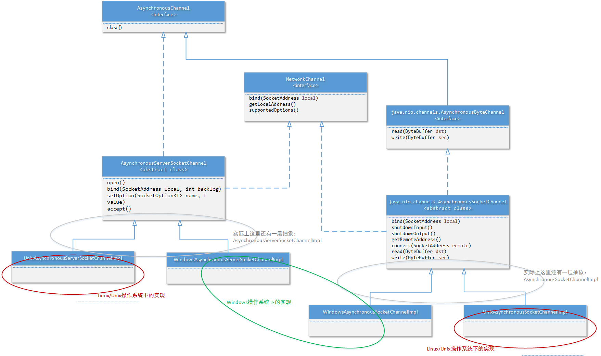
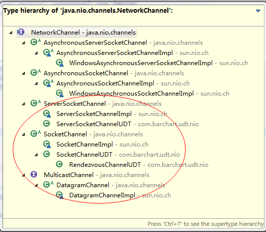
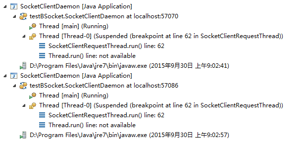
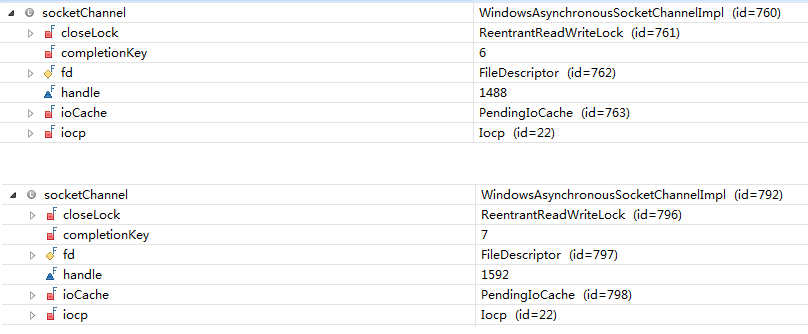
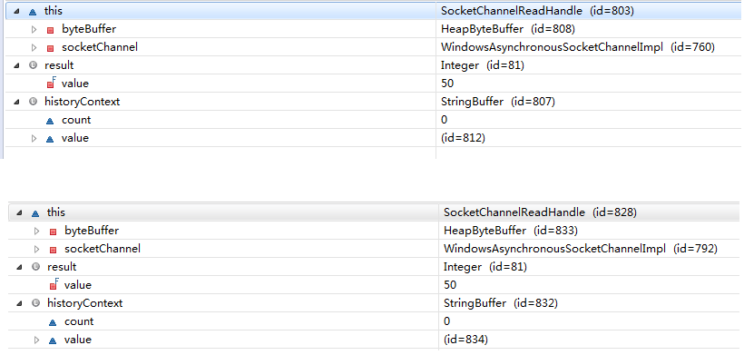

# Java AIO - 异步IO详解

主要对异步IO和Java中对AIO的支持详解。

## 异步IO

阻塞式同步IO、非阻塞式同步IO、多路复用IO 这三种IO模型，以及JAVA对于这三种IO模型的支持。重点说明了IO模型是由操作系统提供支持，且这三种IO模型都是同步IO，都是采用的“应用程序不询问我，我绝不会主动通知”的方式。

异步IO则是采用“订阅-通知”模式: 即应用程序向操作系统注册IO监听，然后继续做自己的事情。当操作系统发生IO事件，并且准备好数据后，在主动通知应用程序，触发相应的函数:


和同步IO一样，异步IO也是由操作系统进行支持的。微软的windows系统提供了一种异步IO技术: IOCP(I/O Completion Port，I/O完成端口)；

Linux下由于没有这种异步IO技术，所以使用的是epoll(上文介绍过的一种多路复用IO技术的实现)对异步IO进行模拟。

## JAVA对AIO的支持

### JAVA AIO框架简析




这里通过这个结构分析要告诉各位读者JAVA AIO中类设计和操作系统的相关性

说明JAVA AIO框架在windows下使用windows IOCP技术，在Linux下使用epoll多路复用IO技术模拟异步IO，这个从JAVA AIO框架的部分类设计上就可以看出来。例如框架中，在Windows下负责实现套接字通道的具体类是“sun.nio.ch.WindowsAsynchronousSocketChannelImpl”，其引用的IOCP类型文档注释如是:

```java
/** 
* Windows implementation of AsynchronousChannelGroup encapsulating an I/O 
* completion port. 
*/
```

全部完整代码(建议从“java.nio.channels.spi.AsynchronousChannelProvider”这个类看起)。

特别说明一下，请注意图中的“java.nio.channels.NetworkChannel”接口，这个接口同样被JAVA NIO框架实现了，如下图所示:



### 代码实例

下面，我们通过一个代码示例，来讲解JAVA AIO框架的具体使用，先上代码，在针对代码编写和运行中的要点进行讲解:

```java
package testASocket;

import java.io.IOException;
import java.io.UnsupportedEncodingException;
import java.net.InetSocketAddress;
import java.nio.ByteBuffer;
import java.nio.channels.AsynchronousChannelGroup;
import java.nio.channels.AsynchronousServerSocketChannel;
import java.nio.channels.AsynchronousSocketChannel;
import java.nio.channels.CompletionHandler;
import java.util.concurrent.ExecutorService;
import java.util.concurrent.Executors;

import org.apache.commons.logging.Log;
import org.apache.commons.logging.LogFactory;
import org.apache.log4j.BasicConfigurator;

/**
 * @author yinwenjie
 */
public class SocketServer {

    static {
        BasicConfigurator.configure();
    }

    private static final Object waitObject = new Object();

    /**
     * @param args
     * @throws Exception
     */
    public static void main(String[] args) throws Exception {
        /*
         * 对于使用的线程池技术，我一定要多说几句
         * 1、Executors是线程池生成工具，通过这个工具我们可以很轻松的生成“固定大小的线程池”、“调度池”、“可伸缩线程数量的池”。具体请看API Doc
         * 2、当然您也可以通过ThreadPoolExecutor直接生成池。
         * 3、这个线程池是用来得到操作系统的“IO事件通知”的，不是用来进行“得到IO数据后的业务处理的”。要进行后者的操作，您可以再使用一个池(最好不要混用)
         * 4、您也可以不使用线程池(不推荐)，如果决定不使用线程池，直接AsynchronousServerSocketChannel.open()就行了。
         * */
        ExecutorService threadPool = Executors.newFixedThreadPool(20);
        AsynchronousChannelGroup group = AsynchronousChannelGroup.withThreadPool(threadPool);
        final AsynchronousServerSocketChannel serverSocket = AsynchronousServerSocketChannel.open(group);

        //设置要监听的端口“0.0.0.0”代表本机所有IP设备
        serverSocket.bind(new InetSocketAddress("0.0.0.0", 83));
        //为AsynchronousServerSocketChannel注册监听，注意只是为AsynchronousServerSocketChannel通道注册监听
        //并不包括为 随后客户端和服务器 socketchannel通道注册的监听
        serverSocket.accept(null, new ServerSocketChannelHandle(serverSocket));

        //等待，以便观察现象(这个和要讲解的原理本身没有任何关系，只是为了保证守护线程不会退出)
        synchronized(waitObject) {
            waitObject.wait();
        }
    }
}

/**
 * 这个处理器类，专门用来响应 ServerSocketChannel 的事件。
 * @author yinwenjie
 */
class ServerSocketChannelHandle implements CompletionHandler<AsynchronousSocketChannel, Void> {
    /**
     * 日志
     */
    private static final Log LOGGER = LogFactory.getLog(ServerSocketChannelHandle.class);

    private AsynchronousServerSocketChannel serverSocketChannel;

    /**
     * @param serverSocketChannel
     */
    public ServerSocketChannelHandle(AsynchronousServerSocketChannel serverSocketChannel) {
        this.serverSocketChannel = serverSocketChannel;
    }

    /**
     * 注意，我们分别观察 this、socketChannel、attachment三个对象的id。
     * 来观察不同客户端连接到达时，这三个对象的变化，以说明ServerSocketChannelHandle的监听模式
     */
    @Override
    public void completed(AsynchronousSocketChannel socketChannel, Void attachment) {
        ServerSocketChannelHandle.LOGGER.info("completed(AsynchronousSocketChannel result, ByteBuffer attachment)");
        //每次都要重新注册监听(一次注册，一次响应)，但是由于“文件状态标示符”是独享的，所以不需要担心有“漏掉的”事件
        this.serverSocketChannel.accept(attachment, this);

        //为这个新的socketChannel注册“read”事件，以便操作系统在收到数据并准备好后，主动通知应用程序
        //在这里，由于我们要将这个客户端多次传输的数据累加起来一起处理，所以我们将一个stringbuffer对象作为一个“附件”依附在这个channel上
        //
        ByteBuffer readBuffer = ByteBuffer.allocate(50);
        socketChannel.read(readBuffer, new StringBuffer(), new SocketChannelReadHandle(socketChannel , readBuffer));
    }

    /* (non-Javadoc)
     * @see java.nio.channels.CompletionHandler#failed(java.lang.Throwable, java.lang.Object)
     */
    @Override
    public void failed(Throwable exc, Void attachment) {
        ServerSocketChannelHandle.LOGGER.info("failed(Throwable exc, ByteBuffer attachment)");
    }
}

/**
 * 负责对每一个socketChannel的数据获取事件进行监听。<p>
 * 
 * 重要的说明: 一个socketchannel都会有一个独立工作的SocketChannelReadHandle对象(CompletionHandler接口的实现)，
 * 其中又都将独享一个“文件状态标示”对象FileDescriptor、
 * 一个独立的由程序员定义的Buffer缓存(这里我们使用的是ByteBuffer)、
 * 所以不用担心在服务器端会出现“窜对象”这种情况，因为JAVA AIO框架已经帮您组织好了。<p>
 * 
 * 但是最重要的，用于生成channel的对象: AsynchronousChannelProvider是单例模式，无论在哪组socketchannel，
 * 对是一个对象引用(但这没关系，因为您不会直接操作这个AsynchronousChannelProvider对象)。
 * @author yinwenjie
 */
class SocketChannelReadHandle implements CompletionHandler<Integer, StringBuffer> {
    /**
     * 日志
     */
    private static final Log LOGGER = LogFactory.getLog(SocketChannelReadHandle.class);

    private AsynchronousSocketChannel socketChannel;

    /**
     * 专门用于进行这个通道数据缓存操作的ByteBuffer<br>
     * 当然，您也可以作为CompletionHandler的attachment形式传入。<br>
     * 这是，在这段示例代码中，attachment被我们用来记录所有传送过来的Stringbuffer了。
     */
    private ByteBuffer byteBuffer;

    public SocketChannelReadHandle(AsynchronousSocketChannel socketChannel , ByteBuffer byteBuffer) {
        this.socketChannel = socketChannel;
        this.byteBuffer = byteBuffer;
    }

    /* (non-Javadoc)
     * @see java.nio.channels.CompletionHandler#completed(java.lang.Object, java.lang.Object)
     */
    @Override
    public void completed(Integer result, StringBuffer historyContext) {
        //如果条件成立，说明客户端主动终止了TCP套接字，这时服务端终止就可以了
        if(result == -1) {
            try {
                this.socketChannel.close();
            } catch (IOException e) {
                SocketChannelReadHandle.LOGGER.error(e);
            }
            return;
        }

        SocketChannelReadHandle.LOGGER.info("completed(Integer result, Void attachment) : 然后我们来取出通道中准备好的值");
        /*
         * 实际上，由于我们从Integer result知道了本次channel从操作系统获取数据总长度
         * 所以实际上，我们不需要切换成“读模式”的，但是为了保证编码的规范性，还是建议进行切换。
         * 
         * 另外，无论是JAVA AIO框架还是JAVA NIO框架，都会出现“buffer的总容量”小于“当前从操作系统获取到的总数据量”，
         * 但区别是，JAVA AIO框架中，我们不需要专门考虑处理这样的情况，因为JAVA AIO框架已经帮我们做了处理(做成了多次通知)
         * */
        this.byteBuffer.flip();
        byte[] contexts = new byte[1024];
        this.byteBuffer.get(contexts, 0, result);
        this.byteBuffer.clear();
        try {
            String nowContent = new String(contexts , 0 , result , "UTF-8");
            historyContext.append(nowContent);
            SocketChannelReadHandle.LOGGER.info("================目前的传输结果: " + historyContext);
        } catch (UnsupportedEncodingException e) {
            SocketChannelReadHandle.LOGGER.error(e);
        }

        //如果条件成立，说明还没有接收到“结束标记”
        if(historyContext.indexOf("over") == -1) {
            return;
        }

        //=========================================================================
        //          和上篇文章的代码相同，我们以“over”符号作为客户端完整信息的标记
        //=========================================================================
        SocketChannelReadHandle.LOGGER.info("=======收到完整信息，开始处理业务=========");
        historyContext = new StringBuffer();

        //还要继续监听(一次监听一次通知)
        this.socketChannel.read(this.byteBuffer, historyContext, this);
    }

    /* (non-Javadoc)
     * @see java.nio.channels.CompletionHandler#failed(java.lang.Throwable, java.lang.Object)
     */
    @Override
    public void failed(Throwable exc, StringBuffer historyContext) {
        SocketChannelReadHandle.LOGGER.info("=====发现客户端异常关闭，服务器将关闭TCP通道");
        try {
            this.socketChannel.close();
        } catch (IOException e) {
            SocketChannelReadHandle.LOGGER.error(e);
        }
    }
}
```

### 要点讲解

注意在JAVA NIO框架中，我们说到了一个重要概念“selector”(选择器)。它负责代替应用查询中所有已注册的通道到操作系统中进行IO事件轮询、管理当前注册的通道集合，定位发生事件的通道等操操作；但是在JAVA AIO框架中，由于应用程序不是“轮询”方式，而是订阅-通知方式，所以不再需要“selector”(选择器)了，改由channel通道直接到操作系统注册监听。

JAVA AIO框架中，只实现了两种网络IO通道“AsynchronousServerSocketChannel”(服务器监听通道)、“AsynchronousSocketChannel”(socket套接字通道)。但是无论哪种通道他们都有独立的fileDescriptor(文件标识符)、attachment(附件，附件可以使任意对象，类似“通道上下文”)，并被独立的SocketChannelReadHandle类实例引用。我们通过debug操作来看看它们的引用结构:

在测试过程中，我们启动了两个客户端(客户端用什么语言来写都行，用阻塞或者非阻塞方式也都行，只要是支持 TCP Socket套接字的就行，然后我们观察服务器端对这两个客户端通道的处理情况:



可以看到，在服务器端分别为客户端1和客户端2创建的两个WindowsAsynchronousSocketChannelImpl对象为:



客户端1: WindowsAsynchronousSocketChannelImpl: 760 | FileDescriptor: 762

客户端2: WindowsAsynchronousSocketChannelImpl: 792 | FileDescriptor: 797

接下来，我们让两个客户端发送信息到服务器端，并观察服务器端的处理情况。客户端1发来的消息和客户端2发来的消息，在服务器端的处理情况如下图所示:



客户端1: WindowsAsynchronousSocketChannelImpl: 760 | FileDescriptor: 762 | SocketChannelReadHandle: 803 | HeapByteBuffer: 808

客户端2: WindowsAsynchronousSocketChannelImpl: 792 | FileDescriptor: 797 | SocketChannelReadHandle: 828 | HeapByteBuffer: 833

可以明显看到，服务器端处理每一个客户端通道所使用的SocketChannelReadHandle(处理器)对象都是独立的，并且所引用的SocketChannel对象都是独立的。

JAVA NIO和JAVA AIO框架，除了因为操作系统的实现不一样而去掉了Selector外，其他的重要概念都是存在的，例如上文中提到的Channel的概念，还有演示代码中使用的Buffer缓存方式。实际上JAVA NIO和JAVA AIO框架您可以看成是一套完整的“高并发IO处理”的实现。

### 还有改进可能

当然，以上代码是示例代码，目标是为了让您了解JAVA AIO框架的基本使用。所以它还有很多改造的空间，例如:

在生产环境下，我们需要记录这个通道上“用户的登录信息”。那么这个需求可以使用JAVA AIO中的“附件”功能进行实现。

记住JAVA AIO 和 JAVA NIO 框架都是要使用线程池的(当然您也可以不用)，线程池的使用原则，一定是只有业务处理部分才使用，使用后马上结束线程的执行(还回线程池或者消灭它)。JAVA AIO框架中还有一个线程池，是拿给“通知处理器”使用的，这是因为JAVA AIO框架是基于“订阅-通知”模型的，“订阅”操作可以由主线程完成，但是您总不能要求在应用程序中并发的“通知”操作也在主线程上完成吧^_^。

最好的改进方式，当然就是使用Netty或者Mina咯。

## 为什么还有Netty?

- 既然JAVA NIO / JAVA AIO已经实现了各主流操作系统的底层支持，那么为什么现在主流的JAVA NIO技术会是Netty和MINA呢? 答案很简单: 因为更好用，这里举几个方面的例子:
- 虽然JAVA NIO 和 JAVA AIO框架提供了 多路复用IO/异步IO的支持，但是并没有提供上层“信息格式”的良好封装。例如前两者并没有提供针对 Protocol Buffer、JSON这些信息格式的封装，但是Netty框架提供了这些数据格式封装(基于责任链模式的编码和解码功能)
- 要编写一个可靠的、易维护的、高性能的(注意它们的排序)NIO/AIO 服务器应用。除了框架本身要兼容实现各类操作系统的实现外。更重要的是它应该还要处理很多上层特有服务，例如: 客户端的权限、还有上面提到的信息格式封装、简单的数据读取。这些Netty框架都提供了响应的支持。
- JAVA NIO框架存在一个poll/epoll bug: Selector doesn’t block on Selector.select(timeout)，不能block意味着CPU的使用率会变成100%(这是底层JNI的问题，上层要处理这个异常实际上也好办)。当然这个bug只有在Linux内核上才能重现。
- 这个问题在JDK 1.7版本中还没有被完全解决: http://bugs.java.com/bugdatabase/view_bug.do?bug_id=2147719。虽然Netty 4.0中也是基于JAVA NIO框架进行封装的(上文中已经给出了Netty中NioServerSocketChannel类的介绍)，但是Netty已经将这个bug进行了处理。
- 其他原因，用过Netty后，可以自己进行比较了。
