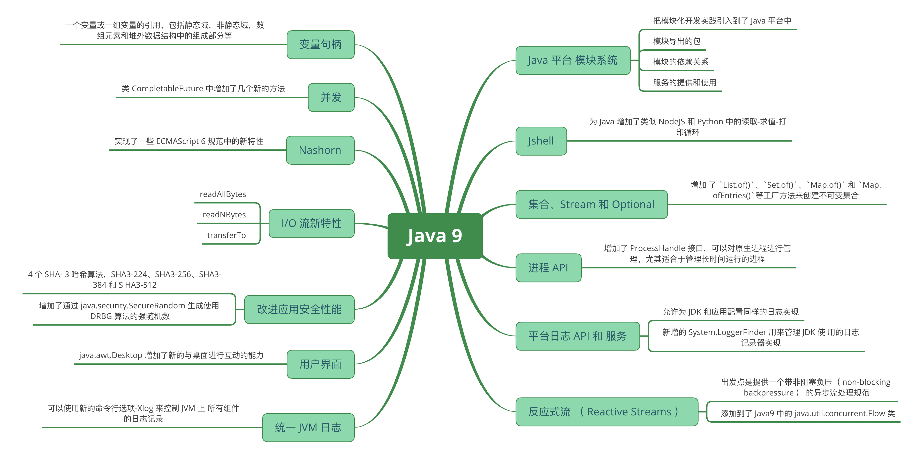
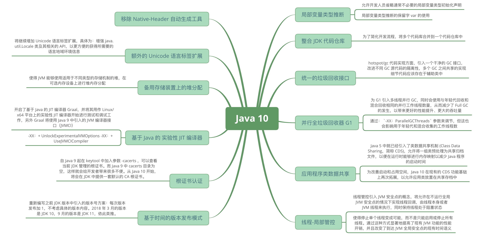
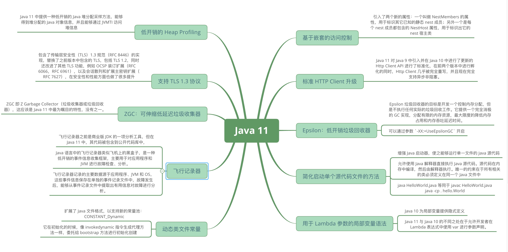
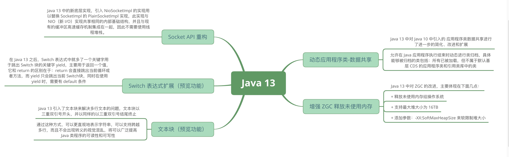
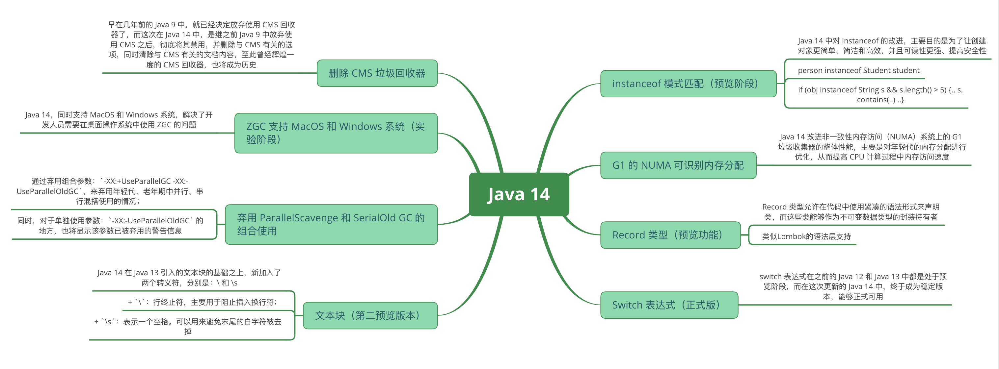
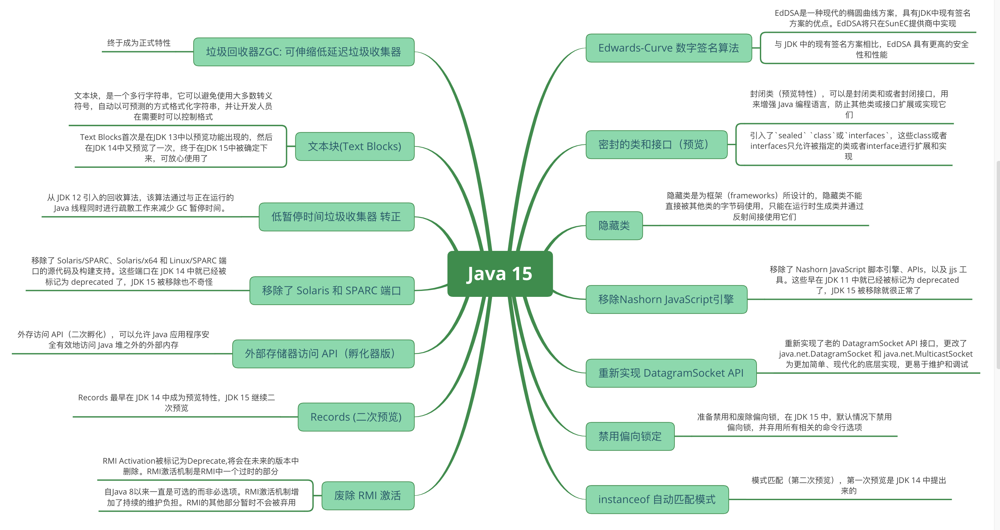

# ♥Java8+特性知识体系详解♥

## 重点知识

> Java现在发布的版本很快，每年两个，但是真正会被大规模使用的是三年一个的TLS版本。

- 每3年发布一个TLS，长期维护版本。意味着Java 8 ，Java 11， Java 17 才可能被大规模使用。
- 每年发布两个正式版本，分别是3月份和9月份。

## 版本详解

### Java 9 新特性详解

> Java 9 正式发布于 2017 年 9 月 21 日。作为 Java8 之后 3 年半才发布的新版本，Java 9 带来了很多重大的变化。其中最重要的改动是 Java 平台模块系统的引入。除此之外，还有一些新的特性。本文对 Java9 中包含的新特性做了概括性的介绍，可以帮助你快速了解 Java 9。

*知识体系系统性梳理*:

### Java 10 新特性概述

> 作为当今使用最广泛的编程语言之一的 Java 在 2018 年 3 月 21 日发布了第十个大版本。为了更快地迭代、更好地跟进社区反馈，Java 语言版本发布周期调整为每隔 6 个月发布一次。Java 10 是这一新规则之后，采用新发布周期的第一个大版本。Java 10 版本带来了很多新特性，其中最备受广大开发者关注的莫过于局部变量类型推断。除此之外，还有其他包括垃圾收集器改善、GC 改进、性能提升、线程管控等一批新特性。本文主要针对 Java 10 中的新特性展开介绍，希望读者能从本文的介绍中快速了解 Java 10 带来的变化。

*知识体系系统性梳理*

### Java 11 新特性概述

> Java 11 已于 2018 年 9 月 25 日正式发布，之前在 Java 10 新特性介绍 中介绍过，为了加快的版本迭代、跟进社区反馈，Java 的版本发布周期调整为每六个月一次——即每半年发布一个大版本，每个季度发布一个中间特性版本，并且做出不会跳票的承诺。通过这样的方式，Java 开发团队能够将一些重要特性尽早的合并到 Java Release 版本中，以便快速得到开发者的反馈，避免出现类似 Java 9 发布时的两次延期的情况。

*知识体系系统性梳理*

### Java 13 新特性概述

> Java 13 已如期于 9 月 17 日正式发布，此次更新是继半年前 Java 12 这大版本发布之后的一次常规版本更新，在这一版中，主要带来了 ZGC 增强、更新 Socket 实现、Switch 表达式更新等方面的改动、增强。本文主要针对 Java 13 中主要的新特性展开介绍，带你快速了解 Java 13 带来的不同体验。

*知识体系系统性梳理*

### Java 14 新特性概述

> Java 14 已如期于 2020 年 3 月 17 日正式发布，此次更新是继半年前 Java 13 这大版本发布之后的又一次常规版本更新，即便在全球疫情如此严峻形势下，依然保持每六个月的版本更新频率，为大家及时带来改进和增强，这一点值得点赞。在这一版中，主要带来了 ZGC 增强、instanceof 增强、Switch 表达式更新为标准版等方面的改动、增强和新功能。本文主要介绍 Java 14 中的主要新特性，带您快速了解 Java 14 带来了哪些不一样的体验和便利。

*知识体系系统性梳理*

### Java 15 新特性概述

> JDK 15 在 2020 年 9 月 15 号正式发布了！根据发布的规划，这次发布的 JDK 15 将是一个短期的过度版，只会被 Oracle 支持（维护）6 个月，直到明年 3 月的 JDK 16 发布此版本将停止维护。而 Oracle 下一个长期支持版（LTS 版）会在明年的 9 月份候发布（Java 17），LTS 版每 3 年发布一个，上一次长期支持版是 18 年 9 月发布的 JDK 11。

*知识体系系统性梳理*

