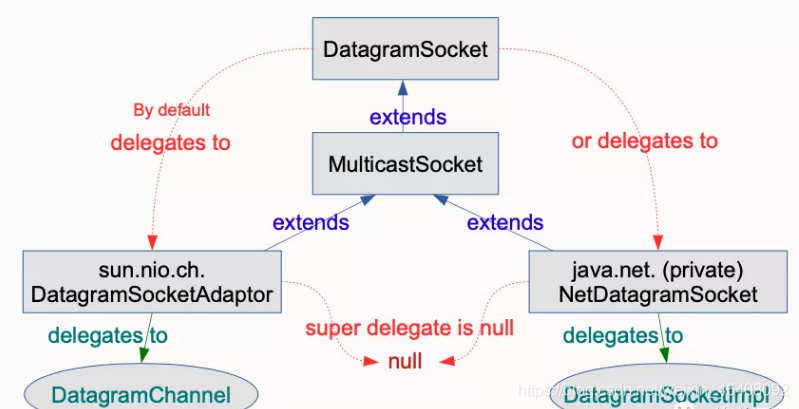

# Java 15 新特性概述

## 知识体系

.png)

JDK 15 在 2020 年 9 月 15 号正式发布了！根据发布的规划，这次发布的 JDK 15 将是一个短期的过度版，只会被 Oracle 支持（维护）6 个月，直到明年 3 月的 JDK 16 发布此版本将停止维护。

## Edwards-Curve 数字签名算法 (EdDSA)

> Edwards-Curve 数字签名算法（EdDSA），一种根据 RFC 8032 规范所描述的 Edwards-Curve 数字签名算法（EdDSA）实现加密签名，实现了一种 RFC 8032 标准化方案，但它不能代替 ECDSA。

与 JDK 中的现有签名方案相比，EdDSA 具有更高的安全性和性能，因此备受关注。它已经在OpenSSL和BoringSSL等加密库中得到支持，在区块链领域用的比较多。

EdDSA是一种现代的椭圆曲线方案，具有JDK中现有签名方案的优点。EdDSA将只在SunEC提供商中实现。

```java
// example: generate a key pair and sign
KeyPairGenerator kpg = KeyPairGenerator.getInstance("Ed25519");
KeyPair kp = kpg.generateKeyPair();
// algorithm is pure Ed25519
Signature sig = Signature.getInstance("Ed25519");
sig.initSign(kp.getPrivate());
sig.update(msg);
byte[] s = sig.sign();

// example: use KeyFactory to contruct a public key
KeyFactory kf = KeyFactory.getInstance("EdDSA");
boolean xOdd = ...
BigInteger y = ...
NamedParameterSpec paramSpec = new NamedParameterSpec("Ed25519");
EdECPublicKeySpec pubSpec = new EdECPublicKeySpec(paramSpec, new EdPoint(xOdd, y));
PublicKey pubKey = kf.generatePublic(pubSpec);
```

## 密封的类和接口（预览）

> 封闭类（预览特性），可以是封闭类和或者封闭接口，用来增强 Java 编程语言，**防止其他类或接口扩展或实现它们**。

因为我们引入了`sealed` `class`或`interfaces`，这些class或者interfaces只允许被指定的类或者interface进行扩展和实现。

使用修饰符`sealed`，您可以将一个类声明为密封类。密封的类使用reserved关键字permits列出可以直接扩展它的类。子类可以是最终的，非密封的或密封的。

之前我们的代码是这样的。

```java
public class Person { } //人
 
class Teacher extends Person { }//教师
 
class Worker extends Person { }  //工人
 
class Student extends Person{ } //学生   
```

但是我们现在要限制  Person类 只能被这三个类继承，不能被其他类继承，需要这么做。

```java
// 添加sealed修饰符，permits后面跟上只能被继承的子类名称
public sealed class Person permits Teacher, Worker, Student{ } //人
 
// 子类可以被修饰为 final
final class Teacher extends Person { }//教师
 
// 子类可以被修饰为 non-sealed，此时 Worker类就成了普通类，谁都可以继承它
non-sealed class Worker extends Person { }  //工人
// 任何类都可以继承Worker
class AnyClass extends Worker{}
 
//子类可以被修饰为 sealed,同上
sealed class Student extends Person permits MiddleSchoolStudent,GraduateStudent{ } //学生
 
 
final class MiddleSchoolStudent extends Student { }  //中学生
 
final class GraduateStudent extends Student { }  //研究生 
```

很强很实用的一个特性，可以限制类的层次结构。

## 隐藏类

> 隐藏类是为框架（frameworks）所设计的，隐藏类不能直接被其他类的字节码使用，只能在运行时生成类并通过反射间接使用它们。

该提案通过启用标准 API 来定义 无法发现 且 具有有限生命周期 的隐藏类，从而提高 JVM 上所有语言的效率。JDK内部和外部的框架将能够动态生成类，而这些类可以定义隐藏类。通常来说基于JVM的很多语言都有动态生成类的机制，这样可以提高语言的灵活性和效率。

- 隐藏类天生为框架设计的，在运行时生成内部的class。
- 隐藏类只能通过反射访问，不能直接被其他类的字节码访问。
- 隐藏类可以独立于其他类加载、卸载，这可以减少框架的内存占用。

**Hidden Classes是什么呢**？

Hidden Classes就是不能直接被其他class的二进制代码使用的class。Hidden Classes主要被一些框架用来生成运行时类，但是这些类不是被用来直接使用的，而是通过反射机制来调用。

比如在JDK8中引入的lambda表达式，JVM并不会在编译的时候将lambda表达式转换成为专门的类，而是在运行时将相应的字节码动态生成相应的类对象。

另外使用动态代理也可以为某些类生成新的动态类。

**那么我们希望这些动态生成的类需要具有什么特性呢**？

- **不可发现性**。 因为我们是为某些静态的类动态生成的动态类，所以我们希望把这个动态生成的类看做是静态类的一部分。所以我们不希望除了该静态类之外的其他机制发现。
- **访问控制**。 我们希望在访问控制静态类的同时，也能控制到动态生成的类。
- **生命周期**。 动态生成类的生命周期一般都比较短，我们并不需要将其保存和静态类的生命周期一致。

**API的支持**

所以我们需要一些API来定义无法发现的且具有有限生命周期的隐藏类。这将提高所有基于JVM的语言实现的效率。

比如：

```java
java.lang.reflect.Proxy // 可以定义隐藏类作为实现代理接口的代理类。 
java.lang.invoke.StringConcatFactory // 可以生成隐藏类来保存常量连接方法； 
java.lang.invoke.LambdaMetaFactory //可以生成隐藏的nestmate类，以容纳访问封闭变量的lambda主体；  
```

普通类是通过调用`ClassLoader::defineClass`创建的，而隐藏类是通过调用`Lookup::defineHiddenClass`创建的。这使JVM从提供的字节中派生一个隐藏类，链接该隐藏类，并返回提供对隐藏类的反射访问的查找对象。调用程序可以通过返回的查找对象来获取隐藏类的Class对象。

## 移除Nashorn JavaScript引擎

> 移除了 Nashorn JavaScript 脚本引擎、APIs，以及 jjs 工具。这些早在 JDK 11 中就已经被标记为 deprecated 了，JDK 15 被移除就很正常了。

**Nashorn引擎是什么**？

Nashorn 是 JDK 1.8 引入的一个 JavaScript 脚本引擎，用来取代 Rhino 脚本引擎。Nashorn 是 ECMAScript-262 5.1 的完整实现，增强了 Java 和 JavaScript 的兼容性，并且大大提升了性能。

**为什么要移除**？

官方的描述是，随着 ECMAScript 脚本语言的结构、API 的改编速度越来越快，维护 Nashorn 太有挑战性了，所以……。

## 重新实现 DatagramSocket API

> 重新实现了老的 DatagramSocket API 接口，更改了 java.net.DatagramSocket 和 java.net.MulticastSocket 为更加简单、现代化的底层实现，更易于维护和调试。



`java.net.datagram.Socket`和`java.net.MulticastSocket`的当前实现可以追溯到JDK 1.0，那时IPv6还在开发中。因此，当前的多播套接字实现尝试调和IPv4和IPv6难以维护的方式。

- 通过替换 java.net.datagram 的基础实现，重新实现旧版 DatagramSocket API。
- 更改`java.net.DatagramSocket` 和 `java.net.MulticastSocket` 为更加简单、现代化的底层实现。提高了 JDK 的可维护性和稳定性。
- 通过将`java.net.datagram.Socket`和`java.net.MulticastSocket` API的底层实现替换为更简单、更现代的实现来重新实现遗留的DatagramSocket API。

**新的实现**：

- 易于调试和维护;
- 与Project Loom中正在探索的虚拟线程协同。

## 禁用偏向锁定

> 准备禁用和废除偏向锁，在 JDK 15 中，默认情况下禁用偏向锁，并弃用所有相关的命令行选项。

在默认情况下禁用偏向锁定，并弃用所有相关命令行选项。目标是确定是否需要继续支持偏置锁定的 **高维护成本** 的遗留同步优化， HotSpot虚拟机使用该优化来减少非竞争锁定的开销。 尽管某些Java应用程序在禁用偏向锁后可能会出现性能下降，但偏向锁的性能提高通常不像以前那么明显。

该特性默认禁用了`biased locking(-XX:+UseBiasedLocking)`，并且废弃了所有相关的命令行选型(`BiasedLockingStartupDelay`, `BiasedLockingBulkRebiasThreshold`, `BiasedLockingBulkRevokeThreshold`, `BiasedLockingDecayTime`, `UseOptoBiasInlining`, `PrintBiasedLockingStatistics` and `PrintPreciseBiasedLockingStatistics`)

## instanceof 自动匹配模式

> 模式匹配（第二次预览），第一次预览是 JDK 14 中提出来的。

Java 14 之前：

```java
if (object instanceof Kid) {
    Kid kid = (Kid) object;
    // ...
} else if (object instanceof Kiddle) {
    Kid kid = (Kid) object;
    // ...
}  
```

Java 14+：

```java
if (object instanceof Kid kid) {
    // ...
} else if (object instanceof Kiddle kiddle) {
    // ...
} 
```

Java 15 并没有对此特性进行调整，继续预览特性，只是为了收集更多的用户反馈，可能还不成熟吧。

## 垃圾回收器ZGC: 可伸缩低延迟垃圾收集器

> ZGC是Java 11引入的新的垃圾收集器（JDK9以后默认的垃圾回收器是G1），经过了多个实验阶段，自此终于成为正式特性。ZGC是一个重新设计的并发的垃圾回收器，可以极大的提升GC的性能。支持任意堆大小而保持稳定的低延迟（10ms以内），性能非常可观。目前默认垃圾回收器仍然是 G1，后续很有可以能将ZGC设为默认垃圾回收器。之前需要通过`-XX:+UnlockExperimentalVMOptions -XX:+UseZGC`来启用ZGC，现在只需要`-XX:+UseZGC`就可以。

以下是相关介绍：

ZGC 是一个可伸缩的、低延迟的垃圾收集器，主要为了满足如下目标进行设计：

- GC 停顿时间不超过 10ms
- 即能处理几百 MB 的小堆，也能处理几个 TB 的大堆
- 应用吞吐能力不会下降超过 15%（与 G1 回收算法相比）
- 方便在此基础上引入新的 GC 特性和利用 colord
- 针以及 Load barriers 优化奠定基础
- 当前只支持 Linux/x64 位平台 停顿时间在 10ms 以下，10ms 其实是一个很保守的数据，即便是 10ms 这个数据，也是 GC 调优几乎达不到的极值。根据 SPECjbb 2015 的基准测试，128G 的大堆下最大停顿时间才 1.68ms，远低于 10ms，和 G1 算法相比，改进非常明显。

.png)


本图片引用自： The Z Garbage Collector – An Introduction

不过目前 ZGC 还处于实验阶段，目前只在 Linux/x64 上可用，如果有足够的需求，将来可能会增加对其他平台的支持。同时作为实验性功能的 ZGC 将不会出现在 JDK 构建中，除非在编译时使用 configure 参数：`--with-jvm-features=zgc` 显式启用。

在实验阶段，编译完成之后，已经迫不及待的想试试 ZGC，需要配置以下 JVM 参数，才能使用 ZGC，具体启动 ZGC 参数如下：

```java
-XX：+ UnlockExperimentalVMOptions -XX：+ UseZGC -Xmx10g 
```

其中参数： -Xmx 是 ZGC 收集器中最重要的调优选项，大大解决了程序员在 JVM 参数调优上的困扰。ZGC 是一个并发收集器，必须要设置一个最大堆的大小，应用需要多大的堆，主要有下面几个考量：

- 对象的分配速率，要保证在 GC 的时候，堆中有足够的内存分配新对象。
- 一般来说，给 ZGC 的内存越多越好，但是也不能浪费内存，所以要找到一个平衡。

## 文本块(Text Blocks)

> 文本块，是一个多行字符串，它可以避免使用大多数转义符号，自动以可预测的方式格式化字符串，并让开发人员在需要时可以控制格式。

Text Blocks首次是在JDK 13中以预览功能出现的，然后在JDK 14中又预览了一次，终于在JDK 15中被确定下来，可放心使用了。

```java
public static void main(String[] args) {
    String query = """
           SELECT * from USER \
           WHERE `id` = 1 \
           ORDER BY `id`, `name`;\
           """;
    System.out.println(query);
}
```

运行程序，输出（可以看到展示为一行了）：

```java
SELECT * from USER WHERE `id` = 1 ORDER BY `id`, `name`;
```

## 低暂停时间垃圾收集器 转正

> Shenandoah垃圾回收算法终于从实验特性转变为产品特性，这是一个从 JDK 12 引入的回收算法，该算法通过与正在运行的 Java 线程同时进行疏散工作来减少 GC 暂停时间。Shenandoah 的暂停时间与堆大小无关，无论堆栈是 200 MB 还是 200 GB，都具有相同的一致暂停时间。

**怎么形容Shenandoah和ZGC的关系呢**？异同点大概如下：

- 相同点：性能几乎可认为是相同的
- 不同点：ZGC是Oracle JDK的。而Shenandoah只存在于OpenJDK中，因此使用时需注意你的JDK版本
- 打开方式：使用`-XX:+UseShenandoahGC`命令行参数打开。

Shenandoah在JDK12被作为experimental引入，在JDK15变为Production；之前需要通过`-XX:+UnlockExperimentalVMOptions -XX:+UseShenandoahGC`来启用，现在只需要`-XX:+UseShenandoahGC`即可启用

## 移除了 Solaris 和 SPARC 端口。

> 移除了 Solaris/SPARC、Solaris/x64 和 Linux/SPARC 端口的源代码及构建支持。这些端口在 JDK 14 中就已经被标记为 deprecated 了，JDK 15 被移除也不奇怪。

删除对Solaris/SPARC、Solaris/x64和Linux/SPARC端口的源代码和构建支持，在JDK 14中被标记为废弃，在JDK15版本正式移除。 许多正在开发的项目和功能（如Valhalla、Loom和Panama）需要进行重大更改以适应CPU架构和操作系统特定代码。

近年来，Solaris 和 SPARC 都已被 Linux 操作系统和英特尔处理器取代。放弃对 Solaris 和 SPARC 端口的支持将使 OpenJDK 社区的贡献者能够加速开发新功能，从而推动平台向前发展。

## 外部存储器访问 API（孵化器版）

> 外存访问 API（二次孵化），可以允许 Java 应用程序安全有效地访问 Java 堆之外的外部内存。

目的是引入一个 API，以允许 Java 程序安全、有效地访问 Java 堆之外的外部存储器。如本机、持久和托管堆。

有许多Java程序是访问外部内存的，比如Ignite和MapDB。 该API将有助于避免与垃圾收集相关的成本以及与跨进程共享内存以及通过将文件映射到内存来序列化和反序列化内存内容相关的不可预测性 。该Java API目前没有为访问外部内存提供令人满意的解决方案。但是在新的提议中，API不应该破坏JVM的安全性。

Foreign-Memory Access API在JDK14被作为incubating API引入，在JDK15处于Second Incubator，提供了改进。

## Records (二次预览)

> Records 最早在 JDK 14 中成为预览特性，JDK 15 继续二次预览。

**如下内容来自Java14**

Record 类型允许在代码中使用紧凑的语法形式来声明类，而这些类能够作为不可变数据类型的封装持有者。Record 这一特性主要用在特定领域的类上；与枚举类型一样，Record 类型是一种受限形式的类型，主要用于存储、保存数据，并且没有其它额外自定义行为的场景下。

在以往开发过程中，被当作数据载体的类对象，在正确声明定义过程中，通常需要编写大量的无实际业务、重复性质的代码，其中包括：构造函数、属性调用、访问以及 equals() 、hashCode()、toString() 等方法，因此在 Java 14 中引入了 Record 类型，其效果有些类似 Lombok 的 @Data 注解、Kotlin 中的 data class，但是又不尽完全相同，它们的共同点都是类的部分或者全部可以直接在类头中定义、描述，并且这个类只用于存储数据而已。对于 Record 类型，具体可以用下面代码来说明：

```java
public record Person(String name, int age) {
    public static String address;

    public String getName() {
        return name;
    }
}   
```

对上述代码进行编译，然后反编译之后可以看到如下结果：

```java
public final class Person extends java.lang.Record {
    private final java.lang.String name;
    private final java.lang.String age;

    public Person(java.lang.String name, java.lang.String age) { /* compiled code */ }

    public java.lang.String getName() { /* compiled code */ }

    public java.lang.String toString() { /* compiled code */ }

    public final int hashCode() { /* compiled code */ }

    public final boolean equals(java.lang.Object o) { /* compiled code */ }

    public java.lang.String name() { /* compiled code */ }

    public java.lang.String age() { /* compiled code */ }
}
```

根据反编译结果，可以得出，当用 Record 来声明一个类时，该类将自动拥有下面特征：

- 拥有一个构造方法
- 获取成员属性值的方法：name()、age()
- hashCode() 方法和 euqals() 方法
- toString() 方法
- 类对象和属性被 final 关键字修饰，不能被继承，类的示例属性也都被 final 修饰，不能再被赋值使用。
- 还可以在 Record 声明的类中定义静态属性、方法和示例方法。注意，不能在 Record 声明的类中定义示例字段，类也不能声明为抽象类等。

可以看到，该预览特性提供了一种更为紧凑的语法来声明类，并且可以大幅减少定义类似数据类型时所需的重复性代码。

另外 Java 14 中为了引入 Record 这种新的类型，在 java.lang.Class 中引入了下面两个新方法：

```java
RecordComponent[] getRecordComponents()
boolean isRecord() 
```

其中 getRecordComponents() 方法返回一组 java.lang.reflect.RecordComponent 对象组成的数组，java.lang.reflect.RecordComponent也是一个新引入类，该数组的元素与 Record 类中的组件相对应，其顺序与在记录声明中出现的顺序相同，可以从该数组中的每个 RecordComponent 中提取到组件信息，包括其名称、类型、泛型类型、注释及其访问方法。

而 isRecord() 方法，则返回所在类是否是 Record 类型，如果是，则返回 true。

## 废除 RMI 激活

> RMI Activation被标记为Deprecate,将会在未来的版本中删除。RMI激活机制是RMI中一个过时的部分，**自Java 8以来一直是可选的而非必选项**。RMI激活机制增加了持续的维护负担。RMI的其他部分暂时不会被弃用。

RMI jdk1.2引入，EJB在RMI系统中，我们使用延迟激活。延迟激活将激活对象推迟到客户第一次使用（即第一次方法调用）之前。 既然RMI Activation这么好用，为什么要废弃呢？

因为对于现代应用程序来说，分布式系统大部分都是基于Web的，web服务器已经解决了穿越防火墙，过滤请求，身份验证和安全性的问题，并且也提供了很多延迟加载的技术。

所以在现代应用程序中，RMI Activation已经很少被使用到了。并且在各种开源的代码库中，也基本上找不到RMI Activation的使用代码了。 为了减少RMI Activation的维护成本，在JDK8中，RMI Activation被置为可选的。现在在JDK15中，终于可以废弃了。

## 总结

- OracleJDK 15 下载地址：

https://www.oracle.com/java/technologies/javase-downloads.html

- OpenJDK 15 地址：

https://openjdk.java.net/projects/jdk/15/