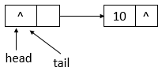
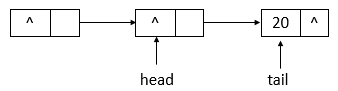

# JUC集合: ConcurrentLinkedQueue详解

ConcurerntLinkedQueue一个基于链接节点的无界线程安全队列。此队列按照 FIFO(先进先出)原则对元素进行排序。队列的头部是队列中时间最长的元素。队列的尾部 是队列中时间最短的元素。新的元素插入到队列的尾部，队列获取操作从队列头部获得元素。当多个线程共享访问一个公共 collection 时，ConcurrentLinkedQueue是一个恰当的选择。此队列不允许使用null元素。

## 面试问题去理解

- 要想用线程安全的队列有哪些选择? Vector，`Collections.synchronizedList(List<T> list)`, ConcurrentLinkedQueue等
- ConcurrentLinkedQueue实现的数据结构?
- ConcurrentLinkedQueue底层原理?  全程无锁(CAS)
- ConcurrentLinkedQueue的核心方法有哪些? offer()，poll()，peek()，isEmpty()等队列常用方法
- 说说ConcurrentLinkedQueue的HOPS(延迟更新的策略)的设计?
- ConcurrentLinkedQueue适合什么样的使用场景?

## ConcurrentLinkedQueue数据结构

通过源码分析可知，ConcurrentLinkedQueue的数据结构与LinkedBlockingQueue的数据结构相同，都是使用的链表结构。ConcurrentLinkedQueue的数据结构如下:


说明: ConcurrentLinkedQueue采用的链表结构，并且包含有一个头结点和一个尾结点。

## ConcurrentLinkedQueue源码分析

### 类的继承关系

```java
public class ConcurrentLinkedQueue<E> extends AbstractQueue<E>
        implements Queue<E>, java.io.Serializable {}  
```

说明: ConcurrentLinkedQueue继承了抽象类AbstractQueue，AbstractQueue定义了对队列的基本操作；同时实现了Queue接口，Queue定义了对队列的基本操作，同时，还实现了Serializable接口，表示可以被序列化。

### 类的内部类

```java
private static class Node<E> {
    // 元素
    volatile E item;
    // next域
    volatile Node<E> next;

    /**
        * Constructs a new node.  Uses relaxed write because item can
        * only be seen after publication via casNext.
        */
    // 构造函数
    Node(E item) {
        // 设置item的值
        UNSAFE.putObject(this, itemOffset, item);
    }
    // 比较并替换item值
    boolean casItem(E cmp, E val) {
        return UNSAFE.compareAndSwapObject(this, itemOffset, cmp, val);
    }
    
    void lazySetNext(Node<E> val) {
        // 设置next域的值，并不会保证修改对其他线程立即可见
        UNSAFE.putOrderedObject(this, nextOffset, val);
    }
    // 比较并替换next域的值
    boolean casNext(Node<E> cmp, Node<E> val) {
        return UNSAFE.compareAndSwapObject(this, nextOffset, cmp, val);
    }

    // Unsafe mechanics
    // 反射机制
    private static final sun.misc.Unsafe UNSAFE;
    // item域的偏移量
    private static final long itemOffset;
    // next域的偏移量
    private static final long nextOffset;

    static {
        try {
            UNSAFE = sun.misc.Unsafe.getUnsafe();
            Class<?> k = Node.class;
            itemOffset = UNSAFE.objectFieldOffset
                (k.getDeclaredField("item"));
            nextOffset = UNSAFE.objectFieldOffset
                (k.getDeclaredField("next"));
        } catch (Exception e) {
            throw new Error(e);
        }
    }
}
```

说明: Node类表示链表结点，用于存放元素，包含item域和next域，item域表示元素，next域表示下一个结点，其利用反射机制和CAS机制来更新item域和next域，保证原子性。

### 类的属性

```java
public class ConcurrentLinkedQueue<E> extends AbstractQueue<E>
        implements Queue<E>, java.io.Serializable {
    // 版本序列号        
    private static final long serialVersionUID = 196745693267521676L;
    // 反射机制
    private static final sun.misc.Unsafe UNSAFE;
    // head域的偏移量
    private static final long headOffset;
    // tail域的偏移量
    private static final long tailOffset;
    static {
        try {
            UNSAFE = sun.misc.Unsafe.getUnsafe();
            Class<?> k = ConcurrentLinkedQueue.class;
            headOffset = UNSAFE.objectFieldOffset
                (k.getDeclaredField("head"));
            tailOffset = UNSAFE.objectFieldOffset
                (k.getDeclaredField("tail"));
        } catch (Exception e) {
            throw new Error(e);
        }
    }
    
    // 头结点
    private transient volatile Node<E> head;
    // 尾结点
    private transient volatile Node<E> tail;
}
```

说明: 属性中包含了head域和tail域，表示链表的头结点和尾结点，同时，ConcurrentLinkedQueue也使用了反射机制和CAS机制来更新头结点和尾结点，保证原子性。

### 类的构造函数

- `ConcurrentLinkedQueue()`型构造函数

```java
public ConcurrentLinkedQueue() {
    // 初始化头结点与尾结点
    head = tail = new Node<E>(null);
} 
```

说明: 该构造函数用于创建一个最初为空的 ConcurrentLinkedQueue，头结点与尾结点指向同一个结点，该结点的item域为null，next域也为null。

- `ConcurrentLinkedQueue(Collection<? extends E>)`型构造函数

```java
public ConcurrentLinkedQueue(Collection<? extends E> c) {
    Node<E> h = null, t = null;
    for (E e : c) { // 遍历c集合
        // 保证元素不为空
        checkNotNull(e);
        // 新生一个结点
        Node<E> newNode = new Node<E>(e);
        if (h == null) // 头结点为null
            // 赋值头结点与尾结点
            h = t = newNode;
        else {
            // 直接头结点的next域
            t.lazySetNext(newNode);
            // 重新赋值头结点
            t = newNode;
        }
    }
    if (h == null) // 头结点为null
        // 新生头结点与尾结点
        h = t = new Node<E>(null);
    // 赋值头结点
    head = h;
    // 赋值尾结点
    tail = t;
} 
```

说明: 该构造函数用于创建一个最初包含给定 collection 元素的 ConcurrentLinkedQueue，按照此 collection 迭代器的遍历顺序来添加元素。

### 核心函数分析

#### offer函数

```java
public boolean offer(E e) {
    // 元素不为null
    checkNotNull(e);
    // 新生一个结点
    final Node<E> newNode = new Node<E>(e);

    for (Node<E> t = tail, p = t;;) { // 无限循环
        // q为p结点的下一个结点
        Node<E> q = p.next;
        if (q == null) { // q结点为null
            // p is last node
            if (p.casNext(null, newNode)) { // 比较并进行替换p结点的next域
                // Successful CAS is the linearization point
                // for e to become an element of this queue,
                // and for newNode to become "live".
                if (p != t) // p不等于t结点，不一致    // hop two nodes at a time
                    // 比较并替换尾结点
                    casTail(t, newNode);  // Failure is OK.
                // 返回
                return true;
            }
            // Lost CAS race to another thread; re-read next
        }
        else if (p == q) // p结点等于q结点
            // We have fallen off list.  If tail is unchanged, it
            // will also be off-list, in which case we need to
            // jump to head, from which all live nodes are always
            // reachable.  Else the new tail is a better bet.
            // 原来的尾结点与现在的尾结点是否相等，若相等，则p赋值为head，否则，赋值为现在的尾结点
            p = (t != (t = tail)) ? t : head;
        else
            // Check for tail updates after two hops.
            // 重新赋值p结点
            p = (p != t && t != (t = tail)) ? t : q;
    }
}
```

说明: offer函数用于将指定元素插入此队列的尾部。下面模拟offer函数的操作，队列状态的变化(假设单线程添加元素，连续添加10、20两个元素)。


- 若ConcurrentLinkedQueue的初始状态如上图所示，即队列为空。单线程添加元素，此时，添加元素10，则状态如下所示



- 如上图所示，添加元素10后，tail没有变化，还是指向之前的结点，继续添加元素20，则状态如下所示


- 如上图所示，添加元素20后，tail指向了最新添加的结点。

#### poll函数

```java
public E poll() {
    restartFromHead:
    for (;;) { // 无限循环
        for (Node<E> h = head, p = h, q;;) { // 保存头结点
            // item项
            E item = p.item;

            if (item != null && p.casItem(item, null)) { // item不为null并且比较并替换item成功
                // Successful CAS is the linearization point
                // for item to be removed from this queue.
                if (p != h) // p不等于h    // hop two nodes at a time
                    // 更新头结点
                    updateHead(h, ((q = p.next) != null) ? q : p); 
                // 返回item
                return item;
            }
            else if ((q = p.next) == null) { // q结点为null
                // 更新头结点
                updateHead(h, p);
                return null;
            }
            else if (p == q) // p等于q
                // 继续循环
                continue restartFromHead;
            else
                // p赋值为q
                p = q;
        }
    }
} 
```

说明: 此函数用于获取并移除此队列的头，如果此队列为空，则返回null。下面模拟poll函数的操作，队列状态的变化(假设单线程操作，状态为之前offer10、20后的状态，poll两次)。


- 队列初始状态如上图所示，在poll操作后，队列的状态如下图所示


- 如上图可知，poll操作后，head改变了，并且head所指向的结点的item变为了null。再进行一次poll操作，队列的状态如下图所示。


- 如上图可知，poll操作后，head结点没有变化，只是指示的结点的item域变成了null。

#### remove函数

```java
public boolean remove(Object o) {
    // 元素为null，返回
    if (o == null) return false;
    Node<E> pred = null;
    for (Node<E> p = first(); p != null; p = succ(p)) { // 获取第一个存活的结点
        // 第一个存活结点的item值
        E item = p.item;
        if (item != null &&
            o.equals(item) &&
            p.casItem(item, null)) { // 找到item相等的结点，并且将该结点的item设置为null
            // p的后继结点
            Node<E> next = succ(p);
            if (pred != null && next != null) // pred不为null并且next不为null
                // 比较并替换next域
                pred.casNext(p, next);
            return true;
        }
        // pred赋值为p
        pred = p;
    }
    return false;
}
```

说明: 此函数用于从队列中移除指定元素的单个实例(如果存在)。其中，会调用到first函数和succ函数，first函数的源码如下

```java
Node<E> first() {
    restartFromHead:
    for (;;) { // 无限循环，确保成功
        for (Node<E> h = head, p = h, q;;) {
            // p结点的item域是否为null
            boolean hasItem = (p.item != null);
            if (hasItem || (q = p.next) == null) { // item不为null或者next域为null
                // 更新头结点
                updateHead(h, p);
                // 返回结点
                return hasItem ? p : null;
            }
            else if (p == q) // p等于q
                // 继续从头结点开始
                continue restartFromHead;
            else
                // p赋值为q
                p = q;
        }
    }
} 
```

说明: first函数用于找到链表中第一个存活的结点。succ函数源码如下

```java
final Node<E> succ(Node<E> p) {
    // p结点的next域
    Node<E> next = p.next;
    // 如果next域为自身，则返回头结点，否则，返回next
    return (p == next) ? head : next;
}  
```

说明: succ用于获取结点的下一个结点。如果结点的next域指向自身，则返回head头结点，否则，返回next结点。下面模拟remove函数的操作，队列状态的变化(假设单线程操作，状态为之前offer10、20后的状态，执行remove(10)、remove(20)操作)。


- 如上图所示，为ConcurrentLinkedQueue的初始状态，remove(10)后的状态如下图所示



- 如上图所示，当执行remove(10)后，head指向了head结点之前指向的结点的下一个结点，并且head结点的item域置为null。继续执行remove(20)，状态如下图所示


- 如上图所示，执行remove(20)后，head与tail指向同一个结点，item域为null。

#### size函数

```java
public int size() {
    // 计数
    int count = 0;
    for (Node<E> p = first(); p != null; p = succ(p)) // 从第一个存活的结点开始往后遍历
        if (p.item != null) // 结点的item域不为null
            // Collection.size() spec says to max out
            if (++count == Integer.MAX_VALUE) // 增加计数，若达到最大值，则跳出循环
                break;
    // 返回大小
    return count;
}   
```

说明: 此函数用于返回ConcurrenLinkedQueue的大小，从第一个存活的结点(first)开始，往后遍历链表，当结点的item域不为null时，增加计数，之后返回大小。

## ConcurrentLinkedQueue示例

下面通过一个示例来了解ConcurrentLinkedQueue的使用

```java
import java.util.concurrent.ConcurrentLinkedQueue;

class PutThread extends Thread {
    private ConcurrentLinkedQueue<Integer> clq;
    public PutThread(ConcurrentLinkedQueue<Integer> clq) {
        this.clq = clq;
    }
    
    public void run() {
        for (int i = 0; i < 10; i++) {
            try {
                System.out.println("add " + i);
                clq.add(i);
                Thread.sleep(100);
            } catch (InterruptedException e) {
                e.printStackTrace();
            }
        }
    }
}

class GetThread extends Thread {
    private ConcurrentLinkedQueue<Integer> clq;
    public GetThread(ConcurrentLinkedQueue<Integer> clq) {
        this.clq = clq;
    }
    
    public void run() {
        for (int i = 0; i < 10; i++) {
            try {
                System.out.println("poll " + clq.poll());
                Thread.sleep(100);
            } catch (InterruptedException e) {
                e.printStackTrace();
            }
        }
    }
}

public class ConcurrentLinkedQueueDemo {
    public static void main(String[] args) {
        ConcurrentLinkedQueue<Integer> clq = new ConcurrentLinkedQueue<Integer>();
        PutThread p1 = new PutThread(clq);
        GetThread g1 = new GetThread(clq);
        
        p1.start();
        g1.start();
        
    }
}   
```

运行结果(某一次):

```html
add 0
poll null
add 1
poll 0
add 2
poll 1
add 3
poll 2
add 4
poll 3
add 5
poll 4
poll 5
add 6
add 7
poll 6
poll 7
add 8
add 9
poll 8  
```

说明: GetThread线程不会因为ConcurrentLinkedQueue队列为空而等待，而是直接返回null，所以当实现队列不空时，等待时，则需要用户自己实现等待逻辑。

## 再深入理解

### HOPS(延迟更新的策略)的设计

通过上面对offer和poll方法的分析，我们发现tail和head是延迟更新的，两者更新触发时机为：

- `tail更新触发时机`：当tail指向的节点的下一个节点不为null的时候，会执行定位队列真正的队尾节点的操作，找到队尾节点后完成插入之后才会通过casTail进行tail更新；当tail指向的节点的下一个节点为null的时候，只插入节点不更新tail。
- `head更新触发时机`：当head指向的节点的item域为null的时候，会执行定位队列真正的队头节点的操作，找到队头节点后完成删除之后才会通过updateHead进行head更新；当head指向的节点的item域不为null的时候，只删除节点不更新head。

并且在更新操作时，源码中会有注释为：`hop two nodes at a time`。所以这种延迟更新的策略就被叫做HOPS的大概原因是这个(猜的 😃)，从上面更新时的状态图可以看出，head和tail的更新是“跳着的”即中间总是间隔了一个。那么这样设计的意图是什么呢?

如果让tail永远作为队列的队尾节点，实现的代码量会更少，而且逻辑更易懂。但是，这样做有一个缺点，如果大量的入队操作，每次都要执行CAS进行tail的更新，汇总起来对性能也会是大大的损耗。如果能减少CAS更新的操作，无疑可以大大提升入队的操作效率，所以doug lea大师每间隔1次(tail和队尾节点的距离为1)进行才利用CAS更新tail。对head的更新也是同样的道理，虽然，这样设计会多出在循环中定位队尾节点，但总体来说读的操作效率要远远高于写的性能，因此，多出来的在循环中定位尾节点的操作的性能损耗相对而言是很小的。

### ConcurrentLinkedQueue适合的场景

ConcurrentLinkedQueue通过无锁来做到了更高的并发量，是个高性能的队列，但是使用场景相对不如阻塞队列常见，毕竟取数据也要不停的去循环，不如阻塞的逻辑好设计，但是在并发量特别大的情况下，是个不错的选择，性能上好很多，而且这个队列的设计也是特别费力，尤其的使用的改良算法和对哨兵的处理。整体的思路都是比较严谨的，这个也是使用了无锁造成的，我们自己使用无锁的条件的话，这个队列是个不错的参考。