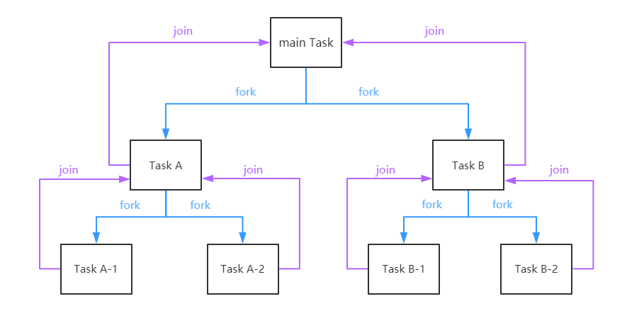
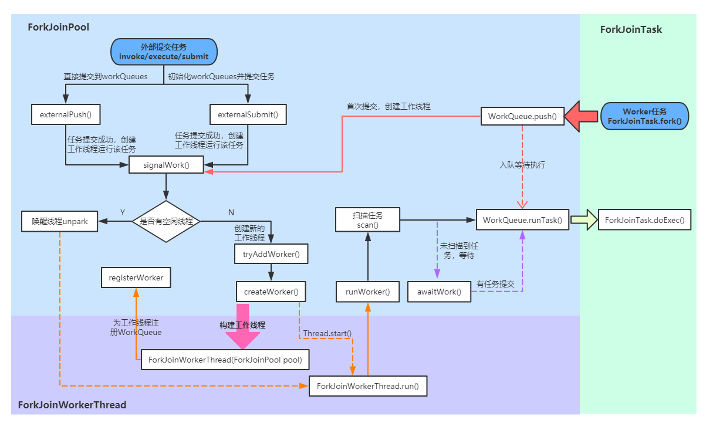
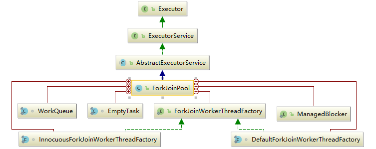
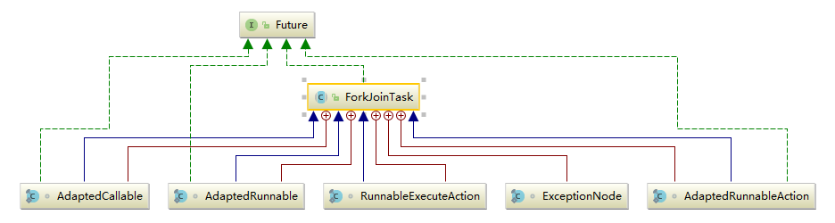
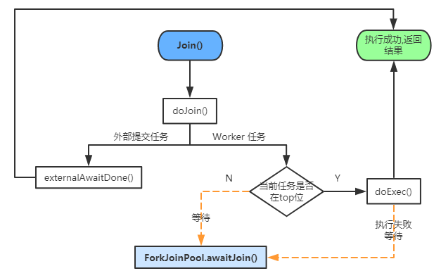

# JUC线程池: Fork/Join框架详解

ForkJoinPool 是JDK 7加入的一个线程池类。Fork/Join 技术是分治算法(Divide-and-Conquer)的并行实现，它是一项可以获得良好的并行性能的简单且高效的设计技术。目的是为了帮助更好地利用多处理器带来的好处，使用所有可用的运算能力来提升应用的性能。

## 面试问题去理解Fork/Join框架

- Fork/Join主要用来解决什么样的问题?
- Fork/Join框架是在哪个JDK版本中引入的?
- Fork/Join框架主要包含哪三个模块? 模块之间的关系是怎么样的?
- ForkJoinPool类继承关系?
- ForkJoinTask抽象类继承关系? 在实际运用中，我们一般都会继承 RecursiveTask 、RecursiveAction 或 CountedCompleter 来实现我们的业务需求，而不会直接继承 ForkJoinTask 类。
- 整个Fork/Join 框架的执行流程/运行机制是怎么样的?
- 具体阐述Fork/Join的分治思想和work-stealing 实现方式?
- 有哪些JDK源码中使用了Fork/Join思想?
- 如何使用Executors工具类创建ForkJoinPool?
- 写一个例子: 用ForkJoin方式实现1+2+3+...+100000?
- Fork/Join在使用时有哪些注意事项? 结合JDK中的斐波那契数列实例具体说明。

## Fork/Join框架简介

Fork/Join框架是Java并发工具包中的一种可以将一个大任务拆分为很多小任务来异步执行的工具，自JDK1.7引入。

### 三个模块及关系

Fork/Join框架主要包含三个模块:

- 任务对象: `ForkJoinTask` (包括`RecursiveTask`、`RecursiveAction` 和 `CountedCompleter`)
- 执行Fork/Join任务的线程: `ForkJoinWorkerThread`
- 线程池: `ForkJoinPool`

这三者的关系是: ForkJoinPool可以通过池中的ForkJoinWorkerThread来处理ForkJoinTask任务。

```java
// from 《A Java Fork/Join Framework》Dong Lea
Result solve(Problem problem) {
	if (problem is small)
 		directly solve problem
 	else {
 		split problem into independent parts
 		fork new subtasks to solve each part
 		join all subtasks
 		compose result from subresults
	}
}
```

ForkJoinPool 只接收 ForkJoinTask 任务(在实际使用中，也可以接收 Runnable/Callable 任务，但在真正运行时，也会把这些任务封装成 ForkJoinTask 类型的任务)，RecursiveTask 是 ForkJoinTask 的子类，是一个可以递归执行的 ForkJoinTask，RecursiveAction 是一个无返回值的 RecursiveTask，CountedCompleter 在任务完成执行后会触发执行一个自定义的钩子函数。

在实际运用中，一般都会继承 `RecursiveTask` 、`RecursiveAction` 或 `CountedCompleter` 来实现我们的业务需求，而不会直接继承 ForkJoinTask 类。

### 核心思想: 分治算法(Divide-and-Conquer)

分治算法(Divide-and-Conquer)把任务递归的拆分为各个子任务，这样可以更好的利用系统资源，尽可能的使用所有可用的计算能力来提升应用性能。首先看一下 Fork/Join 框架的任务运行机制:



### 核心思想: work-stealing(工作窃取)算法

work-stealing(工作窃取)算法: 线程池内的所有工作线程都尝试找到并执行已经提交的任务，或者是被其他活动任务创建的子任务(如果不存在就阻塞等待)。这种特性使得 ForkJoinPool 在运行多个可以产生子任务的任务，或者是提交的许多小任务时效率更高。尤其是构建异步模型的 ForkJoinPool 时，对不需要合并(join)的事件类型任务也非常适用。

在 ForkJoinPool 中，线程池中每个工作线程(ForkJoinWorkerThread)都对应一个任务队列(WorkQueue)，工作线程优先处理来自自身队列的任务(LIFO或FIFO顺序，参数 mode 决定)，然后以FIFO的顺序随机窃取其他队列中的任务。

具体思路如下:

- 每个线程都有自己的一个WorkQueue，该工作队列是一个双端队列。
- 队列支持三个功能push、pop、poll
- push/pop只能被队列的所有者线程调用，而poll可以被其他线程调用。
- 划分的子任务调用fork时，都会被push到自己的队列中。
- 默认情况下，工作线程从自己的双端队列获出任务并执行。
- 当自己的队列为空时，线程随机从另一个线程的队列末尾调用poll方法窃取任务。


### Fork/Join 框架的执行流程

上图可以看出ForkJoinPool 中的任务执行分两种:

- 直接通过 FJP 提交的外部任务(external/submissions task)，存放在 workQueues 的偶数槽位；
- 通过内部 fork 分割的子任务(Worker task)，存放在 workQueues 的奇数槽位。

那Fork/Join 框架的执行流程是什么样的?



## Fork/Join类关系

### ForkJoinPool继承关系




内部类介绍:

- ForkJoinWorkerThreadFactory: 内部线程工厂接口，用于创建工作线程ForkJoinWorkerThread
- DefaultForkJoinWorkerThreadFactory: ForkJoinWorkerThreadFactory 的默认实现类
- InnocuousForkJoinWorkerThreadFactory: 实现了 ForkJoinWorkerThreadFactory，无许可线程工厂，当系统变量中有系统安全管理相关属性时，默认使用这个工厂创建工作线程。
- EmptyTask: 内部占位类，用于替换队列中 join 的任务。
- ManagedBlocker: 为 ForkJoinPool 中的任务提供扩展管理并行数的接口，一般用在可能会阻塞的任务(如在 Phaser 中用于等待 phase 到下一个generation)。
- WorkQueue: ForkJoinPool 的核心数据结构，本质上是work-stealing 模式的双端任务队列，内部存放 ForkJoinTask 对象任务，使用 @Contented 注解修饰防止伪共享。
  - 工作线程在运行中产生新的任务(通常是因为调用了 fork())时，此时可以把 WorkQueue 的数据结构视为一个栈，新的任务会放入栈顶(top 位)；工作线程在处理自己工作队列的任务时，按照 LIFO 的顺序。
  - 工作线程在处理自己的工作队列同时，会尝试窃取一个任务(可能是来自于刚刚提交到 pool 的任务，或是来自于其他工作线程的队列任务)，此时可以把 WorkQueue 的数据结构视为一个 FIFO 的队列，窃取的任务位于其他线程的工作队列的队首(base位)。
- 伪共享状态: 缓存系统中是以缓存行(cache line)为单位存储的。缓存行是2的整数幂个连续字节，一般为32-256个字节。最常见的缓存行大小是64个字节。当多线程修改互相独立的变量时，如果这些变量共享同一个缓存行，就会无意中影响彼此的性能，这就是伪共享。

### ForkJoinTask继承关系



ForkJoinTask 实现了 Future 接口，说明它也是一个可取消的异步运算任务，实际上ForkJoinTask 是 Future 的轻量级实现，主要用在纯粹是计算的函数式任务或者操作完全独立的对象计算任务。fork 是主运行方法，用于异步执行；而 join 方法在任务结果计算完毕之后才会运行，用来合并或返回计算结果。 其内部类都比较简单，ExceptionNode 是用于存储任务执行期间的异常信息的单向链表；其余四个类是为 Runnable/Callable 任务提供的适配器类，用于把 Runnable/Callable 转化为 ForkJoinTask 类型的任务(因为 ForkJoinPool 只可以运行 ForkJoinTask 类型的任务)。

## Fork/Join框架源码解析

> 分析思路: 在对类层次结构有了解以后，我们先看下内部核心参数，然后分析上述流程图。会分4个部分:

- 首先介绍任务的提交流程 - 外部任务(external/submissions task)提交
- 然后介绍任务的提交流程 - 子任务(Worker task)提交
- 再分析任务的执行过程(ForkJoinWorkerThread.run()到ForkJoinTask.doExec()这一部分)；
- 最后介绍任务的结果获取(ForkJoinTask.join()和ForkJoinTask.invoke())

### ForkJoinPool

#### 核心参数

在后面的源码解析中，我们会看到大量的位运算，这些位运算都是通过我们接下来介绍的一些常量参数来计算的。

例如，如果要更新活跃线程数，使用公式(UC_MASK & (c + AC_UNIT)) | (SP_MASK & c)；c 代表当前 ctl，UC_MASK 和 SP_MASK 分别是高位和低位掩码，AC_UNIT 为活跃线程的增量数，使用(UC_MASK & (c + AC_UNIT))就可以计算出高32位，然后再加上低32位(SP_MASK & c)，就拼接成了一个新的ctl。

这些运算的可读性很差，看起来有些复杂。在后面源码解析中有位运算的地方我都会加上注释，大家只需要了解它们的作用即可。

ForkJoinPool 与 内部类 WorkQueue 共享的一些常量:

```java
// Constants shared across ForkJoinPool and WorkQueue

// 限定参数
static final int SMASK = 0xffff;        //  低位掩码，也是最大索引位
static final int MAX_CAP = 0x7fff;        //  工作线程最大容量
static final int EVENMASK = 0xfffe;        //  偶数低位掩码
static final int SQMASK = 0x007e;        //  workQueues 数组最多64个槽位

// ctl 子域和 WorkQueue.scanState 的掩码和标志位
static final int SCANNING = 1;             // 标记是否正在运行任务
static final int INACTIVE = 1 << 31;       // 失活状态  负数
static final int SS_SEQ = 1 << 16;       // 版本戳，防止ABA问题

// ForkJoinPool.config 和 WorkQueue.config 的配置信息标记
static final int MODE_MASK = 0xffff << 16;  // 模式掩码
static final int LIFO_QUEUE = 0; //LIFO队列
static final int FIFO_QUEUE = 1 << 16;//FIFO队列
static final int SHARED_QUEUE = 1 << 31;       // 共享模式队列，负数 
```

ForkJoinPool 中的相关常量和实例字段:

```java
//  低位和高位掩码
private static final long SP_MASK = 0xffffffffL;
private static final long UC_MASK = ~SP_MASK;

// 活跃线程数
private static final int AC_SHIFT = 48;
private static final long AC_UNIT = 0x0001L << AC_SHIFT; //活跃线程数增量
private static final long AC_MASK = 0xffffL << AC_SHIFT; //活跃线程数掩码

// 工作线程数
private static final int TC_SHIFT = 32;
private static final long TC_UNIT = 0x0001L << TC_SHIFT; //工作线程数增量
private static final long TC_MASK = 0xffffL << TC_SHIFT; //掩码
private static final long ADD_WORKER = 0x0001L << (TC_SHIFT + 15);  // 创建工作线程标志

// 池状态
private static final int RSLOCK = 1;
private static final int RSIGNAL = 1 << 1;
private static final int STARTED = 1 << 2;
private static final int STOP = 1 << 29;
private static final int TERMINATED = 1 << 30;
private static final int SHUTDOWN = 1 << 31;

// 实例字段
volatile long ctl;                   // 主控制参数
volatile int runState;               // 运行状态锁
final int config;                    // 并行度|模式
int indexSeed;                       // 用于生成工作线程索引
volatile WorkQueue[] workQueues;     // 主对象注册信息，workQueue
final ForkJoinWorkerThreadFactory factory;// 线程工厂
final UncaughtExceptionHandler ueh;  // 每个工作线程的异常信息
final String workerNamePrefix;       // 用于创建工作线程的名称
volatile AtomicLong stealCounter;    // 偷取任务总数，也可作为同步监视器

/** 静态初始化字段 */
//线程工厂
public static final ForkJoinWorkerThreadFactory defaultForkJoinWorkerThreadFactory;
//启动或杀死线程的方法调用者的权限
private static final RuntimePermission modifyThreadPermission;
// 公共静态pool
static final ForkJoinPool common;
//并行度，对应内部common池
static final int commonParallelism;
//备用线程数，在tryCompensate中使用
private static int commonMaxSpares;
//创建workerNamePrefix(工作线程名称前缀)时的序号
private static int poolNumberSequence;
//线程阻塞等待新的任务的超时值(以纳秒为单位)，默认2秒
private static final long IDLE_TIMEOUT = 2000L * 1000L * 1000L; // 2sec
//空闲超时时间，防止timer未命中
private static final long TIMEOUT_SLOP = 20L * 1000L * 1000L;  // 20ms
//默认备用线程数
private static final int DEFAULT_COMMON_MAX_SPARES = 256;
//阻塞前自旋的次数，用在在awaitRunStateLock和awaitWork中
private static final int SPINS  = 0;
//indexSeed的增量
private static final int SEED_INCREMENT = 0x9e3779b9; 
```

说明:  ForkJoinPool 的内部状态都是通过一个64位的 long 型 变量ctl来存储，它由四个16位的子域组成:

- AC: 正在运行工作线程数减去目标并行度，高16位
- TC: 总工作线程数减去目标并行度，中高16位
- SS: 栈顶等待线程的版本计数和状态，中低16位
- ID:  栈顶 WorkQueue 在池中的索引(poolIndex)，低16位

在后面的源码解析中，某些地方也提取了ctl的低32位(sp=(int)ctl)来检查工作线程状态，例如，当sp不为0时说明当前还有空闲工作线程。

#### ForkJoinPool.WorkQueue 中的相关属性:

```java
//初始队列容量，2的幂
static final int INITIAL_QUEUE_CAPACITY = 1 << 13;
//最大队列容量
static final int MAXIMUM_QUEUE_CAPACITY = 1 << 26; // 64M

// 实例字段
volatile int scanState;    // Woker状态, <0: inactive; odd:scanning
int stackPred;             // 记录前一个栈顶的ctl
int nsteals;               // 偷取任务数
int hint;                  // 记录偷取者索引，初始为随机索引
int config;                // 池索引和模式
volatile int qlock;        // 1: locked, < 0: terminate; else 0
volatile int base;         //下一个poll操作的索引(栈底/队列头)
int top;                   //  下一个push操作的索引(栈顶/队列尾)
ForkJoinTask<?>[] array;   // 任务数组
final ForkJoinPool pool;   // the containing pool (may be null)
final ForkJoinWorkerThread owner; // 当前工作队列的工作线程，共享模式下为null
volatile Thread parker;    // 调用park阻塞期间为owner，其他情况为null
volatile ForkJoinTask<?> currentJoin;  // 记录被join过来的任务
volatile ForkJoinTask<?> currentSteal; // 记录从其他工作队列偷取过来的任务  
```

### ForkJoinTask

#### 核心参数

```java
/** 任务运行状态 */
volatile int status; // 任务运行状态
static final int DONE_MASK   = 0xf0000000;  // 任务完成状态标志位
static final int NORMAL      = 0xf0000000;  // must be negative
static final int CANCELLED   = 0xc0000000;  // must be < NORMAL
static final int EXCEPTIONAL = 0x80000000;  // must be < CANCELLED
static final int SIGNAL      = 0x00010000;  // must be >= 1 << 16 等待信号
static final int SMASK       = 0x0000ffff;  //  低位掩码  
```

## Fork/Join框架源码解析

### 构造函数

```java
public ForkJoinPool(int parallelism,
                    ForkJoinWorkerThreadFactory factory,
                    UncaughtExceptionHandler handler,
                    boolean asyncMode) {
    this(checkParallelism(parallelism),
            checkFactory(factory),
            handler,
            asyncMode ? FIFO_QUEUE : LIFO_QUEUE,
            "ForkJoinPool-" + nextPoolId() + "-worker-");
    checkPermission();
}
```

说明:  在 ForkJoinPool 中我们可以自定义四个参数:

- parallelism: 并行度，默认为CPU数，最小为1
- factory: 工作线程工厂；
- handler: 处理工作线程运行任务时的异常情况类，默认为null；
- asyncMode: 是否为异步模式，默认为 false。如果为true，表示子任务的执行遵循 FIFO 顺序并且任务不能被合并(join)，这种模式适用于工作线程只运行事件类型的异步任务。

在多数场景使用时，如果没有太强的业务需求，我们一般直接使用 ForkJoinPool 中的common池，在JDK1.8之后提供了ForkJoinPool.commonPool()方法可以直接使用common池，来看一下它的构造:

```java
private static ForkJoinPool makeCommonPool() {
    int parallelism = -1;
    ForkJoinWorkerThreadFactory factory = null;
    UncaughtExceptionHandler handler = null;
    try {  // ignore exceptions in accessing/parsing
        String pp = System.getProperty
                ("java.util.concurrent.ForkJoinPool.common.parallelism");//并行度
        String fp = System.getProperty
                ("java.util.concurrent.ForkJoinPool.common.threadFactory");//线程工厂
        String hp = System.getProperty
                ("java.util.concurrent.ForkJoinPool.common.exceptionHandler");//异常处理类
        if (pp != null)
            parallelism = Integer.parseInt(pp);
        if (fp != null)
            factory = ((ForkJoinWorkerThreadFactory) ClassLoader.
                    getSystemClassLoader().loadClass(fp).newInstance());
        if (hp != null)
            handler = ((UncaughtExceptionHandler) ClassLoader.
                    getSystemClassLoader().loadClass(hp).newInstance());
    } catch (Exception ignore) {
    }
    if (factory == null) {
        if (System.getSecurityManager() == null)
            factory = defaultForkJoinWorkerThreadFactory;
        else // use security-managed default
            factory = new InnocuousForkJoinWorkerThreadFactory();
    }
    if (parallelism < 0 && // default 1 less than #cores
            (parallelism = Runtime.getRuntime().availableProcessors() - 1) <= 0)
        parallelism = 1;//默认并行度为1
    if (parallelism > MAX_CAP)
        parallelism = MAX_CAP;
    return new ForkJoinPool(parallelism, factory, handler, LIFO_QUEUE,
            "ForkJoinPool.commonPool-worker-");
}  
```

使用common pool的优点就是我们可以通过指定系统参数的方式定义“并行度、线程工厂和异常处理类”；并且它使用的是同步模式，也就是说可以支持任务合并(join)。

### 执行流程 - 外部任务(external/submissions task)提交

向 ForkJoinPool 提交任务有三种方式:

- invoke()会等待任务计算完毕并返回计算结果；
- execute()是直接向池提交一个任务来异步执行，无返回结果；
- submit()也是异步执行，但是会返回提交的任务，在适当的时候可通过task.get()获取执行结果。

这三种提交方式都都是调用externalPush()方法来完成，所以接下来我们将从externalPush()方法开始逐步分析外部任务的执行过程。

#### externalPush(ForkJoinTask<?> task)

```java
//添加给定任务到submission队列中
final void externalPush(ForkJoinTask<?> task) {
    WorkQueue[] ws;
    WorkQueue q;
    int m;
    int r = ThreadLocalRandom.getProbe();//探针值，用于计算WorkQueue槽位索引
    int rs = runState;
    if ((ws = workQueues) != null && (m = (ws.length - 1)) >= 0 &&
            (q = ws[m & r & SQMASK]) != null && r != 0 && rs > 0 && //获取随机偶数槽位的workQueue
            U.compareAndSwapInt(q, QLOCK, 0, 1)) {//锁定workQueue
        ForkJoinTask<?>[] a;
        int am, n, s;
        if ((a = q.array) != null &&
                (am = a.length - 1) > (n = (s = q.top) - q.base)) {
            int j = ((am & s) << ASHIFT) + ABASE;//计算任务索引位置
            U.putOrderedObject(a, j, task);//任务入列
            U.putOrderedInt(q, QTOP, s + 1);//更新push slot
            U.putIntVolatile(q, QLOCK, 0);//解除锁定
            if (n <= 1)
                signalWork(ws, q);//任务数小于1时尝试创建或激活一个工作线程
            return;
        }
        U.compareAndSwapInt(q, QLOCK, 1, 0);//解除锁定
    }
    externalSubmit(task);//初始化workQueues及相关属性
} 
```

首先说明一下externalPush和externalSubmit两个方法的联系: 它们的作用都是把任务放到队列中等待执行。不同的是，externalSubmit可以说是完整版的externalPush，在任务首次提交时，需要初始化workQueues及其他相关属性，这个初始化操作就是externalSubmit来完成的；而后再向池中提交的任务都是通过简化版的externalSubmit-externalPush来完成。

externalPush的执行流程很简单: 首先找到一个随机偶数槽位的 workQueue，然后把任务放入这个 workQueue 的任务数组中，并更新top位。如果队列的剩余任务数小于1，则尝试创建或激活一个工作线程来运行任务(防止在externalSubmit初始化时发生异常导致工作线程创建失败)。

#### externalSubmit(ForkJoinTask<?> task)

```java
//任务提交
private void externalSubmit(ForkJoinTask<?> task) {
    //初始化调用线程的探针值，用于计算WorkQueue索引
    int r;                                    // initialize caller's probe
    if ((r = ThreadLocalRandom.getProbe()) == 0) {
        ThreadLocalRandom.localInit();
        r = ThreadLocalRandom.getProbe();
    }
    for (; ; ) {
        WorkQueue[] ws;
        WorkQueue q;
        int rs, m, k;
        boolean move = false;
        if ((rs = runState) < 0) {// 池已关闭
            tryTerminate(false, false);     // help terminate
            throw new RejectedExecutionException();
        }
        //初始化workQueues
        else if ((rs & STARTED) == 0 ||     // initialize
                ((ws = workQueues) == null || (m = ws.length - 1) < 0)) {
            int ns = 0;
            rs = lockRunState();//锁定runState
            try {
                //初始化
                if ((rs & STARTED) == 0) {
                    //初始化stealCounter
                    U.compareAndSwapObject(this, STEALCOUNTER, null,
                            new AtomicLong());
                    //创建workQueues，容量为2的幂次方
                    // create workQueues array with size a power of two
                    int p = config & SMASK; // ensure at least 2 slots
                    int n = (p > 1) ? p - 1 : 1;
                    n |= n >>> 1;
                    n |= n >>> 2;
                    n |= n >>> 4;
                    n |= n >>> 8;
                    n |= n >>> 16;
                    n = (n + 1) << 1;
                    workQueues = new WorkQueue[n];
                    ns = STARTED;
                }
            } finally {
                unlockRunState(rs, (rs & ~RSLOCK) | ns);//解锁并更新runState
            }
        } else if ((q = ws[k = r & m & SQMASK]) != null) {//获取随机偶数槽位的workQueue
            if (q.qlock == 0 && U.compareAndSwapInt(q, QLOCK, 0, 1)) {//锁定 workQueue
                ForkJoinTask<?>[] a = q.array;//当前workQueue的全部任务
                int s = q.top;
                boolean submitted = false; // initial submission or resizing
                try {                      // locked version of push
                    if ((a != null && a.length > s + 1 - q.base) ||
                            (a = q.growArray()) != null) {//扩容
                        int j = (((a.length - 1) & s) << ASHIFT) + ABASE;
                        U.putOrderedObject(a, j, task);//放入给定任务
                        U.putOrderedInt(q, QTOP, s + 1);//修改push slot
                        submitted = true;
                    }
                } finally {
                    U.compareAndSwapInt(q, QLOCK, 1, 0);//解除锁定
                }
                if (submitted) {//任务提交成功，创建或激活工作线程
                    signalWork(ws, q);//创建或激活一个工作线程来运行任务
                    return;
                }
            }
            move = true;                   // move on failure 操作失败，重新获取探针值
        } else if (((rs = runState) & RSLOCK) == 0) { // create new queue
            q = new WorkQueue(this, null);
            q.hint = r;
            q.config = k | SHARED_QUEUE;
            q.scanState = INACTIVE;
            rs = lockRunState();           // publish index
            if (rs > 0 && (ws = workQueues) != null &&
                    k < ws.length && ws[k] == null)
                ws[k] = q;                 // 更新索引k位值的workQueue
            //else terminated
            unlockRunState(rs, rs & ~RSLOCK);
        } else
            move = true;                   // move if busy
        if (move)
            r = ThreadLocalRandom.advanceProbe(r);//重新获取线程探针值
    }
}   
```

说明:  externalSubmit是externalPush的完整版本，主要用于第一次提交任务时初始化workQueues及相关属性，并且提交给定任务到队列中。具体执行步骤如下:

- 如果池为终止状态(runState<0)，调用tryTerminate来终止线程池，并抛出任务拒绝异常；
- 如果尚未初始化，就为 FJP 执行初始化操作: 初始化stealCounter、创建workerQueues，然后继续自旋；
- 初始化完成后，执行在externalPush中相同的操作: 获取 workQueue，放入指定任务。任务提交成功后调用signalWork方法创建或激活线程；
- 如果在步骤3中获取到的 workQueue 为null，会在这一步中创建一个 workQueue，创建成功继续自旋执行第三步操作；
- 如果非上述情况，或者有线程争用资源导致获取锁失败，就重新获取线程探针值继续自旋。

#### signalWork(WorkQueue[] ws, WorkQueue q)

```java
final void signalWork(WorkQueue[] ws, WorkQueue q) {
    long c;
    int sp, i;
    WorkQueue v;
    Thread p;
    while ((c = ctl) < 0L) {                       // too few active
        if ((sp = (int) c) == 0) {                  // no idle workers
            if ((c & ADD_WORKER) != 0L)            // too few workers
                tryAddWorker(c);//工作线程太少，添加新的工作线程
            break;
        }
        if (ws == null)                            // unstarted/terminated
            break;
        if (ws.length <= (i = sp & SMASK))         // terminated
            break;
        if ((v = ws[i]) == null)                   // terminating
            break;
        //计算ctl，加上版本戳SS_SEQ避免ABA问题
        int vs = (sp + SS_SEQ) & ~INACTIVE;        // next scanState
        int d = sp - v.scanState;                  // screen CAS
        //计算活跃线程数(高32位)并更新为下一个栈顶的scanState(低32位)
        long nc = (UC_MASK & (c + AC_UNIT)) | (SP_MASK & v.stackPred);
        if (d == 0 && U.compareAndSwapLong(this, CTL, c, nc)) {
            v.scanState = vs;                      // activate v
            if ((p = v.parker) != null)
                U.unpark(p);//唤醒阻塞线程
            break;
        }
        if (q != null && q.base == q.top)          // no more work
            break;
    }
}  
```

说明: 新建或唤醒一个工作线程，在externalPush、externalSubmit、workQueue.push、scan中调用。如果还有空闲线程，则尝试唤醒索引到的 WorkQueue 的parker线程；如果工作线程过少((ctl & ADD_WORKER) != 0L)，则调用tryAddWorker添加一个新的工作线程。

#### tryAddWorker(long c)

```java
private void tryAddWorker(long c) {
    boolean add = false;
    do {
        long nc = ((AC_MASK & (c + AC_UNIT)) |
                   (TC_MASK & (c + TC_UNIT)));
        if (ctl == c) {
            int rs, stop;                 // check if terminating
            if ((stop = (rs = lockRunState()) & STOP) == 0)
                add = U.compareAndSwapLong(this, CTL, c, nc);
            unlockRunState(rs, rs & ~RSLOCK);//释放锁
            if (stop != 0)
                break;
            if (add) {
                createWorker();//创建工作线程
                break;
            }
        }
    } while (((c = ctl) & ADD_WORKER) != 0L && (int)c == 0);
} 
```

说明: 尝试添加一个新的工作线程，首先更新ctl中的工作线程数，然后调用createWorker()创建工作线程。

#### createWorker()

```java
private boolean createWorker() {
    ForkJoinWorkerThreadFactory fac = factory;
    Throwable ex = null;
    ForkJoinWorkerThread wt = null;
    try {
        if (fac != null && (wt = fac.newThread(this)) != null) {
            wt.start();
            return true;
        }
    } catch (Throwable rex) {
        ex = rex;
    }
    deregisterWorker(wt, ex);//线程创建失败处理
    return false;
}
```

说明: createWorker首先通过线程工厂创一个新的ForkJoinWorkerThread，然后启动这个工作线程(wt.start())。如果期间发生异常，调用deregisterWorker处理线程创建失败的逻辑(deregisterWorker在后面再详细说明)。

ForkJoinWorkerThread 的构造函数如下:

```java
protected ForkJoinWorkerThread(ForkJoinPool pool) {
    // Use a placeholder until a useful name can be set in registerWorker
    super("aForkJoinWorkerThread");
    this.pool = pool;
    this.workQueue = pool.registerWorker(this);
}  
```

可以看到 ForkJoinWorkerThread 在构造时首先调用父类 Thread 的方法，然后为工作线程注册pool和workQueue，而workQueue的注册任务由ForkJoinPool.registerWorker来完成。

#### registerWorker()

```java
final WorkQueue registerWorker(ForkJoinWorkerThread wt) {
    UncaughtExceptionHandler handler;
    //设置为守护线程
    wt.setDaemon(true);                           // configure thread
    if ((handler = ueh) != null)
        wt.setUncaughtExceptionHandler(handler);
    WorkQueue w = new WorkQueue(this, wt);//构造新的WorkQueue
    int i = 0;                                    // assign a pool index
    int mode = config & MODE_MASK;
    int rs = lockRunState();
    try {
        WorkQueue[] ws;
        int n;                    // skip if no array
        if ((ws = workQueues) != null && (n = ws.length) > 0) {
            //生成新建WorkQueue的索引
            int s = indexSeed += SEED_INCREMENT;  // unlikely to collide
            int m = n - 1;
            i = ((s << 1) | 1) & m;               // Worker任务放在奇数索引位 odd-numbered indices
            if (ws[i] != null) {                  // collision 已存在，重新计算索引位
                int probes = 0;                   // step by approx half n
                int step = (n <= 4) ? 2 : ((n >>> 1) & EVENMASK) + 2;
                //查找可用的索引位
                while (ws[i = (i + step) & m] != null) {
                    if (++probes >= n) {//所有索引位都被占用，对workQueues进行扩容
                        workQueues = ws = Arrays.copyOf(ws, n <<= 1);//workQueues 扩容
                        m = n - 1;
                        probes = 0;
                    }
                }
            }
            w.hint = s;                           // use as random seed
            w.config = i | mode;
            w.scanState = i;                      // publication fence
            ws[i] = w;
        }
    } finally {
        unlockRunState(rs, rs & ~RSLOCK);
    }
    wt.setName(workerNamePrefix.concat(Integer.toString(i >>> 1)));
    return w;
}
```

说明: registerWorker是 ForkJoinWorkerThread 构造器的回调函数，用于创建和记录工作线程的 WorkQueue。比较简单，就不多赘述了。注意在此为工作线程创建的 WorkQueue 是放在奇数索引的(代码行: i = ((s << 1) | 1) & m;)

#### 小结

OK，外部任务的提交流程就先讲到这里。在createWorker()中启动工作线程后(wt.start())，当为线程分配到CPU执行时间片之后会运行 ForkJoinWorkerThread 的run方法开启线程来执行任务。工作线程执行任务的流程我们在讲完内部任务提交之后会统一讲解。

### 执行流程: 子任务(Worker task)提交

子任务的提交相对比较简单，由任务的fork()方法完成。通过上面的流程图可以看到任务被分割(fork)之后调用了ForkJoinPool.WorkQueue.push()方法直接把任务放到队列中等待被执行。

#### ForkJoinTask.fork()

```java
public final ForkJoinTask<V> fork() {
    Thread t;
    if ((t = Thread.currentThread()) instanceof ForkJoinWorkerThread)
        ((ForkJoinWorkerThread)t).workQueue.push(this);
    else
        ForkJoinPool.common.externalPush(this);
    return this;
}
```

说明: 如果当前线程是 Worker 线程，说明当前任务是fork分割的子任务，通过ForkJoinPool.workQueue.push()方法直接把任务放到自己的等待队列中；否则调用ForkJoinPool.externalPush()提交到一个随机的等待队列中(外部任务)。

#### ForkJoinPool.WorkQueue.push()

```java
final void push(ForkJoinTask<?> task) {
    ForkJoinTask<?>[] a;
    ForkJoinPool p;
    int b = base, s = top, n;
    if ((a = array) != null) {    // ignore if queue removed
        int m = a.length - 1;     // fenced write for task visibility
        U.putOrderedObject(a, ((m & s) << ASHIFT) + ABASE, task);
        U.putOrderedInt(this, QTOP, s + 1);
        if ((n = s - b) <= 1) {//首次提交，创建或唤醒一个工作线程
            if ((p = pool) != null)
                p.signalWork(p.workQueues, this);
        } else if (n >= m)
            growArray();
    }
}
```

说明: 首先把任务放入等待队列并更新top位；如果当前 WorkQueue 为新建的等待队列(top-base<=1)，则调用signalWork方法为当前 WorkQueue 新建或唤醒一个工作线程；如果 WorkQueue 中的任务数组容量过小，则调用growArray()方法对其进行两倍扩容，growArray()方法源码如下:

```java
final ForkJoinTask<?>[] growArray() {
    ForkJoinTask<?>[] oldA = array;//获取内部任务列表
    int size = oldA != null ? oldA.length << 1 : INITIAL_QUEUE_CAPACITY;
    if (size > MAXIMUM_QUEUE_CAPACITY)
        throw new RejectedExecutionException("Queue capacity exceeded");
    int oldMask, t, b;
    //新建一个两倍容量的任务数组
    ForkJoinTask<?>[] a = array = new ForkJoinTask<?>[size];
    if (oldA != null && (oldMask = oldA.length - 1) >= 0 &&
            (t = top) - (b = base) > 0) {
        int mask = size - 1;
        //从老数组中拿出数据，放到新的数组中
        do { // emulate poll from old array, push to new array
            ForkJoinTask<?> x;
            int oldj = ((b & oldMask) << ASHIFT) + ABASE;
            int j = ((b & mask) << ASHIFT) + ABASE;
            x = (ForkJoinTask<?>) U.getObjectVolatile(oldA, oldj);
            if (x != null &&
                    U.compareAndSwapObject(oldA, oldj, x, null))
                U.putObjectVolatile(a, j, x);
        } while (++b != t);
    }
    return a;
} 
```

#### 小结

到此，两种任务的提交流程都已经解析完毕，看看任务提交之后是如何被运行的。

### 执行流程: 任务执行

回到我们开始时的流程图，在ForkJoinPool .createWorker()方法中创建工作线程后，会启动工作线程，系统为工作线程分配到CPU执行时间片之后会执行 ForkJoinWorkerThread 的run()方法正式开始执行任务。

#### ForkJoinWorkerThread.run()

```java
public void run() {
    if (workQueue.array == null) { // only run once
        Throwable exception = null;
        try {
            onStart();//钩子方法，可自定义扩展
            pool.runWorker(workQueue);
        } catch (Throwable ex) {
            exception = ex;
        } finally {
            try {
                onTermination(exception);//钩子方法，可自定义扩展
            } catch (Throwable ex) {
                if (exception == null)
                    exception = ex;
            } finally {
                pool.deregisterWorker(this, exception);//处理异常
            }
        }
    }
}  
```

说明: 方法很简单，在工作线程运行前后会调用自定义钩子函数(onStart和onTermination)，任务的运行则是调用了ForkJoinPool.runWorker()。如果全部任务执行完毕或者期间遭遇异常，则通过ForkJoinPool.deregisterWorker关闭工作线程并处理异常信息(deregisterWorker方法我们后面会详细讲解)。

#### ForkJoinPool.runWorker(WorkQueue w)

```java
final void runWorker(WorkQueue w) {
    w.growArray();                   // allocate queue
    int seed = w.hint;               // initially holds randomization hint
    int r = (seed == 0) ? 1 : seed;  // avoid 0 for xorShift
    for (ForkJoinTask<?> t; ; ) {
        if ((t = scan(w, r)) != null)//扫描任务执行
            w.runTask(t);
        else if (!awaitWork(w, r))
            break;
        r ^= r << 13;
        r ^= r >>> 17;
        r ^= r << 5; // xorshift
    }
}  
```

说明: runWorker是 ForkJoinWorkerThread 的主运行方法，用来依次执行当前工作线程中的任务。函数流程很简单: 调用scan方法依次获取任务，然后调用WorkQueue .runTask运行任务；如果未扫描到任务，则调用awaitWork等待，直到工作线程/线程池终止或等待超时。

#### ForkJoinPool.scan(WorkQueue w, int r)

```java
private ForkJoinTask<?> scan(WorkQueue w, int r) {
    WorkQueue[] ws;
    int m;
    if ((ws = workQueues) != null && (m = ws.length - 1) > 0 && w != null) {
        int ss = w.scanState;                     // initially non-negative
        //初始扫描起点，自旋扫描
        for (int origin = r & m, k = origin, oldSum = 0, checkSum = 0; ; ) {
            WorkQueue q;
            ForkJoinTask<?>[] a;
            ForkJoinTask<?> t;
            int b, n;
            long c;
            if ((q = ws[k]) != null) {//获取workQueue
                if ((n = (b = q.base) - q.top) < 0 &&
                        (a = q.array) != null) {      // non-empty
                    //计算偏移量
                    long i = (((a.length - 1) & b) << ASHIFT) + ABASE;
                    if ((t = ((ForkJoinTask<?>)
                            U.getObjectVolatile(a, i))) != null && //取base位置任务
                            q.base == b) {//stable
                        if (ss >= 0) {  //scanning
                            if (U.compareAndSwapObject(a, i, t, null)) {//
                                q.base = b + 1;//更新base位
                                if (n < -1)       // signal others
                                    signalWork(ws, q);//创建或唤醒工作线程来运行任务
                                return t;
                            }
                        } else if (oldSum == 0 &&   // try to activate 尝试激活工作线程
                                w.scanState < 0)
                            tryRelease(c = ctl, ws[m & (int) c], AC_UNIT);//唤醒栈顶工作线程
                    }
                    //base位置任务为空或base位置偏移，随机移位重新扫描
                    if (ss < 0)                   // refresh
                        ss = w.scanState;
                    r ^= r << 1;
                    r ^= r >>> 3;
                    r ^= r << 10;
                    origin = k = r & m;           // move and rescan
                    oldSum = checkSum = 0;
                    continue;
                }
                checkSum += b;//队列任务为空，记录base位
            }
            //更新索引k 继续向后查找
            if ((k = (k + 1) & m) == origin) {    // continue until stable
                //运行到这里说明已经扫描了全部的 workQueues，但并未扫描到任务

                if ((ss >= 0 || (ss == (ss = w.scanState))) &&
                        oldSum == (oldSum = checkSum)) {
                    if (ss < 0 || w.qlock < 0)    // already inactive
                        break;// 已经被灭活或终止,跳出循环

                    //对当前WorkQueue进行灭活操作
                    int ns = ss | INACTIVE;       // try to inactivate
                    long nc = ((SP_MASK & ns) |
                            (UC_MASK & ((c = ctl) - AC_UNIT)));//计算ctl为INACTIVE状态并减少活跃线程数
                    w.stackPred = (int) c;         // hold prev stack top
                    U.putInt(w, QSCANSTATE, ns);//修改scanState为inactive状态
                    if (U.compareAndSwapLong(this, CTL, c, nc))//更新scanState为灭活状态
                        ss = ns;
                    else
                        w.scanState = ss;         // back out
                }
                checkSum = 0;//重置checkSum，继续循环
            }
        }
    }
    return null;
}  
```

说明: 扫描并尝试偷取一个任务。使用w.hint进行随机索引 WorkQueue，也就是说并不一定会执行当前 WorkQueue 中的任务，而是偷取别的Worker的任务来执行。

函数的大概执行流程如下:

- 取随机位置的一个 WorkQueue；

- 获取base位的 ForkJoinTask，成功取到后更新base位并返回任务；如果取到的 WorkQueue 中任务数大于1，则调用signalWork创建或唤醒其他工作线程；

- 如果当前工作线程处于不活跃状态(INACTIVE)，则调用tryRelease尝试唤醒栈顶工作线程来执行。

  tryRelease源码如下:

  ```java
  private boolean tryRelease(long c, WorkQueue v, long inc) {
      int sp = (int) c, vs = (sp + SS_SEQ) & ~INACTIVE;
      Thread p;
      //ctl低32位等于scanState，说明可以唤醒parker线程
      if (v != null && v.scanState == sp) {          // v is at top of stack
          //计算活跃线程数(高32位)并更新为下一个栈顶的scanState(低32位)
          long nc = (UC_MASK & (c + inc)) | (SP_MASK & v.stackPred);
          if (U.compareAndSwapLong(this, CTL, c, nc)) {
              v.scanState = vs;
              if ((p = v.parker) != null)
                  U.unpark(p);//唤醒线程
              return true;
          }
      }
      return false;
  }  
  ```

- 如果base位任务为空或发生偏移，则对索引位进行随机移位，然后重新扫描；

- 如果扫描整个workQueues之后没有获取到任务，则设置当前工作线程为INACTIVE状态；然后重置checkSum，再次扫描一圈之后如果还没有任务则跳出循环返回null。

#### ForkJoinPool.awaitWork(WorkQueue w, int r)

```java
private boolean awaitWork(WorkQueue w, int r) {
    if (w == null || w.qlock < 0)                 // w is terminating
        return false;
    for (int pred = w.stackPred, spins = SPINS, ss; ; ) {
        if ((ss = w.scanState) >= 0)//正在扫描，跳出循环
            break;
        else if (spins > 0) {
            r ^= r << 6;
            r ^= r >>> 21;
            r ^= r << 7;
            if (r >= 0 && --spins == 0) {         // randomize spins
                WorkQueue v;
                WorkQueue[] ws;
                int s, j;
                AtomicLong sc;
                if (pred != 0 && (ws = workQueues) != null &&
                        (j = pred & SMASK) < ws.length &&
                        (v = ws[j]) != null &&        // see if pred parking
                        (v.parker == null || v.scanState >= 0))
                    spins = SPINS;                // continue spinning
            }
        } else if (w.qlock < 0)                     // 当前workQueue已经终止，返回false recheck after spins
            return false;
        else if (!Thread.interrupted()) {//判断线程是否被中断，并清除中断状态
            long c, prevctl, parkTime, deadline;
            int ac = (int) ((c = ctl) >> AC_SHIFT) + (config & SMASK);//活跃线程数
            if ((ac <= 0 && tryTerminate(false, false)) || //无active线程，尝试终止
                    (runState & STOP) != 0)           // pool terminating
                return false;
            if (ac <= 0 && ss == (int) c) {        // is last waiter
                //计算活跃线程数(高32位)并更新为下一个栈顶的scanState(低32位)
                prevctl = (UC_MASK & (c + AC_UNIT)) | (SP_MASK & pred);
                int t = (short) (c >>> TC_SHIFT);  // shrink excess spares
                if (t > 2 && U.compareAndSwapLong(this, CTL, c, prevctl))//总线程过量
                    return false;                 // else use timed wait
                //计算空闲超时时间
                parkTime = IDLE_TIMEOUT * ((t >= 0) ? 1 : 1 - t);
                deadline = System.nanoTime() + parkTime - TIMEOUT_SLOP;
            } else
                prevctl = parkTime = deadline = 0L;
            Thread wt = Thread.currentThread();
            U.putObject(wt, PARKBLOCKER, this);   // emulate LockSupport
            w.parker = wt;//设置parker，准备阻塞
            if (w.scanState < 0 && ctl == c)      // recheck before park
                U.park(false, parkTime);//阻塞指定的时间

            U.putOrderedObject(w, QPARKER, null);
            U.putObject(wt, PARKBLOCKER, null);
            if (w.scanState >= 0)//正在扫描，说明等到任务，跳出循环
                break;
            if (parkTime != 0L && ctl == c &&
                    deadline - System.nanoTime() <= 0L &&
                    U.compareAndSwapLong(this, CTL, c, prevctl))//未等到任务，更新ctl，返回false
                return false;                     // shrink pool
        }
    }
    return true;
}  
```

说明: 回到runWorker方法，如果scan方法未扫描到任务，会调用awaitWork等待获取任务。函数的具体执行流程大家看源码，这里简单说一下:

- 在等待获取任务期间，如果工作线程或线程池已经终止则直接返回false。如果当前无 active 线程，尝试终止线程池并返回false，如果终止失败并且当前是最后一个等待的 Worker，就阻塞指定的时间(IDLE_TIMEOUT)；等到届期或被唤醒后如果发现自己是scanning(scanState >= 0)状态，说明已经等到任务，跳出等待返回true继续 scan，否则的更新ctl并返回false。

#### WorkQueue.runTask()

```java
final void runTask(ForkJoinTask<?> task) {
    if (task != null) {
        scanState &= ~SCANNING; // mark as busy
        (currentSteal = task).doExec();//更新currentSteal并执行任务
        U.putOrderedObject(this, QCURRENTSTEAL, null); // release for GC
        execLocalTasks();//依次执行本地任务
        ForkJoinWorkerThread thread = owner;
        if (++nsteals < 0)      // collect on overflow
            transferStealCount(pool);//增加偷取任务数
        scanState |= SCANNING;
        if (thread != null)
            thread.afterTopLevelExec();//执行钩子函数
    }
}  
```

说明: 在scan方法扫描到任务之后，调用WorkQueue.runTask()来执行获取到的任务，大概流程如下:

- 标记scanState为正在执行状态；

- 更新currentSteal为当前获取到的任务并执行它，任务的执行调用了ForkJoinTask.doExec()方法，源码如下:

  ```java
  //ForkJoinTask.doExec()
  final int doExec() {
      int s; boolean completed;
      if ((s = status) >= 0) {
          try {
              completed = exec();//执行我们定义的任务
          } catch (Throwable rex) {
              return setExceptionalCompletion(rex);
          }
          if (completed)
              s = setCompletion(NORMAL);
      }
      return s;
  }
  ```

- 调用execLocalTasks依次执行当前WorkerQueue中的任务，源码如下:

  ```java
  //执行并移除所有本地任务
  final void execLocalTasks() {
      int b = base, m, s;
      ForkJoinTask<?>[] a = array;
      if (b - (s = top - 1) <= 0 && a != null &&
              (m = a.length - 1) >= 0) {
          if ((config & FIFO_QUEUE) == 0) {//FIFO模式
              for (ForkJoinTask<?> t; ; ) {
                  if ((t = (ForkJoinTask<?>) U.getAndSetObject
                          (a, ((m & s) << ASHIFT) + ABASE, null)) == null)//FIFO执行，取top任务
                      break;
                  U.putOrderedInt(this, QTOP, s);
                  t.doExec();//执行
                  if (base - (s = top - 1) > 0)
                      break;
              }
          } else
              pollAndExecAll();//LIFO模式执行，取base任务
      }
  } 
  ```

- 更新偷取任务数；

- 还原scanState并执行钩子函数。

#### ForkJoinPool.deregisterWorker(ForkJoinWorkerThread wt, Throwable ex)

```java
final void deregisterWorker(ForkJoinWorkerThread wt, Throwable ex) {
    WorkQueue w = null;
    //1.移除workQueue
    if (wt != null && (w = wt.workQueue) != null) {//获取ForkJoinWorkerThread的等待队列
        WorkQueue[] ws;                           // remove index from array
        int idx = w.config & SMASK;//计算workQueue索引
        int rs = lockRunState();//获取runState锁和当前池运行状态
        if ((ws = workQueues) != null && ws.length > idx && ws[idx] == w)
            ws[idx] = null;//移除workQueue
        unlockRunState(rs, rs & ~RSLOCK);//解除runState锁
    }
    //2.减少CTL数
    long c;                                       // decrement counts
    do {} while (!U.compareAndSwapLong
                 (this, CTL, c = ctl, ((AC_MASK & (c - AC_UNIT)) |
                                       (TC_MASK & (c - TC_UNIT)) |
                                       (SP_MASK & c))));
    //3.处理被移除workQueue内部相关参数
    if (w != null) {
        w.qlock = -1;                             // ensure set
        w.transferStealCount(this);
        w.cancelAll();                            // cancel remaining tasks
    }
    //4.如果线程未终止，替换被移除的workQueue并唤醒内部线程
    for (;;) {                                    // possibly replace
        WorkQueue[] ws; int m, sp;
        //尝试终止线程池
        if (tryTerminate(false, false) || w == null || w.array == null ||
            (runState & STOP) != 0 || (ws = workQueues) == null ||
            (m = ws.length - 1) < 0)              // already terminating
            break;
        //唤醒被替换的线程，依赖于下一步
        if ((sp = (int)(c = ctl)) != 0) {         // wake up replacement
            if (tryRelease(c, ws[sp & m], AC_UNIT))
                break;
        }
        //创建工作线程替换
        else if (ex != null && (c & ADD_WORKER) != 0L) {
            tryAddWorker(c);                      // create replacement
            break;
        }
        else                                      // don't need replacement
            break;
    }
    //5.处理异常
    if (ex == null)                               // help clean on way out
        ForkJoinTask.helpExpungeStaleExceptions();
    else                                          // rethrow
        ForkJoinTask.rethrow(ex);
} 
```

说明: deregisterWorker方法用于工作线程运行完毕之后终止线程或处理工作线程异常，主要就是清除已关闭的工作线程或回滚创建线程之前的操作，并把传入的异常抛给 ForkJoinTask 来处理。具体步骤见源码注释。

#### 小结

本节我们对任务的执行流程进行了说明，后面我们将继续介绍任务的结果获取(join/invoke)。

### 获取任务结果 - ForkJoinTask.join() / ForkJoinTask.invoke()

- join() :

```java
//合并任务结果
public final V join() {
    int s;
    if ((s = doJoin() & DONE_MASK) != NORMAL)
        reportException(s);
    return getRawResult();
}

//join, get, quietlyJoin的主实现方法
private int doJoin() {
    int s; Thread t; ForkJoinWorkerThread wt; ForkJoinPool.WorkQueue w;
    return (s = status) < 0 ? s :
        ((t = Thread.currentThread()) instanceof ForkJoinWorkerThread) ?
        (w = (wt = (ForkJoinWorkerThread)t).workQueue).
        tryUnpush(this) && (s = doExec()) < 0 ? s :
        wt.pool.awaitJoin(w, this, 0L) :
        externalAwaitDone();
} 
```

- invoke() :

```java
//执行任务，并等待任务完成并返回结果
public final V invoke() {
    int s;
    if ((s = doInvoke() & DONE_MASK) != NORMAL)
        reportException(s);
    return getRawResult();
}

//invoke, quietlyInvoke的主实现方法
private int doInvoke() {
    int s; Thread t; ForkJoinWorkerThread wt;
    return (s = doExec()) < 0 ? s :
        ((t = Thread.currentThread()) instanceof ForkJoinWorkerThread) ?
        (wt = (ForkJoinWorkerThread)t).pool.
        awaitJoin(wt.workQueue, this, 0L) :
        externalAwaitDone();
} 
```

说明:  join()方法一把是在任务fork()之后调用，用来获取(或者叫“合并”)任务的执行结果。

ForkJoinTask的join()和invoke()方法都可以用来获取任务的执行结果(另外还有get方法也是调用了doJoin来获取任务结果，但是会响应运行时异常)，它们对外部提交任务的执行方式一致，都是通过externalAwaitDone方法等待执行结果。不同的是invoke()方法会直接执行当前任务；而join()方法则是在当前任务在队列 top 位时(通过tryUnpush方法判断)才能执行，如果当前任务不在 top 位或者任务执行失败调用ForkJoinPool.awaitJoin方法帮助执行或阻塞当前 join 任务。(所以在官方文档中建议了我们对ForkJoinTask任务的调用顺序，一对 fork-join操作一般按照如下顺序调用: a.fork(); b.fork(); b.join(); a.join();。因为任务 b 是后面进入队列，也就是说它是在栈顶的(top 位)，在它fork()之后直接调用join()就可以直接执行而不会调用ForkJoinPool.awaitJoin方法去等待。)

在这些方法中，join()相对比较全面，所以之后的讲解我们将从join()开始逐步向下分析，首先看一下join()的执行流程:



后面的源码分析中，我们首先讲解比较简单的外部 join 任务(externalAwaitDone)，然后再讲解内部 join 任务(从ForkJoinPool.awaitJoin()开始)。

#### ForkJoinTask.externalAwaitDone()

```java
private int externalAwaitDone() {
    //执行任务
    int s = ((this instanceof CountedCompleter) ? // try helping
             ForkJoinPool.common.externalHelpComplete(  // CountedCompleter任务
                 (CountedCompleter<?>)this, 0) :
             ForkJoinPool.common.tryExternalUnpush(this) ? doExec() : 0);  // ForkJoinTask任务
    if (s >= 0 && (s = status) >= 0) {//执行失败，进入等待
        boolean interrupted = false;
        do {
            if (U.compareAndSwapInt(this, STATUS, s, s | SIGNAL)) {  //更新state
                synchronized (this) {
                    if (status >= 0) {//SIGNAL 等待信号
                        try {
                            wait(0L);
                        } catch (InterruptedException ie) {
                            interrupted = true;
                        }
                    }
                    else
                        notifyAll();
                }
            }
        } while ((s = status) >= 0);
        if (interrupted)
            Thread.currentThread().interrupt();
    }
    return s;
}  
```

说明:  如果当前join为外部调用，则调用此方法执行任务，如果任务执行失败就进入等待。方法本身是很简单的，需要注意的是对不同的任务类型分两种情况:

- 如果我们的任务为 CountedCompleter 类型的任务，则调用externalHelpComplete方法来执行任务。

- 其他类型的 ForkJoinTask 任务调用tryExternalUnpush来执行，源码如下:

  ```java
  //为外部提交者提供 tryUnpush 功能(给定任务在top位时弹出任务)
  final boolean tryExternalUnpush(ForkJoinTask<?> task) {
      WorkQueue[] ws;
      WorkQueue w;
      ForkJoinTask<?>[] a;
      int m, s;
      int r = ThreadLocalRandom.getProbe();
      if ((ws = workQueues) != null && (m = ws.length - 1) >= 0 &&
              (w = ws[m & r & SQMASK]) != null &&
              (a = w.array) != null && (s = w.top) != w.base) {
          long j = (((a.length - 1) & (s - 1)) << ASHIFT) + ABASE;  //取top位任务
          if (U.compareAndSwapInt(w, QLOCK, 0, 1)) {  //加锁
              if (w.top == s && w.array == a &&
                      U.getObject(a, j) == task &&
                      U.compareAndSwapObject(a, j, task, null)) {  //符合条件，弹出
                  U.putOrderedInt(w, QTOP, s - 1);  //更新top
                  U.putOrderedInt(w, QLOCK, 0); //解锁，返回true
                  return true;
              }
              U.compareAndSwapInt(w, QLOCK, 1, 0);  //当前任务不在top位，解锁返回false
          }
      }
      return false;
  }  
  ```

  tryExternalUnpush的作用就是判断当前任务是否在top位，如果是则弹出任务，然后在externalAwaitDone中调用doExec()执行任务。

#### ForkJoinPool.awaitJoin()

```java
final int awaitJoin(WorkQueue w, ForkJoinTask<?> task, long deadline) {
    int s = 0;
    if (task != null && w != null) {
        ForkJoinTask<?> prevJoin = w.currentJoin;  //获取给定Worker的join任务
        U.putOrderedObject(w, QCURRENTJOIN, task);  //把currentJoin替换为给定任务
        //判断是否为CountedCompleter类型的任务
        CountedCompleter<?> cc = (task instanceof CountedCompleter) ?
                (CountedCompleter<?>) task : null;
        for (; ; ) {
            if ((s = task.status) < 0)  //已经完成|取消|异常 跳出循环
                break;

            if (cc != null)//CountedCompleter任务由helpComplete来完成join
                helpComplete(w, cc, 0);
            else if (w.base == w.top || w.tryRemoveAndExec(task))  //尝试执行
                helpStealer(w, task);  //队列为空或执行失败，任务可能被偷，帮助偷取者执行该任务

            if ((s = task.status) < 0) //已经完成|取消|异常，跳出循环
                break;
            //计算任务等待时间
            long ms, ns;
            if (deadline == 0L)
                ms = 0L;
            else if ((ns = deadline - System.nanoTime()) <= 0L)
                break;
            else if ((ms = TimeUnit.NANOSECONDS.toMillis(ns)) <= 0L)
                ms = 1L;

            if (tryCompensate(w)) {//执行补偿操作
                task.internalWait(ms);//补偿执行成功，任务等待指定时间
                U.getAndAddLong(this, CTL, AC_UNIT);//更新活跃线程数
            }
        }
        U.putOrderedObject(w, QCURRENTJOIN, prevJoin);//循环结束，替换为原来的join任务
    }
    return s;
}
```

说明:  如果当前 join 任务不在Worker等待队列的top位，或者任务执行失败，调用此方法来帮助执行或阻塞当前 join 的任务。函数执行流程如下:

- 由于每次调用awaitJoin都会优先执行当前join的任务，所以首先会更新currentJoin为当前join任务；

- 进入自旋:

  - 首先检查任务是否已经完成(通过task.status < 0判断)，如果给定任务执行完毕|取消|异常 则跳出循环返回执行状态s；
  - 如果是 CountedCompleter 任务类型，调用helpComplete方法来完成join操作(后面笔者会开新篇来专门讲解CountedCompleter，本篇暂时不做详细解析)；
  - 非 CountedCompleter 任务类型调用WorkQueue.tryRemoveAndExec尝试执行任务；
  - 如果给定 WorkQueue 的等待队列为空或任务执行失败，说明任务可能被偷，调用helpStealer帮助偷取者执行任务(也就是说，偷取者帮我执行任务，我去帮偷取者执行它的任务)；
  - 再次判断任务是否执行完毕(task.status < 0)，如果任务执行失败，计算一个等待时间准备进行补偿操作；
  - 调用tryCompensate方法为给定 WorkQueue 尝试执行补偿操作。在执行补偿期间，如果发现 资源争用|池处于unstable状态|当前Worker已终止，则调用ForkJoinTask.internalWait()方法等待指定的时间，任务唤醒之后继续自旋，ForkJoinTask.internalWait()源码如下:

  ```java
  final void internalWait(long timeout) {
      int s;
      if ((s = status) >= 0 && // force completer to issue notify
          U.compareAndSwapInt(this, STATUS, s, s | SIGNAL)) {//更新任务状态为SIGNAL(等待唤醒)
          synchronized (this) {
              if (status >= 0)
                  try { wait(timeout); } catch (InterruptedException ie) { }
              else
                  notifyAll();
          }
      }
  }  
  ```

在awaitJoin中，我们总共调用了三个比较复杂的方法: tryRemoveAndExec、helpStealer和tryCompensate，下面我们依次讲解。

#### WorkQueue.tryRemoveAndExec(ForkJoinTask<?> task)

```java
final boolean tryRemoveAndExec(ForkJoinTask<?> task) {
    ForkJoinTask<?>[] a;
    int m, s, b, n;
    if ((a = array) != null && (m = a.length - 1) >= 0 &&
            task != null) {
        while ((n = (s = top) - (b = base)) > 0) {
            //从top往下自旋查找
            for (ForkJoinTask<?> t; ; ) {      // traverse from s to b
                long j = ((--s & m) << ASHIFT) + ABASE;//计算任务索引
                if ((t = (ForkJoinTask<?>) U.getObject(a, j)) == null) //获取索引到的任务
                    return s + 1 == top;     // shorter than expected
                else if (t == task) { //给定任务为索引任务
                    boolean removed = false;
                    if (s + 1 == top) {      // pop
                        if (U.compareAndSwapObject(a, j, task, null)) { //弹出任务
                            U.putOrderedInt(this, QTOP, s); //更新top
                            removed = true;
                        }
                    } else if (base == b)      // replace with proxy
                        removed = U.compareAndSwapObject(
                                a, j, task, new EmptyTask()); //join任务已经被移除，替换为一个占位任务
                    if (removed)
                        task.doExec(); //执行
                    break;
                } else if (t.status < 0 && s + 1 == top) { //给定任务不是top任务
                    if (U.compareAndSwapObject(a, j, t, null)) //弹出任务
                        U.putOrderedInt(this, QTOP, s);//更新top
                    break;                  // was cancelled
                }
                if (--n == 0) //遍历结束
                    return false;
            }
            if (task.status < 0) //任务执行完毕
                return false;
        }
    }
    return true;
}
```

说明:  从top位开始自旋向下找到给定任务，如果找到把它从当前 Worker 的任务队列中移除并执行它。注意返回的参数: 如果任务队列为空或者任务未执行完毕返回true；任务执行完毕返回false。

#### ForkJoinPool.helpStealer(WorkQueue w, ForkJoinTask<?> task)

```java
private void helpStealer(WorkQueue w, ForkJoinTask<?> task) {
    WorkQueue[] ws = workQueues;
    int oldSum = 0, checkSum, m;
    if (ws != null && (m = ws.length - 1) >= 0 && w != null &&
            task != null) {
        do {                                       // restart point
            checkSum = 0;                          // for stability check
            ForkJoinTask<?> subtask;
            WorkQueue j = w, v;                    // v is subtask stealer
            descent:
            for (subtask = task; subtask.status >= 0; ) {
                //1. 找到给定WorkQueue的偷取者v
                for (int h = j.hint | 1, k = 0, i; ; k += 2) {//跳两个索引，因为Worker在奇数索引位
                    if (k > m)                     // can't find stealer
                        break descent;
                    if ((v = ws[i = (h + k) & m]) != null) {
                        if (v.currentSteal == subtask) {//定位到偷取者
                            j.hint = i;//更新stealer索引
                            break;
                        }
                        checkSum += v.base;
                    }
                }
                //2. 帮助偷取者v执行任务
                for (; ; ) {                         // help v or descend
                    ForkJoinTask<?>[] a;            //偷取者内部的任务
                    int b;
                    checkSum += (b = v.base);
                    ForkJoinTask<?> next = v.currentJoin;//获取偷取者的join任务
                    if (subtask.status < 0 || j.currentJoin != subtask ||
                            v.currentSteal != subtask) // stale
                        break descent; // stale，跳出descent循环重来
                    if (b - v.top >= 0 || (a = v.array) == null) {
                        if ((subtask = next) == null)   //偷取者的join任务为null，跳出descent循环
                            break descent;
                        j = v;
                        break; //偷取者内部任务为空，可能任务也被偷走了；跳出本次循环，查找偷取者的偷取者
                    }
                    int i = (((a.length - 1) & b) << ASHIFT) + ABASE;//获取base偏移地址
                    ForkJoinTask<?> t = ((ForkJoinTask<?>)
                            U.getObjectVolatile(a, i));//获取偷取者的base任务
                    if (v.base == b) {
                        if (t == null)             // stale
                            break descent; // stale，跳出descent循环重来
                        if (U.compareAndSwapObject(a, i, t, null)) {//弹出任务
                            v.base = b + 1;         //更新偷取者的base位
                            ForkJoinTask<?> ps = w.currentSteal;//获取调用者偷来的任务
                            int top = w.top;
                            //首先更新给定workQueue的currentSteal为偷取者的base任务，然后执行该任务
                            //然后通过检查top来判断给定workQueue是否有自己的任务，如果有，
                            // 则依次弹出任务(LIFO)->更新currentSteal->执行该任务(注意这里是自己偷自己的任务执行)
                            do {
                                U.putOrderedObject(w, QCURRENTSTEAL, t);
                                t.doExec();        // clear local tasks too
                            } while (task.status >= 0 &&
                                    w.top != top && //内部有自己的任务，依次弹出执行
                                    (t = w.pop()) != null);
                            U.putOrderedObject(w, QCURRENTSTEAL, ps);//还原给定workQueue的currentSteal
                            if (w.base != w.top)//给定workQueue有自己的任务了，帮助结束，返回
                                return;            // can't further help
                        }
                    }
                }
            }
        } while (task.status >= 0 && oldSum != (oldSum = checkSum));
    }
}
```

说明:  如果队列为空或任务执行失败，说明任务可能被偷，调用此方法来帮助偷取者执行任务。基本思想是: 偷取者帮助我执行任务，我去帮助偷取者执行它的任务。 函数执行流程如下:

循环定位偷取者，由于Worker是在奇数索引位，所以每次会跳两个索引位。定位到偷取者之后，更新调用者 WorkQueue 的hint为偷取者的索引，方便下次定位； 定位到偷取者后，开始帮助偷取者执行任务。从偷取者的base索引开始，每次偷取一个任务执行。在帮助偷取者执行任务后，如果调用者发现本身已经有任务(w.top != top)，则依次弹出自己的任务(LIFO顺序)并执行(也就是说自己偷自己的任务执行)。

#### ForkJoinPool.tryCompensate(WorkQueue w)

```java
//执行补偿操作: 尝试缩减活动线程量，可能释放或创建一个补偿线程来准备阻塞
private boolean tryCompensate(WorkQueue w) {
    boolean canBlock;
    WorkQueue[] ws;
    long c;
    int m, pc, sp;
    if (w == null || w.qlock < 0 ||           // caller terminating
            (ws = workQueues) == null || (m = ws.length - 1) <= 0 ||
            (pc = config & SMASK) == 0)           // parallelism disabled
        canBlock = false; //调用者已终止
    else if ((sp = (int) (c = ctl)) != 0)      // release idle worker
        canBlock = tryRelease(c, ws[sp & m], 0L);//唤醒等待的工作线程
    else {//没有空闲线程
        int ac = (int) (c >> AC_SHIFT) + pc; //活跃线程数
        int tc = (short) (c >> TC_SHIFT) + pc;//总线程数
        int nbusy = 0;                        // validate saturation
        for (int i = 0; i <= m; ++i) {        // two passes of odd indices
            WorkQueue v;
            if ((v = ws[((i << 1) | 1) & m]) != null) {//取奇数索引位
                if ((v.scanState & SCANNING) != 0)//没有正在运行任务，跳出
                    break;
                ++nbusy;//正在运行任务，添加标记
            }
        }
        if (nbusy != (tc << 1) || ctl != c)
            canBlock = false;                 // unstable or stale
        else if (tc >= pc && ac > 1 && w.isEmpty()) {//总线程数大于并行度 && 活动线程数大于1 && 调用者任务队列为空，不需要补偿
            long nc = ((AC_MASK & (c - AC_UNIT)) |
                    (~AC_MASK & c));       // uncompensated
            canBlock = U.compareAndSwapLong(this, CTL, c, nc);//更新活跃线程数
        } else if (tc >= MAX_CAP ||
                (this == common && tc >= pc + commonMaxSpares))//超出最大线程数
            throw new RejectedExecutionException(
                    "Thread limit exceeded replacing blocked worker");
        else {                                // similar to tryAddWorker
            boolean add = false;
            int rs;      // CAS within lock
            long nc = ((AC_MASK & c) |
                    (TC_MASK & (c + TC_UNIT)));//计算总线程数
            if (((rs = lockRunState()) & STOP) == 0)
                add = U.compareAndSwapLong(this, CTL, c, nc);//更新总线程数
            unlockRunState(rs, rs & ~RSLOCK);
            //运行到这里说明活跃工作线程数不足，需要创建一个新的工作线程来补偿
            canBlock = add && createWorker(); // throws on exception
        }
    }
    return canBlock;
}
```

说明:  具体的执行看源码及注释，这里我们简单总结一下需要和不需要补偿的几种情况:

**需要补偿** :

- 调用者队列不为空，并且有空闲工作线程，这种情况会唤醒空闲线程(调用tryRelease方法)
- 池尚未停止，活跃线程数不足，这时会新建一个工作线程(调用createWorker方法)

**不需要补偿** :

- 调用者已终止或池处于不稳定状态
- 总线程数大于并行度 && 活动线程数大于1 && 调用者任务队列为空

## Fork/Join的陷阱与注意事项

使用Fork/Join框架时，需要注意一些陷阱, 在下面 `斐波那契数列`例子中你将看到示例:

### 避免不必要的fork()

划分成两个子任务后，不要同时调用两个子任务的fork()方法。

表面上看上去两个子任务都fork()，然后join()两次似乎更自然。但事实证明，直接调用compute()效率更高。因为直接调用子任务的compute()方法实际上就是在当前的工作线程进行了计算(线程重用)，这比“将子任务提交到工作队列，线程又从工作队列中拿任务”快得多。

> 当一个大任务被划分成两个以上的子任务时，尽可能使用前面说到的三个衍生的invokeAll方法，因为使用它们能避免不必要的fork()。

### 注意fork()、compute()、join()的顺序

为了两个任务并行，三个方法的调用顺序需要万分注意。

```java
right.fork(); // 计算右边的任务
long leftAns = left.compute(); // 计算左边的任务(同时右边任务也在计算)
long rightAns = right.join(); // 等待右边的结果
return leftAns + rightAns;  
```

如果我们写成:

```java
left.fork(); // 计算完左边的任务
long leftAns = left.join(); // 等待左边的计算结果
long rightAns = right.compute(); // 再计算右边的任务
return leftAns + rightAns;   
```

或者

```java
long rightAns = right.compute(); // 计算完右边的任务
left.fork(); // 再计算左边的任务
long leftAns = left.join(); // 等待左边的计算结果
return leftAns + rightAns;  
```

这两种实际上都没有并行。

### 选择合适的子任务粒度

选择划分子任务的粒度(顺序执行的阈值)很重要，因为使用Fork/Join框架并不一定比顺序执行任务的效率高: 如果任务太大，则无法提高并行的吞吐量；如果任务太小，子任务的调度开销可能会大于并行计算的性能提升，我们还要考虑创建子任务、fork()子任务、线程调度以及合并子任务处理结果的耗时以及相应的内存消耗。

官方文档给出的粗略经验是: 任务应该执行`100~10000`个基本的计算步骤。决定子任务的粒度的最好办法是实践，通过实际测试结果来确定这个阈值才是“上上策”。

> 和其他Java代码一样，Fork/Join框架测试时需要“预热”或者说执行几遍才会被JIT(Just-in-time)编译器优化，所以测试性能之前跑几遍程序很重要。

### 避免重量级任务划分与结果合并

Fork/Join的很多使用场景都用到数组或者List等数据结构，子任务在某个分区中运行，最典型的例子如并行排序和并行查找。拆分子任务以及合并处理结果的时候，应该尽量避免System.arraycopy这样耗时耗空间的操作，从而最小化任务的处理开销。

## 再深入理解

### 有哪些JDK源码中使用了Fork/Join思想?

我们常用的数组工具类 Arrays 在JDK 8之后新增的并行排序方法(parallelSort)就运用了 ForkJoinPool 的特性，还有 ConcurrentHashMap 在JDK 8之后添加的函数式方法(如forEach等)也有运用。

### 使用Executors工具类创建ForkJoinPool

Java8在Executors工具类中新增了两个工厂方法:

```java
// parallelism定义并行级别
public static ExecutorService newWorkStealingPool(int parallelism);
// 默认并行级别为JVM可用的处理器个数
// Runtime.getRuntime().availableProcessors()
public static ExecutorService newWorkStealingPool();  
```

### 关于Fork/Join异常处理

Java的受检异常机制一直饱受诟病，所以在ForkJoinTask的invoke()、join()方法及其衍生方法中都没有像get()方法那样抛出个ExecutionException的受检异常。

所以你可以在ForkJoinTask中看到内部把受检异常转换成了运行时异常。

```java
static void rethrow(Throwable ex) {
    if (ex != null)
        ForkJoinTask.<RuntimeException>uncheckedThrow(ex);
}

@SuppressWarnings("unchecked")
static <T extends Throwable> void uncheckedThrow(Throwable t) throws T {
    throw (T)t; // rely on vacuous cast
} 
```

关于Java你不知道的10件事中已经指出，JVM实际并不关心这个异常是受检异常还是运行时异常，受检异常这东西完全是给Java编译器用的: 用于警告程序员这里有个异常没有处理。

但不可否认的是invoke、join()仍可能会抛出运行时异常，所以ForkJoinTask还提供了两个不提取结果和异常的方法quietlyInvoke()、quietlyJoin()，这两个方法允许你在所有任务完成后对结果和异常进行处理。

使用quitelyInvoke()和quietlyJoin()时可以配合isCompletedAbnormally()和isCompletedNormally()方法使用。

## 一些Fork/Join例子

### 采用Fork/Join来异步计算1+2+3+…+10000的结果

```java
public class Test {
	static final class SumTask extends RecursiveTask<Integer> {
		private static final long serialVersionUID = 1L;
		
		final int start; //开始计算的数
		final int end; //最后计算的数
		
		SumTask(int start, int end) {
			this.start = start;
			this.end = end;
		}

		@Override
		protected Integer compute() {
			//如果计算量小于1000，那么分配一个线程执行if中的代码块，并返回执行结果
			if(end - start < 1000) {
				System.out.println(Thread.currentThread().getName() + " 开始执行: " + start + "-" + end);
				int sum = 0;
				for(int i = start; i <= end; i++)
					sum += i;
				return sum;
			}
			//如果计算量大于1000，那么拆分为两个任务
			SumTask task1 = new SumTask(start, (start + end) / 2);
			SumTask task2 = new SumTask((start + end) / 2 + 1, end);
			//执行任务
			task1.fork();
			task2.fork();
			//获取任务执行的结果
			return task1.join() + task2.join();
		}
	}
	
	public static void main(String[] args) throws InterruptedException, ExecutionException {
		ForkJoinPool pool = new ForkJoinPool();
		ForkJoinTask<Integer> task = new SumTask(1, 10000);
		pool.submit(task);
		System.out.println(task.get());
	}
}  
```

- 执行结果

```java
ForkJoinPool-1-worker-1 开始执行: 1-625
ForkJoinPool-1-worker-7 开始执行: 6251-6875
ForkJoinPool-1-worker-6 开始执行: 5626-6250
ForkJoinPool-1-worker-10 开始执行: 3751-4375
ForkJoinPool-1-worker-13 开始执行: 2501-3125
ForkJoinPool-1-worker-8 开始执行: 626-1250
ForkJoinPool-1-worker-11 开始执行: 5001-5625
ForkJoinPool-1-worker-3 开始执行: 7501-8125
ForkJoinPool-1-worker-14 开始执行: 1251-1875
ForkJoinPool-1-worker-4 开始执行: 9376-10000
ForkJoinPool-1-worker-8 开始执行: 8126-8750
ForkJoinPool-1-worker-0 开始执行: 1876-2500
ForkJoinPool-1-worker-12 开始执行: 4376-5000
ForkJoinPool-1-worker-5 开始执行: 8751-9375
ForkJoinPool-1-worker-7 开始执行: 6876-7500
ForkJoinPool-1-worker-1 开始执行: 3126-3750
50005000
```

### 实现斐波那契数列

> 斐波那契数列: 1、1、2、3、5、8、13、21、34、…… 公式 : F(1)=1，F(2)=1, F(n)=F(n-1)+F(n-2)(n>=3，n∈N*)

```java
public static void main(String[] args) {
    ForkJoinPool forkJoinPool = new ForkJoinPool(4); // 最大并发数4
    Fibonacci fibonacci = new Fibonacci(20);
    long startTime = System.currentTimeMillis();
    Integer result = forkJoinPool.invoke(fibonacci);
    long endTime = System.currentTimeMillis();
    System.out.println("Fork/join sum: " + result + " in " + (endTime - startTime) + " ms.");
}
//以下为官方API文档示例
static  class Fibonacci extends RecursiveTask<Integer> {
    final int n;
    Fibonacci(int n) {
        this.n = n;
    }
    @Override
    protected Integer compute() {
        if (n <= 1) {
            return n;
        }
        Fibonacci f1 = new Fibonacci(n - 1);
        f1.fork(); 
        Fibonacci f2 = new Fibonacci(n - 2);
        return f2.compute() + f1.join(); 
    }
} 
```

当然你也可以两个任务都fork，要注意的是两个任务都fork的情况，必须按照f1.fork()，f2.fork()， f2.join()，f1.join()这样的顺序，不然有性能问题，详见上面注意事项中的说明。

官方API文档是这样写到的，所以平日用invokeAll就好了。invokeAll会把传入的任务的第一个交给当前线程来执行，其他的任务都fork加入工作队列，这样等于利用当前线程也执行任务了。

```java
{
    // ...
    Fibonacci f1 = new Fibonacci(n - 1);
    Fibonacci f2 = new Fibonacci(n - 2);
    invokeAll(f1,f2);
    return f2.join() + f1.join();
}

public static void invokeAll(ForkJoinTask<?>... tasks) {
    Throwable ex = null;
    int last = tasks.length - 1;
    for (int i = last; i >= 0; --i) {
        ForkJoinTask<?> t = tasks[i];
        if (t == null) {
            if (ex == null)
                ex = new NullPointerException();
        }
        else if (i != 0)   //除了第一个都fork
            t.fork();
        else if (t.doInvoke() < NORMAL && ex == null)  //留一个自己执行
            ex = t.getException();
    }
    for (int i = 1; i <= last; ++i) {
        ForkJoinTask<?> t = tasks[i];
        if (t != null) {
            if (ex != null)
                t.cancel(false);
            else if (t.doJoin() < NORMAL)
                ex = t.getException();
        }
    }
    if (ex != null)
        rethrow(ex);
```