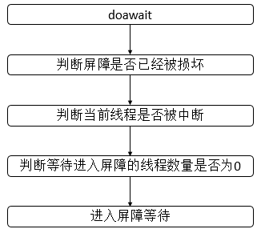
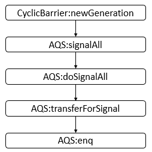
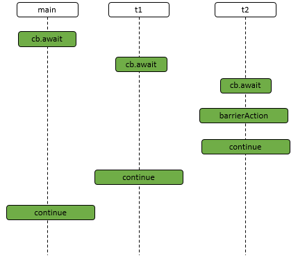
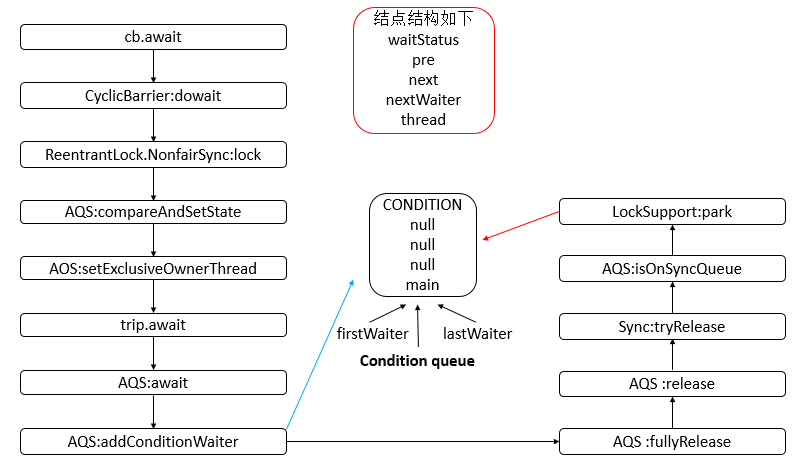
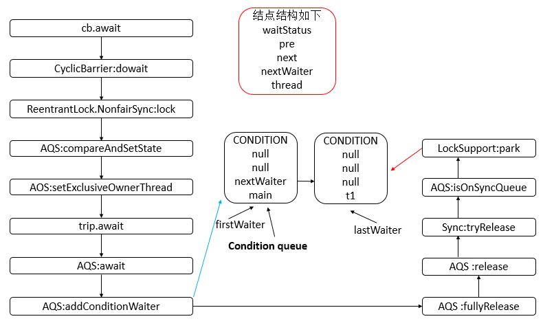
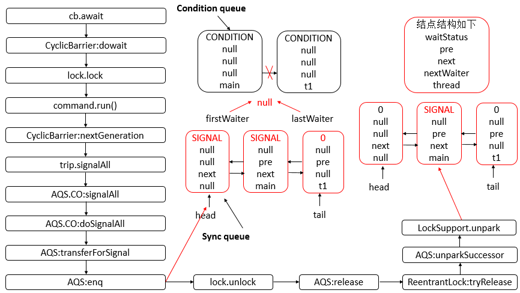
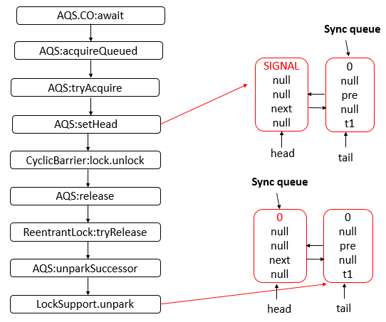
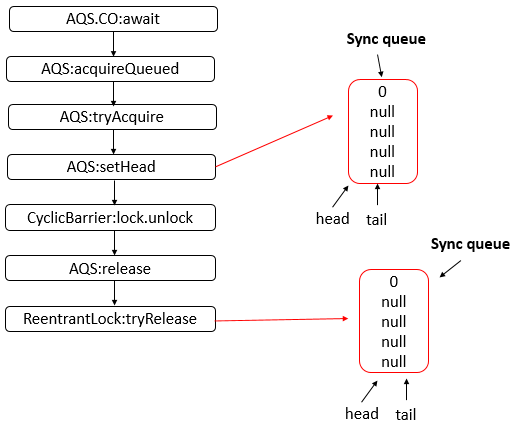

# JUC工具类: CyclicBarrier详解

CyclicBarrier底层是基于ReentrantLock和AbstractQueuedSynchronizer来实现的, 在理解的时候最好和CountDownLatch放在一起理解.

## 面试问题去理解

- 什么是CyclicBarrier?
- CyclicBarrier底层实现原理?
- CountDownLatch和CyclicBarrier对比?
- CyclicBarrier的核心函数有哪些?
- CyclicBarrier适用于什么场景?

## CyclicBarrier简介

- 对于CountDownLatch，其他线程为游戏玩家，比如英雄联盟，主线程为控制游戏开始的线程。在所有的玩家都准备好之前，主线程是处于等待状态的，也就是游戏不能开始。当所有的玩家准备好之后，下一步的动作实施者为主线程，即开始游戏。
- 对于CyclicBarrier，假设有一家公司要全体员工进行团建活动，活动内容为翻越三个障碍物，每一个人翻越障碍物所用的时间是不一样的。但是公司要求所有人在翻越当前障碍物之后再开始翻越下一个障碍物，也就是所有人翻越第一个障碍物之后，才开始翻越第二个，以此类推。类比地，每一个员工都是一个“其他线程”。当所有人都翻越的所有的障碍物之后，程序才结束。而主线程可能早就结束了，这里我们不用管主线程。

## CyclicBarrier源码分析

### 类的继承关系

CyclicBarrier没有显示继承哪个父类或者实现哪个父接口, 所有AQS和重入锁不是通过继承实现的，而是通过组合实现的。

~~~java
public class CyclicBarrier {}
```　　

### 类的内部类

CyclicBarrier类存在一个内部类Generation，每一次使用的CycBarrier可以当成Generation的实例，其源代码如下

```java
private static class Generation {
    boolean broken = false;
}  
~~~

说明: Generation类有一个属性broken，用来表示当前屏障是否被损坏。

### 类的属性

```java
public class CyclicBarrier {
    
    /** The lock for guarding barrier entry */
    // 可重入锁
    private final ReentrantLock lock = new ReentrantLock();
    /** Condition to wait on until tripped */
    // 条件队列
    private final Condition trip = lock.newCondition();
    /** The number of parties */
    // 参与的线程数量
    private final int parties;
    /* The command to run when tripped */
    // 由最后一个进入 barrier 的线程执行的操作
    private final Runnable barrierCommand;
    /** The current generation */
    // 当前代
    private Generation generation = new Generation();
    // 正在等待进入屏障的线程数量
    private int count;
}
```

说明: 该属性有一个为ReentrantLock对象，有一个为Condition对象，而Condition对象又是基于AQS的，所以，归根到底，底层还是由AQS提供支持。

### 类的构造函数

- CyclicBarrier(int, Runnable)型构造函数

```java
public CyclicBarrier(int parties, Runnable barrierAction) {
    // 参与的线程数量小于等于0，抛出异常
    if (parties <= 0) throw new IllegalArgumentException();
    // 设置parties
    this.parties = parties;
    // 设置count
    this.count = parties;
    // 设置barrierCommand
    this.barrierCommand = barrierAction;
}   
```

说明: 该构造函数可以指定关联该CyclicBarrier的线程数量，并且可以指定在所有线程都进入屏障后的执行动作，该执行动作由最后一个进行屏障的线程执行。

- CyclicBarrier(int)型构造函数

```java
public CyclicBarrier(int parties) {
    // 调用含有两个参数的构造函数
    this(parties, null);
} 
```

说明: 该构造函数仅仅执行了关联该CyclicBarrier的线程数量，没有设置执行动作。

### 核心函数 - dowait函数

此函数为CyclicBarrier类的核心函数，CyclicBarrier类对外提供的await函数在底层都是调用该了doawait函数，其源代码如下。

```java
private int dowait(boolean timed, long nanos)
    throws InterruptedException, BrokenBarrierException,
            TimeoutException {
    // 保存当前锁
    final ReentrantLock lock = this.lock;
    // 锁定
    lock.lock();
    try {
        // 保存当前代
        final Generation g = generation;
        
        if (g.broken) // 屏障被破坏，抛出异常
            throw new BrokenBarrierException();

        if (Thread.interrupted()) { // 线程被中断
            // 损坏当前屏障，并且唤醒所有的线程，只有拥有锁的时候才会调用
            breakBarrier();
            // 抛出异常
            throw new InterruptedException();
        }
        
        // 减少正在等待进入屏障的线程数量
        int index = --count;
        if (index == 0) {  // 正在等待进入屏障的线程数量为0，所有线程都已经进入
            // 运行的动作标识
            boolean ranAction = false;
            try {
                // 保存运行动作
                final Runnable command = barrierCommand;
                if (command != null) // 动作不为空
                    // 运行
                    command.run();
                // 设置ranAction状态
                ranAction = true;
                // 进入下一代
                nextGeneration();
                return 0;
            } finally {
                if (!ranAction) // 没有运行的动作
                    // 损坏当前屏障
                    breakBarrier();
            }
        }

        // loop until tripped, broken, interrupted, or timed out
        // 无限循环
        for (;;) {
            try {
                if (!timed) // 没有设置等待时间
                    // 等待
                    trip.await(); 
                else if (nanos > 0L) // 设置了等待时间，并且等待时间大于0
                    // 等待指定时长
                    nanos = trip.awaitNanos(nanos);
            } catch (InterruptedException ie) { 
                if (g == generation && ! g.broken) { // 等于当前代并且屏障没有被损坏
                    // 损坏当前屏障
                    breakBarrier();
                    // 抛出异常
                    throw ie;
                } else { // 不等于当前带后者是屏障被损坏
                    // We're about to finish waiting even if we had not
                    // been interrupted, so this interrupt is deemed to
                    // "belong" to subsequent execution.
                    // 中断当前线程
                    Thread.currentThread().interrupt();
                }
            }

            if (g.broken) // 屏障被损坏，抛出异常
                throw new BrokenBarrierException();

            if (g != generation) // 不等于当前代
                // 返回索引
                return index;

            if (timed && nanos <= 0L) { // 设置了等待时间，并且等待时间小于0
                // 损坏屏障
                breakBarrier();
                // 抛出异常
                throw new TimeoutException();
            }
        }
    } finally {
        // 释放锁
        lock.unlock();
    }
}
```

说明: dowait方法的逻辑会进行一系列的判断，大致流程如下:



### 核心函数 - nextGeneration函数

此函数在所有线程进入屏障后会被调用，即生成下一个版本，所有线程又可以重新进入到屏障中，其源代码如下

```java
private void nextGeneration() {
    // signal completion of last generation
    // 唤醒所有线程
    trip.signalAll();
    // set up next generation
    // 恢复正在等待进入屏障的线程数量
    count = parties;
    // 新生一代
    generation = new Generation();
} 
```

在此函数中会调用AQS的signalAll方法，即唤醒所有等待线程。如果所有的线程都在等待此条件，则唤醒所有线程。其源代码如下

```java
public final void signalAll() {
    if (!isHeldExclusively()) // 不被当前线程独占，抛出异常
        throw new IllegalMonitorStateException();
    // 保存condition队列头结点
    Node first = firstWaiter;
    if (first != null) // 头结点不为空
        // 唤醒所有等待线程
        doSignalAll(first);
}  
```

说明: 此函数判断头结点是否为空，即条件队列是否为空，然后会调用doSignalAll函数，doSignalAll函数源码如下

```java
private void doSignalAll(Node first) {
    // condition队列的头结点尾结点都设置为空
    lastWaiter = firstWaiter = null;
    // 循环
    do {
        // 获取first结点的nextWaiter域结点
        Node next = first.nextWaiter;
        // 设置first结点的nextWaiter域为空
        first.nextWaiter = null;
        // 将first结点从condition队列转移到sync队列
        transferForSignal(first);
        // 重新设置first
        first = next;
    } while (first != null);
} 
```

说明: 此函数会依次将条件队列中的节点转移到同步队列中，会调用到transferForSignal函数，其源码如下

```java
final boolean transferForSignal(Node node) {
    /*
        * If cannot change waitStatus, the node has been cancelled.
        */
    if (!compareAndSetWaitStatus(node, Node.CONDITION, 0))
        return false;

    /*
        * Splice onto queue and try to set waitStatus of predecessor to
        * indicate that thread is (probably) waiting. If cancelled or
        * attempt to set waitStatus fails, wake up to resync (in which
        * case the waitStatus can be transiently and harmlessly wrong).
        */
    Node p = enq(node);
    int ws = p.waitStatus;
    if (ws > 0 || !compareAndSetWaitStatus(p, ws, Node.SIGNAL))
        LockSupport.unpark(node.thread);
    return true;
} 
```

说明: 此函数的作用就是将处于条件队列中的节点转移到同步队列中，并设置结点的状态信息，其中会调用到enq函数，其源代码如下。

```java
private Node enq(final Node node) {
    for (;;) { // 无限循环，确保结点能够成功入队列
        // 保存尾结点
        Node t = tail;
        if (t == null) { // 尾结点为空，即还没被初始化
            if (compareAndSetHead(new Node())) // 头结点为空，并设置头结点为新生成的结点
                tail = head; // 头结点与尾结点都指向同一个新生结点
        } else { // 尾结点不为空，即已经被初始化过
            // 将node结点的prev域连接到尾结点
            node.prev = t; 
            if (compareAndSetTail(t, node)) { // 比较结点t是否为尾结点，若是则将尾结点设置为node
                // 设置尾结点的next域为node
                t.next = node; 
                return t; // 返回尾结点
            }
        }
    }
} 
```

说明: 此函数完成了结点插入同步队列的过程，也很好理解。

综合上面的分析可知，newGeneration函数的主要方法的调用如下，之后会通过一个例子详细讲解:




### breakBarrier函数

此函数的作用是损坏当前屏障，会唤醒所有在屏障中的线程。源代码如下:

```java
private void breakBarrier() {
    // 设置状态
    generation.broken = true;
    // 恢复正在等待进入屏障的线程数量
    count = parties;
    // 唤醒所有线程
    trip.signalAll();
} 
```

说明: 可以看到，此函数也调用了AQS的signalAll函数，由signal函数提供支持。

## CyclicBarrier示例

下面通过一个例子来详解CyclicBarrier的使用和内部工作机制，源代码如下

```java
import java.util.concurrent.BrokenBarrierException;
import java.util.concurrent.CyclicBarrier;

class MyThread extends Thread {
    private CyclicBarrier cb;
    public MyThread(String name, CyclicBarrier cb) {
        super(name);
        this.cb = cb;
    }
    
    public void run() {
        System.out.println(Thread.currentThread().getName() + " going to await");
        try {
            cb.await();
            System.out.println(Thread.currentThread().getName() + " continue");
        } catch (Exception e) {
            e.printStackTrace();
        }
    }
}
public class CyclicBarrierDemo {
    public static void main(String[] args) throws InterruptedException, BrokenBarrierException {
        CyclicBarrier cb = new CyclicBarrier(3, new Thread("barrierAction") {
            public void run() {
                System.out.println(Thread.currentThread().getName() + " barrier action");
                
            }
        });
        MyThread t1 = new MyThread("t1", cb);
        MyThread t2 = new MyThread("t2", cb);
        t1.start();
        t2.start();
        System.out.println(Thread.currentThread().getName() + " going to await");
        cb.await();
        System.out.println(Thread.currentThread().getName() + " continue");

    }
} 
```

运行结果(某一次):

```html
t1 going to await
main going to await
t2 going to await
t2 barrier action
t2 continue
t1 continue
main continue
```

说明: 根据结果可知，可能会存在如下的调用时序。




说明: 由上图可知，假设t1线程的cb.await是在main线程的cb.barrierAction动作是由最后一个进入屏障的线程执行的。根据时序图，进一步分析出其内部工作流程。

- main(主)线程执行cb.await操作，主要调用的函数如下。



说明: 由于ReentrantLock的默认采用非公平策略，所以在dowait函数中调用的是ReentrantLock.NonfairSync的lock函数，由于此时AQS的状态是0，表示还没有被任何线程占用，故main线程可以占用，之后在dowait中会调用trip.await函数，最终的结果是条件队列中存放了一个包含main线程的结点，并且被禁止运行了，同时，main线程所拥有的资源也被释放了，可以供其他线程获取。

- t1线程执行cb.await操作，其中假设t1线程的lock.lock操作在main线程释放了资源之后，则其主要调用的函数如下。



说明: 可以看到，之后condition queue(条件队列)里面有两个节点，包含t1线程的结点插入在队列的尾部，并且t1线程也被禁止了，因为执行了park操作，此时两个线程都被禁止了。

- t2线程执行cb.await操作，其中假设t2线程的lock.lock操作在t1线程释放了资源之后，则其主要调用的函数如下。



说明: 由上图可知，在t2线程执行await操作后，会直接执行command.run方法，不是重新开启一个线程，而是最后进入屏障的线程执行。同时，会将Condition queue中的所有节点都转移到Sync queue中，并且最后main线程会被unpark，可以继续运行。main线程获取cpu资源，继续运行。

- main线程获取cpu资源，继续运行，下图给出了主要的方法调用:



说明: 其中，由于main线程是在AQS.CO的wait中被park的，所以恢复时，会继续在该方法中运行。运行过后，t1线程被unpark，它获得cpu资源可以继续运行。

- t1线程获取cpu资源，继续运行，下图给出了主要的方法调用。



说明: 其中，由于t1线程是在AQS.CO的wait方法中被park，所以恢复时，会继续在该方法中运行。运行过后，Sync queue中保持着一个空节点。头结点与尾节点均指向它。

注意: 在线程await过程中中断线程会抛出异常，所有进入屏障的线程都将被释放。至于CyclicBarrier的其他用法，读者可以自行查阅API，不再累赘。

## 和CountDonwLatch再对比

- CountDownLatch减计数，CyclicBarrier加计数。
- CountDownLatch是一次性的，CyclicBarrier可以重用。
- CountDownLatch和CyclicBarrier都有让多个线程等待同步然后再开始下一步动作的意思，但是CountDownLatch的下一步的动作实施者是主线程，具有不可重复性；而CyclicBarrier的下一步动作实施者还是“其他线程”本身，具有往复多次实施动作的特点。

