# JUC工具类: Semaphore详解

Semaphore底层是基于AbstractQueuedSynchronizer来实现的。Semaphore称为计数信号量，它允许n个任务同时访问某个资源，可以将信号量看做是在向外分发使用资源的许可证，只有成功获取许可证，才能使用资源。

## 面试问题去理解

- 什么是Semaphore?
- Semaphore内部原理?
- Semaphore常用方法有哪些? 如何实现线程同步和互斥的?
- Semaphore适合用在什么场景?
- 单独使用Semaphore是不会使用到AQS的条件队列?
- Semaphore中申请令牌(acquire)、释放令牌(release)的实现?
- Semaphore初始化有10个令牌，11个线程同时各调用1次acquire方法，会发生什么?
- Semaphore初始化有10个令牌，一个线程重复调用11次acquire方法，会发生什么?
- Semaphore初始化有1个令牌，1个线程调用一次acquire方法，然后调用两次release方法，之后另外一个线程调用acquire(2)方法，此线程能够获取到足够的令牌并继续运行吗?
- Semaphore初始化有2个令牌，一个线程调用1次release方法，然后一次性获取3个令牌，会获取到吗?

## Semaphore源码分析

### 类的继承关系

```java
public class Semaphore implements java.io.Serializable {}   
```

说明: Semaphore实现了Serializable接口，即可以进行序列化。

### 类的内部类

Semaphore总共有三个内部类，并且三个内部类是紧密相关的，下面先看三个类的关系。

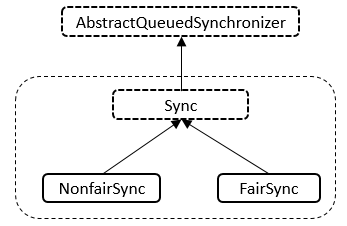

说明: Semaphore与ReentrantLock的内部类的结构相同，类内部总共存在Sync、NonfairSync、FairSync三个类，NonfairSync与FairSync类继承自Sync类，Sync类继承自AbstractQueuedSynchronizer抽象类。下面逐个进行分析。

### 类的内部类 - Sync类

Sync类的源码如下

```java
// 内部类，继承自AQS
abstract static class Sync extends AbstractQueuedSynchronizer {
    // 版本号
    private static final long serialVersionUID = 1192457210091910933L;
    
    // 构造函数
    Sync(int permits) {
        // 设置状态数
        setState(permits);
    }
    
    // 获取许可
    final int getPermits() {
        return getState();
    }

    // 共享模式下非公平策略获取
    final int nonfairTryAcquireShared(int acquires) {
        for (;;) { // 无限循环
            // 获取许可数
            int available = getState();
            // 剩余的许可
            int remaining = available - acquires;
            if (remaining < 0 ||
                compareAndSetState(available, remaining)) // 许可小于0或者比较并且设置状态成功
                return remaining;
        }
    }
    
    // 共享模式下进行释放
    protected final boolean tryReleaseShared(int releases) {
        for (;;) { // 无限循环
            // 获取许可
            int current = getState();
            // 可用的许可
            int next = current + releases;
            if (next < current) // overflow
                throw new Error("Maximum permit count exceeded");
            if (compareAndSetState(current, next)) // 比较并进行设置成功
                return true;
        }
    }

    // 根据指定的缩减量减小可用许可的数目
    final void reducePermits(int reductions) {
        for (;;) { // 无限循环
            // 获取许可
            int current = getState();
            // 可用的许可
            int next = current - reductions;
            if (next > current) // underflow
                throw new Error("Permit count underflow");
            if (compareAndSetState(current, next)) // 比较并进行设置成功
                return;
        }
    }

    // 获取并返回立即可用的所有许可
    final int drainPermits() {
        for (;;) { // 无限循环
            // 获取许可
            int current = getState();
            if (current == 0 || compareAndSetState(current, 0)) // 许可为0或者比较并设置成功
                return current;
        }
    }
} 
```

说明: Sync类的属性相对简单，只有一个版本号，Sync类存在如下方法和作用如下。

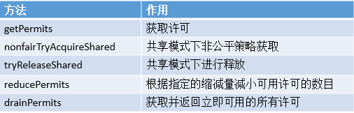


### 类的内部类 - NonfairSync类

NonfairSync类继承了Sync类，表示采用非公平策略获取资源，其只有一个tryAcquireShared方法，重写了AQS的该方法，其源码如下:

```java
static final class NonfairSync extends Sync {
    // 版本号
    private static final long serialVersionUID = -2694183684443567898L;
    
    // 构造函数
    NonfairSync(int permits) {
        super(permits);
    }
    // 共享模式下获取
    protected int tryAcquireShared(int acquires) {
        return nonfairTryAcquireShared(acquires);
    }
}   
```

说明: 从tryAcquireShared方法的源码可知，其会调用父类Sync的nonfairTryAcquireShared方法，表示按照非公平策略进行资源的获取。

### 类的内部类 - FairSync类

FairSync类继承了Sync类，表示采用公平策略获取资源，其只有一个tryAcquireShared方法，重写了AQS的该方法，其源码如下。

```java
protected int tryAcquireShared(int acquires) {
    for (;;) { // 无限循环
        if (hasQueuedPredecessors()) // 同步队列中存在其他节点
            return -1;
        // 获取许可
        int available = getState();
        // 剩余的许可
        int remaining = available - acquires;
        if (remaining < 0 ||
            compareAndSetState(available, remaining)) // 剩余的许可小于0或者比较设置成功
            return remaining;
    }
}  
```

说明: 从tryAcquireShared方法的源码可知，它使用公平策略来获取资源，它会判断同步队列中是否存在其他的等待节点。

### 类的属性

```java
public class Semaphore implements java.io.Serializable {
    // 版本号
    private static final long serialVersionUID = -3222578661600680210L;
    // 属性
    private final Sync sync;
}  
```

说明: Semaphore自身只有两个属性，最重要的是sync属性，基于Semaphore对象的操作绝大多数都转移到了对sync的操作。

### 类的构造函数

- Semaphore(int)型构造函数

```java
public Semaphore(int permits) {
    sync = new NonfairSync(permits);
}   
```

说明: 该构造函数会创建具有给定的许可数和非公平的公平设置的Semaphore。

- Semaphore(int, boolean)型构造函数

```java
public Semaphore(int permits, boolean fair) {
    sync = fair ? new FairSync(permits) : new NonfairSync(permits);
}  
```

说明: 该构造函数会创建具有给定的许可数和给定的公平设置的Semaphore。

### 核心函数分析 - acquire函数

此方法从信号量获取一个(多个)许可，在提供一个许可前一直将线程阻塞，或者线程被中断，其源码如下

```java
public void acquire() throws InterruptedException {
    sync.acquireSharedInterruptibly(1);
}
```

说明: 该方法中将会调用Sync对象的acquireSharedInterruptibly(从AQS继承而来的方法)方法，而acquireSharedInterruptibly方法在上一篇CountDownLatch中已经进行了分析，在此不再累赘。

最终可以获取大致的方法调用序列(假设使用非公平策略)。如下图所示。

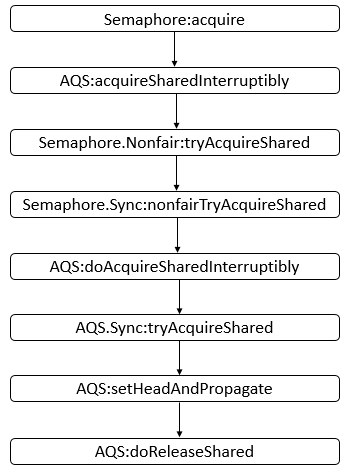


说明: 上图只是给出了大体会调用到的方法，和具体的示例可能会有些差别，之后会根据具体的示例进行分析。

### 核心函数分析 - release函数

此方法释放一个(多个)许可，将其返回给信号量，源码如下。

```java
public void release() {
    sync.releaseShared(1);
}
```

说明: 该方法中将会调用Sync对象的releaseShared(从AQS继承而来的方法)方法，而releaseShared方法在上一篇CountDownLatch中已经进行了分析，在此不再累赘。

最终可以获取大致的方法调用序列(假设使用非公平策略)。如下图所示:

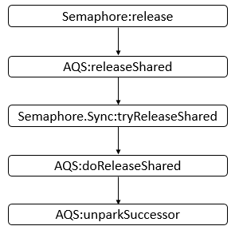

说明: 上图只是给出了大体会调用到的方法，和具体的示例可能会有些差别，之后会根据具体的示例进行分析。

## Semaphore示例

下面给出了一个使用Semaphore的示例。

```java
import java.util.concurrent.Semaphore;

class MyThread extends Thread {
    private Semaphore semaphore;
    
    public MyThread(String name, Semaphore semaphore) {
        super(name);
        this.semaphore = semaphore;
    }
    
    public void run() {        
        int count = 3;
        System.out.println(Thread.currentThread().getName() + " trying to acquire");
        try {
            semaphore.acquire(count);
            System.out.println(Thread.currentThread().getName() + " acquire successfully");
            Thread.sleep(1000);
        } catch (InterruptedException e) {
            e.printStackTrace();
        } finally {
            semaphore.release(count);
            System.out.println(Thread.currentThread().getName() + " release successfully");
        }
    }
}

public class SemaphoreDemo {
    public final static int SEM_SIZE = 10;
    
    public static void main(String[] args) {
        Semaphore semaphore = new Semaphore(SEM_SIZE);
        MyThread t1 = new MyThread("t1", semaphore);
        MyThread t2 = new MyThread("t2", semaphore);
        t1.start();
        t2.start();
        int permits = 5;
        System.out.println(Thread.currentThread().getName() + " trying to acquire");
        try {
            semaphore.acquire(permits);
            System.out.println(Thread.currentThread().getName() + " acquire successfully");
            Thread.sleep(1000);
        } catch (InterruptedException e) {
            e.printStackTrace();
        } finally {
            semaphore.release();
            System.out.println(Thread.currentThread().getName() + " release successfully");
        }      
    }
} 
```

运行结果(某一次):

```html
main trying to acquire
main acquire successfully
t1 trying to acquire
t1 acquire successfully
t2 trying to acquire
t1 release successfully
main release successfully
t2 acquire successfully
t2 release successfully
```

说明: 首先，生成一个信号量，信号量有10个许可，然后，main，t1，t2三个线程获取许可运行，根据结果，可能存在如下的一种时序。

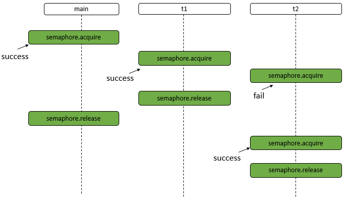

说明: 如上图所示，首先，main线程执行acquire操作，并且成功获得许可，之后t1线程执行acquire操作，成功获得许可，之后t2执行acquire操作，由于此时许可数量不够，t2线程将会阻塞，直到许可可用。之后t1线程释放许可，main线程释放许可，此时的许可数量可以满足t2线程的要求，所以，此时t2线程会成功获得许可运行，t2运行完成后释放许可。下面进行详细分析。

- main线程执行semaphore.acquire操作。主要的函数调用如下图所示。

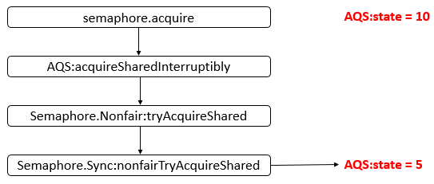

说明: 此时，可以看到只是AQS的state变为了5，main线程并没有被阻塞，可以继续运行。

- t1线程执行semaphore.acquire操作。主要的函数调用如下图所示。

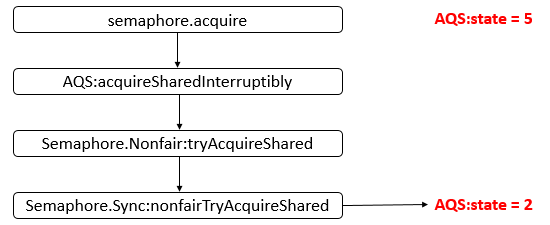


说明: 此时，可以看到只是AQS的state变为了2，t1线程并没有被阻塞，可以继续运行。

- t2线程执行semaphore.acquire操作。主要的函数调用如下图所示。

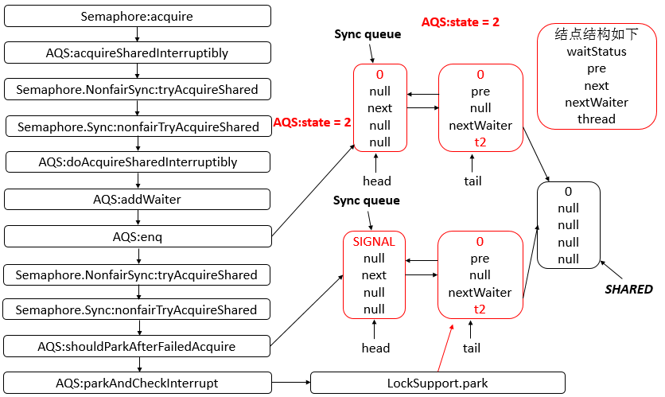

说明: 此时，t2线程获取许可不会成功，之后会导致其被禁止运行，值得注意的是，AQS的state还是为2。

- t1执行semaphore.release操作。主要的函数调用如下图所示。

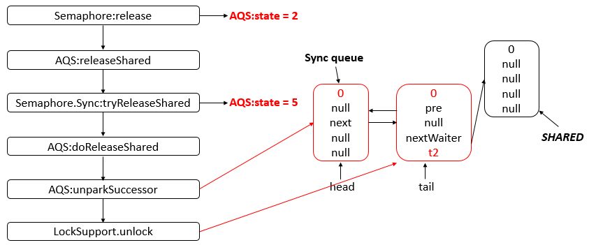

说明: 此时，t2线程将会被unpark，并且AQS的state为5，t2获取cpu资源后可以继续运行。

- main线程执行semaphore.release操作。主要的函数调用如下图所示。

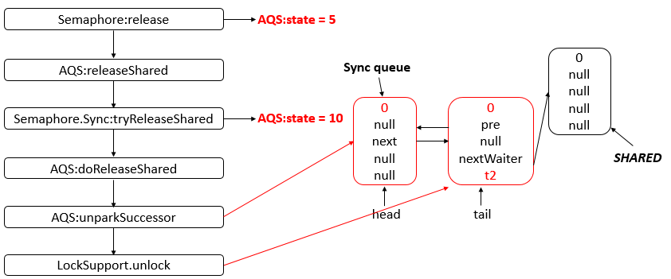

说明: 此时，t2线程还会被unpark，但是不会产生影响，此时，只要t2线程获得CPU资源就可以运行了。此时，AQS的state为10。

- t2获取CPU资源，继续运行，此时t2需要恢复现场，回到parkAndCheckInterrupt函数中，也是在should继续运行。主要的函数调用如下图所示。

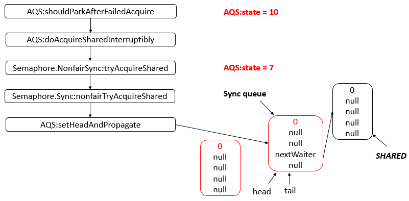


说明: 此时，可以看到，Sync queue中只有一个结点，头结点与尾节点都指向该结点，在setHeadAndPropagate的函数中会设置头结点并且会unpark队列中的其他结点。

- t2线程执行semaphore.release操作。主要的函数调用如下图所示。

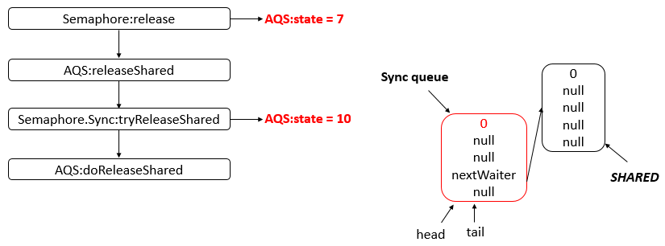

说明: t2线程经过release后，此时信号量的许可又变为10个了，此时Sync queue中的结点还是没有变化。

## 更深入理解

### 单独使用Semaphore是不会使用到AQS的条件队列的

不同于CyclicBarrier和ReentrantLock，单独使用Semaphore是不会使用到AQS的条件队列的，其实，只有进行await操作才会进入条件队列，其他的都是在同步队列中，只是当前线程会被park。

### 场景问题

#### semaphore初始化有10个令牌，11个线程同时各调用1次acquire方法，会发生什么?

答案：拿不到令牌的线程阻塞，不会继续往下运行。

#### semaphore初始化有10个令牌，一个线程重复调用11次acquire方法，会发生什么?

答案：线程阻塞，不会继续往下运行。可能你会考虑类似于锁的重入的问题，很好，但是，令牌没有重入的概念。你只要调用一次acquire方法，就需要有一个令牌才能继续运行。

#### semaphore初始化有1个令牌，1个线程调用一次acquire方法，然后调用两次release方法，之后另外一个线程调用acquire(2)方法，此线程能够获取到足够的令牌并继续运行吗?

答案：能，原因是release方法会添加令牌，并不会以初始化的大小为准。

#### semaphore初始化有2个令牌，一个线程调用1次release方法，然后一次性获取3个令牌，会获取到吗?

答案：能，原因是release会添加令牌，并不会以初始化的大小为准。Semaphore中release方法的调用并没有限制要在acquire后调用。

具体示例如下，如果不相信的话，可以运行一下下面的demo，在做实验之前，笔者也认为应该是不允许的。。

```java
public class TestSemaphore2 {
    public static void main(String[] args) {
        int permitsNum = 2;
        final Semaphore semaphore = new Semaphore(permitsNum);
        try {
            System.out.println("availablePermits:"+semaphore.availablePermits()+",semaphore.tryAcquire(3,1, TimeUnit.SECONDS):"+semaphore.tryAcquire(3,1, TimeUnit.SECONDS));
            semaphore.release();
            System.out.println("availablePermits:"+semaphore.availablePermits()+",semaphore.tryAcquire(3,1, TimeUnit.SECONDS):"+semaphore.tryAcquire(3,1, TimeUnit.SECONDS));
        }catch (Exception e) {

        }
    }
}
```

