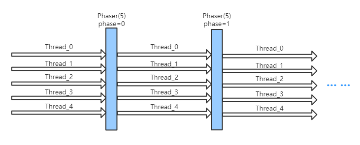

# JUC工具类: Phaser详解

Phaser是JDK 7新增的一个同步辅助类，它可以实现CyclicBarrier和CountDownLatch类似的功能，而且它支持对任务的动态调整，并支持分层结构来达到更高的吞吐量。

## 面试问题去理解Phaser工具

- Phaser主要用来解决什么问题?
- Phaser与CyclicBarrier和CountDownLatch的区别是什么?
- 如果用CountDownLatch来实现Phaser的功能应该怎么实现?
- Phaser运行机制是什么样的?
- 给一个Phaser使用的示例?

## Phaser运行机制



- **Registration(注册)**

跟其他barrier不同，在phaser上注册的parties会随着时间的变化而变化。任务可以随时注册(使用方法register,bulkRegister注册，或者由构造器确定初始parties)，并且在任何抵达点可以随意地撤销注册(方法arriveAndDeregister)。就像大多数基本的同步结构一样，注册和撤销只影响内部count；不会创建更深的内部记录，所以任务不能查询他们是否已经注册。(不过，可以通过继承来实现类似的记录)

- **Synchronization(同步机制)**

和CyclicBarrier一样，Phaser也可以重复await。方法arriveAndAwaitAdvance的效果类似CyclicBarrier.await。phaser的每一代都有一个相关的phase number，初始值为0，当所有注册的任务都到达phaser时phase+1，到达最大值(Integer.MAX_VALUE)之后清零。使用phase number可以独立控制 到达phaser 和 等待其他线程 的动作，通过下面两种类型的方法:

> - **Arrival(到达机制)** arrive和arriveAndDeregister方法记录到达状态。这些方法不会阻塞，但是会返回一个相关的arrival phase number；也就是说，phase number用来确定到达状态。当所有任务都到达给定phase时，可以执行一个可选的函数，这个函数通过重写onAdvance方法实现，通常可以用来控制终止状态。重写此方法类似于为CyclicBarrier提供一个barrierAction，但比它更灵活。
> - **Waiting(等待机制)** awaitAdvance方法需要一个表示arrival phase number的参数，并且在phaser前进到与给定phase不同的phase时返回。和CyclicBarrier不同，即使等待线程已经被中断，awaitAdvance方法也会一直等待。中断状态和超时时间同样可用，但是当任务等待中断或超时后未改变phaser的状态时会遭遇异常。如果有必要，在方法forceTermination之后可以执行这些异常的相关的handler进行恢复操作，Phaser也可能被ForkJoinPool中的任务使用，这样在其他任务阻塞等待一个phase时可以保证足够的并行度来执行任务。

- **Termination(终止机制)** :

可以用isTerminated方法检查phaser的终止状态。在终止时，所有同步方法立刻返回一个负值。在终止时尝试注册也没有效果。当调用onAdvance返回true时Termination被触发。当deregistration操作使已注册的parties变为0时，onAdvance的默认实现就会返回true。也可以重写onAdvance方法来定义终止动作。forceTermination方法也可以释放等待线程并且允许它们终止。

- **Tiering(分层结构)** :

Phaser支持分层结构(树状构造)来减少竞争。注册了大量parties的Phaser可能会因为同步竞争消耗很高的成本， 因此可以设置一些子Phaser来共享一个通用的parent。这样的话即使每个操作消耗了更多的开销，但是会提高整体吞吐量。 在一个分层结构的phaser里，子节点phaser的注册和取消注册都通过父节点管理。子节点phaser通过构造或方法register、bulkRegister进行首次注册时，在其父节点上注册。子节点phaser通过调用arriveAndDeregister进行最后一次取消注册时，也在其父节点上取消注册。

- **Monitoring(状态监控)** :

由于同步方法可能只被已注册的parties调用，所以phaser的当前状态也可能被任何调用者监控。在任何时候，可以通过getRegisteredParties获取parties数，其中getArrivedParties方法返回已经到达当前phase的parties数。当剩余的parties(通过方法getUnarrivedParties获取)到达时，phase进入下一代。这些方法返回的值可能只表示短暂的状态，所以一般来说在同步结构里并没有啥卵用。

## Phaser源码详解

### 核心参数

```java
private volatile long state;
/**
 * The parent of this phaser, or null if none
 */
private final Phaser parent;
/**
 * The root of phaser tree. Equals this if not in a tree.
 */
private final Phaser root;
//等待线程的栈顶元素，根据phase取模定义为一个奇数header和一个偶数header
private final AtomicReference<QNode> evenQ;
private final AtomicReference<QNode> oddQ;
```

state状态说明:

Phaser使用一个long型state值来标识内部状态:

- 低0-15位表示未到达parties数；
- 中16-31位表示等待的parties数；
- 中32-62位表示phase当前代；
- 高63位表示当前phaser的终止状态。

注意: 子Phaser的phase在没有被真正使用之前，允许滞后于它的root节点。这里在后面源码分析的reconcileState方法里会讲解。 Qnode是Phaser定义的内部等待队列，用于在阻塞时记录等待线程及相关信息。实现了ForkJoinPool的一个内部接口ManagedBlocker，上面已经说过，Phaser也可能被ForkJoinPool中的任务使用，这样在其他任务阻塞等待一个phase时可以保证足够的并行度来执行任务(通过内部实现方法isReleasable和block)。

### 函数列表

```java
//构造方法
public Phaser() {
    this(null, 0);
}
public Phaser(int parties) {
    this(null, parties);
}
public Phaser(Phaser parent) {
    this(parent, 0);
}
public Phaser(Phaser parent, int parties)
//注册一个新的party
public int register()
//批量注册
public int bulkRegister(int parties)
//使当前线程到达phaser，不等待其他任务到达。返回arrival phase number
public int arrive() 
//使当前线程到达phaser并撤销注册，返回arrival phase number
public int arriveAndDeregister()
/*
 * 使当前线程到达phaser并等待其他任务到达，等价于awaitAdvance(arrive())。
 * 如果需要等待中断或超时，可以使用awaitAdvance方法完成一个类似的构造。
 * 如果需要在到达后取消注册，可以使用awaitAdvance(arriveAndDeregister())。
 */
public int arriveAndAwaitAdvance()
//等待给定phase数，返回下一个 arrival phase number
public int awaitAdvance(int phase)
//阻塞等待，直到phase前进到下一代，返回下一代的phase number
public int awaitAdvance(int phase) 
//响应中断版awaitAdvance
public int awaitAdvanceInterruptibly(int phase) throws InterruptedException
public int awaitAdvanceInterruptibly(int phase, long timeout, TimeUnit unit)
    throws InterruptedException, TimeoutException
//使当前phaser进入终止状态，已注册的parties不受影响，如果是分层结构，则终止所有phaser
public void forceTermination() 
```

### 方法 - register()

```java
//注册一个新的party
public int register() {
    return doRegister(1);
}
private int doRegister(int registrations) {
    // adjustment to state
    long adjust = ((long)registrations << PARTIES_SHIFT) | registrations;
    final Phaser parent = this.parent;
    int phase;
    for (;;) {
        long s = (parent == null) ? state : reconcileState();
        int counts = (int)s;
        int parties = counts >>> PARTIES_SHIFT;//获取已注册parties数
        int unarrived = counts & UNARRIVED_MASK;//未到达数
        if (registrations > MAX_PARTIES - parties)
            throw new IllegalStateException(badRegister(s));
        phase = (int)(s >>> PHASE_SHIFT);//获取当前代
        if (phase < 0)
            break;
        if (counts != EMPTY) {                  // not 1st registration
            if (parent == null || reconcileState() == s) {
                if (unarrived == 0)             // wait out advance
                    root.internalAwaitAdvance(phase, null);//等待其他任务到达
                else if (UNSAFE.compareAndSwapLong(this, stateOffset,
                                                   s, s + adjust))//更新注册的parties数
                    break;
            }
        }
        else if (parent == null) {              // 1st root registration
            long next = ((long)phase << PHASE_SHIFT) | adjust;
            if (UNSAFE.compareAndSwapLong(this, stateOffset, s, next))//更新phase
                break;
        }
        else {
            //分层结构，子phaser首次注册用父节点管理
            synchronized (this) {               // 1st sub registration
                if (state == s) {               // recheck under lock
                    phase = parent.doRegister(1);//分层结构，使用父节点注册
                    if (phase < 0)
                        break;
                    // finish registration whenever parent registration
                    // succeeded, even when racing with termination,
                    // since these are part of the same "transaction".
                    //由于在同一个事务里，即使phaser已终止，也会完成注册
                    while (!UNSAFE.compareAndSwapLong
                           (this, stateOffset, s,
                            ((long)phase << PHASE_SHIFT) | adjust)) {//更新phase
                        s = state;
                        phase = (int)(root.state >>> PHASE_SHIFT);
                        // assert (int)s == EMPTY;
                    }
                    break;
                }
            }
        }
    }
    return phase;
} 
```

说明:  register方法为phaser添加一个新的party，如果onAdvance正在运行，那么这个方法会等待它运行结束再返回结果。如果当前phaser有父节点，并且当前phaser上没有已注册的party，那么就会交给父节点注册。

register和bulkRegister都由doRegister实现，大概流程如下:

- 如果当前操作不是首次注册，那么直接在当前phaser上更新注册parties数
- 如果是首次注册，并且当前phaser没有父节点，说明是root节点注册，直接更新phase
- 如果当前操作是首次注册，并且当前phaser由父节点，则注册操作交由父节点，并更新当前phaser的phase
- 上面说过，子Phaser的phase在没有被真正使用之前，允许滞后于它的root节点。非首次注册时，如果Phaser有父节点，则调用reconcileState()方法解决root节点的phase延迟传递问题， 源码如下:

```java
private long reconcileState() {
    final Phaser root = this.root;
    long s = state;
    if (root != this) {
        int phase, p;
        // CAS to root phase with current parties, tripping unarrived
        while ((phase = (int)(root.state >>> PHASE_SHIFT)) !=
               (int)(s >>> PHASE_SHIFT) &&
               !UNSAFE.compareAndSwapLong
               (this, stateOffset, s,
                s = (((long)phase << PHASE_SHIFT) |
                     ((phase < 0) ? (s & COUNTS_MASK) :
                      (((p = (int)s >>> PARTIES_SHIFT) == 0) ? EMPTY :
                       ((s & PARTIES_MASK) | p))))))
            s = state;
    }
    return s;
} 
```

当root节点的phase已经advance到下一代，但是子节点phaser还没有，这种情况下它们必须通过更新未到达parties数 完成它们自己的advance操作(如果parties为0，重置为EMPTY状态)。

回到register方法的第一步，如果当前未到达数为0，说明上一代phase正在进行到达操作，此时调用internalAwaitAdvance()方法等待其他任务完成到达操作，源码如下:

```java
//阻塞等待phase到下一代
private int internalAwaitAdvance(int phase, QNode node) {
    // assert root == this;
    releaseWaiters(phase-1);          // ensure old queue clean
    boolean queued = false;           // true when node is enqueued
    int lastUnarrived = 0;            // to increase spins upon change
    int spins = SPINS_PER_ARRIVAL;
    long s;
    int p;
    while ((p = (int)((s = state) >>> PHASE_SHIFT)) == phase) {
        if (node == null) {           // spinning in noninterruptible mode
            int unarrived = (int)s & UNARRIVED_MASK;//未到达数
            if (unarrived != lastUnarrived &&
                (lastUnarrived = unarrived) < NCPU)
                spins += SPINS_PER_ARRIVAL;
            boolean interrupted = Thread.interrupted();
            if (interrupted || --spins < 0) { // need node to record intr
                //使用node记录中断状态
                node = new QNode(this, phase, false, false, 0L);
                node.wasInterrupted = interrupted;
            }
        }
        else if (node.isReleasable()) // done or aborted
            break;
        else if (!queued) {           // push onto queue
            AtomicReference<QNode> head = (phase & 1) == 0 ? evenQ : oddQ;
            QNode q = node.next = head.get();
            if ((q == null || q.phase == phase) &&
                (int)(state >>> PHASE_SHIFT) == phase) // avoid stale enq
                queued = head.compareAndSet(q, node);
        }
        else {
            try {
                ForkJoinPool.managedBlock(node);//阻塞给定node
            } catch (InterruptedException ie) {
                node.wasInterrupted = true;
            }
        }
    }

    if (node != null) {
        if (node.thread != null)
            node.thread = null;       // avoid need for unpark()
        if (node.wasInterrupted && !node.interruptible)
            Thread.currentThread().interrupt();
        if (p == phase && (p = (int)(state >>> PHASE_SHIFT)) == phase)
            return abortWait(phase); // possibly clean up on abort
    }
    releaseWaiters(phase);
    return p;
}  
```

简单介绍下第二个参数node，如果不为空，则说明等待线程需要追踪中断状态或超时状态。以doRegister中的调用为例，不考虑线程争用，internalAwaitAdvance大概流程如下:

- 首先调用releaseWaiters唤醒上一代所有等待线程，确保旧队列中没有遗留的等待线程。
- 循环SPINS_PER_ARRIVAL指定的次数或者当前线程被中断，创建node记录等待线程及相关信息。
- 继续循环调用ForkJoinPool.managedBlock运行被阻塞的任务
- 继续循环，阻塞任务运行成功被释放，跳出循环
- 最后唤醒当前phase的线程

### 方法 - arrive()

```java
//使当前线程到达phaser，不等待其他任务到达。返回arrival phase number
public int arrive() {
    return doArrive(ONE_ARRIVAL);
}

private int doArrive(int adjust) {
    final Phaser root = this.root;
    for (;;) {
        long s = (root == this) ? state : reconcileState();
        int phase = (int)(s >>> PHASE_SHIFT);
        if (phase < 0)
            return phase;
        int counts = (int)s;
        //获取未到达数
        int unarrived = (counts == EMPTY) ? 0 : (counts & UNARRIVED_MASK);
        if (unarrived <= 0)
            throw new IllegalStateException(badArrive(s));
        if (UNSAFE.compareAndSwapLong(this, stateOffset, s, s-=adjust)) {//更新state
            if (unarrived == 1) {//当前为最后一个未到达的任务
                long n = s & PARTIES_MASK;  // base of next state
                int nextUnarrived = (int)n >>> PARTIES_SHIFT;
                if (root == this) {
                    if (onAdvance(phase, nextUnarrived))//检查是否需要终止phaser
                        n |= TERMINATION_BIT;
                    else if (nextUnarrived == 0)
                        n |= EMPTY;
                    else
                        n |= nextUnarrived;
                    int nextPhase = (phase + 1) & MAX_PHASE;
                    n |= (long)nextPhase << PHASE_SHIFT;
                    UNSAFE.compareAndSwapLong(this, stateOffset, s, n);
                    releaseWaiters(phase);//释放等待phase的线程
                }
                //分层结构，使用父节点管理arrive
                else if (nextUnarrived == 0) { //propagate deregistration
                    phase = parent.doArrive(ONE_DEREGISTER);
                    UNSAFE.compareAndSwapLong(this, stateOffset,
                                              s, s | EMPTY);
                }
                else
                    phase = parent.doArrive(ONE_ARRIVAL);
            }
            return phase;
        }
    }
} 
```

说明:  arrive方法手动调整到达数，使当前线程到达phaser。arrive和arriveAndDeregister都调用了doArrive实现，大概流程如下:

- 首先更新state(state - adjust)；
- 如果当前不是最后一个未到达的任务，直接返回phase
- 如果当前是最后一个未到达的任务:
  - 如果当前是root节点，判断是否需要终止phaser，CAS更新phase，最后释放等待的线程；
  - 如果是分层结构，并且已经没有下一代未到达的parties，则交由父节点处理doArrive逻辑，然后更新state为EMPTY。

### 方法 - arriveAndAwaitAdvance()

```java
public int arriveAndAwaitAdvance() {
    // Specialization of doArrive+awaitAdvance eliminating some reads/paths
    final Phaser root = this.root;
    for (;;) {
        long s = (root == this) ? state : reconcileState();
        int phase = (int)(s >>> PHASE_SHIFT);
        if (phase < 0)
            return phase;
        int counts = (int)s;
        int unarrived = (counts == EMPTY) ? 0 : (counts & UNARRIVED_MASK);//获取未到达数
        if (unarrived <= 0)
            throw new IllegalStateException(badArrive(s));
        if (UNSAFE.compareAndSwapLong(this, stateOffset, s,
                                      s -= ONE_ARRIVAL)) {//更新state
            if (unarrived > 1)
                return root.internalAwaitAdvance(phase, null);//阻塞等待其他任务
            if (root != this)
                return parent.arriveAndAwaitAdvance();//子Phaser交给父节点处理
            long n = s & PARTIES_MASK;  // base of next state
            int nextUnarrived = (int)n >>> PARTIES_SHIFT;
            if (onAdvance(phase, nextUnarrived))//全部到达，检查是否可销毁
                n |= TERMINATION_BIT;
            else if (nextUnarrived == 0)
                n |= EMPTY;
            else
                n |= nextUnarrived;
            int nextPhase = (phase + 1) & MAX_PHASE;//计算下一代phase
            n |= (long)nextPhase << PHASE_SHIFT;
            if (!UNSAFE.compareAndSwapLong(this, stateOffset, s, n))//更新state
                return (int)(state >>> PHASE_SHIFT); // terminated
            releaseWaiters(phase);//释放等待phase的线程
            return nextPhase;
        }
    }
}
```

说明: 使当前线程到达phaser并等待其他任务到达，等价于awaitAdvance(arrive())。如果需要等待中断或超时，可以使用awaitAdvance方法完成一个类似的构造。如果需要在到达后取消注册，可以使用awaitAdvance(arriveAndDeregister())。效果类似于CyclicBarrier.await。大概流程如下:

- 更新state(state - 1)；
- 如果未到达数大于1，调用internalAwaitAdvance阻塞等待其他任务到达，返回当前phase
- 如果为分层结构，则交由父节点处理arriveAndAwaitAdvance逻辑
- 如果未到达数<=1，判断phaser终止状态，CAS更新phase到下一代，最后释放等待当前phase的线程，并返回下一代phase。

### 方法 - awaitAdvance(int phase)

```java
public int awaitAdvance(int phase) {
    final Phaser root = this.root;
    long s = (root == this) ? state : reconcileState();
    int p = (int)(s >>> PHASE_SHIFT);
    if (phase < 0)
        return phase;
    if (p == phase)
        return root.internalAwaitAdvance(phase, null);
    return p;
}
//响应中断版awaitAdvance
public int awaitAdvanceInterruptibly(int phase)
    throws InterruptedException {
    final Phaser root = this.root;
    long s = (root == this) ? state : reconcileState();
    int p = (int)(s >>> PHASE_SHIFT);
    if (phase < 0)
        return phase;
    if (p == phase) {
        QNode node = new QNode(this, phase, true, false, 0L);
        p = root.internalAwaitAdvance(phase, node);
        if (node.wasInterrupted)
            throw new InterruptedException();
    }
    return p;
}
```

说明:  awaitAdvance用于阻塞等待线程到达，直到phase前进到下一代，返回下一代的phase number。方法很简单，不多赘述。awaitAdvanceInterruptibly方法是响应中断版的awaitAdvance，不同之处在于，调用阻塞时会记录线程的中断状态。
