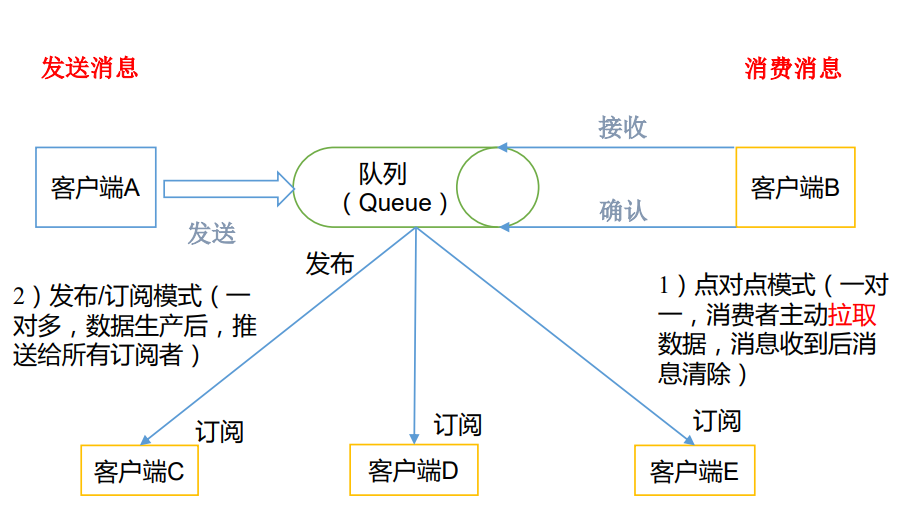
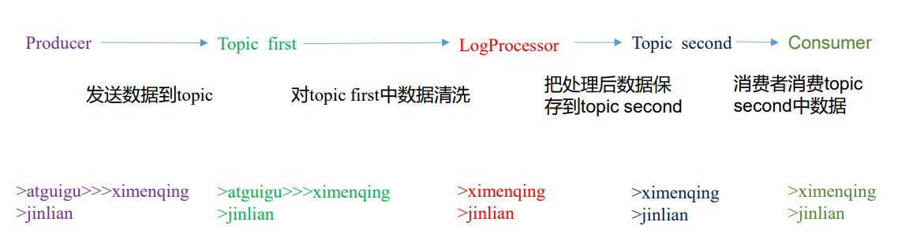

# Kafka入门到精通

## Kafka 概述

### 消息队列

#### 消息队列内部实现原理




（1）点对点模式（一对一，消费者主动拉取数据，消息收到后消息清除） 点对点模型通常是一个基于拉取或者轮询的消息传送模型，这种模型从队列中请求信息， 而不是将消息推送到客户端。这个模型的特点是发送到队列的消息被一个且只有一个接收者 接收处理，即使有多个消息监听者也是如此。 


（2）发布/订阅模式（一对多，数据生产后，推送给所有订阅者） 发布订阅模型则是一个基于推送的消息传送模型。发布订阅模型可以有多种不同的订阅 者，临时订阅者只在主动监听主题时才接收消息，而持久订阅者则监听主题的所有消息，即 使当前订阅者不可用，处于离线状态。


**为什么需要消息队列？**

1）解耦 

2）冗余 

3）扩展性 

4）灵活性 & 峰值处理能力 

5）可恢复性 

6）顺序保证 

7）缓冲 

8）异步通信


### 为什么需要消息队列？

1）解耦： 允许你独立的扩展或修改两边的处理过程，只要确保它们遵守同样的接口约束。 

2）冗余：消息队列把数据进行持久化直到它们已经被完全处理，通过这一方式规避了数据丢失风 险。许多消息队列所采用的"插入-获取-删除"范式中，在把一个消息从队列中删除之前，需 要你的处理系统明确的指出该消息已经被处理完毕，从而确保你的数据被安全的保存直到你 使用完毕。


3）扩展性： 因为消息队列解耦了你的处理过程，所以增大消息入队和处理的频率是很容易的，只要 另外增加处理过程即可。 


4）灵活性 & 峰值处理能力： 在访问量剧增的情况下，应用仍然需要继续发挥作用，但是这样的突发流量并不常见。 如果为以能处理这类峰值访问为标准来投入资源随时待命无疑是巨大的浪费。使用消息队列 能够使关键组件顶住突发的访问压力，而不会因为突发的超负荷的请求而完全崩溃。 


5）可恢复性： 系统的一部分组件失效时，不会影响到整个系统。消息队列降低了进程间的耦合度，所 以即使一个处理消息的进程挂掉，加入队列中的消息仍然可以在系统恢复后被处理。 


6）顺序保证： 在大多使用场景下，数据处理的顺序都很重要。大部分消息队列本来就是排序的，并且 能保证数据会按照特定的顺序来处理。（Kafka 保证一个 Partition 内的消息的有序性） 


7）缓冲： 有助于控制和优化数据流经过系统的速度，解决生产消息和消费消息的处理速度不一致 的情况。 


8）异步通信： 很多时候，用户不想也不需要立即处理消息。消息队列提供了异步处理机制，允许用户 把一个消息放入队列，但并不立即处理它。想向队列中放入多少消息就放多少，然后在需要 的时候再去处理它们。


## Kafka简介

在流式计算中，Kafka 一般用来缓存数据，Storm 通过消费 Kafka 的数据进行计算。 


1）Apache Kafka 是一个开源消息系统，由 Scala 写成。是由 Apache 软件基金会开发的 一个开源消息系统项目。


2）Kafka 最初是由 LinkedIn 公司开发，并于 2011 年初开源。2012 年 10 月从 Apache  Incubator 毕业。该项目的目标是为处理实时数据提供一个统一、高通量、低等待的平台。 


3）Kafka 是一个分布式消息队列。Kafka 对消息保存时根据 Topic 进行归类，发送消息 者称为 Producer，消息接受者称为 Consumer，此外 kafka 集群有多个 kafka 实例组成，每个 实例(server)称为 broker。 


4）无论是 kafka 集群，还是 consumer 都依赖于 zookeeper 集群保存一些 meta 信息，来 保证系统可用性。


## Kafka 架构


## **Kafka 详细架构图**


1）Producer ：消息生产者，就是向 kafka broker 发消息的客户端； 


2）Consumer ：消息消费者，向 kafka broker 取消息的客户端； 


3）Topic ：可以理解为一个队列；


4）Consumer Group （CG）：这是kafka用来实现一个topic消息的广播（发给所有的consumer） 和单播（发给任意一个 consumer）的手段。一个 topic 可以有多个 CG。topic 的消息会复制 （不是真的复制，是概念上的）到所有的 CG，但每个 partion 只会把消息发给该 CG 中的一 个 consumer。如果需要实现广播，只要每个 consumer 有一个独立的 CG 就可以了。要实现 单播只要所有的 consumer 在同一个 CG。用 CG 还可以将 consumer 进行自由的分组而不需 要多次发送消息到不同的 topic； 


5）Broker ：一台 kafka 服务器就是一个 broker。一个集群由多个 broker 组成。一个 broker 可以容纳多个 topic； 


6）Partition：为了实现扩展性，一个非常大的 topic 可以分布到多个 broker（即服务器）上， 一个 topic 可以分为多个 partition，每个 partition 是一个有序的队列。partition 中的每条消息 都会被分配一个有序的 id（offset）。kafka 只保证按一个 partition 中的顺序将消息发给 consumer，不保证一个 topic 的整体（多个 partition 间）的顺序； 


7）Offset：kafka 的存储文件都是按照 offset.kafka 来命名，用 offset 做名字的好处是方便查 找。例如你想找位于 2049 的位置，只要找到 2048.kafka 的文件即可。当然 the first offset 就 是 00000000000.kafka。


## Kafka 集群部署

### 集群规划

| hadoop102 | hadoop103 | hadoop104 |
| :-------: | :-------: | :-------: |
|    zk     |    zk     |    zk     |
|   kafka   |   kafka   |   kafka   |


### Kafka 集群部署

1）解压安装包

```sh
[dsjprs@hadoop102 software]$ tar -zxvf kafka_2.11-0.11.0.0.tgz -C /opt/module/
```

2）修改解压后的文件名称

```sh
[dsjprs@hadoop102 module]$ mv kafka_2.11-0.11.0.0/ kafka
```

3）在/opt/module/kafka 目录下创建 logs 文件夹

```sh
[dsjprs@hadoop102 kafka]$ mkdir logs
```

4）修改配置文件

```sh
[dsjprs@hadoop102 kafka]$ cd config/
[dsjprs@hadoop102 config]$ vi server.properties
```

输入以下内容：

```sh
#broker 的全局唯一编号，不能重复
broker.id=0
#删除 topic 功能使能
delete.topic.enable=true
#处理网络请求的线程数量
num.network.threads=3
#用来处理磁盘 IO 的现成数量
num.io.threads=8
#发送套接字的缓冲区大小
socket.send.buffer.bytes=102400
#接收套接字的缓冲区大小
socket.receive.buffer.bytes=102400
#请求套接字的缓冲区大小
socket.request.max.bytes=104857600
#kafka 运行日志存放的路径
log.dirs=/opt/module/kafka/logs
#topic 在当前 broker 上的分区个数
num.partitions=1
#用来恢复和清理 data 下数据的线程数量
num.recovery.threads.per.data.dir=1
#segment 文件保留的最长时间，超时将被删除
log.retention.hours=168
#配置连接 Zookeeper 集群地址
zookeeper.connect=hadoop102:2181,hadoop103:2181,hadoop104:2181
```

5）配置环境变量

```sh
[dsjprs@hadoop102 module]$ sudo vi /etc/profile
#KAFKA_HOME
export KAFKA_HOME=/opt/module/kafka
export PATH=$PATH:$KAFKA_HOME/bin
[dsjprs@hadoop102 module]$ source /etc/profile
```

6）分发安装包

```sh
[dsjprs@hadoop102 module]$ xsync kafka/
```

注意：分发之后记得配置其他机器的环境变量


7）分别在 hadoop103 和 hadoop104 上修改配置文件/opt/module/kafka/config/server.properties 中的 broker.id=1、broker.id=2 注：broker.id 不得重复


8）启动集群:依次在 hadoop102、hadoop103、hadoop104 节点上启动 kafka

```sh
[dsjprs@hadoop102 kafka]$ bin/kafka-server-start.sh config/server.properties &
[dsjprs@hadoop103 kafka]$ bin/kafka-server-start.sh config/server.properties &
[dsjprs@hadoop104 kafka]$ bin/kafka-server-start.sh config/server.properties &
```

9）关闭集群

```sh
[dsjprs@hadoop102 kafka]$ bin/kafka-server-stop.sh stop
[dsjprs@hadoop103 kafka]$ bin/kafka-server-stop.sh stop
[dsjprs@hadoop104 kafka]$ bin/kafka-server-stop.sh stop
```

## Kafka 命令行操作

1）查看当前服务器中的所有 topic

```sh
[dsjprs@hadoop102 kafka]$ bin/kafka-topics.sh --zookeeper hadoop102:2181 --list
```

2）创建 topic

```sh
[dsjprs@hadoop102 kafka]$ bin/kafka-topics.sh --zookeeper hadoop102:2181 \
--create --replication-factor 3 --partitions 1 --topic first
```

选项说明： 

--topic 定义 topic 名 

--replication-factor 定义副本数 

--partitions 定义分区数


3）删除 topic

```sh
[dsjprs@hadoop102 kafka]$ bin/kafka-topics.sh --zookeeper hadoop102:2181 \
--delete --topic first
```

需要 server.properties 中设置 delete.topic.enable=true 否则只是标记删除或者直接重启。


4）发送消息

```sh
[dsjprs@hadoop102 kafka]$ bin/kafka-console-producer.sh \
--broker-list hadoop102:9092 --topic first
>hello world
>dsjpr dsjprs
```


5）消费消息

```sh
[dsjprs@hadoop103 kafka]$ bin/kafka-console-consumer.sh \
--zookeeper hadoop102:2181 --from-beginning --topic first
```

--from-beginning：会把 first 主题中以往所有的数据都读取出来。根据业务场景选择是否 增加该配置。


6）查看某个 Topic 的详情

```sh
[dsjprs@hadoop102 kafka]$ bin/kafka-topics.sh --zookeeper hadoop102:2181 \
--describe --topic first
```

## Kafka 工作流程分析

### Kafka核心组成


## Kafka 生产过程分析

### 写入方式

producer 采用推（push）模式将消息发布到 broker，每条消息都被追加（append）到分 区（patition）中，属于顺序写磁盘（顺序写磁盘效率比随机写内存要高，保障 kafka 吞吐率）。


### 分区（Partition）

消息发送时都被发送到一个 topic，其本质就是一个目录，而 topic 是由一些 Partition  Logs(分区日志)组成，其组织结构如下图所示：


每个 Partition 中的消息都是有序的，生产的消息被不断追加到 Partition log 上，其中的每一个消息都被赋予了一个唯一的 offset 值。


1）分区的原因 

（1）方便在集群中扩展，每个 Partition 可以通过调整以适应它所在的机器，而一个 topic 又可以有多个 Partition 组成，因此整个集群就可以适应任意大小的数据了； 

（2）可以提高并发，因为可以以 Partition 为单位读写了。 


2）分区的原则 

（1）指定了 patition，则直接使用； 

（2）未指定 patition 但指定 key，通过对 key 的 value 进行 hash 出一个 patition； 

（3）patition 和 key 都未指定，使用轮询选出一个 patition。

​		 **DefaultPartitioner 类**

```java
public int partition(String topic, Object key, byte[] keyBytes, Object value, byte[] 
valueBytes, Cluster cluster) {
 List<PartitionInfo> partitions = cluster.partitionsForTopic(topic);
 int numPartitions = partitions.size();
 if (keyBytes == null) {
 int nextValue = nextValue(topic);
 List<PartitionInfo> availablePartitions = 
cluster.availablePartitionsForTopic(topic);
 if (availablePartitions.size() > 0) {
 int part = Utils.toPositive(nextValue) % availablePartitions.size();
 return availablePartitions.get(part).partition();
 } else {
 // no partitions are available, give a non-available partition
 return Utils.toPositive(nextValue) % numPartitions;
 }
 } else {
 // hash the keyBytes to choose a partition
 return Utils.toPositive(Utils.murmur2(keyBytes)) % numPartitions;
 }
 }
```

### 副本（Replication）

同一个 partition 可 能 会 有 多 个 replication （对应 server.properties 配置中的 default.replication.factor=N）。没有 replication 的情况下，一旦 broker 宕机，其上所有 patition  的数据都不可被消费，同时 producer 也不能再将数据存于其上的 patition。引入 replication 之 后，同一个 partition 可能会有多个 replication，而这时需要在这些 replication 之间选出一个 leader，producer 和 consumer 只与这个 leader 交互，其它 replication 作为 follower 从 leader  中复制数据。


## 写入流程

**producer 写入消息流程如下：**


1）producer 先从 zookeeper 的 "/brokers/.../state"节点找到该 partition 的 leader 

2）producer 将消息发送给该 leader 

3）leader 将消息写入本地 log 

4）followers 从 leader pull 消息，写入本地 log 后向 leader 发送 ACK

5）leader 收到所有 ISR 中的 replication 的 ACK 后，增加 HW（high watermark，最后 commit  的 offset）并向 producer 发送 ACK


## Broker 保存消息

### 存储方式

物理上把 topic 分成一个或多个 patition（对应 server.properties 中的 num.partitions=3 配 置），每个 patition 物理上对应一个文件夹（该文件夹存储该 patition 的所有消息和索引文 件），如下：

```sh
[dsjprs@hadoop102 logs]$ ll
drwxrwxr-x. 2 dsjprs dsjprs 4096 8 月 6 14:37 first-0
drwxrwxr-x. 2 dsjprs dsjprs 4096 8 月 6 14:35 first-1
drwxrwxr-x. 2 dsjprs dsjprs 4096 8 月 6 14:37 first-2
[dsjprs@hadoop102 logs]$ cd first-0
[dsjprs@hadoop102 first-0]$ ll
-rw-rw-r--. 1 dsjprs dsjprs 10485760 8 月 6 14:33 00000000000000000000.index
-rw-rw-r--. 1 dsjprs dsjprs 219 8 月 6 15:07 00000000000000000000.log
-rw-rw-r--. 1 dsjprs dsjprs 10485756 8 月 6 14:33 00000000000000000000.timeindex
-rw-rw-r--. 1 dsjprs dsjprs 8 8 月 6 14:37 leader-epoch-checkpoint
```


### 存储策略

无论消息是否被消费，kafka 都会保留所有消息。有两种策略可以删除旧数据： 

1）基于时间：log.retention.hours=168 

2）基于大小：log.retention.bytes=1073741824 需要注意的是，因为 Kafka 读取特定消息的时间复杂度为 O(1)，即与文件大小无关，所 以这里删除过期文件与提高 Kafka 性能无关。


### Zookeeper 存储结构


注意：producer 不在 zk 中注册，消费者在 zk 中注册。


## Kafka 消费过程分析

kafka 提供了两套 consumer API：高级 Consumer API 和低级 Consumer API。


### 高级 API

1）高级 API 优点 高级 API 

写起来简单 

不需要自行去管理 offset，系统通过 zookeeper 自行管理。 

不需要管理分区，副本等情况，.系统自动管理。 


消费者断线会自动根据上一次记录在 zookeeper 中的 offset 去接着获取数据（默认设置 1 分钟更新一下 zookeeper 中存的 offset） 可以使用 group 来区分对同一个 topic 的不同程序访问分离开来（不同的 group 记录不 同的 offset，这样不同程序读取同一个 topic 才不会因为 offset 互相影响） 


2）高级 API 缺点 

不能自行控制 offset（对于某些特殊需求来说） 

不能细化控制如分区、副本、zk 等


### 低级 API

1）低级 API 优点

能够让开发者自己控制 offset，想从哪里读取就从哪里读取。 自行控制连接分区，对分区自定义进行负载均衡 对 zookeeper 的依赖性降低（如：offset 不一定非要靠 zk 存储，自行存储 offset 即可， 比如存在文件或者内存中）


2）低级 API 缺点

太过复杂，需要自行控制 offset，连接哪个分区，找到分区 leader 等。


### 消费者组


消费者是以 consumer group 消费者组的方式工作，由一个或者多个消费者组成一个组， 共同消费一个 topic。每个分区在同一时间只能由 group 中的一个消费者读取，但是多个 group 可以同时消费这个 partition。


在图中，有一个由三个消费者组成的 group，有一个消费者读 取主题中的两个分区，另外两个分别读取一个分区。某个消费者读取某个分区，也可以叫做 某个消费者是某个分区的拥有者。 


在这种情况下，消费者可以通过水平扩展的方式同时读取大量的消息。另外，如果一个 消费者失败了，那么其他的 group 成员会自动负载均衡读取之前失败的消费者读取的分区。


### 消费方式

consumer 采用 pull（拉）模式从 broker 中读取数据。 push（推）模式很难适应消费速率不同的消费者，因为消息发送速率是由 broker 决定的。 它的目标是尽可能以最快速度传递消息，但是这样很容易造成 consumer 来不及处理消息， 典型的表现就是拒绝服务以及网络拥塞。


而 pull 模式则可以根据 consumer 的消费能力以适当的速率消费消息。 对于 Kafka 而言，pull 模式更合适，它可简化 broker 的设计，consumer 可自主控制消费 消息的速率，同时 consumer 可以自己控制消费方式——即可批量消费也可逐条消费，同时 还能选择不同的提交方式从而实现不同的传输语义。 


pull 模式不足之处是，如果 kafka 没有数据，消费者可能会陷入循环中，一直等待数据 到达。为了避免这种情况，我们在我们的拉请求中有参数，允许消费者请求在等待数据到达 的“长轮询”中进行阻塞（并且可选地等待到给定的字节数，以确保大的传输大小）。


#### 消费者组案例

1）需求：测试同一个消费者组中的消费者，同一时刻只能有一个消费者消费。 

2）案例实操 

（1）在 hadoop102、hadoop103 上修改/opt/module/kafka/config/consumer.properties 配置 文件中的 group.id 属性为任意组名。

```sh
[dsjprs@hadoop103 config]$ vi consumer.properties
group.id=dsjprs
```

（2）在 hadoop102、hadoop103 上分别启动消费者

```sh
[dsjprs@hadoop102 kafka]$ bin/kafka-console-consumer.sh \
--zookeeper hadoop102:2181 --topic first --consumer.config config/consumer.properties

[dsjprs@hadoop103 kafka]$ bin/kafka-console-consumer.sh --zookeeper hadoop102:2181 
--topic first --consumer.config config/consumer.properties
```

（3）在 hadoop104 上启动生产者

```sh
[dsjprs@hadoop104 kafka]$ bin/kafka-console-producer.sh --broker-list hadoop102:9092 --topic first
>hello world
```

（4）查看 hadoop102 和 hadoop103 的接收者。 同一时刻只有一个消费者接收到消息。


##  Kafka API 实战

1）启动 zk 和 kafka 集群，在 kafka 集群中打开一个消费者

```sh
[dsjprs@hadoop102 kafka]$ bin/kafka-console-consumer.sh \
--zookeeper hadoop102:2181 --topic first
```

2）导入 pom 依赖

```xml
<dependencies>
 <!-- https://mvnrepository.com/artifact/org.apache.kafka/kafka-clients -->
 <dependency>
 <groupId>org.apache.kafka</groupId>
 <artifactId>kafka-clients</artifactId>
<version>0.11.0.0</version>
 </dependency>
 <!-- https://mvnrepository.com/artifact/org.apache.kafka/kafka -->
 <dependency>
 <groupId>org.apache.kafka</groupId>
 <artifactId>kafka_2.12</artifactId>
 <version>0.11.0.0</version>
 </dependency>
</dependencies>
```

### Kafka 生产者 Java API

#### 创建生产者（过时的 API）

```java
package com.dsjprs.kafka;
import java.util.Properties;
import kafka.javaapi.producer.Producer;
import kafka.producer.KeyedMessage;
import kafka.producer.ProducerConfig;
public class OldProducer {
	@SuppressWarnings("deprecation")
	public static void main(String[] args) {
		Properties properties = new Properties();
		properties.put("metadata.broker.list", "hadoop102:9092");
		properties.put("request.required.acks", "1");
		properties.put("serializer.class", "kafka.serializer.StringEncoder");
		Producer<Integer, String> producer = new Producer<Integer,String>(new
		ProducerConfig(properties));
		KeyedMessage<Integer, String> message = new KeyedMessage<Integer, 
		String>("first", "hello world");
			producer.send(message );
	}
}
```

#### 创建生产者（新 API）

```java
package com.dsjprs.kafka;
import java.util.Properties;
import org.apache.kafka.clients.producer.KafkaProducer;
import org.apache.kafka.clients.producer.Producer;
import org.apache.kafka.clients.producer.ProducerRecord;
public class NewProducer {
public static void main(String[] args) {
	Properties props = new Properties();
	// Kafka 服务端的主机名和端口号
	props.put("bootstrap.servers", "hadoop103:9092");
	// 等待所有副本节点的应答
	props.put("acks", "all");
	// 消息发送最大尝试次数
	props.put("retries", 0);
	// 一批消息处理大小
	props.put("batch.size", 16384);
	// 请求延时
	props.put("linger.ms", 1);
	// 发送缓存区内存大小
	props.put("buffer.memory", 33554432);
	// key 序列化
	props.put("key.serializer","org.apache.kafka.common.serialization.StringSerializer");
	// value 序列化
	props.put("value.serializer", 		
        "org.apache.kafka.common.serialization.StringSerializer");
	Producer<String, String> producer = new KafkaProducer<>(props);
	for (int i = 0; i < 50; i++) {
		producer.send(new ProducerRecord<String, String>("first", 
		Integer.toString(i), "hello world-" + i));
	}
		producer.close();
	}
}
```

#### 创建生产者带回调函数（新 API）

```java
package com.dsjprs.kafka;
import java.util.Properties;
import org.apache.kafka.clients.producer.Callback;
import org.apache.kafka.clients.producer.KafkaProducer;
import org.apache.kafka.clients.producer.ProducerRecord;
import org.apache.kafka.clients.producer.RecordMetadata;
public class CallBackProducer {
	public static void main(String[] args) {
		Properties props = new Properties();
		// Kafka 服务端的主机名和端口号
		props.put("bootstrap.servers", "hadoop103:9092");
		// 等待所有副本节点的应答
		props.put("acks", "all");
		// 消息发送最大尝试次数
		props.put("retries", 0);
		// 一批消息处理大小
		props.put("batch.size", 16384);
		// 增加服务端请求延时
		props.put("linger.ms", 1);
		// 发送缓存区内存大小
		props.put("buffer.memory", 33554432);
		// key 序列化
		props.put("key.serializer", 
		"org.apache.kafka.common.serialization.StringSerializer");
		// value 序列化
		props.put("value.serializer", 
		"org.apache.kafka.common.serialization.StringSerializer");
		KafkaProducer<String, String> kafkaProducer = new KafkaProducer<>(props);
		for (int i = 0; i < 50; i++) {
			kafkaProducer.send(new ProducerRecord<String, String>("first", 
			"hello" + i), new Callback() {
	@Override
	public void onCompletion(RecordMetadata metadata, Exception exception) {
		if (metadata != null) {
		System.err.println(metadata.partition() + "---" + metadata.offset());
		}
	}
			});
		}
			kafkaProducer.close();
	}
}

```

#### 自定义分区生产者

0）需求：将所有数据存储到 topic 的第 0 号分区上 

1）定义一个类实现 Partitioner 接口，重写里面的方法（过时 API）

```java
package com.dsjprs.kafka;
import java.util.Map;
import kafka.producer.Partitioner;
public class CustomPartitioner implements Partitioner {
	public CustomPartitioner() {
	super();
	}
	@Override
	public int partition(Object key, int numPartitions) {
		// 控制分区
		return 0;
	}
}
```

2）自定义分区（新 API）

```java
package com.dsjprs.kafka;
import java.util.Map;
import org.apache.kafka.clients.producer.Partitioner;
import org.apache.kafka.common.Cluster;
public class CustomPartitioner implements Partitioner {
	@Override
	public void configure(Map<String, ?> configs) {
	}
	@Override
	public int partition(String topic, Object key, byte[] keyBytes, Object value, 
	byte[] valueBytes, Cluster cluster) {
	 	// 控制分区
		return 0;
	}
	@Override
	public void close() {
	}
}
```

3）在代码中调用

```java
package com.dsjprs.kafka;
import java.util.Properties;
import org.apache.kafka.clients.producer.KafkaProducer;
import org.apache.kafka.clients.producer.Producer;
import org.apache.kafka.clients.producer.ProducerRecord;
public class PartitionerProducer {
public static void main(String[] args) {
	Properties props = new Properties();
	// Kafka 服务端的主机名和端口号
	props.put("bootstrap.servers", "hadoop103:9092");
	// 等待所有副本节点的应答
	props.put("acks", "all");
	// 消息发送最大尝试次数
	props.put("retries", 0);
	// 一批消息处理大小
	props.put("batch.size", 16384);
	// 增加服务端请求延时
	props.put("linger.ms", 1);
	// 发送缓存区内存大小
	props.put("buffer.memory", 33554432);
	// key 序列化
	props.put("key.serializer", 
	"org.apache.kafka.common.serialization.StringSerializer");
	// value 序列化
	props.put("value.serializer", 
	"org.apache.kafka.common.serialization.StringSerializer");
	// 自定义分区
	props.put("partitioner.class", "com.dsjprs.kafka.CustomPartitioner");
	Producer<String, String> producer = new KafkaProducer<>(props);
	producer.send(new ProducerRecord<String, String>("first", "1", "dsjprs"));
	producer.close();
	}
}
```

4）测试 

（1）在 hadoop102 上监控/opt/module/kafka/logs/目录下 first 主题 3 个分区的 log 日志动 态变化情况

```sh
[dsjprs@hadoop102 first-0]$ tail -f 00000000000000000000.log
[dsjprs@hadoop102 first-1]$ tail -f 00000000000000000000.log
[dsjprs@hadoop102 first-2]$ tail -f 00000000000000000000.log
```

（2）发现数据都存储到指定的分区了。


### Kafka 消费者 Java API

#### 高级 API

0）在控制台创建发送者

```sh
[dsjprs@hadoop104 kafka]$ bin/kafka-console-producer.sh \
--broker-list hadoop102:9092 --topic first
>hello world
```

1）创建消费者（过时 API）

```java
package com.dsjprs.kafka.consume;
import java.util.HashMap;
import java.util.List;
import java.util.Map;
import java.util.Properties;
import kafka.consumer.Consumer;
import kafka.consumer.ConsumerConfig;
import kafka.consumer.ConsumerIterator;
import kafka.consumer.KafkaStream;
import kafka.javaapi.consumer.ConsumerConnector;
public class CustomConsumer {
@SuppressWarnings("deprecation")
public static void main(String[] args) {
Properties properties = new Properties();
properties.put("zookeeper.connect", "hadoop102:2181");
properties.put("group.id", "g1");
properties.put("zookeeper.session.timeout.ms", "500");
properties.put("zookeeper.sync.time.ms", "250");
properties.put("auto.commit.interval.ms", "1000");
// 创建消费者连接器
ConsumerConnector consumer = Consumer.createJavaConsumerConnector(new
ConsumerConfig(properties));
HashMap<String, Integer> topicCount = new HashMap<>();
topicCount.put("first", 1);
Map<String, List<KafkaStream<byte[], byte[]>>> consumerMap = 
consumer.createMessageStreams(topicCount);
KafkaStream<byte[], byte[]> stream = consumerMap.get("first").get(0);
ConsumerIterator<byte[], byte[]> it = stream.iterator();
while (it.hasNext()) {
System.out.println(new String(it.next().message()));
}
}
}
```

2）官方提供案例（自动维护消费情况）（新 API）

```java
package com.dsjprs.kafka.consume;
import java.util.Arrays;
import java.util.Properties;
import org.apache.kafka.clients.consumer.ConsumerRecord;
import org.apache.kafka.clients.consumer.ConsumerRecords;
import org.apache.kafka.clients.consumer.KafkaConsumer;
public class CustomNewConsumer {
public static void main(String[] args) {
Properties props = new Properties();
// 定义 kakfa 服务的地址，不需要将所有 broker 指定上
props.put("bootstrap.servers", "hadoop102:9092");
// 制定 consumer group 
props.put("group.id", "test");
// 是否自动确认 offset 
props.put("enable.auto.commit", "true");
// 自动确认 offset 的时间间隔
props.put("auto.commit.interval.ms", "1000");
// key 的序列化类
props.put("key.deserializer", 
"org.apache.kafka.common.serialization.StringDeserializer");
// value 的序列化类
props.put("value.deserializer", 
"org.apache.kafka.common.serialization.StringDeserializer");
// 定义 consumer 
KafkaConsumer<String, String> consumer = new KafkaConsumer<>(props);
// 消费者订阅的 topic, 可同时订阅多个
consumer.subscribe(Arrays.asList("first", "second","third"));
while (true) {
// 读取数据，读取超时时间为 100ms 
ConsumerRecords<String, String> records = consumer.poll(100);
for (ConsumerRecord<String, String> record : records)
System.out.printf("offset = %d, key = %s, value = %s%n", 
record.offset(), record.key(), record.value());
}
}
}
```

## 低级 API

实现使用低级 API 读取指定 topic，指定 partition,指定 offset 的数据。 

1）消费者使用低级 API 的主要步骤：


2）方法描述：


3）代码：

```java
package com.dsjprs;

import java.nio.ByteBuffer;
import java.util.ArrayList;
import java.util.Collections;
import java.util.HashMap;
import java.util.List;
import java.util.Map;
import kafka.api.FetchRequest;
import kafka.api.FetchRequestBuilder;
import kafka.api.PartitionOffsetRequestInfo;
import kafka.cluster.BrokerEndPoint;
import kafka.common.ErrorMapping;
import kafka.common.TopicAndPartition;
import kafka.javaapi.FetchResponse;
import kafka.javaapi.OffsetResponse;
import kafka.javaapi.PartitionMetadata;
import kafka.javaapi.TopicMetadata;
import kafka.javaapi.TopicMetadataRequest;
import kafka.javaapi.consumer.SimpleConsumer;
import kafka.message.MessageAndOffset;
public class SimpleExample {
 private List<String> m_replicaBrokers = new ArrayList<>();
 public SimpleExample() {
 m_replicaBrokers = new ArrayList<>();
 }
 public static void main(String args[]) {
 SimpleExample example = new SimpleExample();
 // 最大读取消息数量
 long maxReads = Long.parseLong("3");
 // 要订阅的 topic
 String topic = "test1";
 // 要查找的分区
 int partition = Integer.parseInt("0");
 // broker 节点的 ip
 List<String> seeds = new ArrayList<>();
 seeds.add("192.168.9.102");
 seeds.add("192.168.9.103");
 seeds.add("192.168.9.104");
 // 端口
 int port = Integer.parseInt("9092");
 try {
 example.run(maxReads, topic, partition, seeds, port);
 } catch (Exception e) {
 System.out.println("Oops:" + e);
 e.printStackTrace();
 }
 }
 public void run(long a_maxReads, String a_topic, int a_partition, List<String> 
a_seedBrokers, int a_port) throws Exception {
 // 获取指定 Topic partition 的元数据
 PartitionMetadata metadata = findLeader(a_seedBrokers, a_port, a_topic, 
a_partition);
 if (metadata == null) {
 System.out.println("Can't find metadata for Topic and Partition. 
Exiting");
 return;
 }
 if (metadata.leader() == null) {
 System.out.println("Can't find Leader for Topic and Partition. Exiting");
 return;
 }
 String leadBroker = metadata.leader().host();
 String clientName = "Client_" + a_topic + "_" + a_partition;
 SimpleConsumer consumer = new SimpleConsumer(leadBroker, a_port, 100000, 64 
* 1024, clientName);
 long readOffset = getLastOffset(consumer, a_topic, a_partition, 
kafka.api.OffsetRequest.EarliestTime(), clientName);
 int numErrors = 0;
 while (a_maxReads > 0) {
 if (consumer == null) {
 consumer = new SimpleConsumer(leadBroker, a_port, 100000, 64 * 1024, 
clientName);
 }
 FetchRequest req = new 
FetchRequestBuilder().clientId(clientName).addFetch(a_topic, a_partition, 
readOffset, 100000).build();
 FetchResponse fetchResponse = consumer.fetch(req);
 if (fetchResponse.hasError()) {
 numErrors++;
 // Something went wrong!
 short code = fetchResponse.errorCode(a_topic, a_partition);
 System.out.println("Error fetching data from the Broker:" + leadBroker 
+ " Reason: " + code);
 if (numErrors > 5)
 break;
 if (code == ErrorMapping.OffsetOutOfRangeCode()) {
 // We asked for an invalid offset. For simple case ask for
 // the last element to reset
 readOffset = getLastOffset(consumer, a_topic, a_partition, 
kafka.api.OffsetRequest.LatestTime(), clientName);
 continue;
 }
 consumer.close();
 consumer = null;
 leadBroker = findNewLeader(leadBroker, a_topic, a_partition, a_port);
 continue;
 }
 numErrors = 0;
 long numRead = 0;
 for (MessageAndOffset messageAndOffset : fetchResponse.messageSet(a_topic, 
a_partition)) {
 long currentOffset = messageAndOffset.offset();
 if (currentOffset < readOffset) {
 System.out.println("Found an old offset: " + currentOffset + " 
Expecting: " + readOffset);
 continue;
 }
 readOffset = messageAndOffset.nextOffset();
 ByteBuffer payload = messageAndOffset.message().payload();
 byte[] bytes = new byte[payload.limit()];
 payload.get(bytes);
 System.out.println(String.valueOf(messageAndOffset.offset()) + ": " + 
new String(bytes, "UTF-8"));
 numRead++;
 a_maxReads--;
 }
 if (numRead == 0) {
 try {
 Thread.sleep(1000);
 } catch (InterruptedException ie) {
 }
 }
 }
 if (consumer != null)
 consumer.close();
 }
 public static long getLastOffset(SimpleConsumer consumer, String topic, int 
partition, long whichTime, String clientName) {
 TopicAndPartition topicAndPartition = new TopicAndPartition(topic, 
partition);
 Map<TopicAndPartition, PartitionOffsetRequestInfo> requestInfo = new 
HashMap<TopicAndPartition, PartitionOffsetRequestInfo>();
 requestInfo.put(topicAndPartition, new PartitionOffsetRequestInfo(whichTime, 
1));
 kafka.javaapi.OffsetRequest request = new 
kafka.javaapi.OffsetRequest(requestInfo, kafka.api.OffsetRequest.CurrentVersion(), 
clientName);
 OffsetResponse response = consumer.getOffsetsBefore(request);
 if (response.hasError()) {
 System.out.println("Error fetching data Offset Data the Broker. Reason: 
" + response.errorCode(topic, partition));
 return 0;
 }
 long[] offsets = response.offsets(topic, partition);
 return offsets[0];
 }
 private String findNewLeader(String a_oldLeader, String a_topic, int a_partition, 
int a_port) throws Exception {
 for (int i = 0; i < 3; i++) {
 boolean goToSleep = false;
 PartitionMetadata metadata = findLeader(m_replicaBrokers, a_port, a_topic, 
a_partition);
 if (metadata == null) {
 goToSleep = true;
 } else if (metadata.leader() == null) {
 goToSleep = true;
 } else if (a_oldLeader.equalsIgnoreCase(metadata.leader().host()) && i == 
0) {
 // first time through if the leader hasn't changed give
 // ZooKeeper a second to recover
 // second time, assume the broker did recover before failover,
 // or it was a non-Broker issue
 //
 goToSleep = true;
 } else {
 return metadata.leader().host();
 }
 if (goToSleep) {
 Thread.sleep(1000);
 }
 }
 System.out.println("Unable to find new leader after Broker failure. Exiting");
 throw new Exception("Unable to find new leader after Broker failure. 
Exiting");
 }
 private PartitionMetadata findLeader(List<String> a_seedBrokers, int a_port, 
String a_topic, int a_partition) {
 PartitionMetadata returnMetaData = null;
 loop:
 for (String seed : a_seedBrokers) {
 SimpleConsumer consumer = null;
 try {
 consumer = new SimpleConsumer(seed, a_port, 100000, 64 * 1024, 
"leaderLookup");
 List<String> topics = Collections.singletonList(a_topic);
 TopicMetadataRequest req = new TopicMetadataRequest(topics);
 kafka.javaapi.TopicMetadataResponse resp = consumer.send(req);
 List<TopicMetadata> metaData = resp.topicsMetadata();
 for (TopicMetadata item : metaData) {
 for (PartitionMetadata part : item.partitionsMetadata()) {
 if (part.partitionId() == a_partition) {
 returnMetaData = part;
break loop;
 }
 }
 }
 } catch (Exception e) {
 System.out.println("Error communicating with Broker [" + seed + "] to 
find Leader for [" + a_topic + ", " + a_partition + "] Reason: " + e);
 } finally {
 if (consumer != null)
 consumer.close();
 }
 }
 if (returnMetaData != null) {
 m_replicaBrokers.clear();
 for (BrokerEndPoint replica : returnMetaData.replicas()) {
 m_replicaBrokers.add(replica.host());
 }
 }
 return returnMetaData;
 }
}
```

## Kafka producer 拦截器(interceptor)

### 拦截器原理

Producer 拦截器(interceptor)是在 Kafka 0.10 版本被引入的，主要用于实现 clients 端的定 制化控制逻辑。 对于 producer 而言，interceptor 使得用户在消息发送前以及 producer 回调逻辑前有机会 对消息做一些定制化需求，比如修改消息等。


同时，producer 允许用户指定多个 interceptor 按序作用于同一条消息从而形成一个拦截链(interceptor chain)。Intercetpor 的实现接口是 org.apache.kafka.clients.producer.ProducerInterceptor，其定义的方法包括： 

（1）configure(configs) 获取配置信息和初始化数据时调用。 


（2）onSend(ProducerRecord)： 该方法封装进 KafkaProducer.send 方法中，即它运行在用户主线程中。Producer 确保在 消息被序列化以及计算分区前调用该方法。用户可以在该方法中对消息做任何操作，但最好 保证不要修改消息所属的 topic 和分区，否则会影响目标分区的计算 


（3）onAcknowledgement(RecordMetadata, Exception)： 该方法会在消息被应答或消息发送失败时调用，并且通常都是在 producer 回调逻辑触onAcknowledgement 运行在 producer 的 IO 线程中，因此不要在该方法中放入很重 的逻辑，否则会拖慢 producer 的消息发送效率 


（4）close： 关闭 interceptor，主要用于执行一些资源清理工作 如前所述，interceptor 可能被运行在多个线程中，因此在具体实现时用户需要自行确保 线程安全。另外倘若指定了多个 interceptor，则 producer 将按照指定顺序调用它们，并仅仅 是捕获每个 interceptor 可能抛出的异常记录到错误日志中而非在向上传递。这在使用过程中 要特别留意。


### 拦截器案例

1）需求： 实现一个简单的双 interceptor 组成的拦截链。第一个 interceptor 会在消息发送前将时间 戳信息加到消息 value 的最前部；第二个 interceptor 会在消息发送后更新成功发送消息数或 失败发送消息数。


**Kafka拦截器**


2）案例实操 

（1）增加时间戳拦截器

```java
package com.dsjprs.kafka.interceptor;
import java.util.Map;
import org.apache.kafka.clients.producer.ProducerInterceptor;
import org.apache.kafka.clients.producer.ProducerRecord;
import org.apache.kafka.clients.producer.RecordMetadata;
public class TimeInterceptor implements ProducerInterceptor<String, String> {
@Override
public void configure(Map<String, ?> configs) {
}
@Override
public ProducerRecord<String, String> onSend(ProducerRecord<String, String> 
record) {
// 创建一个新的 record，把时间戳写入消息体的最前部
return new ProducerRecord(record.topic(), record.partition(), 
record.timestamp(), record.key(),
System.currentTimeMillis() + "," + record.value().toString());
}
@Override
public void onAcknowledgement(RecordMetadata metadata, Exception exception) {
}
@Override
public void close() {
}
}
```

（2）统计发送消息成功和发送失败消息数，并在 producer 关闭时打印这两个计数器

```java
package com.dsjprs.kafka.interceptor;
import java.util.Map;
import org.apache.kafka.clients.producer.ProducerInterceptor;
import org.apache.kafka.clients.producer.ProducerRecord;
import org.apache.kafka.clients.producer.RecordMetadata;
public class CounterInterceptor implements ProducerInterceptor<String, String>{
 private int errorCounter = 0;
 private int successCounter = 0;
@Override
public void configure(Map<String, ?> configs) {
}
@Override
public ProducerRecord<String, String> onSend(ProducerRecord<String, String> 
record) {
return record;
}
@Override
public void onAcknowledgement(RecordMetadata metadata, Exception exception) {
// 统计成功和失败的次数
 if (exception == null) {
 successCounter++;
 } else {
 errorCounter++;
 }
}
@Override
public void close() {
 // 保存结果
 System.out.println("Successful sent: " + successCounter);
 System.out.println("Failed sent: " + errorCounter);
}
}
```

（3）producer 主程序

```java
package com.dsjprs.kafka.interceptor;
import java.util.ArrayList;
import java.util.List;
import java.util.Properties;
import org.apache.kafka.clients.producer.KafkaProducer;
import org.apache.kafka.clients.producer.Producer;
import org.apache.kafka.clients.producer.ProducerConfig;
import org.apache.kafka.clients.producer.ProducerRecord;
public class InterceptorProducer {
public static void main(String[] args) throws Exception {
// 1 设置配置信息
Properties props = new Properties();
props.put("bootstrap.servers", "hadoop102:9092");
props.put("acks", "all");
props.put("retries", 0);
props.put("batch.size", 16384);
props.put("linger.ms", 1);
props.put("buffer.memory", 33554432);
props.put("key.serializer", 
"org.apache.kafka.common.serialization.StringSerializer");
props.put("value.serializer", 
"org.apache.kafka.common.serialization.StringSerializer");
// 2 构建拦截链
List<String> interceptors = new ArrayList<>();
interceptors.add("com.dsjprs.kafka.interceptor.TimeInterceptor"); 
interceptors.add("com.dsjprs.kafka.interceptor.CounterInterceptor"); 
props.put(ProducerConfig.INTERCEPTOR_CLASSES_CONFIG, interceptors);
String topic = "first";
Producer<String, String> producer = new KafkaProducer<>(props);
// 3 发送消息
for (int i = 0; i < 10; i++) {
 ProducerRecord<String, String> record = new ProducerRecord<>(topic, "message" + i);
 producer.send(record);
}
// 4 一定要关闭 producer，这样才会调用 interceptor 的 close 方法
producer.close();
}
}
```

3）测试 

（1）在 kafka 上启动消费者，然后运行客户端 java 程序。

```sh
[dsjprs@hadoop102 kafka]$ bin/kafka-console-consumer.sh \
--zookeeper hadoop102:2181 --from-beginning --topic first
1501904047034,message0
1501904047225,message1
1501904047230,message2
1501904047234,message3
1501904047236,message4
1501904047240,message5
1501904047243,message6
1501904047246,message7
1501904047249,message8
1501904047252,message9
```

（2）观察 java 平台控制台输出数据如下：

```sh
Successful sent: 10
Failed sent: 0
```

## Kafka Streams

### Kafka Streams概述

Kafka Streams。Apache Kafka 开源项目的一个组成部分。是一个功能强大，易于使用 的库。用于在 Kafka 上构建高可分布式、拓展性，容错的应用程序。

#### Kafka Streams 特点

1）功能强大 

高扩展性，弹性，容错 


2）轻量级 

无需专门的集群 一个库，而不是框架 


3）完全集成 

100%的 Kafka 0.10.0 版本兼容 

易于集成到现有的应用程序 


4）实时性 

毫秒级延迟 

并非微批处理 

窗口允许乱序数据 

允许迟到数据


#### 为什么要有 Kafka Stream?

当前已经有非常多的流式处理系统，最知名且应用最多的开源流式处理系统有 Spark  Streaming 和 Apache Storm。Apache Storm 发展多年，应用广泛，提供记录级别的处理能 力，当前也支持 SQL on Stream。而 Spark Streaming 基于 Apache Spark，可以非常方便与图 计算，SQL 处理等集成，功能强大，对于熟悉其它 Spark 应用开发的用户而言使用门槛低。


另外，目前主流的 Hadoop 发行版，如 Cloudera 和 Hortonworks，都集成了 Apache  Storm 和 Apache Spark，使得部署更容易。 既然 Apache Spark 与 Apache Storm 拥用如此多的优势，那为何还需要 Kafka Stream 呢？主要有如下原因。 


第一，Spark 和 Storm 都是流式处理框架，而 Kafka Stream 提供的是一个基于 Kafka 的 流式处理类库。框架要求开发者按照特定的方式去开发逻辑部分，供框架调用。


开发者很 难了解框架的具体运行方式，从而使得调试成本高，并且使用受限。而 Kafka Stream 作为 流式处理类库，直接提供具体的类给开发者调用，整个应用的运行方式主要由开发者控 制，方便使用和调试。


第二，虽然 Cloudera 与 Hortonworks 方便了 Storm 和 Spark 的部署，但是这些框架的 部署仍然相对复杂。而 Kafka Stream 作为类库，可以非常方便的嵌入应用程序中，它对应 用的打包和部署基本没有任何要求。 


第三，就流式处理系统而言，基本都支持 Kafka 作为数据源。例如 Storm 具有专门的 kafka-spout，而 Spark 也提供专门的 spark-streaming-kafka 模块。事实上，Kafka 基本上是 主流的流式处理系统的标准数据源。换言之，大部分流式系统中都已部署了 Kafka，此时 使用 Kafka Stream 的成本非常低。 


第四，使用 Storm 或 Spark Streaming 时，需要为框架本身的进程预留资源，如 Storm 的 supervisor 和 Spark on YARN 的 node manager。即使对于应用实例而言，框架本身也会 占用部分资源，如 Spark Streaming 需要为 shuffle 和 storage 预留内存。但是 Kafka 作为类 库不占用系统资源。 


第五，由于 Kafka 本身提供数据持久化，因此 Kafka Stream 提供滚动部署和滚动升级 以及重新计算的能力。 


第六，由于 Kafka Consumer Rebalance 机制，Kafka Stream 可以在线动态调整并行度。

### Kafka Stream 数据清洗案例

0）需求： 

实时处理单词带有”>>>”前缀的内容。例如输入”atguigu>>>ximenqing”，最终处理成 “ximenqing” 


1）需求分析：

**数据清洗案例**




2）案例实操 

（1）创建一个工程，并添加 jar 包 

（2）创建主类

```java
package com.dsjprs.kafka.stream;
import java.util.Properties;
import org.apache.kafka.streams.KafkaStreams;
import org.apache.kafka.streams.StreamsConfig;
import org.apache.kafka.streams.processor.Processor;
import org.apache.kafka.streams.processor.ProcessorSupplier;
import org.apache.kafka.streams.processor.TopologyBuilder;
public class Application {
public static void main(String[] args) {
// 定义输入的 topic
 String from = "first";
 // 定义输出的 topic
 String to = "second";
 // 设置参数
 Properties settings = new Properties();
 settings.put(StreamsConfig.APPLICATION_ID_CONFIG, "logFilter");
 settings.put(StreamsConfig.BOOTSTRAP_SERVERS_CONFIG, "hadoop102:9092");
 StreamsConfig config = new StreamsConfig(settings);
 // 构建拓扑
 TopologyBuilder builder = new TopologyBuilder();
 builder.addSource("SOURCE", from)
 .addProcessor("PROCESS", new ProcessorSupplier<byte[], byte[]>() {
@Override
public Processor<byte[], byte[]> get() {
// 具体分析处理
return new LogProcessor();
}
}, "SOURCE")
 .addSink("SINK", to, "PROCESS");
 // 创建 kafka stream
 KafkaStreams streams = new KafkaStreams(builder, config);
 streams.start();
}
}
```

（3）具体业务处理

```java
package com.dsjprs.kafka.stream;
import org.apache.kafka.streams.processor.Processor;
import org.apache.kafka.streams.processor.ProcessorContext;
public class LogProcessor implements Processor<byte[], byte[]> {
private ProcessorContext context;
@Override
public void init(ProcessorContext context) {
this.context = context;
}
@Override
public void process(byte[] key, byte[] value) {
String input = new String(value);
// 如果包含“>>>”则只保留该标记后面的内容
if (input.contains(">>>")) {
input = input.split(">>>")[1].trim();
// 输出到下一个 topic
context.forward("logProcessor".getBytes(), input.getBytes());
}else{
context.forward("logProcessor".getBytes(), input.getBytes());
}
}
@Override
public void punctuate(long timestamp) {
}
@Override
public void close() {
}
}
```

（4）运行程序 

（5）在 hadoop104 上启动生产者

```sh
[dsjprs@hadoop104 kafka]$ bin/kafka-console-producer.sh \
--broker-list hadoop102:9092 --topic first
>hello>>>world
>h>>>dsjprs
>hahaha
```

（6）在 hadoop103 上启动消费者

```sh
[dsjprs@hadoop103 kafka]$ bin/kafka-console-consumer.sh \
--zookeeper hadoop102:2181 --from-beginning --topic second
world
dsjprs
hahaha
```

## Kafka 与 Flume 比较

在企业中必须要清楚流式数据采集框架 flume 和 kafka 的定位是什么：

 flume：cloudera 公司研发: 适合多个生产者； 适合下游数据消费者不多的情况； 适合数据安全性要求不高的操作； 适合与 Hadoop 生态圈对接的操作。 


kafka：linkedin 公司研发: 适合数据下游消费众多的情况； 适合数据安全性要求较高的操作，支持 replication。 


因此常用的一种模型是： 线上数据 --> flume --> kafka --> flume(根据情景增删该流程) --> HDFS


### Flume 与 kafka 集成

1）配置 flume(flume-kafka.conf)

```sh
# define
a1.sources = r1
a1.sinks = k1
a1.channels = c1
# source
a1.sources.r1.type = exec
a1.sources.r1.command = tail -F -c +0 /opt/module/datas/flume.log
a1.sources.r1.shell = /bin/bash -c
# sink
a1.sinks.k1.type = org.apache.flume.sink.kafka.KafkaSink
a1.sinks.k1.kafka.bootstrap.servers = hadoop102:9092,hadoop103:9092,hadoop104:9092
a1.sinks.k1.kafka.topic = first
a1.sinks.k1.kafka.flumeBatchSize = 20
a1.sinks.k1.kafka.producer.acks = 1
a1.sinks.k1.kafka.producer.linger.ms = 1
# channel
a1.channels.c1.type = memory
a1.channels.c1.capacity = 1000
a1.channels.c1.transactionCapacity = 100
# bind
a1.sources.r1.channels = c1
a1.sinks.k1.channel = c1
```

2） 启动 kafkaIDEA 消费者 


3） 进入 flume 根目录下，启动 flume

```sh
$ bin/flume-ng agent -c conf/ -n a1 -f jobs/flume-kafka.conf
```

4） 向 /opt/module/datas/flume.log 里追加数据，查看 kafka 消费者消费情况

```sh
$ echo hello > /opt/module/datas/flume.log
```

## Kafka 配置信息

### Broker 配置信息

|                   属性                   |        默认值        |                             描述                             |
| :--------------------------------------: | :------------------: | :----------------------------------------------------------: |
|                broker.id                 |                      |                 必填参数，broker 的唯一标识                  |
|                 log.dirs                 |   /tmp/ka fka-logs   | Kafka 数据存放的目录。可以指定多个目录， 中间用逗号分隔，当新 partition 被创建的时 会被存放到当前存放 partition 最少的目录。 |
|                   port                   |         9092         |             BrokerServer 接受客户端连接的端口号              |
|            zookeeper.connect             |         null         | Zookeeper 的 连 接 串 ， 格 式 为 ： hostname1:port1,hostname2:port2,hostn ame3:port3。可以填一个或多个，为了提高可 靠性，建议都填上。注意，此配置允许我们指 定一个 zookeeper 路径来存放此 kafka 集群 的所有数据，为了与其他应用集群区分开，建 议在此配置中指定本集群存放目录，格式为： hostname1:port1,hostname2:port2,hostn ame3:port3/chroot/path 。需要注意的是， 消费者的参数要和此参数一致。 |
|            message.max.bytes             |       1000000        | 服务器可以接收到的最大的消息大小。注意此 参 数 要 和 consumer 的maximum.message.size 大小一致，否则会因 为生产者生产的消息太大导致消费者无法消 费。 |
|              num.io.threads              |          8           | 服务器用来执行读写请求的 IO 线程数，此参 数的数量至少要等于服务器上磁盘的数量。 |
|           queued.max.requests            |         500          | I/O 线程可以处理请求的队列大小，若实际请 求数超过此大小，网络线程将停止接收新的请 求。 |
|         socket.send.buffer.bytes         |     100 *  1024      | The SO_SNDBUFF buffer the server  prefers for socket connections. |
|       socket.receive.buffer.byt es       |     100 *  1024      | The SO_RCVBUFF buffer the server prefers  for socket connections. |
|         socket.request.max.bytes         | 100 *  1024 *  1024  | 服务器允许请求的最大值， 用来防止内存溢 出，其值应该小于 Java heap size. |
|              num.partitions              |          1           | 默认 partition 数量，如果 topic 在创建时没 有指定 partition 数量，默认使用此值，建议 改为 5 |
|            log.segment.bytes             | 1024 *  1024 *  1024 | Segment 文件的大小，超过此值将会自动新 建一个 segment，此值可以被 topic 级别的参 数覆盖。 |
|           log.roll.{ms,hours}            |    24 * 7  hours     |  新建 segment 文件的时间，此值可以被 topic 级别的参数覆盖。  |
|         log.retention.{ms,minute         |    7 dayss,hours}    | Kafka segment log 的保存周期，保存周期超 过此时间日志就会被删除。此参数可以被topic 级别参数覆盖。数据量大时，建议减小 此值。 |
|           log.retention.bytes            |          -1          | 每个 partition 的最大容量，若数据量超过此 值，partition 数据将会被删除。注意这个参数 控制的是每个 partition 而不是 topic。此参数 可以被 log 级别参数覆盖。 |
|     log.retention.check.inter val.ms     |      5  minutes      |                      删除策略的检查周期                      |
|        auto.create.topics.enable         |         true         | 自动创建 topic 参数，建议此值设置为 false， 严格控制 topic 管理，防止生产者错写 topic。 |
|        default.replication.factor        |          1           |                  默认副本数量，建议改为 2。                  |
|         replica.lag.time.max.ms          |        10000         | 在此窗口时间内没有收到follower的fetch请 求，leader 会将其从 ISR(in-sync replicas)中 移除。 |
|         replica.lag.max.messages         |         4000         | 如果 replica 节点落后 leader 节点此值大小的 消息数量，leader 节点就会将其从 ISR 中移 除。 |
|        replica.socket.timeout.m s        |      30 *  1000      |            replica 向 leader 发送请求的超时时间。            |
|   replica.socket.receive.buf fer.bytes   |      64 *  1024      | The socket receive buffer for network  requests to the leader for replicating data. |
|         replica.fetch.max.bytes          |     1024 *  1024     | The number of byes of messages to  attempt to fetch for each partition in the fetch requests the replicas send to the  leader. |
|        replica.fetch.wait.max.ms         |         500          | The maximum amount of time to wait  time for data to arrive on the leader in the  fetch requests sent by the replicas to the  leader. |
|           num.replica.fetchers           |          1           | Number of threads used to replicate  messages from leaders. Increasing this  value can increase the degree of I/O  parallelism in the follower broker. |
| fetch.purgatory.purge.int erval.requests |         1000         | The purge interval (in number of requests)  of the fetch request purgatory. |
|      zookeeper.session.timeo ut.ms       |         6000         | ZooKeeper session 超时时间。如果在此时 间内 server 没有向 zookeeper 发送心跳， zookeeper 就会认为此节点已挂掉。 此值太 低导致节点容易被标记死亡；若太高，.会导致 太迟发现节点死亡。 |
|     zookeeper.connection.ti meout.ms     |         6000         |              客户端连接 zookeeper 的超时时间。               |
|          zookeeper.sync.time.ms          |         2000         |            H ZK follower 落后 ZK leader 的时间。             |
|       controlled.shutdown.ena ble        |         true         | 允许 broker shutdown。如果启用，broker 在 关闭自己之前会把它上面的所有 leaders 转移到其它 brokers 上，建议启用，增加集群稳定 性。 |
|      auto.leader.rebalance.en able       |         true         | If this is enabled the controller will  automatically try to balance leadership for  partitions among the brokers by  periodically returning leadership to the  “preferred” replica for each partition if  it is available. |
| leader.imbalance.per.bro ker.percentage  |          10          | The percentage of leader imbalance  allowed per broker. The controller will  rebalance leadership if this ratio goes  above the configured value per broker. |
| leader.imbalance.check.i nterval.seconds |         300          |   The frequency with which to check for  leader imbalance.   |
|        offset.metadata.max.byt es        |         4096         | The maximum amount of metadata to  allow clients to save with their offsets |
|         connections.max.idle.ms          |        600000        | Idle connections timeout: the server  socket processor threads close the  connections that idle more than this. |
|    num.recovery.threads.pe r.data.dir    |          1           | The number of threads per data directory  to be used for log recovery at startup and  flushing at shutdown. |
|     unclean.leader.election.e nable      |         true         | Indicates whether to enable replicas not in  the ISR set to be elected as leader as a last  resort, even though doing so may result  in data loss. |
|           delete.topic.enable            |        false         |           启用 deletetopic 参数，建议设置为 true。           |
|      offsets.topic.num.partitio ns       |          50          | The number of partitions for the offset  commit topic. Since changing this after  deployment is currently unsupported, we  recommend using a higher setting for  production (e.g., 100-200) |
|     offsets.topic.retention.mi nutes     |         1440         | Offsets that are older than this age will be  marked for deletion. The actual purge will  occur when the log cleaner compacts the  offsets topic. |
|   offsets.retention.check.in terval.ms   |        600000        | The frequency at which the offset  manager checks for stale offsets. |
|    offsets.topic.replication.f actor     |          3           | The replication factor for the offset  commit topic. A higher setting (e.g., three  or four) is recommended in order to  ensure higher availability. If the offsets  topic is created when fewer brokers than  the replication factor then the offsets  topic will be created with fewer replicas. |
|       offsets.topic.segment.byt es       |      104857600       | Segment size for the offsets topic. Since it  uses a compacted topic, this should be  kept relatively low in order to facilitate  faster log compaction and loads. |
|         offsets.load.buffer.size         |       5242880        | An offset load occurs when a broker  becomes the offset manager for a set of  consumer groups (i.e., when it becomes a  leader for an offsets topic partition). This  setting corresponds to the batch size (in  bytes) to use when reading from the  offsets segments when loading offsets  into the offset manager’s cache. |
|      offsets.commit.required. acks       |          -1          | The number of acknowledgements that  are required before the offset commit can  be accepted. This is similar to the  producer’s acknowledgement setting. In  general, the default should not be  overridden. |
|        offsets.commit.timeout. ms        |         5000         | The offset commit will be delayed until  this timeout or the required number of  replicas have received the offset commit. This is similar to the producer request  timeout. |


### Producer 配置信息

|                属性                 |               默认值                |                             描述                             |
| :---------------------------------: | :---------------------------------: | :----------------------------------------------------------: |
|        metadata.broker.list         |                                     | 启动时 producer 查询 brokers 的列表，可以 是集群中所有 brokers 的一个子集。注意，这 个参数只是用来获取 topic 的元信息用， producer会从元信息中挑选合适的broker并 与 之 建 立 socket 连 接 。 格 式 是 ： host1:port1,host2:port2。 |
|        request.required.acks        |                  0                  |                                                              |
|         request.timeout.ms          |                10000                | Broker 等待 ack 的超时时间，若等待时间超 过此值，会返回客户端错误信息。 |
|            producer.type            |                sync                 | 同步异步模式。async 表示异步，sync 表示同 步。如果设置成异步模式，可以允许生产者以 batch 的形式 push 数据，这样会极大的提高 broker 性能，推荐设置为异步。 |
|          serializer.class           | kafka.ser ializer.De faultEnc oder  |              序列号类，.默认序列化成 byte[] 。               |
|        key.serializer.class         |                                     |                  Key 的序列化类，默认同上。                  |
|          partitioner.class          | kafka.producer.D efaultPar titioner |             Partition 类，默认对 key 进行 hash。             |
|          compression.codec          |                none                 | 指定 producer 消息的压缩格式，可选参数为： “none”, “gzip” and “snappy”。 |
|          compressed.topics          |                null                 | 启用压缩的 topic 名称。若上面参数选择了一 个压缩格式，那么压缩仅对本参数指定的 topic 有效，若本参数为空，则对所有 topic 有 效。 |
|      message.send.max.retrie s      |                  3                  | Producer 发送失败时重试次数。若网络出现 问题，可能会导致不断重试。 |
|          retry.backoff.ms           |                 100                 | Before each retry, the producer refreshes  the metadata of relevant topics to see if a  new leader has been elected. Since leader  election takes a bit of time, this property  specifies the amount of time that the  producer waits before refreshing the  metadata. |
| topic.metadata.refresh.i nterval.ms |             600 *  1000             | The producer generally refreshes the topic  metadata from brokers when there is a  failure (partition missing, leader not  available…). It will also poll regularly (default: every 10min so 600000ms). If you  set this to a negative value, metadata will  only get refreshed on failure. If you set  this to zero, the metadata will get  refreshed after each message sent (not  recommended). Important note: the  refresh happen only AFTER the message is  sent, so if the producer never sends a  message the metadata is never refreshed |
|       queue.buffering.max.ms        |                5000                 | 启用异步模式时，producer 缓存消息的时间。 比如我们设置成 1000 时，它会缓存 1 秒的数 据再一次发送出去，这样可以极大的增加 broker 吞吐量，但也会造成时效性的降低。 |
|    queue.buffering.max.me ssages    |                10000                | 采用异步模式时 producer buffer 队列里最 大缓存的消息数量，如果超过这个数值， producer 就会阻塞或者丢掉消息。 |
|      queue.enqueue.timeout. ms      |                 -1                  | 当达到上面参数值时 producer 阻塞等待的时 间 。 如 果 值 设置 为 0， buffer 队 列满 时 producer 不会阻塞，消息直接被丢掉。若值设 置为-1，producer 会被阻塞，不会丢消息。 |
|         batch.num.messages          |                 200                 | 采用异步模式时，一个 batch 缓存的消息数 量。达到这个数量值时 producer 才会发送消 息。 |
|          send.buffer.bytes          |             100 *  1024             |                   Socket write buffer size                   |
|              client.id              |                 “”                  | The client id is a user-specified string sent  in each request to help trace calls. It  should logically identify the application  making the request. |


### Consumer 配置信息

|               属性               |    默认值    |                             描述                             |
| :------------------------------: | :----------: | :----------------------------------------------------------: |
|             group.id             |              | Consumer 的 组 ID ， 相 同 goup.id 的 consumer 属于同一个组。 |
|        zookeeper.connect         |              | Consumer 的 zookeeper 连 接 串 ， 要 和 broker 的配置一致。  |
|           consumer.id            |     null     |                    如果不设置会自动生成。                    |
|        socket.timeout.ms         |  30 * 1000   | 网络请求的 socket 超时时间。实际超时时间 由 max.fetch.wait + socket.timeout.ms 确 定。 |
|   socket.receive.buffer.byt es   |  64 *  1024  |       The socket receive buffer for network  requests.       |
|     fetch.message.max.byte s     | 1024 *  1024 | 查询 topic-partition 时允许的最大消息大小。 consumer 会为每个 partition 缓存此大小的 消 息 到 内 存 ， 因 此 ， 这 个 参 数 可 以 控 制 consumer 的内存使用量。这个值应该至少比 server 允 许 的 最 大 消 息 大 小 大 ， 以 免producer 发送的消息大于 consumer 允许的 消息。 |
|      num.consumer.fetchers       |      1       |       The number fetcher threads used to fetch  data.        |
|        auto.commit.enable        |     true     | 如果此值设置为 true，consumer 会周期性的 把当前消费的 offset 值保存到 zookeeper。 当 consumer 失败重启之后将会使用此值作 为新开始消费的值。 |
|     auto.commit.interval.ms      |  60 *  1000  |        Consumer 提交 offset 值到 zookeeper 的周 期。         |
|    queued.max.message.ch unks    |      2       | 用来被 consumer 消费的 message chunks  数量， 每 个 chunk 可 以 缓 存 fetch.message.max.bytes 大小的数据量。 |
|     auto.commit.interval.ms      |  60 *  1000  |        Consumer 提交 offset 值到 zookeeper 的周 期。         |
|    queued.max.message.ch unks    |      2       | 用来被 consumer 消费的 message chunks  数量， 每 个 chunk 可 以 缓 存 fetch.message.max.bytes 大小的数据量。 |
|         fetch.min.bytes          |      1       | The minimum amount of data the server  should return for a fetch request. If  insufficient data is available the request  will wait for that much data to accumulate  before answering the request |
|        fetch.wait.max.ms         |     100      | The maximum amount of time the server  will block before answering the fetch  request if there isn’t sufficient data to  immediately satisfy fetch.min.bytes. |
|       rebalance.backoff.ms       |     2000     |       Backoff time between retries during  rebalance.        |
|    refresh.leader.backoff.ms     |     200      | Backoff time to wait before trying to  determine the leader of a partition that  has just lost its leader. |
|        auto.offset.reset         |   largest    | What to do when there is no initial offset  in ZooKeeper or if an offset is out of  range ;smallest : automatically reset the  offset to the smallest offset; largest :  automatically reset the offset to the  largest offset;anything else: throw  exception to the consumer |
|       consumer.timeout.ms        |      -1      |     若在指定时间内没有消息消费，consumer 将 会抛出异常。     |
|     exclude.internal.topics      |     true     | Whether messages from internal topics  (such as offsets) should be exposed to the  consumer. |
|   zookeeper.session.timeout.ms   |     6000     | ZooKeeper session timeout. If theconsumer fails to heartbeat to ZooKeeper  for this period of time it is considered  dead and a rebalance will occur |
| zookeeper.connection.ti meout.ms |     6000     | The max time that the client waits while  establishing a connection to zookeeper. |
|      zookeeper.sync.time.ms      |     2000     |       How far a ZK follower can be behind a ZK  leade        |
