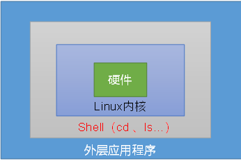

# Shell基础语法

### Shell概述

shell概述：
shell是一个命令行解释器，它接收应用程序、用户命令，然后调用操作系统内核

shell还是一个功能强大的编程语言，易编写，易调试，灵活性强



linux提供的shell解析器是：

```shell
cat /etc/shells
/bin/sh
/bin/bash
/sbin/nologin
/bin/dash
/bin/tcsh
/bin/csh

bash和sh关系：
sh -> bash

Centos默认的解析器是bash
echo $SHELL
:/bin/bash
```

### Shell入门

1.脚本格式
脚本以

```shell
#!/bin/bash开头（指定解析器）
创建一个shell脚本：helloworld
touch helloworld.sh
vim helloworld.sh
#!/bin/bash
echo "helloworld"
```

2.脚本的常用执行方式
第一种：采用bash或sh+脚本的象对路径或绝对路径（不用赋予脚本+x权限）
sh+脚本的相对对路径
在脚本上一层

```sh
sh helloworld.sh
helloworld

sh+较脚本的绝对路径
sh /home/dsjprs/shell/helloworld.sh
helloworld

bash+脚本的相对路径
bash helloworld.sh
helloworld

bash+脚本的绝对路径
bash /home/dsjpr/shell/helloworld
helloworld
```

第二种：采用输入脚本的绝对路径或脚本的相对路径执行脚本（必须具有可执行权限）
1.首先要赋予helloworld.sh脚本的+x权限

```shell
chmod 777 helloworld.sh
相对路径
./helloworld.sh
helloworld
绝对路径
/home/dsjprs/shell/helloworld
helloworld
```

注意：

第一种执行的方法。本质是bash解析器帮助执行脚本，所以本身不需要执行权限。
	   

第二种执行方法，本质是脚本需要自己执行，所以需要执行权限

shell脚本命令编写：多命令进行处理

```shell
在/home/dsjprs/shell目录下创建banzhang.txt在banzhang.txt文件中添加”i love cls“
touch banzhang.sh
vim banzhang.sh
#!/bin/bash
cd /home/dsjprs/shell

touch cls.txt
echo "i love cls" >> cls.txt
```

### Shell变量

shell中的变量：
系统变量
1.常用的系统变量

```shell
$HOME
$PWD
$SHELL
$USER
```

2.实操
查看系统变量

```shell
echo $HOME
/home/dsjprs

显示当前shell中所以变量
set
BASH=/bin/bash
BASH_ALIASES=()
BASH_ARGC=()
BASH_ARGV=()
```

自定义变量
1.基本语法：
定义变量： 变量=值
撤销变量：unset 变量
声明静态变量：readonly 变量,注意，不能unset

2.变量定义规则
变量名称可以由字母，数字和下划线组成，但是不能以数字开头，环境变量名建议大写
等号两侧不能有空格
在bash中，变量默认类型都是字符串类型，无法直接进行数值运算
变量的值如果有空格，需要使用双引号或单引号括起来

实操：

```shell
1.定义变量A
A=4
echo $A
4

2.给变量A重新赋值
A=5
echo $A
5

3.撤销变量
unset A
echo $A

4.声明静态变量B=2，不能unset
readonly B=2
echo $B
2

5.在bash中，变量默认类型都是字符串，无法直接进行数值运算
C=1+2
echo $C
1+2

6.变量的值如果有空格，需要使用双赢好或单引号进行括起来
D=I love cls
command not found

D="I love cls"
echo $D
I love cls

7.可把变量提升为全局环境变量，可供其他的shell程序使用
ecport 变量名
vim helloworld.sh
#!/bin/bash
echo "helloworld"
echo $B
./helloworld
helloworld
发现并没有打印输出变量B的值
export B
./helloworld.sh
helloworld
2
```

特殊变量：$n
1.基本语法
$n(功能描述：n为数字，$0代表该脚本名称，$1-$9代表第一个到第九个参数，十以上的参数，需要使用大     括号进行括起来，如${10} )

实操：

```shell
输出该脚本文件名称，输入参数1和参数2的值
touch parameter.sh
vim parameter.sh
#!/bin/bash
echo "$0 $1 $2"

chmod 777 parameter.sh
./parameter.sh cls banzhang

特俗变量：$#
1.基本语法
$# （功能描述：获取所以参数个数，常用于循环）
获取输入参数的个数
#!/bin/bash
echo "$0 $1 $2"
echo $#
chmod 777 parameter.sh
./parameter.sh cls banzhang
2


特殊变量：$*, $@
1.基本语法
$* （功能描述：这个变量代表命令行中所有的参数，$*把所有的参数看成一个整体）
$@ (功能描述：这个表里表示也代表命令行所有的参数，不过$@把每个参数区分对待)

实操：
打印输入的所有参数
vim parameter.sh

#!/bin/bash
echo "$0 $1 $2"
echo $#
echo $*
echo $@

bash parameter.sh 1 2 3
1 2 3 
1 2 3
```

特殊变量：$?
1.基本语法
$? (功能描述：最后一次执行的命令返回值状态，如果这个变量的值为0，证明上一次命令正确执行
如果这个变量的值非0，（具体那个数，由命令自己决定）则证明上一个命令执行不正确)

实操：

```shell
./helloworld.sh
helloworld

echo $?
0
```

### Shell运算符

运算符基本语法

```shell
1."$((运算式))" 或 "$[运算式]"
2.expr + - * / % 加减乘除 取余
注意：expr运算符要有空格

实操：
1.计算3+2的值
expr 2 + 3
5

2.计算3 - 2的值
expr 3 - 2
1

3.计算(2+3)*4的值
a.expr一步完成
expr `expr 2 + 3` \* 4

b采用$[运算式]方式
s=$[(2+3)*4]
```

### Shell条件判断

条件判断基本语法：
[condition] (注意: condition 前后要有空格)
注意：条件判断非空即为true,[dsjprs] 返回true, [] 返回flase

常用判断条件

```shell
1.两个整数之间比较
= 字符串比较
-lt 小于（less than）
-le 小于等于 （less equal）
-eq 等于 （equal）
-gt 大于 (greater than)
-ge 大于等于 （greater equal）
-ne 不等于 （not equal）

2.按照文件权限进行判断
-r 有读的权限（read）
-w 有写的权限 (write)
-x 有执行的权限 （exceute）

按照文件类型进行判断
-f 文件存在并且是一个常规文件 (file)
-d 文件存在并且是一个目录 (directory)
-e 文件存在 （existence）


实操：
1.23是否大于等于22
[ 23 -ge 22 ]
echo $?
0

2.helloworld.sh是否具有写权限
[ -w helloworld.sh ]
echo $?
0

3./home/dsjprs/cls.txt
[ -e /home/dsjprs/cls.txt ]
echo $?
0

4.多条件判断（&& 表示前一条命令执行成功时，才执行后一条命令
|| 表示上一条命令执行失败后，才执行下一条命令）

[ condition ] && echo ok || echo notok
ok

[ condition ] && [] || echo notok
notok
```

### Shell流程控制

```shell
1.if 条件判断
基本语法：
if [ 条件判断 ]；then
	程序
fi
或者
if [ 条件判断 ]
	then 
		程序
fi
```

注意事项：
1.[ 条件判断式 ],中括号和条件判断式之间必须有空格
2.if后要有空格

实操：
输入一个数字，如果是1，则输出banzhang zhen shuai,如果是2，则输出cls zhen mei ，如果是
其他，则什么都不输出

```shell
touch if.sh
vim if.sh

#!/bin/bash

if [ $1 -eq "1" ]
	then
		echo "banzhang zhen shuai"
elif [ $1 -eq "2" ]
	then 
		echo "cls zhen mei"
fi

chmod 777 if.sh
./if.sh 1
banzhang zhen shuai
```

case语句：
基本语法：

```shell
case $变量名 in 
"值")
	如果变量的值等于1，则执行程序1
"值2")
    	如果变量的值等于值2，则执行程序2
::
...省略其他分支...
*)
如果变量的值都不是以上的值，则执行此程序
esac
```

注意事项：
1.case尾巴=必须为单词 “in”，每一个模式匹配必须以右括号 “）”结束
2.双分号 “::”表示命令序列结束，相当于java中的break
3.最后“*）”表示默认模式，相当于java中的default

实操：
输入一个数字，如果是1，则输出banzhang,如果式2，则输出cls，如果是其他，则输出renyao

```shell
touch case.sh
vim case.sh

#!/bin/bash

case $1 in

"1")
	echo "banzhang"
"2")
	echo "cls"
;;
*)
	echo "renyo"
;;
esac
chmod 777 case.sh
./case.sh
```

for 循环：
基本语法：

```shell
for ((初始值； 循环条件； 变量变化))
	do 
		程序
	done
```

实操：
从1加到100

```shell
touch for1.sh
vim for1.sh

#!/bin/bash
s=0
for ((i=0;i<100;i++))
	do
		s=$[$s+$i]
	done
echo %s
chmod 777 for1.sh
./for1.sh
"5050"
```

基本语法2：

```shell
for 变量 in 值1 值2 值3...
	do
		程序
	done
```

实操：
打印所有输入的参数

```shell
touch for2.sh
vim for2.sh

#!/bin/bash
#打印数字
for i in $*
	do
		echo "ban zhang love $i"
	done
chmod 777 for2.sh
bash for2.sh cls xz bd
banzhang love cls
banzhang love xz
banzhang love bd

比较$*和$@区别
$*和$@都表示传递函数或脚本的所有参数，不被双引号""包含是=时，都以$1 $2 $3 $n
touch for.sh
vim for.sh

#!/bin/bash
for i in $*
	do 
		echo "banzhang love $i"
	done
for j in $@
	do 
		echo "banzhang love $j"
	done

bash for.sh cls xz bd
banzhang love cls
banzhang love xz
banzhang love bd
banzhang love cls
banzhang love xz
banzhang love bd
```

当他们都被双引号""包含时，"$*" 会将所有的参数作为一个整体，以“$1 $2...$n”
的形式输出所有的参数，“$@”会将各个参数分开，以“$1 $2...$n”的形式输出所有参数

```shell
vim for.sh

#!/bin/bash
for i in "$*"
#$*中的所有参数看作是一个整体，所以这个for循环只会循环一次
	do 
		echo "banzhang love $i"
	done

for j in "$@"
#%@中的每个参数都看成是一个独立的，所以"$@"中的几个参数，就会循环几次
	do
		echo "banzhang love $j"
	done
chommod 777 for.sh

bash for.sh cls xz bd
banzhang love cls xz bd
banzhang love cls
banzhang love xz
banzhang love bd
```

while循环:
基本语法：

```shell
while [条件判断式]
	do 
		程序
	done
```

实操：
从1加到100

```shell
touch while.sh
vim while.sh
#!/bin/bash
s=0
i=1
while [ $i -el 100 ]
	do
		s=$[$s+$i]
		i=$[$i+1]
	done
echo $s
chmod 777 while.sh
./while.sh
5050
```

### read读取控制台输入

read读取控制台输入
基本语法
read(选项)(参数)
选项：
-p:指定读取时的提示符
-t:指定读取值时等待的时间（秒）

参数
	变量：指定读取值的变量名

实操：
提示7秒内，读取控制台输入的名称

```sh
touch read.sh
vim read.sh

#!/bin/bash
read -t 7 "enter your name in 7 seconds" NAME
echo $NAME

./read.sh
enter your name in 7 seconds xiaozhang
xiaozhang
```

函数：
系统函数：
basename基本语法：
basename [string/pathname] [suffix]
(功能描述：basename 命令会删掉所以的前缀包括最后一个（’/‘）字符，然后字符串显示出来)
选项：
	suffix为后缀，如果suffix被指定，basename会将pathname或string中的suffix去掉

实操：

```sh
截取/home/dsjprs/banzhang.txt路径的文件名称
baename /home/dsjprs/banzhang.txt
banzhang.txt
baename /home/dsjprs/banzhang.txt .txt
banzhang
```

dirname基本语法：
dirname文件绝对路径
（功能描述：从给定的包含的绝对路径的文件名去掉文件名(非目录的部分)，然后返回剩下的路径
（目录的部分））
实操：

```shell
获取banzhang.txt 文件的路径
diename /home/dsjprs/banzhang.txt
/home/dsjprs

自定义函数：
基本语法
[function] funname[()]
{
	Action;
	[return int;]
}
funname
```

经验技巧：
不许在调用函数地方之前，先声明函数，shell脚本是逐行执行，不像其他语言一样先编译
函数返回值，只能通过$?系统变量获得，可以显示加，return返回，如果不加，将以最后一条命令运行
结果，作为返回值，return后跟数值n（0-255）
实操：

```shell
touch fun.sh
vim fun.sh
#!/bin/bash
function sum()
{
	s=0
	s=$[ $1 + $2 ]
	echo "$s"
}
read -p "plase input the number1:" n1;
read -p "plase input the number2:" n2;
sum $n1 $n2
chmod 777 fun.sh
./fun.sh
plase input the number1: 2
plase inout the number2: 5
7
```

### Shell工具（重点）

shell工具（重点）
cut 的工作就是“剪”，具体的说就是在文件中负责剪切数据用的。
cut命令从文件的每一行切字节，字符和字段并将这些字节和字符和字段输出

基本语法：
cut [选项参数] filename
说明：默认分隔符是制表符

选项参数说明：
-f: 序列号，提取第几列
-d: 分隔符，按照指定分隔符分割列

实操：

```sh
touch cut.txt
vim cut.txt
dong sheng
guan zheng
wo  wo
lai  lai
le le
```

切割cut.txt第一列

```shell
cut -d " " -f 1 cut.txt
dong
guan
wo 
lai
le
```

切割cut.txt第二，第三列

```sh
cut -d " " -f 2, 3 cut.txt
shen
zhen
wo
lai
le
```

在cut.txt文件中切割guan

```sh
cat cut.txt | grep "guan" | cut -d " " -f 1
guan
```

选取系统PATH 变量值，第二个“：”开始后的所以路径

```sh
echo $PATH
/usr/lib64/qt-3.3/bin:/usr/local/bin:/bin:/usr/bin:/usr/local/sbin:/usr/sbin:/sbin:/home/dsjprs/bin

echo $PATH | cut -d: -f 2-
/usr/local/bin:/bin:/usr/bin:/usr/local/sbin:/usr/sbin:/sbin:/home/dsjprs/bin
```


切割ifconfig 后打印的IP地址

```````sh
sed
sed是一种流编辑器，它一次处理一行内容，处理时，把当前处理的行存储在临时缓冲区
称为（“模式空间”）接着sed命令处理缓冲区中的内容，处理后，把缓冲区的内容送往屏幕
接着处理下一行，这样不断重复，直到文件末尾。
文件内容并没有改变，除非你使用重定向存储输出

基本语法：
sed [选项参数] “command” filename

选项参数说明：
-e: 直接在指令列模式上进行sed的动作编辑

命令功能的描述
a 新增，a的后面可以接字串，在下一行出现
d 删除
s 查找并替换

实操：
数据准备：
touch sed.txt
vim sed.txt
dong shen
guan zhen
wo wo
lai lai
le le

1.将"mei nv"这个单词插入到sed.txt第二行，打印
sed '2a mei nv ' sed.txt
dong shen
guan zhen
mei nv
wo wo
lai lai
le le

cat sed.txt
dong shen
guan zhen
mei nv
wo wo
lai lai
le le
注意：文件并没有改变
    
2.删除sed.txt文件包含的wo的行
sed '/wo/d' sed.txt
dong shen
guan zhen
mei nv

lai lai
le le

3.将sed文件中的wo替换为ni
sed 's/wo/ni/g' sed.txt
dong shen
guan zhen
ni ni
lai lai
le le

注意：'g' 表示global，全部替换

4.将sed.txt文件中的第二行删除并将wo替换为ni
sed -e '2d' -e 's/wo/ni/g' sed.txt
dong shen
ni ni
lai lai
le le

awk
一个强大的文件分析工具，将文件逐行的读入，以空格为默认的分隔符，将分隔符每行切片，切开的部     分再进行分析处理
基本语法：
awk [选项参数] 'pattern1{action1} pattern2{action2}...' filename
pattern:表示 AWK 在数据中查找的内容，就是匹配模式
action:在查找匹配内容时所执行的一系列命令

选项参数说明
-F: 指定输入文件折分隔符
-v: 赋值一个用户自定义变量

实操：
数据准备：
sudo cp /etc/passwd ./
搜索pwasswd文件以root关键字开头的所有行，并输出该行的第7列
awk -F:'^/root/{print $7} passwd'
/bin/bash

搜索passwd文件以root关键字开头的所有行，并输出该行的第1列和第7列中间以":"号分割
awk -F:'^/BEGIN{print "user, shell"} {print $1 "," $7} END{print "dahaige, /
bin/zuishuai"}' passwd
 user, shell
bin./sbin/nologin
dsjprs,/bin/bash
dsjprs,/bin/zuishuai
注意：BEGIN所在数据读取行之前执行，END在所在数据执行之后执行

将passwd文件中的用户id增加数值1并输出
awk -v i=1 -F: '{print $3+i}' passwd
1
2
3
4

awk的内置变量
FILENAME 文件名
NR 已读的记录数
NF 浏览记录的域的个数（切割后，列的个数）

实操：
统计passwd文件名，每行的行号，每行的列数
awk -F: '{print "filename:" FILENAME",linenumber:" NR",columns:" NF}' passwd
filename:passwd,linenumber:1, columns:7
filename:passwd, linenumber:2, columns:7
filename:passwd, linenumber:3, colmuns:7

切割ip
ifconfig eth0 | grep "inet addr" | awk -F: "{print $2}" | awd -F " " '{print $1}'
192.168.244.121

查询sed.txt中空行所在的行号
awk '/^$/{print NR}' sed.txt

sort
sort命令是在Linux里非常有用，它将文件进行排序，并将排序结果标准输出

基本语法：
sort（选项）（参数）
-n:依照数值的大小排序
-r: 以相反的顺序排序
-t: 设置排序时所用的分隔符
-k: 指定需要排序的列
参数：指定待排序的列

实操：
数据准备：
touch sort.sh
vim sort.sh
bb:40:5.4
bd:20:3.5
cls:10:3.5
xz:50:2.3
ss:30:1.6
按照 ":"分割后的第三列倒序排序
sort -t " -nrk 3 sort.sh
bb:40:5.4
bd:20:4.2
cls:10:3.5
xz:50:2.3
ss:30:1.6
```````

### 面试题

京东：
使用linux命令查询flie1中空格所在的行号

```shell
awk '/^$/{print NR}' sed.txt
```

有文件chengji.txt内容如下：
张三 40
李四 50
王五 60
使用linux命令计算第二列的和并输出

```shell
cat chengji.txt | awk -F " " '{sum+=$2} END{print sum}'
```

搜狐 & 和迅网
shell脚本里如何检查一个文件是否存在？如果不存在该如何处理？

```shell
#!/bin/bash
if [ -f file.txt]; then
	echo "文件存在！"
else
	echo "文件不存在！"
fi
```

新浪：
使用shell写一个脚本，对文本无序的一列数字进行排序

```shell
cat test.txt
2
3
4
1
6
7
9
8
sort -n test.txt | awk '{a+=$0; print $0} END "SUM="a'
1
2
3
4
5
6
7
8
9
```

金和网络：
请用shell脚本写出查找当前文件夹（/home）下所有的文本文件内容包含有字符 "shen"的文件名称

```shell
grep -r "shen" /home | cut -d ":" -f 1
/home/dsjprs/shell/sed.txt
/home/dsjprs/shell/cut/txt
```